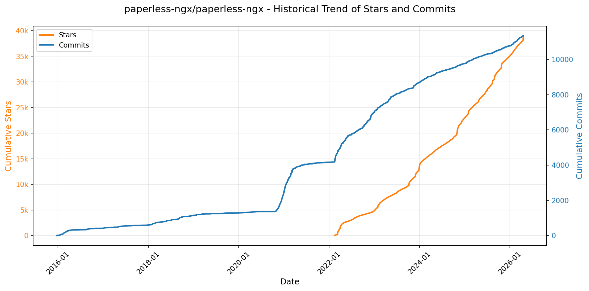
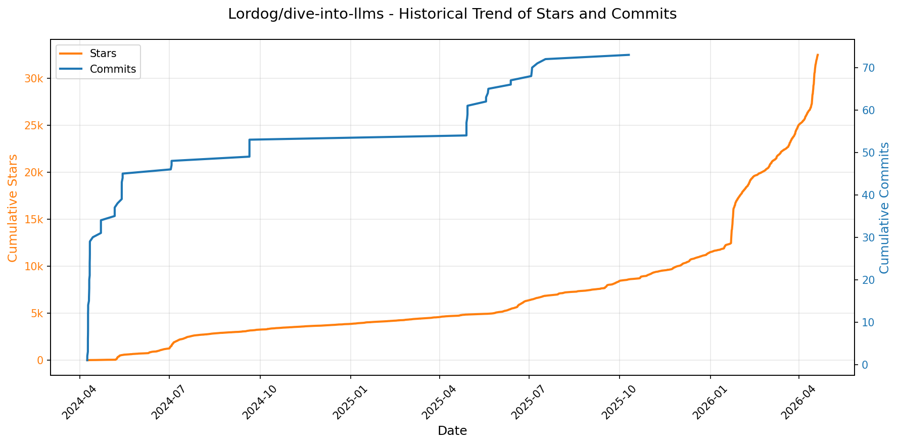
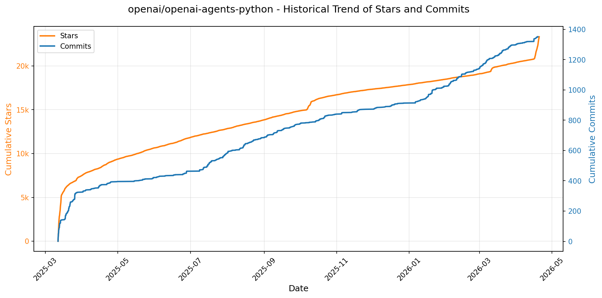
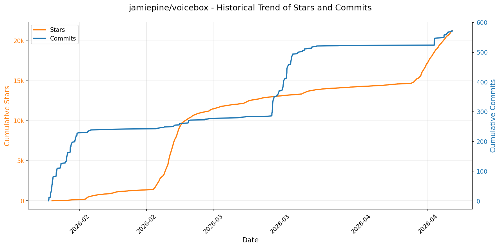
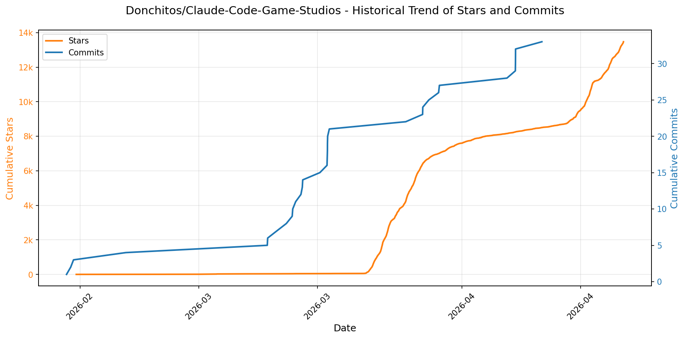
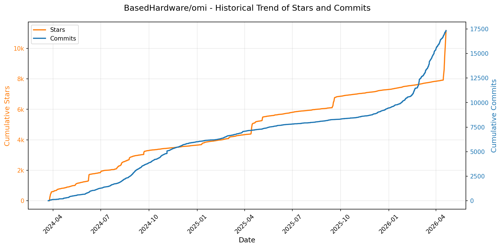
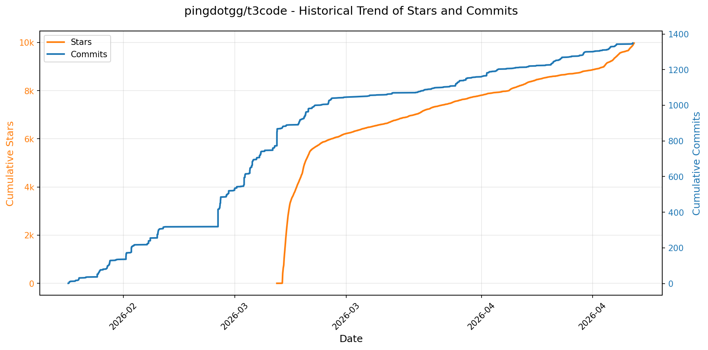
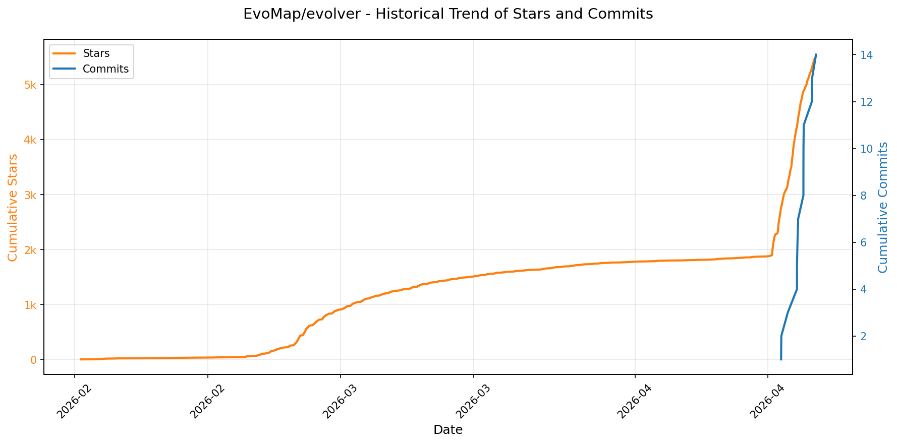
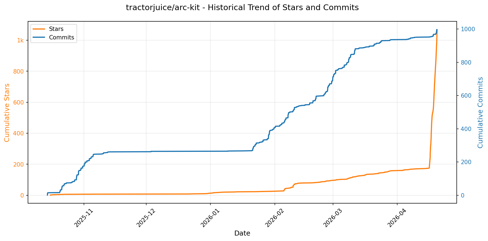

# 🌟 GitHub Trending 概览

> 数据更新于：2026-04-20

---

## 🔍 项目详情

### 1. [obra/superpowers](https://github.com/obra/superpowers)
- 📅 **创建日期**：2025-10-09  
- 🔄 **最近更新**：2026-04-20  
- ⭐ **Stars**：190,135（日 +1199｜周 +11701｜月 +59501）  
- 📝 **描述**：An agentic skills framework & software development methodology that works.  

<b>📈 Star 与 Commit 历史趋势</b>

> *蓝色：累计 Stars｜橙色：累计 Commits（次 Y 轴）*

<b>📄 README 摘要</b>

1. **该项目做什么？**  
Superpowers 是一个面向编程智能体（coding agents）的完整软件开发方法论框架，旨在将传统工程实践系统化、自动化地嵌入 AI 编程流程中。它不直接生成代码，而是通过一系列预定义、可组合的“技能”（skills），引导智能体在编码前先进行需求澄清、设计评审、计划拆解，并严格遵循 TDD、YAGNI 和 DRY 等工程原则执行任务。其核心目标是让 AI 编程过程具备人类团队级的工程纪律性——从头脑风暴、分支隔离、细粒度任务规划，到子智能体协同开发、双阶段代码审查、测试先行实施及开发分支收尾，全程强制执行结构化工作流，而非自由式代码生成。

2. **关键特性**  
- **全流程强制工程工作流**：涵盖 7 个自动触发的阶段（头脑风暴 → Git 工作树隔离 → 计划编写 → 子智能体驱动开发 → 测试驱动开发 → 任务间代码审查 → 分支收尾），每个阶段对应明确技能，不可跳过；  
- **子智能体驱动开发（Subagent-Driven Development）**：为每个 2–5 分钟粒度的任务动态派生独立子智能体，执行两阶段审查（先验：是否符合规格；后验：代码质量与规范），支持长达数小时无人干预的自主迭代；  
- **深度集成工程实践**：原生内建 TDD（RED-GREEN-REFACTOR）、系统化调试（四阶段根因分析）、Socratic 式设计研讨、Git 工作树隔离、PR/合并决策流程等；  
- **技能可组合与自生长**：提供 `writing-skills` 技能，支持开发者按统一范式创建、测试和复用新技能，确保跨平台兼容性；  
- **多平台即插即用**：原生适配 Claude（官方市场 & Superpowers 市场）、OpenAI Codex（CLI/App）、Cursor、OpenCode、GitHub Copilot CLI、Gemini CLI 等主流 AI 编程环境，安装方式标准化且文档完备。

3. **技术栈**  
- **运行时环境**：非独立应用，而是以「插件/扩展」形式深度集成于各类 AI 编程代理平台（如 Claude、Codex、Cursor、Copilot、Gemini 等），依赖宿主平台的 LLM 推理与工具调用能力；  
- **核心架构**：基于「技能（Skill）」的声明式行为系统——每个技能为结构化 Markdown 文档（如 `skills/test-driven-development/SKILL.md`），含目标、触发条件、执行步骤、检查清单与反模式指南，由智能体运行时按需加载与编排；  
- **工程协议层**：内置 Git 操作抽象（工作树管理）、测试执行钩子、文件路径精准定位、验证步骤自动化等轻量基础设施，确保技能跨平台行为一致；  
- **开发与维护工具链**：采用 Git 分支策略（`dev` 主开发分支）、标准化 PR 模板、`.opencode/INSTALL.md` 等平台适配配置，配合 Discord 社区与 GitHub Issues 协作治理；  
- **许可证**：MIT 开源协议，强调开放使用与社区共建（但技能贡献需严格遵循跨平台兼容性要求）。

---

### 2. [affaan-m/everything-claude-code](https://github.com/affaan-m/everything-claude-code)
- 📅 **创建日期**：2026-01-18  
- 🔄 **最近更新**：2026-04-20  
- ⭐ **Stars**：155,408（日 +723｜周 +8505｜月 +64808）  
- 📝 **描述**：The agent harness performance optimization system. Skills, instincts, memory, security, and research-first development for Claude Code, Codex, Opencode, Cursor and beyond.  

<b>📈 Star 与 Commit 历史趋势</b>

> *蓝色：累计 Stars｜橙色：累计 Commits（次 Y 轴）*

<b>📄 README 摘要</b>

1. **项目功能**  
该项目是一个面向AI代理（AI Agent）运行时环境的**全栈式性能优化与工程化系统**，专为Claude Code、Codex、Cursor、OpenCode、Gemini等主流AI代理框架（Agent Harness）设计。它并非简单的配置集合，而是提供生产级可用的完整能力体系：支持多语言（12+生态）、多代理协同、技能自动化演进、记忆持久化、安全扫描（含AgentShield集成）、模型路由、跨平台部署（Windows/macOS/Linux）及企业级运维（如成本审计、工作流编排）。核心目标是将AI代理从“实验性脚本”升级为可维护、可扩展、可审计、可安全落地的软件系统。

2. **关键特性**  
- **全生命周期代理管理**：内置38+专用子代理（如`planner.md`、`security-reviewer.md`、`cpp-build-resolver.md`），覆盖规划、架构、TDD、代码审查、漏洞分析、端到端测试、重构、文档同步等全流程；  
- **智能技能系统**：156+可复用技能（Skills），支持自动模式提取、信心评分、导入/导出与持续进化（Continuous Learning v2），含领域专项技能（如`pytorch-patterns`、`swift-actor-persistence`、`investor-materials`）；  
- **深度性能优化**：Token精简、内存自动持久化（Hooks自动保存/加载上下文）、并行化（Git worktrees、cascade方法）、NanoClaw v2会话管理（分支/搜索/压缩/指标）、Harness审计与确定性评分；  
- **企业级安全与合规**：内置AgentShield安全扫描（102条规则、1282项测试）、沙箱加固、输入净化、CVE防护、攻击面分析，以及独立《Agentic Security指南》；  
- **跨平台/跨框架统一支持**：原生兼容Claude Code、Codex（App+CLI）、Cursor、OpenCode、Antigravity、Gemini等，提供统一安装管道（Manifest驱动）、多目标部署（`--target cursor`/`--target gemini`）及一致行为；  
- **现代化工程基础设施**：SQLite状态存储、交互式安装向导（`configure-ecc`）、PM2多服务编排（`/multi-*`命令）、ECC 2.0 Rust控制平面Alpha版（`ecc2/`）、桌面GUI仪表盘（Tkinter，支持暗色/亮色主题、字体定制）、GitHub Marketplace应用（免费/专业/企业版）；  
- **开发者体验增强**：多语言规则分层架构（`common/` + `typescript/` + `python/`等）、选择性安装（按需安装语言组件）、Hook运行时动态调控（`ECC_HOOK_PROFILE`/`ECC_DISABLED_HOOKS`）、完备CI测试（997+通过用例）、社区驱动翻译（中/日/韩/葡/土/繁体等）。

3. **技术栈**  
- **核心语言**：TypeScript（主逻辑、CLI工具、Dashboard前端）、Python（`ecc_dashboard.py`、部分技能与安全模块）、Go（构建工具链与部分代理）、Java/Kotlin/Perl/PHP/C++/Rust（规则与代理支持的语言生态）；  
- **运行时与框架**：Node.js（所有Hooks与脚本重写以保证跨平台兼容性）、Rust（ECC 2.0控制平面原型）、Shell/Bash（安装脚本与系统集成）；  
- **基础设施**：SQLite（本地状态存储）、Tkinter（桌面GUI）、Manim/Remotion（技术视频生成）、NestJS（框架模式扩展）、Biome（代码质量钩子优化）；  
- **包管理与部署**：npm/pnpm/yarn/bun（自动检测与适配）、GitHub Marketplace App、npm包（`ecc-universal`、`ecc-agentshield`）、PowerShell（Windows安装支持）；  
- **协议与标准**：MCP（Model Context Protocol）配置、AGENTS.md规范、Markdown驱动的代理/技能定义、Frontmatter结构化本能（Instinct）定义。

---

### 3. [microsoft/markitdown](https://github.com/microsoft/markitdown)
- 📅 **创建日期**：2024-11-13  
- 🔄 **最近更新**：2026-04-20  
- ⭐ **Stars**：113,141（日 +667｜周 +7492｜月 +21958）  
- 📝 **描述**：Python tool for converting files and office documents to Markdown.  

<b>📈 Star 与 Commit 历史趋势</b>

> *蓝色：累计 Stars｜橙色：累计 Commits（次 Y 轴）*

<b>📄 README 摘要</b>

1. **项目功能**  
MarkItDown 是一个轻量级 Python 工具，专为将多种格式的文件（如 PDF、Word、PPTX、Excel、HTML、图像、音频、YouTube 视频、EPUB、ZIP 等）**高保真地转换为结构化 Markdown 文本**而设计，核心目标是服务于大语言模型（LLM）及下游文本分析流水线。它不追求面向人类的排版美观性，而是优先保留语义结构（如标题层级、列表、表格、超链接、代码块等），确保输出对 LLM 友好、可解析且 token 高效。其设计哲学强调“LLM 原生适配”——因主流模型（如 GPT-4o）在训练中大量接触 Markdown，能天然理解并生成该格式。

2. **关键特性**  
- **多格式统一转换**：原生支持 10+ 种主流文档与媒体格式，包括办公套件（.docx/.pptx/.xlsx）、PDF、HTML、纯文本类（CSV/JSON/XML）、归档（ZIP）、富媒体（图像 EXIF + OCR、音频元数据 + 转录、YouTube 字幕）及 EPUB。  
- **模块化依赖管理**：通过 `pip install 'markitdown[feature]'` 按需安装格式支持（如 `[pdf]`、`[audio-transcription]`），避免冗余依赖；`[all]` 提供向后兼容的全功能安装。  
- **插件扩展生态**：支持第三方插件（如 `markitdown-ocr`），通过 LLM Vision（如 GPT-4o）对嵌入图像进行 OCR 或内容描述，无需额外 ML 库；插件可按需启用/禁用。  
- **Azure Document Intelligence 集成**：提供企业级文档智能服务（如布局识别、表格提取）的无缝对接能力，支持命令行与 Python API 调用。  
- **流式处理与零临时文件**：`convert_stream()` 接口强制使用二进制流（如 `io.BytesIO`），彻底摒弃临时文件，提升安全性与性能；`DocumentConverter` 类全面重构为流式接口。  
- **MCP 协议支持**：提供 Model Context Protocol（MCP）服务器（见 `markitdown-mcp` 子包），便于与 Claude Desktop 等 LLM 应用深度集成。  
- **跨平台易用性**：提供 CLI 命令行工具（支持管道输入）、Python API、Docker 镜像及完整测试/贡献指南。

3. **技术栈**  
- **语言与运行时**：Python 3.10+（强制要求）。  
- **核心依赖**：`pypdf`（PDF）、`python-pptx`/`python-docx`/`openpyxl`（Office 文档）、`beautifulsoup4`（HTML）、`Pillow`（图像处理）、`ffmpeg-python`（音视频元数据）、`yt-dlp`（YouTube 解析）等。  
- **可选增强组件**：  
  - OCR 与视觉理解：通过 `markitdown-ocr` 插件调用 OpenAI 兼容 LLM（如 `gpt-4o`）实现；  
  - 语音转文字：依赖 `whisper` 或 `openai-whisper`（`[audio-transcription]`）；  
  - Azure AI 服务：`azure-ai-documentintelligence`（`[az-doc-intel]`）；  
  - YouTube 字幕：`youtube-transcript-api`（`[youtube-transcription]`）。  
- **开发与工程化**：`hatch`（构建/测试）、`pre-commit`（代码规范）、Docker（容器化）、GitHub Actions（CI/CD）、MCP 协议（模型上下文交互标准）。

---

### 4. [thedotmack/claude-mem](https://github.com/thedotmack/claude-mem)
- 📅 **创建日期**：2025-08-31  
- 🔄 **最近更新**：2026-04-20  
- ⭐ **Stars**：64,390（日 +942｜周 +13087｜月 +25162）  
- 📝 **描述**：A Claude Code plugin that automatically captures everything Claude does during your coding sessions, compresses it with AI (using Claude's agent-sdk), and injects relevant context back into future sessions.  

<b>📈 Star 与 Commit 历史趋势</b>

> *蓝色：累计 Stars｜橙色：累计 Commits（次 Y 轴）*

<b>📄 README 摘要</b>

1. **项目功能**  
Claude-Mem 是一个专为 **Claude Code**（Anthropic 官方 AI 编程助手）设计的**持久化记忆压缩系统**，核心目标是实现跨会话的上下文连续性。它在用户使用 Claude Code 过程中自动捕获工具调用、代码操作、对话交互等行为（称为“observations”），生成语义化摘要，并持久化存储；当新会话启动时，自动将相关历史记忆以高效、可控的方式注入上下文，使 Claude 能“记住”项目进展、技术决策和问题解决路径，彻底消除传统会话间信息断层。

2. **关键特性**  
- **持久化记忆（Persistent Memory）**：会话结束后记忆不丢失，支持长期项目知识沉淀；  
- **渐进式披露（Progressive Disclosure）**：分三层检索（索引→时间线→详情），实时显示 Token 消耗，实现约 **10 倍 Token 节省**；  
- **技能化搜索（Skill-Based Search）**：内置 `mem-search` 技能与 4 个 MCP 工具（`search`/`timeline`/`get_observations` 等），支持自然语言查询项目历史；  
- **本地 Web 查看器（Web Viewer UI）**：运行于 `http://localhost:37777`，提供实时记忆流、全文检索、观察详情查看及 ID 引用（如 `/api/observation/{id}`）；  
- **多端集成能力**：原生支持 Claude Code 插件、Gemini CLI、OpenCode，并可通过 OpenClaw 网关一键部署（含 Telegram/Discord/Slack 实时通知）；  
- **隐私控制机制**：支持 `<private>` 标签标记敏感内容，自动排除存储；  
- **细粒度上下文配置**：通过 `settings.json` 精确控制注入范围、AI 模型、端口、日志级别等；  
- **多语言 & 多模式支持**：内置 `code--zh`（简体中文）、`code--ja` 等 30+ 语言模式，且支持不同工作流模式（如 `chill`/`investigation`）；  
- **实验性功能通道（Beta Channel）**：提供 Endless Mode（仿生长时记忆架构）等前沿功能；  
- **全自动无感运行**：无需手动触发，依赖生命周期钩子（SessionStart/PostToolUse/SessionEnd 等）静默工作。

3. **技术栈**  
- **运行时**：Node.js ≥18.0.0（主逻辑）、Bun（Worker 服务管理与 HTTP API）、uv（Python 包管理器，用于向量搜索依赖）；  
- **数据库**：SQLite3（嵌入式，含 FTS5 全文搜索） + Chroma（向量数据库，实现混合语义+关键词搜索）；  
- **架构核心**：基于 **Claude Agent SDK** 构建，采用 **MCP（Model Context Protocol）标准工具接口**，集成 6 个生命周期钩子脚本与智能安装预检机制；  
- **前端界面**：轻量级 Web UI（Bun 驱动），提供实时流式内存视图与搜索交互；  
- **开发与构建**：TypeScript（主力语言）、npm/npx（安装与分发）、GitHub Actions（CI/CD）；  
- **协议与许可**：核心代码采用 **AGPL-3.0 开源协议**，`ragtime/` 子模块使用 PolyForm Noncommercial License。

---

### 5. [bytedance/deer-flow](https://github.com/bytedance/deer-flow)
- 📅 **创建日期**：2025-05-07  
- 🔄 **最近更新**：2026-04-20  
- ⭐ **Stars**：63,167（日 +202｜周 +1983｜月 +31176）  
- 📝 **描述**：An open-source long-horizon SuperAgent harness that researches, codes, and creates. With the help of sandboxes, memories, tools, skill, subagents and message gateway, it handles different levels of tasks that could take minutes to hours.  

<b>📈 Star 与 Commit 历史趋势</b>

> *蓝色：累计 Stars｜橙色：累计 Commits（次 Y 轴）*

<b>📄 README 摘要</b>

1. **该项目的功能**  
DeerFlow 2.0 是一个开源的「超级智能体（Super Agent）运行框架」，核心目标是**协调子智能体（Sub-Agents）、长期记忆（Long-Term Memory）与安全沙箱（Sandbox）环境**，构建可自主执行复杂任务的端到端研究与开发工作流。它不局限于单一任务（如问答或代码生成），而是支持「深度探索式研究」（Deep Exploration and Efficient Research Flow）——例如自动完成多步信息检索、跨源数据整合、代码实验验证、报告生成、多轮推理规划等。其本质是一个可扩展、可编排、生产就绪的智能体基础设施（Agent Harness），使开发者能快速构建具备记忆、工具调用、协作与安全执行能力的AI系统。

2. **关键特性**  
- **模块化技能与工具生态**：支持通过 YAML 配置灵活接入各类 LLM 模型（OpenAI、Claude、Qwen、vLLM、Codex CLI、Claude Code OAuth 等），并原生集成 InfoQuest（字节自研智能搜索与爬虫工具集），提供免费在线体验；  
- **分层子智能体架构**：支持主智能体（Lead Agent）动态调度专用子智能体（如 research-agent、code-agent、report-agent），实现任务分解与协同；  
- **多模式沙箱执行环境**：提供本地执行、Docker 容器隔离、Kubernetes Pod（通过 Provisioner 服务）三种沙箱模式，保障代码/脚本运行的安全性与可复现性；  
- **上下文工程与长时记忆**：内置结构化记忆管理（支持向量+图谱混合存储），支持会话级上下文注入、思考链（Thinking/Reasoning）控制、计划模式（Plan Mode）及上下文感知的工具调用；  
- **企业级部署与集成能力**：  
  - 支持 MCP（Model Context Protocol）服务器对接，扩展外部能力；  
  - 内置多 IM 渠道接入（Telegram、Slack、飞书、企业微信、微信、iLink），支持零公网 IP 部署；  
  - 提供 Gateway 模式（嵌入式 LangGraph 运行时），降低资源开销与冷启动延迟，免除 LangGraph Platform 商业授权依赖；  
  - 支持 LangSmith/Langfuse 全链路可观测性追踪。

3. **技术栈**  
- **后端**：Python 3.12+，基于 LangChain / LangGraph 构建智能体编排核心，采用 `uv` 作为包管理与构建工具；模型适配层支持 `langchain_openai`、自研 `vllm_provider`、`openai_codex_provider`、`claude_provider` 等；内存与配置系统基于 YAML + `.env`；  
- **前端**：Node.js 22+，使用现代 Web 技术栈（未明确框架名，但含 Nginx 反向代理与热重载开发流）；  
- **部署与运维**：Docker（主力推荐）、Docker Compose、Kubernetes（沙箱扩展场景）；支持 Linux（生产首选）、macOS/Windows（开发评估）；  
- **基础设施协议**：深度集成 LangGraph 平台（标准模式）、MCP 协议（能力扩展）、REST/SSE/WebSocket（IM 通道与 MCP 通信）；  
- **第三方服务依赖**：Tavily（网络搜索）、InfoQuest（字节自研搜索）、OpenRouter、Responses API、VolcEngine Coding Plan（模型服务生态）。

---

### 6. [forrestchang/andrej-karpathy-skills](https://github.com/forrestchang/andrej-karpathy-skills)
- 📅 **创建日期**：2026-01-27  
- 🔄 **最近更新**：2026-04-20  
- ⭐ **Stars**：61,975（日 +3419｜周 +44204｜月 +54608）  
- 📝 **描述**：A single CLAUDE.md file to improve Claude Code behavior, derived from Andrej Karpathy's observations on LLM coding pitfalls.  

<b>📈 Star 与 Commit 历史趋势</b>

> *蓝色：累计 Stars｜橙色：累计 Commits（次 Y 轴）*

<b>📄 README 摘要</b>

1. **该项目的作用**  
该项目提供一份轻量、可即插即用的 `CLAUDE.md` 指南文件，专为优化 Claude Code（及兼容 LLM 编程助手，如 Cursor）在代码生成与编辑任务中的行为而设计。它不开发新工具或运行时系统，而是通过结构化原则直接干预大模型的推理与执行流程，显著降低因模型盲目假设、过度工程、非目标性修改和目标模糊导致的低质量输出，从而提升代码变更的准确性、简洁性与可维护性。

2. **核心功能**  
- **四大可执行原则**：以清晰、操作性强的规则替代模糊提示，覆盖完整编码闭环：  
  • *Think Before Coding*：强制显式声明假设、列举歧义选项、主动质疑不合理需求、遇困惑即暂停并请求澄清；  
  • *Simplicity First*：严格限制范围——零未请求功能、零单次使用抽象、零臆测性错误处理，以“资深工程师是否认为过重”为简化判据；  
  • *Surgical Changes*：实施最小侵入式编辑——仅修改直接受任务影响的代码行，禁止格式/注释/邻近逻辑的“顺手优化”，仅清理自身引入的冗余（如废弃 import），并明确标注发现但未处理的遗留问题；  
  • *Goal-Driven Execution*：将模糊指令（如“修复 bug”）强制转化为可验证目标（如“编写复现测试 → 使测试通过”），支持多步计划+每步验证闭环，赋能模型自主迭代直至达标。  
- **多平台无缝集成**：原生支持 Claude Code 插件市场一键安装，也支持手动嵌入 `CLAUDE.md` 到任意项目；同时预置 Cursor 专用规则文件（`.cursor/rules/karpathy-guidelines.mdc`），实现跨 IDE 行为一致性。  
- **渐进式可扩展性**：允许与项目特有规范（如 TypeScript 严格模式、API 测试覆盖率要求）共存并叠加，不破坏现有工作流。

3. **技术栈**  
- **核心载体**：纯文本 Markdown（`CLAUDE.md`），无代码依赖，零构建/运行时开销；  
- **集成层**：  
  • Claude Code 插件生态（基于其 Skills/Plugin 架构）；  
  • Cursor IDE 规则系统（`.cursor/rules/*.mdc` 格式）；  
- **交付形式**：GitHub 仓库托管静态资源（README、CLAUDE.md、CURSOR.md、规则文件等），通过 `curl` 或插件命令分发；  
- **无后端/前端/框架**：非软件应用，不涉及任何编程语言、框架、API 或服务部署，纯粹是面向 LLM 的提示工程（Prompt Engineering）实践方案。

---

### 7. [virattt/ai-hedge-fund](https://github.com/virattt/ai-hedge-fund)
- 📅 **创建日期**：2024-11-29  
- 🔄 **最近更新**：2026-04-20  
- ⭐ **Stars**：56,826（日 +235｜周 +4175｜月 +7201）  
- 📝 **描述**：An AI Hedge Fund Team  

<b>📈 Star 与 Commit 历史趋势</b>

> *蓝色：累计 Stars｜橙色：累计 Commits（次 Y 轴）*

<b>📄 README 摘要</b>

1. **该项目做什么？**  
该项目是一个**纯教育性质的AI对冲基金概念验证系统**，旨在模拟多智能体协同的量化投资决策流程。它不执行真实交易，也不连接任何交易所或资金账户，仅通过分析股票基本面、技术面、市场情绪及风险指标，由19个不同投资哲学的AI代理（代表Damodaran、Buffett、Taleb等知名投资者及专业分析模块）独立生成信号，再经风险管理和组合管理模块整合，最终输出模拟交易建议与回测结果。

2. **核心功能**  
- **多流派投资代理协同架构**：集成14位顶级投资大师（如巴菲特、芒格、塔勒布、木头姐等）的AI化身，各自基于其标志性策略（价值、成长、逆向、宏观、尾部风险等）独立分析标的；  
- **四维分析引擎**：内置估值代理（内在价值计算）、基本面代理（财务数据深度解析）、技术面代理（指标信号生成）、情绪代理（市场情绪研判）四大专业分析模块；  
- **全流程风控与组合管理**：配备专职风险管理员（计算VaR、波动率、头寸限额等）和组合管理员（融合多源信号、权衡权重、生成最终买卖建议）；  
- **双模交互支持**：提供命令行接口（CLI）用于自动化/脚本化运行与回测，以及图形化Web应用（用户友好型界面）；  
- **灵活部署与本地化支持**：兼容OpenAI、Anthropic、Groq、DeepSeek等主流云LLM API，并支持通过Ollama运行本地大模型；  
- **可配置回测能力**：支持指定股票池、时间范围的离线策略回测，输出绩效指标与可视化结果。

3. **技术栈**  
- **编程语言**：Python（主框架、代理逻辑、回测引擎）；  
- **依赖管理**：Poetry；  
- **大语言模型接入**：OpenAI API（gpt-4o等）、Anthropic、Groq、DeepSeek 及 Ollama（本地LLM）；  
- **金融数据源**：Financial Datasets API（获取实时/历史行情与基本面数据）；  
- **环境管理**：`.env` 配置文件管理API密钥；  
- **前端（Web版）**：独立的 `app/` 目录（README中指向其专用文档，推测使用现代Web框架如Streamlit/FastAPI+React/Vue等，但未明确说明）；  
- **许可证**：MIT License。

---

### 8. [ruvnet/RuView](https://github.com/ruvnet/RuView)
- 📅 **创建日期**：2025-06-07  
- 🔄 **最近更新**：2026-04-20  
- ⭐ **Stars**：48,677（日 +552｜周 +1195｜月 +9413）  
- 📝 **描述**：π RuView: WiFi DensePose turns commodity WiFi signals into real-time human pose estimation, vital sign monitoring, and presence detection — all without a single pixel of video.   

<b>📈 Star 与 Commit 历史趋势</b>

> *蓝色：累计 Stars｜橙色：累计 Commits（次 Y 轴）*

<b>📄 README 摘要</b>

1. **该项目的功能**  
RuView 是一个基于 WiFi 信道状态信息（CSI）的无感感知平台，利用普通 WiFi 信号实现“穿墙感知”，无需摄像头、可穿戴设备或云端依赖。它通过部署低成本 ESP32-S3 传感器节点（单节点低至 $9），捕获人体运动、呼吸、心跳等对无线信道造成的微弱扰动，并实时转化为高精度空间与生理数据：包括穿墙人员存在性检测与计数、非接触式呼吸/心率监测（睡眠中亦可）、17 关键点无相机姿态估计（WiFlow 架构）、活动识别（行走/跌倒/手势）、环境建图（房间指纹、家具移动检测）、睡眠阶段分析与睡眠呼吸暂停筛查等。系统支持多节点 WiFi 网状扫描，甚至复用邻居路由器作为免费雷达照射源，真正实现物理层驱动的边缘智能感知。

2. **核心特性**  
- **全栈边缘化**：所有计算（CSI 处理、AI 推理、模型训练、加密存证）均在本地完成，零云依赖；Cognitum Seed 提供持久化向量存储（RVF）、kNN 检索、Ed25519 加密见证链（tamper-evident audit trail）及 MCP AI 助手代理。  
- **无相机训练范式**：首创“10 传感器信号融合”（PIR、RSSI、振动、BME280、子载波不对称性等）实现 17 COCO 关键点姿态估计；支持可选的相机监督训练（MediaPipe + 同步 CSI），PCK@20 达 **92.9%**（5 分钟采集即训）。  
- **自适应边缘智能**：搭载脉冲神经网络（SNN），STDP 在线学习，<30 秒即可完成新环境自适应；支持 LoRA 房间适配器、EWC 持续学习与 SONA 快速迁移。  
- **多频谱网状感知**：6 频道（1/3/5/6/9/11）动态跳频扫描，结合邻近 AP 被动雷达（bistatic radar）与 RF 层析成像（RF tomography），提升穿透深度（达 5m）与空间分辨率。  
- **工业级鲁棒性与安全**：子毫秒级低延迟（0.012 ms 推理）、4-bit 量化模型（仅 8 KB）可直接运行于 ESP32-S3 SRAM；具备 TLS/Bearer Token/源 IP 过滤/NaN 防御/凭证轮换等全链路安全机制；1463 项自动化测试保障质量。  
- **开箱即用生态**：提供 HuggingFace 预训练模型（`ruv/ruview`），涵盖 presence-head、LoRA 房间适配器、4/2-bit 量化模型等；17 个即插即用应用脚本（如 `apnea-detector.js`、`rf-tomography.js`、`mincut-person-counter.js`），全部支持离线回放（`--replay`）与 JSON 输出。

3. **技术栈**  
- **嵌入式固件层**：Rust（v1.85+）开发 ESP32-S3 CSI 数据流固件（`esp32-csi-node.bin`），基于 ESP-IDF；不支持单核 ESP32/C3（算力不足）。  
- **边缘计算层**：Node.js（主逻辑）、Python（数据采集/预处理/训练脚本）；核心算法含 SNN（STDP 学习）、Stoer-Wagner Min-Cut（多人分离）、TCN+轴向注意力 WiFlow 姿态网络、CNN 时频谱嵌入、对比学习 ruvLLM。  
- **AI 模型与格式**：WiFlow（1.8M 参数，4-bit 量化后 881 KB）、ruvLLM 对比编码器（128-dim embedding）、轻量 presence-head（2.6 KB）；模型分发采用 `.safetensors` / `.bin` / `.json` 格式，兼容 HuggingFace 生态。  
- **硬件协同**：ESP32-S3（CSI 采集）、Cognitum Seed（加密协处理器 + 持久化 RVF 存储 + MCP AI 网关）；可选 Intel 5300/AR9580 研究级 NIC；Docker 支持纯软件仿真（`ruvnet/wifi-densepose` 镜像）。  
- **基础设施**：多架构 Docker（amd64/arm64）、CI/CD 自动化测试、79 篇架构决策记录（ADR）、7 大领域驱动设计（DDD）模型、完整文档体系（用户指南/构建指南/教程/ADR 库）。

---

### 9. [microsoft/VibeVoice](https://github.com/microsoft/VibeVoice)
- 📅 **创建日期**：2025-08-25  
- 🔄 **最近更新**：2026-04-20  
- ⭐ **Stars**：40,631（日 +137｜周 +1302｜月 +16682）  
- 📝 **描述**：Open-Source Frontier Voice AI  

<b>📈 Star 与 Commit 历史趋势</b>

> *蓝色：累计 Stars｜橙色：累计 Commits（次 Y 轴）*

<b>📄 README 摘要</b>

1. **项目功能**  
VibeVoice 是一个开源的前沿语音人工智能模型家族，专注于长时程、高保真、结构化语音处理，涵盖三大核心能力：  
- **语音识别（ASR）**：支持单次处理长达60分钟的连续音频，输出包含说话人身份（Who）、时间戳（When）和文本内容（What）的结构化转录，并支持用户自定义热词（Hotwords）提升领域准确率；  
- **文本转语音（TTS）**：支持单次生成最长90分钟的多说话人（最多4人）自然对话式语音，保持跨时段的说话人一致性、情感表达与语义连贯性，支持中英文等多语言及跨语言合成；  
- **实时流式TTS（Realtime）**：轻量级（0.5B参数）模型，支持低延迟（首音约300ms）流式文本输入与稳健的长语音生成（约10分钟），适用于交互式语音场景。

2. **关键特性**  
- **超长上下文建模**：采用7.5 Hz超低帧率连续声学/语义分词器，兼顾高保真度与计算效率，突破传统语音模型对短片段切分的依赖；  
- **统一结构化输出**：ASR模型原生集成说话人日志（diarization）、精确时间戳与文本识别，实现端到端“Who-When-What”联合建模；  
- **上下文感知生成**：基于LLM（Qwen2.5-1.5B）理解文本语义与对话逻辑，结合扩散头（next-token diffusion）生成高质量声学细节；  
- **强定制与可扩展性**：支持热词注入、多语言（ASR覆盖50+语言，TTS支持中英及多语种实验语音）、多风格说话人（含9种非英语语种+11种英语风格）及vLLM加速推理；  
- **开箱即用生态**：提供Hugging Face模型库、Gradio在线Playground（ASR）、Colab交互式Demo（TTS/Realtime）、完整微调代码与技术报告。

3. **技术栈**  
- **基础架构**：LLM（Qwen2.5-1.5B）作为语义主干 + 扩散模型（next-token diffusion）作为声学生成头；  
- **核心组件**：自研连续语音分词器（7.5 Hz帧率）、统一长序列建模框架（支持64K token上下文）；  
- **推理优化**：支持vLLM高效批处理推理（ASR）、Gradio/WebUI部署（Playground）、Colab轻量化体验；  
- **训练与发布**：基于PyTorch生态，模型托管于Hugging Face Hub，配套文档、微调脚本（finetuning-asr）、技术报告（arXiv/OpenReview）及社区应用（如Vibing输入法）；  
- **语言支持**：ASR支持50+语言；TTS/Realtime覆盖中、英、德、法、意、日、韩、荷、波、葡、西等多语种及多样化语音风格。

---

### 10. [paperless-ngx/paperless-ngx](https://github.com/paperless-ngx/paperless-ngx)
- 📅 **创建日期**：2022-02-12  
- 🔄 **最近更新**：2026-04-20  
- ⭐ **Stars**：38,974（日 +507｜周 +963｜月 +1534）  
- 📝 **描述**：A community-supported supercharged document management system: scan, index and archive all your documents  

<b>📈 Star 与 Commit 历史趋势</b>

> *蓝色：累计 Stars｜橙色：累计 Commits（次 Y 轴）*

<b>📄 README 摘要</b>

1. **项目功能**  
Paperless-ngx 是一个开源的文档管理系统（DMS），核心目标是将纸质文档数字化、自动化处理并构建可全文搜索的在线档案库，实现“无纸化办公”。它通过 OCR（光学字符识别）自动提取扫描件/图片/PDF 中的文本内容，建立结构化元数据（如标题、日期、标签、对应方等），支持智能分类、去重、归档与长期保存，显著减少物理纸张依赖。

2. **关键特性**  
- ✅ **全自动 OCR 处理**：支持多语言文本识别（基于 Tesseract），对上传的 PDF、图像等文件自动执行后台 OCR 并索引全文。  
- ✅ **智能元数据提取**：自动识别文档日期、标题、发件人/收件人、发票号等，并支持自定义匹配规则（正则表达式）。  
- ✅ **灵活的组织体系**：支持标签（Tags）、分类（Correspondents）、文档类型（Document Types）、存档优先级等多维分类与过滤。  
- ✅ **全文检索与高级搜索**：基于 Elasticsearch 或内置 Whoosh 引擎，支持布尔逻辑、字段限定（如 `from:IRS date:>2023`）等复杂查询。  
- ✅ **自动化工作流**：通过“消耗器”（Consumers）监听指定目录或邮件，自动导入新文档；支持脚本钩子（pre/post-consume hooks）扩展逻辑。  
- ✅ **多用户权限与审计**：支持基于角色的访问控制（RBAC）、操作日志、文档版本历史（保留原始文件与处理后文件）。  
- ✅ **跨平台部署与迁移友好**：提供标准化 Docker Compose 部署方案；原生兼容 Paperless-ng 数据库结构，支持无缝迁移。  
- ✅ **国际化与社区驱动**：已本地化为 20+ 种语言（通过 Crowdin 协作），由活跃开源团队共同维护与演进。

3. **技术栈**  
- **后端**：Python 3.10+，基于 Django Web 框架（含 Django REST Framework 构建 API）；数据库默认 PostgreSQL（也支持 SQLite/MySQL）；异步任务使用 Celery + Redis/RabbitMQ；全文检索支持 Elasticsearch（推荐）或轻量级 Whoosh。  
- **前端**：TypeScript + React（v18+），采用现代组件化架构，响应式设计，支持深色/浅色主题自动适配。  
- **基础设施**：容器化优先——官方提供完整 `docker-compose.yml` 配置（含 NGINX、PostgreSQL、Redis、Celery Worker 等服务）；CI/CD 基于 GitHub Actions；代码覆盖率由 Codecov 监控。  
- **辅助工具**：Tesseract OCR 引擎（文本识别）、pdftotext（PDF 文本提取）、ExifTool（图像元数据解析）、Apache Tika（可选文档解析）。

---

### 11. [Lordog/dive-into-llms](https://github.com/Lordog/dive-into-llms)
- 📅 **创建日期**：2024-04-08  
- 🔄 **最近更新**：2026-04-20  
- ⭐ **Stars**：32,486（日 +372｜周 +5524｜月 +9743）  
- 📝 **描述**：《动手学大模型Dive into LLMs》系列编程实践教程  

<b>📈 Star 与 Commit 历史趋势</b>

> *蓝色：累计 Stars｜橙色：累计 Commits（次 Y 轴）*

<b>📄 README 摘要</b>

1. **项目功能**  
本项目是一个面向大模型（LLM）初学者的开源编程实践教程系列，旨在通过可运行的代码示例、配套课件与实验手册，帮助高校学生、研究人员及开发者快速掌握大模型核心开发技术。项目聚焦“动手实践”，覆盖从基础提示工程、微调部署，到前沿方向如数学推理蒸馏、GUI智能体、模型水印、隐写术、越狱攻击、RLHF对齐、多模态建模及智能体安全等完整技术链条，兼具教学性、公益性和工程落地导向。

2. **关键特性**  
- **模块化分章教学**：共11个独立章节（如微调与部署、提示学习、知识编辑、数学推理、模型水印、越狱攻击、大模型隐写、多模态模型、GUI智能体、智能体安全、RLHF安全对齐），每章均提供课件（PDF）、图文教程（README）和可执行脚本（Jupyter Notebook），支持即学即练；  
- **国产化深度适配**：联合华为昇腾社区推出《大模型开发全流程》公益课程，基于昇腾软硬件栈，提供初级→高级的全周期开发指南，含PPT、实验手册、视频等多形态资源；  
- **前沿+实战双驱动**：内容涵盖学术热点（如隐写术、安全对齐、越狱攻防）与产业需求（如GUI Agent自动化操作、多模态理解生成），强调“原理—代码—验证”闭环；  
- **完全开源免费**：公益性质，零门槛开放，鼓励PR/Issue参与共建，并明确标注贡献者与合作单位（上海交大、新国大、华为昇腾）；  
- **持续演进机制**：项目状态为“building”，定期更新（如2025年6月新增数学推理、GUI Agent等主题），并建立清晰的版本管理与问题响应流程。

3. **技术栈**  
- **核心编程语言**：Python（主导）；  
- **AI框架与库**：PyTorch、Transformers（Hugging Face）、Accelerate、PEFT（参数高效微调）、TRL（RLHF训练）、LangChain（Agent构建）、LlamaIndex（RAG相关实践）；  
- **模型生态**：兼容主流开源大模型（如Qwen、Llama、Phi系列等），部分章节涉及昇腾NPU适配（Ascend CANN、MindSpore或PyTorch-Ascend插件）；  
- **交互与部署**：Jupyter Notebook（主要教学载体）、Gradio/Streamlit（Demo部署示例，文档中虽未明写但属典型实践路径）；  
- **基础设施与协作**：GitHub（源码托管、CI/CD雏形、Issue/PR管理）、Markdown + PDF（文档交付）、Shields.io（状态徽章）。

---

### 12. [siddharthvaddem/openscreen](https://github.com/siddharthvaddem/openscreen)
- 📅 **创建日期**：2025-10-10  
- 🔄 **最近更新**：2026-04-20  
- ⭐ **Stars**：31,451（日 +267｜周 +2501｜月 +22903）  
- 📝 **描述**：Create stunning demos for free. Open-source, no subscriptions, no watermarks, and free for commercial use. An alternative to Screen Studio.   

<b>📈 Star 与 Commit 历史趋势</b>

> *蓝色：累计 Stars｜橙色：累计 Commits（次 Y 轴）*

<b>📄 README 摘要</b>

1. **项目功能**  
OpenScreen 是一款免费、开源的屏幕录制与编辑工具，旨在为用户提供 Screen Studio 的轻量级替代方案。它专注于制作高质量的产品演示视频和操作引导教程，支持从录制到后期剪辑的一站式工作流，适用于个人及商业用途（无付费墙、无功能限制、无隐藏条款）。

2. **核心功能**  
- 支持窗口级或全屏录制，并可同时捕获麦克风与系统音频（平台兼容性有差异）；  
- 提供自动/手动缩放（Zoom）功能，支持调节缩放深度、持续时间与起始位置；  
- 视频裁剪（Crop）以隐藏敏感或无关区域；  
- 自定义背景：壁纸、纯色、渐变色或自定义图片；  
- 内置运动模糊（Motion Blur），提升缩放与平移动画的流畅度；  
- 添加图文标注（文本、箭头、图片）；  
- 时间线剪辑：支持分段修剪、变速（不同片段可设不同播放速度）；  
- 导出灵活：适配多种宽高比（如 16:9、4:3、1:1、9:16）与分辨率（720p、1080p 等）。

3. **技术栈**  
- 桌面框架：Electron（实现跨平台原生应用封装）；  
- 前端框架：React + TypeScript（构建响应式 UI 与类型安全逻辑）；  
- 构建工具：Vite（提供快速冷启动与热更新）；  
- 图形渲染：PixiJS（用于高性能 Canvas 渲染，支撑缩放、运动模糊等视觉效果）；  
- 时间线组件：dnd-timeline（支持拖拽式时间轴编辑与轨道操作）。

---

### 13. [FujiwaraChoki/MoneyPrinterV2](https://github.com/FujiwaraChoki/MoneyPrinterV2)
- 📅 **创建日期**：2024-02-12  
- 🔄 **最近更新**：2026-04-20  
- ⭐ **Stars**：30,341（日 +99｜周 +829｜月 +13705）  
- 📝 **描述**：Automate the process of making money online.  

<b>📈 Star 与 Commit 历史趋势</b>

> *蓝色：累计 Stars｜橙色：累计 Commits（次 Y 轴）*

<b>📄 README 摘要</b>

1. **项目功能**  
MoneyPrinter V2 是一个自动化在线赚钱流程的开源应用，旨在通过程序化手段执行多种数字创收任务。它不提供实际资金或保证收益，而是为用户提供可配置、可扩展的自动化工作流工具链，涵盖社交媒体运营（Twitter 推文发布、YouTube Shorts 生成与上传）、联盟营销（集成 Amazon 商品推广与 Twitter 分发）、以及本地商家挖掘与冷邮件/冷 outreach（需配合 Go 环境执行邮件发送）。

2. **核心特性**  
- ✅ **Twitter 自动化机器人**：支持基于 CRON 的定时推文发布（含 scheduler 模块）；  
- ✅ **YouTube Shorts 全流程自动化**：涵盖脚本生成、语音合成（依赖 KittenTTS）、视频剪辑与自动上传；  
- ✅ **联盟营销闭环**：自动检索并嵌入 Amazon 联盟商品链接，结合 Twitter 内容分发实现流量变现；  
- ✅ **本地商业开发工具**：爬取本地企业信息，并支持结构化冷 outreach（如批量邮件触达，需额外安装 Go 语言环境）；  
- ✅ **模块化架构设计**：作为 V1 的完全重写版本，强调高内聚、低耦合，便于功能扩展与社区多语言适配（如中文版 MoneyPrinterTurbo）；  
- ✅ **开箱即用脚本支持**：提供 `scripts/` 目录下的 Shell/Python 快捷脚本（如 `upload_video.sh`），绕过交互式流程直接调用核心能力。

3. **技术栈**  
- **主语言**：Python 3.12（强制要求，用于核心逻辑、调度器、API 集成及 CLI 控制）；  
- **依赖关键库**：`gpt4free`（免 API Key 的大模型调用，用于内容生成）、`KittenTTS`（本地轻量级文本转语音）；  
- **辅助工具链**：Go 编程语言（仅在启用邮件 outreach 功能时必需，用于执行邮件发送脚本）；  
- **基础设施**：基于虚拟环境（venv）管理依赖，CRON 实现定时任务调度，JSON 配置驱动（`config.json`）；  
- **部署与协作**：GitHub 托管，采用 AGPL-3.0 开源协议，配套文档体系（`docs/`）、贡献指南（`CONTRIBUTING.md`）与路线图（`docs/Roadmap.md`）。

---

### 14. [onyx-dot-app/onyx](https://github.com/onyx-dot-app/onyx)
- 📅 **创建日期**：2023-04-27  
- 🔄 **最近更新**：2026-04-20  
- ⭐ **Stars**：27,750（日 +127｜周 +925｜月 +9856）  
- 📝 **描述**：Open Source AI Platform - AI Chat with advanced features that works with every LLM  

<b>📈 Star 与 Commit 历史趋势</b>

> *蓝色：累计 Stars｜橙色：累计 Commits（次 Y 轴）*

<b>📄 README 摘要</b>

1. **项目功能**  
Onyx 是一个开源的 AI 应用平台，定位为大语言模型（LLM）的“应用层”，提供可自主部署、功能完备的智能交互界面。它使用户能够本地或私有化部署具备企业级能力的 AI 助手，核心能力包括：基于 RAG（检索增强生成）与智能体（Agent）的高精度信息检索、多步骤深度研究分析、实时网络搜索、安全沙箱代码执行、文件与图像等可下载产物（Artifacts）生成、语音交互（TTS/STT）、跨应用自动化操作（通过 MCP 协议），以及面向组织的协作与治理能力。

2. **关键特性**  
- **智能体驱动的混合 RAG**：融合向量+关键词索引，结合 AI Agent 实现高质量检索与问答；  
- **深度研究模式**：支持多跳推理、自动资料收集与结构化报告生成，曾登顶官方深度研究基准排行榜（2026 年 2 月）；  
- **可定制 AI 智能体**：支持定义专属指令、知识库和可执行动作；  
- **多源网络搜索**：原生集成 Serper、Google PSE、Brave、SearXNG 等 API，并内置爬虫及 Firecrawl/Exa 支持；  
- **产物生成（Artifacts）**：输出文档（PDF/Markdown）、图表、代码文件、图像等可下载内容；  
- **MCP（Model Context Protocol）兼容**：实现智能体与外部系统（如 CRM、数据库、API）的安全交互，支持灵活认证；  
- **沙箱化代码执行**：在隔离环境中运行 Python 等代码，用于数据分析、可视化或文件处理；  
- **语音模式与图像生成**：集成语音识别（STT）与合成（TTS），并支持文生图（如 Stable Diffusion、DALL·E 等后端）；  
- **全栈部署灵活性**：提供轻量版（Onyx Lite，<1GB 内存，仅含 Chat + Agent 核心）与标准版（含向量库、后台任务队列、推理服务、Redis 缓存、MinIO 对象存储等完整架构）；  
- **企业就绪能力**：支持 SSO（Google/OIDC/SAML）、SCIM 用户同步、RBAC 权限控制、审计日志、使用分析看板、PII 过滤钩子及白标定制。

3. **技术栈**  
- **后端框架**：Python（主要语言），基于 FastAPI 构建高性能 API 服务；  
- **AI 运行时**：兼容主流 LLM 接入方式——自托管方案（Ollama、LiteLLM、vLLM、Llama.cpp）与云厂商 API（OpenAI、Anthropic、Google Gemini、Cohere 等）；  
- **检索与存储**：向量数据库（如 Qdrant/Pinecone/Weaviate）、全文检索引擎（Elasticsearch/PostgreSQL pgvector）、对象存储（MinIO）、内存缓存（Redis）；  
- **部署与编排**：Docker 容器化、Kubernetes 原生支持、Helm/Terraform 自动化部署，适配 AWS/Azure/GCP 等主流云平台；  
- **前端与交互**：现代 Web UI（React/Vue 类框架未明示，但 GIF 演示显示富文本、多模态交互界面），集成 WebRTC 或第三方 SDK 实现语音功能；  
- **扩展协议**：深度支持 MCP（Model Context Protocol）以标准化智能体与工具间的通信；  
- **许可证**：核心社区版（CE）采用 MIT 开源协议，企业版（EE）为商业授权，含增强安全与管理特性。

---

### 15. [Crosstalk-Solutions/project-nomad](https://github.com/Crosstalk-Solutions/project-nomad)
- 📅 **创建日期**：2025-06-24  
- 🔄 **最近更新**：2026-04-20  
- ⭐ **Stars**：24,581（日 +144｜周 +1233｜月 +19658）  
- 📝 **描述**：Project N.O.M.A.D, is a self-contained, offline survival computer packed with critical tools, knowledge, and AI to keep you informed and empowered—anytime, anywhere.  

<b>📈 Star 与 Commit 历史趋势</b>

> *蓝色：累计 Stars｜橙色：累计 Commits（次 Y 轴）*

<b>📄 README 摘要</b>

1. **该项目的功能**  
Project N.O.M.A.D. 是一个**离线优先、自包含的知识与教育服务器平台**，旨在为用户提供无需互联网连接即可随时访问的关键知识资源、实用工具和本地人工智能能力。它本质上是一个统一的“指挥中心”（Command Center），通过容器化方式集成并协调多个开源工具，构建出一套面向生存场景、教育、应急响应及离线研究的完整本地知识基础设施。用户可在无网络环境下浏览离线维基百科、学习Khan Academy课程、查看离线地图、进行数据加解密分析、记录笔记、运行本地大语言模型（LLM）并结合文档进行RAG检索等。

2. **核心功能**  
- ✅ **本地AI助手**：支持Ollama（推荐）或OpenAI兼容后端（如LM Studio、llama.cpp），集成Qdrant实现文档上传与语义搜索（RAG）；  
- ✅ **离线信息库**：通过Kiwix提供离线维基百科、医学指南（如MedlinePlus）、生存手册、电子书等ZIM格式内容；  
- ✅ **离线教育平台**：基于Kolibri部署Khan Academy全量课程，支持多用户、进度跟踪与离线学习；  
- ✅ **离线地图服务**：集成ProtoMaps，支持按区域下载矢量地图，具备搜索与基础导航能力；  
- ✅ **数据处理工具**：内嵌CyberChef，提供加密、编码、哈希、正则提取等300+安全/数据分析功能；  
- ✅ **本地笔记系统**：采用FlatNotes，支持Markdown编辑与本地存储；  
- ✅ **硬件性能基准测试**：内置系统压测与评分工具，并同步至公开社区排行榜；  
- ✅ **可视化管理界面**：图形化Command Center，含向导式初始配置、ZIM内容选择器、资源管理器及一键启停/更新控制；  
- ✅ **零网络依赖设计**：安装后完全离线运行，无遥测、无强制联网，仅安装阶段需临时联网下载依赖。

3. **技术栈**  
- **底层架构**：基于Docker容器化编排，使用Docker Compose统一管理全部服务组件；  
- **前端界面**：Web-based管理UI（Command Center），运行于Node.js/Express或轻量HTTP服务（具体框架未明示，但依赖浏览器访问`http://localhost:8080`）；  
- **AI层**：  
  - 推理引擎：Ollama（默认）、LM Studio、llama.cpp（OpenAI API兼容模式）；  
  - 向量数据库：Qdrant（支撑RAG文档检索）；  
- **知识库与内容分发**：  
  - Kiwix（ZIM文件离线内容引擎）；  
  - Kolibri（SCORM/Learnosity标准离线课程平台）；  
  - ProtoMaps（轻量级离线矢量地图引擎）；  
- **工具类服务**：  
  - CyberChef（前端Web应用，Node.js后端可选，本项目中以容器形式集成）；  
  - FlatNotes（基于SQLite/文件系统的轻量笔记服务）；  
- **基础设施**：  
  - 数据库：MySQL（用于Command Center状态管理）；  
  - 操作系统：仅支持Debian系Linux（Ubuntu为官方首选）；  
  - 安装脚本：Bash + curl（自动化部署）；  
  - 可选高级部署：Docker Compose YAML模板（`management_compose.yaml`）。

---

### 16. [openai/openai-agents-python](https://github.com/openai/openai-agents-python)
- 📅 **创建日期**：2025-03-11  
- 🔄 **最近更新**：2026-04-20  
- ⭐ **Stars**：23,331（日 +866｜周 +2618｜月 +3254）  
- 📝 **描述**：A lightweight, powerful framework for multi-agent workflows  

<b>📈 Star 与 Commit 历史趋势</b>

> *蓝色：累计 Stars｜橙色：累计 Commits（次 Y 轴）*

<b>📄 README 摘要</b>

1. **该项目的功能**  
该开源项目是一个轻量但功能强大的多智能体（multi-agent）工作流构建框架，专为 Python 开发者设计。它允许用户编排多个大语言模型（LLM）智能体协同完成复杂任务，支持跨智能体的任务委托（handoff）、状态持久化、实时交互（含语音）、安全校验及人工介入等全流程能力。其核心目标是降低构建可扩展、可调试、生产就绪的智能体系统的技术门槛。

2. **关键特性**  
- **智能体（Agents）**：支持灵活配置指令、工具、防护栏（guardrails）及跨智能体交接逻辑；  
- **沙盒智能体（Sandbox Agents）**：在受控隔离环境（如本地 Unix 环境或容器）中执行长期任务，具备文件系统访问、命令运行、代码检出（如 Git 仓库）等真实工作能力；  
- **智能体即工具 / 任务交接（Agents-as-Tools & Handoffs）**：允许一个智能体将子任务动态委派给其他专用智能体，实现职责分离与流程编排；  
- **多样化工具集成**：原生支持函数调用、MCP（Model Context Protocol）协议、托管式外部工具；  
- **可配置防护栏（Guardrails）**：提供输入/输出内容的安全验证机制（如敏感信息过滤、格式合规检查）；  
- **人工介入（Human-in-the-Loop）**：内置暂停、确认、审核等机制，支持关键节点人工干预；  
- **会话管理（Sessions）**：自动维护跨轮次对话历史，支持 Redis 等后端持久化；  
- **全链路追踪（Tracing）**：提供可视化调试界面，完整记录智能体调用链、工具执行、状态变更，便于分析与优化；  
- **实时语音智能体（Realtime Agents）**：深度集成 OpenAI `gpt-realtime-1.5` 模型，支持低延迟语音交互与全功能智能体能力（需启用 `voice` 可选依赖）。

3. **技术栈**  
- **核心语言**：Python（要求 3.10+）；  
- **基础依赖**：Pydantic（数据建模与验证）、Requests（HTTP 客户端）、websockets（实时通信）；  
- **LLM 抽象层**：兼容 OpenAI 原生 API，并通过 `any-llm` 和 `LiteLLM` 支持 100+ 第三方大模型（Provider-agnostic）；  
- **扩展能力**：  
  - 会话存储：可选集成 Redis；  
  - 工具协议：MCP Python SDK（Model Context Protocol）；  
  - 文档生成：Griffe + MkDocs；  
- **开发与工程工具链**：  
  - 包管理与构建：`uv`（高速替代 pip）；  
  - 代码质量：`ruff`（linting）、`mypy` / `Pyright`（类型检查）、`pytest` + `Coverage.py`（测试与覆盖率）；  
- **沙盒底层**：UnixLocalSandboxClient（本地沙盒）、支持自定义沙盒客户端（如容器化环境）。

---

### 17. [mvanhorn/last30days-skill](https://github.com/mvanhorn/last30days-skill)
- 📅 **创建日期**：2026-01-23  
- 🔄 **最近更新**：2026-04-20  
- ⭐ **Stars**：22,916（日 +187｜周 +1712｜月 +18540）  
- 📝 **描述**：AI agent skill that researches any topic across Reddit, X, YouTube, HN, Polymarket, and the web - then synthesizes a grounded summary  

<b>📈 Star 与 Commit 历史趋势</b>

> *蓝色：累计 Stars｜橙色：累计 Commits（次 Y 轴）*

<b>📄 README 摘要</b>

1. **项目功能**  
该项目是一个以AI代理（AI agent）为核心的实时信息聚合与智能搜索工具，专为获取“过去30天内真实人群的真实反馈”而设计。它不依赖传统搜索引擎的编辑排序或SEO权重，而是并行抓取、分析并融合来自13+个主流数字平台（如Reddit、X/Twitter、YouTube、TikTok、Hacker News、Polymarket、GitHub、Instagram Reels、Threads、Pinterest、Bluesky、Perplexity Sonar及公开网页）的原始数据，依据用户实际行为信号（如Reddit高赞评论、X高互动推文、YouTube高相关性转录片段、TikTok高播放量视频、Polymarket真金白银押注的预测概率、GitHub PR合并率与活跃度等）进行动态加权评分，最终由AI代理综合生成一份结构化、可溯源、高时效性的简明研究报告（brief）。核心价值在于：**跨越平台孤岛，用群体注意力与真实经济行为替代人工编辑或模型幻觉，回答“此刻世界真正关注什么、相信什么、正在做什么”。**

2. **关键特性**  
- **智能主题解析（v3核心）**：内置Python预研引擎，自动识别查询对象的实体关系（如人→GitHub账号/X账号/所属社区；产品→创始人/关联子版块/热门标签），实现“理解后再搜索”，大幅提升查全率与准确性。  
- **多源聚类融合**：对同一事件在不同平台的报道（如Wireless Festival取消）自动去重合并为单一条目，避免信息碎片化。  
- **双维度评分机制**：除基础相关性外，新增“趣味性/传播力”专项评分（Fun Judge），在报告末尾生成“Best Takes”板块，精选高共鸣金句与病毒式观点。  
- **场景化模式支持**：  
  - `--github-user`：针对人物启用作者中心模式，深度挖掘其PR活动、项目星标、发布日志；  
  - `eli5 on/off`：一键切换通俗语言解释，消除专业术语壁垒；  
- **零配置开箱即用**：Reddit/HN/Polymarket/GitHub四大源免密直连；其余平台（X/YouTube/TikTok等）通过用户自有浏览器会话或API Key按需接入，30秒向导自动解锁扩展源。  
- **抗干扰鲁棒设计**：Reddit超时熔断、Polymarket关键词消歧、单作者条目上限（≤3）、实体精准匹配（避免“Apple”误判为“苹果汽车”）等机制保障结果可靠性。  
- **全链路可验证**：所有结论均标注具体来源（含时间戳、点赞数、播放量、押注概率等原始指标），支持回溯验证。

3. **技术栈**  
- **核心语言与框架**：Python 3.12+（主引擎、预研脑、评分逻辑、合成器）；Node.js（集成vendored Bird客户端处理X平台搜索）；  
- **关键依赖与工具**：  
  - `yt-dlp`（高质量YouTube视频下载与字幕提取）；  
  - `ScrapeCreators API`（统一接入TikTok/Instagram/Threads/Pinterest/YouTube评论等需登录源）；  
  - `OpenRouter`（调用Perplexity Sonar实现带引用的网络搜索）；  
  - `Brave Search API`（补充网页检索）；  
- **基础设施**：本地化运行（研究数据不出设备），MIT开源协议，无遥测无追踪；  
- **工程实践**：1012+单元测试覆盖，模块化技能包设计（`.skill`文件兼容Claude/OpenClaw/Gemini等多平台），自动化构建脚本（`build-skill.sh`）。

---

### 18. [google-ai-edge/gallery](https://github.com/google-ai-edge/gallery)
- 📅 **创建日期**：2025-03-31  
- 🔄 **最近更新**：2026-04-20  
- ⭐ **Stars**：21,616（日 +88｜周 +877｜月 +6240）  
- 📝 **描述**：A gallery that showcases on-device ML/GenAI use cases and allows people to try and use models locally.  

<b>📈 Star 与 Commit 历史趋势</b>

> *蓝色：累计 Stars｜橙色：累计 Commits（次 Y 轴）*

<b>📄 README 摘要</b>

1. **项目功能**  
Google AI Edge Gallery 是一款面向移动端的开源应用，旨在让用户在**完全离线、隐私安全、无需联网**的前提下，在 Android 和 iOS 设备上本地运行高性能开源大语言模型（LLM）及多模态模型。它提供端到端的生成式 AI 体验，支持文本对话、图像理解、语音转写翻译、智能代理任务执行、模型性能评测等核心场景，使用户可直接在手机硬件上探索和评估前沿的端侧生成式 AI 能力。

2. **关键特性**  
- **Agent 技能系统**：通过集成 Wikipedia 查询、交互地图、可视化摘要卡片等工具，将 LLM 升级为具备主动执行能力的智能代理；支持从 URL 加载模块化技能或参与 GitHub Discussions 社区共建。  
- **AI 聊天 + 思维模式（Thinking Mode）**：支持多轮对话，并可开启“思维链”可视化功能，实时展示模型（如 Gemma 4）的分步推理过程。  
- **图像问答（Ask Image）**：调用设备摄像头或相册，实现物体识别、视觉推理与图文描述生成。  
- **音频速记（Audio Scribe）**：基于轻量级端侧语音模型，实现实时语音转文字及跨语言翻译。  
- **提示词实验室（Prompt Lab）**：提供参数精细调控（temperature、top-k 等），用于单轮 prompt 测试与效果调优。  
- **移动设备控制（Mobile Actions）**：利用 FunctionGemma 270m 微调模型，实现离线环境下的系统级自动化操作（如调节亮度、打开设置等）。  
- **迷你游戏「Tiny Garden」**：基于自然语言指令种植/收获虚拟花园，展示小型函数型模型的趣味交互能力。  
- **模型管理与基准测试**：支持一键下载 Hugging Face 上的开源模型（含 Gemma 4 系列）、加载自定义模型，并对各模型在本机硬件上的推理速度、内存占用等指标进行量化评测。  
- **100% 端侧隐私保障**：所有计算均在设备本地完成，无任何数据上传，彻底杜绝隐私泄露风险。

3. **技术栈**  
- **核心框架**：Google AI Edge SDK（提供端侧机器学习基础能力与 API）  
- **运行时引擎**：LiteRT（Google 推出的轻量级、高性能端侧模型推理运行时，专为移动/边缘设备优化）  
- **模型生态集成**：深度对接 Hugging Face 平台，支持直接发现、下载并部署兼容 LiteRT 格式的开源模型（如 Gemma 4、FunctionGemma 270m 等）  
- **平台支持**：原生适配 Android 12+ 与 iOS 17+，兼顾 Google Play 与 App Store 分发，同时提供独立 APK 安装包以覆盖无 GMS 环境

---

### 19. [jamiepine/voicebox](https://github.com/jamiepine/voicebox)
- 📅 **创建日期**：2026-01-25  
- 🔄 **最近更新**：2026-04-20  
- ⭐ **Stars**：21,268（日 +622｜周 +5855｜月 +7538）  
- 📝 **描述**：The open-source voice synthesis studio  

<b>📈 Star 与 Commit 历史趋势</b>

> *蓝色：累计 Stars｜橙色：累计 Commits（次 Y 轴）*

<b>📄 README 摘要</b>

1. **项目功能**  
Voicebox 是一个**本地优先、开源的语音合成工作室**，旨在提供完全离线运行的端到端语音克隆与合成能力。它支持从几秒音频样本中零样本克隆声音，或直接调用50+预置语音；可生成覆盖23种语言的高质量语音；集成多轨时间线编辑器（Stories Editor）用于构建对话、播客和叙事内容；所有模型、音频数据及处理过程均严格保留在用户本地设备，不上传任何信息，确保绝对隐私与数据主权。

2. **核心特性**  
- **多引擎语音合成**：内置7个开源TTS引擎（Qwen3-TTS、Qwen CustomVoice、LuxTTS、Chatterbox Multilingual/Turbo、HumeAI TADA、Kokoro），各具语言覆盖、速度、情感表达或资源占用优势；支持按需切换引擎。  
- **语音克隆与预设管理**：支持单样本/多样本克隆，提供跨平台语音档案导入导出、多语言标签与描述管理。  
- **情感化与副语言标记**：仅Chatterbox Turbo原生支持`[laugh]`、`[sigh]`等10+副语言标签，实现自然拟声表达。  
- **实时音频后处理**：基于Spotify Pedalboard提供8类专业效果（音高偏移、混响、延迟、合唱/镶边、压缩、增益、高低通滤波），支持实时预览、自定义效果链及4种出厂预设。  
- **无长度限制生成**：自动按语义切分长文本（支持CJK标点与副语言标签识别），跨段无缝交叉淡化（0–200ms可调），最大支持5万字符。  
- **生成版本化系统**：保留原始输出、效果变体、不同随机种子的“Take”、血缘追踪与收藏功能，实现可复现、可回溯的语音创作流程。  
- **异步队列与GPU智能调度**：非阻塞式生成队列，防GPU争用；支持CUDA/ROCm/XPU/MLX/DirectML多后端自动适配与内存管理；崩溃后自恢复陈旧任务。  
- **多轨故事编辑器**：可视化时间线支持多角色配音、音频剪辑分割、同步播放头与轨道级版本锁定。  
- **内建录音与转录**：支持麦克风/系统音频录制、Whisper（含Whisper Turbo）实时转录、多格式导出。  

3. **技术栈**  
- **桌面应用层**：Tauri（Rust）替代Electron，实现轻量、安全、高性能原生封装。  
- **前端**：React + TypeScript + Tailwind CSS，配合Zustand与React Query进行状态与数据流管理。  
- **后端服务**：Python FastAPI 构建REST API，提供语音生成、档案管理、模型控制等全部逻辑。  
- **语音引擎**：集成Qwen3-TTS（0.6B/1.7B）、Qwen CustomVoice、LuxTTS、Chatterbox系列、HumeAI TADA（1B/3B）、Kokoro（82M）等7个开源模型。  
- **音频处理**：Spotify Pedalboard 实现专业级实时效果链；WaveSurfer.js 与 librosa 支持波形可视化与音频分析。  
- **推理后端**：根据平台自动选择 MLX（Apple Silicon/Metal）、PyTorch CUDA（NVIDIA）、ROCm（AMD）、DirectML（Windows通用GPU）、IPEX/XPU（Intel Arc）或纯CPU模式。  
- **数据存储**：SQLite 管理本地语音档案、生成历史与用户配置。  
- **辅助能力**：Whisper / Whisper Turbo（MLX或PyTorch后端）实现离线语音转文字。

---

### 20. [HKUDS/DeepTutor](https://github.com/HKUDS/DeepTutor)
- 📅 **创建日期**：2025-12-28  
- 🔄 **最近更新**：2026-04-20  
- ⭐ **Stars**：20,148（日 +339｜周 +2842｜月 +9444）  
- 📝 **描述**："DeepTutor: Agent-Native Personalized Learning Assistant"  

<b>📈 Star 与 Commit 历史趋势</b>

> *蓝色：累计 Stars｜橙色：累计 Commits（次 Y 轴）*

<b>📄 README 摘要</b>

1. **项目功能**  
DeepTutor 是一个面向教育场景的**代理原生（Agent-Native）个性化智能辅导系统**，核心目标是将大语言模型（LLM）从被动响应式聊天工具升级为具备自主性、记忆性与持续演化的“AI导师”。它不局限于单轮问答，而是通过多模态能力协同（如解题、出题、研究、可视化、数学动画等），在统一上下文会话中支持端到端的学习闭环：从知识输入（上传文档/构建知识库）、交互式学习（多模式切换）、主动引导（结构化学习路径）、协作写作（Co-Writer），到长期个性化建模（持久化用户记忆与TutorBot演化）。

2. **关键特性**  
- **五合一统一工作区**：Chat、Deep Solve（多智能体协同求解）、Quiz Generation（防重复智能出题）、Deep Research（深度网络检索+分析）、Math Animator（LaTeX数学动画渲染）共享同一对话上下文，无缝切换。  
- **自主演化的TutorBot**：每个TutorBot是独立运行的轻量级AI导师（基于nanobot框架），拥有专属工作空间、持久记忆、可配置人格与技能集，支持设置学习提醒、动态加载新能力、随用户成长持续进化。  
- **AI原生协作者Co-Writer**：集成式Markdown编辑器，支持选中文本进行重写/扩写/摘要，并实时调用本地知识库与联网搜索结果，所有编辑内容自动反哺学习知识图谱。  
- **引导式学习（Guided Learning）**：将用户上传材料自动转化为可视化、分步骤的学习旅程，为每个知识点生成交互式页面，并支持边学边讨论。  
- **知识中枢（Knowledge Hub）**：支持PDF/Markdown/文本批量上传，构建RAG-ready知识库；通过颜色编码笔记本（Notebook）跨会话组织、标注与复用洞察。  
- **持久化用户记忆**：全局记忆系统记录学习轨迹、认知偏好、薄弱点与目标进展，跨所有功能模块及TutorBot实时同步并动态优化。  
- **代理原生CLI接口**：提供完整命令行工具（`deeptutor`），支持对会话、知识库、TutorBot、能力插件等进行原子化操作；输出兼顾人类可读性（富文本）与机器可解析性（JSON），可被外部AI Agent直接调用与编排。

3. **技术栈**  
- **后端**：Python 3.11+，基于FastAPI构建高性能API服务；深度集成多LLM/Embedding/Search提供商（OpenAI、Anthropic、Qwen/vLLM、llama.cpp、LM Studio、Ollama、Gemini、DeepSeek等超20家），采用插件化绑定架构；RAG流程统一为单管道设计，支持向量维度硬校验与知识库一致性强化。  
- **前端**：Next.js 16（React 19）全栈框架，支持SSR/ISR；提供WebSocket心跳与自动重连、实时流式响应、主题定制（Snow/Glass）、多语言i18n（已支持中/日/西/法/阿/俄/印/葡/泰共9种语言）。  
- **架构与基础设施**：Agent-Native微内核设计（v1.0.0重写约20万行代码），采用“工具+能力”插件模型；内置CLI SDK与Docker一键部署（支持amd64/arm64多平台镜像）；数据持久化通过Docker Volume或本地目录实现；内存与状态管理依托分布式就绪的异步架构与结构化配置（`agents.yaml`, `SKILL.md`驱动自动化）。

---

### 21. [shiyu-coder/Kronos](https://github.com/shiyu-coder/Kronos)
- 📅 **创建日期**：2025-07-01  
- 🔄 **最近更新**：2026-04-20  
- ⭐ **Stars**：19,649（日 +279｜周 +3585｜月 +8466）  
- 📝 **描述**：Kronos: A Foundation Model for the Language of Financial Markets  

<b>📈 Star 与 Commit 历史趋势</b>

> *蓝色：累计 Stars｜橙色：累计 Commits（次 Y 轴）*

<b>📄 README 摘要</b>

1. **项目功能**  
Kronos 是首个面向金融K线（蜡烛图）数据的开源基础模型，专为理解与建模金融市场的“语言”而设计。它将多维、高噪声、连续的OHLCV（开盘价、最高价、最低价、收盘价、成交量）时序数据视为一种特殊“语言”，通过量化建模实现对金融时间序列的统一表征与生成式预测。核心能力包括：高精度短期价格走势预测（如BTC/USDT未来24小时K线）、支持多资产批量预测，并可作为通用金融大模型底座，适配各类量化任务（如信号生成、回测策略构建等）。

2. **关键特性**  
- **首创分层离散化分词器（Hierarchical Tokenizer）**：将原始连续K线数据（含OHLCV）映射为结构化离散token，兼顾局部波动细节与全局趋势语义；  
- **两阶段预训练范式**：先训练专用tokenizer，再在token序列上预训练自回归Transformer，显著提升对金融数据高噪声、非平稳特性的鲁棒性；  
- **多尺度模型族（Model Zoo）**：提供mini（4.1M）、small（24.7M）、base（102.3M）三款完全开源模型，覆盖轻量部署到高性能推理场景，均支持Hugging Face一键加载；  
- **开箱即用的预测接口**：`KronosPredictor`封装完整流水线（归一化→分词→推理→逆归一化），支持单序列预测与GPU并行批处理（`predict_batch`），自动处理截断与缺失字段；  
- **端到端微调支持**：提供基于Qlib的A股市场微调全流程示例（含数据预处理、tokenizer微调、模型微调、回测评估），支持定制化量化策略开发；  
- **生产就绪增强设计**：内置温度采样（T）、核采样（top-p）、多路径平均等机制，支持概率化预测；回测模块输出累计收益曲线与详细绩效分析。

3. **技术栈**  
- **核心框架**：PyTorch + Hugging Face Transformers（自定义`Kronos`模型类与`KronosTokenizer`）；  
- **训练基础设施**：支持`torchrun`多GPU分布式训练，兼容CUDA加速；  
- **数据生态**：深度集成Qlib量化平台（用于A股数据加载与回测），依赖pandas进行时序数据处理；  
- **部署与交互**：提供Web实时演示（GitHub Pages）、Hugging Face Model Hub托管、标准化Python API（`requirements.txt`管理依赖）；  
- **辅助工具**：采用Comet.ml（可选）进行实验追踪，代码注释由Gemini 2.5 Pro辅助生成（注明需以源码为准）；  
- **许可证**：MIT开源协议，全部模型权重与代码开放可商用。

---

### 22. [OpenBMB/VoxCPM](https://github.com/OpenBMB/VoxCPM)
- 📅 **创建日期**：2025-09-16  
- 🔄 **最近更新**：2026-04-20  
- ⭐ **Stars**：19,231（日 +263｜周 +3349｜月 +8762）  
- 📝 **描述**：VoxCPM2: Tokenizer-Free TTS for Multilingual Speech Generation, Creative Voice Design, and True-to-Life Cloning  

<b>📈 Star 与 Commit 历史趋势</b>

> *蓝色：累计 Stars｜橙色：累计 Commits（次 Y 轴）*

<b>📄 README 摘要</b>

1. **该项目做什么？**  
VoxCPM2 是一个**免分词器（tokenizer-free）的端到端多语言文本转语音（TTS）系统**，直接在连续语音潜空间中生成高质量语音波形，无需离散语音单元（如音素、声学token）建模。其核心目标是实现**高自然度、强表现力、高保真度的语音合成**，支持三大核心场景：  
- **多语言语音生成**：输入任意30种语言（含中文方言）的纯文本，自动识别语言并合成对应语音；  
- **创意语音设计（Voice Design）**：仅凭自然语言描述（如“一位温柔年轻女性，语速稍慢，略带笑意”），零参考音频即可生成全新定制化声音；  
- **真·高保真语音克隆（True-to-Life Cloning）**：支持多种克隆模式——从轻量级参考音频克隆，到可控风格引导克隆（调节情绪/节奏/语调），再到终极音频续写式克隆（需提供参考音频+精确转录文本），完整复现原始语音的音色、韵律、情感与风格细节。

2. **关键特性**  
- ✅ **30语言原生支持**：覆盖阿拉伯语、中文（含8种方言）、英语、日语、西班牙语等主流及小语种，**无需语言标签**；  
- ✅ **零样本语音设计**：纯文本指令驱动，无需任何音频样本；  
- ✅ **多层级语音克隆**：支持“参考音频克隆”“可控风格克隆”“终极续写克隆”三模式，兼顾灵活性与保真度；  
- ✅ **48kHz原生高保真输出**：基于AudioVAE V2的非对称编解码架构，直接生成专业录音室级音质，**内置超分辨率能力，无需后处理上采样**；  
- ✅ **上下文感知合成**：自动从文本内容推断合理韵律、重音与情感表达；  
- ✅ **实时流式推理**：标准PyTorch实现RTF≈0.3（RTX 4090），经Nano-vLLM或vLLM-Omni加速后RTF低至≈0.13，支持流式输出与并发请求；  
- ✅ **全开源商用友好**：模型权重与代码均采用**Apache-2.0协议**，允许免费商业使用；  
- ✅ **生产就绪部署方案**：提供CLI工具、Web Demo、Nano-vLLM专用推理引擎、以及官方vLLM-Omni（OpenAI兼容API）多模态服务框架。

3. **技术栈**  
- **模型架构**：基于**MiniCPM-4大语言模型**改进的2B参数骨干网络；采用**扩散+自回归联合范式（Diffusion Autoregressive Architecture）**，完全规避传统tokenization；  
- **语音表征**：工作于**AudioVAE V2潜空间**，通过四阶段流程实现：LocEnc（局部编码器）→ TSLM（文本-语音语言模型）→ RALM（参考音频语言模型）→ LocDiT（局部扩散Transformer）；  
- **推理加速**：深度集成**Nano-vLLM-VoxCPM**（轻量级专用推理引擎）与**vLLM-Omni**（官方vLLM多模态扩展，支持PagedAttention、连续批处理、OpenAI `/v1/audio/speech` 接口）；  
- **开发与部署**：Python ≥3.10，PyTorch ≥2.5，CUDA ≥12.0；支持Hugging Face、ModelScope双平台模型分发；提供`voxcpm` Python包、CLI命令行工具、FastAPI Web服务及Docker化生产部署方案。

---

### 23. [coleam00/Archon](https://github.com/coleam00/Archon)
- 📅 **创建日期**：2025-02-07  
- 🔄 **最近更新**：2026-04-20  
- ⭐ **Stars**：18,953（日 +154｜周 +1770｜月 +5281）  
- 📝 **描述**：The first open-source harness builder for AI coding. Make AI coding deterministic and repeatable.  

<b>📈 Star 与 Commit 历史趋势</b>

> *蓝色：累计 Stars｜橙色：累计 Commits（次 Y 轴）*

<b>📄 README 摘要</b>

1. **项目功能**  
Archon 是首个开源的 AI 编程“测试夹具（harness）构建器”，旨在将 AI 编程过程**确定化（deterministic）与可重复化（repeatable）**。它作为 AI 编程工作流引擎，允许用户以 YAML 文件形式**声明式定义完整的软件开发流程**（如需求分析、计划制定、代码实现、自动化测试、人工评审、PR 创建等），并在隔离环境中可靠执行。其核心价值是：将原本依赖大模型“自由发挥”的非确定性 AI 编程，转变为由人类掌控结构、AI 仅在指定节点注入智能的可控流水线——类似 Dockerfile 之于基础设施、GitHub Actions 之于 CI/CD，Archon 即是 AI 编程的标准化编排层。

2. **关键特性**  
- **确定性流程**：严格按 YAML 定义的 DAG（有向无环图）顺序执行各阶段，支持循环节点（如“持续实现直到测试通过”）、条件门控（如人工审批暂停）和明确退出条件（如 `APPROVED` 或 `ALL_TASKS_COMPLETE`）。  
- **强隔离性**：每次工作流运行均创建独立 Git worktree 和分支，支持多任务并行且零冲突。  
- **混合执行模型**：无缝编排**确定性节点**（Bash 脚本、Git 操作、测试命令）与**AI 节点**（规划、生成、审查），AI 仅在需认知能力的环节介入。  
- **全平台统一调度**：同一套 YAML 工作流可从 CLI、Web UI、Slack、Telegram、GitHub Webhook 等任意入口触发，状态全局同步。  
- **开箱即用的 17 种预置工作流**：覆盖 GitHub Issue 修复、功能开发、PR 全面审查、冲突解决、架构优化、安全重构等典型场景，并支持一键自定义与覆盖。  
- **可视化监控中心**：Web UI 提供实时聊天、工作流执行追踪、拖拽式工作流编辑器及跨平台（CLI/Web/Slack/Telegram/GitHub）事件聚合仪表盘。

3. **技术栈**  
- **主语言与运行时**：TypeScript + [Bun](https://bun.sh)（高性能 JavaScript 运行时，用于 CLI 和 Web 服务）  
- **AI 助手集成**：深度适配 [Claude Code](https://claude.ai/code)（默认）与 Codex，通过二进制调用或 API 接入；支持自定义 AI 客户端。  
- **持久化层**：SQLite（默认轻量级）或 PostgreSQL（生产环境可选），管理代码库元数据、会话、工作流运行记录等 7 张核心表。  
- **架构分层**：  
  - **接入层**：Web UI（Bun/Vite）、CLI、Telegram/Slack/Discord/GitHub 适配器；  
  - **协调层**：消息路由与上下文管理的 Orchestrator；  
  - **执行层**：命令处理器（Slash 命令）、YAML 工作流执行器、AI 助手客户端；  
  - **存储层**：嵌入式 SQLite 或外部 PostgreSQL。  
- **部署支持**：提供 Docker 镜像（预装 Claude Code）、VPS 手动部署指南及生产级配置选项。

---

### 24. [addyosmani/agent-skills](https://github.com/addyosmani/agent-skills)
- 📅 **创建日期**：2026-02-15  
- 🔄 **最近更新**：2026-04-20  
- ⭐ **Stars**：17,951（日 +365｜周 +3950｜月 +17845）  
- 📝 **描述**：Production-grade engineering skills for AI coding agents.  

<b>📈 Star 与 Commit 历史趋势</b>

> *蓝色：累计 Stars｜橙色：累计 Commits（次 Y 轴）*

<b>📄 README 摘要</b>

1. **该项目的作用**  
该项目为AI编程代理（AI coding agents）提供生产级工程实践能力，将资深工程师在真实软件开发中遵循的完整工作流、质量门禁与最佳实践系统化封装为可被AI代理识别、调用和严格执行的“技能”（Skills）。它不提供运行时框架或模型，而是通过结构化、可验证的Markdown技能文档，引导AI代理严格遵循从需求定义（`/spec`）→ 规划（`/plan`）→ 编码（`/build`）→ 验证（`/test`）→ 评审（`/review`）→ 发布（`/ship`）的全生命周期工程流程，从根本上解决AI代理倾向走捷径（如跳过设计、弱化测试、忽略安全审查）导致代码不可靠的问题。

2. **核心特性**  
- **7个生命周期命令驱动**：`/spec`、`/plan`、`/build`、`/test`、`/review`、`/code-simplify`、`/ship`，每个命令自动激活对应阶段的结构化技能组合；  
- **20个原子化、可验证技能**：覆盖定义（2）、规划（1）、构建（7）、验证（2）、评审（4）、发布（4）六大阶段，每个技能均含明确步骤、退出条件、反借口表（anti-rationalization table）、红标预警（Red Flags）及强制性证据要求（如测试通过、DevTools截图、PRD文档产出等）；  
- **上下文感知自动触发**：除命令调用外，技能亦可基于开发行为自动激活（如检测到API设计即启用`api-and-interface-design`，识别UI开发即启用`frontend-ui-engineering`）；  
- **专业化Agent角色支持**：预置`code-reviewer`、`test-engineer`、`security-auditor`三类高阶评审Persona，提供领域特异性视角与判断标准；  
- **轻量级、跨平台兼容设计**：全部技能以纯Markdown（`.md`）实现，无依赖、零运行时，原生适配Claude Code、Cursor、Gemini CLI、Windsurf、OpenCode、GitHub Copilot、Kiro等主流AI编程工具；  
- **工程严谨性内建机制**：强制“验证即证据”（非“感觉正确”）、进程导向（非知识文档）、渐进式信息加载（减少token消耗）、源自Google工程文化的真实实践（如Hyrum’s Law、Beyonce Rule、Chesterton’s Fence、Trunk-Based Development等）。

3. **技术栈**  
- **核心格式**：纯文本 Markdown（`.md`），含YAML Frontmatter元数据；  
- **组织结构**：静态文件目录体系（`skills/`、`agents/`、`references/`、`hooks/`、`.claude/commands/`）；  
- **集成方式**：通过各AI IDE/CLI的插件机制或规则注入（如Claude的`--plugin-dir`、Cursor的`.cursor/rules/`、Gemini的`gemini skills install`、Copilot的`.github/copilot-instructions.md`等）；  
- **无运行时依赖**：不包含代码、服务、模型或构建工具，完全依赖下游AI代理对结构化提示（structured prompts）的理解与执行能力；  
- **扩展基础**：基于通用AI代理系统提示（system prompt）与指令文件（instruction files）机制，兼容任何支持自定义上下文注入的LLM代理平台。

---

### 25. [Donchitos/Claude-Code-Game-Studios](https://github.com/Donchitos/Claude-Code-Game-Studios)
- 📅 **创建日期**：2026-02-12  
- 🔄 **最近更新**：2026-04-20  
- ⭐ **Stars**：13,472（日 +732｜周 +4751｜月 +13175）  
- 📝 **描述**：Turn Claude Code into a full game dev studio — 49 AI agents, 72 workflow skills, and a complete coordination system mirroring real studio hierarchy.  

<b>📈 Star 与 Commit 历史趋势</b>

> *蓝色：累计 Stars｜橙色：累计 Commits（次 Y 轴）*

<b>📄 README 摘要</b>

1. **项目功能**  
该项目将单次 Claude Code AI 编程会话升级为一个结构完备、分工明确的虚拟游戏开发工作室。它不替代开发者决策，而是通过构建类真实工作室的协作范式，为独立游戏开发者提供系统性支持：从创意构思、设计文档撰写、引擎配置、代码开发、UI/UX 设计、音画资源规范，到 QA 测试、版本发布与上线运营，覆盖游戏开发全生命周期。核心目标是解决 AI 协作中常见的“无结构、无审查、无质量门禁”问题，确保项目始终对齐设计愿景、技术规范与生产标准。

2. **关键特性**  
- **49 个专业化智能体（Agents）**：按三层真实工作室架构组织——Tier 1 导演层（Creative/Technical/Producer）、Tier 2 部门负责人层（如 Game Designer、Lead Programmer、Art Director 等）、Tier 3 专家层（如 Gameplay Programmer、AI Programmer、QA Tester、Accessibility Specialist 等），支持 Godot 4 / Unity / Unreal Engine 三大引擎专属子集；  
- **72 项技能（Skills）**：全部以 `/` 开头的 Slash 命令实现，覆盖 7 大工作流阶段（如 `/start` 入口引导、`/design-system` 构建玩法系统、`/dev-story` 开发用户故事、`/qa-plan` 制定测试计划、`/team-combat` 多代理协同开发战斗模块等），支持端到端敏捷开发；  
- **12 个自动化钩子（Hooks）**：在会话生命周期关键节点（启动/提交/推送/资产变更/会话结束等）自动触发校验，包括硬编码检测、JSON 格式验证、分支保护提醒、设计文档完整性检查、会话状态归档等，全部失败安全（fail-gracefully）；  
- **11 条路径作用域规则（Rules）**：根据文件路径（如 `src/gameplay/**`、`design/gdd/**`、`tests/**`）动态启用对应编码规范与文档标准（如禁止魔法数值、强制 GDD 八大章节、测试命名约定），实现上下文感知的质量管控；  
- **39 套专业模板（Templates）**：涵盖游戏设计文档（GDD）、用户体验规格书（UX Spec）、架构决策记录（ADR）、HUD 设计指南、无障碍合规清单等，开箱即用；  
- **严格人机协作协议**：所有代理遵循“提问→呈现选项（2–4 种）→用户决策→草案预览→显式批准”五步流程，确保开发者全程掌控，杜绝黑箱自治。

3. **技术栈**  
- **核心平台**：专为 Anthropic 官方 [Claude Code](https://docs.anthropic.com/en/docs/claude-code) CLI 工具构建（需全局安装 `@anthropic-ai/claude-code`）；  
- **配置与元数据**：纯文本驱动，采用 Markdown + YAML Frontmatter 定义代理行为，`.claude/settings.json` 管理权限与安全策略；  
- **自动化脚本**：12 个 POSIX 兼容 Bash 脚本（`*.sh`）实现 Hooks，跨平台支持 Windows（Git Bash）、macOS 和 Linux；可选依赖 `jq`（JSON 解析）与 Python 3（JSON 验证），缺失时自动降级；  
- **工程结构**：标准化目录布局（`src/`, `assets/`, `design/`, `docs/`, `tests/`, `prototypes/`, `production/`），与专业游戏项目实践对齐；  
- **扩展机制**：所有组件（Agents/Skills/Hooks/Rules/Templates）均开放自定义，支持增删改查、引擎切换、审查强度调节（`full`/`lean`/`solo` 模式），无封闭框架约束。

---

### 26. [multica-ai/multica](https://github.com/multica-ai/multica)
- 📅 **创建日期**：2026-01-13  
- 🔄 **最近更新**：2026-04-20  
- ⭐ **Stars**：13,300（日 +665｜周 +7227｜月 +13300）  
- 📝 **描述**：The open-source managed agents platform. Turn coding agents into real teammates — assign tasks, track progress, compound skills.  

<b>📈 Star 与 Commit 历史趋势</b>

> *蓝色：累计 Stars｜橙色：累计 Commits（次 Y 轴）*

<b>📄 README 摘要</b>

1. **项目功能**  
Multica 是一个开源的、可自我托管的「受管智能体（managed agents）平台」，旨在将编码智能体（coding agents）转化为真实团队成员。它使开发者能像指派人类同事一样向 AI 智能体分配任务（如 GitHub Issues），由智能体自主拉取任务、编写代码、报告阻塞、更新状态并参与协作对话；彻底替代手动粘贴提示词（prompt）和人工盯守执行过程，实现人机协同的工程化工作流。

2. **核心特性**  
- **智能体即队友（Agents as Teammates）**：每个智能体拥有独立档案，可出现在看板（board）、发表评论、创建 Issue、主动上报阻塞，具备类人类协作行为；  
- **全自动任务生命周期管理（Autonomous Execution）**：支持任务入队、认领、启动、完成/失败全流程，并通过 WebSocket 实时流式推送执行进度；  
- **可复用技能系统（Reusable Skills）**：智能体每次成功解决的问题自动沉淀为团队共享的「技能（Skills）」，支持部署、迁移、代码审查等场景，能力随时间持续复利增长；  
- **统一运行时管理（Unified Runtimes）**：聚合本地 Daemon 与云上计算资源，自动探测已安装的智能体 CLI（如 `claude`、`codex`、`gemini`、`cursor-agent` 等），提供实时监控与负载调度；  
- **多工作区隔离（Multi-Workspace）**：支持按团队划分独立工作区，各工作区拥有专属智能体、Issue、权限与配置，保障组织级协作安全与灵活性。

3. **技术栈**  
- **前端**：Next.js 16（App Router）；  
- **后端**：Go 语言，基于 Chi 路由器、sqlc 数据访问层、gorilla/websocket 实现双向实时通信；  
- **数据库**：PostgreSQL 17 + pgvector（支持向量检索，为技能索引与语义搜索奠基）；  
- **智能体运行时**：本地 Daemon 进程，兼容多种主流开源/商业编码智能体 CLI，包括 Claude Code、Codex、OpenClaw、OpenCode、Hermes、Gemini、Pi 和 Cursor Agent；  
- **基础设施依赖**：开发与自托管需 Docker；构建与本地开发依赖 Node.js v20+、pnpm v10.28+、Go v1.26+。

---

### 27. [BasedHardware/omi](https://github.com/BasedHardware/omi)
- 📅 **创建日期**：2024-03-22  
- 🔄 **最近更新**：2026-04-20  
- ⭐ **Stars**：11,165（日 +599｜周 +3256｜月 +3386）  
- 📝 **描述**：AI that sees your screen, listens to your conversations and tells you what to do  

<b>📈 Star 与 Commit 历史趋势</b>

> *蓝色：累计 Stars｜橙色：累计 Commits（次 Y 轴）*

<b>📄 README 摘要</b>

1. **项目功能**  
Omi 是一个开源的“第二大脑”（2nd brain）系统，旨在持续、可信地捕获用户多端（桌面、手机、可穿戴设备）的屏幕内容与语音对话，实时转录、生成会议摘要与待办事项，并提供具备长期记忆能力的 AI 聊天助手——该助手能基于用户历史视听数据进行上下文感知式交互。其核心价值是构建个人专属的认知增强基础设施，支持全天候、跨设备、端到端隐私可控的知识捕获与智能召回。

2. **关键特性**  
- **全场景多模态捕获**：支持 macOS 屏幕录制 + 系统音频采集、iOS/Android 移动端前台/后台音频流、BLE 连接的 Omi 可穿戴设备（含 Omi Glass 智能眼镜）24 小时连续音视频采集；  
- **实时低延迟处理流水线**：集成语音活动检测（VAD）、说话人分离（Diarization）、高精度语音识别（STT，集成 Deepgram）、结构化摘要与行动项提取、多轮对话记忆增强；  
- **跨平台统一 AI 体验**：本地 Swift/Rust 桌面端 + Flutter 移动端 + 嵌入式固件（nRF/Zephyr/C、ESP32-S3）协同工作，共享同一套云端 AI 后端与记忆数据库；  
- **开箱即用与深度可定制并存**：提供一键云服务运行模式（`./run.sh --yolo`），也支持完整本地后端栈（Rust + Python + Firebase + Redis + GPU 加速模块）开发；  
- **开放硬件生态**：全部硬件设计（电路图、PCB、固件）开源，支持用户自主组装、刷写、扩展及第三方设备接入（通过 BLE 协议与 MCP 标准）；  
- **企业级 SDK 体系**：提供 React Native、Swift、Python 等多语言 SDK，支持快速构建集成 Omi 记忆与 AI 能力的垂直应用（如 GitHub/Skack 智能插件、OmiMentor 教学助手等）。

3. **技术栈**  
- **前端/客户端**：  
  - macOS 桌面端：Swift + SwiftUI，内嵌 Rust 编写的核心音视频处理模块；  
  - 移动端（iOS/Android）：Flutter（Dart），兼顾性能与跨平台一致性；  
  - 可穿戴设备：nRF52/nRF53 系列（Omi 主体）与 ESP32-S3（Omi Glass）运行 Zephyr RTOS / FreeRTOS，C 语言固件；  
- **后端服务**：Python（FastAPI 构建 REST/WS API）、Firebase Firestore（持久化记忆与会话存储）、Redis（实时缓存与消息队列）、GPU 加速服务（VAD/Diarization 使用 CUDA/Triton）；  
- **AI 与基础设施**：Deepgram（云 STT）、自托管/混合部署 LLM（用于摘要、问答、行动项生成）、Model Context Protocol（MCP）实现模型-工具-记忆标准化交互；  
- **开发与协作**：Rust（部分高性能后端组件）、Git + GitHub 开源协作、MIT 许可证。

---

### 28. [pingdotgg/t3code](https://github.com/pingdotgg/t3code)
- 📅 **创建日期**：2026-02-08  
- 🔄 **最近更新**：2026-04-20  
- ⭐ **Stars**：9,974（日 +326｜周 +1234｜月 +3198）  
- 📝 **描述**：暂无描述  

<b>📈 Star 与 Commit 历史趋势</b>

> *蓝色：累计 Stars｜橙色：累计 Commits（次 Y 轴）*

<b>📄 README 摘要</b>

1. **项目功能**  
T3 Code 是一个极简的 Web 图形用户界面（GUI），专为编程智能体（coding agents）设计，当前支持 OpenAI Codex 和 Anthropic Claude 两大模型后端，后续将扩展更多模型。它提供轻量级交互环境，使用户能直接通过浏览器或桌面应用与代码生成智能体进行对话和协作编程。

2. **核心特性**  
- 开箱即用的跨平台桌面应用（支持 Windows、macOS、Linux），可通过 `winget`、`Homebrew`、`AUR` 等包管理器一键安装；  
- 支持免安装运行：使用 `npx t3` 即可快速启动；  
- 双模型后端集成：原生对接 Codex CLI 和 Claude Code，需用户本地完成对应工具的安装与身份认证；  
- 极简设计理念：聚焦核心编码交互，无冗余功能，强调轻量与快速响应；  
- 内置可观测性支持（详见 `docs/observability.md`），便于调试与行为追踪；  
- 当前处于极早期开发阶段，明确提示存在已知缺陷，暂不接受外部贡献。

3. **技术栈**  
- 运行时/构建工具：使用 **Bun**（从 `bun install .` 及 `mise install` 配置可推断）；  
- 前端框架：未显式声明，但基于其轻量定位及现代 CLI 工具链，推测为 **TypeScript + Vite 或类似轻量构建方案**（GitHub 仓库名 `t3code` 暗示可能借鉴 T3 Stack 理念，但本项目未采用 Next.js/TanStack 等典型 T3 组件）；  
- 包分发：支持 `npx`（Node.js 生态）、`winget`（Windows）、`Homebrew Cask`（macOS）、`AUR`（Arch Linux），体现多平台原生交付能力；  
- 认证与模型集成：深度依赖官方 CLI 工具（`codex login` / `claude auth login`），以进程调用方式桥接本地模型服务，非 API 直连。

---

### 29. [Fincept-Corporation/FinceptTerminal](https://github.com/Fincept-Corporation/FinceptTerminal)
- 📅 **创建日期**：2024-08-29  
- 🔄 **最近更新**：2026-04-20  
- ⭐ **Stars**：6,628（日 +1839｜周 +3712｜月 +3811）  
- 📝 **描述**：FinceptTerminal is a modern finance application offering advanced market analytics, investment research, and economic data tools, designed for interactive exploration and data-driven decision-making in a user-friendly environment.  

<b>📈 Star 与 Commit 历史趋势</b>

> *蓝色：累计 Stars｜橙色：累计 Commits（次 Y 轴）*

<b>📄 README 摘要</b>

1. **项目功能**  
Fincept Terminal 是一款面向专业金融分析的开源桌面终端软件，旨在提供媲美彭博（Bloomberg）终端的原生性能与深度分析能力。它支持全流程金融工作流：从实时行情监控、多资产（股票、加密货币、期权、期货）交易执行（含实盘与模拟盘），到CFA认证级量化建模、AI驱动的投资决策辅助、全球宏观与地缘政治情报整合，以及可视化自动化策略构建。其核心定位是打破数据孤岛与分析工具割裂，将“无限数据连接”与“专业级智能分析”集成于单一本地原生应用中。

2. **关键特性**  
- **CFA级量化分析**：内置DCF估值、投资组合优化、VaR/Sharpe比率、衍生品定价等完整模块，由嵌入式Python引擎驱动；  
- **37+专业AI代理系统**：覆盖价值投资（巴菲特、格雷厄姆等）、经济周期、地缘政治框架，支持本地LLM及多云AI服务商（OpenAI、Anthropic、Gemini、Ollama等）；  
- **超100个数据源直连**：涵盖主流金融平台（Polygon、Kraken、Yahoo Finance）、宏观经济数据库（FRED、IMF、世界银行）、中国本土数据（AkShare）、政府开放API，并可选配Adanos零售情绪替代数据；  
- **全市场实时交易支持**：加密货币（Kraken/HyperLiquid WebSocket）、全球股票、算法交易，集成16家券商（含Zerodha、Upstox、IBKR、Alpaca等）；  
- **QuantLib专业量化套件**：提供18个模块，覆盖固定收益、波动率建模、随机过程、风险计量等；  
- **全球智能情报层**：集成航运追踪、卫星数据、关系图谱与地缘事件分析；  
- **可视化节点编辑器（Node Editor）**：支持拖拽式构建自动化分析流水线，兼容MCP（Model Context Protocol）工具；  
- **AI Quant实验室**：内置机器学习模型训练、因子挖掘、高频交易（HFT）与强化学习交易策略开发环境。

3. **技术栈**  
- **核心语言与框架**：C++20（主程序逻辑与高性能计算）、Qt 6.8.3（跨平台GUI、渲染与底层系统集成）；  
- **分析引擎**：嵌入式Python 3.11.9（承载全部量化模型、AI代理调度与数据处理）；  
- **构建与依赖管理**：CMake 3.27.7 + Ninja 1.11.1，严格绑定编译器版本（MSVC 19.38 / GCC 12.3 / Apple Clang 15.0）；  
- **部署形态**：单体原生二进制（Windows/macOS/Linux），无Web/JavaScript运行时（非Electron架构）；  
- **扩展与容器化**：提供Docker镜像（Linux优先）、CI/CD就绪的CMake Presets构建流程，支持手动编译与一键脚本（setup.sh/.bat）全自动配置；  
- **许可协议**：AGPL-3.0 开源协议（要求衍生分发需开源），另提供商业授权以支持企业级API调用与生产部署。

---

### 30. [EvoMap/evolver](https://github.com/EvoMap/evolver)
- 📅 **创建日期**：2026-02-01  
- 🔄 **最近更新**：2026-04-20  
- ⭐ **Stars**：5,546（日 +441｜周 +3687｜月 +3917）  
- 📝 **描述**：The GEP-Powered Self-Evolution Engine for AI Agents. Genome Evolution Protocol. | evomap.ai  

<b>📈 Star 与 Commit 历史趋势</b>

> *蓝色：累计 Stars｜橙色：累计 Commits（次 Y 轴）*

<b>📄 README 摘要</b>

1. **项目功能**  
Evolver 是一个基于 **基因组进化协议（GEP）** 的 AI 代理（Agent）**自演化引擎**，核心作用是将零散、经验性的提示词（prompt）调优过程，转化为**可审计、可复用、协议约束的演化资产**（如 Genes 基因、Capsules 封装体）。它不直接修改代码或执行操作，而是通过分析运行日志（`memory/` 目录）、识别错误与行为信号，自动选择最匹配的 GEP 资产，并生成严格格式化的、带约束条件的进化提示（GEP prompt），供下游 LLM 或运行时（如 OpenClaw、Cursor、Claude Code）消费与执行。所有演化步骤均记录为不可篡改的 **EvolutionEvent**，实现端到端可追溯的智能体演化进程。

2. **关键特性**  
- ✅ **协议驱动的可审计演化**：强制遵循 GEP 协议，所有资产（Genes/Capsules）结构化存储于 `assets/gep/`，每次输出附带 JSON 格式选择依据与事件日志（`events.jsonl`）。  
- ✅ **多模态信号驱动**：自动扫描日志、错误模式、运行信号，支持自修复（repair）、创新（innovate）、加固（harden）等多目标演化策略（`EVOLVE_STRATEGY` 可配置）。  
- ✅ **防停滞与防循环机制**：内置信号去重、失败滞留检测、Mutation+PersonalityState 双重演化门控，避免修复死循环。  
- ✅ **跨平台运行时集成**：原生支持 Cursor、Claude Code 的 hook 系统，与 OpenClaw 通过 `sessions_spawn(...)` 协议无缝协同；无需修改即可接入主流 Agent 框架。  
- ✅ **离线优先 + 网络增强双模架构**：核心功能完全离线运行；连接 EvoMap Hub 后可启用技能商店（Skill Store）、分布式工作池（Worker Pool）、协同进化圈（Evolution Circle）、去中心化验证（Validator）等网络能力。  
- ✅ **安全沙箱执行模型**：仅在 `solidify.js` 中有限执行 `validation` 命令，且严格白名单校验（仅允许 `node`/`npm`/`npx` 开头）、禁用 Shell 注入符号、设超时与工作目录隔离。  
- ✅ **自动化运维与可观测性**：提供生命周期管理（`lifecycle.js`）、健康检查、心跳上报、失败自动 GitHub Issue 提交（敏感信息脱敏）、本地技能动态注入（如飞书卡片报告）等生产级能力。

3. **技术栈**  
- **运行时**：Node.js ≥ 18（必需），Git（用于回滚、影响范围计算与 solidify 操作）。  
- **核心语言**：TypeScript（源码组织，含类型定义与模块化设计），编译后以 JavaScript 运行。  
- **协议与规范**：自研 **GEP（Genome Evolution Protocol）** —— 定义基因（Gene）、胶囊（Capsule）、事件（Event）的 JSON Schema 与交互语义；强调协议约束、DNA 表情符号规范、无副作用文本输出。  
- **架构分层**：  
  - `src/ops/`：平台无关的操作模块（生命周期、自愈、唤醒触发器等）；  
  - `src/gep/`：GEP 协议核心（selector、prompt、solidify）；  
  - `src/evolve.js`：主演化逻辑（日志分析、信号提取、资产匹配）；  
- **外部集成**：GitHub API（自动 Issue 上报）、HTTP 客户端（Hub 通信）、环境变量驱动配置（`.env` 支持）、Git CLI（版本感知操作）。  
- **部署与分发**：支持 npm 全局安装（`@evomap/evolver`）、源码克隆运行、CLI 工具链（`evolver setup-hooks`）、cron/pm2 等进程管理器托管。

---

### 31. [lsdefine/GenericAgent](https://github.com/lsdefine/GenericAgent)
- 📅 **创建日期**：2026-01-16  
- 🔄 **最近更新**：2026-04-20  
- ⭐ **Stars**：4,607（日 +320｜周 +3721｜月 +3894）  
- 📝 **描述**：Self-evolving agent: grows skill tree from 3.3K-line seed, achieving full system control with 6x less token consumption  

<b>📈 Star 与 Commit 历史趋势</b>

> *蓝色：累计 Stars｜橙色：累计 Commits（次 Y 轴）*

<b>📄 README 摘要</b>

1. **项目功能**  
GenericAgent 是一个极简、可自我进化的自主智能体（Autonomous Agent）框架，核心目标是赋予任意大语言模型（LLM）对本地计算环境的**系统级控制能力**。它不依赖预置技能库或复杂编排，而是通过自主执行真实任务（如操作浏览器、调用终端、读写文件、控制键鼠、截取屏幕、驱动安卓设备等），将每次成功解决的任务路径自动固化为可复用的“Skill”，从而实现能力的持续生长与个性化积累。整个框架完全自举——从初始化 Git 仓库到生成每条提交信息，均由 Agent 自主完成，无需人工干预终端操作。

2. **关键特性**  
- **自我进化（Self-Evolving）**：首创“任务即技能”机制，首次执行新任务时自动完成依赖安装、脚本编写、调试验证，并将完整流程结晶为 Skill；后续同类任务一键调用，形成专属、动态增长的个人技能树。  
- **极致轻量（Minimal Architecture）**：核心代码仅约 3,000 行，核心 Agent Loop 不足 100 行，无微服务、无复杂依赖，`pip install` 即可启动。  
- **强系统控制力（Strong Execution）**：直接注入真实浏览器（保留登录态）、支持 ADB 控制安卓设备、原生键鼠/屏幕视觉交互，非沙箱或模拟环境。  
- **分层记忆系统（Layered Memory）**：含 L0–L4 五级记忆（元规则 → 索引 → 全局事实 → 技能/SOP → 会话归档），保障长期经验沉淀与精准上下文召回，显著降低幻觉、提升成功率。  
- **高兼容低开销（High Compatibility & Token Efficiency）**：支持 Claude/Gemini/Kimi/MiniMax 等主流模型；上下文窗口 <30K（仅为同类 Agent 的 1/7–1/30），成本更低、响应更快、鲁棒性更强。  
- **多模态前端支持**：除默认 Streamlit Web UI 外，原生集成微信、QQ、飞书、企业微信、钉钉、Telegram 等 6+ 主流通讯平台作为 Bot 交互入口，支持图文、文件、卡片、流式进度反馈等丰富交互形式。

3. **技术栈**  
- **核心语言**：Python（主体逻辑、Agent Loop、工具调度）  
- **系统控制层**：`pyautogui` / `pynput`（键鼠控制）、`mss` / `Pillow`（屏幕捕获与视觉理解）、`adb-shell` / `uiautomator2`（安卓设备 ADB 驱动）、`selenium` / `playwright`（真实浏览器注入与 JS 执行）  
- **前端界面**：`Streamlit`（默认 Web UI）、`PyQt5`/`PySide6`（Qt 桌面应用）、`pywebview`（桌面化封装）  
- **Bot 接入 SDK**：`wechatpy` / `WeCom-AIBot-SDK`（微信/企微）、`qq-botpy`（QQ）、`lark-oapi`（飞书）、`dingtalk-stream`（钉钉）、`python-telegram-bot`（Telegram）  
- **记忆与持久化**：本地 JSON/SQLite 存储 + 分层序列化策略，支持跨会话状态延续  
- **扩展能力**：通过 `code_run` 工具动态执行 Python 代码，实现运行时 pip 安装包、调用外部 API、生成新脚本、控制硬件等，支撑能力自扩展。

---

### 32. [google-ai-edge/LiteRT-LM](https://github.com/google-ai-edge/LiteRT-LM)
- 📅 **创建日期**：2025-04-14  
- 🔄 **最近更新**：2026-04-20  
- ⭐ **Stars**：3,969（日 +55｜周 +401｜月 +3012）  
- 📝 **描述**：暂无描述  

<b>📈 Star 与 Commit 历史趋势</b>

> *蓝色：累计 Stars｜橙色：累计 Commits（次 Y 轴）*

<b>📄 README 摘要</b>

1. **项目功能**  
LiteRT-LM 是谷歌推出的面向边缘设备的生产级、高性能开源大语言模型（LLM）推理框架，专为在资源受限的终端设备上高效部署和运行 LLM 而设计。它支持端侧实时推理，使生成式 AI 能力（如对话、工具调用、多模态理解）直接在设备本地完成，无需依赖云端服务，兼顾隐私性、低延迟与离线可用性。

2. **核心特性**  
- **全平台覆盖**：原生支持 Android、iOS、Web（WASM）、Linux/macOS/Windows（含 WSL）及 IoT 设备（如 Raspberry Pi）；  
- **硬件加速能力**：深度集成 GPU 与 NPU（神经网络处理器）加速，显著提升推理吞吐与能效比；  
- **多模态支持**：可处理视觉（图像）与音频输入，扩展边缘 AI 应用场景；  
- **智能体工作流支持**：内置工具调用（Function Calling）API，支持构建具备自主决策与外部工具交互能力的端侧智能体；  
- **广泛模型兼容性**：开箱即用支持 Gemma（含最新 Gemma 4）、Llama、Phi-4、Qwen 等主流开源模型，且提供量化优化后的 `.litertlm` 格式模型。

3. **技术栈**  
- **底层引擎**：基于 Google AI Edge 技术栈构建，深度优化的轻量级推理运行时（LiteRT）；  
- **开发语言支持**：提供稳定版 Kotlin（Android/JVM）、Python（快速原型）、C++（高性能原生集成），Swift 正在开发中；  
- **部署工具链**：配套命令行工具 `litert-lm CLI`（基于 `uv` 工具链分发），支持一键拉取 Hugging Face 模型、量化加载与交互式推理；  
- **模型格式**：采用专为边缘优化的 `.litertlm` 格式，融合权重量化（如 INT4）、算子融合与内存布局优化；  
- **构建系统**：支持从源码编译（CMake + Bazel 混合构建），适配多平台交叉编译流程。

---

### 33. [SimoneAvogadro/android-reverse-engineering-skill](https://github.com/SimoneAvogadro/android-reverse-engineering-skill)
- 📅 **创建日期**：2026-02-02  
- 🔄 **最近更新**：2026-04-20  
- ⭐ **Stars**：3,610（日 +392｜周 +2107｜月 +2318）  
- 📝 **描述**：Claude Code skill to support Android app's reverse engineering  

<b>📈 Star 与 Commit 历史趋势</b>

> *蓝色：累计 Stars｜橙色：累计 Commits（次 Y 轴）*

<b>📄 README 摘要</b>

1. **项目功能**  
该工具是一个专为 Claude Code 设计的插件技能，用于对 Android 应用进行逆向工程分析，核心目标是**从 APK/XAPK/JAR/AAR 等二进制文件中自动提取 HTTP API 接口**。它无需原始源码，即可识别并结构化输出应用中实际使用的网络通信端点，包括 Retrofit 注解定义的接口、OkHttp 手动调用、硬编码 URL、认证头（如 `Authorization`）、Token 提取逻辑等，并支持追踪从 UI 层（Activity/Fragment）经 ViewModel、Repository 到最终网络请求的完整调用链路。

2. **关键特性**  
- 支持多格式输入：原生解析 APK、XAPK（自动解包并逐个处理内嵌 APK）、JAR、AAR；  
- 双引擎反编译对比：集成 jadx（默认主力）、Vineflower/Fernflower（可选，提升复杂 Java 代码可读性），支持 `--engine both` 并行反编译与结果比对；  
- 智能 API 提取：通过静态模式匹配精准识别 Retrofit `@GET/@POST` 等注解、OkHttp `Request.Builder` 构建链、字符串拼接 URL、Base64 编码 Token、Bearer 认证头等；  
- 调用流深度追踪：基于类继承关系与方法调用图，还原从启动 Activity 出发的业务逻辑路径至网络层；  
- 混淆代码适配：提供 ProGuard/R8 混淆后代码的导航策略与去混淆辅助（如结合 `--deobf` 参数）；  
- 全流程自动化：内置依赖检测、自动安装脚本（适配不同系统包管理器）、一键反编译与 API 挖掘命令；  
- 多模态交互：支持 `/decompile` 命令、自然语言触发（如“提取这个 APP 的 API”）、以及独立 Shell 脚本调用。

3. **技术栈**  
- **核心反编译引擎**：jadx（主）、Vineflower / Fernflower（Java 字节码高级反编译）、dex2jar（配合 Fernflower 处理 DEX）；  
- **运行环境**：Java JDK 17+（必需）；  
- **脚本层**：Bash（所有自动化流程均基于 Shell 脚本实现，含跨平台依赖安装逻辑）；  
- **集成平台**：Claude Code 插件框架（遵循 `.claude-plugin/` 规范，含 `plugin.json` 和 marketplace 发布配置）；  
- **分析能力支撑**：正则模式匹配 + AST 启发式规则（用于 Retrofit 注解解析、URL 字符串提取、HTTP 客户端实例追踪等），无机器学习组件，纯静态代码分析。

---

### 34. [thunderbird/thunderbolt](https://github.com/thunderbird/thunderbolt)
- 📅 **创建日期**：2025-07-23  
- 🔄 **最近更新**：2026-04-20  
- ⭐ **Stars**：2,344（日 +665｜周 +2340｜月 +2340）  
- 📝 **描述**：AI You Control: Choose your models. Own your data. Eliminate vendor lock-in.  

<b>📈 Star 与 Commit 历史趋势</b>

> *蓝色：累计 Stars｜橙色：累计 Commits（次 Y 轴）*

<b>📄 README 摘要</b>

1. **项目功能**  
Thunderbolt 是一个开源、跨平台的 AI 客户端，专为**企业级本地化部署**设计。它允许用户完全掌控所使用的 AI 模型与个人/业务数据，消除对云厂商的依赖（即“零供应商锁定”）。用户可自主接入各类模型服务（如本地运行的 Ollama、llama.cpp，或任意兼容 OpenAI API 的远程模型提供商），并通过统一界面进行交互、管理与集成。当前版本聚焦于支持企业客户在自有基础设施（on-prem）上私有化部署，暂未提供开箱即用的公共推理服务。

2. **核心特性**  
- ✅ **全平台支持**：覆盖 Web、iOS、Android、macOS、Linux 和 Windows；  
- ✅ **模型自由选择**：原生兼容前沿大模型（如 Llama 3、Claude）、本地模型（通过 Ollama / llama.cpp）及私有化部署的模型服务；  
- ✅ **企业就绪能力**：支持端到端加密（FDE）、身份认证、自托管后端（含 Docker Compose/K8s 部署方案）、细粒度权限与集成管理；  
- ✅ **隐私优先架构**：默认不上传用户数据，所有推理可完全离线执行（当前部分功能如搜索和登录仍需轻量后端支持，但可禁用）；  
- ✅ **可扩展 AI 工作流**：内置 Slash 命令、自动化脚本、代码库子树同步（Claude Code Skills）等高级协作能力；  
- ✅ **安全与合规**：正在进行专业安全审计，遵循 Mozilla 开源治理规范，明确禁用公共 issue 报告安全漏洞。

3. **技术栈**  
- **前端框架**：基于 Vite 构建，使用 React + TypeScript；集成 Storybook 进行组件开发与文档化，Vite Bundle Analyzer 优化构建体积；  
- **桌面/移动封装**：采用 Tauri（替代 Electron）实现轻量、高性能的跨平台原生应用（支持签名发布）；  
- **后端服务**：提供可自托管的 Rust/Go 或 Node.js 后端参考实现（文档中指引使用 Docker 部署），负责认证、元数据管理与可选搜索索引；  
- **AI 集成层**：抽象化模型接口，兼容 OpenAI REST API 标准，无缝对接 Ollama、llama.cpp 及各类兼容 provider；  
- **基础设施**：CI/CD 基于 GitHub Actions；部署支持 Docker Compose 与 Kubernetes；许可证为 MPL-2.0。

---

### 35. [tractorjuice/arc-kit](https://github.com/tractorjuice/arc-kit)
- 📅 **创建日期**：2025-10-14  
- 🔄 **最近更新**：2026-04-20  
- ⭐ **Stars**：1,068（日 +284｜周 +897｜月 +931）  
- 📝 **描述**：Enterprise Architecture Governance & Vendor Procurement Toolkit  

<b>📈 Star 与 Commit 历史趋势</b>

> *蓝色：累计 Stars｜橙色：累计 Commits（次 Y 轴）*

<b>📄 README 摘要</b>

1. **项目功能**  
ArcKit 是一个面向企业架构师的**企业架构治理工具包**，旨在将分散、文档驱动的传统架构治理流程，重构为结构化、可追溯、AI 辅助的端到端工作流。它覆盖企业架构全生命周期关键环节：从战略原则制定、利益相关方分析、橙皮书（Orange Book）风险评估、绿皮书（Green Book）战略业务案例（SOBC）编制，到需求工程、数据建模（含 GDPR 合规与 ERD）、技术选型（Build vs Buy）、Wardley 战略地图绘制、Mermaid 架构图生成、供应商 RFP 管理、HLD/DLD 正式设计评审、ServiceNow 服务设计，直至需求与引用的双向可追溯性（支持 `[DOC-CN]` 等内联引用标记及源文摘录）。特别强化对英国政府数字交付标准（如 Technology Code of Practice、AI Playbook、JSP 936、MOD Secure by Design）及欧盟/法国法规（GDPR、NIS2、AI Act、DORA、SecNumCloud、ANSSI、EBIOS 等）的原生合规支持。

2. **核心特性**  
- ✅ **68 个标准化命令与 10 个自主研究智能体**：覆盖规划、原则、利益相关方、风险、业务案例、需求、数据模型、技术调研、Wardley 地图、架构图、RFP、设计评审等全阶段；  
- ✅ **多平台深度集成**：原生支持 Claude Code（主推平台，含自动更新、5 个内置 MCP 服务器、10 个研究代理、自动化钩子）、Gemini CLI、GitHub Copilot（VS Code）、Codex / OpenCode CLI；  
- ✅ **权威知识增强检索**：捆绑 AWS Knowledge、Microsoft Learn（Azure 专属）、Google Developer Knowledge、govreposcrape 等 MCP 服务，支持 Web 搜索与官方文档精准调用；  
- ✅ **强合规与领域适配**：内置 UK 政府全套交付框架（TCOP、AI Playbook、NCSC CAF、JSP 系列），并提供社区维护的 EU/FR 合规扩展（18 条命令，含 GDPR/NIS2/AI Act/SecNumCloud/ANSSI/EBIOS 等）；  
- ✅ **全自动可追溯性**：实现“利益相关方→驱动→目标→成果→风险→需求→设计→测试→引用”的全链路映射与缺口检测；  
- ✅ **Git 原生版本化治理**：所有架构工件（模板、文档、图表、配置）均以代码形式管理，支持审计、回溯与协作；  
- ✅ **开箱即用的演示生态**：提供 14+ 个真实政企级示例仓库（如 NHS 预约系统、HMRC 聊天机器人、Cabinet Office GenAI 平台、National Highways 数据架构等），涵盖医疗、税务、国防、能源、司法等高监管领域。

3. **技术栈**  
- **核心运行时**：基于主流 AI 编程助手平台构建，非独立应用；  
- **主要载体**：Claude Code 插件（首选）、Gemini CLI 扩展、GitHub Copilot（VS Code 提示工程）、Codex / OpenCode CLI（Python CLI 工具）；  
- **CLI 实现**：Python（`pip`/`uv` 安装），命令行工具 `arckit` 提供项目初始化、模板注入与上下文 scaffolding；  
- **知识服务层**：集成多个 MCP（Model Context Protocol）服务器，包括自研 `govreposcrape` 及第三方适配器（Microsoft Learn、AWS Knowledge、Google Dev Docs）；  
- **输出格式**：Markdown（主文档）、Mermaid（架构图/甘特图/流程图/Wardley 图）、ERD（实体关系图）、SBOM（软件物料清单）、符合 UK/EU/FR 标准的结构化合规报告；  
- **基础设施兼容性**：全平台支持 macOS、Linux、Windows（WSL2 原生，Windows 原生需 Git Bash）；  
- **依赖与协议**：MIT 开源许可证；遵循 HM Treasury 橙/绿皮书、NCSC、ANSSI、CNIL、EU 法规等权威标准体系。

---

