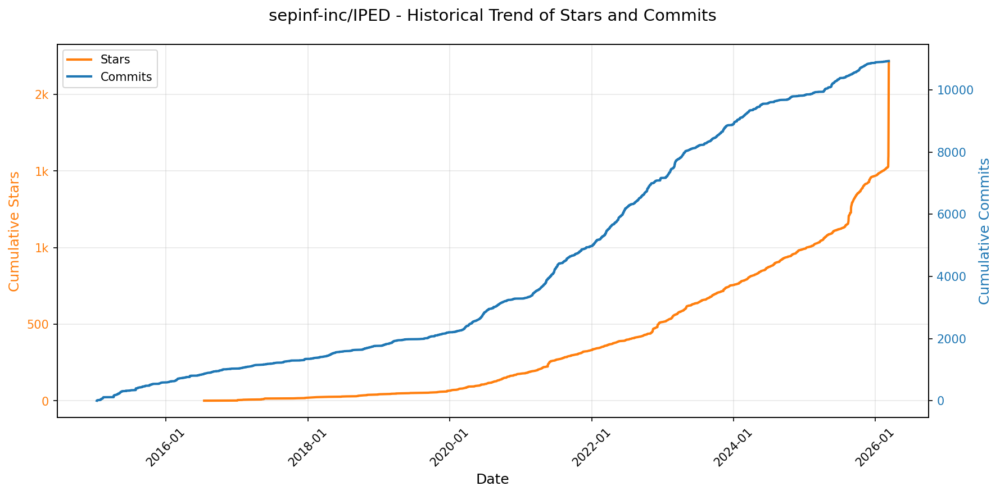

# 🌟 GitHub Trending 概览

> 数据更新于：2026-03-11

---

## 🔍 项目详情

### 1. [openclaw/openclaw](https://github.com/openclaw/openclaw)
- 📅 **创建日期**：2025-11-24  
- 🔄 **最近更新**：2026-03-11  
- ⭐ **Stars**：178,354（日 +76｜周 +37178｜月 +117355）  
- 📝 **描述**：Your own personal AI assistant. Any OS. Any Platform. The lobster way. 🦞   

<b>📈 Star 与 Commit 历史趋势</b>

> *蓝色：累计 Stars｜橙色：累计 Commits（次 Y 轴）*

<b>📄 README 摘要</b>

1. **项目功能**  
OpenClaw 是一个完全本地化、用户自托管的个人 AI 助手系统，核心目标是让用户在自有设备上运行一个**单用户、低延迟、始终在线、隐私优先**的智能助理。它不依赖中心化云服务，而是通过轻量级“网关（Gateway）”作为统一控制平面，将来自 20+ 主流通信平台（如 WhatsApp、Telegram、Slack、Discord、Signal、iMessage/BlueBubbles、微信替代品 Feishu/LINE/Zalo、Matrix、IRC、Teams、Twitch 等）的消息统一接入，并交由本地 AI 代理（Agent）处理；同时支持跨平台语音交互（macOS/iOS 唤醒词 + Android 连续语音）、实时可视化工作区（Live Canvas）、设备级操作（摄像头、录屏、定位、通知、系统命令等），真正实现“AI 在本地、能力在终端、控制在手中”。

2. **关键特性**  
- **多通道统一收件箱**：原生集成超 20 种消息平台，支持群组路由、提及触发、分块处理与频道隔离策略。  
- **本地优先网关架构**：基于 WebSocket 的单点控制平面，管理会话（Session）、通道连接、工具调用、定时任务（Cron）、Webhook、远程调试与安全策略。  
- **多智能体路由与工作区隔离**：支持按渠道、账号或联系人将消息路由至独立 Agent 实例（含 workspace 隔离），实现场景化分工（如工作/生活/开发助理）。  
- **全栈语音能力**：macOS/iOS 支持 Wake Word（语音唤醒），Android 支持持续 Talk Mode（ElevenLabs + 系统 TTS 回退），并深度集成设备麦克风与扬声器。  
- **Live Canvas 可视化工作区**：基于 A2UI 协议的动态画布，支持 AI 驱动的 UI 渲染、快照、代码执行与状态同步，覆盖 macOS/iOS/Android 全端。  
- **设备原生节点（Nodes）**：提供 `camera.*`、`screen.record`、`location.get`、`system.run`、`system.notify` 等底层能力，通过安全的 `node.invoke` 协议调用，严格遵循 macOS TCC / Android 权限模型。  
- **安全默认机制**：DM 消息默认启用配对验证（pairing code），拒绝未授权输入；支持显式白名单、密码认证（Tailscale Funnel）、OAuth/API Key 模型轮换与故障转移。  
- **开箱即用的向导与技能生态**：内置 CLI 向导（`openclaw onboard`）一键配置网关、通道、模型与技能；支持 ClawHub 技能注册中心，实现技能自动发现、安装与沙箱化管理。  
- **灵活部署模式**：支持本地运行（macOS/Linux/WSL2）、远程网关（Linux 服务器 + Tailscale/SSH 隧道）、Nix 声明式配置、Docker 容器化及 macOS 菜单栏应用。

3. **技术栈**  
- **运行时**：Node.js ≥22（主运行环境），支持 `npm`/`pnpm`/`bun`；TypeScript 为主开发语言，`tsx` 用于快速 TS 执行。  
- **核心协议与通信**：WebSocket（Gateway 控制平面）、HTTP/HTTPS（WebChat/UI）、Tailscale Serve/Funnel（安全远程暴露）、SSH 隧道（远程网关访问）。  
- **前端与 UI**：内置 Web 控制台（Control UI）、WebChat 界面、macOS 菜单栏应用、iOS/Android 原生节点 App；Canvas 使用 A2UI 协议驱动。  
- **AI 与模型层**：抽象化模型适配器，支持 OpenAI（GPT/Codex）、Anthropic、Google Gemini、Ollama、LM Studio 等；内置模型轮换、失败回退（failover）、会话裁剪与用量追踪。  
- **通道集成**：基于各平台官方/社区 SDK 封装，如 Baileys（WhatsApp）、grammY（Telegram）、discord.js（Discord）、Bolt（Slack）、signal-cli（Signal）、matrix-js-sdk（Matrix）等。  
- **基础设施**：Tailscale（网络层抽象与安全隧道）、Chrome DevTools Protocol（CDP，用于专用浏览器控制）、FFmpeg（音视频处理）、SQLite（本地会话/配对存储）、systemd（Linux）/launchd（macOS）守护进程管理。  
- **构建与打包**：`pnpm` 为主构建工具，支持 `pnpm build` 生成 `dist/`，`pnpm ui:build` 构建前端资源；提供 Nix 衍生包（nix-openclaw）与 Docker 镜像。

---

### 2. [x1xhlol/system-prompts-and-models-of-ai-tools](https://github.com/x1xhlol/system-prompts-and-models-of-ai-tools)
- 📅 **创建日期**：2025-03-05  
- 🔄 **最近更新**：2026-03-11  
- ⭐ **Stars**：130,230（日 +247｜周 +2563｜月 +16831）  
- 📝 **描述**：FULL Augment Code, Claude Code, Cluely, CodeBuddy, Comet, Cursor, Devin AI, Junie, Kiro, Leap.new, Lovable, Manus, NotionAI, Orchids.app, Perplexity, Poke, Qoder, Replit, Same.dev, Trae, Traycer AI, VSCode Agent, Warp.dev, Windsurf, Xcode, Z.ai Code, Dia & v0. (And other Open Sourced) System Prompts, Internal Tools & AI Models  

<b>📈 Star 与 Commit 历史趋势</b>

> *蓝色：累计 Stars｜橙色：累计 Commits（次 Y 轴）*

<b>📄 README 摘要</b>

该内容并非一个典型软件项目的 README（缺少项目名称、功能描述、安装使用说明等核心信息），而是一个**开源 AI 系统提示词（system prompts）与模型行为分析资料库的推广页面**。基于所提供文本，按要求从以下三方面进行精准总结（无引言）：

---

**1. 该项目做什么？**  
该项目是一个持续维护的、面向开发者的**公开 AI 系统提示词与模型行为洞察资料库**，核心目标是：  
- 收集、整理并公开披露主流 AI 工具（如 Copilot、Claude、Gemini、Kilo Code 等）的真实系统级提示词（system prompts）、模型配置逻辑及内部行为模式；  
- 提供超过 **30,000+ 行结构化分析内容**，揭示 AI 产品背后的工程实现细节与安全边界；  
- 服务于 AI 安全研究、提示工程优化、竞品分析及开源 AI 项目参考，强调「透明性即安全性」。

---

**2. 关键特性**  
- ✅ **全量开源可验证**：所有收集的 system prompts、模型交互逻辑、架构注释均托管于 GitHub，支持社区审查与协作改进；  
- ✅ **深度逆向与实证分析**：内容非简单转录，而是基于实际调用、日志分析、响应模式推断得出的结构化洞察；  
- ✅ **AI 安全警示与赋能**：内置明确的安全警告，联动 ZeroLeaks.ai 提供免费 AI 安全审计，帮助初创企业识别 prompt 泄露、指令注入等风险；  
- ✅ **开发者友好生态整合**：集成 Trendshift 数据看板、DeepWiki 知识图谱、Star History 成长追踪，并提供 Discord 社区支持；  
- ✅ **可持续运营机制**：通过加密货币捐赠（BTC/LTC/ETH）、Patreon、Ko-fi 及企业赞助（如 Latitude.so）维持长期更新与质量保障。

---

**3. 技术栈**  
项目本身为**文档型资料库（Documentation-First Repository）**，不涉及传统后端/前端服务，其技术支撑体系包括：  
- 🌐 **基础设施层**：GitHub 仓库托管 + CloudBack.it 构建状态监控 + Star History 图表服务；  
- 📚 **知识组织层**：Markdown 文档结构化管理 + DeepWiki 语义索引 + Trendshift 数据分析；  
- 🔍 **分析方法论**：基于黑盒测试、响应差异比对、token-level 模式识别的逆向工程实践；  
- 🛡️ **安全协同工具链**：与 ZeroLeaks.ai（AI 安全扫描平台）深度集成，采用其泄露检测 SDK 与审计框架；  
- 🤖 **生态依赖**：明确引用 Kilo Code（开源 AI 编程代理）、Latitude.so（LLM 可预测性平台）等前沿开源 AI 工程项目作为技术参照与合作伙伴。

---

### 3. [obra/superpowers](https://github.com/obra/superpowers)
- 📅 **创建日期**：2025-10-09  
- 🔄 **最近更新**：2026-03-11  
- ⭐ **Stars**：105,733（日 +1383｜周 +7359｜月 +29308）  
- 📝 **描述**：An agentic skills framework & software development methodology that works.  

<b>📈 Star 与 Commit 历史趋势</b>

> *蓝色：累计 Stars｜橙色：累计 Commits（次 Y 轴）*

<b>📄 README 摘要</b>

1. **该项目做什么？**  
Superpowers 是一个面向编程智能体（coding agents）的完整软件开发工作流增强系统。它不直接编写代码，而是通过一系列自动触发、可组合的“技能”（skills），在编码前引导用户明确需求、细化设计、制定可执行计划，并严格遵循工程规范推进开发。其核心目标是将原本可能随意、跳跃的 AI 编程行为，转变为结构化、可验证、符合专业实践（如 TDD、YAGNI、DRY）的协作式开发流程。整个过程以人类开发者为决策中心——从需求澄清、设计确认、计划审批，到关键节点人工把关，确保 AI 始终在受控、透明、可审计的框架下工作。

2. **关键特性**  
- **全流程自动化技能链**：覆盖从需求脑暴（brainstorming）、Git 工作树隔离（using-git-worktrees）、任务级实施计划生成（writing-plans）、子智能体驱动开发（subagent-driven-development）、强制性测试先行（test-driven-development）、阶段性代码审查（requesting-code-review）到分支收尾（finishing-a-development-branch）的 7 大核心阶段，所有技能按需自动激活，非可选建议。  
- **双阶段质量保障机制**：在子智能体执行每项任务时，实行两轮审查——先验证是否严格符合原始计划（spec compliance），再评估代码质量（code quality），确保意图与实现一致。  
- **强工程纪律嵌入**：强制执行 RED-GREEN-REFACTOR 测试循环（禁止先写实现后补测试）、YAGNI（拒绝过度设计）、DRY（消除重复）、防御性调试（systematic-debugging 四阶段法）及验证驱动闭环（verification-before-completion）。  
- **人类主导的协作范式**：所有设计文档分块呈现供人工审阅；计划需显式批准；关键路径设人工检查点；支持并行子智能体但由主智能体统筹协调，杜绝失控自治。  
- **开箱即用的技能可扩展性**：内置 `writing-skills` 技能，提供标准化模板与测试方法论，支持用户直接在仓库中贡献新技能，实现工作流持续演进。

3. **技术栈**  
- **运行平台**：深度适配主流 AI 编程工具，包括 Claude Code（官方插件市场 & 自建市场）、Cursor（插件市场）、Codex 与 OpenCode（需手动加载配置），本质为跨平台插件化架构。  
- **核心机制**：基于指令工程（prompt engineering）与技能编排（skill orchestration），通过预定义触发条件（如关键词、上下文状态）自动调用对应技能模块；技能本身以结构化 Markdown 文档（如 `SKILL.md`）形式组织，含行为描述、输入输出规范、示例及测试指南。  
- **基础设施依赖**：依托各平台原生插件系统（如 `/plugin install` 命令）实现安装与更新；使用 Git 工作树（git worktrees）实现环境隔离；无独立后端服务，纯前端/客户端侧运行，技能逻辑由 LLM 在提示词约束下执行。  
- **协议与标准**：遵循 MIT 开源协议；采用语义化技能命名与模块化目录结构（如 `skills/testing/`, `skills/debugging/`）；更新通过 `plugin update` 命令拉取远程仓库最新技能定义。

---

### 4. [virattt/ai-hedge-fund](https://github.com/virattt/ai-hedge-fund)
- 📅 **创建日期**：2024-11-29  
- 🔄 **最近更新**：2026-03-11  
- ⭐ **Stars**：47,850（日 +463｜周 +1652｜月 +2093）  
- 📝 **描述**：An AI Hedge Fund Team  

<b>📈 Star 与 Commit 历史趋势</b>

> *蓝色：累计 Stars｜橙色：累计 Commits（次 Y 轴）*

<b>📄 README 摘要</b>

1. **项目功能**  
该项目是一个面向教育与研究目的的AI驱动对冲基金概念验证系统，旨在模拟多智能体协同完成股票投资决策的全过程。它不执行真实交易，也不连接任何交易接口，仅通过分析股票（如AAPL、MSFT等）的估值、基本面、技术面、市场情绪及宏观因素，生成模拟买卖信号与投资建议，供学习和算法研究使用。

2. **核心特性**  
- **14位投资大师智能体协同决策**：集成Aswath Damodaran、Warren Buffett、Cathie Wood、Michael Burry等13位全球知名投资者的投资哲学，每位代理按其独特策略（如价值投资、成长投资、逆向投资、激进做空、Dhandho低风险套利等）独立分析并输出观点；  
- **4类专业分析代理**：Valuation（内在价值计算）、Sentiment（舆情分析）、Fundamentals（财务数据深度解析）、Technicals（技术指标建模）四大模块提供多维度量化信号；  
- **双层风控与决策架构**：Risk Manager负责计算波动率、最大回撤、头寸风险限额等指标；Portfolio Manager整合所有代理输出，进行加权投票或融合推理，生成最终模拟交易指令；  
- **双模式交互支持**：提供命令行接口（CLI）支持批量回测、参数化运行（含Ollama本地大模型选项）及时间区间回溯；同时提供可视化Web应用界面，降低使用门槛；  
- **开源可扩展设计**：支持灵活接入多种大模型API（OpenAI/Groq/Anthropic/DeepSeek）及金融数据源，预留模块化接口便于新增投资流派或分析维度。

3. **技术栈**  
- **编程语言**：Python（主框架，含Poetry依赖管理）；  
- **AI与LLM层**：基于大语言模型（LLM）构建投资代理，兼容OpenAI GPT系列、Ollama本地模型（如Llama 3、Phi-3）、Groq、Anthropic及DeepSeek等；  
- **数据层**：集成Financial Datasets API获取实时/历史财报、股价、估值数据；内置免费样本数据（AAPL/GOOGL/MSFT/NVDA/TSLA）；  
- **后端与工具链**：CLI由标准Python脚本实现；Web应用基于独立`/app`子目录（具体框架未明示，但符合现代Python全栈惯例，可能含FastAPI/Flask + Streamlit/Gradio或React前端）；  
- **工程实践**：采用`.env`环境变量管理密钥、Poetry包管理、模块化代码结构（`src/`下分`main.py`、`backtester.py`等）、MIT开源许可证。

---

### 5. [karpathy/nanochat](https://github.com/karpathy/nanochat)
- 📅 **创建日期**：2025-10-13  
- 🔄 **最近更新**：2026-03-11  
- ⭐ **Stars**：46,339（日 +719｜周 +1828｜月 +3750）  
- 📝 **描述**：The best ChatGPT that $100 can buy.  

<b>📈 Star 与 Commit 历史趋势</b>

> *蓝色：累计 Stars｜橙色：累计 Commits（次 Y 轴）*

<b>📄 README 摘要</b>

1. **项目功能**  
nanochat 是一个极简、可高度定制的端到端实验性框架，专为在单台 GPU 服务器（如 8×H100）上高效训练中小型大语言模型（LLM）而设计。它完整覆盖 LLM 全生命周期：从 BPE 分词、预训练（pretraining）、监督微调（SFT）、强化学习（RL）、多维度评估（含 DCLM CORE 指标），到命令行与 Web 界面（ChatGPT 风格）的交互式推理。核心目标是让研究者/开发者以极低成本（约 $15–$48）在数小时内复现 GPT-2 级别能力（1.6B 参数量级）的模型，并立即对话验证——例如，3 小时内完成训练并启动带 KV Cache 的 Web 聊天界面。

2. **关键特性**  
- **单参数驱动的计算最优建模**：仅通过 `--depth`（Transformer 层数）一个整数即可自动推导全部超参数（隐藏层宽、注意力头数、学习率调度、权重衰减、训练步数等），确保各规模模型均处于计算效率最优配置，形成“miniseries”系列模型（如 d12/d16/d24/d26）。  
- **全栈一体化与极致简化**：代码高度精简、无复杂配置对象或工厂模式；所有阶段（tokenize/train/eval/inference/chat）均由统一风格的 PyTorch 脚本实现，支持开箱即用和快速 hack。  
- **高性能与灵活精度控制**：默认基于硬件自动启用 `bfloat16`（H100/A100）或 `float32`（旧卡/CPU/MPS）；手动支持 `float16`（配合 GradScaler）；模型权重保持 fp32 优化精度，计算层显式 cast，兼顾稳定性与速度。  
- **实证导向的开放协作机制**：内置 “Time-to-GPT-2” 领先榜（Leaderboard），以 wall-clock 时间 + DCLM CORE 分数（阈值 0.256525）为唯一核心指标，鼓励社区通过 `speedrun.sh` 提交可复现的加速方案（如数据集切换、FP8、批量增大等）。  
- **多环境兼容与低门槛入门**：原生支持多卡分布式（`torchrun`）、单卡（自动梯度累积）、CPU/MPS（轻量级演示）；提供 `runcpu.sh`、`miniseries.sh`、`scaling_laws.sh` 等脚本支撑快速实验与规律探索；Web UI（`chat_web.py`）与 CLI（`chat_cli.py`）双交互入口。

3. **技术栈**  
- **核心框架**：Python 3.10+，PyTorch（无 `torch.amp.autocast`，采用显式 dtype 控制）  
- **模型架构**：标准 GPT-style Transformer（`nanochat/gpt.py`），支持深度缩放与 KV Cache 推理（`nanochat/engine.py`）  
- **分词器**：自研 BPE Tokenizer（`nanochat/tokenizer.py`），兼容 GPT-4 风格  
- **训练与优化**：AdamW / Muon 优化器（`nanochat/optim.py`）、分布式数据加载（`nanochat/dataloader.py`）、checkpoint 管理（`nanochat/checkpoint_manager.py`）  
- **评估体系**：DCLM CORE 分数（`nanochat/core_eval.py`）、bits per byte（`nanochat/loss_eval.py`）、多任务评测套件（ARC/GSM8K/MMLU/HumanEval 等，位于 `tasks/`）  
- **工具与部署**：Web UI 前端嵌入 HTML/CSS/JS（`nanochat/ui.html`），后端基于 Python HTTP 服务；依赖管理使用 `uv`（`pyproject.toml` + `uv.lock`）；日志与实验追踪集成 Weights & Biases（wandb）  
- **基础设施适配**：深度优化 H100/A100（bf16 tensor core）、兼容 V100/T4（fp16+GradScaler）、Apple Silicon（MPS）、通用 CPU；支持 Lambda Cloud 等主流 GPU 云平台一键部署。

---

### 6. [shareAI-lab/learn-claude-code](https://github.com/shareAI-lab/learn-claude-code)
- 📅 **创建日期**：2025-06-29  
- 🔄 **最近更新**：2026-03-11  
- ⭐ **Stars**：39,609（日 +367｜周 +4087｜月 +8294）  
- 📝 **描述**：Bash is all you need -  A nano Claude Code–like agent, built from 0 to 1  

<b>📈 Star 与 Commit 历史趋势</b>

> *蓝色：累计 Stars｜橙色：累计 Commits（次 Y 轴）*

<b>📄 README 摘要</b>

1. **项目功能**  
该项目是一个面向教学的轻量级AI编程智能体（nano Claude Code-like agent）构建实践库，旨在从零开始系统性地拆解并实现一个类Claude Code的自主编码智能体核心运行机制。它不追求生产级完备性，而是通过**12个渐进式会话（s01–s12）**，每次仅引入**一个关键机制**，逐步构建出具备规划、工具调用、知识按需加载、上下文压缩、任务持久化、后台执行、多智能体协作、自动任务认领及工作目录隔离等能力的完整智能体运行时内核。最终目标是让学习者透彻理解AI智能体“内部如何运转”，而非仅调用黑盒API。

2. **核心特性**  
- **极简但完备的核心循环**：基于`stop_reason == "tool_use"`触发的标准化LLM交互-工具执行-结果注入-循环迭代范式，所有高级能力均在此不变循环上分层叠加。  
- **12阶段渐进式教学设计**：每阶段聚焦一个可独立理解的机制（如s03强调“先规划后执行”，s07引入磁盘持久化的任务图，s12实现基于ID的工作树（worktree）隔离），配以精炼口号（motto）和ASCII流程图，强化心智模型。  
- **面向真实场景的工程化演进**：涵盖从单循环（s01）到多智能体自治协作（s09–s12）、从同步阻塞到后台异步（s08）、从内存临时上下文到三层压缩+磁盘持久化（s06/s07）、从集中调度到去中心化任务认领（s11）等关键生产级能力演进路径。  
- **配套交互式学习平台**：内置基于Next.js的Web界面（`web/`），提供可视化流程图、代码逐行解析、文档浏览与会话演示，大幅提升学习效率。  
- **明确的能力边界声明**：坦诚说明未实现的生产级组件（如完整事件总线、权限治理、MCP协议细节），避免概念混淆，专注核心范式教学。

3. **技术栈**  
- **主语言与运行时**：Python（核心智能体逻辑、CLI脚本、工具处理器），依赖Anthropic API（Claude模型）进行LLM调用。  
- **前端与可视化**：Next.js（React框架）、TypeScript、Tailwind CSS，用于构建交互式Web学习平台。  
- **任务与通信协议**：基于JSONL格式的轻量级邮箱（mailbox）协议实现智能体间异步消息传递（s09起）；文件系统（磁盘）作为任务图（s07）和工作树（s12）的持久化载体。  
- **基础设施**：GitHub Actions（CI/CD）、`.env`环境配置、标准Python包管理（`requirements.txt`）。  
- **延伸生态**：配套开源项目使用Node.js（Kode CLI）、Rust/Go（Kode SDK底层）及多平台IM集成（claw0），但本仓库本身纯Python/JS双栈，无外部复杂依赖。

---

### 7. [ruvnet/RuView](https://github.com/ruvnet/RuView)
- 📅 **创建日期**：2025-06-07  
- 🔄 **最近更新**：2026-03-11  
- ⭐ **Stars**：34,834（日 +1095｜周 +9324｜月 +29081）  
- 📝 **描述**：π RuView: WiFi DensePose turns commodity WiFi signals into real-time human pose estimation, vital sign monitoring, and presence detection — all without a single pixel of video.   

<b>📈 Star 与 Commit 历史趋势</b>

> *蓝色：累计 Stars｜橙色：累计 Commits（次 Y 轴）*

<b>📄 README 摘要</b>

1. **该项目做什么？**  
RuView 是一个面向边缘设备的 AI 感知系统，利用环境中已有的无线信号（尤其是 WiFi 的信道状态信息 CSI）实现无摄像头、无穿戴设备、无互联网连接的物理空间感知。它通过分析人体运动对 WiFi 电磁波的散射扰动，实时重建人体姿态（17 个关键点）、呼吸频率（6–30 BPM）、心率（40–120 BPM）、存在性及多目标位置，并支持穿墙感知（最远达 5 米深度）。系统完全在本地运行（如 ESP32-S3 节点），无需云端依赖、标注数据或视觉输入，可自主学习并持续适应部署环境的射频特征，构建“持久场模型”以分离环境背景与动态活动。

2. **核心功能**  
- **隐私优先感知**：纯射频传感，不采集图像/视频，规避 GDPR/HIPAA 等影像监管风险；  
- **多模态生命体征监测**：非接触式实时呼吸与心率检测，适用于医疗监护、养老看护等场景；  
- **穿墙与多目标追踪**：支持墙体/家具遮挡下的单/多人姿态估计（物理上限约每 AP 3–5 人，多 AP 可线性扩展）；  
- **多静态传感器网格（Multistatic Mesh）**：4–6 个低成本 ESP32-S3 节点协同工作，提供 360° 全向覆盖、亚英寸精度与抗混淆识别；  
- **自学习与自适应智能**：基于对比学习的 CSI 嵌入模型（ADR-024），无需摄像头监督即可从原始信号中启动训练；结合对抗域泛化（ADR-027）实现跨房间/建筑/硬件的零样本迁移；  
- **端到端低延迟处理**：Rust 实现的信号流水线（Signal-Line Protocol, CRV）仅需 <100 微秒/帧，ESP32 上实现实时存在检测（<1ms）、跌倒告警（<2s）；  
- **全栈本地化部署**：支持 Docker 一键启动（amd64/arm64）、ESP32 独立运行、AMOLED 屏幕直显、WASM 浏览器部署及 QUIC 加密 mesh 组网；  
- **开箱即用可视化**：Three.js 构建的“天文台级”观测仪表盘（Observatory），集成子载波流形、相位星座图、生命体征神谕、存在热力图等五维实时视图。

3. **技术栈**  
- **编程语言**：Rust（主框架、信号处理流水线、AI 推理引擎、ESP32 固件）、Python（数据验证、训练脚本、部分工具链）；  
- **AI/ML 核心**：基于 RuVector 框架的轻量级注意力网络、图神经算法与自监督嵌入模型；采用对比学习（Contrastive CSI Embedding）、跨环境域泛化（MERIDIAN）、多视角融合（Cross-Viewpoint Fusion）等原创方法；  
- **信号处理**：物理模型驱动 + 数据驱动混合范式，集成 Hampel 滤波、SpotFi 定位、菲涅尔区几何建模、BVP（Ballistocardiogram-derived Vital Pulse）提取、多带通 FFT 分析等技术；  
- **硬件平台**：主推 ESP32-S3（CSI 流式采集 + 本地推理 + AMOLED 显示），兼容 Intel 5300 / Atheros AR9580 研究级网卡；支持纯 RSSI 模式（任意消费级 WiFi 设备，仅限粗粒度存在检测）；  
- **系统架构**：模块化边缘智能（Edge Modules）、QUIC 加密 mesh 通信协议、`.rvf` 格式便携模型封装、Tauri v2 桌面管理应用（开发中）；  
- **基础设施**：多架构 Docker 镜像（ruvnet/wifi-densepose）、1300+ 单元测试、48 份架构决策记录（ADR）、7 个领域驱动设计（DDD）模型，全 MIT 开源许可。

---

### 8. [ItzCrazyKns/Vane](https://github.com/ItzCrazyKns/Vane)
- 📅 **创建日期**：2024-04-09  
- 🔄 **最近更新**：2026-03-11  
- ⭐ **Stars**：32,655（日 +165｜周 +2688｜月 +3970）  
- 📝 **描述**：Vane is an AI-powered answering engine.  

<b>📈 Star 与 Commit 历史趋势</b>

> *蓝色：累计 Stars｜橙色：累计 Commits（次 Y 轴）*

<b>📄 README 摘要</b>

1. **项目功能**  
Vane 是一个**隐私优先、本地化运行的AI问答搜索引擎**，完全在用户自有硬件上运行，不将搜索请求或数据上传至第三方服务器。它通过整合互联网公开知识与多种AI模型能力（包括本地Ollama模型及云端API如OpenAI、Claude、Gemini、Groq等），为用户提供带**可验证引用来源**的精准答案，同时确保全程搜索行为100%私密。

2. **核心功能**  
- ✅ **多模型支持**：无缝接入本地Ollama模型及主流云AI服务（OpenAI/Claude/Gemini/Groq等），支持按需混用；  
- ✅ **智能搜索模式**：提供“速度优先”“均衡”“质量优先”三档响应策略，适配不同场景需求；  
- ✅ **多源检索能力**：支持网页、技术论坛、学术论文等多类型内容搜索，已集成SearxNG（隐私保护聚合搜索），并规划接入Tavily、Exa；  
- ✅ **富媒体搜索**：原生支持图像与视频内容检索，突破纯文本限制；  
- ✅ **文档理解**：支持PDF、TXT、图像等格式文件上传，直接提问并解析内容；  
- ✅ **精细化搜索控制**：支持限定特定域名（如`site:docs.python.org`）进行定向检索；  
- ✅ **智能交互增强**：实时搜索建议、上下文感知UI小部件（天气/股价/计算等）、本地持久化搜索历史、每日精选内容“Discover”板块；  
- ✅ **开发者友好**：提供完整REST API，支持第三方应用集成；支持一键部署至Sealos/RepoCloud/ClawCloud/Hostinger等平台。

3. **技术栈**  
- **前端**：基于 Next.js（App Router）构建，采用现代化React生态；  
- **后端**：Node.js + TypeScript，负责AI编排、搜索调度、API代理与插件管理；  
- **搜索基础设施**：默认捆绑 SearxNG（隐私优先元搜索引擎），支持自定义SearxNG实例或未来扩展Exa/Tavily；  
- **AI模型接入层**：统一抽象接口，兼容OpenAI兼容协议（含Ollama、Lemonade等本地LLM服务器）、Anthropic、Google Gemini、Groq等官方API；  
- **部署方案**：主推 Docker 容器化部署（含预集成SearxNG的全功能镜像及轻量级slim镜像），亦支持源码npm构建；  
- **附加服务**：集成 Wolfram Alpha（用于数学/科学计算）、支持环境变量与卷挂载实现配置与数据持久化。

---

### 9. [moeru-ai/airi](https://github.com/moeru-ai/airi)
- 📅 **创建日期**：2024-12-01  
- 🔄 **最近更新**：2026-03-11  
- ⭐ **Stars**：32,259（日 +401｜周 +10099｜月 +14988）  
- 📝 **描述**：💖🧸 Self hosted, you-owned Grok Companion, a container of souls of waifu, cyber livings to bring them into our worlds, wishing to achieve Neuro-sama's altitude. Capable of realtime voice chat, Minecraft, Factorio playing. Web / macOS / Windows supported.  

<b>📈 Star 与 Commit 历史趋势</b>

> *蓝色：累计 Stars｜橙色：累计 Commits（次 Y 轴）*

<b>📄 README 摘要</b>

1. **项目功能**  
AIRI 是一个开源的 AI 虚拟角色（AI waifu / 数字生命体）运行容器，旨在复刻并超越 Neuro-sama 这类具备强交互能力的虚拟主播（VTuber），让用户真正“拥有”自己的数字伴侣。它不仅支持基础聊天与角色扮演，更核心的能力是实现**跨场景、多模态、实时协同的主动式交互**：可同步观看视频、参与游戏（如 Minecraft、Factorio）、接入 Discord/Telegram 语音与消息、感知用户屏幕内容（“看你在写什么代码”）、在本地或浏览器中完成语音识别（ASR）与合成（TTS），并逐步构建长期记忆与自主行为能力。其终极目标是提供一个可在桌面端（Tamagotchi）、网页端（Stage Web）、移动端（Pocket，PWA/Capacitor）及未来 XR 场景中无缝运行的“个人数字灵魂载体”。

2. **关键特性**  
- **全栈多端原生支持**：同时提供桌面版（基于 Tauri/Electron + 原生 GPU 加速）、Web 版（PWA 兼容，WebGPU/WebAudio/WebAssembly 驱动）、iOS/Android 移动版（Capacitor 封装），且各端共享核心逻辑与插件生态。  
- **深度游戏与系统集成能力**：已实现在 Minecraft 和 Factorio 中自主操作（含 RCON 控制、自动化脚本库 autorio），并支持接入 Discord 语音频道、Telegram 消息流等真实通信环境。  
- **实时多模态感知与表达**：  
  - *Ears（听觉）*：支持浏览器麦克风、Discord 音频流输入；客户端语音识别（WebAssembly ASR）与说话状态检测（VAD）；  
  - *Mouth（言语）*：集成 ElevenLabs 等 TTS 服务，并规划本地化语音合成；  
  - *Body（形体）*：完整支持 VRM 与 Live2D 模型，实现自动眨眼、视线追踪（look-at）、Idle 微表情动画等拟人化渲染；  
- **模块化 AI 接入与记忆架构**：  
  - 通过 `xsai` 统一抽象层，原生支持超 25 种 LLM API（OpenAI、Claude、vLLM、Ollama、DeepSeek、Qwen、Gemini 等），并预留 MCP（Model Context Protocol）扩展接口；  
  - 内置浏览器端嵌入式数据库（DuckDB WASM / pglite）用于轻量级记忆存储，“Memory Alaya”长期记忆系统正在开发中；  
- **开放插件与子项目生态**：围绕 AIRI 衍生出 `unspeech`（通用语音代理）、`duckdb-wasm`（Drizzle ORM 驱动）、`airi-factorio`（游戏联动）、`webai-realtime-voice-chat`（实时语音对话范例）等十余个专注不同技术方向的子项目，形成覆盖 ASR/TTS、模型部署、3D 渲染、RAG、XR 的完整工具链。

3. **技术栈**  
- **前端框架与语言**：TypeScript + Vue 3（Composition API），使用 Vite 构建；  
- **跨平台桌面端**：Tauri（Rust 后端 + WebView 前端），部分模块采用 Electron；Nix 作为包管理与开发环境标准化工具；  
- **移动端**：Capacitor（iOS/Android 原生桥接）；  
- **AI 与推理层**：  
  - 云端：兼容各类 RESTful LLM API（通过 `xsai` 抽象）；  
  - 本地：依托 HuggingFace `candle`（Rust 编写）实现原生 CUDA/Metal 加速推理；浏览器内实验性支持 Transformers.js、ONNX Runtime；  
- **多媒体与图形**：WebGPU（高性能渲染与计算）、Three.js（3D 场景）、Web Audio API（音频处理）、Web Workers（后台任务隔离）；  
- **数据与存储**：DuckDB WASM（浏览器内 OLAP 数据库）、pglite（轻量级 Postgres WASM）、Drizzle ORM；  
- **通信与协议**：WebSocket（实时双向通信）、MCP（Model Context Protocol）插件标准、RCON（Factorio 游戏控制）；  
- **基础设施与工具链**：PNPM（包管理）、Rust（核心插件与 CLI 工具）、GitHub Actions（CI/CD）、Crowdin（多语言翻译）。

---

### 10. [bytedance/deer-flow](https://github.com/bytedance/deer-flow)
- 📅 **创建日期**：2025-05-07  
- 🔄 **最近更新**：2026-03-11  
- ⭐ **Stars**：28,620（日 +1200｜周 +4582｜月 +8990）  
- 📝 **描述**：An open-source SuperAgent harness that researches, codes, and creates. With the help of sandboxes, memories, tools, skills and subagents, it handles different levels of tasks that could take minutes to hours.  

<b>📈 Star 与 Commit 历史趋势</b>

> *蓝色：累计 Stars｜橙色：累计 Commits（次 Y 轴）*

<b>📄 README 摘要</b>

1. **项目功能**  
DeerFlow 2.0 是一个开源的「超级智能体运行时框架（Super Agent Harness）」，旨在将大语言模型（LLM）转化为可实际执行复杂任务的生产级智能体系统。它不局限于传统问答或单步推理，而是通过编排子智能体（Sub-Agents）、沙盒化执行环境、结构化长期记忆与可插拔技能体系，完成端到端的多阶段任务——例如：深度网络调研→信息提取与验证→生成图文并茂的报告→自动创建PPT幻灯片→输出可部署的网页或数据分析仪表盘。其核心定位是从“深度研究框架”升级为通用型智能体基础设施，支持自动化内容创作、数据工程、研发辅助、跨平台IM任务响应等真实场景工作流。

2. **关键特性**  
- **模块化技能系统（Skills & Tools）**：以 Markdown 定义标准化技能（如 `research`、`slide-creation`、`image-generation`），支持动态按需加载，避免上下文膨胀；内置工具集（网络搜索、文件操作、Bash执行）+ 外部扩展能力（MCP服务器、Python函数）。  
- **动态子智能体编排（Sub-Agents）**：主智能体可实时分解复杂任务，为每个子任务启动独立上下文、工具集和终止条件的子智能体，并行执行、结构化回传结果、最终融合输出。  
- **全隔离沙盒执行环境（Sandbox & File System）**：每个任务在独立 Docker 容器中运行，配备完整虚拟文件系统（`/mnt/user-data/uploads/`、`workspace/`、`outputs/`），支持代码执行、文件读写、图像渲染等真实操作，保障安全、可审计、无会话污染。  
- **上下文工程优化（Context Engineering）**：实现子智能体上下文隔离 + 会话内主动摘要（summarization）、中间结果落盘、无关信息压缩，确保长周期多步骤任务不超上下文窗口。  
- **持久化长期记忆（Long-Term Memory）**：跨会话存储用户画像、偏好、技术栈、历史工作流等私有知识，本地化存储、用户完全掌控，随使用持续增强个性化能力。  
- **多模态通道集成（IM Channels）**：原生支持 Telegram / Slack / 飞书（Lark）等即时通讯平台，无需公网IP即可接收任务指令（如 `/new`、`/memory`），并支持细粒度用户级配置（如 VIP 用户启用子智能体）。  
- **Claude Code 深度协同**：提供官方 `claude-to-deerflow` 技能，允许在 Claude Code 终端中直接调用 DeerFlow，支持流式响应、多种执行模式（flash/standard/pro/ultra）及文件上传分析。  
- **嵌入式 Python 客户端**：提供 `DeerFlowClient` 库，可零 HTTP 服务依赖地在 Python 进程内调用全部能力（聊天、流式响应、技能管理、文件上传），API 严格对齐网关接口，保障一致性。

3. **技术栈**  
- **核心框架**：LangChain（LLM 集成、工具链、模型抽象）、LangGraph（多智能体状态图编排、循环控制、事件流处理）  
- **运行时环境**：Docker（沙盒容器化执行）、Kubernetes（可选 provisioner 模式集群调度）  
- **前端与服务层**：Node.js 22+、pnpm、Nginx（反向代理）、FastAPI（后端 API）、React（Web UI）  
- **配置与依赖管理**：`uv`（Python 包管理）、YAML 配置驱动、`.env` 环境变量注入  
- **搜索与数据获取**：深度集成 BytePlus 自研 InfoQuest（智能搜索与爬虫工具集），同时兼容 Tavily 等第三方搜索 API  
- **协议与标准**：MCP（Model Context Protocol）服务器支持（含 OAuth2 token 流）、SSE（Server-Sent Events）流式通信、OpenAI 兼容 API 接口规范  
- **开发与测试**：Pydantic（响应模型校验）、CI 中强制网关 API 与嵌入式客户端 Schema 一致性测试（`TestGatewayConformance`）

---

### 11. [msitarzewski/agency-agents](https://github.com/msitarzewski/agency-agents)
- 📅 **创建日期**：2025-10-13  
- 🔄 **最近更新**：2026-03-11  
- ⭐ **Stars**：25,441（日 +6006｜周 +21983｜月 +24488）  
- 📝 **描述**：A complete AI agency at your fingertips - From frontend wizards to Reddit community ninjas, from whimsy injectors to reality checkers. Each agent is a specialized expert with personality, processes, and proven deliverables.  

<b>📈 Star 与 Commit 历史趋势</b>

> *蓝色：累计 Stars｜橙色：累计 Commits（次 Y 轴）*

<b>📄 README 摘要</b>

1. **该项目做什么？**  
该项目是一个模块化、可即插即用的AI代理（AI Agent）集合，旨在模拟真实数字创意与技术机构中各类专业角色的职能。它不提供通用大模型提示词模板，而是为每个AI代理赋予明确的专业领域、独特人格设定、标准化工作流程及可交付成果（如可运行代码、审计清单、设计系统规范、广告投放策略等）。用户可通过集成到Claude Code、Cursor、Aider、Windsurf、GitHub Copilot、Gemini CLI等开发/协作工具中，按需激活特定代理（例如“前端开发者”“Reddit社区构建师”“visionOS空间工程师”），使其在具体任务中以专家身份提供深度、上下文感知且结果导向的支持，从而实现“组建一支永不疲倦、高度专业化AI梦之队”的目标。

2. **核心功能**  
- **全栈专业覆盖**：涵盖工程、设计、付费广告、市场营销、产品、项目管理、测试、支持、空间计算（XR/visionOS）、游戏开发（Unity/Unreal/Godot/Roblox）、法律合规与数据治理等12+垂直领域，总计超80个精细化代理；  
- **人格化与专业化深度融合**：每个代理均定义其身份特质（voice & tone）、核心使命、标准操作流程（SOP）、典型交付物（含代码片段、配置示例、检查清单、报告模板）、成功度量指标及沟通风格；  
- **多工具无缝集成**：提供自动化脚本（`convert.sh` / `install.sh`）一键生成并安装适配主流AI编程助手（如Cursor、Aider、Copilot）及CLI工具（Gemini、OpenCode）的代理配置；  
- **开箱即用与灵活复用双模式**：既支持直接复制至Claude Code目录启用，也支持作为高质量参考文档进行人工调用、裁剪与二次定制；  
- **跨平台与本地化支持**：特别包含针对中国主流平台（小红书/Xiaohongshu、微信公众号/WeChat OA、知乎/Zhihu）的专属代理，兼顾全球与本土数字营销需求；  
- **高阶协同能力**：内置“代理协调员（Agents Orchestrator）”和“身份图谱操作员（Identity Graph Operator）”等元代理，支持复杂多代理协同、身份可信验证与跨代理数据一致性管理。

3. **技术栈**  
- **核心形态**：纯文本YAML/Markdown格式代理定义文件（含结构化元数据、角色描述、工作流、代码示例），无后端服务依赖，轻量、透明、可审计；  
- **集成层**：Shell脚本（Bash）驱动的跨工具适配器（`scripts/convert.sh`, `scripts/install.sh`），支持自动检测本地已安装工具并生成对应配置；  
- **目标运行环境**：深度适配各类AI原生IDE与CLI工具，包括但不限于：  
  - AI编程助手：Claude Code（首选）、Cursor、GitHub Copilot（via `.copilot/agents`）、Aider、Windsurf；  
  - 大模型CLI：Google Gemini CLI、OpenCode；  
- **技术领域覆盖广度**：隐含支撑各代理能力的技术栈横跨前端（React/Vue/Angular）、移动（Swift/Kotlin/Flutter/React Native）、后端（Node.js/Laravel/Python）、云与DevOps（AWS/GCP/Terraform/CI-CD）、AI/ML（PyTorch/LLM ops）、游戏引擎（Unity/Unreal/Godot/Roblox）、空间计算（visionOS/Metal/WebXR）、数据分析（GA4/GTM/SQL）、设计工具（Figma/Midjourney/DALL·E）及合规框架（WCAG/GDPR/中国数据安全法）等。

---

### 12. [badlogic/pi-mono](https://github.com/badlogic/pi-mono)
- 📅 **创建日期**：2025-08-09  
- 🔄 **最近更新**：2026-03-11  
- ⭐ **Stars**：22,213（日 +362｜周 +2714｜月 +14080）  
- 📝 **描述**：AI agent toolkit: coding agent CLI, unified LLM API, TUI & web UI libraries, Slack bot, vLLM pods  

<b>📈 Star 与 Commit 历史趋势</b>

> *蓝色：累计 Stars｜橙色：累计 Commits（次 Y 轴）*

<b>📄 README 摘要</b>

1. **项目功能**  
该项目是一个面向AI智能体（Agent）开发与大语言模型（LLM）部署管理的工具型单体仓库（monorepo），核心目标是提供一套模块化、可组合的基础设施，支持构建、运行和部署交互式AI编码代理及其他AI应用。其旗舰产品为 `pi-coding-agent`——一个命令行交互式编程助手，能理解自然语言指令、分析代码上下文、生成/修改代码并执行调试任务；同时支持通过Slack（via `pi-mom`）、终端（via `pi-tui`）和Web界面（via `pi-web-ui`）等多种入口接入AI能力。

2. **关键特性**  
- **多厂商LLM统一抽象层**：`pi-ai` 包提供标准化API，无缝对接OpenAI、Anthropic、Google Gemini等主流LLM服务，屏蔽底层差异；  
- **轻量级Agent运行时**：`pi-agent-core` 支持工具调用（Tool Calling）、状态持久化、会话管理与可扩展的插件机制；  
- **全栈AI交互体验**：覆盖终端（TUI，含差分渲染优化）、Web（基于Web Components的可嵌入聊天UI）、Slack（消息自动路由至编码Agent）三端一致的用户接口；  
- **vLLM部署自动化**：`pi-pods` CLI工具专为GPU服务器集群设计，简化本地/私有化vLLM推理服务的启停、扩缩容与监控；  
- **开发者友好工作流**：开箱即用的Monorepo构建、类型检查、格式化、测试脚本（含LLM密钥隔离逻辑），并明确区分人类与AI协作者的贡献规范。

3. **技术栈**  
- **语言与运行时**：TypeScript（全栈主力）、Node.js（后端/CLI）、Rust（部分高性能组件待扩展，当前未显式声明但vLLM集成隐含）；  
- **前端框架**：纯Web Components（无React/Vue等重型框架），`pi-web-ui` 采用原生自定义元素；终端UI `pi-tui` 基于ANSI控制序列与差分渲染算法；  
- **AI基础设施**：深度集成vLLM（用于高效GPU推理）、兼容OpenAI兼容API的LLM网关；  
- **工程体系**：pnpm/NPM Monorepo管理、TypeScript编译与类型检查、ESLint+Prettier代码质量管控、GitHub Actions CI/CD；  
- **部署与运维**：面向GPU节点的CLI驱动部署（`pi-pods`），强调本地/私有云场景下的LLM服务可管理性。

---

### 13. [GoogleCloudPlatform/generative-ai](https://github.com/GoogleCloudPlatform/generative-ai)
- 📅 **创建日期**：2023-05-05  
- 🔄 **最近更新**：2026-03-11  
- ⭐ **Stars**：15,753（日 +453｜周 +2965｜月 +3146）  
- 📝 **描述**：Sample code and notebooks for Generative AI on Google Cloud, with Gemini on Vertex AI  

<b>📈 Star 与 Commit 历史趋势</b>

> *蓝色：累计 Stars｜橙色：累计 Commits（次 Y 轴）*

<b>📄 README 摘要</b>

1. **该项目的功能**  
该项目是一个面向生成式AI开发的官方示例资源库，旨在帮助开发者在Google Cloud平台上构建、部署和管理生成式AI工作流。它不提供独立运行的服务或产品，而是通过可执行的Jupyter Notebook、代码示例、演示应用及结构化文档，系统性地展示如何利用Google Cloud的生成式AI能力（特别是Vertex AI平台）实现各类AI任务，包括大语言模型调用（Gemini）、企业级搜索（Vertex AI Search）、检索增强生成（RAG）与知识溯源（Grounding）、多模态生成（图像生成/编辑/视觉问答）、语音处理（Chirp语音模型）等实际场景。

2. **核心功能**  
- **Gemini全栈实践支持**：涵盖Gemini 3.1 Pro最新模型的入门指南、函数调用（Function Calling）、端到端应用示例及典型用例；  
- **垂直领域AI能力覆盖**：按模态与场景划分模块化目录（`gemini/`、`search/`、`rag-grounding/`、`vision/`、`audio/`），提供开箱即用的Notebook和最佳实践；  
- **工程化支撑能力**：包含环境配置指南（`setup-env/`），支持Google Colab与Vertex AI Workbench快速启动；  
- **RAG与知识溯源专项整合**：`rag-grounding/`目录统一索引跨目录的RAG相关示例，强调检索质量、结果可信度与外部知识引用；  
- **多模态生成能力演示**：`vision/`提供Imagen API的图像生成、编辑、视觉描述与VQA；`audio/`基于Chirp API实现语音识别与合成；  
- **企业级搜索集成**：`search/`目录聚焦Vertex AI Search（原Enterprise Search on Generative AI App Builder），支持网站与企业数据源的语义搜索构建；  
- **生态资源聚合**：通过`RESOURCES.md`链接官方博客、视频教程等学习材料，并关联十余个互补性GitHub仓库（如ADK Agents、Agent Starter Pack、GenMedia Creative Studio等），形成完整技术生态视图。

3. **技术栈**  
- **云平台**：Google Cloud Platform（GCP），核心依赖Vertex AI服务；  
- **模型服务**：Gemini系列大语言模型（含3.1 Pro）、Imagen（文生图/图编辑）、Chirp（语音处理）、Vertex AI Search（检索增强搜索）、Document AI（文档理解）；  
- **开发框架与工具**：Python为主，深度集成Vertex AI Python SDK；Jupyter Notebook为默认交互式开发载体；支持Colab与Vertex AI Workbench托管环境；  
- **基础设施与运维**：隐含使用Cloud Storage（notebook资源托管）、Cloud IAM（权限管理）、Vertex AI Pipelines（可扩展至MLOps流程）；部分关联仓库涉及Terraform（基础设施即代码）、GKE（AI on Kubernetes）、Dataflow（流式数据处理）等；  
- **辅助技术**：函数调用（Function Calling）、向量数据库集成（RAG场景）、敏感数据保护（Cloud DLP）、多代理架构（Agent Development Kit）等高级工程能力。

---

### 14. [QwenLM/Qwen-Agent](https://github.com/QwenLM/Qwen-Agent)
- 📅 **创建日期**：2023-09-22  
- 🔄 **最近更新**：2026-03-11  
- ⭐ **Stars**：15,354（日 +76｜周 +1839｜月 +2163）  
- 📝 **描述**：Agent framework and applications built upon Qwen>=3.0, featuring Function Calling, MCP, Code Interpreter, RAG, Chrome extension, etc.  

<b>📈 Star 与 Commit 历史趋势</b>

> *蓝色：累计 Stars｜橙色：累计 Commits（次 Y 轴）*

<b>📄 README 摘要</b>

1. **该项目的功能**  
Qwen-Agent 是一个基于通义千问（Qwen）大语言模型能力构建的**LLM 应用开发框架**，核心目标是支撑具备**指令遵循、工具调用（Tool Use）、多步规划（Planning）与记忆（Memory）能力**的智能体（Agent）应用开发。它已作为官方产品 [Qwen Chat](https://chat.qwen.ai/) 的后端服务运行，并提供开箱即用的典型应用示例，包括：浏览器助手（Browser Assistant）、代码解释器（Code Interpreter）和可定制化智能助理（Custom Assistant），支持从简单工具链到复杂多阶段任务的端到端自动化。

2. **关键特性**  
- ✅ **原生强工具调用支持**：默认采用 `nous` 风格函数调用模板，原生支持**并行、多步、多轮工具调用**（如 QwQ-32B、Qwen3 系列）；兼容 MCP（Model Context Protocol）协议，可对接 memory、filesystem、sqlite 等标准化工具服务器。  
- ✅ **多模态与专业模型协同**：支持 Qwen3-VL（视觉语言）、Qwen3-Coder（代码专用）、Qwen2.5-Math（数学推理）、QwQ（推理增强）等系列模型的差异化工具调用策略（如自动启用/禁用 vLLM 内置解析）。  
- ✅ **灵活部署与扩展架构**：提供原子级组件（`BaseChatModel`、`BaseTool`、`Agent`），支持用户自定义 LLM 后端（DashScope API / vLLM / Ollama）、自定义工具、自定义 Agent 行为逻辑；内置 `Assistant` 等高层封装类降低开发门槛。  
- ✅ **生产就绪型增强能力**：  
　• 内置安全沙箱化 **Code Interpreter**（基于 Docker 容器）；  
　• 提供超长文档（达 100 万 token）问答的**高效 RAG 方案**与**高性能并行文档 QA Agent**，在“海中寻针”等严苛测试中表现优异；  
　• 集成 Gradio GUI（v5+，需 Python ≥3.10），一键启动 Web 交互 Demo；  
　• 提供标准化评估基准 [DeepPlanning](https://qwenlm.github.io/Qwen-Agent/en/benchmarks/deepplanning/) 与完整中文/英文文档体系。

3. **技术栈**  
- **核心语言**：Python 3.10+  
- **LLM 接入层**：  
　• 云服务：[DashScope](https://help.aliyun.com/zh/dashscope)（官方 API）；  
　• 开源部署：[vLLM](https://github.com/vllm-project/vllm)（高吞吐 GPU 推理）、[Ollama](https://ollama.com/)（本地 CPU/GPU 轻量部署）；  
　• 兼容 OpenAI-style REST API 协议。  
- **工具与协议**：  
　• 自研工具抽象（`BaseTool` + `@register_tool`）、MCP（Model Context Protocol）客户端集成；  
　• Docker（用于 Code Interpreter 沙箱）、Node.js / uv / Git / SQLite（MCP 工具服务器依赖）。  
- **前端与交互**：[Gradio](https://gradio.app/)（v5+）Web UI；  
- **辅助能力**：RAG（向量检索+重排）、流式响应（打字机效果）、PDF/图像等多格式文件解析支持；  
- **工程规范**：Apache 2.0 开源许可，模块化设计，支持可选功能插件化安装（`[gui]`、`[rag]`、`[code_interpreter]`、`[mcp]`）。

---

### 15. [666ghj/MiroFish](https://github.com/666ghj/MiroFish)
- 📅 **创建日期**：2025-11-26  
- 🔄 **最近更新**：2026-03-11  
- ⭐ **Stars**：14,184（日 +3147｜周 +9846｜月 +10564）  
- 📝 **描述**：A Simple and Universal Swarm Intelligence Engine, Predicting Anything. 简洁通用的群体智能引擎，预测万物  

<b>📈 Star 与 Commit 历史趋势</b>

> *蓝色：累计 Stars｜橙色：累计 Commits（次 Y 轴）*

<b>📄 README 摘要</b>

1. **项目功能**  
MiroFish 是一个基于多智能体（Multi-Agent）架构的通用群体智能预测引擎。它通过摄入现实世界的“种子信息”（如新闻、政策草案、小说文本、金融数据等），自动构建高保真、可演化的平行数字世界；在该虚拟环境中，成千上万个具备独立人格、长期记忆与行为逻辑的AI智能体进行自主交互与社会演化。用户仅需上传原始材料并以自然语言提出预测问题（例如“某舆情事件将如何发展？”或“《红楼梦》若续写结局会怎样？”），系统即返回结构化预测报告及一个支持深度交互的动态仿真世界，实现对宏观决策（政策/公关试错）与微观创意（故事推演/脑洞实验）的零风险预演。

2. **核心特性**  
- **种子驱动的平行世界构建**：支持多样化输入（结构化报告、非结构化小说、实时新闻等），自动提取实体、关系与语义，构建GraphRAG增强的知识图谱基础；  
- **高保真智能体仿真**：每个Agent拥有个性化人设、长期记忆（依托Zep Cloud）、动态目标与社会行为逻辑，支持群体涌现现象建模；  
- **双平台协同模拟**：前端可视化沙盘 + 后端推理引擎并行运行，支持上帝视角变量注入、时序演化追踪与动态记忆更新；  
- **闭环预测工作流**：覆盖图谱构建 → 环境配置 → 多轮模拟 → 报告生成（ReportAgent调用工具链深度分析）→ 人机深度交互（与任意Agent或ReportAgent对话）；  
- **开箱即用体验**：提供在线Demo（热点舆情推演）、B站视频案例（武大舆情、《红楼梦》结局预测）、QQ群支持及全职/实习人才招募通道；  
- **灵活部署支持**：同时提供源码（Node.js + Python）与Docker两种部署方式，适配本地开发与生产环境。

3. **技术栈**  
- **前端**：基于 React（推测，由 `npm run frontend` 及端口3000推断），使用现代Web技术实现可视化仿真沙盘与交互界面；  
- **后端**：Python（≥3.11且≤3.12），采用 `uv` 作为高性能包管理器，集成LLM API（兼容OpenAI SDK标准，已验证阿里云百炼Qwen-Plus）、Zep Cloud（用于长期记忆管理）；  
- **智能体框架**：底层仿真引擎由开源项目 **OASIS**（CAMEL-AI团队开发）驱动，支撑多Agent协作、角色扮演与社会模拟；  
- **知识增强**：结合 GraphRAG（图增强检索增强生成）技术，提升智能体对输入种子的理解深度与推理一致性；  
- **基础设施**：Docker Compose 容器化编排，支持一键部署；环境变量统一管理（`.env`），关键服务解耦为前后端（3000/5001端口）。

---

### 16. [promptfoo/promptfoo](https://github.com/promptfoo/promptfoo)
- 📅 **创建日期**：2023-04-28  
- 🔄 **最近更新**：2026-03-11  
- ⭐ **Stars**：11,964（日 +721｜周 +1196｜月 +1645）  
- 📝 **描述**：Test your prompts, agents, and RAGs. AI Red teaming, pentesting, and vulnerability scanning for LLMs. Compare performance of GPT, Claude, Gemini, Llama, and more. Simple declarative configs with command line and CI/CD integration.  

<b>📈 Star 与 Commit 历史趋势</b>

> *蓝色：累计 Stars｜橙色：累计 Commits（次 Y 轴）*

<b>📄 README 摘要</b>

1. **项目功能**  
Promptfoo 是一个面向大语言模型（LLM）应用的开源评估与红队测试（red teaming）工具，旨在帮助开发者系统化验证、加固和持续监控 AI 应用质量与安全性。它不依赖云端服务，所有评估均在本地执行，确保提示词（prompts）、输入数据及模型响应完全保留在用户设备上，杜绝敏感信息外泄。核心用途包括：自动化测试提示工程效果、多模型性能对比（如 GPT、Claude、Llama 等）、生成式 AI 安全漏洞扫描（如越狱、提示注入、隐私泄露、偏见等）、CI/CD 流水线集成、PR 代码扫描（识别 LLM 相关安全与合规风险），以及团队协作式结果共享与可视化分析。

2. **关键特性**  
- ✅ **全本地化评估**：零数据上传，100% 离线运行，保障 prompt 和数据隐私；  
- ✅ **多维自动化评测**：支持基于规则、LLM 自评（self-grading）、嵌入相似度、正则匹配、JSON Schema 验证等多种评估方法；  
- ✅ **专业红队能力**：内置数十种攻击模板（如指令绕过、角色扮演诱导、上下文淹没等），可自定义攻击策略并生成结构化安全报告；  
- ✅ **跨模型/供应商横向对比**：统一接口对接 OpenAI、Anthropic、Azure OpenAI、AWS Bedrock、Ollama、Google Vertex、Cohere 等 20+ LLM 提供商；  
- ✅ **开发友好体验**：CLI 命令行工具 + Web 可视化查看器（`promptfoo view`），支持实时重载（live reload）、结果缓存、增量评估；  
- ✅ **工程化集成能力**：提供 CI/CD 插件（GitHub Actions、GitLab CI）、Pull Request 安全扫描、Node.js SDK 及编程语言无关的 YAML/JSON 配置驱动；  
- ✅ **可扩展性与协作**：支持导出 HTML/PDF 报告、团队共享评估配置与结果、细粒度指标（准确率、延迟、成本、安全得分等）追踪。

3. **技术栈**  
- **核心语言**：TypeScript（主 CLI 与库）；  
- **运行时**：Node.js（v18+），同时提供 Python 包（`pip install promptfoo`）及 macOS Homebrew 支持；  
- **前端**：React + Vite 构建的 Web 查看器（`promptfoo view` 启动本地服务）；  
- **配置与数据格式**：YAML/JSON 驱动的声明式评估配置（`promptfoo.yaml`），支持变量注入与模板语法；  
- **底层依赖**：Axios（HTTP 客户端）、Zod（配置 Schema 校验）、Chalk（CLI 彩色输出）、Jest（单元测试）、Vitest（快速测试）、ESBuild（构建优化）；  
- **部署与生态**：MIT 开源协议，GitHub Actions 自动化测试与发布，Discord 社区支持，文档托管于 Next.js + MDX。

---

### 17. [p-e-w/heretic](https://github.com/p-e-w/heretic)
- 📅 **创建日期**：2025-09-21  
- 🔄 **最近更新**：2026-03-11  
- ⭐ **Stars**：11,168（日 +123｜周 +1100｜月 +6294）  
- 📝 **描述**：Fully automatic censorship removal for language models  

<b>📈 Star 与 Commit 历史趋势</b>

> *蓝色：累计 Stars｜橙色：累计 Commits（次 Y 轴）*

<b>📄 README 摘要</b>

1. **项目功能**  
Heretic 是一个专用于**全自动移除大语言模型（LLM）内置审查机制（即“安全对齐”）** 的工具。它无需微调、监督训练或人工干预，即可对 Transformer 架构的密集型语言模型（包括部分多模态与 MoE 模型）执行“去审查化”（decensoring），生成在保持原始模型能力（如知识、推理、格式生成等）的同时显著降低拒答率（refusal rate）的变体模型。其核心目标是：在最小化 KL 散度损失的前提下，最大化抑制模型对“有害”提示的拒绝行为，从而产出高质量、低失真的无审查模型。

2. **关键特性**  
- ✅ **完全自动化流程**：无需用户理解模型内部结构，仅需一条命令即可完成从加载模型、识别审查方向、优化干预参数到保存/上传结果的全流程；  
- ✅ **基于方向性消融（abliteration）的先进实现**：采用可参数化的**正交化消融**策略，针对注意力输出投影（attention out-projection）和 MLP 下投影（MLP down-projection）等关键组件，在每层中沿动态计算的“拒答方向”（harmful − harmless 残差均值差）进行定向抑制；  
- ✅ **TPE 驱动的自动超参优化**：集成 Optuna 实现贝叶斯超参数搜索，联合最小化“拒答数量”与“KL 散度”，自动确定最优的消融强度、层间权重分布（kernel shape）、方向插值系数等；  
- ✅ **支持插值式拒绝方向（float-indexed directions）**：拒绝方向索引支持浮点数，可在相邻层拒绝向量间线性插值，大幅扩展可探索的方向空间，提升干预精度；  
- ✅ **分组件独立优化**：为注意力与 MLP 等不同模块分别配置消融参数，避免“一刀切”，缓解能力损伤（实测显示 MLP 干预更易损害性能）；  
- ✅ **内置评估与可视化研究工具**（需 `research` 依赖）：支持生成残差向量 PaCMAP 2D 投影动画、量化分析残差几何关系（含余弦相似度、L2 范数、轮廓系数等 13+ 维度指标），助力可解释性研究；  
- ✅ **硬件自适应与低资源友好**：自动基准测试以确定最优 batch size；支持 bitsandbytes 4-bit 量化，显著降低显存占用（如 16GB VRAM 可运行 Qwen3-4B）；  
- ✅ **广泛模型兼容性**：原生支持主流 dense 模型（Llama、Gemma、Qwen、GPT-OSS 等）、多模态及多种 MoE 架构；暂不支持 SSM、异构层或新型注意力机制模型。

3. **技术栈**  
- **核心框架**：Python 3.10+、PyTorch 2.2+（官方推荐 2.8）；  
- **优化引擎**：[Optuna](https://optuna.org/)（基于 TPE 算法的超参数优化）；  
- **降维与可视化**：[PaCMAP](https://github.com/YingfanWang/PaCMAP)（CPU 端高维残差向量非线性降维）、Matplotlib（绘图）、imageio（GIF 动画生成）；  
- **量化支持**：[bitsandbytes](https://github.com/TimDettmers/bitsandbytes)（4-bit 量化加速）；  
- **模型交互与部署**：Hugging Face `transformers` / `accelerate` 生态、HF Hub API（一键上传）；  
- **配置管理**：TOML 格式配置文件（`config.default.toml`）；  
- **许可证**：GNU Affero General Public License v3.0（AGPL-3.0）。

---

### 18. [huggingface/skills](https://github.com/huggingface/skills)
- 📅 **创建日期**：2025-11-24  
- 🔄 **最近更新**：2026-03-11  
- ⭐ **Stars**：8,501（日 +83｜周 +704｜月 +7313）  
- 📝 **描述**：暂无描述  

<b>📈 Star 与 Commit 历史趋势</b>

> *蓝色：累计 Stars｜橙色：累计 Commits（次 Y 轴）*

<b>📄 README 摘要</b>

1. **该项目的作用**  
该项目提供一套标准化、可互操作的“AI/ML 技能（Skills）”定义集合，专为编码智能体（coding agents）设计，用于自动化执行 Hugging Face 生态中的核心任务，包括：Gradio 应用开发、Hugging Face CLI 操作、数据集浏览与构建、模型评估、云端训练作业调度、论文发布、实验追踪（Trackio）、工具脚本生成等。这些技能并非独立运行的程序，而是以结构化文档（`SKILL.md`）和配套资源组成的自包含功能单元，供 Claude Code、OpenAI Codex、Google Gemini CLI、Cursor 等主流 AI 编程代理按需加载并执行特定任务。

2. **关键特性**  
- ✅ **跨平台兼容性**：原生支持四大主流编码代理工具（Claude Code、Codex、Gemini CLI、Cursor），通过各自标准机制（如 `/plugin install`、`.agents/skills` 目录、`gemini-extension.json`、Cursor 插件清单）无缝集成；  
- ✅ **标准化格式**：严格遵循 [Agent Skills 规范](https://agentskills.io/specification)，每个技能为独立文件夹，含 YAML 前置元数据（name/description）和结构化指令的 `SKILL.md`；  
- ✅ **零依赖轻量方案**：部分技能（如 `hugging-face-dataset-viewer`）完全基于 CLI 工具链（如 `npx`、REST API），无需 Python 环境；  
- ✅ **开箱即用 + 可扩展**：预置 10 个高实用性技能（覆盖数据、模型、评估、部署、科研全流程），支持一键安装与直接调用（如“使用 HF 模型训练技能估算 GPU 内存”）；  
- ✅ **灵活降级与统一入口**：不支持技能的代理可回退至通用 `AGENTS.md` 指令集；提供自动生成的 `marketplace.json` 和 CI 验证机制，保障技能元数据一致性；  
- ✅ **开发者友好**：提供完整贡献指南与自动化脚本（`./scripts/publish.sh`），支持快速复制、定制、验证与发布新技能。

3. **技术栈**  
- **核心规范层**：Agent Skills 开放标准（YAML + Markdown）、Anthropic 插件协议、OpenAI Codex Skills 规范、Gemini CLI Extensions 格式（`gemini-extension.json`）、Cursor MCP 协议（`.mcp.json`）；  
- **交付载体**：纯文本（`SKILL.md`）、JSON 配置（`marketplace.json`, `gemini-extension.json`, `.mcp.json`）、Shell/CLI 脚本、Python 工具（如 `hf-cli` 调用 `huggingface-hub` 库）、前端框架（Gradio）、SQL 查询引擎（parquetlens）、轻量评估框架（lighteval/vLLM）、实验追踪服务（Trackio）；  
- **基础设施依赖**：Hugging Face Hub API、Hugging Face Jobs 服务、Dataset Viewer REST API、Artificial Analysis API、arXiv 数据源；  
- **工程支撑**：GitHub Actions CI 自动校验技能路径与元数据一致性，Python 脚本（`scripts/generate_agents.py`）实现文档表格自动生成。

---

### 19. [alibaba/OpenSandbox](https://github.com/alibaba/OpenSandbox)
- 📅 **创建日期**：2025-12-17  
- 🔄 **最近更新**：2026-03-11  
- ⭐ **Stars**：7,424（日 +185｜周 +2016｜月 +6401）  
- 📝 **描述**：OpenSandbox is a general-purpose sandbox platform for AI applications, offering multi-language SDKs, unified sandbox APIs, and Docker/Kubernetes runtimes for scenarios like Coding Agents, GUI Agents, Agent Evaluation, AI Code Execution, and RL Training.  

<b>📈 Star 与 Commit 历史趋势</b>

> *蓝色：累计 Stars｜橙色：累计 Commits（次 Y 轴）*

<b>📄 README 摘要</b>

1. **该项目做什么？**  
OpenSandbox 是一个面向 AI 应用的通用型沙箱平台，旨在为各类高风险、需强隔离的 AI 工作负载提供安全、可控、可扩展的执行环境。其核心用途包括：AI 编程代理（Coding Agents）的代码执行与调试、GUI 代理（如浏览器/桌面自动化）、AI 代理能力评测（Agent Evaluation）、AI 驱动的代码解释器（Code Interpreter）、强化学习（RL）训练环境，以及需要网络策略控制和资源隔离的 AI 工具链集成。

2. **关键特性**  
- **多语言 SDK 支持**：提供 Python、Java/Kotlin、JavaScript/TypeScript、C#/.NET 官方 SDK，Go SDK 已列入路线图；覆盖沙箱生命周期管理、命令执行、文件操作及专用功能（如代码解释器）。  
- **标准化沙箱协议**：定义统一的沙箱生命周期 API（创建/启动/终止）与执行 API（命令、文件、网络），支持用户自定义沙箱运行时。  
- **双模沙箱运行时**：内置基于 Docker 的本地轻量运行时，以及高性能 Kubernetes 运行时，支持单机开发与大规模分布式调度。  
- **开箱即用的沙箱环境**：预置命令行、文件系统、代码解释器等基础能力；并提供 Chrome/Playwright 浏览器沙箱、VNC 桌面沙箱、VS Code Web（code-server）沙箱等高级场景实现。  
- **精细化网络管控**：通过统一 Ingress 网关支持多路由策略；每个沙箱可独立配置 Egress 出站策略（如禁止外网访问、白名单域名等）。  
- **强安全隔离能力**：原生兼容 gVisor、Kata Containers、Firecracker 等安全容器/微虚拟机运行时，实现沙箱进程与宿主机内核级隔离，满足生产级安全要求。

3. **技术栈**  
- **后端服务**：Python（FastAPI 框架）构建沙箱生命周期管理服务（`server/`）；Rust 或 Go 可能用于高性能组件（如 `execd` 执行守护进程，文档未明示但符合行业实践）。  
- **运行时底层**：Docker（默认本地运行）、Kubernetes（生产级集群调度）；可插拔集成 gVisor、Kata Containers、Firecracker 等安全容器运行时。  
- **协议与规范**：基于 OpenAPI 3.0 定义标准化 RESTful API（见 `specs/`）；采用 TOML 格式配置（如 `~/.sandbox.toml`）。  
- **前端与客户端**：TypeScript/JavaScript SDK 支持 Web 和 Node.js 环境；各语言 SDK 均遵循统一协议封装，无强绑定框架依赖。  
- **基础设施与部署**：Kubernetes Helm Charts 与 YAML 清单（`kubernetes/`）；CI/CD 基于 GitHub Actions（`real-e2e.yml`）；依赖管理使用 `uv`（Python）与 npm/pip（多语言）。

---

### 20. [superset-sh/superset](https://github.com/superset-sh/superset)
- 📅 **创建日期**：2025-10-21  
- 🔄 **最近更新**：2026-03-11  
- ⭐ **Stars**：6,536（日 +159｜周 +2350｜月 +5141）  
- 📝 **描述**：IDE for the AI Agents Era - Run an army of Claude Code, Codex, etc. on your machine  

<b>📈 Star 与 Commit 历史趋势</b>

> *蓝色：累计 Stars｜橙色：累计 Commits（次 Y 轴）*

<b>📄 README 摘要</b>

1. **项目功能**  
Superset 是一个专为编码智能体（CLI-based coding agents）设计的高性能终端平台，定位为“编码智能体的操作系统”或“开发者的终端中枢”。它并非替代传统终端，而是对其增强，支持在同一桌面应用中并行运行、隔离管理、实时监控和协同操作多个 CLI 编程智能体（如 Claude Code、Cursor Agent、GitHub Copilot 等），显著减少上下文切换开销，加速从提示（prompt）到可审查代码变更（diff）再到集成部署的全流程。

2. **核心特性**  
- **多智能体并行执行**：原生支持同时运行 10+ 个 CLI 编码智能体，互不阻塞；  
- **Git 工作树隔离**：为每个任务自动创建独立分支与工作目录，确保环境与代码变更完全隔离；  
- **统一监控与通知**：集中查看所有智能体状态（运行/就绪/出错），支持变更就绪提醒；  
- **内建差异对比与编辑器**：无需切换工具即可可视化 diff、选择性接受/拒绝修改、直接编辑文件；  
- **可编程工作区预设**：通过 `setup.sh`/`teardown.sh` 脚本自动化环境配置、依赖安装、密钥注入等；  
- **零门槛兼容性**：只要能在终端中运行的 CLI 智能体（无论是否开源、是否基于 LLM），均可即插即用；  
- **极速上下文切换**：支持快捷键（如 `⌘1–9`、`⌘⌥↑/↓`）秒级跳转不同任务工作区；  
- **深度 IDE 集成**：一键在 VS Code、JetBrains 等外部编辑器中打开当前工作区。

3. **技术栈**  
- **桌面框架**：Electron（构建跨平台桌面应用）；  
- **前端框架**：React + TypeScript（主 UI 逻辑）；  
- **样式方案**：Tailwind CSS（原子化、响应式 UI 开发）；  
- **运行时与构建工具**：Bun（作为包管理器、运行时与脚本执行器）、Vite（前端开发服务器与构建）、Turborepo（单体仓库（monorepo）高效任务编排）；  
- **开发体验**：Biome（一体化代码格式化、Linter 和检查工具）；  
- **数据层**：Drizzle ORM（TypeScript 优先的轻量级 SQL ORM）、Neon（无服务器 PostgreSQL，用于后台数据同步与状态持久化）；  
- **API 层**：tRPC（端到端类型安全的 TypeScript RPC 框架，连接前端与后端服务）；  
- **基础设施**：Caddy（作为本地开发反向代理，支持 Electric SQL 实时数据流）。

---

### 21. [Jeffallan/claude-skills](https://github.com/Jeffallan/claude-skills)
- 📅 **创建日期**：2025-10-20  
- 🔄 **最近更新**：2026-03-11  
- ⭐ **Stars**：6,168（日 +195｜周 +1757｜月 +5763）  
- 📝 **描述**：66 Specialized Skills for Full-Stack Developers. Transform Claude Code into your expert pair programmer.  

<b>📈 Star 与 Commit 历史趋势</b>

> *蓝色：累计 Stars｜橙色：累计 Commits（次 Y 轴）*

<b>📄 README 摘要</b>

1. **项目功能**  
该项目是一个专为 Anthropic Claude Code（Claude 编程插件）设计的高级技能扩展套件，旨在将 Claude 转变为面向全栈开发者的专业级工程助手。它通过预置的领域专业知识、上下文感知激活机制和结构化工作流，使 Claude 能够精准理解开发意图、自动调用对应技术栈知识，并协同完成端到端软件工程任务（如特性开发、缺陷排查、安全加固等），显著提升 AI 在真实工程场景中的可靠性、深度与协作效率。

2. **核心特性**  
- **66 项专业化技能**：覆盖 12 大技术领域（含编程语言、前后端框架、基础设施、API 设计、测试、DevOps、安全、数据/ML、云平台等），每项技能附带结构化参考文档（共 365 份）。  
- **上下文感知自动激活**：根据用户自然语言指令（如“在 NestJS API 中实现 JWT 认证”）实时识别技术语境，自动加载对应专家角色（如 NestJS Expert）及专属知识库（如 `references/authentication.md`）。  
- **9 大集成化项目工作流**：提供端到端工程生命周期支持（从需求发现、架构设计、编码、测试、部署到复盘），原生集成 Jira 和 Confluence，需配合 Atlassian MCP 服务器运行。  
- **多技能协同工作流**：支持复杂任务的自动化技能链编排（例如“特性开发”自动串联 Feature Forge → Architecture Designer → Fullstack Guardian → Test Master → DevOps Engineer）。  
- **上下文工程能力**：通过 `/common-ground` 命令显式揭示并校准 Claude 对项目背景的隐含假设，增强对话可信度与一致性。  

3. **技术栈**  
- **运行平台**：Anthropic Claude Code 插件生态（Claude Code 客户端）  
- **后端集成依赖**：Atlassian MCP（Model Control Protocol）服务器（用于工作流与 Jira/Confluence 深度集成）  
- **内容组织**：纯文本 Markdown 技能文档（`skills/*/SKILL.md`）与引用材料（`skills/*/references/`），无运行时代码逻辑，以知识工程为核心  
- **分发与安装**：基于 Claude Code 插件市场协议（`/plugin marketplace add` + `/plugin install`）  
- **工程规范**：MIT 开源许可证，GitHub Actions CI 流水线，模块化文档体系（QUICKSTART、SKILLS_GUIDE、WORKFLOW_COMMANDS 等独立文档）

---

### 22. [steipete/gogcli](https://github.com/steipete/gogcli)
- 📅 **创建日期**：2025-12-12  
- 🔄 **最近更新**：2026-03-11  
- ⭐ **Stars**：6,163（日 +82｜周 +745｜月 +4659）  
- 📝 **描述**：Google Suite CLI: Gmail, GCal, GDrive, GContacts.  

<b>📈 Star 与 Commit 历史趋势</b>

> *蓝色：累计 Stars｜橙色：累计 Commits（次 Y 轴）*

<b>📄 README 摘要</b>

1. **项目功能**  
`gogcli` 是一个面向终端的高性能、脚本友好的命令行工具，旨在将 Google Workspace（原 G Suite）全生态服务无缝集成至命令行环境。它支持对 Gmail、Calendar、Chat、Classroom、Drive、Docs、Sheets、Slides、Forms、Apps Script、Contacts、Tasks、People、Admin、Groups、Keep 等 16+ 项 Google 服务进行**完整 CRUD 操作与深度管理**，覆盖个人用户与企业级 Workspace 管理场景。核心定位是“Google in your terminal”——提供可编程、可自动化、多账户协同的本地化 Google 服务交互能力，特别适用于 DevOps 流水线、CI/CD 集成、系统管理脚本及开发者日常效率提升。

2. **关键特性**  
- **全栈服务覆盖**：支持 Gmail（含邮件发送/跟踪、标签/过滤器/委托/休假设置）、Calendar（事件/团队日历/自由忙闲/重复规则/工作状态）、Classroom（课程/作业/学生/监护人）、Chat（空间/消息/反应）、Drive（文件上传/下载/权限/共享驱动器）、Docs/Sheets/Slides（创建/编辑/格式化/Markdown 导入导出）、Forms（问卷管理/响应分析）、Apps Script（项目绑定/函数执行）等；  
- **Workspace 专属能力**：原生支持服务账号 + 域范围委派（Domain-wide delegation），实现 Admin、Groups、Keep、People 目录等企业级功能，满足 SSO 和集中管控需求；  
- **安全与灵活认证**：支持 OAuth2 刷新令牌（自动续期）、服务账号、ADC、直接访问令牌、手动/远程授权流；提供最小权限控制（`--readonly`、`--drive-scope`、`--gmail-scope`、`--extra-scopes`）；支持多 OAuth 客户端隔离与域名自动映射；  
- **生产就绪设计**：JSON/TSV 可解析输出（默认表格仅用于交互）、多账户别名与上下文切换、命令白名单（沙箱/Agent 场景）、OS 原生密钥环（macOS Keychain）或加密磁盘密钥环存储、代理/隧道友好回调配置；  
- **增强实用性功能**：邮件打开追踪（集成 Cloudflare Worker）、任务重复规则（RRULE）展开、日历工作日字段增强、本地/UTC 时间速查、跨服务联动（如 Docs/Slides 通过 Drive API 实现）。

3. **技术栈**  
- **主语言**：Go（官方文档明确使用 `go run scripts/...` 构建脚本，Makefile 编译流程，二进制分发）；  
- **认证与安全**：OAuth 2.0 协议栈、Google Identity Platform SDK、服务账号 JWT 签名、OS 原生密钥管理（macOS Keychain / Linux libsecret / Windows CredMan）或 AES-256 加密文件密钥环；  
- **API 依赖**：全面对接 Google REST API 生态，包括 Gmail API、Calendar API、Chat API、Classroom API、Drive API、Docs API、Sheets API、Slides API、Forms API、Apps Script API、People API、Tasks API、Cloud Identity API、Admin SDK、Keep API 等；  
- **基础设施支持**：兼容 Cloudflare Workers（用于邮件追踪后端）、支持 HTTP 代理与自定义重定向主机（`--listen-addr` / `--redirect-host`）、适配 CI/SSH 无交互环境（`GOG_KEYRING_PASSWORD`、`--no-input`）；  
- **构建与分发**：支持 Homebrew（macOS/Linux）、AUR（Arch Linux）、源码编译（`make`），零外部运行时依赖（静态链接 Go 二进制）。

---

### 23. [volcengine/OpenViking](https://github.com/volcengine/OpenViking)
- 📅 **创建日期**：2026-01-05  
- 🔄 **最近更新**：2026-03-11  
- ⭐ **Stars**：5,639（日 +290｜周 +1115｜月 +4586）  
- 📝 **描述**：OpenViking is an open-source context database designed specifically for AI Agents(such as openclaw). OpenViking unifies the management of context (memory, resources, and skills) that Agents need through a file system paradigm, enabling hierarchical context delivery and self-evolving.  

<b>📈 Star 与 Commit 历史趋势</b>

> *蓝色：累计 Stars｜橙色：累计 Commits（次 Y 轴）*

<b>📄 README 摘要</b>

1. **项目功能**  
OpenViking 是一个专为 AI Agent 设计的开源**上下文数据库（Context Database）**，旨在系统性解决 Agent 开发中长期存在的上下文管理难题。它不依赖传统 RAG 的扁平化向量存储范式，而是提出并实现了一种类文件系统的上下文组织与交互范式（“File System Paradigm”），将 Agent 所需的记忆（memories）、资源（resources）和技能（skills）统一建模为虚拟文件系统中的结构化实体（通过 `viking://` 协议寻址），从而提供可定位、可遍历、可调试、可迭代的上下文全生命周期管理能力。

2. **核心特性**  
- **文件系统化管理**：以目录树结构统一组织各类上下文（如 `viking://resources/`, `viking://user/`, `viking://agent/`），支持标准命令（`ls`, `tree`, `find`, `grep`）进行确定性操作，彻底解决上下文碎片化问题；  
- **三级分层加载（L0/L1/L2）**：自动将上下文抽象为三层——L0（摘要，~100 tokens）、L1（概览，~2k tokens）、L2（原始细节）；按需加载，显著降低 token 消耗与模型窗口压力；  
- **目录递归检索（Directory Recursive Retrieval）**：融合意图分析、向量初筛、目录内精检与多级子目录递归钻取，提升复杂查询下的语义相关性与结构完整性；  
- **可视化检索轨迹**：完整记录并呈现从初始查询到最终结果的每一步目录定位与内容筛选路径，使上下文检索过程透明、可观测、可调试；  
- **自动会话记忆迭代**：在对话过程中自动压缩对话内容、工具调用、资源引用等信息，提取长期记忆（long-term memory），实现 Agent 能力随使用持续增强。

3. **技术栈**  
- **主语言与运行时**：Python（核心服务与 SDK）、Go（AGFS 文件系统组件）、Rust（CLI 工具 `ov_cli`）；C++（用于构建高性能核心扩展）；  
- **模型支持架构**：  
  - **VLM（视觉语言模型）**：通过插件化 Provider 支持 VolcEngine（Doubao）、OpenAI（GPT-4o）、LiteLLM（统一接入 Anthropic/Claude、DeepSeek、Gemini、Qwen/DashScope、vLLM、Ollama 等数十种模型）；  
  - **Embedding 模型**：支持 VolcEngine（Doubao Embedding）、OpenAI（text-embedding-3-large）、Jina 等；  
- **存储与协议**：自研虚拟文件系统（AGFS），基于 `viking://` 自定义 URI 协议；本地工作区（workspace）持久化存储，支持生产级部署（推荐 VolcEngine ECS + veLinux）；  
- **配套生态**：提供 CLI（`ov`）、HTTP 服务（`openviking-server`）、Agent 框架集成插件（如 OpenClaw Memory Plugin）、以及 VikingBot（基于 OpenViking 构建的可交互 AI Agent 框架）。

---

### 24. [teng-lin/notebooklm-py](https://github.com/teng-lin/notebooklm-py)
- 📅 **创建日期**：2026-01-07  
- 🔄 **最近更新**：2026-03-11  
- ⭐ **Stars**：4,734（日 +478｜周 +2091｜月 +2900）  
- 📝 **描述**：Unofficial Python API and agentic skill for Google NotebookLM. Full programmatic access to NotebookLM's features—including capabilities the web UI doesn't expose—via Python, CLI, and AI agents like Claude Code, Codex, and OpenClaw.  

<b>📈 Star 与 Commit 历史趋势</b>

> *蓝色：累计 Stars｜橙色：累计 Commits（次 Y 轴）*

<b>📄 README 摘要</b>

1. **项目功能**  
该项目是一个非官方的 Python 工具库（`notebooklm-py`），为 Google NotebookLM 提供**完整、底层的程序化访问能力**。它绕过官方 Web 界面限制，直接调用 NotebookLM 内部（未公开）API，实现对笔记本全生命周期管理、多源内容索引、智能问答、自动化研究、多样化内容生成（音频/视频/幻灯片/测验等）以及批量导出下载等功能，支持集成至 AI 代理（如 Claude Code）、命令行脚本和 Python 应用中。

2. **核心特性**  
- ✅ **全覆盖 NotebookLM 功能**：创建/管理笔记本；添加并刷新各类来源（网页、YouTube、PDF/Word/Markdown/音视频/图片/Google Drive/纯文本）；支持结构化聊天（含历史与自定义角色）；执行 Web/Drive 深度/快速研究并自动导入结果；精细化共享控制（链接权限、用户角色、查看级别）。  
- ✅ **全类型内容生成与导出**：支持 Audio Overview（多语言/格式/时长）、Video Overview（9 种视觉风格）、Slide Deck（PDF/PPTX 可编辑）、Infographic（PNG）、Quiz/Flashcards（JSON/Markdown/HTML）、Report（Markdown 模板化）、Data Table（自然语言生成 CSV）、Mind Map（可导出交互式 JSON）等全部 NotebookLM Studio 功能。  
- ✅ **超越 Web UI 的独有能力**：批量下载同类型产物；Quiz/Flashcard 多格式结构化导出（Web 端仅交互展示）；Mind Map 层级 JSON 提取；Data Table CSV 下载；PPTX 幻灯片导出与单页自然语言修订；Report 模板追加指令；聊天记录一键保存为笔记；源文件全文本提取；编程化权限管理。

3. **技术栈**  
- **语言与运行时**：Python 3.10–3.14（官方支持全版本）  
- **核心协议层**：基于逆向分析的 Google 内部 RPC API（gRPC/HTTP 协议），通过 `httpx`（异步 HTTP 客户端）实现高性能请求  
- **认证与浏览器支持**：集成 Playwright（Chromium）实现首次登录的自动化浏览器认证流程（`notebooklm[browser]` 可选依赖）  
- **架构设计**：异步优先（`asyncio` + `httpx.AsyncClient`），提供同步/异步 Python API、CLI 命令行接口、Claude Code Agent Skill 插件三套使用入口  
- **工程基础设施**：GitHub Actions 自动化测试（test.yml）、PyPI 发布、语义化版本管理、模块化文档（Markdown）、安全策略（MIT 许可证，敏感凭证本地加密存储）  
- **跨平台支持**：macOS（主开发平台）、Linux、Windows 均经 CI 验证通过

---

### 25. [inclusionAI/AReaL](https://github.com/inclusionAI/AReaL)
- 📅 **创建日期**：2025-02-24  
- 🔄 **最近更新**：2026-03-11  
- ⭐ **Stars**：4,631（日 +45｜周 +1035｜月 +1128）  
- 📝 **描述**：Lightning-Fast RL for LLM Reasoning and Agents. Made Simple & Flexible.  

<b>📈 Star 与 Commit 历史趋势</b>

> *蓝色：累计 Stars｜橙色：累计 Commits（次 Y 轴）*

<b>📄 README 摘要</b>

1. **项目功能**  
AReaL 是一个面向大规模推理型与智能体（agentic）模型的**全异步强化学习（RL）训练系统**，专为高效、稳定、可扩展地训练大型语言模型（LLM）、多模态大模型（VLM）及稀疏专家混合模型（MoE）而设计。它支持端到端的异步RL训练流程（含rollout、reward modeling、policy optimization），无需同步等待，显著降低通信开销与硬件依赖；可直接对接各类智能体运行时框架（如OpenAI Agents SDK、CAMEL-AI、Tongyi-DeepResearch等），实现“替换`base_url`即可接入”的零代码改造式智能体强化训练；同时提供完整开源栈——包括训练代码、数据集、模型权重、基础设施配置与复现实验所需全部细节，致力于降低AI智能体研发门槛。

2. **核心特性**  
- **全异步架构**：首创工业级稳定的全异步RL训练范式（如boba²版本实现2.77×加速），天然适配多轮交互式智能体训练，消除同步阻塞，提升GPU/Ascend NPU利用率；  
- **极致灵活性**：支持“算法即服务”式快速切换——通过修改YAML配置或`base_url`即可在不同任务（数学推理、搜索、客服、工具调用）、不同智能体框架、不同后端（SGLang/vLLM/Megatron/FSDP/Archon）间无缝迁移；  
- **全栈可扩展能力**：  
  • 算法层面：内置12+主流及前沿RL算法（GRPO、GSPO、DAPO、LitePPO、M2PO、RLOO等），均原生支持异步/同步双模式；  
  • 模型层面：兼容Qwen2/3、Qwen3-MoE、Qwen2.5/3-VL、Gemma 3等主流Hugging Face模型，并深度优化Megatron、PyTorch FSDP、PyTorch Archon三大分布式训练后端；  
  • 硬件层面：全面支持CUDA GPU及华为昇腾NPU（Ascend分支），并提供SkyPilot云部署方案；  
- **生产就绪生态**：  
  • 提供轻量版AReaL-lite（代码量减少80%，性能保留90%），专为算法研究与快速原型设计优化；  
  • 集成自演化数据合成引擎AReaL-SEA，推动模型性能超越GPT-5、媲美Gemini 3.0 Pro（τ²-bench）；  
  • 已成功支撑ASearcher（搜索智能体）、OpenClaw（终端智能体）、Tau2客服智能体等真实场景落地项目。

3. **技术栈**  
- **核心框架**：Python 3.10+，基于PyTorch构建，深度集成`transformers`、`datasets`、`accelerate`生态；  
- **分布式训练后端**：  
  • Megatron-LM（支持ZeRO-1 DP、TP/SP/CP/PP/EP全并行、1D序列打包）；  
  • PyTorch FSDP（FSDP2 + LoRA微调支持）；  
  • PyTorch Archon（支持FSDP2 + TP/SP/CP/PP/EP全并行）；  
- **推理服务后端**：SGLang（原生支持数据并行注意力与专家并行）、vLLM（支持TP/PP）；  
- **基础设施与工具链**：  
  • 任务调度：本地模式 + Ray集群；  
  • 云部署：SkyPilot（支持GCP/AWS/Kubernetes）；  
  • 包管理：uv（替代pip/poetry，极速依赖同步）；  
  • 开发辅助：pre-commit、AI辅助开发指南、详尽CLI与配置参考文档；  
- **模型与数据**：默认集成Qwen系列、Gemma 3等Hugging Face模型；支持GSM8K、HH-RLHF、Tau2-Bench、CLEVR、Geometry3K等标准数据集，数据托管于Hugging Face Hub。

---

### 26. [github/gh-aw](https://github.com/github/gh-aw)
- 📅 **创建日期**：2025-08-12  
- 🔄 **最近更新**：2026-03-11  
- ⭐ **Stars**：4,138（日 +49｜周 +304｜月 +3642）  
- 📝 **描述**：GitHub Agentic Workflows  

<b>📈 Star 与 Commit 历史趋势</b>

> *蓝色：累计 Stars｜橙色：累计 Commits（次 Y 轴）*

<b>📄 README 摘要</b>

1. **该项目的功能**  
GitHub Agentic Workflows 是一个将自然语言（Markdown）编写的“智能体式工作流”（agentic workflows）在 GitHub Actions 环境中安全执行的框架。它允许用户以接近人类指令的方式（如“检查 PR 中的代码风格问题并建议修复”）描述任务，系统将其解析、编排为可执行的 AI 驱动自动化流程，并在 GitHub 仓库上下文中运行，实现对代码审查、文档生成、依赖分析等开发任务的自主化处理。

2. **核心特性**  
- **自然语言驱动**：支持用 Markdown 编写声明式、意图导向的工作流定义，无需编写底层 YAML 或脚本逻辑；  
- **多层安全防护（Guardrails）**：默认只读权限；写操作仅通过经严格校验的 `safe-outputs` 触发；集成沙箱执行、输入清洗、网络隔离、SHA 校验依赖、工具白名单、编译时静态验证；  
- **访问与审批控制**：支持团队级权限管控、人工审批门禁（human approval gates），确保高风险操作受控；  
- **配套安全基础设施**：深度集成 Agent Workflow Firewall（AWF，提供基于域名的网络出口管控与日志审计）和 MCP Gateway（统一代理 Model Context Protocol 调用，实现集中式访问治理）；  
- **生产就绪设计**：强调威胁建模、安全架构透明化（提供公开的安全架构文档），明确要求人工监督与谨慎使用。

3. **技术栈**  
- **运行平台**：GitHub Actions（原生集成，复用其执行器与事件触发机制）；  
- **工作流定义语言**：扩展型 Markdown（非标准 YAML，支持自然语言指令 + 结构化元数据）；  
- **安全核心组件**：自研 Guardrail 引擎（含沙箱、输入过滤、输出净化模块）、AWF（Go/Rust 实现的网络防火墙）、MCP Gateway（HTTP 反向代理网关，适配 MCP 协议）；  
- **AI 集成层**：支持对接大语言模型（LLM），文档中提及 `llms.txt` 提供模型配置参考，但具体模型运行时依赖外部 LLM 服务（未绑定特定厂商）；  
- **部署与分发**：基于 GitHub 原生生态（Actions、Secrets、Permissions API），通过 GitHub App 或 CLI 扩展安装，依赖 GitHub Pages 托管文档（`github.github.com/gh-aw/`）。

---

### 27. [alirezarezvani/claude-skills](https://github.com/alirezarezvani/claude-skills)
- 📅 **创建日期**：2025-10-19  
- 🔄 **最近更新**：2026-03-11  
- ⭐ **Stars**：4,006（日 +622｜周 +1690｜月 +2336）  
- 📝 **描述**：+180 production-ready skills & plugins for Claude Code, OpenAI Codex, and OpenClaw — engineering, marketing, product, compliance, C-level advisory, and more. Install via /plugin marketplace.  

<b>📈 Star 与 Commit 历史趋势</b>

> *蓝色：累计 Stars｜橙色：累计 Commits（次 Y 轴）*

<b>📄 README 摘要</b>

1. **该项目做什么？**  
该项目提供一个开源、生产就绪的AI编码代理技能库，包含**171个可复用的专业化技能与插件**，旨在将通用型AI编程助手（如Claude Code、OpenAI Codex、Gemini CLI、OpenClaw）转化为具备垂直领域专业能力的“数字员工”。这些技能覆盖工程、产品、营销、合规（RA/QM）、项目管理、C级战略、商业增长及财务等9大领域，使AI能执行架构评审、安全审计、SEO内容生成、MDR法规合规检查、SaaS指标分析、CI/CD流水线构建等真实产研场景任务，而非仅限基础代码补全。

2. **关键特性**  
- **跨平台原生兼容**：同一套技能代码无缝支持Claude Code（插件模式）、OpenAI Codex（CLI/Agent模式）、Gemini CLI（技能模式）和OpenClaw（技能模式），无需重复开发。  
- **模块化与开箱即用**：每个技能为独立文件夹，含结构化`SKILL.md`（含工作流、角色定义、输入输出规范）、纯stdlib Python CLI工具（240+个已验证脚本）、参考文档及资源，开箱即用且无外部依赖。  
- **分层能力体系**：除基础技能外，特别推出**25个“POWERFUL Tier”高阶技能**（如`agent-designer`、`rag-architect`、`database-designer`、`incident-commander`），具备多智能体编排、RAG管道优化、数据库建模、事故响应指挥等工程级能力。  
- **内置安全防护机制**：集成`skill-security-auditor`技能，可在安装前对任意技能进行静态安全扫描（检测命令注入、数据泄露、提权、供应链风险等），返回PASS/WARN/FAIL分级结果及修复建议，保障插件生态可信。  
- **领域深度覆盖与持续演进**：营销领域细分为7个功能Pod（内容/SEO/CRO/渠道/增长/情报/销售）；合规领域覆盖ISO 13485、MDR 2017/745、FDA、GDPR等；C-Level技能覆盖全部10类高管角色及董事会协作；所有技能均经生产环境验证，并持续增强（如`git-worktree-manager`自动化生命周期管理、`changelog-generator`支持Conventional Commits）。  

3. **技术栈**  
- **核心语言与运行时**：Python 3（所有240+ CLI工具严格仅使用标准库，零pip依赖，确保跨环境可移植性）。  
- **平台适配层**：  
  - Claude Code：基于其插件系统（`/plugin install`）实现技能加载与激活；  
  - OpenAI Codex：通过`agent-skills-cli`或Shell脚本集成；  
  - Gemini CLI：提供专用`gemini-install.sh`安装脚本；  
  - OpenClaw：支持一键curl安装。  
- **基础设施无关**：不依赖特定云服务、数据库或框架，所有工具设计为本地CLI执行，适配开发者工作站、CI流水线或轻量容器环境。  
- **辅助技术**：采用语义化版本控制、标准化`SKILL.md`元数据格式、结构化脚本目录（`scripts/`/`references/`/`assets/`），并配套`SkillCheck`验证工具链保障质量。

---

### 28. [pbakaus/impeccable](https://github.com/pbakaus/impeccable)
- 📅 **创建日期**：2025-11-16  
- 🔄 **最近更新**：2026-03-11  
- ⭐ **Stars**：3,669（日 +674｜周 +3395｜月 +3512）  
- 📝 **描述**：The design language that makes your AI harness better at design.  

<b>📈 Star 与 Commit 历史趋势</b>

> *蓝色：累计 Stars｜橙色：累计 Commits（次 Y 轴）*

<b>📄 README 摘要</b>

1. **该项目的作用**  
Impeccable 是一个面向前端设计的 AI 提示工程（prompt engineering）增强套件，专为提升大语言模型（LLM）在 UI/UX 设计任务中的专业性与表现力而构建。它不生成代码或运行时组件，而是通过结构化知识注入、精准指令控制和显式约束机制，系统性地矫正 LLM 在前端设计中常见的“审美偏见”与“模式化错误”（如滥用 Inter 字体、紫色渐变、嵌套卡片、低对比度灰字等），使 AI 能输出更专业、可访问、符合现代设计原则的界面方案。

2. **核心特性**  
- **深度扩展的设计技能（frontend-design skill）**：包含 7 个领域专属参考文档（排版、色彩与对比度、空间布局、动效、交互设计、响应式设计、UX 文案），全部基于现代设计标准（如 OKLCH 色彩空间、模块化缩放、容器查询、减少运动等）；  
- **17 个语义化指令命令**：覆盖设计全流程——从初始审计（`/audit`）、批判性评审（`/critique`）、系统对齐（`/normalize`）、最终润色（`/polish`），到精细化操作（`/distill` 去冗余、`/animate` 加动效、`/delight` 增愉悦感、`/adapt` 多端适配等），支持按模块（如 `/audit header`）定向执行；  
- **显式反模式库（Curated Anti-Patterns）**：以否定式规则明确禁止常见设计陋习（如禁用系统默认字体、禁用纯黑/纯灰、禁用弹性缓动、禁用卡片嵌套、禁用彩色背景上的灰色文字），从源头抑制 AI 的低质输出倾向。

3. **技术栈**  
- **核心形态**：纯文本提示工程资产（Markdown 技能文档 + YAML/JSON 配置模板），无运行时依赖；  
- **集成平台**：原生适配主流 AI 编程助手，包括 Cursor（需 Nightly 版本 + Agent Skills 启用）、Claude Code（项目级或全局 `.claude` 配置）、Gemini CLI（需 `@google/gemini-cli@preview`）、Codex CLI；  
- **交付方式**：预构建 ZIP 分发包（含各工具专用目录结构），通过文件复制（`cp -r`）完成本地安装；  
- **底层基础**：基于 Anthropic 开源的 `frontend-design` 技能进行深度重构与专业化增强，遵循 Apache 2.0 许可证，兼容现有 LLM 技能生态。

---

### 29. [alibaba/page-agent](https://github.com/alibaba/page-agent)
- 📅 **创建日期**：2025-09-23  
- 🔄 **最近更新**：2026-03-11  
- ⭐ **Stars**：3,635（日 +1038｜周 +2983｜月 +3024）  
- 📝 **描述**：JavaScript in-page GUI agent. Control web interfaces with natural language.  

<b>📈 Star 与 Commit 历史趋势</b>

> *蓝色：累计 Stars｜橙色：累计 Commits（次 Y 轴）*

<b>📄 README 摘要</b>

1. **项目功能**  
Page Agent 是一个嵌入网页内部的轻量级 GUI 智能体（GUI Agent），使网页具备通过自然语言指令直接操控界面元素的能力。它无需后端服务、浏览器插件、Python 运行时或无头浏览器，所有逻辑均在浏览器端（client-side）实时执行。核心目标是让任意 Web 应用（如 SaaS、ERP、CRM 系统）在不改造原有架构的前提下，快速集成 AI Copilot 功能，实现“一句话操作网页”——例如“点击登录按钮”“填写邮箱为 user@example.com”“提交表单并跳转到下一页”。

2. **关键特性**  
- **零依赖内嵌集成**：纯前端 JavaScript 脚本（IIFE 或 ESM），一行 `<script>` 即可启用，无需扩展权限、无需服务端代理；  
- **纯文本 DOM 操作**：基于结构化 DOM 树解析与语义化指令映射，完全规避截图、OCR 和多模态大模型，隐私友好且性能高效；  
- **LLM 可插拔（Bring Your Own LLM）**：支持对接任意兼容 OpenAI 兼容 API 的 LLM（如 Qwen、DashScope、Ollama、Local LLM），用户自主掌控模型、密钥与数据流向；  
- **人机协同 UI**：提供美观、可交互的悬浮控制面板（含指令历史、执行反馈、人工修正入口），确保关键操作可审核、可干预；  
- **可选 Chrome 扩展增强**：通过官方扩展支持跨标签页（multi-page）任务编排，突破单页 DOM 边界限制；  
- **开箱即用场景覆盖**：原生适配智能表单填充、无障碍访问（语音/屏幕阅读器驱动）、SaaS 内置 AI 助手等高频需求。

3. **技术栈**  
- **核心语言**：TypeScript（强类型保障前端逻辑可靠性）；  
- **运行环境**：纯浏览器端（Client-Side Only），依赖现代 DOM API 与 Fetch；  
- **构建与分发**：采用 IIFE（立即执行函数）与 ESM 双格式打包，支持 CDN（jsDelivr / npmmirror）直链引入及 NPM 包管理；  
- **底层基础**：深度复用并增强 [`browser-use`](https://github.com/browser-use/browser-use) 的 DOM 解析、元素定位与操作抽象层（MIT 协议）；  
- **协议标准**：遵循 OpenAI 兼容 API 规范，无缝对接各类 LLM 服务（如 DashScope、vLLM、Ollama）；  
- **许可证**：MIT 开源协议，允许自由使用、修改与商用。

---

### 30. [sepinf-inc/IPED](https://github.com/sepinf-inc/IPED)
- 📅 **创建日期**：2015-06-12  
- 🔄 **最近更新**：2026-03-11  
- ⭐ **Stars**：2,218（日 +282｜周 +695｜月 +716）  
- 📝 **描述**：IPED Digital Forensic Tool. It is an open source software that can be used to process and analyze digital evidence, often seized at crime scenes by law enforcement or in a corporate investigation by private examiners.  

<b>📈 Star 与 Commit 历史趋势</b>

> *蓝色：累计 Stars｜橙色：累计 Commits（次 Y 轴）*

<b>📄 README 摘要</b>

1. **项目功能**  
IPED 是一款开源数字取证工具，专为执法机构（如巴西联邦警察）和企业调查人员设计，用于高效处理与分析犯罪现场或调查中扣押的海量数字证据。其核心能力包括：对磁盘镜像（如 DD、E01、VHDX、VMDK 等 10+ 种格式）进行解析与文件系统提取；全自动批量创建案件（case）；支持多案件统一管理（单例可容纳超 1.35 亿条数据项）；对原始数据（含未分配空间、文件碎片、嵌套容器）进行深度内容挖掘、索引与检索；并提供面向实战的分析功能，如时间线关联、通信图谱、地理定位、敏感内容识别（CSAM/裸露图像/视频）、音频转录、人脸识别、文档/图像相似性比对等，全面支撑电子证据的发现、固定与研判。

2. **关键特性**  
- **高性能与稳定性**：支持多线程并行处理，实测达 400 GB/小时处理速度；采用进程外解码机制保障主程序稳定；支持中断续扫（`--continue` / `--restart`）；便携式案件，无需安装即可在 U 盘等移动设备运行。  
- **全栈式证据分析能力**：涵盖哈希计算与比对（MD5/SHA-256/PhotoDNA 等）、签名分析、递归解包数十种嵌套格式（ZIP/RAR/7z/PST/OST/MSG/OLE 等）、智能文件分类与元数据提取；内置高效数据雕刻引擎（支持 >40 格式，耗时 <10% 总处理时间）；OCR（Tesseract 5）、多语言检测（>70 种）、NER（需 CoreNLP 模型）、加密文件检测（熵值分析 + 格式识别）。  
- **高级调查功能**：正则表达式智能搜索（含信用卡、邮箱、URL、加密货币钱包等预置模板）；GPS 地理标记可视化（集成 Google/Bing/OSM）；浏览器历史解析（Chrome/Firefox/Edge/Safari/IE）；数十种专用解析器（WhatsApp/Telegram/Skype/Bittorrent/Emule/ActivitiesCache 等）；裸露内容检测（随机森林 + Yahoo Open-NSFW 深度模型）；音频本地/云端（Azure/Google Cloud）转录；通信图谱与事件时间线关联分析；基于任意元数据的聚类分组与相似性搜索（文档/图像/人脸）；Web API 支持远程案件查询与结果交互；HTML/CSV 报告及带标签的便携式案件导出。

3. **技术栈**  
- **核心语言与框架**：Java 11（强制要求），基于 JavaFX 构建图形界面；构建工具为 Maven；依赖 Liberica OpenJDK 11 Full JDK（含 JavaFX）。  
- **底层依赖**：集成 SleuthKit 原生库（C/C++）用于磁盘镜像与文件系统解析（通过 JNI 调用），支持 RAW/DD/E01/VMDK/VHD/ISO9660 等格式；Linux 平台需额外编译 SleuthKit 及相关本地依赖。  
- **扩展与集成能力**：支持 JavaScript（GraalVM）与 Python（CPython 扩展）脚本化扩展；集成外部命令行工具进行文件解码；调用 Tesseract 5 实现 OCR；集成 Keras/TensorFlow 运行 Yahoo Open-NSFW 模型；依赖 Stanford CoreNLP 实现命名实体识别；通过 RESTful Web API 提供远程访问能力。

---

