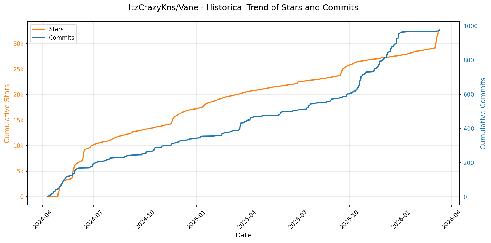

# 🌟 GitHub Trending 概览

> 数据更新于：2026-03-12

---

## 🔍 项目详情

### 1. [openclaw/openclaw](https://github.com/openclaw/openclaw)
- 📅 **创建日期**：2025-11-24  
- 🔄 **最近更新**：2026-03-12  
- ⭐ **Stars**：182,218（日 +3900｜周 +34852｜月 +118056）  
- 📝 **描述**：Your own personal AI assistant. Any OS. Any Platform. The lobster way. 🦞   

<b>📈 Star 与 Commit 历史趋势</b>

> *蓝色：累计 Stars｜橙色：累计 Commits（次 Y 轴）*

<b>📄 README 摘要</b>

1. **项目功能**  
OpenClaw 是一个完全本地化、用户自托管的个人 AI 助手系统，核心目标是让用户在**自有设备上运行专属 AI 助理**，实现真正私有、低延迟、始终在线的智能交互体验。它不依赖中心化云服务，而是通过轻量级“网关”（Gateway）作为统一控制平面，连接并协调多端能力：一方面接入**超 20 种主流通讯平台**（如 WhatsApp、Telegram、Slack、Discord、Signal、iMessage/BlueBubbles、微信替代品 Feishu/LINE、Matrix、Nostr、Twitch、Zalo 等），将消息统一收发；另一方面驱动**跨平台智能体（Agent）**，支持自然语言指令、多模态输入（语音唤醒、录音、图像）、可视化工作空间（Live Canvas）、设备级操作（macOS/iOS/Android 的摄像头、屏幕录制、定位、通知、系统命令等），并可自动调用浏览器、定时任务（Cron）、Webhook、Gmail Pub/Sub 等工具完成复杂自动化。

2. **关键特性**  
- **全通道统一收发**：原生支持 20+ 消息平台（含私有协议如 Signal、BlueBubbles、Nostr、Tlon），支持群组路由、提及触发、消息分块与隔离。  
- **本地优先架构**：单进程 Gateway 提供 WebSocket 控制平面，管理会话、通道、工具、事件、定时任务、Web UI（Control UI + WebChat）及 Canvas 主机，所有状态默认本地存储。  
- **多智能体路由与隔离**：支持按通道、账号或联系人路由至独立 Agent 工作区（Workspace），实现会话隔离、模型/技能/策略差异化配置。  
- **全平台语音与交互**：macOS/iOS 支持唤醒词（Voice Wake），Android 支持连续语音对话（Talk Mode），集成 ElevenLabs 与系统 TTS；支持语音转文字（ASR）与多模态媒体处理（图像/音视频上传、尺寸限制、临时文件生命周期管理）。  
- **Live Canvas 可视化工作区**：基于 A2UI 协议的实时渲染画布，由 Agent 驱动动态更新界面（push/reset/eval/snapshot），支持 macOS/iOS/Android 多端同步呈现。  
- **深度设备集成（Nodes）**：提供跨平台「节点」抽象，支持设备级原子操作——macOS 的 `system.run`/`system.notify`、iOS/Android 的相机快照/录屏、定位获取、通知推送、联系人/日历/SMS 访问（Android）、屏幕录制权限自动申请（TCC）等。  
- **安全默认与精细管控**：DM 默认启用配对机制（pairing code），拒绝未授权用户输入；支持白名单（`allowFrom`）、OAuth/API Key 混合认证、模型故障转移（failover）、会话剪枝（pruning）、权限分级（如 elevated bash 会话开关）。  
- **开箱即用的向导与运维工具**：内置 CLI 向导（`openclaw onboard`）全自动配置网关、通道、技能；`openclaw doctor` 实时诊断安全风险与配置错误；支持 Tailscale Serve/Funnel 远程安全访问、SSH 隧道、Nix 声明式部署、Docker 容器化安装。  
- **技能生态（ClawHub）**：内置技能注册中心，支持捆绑技能（bundled）、托管技能（managed）与工作区技能（workspace），具备安装门控、UI 集成与自动发现能力。  

3. **技术栈**  
- **运行时**：Node.js ≥22（主运行环境），支持 npm / pnpm / bun；TypeScript 编写，使用 `tsx` 直接执行源码。  
- **核心框架**：WebSocket 驱动的网关控制平面（自研 RPC 协议）；Pi Agent 运行时（RPC 模式，支持工具流式调用与响应块流式传输）。  
- **前端与 UI**：Web 控制台（Control UI）与 WebChat 内嵌于 Gateway；macOS 菜单栏应用（Swift + WebView）；iOS/Android 原生节点（Swift/Kotlin）；Canvas 使用 A2UI 协议（JSON Schema 描述 UI 结构，跨平台渲染）。  
- **信道集成**：复用成熟 SDK — Baileys（WhatsApp）、grammY（Telegram）、discord.js（Discord）、@slack/bolt（Slack）、signal-cli（Signal）、matrix-js-sdk（Matrix）等。  
- **语音与媒体**：ElevenLabs TTS；系统级 AVFoundation（macOS/iOS）、MediaRecorder（Android）；FFmpeg（音视频处理）；Whisper（可选 ASR）。  
- **部署与运维**：支持 systemd / launchd 用户服务、Docker 容器、NixOS 声明式配置、Tailscale Serve/Funnel 公网穿透、SSH 隧道远程接入；日志采用结构化 JSON 输出。  
- **安全机制**：OAuth 2.0（OpenAI 等）、API Key 管理、TCC 权限桥接（macOS）、密码/Token 认证（Tailscale Funnel）、DM 白名单与配对策略。

---

### 2. [x1xhlol/system-prompts-and-models-of-ai-tools](https://github.com/x1xhlol/system-prompts-and-models-of-ai-tools)
- 📅 **创建日期**：2025-03-05  
- 🔄 **最近更新**：2026-03-12  
- ⭐ **Stars**：130,458（日 +233｜周 +2505｜月 +16912）  
- 📝 **描述**：FULL Augment Code, Claude Code, Cluely, CodeBuddy, Comet, Cursor, Devin AI, Junie, Kiro, Leap.new, Lovable, Manus, NotionAI, Orchids.app, Perplexity, Poke, Qoder, Replit, Same.dev, Trae, Traycer AI, VSCode Agent, Warp.dev, Windsurf, Xcode, Z.ai Code, Dia & v0. (And other Open Sourced) System Prompts, Internal Tools & AI Models  

<b>📈 Star 与 Commit 历史趋势</b>

> *蓝色：累计 Stars｜橙色：累计 Commits（次 Y 轴）*

<b>📄 README 摘要</b>

该内容并非一个典型软件项目的 README（缺少项目名称、功能描述、安装使用说明等核心信息），而是一个**开源 AI 系统提示词（system prompts）与模型行为分析资源库的宣传性主页**。根据上下文和结构，可明确归纳如下：

1. **项目功能**  
   该项目是一个持续维护的**公开 GitHub 仓库**（`x1xhlol/system-prompts-and-models-of-ai-tools`），致力于系统性地收集、整理、逆向分析并公开主流 AI 工具（如 Copilot、Claude、Gemini、Kilo Code 等）的**真实系统提示词（system prompts）、模型配置细节及内部行为逻辑**，累计提供**超 30,000 行深度技术洞察**，旨在帮助开发者、安全研究员和 AI 工程师理解大模型底层约束、对齐机制与潜在风险。

2. **关键特性**  
   - ✅ **大规模真实提示词归档**：覆盖多款商业/开源 AI 工具的原始 system prompt 结构与语义策略；  
   - ✅ **模型行为逆向分析**：不仅提供文本，还包含对提示工程设计意图、安全护栏（guardrails）、角色设定逻辑的技术解读；  
   - ✅ **AI 安全倡导与实践支持**：内置安全警示（如“AI 创业公司数据泄露风险”），并推广配套工具 ZeroLeaks.ai 提供免费 AI 安全审计；  
   - ✅ **开源协作生态建设**：主动链接并支持同类优质开源项目（如 Kilo Code），强调透明化 AI 系统设计；  
   - ✅ **多维度社区支持**：提供 Discord 社群、X（Twitter）账号、邮件联系渠道，并集成 Star History、Trendshift 等数据看板追踪项目影响力。

3. **技术栈**  
   项目本身为**静态知识库型仓库**，不涉及运行时服务或复杂后端，其技术实现聚焦于：  
   - **文档与数据组织**：Markdown + Git 版本控制，结构化目录管理提示词与分析报告；  
   - **自动化展示与集成**：通过 CloudBack CI/CD 状态徽章、DeepWiki 语义搜索插件、Star History 图表等第三方服务增强可发现性与可信度；  
   - **基础设施依赖**：托管于 GitHub，依赖 GitHub Pages（隐含）、Discord API、Trendshift 分析平台、Latitude.so（AI 工程化监控平台）等外部工具链支撑运营与传播。  
   （注：未使用传统“前端/后端框架”，核心价值在于人工研究 + 开源协作流程 + 生态工具集成。）

---

### 3. [obra/superpowers](https://github.com/obra/superpowers)
- 📅 **创建日期**：2025-10-09  
- 🔄 **最近更新**：2026-03-12  
- ⭐ **Stars**：107,264（日 +1524｜周 +7519｜月 +30024）  
- 📝 **描述**：An agentic skills framework & software development methodology that works.  

<b>📈 Star 与 Commit 历史趋势</b>

> *蓝色：累计 Stars｜橙色：累计 Commits（次 Y 轴）*

<b>📄 README 摘要</b>

1. **该项目做什么？**  
Superpowers 是一个面向编程智能体（coding agents）的完整软件开发工作流增强系统。它不直接替代编码工具，而是通过一套可组合、自动触发的“技能”（skills）和预设行为准则，对现有AI编程助手（如 Claude Code、Cursor、Codex 等）进行深度赋能。其核心目标是将松散的、易偏离的 AI 编程行为，转变为结构化、可验证、符合工程最佳实践的协作式开发流程——从需求澄清、设计评审、TDD 实施、子智能体并行执行，到代码审查与分支收尾，全程由技能自动介入并强制执行，无需用户手动调用。

2. **关键特性**  
- **全流程自动化技能链**：覆盖开发全生命周期的 13+ 项原子技能（如 `brainstorming`、`writing-plans`、`subagent-driven-development`、`test-driven-development`、`requesting-code-review`、`finishing-a-development-branch`），按上下文自动触发，非可选建议，而是强制性工作流环节。  
- **严格工程规范内建**：原生贯彻 RED-GREEN-REFACTOR（TDD）、YAGNI（勿过度设计）、DRY（避免重复）、防御性验证（如 `verification-before-completion`）、根因导向调试（`systematic-debugging` 四阶段法）。  
- **人机协同增强机制**：强调“人类把关、AI执行”——设计分块确认、计划逐项签核、子任务双阶段审查（先验规范合规性，再审代码质量）、关键问题阻断式反馈（critical issues block progress）。  
- **子智能体驱动开发（Subagent-Driven Development）**：支持为每个开发任务派生独立子智能体，完成闭环实施 + 自检 + 互评，实现数小时级无人干预的高可靠性自主推进。  
- **跨平台即插即用**：原生适配 Claude Code、Cursor、Codex、OpenCode、Gemini CLI 等主流 AI 编程环境，提供标准化安装/更新命令及平台专属配置指南。

3. **技术栈**  
- **运行时环境**：依赖外部 AI 编程平台（非独立应用），作为插件/扩展运行于 Claude Code、Cursor、Codex、OpenCode、Gemini CLI 等客户端。  
- **核心范式**：基于“技能（Skill）”的声明式行为编排系统，每个技能为自包含的 Markdown 文档（如 `skills/test-driven-development/SKILL.md`），定义触发条件、执行逻辑、验证规则与反模式清单。  
- **基础设施层**：利用各平台原生插件机制（如 Claude 的 `/plugin install`、Cursor 的 `/add-plugin`、Gemini 的 `gemini extensions install`）实现分发；Git Worktrees 支撑隔离式分支开发；内置测试验证框架保障 TDD 合规性。  
- **元能力支撑**：内置 `writing-skills` 技能，支持用户遵循统一规范创建、测试并贡献新技能，形成可演进的开源技能库（所有技能源码直存 GitHub 仓库）。

---

### 4. [virattt/ai-hedge-fund](https://github.com/virattt/ai-hedge-fund)
- 📅 **创建日期**：2024-11-29  
- 🔄 **最近更新**：2026-03-12  
- ⭐ **Stars**：48,419（日 +575｜周 +2185｜月 +2642）  
- 📝 **描述**：An AI Hedge Fund Team  

<b>📈 Star 与 Commit 历史趋势</b>

> *蓝色：累计 Stars｜橙色：累计 Commits（次 Y 轴）*

<b>📄 README 摘要</b>

1. **项目功能**  
该项目是一个面向教育与研究目的的AI驱动对冲基金概念验证系统，**不执行真实交易**。其核心功能是模拟多智能体协作的投资决策流程：针对指定股票（如AAPL、MSFT等），调用18个专业化AI代理（agents）分别从不同投资哲学（如价值投资、成长投资、宏观对冲、情绪分析等）和分析维度（基本面、技术面、估值、市场情绪、风险管理）进行独立评估，生成交易信号；最终由“投资组合经理”代理整合所有信号并输出模拟买卖建议与回测结果。

2. **关键特性**  
- **多流派投资代理体系**：集成13位传奇投资者（如巴菲特、芒格、达摩达兰、木头姐等）风格的专属AI代理，每类代理基于其经典投资理念（如“安全边际”“颠覆性创新”“不对称机会”）进行逻辑推理；  
- **四维分析引擎**：内置估值代理（计算内在价值）、情绪代理（NLP分析市场情绪）、基本面代理（财务数据解读）、技术面代理（指标信号生成），实现多源异构信息融合；  
- **双模交互支持**：提供命令行接口（CLI）用于自动化/脚本化运行与回测，以及图形化Web应用界面，降低使用门槛；  
- **灵活部署能力**：支持云端大模型（OpenAI/Groq/Anthropic等）及本地Ollama运行的LLM后端，适配不同算力环境；  
- **可扩展回测框架**：内置`backtester.py`模块，支持按指定时间区间对多只股票进行历史策略回测并输出绩效报告；  
- **合规与教育导向设计**：强制API密钥隔离、明确免责声明、仅开放免费股票数据（AAPL/GOOGL/MSFT/NVDA/TSLA），强调非实盘、非投资建议属性。

3. **技术栈**  
- **编程语言**：Python（主程序、CLI、回测器）；  
- **AI/LLM层**：支持OpenAI（GPT-4o）、Groq、Anthropic（Claude）、DeepSeek及Ollama本地模型，通过统一接口调用；  
- **金融数据源**：Financial Datasets API（需密钥，其余5只股票免密访问）；  
- **依赖管理**：Poetry；  
- **Web前端（可选）**：独立`app/`子目录，采用现代Web框架（具体未明示，但含React/Vue类UI截图）；  
- **环境配置**：`.env`文件管理API密钥，`.env.example`提供模板；  
- **许可证**：MIT License。

---

### 5. [shareAI-lab/learn-claude-code](https://github.com/shareAI-lab/learn-claude-code)
- 📅 **创建日期**：2025-06-29  
- 🔄 **最近更新**：2026-03-12  
- ⭐ **Stars**：39,709（日 +100｜周 +3749｜月 +8332）  
- 📝 **描述**：Bash is all you need -  A nano Claude Code–like agent, built from 0 to 1  

<b>📈 Star 与 Commit 历史趋势</b>

> *蓝色：累计 Stars｜橙色：累计 Commits（次 Y 轴）*

<b>📄 README 摘要</b>

1. **该项目做什么？**  
该项目是一个面向教学的轻量级 AI 编程智能体（nano Claude Code-like agent）从零构建的学习工程，旨在通过**12 个渐进式会话（s01–s12）**，系统性地拆解并实现一个生产级代码智能体的核心运行范式——“代理循环”（Agent Loop）。它不追求功能完备的终端产品，而是聚焦于**可理解、可验证、可叠加的最小机制单元**：每个会话仅引入一项关键能力（如工具调用、任务分解、后台执行、多智能体协作、工作区隔离等），所有机制均严格构建在同一个基础循环之上，不修改主循环逻辑。最终目标是让学习者透彻掌握 AI 编程代理的内在构造原理，为构建真实可用的智能编码助手（如 Kode CLI / SDK）或常驻型 AI 助理（如 claw0）奠定扎实的底层认知基础。

2. **关键特性**  
- **分层渐进式教学设计**：12 个会话按认知复杂度递进，每会话对应一个核心机制与一句精炼口诀（如 s03 “无计划则漂移”，s12 “各司其职，目录隔离”），覆盖从单循环到多智能体协同的完整演进路径；  
- **严格复用的核心循环**：所有高级能力（规划、子代理、知识注入、上下文压缩、任务图、后台线程、团队通信、自动认领、工作树隔离）均作为“装饰层”叠加于统一的 `agent_loop` 之上，强化对基础范式的理解；  
- **生产级机制的教学化实现**：包含文件持久化任务图（s07）、守护线程异步执行（s08）、基于 JSONL 的轻量级智能体邮箱协议（s09–s11）、按任务 ID 绑定的独立工作目录隔离（s12）等贴近实际工程的关键模式；  
- **三阶段认知架构**：明确划分为「循环」→「规划与知识」→「持久化」→「团队」四大阶段，辅以工具数量 [N] 标注复杂度，支持按需深入；  
- **配套交互式学习平台**：提供 Next.js 构建的 Web 界面（`web/`），支持可视化流程图、代码逐行解析、文档查阅与实时演示，强化概念具象化；  
- **明确边界与取舍声明**：主动省略事件总线、权限治理、会话生命周期控制、MCP 全协议等非核心生产机制，避免认知过载，专注“最小可行代理范式”。

3. **技术栈**  
- **核心语言与运行时**：Python（主力实现所有 `agents/sXX_*.py` 参考代码），依赖 Anthropic 官方 SDK（`anthropic` 包）调用 Claude 模型；  
- **前端与交互平台**：TypeScript + Next.js（App Router），用于构建交互式学习 Web 应用（`web/` 目录）；  
- **基础设施与工具链**：  
  - 配置管理：`.env` 文件 + `python-dotenv`；  
  - 依赖管理：`requirements.txt`（含 `anthropic`, `pydantic`, `rich` 等）；  
  - 构建与验证：GitHub Actions CI（类型检查 `mypy` + Web 构建）；  
- **协议与数据格式**：JSONL（智能体间邮箱通信）、纯文本技能文件（`skills/`）、Markdown 文档（`docs/`）；  
- **部署与扩展生态**：配套 CLI 工具（Kode CLI，Node.js/npm）与嵌入式 SDK（Kode Agent SDK，TypeScript），以及姊妹项目 OpenClaw/claw0（基于相同核心扩展心跳、定时、多信道 IM、记忆与人格系统）。

---

### 6. [666ghj/BettaFish](https://github.com/666ghj/BettaFish)
- 📅 **创建日期**：2024-07-01  
- 🔄 **最近更新**：2026-03-12  
- ⭐ **Stars**：38,159（日 +270｜周 +2157｜月 +2873）  
- 📝 **描述**：微舆：人人可用的多Agent舆情分析助手，打破信息茧房，还原舆情原貌，预测未来走向，辅助决策！从0实现，不依赖任何框架。  

<b>📈 Star 与 Commit 历史趋势</b>

> *蓝色：累计 Stars｜橙色：累计 Commits（次 Y 轴）*

<b>📄 README 摘要</b>

1. **项目功能**  
BettaFish（微舆）是一个从零自研的多智能体（Multi-Agent）舆情分析系统，核心目标是打破信息茧房、还原真实舆情全貌、预测发展趋势并辅助业务决策。用户仅需以自然语言提出分析需求（如“分析武汉大学品牌声誉”），系统即可全自动完成：① 从微博、小红书、抖音、快手等30+国内外主流社媒及数百万条评论中实时采集数据；② 跨模态解析图文、短视频、结构化卡片（如天气、股票、日历）；③ 深度挖掘私有数据库（支持安全接入企业内部业务数据）；④ 多Agent协同辩论式分析；⑤ 生成交互式HTML、PDF及Markdown格式的深度研究报告。其定位已超越传统舆情监测，演进为“简洁通用的数据分析引擎”，可快速适配金融、教育、政务等垂直领域。

2. **关键特性**  
- **全域AI驱动监控**：7×24小时分布式爬虫集群（MindSpider），覆盖10+主流平台，支持热点发现与海量评论下钻。  
- **复合分析引擎**：融合5类专业Agent（Query/Media/Insight/Report/Forum）、微调模型（BERT/GPT-2/Qwen3）、统计模型及中间件，避免单一LLM局限。  
- **原生多模态理解**：深度解析短视频内容，并精准提取搜索引擎中的结构化多模态信息（如股价、天气卡片）。  
- **Agent“论坛”协作机制**：引入辩论主持人LLM，通过ForumEngine实现多轮链式思维碰撞、反思与动态策略调整，提升集体智能质量。  
- **公私域数据融合**：提供高安全性接口，无缝集成企业私有数据库，实现“外部舆情趋势 + 内部业务洞察”联合分析。  
- **轻量高扩展架构**：纯Python模块化设计，支持一键Docker部署；各Agent解耦清晰，开发者可轻松替换模型、工具或Prompt，实现领域定制（如改造为金融分析系统）。  
- **智能报告流水线**：基于IR（Intermediate Representation）中间表示，支持模板化、分块生成、多轮校验、SVG图表渲染及HTML/PDF/MD三端输出。

3. **技术栈**  
- **编程语言**：Python 3.9+（主力）  
- **框架与库**：Flask（Web服务）、Streamlit（单Agent调试界面）、SQLAlchemy（异步ORM）、Playwright（浏览器自动化爬虫）、WeasyPrint（PDF导出）、Pydantic（配置管理）、pytest（测试）  
- **AI/ML组件**：  
  - LLM层：OpenAI兼容API标准，支持自定义模型（含Qwen、BERT、GPT-2等LoRA微调版本）；  
  - 情感分析：集成BERT中文LoRA、多语言情感模型、小参数Qwen3微调版及传统机器学习方法；  
  - 多模态：视频/图像内容理解工具链、结构化卡片解析模块。  
- **基础设施**：Docker + docker-compose（容器编排）、PostgreSQL（主数据库，兼容MySQL）、Redis（可选缓存）  
- **前端与交付**：Jinja2模板引擎、交互式HTML报告（含动态图表）、SVG矢量图表渲染、PDF/Markdown自动化装订  
- **许可证**：GPL-2.0 开源协议

---

### 7. [ruvnet/RuView](https://github.com/ruvnet/RuView)
- 📅 **创建日期**：2025-06-07  
- 🔄 **最近更新**：2026-03-12  
- ⭐ **Stars**：35,628（日 +791｜周 +8296｜月 +29850）  
- 📝 **描述**：π RuView: WiFi DensePose turns commodity WiFi signals into real-time human pose estimation, vital sign monitoring, and presence detection — all without a single pixel of video.   

<b>📈 Star 与 Commit 历史趋势</b>

> *蓝色：累计 Stars｜橙色：累计 Commits（次 Y 轴）*

<b>📄 README 摘要</b>

1. **该项目做什么？**  
RuView 是一个基于 WiFi 信道状态信息（CSI）的边缘 AI 感知系统，无需摄像头、可穿戴设备或互联网连接，仅利用环境中已存在的无线信号（特别是 WiFi）实现非接触式人体感知。其核心能力包括：**穿墙人体姿态估计（WiFi DensePose）**、**无感呼吸与心率监测**、**多目标存在与运动检测**、**实时房间级空间建模与自适应环境学习**。系统通过分析人体对 WiFi 信号的散射扰动（如子载波幅值/相位变化），在本地（如 ESP32 硬件）完成全栈信号处理与推理，输出 17 关键点人体骨架、生命体征数据及环境指纹，并支持灾后搜救、老年看护、智慧建筑等隐私敏感场景。

2. **关键特性**  
- **隐私优先**：纯射频感知，不采集图像/视频，符合 GDPR/HIPAA 隐私合规要求；  
- **穿墙与鲁棒感知**：利用 WiFi 多径与菲涅尔区建模，穿透墙壁、家具、 rubble，支持黑暗、烟雾、遮挡环境；  
- **多目标与多视角融合**：4–6 节点 ESP32 多静态传感器网，提供 360° 覆盖、亚英寸精度，支持多人独立姿态与生命体征追踪（物理上限约 3–5 人/AP，可扩展）；  
- **完全自学习（Self-Learning）**：无需摄像头标注数据，直接从原始 CSI 信号中通过对比学习嵌入（ADR-024）与持久化场模型（ADR-030）实现端到端自主建模与持续适应；  
- **边缘原生高性能**：Rust 实现超低延迟管线（<100 μs/帧，54K fps），ESP32-S3 单节点即可运行完整感知（含 AMOLED 实时显示），零云依赖、零订阅费；  
- **跨环境泛化（MERIDIAN）**：通过对抗域泛化技术（ADR-027），训练一次模型即可部署于任意房间、建筑或硬件平台；  
- **安全可靠边缘组网**：采用 QUIC 协议加密多跳 mesh 通信（ADR-032），具备抗重放、防篡改与断连自愈能力；  
- **模块化智能服务**：提供标准化边缘模块（如跌倒报警、睡眠呼吸分析、客流热力图），支持一键 Docker 快速部署与 WASM 浏览器可视化（Observatory 仪表盘）。

3. **技术栈**  
- **编程语言**：Rust（主框架、信号处理流水线、AI 推理引擎、ESP32 固件）、Python（数据验证、训练辅助、仿真工具）；  
- **AI 与信号处理**：基于 RuVector 框架，融合注意力机制、图神经网络、Hampel 滤波、SpotFi 定位、BVP 提取、Fresnel 区建模、多带宽频谱分析及 6 阶“信号线协议”（CRV）；  
- **硬件平台**：主力为低成本 ESP32-S3（支持 CSI 流式采集 + 内置 AMOLED 显示），兼容 Intel 5300 / Atheros AR9580 等科研级 CSI 网卡；普通 WiFi 设备仅支持 RSSI 粗粒度存在检测；  
- **部署与生态**：多架构 Docker 镜像（amd64/arm64）、`.rvf` 可移植模型格式、Tauri v2 桌面管理应用（开发中）、Three.js 构建的全息可视化 Observatory；  
- **协议与安全**：QUIC mesh 加密通信、自定义 CSI TDM 时分复用协议、Signal-Line 协议栈；  
- **工程实践**：1300+ 自动化测试、48 份架构决策记录（ADR）、7 个领域驱动设计（DDD）模型、MIT 开源许可证。

---

### 8. [ItzCrazyKns/Vane](https://github.com/ItzCrazyKns/Vane)
- 📅 **创建日期**：2024-04-09  
- 🔄 **最近更新**：2026-03-12  
- ⭐ **Stars**：32,784（日 +128｜周 +1926｜月 +4086）  
- 📝 **描述**：Vane is an AI-powered answering engine.  

<b>📈 Star 与 Commit 历史趋势</b>

> *蓝色：累计 Stars｜橙色：累计 Commits（次 Y 轴）*

<b>📄 README 摘要</b>

1. **项目功能**  
Vane 是一个**隐私优先、本地运行的 AI 智能搜索与问答引擎**，完全在用户自有硬件上执行，不将搜索请求或数据上传至第三方服务器。它融合互联网公开知识与多源信息检索能力，支持调用本地大语言模型（通过 Ollama）及主流云 AI 服务（OpenAI、Anthropic Claude、Google Gemini、Groq 等），为用户提供**带可信来源引用的精准答案**，同时保障全程搜索行为的端到端隐私性。

2. **核心特性**  
- ✅ **多模态 AI 接入**：无缝集成本地（Ollama）与云端（OpenAI/Claude/Gemini/Groq 等）LLM，支持混合调度与模型切换；  
- ✅ **智能搜索模式分级**：提供「速度模式」（低延迟响应）、「平衡模式」（日常通用）、「质量模式」（深度研究+多步推理）三档策略；  
- ✅ **可定制化信息源**：默认基于隐私保护的 SearxNG 进行全网搜索，支持学术论文、技术论坛等垂直源，未来扩展 Tavily/Exa；  
- ✅ **富媒体交互能力**：支持图像/视频内容检索、PDF/文本/图片文件上传解析与问答、指定域名（如 `site:github.com`）定向搜索；  
- ✅ **增强型 UI 体验**：内嵌实时天气、股票行情、单位换算等上下文感知 Widget；智能搜索建议、浏览式「Discover」资讯流、本地持久化搜索历史；  
- ✅ **开发者友好**：提供完整 RESTful API，支持外部系统集成；支持一键部署（Sealos/RepoCloud/ClawCloud/Hostinger）及浏览器地址栏快捷搜索配置。

3. **技术栈**  
- **前端**：Next.js（React 框架，SSR/ISR 支持）、TypeScript、Tailwind CSS；  
- **后端**：Node.js（Express 或 Next.js API Routes）、Python（部分搜索/解析逻辑可能调用）；  
- **AI 集成层**：Ollama（本地 LLM 运行时）、OpenAI API / Anthropic SDK / Groq SDK 等标准化适配器；  
- **搜索基础设施**：SearxNG（默认内置 Docker 镜像，支持 JSON 输出与 Wolfram Alpha 引擎）、未来接入 Exa/Tavily；  
- **部署与运维**：Docker（主推方案，含 all-in-one 及 slim 版本）、Docker Compose；支持 Linux/macOS/Windows（通过 `host.docker.internal` 或主机 IP 解决容器网络通信）；  
- **其他关键组件**：Lemonade（可能用于文档解析或向量检索）、Wolfram Alpha（数学/科学计算支持）、本地文件存储卷（`vane-data` 持久化）。

---

### 9. [moeru-ai/airi](https://github.com/moeru-ai/airi)
- 📅 **创建日期**：2024-12-01  
- 🔄 **最近更新**：2026-03-12  
- ⭐ **Stars**：32,765（日 +492｜周 +7933｜月 +15475）  
- 📝 **描述**：💖🧸 Self hosted, you-owned Grok Companion, a container of souls of waifu, cyber livings to bring them into our worlds, wishing to achieve Neuro-sama's altitude. Capable of realtime voice chat, Minecraft, Factorio playing. Web / macOS / Windows supported.  

<b>📈 Star 与 Commit 历史趋势</b>

> *蓝色：累计 Stars｜橙色：累计 Commits（次 Y 轴）*

<b>📄 README 摘要</b>

1. **项目功能**  
AIRI 是一个开源的 AI 虚拟角色（AI waifu / VTuber）运行容器，旨在复刻并超越 Neuro-sama 这类具备实时交互能力的“数字生命体”。它使用户能在本地或任意设备上拥有、运行和完全掌控自己的个性化虚拟伴侣——不仅能进行自然语言对话、语音识别与合成，更能深度融入真实数字生活场景：如实时参与 Discord/Telegram 聊天、同步观看视频、边玩游戏（已支持 Minecraft 和 Factorio）边互动、感知用户屏幕内容（如编码行为），甚至通过 WebXR、VRM/Live2D 实现高表现力的 3D/2D 虚拟形象驱动。其核心目标是实现“属于用户的、可离线、可扩展、跨平台的自主数字生命”。

2. **关键特性**  
- **全栈多模态交互能力**：集成语音输入（浏览器麦克风、Discord 音频流）、客户端语音识别（WebAssembly 加速）、说话检测（VAD）、ElevenLabs 等 TTS 合成，构建完整“听-思-说”闭环。  
- **跨平台虚拟形象引擎**：原生支持 VRM（含自动眨眼、视线追踪、闲暇眼动）和 Live2D 模型控制与动画，兼顾专业性与轻量化。  
- **游戏与系统级深度集成**：已实现在 Minecraft 和 Factorio 中自主操作（含 PoC 及 RCON API 支持），并规划接入更多游戏与桌面环境（如屏幕理解、代码上下文感知）。  
- **分布式智能架构**：采用模块化设计，“脑（Brain）”、“耳（Ears）”、“口（Mouth）”、“身（Body）”解耦；内置浏览器端 DuckDB WASM / pglite 内存数据库，正在开发长期记忆系统 *Memory Alaya*。  
- **极致跨平台部署**：提供四套运行形态：① 浏览器/PWA 版（airi.moeru.ai）；② 桌面版（Stage Tamagotchi，基于 Tauri + Electron，支持 CUDA/Metal 加速推理）；③ 移动版（Stage Pocket，Capacitor 构建）；④ WebXR/VR 扩展版（关联子项目）。  
- **超广谱 LLM 生态兼容**：通过自研 xsai 框架，原生支持超 25 家主流 LLM 服务商（OpenAI、Claude、Gemini、Qwen、vLLM、Ollama、DeepSeek、Groq、Mistral、Cloudflare AI 等），并持续扩展中。  
- **开放插件与子项目生态**：围绕 AIRI 衍生出 unspeech（ASR/TTS 统一代理）、hfup（HuggingFace Spaces 部署工具）、xsai-transformers（Transformers.js 支持）、tauri-plugin-mcp（MCP 协议插件）、AIRI Factorio/DomeKeeper 等十余个协同子项目，形成完整 AI VTuber 开发技术栈。

3. **技术栈**  
- **前端框架**：Vue 3（Composition API + TypeScript），搭配 Vite 构建；UI 层采用自定义组件体系，深度集成 WebGPU（图形渲染/计算）、WebAudio（实时音频处理）、Web Workers（后台任务隔离）、WebAssembly（语音识别、本地推理加速）、WebSocket（实时通信）。  
- **桌面端**：Tauri（主框架）+ Electron（备选），底层调用 NVIDIA CUDA / Apple Metal 实现高性能本地模型推理（依托 candle 等 Rust 生态库）；使用 Drizzle ORM + DuckDB WASM 实现嵌入式关系型数据库。  
- **移动端**：Capacitor（iOS/Android 封装），支持 PWA 离线能力与原生设备访问。  
- **AI 核心层**：  
  - 推理后端：candle（Rust）、vLLM、Ollama、SGLang、Transformers.js（via xsai-transformers）；  
  - 语音处理：WebAssembly 编译的 Whisper.cpp / VAD 模型、ElevenLabs API、unspeech 统一 ASR/TTS 网关；  
  - 记忆与数据：DuckDB WASM（浏览器内）、pglite（轻量 Postgres）、规划中的 Memory Alaya（专用记忆系统）。  
- **基础设施与工具链**：PNPM（包管理）、Nix（跨平台可重现构建）、GitHub Actions（CI/CD）、Crowdin（多语言协作翻译）、Drizzle（数据库迁移）、MCP（Model Context Protocol）协议支持。

---

### 10. [msitarzewski/agency-agents](https://github.com/msitarzewski/agency-agents)
- 📅 **创建日期**：2025-10-13  
- 🔄 **最近更新**：2026-03-12  
- ⭐ **Stars**：30,240（日 +4688｜周 +24757｜月 +29286）  
- 📝 **描述**：A complete AI agency at your fingertips - From frontend wizards to Reddit community ninjas, from whimsy injectors to reality checkers. Each agent is a specialized expert with personality, processes, and proven deliverables.  

<b>📈 Star 与 Commit 历史趋势</b>

> *蓝色：累计 Stars｜橙色：累计 Commits（次 Y 轴）*

<b>📄 README 摘要</b>

1. **项目功能**  
该项目是一个模块化、可即插即用的AI代理（AI Agent）集合，旨在模拟真实数字营销与技术公司的专业团队。它不提供通用大模型调用接口或训练框架，而是聚焦于**预定义、角色明确、任务导向的AI专家人格模板库**。每个“代理”代表一个具备特定领域知识、独特沟通风格、标准化工作流程和可交付成果（如代码、文案、策略文档、配置脚本等）的AI协作角色。用户可将这些代理直接集成至支持自定义指令的AI开发工具（如Claude Code、Cursor、Aider等）中，实现“一键激活某位专家”，从而在实际工程、设计、广告投放、销售、产品、测试等业务场景中获得高度专业化、上下文连贯且结果可验证的AI协作支持。

2. **核心特性**  
- **深度专业化**：覆盖10+垂直领域（工程、设计、付费媒体、销售、营销、产品、项目管理、测试、支持、空间计算、特种职能），每个代理聚焦细分技能栈（如“Bilibili内容策略师”专精弹幕文化与UP主增长，“visionOS空间工程师”专注Apple Vision Pro原生开发）。  
- **人格化与可执行性**：每个代理包含完整身份设定（语气、价值观）、结构化工作流程、具体技术交付物（含真实代码片段、Prompt范例、配置模板、审计清单）及量化成功指标（如“Core Web Vitals优化达标率≥95%”）。  
- **多工具无缝集成**：提供自动化脚本（`convert.sh`/`install.sh`）一键生成并部署适配Cursor、Aider、Windsurf、GitHub Copilot、Gemini CLI、OpenCode等主流AI编程工具的专属配置，支持跨平台复用。  
- **开箱即用的生产就绪性**：所有代理均经实战迭代验证，强调“交付结果”而非抽象建议（例如“Frontend Developer”直接输出React组件代码+性能优化方案+Lighthouse报告解读）。  
- **本地化与全球化并重**：特别涵盖中国主流生态（微信小程序/公众号、小红书、B站、快手、百度SEO、淘宝/拼多多电商运营），满足本土化数字业务需求。

3. **技术栈**  
- **核心形态**：纯文本YAML/Markdown格式的结构化Agent定义文件（非代码运行时系统），依赖外部AI工具的指令理解与执行能力。  
- **集成层**：Shell脚本（`convert.sh`, `install.sh`）实现跨工具配置转换与自动化安装；支持JSON Schema、TOML、YAML等多种配置格式导出。  
- **目标运行环境**：Claude Code（主推）、Cursor、Aider、Windsurf、GitHub Copilot、Gemini CLI、OpenCode等支持自定义Agent指令的AI原生IDE/CLI工具。  
- **无后端依赖**：项目本身不包含服务器、数据库或模型推理服务，完全离线运行，所有逻辑通过提示词工程（Prompt Engineering）与工具链协同实现。

---

### 11. [bytedance/deer-flow](https://github.com/bytedance/deer-flow)
- 📅 **创建日期**：2025-05-07  
- 🔄 **最近更新**：2026-03-12  
- ⭐ **Stars**：29,397（日 +758｜周 +4986｜月 +9735）  
- 📝 **描述**：An open-source SuperAgent harness that researches, codes, and creates. With the help of sandboxes, memories, tools, skills and subagents, it handles different levels of tasks that could take minutes to hours.  

<b>📈 Star 与 Commit 历史趋势</b>

> *蓝色：累计 Stars｜橙色：累计 Commits（次 Y 轴）*

<b>📄 README 摘要</b>

1. **项目功能**  
DeerFlow 2.0 是一个开源的「超级智能体运行时框架（Super Agent Harness）」，旨在将大语言模型（LLM）转化为可实际执行复杂任务的生产级智能体系统。它不局限于传统问答或单步推理，而是通过动态编排子智能体（Sub-Agents）、受控沙箱环境（Sandbox）、结构化长期记忆（Long-Term Memory）及可扩展技能体系（Skills），完成端到端的多阶段任务——例如：深度网络调研 → 多源信息提取与验证 → 自动生成结构化报告/幻灯片/网页/图像 → 部署或交付成果。其核心定位是“让智能体真正做事”，而非仅生成文本。

2. **关键特性**  
- **模块化技能系统（Skills & Tools）**：以 Markdown 定义标准化能力单元（如 `research`、`slide-creation`、`image-generation`），支持按需加载、热插拔与自定义；内置 Claude Code 集成技能，实现终端直连调用。  
- **动态子智能体编排（Sub-Agents）**：主智能体可实时分解复杂任务，为各子任务创建独立上下文、工具集与终止条件的并行子智能体，并聚合结果生成统一输出。  
- **全隔离沙箱执行环境（Sandbox & File System）**：每个任务在独立 Docker 容器中运行，配备完整文件系统（`/mnt/user-data/` 下含 `uploads/`、`workspace/`、`outputs/`），支持 Bash 执行、代码运行、文件读写与多模态处理，保障安全、可审计、无会话污染。  
- **精细化上下文工程（Context Engineering）**：采用子智能体上下文隔离机制 + 自动摘要/文件卸载/上下文压缩策略，有效管理超长任务中的 Token 消耗，适配 100k+ 上下文模型。  
- **持久化长期记忆（Long-Term Memory）**：跨会话存储用户画像、偏好、技术栈、工作流习惯等，本地化保存、完全用户可控，实现个性化能力持续进化。  
- **多通道 IM 集成与 MCP 扩展**：原生支持 Telegram/Slack/飞书消息接入，零公网 IP 即可响应；通过 MCP（Model Context Protocol）服务器协议无缝集成外部工具与认证服务（如 OAuth 2.0）。  

3. **技术栈**  
- **核心框架**：LangChain（LLM 接入、工具链、模型抽象）、LangGraph（多智能体状态机编排、图工作流、SSE 流式通信）  
- **运行时环境**：Python（后端主语言）、Node.js（前端及 CLI 工具）、Docker（沙箱隔离）、Kubernetes（可选 provisioner 模式）  
- **基础设施**：Nginx（反向代理）、uv（Python 包管理与运行时）、pnpm（前端依赖）  
- **模型兼容层**：OpenAI 兼容 API 接口抽象，支持任意符合规范的 LLM（如 GPT-4、Claude、本地部署模型等）  
- **客户端支持**：提供嵌入式 Python SDK（`DeerFlowClient`），无需 HTTP 服务即可进程内调用全部能力，API 与网关严格对齐（Pydantic Schema CI 校验）  
- **搜索与数据获取**：深度集成 BytePlus 自研 InfoQuest 智能搜索与爬虫套件，强化结构化信息获取能力

---

### 12. [fishaudio/fish-speech](https://github.com/fishaudio/fish-speech)
- 📅 **创建日期**：2023-10-10  
- 🔄 **最近更新**：2026-03-12  
- ⭐ **Stars**：25,805（日 +529｜周 +711｜月 +995）  
- 📝 **描述**：SOTA Open Source TTS  

<b>📈 Star 与 Commit 历史趋势</b>

> *蓝色：累计 Stars｜橙色：累计 Commits（次 Y 轴）*

<b>📄 README 摘要</b>

1. **项目功能**  
Fish Speech（具体指 Fish Audio S2）是一个开源的先进多语言文本到语音（TTS）系统，专注于高保真、高表现力的语音合成与语音克隆。它能将任意文本（支持多种语言）实时合成为自然、富有情感和韵律变化的语音，并支持基于极短参考音频（10–30秒）的零样本（zero-shot）精准声音克隆；同时原生支持多说话人协同生成、多轮对话上下文感知合成，以及面向生产环境的低延迟流式语音输出。

2. **核心特性**  
- **细粒度自然语言内联控制**：无需预定义标签集，直接在文本中插入自由形式的自然语言指令（如 `[whisper in small voice]`、`[pitch up]`、`[super happy]`），实现词级别的情感、语调、风格等精细化调控；  
- **双自回归（Dual-Autoregressive, Dual-AR）架构**：采用“慢AR（时序主干，4B参数）+ 快AR（深度残差，400M参数）”异构设计，结合10层RVQ音频编解码器（~21 Hz帧率），兼顾建模能力与推理效率；  
- **强化学习对齐（GRPO）**：使用与数据筛选同源的奖励模型进行端到端策略优化，统一语义准确性、指令遵循性、声学偏好与音色相似性四大目标；  
- **SGLang 原生流式服务支持**：无缝集成 SGLang 推理框架，支持连续批处理、分页KV缓存、CUDA图重放与RadixAttention前缀缓存，在单张H200 GPU上实现 RTF=0.195、首音延迟≈100ms、吞吐量超3000声学token/s；  
- **开箱即用的多语言与多说话人能力**：原生支持中、英、日、韩、阿拉伯、德、法等24+语言，无需音素/语言标识符；通过 `<|speaker:i|>` 标记实现单次推理中混合多个说话人，且支持上传含多说话人的参考音频自动解耦建模；  
- **多轮上下文感知生成**：扩展上下文窗口，利用历史生成内容动态提升后续语音的表现力与自然度；  
- **快速语音克隆**：仅需10–30秒参考音频，即可准确复现目标音色、语速、语调及情感倾向，无需微调。

3. **技术栈**  
- **模型架构**：Decoder-only Transformer（双路径自回归）、RVQ音频编解码器（10 codebooks）；  
- **训练方法**：监督预训练 + GRPO（Group Relative Policy Optimization）强化学习对齐；  
- **推理与部署**：深度集成 [SGLang](https://github.com/sgl-project/sglang) 及其扩展项目 [SGLang-Omni](https://github.com/sgl-project/sglang-omni)，依赖 CUDA、Triton、FlashAttention 等底层加速库；  
- **工程生态**：提供 Docker 镜像（`fishaudio/fish-speech`）、WebUI、CLI 工具、HTTP 服务接口；模型权重托管于 Hugging Face（`fishaudio/s2-pro`）；  
- **基础依赖**：PyTorch、transformers、torchaudio、numpy、gradio（WebUI）、fastapi（服务端）；  
- **相关开源项目借鉴**：VITS2、Bert-VITS2、GPT-SoVITS、MQTTS、Qwen3-TTS 等语音与大模型技术成果。

---

### 13. [badlogic/pi-mono](https://github.com/badlogic/pi-mono)
- 📅 **创建日期**：2025-08-09  
- 🔄 **最近更新**：2026-03-12  
- ⭐ **Stars**：22,566（日 +347｜周 +2650｜月 +13719）  
- 📝 **描述**：AI agent toolkit: coding agent CLI, unified LLM API, TUI & web UI libraries, Slack bot, vLLM pods  

<b>📈 Star 与 Commit 历史趋势</b>

> *蓝色：累计 Stars｜橙色：累计 Commits（次 Y 轴）*

<b>📄 README 摘要</b>

1. **项目功能**  
该项目是一个面向AI智能体（Agent）开发与大语言模型（LLM）部署管理的开源单体仓库（Monorepo），核心目标是提供一套模块化、可组合的工具链，用于构建、运行和集成各类AI代理系统。其主打产品是“Pi 编程智能体”（pi-coding-agent），一个交互式命令行编程助手，能理解自然语言指令、分析代码上下文、生成/修改代码并执行调试任务；同时支持通过Slack（pi-mom）、终端（pi-tui）和Web界面（pi-web-ui）等多种入口接入，并可对接私有vLLM推理服务（pi-pods）。

2. **关键特性**  
- **多厂商LLM统一接口**：`pi-ai`包提供抽象层，无缝集成OpenAI、Anthropic、Google Gemini等主流LLM提供商，屏蔽底层API差异；  
- **可扩展的智能体运行时**：`pi-agent-core`支持工具调用（function calling）、会话状态持久化、记忆管理与执行流编排；  
- **多端交互能力**：提供CLI（coding-agent）、终端TUI（pi-tui，含差分渲染优化）、Web组件（pi-web-ui，可嵌入前端应用）及Slack机器人（pi-mom）；  
- **本地化LLM部署支持**：`pi-pods`为vLLM提供轻量级CLI管理工具，简化GPU服务器上高性能推理服务的启停、扩缩容与监控；  
- **开箱即用的开发体验**：内置标准化构建（`npm run build`）、类型检查、格式化与测试流程（含跳过密钥依赖测试的智能机制）；  
- **双角色协作设计**：明确支持人类开发者与AI代理协同贡献（见AGENTS.md），体现“人机共编”理念。

3. **技术栈**  
- **语言与运行时**：TypeScript（全栈主语言）、Node.js（后端/CLI运行环境）；  
- **前端框架**：无重型框架依赖，`pi-web-ui`基于原生Web Components（Custom Elements + Shadow DOM），`pi-tui`使用纯终端I/O与ANSI控制序列实现高性能TUI；  
- **LLM基础设施**：适配OpenAI兼容API、Anthropic Claude、Google Vertex AI等；推理部署层深度集成vLLM；  
- **工程化工具**：pnpm（未明示但monorepo惯例）、TypeScript编译器（tsc）、ESLint + Prettier（代码质量）、Vitest（测试）；  
- **部署与协作**：GitHub Actions CI/CD、Discord社区支持、MIT开源协议。

---

### 14. [AstrBotDevs/AstrBot](https://github.com/AstrBotDevs/AstrBot)
- 📅 **创建日期**：2022-12-08  
- 🔄 **最近更新**：2026-03-12  
- ⭐ **Stars**：21,061（日 +514｜周 +2130｜月 +5406）  
- 📝 **描述**：Agentic IM Chatbot infrastructure that integrates lots of IM platforms, LLMs, plugins and AI feature, and can be your openclaw alternative. ✨  

<b>📈 Star 与 Commit 历史趋势</b>

> *蓝色：累计 Stars｜橙色：累计 Commits（次 Y 轴）*

<b>📄 README 摘要</b>

1. **项目功能**  
AstrBot 是一个开源的一体化智能体（Agent）聊天机器人平台，专注于将大语言模型（LLM）能力深度集成至主流即时通讯（IM）平台中。它为个人用户、开发者及团队提供稳定、可扩展的对话式 AI 基础设施，支持快速构建生产级 AI 应用——无需从零开发后端服务，即可在 QQ、微信、飞书、钉钉、Telegram、Slack 等 10+ 平台中部署具备多模态理解、自主推理、任务执行与情感交互能力的 AI 助手。

2. **核心特性**  
- ✅ 完全免费开源，支持私有化部署与全链路可控；  
- ✅ 原生支持 LLM 对话、多模态输入（文本/图像）、智能体（Agent）架构、MCP（Model-Controller-Plugin）范式、技能系统、向量知识库、角色人格设定及自动上下文压缩；  
- ✅ 深度兼容 Dify、阿里云百炼、Coze 等主流 LLMOps 平台，可作为统一接入层或增强执行引擎；  
- ✅ 覆盖 15+ 消息平台（含 QQ/OneBot、微信公众号/企业微信、飞书、钉钉、Telegram、Slack、Discord、LINE、Misskey、Satori 等），官方维护全栈适配；  
- ✅ 内置插件市场，提供超 1000 个社区开发的一键安装插件（如天气、翻译、数据库查询、自动化脚本等）；  
- ✅ 独创「Agent 沙箱」机制：在隔离环境中安全执行 Python 代码、Shell 命令及会话级资源复用，兼顾灵活性与安全性；  
- ✅ 提供 WebUI 管理后台与独立 Web ChatUI（含内置沙箱与网页搜索），支持无客户端轻量交互；  
- ✅ 全面国际化（i18n），已提供简体中文、繁体中文、日语、法语、俄语等多语言文档与界面支持。

3. **技术栈**  
- **主语言**：Python 3.10+（核心服务、插件生态、CLI 工具链）；  
- **部署方案**：原生支持 `uv`（极快的 Python 包管理与运行时）、Docker / Docker Compose、RainYun 云一键部署、Replit 在线演示、AUR（Arch Linux）、BT-Panel / 1Panel / CasaOS 面板集成、以及源码手动编译；  
- **前端界面**：WebUI 与 ChatUI 均基于现代 Web 技术构建（未明确框架，但依赖 FastAPI/Starlette 后端提供 API）；  
- **模型接入层**：抽象统一模型网关，兼容 OpenAI/Gemini/Anthropic/Zhipu/DeepSeek/Moonshot 等数十种 LLM 服务，以及 Ollama/LM Studio 等本地模型，同时支持 Whisper/SenseVoice（语音识别）、多种 TTS 引擎（GPT-SoVITS、FishAudio、Azure、阿里云等）；  
- **开发规范**：采用 `ruff` 进行代码格式化与静态检查，使用 `pre-commit` 实现提交前自动化校验。

---

### 15. [666ghj/MiroFish](https://github.com/666ghj/MiroFish)
- 📅 **创建日期**：2025-11-26  
- 🔄 **最近更新**：2026-03-12  
- ⭐ **Stars**：16,819（日 +2542｜周 +12465｜月 +13175）  
- 📝 **描述**：A Simple and Universal Swarm Intelligence Engine, Predicting Anything. 简洁通用的群体智能引擎，预测万物  

<b>📈 Star 与 Commit 历史趋势</b>

> *蓝色：累计 Stars｜橙色：累计 Commits（次 Y 轴）*

<b>📄 README 摘要</b>

1. **项目功能**  
MiroFish 是一个基于多智能体（Multi-Agent）架构的通用群体智能预测引擎。它通过摄入现实世界的“种子信息”（如新闻、政策草案、小说文本、金融数据等），自动构建高保真、动态演化的平行数字世界；在该虚拟环境中，成千上万个具备独立人格、长期记忆与社会行为逻辑的AI智能体自主交互、协作或博弈，从而涌现出宏观趋势与微观事件。用户仅需上传原始材料并以自然语言提出预测问题（例如“若某政策出台，舆情将如何演化？”或“《红楼梦》后四十回可能如何发展？”），系统即返回结构化预测报告及可实时交互的仿真世界，实现“未来预演”与“假设推演”。

2. **关键特性**  
- **双模态输入适配**：支持结构化数据（分析报告）与非结构化文本（小说、新闻、社交媒体内容）作为仿真种子；  
- **高保真智能体建模**：每个Agent拥有个性化人设、持续记忆（由Zep Cloud支持）、因果推理能力与社会关系网络；  
- **动态上帝视角干预**：用户可在仿真过程中注入变量（如突发事件、政策调整、舆论引导），实时观察系统响应与路径分化；  
- **GraphRAG增强图谱构建**：融合知识图谱与检索增强生成（RAG），提升环境初始化的真实性与语义连贯性；  
- **全流程自动化工作流**：覆盖图谱构建 → 环境配置 → 并行仿真 → 报告生成 → 深度对话五大阶段，ReportAgent具备工具调用与后处理分析能力；  
- **开箱即用的多场景Demo**：已验证舆情推演（如武汉大学事件）、文学结局预测（《红楼梦》）、金融/时政模拟等典型用例；  
- **灵活部署支持**：提供源码一键部署（含Node.js+Python双栈管理）与Docker容器化方案，适配本地开发与轻量生产环境。

3. **技术栈**  
- **前端**：React（TypeScript）、Vite、Tailwind CSS、d3.js（可视化）、WebSocket（实时仿真状态同步）；  
- **后端**：Python（≥3.11）、FastAPI（REST API服务）、uv（高性能包管理器）、LangChain/CAMEL-OASIS（多智能体框架核心）；  
- **智能体基础设施**：  
  - LLM 接入层：兼容 OpenAI SDK 标准协议，实测集成阿里云百炼平台 Qwen-Plus；  
  - 记忆系统：Zep Cloud（支持长期会话记忆与向量检索）；  
  - 图谱构建：基于LLM的实体关系抽取 + GraphRAG 构建动态知识图；  
- **部署与运维**：Docker Compose、Nginx（可选反向代理）、`.env` 驱动的多环境配置；  
- **辅助工具链**：Node.js（v18+）用于前端构建与脚本编排，Git + GitHub Actions（CI/CD基础）。

---

### 16. [GoogleCloudPlatform/generative-ai](https://github.com/GoogleCloudPlatform/generative-ai)
- 📅 **创建日期**：2023-05-05  
- 🔄 **最近更新**：2026-03-12  
- ⭐ **Stars**：16,000（日 +236｜周 +3188｜月 +3389）  
- 📝 **描述**：Sample code and notebooks for Generative AI on Google Cloud, with Gemini on Vertex AI  

<b>📈 Star 与 Commit 历史趋势</b>

> *蓝色：累计 Stars｜橙色：累计 Commits（次 Y 轴）*

<b>📄 README 摘要</b>

1. **该项目的功能**  
该项目是一个面向生成式AI开发的官方示例资源库，旨在帮助开发者在Google Cloud平台上构建、部署和管理生成式AI工作流。它不提供独立运行的服务或产品，而是通过可执行的Jupyter Notebook、代码示例、演示应用及结构化文档，系统性地展示如何利用Google Cloud的生成式AI能力（特别是Vertex AI平台）实现各类AI任务，包括大语言模型调用（Gemini）、多模态生成（图像、语音）、检索增强生成（RAG）、企业级搜索、视觉理解与语音处理等。

2. **核心功能**  
- **Gemini全栈实践**：提供Gemini 3.1 Pro等最新模型的入门指南、函数调用（Function Calling）、实际用例（如对话机器人、代码辅助）及端到端应用示例；  
- **多模态AI支持**：覆盖视觉（Imagen API）——图像生成、编辑、图文描述、视觉问答；语音（Chirp API）——语音识别与合成；  
- **企业级搜索与知识增强**：集成Vertex AI Search（原Enterprise Search on GenAI App Builder），并专门设立RAG与Grounding专题目录，提供检索增强、数据溯源、可信内容生成等关键技术的实现方案；  
- **开箱即用的环境配置**：包含Google Cloud项目初始化、Vertex AI Python SDK安装、Colab与Vertex AI Workbench环境搭建等标准化指引；  
- **模块化组织与主题索引**：按技术领域（gemini / search / rag-grounding / vision / audio等）分类组织资源，并提供跨目录主题聚合（如RAG统一入口），便于快速定位对应能力的实践路径。

3. **技术栈**  
- **云平台**：Google Cloud Platform（GCP），核心依赖Vertex AI（统一AI开发与托管平台）；  
- **模型服务**：Gemini系列大语言模型（含3.1 Pro）、Imagen（文生图/图像编辑）、Chirp（语音处理）、Vertex AI Search（语义搜索+生成式摘要）；  
- **开发工具链**：Python为主编程语言，基于Jupyter Notebook交互式开发；深度集成Vertex AI Python SDK（`google-cloud-aiplatform`）、Google Cloud Client Libraries；  
- **基础设施与部署**：支持Google Colab（免配置快速试用）与Vertex AI Workbench（托管式Jupyter环境）；部分关联仓库涉及Terraform（基础设施即代码）、Vertex AI Pipelines（MLOps流水线）、GKE（AI on Kubernetes）等；  
- **扩展生态**：与Agent Development Kit（ADK）、GenMedia Creative Studio、Document AI、Cloud DLP等Google Cloud AI服务深度协同，体现端到端企业AI工程化能力。

---

### 17. [QwenLM/Qwen-Agent](https://github.com/QwenLM/Qwen-Agent)
- 📅 **创建日期**：2023-09-22  
- 🔄 **最近更新**：2026-03-12  
- ⭐ **Stars**：15,449（日 +94｜周 +1902｜月 +2253）  
- 📝 **描述**：Agent framework and applications built upon Qwen>=3.0, featuring Function Calling, MCP, Code Interpreter, RAG, Chrome extension, etc.  

<b>📈 Star 与 Commit 历史趋势</b>

> *蓝色：累计 Stars｜橙色：累计 Commits（次 Y 轴）*

<b>📄 README 摘要</b>

1. **项目功能**  
Qwen-Agent 是一个基于通义千问（Qwen）大语言模型能力构建的**LLM智能体（Agent）开发框架**，专注于支持指令遵循（instruction following）、工具调用（tool usage）、多步规划（planning）与记忆管理（memory）。它为开发者提供可复用的原子组件（如LLM封装、工具基类、Agent基类）和开箱即用的高阶应用，目前已作为官方产品 [Qwen Chat](https://chat.qwen.ai/) 的后端核心框架。其核心目标是赋能开发者快速构建具备复杂任务分解、外部工具协同与上下文感知能力的AI应用。

2. **关键特性**  
- ✅ **原生强工具调用支持**：支持并行函数调用（Parallel Function Calls）、多步/多轮工具链（如 QwQ-32B）、图像理解与操作（Qwen3-VL 工具调用示例）、代码解释器（Code Interpreter）等；  
- ✅ **多模态与多场景Agent模板**：内置 Browser Assistant（网页助手）、Code Interpreter（沙箱化Python执行）、Custom Assistant（可扩展自定义Agent），并支持 MCP（Model Context Protocol）协议集成；  
- ✅ **先进规划与推理能力**：集成 DeepPlanning 评估基准，支持 `reasoning_content` 字段解析、Think-Then-Act 范式（如 `<think>...</think>` 标记）、Tool-Integrated Reasoning（TIR，见 Qwen2.5-Math 示例）；  
- ✅ **企业级RAG与长文档处理**：提供高效轻量 RAG 方案（支持百万token文档）及高性能并行文档问答 Agent，已在“海中针”（needle-in-a-haystack）等严苛长上下文测试中显著优于原生长上下文模型；  
- ✅ **开箱即用的交互体验**：内置 Gradio 5 GUI 框架（需 Python ≥3.10），支持一键启动 Web 界面 Demo；  
- ✅ **灵活部署与模型兼容性**：无缝对接 DashScope API、vLLM（支持原生 tool-call 解析）、Ollama 等 OpenAI 兼容服务，并针对不同 Qwen 系列模型（Qwen2.5/Qwen3/QwQ/Qwen3-Coder/Qwen3-VL）提供定制化提示模板与配置建议。

3. **技术栈**  
- **核心语言与运行时**：Python 3.10+（GUI 强制要求）；  
- **前端界面**：Gradio ≥5.x（提供 WebUI 快速部署能力）；  
- **模型服务层**：  
  - 云服务：阿里云 DashScope（通过 `qwen_dashscope` 类型集成）；  
  - 自托管：vLLM（GPU 高吞吐部署）、Ollama（CPU/GPU 本地部署）、支持 OpenAI 兼容 API；  
- **工具与执行环境**：  
  - Code Interpreter：基于 Docker 容器的沙箱化 Python 执行（依赖本地 Docker）；  
  - MCP 支持：通过 `npx` / `uvx` 启动标准 MCP Server（如 memory、filesystem、sqlite）；  
- **辅助生态**：  
  - JSON5（参数解析）、urllib（URL 编码）、matplotlib（图像展示）、SQLite / Git / Node.js / uv（MCP 运行依赖）；  
- **架构设计**：面向对象模块化设计，含 `BaseChatModel`（LLM抽象）、`BaseTool`（工具抽象）、`Agent`（Agent基类）及具体实现如 `Assistant`、`FnCallAgent`、`ReActChat` 等。

---

### 18. [promptfoo/promptfoo](https://github.com/promptfoo/promptfoo)
- 📅 **创建日期**：2023-04-28  
- 🔄 **最近更新**：2026-03-12  
- ⭐ **Stars**：12,164（日 +200｜周 +1378｜月 +1822）  
- 📝 **描述**：Test your prompts, agents, and RAGs. Red teaming/pentesting/vulnerability scanning for AI. Compare performance of GPT, Claude, Gemini, Llama, and more. Simple declarative configs with command line and CI/CD integration.  

<b>📈 Star 与 Commit 历史趋势</b>

> *蓝色：累计 Stars｜橙色：累计 Commits（次 Y 轴）*

<b>📄 README 摘要</b>

1. **项目功能**  
Promptfoo 是一个面向大语言模型（LLM）应用的开源评估与红队测试（red teaming）工具，旨在帮助开发者系统化验证、加固和持续监控 AI 应用质量与安全性。它不依赖云端服务，所有评估均在本地执行，确保提示词（prompts）、输入数据及模型响应完全保留在用户设备上，杜绝敏感信息外泄。核心用途包括：自动化测试提示工程效果、多模型性能对比（如 GPT、Claude、Llama 等）、生成式 AI 安全漏洞扫描（如越狱、提示注入、隐私泄露、偏见等）、CI/CD 流水线集成、PR 代码扫描（识别 LLM 相关安全与合规风险），以及团队协作式结果共享与可视化分析。

2. **关键特性**  
- ✅ **全本地化评估**：零数据上传，100% 离线运行，保障 prompt 和数据隐私；  
- ✅ **多维自动化评测**：支持基于规则、LLM 自评（self-grading）、嵌入相似度、正则匹配、JSON Schema 验证等多种评估方法；  
- ✅ **专业红队能力**：内置数十种攻击模板（如指令绕过、角色扮演诱导、上下文淹没等），可自定义攻击策略并生成结构化安全报告；  
- ✅ **跨模型/供应商横向对比**：统一接口对接 OpenAI、Anthropic、Azure OpenAI、AWS Bedrock、Ollama、Google Vertex、Cohere 等 20+ LLM 提供商；  
- ✅ **开发友好体验**：CLI 命令行工具 + Web 可视化查看器（`promptfoo view`），支持实时重载（live reload）、结果缓存、增量评估；  
- ✅ **工程化集成能力**：提供 CI/CD 插件（GitHub Actions、GitLab CI）、Pull Request 安全扫描、Node.js SDK 及编程语言无关的 YAML/JSON 配置驱动；  
- ✅ **可扩展性与协作**：支持导出 HTML/PDF 报告、团队共享评估配置与结果、细粒度指标（准确率、延迟、成本、安全得分等）追踪。

3. **技术栈**  
- **核心语言**：TypeScript（主 CLI 与库）；  
- **运行时**：Node.js（v18+），同时提供 Python 包（`pip install promptfoo`）及 macOS Homebrew 支持；  
- **前端**：React + Vite 构建的 Web 查看器（`promptfoo view` 启动本地服务），使用 Tailwind CSS 实现响应式 UI；  
- **配置与数据格式**：YAML/JSON 驱动（`promptfoo.yaml` 定义测试用例、模型、评估逻辑）；  
- **底层能力**：基于标准 HTTP 客户端调用各类 LLM API；内置轻量级向量相似度计算（如 cosine）、正则引擎、JSON Schema 验证器；无数据库依赖，结果默认保存为本地 JSON 文件；  
- **许可与生态**：MIT 开源协议，npm / PyPI / Homebrew 多渠道分发，活跃 Discord 社区与完整文档站（Next.js 构建）。

---

### 19. [p-e-w/heretic](https://github.com/p-e-w/heretic)
- 📅 **创建日期**：2025-09-21  
- 🔄 **最近更新**：2026-03-12  
- ⭐ **Stars**：11,168（日 +0｜周 +1050｜月 +6243）  
- 📝 **描述**：Fully automatic censorship removal for language models  

<b>📈 Star 与 Commit 历史趋势</b>

> *蓝色：累计 Stars｜橙色：累计 Commits（次 Y 轴）*

<b>📄 README 摘要</b>

1. **项目功能**  
Heretic 是一个专用于全自动移除大语言模型（LLM）内置审查机制（即“安全对齐”或“censorship”）的开源工具。它无需微调、后训练或人工标注数据，即可对 Transformer 架构的密集型语言模型（包括部分多模态及 MoE 模型）执行无监督的“去审查化”（decensoring）。其核心目标是显著降低模型对敏感/有害提示的拒绝率（refusals），同时最大限度保留原始模型在无害提示下的输出质量与语义一致性（通过最小化 KL 散度衡量），从而生成高性能、低失真的“去审查模型”。

2. **关键特性**  
- **完全自动化流程**：用户仅需一条命令（如 `heretic Qwen/Qwen3-4B-Instruct-2507`）即可完成整个去审查流程，无需理解模型内部结构或手动调参；  
- **先进定向消融（Abliteration）实现**：基于差分均值法计算各层“拒绝方向”（refusal direction），并支持对注意力输出投影（attention out-projection）和 MLP 下投影（MLP down-projection）进行参数化正交消融；  
- **自适应参数优化引擎**：集成基于 TPE 算法的 Optuna 优化器，联合最小化拒绝率与 KL 散度，自动搜索最优消融参数（如方向索引、权重核形状/位置等）；  
- **创新性消融设计**：支持浮点型方向索引（实现跨层拒绝方向线性插值）、分组件独立参数配置（Attention/MLP 可设不同强度）、非恒定层间权重核，显著提升效果-保真度权衡；  
- **内置评估与验证工具**：提供一键式拒绝率/KL 散度基准测试（`--evaluate-model`），并支持量化（bitsandbytes 4-bit）以降低显存需求；  
- **可选研究级分析功能**：启用 `research` 模块后，可生成残差向量 PaCMAP 2D 投影动画、量化分析残差几何关系（含余弦相似度、范数、轮廓系数等数十项指标），助力模型可解释性研究。

3. **技术栈**  
- **核心框架**：Python 3.10+，PyTorch 2.2+（官方测试基于 PyTorch 2.8）；  
- **优化库**：Optuna（TPE 算法驱动超参优化）；  
- **降维与可视化**：PaCMAP（用于残差空间高维→2D 投影）、Matplotlib/Pillow（生成静态图与 GIF 动画）；  
- **模型支持生态**：Hugging Face Transformers 生态深度集成，兼容大多数 dense 架构（Llama、Gemma、Qwen、GPT-OSS 等）、部分 MoE 及多模态模型；支持 bitsandbytes 4-bit 量化；  
- **部署与分发**：通过 PyPI 发布（`pip install heretic-llm`），模型成果托管于 Hugging Face（已催生超 1000 个社区 Heretic 模型）；  
- **许可证**：GNU Affero General Public License v3.0（AGPL-3.0）。

---

### 20. [huggingface/skills](https://github.com/huggingface/skills)
- 📅 **创建日期**：2025-11-24  
- 🔄 **最近更新**：2026-03-12  
- ⭐ **Stars**：8,589（日 +86｜周 +670｜月 +7396）  
- 📝 **描述**：暂无描述  

<b>📈 Star 与 Commit 历史趋势</b>

> *蓝色：累计 Stars｜橙色：累计 Commits（次 Y 轴）*

<b>📄 README 摘要</b>

1. **项目功能**  
该项目提供一套标准化、可互操作的 AI 编程代理（coding agent）技能（Skills），专为 Hugging Face 生态系统中的典型机器学习与 AI 开发任务而设计。它不运行独立服务或应用，而是为各类主流 AI 编程代理工具（如 Claude Code、OpenAI Codex、Google Gemini CLI、Cursor）提供即插即用的“能力包”——每个技能是一个自包含的文件夹，封装了特定任务的指令（`SKILL.md`）、执行脚本、配置文件和资源，使 AI 代理能精准、可靠地完成如模型训练、数据集构建、模型评估、Gradio 应用开发、论文发布等专业任务。

2. **核心特性**  
- **跨平台兼容性**：原生支持四大主流编码代理工具（Claude Code、Codex、Gemini CLI、Cursor），通过各自标准格式（如 `SKILL.md`、`gemini-extension.json`、`.cursor-plugin/plugin.json`、`AGENTS.md`）实现无缝集成；提供统一 fallback 方案（`agents/AGENTS.md`）。  
- **标准化结构**：严格遵循开放的 [Agent Skills 规范](https://agentskills.io/specification)，每个技能含 YAML 前置元数据（名称、描述）和结构化指导文本，确保语义清晰、机器可解析、人工可维护。  
- **开箱即用的垂直技能库**：内置 12 个高实用性技能，覆盖 Hugging Face 全栈工作流，包括：HF CLI 操作、Gradio UI 构建、数据集探索与管理（含无 Python 依赖的 Dataset Viewer API 封装）、模型评估集成（支持 vLLM/lighteval/Artificial Analysis）、多模态模型训练（LLM SFT/DPO/GRPO、视觉模型 RTDETR/YOLOS/ViT）、论文出版、Trackio 实验追踪、Transformers.js 浏览器端推理等。  
- **开发者友好扩展机制**：提供清晰的贡献指南与自动化脚本（`./scripts/publish.sh`），支持一键复制、定制、验证并发布新技能；市场清单（`marketplace.json`）与技能文档分离管理，兼顾机器可读性与人类可发现性。

3. **技术栈**  
- **核心规范**：Agent Skills 开放标准（基于 Markdown + YAML 前置元数据）；适配 Anthropic（Claude）、OpenAI（Codex）、Google（Gemini CLI）、Cursor 等厂商的插件/扩展协议。  
- **配置与元数据**：YAML（`SKILL.md` 前置）、JSON（`gemini-extension.json`、`.cursor-plugin/plugin.json`、`.mcp.json`、`marketplace.json`）。  
- **运行时依赖**：技能本身不绑定特定语言，但所封装的脚本广泛使用 Python（`hf-cli`、训练/评估脚本）、JavaScript/TypeScript（`transformers-js`）、Shell/Bash（CLI 集成）、npx 工具链（Dataset Viewer）；依赖 Hugging Face 官方生态工具（`huggingface_hub`、`datasets`、`transformers`、`trl`、`lighteval`、`trackio`、`gradio`）及第三方库（`albumentations`、`parquetlens`）。  
- **基础设施集成**：深度对接 Hugging Face Hub API、Hugging Face Jobs 计算服务、HF Spaces、HF Trackio、HF Paper 页面等后端服务；支持 WebGPU/WASM（`transformers-js`）。  
- **工程辅助**：Python 脚本（`scripts/generate_agents.py` 自动生成表格）、Shell 脚本（`publish.sh` 自动化元数据生成与校验）、GitHub CI 验证（确保技能路径与 marketplace 描述一致性）。

---

### 21. [alibaba/OpenSandbox](https://github.com/alibaba/OpenSandbox)
- 📅 **创建日期**：2025-12-17  
- 🔄 **最近更新**：2026-03-12  
- ⭐ **Stars**：7,538（日 +112｜周 +1544｜月 +6500）  
- 📝 **描述**：OpenSandbox is a general-purpose sandbox platform for AI applications, offering multi-language SDKs, unified sandbox APIs, and Docker/Kubernetes runtimes for scenarios like Coding Agents, GUI Agents, Agent Evaluation, AI Code Execution, and RL Training.  

<b>📈 Star 与 Commit 历史趋势</b>

> *蓝色：累计 Stars｜橙色：累计 Commits（次 Y 轴）*

<b>📄 README 摘要</b>

1. **项目功能**  
OpenSandbox 是一个面向 AI 应用的通用型沙箱平台，旨在为各类高风险、需强隔离的 AI 工作负载提供安全、可控、可扩展的执行环境。它核心服务于 Coding Agents（编程智能体）、GUI Agents（图形界面智能体）、Agent 评测、AI 代码执行（如代码解释器）、强化学习（RL）训练等场景，支持从本地开发到大规模 Kubernetes 集群的全栈部署，实现“一次定义、多环境运行”。

2. **关键特性**  
- **多语言 SDK 支持**：提供 Python、Java/Kotlin、JavaScript/TypeScript、C#/.NET 官方 SDK，Go SDK 已列入路线图；覆盖沙箱生命周期管理、命令执行、文件操作及专用能力（如 Code Interpreter）。  
- **标准化沙箱协议与可扩展架构**：定义统一的沙箱生命周期 API 与执行 API（基于 OpenAPI 规范），允许用户自定义沙箱运行时（如集成新容器引擎或执行后端）。  
- **双模运行时支持**：内置 Docker（本地轻量级运行）和高性能 Kubernetes 运行时（支持分布式调度、弹性扩缩容），满足开发调试与生产级规模化需求。  
- **开箱即用的沙箱环境**：预置 Command（命令行）、Filesystem（文件系统）、Code Interpreter（多语言代码解释器）三大基础能力；并提供 Chrome/Playwright 浏览器自动化、VNC 桌面环境、VS Code Web（code-server）等高级沙箱示例。  
- **精细化网络管控**：通过统一 Ingress 网关（支持多种路由策略）和细粒度 per-sandbox Egress 控制（出站网络策略），保障沙箱间及沙箱与外部网络的安全隔离。  
- **强安全隔离能力**：原生兼容 gVisor、Kata Containers、Firecracker 等安全容器/微虚拟机运行时，实现沙箱工作负载与宿主机内核的深度隔离，满足 AI Agent 执行不可信代码的合规与安全要求。

3. **技术栈**  
- **服务端**：Python（FastAPI 框架）构建沙箱生命周期管理服务器（`server/`）；Rust 或 Go 可能用于高性能组件（如 `execd` 执行守护进程，文档未明示但符合行业实践）；Kubernetes 原生集成（Helm Charts、Operator 模式待确认，但 `kubernetes/` 目录表明深度适配）。  
- **客户端 SDK**：跨语言实现，包括 Python（`uv` 包管理）、Java/Kotlin（Maven）、TypeScript/JavaScript（npm）、C#/.NET（NuGet），均遵循统一协议接口。  
- **基础设施层**：Docker（默认本地运行时）、Kubernetes（生产级编排）、gVisor/Kata/Firecracker（可选安全容器运行时）；网络组件含自研 Ingress Proxy 与 Egress 控制模块。  
- **协议与规范**：基于 OpenAPI 3.0 定义标准 RESTful API（见 `specs/`）；配置使用 TOML 格式（如 `~/.sandbox.toml`）；整体遵循云原生设计原则（松耦合、声明式、可观测）。

---

### 22. [superset-sh/superset](https://github.com/superset-sh/superset)
- 📅 **创建日期**：2025-10-21  
- 🔄 **最近更新**：2026-03-12  
- ⭐ **Stars**：6,666（日 +129｜周 +1841｜月 +5247）  
- 📝 **描述**：IDE for the AI Agents Era - Run an army of Claude Code, Codex, etc. on your machine  

<b>📈 Star 与 Commit 历史趋势</b>

> *蓝色：累计 Stars｜橙色：累计 Commits（次 Y 轴）*

<b>📄 README 摘要</b>

1. **项目功能**  
Superset 是一款面向开发者的桌面终端应用，专为运行和管理多个 CLI 编码代理（Coding Agents）而设计。它并非传统终端的替代品，而是作为“编码代理的操作系统”——在本地 macOS 环境中统一调度、隔离执行、实时监控并协同处理多个 AI 编程代理任务（如 Claude Code、Cursor Agent、GitHub Copilot 等），显著提升多任务编程场景下的效率与可控性。

2. **核心特性**  
- **并行执行**：支持同时运行 10+ 个 CLI 编码代理，互不阻塞；  
- **工作树隔离**：为每个任务自动创建独立 Git worktree（含专属分支与工作目录），杜绝代码/状态干扰；  
- **集中化监控**：全局视图跟踪各代理运行状态，变更就绪时主动通知用户；  
- **内建差异对比与编辑器**：无需切换应用即可查看、审查、手动修改代理生成的代码变更；  
- **工作区预设（Workspace Presets）**：通过脚本自动化环境配置、依赖安装等初始化/清理流程；  
- **全 CLI 代理兼容**：只要能在终端运行的编码代理（无论是否开源或商业），均可无缝接入；  
- **极速上下文切换**：支持快捷键一键跳转至任意活跃任务工作区；  
- **深度 IDE 集成**：单击即可在 VS Code、Vim 等外部编辑器中打开当前工作区。

3. **技术栈**  
- **桌面框架**：Electron（构建跨平台原生桌面应用）；  
- **前端**：React + TypeScript + Tailwind CSS（响应式 UI 与组件化开发）；  
- **构建与工具链**：Bun（运行时与包管理）、Vite（快速热更新开发服务器）、Turborepo（高性能单体仓库构建编排）、Biome（一体化代码格式化/检查/修复）；  
- **数据层**：Drizzle ORM（TypeScript 优先的数据库抽象）、Neon（无服务 PostgreSQL 托管，用于本地/远程状态同步）；  
- **前后端通信**：tRPC（端到端类型安全的 API 框架，零序列化开销）；  
- **基础设施**：Caddy（反向代理，支撑 Electric SQL 实时数据流）。

---

### 23. [Jeffallan/claude-skills](https://github.com/Jeffallan/claude-skills)
- 📅 **创建日期**：2025-10-20  
- 🔄 **最近更新**：2026-03-12  
- ⭐ **Stars**：6,323（日 +147｜周 +1586｜月 +5856）  
- 📝 **描述**：66 Specialized Skills for Full-Stack Developers. Transform Claude Code into your expert pair programmer.  

<b>📈 Star 与 Commit 历史趋势</b>

> *蓝色：累计 Stars｜橙色：累计 Commits（次 Y 轴）*

<b>📄 README 摘要</b>

1. **项目功能**  
该项目是一个专为 Anthropic Claude Code（Claude 编程插件）设计的高性能技能扩展套件（`claude-skills`），旨在将 Claude 转变为面向全栈开发者的智能工程协作者。它不提供独立运行环境，而是通过 Claude Code 插件机制深度集成，自动感知用户上下文（如技术栈、任务类型、项目结构），按需激活对应领域专家技能，并加载精准的参考文档（如框架最佳实践、API 规范、安全配置模板等），从而在真实开发场景中实现「请求即响应、提问即执行」的上下文驱动式编程辅助。

2. **核心特性**  
- **66 项专业化技能**：覆盖 12 大技术领域（含 TypeScript/Python/Go 等语言、React/NestJS/Spring Boot 等前后端框架、AWS/Terraform/K8s 等基础设施、REST/GraphQL/API 设计、Jest/Cypress 测试、CI/CD/DevOps、OWASP 安全、SQL/LLM 数据工程、AWS/Azure/GCP 平台专项等）；  
- **9 个端到端项目工作流命令**：支持从需求发现（Discovery）、架构设计、功能开发、缺陷排查、安全加固，到 Jira/Confluence 集成、复盘回顾（Retrospective）的完整软件工程生命周期管理；  
- **上下文感知自动激活**：无需手动调用技能，系统根据自然语言指令语义（如“为 NestJS API 实现 JWT 认证”）自动匹配并加载 `NestJS Expert` 技能及对应 `references/authentication.md` 文档；  
- **多技能协同工作流**：复杂任务触发链式技能组合（如 Feature Development = Feature Forge → Architecture Designer → Fullstack Guardian → Test Master → DevOps Engineer）；  
- **上下文工程能力**：通过 `/common-ground` 命令显式揭示并校准 Claude 对项目隐含假设（如技术选型、部署约束、合规要求），提升响应准确性与可解释性；  
- **企业级集成就绪**：原生支持 Atlassian MCP（Model Control Protocol）服务器，无缝对接 Jira（任务追踪）、Confluence（知识库）等企业协作平台。

3. **技术栈**  
- **运行时环境**：完全依赖 Anthropic 官方 [Claude Code](https://docs.anthropic.com/en/docs/claudes-code) 插件平台（非独立应用，无前端/后端服务）；  
- **技能定义层**：基于 Markdown 的声明式技能描述（`skills/*/SKILL.md`）与结构化参考文档（`skills/*/references/`，共 365+ 文件），含决策树、版本兼容性、典型用例；  
- **工作流引擎**：基于 Atlassian MCP 协议实现的标准化工作流命令（如 `/epic-start`, `/bug-investigate`, `/security-audit`），需配合自托管 Atlassian MCP 服务器；  
- **工程实践**：MIT 开源许可，GitHub Actions CI 自动化验证，模块化技能目录结构，支持本地技能开发与贡献（`local_skill_development.md`）；  
- **基础设施**：文档站点托管于 GitHub Pages（`jeffallan.github.io/claude-skills`），使用 Vercel Capsule 渲染动态 Banner，徽章系统集成 Trendshift、Awesome 等生态指标。

---

### 24. [steipete/gogcli](https://github.com/steipete/gogcli)
- 📅 **创建日期**：2025-12-12  
- 🔄 **最近更新**：2026-03-12  
- ⭐ **Stars**：6,223（日 +60｜周 +690｜月 +4671）  
- 📝 **描述**：Google Suite CLI: Gmail, GCal, GDrive, GContacts.  

<b>📈 Star 与 Commit 历史趋势</b>

> *蓝色：累计 Stars｜橙色：累计 Commits（次 Y 轴）*

<b>📄 README 摘要</b>

1. **项目功能**  
`gogcli` 是一个面向终端的高性能、脚本友好的命令行工具，旨在将 Google Workspace（原 G Suite）全生态服务无缝集成至命令行环境。它并非简单封装单个 API，而是提供统一 CLI 接口，直接操作 Gmail、Calendar、Chat、Classroom、Drive、Docs、Sheets、Slides、Forms、Apps Script、Contacts、Tasks、People、Admin、Groups、Keep 等 16+ 项 Google 服务，支持跨服务协同（如通过 Drive API 操作 Docs/Sheets）、多账户并行管理，并专为自动化、CI/CD、运维脚本和本地开发代理场景深度优化。

2. **核心特性**  
- **全栈服务覆盖**：支持邮件收发/标签/过滤器/推送监听（Gmail）、日程增删改查/会议建议/工作状态事件（Calendar）、课程/作业/学生管理（Classroom）、空间消息与反应（Chat）、文件上传下载/权限/共享云盘（Drive）、联系人/组织信息/目录搜索（Contacts/People）、任务列表与 RRULE 重复调度（Tasks）、电子表格读写/格式/公式/链接（Sheets）、表单创建与响应分析（Forms）、Apps Script 项目绑定与函数调用、文档/幻灯片的 Markdown 导入导出与模板生成（Docs/Slides）、Workspace 专属的 Admin 目录管理、Groups 成员查询、Keep 笔记管理（需服务账号）等；  
- **生产级认证与安全体系**：支持 OAuth2 刷新令牌（含自动续期）、服务账号 + 域范围委派（Workspace 优先）、ADC、直连访问令牌、手动/远程/代理安全授权流程；提供最小权限控制（`--readonly` / `--drive-scope` / `--gmail-scope` / `--extra-scopes`），并强制隔离旧授权范围；  
- **工程友好设计**：默认 JSON 输出（`--json`）、稳定 TSV（`--plain`）、多账户别名与自动路由（基于域名/配置映射）、命令白名单（沙箱限制）、OS 原生密钥环（macOS Keychain）或加密磁盘密钥环、无交互式 CI 支持（`GOG_KEYRING_PASSWORD`）、细粒度服务作用域矩阵与动态权限申请（`--force-consent`）；  
- **增强实用性功能**：邮件打开追踪（集成 Cloudflare Worker 后端）、本地/UTC 时间快速显示、日历输出自动添加星期字段、批量文件替换上传、Docs/Sheets 富文本查找替换、Slides Markdown 模板生成、Pub/Sub Webhook 监听、OAuth 回调地址自定义（适配反向代理/隧道）等。

3. **技术栈**  
- **主语言**：Go（从源码构建流程 `make` 及脚本如 `gen-auth-services-md.go` 可确认）；  
- **认证体系**：Google OAuth 2.0 协议、Google Cloud Service Accounts（含 Domain-wide Delegation）、Application Default Credentials（ADC）、Cloudflare Workers（用于邮件追踪后端）；  
- **存储与安全**：OS 原生密钥管理（macOS Keychain）、AES-256 加密磁盘密钥环（`file` backend）、环境变量与配置文件（JSON5 格式）驱动的多层配置优先级；  
- **API 依赖**：全面对接 Google 官方 REST API，包括 `gmail.googleapis.com`、`calendar-json.googleapis.com`、`chat.googleapis.com`、`classroom.googleapis.com`、`drive.googleapis.com`、`docs.googleapis.com`、`sheets.googleapis.com`、`slides.googleapis.com`、`forms.googleapis.com`、`script.googleapis.com`、`people.googleapis.com`、`tasks.googleapis.com`、`keep.googleapis.com`、`admin.googleapis.com`、`cloudidentity.googleapis.com` 等；  
- **分发方式**：原生支持 Homebrew（macOS/Linux）、AUR（Arch Linux），并提供标准 Go 构建流程（`make`）。

---

### 25. [volcengine/OpenViking](https://github.com/volcengine/OpenViking)
- 📅 **创建日期**：2026-01-05  
- 🔄 **最近更新**：2026-03-12  
- ⭐ **Stars**：5,828（日 +189｜周 +1209｜月 +4747）  
- 📝 **描述**：OpenViking is an open-source context database designed specifically for AI Agents(such as openclaw). OpenViking unifies the management of context (memory, resources, and skills) that Agents need through a file system paradigm, enabling hierarchical context delivery and self-evolving.  

<b>📈 Star 与 Commit 历史趋势</b>

> *蓝色：累计 Stars｜橙色：累计 Commits（次 Y 轴）*

<b>📄 README 摘要</b>

1. **项目功能**  
OpenViking 是一个专为 AI Agent 设计的开源**上下文数据库（Context Database）**，旨在系统性解决 Agent 开发中长期存在的上下文管理难题。它不依赖传统 RAG 的扁平化向量存储范式，而是提出并实现了一种类文件系统的上下文组织与交互范式（“File System Paradigm”），将 Agent 所需的记忆（memories）、资源（resources）和技能（skills）统一建模为虚拟文件系统中的结构化实体（通过 `viking://` 协议寻址），从而提供可定位、可遍历、可调试、可迭代的上下文全生命周期管理能力。

2. **核心特性**  
- **文件系统化管理**：以目录树结构统一组织各类上下文（如 `viking://resources/`, `viking://user/`, `viking://agent/`），支持标准命令（`ls`, `tree`, `find`, `grep`）进行确定性操作，彻底解决上下文碎片化问题；  
- **三级分层加载（L0/L1/L2）**：自动将上下文切分为摘要层（L0，百 token 级）、概览层（L1，千 token 级）和细节层（L2，原始内容），按需加载，显著降低大模型输入 token 消耗（实测较基线降低超 90%）；  
- **目录递归检索**：融合意图分析、向量初筛、目录内精检与多级递归钻取，实现“先定位高相关目录，再逐层细化内容”的精准上下文获取，大幅提升复杂查询的召回质量；  
- **可视化检索轨迹**：完整记录并展示从初始查询到最终结果的完整路径（含目录跳转、语义匹配分数、层级选择依据），使上下文检索过程完全可观、可解释、可调试；  
- **自动会话记忆迭代**：在对话过程中自动压缩对话内容、工具调用、资源引用等信息，提取长期记忆并沉淀至文件系统，实现 Agent 能力随使用持续进化。

3. **技术栈**  
- **核心语言与框架**：Python（主服务与 SDK）、Rust（高性能 CLI 工具 `ov_cli`）、Go（AGFS 文件系统组件）、C++（核心性能敏感扩展，需 GCC 9+/Clang 11+ 编译）；  
- **模型支持**：  
  - 视觉语言模型（VLM）：原生集成 VolcEngine（Doubao）、OpenAI（GPT-4o Vision）及 LiteLLM 统一网关（支持 Anthropic/Claude、DeepSeek、Gemini、Qwen/DashScope、vLLM、Ollama 等数十种模型）；  
  - 嵌入模型（Embedding）：支持 VolcEngine（Doubao Embedding）、OpenAI（text-embedding-3-large）、Jina 等；  
- **架构与协议**：基于 HTTP 的微服务架构，自定义 `viking://` URI 协议抽象上下文资源，配套 CLI（`ov`）、服务端（`openviking-server`）与插件生态（如 VikingBot Agent 框架、OpenClaw 记忆插件）；  
- **部署环境**：跨平台支持 Linux/macOS/Windows，生产推荐部署于火山引擎 ECS（veLinux 系统），支持本地模型（Ollama/vLLM）及云 API 混合接入。

---

### 26. [teng-lin/notebooklm-py](https://github.com/teng-lin/notebooklm-py)
- 📅 **创建日期**：2026-01-07  
- 🔄 **最近更新**：2026-03-12  
- ⭐ **Stars**：5,054（日 +321｜周 +2230｜月 +3200）  
- 📝 **描述**：Unofficial Python API and agentic skill for Google NotebookLM. Full programmatic access to NotebookLM's features—including capabilities the web UI doesn't expose—via Python, CLI, and AI agents like Claude Code, Codex, and OpenClaw.  

<b>📈 Star 与 Commit 历史趋势</b>

> *蓝色：累计 Stars｜橙色：累计 Commits（次 Y 轴）*

<b>📄 README 摘要</b>

1. **该项目做什么？**  
该项目是一个**非官方的 Google NotebookLM Python 封装库**，旨在提供对 NotebookLM 全功能的**程序化访问能力**。它绕过官方 Web 界面限制，直接调用 Google 内部（未公开）API，使用户能通过 Python 代码、命令行工具（CLI）或 AI 代理（如 Claude Code）全自动地操作 NotebookLM 的全部核心能力——包括创建/管理笔记、批量导入多源资料（网页、PDF、YouTube、Google Drive 等）、智能问答、深度研究（Web/Drive 自动检索与索引）、以及生成多样化内容（播客、视频、幻灯片、测验、思维导图等），并支持批量下载与结构化导出（如 Quiz 导出为 JSON/Markdown、Mind Map 导出为可解析 JSON、Slide Deck 导出为可编辑 PPTX），这些功能在官方 Web UI 中均不可用或不完整。

2. **关键特性**  
- ✅ **全功能覆盖**：完整支持 NotebookLM 的笔记管理、多格式源文件（URL/YouTube/PDF/Word/音视频/图像/Drive/纯文本）增删查、带历史与角色的对话、Web/Drive 双模自动研究（含 fast/deep 模式）、细粒度分享与权限控制；  
- ✅ **全类型内容生成**：支持 Audio Overview（4 风格+3 时长+50+语言）、Video Overview（9 视觉风格）、Slide Deck（含单页修订）、Infographic、Quiz、Flashcards、Report（含自定义模板）、Data Table（NL 生成 CSV）、Mind Map（交互式+JSON 导出）；  
- ✅ **超越 Web UI 的独有能力**：批量下载任意产物、Quiz/Flashcards 多格式导出（JSON/MD/HTML）、Mind Map 层级 JSON 提取、Data Table CSV 下载、PPTX 幻灯片导出、自然语言驱动的单页幻灯片修订、聊天记录保存为笔记、源文档全文提取、程序化权限管理；  
- ✅ **三重使用方式统一支持**：Python 异步 API（适合集成与复杂流水线）、CLI（适合脚本/CICD/快速任务）、Agent Skills（原生适配 Claude Code，支持自然语言指令自动化）。

3. **技术栈**  
- **核心语言**：Python 3.10–3.14（官方兼容）；  
- **HTTP 客户端**：基于 `httpx`（异步优先）实现高性能、可配置的 API 调用；  
- **身份认证**：依赖 `playwright`（Chromium）实现浏览器自动化登录（首次授权），凭证安全存储于本地；  
- **CLI 框架**：采用 `typer` 构建直观、自动生成帮助文档的命令行接口；  
- **异步架构**：全面基于 `asyncio`，所有 I/O 操作（请求、轮询、下载）均为异步，支持高并发与流式处理；  
- **AI 代理集成**：提供标准化 Skill 接口，已预置 Claude Code 兼容技能包，支持 LLM 以自然语言触发 NotebookLM 操作；  
- **开发与测试**：GitHub Actions CI/CD、`pytest` + `pytest-asyncio` 测试套件、`pydantic` 进行 RPC 响应结构校验；  
- **跨平台支持**：macOS / Linux / Windows 全平台验证通过。

---

### 27. [alibaba/page-agent](https://github.com/alibaba/page-agent)
- 📅 **创建日期**：2025-09-23  
- 🔄 **最近更新**：2026-03-12  
- ⭐ **Stars**：4,774（日 +1102｜周 +4115｜月 +4162）  
- 📝 **描述**：JavaScript in-page GUI agent. Control web interfaces with natural language.  

<b>📈 Star 与 Commit 历史趋势</b>

> *蓝色：累计 Stars｜橙色：累计 Commits（次 Y 轴）*

<b>📄 README 摘要</b>

1. **该项目的功能**  
Page Agent 是一个嵌入网页的客户端 GUI 智能体（GUI Agent），使用户能够通过自然语言指令直接操控网页界面。它无需后端服务、浏览器扩展、Python 运行时或无头浏览器，所有逻辑均在浏览器内执行；核心能力是解析用户自然语言指令（如“点击登录按钮”），理解当前页面 DOM 结构，并自主生成并执行对应 DOM 操作（如 `click()`、`input()`、`submit()` 等），实现零配置、低侵入式的网页自动化与智能交互。

2. **关键特性**  
- **极简集成**：纯前端 JavaScript 脚本，一行 `<script>` 即可启用，无额外运行时依赖；  
- **纯文本 DOM 操作**：不依赖截图、视觉模型或多模态 LLM，仅基于 HTML 文本结构与语义分析，隐私友好、性能高效；  
- **LLM 可插拔**：支持用户自选任意兼容 OpenAI 兼容 API 的 LLM（如 Qwen、Qwen3.5-Plus、GPT 等），灵活对接自有模型服务；  
- **人机协同 UI**：内置美观、可交互的悬浮面板，支持指令确认、步骤回溯、错误修正等 human-in-the-loop 机制；  
- **可选多页扩展能力**：提供官方 Chrome 扩展，支持跨标签页（multi-tab）任务编排，突破单页限制；  
- **开箱即用场景覆盖**：原生适配 SaaS AI 助手、智能表单填充（ERP/CRM 场景）、无障碍访问（语音/屏幕阅读器集成）等高价值用例。

3. **技术栈**  
- **核心语言**：TypeScript（强类型、高可维护性）；  
- **运行环境**：纯浏览器端（Client-side only），基于现代 Web API（DOM API、Fetch API、Intersection Observer 等）；  
- **构建与分发**：使用 Vite 构建，输出 IIFE 格式供 CDN 直接引入；支持 NPM 包管理；  
- **依赖基础**：深度复用并扩展 [`browser-use`](https://github.com/browser-use/browser-use) 的 DOM 解析、元素定位与操作组件（MIT 许可）；  
- **协议标准**：遵循 OpenAI 兼容 API 规范（如 `/v1/chat/completions`），无缝对接 DashScope、Ollama、Local LLM 等各类服务；  
- **许可证**：MIT 开源协议。

---

### 28. [inclusionAI/AReaL](https://github.com/inclusionAI/AReaL)
- 📅 **创建日期**：2025-02-24  
- 🔄 **最近更新**：2026-03-12  
- ⭐ **Stars**：4,696（日 +64｜周 +884｜月 +1186）  
- 📝 **描述**：Lightning-Fast RL for LLM Reasoning and Agents. Made Simple & Flexible.  

<b>📈 Star 与 Commit 历史趋势</b>

> *蓝色：累计 Stars｜橙色：累计 Commits（次 Y 轴）*

<b>📄 README 摘要</b>

1. **项目功能**  
AReaL 是一个面向大规模推理型与智能体（agentic）模型的**全异步强化学习（RL）训练系统**，专为高效、稳定、可扩展地训练大型语言模型（LLM）、多模态大模型（VLM）及稀疏专家混合模型（MoE）而设计。它支持端到端的异步RL训练流程，涵盖数据采样、策略更新、奖励建模、对齐优化等完整环节，可直接用于构建数学推理、编程、搜索、客服、工具调用等垂直领域AI智能体，并提供开箱即用的云部署（SkyPilot）、国产硬件（华为昇腾NPU）及多种分布式训练后端支持。

2. **核心特性**  
- **全异步架构**：首创并工程化实现“完全异步”RL训练范式（如boba²版本达2.77×加速），解耦rollout、reward计算、梯度更新等阶段，显著提升GPU利用率与训练吞吐，大幅简化多轮智能体RL的复杂依赖；  
- **极致灵活性与易集成性**：通过仅修改`base_url`和`api_key`即可接入任意智能体运行时（如OpenAI Agents SDK、CAMEL-AI、ASearcher、OpenClaw），支持零代码改动适配新任务；  
- **工业级可扩展性与稳定性**：支持千卡级分布式训练，兼容Megatron、PyTorch FSDP、PyTorch Archon三大主流训练后端，原生支持张量/序列/流水线/专家并行及1D序列打包；  
- **算法丰富且前沿**：内置GRPO、GSPO、DAPO、LitePPO、RLOO、M2PO、SAPO、Dr.GRPO等十余种同步/异步RL算法（均可通过`max_head_offpolicyness=0`切换模式），覆盖PPO系列、REINFORCE变体及新型对齐方法；  
- **全栈智能体支持**：深度整合Agentic RL工作流，支持多轮对话、工具调用（TIR）、自演化数据合成（AReaL-SEA）、客户服务平台（Tau²-Bench）、视觉语言联合推理（Geometry3K/CLEVR）等复杂场景；  
- **轻量化与高性能兼顾**：提供AReaL-lite子项目，代码量减少80%、性能保留90%，专为研究者快速原型开发优化。

3. **技术栈**  
- **训练框架**：PyTorch为核心，深度集成Megatron-LM（支持TP/PP/EP/CP）、PyTorch FSDP（含FSDP2）、PyTorch Archon（增强型FSDP+PP+EP）；  
- **推理后端**：SGLang（支持数据并行注意力与专家并行）、vLLM（支持TP/PP）；  
- **分布式调度**：本地进程（`scheduler.type=local`）与Ray集群（`scheduler.type=ray`）双模式，支持SkyPilot跨云部署（GCP/AWS/K8s）；  
- **模型生态**：原生支持Qwen2/3、Qwen3-MoE、Qwen2.5-VL/Qwen3-VL、Gemma 3等Hugging Face模型，兼容Transformers生态；  
- **开发与运维**：采用`uv`作为现代Python包管理器，集成pre-commit自动化检查，支持LoRA微调（FSDP后端）、Ascend NPU训练（独立`ascend`分支）、Checkpointing与Metrics追踪；  
- **基础设施**：基于GitHub Actions CI/CD，文档托管于Docusaurus（中英文双语），模型与数据发布至Hugging Face Hub，论文与技术博客同步arXiv与项目官网。

---

### 29. [alirezarezvani/claude-skills](https://github.com/alirezarezvani/claude-skills)
- 📅 **创建日期**：2025-10-19  
- 🔄 **最近更新**：2026-03-12  
- ⭐ **Stars**：4,289（日 +278｜周 +1888｜月 +2595）  
- 📝 **描述**：+180 production-ready skills & plugins for Claude Code, OpenAI Codex, and OpenClaw — engineering, marketing, product, compliance, C-level advisory, and more. Install via /plugin marketplace.  

<b>📈 Star 与 Commit 历史趋势</b>

> *蓝色：累计 Stars｜橙色：累计 Commits（次 Y 轴）*

<b>📄 README 摘要</b>

1. **该项目做什么？**  
该项目是一个面向AI编程代理（AI coding agents）的开源技能库，提供**177个生产就绪（production-ready）的专业化技能与插件**，旨在将通用AI编码工具转化为具备特定领域专业能力的“AI专家”。它不依赖单一平台，而是通过标准化、可移植的模块化设计，使AI代理能在工程、产品、营销、合规（如ISO、FDA、GDPR）、项目管理、C级战略、金融、业务增长等9大领域执行高价值任务。核心价值在于：**将隐性领域知识封装为可安装、可验证、跨平台复用的“技能包”**，显著提升AI在真实软件工程与企业场景中的可靠性、专业性与落地能力。

2. **关键特性**  
- ✅ **跨11大AI编程平台原生支持**：Claude Code、OpenAI Codex、Gemini CLI、OpenClaw、Cursor、Aider、Windsurf、Kilo Code、OpenCode、Augment、Antigravity，且提供一键式多工具格式转换脚本（`convert.sh`/`install.sh`）。  
- ✅ **分层技能体系**：涵盖24个基础工程技能、25个“POWERFUL”高阶技能（如RAG架构师、数据库设计师、安全审计员、CI/CD构建器、MCP服务器构建器），以及43个营销技能、28个C级顾问技能等，按领域精细组织。  
- ✅ **内置安全防线**：独有`skill-security-auditor`技能（v2.0新增），对任意技能包进行静态安全扫描（命令注入、数据外泄、提权、供应链风险等），输出PASS/WARN/FAIL并提供修复建议，**零外部依赖，纯Python stdlib实现**。  
- ✅ **254个开箱即用CLI工具**：全部基于Python标准库，无需pip安装，覆盖SaaS指标计算、品牌声调分析、技术债评估、RICE优先级排序、API测试生成、微服务架构审查等高频工程与业务场景。  
- ✅ **全生命周期增强**：每个技能均含结构化`SKILL.md`（含工作流+指令）、可执行`scripts/`、参考文档`references/`及使用示例，且持续迭代（如Git工作树管理、Changelog生成器、MCP服务支架等已升级为生产级）。  

3. **技术栈**  
- **核心语言**：Python（所有254个CLI工具严格限定于标准库，无第三方依赖）  
- **配置与元数据**：Markdown（`SKILL.md`作为技能定义主文件，含YAML frontmatter）  
- **平台适配层**：Shell脚本（`*.sh`安装/转换脚本，支持Bash/Zsh）、各平台专有格式（Cursor `.mdc`、Aider `CONVENTIONS.md`、Kilo Code `.kilocode/rules/`、Windsurf `.windsurf/skills/`等）  
- **基础设施**：GitHub原生生态（Actions兼容、Star History图表、MIT许可证）、SkillCheck验证认证  
- **部署模型**：本地文件系统集成（技能以文件夹形式复制至各工具约定路径，如`~/.claude/skills/`），无中心化服务或云依赖

---

### 30. [github/gh-aw](https://github.com/github/gh-aw)
- 📅 **创建日期**：2025-08-12  
- 🔄 **最近更新**：2026-03-12  
- ⭐ **Stars**：4,183（日 +44｜周 +296｜月 +3262）  
- 📝 **描述**：GitHub Agentic Workflows  

<b>📈 Star 与 Commit 历史趋势</b>

> *蓝色：累计 Stars｜橙色：累计 Commits（次 Y 轴）*

<b>📄 README 摘要</b>

1. **该项目做什么？**  
GitHub Agentic Workflows 是一个将自然语言编写的“智能体式工作流”（agentic workflows）转化为可安全执行的 GitHub Actions 的框架。它允许用户以简洁、易读的 Markdown 格式描述复杂自动化任务（例如“分析 PR 中的代码变更并生成摘要”），系统自动将其编译为结构化、受控的 GitHub Actions 工作流，在仓库中运行 AI 驱动的自动化操作，同时严格限制权限与行为边界。

2. **核心功能**  
- **自然语言工作流定义**：支持用 Markdown 编写意图驱动的声明式工作流（如“当有新 issue 创建时，调用 LLM 分类并分配标签”）。  
- **多层安全防护体系（Guardrails）**：默认只读权限；写操作仅通过经严格校验的 `safe-outputs` 触发；集成沙箱执行、输入清洗、网络隔离、SHA 哈希锁定依赖、工具白名单、编译时静态验证等机制。  
- **细粒度访问控制**：支持团队成员范围限制、人工审批门禁（human approval gates）用于高风险操作。  
- **生态协同组件**：深度集成配套项目——Agent Workflow Firewall（网络出口管控）、MCP Gateway（统一模型上下文协议网关）、gh-aw-actions（预审安全的共享 Action 库）。  
- **面向 AI 代理优化**：提供 `llms.txt` 等专用资源，并通过 Peli's Agent Factory 展示典型 AI 自动化场景（如 PR 分析、issue 分类、文档生成等）。

3. **技术栈**  
- **运行平台**：原生构建于 GitHub Actions 生态之上，复用其基础设施与事件触发机制。  
- **核心语言/格式**：以 Markdown 作为工作流定义语言（DSL），辅以编译器将自然语言逻辑转换为标准 YAML Actions 流程。  
- **安全架构**：采用沙箱化执行环境、基于域名的网络策略（AWF）、HTTP 统一网关（MCP Gateway）、SHA-pinned 依赖管理、编译期类型/权限验证。  
- **AI 集成层**：通过 Model Context Protocol（MCP）标准对接大模型服务，由 `gh-aw-mcpg` 提供协议路由与访问治理。  
- **扩展能力**：基于自研定制 Action 库（`gh-aw-actions`）实现安全可控的 AI 操作原子能力（如文件读写、LLM 调用、结果解析等）。

---

### 31. [TheCraigHewitt/seomachine](https://github.com/TheCraigHewitt/seomachine)
- 📅 **创建日期**：2025-10-29  
- 🔄 **最近更新**：2026-03-12  
- ⭐ **Stars**：2,543（日 +86｜周 +1359｜月 +2220）  
- 📝 **描述**：A specialized Claude Code workspace for creating long-form, SEO-optimized blog content for any business. This system helps you research, write, analyze, and optimize content that ranks well and serves your target audience.  

<b>📈 Star 与 Commit 历史趋势</b>

> *蓝色：累计 Stars｜橙色：累计 Commits（次 Y 轴）*

<b>📄 README 摘要</b>

1. **项目功能**  
SEO Machine 是一个基于 Claude Code 构建的专用 AI 内容工作区，专为生成高质量、长篇幅、搜索引擎优化（SEO）友好的商业博客内容而设计。它覆盖内容全生命周期：从主题研究、初稿撰写、现有内容诊断与重写，到深度 SEO 优化、性能分析及 WordPress 一键发布。系统通过上下文驱动（品牌语音、风格指南、关键词库、竞品分析等）确保输出内容高度贴合企业定位，并利用真实数据源（GA4、GSC、DataForSEO）实现数据驱动的决策。

2. **核心功能**  
- **全流程内容工作流命令**：提供 `/research`（竞品+关键词+缺口分析）、`/write`（2000–3000+字品牌化长文生成）、`/rewrite`（旧文更新）、`/analyze-existing`（URL或文件级健康度评估）、`/optimize`（发布前综合SEO审计）、`/publish-draft`（集成Yoast的WordPress直发）等10+原子化指令；  
- **9大专业化智能体（Agents）**：自动执行深度分析，包括内容分析器（含搜索意图识别、关键词聚类、可读性评分、SEO质量0–100分评级）、SEO优化器、元标签生成器、内部链接推荐器、关键词映射器、人性化编辑器（消除AI痕迹）、性能分析器（基于GA4/GSC数据排序内容优先级）、标题生成器、落地页CRO分析器；  
- **26项营销技能集成**：覆盖文案写作、转化率优化（CRO）、定价/发布策略、邮件序列、付费广告、Schema标记、程序化SEO、A/B测试搭建等，全部以 `/` 命令形式即调即用；  
- **高级SEO分析能力**：支持搜索意图四分类、LSI关键词挖掘、内容长度竞对对标、被动语态/复杂句检测、关键词分布热力图、AI水印清除（`/scrub`）；  
- **多源数据实时集成**：原生对接 Google Analytics 4、Google Search Console 和 DataForSEO，支撑流量归因、排名追踪、CTR优化与竞争差距识别；  
- **结构化项目管理**：预设标准目录（`/research/` `/drafts/` `/published/` `/rewrites/`），强制内容资产沉淀与版本可控。

3. **技术栈**  
- **运行平台**：Claude Code（Anthropic 官方 IDE），依赖 Anthropic API；  
- **后端分析层**：Python 3.x，核心依赖包括 `nltk`、`textstat`（可读性计算）、`scikit-learn`（聚类分析）、`beautifulsoup4`（网页解析）、`google-api-python-client`（GA4/GSC）、`dataforseo` SDK；  
- **数据集成**：GA4 REST API、GSC Search Analytics API、DataForSEO API；  
- **发布层**：WordPress REST API + 自定义 MU 插件（暴露 Yoast SEO 字段），支持元信息、焦点关键词、SEO评分同步；  
- **配置与扩展**：模块化 Python 分析脚本（如 `search_intent_analyzer.py`）、环境变量（`.env`）管理凭证、JSON 配置驱动（`competitors.json`）、Markdown 模板化上下文（`context/` 目录）；  
- **工程结构**：清晰分层——`.claude/`（Claude指令与Agent定义）、`data_sources/`（数据接入与分析模块）、`config/`（业务配置）、`wordpress/`（发布集成）、`examples/`（开箱即用案例）。

---

### 32. [shanraisshan/claude-code-best-practice](https://github.com/shanraisshan/claude-code-best-practice)
- 📅 **创建日期**：2025-10-31  
- 🔄 **最近更新**：2026-03-12  
- ⭐ **Stars**：1,400（日 +170｜周 +1400｜月 +1400）  
- 📝 **描述**：practice made claude perfect  

<b>📈 Star 与 Commit 历史趋势</b>

> *蓝色：累计 Stars｜橙色：累计 Commits（次 Y 轴）*

<b>📄 README 摘要</b>

1. **该项目的作用**  
本项目是一个面向 Anthropic Claude Code（Claude 编程环境）的开源最佳实践知识库与工程化参考实现，核心目标是系统性地整理、验证并落地 Claude Code 全栈能力的最佳使用方法。它并非独立运行的软件，而是通过结构化文件组织（如 `.claude/` 目录体系）、可执行示例（如 `/weather-orchestrator` 命令）、标准化模板和实操指南，帮助开发者高效构建、调试与规模化部署基于 Claude 的智能编程工作流，尤其聚焦于“命令→子代理→技能”的三层编排范式。

2. **关键特性**  
- **全能力覆盖的实践映射**：完整涵盖 Claude Code 官方所有核心功能模块（Commands、Sub-Agents、Skills、Workflows、Hooks、MCP Servers、Plugins、Settings、Status Line、Memory、Checkpointing、CLI Flags 等），每个功能均提供「最佳实践文档」与「本仓库中的具体实现示例」双链接；  
- **生产级工作流编排**：以 `Command → Agent → Skill` 为标准架构（如天气查询流程），支持复杂任务分解、多代理协同（Agent Teams）、Git Worktrees 隔离开发、Ralph Wiggum 自主长周期循环等高级模式；  
- **实时演进的前沿能力集成**：深度整合 2026 年最新 Beta 功能，包括 `/btw` 边链对话、Voice Mode 语音交互、`/simplify`/`/batch` 内置技能、Scheduled Tasks（`/loop`）、Remote Control 远程会话续接等；  
- **工程化增强套件**：提供状态栏（status-line）、语音钩子（voice-hooks）、跨模型协作（Claude + Codex）、自动化诊断（`/doctor`）、精细化内存管理（CLAUDE.md 分层加载、`.claude/rules/` 拆分）、沙箱与权限控制等提升稳定性和可维护性的实用工具；  
- **社区驱动的实战指南**：汇集 Boris Cherny、Thariq、Karpathy 等核心贡献者及社区领袖的 20+ 条高价值工作流技巧（含 Planning、Debugging、Daily Routine 等分类），覆盖从单次会话优化到企业级代码审查落地的全场景。

3. **技术栈**  
- **平台基础**：Anthropic Claude Code（非开源客户端，但本项目为其定制化配置与扩展生态）；  
- **配置与元数据格式**：纯文本 Markdown（`.md`）、JSON（`.claude/settings.json`, `.mcp.json`）、Shell CLI（`claude [flags]`）；  
- **扩展机制**：Model Context Protocol（MCP）标准协议对接外部工具/API；Claude 插件（Plugin）打包规范（含 Skills、Agents、Hooks、MCP Servers）；  
- **开发与协作基础设施**：Git（用于 Checkpointing 自动快照与 `Esc Esc` / `/rewind` 回滚）、GitHub 生态（Star、Issues、Actions 集成）、tmux/tmux-like 终端会话管理；  
- **辅助工具链**：Playwright MCP、Chrome DevTools MCP、iTerm/Ghostty/tmux 终端、Wispr Flow（语音输入）、OpenClaw/Codex 等跨模型协同工具。

---

