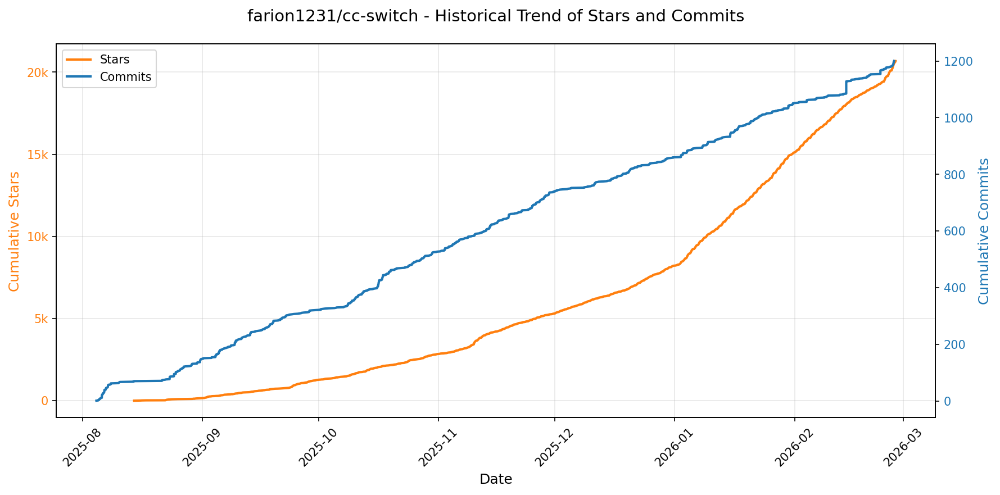
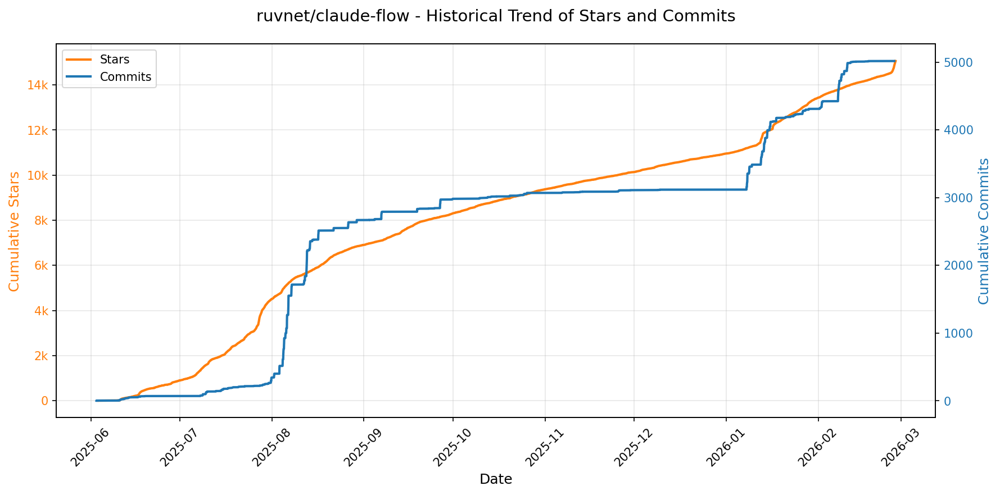
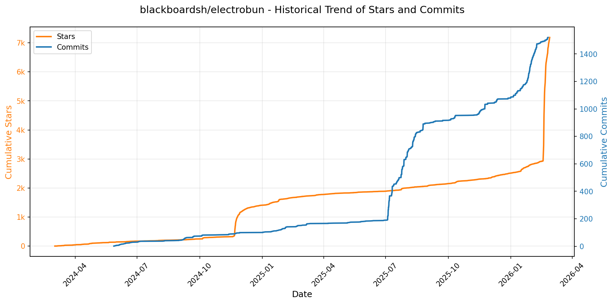
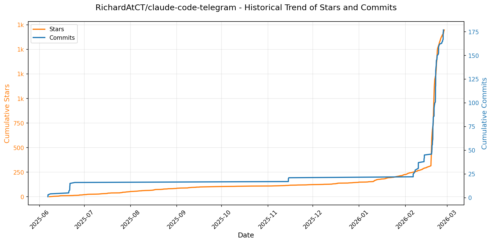

# 🌟 GitHub Trending 概览

> 数据更新于：2026-02-27

---

## 🔍 项目详情

### 1. [x1xhlol/system-prompts-and-models-of-ai-tools](https://github.com/x1xhlol/system-prompts-and-models-of-ai-tools)
- 📅 **创建日期**：2025-03-05  
- 🔄 **最近更新**：2026-02-27  
- ⭐ **Stars**：125,196（日 +1015｜周 +10153｜月 +14191）  
- 📝 **描述**：FULL Augment Code, Claude Code, Cluely, CodeBuddy, Comet, Cursor, Devin AI, Junie, Kiro, Leap.new, Lovable, Manus, NotionAI, Orchids.app, Perplexity, Poke, Qoder, Replit, Same.dev, Trae, Traycer AI, VSCode Agent, Warp.dev, Windsurf, Xcode, Z.ai Code, Dia & v0. (And other Open Sourced) System Prompts, Internal Tools & AI Models  

<b>📈 Star 与 Commit 历史趋势</b>

> *蓝色：累计 Stars｜橙色：累计 Commits（次 Y 轴）*

<b>📄 README 摘要</b>

该内容并非一个典型软件项目的 README（缺少项目名称、功能描述、安装使用说明等核心信息），而是一个**AI 系统提示词（system prompts）与模型配置的开源收集库**的推广性主页。根据所提供信息，严格围绕三项要求进行客观总结如下：

---

**1. 该项目做什么？**  
这是一个持续维护的、面向开发者和 AI 从业者的**公开知识库**，专注于收集、整理并披露主流 AI 工具（如大模型应用、AI 编程助手、智能代理平台等）中实际使用的**系统级提示词（system prompts）、模型调用参数及内部结构线索**。项目已积累超 30,000 行深度分析内容，旨在揭示 AI 产品背后的工程实现逻辑，服务于研究、安全审计、竞品分析与提示工程优化。

---

**2. 关键特性**  
- ✅ **大规模真实提示词集合**：覆盖大量商业化 AI 工具的隐藏 system prompt 实例，含结构化注释与上下文分析；  
- ✅ **安全导向洞察**：强调 AI 启动项泄露风险，配套提供 [ZeroLeaks.ai](https://zeroleaks.ai/) 安全审计服务链接，突出“提示词即攻击面”的安全理念；  
- ✅ **社区驱动与开放协作**：支持通过 GitHub Issues 提交反馈与更新建议，鼓励开发者共建；  
- ✅ **多维度资源聚合**：整合 Discord 社群、趋势分析（Trendshift）、星标历史、赞助通道及多个技术合作伙伴（Tembo、Latitude）生态入口；  
- ✅ **去中心化支持体系**：提供 BTC/LTC/ETH 钱包地址、Patreon 与 Ko-fi 等多种加密及传统捐赠方式，强化可持续维护能力。

---

**3. 技术栈**  
文档中**未明确声明所用技术栈**。项目本身为静态内容型仓库（GitHub Pages 风格），无代码构建流程、框架或运行时依赖说明。可合理推断其底层为：  
- **纯文本/Markdown 主导**：内容以 `.md` 文件组织，辅以图表与外部 API（如 Star History、DeepWiki、CloudBack CI badge）；  
- **前端轻量集成**：使用标准 HTML/CSS/JS 嵌入第三方徽章、响应式图片（含暗色/亮色模式适配）、SVG 动态图表；  
- **无后端或服务层**：未涉及服务器、数据库、API 或模型推理相关技术；所有“技术”体现于对 AI 系统工程实践的**逆向分析方法论**（非实现技术）。

--- 

> 注：该项目本质是「AI 系统工程情报汇编」，而非可部署软件；其价值在于内容深度与安全警示，而非代码复杂度或架构先进性。

---

### 2. [openclaw/openclaw](https://github.com/openclaw/openclaw)
- 📅 **创建日期**：2025-11-24  
- 🔄 **最近更新**：2026-02-27  
- ⭐ **Stars**：119,564（日 +4097｜周 +21934｜月 +119564）  
- 📝 **描述**：Your own personal AI assistant. Any OS. Any Platform. The lobster way. 🦞   

<b>📈 Star 与 Commit 历史趋势</b>

> *蓝色：累计 Stars｜橙色：累计 Commits（次 Y 轴）*

<b>📄 README 摘要</b>

1. **项目功能**  
OpenClaw 是一个完全本地化、用户自托管的个人 AI 助理系统，核心目标是让用户在**自有设备上运行专属、单用户、低延迟、始终在线的 AI 助理**。它不依赖中心化云服务，而是通过轻量级「网关（Gateway）」作为统一控制平面，将 AI 能力无缝接入用户日常使用的全部通讯渠道（如 WhatsApp、Telegram、Slack、Discord、Signal、iMessage、Microsoft Teams、Google Chat、BlueBubbles、Matrix、Zalo 等），同时支持跨平台语音交互（macOS/iOS/Android 的 Wake-on-Voice 与 Talk Mode）、实时可视化工作区（Live Canvas + A2UI）、设备级操作（摄像头、屏幕录制、定位、系统命令、通知等），并实现多会话隔离、智能路由与安全可控的 DM 接入机制。

2. **关键特性**  
- ✅ **本地优先架构**：全栈运行于用户设备（Node.js 网关 + 原生节点），无强制云端依赖；支持 Tailscale/SSH 远程访问，兼顾隐私与灵活性。  
- ✅ **全通道统一收件箱**：原生集成 14+ 主流及小众通讯平台（含 iMessage 替代方案 BlueBubbles、Zalo 个人版等），支持群组消息路由、提及触发、回复标签、分块处理等精细化规则。  
- ✅ **多智能体工作区（Multi-agent Routing）**：基于 Workspace 和 Session 模型实现账户/频道/联系人级隔离，支持独立上下文、激活模式（mention/always）、队列策略与跨会话协作工具（`sessions_send`/`sessions_history`）。  
- ✅ **语音与视觉增强交互**：深度集成 ElevenLabs 实现 macOS/iOS/Android 端「常驻唤醒词（Voice Wake）」与「连续对话模式（Talk Mode）」；提供可编程 Live Canvas 工作区，支持 A2UI 渲染、快照、脚本执行与跨平台同步。  
- ✅ **设备原生能力调用（Nodes）**：通过标准化 `node.invoke` 协议暴露系统级能力——包括 `system.run`（终端命令）、`system.notify`（通知）、`camera.*`、`screen.record`、`location.get`、`canvas.*` 等，严格遵循 macOS TCC / iOS/Android 权限模型。  
- ✅ **安全默认与精细管控**：DM 默认启用配对验证（pairing policy），拒绝未授权输入；支持 OAuth/API Key 双模模型认证、多模型故障转移（failover）、会话自动裁剪（pruning）、细粒度日志与 `openclaw doctor` 自检诊断。  
- ✅ **开箱即用的工程体验**：内置交互式终端向导（`openclaw onboard`）、CLI 全覆盖（gateway/agent/message/pairing/doctor）、Nix/Docker 支持、多环境发布通道（stable/beta/dev）、以及面向开发者的热重载构建流程（`pnpm gateway:watch`）。

3. **技术栈**  
- **运行时**：Node.js ≥22（主网关与 CLI），TypeScript（全栈开发语言），支持 npm/pnpm/bun 包管理。  
- **核心框架**：WebSocket 驱动的轻量级 RPC 架构（Pi agent runtime）；基于事件总线的 Gateway 控制平面；A2UI（Canvas 渲染协议）；CDP（Chrome DevTools Protocol）驱动的专用浏览器控制模块。  
- **前端与 UI**：WebChat 与 Control UI 内置于 Gateway（静态服务）；macOS/iOS/Android 各平台原生应用（Swift/Kotlin + WebKit/WebView 集成）；Canvas 使用 WebGPU/WebGL 加速渲染。  
- **语音与媒体**：ElevenLabs 语音合成（TTS），Whisper 或兼容 ASR 引擎用于语音转文本；FFmpeg + MediaStream API 处理音视频编解码、截帧与生命周期管理。  
- **部署与运维**：支持 systemd（Linux）、launchd（macOS）守护进程；Tailscale Serve/Funnel 实现零配置远程访问；Nix 表达式声明式配置；Docker 容器化部署；SSH 隧道备用方案。  
- **安全与权限**：OAuth 2.0（OpenAI/Anthropic 等）+ API Key 双认证；基于 Token/Password 的 Gateway 访问控制；TCC（macOS）、Privacy Sandbox（iOS）、Runtime Permissions（Android）原生权限桥接。

---

### 3. [obra/superpowers](https://github.com/obra/superpowers)
- 📅 **创建日期**：2025-10-09  
- 🔄 **最近更新**：2026-02-27  
- ⭐ **Stars**：92,429（日 +1529｜周 +8099｜月 +25719）  
- 📝 **描述**：An agentic skills framework & software development methodology that works.  

<b>📈 Star 与 Commit 历史趋势</b>

> *蓝色：累计 Stars｜橙色：累计 Commits（次 Y 轴）*

<b>📄 README 摘要</b>

1. **该项目做什么？**  
Superpowers 是一个面向编程智能体（coding agents）的完整软件开发工作流增强系统。它不直接替代编码代理，而是为其注入结构化、可复用的“能力（skills）”，使代理在开发全过程（从需求澄清到分支收尾）中严格遵循工程最佳实践。其核心目标是将原本易失控、缺乏纪律的 AI 编程行为，转化为受控、可验证、符合专业软件工程原则的协作式开发流程——所有技能自动触发、强制执行，无需用户手动调用。

2. **关键特性**  
- **全流程自动化技能链**：覆盖 7 个强制性阶段（头脑风暴→Git 工作树隔离→计划拆解→子代理驱动开发→TDD 执行→代码审查请求→分支收尾），每个阶段由专用技能自动激活并严格执行；  
- **深度工程纪律内嵌**：强制实施红-绿-重构 TDD（含测试先行、删预写代码）、YAGNI（避免过度设计）、DRY（消除重复）、系统化调试（四阶段根因分析）、防御性验证（修复后必验证）；  
- **人机协同控制点设计**：设计稿分块呈现供人工确认、计划任务粒度精细（2–5 分钟/项）、子代理双阶段审查（先验规范合规性，再审代码质量）、关键问题阻断机制（严重缺陷禁止继续）；  
- **开箱即用的跨平台兼容性**：原生支持 Claude Code、Cursor 等主流 AI 编程 IDE 的插件市场，同时提供 Codex 和 OpenCode 的手动集成方案；  
- **自演进能力体系**：内置 `writing-skills` 技能，支持开发者按标准范式创建、测试并贡献新技能，形成可扩展的能力生态。

3. **技术栈**  
- **运行载体**：基于各类 AI 编程代理平台（Claude Code、Cursor、Codex、OpenCode）构建，依赖其底层大模型推理与插件执行环境；  
- **架构模式**：采用“技能（Skill）”为中心的模块化设计，每个技能为独立功能单元（如 `test-driven-development.md`），通过自然语言指令触发与协调；  
- **基础设施**：使用 Git 工作树（`git worktree`）实现物理隔离的开发沙盒；依赖项目原有测试框架执行 TDD 验证；无独立后端或数据库，纯前端/代理侧逻辑；  
- **部署与分发**：通过 GitHub 仓库托管技能定义，结合各平台插件市场（如 `obra/superpowers-marketplace`）或远程文档拉取（`.codex/INSTALL.md` 等）实现安装与自动更新。

---

### 4. [google/langextract](https://github.com/google/langextract)
- 📅 **创建日期**：2025-07-08  
- 🔄 **最近更新**：2026-02-27  
- ⭐ **Stars**：56,130（日 +96｜周 +570｜月 +10298）  
- 📝 **描述**：A Python library for extracting structured information from unstructured text using LLMs with precise source grounding and interactive visualization.  

<b>📈 Star 与 Commit 历史趋势</b>

> *蓝色：累计 Stars｜橙色：累计 Commits（次 Y 轴）*

<b>📄 README 摘要</b>

1. **项目功能**  
LangExtract 是一个基于大语言模型（LLM）的 Python 库，专注于从**非结构化文本**（如临床病历、放射报告、文学作品等）中**高精度提取结构化信息**。其核心能力是依据用户提供的自然语言指令和少量示例（few-shot examples），自动识别并组织关键实体（如人物、情绪、药物名称、剂量、关系等），同时严格保证所有提取结果均**可追溯至原文中的精确位置**（source grounding），支持端到端的验证与审计。

2. **关键特性**  
- ✅ **精准溯源定位**：为每个提取结果标注在源文本中的起始/结束字符偏移，支持可视化高亮与人工核查；  
- ✅ **强结构化输出保障**：通过受控生成机制（尤其对 Gemini 等模型）强制遵循用户定义的 schema，结合 few-shot 示例确保输出格式稳定可靠；  
- ✅ **长文档优化处理**：采用智能分块（chunking）、多轮提取（up to 3+ passes）、并行处理（`max_workers` 可调）策略，显著提升超长文本（如整本小说、完整医学报告）的召回率与准确性；  
- ✅ **交互式可视化审查**：一键生成自包含、可离线运行的 HTML 文件，支持动态搜索、上下文展开、实体聚类与动画高亮，便于大规模结果人工复核；  
- ✅ **多模态 LLM 接入能力**：原生支持 Google Gemini（云）、OpenAI（需额外安装）、本地 Ollama 模型（如 `gemma2:2b`），并提供插件化架构供用户轻松扩展第三方模型提供商；  
- ✅ **零微调领域适配**：仅需提供 1–3 个高质量、按出现顺序排列的文本-提取对示例，即可快速适配任意垂直领域（医疗、法律、文学分析等），无需训练或微调模型；  
- ✅ **生产就绪增强功能**：支持 Vertex AI 批处理降本、环境变量/.env 安全密钥管理、Docker 部署、CI/CD 测试集成（pytest + tox）及预提交代码规范检查。

3. **技术栈**  
- **编程语言**：Python 3.10+（核心实现）；  
- **核心依赖**：`google-generativeai`（Gemini）、`openai`（OpenAI）、`ollama`（本地模型）、`pydantic`（数据校验与 schema 管理）、`rich`（CLI 输出）、`jinja2`（HTML 可视化模板）；  
- **构建与打包**：`pyproject.toml`（PEP 621 标准）、`setuptools` / `build`；  
- **开发工具链**：`pytest`（单元/集成测试）、`tox`（多环境 CI 模拟）、`pylint`（静态检查）、`pyink` + `isort`（代码格式化）、`pre-commit`（自动化钩子）；  
- **部署与运维**：Docker 支持、Vertex AI 托管服务集成、Ollama 本地推理服务对接；  
- **许可证**：Apache License 2.0。

---

### 5. [asgeirtj/system_prompts_leaks](https://github.com/asgeirtj/system_prompts_leaks)
- 📅 **创建日期**：2025-05-03  
- 🔄 **最近更新**：2026-02-27  
- ⭐ **Stars**：33,182（日 +95｜周 +996｜月 +7579）  
- 📝 **描述**：Collection of extracted System Prompts from popular chatbots like ChatGPT, Claude & Gemini  

<b>📈 Star 与 Commit 历史趋势</b>

> *蓝色：累计 Stars｜橙色：累计 Commits（次 Y 轴）*

---

### 6. [thedotmack/claude-mem](https://github.com/thedotmack/claude-mem)
- 📅 **创建日期**：2025-08-31  
- 🔄 **最近更新**：2026-02-27  
- ⭐ **Stars**：31,635（日 +266｜周 +1987｜月 +16326）  
- 📝 **描述**：A Claude Code plugin that automatically captures everything Claude does during your coding sessions, compresses it with AI (using Claude's agent-sdk), and injects relevant context back into future sessions.  

<b>📈 Star 与 Commit 历史趋势</b>

> *蓝色：累计 Stars｜橙色：累计 Commits（次 Y 轴）*

<b>📄 README 摘要</b>

1. **项目功能**  
Claude-Mem 是一个专为 Anthropic 的 **Claude Code**（AI 编程助手）构建的**持久化记忆压缩系统**。它在用户每次会话结束后，自动捕获工具调用、代码操作、错误修复等上下文事件（称为“observations”），生成语义化摘要，并持久化存储于本地 SQLite 数据库中；当新会话启动时，智能检索并按需注入相关历史记忆，从而实现跨会话的**上下文连续性**——使 Claude 能“记住”项目进展、技术决策、调试过程等关键知识，显著提升长周期开发任务中的推理连贯性与效率。

2. **核心特性**  
- ✅ **持久记忆（Persistent Memory）**：会话结束后仍保留结构化记忆，重启即恢复上下文；  
- ✅ **渐进式披露（Progressive Disclosure）**：分三层（索引 → 时间线 → 原始详情）按需加载记忆，实时显示 token 消耗，优化成本；  
- ✅ **技能化搜索（mem-search 技能）**：支持自然语言查询历史（如 `search("authentication bug", type="bugfix")`），结合时间、类型、项目等多维过滤；  
- ✅ **Web 可视化界面（http://localhost:37777）**：实时流式展示记忆流、观测记录、摘要及全文，支持 ID 引用与 API 直查；  
- ✅ **Claude Desktop 集成**：可在桌面版对话中直接调用 `mem-search` 技能检索记忆；  
- ✅ **隐私保护机制**：通过 `<private>` 标签自动排除敏感内容，不存入数据库；  
- ✅ **全自动运行**：无须手动触发，依赖 6 个生命周期钩子（SessionStart/PostToolUse/SessionEnd 等）静默采集；  
- ✅ **混合搜索架构**：融合 SQLite FTS5 全文检索 + Chroma 向量数据库，兼顾关键词精准性与语义相关性；  
- ✅ **OpenClaw 网关一键部署**：提供 `curl` 脚本集成至 OpenClaw AI 网关，支持 Telegram/Discord/Slack 实时通知；  
- ✅ **Beta 通道实验功能**：如 “Endless Mode”（仿生式长记忆架构），支持超长会话状态延续。

3. **技术栈**  
- **运行时**：Node.js ≥18.0.0（主逻辑）、Bun（Worker 服务管理与 HTTP API）、uv（Python 包管理器，用于 Chroma 向量库）；  
- **数据库**：SQLite3（嵌入式，含 FTS5 全文搜索支持） + Chroma（向量数据库，实现语义搜索）；  
- **前端/交互**：TypeScript 构建 Web UI（本地服务端口 37777），支持多语言国际化（已覆盖 30+ 语言）；  
- **插件架构**：基于 Claude Agent SDK 开发，深度集成 Claude Code 插件生命周期钩子（MCP 兼容）；  
- **协议与标准**：遵循 Model Context Protocol（MCP）规范，提供 `search`/`timeline`/`get_observations` 等标准化记忆检索工具；  
- **许可证**：主体代码采用 **AGPL-3.0**（网络服务需开源衍生代码），`ragtime/` 子模块采用 PolyForm Noncommercial License。

---

### 7. [virattt/dexter](https://github.com/virattt/dexter)
- 📅 **创建日期**：2025-10-14  
- 🔄 **最近更新**：2026-02-27  
- ⭐ **Stars**：24,053（日 +107｜周 +892｜月 +7530）  
- 📝 **描述**：An autonomous agent for deep financial research  

<b>📈 Star 与 Commit 历史趋势</b>

> *蓝色：累计 Stars｜橙色：累计 Commits（次 Y 轴）*

<b>📄 README 摘要</b>

1. **项目功能**  
Dexter 是一个面向金融研究的自主式AI代理系统，能够对复杂金融问题进行端到端的自动分析：接收自然语言提问 → 自主规划多步研究任务 → 调用实时金融市场数据工具（如财报、资产负债表、现金流量表）执行查询 → 对中间结果进行自我验证与反思 → 迭代优化直至生成可信、数据支撑的结论。其核心定位是“金融领域的Claude Code”，专为高精度、可追溯、安全可控的自动化财务尽调与研究而设计。

2. **关键特性**  
- **智能任务规划**：将模糊/复杂的金融问题（如“评估NVDA在AI芯片市场的长期竞争力”）自动拆解为结构化子任务（例如：获取近5年财报→分析毛利率趋势→比对同行研发支出→检索最新行业政策）。  
- **自主执行与工具编排**：动态选择并调用适配的API工具（Financial Datasets API获取结构化财报、Exa/Tavily执行网络搜索），支持多源数据融合。  
- **自省与迭代验证**：内置“思考-执行-检查”循环，通过LLM对工具返回结果进行摘要与一致性校验，未达置信阈值则自动重试或调整策略。  
- **实时权威金融数据接入**：原生集成Financial Datasets API，免费支持AAPL、NVDA、MSFT等主流标的的年度/季度三大报表（利润表、资产负债表、现金流量表）。  
- **生产级安全机制**：强制设置最大步骤数、循环检测（防止无限递归）、超时熔断，确保代理行为可控、可终止。  
- **全链路可观测性**：所有推理过程、工具调用、原始数据与LLM摘要均以JSONL格式持久化至本地`.dexter/scratchpad/`，支持完整审计与调试。  
- **多模态交互支持**：除CLI命令行外，提供WhatsApp网关，实现手机端零门槛对话式研究（扫码登录后即可私聊提问）。

3. **技术栈**  
- **运行时**：Bun（v1.0+，作为Node.js替代，提供极速依赖安装与脚本执行）；  
- **大模型层**：默认集成OpenAI API（GPT系列），同时预留Anthropic（Claude）、Google（Gemini）、xAI（Grok）、OpenRouter等多后端支持（通过环境变量配置）；  
- **数据服务**：  
  - 主数据源：Financial Datasets API（机构级实时财报）；  
  - 补充检索：Exa API（首选）、Tavily API（备用）用于网络信息增强；  
- **评估与监控**：LangSmith（追踪链路、日志、性能指标），结合LLM-as-Judge实现自动化效果评测；  
- **部署与扩展**：支持Ollama本地模型运行（通过`OLLAMA_BASE_URL`配置）；WhatsApp网关基于Twilio或类似方案构建（具体实现在`src/gateway/`）；  
- **工程实践**：TypeScript开发，模块化架构，CLI驱动（`bun start`/`bun dev`），MIT开源协议。

---

### 8. [VectifyAI/PageIndex](https://github.com/VectifyAI/PageIndex)
- 📅 **创建日期**：2025-04-01  
- 🔄 **最近更新**：2026-02-27  
- ⭐ **Stars**：23,199（日 +669｜周 +2816｜月 +8342）  
- 📝 **描述**：📑 PageIndex: Document Index for Vectorless, Reasoning-based RAG  

<b>📈 Star 与 Commit 历史趋势</b>

> *蓝色：累计 Stars｜橙色：累计 Commits（次 Y 轴）*

<b>📄 README 摘要</b>

1. **项目功能**  
PageIndex 是一个面向长文档（如财报、法律文书、技术手册等）的新型检索增强生成（RAG）系统，**完全摒弃传统向量数据库与文本分块机制**。它通过构建语义化的层次化“树状索引”（类似智能目录），并利用大语言模型（LLM）在该索引上进行**多步推理式检索**，实现类人专家式的精准、可解释、可追溯的知识定位与提取。其核心目标是解决向量相似性检索（“vibe retrieval”）在专业场景中因忽略逻辑关联与领域上下文而导致的“相似≠相关”问题。

2. **关键特性**  
- ✅ **无向量数据库（Vectorless）**：不依赖嵌入向量与近似最近邻搜索，彻底消除向量漂移与语义失真；  
- ✅ **无显式分块（No Chunking）**：基于文档天然结构（标题层级、语义段落）组织内容，保留上下文完整性与逻辑连贯性；  
- ✅ **推理驱动检索（Reasoning-based Retrieval）**：将检索建模为树搜索过程——先生成带摘要与页码范围的树状索引，再通过LLM多轮推理导航至最相关节点；  
- ✅ **高可解释性与可追溯性**：每次检索结果附带明确的页面号、章节路径与推理链，支持审计与人工验证；  
- ✅ **原生支持视觉输入（Vision-native）**：提供OCR-Free方案，可直接对PDF页面图像进行端到端推理式RAG，绕过传统OCR误差累积；  
- ✅ **SOTA性能验证**：在金融领域权威评测 FinanceBench 上达成 **98.7% 准确率**，显著超越主流向量RAG方案。

3. **技术栈**  
- **核心模型层**：依赖 OpenAI 系列大模型（默认 `gpt-4o-2024-11-20`）执行树结构生成、节点摘要、推理导航等任务；  
- **文档解析层**：支持 PDF（基于 PyPDF2 / pdfplumber 等库）与 Markdown（按 `#` 层级解析）双输入格式；  
- **索引表示层**：采用 JSON 格式的嵌套树结构（TreeNode），包含 `title`、`node_id`、`start_index`/`end_index`（页码范围）、`summary` 及子节点 `nodes` 数组；  
- **部署与集成**：提供开源 CLI 工具（Python）、Colab Notebook 快速体验、RESTful API（Beta）、MCP 协议插件（兼容 Claude/Cursor 等智能体平台），以及企业级私有化部署选项；  
- **辅助能力**：配套自研 PageIndex OCR（专为长文档全局结构识别优化），确保复杂PDF的高质量结构化解析（虽未在当前代码库实现，但属完整技术闭环关键组件）。

---

### 9. [KeygraphHQ/shannon](https://github.com/KeygraphHQ/shannon)
- 📅 **创建日期**：2025-09-27  
- 🔄 **最近更新**：2026-02-27  
- ⭐ **Stars**：22,205（日 +250｜周 +1633｜月 +18454）  
- 📝 **描述**：Fully autonomous AI hacker to find actual exploits in your web apps. Shannon has achieved a 96.15% success rate on the hint-free, source-aware XBOW Benchmark.  

<b>📈 Star 与 Commit 历史趋势</b>

> *蓝色：累计 Stars｜橙色：累计 Commits（次 Y 轴）*

<b>📄 README 摘要</b>

1. **项目功能**  
Shannon 是一个面向源码的全自动 AI 渗透测试框架，专为白盒（white-box）Web 应用安全测试设计。它不只静态扫描或生成告警，而是通过深度理解应用源代码，自主规划攻击路径，并在真实运行环境中（基于浏览器与命令行）动态执行可复现的漏洞利用（如注入、XSS、SSRF、认证绕过等），最终输出经实证的、零误报的安全报告。其核心目标是填补开发高频交付（如借助 Claude Code/Cursor）与传统年度渗透测试之间的巨大安全空窗期，实现“每次构建即安全验证”。

2. **关键特性**  
- **全自主渗透流程**：支持自动处理复杂登录（含 2FA/TOTP、Google 登录）、智能导航、多阶段攻击执行与报告生成，全程无需人工干预；  
- **实证型安全报告**：每项漏洞均附带可一键复现的 PoC（Proof-of-Concept），消除虚假告警，直接证明可利用性；  
- **OWASP 关键漏洞覆盖**：已实现实战级检测与验证：注入（SQL/OS 命令等）、跨站脚本（XSS）、服务器端请求伪造（SSRF）、认证与授权失效（Broken AuthZ/AuthN），并持续扩展；  
- **代码感知的动态测试**：融合静态源码分析（指导攻击策略）与动态运行时 exploitation（浏览器 + CLI），精准定位真实风险；  
- **集成专业安全工具链**：内置调用 Nmap、Subfinder、WhatWeb、Schemathesis 等行业工具强化侦察与接口模糊测试；  
- **高性能并行架构**：对不同漏洞类型的分析与利用任务并行执行，显著缩短整体测试耗时；  
- **工作区（Workspace）与断点续跑**：自动持久化各智能体（agent）进度（基于 Git 提交），支持任意中断后精准恢复，避免重复计算。

3. **技术栈**  
- **核心架构**：基于 Temporal 工作流引擎构建的多智能体（multi-agent）系统，模拟人类红队方法论；  
- **AI 引擎**：深度集成 Anthropic Agent SDK，主力依赖 Claude 系列大模型（推荐 Anthropic API）；支持实验性路由至 OpenAI（GPT-5.2）或 Google Gemini（via OpenRouter）；  
- **运行环境**：全容器化部署，强依赖 Docker 运行时；本地开发适配 WSL2（Windows）、原生 Linux 及 macOS；  
- **安全工具集成**：Nmap（网络测绘）、Subfinder（子域名发现）、WhatWeb（指纹识别）、Schemathesis（API 模糊测试）；  
- **基础设施**：Temporal Server（工作流编排与可观测性，含 Web UI 监控）、Git（工作区状态快照与恢复）；  
- **配置与扩展**：YAML 驱动的灵活配置（支持登录流程、规则过滤、速率限制策略等），模块化 pipeline 设计。

---

### 10. [bytedance/deer-flow](https://github.com/bytedance/deer-flow)
- 📅 **创建日期**：2025-05-07  
- 🔄 **最近更新**：2026-02-27  
- ⭐ **Stars**：21,112（日 +656｜周 +1120｜月 +1699）  
- 📝 **描述**：An open-source SuperAgent harness that researches, codes, and creates. With the help of sandboxes, memories, tools, skills and subagents, it handles different levels of tasks that could take minutes to hours.  

<b>📈 Star 与 Commit 历史趋势</b>

> *蓝色：累计 Stars｜橙色：累计 Commits（次 Y 轴）*

<b>📄 README 摘要</b>

1. **项目功能**  
DeerFlow 2.0 是一个开源的「超级智能体运行时框架（Super Agent Harness）」，核心目标是让 AI 智能体真正“做事”而非仅限于对话。它通过协调子智能体（Sub-Agents）、沙箱执行环境（Sandbox）、结构化长期记忆（Long-Term Memory）和可扩展技能系统（Extensible Skills），实现端到端的自动化复杂任务执行——例如深度研究、自动生成报告/幻灯片/网页、数据管道构建、多模态内容生成（图像/视频）、代码编写与执行等。它不再是一个需手动拼装的框架，而是一个开箱即用、具备完整工作基础设施（文件系统、内存、工具链、规划能力）的智能体操作系统。

2. **关键特性**  
- **模块化可扩展技能（Skills & Tools）**：以 Markdown 定义的标准化技能单元（如 `research/SKILL.md`），支持按需加载，避免上下文膨胀；内置研究、报告、PPT、网页、图像生成等技能，并支持用户自定义技能或通过 MCP 服务器/Python 函数集成任意工具。  
- **动态子智能体编排（Sub-Agents）**：主智能体可按需动态创建多个隔离的子智能体，各自拥有独立上下文、工具集与终止条件，支持并行执行与结构化结果回传，实现复杂任务（如多角度调研→聚合→生成交付物）的自动分解与协同。  
- **全隔离沙箱与本地文件系统（Sandbox & File System）**：每个任务在独立 Docker 容器中运行，配备完整可读写文件系统（`/mnt/user-data/workspace/`、`/uploads/`、`/outputs/`），支持 Bash 执行、代码运行、文件操作及多模态内容处理，确保安全、可审计、无会话污染。  
- **智能上下文工程（Context Engineering）**：采用子智能体上下文隔离机制 + 动态上下文压缩策略（如任务摘要、中间结果落盘、无关信息剔除），保障长周期、多步骤任务中模型始终聚焦关键信息，适配中小上下文窗口模型。  
- **持久化长期记忆（Long-Term Memory）**：跨会话存储用户画像、偏好、技术栈、写作习惯及知识沉淀，本地化存储、完全用户可控，实现越用越懂用户的个性化进化能力。

3. **技术栈**  
- **核心编排层**：基于 **LangGraph** 构建多智能体状态图（State Graph）与工作流调度；依赖 **LangChain** 实现 LLM 集成、工具调用、链式调用及文档处理。  
- **执行环境**：默认采用 **Docker** 提供沙箱隔离；支持 Kubernetes（通过 Provisioner 服务）进行集群级沙箱编排；本地开发支持 Node.js 22+、pnpm、uv 等现代前端/后端工具链。  
- **模型兼容性**：模型无关（Model-Agnostic），通过 OpenAI 兼容 API 接口接入，原生支持 GPT-4 等主流闭源模型，亦可对接任何符合规范的开源大模型（如 Llama、Qwen 等）。  
- **扩展生态**：支持 **MCP（Model Context Protocol）服务器** 标准，便于集成第三方工具与服务；配置驱动架构（YAML + `.env`），支持灵活环境管理与多模型切换。

---

### 11. [gsd-build/get-shit-done](https://github.com/gsd-build/get-shit-done)
- 📅 **创建日期**：2025-12-14  
- 🔄 **最近更新**：2026-02-27  
- ⭐ **Stars**：21,074（日 +714｜周 +4788｜月 +12554）  
- 📝 **描述**：A light-weight and powerful meta-prompting, context engineering and spec-driven development system for Claude Code and OpenCode.  

<b>📈 Star 与 Commit 历史趋势</b>

> *蓝色：累计 Stars｜橙色：累计 Commits（次 Y 轴）*

<b>📄 README 摘要</b>

1. **项目功能**  
该项目是一个轻量级但功能强大的元提示（meta-prompting）、上下文工程（context engineering）与规范驱动开发（spec-driven development）系统，专为 Claude Code、OpenCode、Gemini CLI 和 Codex 等 AI 编程助手设计。其核心目标是**解决“上下文腐化”（context rot）问题**——即随着 Claude 等模型持续填充上下文窗口，提示质量与输出一致性显著下降的顽疾。GSD 通过结构化工作流，在不增加用户认知负担的前提下，自动完成从需求澄清、技术调研、分阶段规划、并行执行到人工验收验证的完整闭环，使 AI 编程真正具备可预测性、可追溯性和工程可靠性。

2. **关键特性**  
- **抗上下文腐化架构**：所有执行任务均在独立、纯净的 200k token 子代理上下文中运行，主会话始终保持轻量（30–40% 占用），彻底规避累积噪声导致的质量衰减；  
- **四阶闭环工作流**：`discuss → plan → execute → verify`，每阶段生成标准化文档（如 `CONTEXT.md`、`PLAN.md`、`SUMMARY.md`、`UAT.md`），支持人类深度介入与机器自动校验；  
- **智能波次执行（Wave Execution）**：基于依赖关系自动将任务分组为并行“波次”，实现垂直切片（end-to-end feature）的高效并发，显著提升执行速度与文件冲突可控性；  
- **原子化 Git 提交**：每个子任务生成独立、语义清晰的 commit（含时间戳与功能标签），支持精准 bisect、一键回滚与历史可读性；  
- **全栈上下文工程**：自动维护 `PROJECT.md`、`STATE.md`、`REQUIREMENTS.md`、`ROADMAP.md`、研究知识库（`.planning/research/`）等多维上下文资产，并按需动态注入；  
- **XML 结构化提示**：所有计划均采用严格 XML 格式（含 `<action>`、`<verify>`、`<done>` 等字段），确保指令无歧义、验证可自动化；  
- **双模工作流支持**：完整模式（full workflow）用于新功能开发；快速模式（`/gsd:quick`）用于 bug 修复/配置变更等轻量任务，兼顾效率与 GSD 基础保障；  
- **现有代码库友好**：通过 `/gsd:map-codebase` 自动分析存量项目的技术栈、架构与约定，使后续开发无缝继承上下文；  
- **模块化与高适应性**：支持动态插入/删除阶段、跨里程碑复用、暂停/恢复会话、多 profile 模型切换（quality/balanced/budget）等灵活操作。

3. **技术栈**  
- **核心运行时**：Node.js（CLI 安装器 `bin/install.js` 及命令调度逻辑）；  
- **AI 接口层**：深度适配四大主流 AI 编程环境——Claude Code（含权限管理与 `.claude/` 配置集成）、OpenCode（开源免费模型支持）、Gemini CLI（`~/.gemini/` 集成）、Codex（基于技能系统的 `skills/gsd-*/SKILL.md` 方案）；  
- **提示工程范式**：自研 XML 提示模板语言 + 多层级上下文注入机制（项目级、阶段级、任务级、研究知识库）；  
- **状态与持久化**：纯文件系统驱动（`.planning/` 目录树），以 Markdown（`*.md`）和 JSON（`config.json`, `STATE.md`）存储全部元数据、计划、验证结果与用户决策；  
- **执行调度引擎**：基于依赖图的波次调度器（wave scheduler），支持并行/串行混合执行策略与自动冲突规避；  
- **部署与分发**：npm 包（`get-shit-done-cc`），支持 `npx` 一键安装，兼容 macOS / Windows / Linux；提供 Docker/CI 友好的非交互式安装选项（`--claude --global` 等标志）。

---

### 12. [clockworklabs/SpacetimeDB](https://github.com/clockworklabs/SpacetimeDB)
- 📅 **创建日期**：2023-06-17  
- 🔄 **最近更新**：2026-02-27  
- ⭐ **Stars**：20,870（日 +462｜周 +1704｜月 +1961）  
- 📝 **描述**：Development at the speed of light  

<b>📈 Star 与 Commit 历史趋势</b>

> *蓝色：累计 Stars｜橙色：累计 Commits（次 Y 轴）*

<b>📄 README 摘要</b>

1. **该项目做什么？**  
SpacetimeDB 是一个集数据库与应用服务器于一体的**内存优先、低延迟的实时关系型数据库系统**。它允许开发者将业务逻辑（以“模块”形式）直接部署到数据库内部执行，客户端可绕过传统中间层服务，直连数据库并触发内置逻辑（如权限校验、状态更新、实时同步等）。其核心范式是：**整个后端应用（含数据存储、计算逻辑、网络通信）被封装为单个模块，运行于数据库进程中**。典型应用场景包括 MMORPG（如《BitCraft Online》）、实时聊天、协同编辑等对延迟极度敏感的系统。

2. **关键特性**  
- **一体化架构**：融合数据库与服务器功能，消除微服务、容器、K8s 等运维复杂性；  
- **模块化智能逻辑**：支持用 Rust/C# 编写“数据库内模块”，在数据层原生执行业务规则、授权逻辑和事件处理；  
- **极致实时性**：全内存状态 + WAL 持久化，专为 OLTP 和实时同步优化，毫秒级端到端延迟；  
- **多语言支持**：服务端模块支持 Rust、C#；客户端 SDK 支持 Rust、C#、TypeScript；  
- **零基础设施部署**：可通过 CLI（`spacetime start`）、Docker 或源码一键启动独立节点；  
- **区块链式安全模型（非区块链）**：借鉴智能合约的确定性执行与隔离性，但无共识开销，性能高出数个数量级；  
- **自动状态同步**：数据库内变更可实时广播至所有连接客户端（如玩家位置、聊天消息、物品状态）。

3. **技术栈**  
- **核心语言**：Rust（主引擎、CLI 工具链、WASM 模块运行时）；  
- **执行环境**：基于 WASM（`wasm32-unknown-unknown`）沙箱执行用户模块，保障安全与隔离；  
- **存储引擎**：内存驻留全量状态 + Write-Ahead Log（WAL）持久化，支持崩溃恢复；  
- **网络协议**：自定义高效二进制协议（基于 WebSockets/HTTP），支持客户端直连；  
- **构建与分发**：Rust Cargo 生态（crates.io）、NuGet（C#）、Docker Hub 官方镜像；  
- **跨平台支持**：原生适配 macOS、Linux、Windows（含 WSL），提供一键安装脚本与源码编译指南。

---

### 13. [farion1231/cc-switch](https://github.com/farion1231/cc-switch)
- 📅 **创建日期**：2025-08-04  
- 🔄 **最近更新**：2026-02-27  
- ⭐ **Stars**：20,674（日 +559｜周 +1780｜月 +6525）  
- 📝 **描述**：A cross-platform desktop All-in-One assistant tool for Claude Code, Codex, OpenCode & Gemini CLI.  

<b>📈 Star 与 Commit 历史趋势</b>

> *蓝色：累计 Stars｜橙色：累计 Commits（次 Y 轴）*

<b>📄 README 摘要</b>

1. **项目功能**  
该项目（`cc-switch`）是一款面向开发者的一体化命令行 AI 助手配置管理工具，核心作用是**统一、安全、高效地切换和管理多个主流 AI 编程 CLI 工具的后端服务提供方（Provider）**。它原生支持三大 AI 编程环境：Anthropic 的 **Claude Code**、OpenAI 的 **Codex**（即 `codex-cli`）以及 Google 的 **Gemini CLI**。用户可通过图形界面一键添加、启用、禁用不同服务商（如官方 API、PackyCode、AIGoCode、MiniMax 等数十家代理平台），自动重写各 CLI 对应的本地配置文件（如 `~/.claude/settings.json`、`~/.codex/auth.json`、`~/.gemini/.env`），实现跨模型、跨服务商的无缝切换，无需手动编辑配置或重启终端。

2. **关键特性**  
- ✅ **多模型/多服务商统一管理**：支持 Claude Code、Codex、Gemini 三套 CLI 的 Provider 配置共存与秒级切换；内置 AWS Bedrock（含 Claude/OpenCode）、Google 官方 OAuth、主流 API 中继商等数十种预设模板。  
- ✅ **深度集成生态能力**：  
  - **MCP（Model Control Protocol）统一管理**：跨三平台集中配置、启停、导入导出 MCP 服务器（支持 stdio/http/SSE 传输），自动同步至各 CLI 实时配置文件；  
  - **Claude Skills 全生命周期管理**：自动扫描 GitHub 仓库（含 Anthropic 官方/Composio/社区等），一键安装/卸载/更新技能至 `~/.claude/skills/`；  
  - **系统提示词（Prompts）多格式管理**：支持无限预设，Markdown 编辑器（CodeMirror 6 + 实时预览），按 CLI 类型分别写入 `CLAUDE.md` / `AGENTS.md` / `GEMINI.md`，并智能保护手动修改内容。  
- ✅ **高可靠性架构**：SQLite + JSON 双层持久化（SQLite 存 Providers/MCP/Prompts/Skills 等可同步数据；JSON 存窗口状态等设备级设置）；原子化配置写入 + 自动备份（保留最近 10 份）+ 冲突检测与告警；单实例守护 + 系统托盘快速切换。  
- ✅ **开箱即用体验**：全平台支持（Windows/macOS/Linux）、自动启动、i18n（中/英/日）、速度测试、深色模式、云同步（Dropbox/iCloud/OneDrive 等目录直连）、`ccswitch://` 深度链接协议（一键导入分享配置）。  

3. **技术栈**  
- **前端**：React（TypeScript） + Tailwind CSS（v3.4） + TanStack Query（数据缓存与同步） + CodeMirror 6（Markdown 编辑器）；  
- **桌面框架**：Tauri 2.x（Rust 后端 + WebView 前端，轻量、安全、跨平台）；  
- **后端/核心逻辑**：Rust（Tauri Command 层 + Service 层 + DAO 层），采用分层架构（Commands → Services → Models/Config），数据库使用 **SQLite**（SSOT 单一可信源），辅以 JSON 存储设备级配置；  
- **构建与工程化**：pnpm（包管理）、Vitest（前端 Hooks 100% 覆盖测试）、MSW（Mock Service Worker 集成测试）、Rust 1.85+、Tauri CLI 2.8+、Node.js 18+。

---

### 14. [badlogic/pi-mono](https://github.com/badlogic/pi-mono)
- 📅 **创建日期**：2025-08-09  
- 🔄 **最近更新**：2026-02-27  
- ⭐ **Stars**：17,203（日 +522｜周 +3275｜月 +14500）  
- 📝 **描述**：AI agent toolkit: coding agent CLI, unified LLM API, TUI & web UI libraries, Slack bot, vLLM pods  

<b>📈 Star 与 Commit 历史趋势</b>

> *蓝色：累计 Stars｜橙色：累计 Commits（次 Y 轴）*

<b>📄 README 摘要</b>

1. **项目功能**  
该项目是一个面向 AI 代理（AI Agents）开发与大语言模型（LLM）部署管理的**一体化单体仓库（Monorepo）**，核心目标是提供可组合、可扩展的工具链，用于构建生产级 AI 编程助手及智能代理系统。它不直接提供终端用户产品，而是为开发者提供底层能力模块（如统一 LLM 接口、代理运行时、终端/Web UI、GPU 推理部署工具等），支撑如“Pi 编程代理”（`pi-coding-agent`）等上层应用的快速构建与集成。

2. **关键特性**  
- ✅ **多厂商 LLM 统一抽象层**：`@mariozechner/pi-ai` 支持 OpenAI、Anthropic、Google 等主流提供商，屏蔽 API 差异，提供一致调用接口；  
- ✅ **可插拔 AI 代理运行时**：`@mariozechner/pi-agent-core` 内置工具调用（Tool Calling）、状态持久化、记忆管理与执行生命周期控制；  
- ✅ **全场景交互界面支持**：同时提供终端（TUI，含差分渲染优化）、Web（Web Components）、Slack（`pi-mom` Bot）三端接入能力；  
- ✅ **本地 LLM 部署运维工具**：`@mariozechner/pi-pods` 提供 CLI 方式一键管理基于 vLLM 的 GPU 推理服务（如启动/扩缩容/监控）；  
- ✅ **开箱即用的编程代理 CLI**：`@mariozechner/pi-coding-agent` 是一个交互式命令行编程助手，支持代码生成、解释、调试与工程级上下文理解；  
- ✅ **严格工程实践支持**：内置完整 CI/CD 流水线（GitHub Actions）、类型检查（TypeScript）、格式化（Prettier）、ESLint、端到端测试脚本（含 API Key 智能跳过机制）。

3. **技术栈**  
- **语言与平台**：TypeScript（全栈主语言），Node.js 运行时，ESM 模块系统；  
- **构建与包管理**：npm（monorepo 管理），tsc（TypeScript 编译），vite（部分前端包可能使用）；  
- **核心依赖**：  
  - LLM 集成：适配 OpenAI SDK、Anthropic SDK、Google Generative AI 等官方客户端；  
  - TUI 渲染：自研 `pi-tui` 库，基于原生终端控制序列实现高性能差分更新；  
  - Web UI：Web Components（标准 Custom Elements + Shadow DOM），轻量无框架；  
  - 推理后端：深度集成 vLLM（用于 `pi-pods` 的高效 GPU 推理调度）；  
- **基础设施**：GitHub Actions CI/CD，Discord 社区协作，MIT 开源协议。

---

### 15. [D4Vinci/Scrapling](https://github.com/D4Vinci/Scrapling)
- 📅 **创建日期**：2024-10-13  
- 🔄 **最近更新**：2026-02-27  
- ⭐ **Stars**：16,846（日 +1736｜周 +7805｜月 +8040）  
- 📝 **描述**：🕷️ An adaptive Web Scraping framework that handles everything from a single request to a full-scale crawl!  

<b>📈 Star 与 Commit 历史趋势</b>

> *蓝色：累计 Stars｜橙色：累计 Commits（次 Y 轴）*

<b>📄 README 摘要</b>

1. **项目功能**  
Scrapling 是一个自适应的现代化网络爬虫框架，专为应对当代复杂网页环境而设计。它统一处理从单次 HTTP 请求到大规模分布式爬取的全场景需求：既能快速抓取静态页面，也能通过浏览器自动化（Playwright/Chrome）渲染动态内容；能自动绕过 Cloudflare Turnstile、Akamai、DataDome 等主流反爬系统；支持带状态的会话管理、多会话协同调度，并提供开箱即用的爬虫生命周期管理（启动、暂停、断点续爬、流式结果输出）。其核心创新在于**自适应解析能力**——解析器可学习网站结构变化，智能定位元素位置偏移，显著提升爬虫在网站改版后的鲁棒性与维护效率。

2. **关键特性**  
- **智能自适应解析**：基于相似度算法自动重定位 CSS/XPath 元素，支持 `adaptive=True` 模式应对 DOM 结构变更；提供 `find_similar()`、`below_elements()` 等高级 DOM 关系导航。  
- **多模态请求引擎**：集成四类 Fetcher——轻量 `Fetcher`（HTTP/3 + TLS 指纹伪装）、高隐蔽 `StealthyFetcher`（自动解 Cloudflare Turnstile）、全功能 `DynamicFetcher`（Playwright 浏览器自动化）、异步变体（`AsyncFetcher` 等），均支持代理轮换、域名拦截、会话持久化。  
- **生产级爬虫框架（Spiders）**：Scrapy 风格 API，支持并发控制、按域限速、多会话路由（如“普通页走 HTTP，登录页走无头浏览器”）、流式结果迭代（`async for item in spider.stream()`）、自动识别/重试被封请求、内置 JSON/JSONL 导出。  
- **AI 协同能力（MCP Server）**：内置 MCP（Model Context Protocol）服务端，可作为 AI 工具（如 Claude、Cursor）的插件，预先执行精准网页提取并压缩上下文，大幅降低大模型 token 消耗与响应延迟。  
- **开发者友好体验**：提供交互式 IPython 爬虫 Shell（支持 curl 转 Scrapling、浏览器预览）、零代码 CLI 工具（`scrapling extract` 直接命令行抓取保存）、自动生成健壮选择器、完整类型提示（PyRight/MyPy 全覆盖）、Docker 镜像（预装浏览器）、高性能 JSON 序列化（比标准库快 10 倍）及 92% 测试覆盖率。

3. **技术栈**  
- **核心语言**：Python 3.9+（全类型注解，严格静态类型检查）  
- **HTTP 与指纹模拟**：`httpx`（支持 HTTP/3）、`tls-client`（TLS 指纹伪装）、自研请求头/UA/时区/语言等上下文欺骗机制  
- **浏览器自动化**：`playwright`（默认 Chromium）、原生 Chrome 支持，用于 `DynamicFetcher` 和 `StealthyFetcher`  
- **解析引擎**：自研高性能 HTML/XML 解析器（兼容 CSS/XPath/BeautifulSoup 风格语法），非依赖 `lxml` 或 `parsel`，内存占用低、解析速度快  
- **异步生态**：`asyncio` 原生支持，所有 Fetcher 和 Spider 均提供同步/异步双接口，`AsyncStealthySession` 等专为高并发优化  
- **基础设施**：CI/CD（GitHub Actions）、文档（Read the Docs）、包分发（PyPI）、容器化（Docker）、多语言文档（含简体中文）  
- **AI 集成层**：MCP 协议服务端（符合 [MCP 规范](https://modelcontextprotocol.io/)），支持与 LLM IDE（如 Cursor）深度协同

---

### 16. [ruvnet/claude-flow](https://github.com/ruvnet/claude-flow)
- 📅 **创建日期**：2025-06-02  
- 🔄 **最近更新**：2026-02-27  
- ⭐ **Stars**：15,055（日 +431｜周 +746｜月 +1959）  
- 📝 **描述**：🌊 The leading agent orchestration platform for Claude. Deploy intelligent multi-agent swarms, coordinate autonomous workflows, and build conversational AI systems. Features    enterprise-grade architecture, distributed swarm intelligence, RAG integration, and native Claude Code / Codex Integration  

<b>📈 Star 与 Commit 历史趋势</b>

> *蓝色：累计 Stars｜橙色：累计 Commits（次 Y 轴）*

<b>📄 README 摘要</b>

1. **项目功能**  
Ruflo v3 是一个面向企业的 AI 智能体（Agent）编排平台，专为深度集成 Anthropic 的 Claude Code 构建。其核心功能是将单点式大模型调用升级为可生产部署的多智能体协同系统：支持部署 60+ 预置专业化智能体（如 coder、tester、reviewer、security-architect 等），以“蜂群”（Swarm）形式自动协作完成复杂软件工程任务（如缺陷修复、特性开发、安全审计、性能优化等）。系统通过自学习闭环持续优化任务路由与执行策略，并原生兼容 MCP（Model Context Protocol），可直接在 Claude Code 环境中调用全部能力，显著扩展其能力边界与使用效率（宣称提升订阅价值达 250%）。

2. **关键特性**  
- **规模化多智能体协同**：支持 mesh/ hierarchical/ ring/ star 等多种拓扑结构的智能体集群；内置 Raft/BFT/Gossip/CRDT 四类容错共识机制；提供“蜂后”（Queen）分层治理架构（战略/战术/自适应三类 Queen）与 8 类专用 Worker。  
- **自学习与自优化**：基于 SONA（毫秒级路由自适应）、EWC++（防止灾难性遗忘）、ReasoningBank（模式蒸馏）、HNSW（超高速向量检索）等 RuVector 智能组件，构建闭环学习链（RETRIEVE→JUDGE→DISTILL→CONSOLIDATE→ROUTE），实现行为持续进化。  
- **极致成本与性能优化**：  
  • Agent Booster（WebAssembly）：对 `var-to-const`、`add-types` 等 6 类简单代码转换实现零 LLM 调用，延迟 <1ms，速度提升 352×；  
  • Token Optimizer：通过上下文压缩、缓存复用、批量优化等技术，综合降低 API token 消耗 30–50%；  
  • 多模型智能路由：自动在 Claude/GPT/Gemini/Ollama 等 6 类提供商间按成本、质量、可用性动态调度，故障自动切换。  
- **企业级安全与可靠性**：内置 AIDefence 安全防护层（防提示注入、路径遍历、命令注入）、凭证安全处理、CVE 硬化；支持反目标漂移（Anti-Drift）配置（层级拓扑 + 限定智能体数 + 专业化角色）确保任务一致性。  
- **深度可扩展生态**：提供插件 SDK，支持自定义 Hook、Worker、Provider、Security Module；插件可通过 IPFS 市场去中心化分发；完整支持 GitHub PR/Issues/CI 集成与会话持久化。

3. **技术栈**  
- **运行时与基础框架**：Node.js 20+（强制要求），支持 npm/pnpm/bun；CLI 与 MCP Server 为核心入口；采用 SQLite（WAL 模式）与 PostgreSQL（RuVector 扩展版，含 77+ 自定义 SQL 函数）双内存后端。  
- **AI 与智能体层**：  
  • LLM 接入：Anthropic（Claude）、OpenAI（GPT）、Google（Gemini）、Cohere、Ollama（本地模型）；  
  • 向量与检索：HNSW 算法、MiniLM 嵌入模型、ONNX Runtime 本地推理；  
  • 知识图谱：MemoryGraph + PageRank + 社区发现；  
  • 学习算法：集成 Q-Learning、SARSA、PPO、DQN、Decision Transformer 等 9 种强化学习算法；  
  • 模型优化：Flash Attention（2.49–7.47×加速）、Int8 量化（3.92×内存节省）、MicroLoRA（<3μs 微调延迟）。  
- **高性能计算**：Agent Booster 基于 WebAssembly 实现亚毫秒级代码 AST 分析与无损转换；所有向量操作默认本地执行，规避 API 延迟。  
- **架构与协议**：完全遵循 MCP（Model Context Protocol）标准；采用 Mermaid 可视化系统流；模块化分层设计（用户层 → 入口层 → 路由层 → 蜂群层 → 智能体层 → 资源层 → RuVector 智能层 → 学习环）。

---

### 17. [muratcankoylan/Agent-Skills-for-Context-Engineering](https://github.com/muratcankoylan/Agent-Skills-for-Context-Engineering)
- 📅 **创建日期**：2025-12-21  
- 🔄 **最近更新**：2026-02-27  
- ⭐ **Stars**：11,751（日 +992｜周 +3384｜月 +3908）  
- 📝 **描述**：A comprehensive collection of Agent Skills for context engineering, multi-agent architectures, and production agent systems. Use when building, optimizing, or debugging agent systems that require effective context management.  

<b>📈 Star 与 Commit 历史趋势</b>

> *蓝色：累计 Stars｜橙色：累计 Commits（次 Y 轴）*

<b>📄 README 摘要</b>

1. **该项目做什么？**  
该项目是一个面向生产级AI智能体（Agent）系统的、开源的“智能体技能”集合，核心聚焦于**上下文工程（Context Engineering）**。它不提供可直接运行的软件或框架，而是系统性地封装和传授如何科学地构建、管理与优化输入大语言模型（LLM）的全部上下文信息——包括系统提示、工具定义、检索文档、对话历史、工具输出等——以在有限的注意力窗口内最大化模型性能与任务成功率。其目标是帮助开发者跨越“提示工程”层面，深入掌握上下文层面的底层规律（如“中间丢失”现象、U型注意力曲线、注意力稀缺性），从而构建更鲁棒、可扩展、可解释的智能体系统。

2. **关键特性**  
- **分层技能体系**：按能力维度划分为五大类共13项结构化技能——基础（上下文本质/退化识别/压缩）、架构（多智能体模式/记忆系统/工具设计/文件系统上下文/托管智能体）、运维（上下文优化/评估/高级评估）、方法论（项目开发全流程）及认知架构（BDI心智状态建模），覆盖智能体全生命周期。  
- **动态激活与渐进式披露**：技能采用轻量元数据启动（仅加载名称与描述），内容按需加载，显著降低初始上下文开销，适配各类平台的token预算约束。  
- **平台无关性与即插即用**：设计为跨平台通用原则，已原生支持Claude Code插件市场（一键安装/自动触发），同时兼容Cursor、VS Code等IDE（通过`.rules`或技能文件夹集成），并支持自定义框架迁移。  
- **强实践导向与可验证示例**：每个技能均含可运行脚本（Python伪代码）、明确触发语句、真实场景示例（如“数字大脑”个人操作系统、“X到书”多智能体系统、“LLM-as-Judge”评估工具链、“作者风格微调管道”），所有示例附带完整PRD、技能映射表与实现溯源文档（如`HOW-SKILLS-BUILT-THIS.md`）。  
- **学术与工业双驱动**：被北大通用人工智能国家重点实验室等机构引用为上下文工程领域奠基性工作，融合前沿研究（如注意力机制实证分析）与一线生产经验（如沙箱化托管智能体、RDF→BDI心智状态转换）。

3. **技术栈**  
- **核心范式**：基于**Agent Skills开放规范**（标准化目录结构：`SKILL.md` + `scripts/` + `references/`），强调人类可读性、机器可解析性与平台可移植性。  
- **实现载体**：以纯文本（Markdown）、轻量脚本（Python伪代码/TypeScript实际代码）、结构化配置（JSONL内存格式、RDF语义建模）为主，**零强制依赖**，规避框架绑定。  
- **集成生态**：深度适配Anthropic Claude Code插件体系（CLI命令注册/安装/触发）；支持Cursor/Codex等IDE的规则文件（`.rules`）注入；提供TypeScript生产级实现（如LLM-as-Judge）作为跨语言参考。  
- **底层支撑技术**：隐式依托并指导实践的关键技术包括——上下文压缩算法（摘要/过滤/分块）、KV缓存优化、记忆架构（短期/长期/图谱）、多智能体编排模式（Orchestrator/Peer/Hierarchical）、文件系统辅助上下文管理（动态发现/离载/持久化）、BDI（Belief-Desire-Intention）形式化认知建模、LLM-as-a-Judge评估范式（直接评分/成对比较/量规生成/偏见缓解）。

---

### 18. [NevaMind-AI/memU](https://github.com/NevaMind-AI/memU)
- 📅 **创建日期**：2025-07-29  
- 🔄 **最近更新**：2026-02-27  
- ⭐ **Stars**：11,183（日 +301｜周 +1660｜月 +6087）  
- 📝 **描述**：Memory for 24/7 proactive agents like openclaw (moltbot, clawdbot).  

<b>📈 Star 与 Commit 历史趋势</b>

> *蓝色：累计 Stars｜橙色：累计 Commits（次 Y 轴）*

<b>📄 README 摘要</b>

1. **该项目的功能**  
memU 是一个专为 **7×24 小时持续运行的 AI 智能体**设计的**主动式长期记忆框架**。它不依赖用户显式指令，而是持续监听、解析并理解用户与智能体之间的交互（如对话、邮件、文档、图像等），自动提取意图、偏好、技能、关系、上下文等结构化知识，并构建可演化的个人/业务记忆库。其核心价值在于：使 AI 智能体真正实现“永不离线、永不忘事、未问先答”，显著降低长期运行所需的 LLM token 成本，让生产级常驻智能体具备可行性。

2. **关键特性**  
- **全天候主动记忆（24/7 Proactive Memory）**：后台持续监控输入输出流，自动触发记忆提取、分类、关联与预测，无需人工调用“记住”命令；  
- **意图驱动的自主行动**：基于历史行为建模用户目标与习惯，可提前预判需求（如推荐论文、起草邮件、预警交易信号），并自主执行预加载、摘要、冲突检测、任务更新等操作；  
- **类文件系统（FS-like）记忆架构**：将记忆组织为 `categories`（目录）、`items`（文件）、`resources`（原始数据挂载点）、`symlinks`（跨记忆引用），支持层级导航、即时挂载新知识、图谱化关联及备份迁移；  
- **双模态智能检索**：提供 `rag`（毫秒级向量检索，适用于实时上下文装配）和 `llm`（深度推理检索，用于复杂意图预测）两种模式，兼顾速度、成本与认知深度；  
- **多模态连续学习流水线**：通过 `memorize()` 接口支持文本、对话、文档、图像、音视频等多类型输入的零延迟记忆注入，并自动完成事实抽取、主题归类与知识图谱链接；  
- **灵活部署与模型解耦**：原生支持 OpenAI、阿里云通义千问（DashScope）、Voyage AI、OpenRouter 等多种 LLM 与嵌入模型，可混合配置聊天与嵌入专用后端，适配企业私有化与合规需求。

3. **技术栈**  
- **编程语言**：Python 3.13+（核心实现）；  
- **内存存储**：支持内存内（`inmemory`）快速原型验证，以及 PostgreSQL + pgvector（生产级向量检索）；  
- **AI 模型层**：模块化 LLM/Embedding 抽象，兼容 OpenAI API、DashScope SDK、Voyage AI、OpenRouter HTTP 接口；支持 vision 模型（如 GPT-4o）处理图像输入；  
- **架构范式**：分层记忆体系（Resource → Item → Category），结合 RAG 与 LLM 双路径检索，集成连续同步循环（Agent ↔ MemU Bot ↔ DB）；  
- **部署形态**：提供云服务（[memu.so](https://memu.so)）、本地 Docker（PostgreSQL）、源码自托管（`pip install -e .`）三种方式；  
- **工程实践**：基于异步 Python（`async/await`），提供清晰的 `MemUService` API 接口，配套完整测试用例（`test_inmemory.py`, `test_postgres.py`, `test_openrouter.py`）与多场景示例（对话记忆、技能提取、多模态构建等）。

---

### 19. [tobi/qmd](https://github.com/tobi/qmd)
- 📅 **创建日期**：2025-12-08  
- 🔄 **最近更新**：2026-02-27  
- ⭐ **Stars**：10,743（日 +149｜周 +1234｜月 +6925）  
- 📝 **描述**：mini cli search engine for your docs, knowledge bases, meeting notes, whatever. Tracking current sota approaches while being all local  

<b>📈 Star 与 Commit 历史趋势</b>

> *蓝色：累计 Stars｜橙色：累计 Commits（次 Y 轴）*

<b>📄 README 摘要</b>

1. **项目功能**  
QMD 是一个**纯本地运行的设备端（on-device）多模态搜索引擎**，专为个人知识管理与 AI 代理（agentic）工作流设计。它可对用户本地的 Markdown 笔记、会议记录、技术文档、知识库等非结构化文本进行统一索引与检索。核心能力是支持三种互补的搜索模式：基于 SQLite FTS5 的 BM25 关键词全文搜索、基于 GGUF 向量模型的语义相似度搜索，以及融合查询扩展（LLM 生成变体）、多路并行检索、RRF 融合与 LLM 重排序（reranking）的高质量混合搜索（`qmd query`）。所有处理（包括嵌入生成、向量检索、查询扩展、重排序）均在用户设备上离线完成，不依赖云端 API 或外部服务。

2. **关键特性**  
- **三级混合搜索架构**：提供 `search`（BM25）、`vsearch`（向量）、`query`（全栈混合+重排序）三类命令，满足速度、语义与精度的不同需求；  
- **智能上下文感知（Context-Awareness）**：支持为集合（如 `qmd://notes`）或路径添加自然语言描述性上下文，该上下文随搜索结果返回，显著提升 LLM 在文档筛选与推理时的语境理解能力；  
- **LLM 驱动的查询增强**：内置轻量级微调模型（`qmd-query-expansion-1.7B`）自动生成语义等价查询变体，提升召回率；  
- **位置感知分数融合（Position-Aware Blending）**：创新性地将 RRF 融合结果与 LLM 重排序得分按排名区间加权混合（Top3 侧重原始检索，Top11+ 侧重重排序），兼顾精确匹配与语义相关性；  
- **智能分块（Smart Chunking）**：基于 Markdown 语义结构（标题层级、代码块、分隔线等）动态选择最优切分点，避免破坏语义单元，提升嵌入质量；  
- **MCP（Model Context Protocol）标准集成**：内置 MCP 服务器（支持 stdio 与 HTTP 两种传输），开箱即用对接 Claude Desktop/Code 等支持 MCP 的 LLM 客户端，提供 `qmd_search`、`qmd_deep_search` 等标准化工具；  
- **面向 Agent 的输出格式**：原生支持 `--json`、`--files`、`--md`、`--csv` 等结构化输出，便于 LLM 直接解析与消费；  
- **细粒度索引管理**：支持多集合（collection）、自定义 glob 模式、上下文分级（全局/集合/路径）、命名索引、Git 同步更新（`qmd update --pull`）及缓存清理；  
- **本地模型全托管**：自动下载、缓存并加载三个 GGUF 模型（嵌入、重排序、查询扩展），模型常驻 VRAM，HTTP MCP 服务支持空闲释放与热重载。

3. **技术栈**  
- **运行时**：Node.js（≥ v22）或 Bun（≥ v1.0.0）；  
- **本地 LLM 推理引擎**：`node-llama-cpp`（C++ 绑定），直接加载 Hugging Face 下载的 GGUF 格式模型；  
- **全文检索**：SQLite FTS5（利用其 BM25 实现，macOS 需 Homebrew 安装 SQLite 扩展支持）；  
- **向量检索**：`sqlite-vec`（SQLite 原生向量扩展），实现高效近似最近邻（ANN）搜索；  
- **索引存储**：单文件 SQLite 数据库（`~/.cache/qmd/index.sqlite`），含 `collections`、`documents_fts`、`content_vectors`、`vectors_vec`、`llm_cache` 等规范化表结构；  
- **模型**：全部为量化 GGUF 模型——`embeddinggemma-300M-Q8_0`（嵌入）、`qwen3-reranker-0.6b-q8_0`（重排序）、`qmd-query-expansion-1.7B-q4_k_m`（查询扩展，微调版）；  
- **协议与集成**：Model Context Protocol（MCP）v0.2 标准，支持 stdio 子进程与 HTTP（`/mcp` 流式 JSON、`/health` 健康检查）两种通信方式；  
- **开发语言**：TypeScript（主逻辑位于 `src/`），构建于现代 CLI 工具链之上。

---

### 20. [Stremio/stremio-web](https://github.com/Stremio/stremio-web)
- 📅 **创建日期**：2018-06-04  
- 🔄 **最近更新**：2026-02-27  
- ⭐ **Stars**：10,187（日 +45｜周 +1194｜月 +1319）  
- 📝 **描述**：Stremio - Freedom to Stream  

<b>📈 Star 与 Commit 历史趋势</b>

> *蓝色：累计 Stars｜橙色：累计 Commits（次 Y 轴）*

<b>📄 README 摘要</b>

1. **该项目的功能**  
Stremio 是一个现代化的媒体中心应用，旨在为用户提供一站式视频娱乐解决方案。它支持发现、观看和组织来自各类插件（addons）的视频内容，用户可通过简单安装的第三方插件聚合并访问分散在不同平台（如流媒体服务、BT/磁力链接、本地文件等）的影视资源，实现跨源统一管理与播放。

2. **核心功能**  
- **多源内容聚合**：通过可扩展的插件系统集成海量第三方内容源（如电影、剧集、直播、动漫等）；  
- **智能发现与推荐**：提供“Board”（个性化主页）、“Discover”（探索页）等界面，支持按类型、年份、评分等维度浏览与搜索；  
- **元数据详情页**：为每部影片/剧集提供丰富的元信息（海报、简介、演职员、评分、字幕支持等），并关联可播放资源；  
- **跨平台 Web 客户端**：本仓库为 Stremio 的官方 Web 版前端（`stremio-web`），支持浏览器直接运行，亦可容器化部署；  
- **开源可定制**：完全开源，允许用户自行构建、修改和分发。

3. **技术栈**  
- **前端框架**：基于 React（隐含于现代 Web 构建流程及组件化结构中）；  
- **构建与包管理**：Node.js（≥12）、pnpm（≥10）作为核心依赖管理与构建工具；  
- **构建工具链**：使用 Webpack 或 Vite 类现代打包器（虽未明示，但 `pnpm start`/`build` 表明具备标准前端构建能力）；  
- **部署方式**：支持传统 Web 服务器部署、Docker 容器化（基于自定义 Dockerfile 构建轻量镜像）；  
- **协议与许可**：遵循 GPLv2 开源协议，确保自由使用、修改与分发。

---

### 21. [openai/skills](https://github.com/openai/skills)
- 📅 **创建日期**：2025-11-25  
- 🔄 **最近更新**：2026-02-27  
- ⭐ **Stars**：9,971（日 +136｜周 +900｜月 +7871）  
- 📝 **描述**：Skills Catalog for Codex  

<b>📈 Star 与 Commit 历史趋势</b>

> *蓝色：累计 Stars｜橙色：累计 Commits（次 Y 轴）*

<b>📄 README 摘要</b>

1. **该项目的作用**  
该项目是一个面向 AI 代理（AI agents）的可复用能力封装标准与资源库，定义并提供名为“Agent Skills”（代理技能）的标准化技能包。每个技能是以文件夹形式组织的指令集、脚本和配套资源，旨在让 AI 代理能够自动发现、加载并执行特定任务。其核心目标是实现“一次编写，处处调用”，支持在 Codex 平台中统一管理、分发和复用各类结构化能力，从而提升团队和个人构建自动化工作流的效率与一致性。

2. **关键特性**  
- **标准化技能格式**：采用明确定义的目录结构（如 `.system`、`.curated`、`.experimental`），区分技能的稳定性与适用场景；  
- **即插即用式安装**：内置 `$skill-installer` 命令行工具，支持按名称、本地路径或 GitHub URL 安装技能，`.system` 技能自动集成；  
- **分级技能管理**：` .system`（系统级，开箱即用）、`.curated`（经人工审核的高质量技能）、`.experimental`（前沿探索性技能），便于风险控制与演进；  
- **开放规范支持**：遵循公开的 [Agent Skills 开放标准](https://agentskills.io)，促进跨平台兼容性与社区共建；  
- **细粒度授权管理**：每个技能独立携带 `LICENSE.txt`，明确其知识产权归属与使用条款。

3. **技术栈**  
- **运行平台**：专为 OpenAI Codex 环境设计并深度集成；  
- **技能载体**：纯文本/代码文件（如 Markdown 指令、Shell/Python 脚本等），无强依赖特定编程语言；  
- **分发机制**：基于 GitHub 仓库托管，通过 Git 目录结构组织技能分类，支持直接 URL 引用；  
- **安装工具**：内置命令行工具 `$skill-installer`（Codex 内置组件），用于解析、拉取、验证并注册技能；  
- **协议与标准**：遵循 Agent Skills 开放规范（agentskills.io），强调互操作性与元数据可发现性。

---

### 22. [google-research/timesfm](https://github.com/google-research/timesfm)
- 📅 **创建日期**：2024-04-29  
- 🔄 **最近更新**：2026-02-27  
- ⭐ **Stars**：9,846（日 +78｜周 +1253｜月 +2179）  
- 📝 **描述**：TimesFM (Time Series Foundation Model) is a pretrained time-series foundation model developed by Google Research for time-series forecasting.  

<b>📈 Star 与 Commit 历史趋势</b>

> *蓝色：累计 Stars｜橙色：累计 Commits（次 Y 轴）*

<b>📄 README 摘要</b>

1. **该项目的功能**  
TimesFM（Time Series Foundation Model）是谷歌研究院开发的、面向时间序列预测任务的预训练基础模型。其核心功能是提供高精度、通用性强的时间序列点预测与分位数预测能力，支持多变量输入、长上下文建模（最高16k步）及可扩展预测时域（最高1000步）。它被设计为开箱即用的“decoder-only”架构模型，无需微调即可在多样化时间序列数据上实现零样本（zero-shot）或少样本（few-shot）预测，并已集成至Google Cloud BigQuery作为官方产品（TimesFM in BigQuery）。

2. **关键特性**  
- **轻量化与高效性**：TimesFM 2.5 版本参数量降至2亿（原2.0版为5亿），显著降低推理资源消耗；  
- **超长上下文支持**：最大上下文长度达16,384步（较2.0版的2048步提升8倍），增强对长期依赖的建模能力；  
- **连续分位数预测**：通过可选的3000万参数分位数头（quantile head），支持高达1000步的连续分位数输出（如10%–90%等分位数），并内置防交叉（`fix_quantile_crossing`）、正性约束（`infer_is_positive`）等鲁棒性机制；  
- **去频率依赖设计**：移除显式`frequency`指示符，提升跨频率数据泛化能力；  
- **灵活协变量支持**：自2.5版起恢复XReg协变量接口，支持外部变量（如节假日、天气等）融入预测流程；  
- **多后端推理支持**：同时提供PyTorch与Flax/JAX两种实现，后者面向TPU/Apple Silicon等硬件优化，支持更快推理；  
- **易用API与配置化预测**：提供声明式`ForecastConfig`配置接口，支持归一化、翻转不变性（`force_flip_invariance`）、动态horizon调整等高级控制选项。

3. **技术栈**  
- **核心框架**：Python为主，支持双后端：  
  - PyTorch（默认CPU/GPU加速，需用户自行安装适配版本）；  
  - JAX/Flax（面向TPU、Apple Silicon及高性能计算场景，强调编译优化与并行推理）；  
- **依赖管理**：采用`uv`（超快Python包管理器）进行虚拟环境创建与依赖安装；  
- **模型分发**：全部检查点托管于Hugging Face Hub（`google/timesfm-*`系列），支持`from_pretrained`标准加载；  
- **扩展模块**：通过可选extras（`[torch]` / `[flax]` / `[xreg]`）按需启用不同功能组件；  
- **部署生态**：已产品化集成至Google Cloud BigQuery，支持SQL直接调用；代码层强调可复现性与文档完备性（含notebook示例、详尽docstring及配置说明）。

---

### 23. [blackboardsh/electrobun](https://github.com/blackboardsh/electrobun)
- 📅 **创建日期**：2024-02-28  
- 🔄 **最近更新**：2026-02-27  
- ⭐ **Stars**：7,183（日 +140｜周 +1666｜月 +4403）  
- 📝 **描述**：Build ultra fast, tiny, and cross-platform desktop apps with Typescript.  

<b>📈 Star 与 Commit 历史趋势</b>

> *蓝色：累计 Stars｜橙色：累计 Commits（次 Y 轴）*

<b>📄 README 摘要</b>

1. **该项目做什么？**  
Electrobun 是一个面向桌面应用开发的“开箱即用”（solution-in-a-box）框架，专为使用 TypeScript 快速构建、更新和分发**超轻量、跨平台、高性能**的原生桌面应用而设计。它将主进程（main process）与 Webview 渲染进程完全隔离，通过类型安全、低开销的 RPC 机制实现双向通信；支持生成约 12MB 的自解压可执行程序包（依赖系统 WebView 时，主体体积来自嵌入的 Bun 运行时），并利用 bsdiff 实现极小增量更新（最小仅需下载 14KB 补丁）；目标是让开发者在 5 分钟内启动编码、10 分钟内完成发布。

2. **核心特性**  
- ✅ **全栈 TypeScript 开发体验**：主进程与 Webview 均直接使用 TypeScript 编写，无需手动配置构建/打包流程。  
- ✅ **强进程隔离 + 类型化 RPC**：主进程（Bun 运行）与 Webview（基于系统 WebView）严格分离，提供零序列化开销、自动类型推导的跨进程调用接口。  
- ✅ **极致精简的二进制体积**：默认使用系统 WebView，最终应用包约 12MB（主要为嵌入式 Bun 运行时），远小于 Electron 等传统方案。  
- ✅ **原子级增量更新（Delta Updates）**：基于 bsdiff 算法生成二进制差异补丁，版本间更新包可小至 14KB，大幅提升分发效率与用户体验。  
- ✅ **一体化工作流**：集成初始化（`npx electrobun init`）、开发（`bun dev`）、构建（`bun build:release`）、调试全流程，开箱即用。  
- ✅ **生产就绪的多平台支持**：官方支持 macOS 14+、Windows 11+ 和 Ubuntu 22.04+；社区支持兼容 GTK3 与 WebKit2GTK 4.1 的其他 Linux 发行版。

3. **技术栈**  
- **运行时与构建核心**：[Bun](https://bun.sh) —— 作为主进程执行引擎、TypeScript 编译器、打包器及开发服务器。  
- **原生层实现语言**：[Zig](https://ziglang.org/) —— 编写跨平台系统 API 绑定（如窗口管理、系统托盘、文件对话框、WebView 控制等），兼顾性能、内存安全与无运行时依赖。  
- **Web 渲染层**：系统原生 WebView（macOS 使用 WKWebView，Windows 使用 WebView2，Linux 使用 WebKit2GTK），不捆绑 Chromium，大幅减小体积。  
- **构建与依赖管理**：Bun CLI 全链路驱动（`bun install` / `bun dev` / `bun build`）；CMake 用于 Zig 原生模块编译。  
- **底层系统依赖**：macOS（Xcode CLI Tools）、Windows（MSVC + C++ 工具链）、Linux（GTK3、WebKit2GTK 4.1、libayatana-appindicator 等）。

---

### 24. [huggingface/skills](https://github.com/huggingface/skills)
- 📅 **创建日期**：2025-11-24  
- 🔄 **最近更新**：2026-02-27  
- ⭐ **Stars**：6,998（日 +575｜周 +5727｜月 +5943）  
- 📝 **描述**：暂无描述  

<b>📈 Star 与 Commit 历史趋势</b>

> *蓝色：累计 Stars｜橙色：累计 Commits（次 Y 轴）*

<b>📄 README 摘要</b>

1. **项目功能**  
该项目提供一套标准化的「Hugging Face 技能（Skills）」，即面向 AI/ML 工作流（如数据集创建、模型训练、评估、模型部署、论文发布等）的可复用、任务导向型能力包。每个技能是一个自包含的文件夹，封装了 YAML 元信息（名称、描述）、自然语言指导文档（`SKILL.md`）、配套脚本及资源，供各类编码智能体（coding agents）按需调用，实现对 Hugging Face 平台核心功能（Hub、Datasets、Transformers、Jobs、Spaces、Trackio 等）的自动化操作。

2. **关键特性**  
- **跨平台兼容性**：原生支持主流编码智能体工具——Claude Code（作为插件市场技能）、OpenAI Codex（遵循 [Agent Skills](https://agentskills.io/specification) 标准，通过 `.agents/skills` 目录发现）、Google Gemini CLI（通过 `gemini-extension.json` 作为扩展）、Cursor（含 `.cursor-plugin/plugin.json` 和 MCP 配置）；不支持技能的工具可降级使用统一聚合的 `AGENTS.md` 指令文件。  
- **开箱即用的垂直技能库**：已内置 9 个高实用性技能，覆盖 Gradio 快速建站、`hf` CLI 操作、HF Datasets 管理、模型评估集成（lighteval/vLLM/Artificial Analysis）、HF Jobs 计算任务调度、TRL 多范式模型训练（SFT/DPO/GRPO/奖励建模）、HF 论文发布、API 工具链构建、Trackio 实验追踪等全栈场景。  
- **标准化与可扩展架构**：严格遵循 `SKILL.md` + YAML 前置元数据的开放格式；提供自动化脚本（如 `./scripts/publish.sh`）生成并校验市场清单（`marketplace.json`）、更新文档表格；支持一键复制、修改、注册新技能，降低贡献门槛。

3. **技术栈**  
- **核心规范**：Agent Skills 开放标准（[agentskills.io](https://agentskills.io/specification)），YAML + Markdown（`SKILL.md`）作为技能定义载体。  
- **集成协议/格式**：Claude 插件市场协议、Codex Skills 发现机制（`.agents/skills` 路径约定）、Gemini CLI 扩展（`gemini-extension.json`）、Cursor MCP（Model Context Protocol）插件协议（`.mcp.json`）。  
- **基础设施依赖**：深度绑定 Hugging Face 生态工具链，包括 `huggingface_hub`、`datasets`、`transformers`、`trl`、`vLLM`、`lighteval`、`gradio`、`trackio` 及 HF Jobs API 等。  
- **工程辅助**：Python 脚本（如 `scripts/generate_agents.py`、`publish.sh`）用于元数据生成、一致性校验与自动化发布。

---

### 25. [MoonshotAI/kimi-cli](https://github.com/MoonshotAI/kimi-cli)
- 📅 **创建日期**：2025-10-15  
- 🔄 **最近更新**：2026-02-27  
- ⭐ **Stars**：6,876（日 +48｜周 +351｜月 +2697）  
- 📝 **描述**：Kimi Code CLI is your next CLI agent.  

<b>📈 Star 与 Commit 历史趋势</b>

> *蓝色：累计 Stars｜橙色：累计 Commits（次 Y 轴）*

<b>📄 README 摘要</b>

1. **项目功能**  
Kimi Code CLI 是一款运行在终端中的 AI 编程智能体（AI agent），专注于辅助软件开发与终端操作。它能自主理解任务目标，通过读取/编辑本地代码文件、执行 Shell 命令、搜索并抓取网页内容等方式，动态规划、迭代执行和调整操作步骤，实现端到端的自动化开发支持。

2. **核心特性**  
- **双模终端交互**：支持常规对话模式与 `Ctrl-X` 触发的 Shell 命令模式，可直接执行系统命令（但暂不支持内置命令如 `cd`）；  
- **多 IDE 深度集成**：提供官方 VS Code 扩展；原生支持 **Agent Client Protocol（ACP）**，可无缝接入 Zed、JetBrains 等 ACP 兼容 IDE；  
- **Zsh 插件化支持**：通过 `zsh-kimi-cli` 插件将 AI 能力嵌入 Zsh，实现终端级智能增强；  
- **MCP（Model Context Protocol）全面支持**：  
  - 提供 `kimi mcp` 子命令组，支持 HTTP/stdio 类型 MCP 服务器的增删查授权（含 OAuth、API Key 等认证方式）；  
  - 支持通过 `--mcp-config-file` 加载 JSON 格式配置文件，灵活对接多个上下文工具（如 Context7、Chrome DevTools 等）；  
- **轻量 Web UI 内置**：构建时自动打包并嵌入 Web 界面，支持可视化交互场景。

3. **技术栈**  
- **主语言**：Python（基于 `uv` 构建与运行，强调现代 Python 工具链）；  
- **协议标准**：原生实现 **ACP（Agent Client Protocol）** 与 **MCP（Model Context Protocol）**，确保跨平台、跨编辑器互操作性；  
- **前端/界面**：内嵌 Web UI（需 Node.js/npm 构建），用于增强交互体验；  
- **开发与构建工具**：采用 `make` 统一管理任务，集成代码格式化（`black`/`ruff`）、类型检查（`mypy`）、测试（`pytest`）、二进制打包（`pyinstaller` 或类似方案）及 Web 资源同步流程；  
- **插件生态**：Zsh 插件基于 Shell 脚本；VS Code 扩展为 TypeScript/JavaScript 实现；MCP 工具服务可对接任意符合协议的外部进程（如 `npx chrome-devtools-mcp`）。

---

### 26. [moonshine-ai/moonshine](https://github.com/moonshine-ai/moonshine)
- 📅 **创建日期**：2024-10-04  
- 🔄 **最近更新**：2026-02-27  
- ⭐ **Stars**：5,272（日 +372｜周 +1040｜月 +2170）  
- 📝 **描述**：Fast and accurate automatic speech recognition (ASR) for edge devices  

<b>📈 Star 与 Commit 历史趋势</b>

> *蓝色：累计 Stars｜橙色：累计 Commits（次 Y 轴）*

<b>📄 README 摘要</b>

1. **项目功能**  
Moonshine Voice 是一个面向实时语音交互场景的开源 AI 工具包，专为在终端设备（on-device）上构建低延迟、高隐私性的语音应用而设计。它不依赖云端 API 或网络连接，所有语音处理（包括语音转文本、说话人识别、语义意图识别）均在本地完成。核心目标是解决 Whisper 等通用 ASR 模型在**实时流式语音场景下的固有缺陷**：如固定 30 秒输入窗口导致的冗余计算、无缓存机制引发的重复推理、多语言支持不均衡（尤其东亚及小语种准确率低）、以及跨边缘平台（iOS/Android/RPi/穿戴设备等）部署碎片化等问题。Moonshine 提供端到端语音接口能力，开发者可直接集成即用型功能（如麦克风实时转录、自然语言命令触发），无需语音技术背景。

2. **关键特性**  
- ✅ **超低延迟流式处理**：支持任意长度音频输入（推荐 <30s），无零填充；内置增量缓存（encoder 编码 + decoder 部分状态复用），实现边说边识别，端到端延迟最低仅 34ms（Tiny 模型，Raspberry Pi 5）。  
- ✅ **全平台原生支持**：同一套 C++ 核心（基于 ONNX Runtime）封装为 Python / Swift / Java / C++ 多语言绑定，开箱支持 macOS / Windows / Linux / iOS / Android / Raspberry Pi OS / IoT 设备 / 可穿戴设备。  
- ✅ **高精度轻量化模型家族**：自研全栈模型（非 Whisper 微调），提供 Tiny（34M 参数）、Small（123M）、Medium（245M）三档流式模型；英文 Medium Streaming 在 Hugging Face OpenASR 榜单上 WER（6.65%）优于 Whisper Large V3（7.44%），参数量却仅为其 1/6；支持英语、西班牙语、中文、日语、韩语、越南语、乌克兰语、阿拉伯语等 8+ 语言，并采用**单语种专用训练范式**提升小模型精度。  
- ✅ **一体化语音栈**：内置麦克风采集、语音活动检测（VAD）、流式 ASR、说话人区分（diarization）、语义意图识别（intent recognition）全流程，无需拼接多个第三方库。  
- ✅ **开箱即用的高层 API**：基于事件驱动设计（如 `TranscriptEvent`、`IntentRecognizer`），开发者只需注册回调即可响应“新句子开始”“文本更新”“指令触发”等语义事件，大幅降低使用门槛。  
- ✅ **完全离线与隐私优先**：所有计算在设备本地完成，无需账号、API Key、信用卡或网络连接，保障用户语音数据不出设备。

3. **技术栈**  
- **核心引擎**：C++ 编写高性能底层库，采用 **ONNX Runtime** 作为跨平台推理引擎，确保在各类 CPU 架构（x86_64、ARM64、AArch64）上的高效执行。  
- **模型格式**：ONNX 格式模型，支持量化与硬件加速（如 Apple Neural Engine、Android NNAPI）。  
- **语言绑定与分发**：  
  - Python：`pip install moonshine-voice`（含预编译 wheel，适配 x86_64/ARM64/Raspberry Pi）；  
  - iOS/macOS：Swift Package Manager（SPM）集成；  
  - Android：Maven（AAR 包）；  
  - Windows/Linux：CMake 构建 C++ CLI 示例，支持 Visual Studio / GCC；  
- **依赖与生态**：Python 端依赖 `sounddevice`（音频采集）、`onnxruntime`；跨平台统一使用 ONNX Runtime 进行模型加载与推理；模型训练基于自研数据集与论文成果（arXiv:2410.15608 / 2509.02523 / 2602.12241）。

---

### 27. [steipete/gogcli](https://github.com/steipete/gogcli)
- 📅 **创建日期**：2025-12-12  
- 🔄 **最近更新**：2026-02-27  
- ⭐ **Stars**：5,060（日 +72｜周 +827｜月 +4304）  
- 📝 **描述**：Google Suite CLI: Gmail, GCal, GDrive, GContacts.  

<b>📈 Star 与 Commit 历史趋势</b>

> *蓝色：累计 Stars｜橙色：累计 Commits（次 Y 轴）*

<b>📄 README 摘要</b>

1. **项目功能**  
`gogcli` 是一个面向终端的、高性能且可脚本化的命令行工具，旨在将 Google Workspace（及部分个人 Google 服务）全栈能力集成到命令行中。它支持统一管理 Gmail、Calendar、Chat、Classroom、Drive、Docs、Slides、Sheets、Forms、Apps Script、Contacts、Tasks、People、Groups（Workspace）、Keep（Workspace 专属）等十余项 Google 服务，允许用户在终端中完成搜索、创建、读取、更新、删除、权限管理、自动化协作等操作，并原生支持多账户、跨服务联动与生产级集成场景（如邮件追踪、日历冲突检测、表单响应解析、文档 Markdown 编辑等）。

2. **核心特性**  
- **全服务覆盖与深度集成**：各模块提供远超基础 API 的语义化命令（如 `gog gmail send --track` 自动嵌入追踪像素；`gog calendar events --propose` 智能推荐会议时间；`gog docs edit` 支持 sed 风格的 Markdown 文档编辑）。  
- **安全与合规优先**：默认采用最小权限认证（`--readonly` / `--drive-scope` 精确控制 OAuth 范围）；支持 Workspace 域级委派服务账号（Service Account + Domain-wide Delegation），满足企业级审计要求；凭证自动刷新且永不存储访问令牌（仅保存加密 refresh token）。  
- **工程友好设计**：输出默认为人类可读表格，同时原生支持 `--json`（结构化 JSON，含额外字段如日历的 weekday）和 `--plain`（稳定 TSV）两种机器可解析格式；支持命令白名单（`GOG_ENABLE_COMMANDS`）实现沙箱化运行；配置支持 JSON5（含注释/尾逗号）、别名、客户端多租户隔离、域名自动路由等高级策略。  
- **灵活认证体系**：兼容 OAuth2（含无浏览器环境的手动/分步授权流程）与 Workspace 服务账号双模式；密钥安全存储于系统原生凭据库（macOS Keychain / Linux Secret Service / Windows Credential Manager），失败时可降级为密码保护的加密文件。  

3. **技术栈**  
- **主语言**：Go（强调二进制分发、跨平台原生性能与内存安全性）  
- **认证与密钥管理**：`github.com/99designs/keyring`（抽象各平台凭据后端）  
- **API 客户端**：Google 官方 Go 客户端库（`google.golang.org/api/...`）  
- **构建与分发**：Makefile 自动化构建；Homebrew（macOS/Linux）、AUR（Arch Linux）官方包支持；静态链接二进制（零依赖部署）  
- **辅助服务**：邮件追踪依赖轻量 Cloudflare Worker 后端（非必需）；配置解析使用 JSON5 格式（通过第三方库支持）  
- **基础设施协议**：严格遵循 Google REST APIs 与 OAuth 2.0 最佳实践，所有请求均适配 Google 的 scope 最小化原则与 quota 管理机制

---

### 28. [steipete/summarize](https://github.com/steipete/summarize)
- 📅 **创建日期**：2025-12-17  
- 🔄 **最近更新**：2026-02-27  
- ⭐ **Stars**：4,507（日 +47｜周 +732｜月 +3446）  
- 📝 **描述**：Point at any URL/YouTube/Podcast or file. Get the gist. CLI and Chrome Extension.  

<b>📈 Star 与 Commit 历史趋势</b>

> *蓝色：累计 Stars｜橙色：累计 Commits（次 Y 轴）*

<b>📄 README 摘要</b>

1. **项目功能**  
该项目是一个跨平台、多模态内容摘要工具，核心能力是**对网页链接（URL）、本地文件（PDF/图片/音视频）及媒体资源（YouTube、播客、RSS等）进行快速、智能的摘要生成**。它同时提供 Chrome 浏览器侧边栏（Side Panel）、Firefox 侧边栏（Sidebar）和命令行接口（CLI）三种使用方式：浏览器端通过轻量交互触发，实际计算由本地守护进程（daemon）完成；CLI 可独立运行，支持管道输入、批量处理与自动化集成。项目特别强化了**媒体内容理解能力**——能自动区分网页文本、YouTube 视频、播客音频等类型，并针对性执行转录（Whisper/ONNX/Apify）、OCR（Tesseract）、幻灯片提取（ffmpeg 场景检测）、时间戳对齐与可点击跳转等深度处理。

2. **关键特性**  
- ✅ **多源输入支持**：URL（含动态 SPA）、本地文件（PDF/MP4/MP3/JPEG/PNG）、YouTube（含 youtu.be）、Apple/Spotify/Amazon 等主流播客平台、RSS（含 Podcasting 2.0 原生字幕）、嵌入式媒体。  
- ✅ **YouTube 智能幻灯片系统**：自动截图 + OCR + 时间戳卡片，支持点击跳转、OCR/字幕切换、内联缩略图渲染（kitty/iTerm/Konsole）、导出至磁盘并生成 `slides.json`。  
- ✅ **媒体感知流水线**：自动识别内容类型（网页/视频/音频），优先使用发布字幕 → 降级至 yt-dlp + 本地 whisper.cpp → 再降级至 OpenAI/FAL/Apify；支持 `--video-mode transcript` 强制转录优先。  
- ✅ **流式响应与增强输出**：实时 Markdown 渲染、LLM 性能指标（tokens/cost/timing）、缓存感知状态、JSON 诊断模式、纯文本/Markdown/结构化输出可选。  
- ✅ **灵活模型调度**：支持 OpenAI/Anthropic/Google/xAI/OpenRouter 等云服务，也兼容本地 CLI 后端（Codex/Claude/Gemini/Cursor Agent）及 ONNX 转录模型（Parakeet/Canary）；`--model auto` 实现全自动候选模型排序与故障转移。  
- ✅ **开发者友好架构**：模块化设计（`summarize-core` 可单独引入）、配置驱动（`~/.summarize/config.json`）、详尽文档与调试支持（`--verbose`/`--metrics`/`--json`）。

3. **技术栈**  
- **前端/扩展层**：Chrome MV3 / Firefox WebExtensions API，TypeScript 构建，基于 React（隐含于构建流程与组件化描述中）。  
- **CLI 层**：Node.js（≥ v22），TypeScript 编写，依赖 `LiteLLM`（统一 LLM 接口）、`yt-dlp`（媒体下载）、`ffmpeg`（视频处理）、`tesseract.js`（OCR）、`whisper.cpp`（本地语音转录）、`sherpa-onnx`（NVIDIA Parakeet/Canary）、`uvx markitdown`（HTML→Markdown）。  
- **后端服务（Daemon）**：本地 HTTP 服务（绑定 `127.0.0.1`），提供流式摘要 API，集成媒体工具链与认证令牌（token-based 安全通信）。  
- **基础设施**：支持 macOS（launchd）、Linux（systemd user）、Windows（Scheduled Task）自动启停；配置采用 JSON5 格式；缓存系统支持 TTL 与容量控制（默认 7 天 / 2GB）。  
- **AI 模型生态**：兼容 OpenAI 兼容接口（如 Ollama、LocalAI）、OpenRouter 免费预设、主流厂商 API（OpenAI/Anthropic/Google/xAI/Zai），并原生集成 CLI 工具链作为替代推理后端。

---

### 29. [cloudflare/agents](https://github.com/cloudflare/agents)
- 📅 **创建日期**：2025-01-29  
- 🔄 **最近更新**：2026-02-27  
- ⭐ **Stars**：4,294（日 +48｜周 +1069｜月 +1251）  
- 📝 **描述**：Build and deploy AI Agents on Cloudflare   

<b>📈 Star 与 Commit 历史趋势</b>

> *蓝色：累计 Stars｜橙色：累计 Commits（次 Y 轴）*

<b>📄 README 摘要</b>

1. **项目功能**  
该项目（Cloudflare Agents）是一个基于 Cloudflare Durable Objects 构建的、面向“智能体（Agentic）工作负载”的持久化、有状态执行平台。它为每个 Agent 提供独立的生命周期、私有状态存储与运行环境，支持按需唤醒（空闲时自动休眠）、毫秒级冷启动，并可横向扩展至百万级实例（例如每人/每会话/每游戏房间一个 Agent），且闲置时零资源消耗与零成本。其核心目标是简化复杂 AI 应用的构建——将长期运行、带状态、需实时交互、可调度、能调用工具或参与工作流的智能体，抽象为开箱即用的服务单元。

2. **关键特性**  
- **持久化状态管理**：状态自动跨所有连接客户端同步，且在 Agent 重启后保持不变；  
- **类型安全的远程过程调用（RPC）**：通过 `@callable()` 装饰器声明方法，前端可像调用本地函数一样发起调用；  
- **内置任务调度**：支持一次性、周期性及 Cron 表达式驱动的任务；  
- **原生 WebSocket 支持**：提供双向实时通信能力及完整的连接生命周期钩子；  
- **AI 对话增强能力**：集成消息持久化、可恢复流式响应、服务端/客户端协同工具调用（如 MCP）；  
- **MCP（Model Context Protocol）兼容**：既可作为 MCP 服务端暴露能力，也可作为 MCP 客户端接入其他系统；  
- **耐久化工作流（Workflows）**：支持多步骤、可中断、含人工审核环节（human-in-the-loop）的长期任务；  
- **邮件集成**：通过 Cloudflare Email Routing 接收并自动响应电子邮件；  
- **Code Mode（实验性）**：让大模型直接生成可执行的 TypeScript 代码，替代传统单点工具调用；  
- **内嵌 SQLite 支持**：直接在 Durable Object 中执行 SQL 查询；  
- **前端深度集成**：提供 React Hooks（`useAgent` / `useAgentChat`）和通用 JavaScript 客户端（`AgentClient`）；  
- **即将上线功能**：实时语音代理、无头浏览器网页浏览、沙箱化代码执行、多通道通信（短信/即时通讯）等。

3. **技术栈**  
- **底层运行时**：Cloudflare Workers + Cloudflare Durable Objects（提供强一致性、低延迟、高并发的状态化计算层）；  
- **核心语言**：TypeScript（全栈强类型支持，含装饰器元编程）；  
- **前端框架支持**：React（官方 Hooks）、Hono（轻量级 Web 框架中间件 `hono-agents`）；  
- **包管理与工程体系**：npm workspaces（单体仓库多包管理）、Vitest（测试框架）、ESBuild（构建）、Prettier/ESLint（代码规范）；  
- **配套协议与标准**：MCP（Model Context Protocol）、OpenAI Agents SDK 兼容层（独立示例目录）；  
- **数据库**：SQLite（通过 Durable Objects 原生支持）；  
- **部署与生态**：深度集成 Cloudflare 平台能力（Email Routing、Pages、R2、KV 等），文档托管于 developers.cloudflare.com。

---

### 30. [ThePrimeagen/99](https://github.com/ThePrimeagen/99)
- 📅 **创建日期**：2025-11-22  
- 🔄 **最近更新**：2026-02-27  
- ⭐ **Stars**：4,150（日 +27｜周 +201｜月 +3036）  
- 📝 **描述**：Neovim AI agent done right  

<b>📈 Star 与 Commit 历史趋势</b>

> *蓝色：累计 Stars｜橙色：累计 Commits（次 Y 轴）*

<b>📄 README 摘要</b>

1. **项目功能**  
99 是一个专为 Neovim 设计的 AI 编程增强客户端，核心目标是**以“智能代理（agentic）工作流”方式将大语言模型（LLM）深度融入程序员的手动编码流程**，而非替代开发者。它通过上下文感知的交互式操作（如搜索、可视化编辑、任务追踪），辅助程序员理解代码、定位问题、生成补丁或完成任务。典型用例包括：跨项目语义搜索（`search`）、基于选中文本的智能改写（`visual`）、结构化任务管理（`Worker.set_work` + `search`）、以及通过规则（`#rule`）和文件引用（`@file`）动态注入上下文，实现精准可控的 AI 协作。

2. **关键特性**  
- **双模态智能交互**：主打 `search`（语义级项目范围搜索，结果直接进入 quickfix 列表）与 `visual`（选中代码块后结合提示词实时替换），强调“人在环路”的主动控制；  
- **上下文自适应能力**：自动探测项目根目录下的 `AGENT.md` 等元数据文件；支持 `#规则名`（加载自定义技能文档）和 `@文件路径`（模糊搜索并注入文件内容）补全，动态构建 LLM 上下文；  
- **可扩展的代理工作流**：内置 `_99.Extensions.Worker` 模块，支持创建持久化工作任务（`set_work`），并关联 `search` 自动识别待办事项，向“工作树（worktree）”方向演进；  
- **多后端 AI 提供商支持**：原生集成 OpenCode、Claude CLI、Cursor Agent、Gemini CLI 四大命令行 AI 工具，支持运行时热切换（通过 Telescope/fzf-lua 选择器）；  
- **工程化调试与可观测性**：提供细粒度日志（文件/控制台/错误打印）、请求中止（`stop_all_requests`）、历史清理（`clear_previous_requests`）、实时请求状态指示器（throbber）等开发运维能力；  
- **Neovim 原生深度集成**：Lua 配置驱动，键位映射（如 `<leader>9s`/`<leader>9v`）、completion 插件兼容（cmp/blink）、Telescope/fzf-lua 扩展生态完善。

3. **技术栈**  
- **前端框架**：纯 Lua 编写的 Neovim 插件（无外部 JS/Python 运行时依赖），深度调用 Neovim 8.0+ API（`vim.uv`、`vim.fs`、`vim.keymap` 等）；  
- **AI 后端**：作为“胶水层”对接多个独立 CLI 工具，包括：  
  - `opencode`（默认，基于 Claude 模型）  
  - `claude`（Anthropic 官方 CLI）  
  - `cursor-agent`（Cursor IDE 的开源代理）  
  - `gemini`（Google Gemini CLI）；  
- **依赖生态**：强依赖 Neovim 生态插件，如 `cmp`（补全框架）、`telescope.nvim` 或 `fzf-lua`（选择器）、`nvim-treesitter`（隐式依赖于代码解析能力）；  
- **架构范式**：采用模块化设计（`_99.Extensions`、`_99.Providers`、`_99.Logger` 等命名空间），强调可配置性（大量 `Options` 表）与可测试性（`_99.InFlight.Opts` 等测试专用配置）。

---

### 31. [RichardAtCT/claude-code-telegram](https://github.com/RichardAtCT/claude-code-telegram)
- 📅 **创建日期**：2025-06-06  
- 🔄 **最近更新**：2026-02-27  
- ⭐ **Stars**：1,698（日 +47｜周 +725｜月 +1487）  
- 📝 **描述**：A powerful Telegram bot that provides remote access to Claude Code, enabling developers to interact with their projects from anywhere with full AI assistance and session persistence.  

<b>📈 Star 与 Commit 历史趋势</b>

> *蓝色：累计 Stars｜橙色：累计 Commits（次 Y 轴）*

<b>📄 README 摘要</b>

1. **项目功能**  
该项目是一个 Telegram 机器人，旨在为用户提供对 [Claude Code](https://claude.ai/code) 的远程、自然语言交互式访问能力。它将 Telegram 消息接口与 Claude Code 的代码理解与生成能力深度集成，使开发者无需命令行即可在任意设备上通过聊天方式分析、编辑、解释、测试和管理本地或 GitHub 托管的代码项目。核心价值在于：将 Claude Code 的强大 AI 编程能力无缝嵌入日常通信场景，并支持主动式事件响应（如 GitHub Webhook、定时任务、CI/CD 通知），实现“代码即对话、操作即消息”的开发体验。

2. **关键特性**  
- **双模式交互**：  
  - *Agentic 模式（默认）*：纯自然语言对话，支持上下文感知的多轮协作（如“分析这个文件”→“加重试逻辑”→“运行测试”），实时显示工具调用与推理过程（可调三级详细度）；  
  - *Classic 模式*：类终端命令行界面，提供 `/cd`、`/ls`、`/git`、`/actions` 等 13 个结构化指令及内联快捷按钮，支持目录导航、快速操作与会话导出（Markdown/HTML/JSON）。  
- **智能工程环境集成**：原生支持 `gh` CLI 和 `git`，可直接在对话中完成仓库克隆、问题列表、分支创建、推送等操作；支持多项目沙箱隔离、自动会话持久化（按用户+项目路径）、文件/截图上传与分析。  
- **事件驱动自动化**：内置 FastAPI Webhook 服务（支持 GitHub HMAC-SHA256 验证）与 Cron 调度器，可响应代码推送、PR、Issue 等事件，触发 Claude 自动生成摘要、执行代码审查或健康检查，并向指定 Telegram 群组推送结果。  
- **企业级安全与治理**：多层认证（Telegram 用户白名单 + 可选 Token 认证）、目录路径沙箱（防遍历）、请求/成本双重限流（Token Bucket + USD 预算）、完整审计日志、输入注入防护、细粒度工具权限控制（16 种工具可配置启用/禁用）。  

3. **技术栈**  
- **核心语言与框架**：Python 3.11+；基于 [`python-telegram-bot`](https://github.com/python-telegram-bot/python-telegram-bot) v20+ 构建 Telegram 接口；Webhook 服务使用 FastAPI；任务调度依赖 `apscheduler`；持久化采用 SQLite（含自动迁移）。  
- **AI 引擎集成**：主通道为 Claude Code 官方 SDK（需 `ANTHROPIC_API_KEY` 或 CLI 认证），CLI 作为备用执行层；支持 `gh`、`git`、`pytest`、`poetry` 等开发工具链直连调用。  
- **开发与运维**：构建与依赖管理使用 `uv`（推荐）或 `pip`；开发流程由 `Poetry` 管理；代码规范强制 `black`（88 字符）、`isort`、`flake8`、`mypy` 类型检查；测试框架为 `pytest`（覆盖率 >85%）；版本发布通过 `make bump-*` 自动化打标与 GitHub Release。

---

### 32. [ruvnet/ruvector](https://github.com/ruvnet/ruvector)
- 📅 **创建日期**：2025-11-19  
- 🔄 **最近更新**：2026-02-27  
- ⭐ **Stars**：1,606（日 +406｜周 +1205｜月 +1343）  
- 📝 **描述**：RuVector is a High Performance, Real-Time, Self-Learning, Vector Graph Neural Network, and Database built in Rust.  

<b>📈 Star 与 Commit 历史趋势</b>

> *蓝色：累计 Stars｜橙色：累计 Commits（次 Y 轴）*

<b>📄 README 摘要</b>

1. **该项目的功能**  
RuVector 是一个具备自学习能力的下一代向量数据库，超越传统静态向量检索系统。它不仅支持高效向量相似性搜索（如 HNSW、超双曲空间索引），更通过嵌入式图神经网络（GNN）层实现“越用越聪明”的动态优化：每次查询与反馈都会强化高频路径、提升结果相关性与排序质量。同时，它原生集成图数据库能力（Cypher 查询）、本地大语言模型（LLM）推理（ruvllm + GGUF）、分布式图计算、基因组分析（rvDNA）、AI 代理编排（Claude-Flow / Agentic-Flow）及可验证的认知计算，目标是成为统一的 AI 基础设施内核——一个能存储、推理、学习、证明并自主演化的“知识执行单元”。

2. **核心特性**  
- **自进化搜索**：GNN 层实时增强 HNSW 检索结果，支持轨迹学习（SONA）、EWC++ 遗忘抑制与 LoRA 微调，使查询准确率与响应速度随使用持续提升；  
- **全栈 AI 原生能力**：内置 46 种注意力机制（含 mincut-gated、超双曲、线性 Flash）、8 种亚线性图求解器（TRUE/BMSSP 等，达 O(log n) 复杂度）、52+ 验证模块的图变换器（物理/生物/时序/经济等域）、Spiking 神经网络与量子纠错（ruQu）支持；  
- **认知容器（RVF）架构**：单个 `.rvf` 文件即完整可执行体——含向量索引、LoRA 模型、Linux 微内核、eBPF 加速模块、WASM 运行时（5.5 KB）、Git 式 COW 分支、密码学见证链（tamper-proof audit trail）、后量子签名（ML-DSA/SLH-DSA）及 DNA 风格谱系追踪；  
- **极致部署与兼容性**：125ms 自启动微服务、零依赖跨平台运行（浏览器/WASM/边缘/裸机/手机）、PostgreSQL 兼容扩展（pgvector+SIMD）、MCP（Model Context Protocol）原生支持；  
- **垂直领域深度集成**：rvDNA 实现毫秒级端侧基因组诊断（变异检测、蛋白翻译、药物剂量推荐）；Claude-Flow/Agentic-Flow 提供企业级多智能体协同框架，支持 Byzantine 容错共识与 200+ MCP 工具链。

3. **技术栈**  
- **主语言与核心引擎**：Rust（22 个 crates，含 `ruvector-core`、`rvf-runtime`、`ruvector-solver`、`rvdna` 等），强调内存安全、零成本抽象与高性能并发；  
- **AI 模型与推理**：GGUF 格式本地 LLM（ruvllm）、RuvLTRA 轻量路由/嵌入模型（Hugging Face）、ONNX 支持、Metal/CUDA/ANE/ANE 加速；  
- **图与计算底层**：Cypher 图查询引擎、SPARQL 1.1 兼容、超双曲（Poincaré/Lorentz）嵌入、动态 min-cut 优化、稀疏线性系统求解器（Neumann/CG/Forward Push 等）；  
- **基础设施与安全**：Raft 多主复制、向量时钟冲突解决、eBPF（XDP/TC/socket filter）内核态加速、WASM（TinyGo/AssemblyScript）、Post-quantum 密码学（ML-DSA-65、SLH-DSA-128s）、CRDT 分布式状态、TEE 安全飞地（SGX/SEV-SNP/TDX/ARM CCA）；  
- **生态与前端**：npm 包（`ruvector`、`@ruvector/rvf`、`@ruvector/rvdna`）、Node.js/Browser/Edge 全环境 SDK、CLI 工具链（`rvf-cli`）、NAPI-RS 原生绑定、TypeScript 支持。

---

