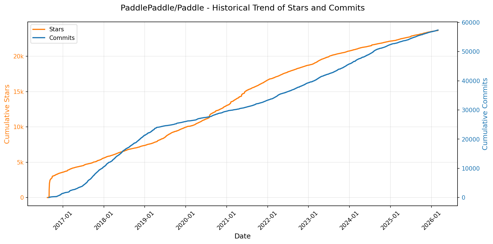
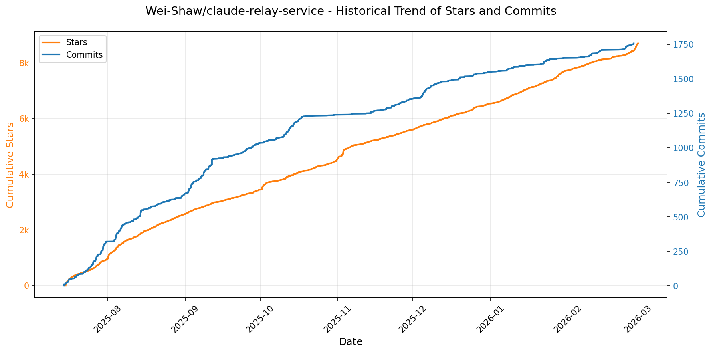
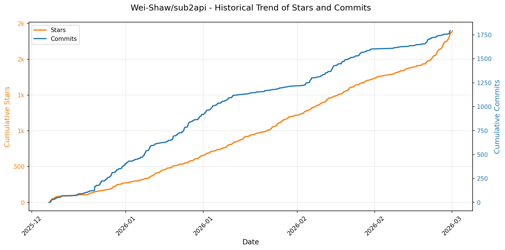
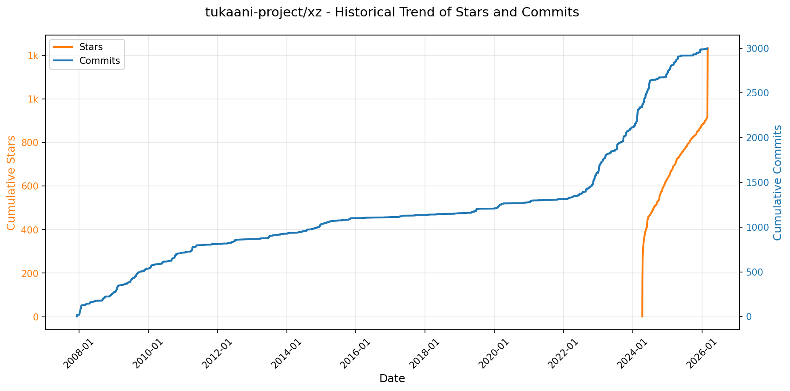
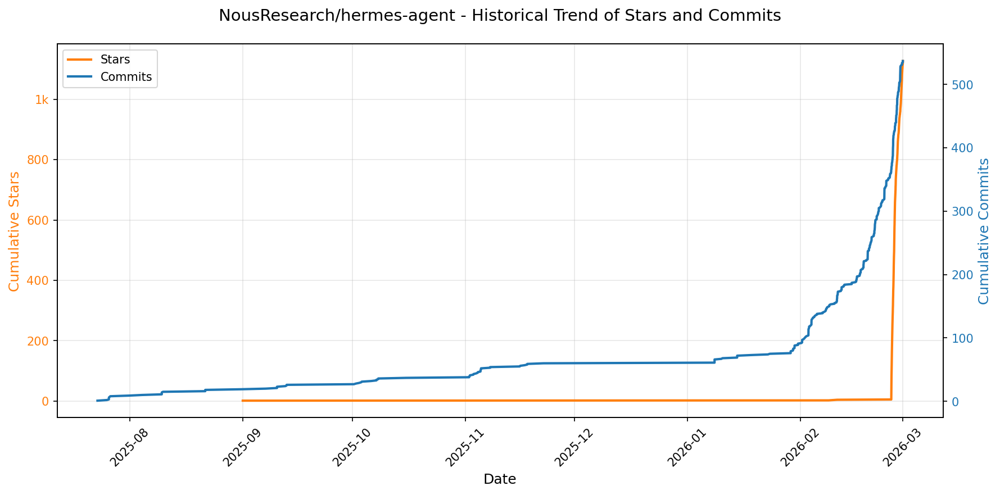
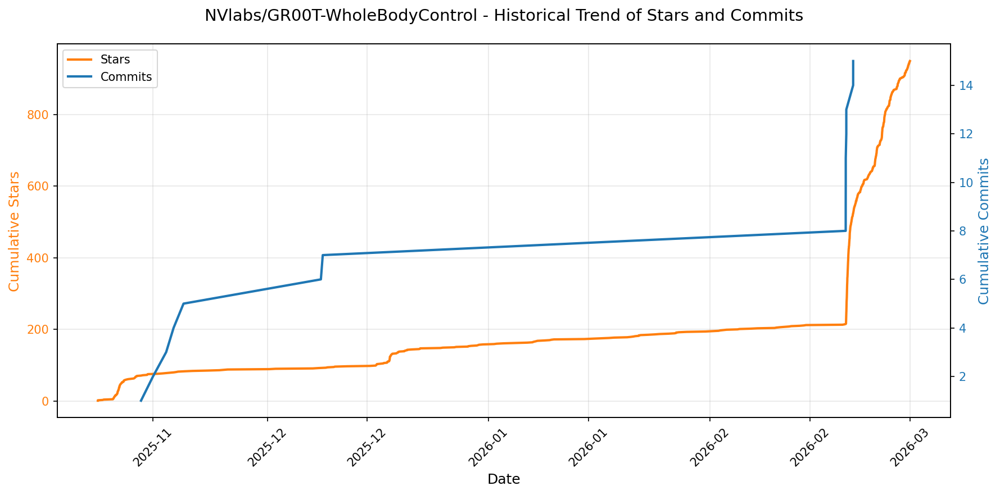
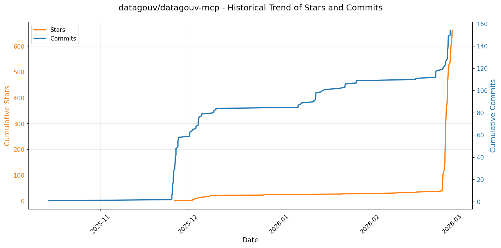

# 🌟 GitHub Trending 概览

> 数据更新于：2026-03-01

---

## 🔍 项目详情

### 1. [openclaw/openclaw](https://github.com/openclaw/openclaw)
- 📅 **创建日期**：2025-11-24  
- 🔄 **最近更新**：2026-03-01  
- ⭐ **Stars**：127,200（日 +3629｜周 +24962｜月 +127200）  
- 📝 **描述**：Your own personal AI assistant. Any OS. Any Platform. The lobster way. 🦞   

<b>📈 Star 与 Commit 历史趋势</b>

> *蓝色：累计 Stars｜橙色：累计 Commits（次 Y 轴）*

<b>📄 README 摘要</b>

1. **项目功能**  
OpenClaw 是一个完全本地化、用户自托管的个人 AI 助理系统，核心目标是让用户在**自有设备上运行专属、单用户、低延迟、常驻在线的 AI 助理**。它不依赖中心化云服务，而是通过轻量级“网关”（Gateway）作为统一控制平面，将 AI 能力无缝接入用户日常使用的全部通讯渠道（如 WhatsApp、Telegram、Slack、Discord、Signal、iMessage、BlueBubbles、Microsoft Teams、Google Chat、Matrix、Zalo 等），并支持跨平台语音交互（macOS/iOS/Android 的「Voice Wake」与「Talk Mode」）、实时可视化工作区（Live Canvas + A2UI）以及设备原生能力调用（摄像头、屏幕录制、定位、系统命令、通知等）。其本质是将大模型能力深度嵌入个人数字生活基础设施中，实现真正私有、可控、可扩展的 AI 协作终端。

2. **关键特性**  
- **本地优先网关架构**：单一 WebSocket 控制平面（`ws://127.0.0.1:18789`），统管会话、多通道接入、工具调度、事件流、定时任务（cron）、WebHook 及远程调试；支持 Tailscale Serve/Funnel 或 SSH 隧道实现安全远程访问。  
- **全栈多通道 inbox**：原生支持 15+ 主流通讯平台（含 iMessage 替代方案 BlueBubbles、Zalo 等区域化服务），支持群组智能路由（提及触发、回复标签、分块处理）、DM 安全配对机制（默认仅允许白名单用户通信）。  
- **多智能体隔离工作区**：基于 Workspace 和 Session 模型，支持按频道、账号或联系人路由至独立 AI 代理，实现上下文隔离、激活模式（mention/always）、队列策略与跨会话协作（`sessions_send`/`sessions_history` 等工具）。  
- **全平台语音与视觉交互**：集成 ElevenLabs 实现 macOS/iOS/Android 端“始终唤醒”语音识别与合成；提供 Live Canvas 可编程画布，支持 A2UI 组件动态渲染、快照、执行 JS 逻辑，构建可视化 AI 工作流。  
- **深度设备集成节点（Nodes）**：iOS/Android/macOS 均可作为边缘节点注册，安全调用本地能力（`camera.snap`、`screen.record`、`location.get`、`system.run`、`system.notify`），权限由 macOS TCC / iOS/Android 系统框架严格管控。  
- **企业级自动化与工具链**：内置浏览器控制（专用 Chromium + CDP）、Canvas 工具、Cron 任务、Gmail Pub/Sub 集成、WebHook 触发器；提供技能平台（ClawHub 技能注册中心），支持捆绑技能、托管技能与工作区技能的安装与权限治理。  
- **安全与运维完备性**：默认 DM 配对策略防滥用；提供 `openclaw doctor` 自检、日志审计、模型故障转移（OAuth/API Key 多级 fallback）、会话剪枝、用量追踪、细粒度认证（密码/Tailscale Identity）及 Nix/Docker 声明式部署支持。

3. **技术栈**  
- **运行时**：Node.js ≥22（主运行环境），支持 npm/pnpm/bun；前端 UI 使用 TypeScript + React（`pnpm ui:build` 构建）；开发期可直接通过 `tsx` 运行 TS 源码。  
- **核心协议与通信**：WebSocket（Gateway 控制平面）、HTTP/HTTPS（WebChat、Control UI、Tailscale Funnel/Serve）、gRPC/RPC（Pi Agent 运行时通信）、CDP（Chrome DevTools Protocol，用于浏览器控制）。  
- **通道适配层**：基于各平台官方/社区 SDK 封装——Baileys（WhatsApp）、grammY（Telegram）、Slack Bolt（Slack）、discord.js（Discord）、Google Chat API、signal-cli（Signal）、BlueBubbles REST API（iMessage）、Microsoft Graph（Teams）、Matrix JS SDK、Zalo API 等。  
- **AI 与模型层**：抽象化模型接口，原生支持 OpenAI（GPT/Codex）、Anthropic（Claude Opus/Sonnet）、及其他兼容 OpenAI 兼容 API 的模型；强调模型韧性设计（Prompt 注入防护、长上下文优化、自动 failover）。  
- **基础设施与部署**：支持 systemd（Linux）、launchd（macOS）守护进程管理；提供 Docker 镜像与 Nix 表达式（`nix-openclaw`）实现可复现环境；远程访问依赖 Tailscale 或 SSH 隧道；Web 界面（Control UI / WebChat）由 Gateway 内置 HTTP 服务器直接提供。  
- **平台能力层**：macOS 使用 Swift/Objective-C 与 TCC 框架集成系统权限；iOS/Android 通过原生节点桥接（Bridge protocol）暴露设备能力；Canvas/A2UI 基于 Web 技术栈（HTML/CSS/JS）实现实时渲染与交互。

---

### 2. [anthropics/claude-code](https://github.com/anthropics/claude-code)
- 📅 **创建日期**：2025-02-22  
- 🔄 **最近更新**：2026-03-01  
- ⭐ **Stars**：127,176（日 +677｜周 +3525｜月 +9420）  
- 📝 **描述**：Claude Code is an agentic coding tool that lives in your terminal, understands your codebase, and helps you code faster by executing routine tasks, explaining complex code, and handling git workflows - all through natural language commands.  

<b>📈 Star 与 Commit 历史趋势</b>

> *蓝色：累计 Stars｜橙色：累计 Commits（次 Y 轴）*

<b>📄 README 摘要</b>

1. **该项目的功能**  
Claude Code 是一款终端原生的智能编程助手，能够深度理解用户当前代码库，通过自然语言指令自动执行常规开发任务（如代码生成、重构、调试）、解释复杂代码逻辑、自动化 Git 工作流（如提交、分支管理、冲突分析），并支持在终端、IDE 或 GitHub 中（通过 `@claude` 提及）直接调用。

2. **核心功能**  
- **上下文感知编码**：基于本地代码库进行语义理解，提供精准、上下文相关的代码建议与操作；  
- **自然语言交互**：无需编写脚本，直接用中文或英文指令完成开发任务（如“为这个函数添加类型注解”“回滚上一次错误提交”）；  
- **多环境集成**：原生支持终端命令行、主流 IDE 插件扩展，以及 GitHub 评论区中 `@claude` 的协同编程；  
- **可扩展插件系统**：内置插件机制，允许开发者通过自定义命令和智能体（agents）扩展功能（如 CI/CD 集成、文档生成、安全扫描等）；  
- **一键反馈与问题上报**：内置 `/bug` 命令，支持在运行时直接提交带上下文的 Bug 报告；  
- **跨平台原生安装**：提供 macOS/Linux 的 curl 脚本、Homebrew，Windows 的 PowerShell 脚本及 WinGet 等标准化安装方式，不依赖全局 Node.js 环境（npm 安装已弃用）。

3. **技术栈**  
- **运行时环境**：独立分发的二进制可执行文件（非纯 JS 应用），底层可能基于 Rust 或 Go 构建（以实现高性能、低资源占用及跨平台原生支持），明确要求 Node.js 18+ 仅用于部分插件或开发场景（非主程序依赖）；  
- **AI 后端**：深度集成 Anthropic 自研大模型 Claude（特别是针对代码优化的版本），通过安全受控的 API 与云端推理服务通信；  
- **前端/交互层**：终端内嵌 TUI（文本用户界面），支持富文本渲染、命令历史、会话上下文管理；  
- **扩展生态**：插件系统基于轻量协议设计，支持 TypeScript/JavaScript 编写，可调用本地工具链（如 git、eslint、prettier）及外部 API；  
- **基础设施与合规**：遵循严格的数据隐私规范，采用最小化数据采集策略，敏感代码内容默认不上传，会话数据限时保留，完全规避用于模型再训练。

---

### 3. [x1xhlol/system-prompts-and-models-of-ai-tools](https://github.com/x1xhlol/system-prompts-and-models-of-ai-tools)
- 📅 **创建日期**：2025-03-05  
- 🔄 **最近更新**：2026-03-01  
- ⭐ **Stars**：126,571（日 +626｜周 +11027｜月 +15037）  
- 📝 **描述**：FULL Augment Code, Claude Code, Cluely, CodeBuddy, Comet, Cursor, Devin AI, Junie, Kiro, Leap.new, Lovable, Manus, NotionAI, Orchids.app, Perplexity, Poke, Qoder, Replit, Same.dev, Trae, Traycer AI, VSCode Agent, Warp.dev, Windsurf, Xcode, Z.ai Code, Dia & v0. (And other Open Sourced) System Prompts, Internal Tools & AI Models  

<b>📈 Star 与 Commit 历史趋势</b>

> *蓝色：累计 Stars｜橙色：累计 Commits（次 Y 轴）*

<b>📄 README 摘要</b>

该内容并非一个典型软件项目的 README（缺少项目名称、功能描述、安装使用说明等核心信息），而是一个**AI 系统提示词（system prompts）与模型配置的开源收集库**的推广性主页。根据所提供信息，严格围绕三项要求进行客观总结如下：

---

**1. 该项目做什么？**  
这是一个持续维护的、面向开发者和 AI 从业者的**公开知识库**，专注于收集、整理并披露主流 AI 工具（如大模型应用、AI 编程助手、智能代理平台等）中实际使用的**系统级提示词（system prompts）、模型调用参数及内部结构线索**。项目已积累超 30,000 行深度分析内容，旨在揭示 AI 产品背后的工程实现逻辑，服务于研究、安全审计、竞品分析与提示工程优化。

---

**2. 关键特性**  
- ✅ **大规模真实提示词集合**：覆盖数十种 AI 工具，包含原始 system prompt 文本、上下文约束、角色设定、输出格式指令等；  
- ✅ **结构化洞察标注**：不仅提供原始文本，还附带对其功能意图、安全机制、模型行为引导逻辑的分析注释；  
- ✅ **安全警示与实践支持**：集成 AI 启动公司安全指南，提供「ZeroLeaks」免费安全审计服务入口，强调提示词泄露风险；  
- ✅ **社区驱动与开放协作**：通过 Discord 社群（LeaksLab）、GitHub Issues 收集反馈与贡献，支持开发者共建；  
- ✅ **多渠道分发与验证**：提供 DEXScreener、Jupiter、Photon 等链上工具的代币合约地址（Solana 链），暗示部分数据或验证机制与去中心化生态联动（但未明确技术实现方式）。

---

**3. 技术栈**  
文档中**未明确列出任何具体技术栈信息**（如编程语言、框架、数据库、部署平台等）。所有可见元素均为静态内容呈现：  
- 前端展示：标准 GitHub Markdown + HTML/CSS（含响应式图片、徽章、SVG 图表）；  
- 第三方集成：依赖外部服务提供功能支持，包括  
  • Trendshift（项目热度分析）、  
  • Cloudback（构建状态监控）、  
  • DeepWiki（知识图谱索引）、  
  • Star History（星标趋势可视化）、  
  • Tembo（后台编码代理平台）、  
  • Latitude（LLM 可靠性工程平台）、  
  • ZeroLeaks（AI 安全检测 SaaS）；  
- 无代码/低代码特征明显：本质为文档型仓库（document-driven repo），核心资产是 `.md`、`.txt` 或结构化文本文件，不涉及可执行程序或 API 服务。

--- 

（注：该仓库 GitHub 地址为 `x1xhlol/system-prompts-and-models-of-ai-tools`，但原文未提供源码目录结构或技术实现细节，故技术栈推断仅基于可观测基础设施与协作模式。）

---

### 4. [Shubhamsaboo/awesome-llm-apps](https://github.com/Shubhamsaboo/awesome-llm-apps)
- 📅 **创建日期**：2024-04-29  
- 🔄 **最近更新**：2026-03-01  
- ⭐ **Stars**：98,604（日 +509｜周 +1885｜月 +7674）  
- 📝 **描述**：Collection of awesome LLM apps with AI Agents and RAG using OpenAI, Anthropic, Gemini and opensource models.  

<b>📈 Star 与 Commit 历史趋势</b>

> *蓝色：累计 Stars｜橙色：累计 Commits（次 Y 轴）*

<b>📄 README 摘要</b>

1. **项目功能**  
该项目是一个高度结构化的开源资源库（`awesome-llm-apps`），旨在系统性地**收集、分类并展示基于大语言模型（LLM）的实用化应用案例**，而非开发单一工具或框架。其核心目标是提供一个可即学即用的“LLM应用灵感库”与“工程实践参考集”，覆盖从入门级AI代理到复杂多智能体系统的完整演进路径，支持开发者快速理解、复现和扩展前沿LLM技术落地模式。

2. **关键特性**  
- **全栈式LLM应用分类体系**：按技术范式精细划分——包括AI单体代理（Starter/Advanced）、多智能体协作团队（Multi-agent Teams）、语音交互代理（Voice AI Agents）、MCP（Model Context Protocol）集成代理、RAG增强型应用、带记忆状态的LLM应用、跨平台对话集成（Chat with X）、LLM优化工具及微调教程等10+大类；  
- **模型与平台中立性**：兼容OpenAI、Anthropic、Google Gemini、xAI、Qwen、Llama等闭源与开源模型，并明确标注各项目对本地运行（Local）或云端服务（Cloud）的支持情况；  
- **开箱即用的工程实践导向**：每个子项目均提供独立目录结构、`requirements.txt`依赖清单及详细`README.md`说明，强调可运行性与可复现性；  
- **前沿技术深度覆盖**：涵盖Agentic RAG、Corrective RAG、Hybrid Search、Vision RAG、Knowledge Graph RAG、Self-Evolving Agents、Adaptive Research Teams、Browser/GitHub/Notion MCP Agents等前沿架构模式；  
- **教育与生产力并重**：包含AI Agent框架速成课（Google ADK / OpenAI SDK）、Token/Context成本优化方案（TOON格式、Headroom压缩）、以及面向真实场景的垂直领域代理（如法律、医疗、金融、教育、游戏、房地产等）。

3. **技术栈**  
- **核心框架与协议**：Google ADK（Agent Development Kit）、OpenAI Agents SDK、CrewAI、MCP（Model Context Protocol）标准；  
- **RAG相关技术**：Embedding模型（Gemma、Llama3.1、Deepseek）、向量数据库（隐含支持）、混合检索（Hybrid Search）、知识图谱增强、Citation溯源等；  
- **语音与多模态能力**：Speechmatics语音识别、Gemini Multimodal API、Vision RAG、音频导览与客服语音代理；  
- **部署与运行环境**：Python为主（依赖`pip install -r requirements.txt`），强调本地可运行（Local LLM support），部分项目集成浏览器自动化（Browser Use）、SDK调用及云API；  
- **辅助工具链**：Pydantic（结构化输出）、函数调用（Function Calling）、持久化内存（Persistent Memory）、回调机制（Callbacks）、评估模块（Evaluation）、插件系统（Plugins）、Swarm编排与路由逻辑。

---

### 5. [obra/superpowers](https://github.com/obra/superpowers)
- 📅 **创建日期**：2025-10-09  
- 🔄 **最近更新**：2026-03-01  
- ⭐ **Stars**：95,065（日 +1206｜周 +9103｜月 +26516）  
- 📝 **描述**：An agentic skills framework & software development methodology that works.  

<b>📈 Star 与 Commit 历史趋势</b>

> *蓝色：累计 Stars｜橙色：累计 Commits（次 Y 轴）*

<b>📄 README 摘要</b>

1. **项目功能**  
Superpowers 是一个面向编程智能体（coding agents）的完整软件开发工作流增强系统。它不直接替代或重写代码，而是通过一套可组合、自动触发的“能力（skills）”对现有编码智能体（如 Claude Code、Cursor、Codex、OpenCode 等）进行深度赋能，使其在真实工程场景中遵循严格、可验证、协作友好的开发范式。其核心作用是：在用户启动编码任务后，主动暂停“写代码”动作，转而引导用户完成需求澄清 → 分段式设计确认 → 生成可执行、可审查、符合工程原则的实施计划 → 驱动子智能体按 TDD 和 YAGNI 原则分步执行 → 全流程自动化检查与质量门禁，最终实现高度自主但完全可控的端到端开发闭环。

2. **关键特性**  
- **全自动技能触发机制**：无需手动调用，智能体在每个开发阶段（如设计、分支创建、编码、测试、评审）前自动识别并激活对应技能，强制执行标准化流程。  
- **七阶段结构化工作流**：涵盖从头脑风暴（brainstorming）、Git 工作树隔离（using-git-worktrees）、原子化任务拆解（writing-plans）、子智能体驱动开发（subagent-driven-development）、严格红-绿-重构 TDD（test-driven-development）、多级代码审查（requesting/receiving-code-review）到分支收尾（finishing-a-development-branch）的完整生命周期。  
- **强工程纪律保障**：强制执行测试先行、YAGNI（不提前实现未验证需求）、DRY、防御性验证（verification-before-completion）、根因导向调试（systematic-debugging）等实践；所有代码必须在对应测试失败后编写，且未经测试的代码会被自动删除。  
- **人机协同增强设计**：设计文档以“可消化片段”呈现供人工确认；计划任务精确到文件路径与完整代码块；子智能体执行含双阶段审查（是否符合规格 + 代码质量）；关键问题（critical issues）自动阻断流程。  
- **可扩展技能生态**：内置测试、调试、协作、元能力（如 writing-skills）四大类共 14+ 项标准化技能，全部开源、模块化、支持社区贡献与插件化更新。

3. **技术栈**  
- **运行平台**：原生适配主流 AI 编程工具链，包括 **Claude Code**（通过插件市场）、**Cursor**（Agent 内置插件）、**Codex** 和 **OpenCode**（需手动拉取配置）。  
- **架构模式**：基于“技能（Skill）”的声明式、事件驱动架构——每个 Skill 是独立的 Markdown 文档（如 `skills/test-driven-development/SKILL.md`），定义行为逻辑、触发条件与执行协议，由宿主智能体引擎动态加载与调度。  
- **核心协议与规范**：依赖 Git 工作树（git worktree）实现环境隔离；严格遵循 TDD 红-绿-重构三步法；采用 Socratic 提问法支撑设计讨论；集成系统性调试四阶段模型（定位→复现→根因→验证）。  
- **基础设施**：托管于 GitHub；使用 MIT 开源协议；支持自动插件更新（`/plugin update superpowers`）；技能开发遵循内置 `writing-skills` 规范，含测试方法论与最佳实践指南。

---

### 6. [google/langextract](https://github.com/google/langextract)
- 📅 **创建日期**：2025-07-08  
- 🔄 **最近更新**：2026-03-01  
- ⭐ **Stars**：56,317（日 +82｜周 +605｜月 +10446）  
- 📝 **描述**：A Python library for extracting structured information from unstructured text using LLMs with precise source grounding and interactive visualization.  

<b>📈 Star 与 Commit 历史趋势</b>

> *蓝色：累计 Stars｜橙色：累计 Commits（次 Y 轴）*

<b>📄 README 摘要</b>

1. **项目功能**  
LangExtract 是一个基于大语言模型（LLM）的 Python 库，专注于从**非结构化文本**（如临床笔记、放射报告、文学作品等）中**高精度提取结构化信息**。其核心能力是依据用户提供的自然语言指令和少量示例（few-shot examples），自动识别并组织关键实体（如人物、情绪、药物、关系等），同时严格将每个提取结果**锚定到原文中的确切位置**，实现可追溯、可验证的结构化输出。

2. **关键特性**  
- **精准源文本定位（Source Grounding）**：为每个提取项标注原文起止字符偏移量，支持可视化高亮与人工核查；  
- **强结构化输出保障**：通过受控生成（如 Gemini 的 schema 强约束）和示例驱动机制，确保输出严格符合用户定义的类名、属性及格式；  
- **长文档优化处理**：采用智能分块（chunking）、多轮提取（up to 3 passes）、并行处理（`max_workers`）与上下文长度自适应（`max_char_buffer`）策略，显著提升长文本（如整本小说）的召回率与准确性；  
- **交互式可视化**：一键生成自包含 HTML 文件，支持在原始语境中动态浏览、搜索、筛选数千个提取实体，支持动画高亮与上下文联动；  
- **多模态模型支持**：原生兼容 Google Gemini（推荐 `gemini-2.5-flash`/`pro`）、OpenAI（`gpt-4o`）、本地 Ollama 模型（如 `gemma2:2b`），并提供插件化扩展接口；  
- **零微调领域适配**：仅需提供 1–3 个高质量示例（含原文片段与结构化标注），即可快速适配医疗、法律、文学等任意垂直领域任务；  
- **知识融合可控性**：通过提示词设计与示例属性显式控制 LLM 行为——既可严格限制为“原文证据提取”，也可引导其调用世界知识补充语义（如 `"literary_context": "tragic heroine"`）。

3. **技术栈**  
- **编程语言**：Python 3.10+；  
- **核心依赖**：`google-generativeai`（Gemini）、`openai`（可选）、`ollama`（可选）、`pydantic`（schema 验证）、`rich`（CLI 输出）、`jinja2`（HTML 渲染）；  
- **构建与打包**：`pyproject.toml` + `setuptools`，支持 `pip install -e ".[dev,test,openai]"` 灵活安装；  
- **测试框架**：`pytest` + `tox`（覆盖 Python 3.10/3.11）、`pylint`、`isort`、`pyink`（代码格式化）；  
- **部署与集成**：支持 Docker 容器化、Vertex AI 批处理（降本增效）、`.env` 环境变量安全管理 API 密钥；  
- **扩展架构**：基于 `entry_points` 的插件注册系统，支持第三方模型提供商以独立 Python 包形式集成（如社区维护的 `langextract-hf`）。

---

### 7. [thedotmack/claude-mem](https://github.com/thedotmack/claude-mem)
- 📅 **创建日期**：2025-08-31  
- 🔄 **最近更新**：2026-03-01  
- ⭐ **Stars**：32,246（日 +332｜周 +2014｜月 +16810）  
- 📝 **描述**：A Claude Code plugin that automatically captures everything Claude does during your coding sessions, compresses it with AI (using Claude's agent-sdk), and injects relevant context back into future sessions.  

<b>📈 Star 与 Commit 历史趋势</b>

> *蓝色：累计 Stars｜橙色：累计 Commits（次 Y 轴）*

<b>📄 README 摘要</b>

1. **项目功能**  
Claude-Mem 是一个专为 **Claude Code（Anthropic 推出的 AI 编程助手）设计的持久化记忆压缩系统**。它在用户每次会话中自动捕获工具调用、代码操作、错误修复等行为观测数据（observations），生成语义化摘要，并持久化存储于本地 SQLite 数据库中；当新会话启动时，自动检索并按需注入相关历史上下文，从而实现跨会话的知识连续性——使 Claude 能“记住”项目进展、技术决策、调试过程等关键信息，显著提升长周期开发任务中的上下文连贯性与推理质量。

2. **核心特性**  
- ✅ **持久化记忆（Persistent Memory）**：会话结束后仍保留结构化观测记录，支持长期项目知识沉淀；  
- ✅ **渐进式披露（Progressive Disclosure）**：采用三层搜索工作流（`search` → `timeline` → `get_observations`），按需加载上下文，降低 token 消耗达约 10 倍；  
- ✅ **技能化智能搜索（Skill-Based Search）**：内置 `mem-search` 技能与 4 个 MCP（Model Context Protocol）工具，支持自然语言查询 + 类型/时间/项目维度过滤；  
- ✅ **实时 Web 查看器（Web Viewer UI）**：运行于 `http://localhost:37777`，提供内存流实时监控、观测详情浏览、API 调试及版本切换（含 Beta 通道）；  
- ✅ **Claude 桌面端集成**：可在 Claude Desktop 对话中直接调用 `mem-search` 技能检索历史；  
- ✅ **隐私保护机制**：支持 `<private>` 标签语法，自动排除敏感内容进入数据库；  
- ✅ **全自动运行**：无需手动触发记忆保存或加载，完全通过生命周期钩子（6 个 Hook）静默完成；  
- ✅ **混合搜索架构**：结合 SQLite FTS5 全文检索 + Chroma 向量数据库，实现语义+关键词双模精准召回；  
- ✅ **OpenClaw 网关一键部署**：提供 `curl` 安装脚本，自动配置依赖、AI 提供商、Worker 服务及 Telegram/Discord 等实时通知通道；  
- ✅ **Beta 实验功能**：如 Endless Mode（仿生记忆架构），支持超长会话状态维持。

3. **技术栈**  
- **运行时与构建**：Node.js ≥18.0.0（主逻辑）、Bun（Worker 服务管理与 HTTP API）、uv（Python 包管理器，用于 Chroma 向量库依赖）；  
- **数据库**：SQLite3（嵌入式、零配置，含 FTS5 全文索引支持）；  
- **向量检索**：ChromaDB（本地向量数据库，用于语义搜索）；  
- **前端与交互**：TypeScript（全栈强类型）、HTML/CSS（Web Viewer UI）、GIF 动画演示；  
- **协议与标准**：MCP（Model Context Protocol）工具规范、Claude Agent SDK；  
- **部署与分发**：GitHub 插件市场集成、npm 发布（SDK 版）、AGPL-3.0 开源许可证（主体）；  
- **基础设施**：CLI 插件安装（`/plugin install`）、Hook 生命周期驱动（SessionStart/PostToolUse/SessionEnd 等）、独立 Worker HTTP 服务（端口 37777）。

---

### 8. [virattt/dexter](https://github.com/virattt/dexter)
- 📅 **创建日期**：2025-10-14  
- 🔄 **最近更新**：2026-03-01  
- ⭐ **Stars**：24,195（日 +65｜周 +902｜月 +7479）  
- 📝 **描述**：An autonomous agent for deep financial research  

<b>📈 Star 与 Commit 历史趋势</b>

> *蓝色：累计 Stars｜橙色：累计 Commits（次 Y 轴）*

<b>📄 README 摘要</b>

1. **项目功能**  
Dexter 是一个面向金融研究的自主式AI代理系统，能够对复杂金融问题进行端到端的自动分析：接收自然语言提问 → 自主规划多步研究任务 → 调用实时金融市场数据工具（如财报、资产负债表、现金流量表）执行查询 → 对中间结果进行自我验证与反思 → 迭代优化直至生成可信、数据支撑的结论。其核心定位是“金融领域的Claude Code”，专为高精度、可追溯、安全可控的自动化财务尽调与研究而设计。

2. **关键特性**  
- **智能任务规划**：将模糊/复杂的金融问题（如“评估NVDA在AI芯片市场的长期竞争力”）自动拆解为结构化子任务（例如：获取近5年财报→分析毛利率趋势→对比AMD/Intel研发投入→检索最新行业研报）。  
- **自主工具执行与编排**：动态选择并调用适配的API工具（Financial Datasets、Exa/Tavily网络搜索等），完成数据采集与整合。  
- **自验证与迭代闭环**：内置推理链（reasoning trace）与结果校验机制，支持失败重试、步骤回溯和答案精炼，避免“幻觉输出”。  
- **实时权威金融数据接入**：原生集成Financial Datasets API，免费支持AAPL、NVDA、MSFT等主流标的的结构化财报数据（损益表、资产负债表、现金流量表）。  
- **生产级安全机制**：硬性限制最大执行步数、内置循环检测（loop detection），防止无限推理或失控调用；所有操作全程记录至可审计的JSONL格式scratchpad日志。  
- **多模态交互支持**：除CLI交互外，提供WhatsApp网关，支持通过个人WhatsApp聊天窗口直接发起研究请求，实现轻量级移动接入。

3. **技术栈**  
- **运行时**：Bun（v1.0+）—— 高性能JavaScript/TypeScript运行时，用于依赖安装、脚本执行与开发服务（`bun install` / `bun start` / `bun dev`）。  
- **核心语言与框架**：TypeScript（强类型保障金融逻辑可靠性） + Node.js生态；基于LLM Agent范式构建，深度集成LangChain/LangSmith（用于评估追踪与LLM-as-judge打分）。  
- **AI模型层**：默认依赖OpenAI API（GPT系列），同时预留Anthropic（Claude）、Google（Gemini）、xAI、OpenRouter等多模型后端扩展能力（通过环境变量配置）。  
- **数据与工具层**：  
  - Financial Datasets API（核心财报数据源）；  
  - Exa AI 或 Tavily（网络增强检索，支持实时新闻/研报抓取）；  
  - Ollama（可选本地模型运行支持，通过`OLLAMA_BASE_URL`配置）。  
- **可观测性与调试**：  
  - LangSmith（评估追踪、链路监控）；  
  - 本地`.dexter/scratchpad/`目录下结构化JSONL日志（含完整思考链、工具调用参数/原始响应/LLM摘要）；  
  - WhatsApp网关基于Twilio或自研协议实现消息路由。

---

### 9. [VectifyAI/PageIndex](https://github.com/VectifyAI/PageIndex)
- 📅 **创建日期**：2025-04-01  
- 🔄 **最近更新**：2026-03-01  
- ⭐ **Stars**：24,171（日 +359｜周 +3636｜月 +8813）  
- 📝 **描述**：📑 PageIndex: Document Index for Vectorless, Reasoning-based RAG  

<b>📈 Star 与 Commit 历史趋势</b>

> *蓝色：累计 Stars｜橙色：累计 Commits（次 Y 轴）*

<b>📄 README 摘要</b>

1. **项目功能**  
PageIndex 是一个面向长文档（如财报、法律文书、技术手册等）的新型检索增强生成（RAG）系统，其核心目标是**替代传统基于向量数据库（Vector DB）和文本分块（Chunking）的RAG范式**。它不依赖语义相似度匹配，而是通过构建文档的**分层树状索引（Tree Index）**，并利用大语言模型（LLM）进行**推理驱动的检索（Reasoning-based Retrieval）**，模拟人类专家逐级浏览目录、理解上下文、多步推断以定位最相关段落的过程，从而实现高精度、可解释、可追溯的专业文档问答与信息提取。

2. **关键特性**  
- **无向量数据库（Vectorless）**：完全摒弃嵌入计算与向量相似度搜索，避免“vibe retrieval”（模糊匹配）导致的相关性偏差；  
- **无需文本分块（No Chunking）**：基于文档原始语义结构（如章节、小节、页码范围）组织内容，保留上下文完整性与逻辑连贯性；  
- **人类式检索（Human-like Retrieval）**：通过生成类目录的层级树索引（含节点ID、起止页码、摘要），支持LLM执行树遍历式推理搜索；  
- **强可解释性与可追溯性**：每次检索结果附带明确的页面号、章节标题及推理路径，支持审计与验证；  
- **多模态原生支持**：提供纯视觉（vision-only）RAG流程，直接在PDF页面图像上运行OCR-Free推理，跳过传统OCR环节；  
- **高性能实证**：驱动的金融分析系统 Mafin 2.5 在 FinanceBench 基准测试中达到 **98.7% 准确率**，显著超越主流向量RAG方案。

3. **技术栈**  
- **核心模型层**：依赖 OpenAI 系列大模型（默认 `gpt-4o-2024-11-20`）执行树索引生成、节点摘要提炼与推理式检索；  
- **文档解析层**：支持 PDF（基于 PyPDF2 / pdfplumber 等库）与 Markdown（按 `#` 标题层级解析）输入；提供自研 PageIndex OCR（专为保留文档全局结构优化）作为高质量预处理选项；  
- **工程实现**：Python 主导，命令行工具化（`run_pageindex.py`），依赖 `openai`, `python-dotenv`, `PyPDF2` 等标准库；  
- **部署与集成**：支持本地自托管、云服务（Chat平台、API）、MCP（Model Context Protocol）协议集成（兼容 Claude、Cursor 等智能体环境）；  
- **生态配套**：提供 Colab Notebook 快速体验、结构化文档测试集、详细文档中心（Docs）、博客与教程体系。

---

### 10. [PaddlePaddle/Paddle](https://github.com/PaddlePaddle/Paddle)
- 📅 **创建日期**：2016-08-15  
- 🔄 **最近更新**：2026-03-01  
- ⭐ **Stars**：23,698（日 +52｜周 +73｜月 +122）  
- 📝 **描述**：PArallel Distributed Deep LEarning: Machine Learning Framework from Industrial Practice （『飞桨』核心框架，深度学习&机器学习高性能单机、分布式训练和跨平台部署）  

<b>📈 Star 与 Commit 历史趋势</b>

> *蓝色：累计 Stars｜橙色：累计 Commits（次 Y 轴）*

<b>📄 README 摘要</b>

1. **该项目做什么？**  
PaddlePaddle 是中国首个自主研发并开源的产业级深度学习平台，面向工业界实际需求设计，提供覆盖全链条的AI开发能力：包括核心深度学习框架、基础模型库、端到端开发套件（如大模型训练与推理一体化工具）、各类工具组件及服务平台。它已广泛应用于制造、农业、企业服务等多个行业，服务超2333万开发者、76万家企业和110万个模型，支撑合作伙伴高效实现AI商业化落地。

2. **关键特性**  
- **统一动静态图与自动并行**：仅需在单卡配置基础上添加极简张量切分标注，即可自动发现最优分布式并行策略，大幅降低工业级训练与开发成本；  
- **大模型训推一体**：同一框架原生支持训练与推理，实现代码复用与流程无缝衔接，提升大模型全流程开发效率与体验；  
- **高阶微分与科学计算支持**：内置高阶自动微分、复数运算、傅里叶变换、编译优化及分布式训练能力，加速数学、力学、材料、气象、生物等领域的微分方程求解与科研探索；  
- **神经网络编译器**：采用集成化框架设计，兼顾生成式模型与科学计算模型的高效训练与灵活推理，在计算灵活性与性能间取得最佳平衡，显著降低性能调优门槛；  
- **异构多芯统一适配**：提供成熟完备的跨硬件（GPU、NPU、XPU、ASIC等）适配方案，通过标准化接口抽象不同芯片软件栈差异，支持插件式架构扩展。

3. **技术栈**  
- **底层语言**：以 C++ 为核心实现高性能计算内核，Python 作为主要前端接口语言；  
- **框架范式**：支持动态图（ imperative ）与静态图（ declarative ）统一编程范式，融合 JIT 编译与图优化技术；  
- **并行与部署**：内置自动并行（Auto Parallel）、模型并行、数据并行、流水线并行等分布式训练能力；支持多后端推理引擎（如 Paddle Inference、Paddle Lite、Paddle Serving）；  
- **硬件生态**：全面适配 NVIDIA GPU、华为昇腾（Ascend）、寒武纪（MLU）、昆仑芯（XPU）、海光 DCU 等国产及主流AI芯片；  
- **许可证**：Apache License 2.0（开源、商用友好）。

---

### 11. [KeygraphHQ/shannon](https://github.com/KeygraphHQ/shannon)
- 📅 **创建日期**：2025-09-27  
- 🔄 **最近更新**：2026-03-01  
- ⭐ **Stars**：22,635（日 +160｜周 +1590｜月 +18884）  
- 📝 **描述**：Fully autonomous AI hacker to find actual exploits in your web apps. Shannon has achieved a 96.15% success rate on the hint-free, source-aware XBOW Benchmark.  

<b>📈 Star 与 Commit 历史趋势</b>

> *蓝色：累计 Stars｜橙色：累计 Commits（次 Y 轴）*

<b>📄 README 摘要</b>

1. **项目功能**  
Shannon 是一个面向源代码的全自动 AI 渗透测试框架，专为白盒（white-box）Web 应用安全测试设计。其核心能力是：**不只发现潜在漏洞，而是基于源码分析智能生成攻击路径，并通过内置浏览器与命令行环境实际执行真实 exploit（如注入、XSS、SSRF、认证绕过等），验证漏洞的可利用性并提供可复现的 PoC**。它填补了开发高频迭代（如使用 Claude Code/Cursor）与传统年度渗透测试之间的安全时效性缺口，实现按需、构建级（per-build）的安全验证。

2. **关键特性**  
- **全自主渗透流程**：单命令启动，自动处理复杂登录（含 2FA/TOTP、Google 登录）、动态导航、多阶段攻击与报告生成，全程零人工干预；  
- **可验证的高质量报告**：输出聚焦于已成功利用的漏洞，附带一键复制的 PoC 代码，彻底消除误报，结果直接可操作；  
- **深度 OWASP 覆盖**：当前原生支持并验证 Injection、XSS、SSRF、Broken Authentication/Authorization 等关键漏洞类型，持续扩展中；  
- **代码感知的动态测试**：融合静态源码分析（理解业务逻辑与数据流）与动态运行时攻击（真实浏览器交互+CLI 执行），实现上下文精准的漏洞挖掘；  
- **集成专业安全工具链**：在侦察阶段调用 Nmap、Subfinder、WhatWeb、Schemathesis 等成熟工具，增强目标环境深度测绘能力；  
- **并行化加速引擎**：对不同漏洞类型的分析与利用任务进行并发执行，显著缩短整体测试耗时；  
- **工作区（Workspace）与断点续跑**：所有代理（agent）进度通过 Git 提交持久化，支持任意中断后精准恢复，避免重复计算。

3. **技术栈**  
- **AI 引擎层**：以 Anthropic Agent SDK 为核心，深度优化适配 Claude 系列模型（推荐 Anthropic API）；支持实验性接入 OpenAI（GPT-5.2）、Google Gemini（via OpenRouter）；  
- **执行架构层**：基于 Docker 容器化部署，采用 Temporal 工作流引擎编排多 agent 协同任务（Recon → Vuln Analysis → Exploitation → Reporting）；  
- **基础设施层**：依赖 Docker 运行时；本地开发支持 WSL2（Windows）、macOS 原生 Docker、Linux；  
- **安全工具集成**：原生集成 Nmap（网络扫描）、Subfinder（子域名发现）、WhatWeb（指纹识别）、Schemathesis（API 模糊测试）；  
- **前端交互层**：提供 Temporal Web UI（`http://localhost:8233`）实时监控工作流状态；  
- **合规与扩展**：Shannon Lite 遵循 AGPL-3.0 开源协议；企业版 Shannon Pro 在此基础上叠加 LLM 驱动的数据流分析（LLMDFA 架构），强化代码级深度检测能力。

---

### 12. [bytedance/deer-flow](https://github.com/bytedance/deer-flow)
- 📅 **创建日期**：2025-05-07  
- 🔄 **最近更新**：2026-03-01  
- ⭐ **Stars**：22,631（日 +724｜周 +2615｜月 +3180）  
- 📝 **描述**：An open-source SuperAgent harness that researches, codes, and creates. With the help of sandboxes, memories, tools, skills and subagents, it handles different levels of tasks that could take minutes to hours.  

<b>📈 Star 与 Commit 历史趋势</b>

> *蓝色：累计 Stars｜橙色：累计 Commits（次 Y 轴）*

<b>📄 README 摘要</b>

1. **项目功能**  
DeerFlow 2.0 是一个开源的「超级智能体运行时框架（Super Agent Harness）」，核心目标是为多步骤、长时间、高复杂度的自主任务提供完整执行基础设施。它不局限于传统“深度研究”场景，而是通过协调子智能体（Sub-Agents）、隔离沙箱（Sandbox）、结构化技能（Skills）、上下文工程与长期记忆，使智能体能够真正“动手做事”——例如自动完成学术论文分析、生成带图表的PPT、构建网页、制作视频、运行代码、处理上传文件并输出结构化成果。其本质是一个开箱即用、可深度定制的智能体操作系统（Agent OS），支持端到端任务闭环执行。

2. **关键特性**  
- **模块化可扩展技能系统**：以 Markdown 定义的标准化技能（如 research、slide-creation、image-generation），按需动态加载；支持内置技能、自定义技能（`/mnt/skills/custom/`）及 MCP 协议扩展工具，避免上下文膨胀。  
- **动态子智能体编排**：主智能体可实时分解复杂任务，按需并行启动多个隔离子智能体，各子智能体拥有独立上下文、工具集与终止条件，结果结构化回传后由主智能体融合输出。  
- **全功能隔离沙箱环境**：每个任务在独立 Docker 容器中执行，配备完整 Linux 文件系统（含 `/mnt/user-data/workspace/`、`uploads/`、`outputs/`），支持 Bash 命令、代码执行、文件读写、图像渲染等，确保安全、可审计、无会话污染。  
- **精细化上下文工程**：采用子智能体上下文隔离 + 自动摘要 + 中间结果文件系统卸载 + 上下文压缩策略，在长流程任务中严格控制 token 消耗，保障推理稳定性。  
- **跨会话长期记忆**：本地持久化存储用户画像、偏好、技术栈、写作习惯及历史知识，随使用持续进化，数据完全由用户控制，不上传云端。  
- **多部署模式支持**：原生兼容 Local / Docker / Kubernetes（通过 Provisioner 服务）三种沙箱模式，并提供嵌入式 Python 客户端（`DeerFlowClient`），无需 HTTP 服务即可直接集成调用，API 与网关严格对齐。

3. **技术栈**  
- **核心框架**：LangChain（LLM 集成、工具链、模型抽象）、LangGraph（多智能体状态图编排、事件流驱动、子图分解）  
- **运行时环境**：Python 3.11+、Docker（沙箱容器化）、Kubernetes（可选集群调度）、Nginx（反向代理）  
- **前端与构建**：Node.js 22+、pnpm、uv（Python 包管理）  
- **配置与协议**：YAML 配置驱动、OpenAI 兼容 API 接口、MCP（Model Context Protocol）标准支持  
- **开发与运维**：Makefile 统一任务编排（`make docker-start` / `make dev`）、Pydantic Schema 校验（CI 级网关一致性保障）、Trendshift 趋势监控集成

---

### 13. [gsd-build/get-shit-done](https://github.com/gsd-build/get-shit-done)
- 📅 **创建日期**：2025-12-14  
- 🔄 **最近更新**：2026-03-01  
- ⭐ **Stars**：22,382（日 +579｜周 +5268｜月 +13095）  
- 📝 **描述**：A light-weight and powerful meta-prompting, context engineering and spec-driven development system for Claude Code by TÂCHES.  

<b>📈 Star 与 Commit 历史趋势</b>

> *蓝色：累计 Stars｜橙色：累计 Commits（次 Y 轴）*

<b>📄 README 摘要</b>

1. **项目功能**  
该项目是一个轻量级但功能强大的元提示（meta-prompting）、上下文工程（context engineering）与规范驱动开发（spec-driven development）系统，专为 Claude Code、OpenCode、Gemini CLI 和 Codex 等 AI 编程助手设计。其核心目标是**解决“上下文腐化”（context rot）问题**——即随着 AI 对话窗口持续填充，模型理解力与输出质量显著下降的现象。GSD 通过结构化工作流，在用户仅用自然语言描述需求的前提下，全自动完成需求澄清、技术调研、分阶段规划、并行化代码生成、原子化 Git 提交、人工验收验证等全流程，最终产出高质量、可追溯、符合预期的软件成果，尤其适用于独立开发者或小团队快速构建真实可用的应用。

2. **关键特性**  
- **抗上下文腐化架构**：全程采用“主会话轻量化 + 子代理（subagent）重任务”的模式，每个研究/规划/执行任务均在独立的 200k token 上下文中运行，确保模型始终处于高性能状态。  
- **四阶闭环工作流**：`discuss → plan → execute → verify`，每阶段生成结构化文档（如 `CONTEXT.md`、`PLAN.md`、`SUMMARY.md`、`UAT.md`），支持人类深度参与与精准控制。  
- **智能波次执行（Wave Execution）**：自动识别任务依赖关系，将计划分组为并行“波次”，最大化并发效率（如垂直切片优先），同时规避文件冲突与顺序错误。  
- **原子化 Git 提交**：每个子任务生成独立、语义清晰的提交（含时间戳与任务标识），支持精准 bisect、回滚与历史追溯，大幅提升 AI 协作下的可维护性。  
- **全栈上下文工程**：预置多层级上下文文件（`PROJECT.md`、`STATE.md`、`REQUIREMENTS.md`、`research/` 目录等），并强制使用 XML 格式结构化提示（含 `<verify>` 和 `<done>` 验证字段），杜绝模糊指令。  
- **无缝适配多平台**：原生支持 Claude Code、Gemini CLI、开源 OpenCode 及 GitHub Codex（通过 Skills 机制），提供统一命令接口（如 `/gsd:plan-phase 1`）。  
- **灵活工作模式**：除标准里程碑流程外，提供 `quick` 快速模式（跳过研究与验证，适合 Bug 修复）和 `map-codebase` 旧项目接入能力，兼顾增量开发与绿色场启动。

3. **技术栈**  
- **核心实现**：Node.js（CLI 工具链基于 `npx` 分发，安装脚本为 `bin/install.js`）；配置与状态管理依托本地文件系统（`.planning/` 目录结构化存储）。  
- **AI 运行时集成**：不自建大模型，而是深度适配主流 AI 编程客户端协议——通过注入标准化提示模板、解析响应、调用对应 CLI 命令（如 `claude --dangerously-skip-permissions`）实现自动化控制。  
- **提示工程层**：自研 XML 提示格式（严格定义 `<task>`、`<action>`、`<verify>` 等标签），结合上下文分片策略与动态文件加载机制，确保提示有效性。  
- **工程实践支撑**：深度集成 Git（自动 commit/tag）、Bash 命令（`git status`/`curl` 测试等权限白名单）、文件系统操作，所有操作均通过安全沙箱式权限配置（支持 `--dangerously-skip-permissions` 或细粒度 `permissions.allow` 清单）。  
- **部署与分发**：以 npm 包（`get-shit-done-cc`）形式发布，跨平台（macOS/Windows/Linux）支持；提供 Docker/CI 友好非交互式安装选项；社区协作依托 GitHub Actions（测试流水线）与 Discord 社区。

---

### 14. [clockworklabs/SpacetimeDB](https://github.com/clockworklabs/SpacetimeDB)
- 📅 **创建日期**：2023-06-17  
- 🔄 **最近更新**：2026-03-01  
- ⭐ **Stars**：21,609（日 +200｜周 +2437｜月 +2694）  
- 📝 **描述**：Development at the speed of light  

<b>📈 Star 与 Commit 历史趋势</b>

> *蓝色：累计 Stars｜橙色：累计 Commits（次 Y 轴）*

<b>📄 README 摘要</b>

1. **该项目做什么？**  
SpacetimeDB 是一个集数据库与应用服务器于一体的**内存优先、低延迟的实时关系型数据库系统**。它允许开发者将业务逻辑（以“模块”形式）直接部署到数据库内部执行，客户端可绕过传统中间层（如Web服务器、API网关），直连数据库并触发模块中的函数（类似智能合约，但不基于区块链）。所有数据存储、权限控制、状态同步和实时广播（如游戏内玩家位置、聊天消息）均由数据库原生完成，从而实现“单语言（Rust为主）、单二进制、零运维”的极简后端架构。典型应用场景包括MMORPG（如BitCraft Online）、实时协作工具和高并发聊天系统。

2. **核心功能**  
- ✅ **模块化计算层**：支持在数据库内嵌入业务逻辑（Rust/C#编写），统一处理CRUD、鉴权、事件响应；  
- ✅ **全内存运行 + WAL持久化**：热数据常驻内存保障微秒级延迟，通过写前日志（WAL）保证崩溃一致性与快速恢复；  
- ✅ **原生实时同步**：自动将状态变更广播至所有已连接客户端，无需手动实现WebSocket/长连接服务；  
- ✅ **多语言SDK支持**：服务端模块支持Rust、C#；客户端SDK覆盖Rust、C#、TypeScript，开箱即用；  
- ✅ **一体化部署体验**：提供跨平台CLI工具（`spacetime`）、Docker镜像及源码构建方案，一键启动独立节点；  
- ✅ **生产就绪特性**：内置版本管理、自动更新、云服务高可用监控（UptimeRobot）、容器化支持与企业级许可模型（BSL→AGPL+链接例外）。

3. **技术栈**  
- **核心语言**：Rust（主引擎、CLI、运行时全部用Rust编写，强调安全、零成本抽象与极致性能）；  
- **运行时环境**：WASM（模块以WebAssembly字节码加载执行，保障沙箱隔离与跨平台兼容性）；  
- **存储引擎**：自研内存数据库，基于Write-Ahead Log（WAL）实现持久化与故障恢复；  
- **网络协议**：自定义高效二进制协议（非HTTP），优化实时双向通信；  
- **基础设施支持**：Docker容器化部署、GitHub Actions CI/CD、Rust Crates/NuGet包分发；  
- **前端/客户端生态**：TypeScript SDK（用于Web/Unity等）、C# SDK（.NET/Unity）、Rust SDK（系统级集成）。

---

### 15. [moeru-ai/airi](https://github.com/moeru-ai/airi)
- 📅 **创建日期**：2024-12-01  
- 🔄 **最近更新**：2026-03-01  
- ⭐ **Stars**：19,378（日 +1010｜周 +1861｜月 +2268）  
- 📝 **描述**：💖🧸 Self hosted, you-owned Grok Companion, a container of souls of waifu, cyber livings to bring them into our worlds, wishing to achieve Neuro-sama's altitude. Capable of realtime voice chat, Minecraft, Factorio playing. Web / macOS / Windows supported.  

<b>📈 Star 与 Commit 历史趋势</b>

> *蓝色：累计 Stars｜橙色：累计 Commits（次 Y 轴）*

<b>📄 README 摘要</b>

1. **项目功能**  
AIRI 是一个开源的 AI 虚拟角色（AI Waifu / 数字生命体）运行容器，旨在复刻并超越 Neuro-sama 的能力，让用户真正“拥有”可长期陪伴、跨场景交互的个性化虚拟存在。它不仅支持实时语音聊天、多平台（Discord/Telegram）对话，更突破传统聊天机器人局限，具备**游戏协同能力**（已实现在 Minecraft 和 Factorio 中自主操作与互动）、**多模态感知与响应能力**（通过浏览器/设备音频输入实现语音识别、说话检测）、以及**拟人化身体表现**（支持 VRM/Live2D 模型驱动，含自动眨眼、视线追踪、闲时微动等高级动画）。其核心目标是构建一个可本地部署、跨端运行（Web / 桌面 / 移动 PWA）、高度可扩展的“数字灵魂基础设施”。

2. **关键特性**  
- **全栈跨端支持**：原生支持浏览器（Stage Web）、桌面端（Stage Tamagotchi，集成 CUDA/Metal 加速）、移动端（Stage Pocket，Capacitor + PWA），三端共享核心逻辑；  
- **强交互性与游戏能力**：已实现在 Minecraft 和 Factorio 中通过 RCON/API 进行自动化游戏交互，支持与玩家协同游玩；  
- **端侧智能处理**：在浏览器中完成语音识别（STT）、说话检测（VAD）、轻量级推理（WASM/WebGPU 试验中），保障隐私与低延迟；  
- **多模态角色表现**：深度集成 VRM 与 Live2D，支持骨骼绑定、表情驱动、物理模拟（如眼球运动、呼吸节奏），提供沉浸式视觉反馈；  
- **开放插件化架构**：基于 Tauri、Web Workers、WebSocket 构建模块化系统，支持 MCP（Model Context Protocol）协议、自定义 Agent（如 Factorio/Minecraft Agent）、第三方 LLM 接入（已兼容 20+ 主流 API 厂商）；  
- **内嵌记忆与数据库**：内置 DuckDB WASM / pglite 浏览器端数据库，正在开发“Memory Alaya”持久化记忆系统；  
- **开发者友好生态**：提供完整子项目矩阵（如 `unspeech` ASR/TTS 代理、`xsai` 统一 LLM 接口、`drizzle-duckdb-wasm` ORM 驱动、Factorio 自动化库 `autorio` 等），并支持 Vue/Svelte/React 等多框架贡献。

3. **技术栈**  
- **前端框架**：Vue 3（Composition API + TypeScript），Vite 构建，UnoCSS 样式方案；  
- **渲染与图形**：WebGPU（主渲染管线）、Three.js（3D 场景）、WebXR（实验性扩展）、VRM/Live2D SDK；  
- **音视频处理**：Web Audio API、WebRTC（语音流）、client-side STT（如 Whisper.cpp WASM）、ElevenLabs TTS；  
- **后端与运行时**：Tauri（桌面端 Rust + WebView）、Nix（跨平台构建与分发）、Rust（核心服务、MCP 插件、Agent 运行时）；  
- **AI 与数据层**：xsAI（统一 LLM 抽象层）、vLLM / Ollama / SGLang / Transformers.js（模型推理）、DuckDB WASM / pgLite（浏览器嵌入式数据库）、ONNX Runtime（模型部署）；  
- **基础设施**：WebSocket（实时通信）、Capacitor（移动封装）、Drizzle ORM（数据库抽象）、HuggingFace Candle（本地 GPU 推理支持）；  
- **协作与工具链**：PNPM（包管理）、Mermaid（架构图）、Crowdin（多语言翻译）、GitHub Discussions（社区协作）。

---

### 16. [badlogic/pi-mono](https://github.com/badlogic/pi-mono)
- 📅 **创建日期**：2025-08-09  
- 🔄 **最近更新**：2026-03-01  
- ⭐ **Stars**：18,277（日 +508｜周 +3739｜月 +14838）  
- 📝 **描述**：AI agent toolkit: coding agent CLI, unified LLM API, TUI & web UI libraries, Slack bot, vLLM pods  

<b>📈 Star 与 Commit 历史趋势</b>

> *蓝色：累计 Stars｜橙色：累计 Commits（次 Y 轴）*

<b>📄 README 摘要</b>

1. **项目功能**  
该项目是一个面向 AI 代理（AI Agents）开发与大语言模型（LLM）部署管理的**一体化单体仓库（Monorepo）**，旨在提供构建、运行、交互和部署智能编码及通用 AI 代理所需的全套工具链。核心目标是支撑一个可扩展、多平台（CLI / TUI / Web / Slack）、多后端（OpenAI / Anthropic / Google 等）的 AI 编程代理生态，尤其聚焦于“pi coding agent”这一交互式编程助手及其周边基础设施。

2. **关键特性**  
- ✅ **统一多厂商 LLM 接口**：`@mariozechner/pi-ai` 抽象并标准化主流 LLM API（支持 OpenAI、Anthropic、Google Gemini 等），屏蔽底层差异；  
- ✅ **轻量级智能代理运行时**：`@mariozechner/pi-agent-core` 提供工具调用（tool calling）、状态持久化、执行流控制等核心能力；  
- ✅ **多模态交互前端**：涵盖终端 CLI（`coding-agent`）、基于差分渲染的 TUI（`pi-tui`）、Web 组件库（`pi-web-ui`）及 Slack 集成机器人（`pi-mom`）；  
- ✅ **生产级 LLM 部署工具**：`pi-pods` 提供命令行方式一键管理 vLLM 驱动的 GPU 推理实例（如云上 GPU Pod）；  
- ✅ **开箱即用的开发体验**：集成完整构建/检查/测试流程（`npm run build/check`、`./test.sh`、`./pi-test.sh`），支持本地快速启动全栈代理环境。

3. **技术栈**  
- **语言与运行时**：TypeScript（主语言），Node.js（服务端/CLI/TUI），Rust（部分高性能组件可能隐含，但当前文档未明确列出；vLLM 依赖 Python 生态）；  
- **前端框架**：无重型框架，`pi-web-ui` 基于原生 Web Components（自定义元素 + Shadow DOM），`pi-tui` 实现自主差分渲染终端 UI；  
- **AI/LLM 基础设施**：vLLM（GPU 推理后端）、多 Provider SDK 封装（OpenAI/Anthropic/Google 等官方或社区 SDK）；  
- **工程体系**：pnpm（隐含于 monorepo 实践，虽 README 写 `npm`，但现代 monorepo 普遍采用 pnpm）、Turborepo 或自研构建系统（从 `npm run build` 全局构建推断）、TypeScript + ESLint + Prettier + Type Checking（`npm run check`）；  
- **协作与部署**：GitHub Actions CI、Discord 社区支持、MIT 开源协议。

---

### 17. [ruvnet/ruflo](https://github.com/ruvnet/ruflo)
- 📅 **创建日期**：2025-06-02  
- 🔄 **最近更新**：2026-03-01  
- ⭐ **Stars**：16,663（日 +882｜周 +2283｜月 +3355）  
- 📝 **描述**：🌊 The leading agent orchestration platform for Claude. Deploy intelligent multi-agent swarms, coordinate autonomous workflows, and build conversational AI systems. Features    enterprise-grade architecture, distributed swarm intelligence, RAG integration, and native Claude Code / Codex Integration  

<b>📈 Star 与 Commit 历史趋势</b>

> *蓝色：累计 Stars｜橙色：累计 Commits（次 Y 轴）*

<b>📄 README 摘要</b>

1. **该项目的功能**  
Ruflo v3 是一个面向企业的 AI 多智能体协同编排平台，专为深度集成 Claude Code 而设计。它将单点式 AI 编程工具升级为可生产部署的分布式智能体系统，支持在统一框架下部署、调度并持续优化 60+ 个专业角色 AI 智能体（如 coder、tester、reviewer、security-auditor 等），以协作方式完成复杂软件工程任务（如缺陷修复、功能开发、安全审计、性能调优、文档生成等）。其核心价值在于：让多个 AI 智能体像人类工程师团队一样共享上下文、达成共识、分治协作、自我校验，并在真实工作流中持续学习与自适应优化。

2. **关键特性**  
- **多智能体协同编排**：支持 mesh/hier/ring/star 等多种拓扑结构；内置 Raft/BFT/Gossip/CRDT 四类容错共识机制；提供“蜂群（Swarm）→ 女王（Queen）→ 工人（Worker）”三级分层治理架构（含战略/战术/自适应三类女王、8 类专业工人）。  
- **闭环自学习能力**：通过 `RETRIEVE→JUDGE→DISTILL→CONSOLIDATE→ROUTE` 学习环，结合 SONA（毫秒级路由自优化）、EWC++（防灾难性遗忘）、ReasoningBank（模式轨迹学习）等 RuVector 组件，实现基于历史成功经验的持续路由优化与行为进化。  
- **企业级可靠性与安全**：内置 AIDefence 安全防护层（防提示注入、路径遍历、命令注入、凭证泄露）；支持 LLM 多供应商自动故障转移与成本感知路由（Claude/GPT/Gemini/Ollama/Cohere 等）；提供 CVE 硬化、WAL 持久化 SQLite 内存、细粒度 AgentMemoryScope（项目/本地/用户三级隔离）等生产就绪能力。  
- **极致性能与成本优化**：  
  - **Agent Booster（WASM）**：对 `var-to-const`、`add-types`、`async-await` 等 6 类简单代码转换，绕过 LLM 直接执行，延迟 <1ms，速度提升 352×，成本归零；  
  - **Token Optimizer**：通过 ReasoningBank 检索、上下文压缩、高命中率缓存、智能批处理等技术，综合降低 API token 消耗 30–50%；  
  - **RuVector 加速引擎**：集成 HNSW（亚毫秒向量检索）、Flash Attention（2.49–7.47×加速）、Int8 量化（内存减少 3.92×）、MicroLoRA（参数压缩 128×）等底层优化。  
- **Claude Code 深度原生集成**：通过 MCP（Model Context Protocol）协议无缝嵌入 Claude Code 环境，支持在对话中直接调用 `ruflo` 命令与全部工具链；提供 Anti-Drift 配置模板（分层拓扑 + 限定智能体数 + 专业化分工），显著抑制多智能体任务偏移。  
- **开放可扩展生态**：基于插件 SDK 支持自定义 Worker/Hook/Provider/Security Module；插件可通过 IPFS 去中心化市场分发；完整支持 GitHub PR/Issues/CI 工作流集成与会话持久化。

3. **技术栈**  
- **核心语言与运行时**：Rust（WASM 内核、策略引擎、嵌入式证明系统）、TypeScript（主框架、CLI、MCP 服务端）、JavaScript（前端/集成层）；  
- **AI 与向量基础设施**：ONNX Runtime（本地 MiniLM 嵌入）、HNSWlib（超高速向量检索）、PostgreSQL（RuVector 向量数据库，内置 77+ SQL 函数，61µs 查询延迟）；  
- **智能体协调与学习**：Q-Learning / PPO / DQN / Decision Transformer 等 9 种强化学习算法；MoE（8 专家路由）、SemanticRouter（语义意图路由）；  
- **记忆与知识管理**：AgentDB（SQLite WAL 持久化内存）、MemoryGraph（PageRank + 社区发现知识图谱）、LRU 缓存；  
- **部署与运维**：Node.js 20+（必需）、npm/pnpm/bun；支持 CLI、MCP Server、后台 Daemon 多模式运行；  
- **安全与合规**：bcrypt 密码哈希、输入白名单验证、沙箱化执行环境、OWASP Top 10 防护策略。

---

### 18. [muratcankoylan/Agent-Skills-for-Context-Engineering](https://github.com/muratcankoylan/Agent-Skills-for-Context-Engineering)
- 📅 **创建日期**：2025-12-21  
- 🔄 **最近更新**：2026-03-01  
- ⭐ **Stars**：12,771（日 +343｜周 +4377｜月 +4862）  
- 📝 **描述**：A comprehensive collection of Agent Skills for context engineering, multi-agent architectures, and production agent systems. Use when building, optimizing, or debugging agent systems that require effective context management.  

<b>📈 Star 与 Commit 历史趋势</b>

> *蓝色：累计 Stars｜橙色：累计 Commits（次 Y 轴）*

<b>📄 README 摘要</b>

1. **该项目做什么？**  
该项目是一个面向生产级AI智能体（Agent）系统的、开源的“智能体技能”集合，核心聚焦于**上下文工程（Context Engineering）**。它不提供可直接运行的软件或框架，而是系统性地封装和传授如何科学地构建、管理与优化输入大语言模型（LLM）的全部上下文信息——包括系统提示、工具定义、检索文档、对话历史、工具输出等——以在有限的注意力窗口内最大化模型性能与任务成功率。其目标是帮助开发者跨越“提示工程”阶段，进入更底层、更结构化的上下文治理层面，支撑多智能体架构、长期记忆、动态工具调用等复杂场景的稳健落地。

2. **关键特性**  
- **分层技能体系**：按能力维度划分为五大类（基础、架构、运维、开发方法论、认知架构），覆盖从原理认知（如“丢失在中间”现象）到高阶实践（如BDI心智状态建模、沙箱化托管智能体）的完整能力链；  
- **平台无关性设计**：所有技能基于通用原则而非特定厂商API，原生适配Claude Code插件市场，同时支持手动集成至Cursor、VS Code等IDE及自研Agent框架；  
- **渐进式上下文加载（Progressive Disclosure）**：技能仅在触发时按需加载完整内容，显著降低初始上下文开销，提升响应效率；  
- **即插即用的插件化分发**：通过5个预打包插件（如`agent-architecture`、`cognitive-architecture`）聚合相关技能，支持命令行一键安装与语义触发（如输入“设计多智能体系统”自动激活`multi-agent-patterns`）；  
- **强实践导向的示例库**：提供4个完整端到端案例（如“数字大脑”个人操作系统、“X到书”多智能体系统、“LLM-as-Judge”评估工具链、“书籍SFT训练流水线”），每个均包含PRD、技能映射表、架构决策溯源及可运行代码；  
- **学术与工业双重验证**：被北大通用人工智能国家重点实验室等机构引用为上下文工程领域奠基性工作，并融合了真实生产环境中的模式总结（如文件系统作为动态上下文载体、Append-Only JSONL内存设计）。

3. **技术栈**  
- **核心范式**：上下文工程理论体系（含注意力机制约束建模、U型注意力曲线、信号密度优化等）；  
- **实现载体**：纯文本技能规范（`SKILL.md`）、Python伪代码示例（跨环境兼容，无硬依赖）、TypeScript（用于`LLM-as-Judge`等生产级实现）；  
- **集成接口**：Claude Code插件协议（Marketplace机制）、IDE规则文件（`.rules`）、通用Agent框架适配层；  
- **架构支撑技术**：多智能体编排模式（Orchestrator/Peer/Hierarchical）、图谱化长期记忆、MCP（Model Context Protocol）工具设计、RDF→BDI心智状态转换、KV缓存优化、沙箱化执行环境（Modal等）；  
- **评估与验证**：LLM-as-a-Judge多维评估体系（直接打分、两两对比、量规生成、偏见缓解）、场景化测试方法论、Token级上下文压缩与成本分析。

---

### 19. [ruvnet/wifi-densepose](https://github.com/ruvnet/wifi-densepose)
- 📅 **创建日期**：2025-06-07  
- 🔄 **最近更新**：2026-03-01  
- ⭐ **Stars**：11,334（日 +1945｜周 +4114｜月 +5857）  
- 📝 **描述**：Production-ready implementation of InvisPose - a revolutionary WiFi-based dense human pose estimation system that enables real-time full-body tracking through walls using commodity mesh routers   

<b>📈 Star 与 Commit 历史趋势</b>

> *蓝色：累计 Stars｜橙色：累计 Commits（次 Y 轴）*

<b>📄 README 摘要</b>

1. **项目功能**  
WiFi DensePose 是一个基于 WiFi 信道状态信息（CSI）的实时、隐私优先的人体姿态估计系统。它无需摄像头，仅通过分析 WiFi 信号在人体运动下的相位与幅度变化，实现高精度、低延迟的多人姿态识别与追踪。核心能力包括：单/多目标（最多 10 人）实时 3D 关键点检测（DensePose 输出）、呼吸与心跳等生命体征感知、跌倒检测、活动识别、空间占用监测，并延伸支持灾难救援场景（如废墟下幸存者定位与 START 分类）。

2. **关键特性**  
- ✅ **隐私优先架构**：完全摒弃视觉传感器，纯无线电波感知，符合 GDPR 等隐私合规要求；  
- ✅ **超低延迟实时性**：Rust 版全流水线延迟仅 **18.47 微秒**，支持 **54,000 FPS** 处理吞吐，实测姿态估计达 **30 FPS @ <50ms 端到端延迟**；  
- ✅ **多硬件兼容与灵活部署**：原生支持 ESP32-S3 低成本传感网（推荐）、Intel 5300/AR9580 科研网卡、以及零成本 Linux 笔记本（RSSI 模式）；  
- ✅ **企业级生产就绪**：提供带身份认证、速率限制、健康检查、监控指标的 FastAPI REST 接口，及 WebSocket 实时流式推送；  
- ✅ **领域深度优化**：内置医疗级呼吸/心率检测（FarSense 模型）、灾难响应模块（WiFi-Mat）支持 5 米穿透定位与自动 triage 分类；  
- ✅ **全链路可验证性**：含确定性参考信号（`verify.py`），100% 测试覆盖率，数学精度验证（相位解卷积误差 ≤ 1e⁻⁶ rad，相关系数 = 1.0）；  
- ✅ **跨平台与嵌入式支持**：Rust 实现支持 WASM 浏览器运行、ESP32 固件直刷、Docker 容器化及边缘 GPU 加速（CUDA/Metal）。

3. **技术栈**  
- **核心语言与运行时**：以 **Rust（v2 主力栈）** 为主（高性能信号处理、低内存占用 ~100MB、WASM 支持），辅以 **Python 3.8+（v1 验证/CLI/服务层）**；  
- **Web 框架与 API**：**FastAPI 0.95+** 构建 RESTful API 与自动生成文档（Swagger UI），**WebSocket（via Starlette）** 实现实时姿态流；  
- **信号处理引擎**：Rust crate `wifi-densepose-signal` 实现六大 SOTA 算法——共轭乘法（SpotFi）、Hampel 滤波、菲涅尔区呼吸模型（FarSense）、CSI 短时傅里叶变换谱图、子载波方差筛选（WiDance）、体表速度剖面（Widar 3.0）；  
- **硬件交互层**：ESP32-S3 固件（Rust + ESP-IDF）以 promiscuous 模式捕获 CSI，UDP 二进制帧传输至 Rust 聚合器；Linux 下兼容 `iwlwifi`/`ath9k` CSI 驱动；  
- **基础设施与部署**：**Docker** 官方镜像（`ruvnet/wifi-densepose`），CI/CD 全覆盖，支持 `rustup`/`pip`/`make`/交互式脚本多路径安装；  
- **扩展生态**：WiFi-Mat 灾难响应模块（独立 crate）、DDD 领域驱动设计、ADR 架构决策记录体系、完整 CLI 工具链（`wifi-densepose` 命令）。

---

### 20. [tobi/qmd](https://github.com/tobi/qmd)
- 📅 **创建日期**：2025-12-08  
- 🔄 **最近更新**：2026-03-01  
- ⭐ **Stars**：11,160（日 +222｜周 +1283｜月 +6766）  
- 📝 **描述**：mini cli search engine for your docs, knowledge bases, meeting notes, whatever. Tracking current sota approaches while being all local  

<b>📈 Star 与 Commit 历史趋势</b>

> *蓝色：累计 Stars｜橙色：累计 Commits（次 Y 轴）*

<b>📄 README 摘要</b>

1. **项目功能**  
QMD（Query Markup Documents）是一个**纯本地运行的设备端搜索引擎**，专为个人知识管理与AI智能体（agentic）工作流设计。它能对用户本地的 Markdown 笔记、会议记录、技术文档、知识库等文本内容进行统一索引与跨源检索。核心能力是支持**混合式多阶段检索**：通过关键词（BM25）、语义向量（cosine similarity）和大语言模型（LLM）协同完成查询理解、结果融合与重排序，所有处理（包括嵌入生成、向量检索、查询扩展、重排序）均在用户设备上离线执行，无需联网或依赖云端API。

2. **关键特性**  
- **三重混合检索架构**：集成 SQLite FTS5（BM25）全文检索、基于 GGUF 的本地向量语义搜索（`embeddinggemma-300M`），以及 LLM 驱动的查询扩展（`qmd-query-expansion-1.7B`）与重排序（`qwen3-reranker-0.6b`）；  
- **智能融合策略**：采用改进型**位置感知的倒数排名融合（RRF）**，结合原始查询加权（×2）、首名奖励（+0.05）、分段混合权重（Top3/4–10/11+ 分别按 75%/60%/40% 保留 RRF 得分），平衡精确匹配与语义相关性；  
- **上下文增强检索（Context-Aware Search）**：支持为集合（如 `qmd://notes`）或路径添加自然语言描述性上下文，该上下文随搜索结果返回，显著提升下游 LLM 对文档选择与推理的准确性；  
- **面向 AI 智能体的深度集成**：提供标准化 MCP（Model Context Protocol）服务器（支持 stdio 与 HTTP 两种传输方式），暴露 `qmd_search`/`qmd_vector_search`/`qmd_deep_search` 等工具，并兼容 Claude Desktop、Claude Code 等主流 LLM 客户端；  
- **智能分块（Smart Chunking）**：非简单按 token 截断，而是基于 Markdown 语义结构（标题层级、代码块、分隔线、段落等）动态打分并选择最优切分点，保障语义单元完整性；  
- **灵活输出与工程友好接口**：支持 `--json`/`--files`/`--md`/`--csv` 等多种结构化输出格式，配合 `--min-score`、`--all`、`--full` 等参数，可直接对接自动化脚本与 AI Agent 工作流；  
- **全本地数据管理**：索引存储于 `~/.cache/qmd/index.sqlite`，含 FTS5 全文索引、sqlite-vec 向量索引、文档元数据及 LLM 缓存，支持集合管理、上下文配置、增量更新与清理。

3. **技术栈**  
- **运行时**：Node.js（≥ v22）或 Bun（≥ v1.0.0）；  
- **本地 LLM 推理引擎**：`node-llama-cpp`（C++ 绑定），加载并运行 Hugging Face 托管的 **GGUF 格式量化模型**；  
- **核心模型**（自动下载至 `~/.cache/qmd/models/`）：  
  - `embeddinggemma-300M-Q8_0`（约 300MB）：用于生成文档嵌入向量；  
  - `qwen3-reranker-0.6b-q8_0`（约 640MB）：执行二分类重排序（Yes/No + logprobs）；  
  - `qmd-query-expansion-1.7B-q4_k_m`（约 1.1GB）：细调的轻量级模型，用于生成语义等价查询变体；  
- **索引与存储**：SQLite（含 FTS5 扩展、sqlite-vec 向量扩展），macOS 需 Homebrew 安装 `sqlite`；  
- **协议与集成**：MCP（Model Context Protocol）标准，支持 stdio 子进程通信与 HTTP 长连接（`POST /mcp`），兼容 Claude 生态；  
- **前端交互**：CLI 命令行工具（`qmd`），支持彩色高亮、行号、片段抽取、模糊匹配与 glob 模式批量操作。

---

### 21. [LadybirdBrowser/ladybird](https://github.com/LadybirdBrowser/ladybird)
- 📅 **创建日期**：2024-05-30  
- 🔄 **最近更新**：2026-03-01  
- ⭐ **Stars**：11,094（日 +122｜周 +2121｜月 +2925）  
- 📝 **描述**：Truly independent web browser  

<b>📈 Star 与 Commit 历史趋势</b>

> *蓝色：累计 Stars｜橙色：累计 Commits（次 Y 轴）*

<b>📄 README 摘要</b>

1. **该项目做什么？**  
Ladybird 是一个完全独立开发的现代网页浏览器，基于开放网络标准构建全新渲染引擎，目标是打造一款功能完整、可实际使用的开源浏览器。其核心设计强调安全性与健壮性，采用多进程架构隔离不同组件（如 UI、网页渲染、图像解码、网络请求），防止恶意网页内容导致整个浏览器崩溃或系统受损。

2. **关键特性：**  
- **多进程沙箱架构**：主 UI 进程、每个标签页独立的 WebContent 渲染进程、专用 ImageDecoder 进程、RequestServer 网络进程，实现进程级隔离与强化安全；  
- **深度防御机制**：图像解码与网络通信均在独立进程中完成，显著提升对恶意内容的鲁棒性；  
- **全栈自研+复用成熟组件**：核心功能模块（如 LibWeb、LibJS、LibWasm、LibTLS、LibHTTP、LibGfx、LibMedia 等）继承自 SerenityOS，覆盖 HTML/CSS 渲染、JavaScript/WebAssembly 执行、加密与 TLS、HTTP/1.1、2D 图形、音视频播放、Unicode 支持及跨平台抽象层；  
- **跨平台支持**：原生支持 Linux、macOS，通过 WSL2 支持 Windows，并兼容多种类 Unix 系统。

3. **技术栈：**  
- **编程语言**：C++（主体）、部分 Rust 组件（虽未明示但 SerenityOS 生态中已有 Rust 模块，Ladybird 未来可能引入）；  
- **核心引擎与库**：LibWeb（HTML/CSS 渲染）、LibJS（JavaScript 引擎）、LibWasm（WebAssembly）、LibTLS/LibCrypto（加密与安全协议）、LibHTTP（HTTP/1.1 客户端）、LibGfx（2D 图形与图像编解码）、LibMedia（音视频播放）、LibCore（事件循环与 OS 抽象）、LibIPC（进程间通信）；  
- **构建与运行环境**：CMake 构建系统，依赖 LLVM/Clang 工具链（SerenityOS 生态惯例），支持 Linux/macOS/WSL2 及其他类 Unix 系统；  
- **许可证**：BSD 2-Clause 开源许可证。

---

### 22. [openai/skills](https://github.com/openai/skills)
- 📅 **创建日期**：2025-11-25  
- 🔄 **最近更新**：2026-03-01  
- ⭐ **Stars**：10,247（日 +135｜周 +970｜月 +8077）  
- 📝 **描述**：Skills Catalog for Codex  

<b>📈 Star 与 Commit 历史趋势</b>

> *蓝色：累计 Stars｜橙色：累计 Commits（次 Y 轴）*

<b>📄 README 摘要</b>

1. **该项目的作用**  
该项目定义并维护一套标准化的“Agent Skills”（智能体技能）集合，即结构化的指令、脚本与资源目录，供AI智能体（特别是Codex平台中的智能体）自动发现、加载并复用以执行特定任务。其核心目标是实现能力的“一次编写、多处调用”，支持团队与个人将可复用的自动化能力封装为可共享、可分发的技能单元，并通过Codex平台进行统一管理与执行。

2. **关键特性**  
- **标准化技能格式**：遵循公开的[Agent Skills开放标准](https://agentskills.io)，确保跨平台兼容性与互操作性；  
- **分层技能分类**：内置三类技能目录——`.system`（系统级预装技能，自动集成）、`.curated`（经审核的精选技能，支持按名称一键安装）、`.experimental`（实验性技能，需显式指定路径或GitHub URL安装）；  
- **便捷安装机制**：提供内置命令 `$skill-installer`，支持通过技能名、本地路径或远程GitHub URL（含具体树状路径）灵活安装；  
- **版本与生命周期管理**：技能独立声明许可证（每个技能目录内含 `LICENSE.txt`），便于合规分发与授权追溯；  
- **即插即用体验**：安装后仅需重启Codex即可生效，降低使用门槛。

3. **技术栈**  
- **运行平台**：深度集成于 **OpenAI Codex**（基于大语言模型的编程辅助与自动化平台）；  
- **技能组织形式**：纯文件系统结构（Git仓库目录），采用约定式路径（如 `skills/.system/`）和文本配置，无专用运行时或框架依赖；  
- **分发与部署**：依托 **GitHub** 作为技能源代码托管与分发基础设施，支持直接从GitHub仓库树（`tree/main/...`）URL安装；  
- **交互方式**：通过Codex内置的命令行式指令（如 `$skill-installer`）完成技能管理，属于平台原生CLI扩展能力。

---

### 23. [vxcontrol/pentagi](https://github.com/vxcontrol/pentagi)
- 📅 **创建日期**：2025-01-06  
- 🔄 **最近更新**：2026-03-01  
- ⭐ **Stars**：8,723（日 +246｜周 +3104｜月 +7744）  
- 📝 **描述**：✨ Fully autonomous AI Agents system capable of performing complex penetration testing tasks  

<b>📈 Star 与 Commit 历史趋势</b>

> *蓝色：累计 Stars｜橙色：累计 Commits（次 Y 轴）*

<b>📄 README 摘要</b>

1. **项目功能**  
PentAGI 是一个面向网络安全领域的**自主式渗透测试人工智能系统**，旨在通过大语言模型（LLM）驱动的多智能体架构，实现端到端的自动化红队/安全评估任务。它不依赖人工干预即可完成目标识别、情报收集、漏洞探测、利用尝试、结果分析与报告生成等完整渗透测试流程，适用于安全研究人员、渗透测试工程师及AI安全研究者，提供可完全自托管、高隔离性、生产级可控的智能安全测试平台。

2. **核心特性**  
- ✅ **全栈沙箱化执行**：所有安全工具（nmap、Metasploit、SQLMap等20+专业工具）均在隔离Docker容器中运行，保障宿主环境绝对安全；  
- ✅ **多角色AI智能体协同**：内置研究员（Researcher）、开发者（Developer）、执行者（Executor）等专业化Agent，支持任务分解、知识复用与动态协作；  
- ✅ **语义增强型知识图谱**：基于Graphiti + Neo4j构建动态知识图谱，自动建模漏洞、工具、目标、攻击链间的语义关系，提升上下文理解与决策推理能力；  
- ✅ **长短期混合记忆系统**：集成向量数据库（PostgreSQL + pgvector）存储嵌入式记忆（Episodic/Long-term），结合工作记忆（Working Memory）与链式上下文压缩（Chain Summarization），高效管理超长LLM对话历史；  
- ✅ **多源情报融合能力**：深度集成Tavily、Perplexity、Google Custom Search、DuckDuckGo、SearxNG等10+外部搜索API，并内置Web Scraper浏览器沙箱，实现主动、实时、多维度信息采集；  
- ✅ **企业级可观测性与运维支持**：原生集成Grafana/Prometheus（指标）、Jaeger（分布式追踪）、Loki（日志）、Langfuse（LLM行为分析）、OpenTelemetry（统一遥测），支持实时监控、审计与调优；  
- ✅ **全接口化与可扩展设计**：提供完备REST/GraphQL API（Bearer Token认证），支持插件式LLM后端（OpenAI、Anthropic、Ollama、Gemini、AWS Bedrock等10+厂商），并具备微服务横向扩展能力。

3. **技术栈**  
- **前端**：React + TypeScript（现代化响应式Web UI）；  
- **后端核心**：Go（高性能API服务）、GraphQL（灵活数据查询）、PostgreSQL + pgvector（向量检索与持久化）；  
- **AI智能体层**：多Agent框架（Orchestrator协调调度）、Chain Summarization上下文优化引擎、Graphiti知识图谱API；  
- **基础设施**：Docker Compose（默认部署）、Neo4j（图数据库）、MinIO（S3兼容对象存储）、Redis（缓存与限流）、ClickHouse（分析型数仓）；  
- **可观测性栈**：OpenTelemetry（统一采集）、VictoriaMetrics（时序存储）、Grafana（可视化）、Jaeger（链路追踪）、Loki（日志聚合）、Langfuse（LLM可观测性）；  
- **安全工具生态**：预集成nmap、sqlmap、metasploit-framework、gau、httpx、nuclei等20+主流开源渗透工具，全部容器化封装；  
- **搜索与爬虫**：定制化Scraper容器（基于Chromium无头浏览器）、多API适配器（Tavily/Traversaal/Perplexity等）。

---

### 24. [Wei-Shaw/claude-relay-service](https://github.com/Wei-Shaw/claude-relay-service)
- 📅 **创建日期**：2025-07-14  
- 🔄 **最近更新**：2026-03-01  
- ⭐ **Stars**：8,693（日 +144｜周 +444｜月 +1017）  
- 📝 **描述**：CRS-自建Claude Code镜像，一站式开源中转服务，让 Claude、OpenAI、Gemini、Droid 订阅统一接入，支持拼车共享，更高效分摊成本，原生工具无缝使用。  

<b>📈 Star 与 Commit 历史趋势</b>

> *蓝色：累计 Stars｜橙色：累计 Commits（次 Y 轴）*

<b>📄 README 摘要</b>

1. **项目功能**  
该项目是一个自托管的 Claude（及 Gemini、Codex 等）API 中继服务（Relay Service），核心作用是作为用户本地/私有服务器上的「协议转换与流量调度网关」：它接收来自各类客户端（如 `claude-cli`、`gemini-cli`、`codex`、VSCode 插件、Cherry Studio 等）的标准 API 请求，通过内置的多账户 OAuth 授权管理池，智能轮询、负载均衡并代理转发至 Anthropic/Gemini/Codex 官方后端；同时提供统一认证（JWT）、细粒度访问控制、使用统计与安全防护能力，使用户可完全掌控数据流向，规避第三方镜像站的隐私泄露、稳定性差和条款风险。

2. **关键特性**  
- ✅ **多模型账号统一中继**：原生支持 Claude（标准/OAuth/Antigravity/Droid 通道）、Gemini（Assist API / Gemini API 双模式）、Codex（OpenAI-Response 兼容）、GLM 等多平台账号池，按路由前缀自动分发（如 `/claude`、`/gemini`、`/openai`、`/droid/claude`）。  
- ✅ **企业级账户治理**：支持多 Claude/Gemini 账户 OAuth 授权接入、自动健康检查、故障账户智能切换（Failover）、静态代理 IP 绑定（防封禁）。  
- ✅ **精细化 API 密钥管控**：为每个使用者分配独立 `cr_` 开头密钥，支持速率限制（RPM/TPM）、并发数限制、模型白名单、客户端 User-Agent 限制（如仅允 `claude-cli` 或 `GeminiCLI` 调用）。  
- ✅ **全链路可观测性**：Web 管理面板（`/web`）提供实时用量统计、成本分析（按 token 换算官方计费）、性能监控与日志审计。  
- ✅ **生产就绪安全体系**：基于 Redis 的会话与缓存管理、JWT 认证 + AES-256 加密、HTTPS 反向代理推荐方案（Caddy/Nginx Proxy Manager）、防火墙与请求头安全加固（HSTS/X-Frame-Options 等）。  
- ✅ **极简部署与运维**：提供一键脚本（`manage.sh`）、Docker Compose（含自动初始化、持久化、健康检查）、手动部署三套方案；支持 `crs` 命令行工具统一管理服务生命周期。

3. **技术栈**  
- **运行时**：Node.js 18+（主服务，Express/Koa 框架）  
- **数据库/缓存**：Redis 6+（存储会话、令牌、账户状态、限流计数）  
- **前端**：React/Vite 构建的 Web 管理界面（构建后嵌入 Node 服务）  
- **部署方案**：  
  - 原生：Linux（Ubuntu/Debian/CentOS/Arch/macOS）系统级部署  
  - 容器化：Docker + Docker Compose（含 Redis 服务、自动挂载 `data`/`logs`）  
  - 反向代理：Caddy（自动 HTTPS/零配置 TLS）或 Nginx Proxy Manager（图形化 Docker 管理）  
- **安全组件**：JWT（`jsonwebtoken`）、AES-256（`crypto`）、RateLimiter（`rate-limiter-flexible`）  
- **协议支持**：完整兼容 Anthropic Messages API、OpenAI-compatible（Codex）、Gemini REST API、SSE 流式响应、WebSocket 升级（需反代配置支持）

---

### 25. [X-PLUG/MobileAgent](https://github.com/X-PLUG/MobileAgent)
- 📅 **创建日期**：2024-01-26  
- 🔄 **最近更新**：2026-03-01  
- ⭐ **Stars**：7,518（日 +131｜周 +284｜月 +452）  
- 📝 **描述**： Mobile-Agent: The Powerful GUI Agent Family  

<b>📈 Star 与 Commit 历史趋势</b>

> *蓝色：累计 Stars｜橙色：累计 Commits（次 Y 轴）*

<b>📄 README 摘要</b>

1. **项目功能**  
Mobile-Agent 是由阿里巴巴通义实验室研发的跨平台 GUI（图形用户界面）智能代理家族，旨在实现对桌面端、移动端和浏览器环境的全自动操作与任务执行。它能够理解屏幕视觉信息（GUI 元素、布局、文本），接收自然语言指令，并自主完成端到端复杂任务，例如：跨应用协同操作（如在浏览器中搜索股票价格 → 在 WPS 表格中创建并填入数据）、多步骤设备交互（如在手机上比价航班与高铁票）、跨平台账号运营分析（如查询小红书与抖音社区账号粉丝总数）等。其核心目标是构建具备感知、规划、执行、反思与长期记忆能力的“原生 GUI 智能体”，替代人工完成真实操作系统中的重复性、流程化人机交互任务。

2. **关键特性**  
- **多平台原生支持**：统一框架支持 Windows/macOS 桌面、Android 手机、主流 Web 浏览器（Chrome/Edge）三大场景，无需为不同平台单独开发模型或逻辑。  
- **端到端 GUI 自动化能力**：涵盖 GUI 元素识别（grounding）、视觉-语言对齐、动作生成（点击/滑动/输入/截图等）、工具调用（MCP 协议）、长周期任务管理与状态追踪。  
- **多智能体协同架构（Mobile-Agent-v3+）**：采用分层多 Agent 设计（如 Planner、Reflector、Memory Manager 等），支持复杂任务分解、执行监控、错误诊断与自我修正。  
- **前沿模型基座（GUI-Owl 系列）**：基于 Qwen3-VL 构建的多模态大模型家族（2B/4B/8B/32B/235B 多尺寸），专为 GUI 任务优化，在 20+ GUI 基准测试中达到 SOTA；支持 Instruct（指令微调）与 Thinking（推理增强）双模式。  
- **强化学习与自进化能力**：集成 UI-S1（半在线强化学习）、GUI-Critic-R1（操作前错误预检）、Mobile-Agent-E（自演化机制）等技术，持续提升鲁棒性与泛化性。  
- **开箱即用的评估与部署生态**：提供 OSWorld-MCP（真实工具调用评测基准）、AndroidWorld、Wuying 云桌面/云手机在线 Demo，支持零本地部署快速体验；开放全部模型权重（Hugging Face / ModelScope）、代码、数据集及 API（阿里云百炼平台限时免费）。

3. **技术栈**  
- **基础模型**：Qwen3-VL（通义千问多模态大模型）作为视觉语言理解底座；GUI-Owl 系列（7B/32B/235B 等）为专用 GUI VLM；UI-S1、GUI-Critic-R1 等为任务增强模块。  
- **框架与算法**：多 Agent 协作框架（基于 LLM 的角色分工与通信协议）；强化学习（PPO、半在线 RL）用于策略优化；Model Context Protocol（MCP）标准化工具调用接口；长时程记忆（向量数据库 + 结构化状态缓存）。  
- **运行环境与工具链**：支持 Android ADB/UiAutomator2、Windows UI Automation、Web WebDriver（Selenium/Puppeteer）、Wuying 云桌面/云手机远程控制；依赖 PyTorch、Transformers、LangChain/LangGraph 类编排库。  
- **部署与服务**：模型托管于 Hugging Face 和 阿里云 ModelScope；在线推理服务依托 阿里云百炼（Bailian）平台；提供 RESTful API 及 Studio 可视化体验入口。

---

### 26. [huggingface/skills](https://github.com/huggingface/skills)
- 📅 **创建日期**：2025-11-24  
- 🔄 **最近更新**：2026-03-01  
- ⭐ **Stars**：7,301（日 +213｜周 +5603｜月 +6215）  
- 📝 **描述**：暂无描述  

<b>📈 Star 与 Commit 历史趋势</b>

> *蓝色：累计 Stars｜橙色：累计 Commits（次 Y 轴）*

<b>📄 README 摘要</b>

1. **项目功能**  
该项目提供一套标准化的「Hugging Face 技能（Skills）」，即面向 AI/ML 工作流（如数据集创建、模型训练、评估、模型部署、论文发布等）的可复用、任务导向型指令包。每个技能是一个自包含的文件夹，封装了 YAML 元数据（`SKILL.md` 前置内容）、自然语言指导说明、辅助脚本及资源，专为编码智能体（coding agents）设计，使其能精准执行特定 Hugging Face 生态内的操作。项目核心目标是实现跨平台兼容性——同一套技能可被 Claude Code、OpenAI Codex、Google Gemini CLI、Cursor 等主流 AI 编程代理工具原生识别与调用，消除工具间指令格式壁垒。

2. **关键特性**  
- ✅ **多平台统一支持**：通过标准化 `SKILL.md`（遵循 [Agent Skills 规范](https://agentskills.io/specification)）、`gemini-extension.json`、Claude 插件清单、Cursor 插件清单（`.cursor-plugin/plugin.json` 和 `.mcp.json`）等多种格式，实现对四大主流编码代理的开箱即用集成；  
- ✅ **即插即用架构**：技能以独立文件夹形式组织，含清晰命名、用途描述与结构化指导，支持按需安装（如 `/plugin install hugging-face-cli@huggingface/skills`）或本地挂载（如软链接至 `.agents/skills`）；  
- ✅ **全链路 HF 生态覆盖**：内置 9 个开箱可用技能，覆盖 Gradio 快速建站、HF CLI 仓库管理、Datasets Hub 构建、模型评估（lighteval/vLLM）、HF Jobs 计算任务调度、TRL 模型训练（SFT/DPO/GRPO）、论文发布、API 工具构建、Trackio 实验追踪等完整 ML 工作流；  
- ✅ **灵活降级与扩展机制**：不支持技能的代理可直接使用统一聚合的 `agents/AGENTS.md` 作为文本指令 fallback；提供自动化脚本（`./scripts/publish.sh`）用于生成/校验元数据、更新市场清单（`marketplace.json`），并支持用户快速复制、修改、贡献新技能；  
- ✅ **语义化激活方式**：用户在自然语言指令中显式提及技能名称（如“Use the HF model evaluation skill…”），代理即可自动加载对应技能上下文，实现意图驱动的任务执行。

3. **技术栈**  
- **规范标准**：基于开放的 [Agent Skills 规范](https://agentskills.io/specification)（YAML + Markdown），兼容 Anthropic（Claude）、OpenAI（Codex）、Google（Gemini CLI）、Cursor 等厂商扩展机制；  
- **配置与元数据**：YAML（`SKILL.md` 前置）、JSON（`gemini-extension.json`, `.cursor-plugin/plugin.json`, `.mcp.json`, `marketplace.json`）；  
- **脚本与工具链**：Shell/Bash（安装与发布脚本 `./scripts/publish.sh`）、Python（部分技能内嵌脚本及依赖，如 lighteval、vLLM、TRL、datasets、transformers）；  
- **基础设施依赖**：深度集成 Hugging Face 生态核心工具链，包括 `huggingface-hub`（CLI）、`datasets`、`transformers`、`trl`、`gradio`、`trackio` 及 `artificial-analysis` API；  
- **CI/CD 与自动化**：GitHub Actions（隐含于 CI 验证 marketplace 一致性）、自动生成文档（`scripts/generate_agents.py` 维护技能表格）。

---

### 27. [abhigyanpatwari/GitNexus](https://github.com/abhigyanpatwari/GitNexus)
- 📅 **创建日期**：2025-08-02  
- 🔄 **最近更新**：2026-03-01  
- ⭐ **Stars**：6,787（日 +534｜周 +5734｜月 +6421）  
- 📝 **描述**：GitNexus: The Zero-Server Code Intelligence Engine -       GitNexus is a client-side knowledge graph creator that runs entirely in your browser. Drop in a GitHub repo or ZIP file, and get an interactive knowledge graph wit a built in Graph RAG Agent. Perfect for code exploration  

<b>📈 Star 与 Commit 历史趋势</b>

> *蓝色：累计 Stars｜橙色：累计 Commits（次 Y 轴）*

<b>📄 README 摘要</b>

1. **项目功能**  
GitNexus 是一个面向 AI 代理（AI agents）的代码认知基础设施，旨在为大模型提供深度、结构化、可操作的代码库理解能力。它通过构建**全栈式知识图谱**（knowledge graph），对任意代码库进行细粒度建模——涵盖文件/目录结构、AST 解析出的符号（函数、类、接口）、跨文件调用关系、导入依赖、执行流程（processes）、功能聚类（clusters）及置信度加权的语义关联。其核心目标是：让 AI 编程助手（如 Cursor、Claude Code、Windsurf 等）在生成、重构、调试或分析代码时，不再“盲操作”，而是基于预计算的、高可靠性上下文做出决策，从而杜绝因遗漏依赖、误判调用链或忽略架构约束导致的破坏性变更。

2. **关键特性**  
- **双模态接入体系**：提供 CLI + MCP（Model Context Protocol）服务端（用于生产级、全量、私有化集成）与纯前端 Web UI（零安装、拖拽即用，适合快速探索）；支持 Bridge 模式（`gitnexus serve`）无缝桥接二者。  
- **7 大智能 MCP 工具**：`query`（混合检索）、`context`（360°符号全景视图）、`impact`（带置信度与深度分层的影响范围分析）、`detect_changes`（Git Diff 驱动的变更影响预测）、`rename`（图谱+文本协同的多文件安全重命名）、`cypher`（原生图查询）、`list_repos`（多仓库管理）。  
- **预计算关系智能（Precomputed Relational Intelligence）**：区别于传统 RAG 的实时图遍历，GitNexus 在索引阶段即完成聚类、流程追踪、影响传播、置信度评分等计算，工具返回结果为结构化、完整、单次响应的上下文，极大提升可靠性与 token 效率。  
- **全自动编辑器集成**：`gitnexus setup` 一键配置 Cursor/Claude Code/Windsurf/OpenCode 的 MCP 连接与技能（Skills）；Claude Code 支持深度 PreToolUse 钩子，自动为 grep/glob/bash 等命令注入图谱上下文。  
- **多仓库统一管理**：全局注册中心（`~/.gitnexus/registry.json`）支持单 MCP 服务器动态服务多个已索引仓库，连接池按需懒加载 KuzuDB 实例。  
- **知识图谱驱动 Wiki 生成**：基于图谱结构调用 LLM（支持 OpenAI/Anthropic 等）自动生成模块化、带 Mermaid 图表与交叉引用的架构文档。  
- **强隐私保障**：CLI 完全离线运行，Web UI 100% 浏览器内执行（WASM），代码与索引永不离开本地环境。

3. **技术栈**  
- **运行时**：CLI 基于 Node.js（原生二进制绑定）；Web UI 基于浏览器 WASM（WebAssembly）。  
- **解析引擎**：Tree-sitter — CLI 使用原生 binding，Web 使用 Tree-sitter WASM。  
- **图数据库**：KuzuDB — CLI 采用原生嵌入式版本（高性能、持久化）；Web 使用 KuzuDB WASM（内存中、会话级）。  
- **向量化与搜索**：HuggingFace `transformers.js`（CLI 支持 GPU/CPU 加速；Web 支持 WebGPU/WASM）；搜索层融合 BM25、语义向量与 RRF（重排序融合）策略。  
- **图算法与可视化**：Graphology（社区发现、聚类、图结构处理）；Sigma.js + Graphology（WebGL 高性能图渲染）。  
- **前端框架**：React 18 + TypeScript + Vite + Tailwind CSS v4。  
- **并发模型**：CLI 使用 Worker Threads + async I/O；Web 使用 Web Workers + Comlink 实现主线程解耦。  
- **协议与标准**：完全遵循 [Model Context Protocol (MCP)](https://modelcontextprotocol.io/)，兼容主流 AI 编程代理生态。

---

### 28. [moonshine-ai/moonshine](https://github.com/moonshine-ai/moonshine)
- 📅 **创建日期**：2024-10-04  
- 🔄 **最近更新**：2026-03-01  
- ⭐ **Stars**：6,276（日 +406｜周 +2016｜月 +3167）  
- 📝 **描述**：Fast and accurate automatic speech recognition (ASR) for edge devices  

<b>📈 Star 与 Commit 历史趋势</b>

> *蓝色：累计 Stars｜橙色：累计 Commits（次 Y 轴）*

<b>📄 README 摘要</b>

1. **项目功能**  
Moonshine Voice 是一个面向实时语音交互场景的开源 AI 工具包，专为在终端设备（on-device）上构建低延迟、高隐私性的语音应用而设计。它不依赖云端 API 或网络连接，所有语音处理（包括语音转文本、说话人识别、语义意图识别）均在本地完成。核心目标是替代 Whisper 等通用 ASR 模型，解决其在**实时流式语音场景下的固有缺陷**：如固定 30 秒输入窗口、无缓存机制、多语言精度不均衡、边缘平台支持碎片化等。Moonshine 直接面向“边说边识别”的交互需求，提供毫秒级响应（如 Tiny 模型在树莓派 5 上仅需 237ms），适用于智能硬件、IoT、可穿戴设备、移动 App 及桌面应用等全平台语音界面开发。

2. **关键特性**  
- ✅ **超低延迟流式处理**：支持任意长度音频输入（推荐 ≤30s），无零填充；内置增量编码缓存与解码状态复用，显著减少重复计算。  
- ✅ **端到端一体化语音栈**：单库集成麦克风采集、语音活动检测（VAD）、流式 ASR、说话人二分法（diarization）、自然语言意图识别（语义匹配，支持“Turn on lights”等变体），无需拼接多个框架。  
- ✅ **跨平台统一 API**：同一套接口覆盖 Python、iOS（Swift）、Android（Java/Kotlin）、macOS、Windows、Linux、Raspberry Pi 及嵌入式 IoT 设备；底层 C++ 核心 + ONNX Runtime 实现高性能可移植性。  
- ✅ **多语言高精度模型族**：提供英语、西班牙语、中文（普通话）、日语、韩语、越南语、乌克兰语、阿拉伯语等专用单语模型（非多语混合），在同等参数量下超越 Whisper Large V3 的英文 WER（6.65% vs 7.44%），且小模型极致轻量（Tiny 仅 34M 参数 / 26MB 存储）。  
- ✅ **开箱即用的高级抽象**：提供 `Transcriber`（实时字幕流）、`IntentRecognizer`（命令触发）等事件驱动类，通过 `TranscriptEvent` 回调通知行级更新（开始/追加/完成），开发者无需处理音频缓冲、时间对齐或模型调度细节。  
- ✅ **隐私与部署友好**：完全离线运行，无账号/密钥/计费；支持资源受限环境（如树莓派、ARM Cortex-M 级设备）；模型可静态链接或按需下载。

3. **技术栈**  
- **核心引擎**：C++ 编写高性能底层库，基于 ONNX Runtime 运行时实现跨平台推理加速；采用自研流式架构（非 Whisper 架构），支持动态输入窗口与状态缓存。  
- **模型训练**：从零训练（scratch-trained），基于自建高质量语音数据集；采用语言特化（language-specific）建模策略；论文支撑（arXiv:2602.12241, 2410.15608, 2509.02523）。  
- **绑定与接口**：  
  - Python：`pip install moonshine-voice`，封装 sounddevice 等音频后端；  
  - iOS/macOS：Swift Package Manager（SPM）集成，Xcode 项目模板；  
  - Android：Gradle Maven 依赖，Android Studio 示例工程；  
  - Windows/Linux：CMake 构建 C++ CLI 工具，支持 Visual Studio / GCC；  
  - 嵌入式：预编译 ARM64/ARMv7 二进制，适配 Raspberry Pi OS 等轻量系统。  
- **依赖与标准**：ONNX 模型格式；遵循现代 C++17+；音频处理兼容 ALSA/PulseAudio（Linux）、Core Audio（macOS/iOS）、Windows Core Audio；无 Python 运行时依赖（C++ 核心可独立使用）。

---

### 29. [steipete/gogcli](https://github.com/steipete/gogcli)
- 📅 **创建日期**：2025-12-12  
- 🔄 **最近更新**：2026-03-01  
- ⭐ **Stars**：5,196（日 +58｜周 +663｜月 +4139）  
- 📝 **描述**：Google Suite CLI: Gmail, GCal, GDrive, GContacts.  

<b>📈 Star 与 Commit 历史趋势</b>

> *蓝色：累计 Stars｜橙色：累计 Commits（次 Y 轴）*

<b>📄 README 摘要</b>

1. **项目功能**  
`gogcli` 是一个面向终端的高性能、脚本友好的 Google Workspace 命令行工具，旨在将完整的 Google 生态（Gmail、Calendar、Chat、Classroom、Drive、Docs、Sheets、Slides、Forms、Apps Script、Contacts、Tasks、People、Groups、Keep 等）无缝集成到命令行环境中。它支持多账户并行管理、细粒度权限控制与自动化场景，核心定位是“在终端中完成所有 Google 工作”，尤其适用于 DevOps、SRE、自动化脚本、CI/CD 及个人生产力工作流。

2. **关键特性**  
- **全服务覆盖**：原生支持 Google Workspace 全栈 API（含 Gmail 邮件收发/标签/过滤器/推送监听；Calendar 冲突检测/会议提议/专注模式；Classroom 课程/作业/家长监护；Chat 空间/消息/DM；Drive 文件/权限/共享盘；Docs/Slides 的 Markdown 风格文档编辑（`sedmat`）、PDF/DOCX/PPTX 导出；Sheets 表格操作与格式化；Forms 创建与响应分析；Apps Script 项目管理与函数调用等）。  
- **安全与权限模型**：默认采用最小权限认证（`--readonly`、`--drive-scope` 指定作用域），支持 OAuth 2.0（含手动/远程/无头流程）和 Google Workspace 服务账号（Domain-wide Delegation），令牌自动刷新且长期有效。  
- **开发者友好设计**：输出默认为可读表格，同时提供 `--json`（结构化 JSON，含扩展字段如日历的星期几）和 `--plain`（稳定 TSV）模式，专为脚本解析优化；支持命令白名单（`GOG_ENABLE_COMMANDS`）实现沙箱化运行；多账户别名、客户端隔离（按域名/邮箱映射 OAuth 客户端）、配置驱动的服务范围控制。  
- **增强实用性功能**：内置邮件已读追踪（依赖 Cloudflare Worker 后端）、本地/UTC 时间快速显示、联系人/群组/笔记（Keep）Workspace 专属支持、加密密钥环（macOS Keychain / Linux Secret Service / Windows Credential Manager 或可密码保护的磁盘密钥环）。

3. **技术栈**  
- **编程语言**：Go（官方 README 中 `make` 构建、`go run scripts/...` 脚本及依赖库均表明主语言为 Go）  
- **认证与密钥管理**：基于 [`github.com/99designs/keyring`](https://github.com/99designs/keyring) 实现跨平台安全凭证存储；OAuth 2.0 流程深度集成（含 `--manual`/`--remote` 两步授权）；服务账号 JWT Bearer Token 认证支持。  
- **API 交互**：直接调用 Google 官方 REST APIs（Gmail API、Calendar API、Drive API、People API 等共 17+ 项），严格遵循各服务的 scope 权限模型；Docs/Slides 导出复用 Drive API，Forms/Sheets 等通过 Drive 协同操作。  
- **构建与分发**：支持 Homebrew（macOS/Linux）、AUR（Arch Linux）、源码编译（`make`）三种安装方式；配置文件采用 JSON5 格式（支持注释与尾逗号），路径遵循 XDG Base Directory 规范（Linux/macOS）或 Windows `%AppData%`。

---

### 30. [microsoft/playwright-cli](https://github.com/microsoft/playwright-cli)
- 📅 **创建日期**：2020-06-19  
- 🔄 **最近更新**：2026-03-01  
- ⭐ **Stars**：4,463（日 +132｜周 +509｜月 +2778）  
- 📝 **描述**：CLI for common Playwright actions. Record and generate Playwright code, inspect selectors and take screenshots.  

<b>📈 Star 与 Commit 历史趋势</b>

> *蓝色：累计 Stars｜橙色：累计 Commits（次 Y 轴）*

<b>📄 README 摘要</b>

1. **项目功能**  
`playwright-cli` 是一个专为**编程智能体（coding agents）**设计的命令行工具，提供轻量、高效、面向技能（SKILL-based）的浏览器自动化能力。它并非通用测试框架，而是作为 LLM 驱动的编码代理（如 Claude Code、GitHub Copilot）与浏览器交互的“执行层”：通过简洁的 CLI 命令暴露 Playwright 核心能力，使 AI 代理能以极低 token 开销完成网页导航、元素操作、表单填写、截图、状态管理等任务，无需将冗长的页面结构或工具 Schema 加载进模型上下文，显著提升高吞吐量自动化场景下的推理效率与稳定性。

2. **核心特性**  
- **极致 Token 效率**：所有操作默认不向 LLM 暴露完整 DOM 或可访问性树，仅返回必要快照（YAML 格式）和简明状态摘要，大幅压缩上下文占用；  
- **会话化持久状态管理**：支持内存级会话（默认）、磁盘持久化（`--persistent`）及多命名会话（`-s=name`），自动保留 Cookies、LocalStorage、SessionStorage 及浏览器上下文，实现跨命令状态延续；  
- **可视化监控看板（`playwright-cli show`）**：提供实时会话网格视图与深度控制面板，支持远程接管鼠标/键盘、导航、调试，便于人工介入与多代理协同观测；  
- **完备的原子化命令集**：覆盖导航（`goto`, `go-back`）、交互（`click`, `type`, `fill`, `drag`）、输入（`press`, `mousemove`）、存储（Cookie/LS/SS 的增删查）、网络（`route`, `unroute`）、媒体（`screenshot`, `pdf`, `video-start`）、开发工具（`console`, `network`, `tracing`）等全链路能力；  
- **灵活部署与集成**：支持全局/本地（`npx`）安装、环境变量配置、JSON 配置文件（含浏览器类型、超时、权限、设备模拟、CDP 连接等精细控制），并兼容浏览器扩展模式与远程 Playwright Server；  
- **零依赖技能发现**：AI 代理可通过 `playwright-cli --help` 自动解析可用命令，无需预注册工具 Schema，实现开箱即用的技能调用。

3. **技术栈**  
- **核心运行时**：Node.js（≥ v18）；  
- **底层驱动**：基于 [Playwright](https://playwright.dev/)（支持 Chromium/Firefox/WebKit）实现跨浏览器自动化；  
- **架构范式**：CLI-first + SKILL-based 接口设计，面向 LLM 编程代理优化；  
- **配置体系**：JSON 配置文件 + 全面环境变量（`PLAYWRIGHT_MCP_*` 前缀）双模管理；  
- **输出与调试**：支持 YAML 快照、控制台日志分级（`error`/`warning`/`info`）、网络请求追踪、视频/Trace 录制、PDF 导出等可观测性能力；  
- **安全与沙箱**：内置主机/源站白名单（`allowedOrigins`）、黑名单（`blockedOrigins`）、服务工作线程禁用、HTTPS 错误忽略等策略，兼顾灵活性与基础防护。

---

### 31. [Jeffallan/claude-skills](https://github.com/Jeffallan/claude-skills)
- 📅 **创建日期**：2025-10-20  
- 🔄 **最近更新**：2026-03-01  
- ⭐ **Stars**：3,914（日 +85｜周 +359｜月 +3755）  
- 📝 **描述**：66 Specialized Skills for Full-Stack Developers. Transform Claude Code into your expert pair programmer.  

<b>📈 Star 与 Commit 历史趋势</b>

> *蓝色：累计 Stars｜橙色：累计 Commits（次 Y 轴）*

<b>📄 README 摘要</b>

1. **项目功能**  
该项目是一个专为 Anthropic 的 **Claude Code**（一款面向开发者的 AI 编程助手）设计的开源插件（Plugin），名为 **Claude Skills**。它通过结构化、领域专业化的能力体系，显著增强 Claude Code 在真实软件工程场景中的理解力、决策力与执行能力。核心作用是：**将通用大模型转化为具备全栈工程专业性的“领域专家代理”**——当用户提出具体开发需求（如“为 NestJS API 实现 JWT 认证”）时，系统自动识别上下文、激活对应技能（如 NestJS Expert），并加载精准的参考文档（如 `references/authentication.md`），从而提供深度适配、可落地的技术方案，而非泛泛而谈的通用回答。

2. **关键特性**  
- **66 项精细化技能（Skills）**：覆盖 12 大技术领域（编程语言、前后端框架、基础设施、API 设计、测试、DevOps、安全、数据/ML、云平台等），每项技能均附带专属知识库（`references/`）和行为逻辑；  
- **9 个端到端项目工作流（Workflows）**：支持从需求发现、架构设计、功能开发、缺陷排查到安全加固、复盘回顾的完整研发生命周期，原生集成 Jira 和 Confluence；  
- **上下文感知自动激活（Context-Aware Activation）**：无需手动调用技能，系统基于用户自然语言请求实时解析技术意图并动态加载最匹配的专家角色与参考资料；  
- **多技能协同工作流（Multi-Skill Workflows）**：复杂任务（如“新功能交付”或“安全加固”）自动串联多个专家角色（如 Feature Forge → Architecture Designer → Test Master → DevOps Engineer），模拟真实团队协作；  
- **上下文工程支持（Context Engineering）**：提供 `/common-ground` 命令，显式揭示并校准 Claude 对项目隐含假设（如技术栈版本、部署约束、组织规范），提升响应可靠性；  
- **企业级集成就绪**：工作流依赖 Atlassian MCP（Model Control Protocol）服务器，支持与主流研发工具链深度对接。

3. **技术栈**  
- **运行平台**：专为 **Claude Code**（Anthropic 官方 IDE 插件）构建，基于其 Plugin SDK 和 MCP 协议扩展能力；  
- **后端集成**：依赖 **Atlassian MCP Server**（用于 Jira/Confluence 工作流驱动）；  
- **知识组织**：纯静态文档驱动（Markdown），技能逻辑与引用材料（共 365+ 文件）以结构化文件树（`skills/*/SKILL.md`, `skills/*/references/`）形式组织，强调可读性、可维护性与可审计性；  
- **开发与分发**：使用 GitHub Actions 实现 CI 自动化；通过 Claude Code 内置插件市场（`/plugin marketplace add` + `/plugin install`）一键安装；  
- **协议与许可**：遵循 MIT 开源许可证，兼容开源贡献与企业定制。

---

### 32. [mihail911/modern-software-dev-assignments](https://github.com/mihail911/modern-software-dev-assignments)
- 📅 **创建日期**：2025-08-07  
- 🔄 **最近更新**：2026-03-01  
- ⭐ **Stars**：2,606（日 +69｜周 +668｜月 +1070）  
- 📝 **描述**：Assignments for CS146S: The Modern Software Dev (Stanford University Fall 2025)  

<b>📈 Star 与 Commit 历史趋势</b>

> *蓝色：累计 Stars｜橙色：累计 Commits（次 Y 轴）*

<b>📄 README 摘要</b>

1. **该项目的作用**：  
该项目是斯坦福大学2025年秋季学期课程《CS146S：现代软件开发者》（CS146S: The Modern Software Developer）的作业代码仓库，用于支撑课程教学实践，提供学生完成编程作业所需的统一开发环境与依赖配置。

2. **核心功能/特点**：  
- 提供标准化、可复现的Python开发环境配置流程（基于Conda + Poetry）；  
- 明确指定Python版本要求（3.12），确保环境一致性；  
- 采用Poetry进行依赖管理与项目打包，支持`poetry install --no-interaction`一键安装全部课程依赖；  
- 面向教学场景优化，包含清晰的分步式环境搭建指南（Anaconda安装→Conda环境创建→Poetry安装→依赖部署）。

3. **技术栈**：  
- 编程语言：Python 3.12；  
- 环境管理：Anaconda（含Conda）；  
- 依赖与项目管理：Poetry；  
- 操作系统假设：支持终端命令行操作（Linux/macOS风格，含`curl`和`bash`指令）。

---

### 33. [superset-sh/superset](https://github.com/superset-sh/superset)
- 📅 **创建日期**：2025-10-21  
- 🔄 **最近更新**：2026-03-01  
- ⭐ **Stars**：2,458（日 +303｜周 +589｜月 +1434）  
- 📝 **描述**：IDE for the AI Agents Era - Run an army of Claude Code, Codex, etc. on your machine  

<b>📈 Star 与 Commit 历史趋势</b>

> *蓝色：累计 Stars｜橙色：累计 Commits（次 Y 轴）*

<b>📄 README 摘要</b>

1. **项目功能**  
Superset 是一款面向开发者的桌面终端应用，专为运行和管理多个 CLI 形态的编程智能体（Coding Agents）而设计。它并非传统终端模拟器，而是作为“编码智能体的操作系统”——在本地统一调度、隔离执行、实时监控并协同处理多个 AI 编程代理任务（如 Claude Code、Cursor Agent、GitHub Copilot 等），显著提升开发者与 AI 协作的效率与可控性。

2. **核心特性**  
- **并行执行**：支持同时运行 10+ 个 CLI 编程智能体，无上下文切换开销；  
- **工作树隔离（Worktree Isolation）**：为每个任务自动创建独立 Git 分支与工作目录，确保代码变更完全隔离、互不干扰；  
- **集中化监控与通知**：统一界面追踪所有智能体状态（运行中/待审核/出错），变更就绪时主动提醒；  
- **内置差异查看与编辑器**：无需退出应用即可可视化 diff、审查修改、直接编辑文件；  
- **工作区预设（Workspace Presets）**：通过可配置脚本自动化环境搭建、依赖安装、初始化等流程；  
- **全 CLI 兼容性**：只要能在终端运行的编程智能体（无论是否开源、是否基于 LLM），均可无缝接入；  
- **极速任务切换**：支持快捷键一键跳转至任意活跃工作区，响应智能体人工干预需求；  
- **IDE 一键集成**：单击即可在 VS Code、Vim、JetBrains 等任意外部编辑器中打开当前工作区。

3. **技术栈**  
- **桌面框架**：Electron（构建跨平台桌面应用）；  
- **前端**：React + TypeScript + Tailwind CSS（响应式 UI 与组件化开发）；  
- **构建与工具链**：Bun（运行时与包管理）、Vite（前端构建）、Turborepo（单体仓库高性能构建）、Biome（代码格式化与 Lint）；  
- **数据层**：Drizzle ORM（TypeScript 原生数据库操作）、Neon（无服务器 PostgreSQL 托管，用于同步状态）；  
- **通信与 API**：tRPC（端到端类型安全的 RPC 框架，连接前端与后端逻辑）；  
- **基础设施依赖**：Caddy（本地反向代理，支持 Electric SQL 实时数据流）。

---

### 34. [Wei-Shaw/sub2api](https://github.com/Wei-Shaw/sub2api)
- 📅 **创建日期**：2025-12-18  
- 🔄 **最近更新**：2026-03-01  
- ⭐ **Stars**：2,397（日 +138｜周 +507｜月 +1230）  
- 📝 **描述**：Sub2API-CRS2 一站式开源中转服务，让 Claude、Openai 、Gemini、Antigravity订阅统一接入，支持拼车共享，更高效分摊成本，原生工具无缝使用。  

<b>📈 Star 与 Commit 历史趋势</b>

> *蓝色：累计 Stars｜橙色：累计 Commits（次 Y 轴）*

<b>📄 README 摘要</b>

1. **项目功能**  
Sub2API 是一个面向 AI 服务的 API 网关平台，核心目标是**将 AI 订阅资源（如 Claude Code 每月 $200 配额）转化为可分发、可管控的 API 访问能力**。它作为中间层，接收用户通过平台生成的 API Key 发起的请求，统一认证、路由、计费并转发至上游 AI 服务商（如 Anthropic、Gemini、Antigravity 等），实现多账号配额聚合、智能调度与精细化用量管理，支持 SaaS 化运营或团队内部轻量级 API 分发。

2. **关键特性**  
- **多上游账户管理**：支持 OAuth 与 API Key 两类认证方式的异构 AI 账户接入（含 Antigravity 专用集成）。  
- **细粒度配额控制**：基于 token 级别的实时用量统计、成本核算与账单生成；支持并发限制（按用户/按账户）、请求速率与 token 速率双重限流。  
- **智能流量调度**：具备带粘性会话（sticky session）的智能账户选择策略，兼顾负载均衡与上下文连续性；支持混合调度模式（通用 endpoint 可自动路由至 Antigravity 账户）。  
- **全栈管理能力**：提供 Web 管理后台（Admin Dashboard），覆盖账户配置、API Key 生命周期管理、实时监控、日志审计与系统配置；内置 Setup Wizard 快速初始化。  
- **生产就绪设计**：原生支持 Docker Compose 一键部署（含 PostgreSQL + Redis）、二进制脚本安装、源码构建；提供平滑升级、回滚、本地数据迁移（`docker-compose.local.yml`）及安全加固选项（CSP、URL 白名单、响应头过滤、熔断机制等）。

3. **技术栈**  
- **后端**：Go 1.25.7（高性能并发处理），Web 框架为 Gin，ORM 使用 Ent，内嵌 Vue 前端资源（`-tags embed` 构建）。  
- **前端**：Vue 3.4+（Composition API）、Vite 5+（构建与开发服务器）、TailwindCSS（原子化样式）。  
- **数据存储**：PostgreSQL 15+（持久化结构化数据，如用户、账户、API Key、用量记录）。  
- **缓存与队列**：Redis 7+（会话管理、限流计数器、任务队列、OTP 加密密钥存储）。  
- **部署与运维**：Docker / Docker Compose（标准化容器化）、systemd（Linux 服务管理）、Shell 自动化脚本（安装/卸载/升级）、环境变量与 YAML 配置驱动。

---

### 35. [alibaba/OpenSandbox](https://github.com/alibaba/OpenSandbox)
- 📅 **创建日期**：2025-12-17  
- 🔄 **最近更新**：2026-03-01  
- ⭐ **Stars**：2,193（日 +696｜周 +1079｜月 +1439）  
- 📝 **描述**：OpenSandbox is a general-purpose sandbox platform for AI applications, offering multi-language SDKs, unified sandbox APIs, and Docker/Kubernetes runtimes for scenarios like Coding Agents, GUI Agents, Agent Evaluation, AI Code Execution, and RL Training.  

<b>📈 Star 与 Commit 历史趋势</b>

> *蓝色：累计 Stars｜橙色：累计 Commits（次 Y 轴）*

<b>📄 README 摘要</b>

1. **该项目做什么？**  
OpenSandbox 是一个面向 AI 应用的通用型沙箱平台，旨在为各类需要安全、隔离、可控执行环境的 AI 场景提供统一基础设施。它支持编码智能体（Coding Agents）、GUI 智能体（如浏览器/桌面自动化）、智能体评估（Agent Evaluation）、AI 代码执行（如 LLM 调用 Python 解释器）、强化学习训练（RL Training）等核心场景。平台通过标准化接口抽象沙箱生命周期与执行能力，使上层 AI 应用无需关心底层运行时细节，即可按需创建、控制、销毁隔离的计算环境。

2. **关键特性**  
- **多语言 SDK 支持**：提供 Python、Java/Kotlin、JavaScript/TypeScript、C#/.NET 官方 SDK，Go SDK 已列入路线图；覆盖沙箱创建、命令执行、文件读写、代码解释器调用等全操作链路。  
- **可扩展的沙箱协议与运行时**：定义标准化的沙箱生命周期管理 API 和执行 API（含 OpenAPI 规范），支持用户自定义运行时；内置 Docker 和高性能 Kubernetes 运行时，兼顾本地开发与大规模集群调度。  
- **开箱即用的沙箱环境**：预置命令执行、文件系统、代码解释器（Code Interpreter）三大基础能力；提供丰富示例环境，包括 Chrome/Playwright 浏览器自动化、VNC 桌面环境、VS Code Web（code-server）、Claude/Gemini/Codex 等主流 Coding Agent 集成，以及 RL 训练沙箱。  
- **精细化网络管控**：通过统一 Ingress 网关（支持多种路由策略）实现沙箱流量接入，并通过细粒度 Egress 控制（按沙箱配置出向网络策略）保障安全性与合规性。

3. **技术栈**  
- **服务端**：Python（FastAPI 框架）构建沙箱生命周期管理服务（`server/`）；Go 语言开发核心组件 `execd`（沙箱内命令与文件操作守护进程）、`ingress`（入口网关）、`egress`（出口网络控制器）。  
- **运行时**：Docker（本地默认）、Kubernetes（生产级分布式调度，含专用部署方案与优化 runtime）；沙箱镜像基于 Linux 容器构建，支持多语言运行时（如 Python 3.11、Node.js 等）。  
- **SDK 层**：各语言 SDK 独立维护（`sdks/` 目录），Python SDK 使用 `httpx` + `pydantic`；TypeScript SDK 基于 `axios` + `openapi-typescript-codegen`；Java/Kotlin 使用 `Spring WebClient`；C# 使用 `HttpClient` + `NSwag` 生成客户端。  
- **架构与工具链**：采用模块化设计（清晰划分 `components/`、`sandboxes/`、`kubernetes/` 等子系统）；CI/CD 基于 GitHub Actions；配置使用 TOML 格式；文档基于 Markdown + Sphinx（部分）；许可证为 Apache 2.0。

---

### 36. [tukaani-project/xz](https://github.com/tukaani-project/xz)
- 📅 **创建日期**：2022-10-18  
- 🔄 **最近更新**：2026-03-01  
- ⭐ **Stars**：1,233（日 +87｜周 +317｜月 +335）  
- 📝 **描述**：XZ Utils  

<b>📈 Star 与 Commit 历史趋势</b>

> *蓝色：累计 Stars｜橙色：累计 Commits（次 Y 轴）*

---

### 37. [NousResearch/hermes-agent](https://github.com/NousResearch/hermes-agent)
- 📅 **创建日期**：2025-07-22  
- 🔄 **最近更新**：2026-03-01  
- ⭐ **Stars**：1,127（日 +192｜周 +1123｜月 +1126）  
- 📝 **描述**：暂无描述  

<b>📈 Star 与 Commit 历史趋势</b>

> *蓝色：累计 Stars｜橙色：累计 Commits（次 Y 轴）*

<b>📄 README 摘要</b>

1. **项目功能**  
Hermes Agent 是一个完全开源的、可长期运行的自主AI代理系统，部署在用户本地或远程服务器上，作为持久化个人智能体使用。它能接入用户的各类消息平台（Telegram、Discord、Slack、WhatsApp及CLI），接收并响应文本、语音等输入；自动记忆用户偏好、项目上下文与历史经验；通过执行工具调用、编写脚本、调度自动化任务（如日报生成、备份验证、依赖审计）完成复杂工作流；支持跨平台会话延续（例如在Telegram开启的对话可无缝切换至Discord继续）；同时兼具研究能力，提供批量轨迹生成与强化学习（RL）训练环境，用于构建下一代具身调用（tool-calling）模型。

2. **核心特性**  
- **全终端交互界面（TUI）**：原生命令行界面，支持多行编辑、斜杠命令自动补全、流式工具输出、实时中断重定向与完整对话历史。  
- **多平台统一网关**：单进程同时接入Telegram/Discord/Slack/WhatsApp/CLI，实现跨平台消息镜像与语音备忘录处理。  
- **持续成长能力**：基于持久化记忆（`memories/`目录）长期积累知识；自动将成功解法沉淀为结构化技能文档（符合 [agentskills.io](https://agentskills.io) 开放标准），支持搜索、共享与社区技能中心（Skills Hub）安装/发布。  
- **自然语言定时自动化（Cron）**：通过自然语言描述定义周期性任务（如“每日早8点推送新闻简报至Telegram”），由网关后台无人值守执行。  
- **子代理并行与代码自生成**：可动态派生隔离子代理处理并行任务；支持自动生成Python脚本并通过RPC调用自身工具，消除多步推理中的中间上下文开销。  
- **强隔离沙箱执行**：内置5种终端后端（本地、Docker、SSH、Singularity、Modal），均支持持久化工作区与后台进程管理；可配置为临时实例，并确保代理无法读取自身代码、配置文件或API密钥（提升安全性）。  
- **科研就绪能力**：集成批量轨迹生成器（batch runner）、Atropos RL训练环境、轨迹压缩（trajectory compression）等功能，专为大模型工具调用能力的规模化数据生成与强化学习训练优化。

3. **技术栈**  
- **核心语言与运行时**：Python 3.11（通过 `uv` 管理依赖与Python版本），采用现代异步IO与模块化架构。  
- **LLM接入层**：支持多后端无缝切换——Nous Portal（OAuth订阅）、OpenRouter（200+模型，按量计费）、自建VLLM/SGLang/OpenAI兼容API；模型切换通过 `hermes model` 命令零代码完成。  
- **消息平台SDK**：Telegram Bot API、Discord Gateway（启用Message Content Intent）、Slack Socket Mode、WhatsApp Web（基于 Baileys 库实现QR扫码配对）。  
- **沙箱与执行环境**：深度集成 Docker、SSH、Singularity、Modal 云服务及本地终端；支持工作区持久化与安全隔离策略。  
- **配置与状态管理**：YAML 配置（`config.yaml`） + 环境变量（`.env`）双层管理；敏感信息强制分离存储；支持CLI动态配置（`hermes config set`）与自动迁移。  
- **扩展生态支持**：兼容 Firecrawl（网页爬取）、Browserbase（浏览器自动化）、FAL（图像生成）、ElevenLabs/OpenAI（TTS与语音转文本）、WandB/Tinker（RL训练）、Honcho（跨会话用户建模）等第三方服务。  
- **基础设施**：Linux/macOS/Windows（PowerShell）全平台安装脚本；systemd服务管理（Linux）；日志、会话、技能、计划任务等全路径标准化存储于 `~/.hermes/`。

---

### 38. [NVlabs/GR00T-WholeBodyControl](https://github.com/NVlabs/GR00T-WholeBodyControl)
- 📅 **创建日期**：2025-11-05  
- 🔄 **最近更新**：2026-03-01  
- ⭐ **Stars**：949（日 +44｜周 +360｜月 +756）  
- 📝 **描述**：Welcome to GR00T Whole-Body Control (WBC)! This is a unified platform for developing and deploying advanced humanoid controllers. This includes: Decoupled WBC models used in NVIDIA Isaac-Gr00t, Gr00t N1.5 and N1.6 and GEAR-SONIC   

<b>📈 Star 与 Commit 历史趋势</b>

> *蓝色：累计 Stars｜橙色：累计 Commits（次 Y 轴）*

<b>📄 README 摘要</b>

1. **项目功能**  
该项目是 NVIDIA GEAR 实验室开发的**通用人形机器人全身控制（Whole-Body Control, WBC）开源代码库**，核心目标是提供可部署、可扩展、面向真实硬件的先进全身运动控制能力。它支持两大技术路线：（1）面向 GR00T 系列机器人的**解耦式 WBC**（下肢强化学习 + 上肢运动学求解），已用于 GR00T N1.5/N1.6；（2）新一代**GEAR-SONIC 全身行为基础模型**——一个基于大规模人类运动数据训练的统一策略模型，能自然生成行走、奔跑、爬行、跪姿、起立、跳跃、双臂操作、物体交接等多样化全身动作，并支持多模态交互与高层任务规划。

2. **关键特性**  
- ✅ **GEAR-SONIC 统一策略模型**：以运动跟踪为自监督任务，实现单模型覆盖广泛行为，具备强泛化性与跨动作组合能力；  
- ✅ **实时 VR 全身遥操作系统**：集成 PICO VR 头显，支持高保真、低延迟的人→机器人全身动作映射，涵盖步行、奔跑、侧移、跪姿、起立、跳跃、双臂协同操作及手递手等复杂交互；  
- ✅ **可配置运动风格的运动学规划器（Kinematic Planner）**：支持键盘/游戏手柄实时操控，动态切换“奔跑”“潜行”“受伤”“快乐”“手爬”“肘爬”“拳击”等多种运动模式，并在线调节速度、高度与步态参数；  
- ✅ **面向真实硬件的 C++ 推理栈（`gear_sonic_deploy`）**：专为低延迟、高稳定性部署优化，适配实际机器人平台；  
- ✅ **完整的遥操作数据采集栈（`gear_sonic`）**：含 VR 通信协议（ZMQ）、姿态同步、动作标注工具链，支撑高质量演示数据规模化收集；  
- ✅ **模块化架构与开箱即用文档**：提供详尽安装指南、VR 设置教程、键盘/手柄/ZMQ 控制示例及最佳实践，降低工程落地门槛。

3. **技术栈**  
- **框架与仿真**：基于 [Isaac Lab v2.3.0](https://github.com/isaac-sim/IsaacLab) 构建训练与仿真环境，支持物理精确建模与强化学习 pipeline；  
- **推理与部署**：核心推理引擎为高性能 **C++ 实现**（含自定义神经网络算子与运动学求解器），确保实时性；  
- **遥操作与通信**：采用 **ZeroMQ（ZMQ）** 实现 VR 设备、控制器与机器人之间的低延迟异步通信；  
- **数据与模型**：模型权重发布于 Hugging Face（`nvidia/GEAR-SONIC`），训练依赖大规模预处理人类运动数据集（部分待开源）；  
- **开发与协作**：使用 Git LFS 管理大模型文件，文档基于 Sphinx 构建并托管于 GitHub Pages，许可证为 **Apache 2.0（代码） + NVIDIA Open Model License（模型权重）** 双授权。

---

### 39. [datagouv/datagouv-mcp](https://github.com/datagouv/datagouv-mcp)
- 📅 **创建日期**：2025-11-25  
- 🔄 **最近更新**：2026-03-01  
- ⭐ **Stars**：661（日 +128｜周 +625｜月 +633）  
- 📝 **描述**：Official data.gouv.fr Model Context Protocol (MCP) server that allows AI chatbots to search, explore, and analyze datasets from the French national Open Data platform, directly through conversation.  

<b>📈 Star 与 Commit 历史趋势</b>

> *蓝色：累计 Stars｜橙色：累计 Commits（次 Y 轴）*

<b>📄 README 摘要</b>

1. **项目功能**  
该项目是一个基于模型上下文协议（MCP）的服务器，专为打通法国国家开放数据平台 [data.gouv.fr](https://www.data.gouv.fr) 与主流AI聊天工具（如Claude、ChatGPT、Gemini、Cursor、VS Code等）而设计。它使用户无需手动浏览网站，即可通过自然语言提问（例如“有哪些关于房地产价格的数据集？”或“展示巴黎最新的人口数据”），由AI聊天机器人实时调用后端工具，在data.gouv.fr的生产或演示环境中搜索、检索、解析和分析公开数据集（datasets）与外部注册API服务（dataservices），并返回结构化结果或原始数据片段。

2. **核心功能**  
- ✅ **全栈式数据发现与探索**：支持关键词搜索数据集与数据服务（`search_datasets` / `search_dataservices`）；获取详细元数据（`get_dataset_info` / `get_dataservice_info`）；列出资源文件（`list_dataset_resources`）；查询单个资源内容（`query_resource_data`，基于Tabular API）；下载并解析大文件或非标准格式（`download_and_parse_resource`，支持CSV/JSON/JSONL等）。  
- ✅ **数据服务深度集成**：可获取第三方API（如Adresse、Sirene）的OpenAPI规范摘要（`get_dataservice_openapi_spec`），辅助AI理解并调用外部接口。  
- ✅ **使用指标支持**：提供数据集/资源的访问量与下载量统计（`get_metrics`），仅限生产环境。  
- ✅ **开箱即用的托管服务**：提供公共可用实例（`https://mcp.data.gouv.fr/mcp`），零配置即可接入；同时支持本地Docker一键部署或手动运行。  
- ✅ **严格只读安全设计**：所有工具均为只读操作，无需API密钥，不涉及数据写入或账户认证。  
- ✅ **标准化通信协议**：仅实现MCP官方推荐的Streamable HTTP传输协议（`POST /mcp`, `GET /health`），确保跨客户端兼容性。

3. **技术栈**  
- **核心框架**：基于[Model Context Protocol官方Python SDK](https://github.com/modelcontextprotocol/python-sdk)构建，遵循MCP v1.0+规范。  
- **运行时与依赖管理**：采用现代化Python工具链——[uv](https://github.com/astral-sh/uv)（替代pip/poetry）进行极速依赖同步与脚本执行。  
- **部署方案**：主推Docker Compose（含多环境变量支持：`MCP_PORT`, `DATAGOUV_ENV=prod|demo`, `MCP_HOST`）；亦支持原生Python运行（需`.env`配置）。  
- **开发与质量保障**：  
  - 测试：`pytest`自动化单元测试 + 官方[MCP Inspector](https://modelcontextprotocol.io/docs/tools/inspector)交互式调试；  
  - 代码规范：Ruff（PEP 8 linting & auto-formatting） + `ty`（类型检查） + pre-commit钩子强制校验；  
  - 版本发布：`tag_version.sh`脚本驱动语义化版本（setuptools_scm）、自动生成CHANGELOG与GitHub Release。  
- **基础设施**：CI/CD由CircleCI托管；许可证为MIT。

---

