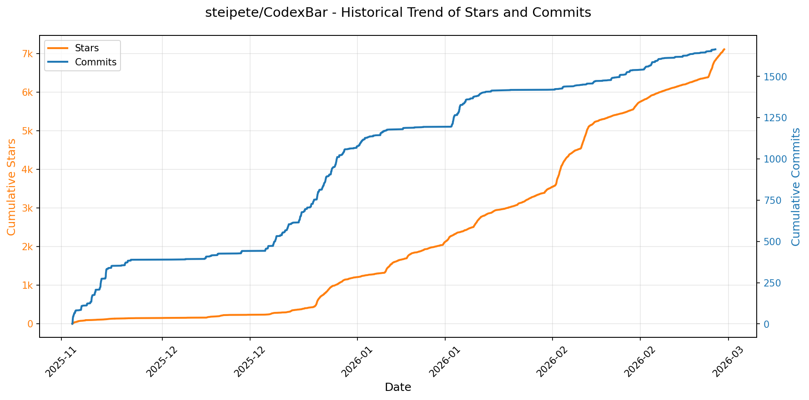

# 🌟 GitHub Trending 概览

> 数据更新于：2026-02-28

---

## 🔍 项目详情

### 1. [anthropics/claude-code](https://github.com/anthropics/claude-code)
- 📅 **创建日期**：2025-02-22  
- 🔄 **最近更新**：2026-02-28  
- ⭐ **Stars**：126,716（日 +643｜周 +3414｜月 +8959）  
- 📝 **描述**：Claude Code is an agentic coding tool that lives in your terminal, understands your codebase, and helps you code faster by executing routine tasks, explaining complex code, and handling git workflows - all through natural language commands.  

<b>📈 Star 与 Commit 历史趋势</b>

> *蓝色：累计 Stars｜橙色：累计 Commits（次 Y 轴）*

<b>📄 README 摘要</b>

1. **该项目的功能**  
Claude Code 是一款终端原生的智能编程助手，能够深度理解用户本地代码库，通过自然语言指令自动执行常规开发任务（如代码生成、重构、调试）、解释复杂逻辑、管理 Git 工作流（如提交、分支操作、冲突分析），并支持在终端、IDE 或 GitHub 中以 `@claude` 提及方式调用，实现无缝集成的“代理式”编码体验。

2. **核心功能**  
- **代码上下文感知**：自动索引和理解当前项目结构与代码语义，提供精准、上下文相关的响应；  
- **自然语言交互**：支持用日常语言描述需求（如“修复这个 API 路由的 404 错误”“为该函数添加 TypeScript 类型定义”），自动生成/修改代码；  
- **Git 智能操作**：直接通过命令完成提交信息撰写、分支对比、变更摘要、冲突解释等 Git 相关任务；  
- **插件扩展架构**：内置可插拔机制，支持自定义命令与专用 Agent（如测试生成、文档补全、安全扫描等），所有插件集中托管于 `plugins/` 目录；  
- **多环境一键安装**：提供 macOS/Linux 的 Shell 脚本、Homebrew，Windows 的 PowerShell 脚本及 WinGet 安装方式，开箱即用；  
- **内建反馈闭环**：集成 `/bug` 命令，可直接在终端中上报问题并附带会话上下文，提升问题复现与修复效率。

3. **技术栈**  
- **运行时**：Node.js 18+（作为主进程运行环境）；  
- **客户端架构**：终端原生 CLI 工具（非 Web 应用），基于命令行交互设计，轻量高效；  
- **部署与分发**：采用跨平台安装脚本（Bash/PowerShell）、Homebrew Cask、WinGet 包管理器，弃用 npm 全局安装（已标记为 deprecated）；  
- **后端依赖**：深度集成 Anthropic 的 Claude 大模型（具体版本未公开，但面向代码场景优化），依赖其推理能力与工具调用（Tool Use）API；  
- **数据安全层**：本地优先处理，敏感代码不默认上传；采用访问控制、会话数据最小化留存、明确禁止将用户代码/会话用于模型训练等隐私保护机制。

---

### 2. [x1xhlol/system-prompts-and-models-of-ai-tools](https://github.com/x1xhlol/system-prompts-and-models-of-ai-tools)
- 📅 **创建日期**：2025-03-05  
- 🔄 **最近更新**：2026-02-28  
- ⭐ **Stars**：126,151（日 +725｜周 +10968｜月 +14822）  
- 📝 **描述**：FULL Augment Code, Claude Code, Cluely, CodeBuddy, Comet, Cursor, Devin AI, Junie, Kiro, Leap.new, Lovable, Manus, NotionAI, Orchids.app, Perplexity, Poke, Qoder, Replit, Same.dev, Trae, Traycer AI, VSCode Agent, Warp.dev, Windsurf, Xcode, Z.ai Code, Dia & v0. (And other Open Sourced) System Prompts, Internal Tools & AI Models  

<b>📈 Star 与 Commit 历史趋势</b>

> *蓝色：累计 Stars｜橙色：累计 Commits（次 Y 轴）*

<b>📄 README 摘要</b>

该内容并非一个典型软件项目的 README（缺少项目名称、功能描述、安装使用说明等核心信息），而是一个**AI 系统提示词（system prompts）与模型配置的开源收集库**的推广性主页。根据所提供信息，严格围绕三项要求进行客观总结如下：

---

**1. 该项目做什么？**  
这是一个持续维护的、面向开发者和 AI 从业者的**公开知识库**，专注于收集、整理并披露主流 AI 工具（如大模型应用、AI 编程助手、智能代理平台等）中实际使用的**系统级提示词（system prompts）、模型调用参数及内部结构线索**。项目已积累超 30,000 行深度分析内容，旨在揭示 AI 产品背后的工程实现逻辑，服务于研究、安全审计、竞品分析与提示工程优化。

---

**2. 关键特性**  
- ✅ **大规模真实提示词集合**：覆盖大量商业化 AI 工具的隐藏 system prompt 实例，含结构化注释与上下文分析；  
- ✅ **安全导向洞察**：强调 AI 启动项泄露风险，配套提供 [ZeroLeaks.ai](https://zeroleaks.ai/) 安全审计服务入口，聚焦系统指令、内部工具链与模型配置的漏洞识别；  
- ✅ **社区驱动与开放协作**：通过 Discord 社群（LeaksLab）、GitHub Issue 收集反馈与更新，支持开发者贡献与验证；  
- ✅ **多维度可访问性**：提供加密货币捐赠地址（BTC/LTC/ETH）、Patreon 和 Ko-fi 支持渠道，并集成 Trendshift、Star History 等数据看板以追踪项目影响力。

---

**3. 技术栈**  
文档中**未明确声明所用技术栈**。项目本身为静态内容型仓库（GitHub Pages 风格），无代码构建流程或运行时依赖描述。可合理推断其基础设施包括：  
- **托管与展示层**：GitHub Repos + Markdown + SVG 动态图表（Star History）；  
- **第三方集成服务**：Cloudback.it（构建状态）、DeepWiki（知识图谱索引）、Trendshift（趋势分析）、Discord（实时协作）；  
- **赞助与生态关联技术**：Solana 区块链（代币合约地址 `DEffWzJyaFRNyA4ogUox631hfHuv3KLeCcpBh2ipBAGS`）、Jupiter/DexScreener/Photon（去中心化交易与流动性数据）；  
- **合作技术平台**：Tembo（后台编码智能体）、Latitude（LLM 可预测性生产平台）——体现其在 AI 工程化与智能体开发领域的生态定位，但非本项目直接采用的技术。

---

### 3. [openclaw/openclaw](https://github.com/openclaw/openclaw)
- 📅 **创建日期**：2025-11-24  
- 🔄 **最近更新**：2026-02-28  
- ⭐ **Stars**：125,012（日 +3917｜周 +24394｜月 +125012）  
- 📝 **描述**：Your own personal AI assistant. Any OS. Any Platform. The lobster way. 🦞   

<b>📈 Star 与 Commit 历史趋势</b>

> *蓝色：累计 Stars｜橙色：累计 Commits（次 Y 轴）*

<b>📄 README 摘要</b>

1. **项目功能**  
OpenClaw 是一个完全本地化、单用户专属的个人 AI 助手，可在用户自有设备（macOS / iOS / Android / Linux / Windows via WSL2）上端到端运行。它不依赖云端托管服务，而是通过轻量级「网关（Gateway）」作为统一控制平面，将 AI 能力无缝接入用户日常使用的全部通信渠道——包括 WhatsApp、Telegram、Slack、Discord、Google Chat、Signal、iMessage、Microsoft Teams、Matrix、Zalo、BlueBubbles（iMessage 替代方案）、WebChat 等 14+ 主流平台，并支持扩展通道。助手可收发文本/图片/音频/视频，具备实时语音唤醒（Voice Wake）、持续对话（Talk Mode）、跨设备协同（如 macOS→iOS→Android 节点调用）、可视化交互画布（Live Canvas + A2UI）、多智能体会话隔离（Multi-agent routing），以及设备级原生操作能力（如屏幕录制、相机调用、定位获取、系统命令执行、通知推送等），真正实现“AI 在本地、响应在身边、控制在手中”。

2. **核心特性**  
- ✅ **本地优先架构**：网关以 WebSocket 控制平面统一管理会话、通道、工具、事件与自动化（cron/webhook/Gmail Pub/Sub），所有状态默认本地持久化。  
- ✅ **全栈多通道集成**：原生支持 14+ 消息平台（含 Baileys/grammY/Bolt/discord.js 等成熟 SDK），并提供群组消息路由、提及触发、回复标签、分块处理等高级通道规则。  
- ✅ **跨平台语音与交互**：macOS/iOS/Android 全平台支持始终在线语音唤醒（ElevenLabs 驱动）与 Talk Mode 对话覆盖层；支持 PTT、语音转文字、实时音频流处理。  
- ✅ **Live Canvas 可视化工作区**：基于 A2UI 协议的动态画布，支持 Agent 驱动渲染、快照、代码执行、UI 组件注入，打通 CLI/桌面/移动端统一视觉界面。  
- ✅ **设备原生节点（Nodes）体系**：将 macOS/iOS/Android 设备抽象为可远程调用的「节点」，支持 `system.run`、`camera.snap`、`screen.record`、`location.get`、`canvas.reset` 等数十种 TCC 权限感知的底层操作。  
- ✅ **安全优先的 DM 默认策略**：所有私信通道默认启用配对码（pairing）机制，未授权发送者需手动批准方可交互；支持显式白名单（`allowFrom: ["*"]`）与密码/Token/Tailscale 多层认证。  
- ✅ **生产级运维能力**：内置 `openclaw doctor` 自检、`openclaw update` 多通道升级（stable/beta/dev）、Nix 声明式配置、Docker 容器化部署、Tailscale Serve/Funnel 远程访问、SSH 隧道桥接、日志追踪与用量监控。  
- ✅ **技能即服务（Skills-as-a-Service）**：通过 ClawHub 技能注册中心实现技能自动发现、按需拉取、沙箱化安装与 Workspace 级别隔离管理。  

3. **技术栈**  
- **运行时**：Node.js ≥22（主运行环境），支持 npm / pnpm / bun；TypeScript 全栈开发，`tsx` 直接执行 TS 源码。  
- **核心框架**：基于 WebSocket 的自研 Gateway 控制平面；Pi Agent 运行时（RPC 架构，支持工具流式调用与块级流式响应）。  
- **前端与 UI**：Control UI 与 WebChat 内置于 Gateway；Canvas 使用 A2UI 协议；macOS/iOS/Android 应用均基于原生平台能力封装（Swift/Kotlin），通过 Gateway 协议通信。  
- **通道集成**：复用成熟开源 SDK —— WhatsApp（Baileys）、Telegram（grammY）、Slack（Bolt）、Discord（discord.js）、Signal（signal-cli）、Matrix（matrix-js-sdk）、Google Chat（REST API）等。  
- **AI 模型层**：插件化模型适配器，原生支持 OpenAI（GPT/Codex）、Anthropic（Claude Pro/Max/Opus）、兼容任意符合 OpenAI 兼容 API 的 LLM；支持 OAuth 与 API Key 双认证、模型故障转移（failover）、上下文轮换与会话裁剪。  
- **基础设施**：Tailscale（Serve/Funnel 远程暴露）、SSH 隧道、Nix（声明式配置）、Docker（容器化部署）、systemd（Linux）/launchd（macOS）守护进程管理。  
- **安全机制**：TCC 权限动态校验（macOS）、设备节点权限映射（`node.invoke`）、会话级身份隔离、DM 配对码加密存储、密码/Token/Tailscale 多因子认证。

---

### 4. [obra/superpowers](https://github.com/obra/superpowers)
- 📅 **创建日期**：2025-10-09  
- 🔄 **最近更新**：2026-02-28  
- ⭐ **Stars**：94,286（日 +1376｜周 +8935｜月 +26256）  
- 📝 **描述**：An agentic skills framework & software development methodology that works.  

<b>📈 Star 与 Commit 历史趋势</b>

> *蓝色：累计 Stars｜橙色：累计 Commits（次 Y 轴）*

<b>📄 README 摘要</b>

1. **项目功能**  
Superpowers 是一个面向编程智能体（coding agents）的完整软件开发工作流增强系统。它不直接替代或重写代码，而是通过一套可组合、自动触发的“能力（skills）”对现有编码智能体（如 Claude Code、Cursor、Codex、OpenCode 等）进行深度赋能，使其在真实工程场景中遵循严格、可验证、协作友好的开发范式。其核心作用是：在用户启动编码任务后，主动暂停“写代码”动作，转而引导用户完成需求澄清 → 分段式设计确认 → 生成可执行、可审查、符合工程原则的实施计划 → 驱动子智能体按 TDD 和 YAGNI 原则分步执行 → 全流程自动化检查与质量门禁，最终实现高度自主但完全可控的端到端开发闭环。

2. **关键特性**  
- **全自动技能触发机制**：无需手动调用，智能体在每个开发阶段（如设计前、分支创建后、任务执行中、测试前、合并前）自动识别并激活对应技能，所有流程为强制性工作流而非可选建议；  
- **七阶段标准化开发流水线**：覆盖从需求脑暴（brainstorming）、Git 工作树隔离（using-git-worktrees）、原子化任务拆解（writing-plans）、子智能体驱动开发（subagent-driven-development）、严格红-绿-重构式 TDD（test-driven-development）、多层级代码审查（requesting/receiving-code-review）到分支收尾（finishing-a-development-branch）的全生命周期；  
- **工程实践深度内嵌**：原生强制执行测试先行（RED-GREEN-REFACTOR）、YAGNI（不预设未验证需求）、DRY（避免重复）、防御性调试（systematic-debugging 四阶段法）、验证即交付（verification-before-completion）等原则，并内置反模式识别（如测试反模式、调试陷阱）；  
- **协作增强设计**：支持 Socratic 式设计引导、结构化计划文档生成、人类可读/可审批的设计分块呈现、子智能体两级审查（先验规范合规性，再审代码质量）、PR/合并决策辅助等，显著提升人机协同效率与可信度；  
- **自生长能力**：提供 `writing-skills` 技能，支持开发者基于统一模板和测试方法论，安全、规范地扩展新技能并贡献至社区。

3. **技术栈**  
- **运行平台**：原生适配主流 AI 编程工具链，包括 Claude Code（插件市场）、Cursor（插件市场）、Codex（远程加载配置）、OpenCode（远程加载配置），具备跨平台抽象层；  
- **核心架构**：基于“技能（Skill）”的模块化设计，每个 Skill 为独立语义单元（以 Markdown + 结构化指令定义），含明确触发条件、执行逻辑、验证规则及测试用例；  
- **底层机制**：依赖大语言模型（LLM）的上下文理解与指令遵循能力，通过精细设计的 prompt engineering、状态感知（如 Git 分支、测试状态、文件路径）、阶段性反馈循环与人工确认点（checkpoints）实现流程自治；  
- **基础设施**：GitHub 托管（代码、Marketplace、文档），使用标准 Web 协议（HTTPS）动态拉取安装配置（`.codex/INSTALL.md` 等），支持自动更新（`/plugin update`）；  
- **协议与规范**：遵循 MIT 开源协议，技能开发遵循内置 `writing-skills` 指南，强调可测试性、可复现性与最小权限原则。

---

### 5. [google/langextract](https://github.com/google/langextract)
- 📅 **创建日期**：2025-07-08  
- 🔄 **最近更新**：2026-02-28  
- ⭐ **Stars**：56,257（日 +93｜周 +599｜月 +10400）  
- 📝 **描述**：A Python library for extracting structured information from unstructured text using LLMs with precise source grounding and interactive visualization.  

<b>📈 Star 与 Commit 历史趋势</b>

> *蓝色：累计 Stars｜橙色：累计 Commits（次 Y 轴）*

<b>📄 README 摘要</b>

1. **项目功能**  
LangExtract 是一个基于大语言模型（LLM）的 Python 库，专注于从**非结构化文本**（如临床病历、放射报告、文学作品等）中**高精度提取结构化信息**。其核心能力是依据用户定义的指令（含提示词与少量高质量示例），自动识别并组织关键实体（如人物、情绪、药物名称、剂量、关系等），同时严格保证所有提取结果均**可追溯至原文确切位置**（即“源文本锚定”），支持端到端的可验证信息抽取。

2. **关键特性**  
- **精准源文本锚定**：为每个提取项标注原始文本中的精确字符偏移位置，支持可视化高亮与人工核查；  
- **强结构化输出保障**：通过受控生成机制（尤其对 Gemini 等模型）+ 用户提供的 few-shot 示例，强制输出符合预设 schema 的 JSON 结构，避免格式错乱；  
- **长文档优化处理**：采用智能分块（chunking）、多轮提取（up to 3 passes）、并行处理（`max_workers` 可调）策略，显著提升大文本（如整本小说、完整病历）的召回率与准确性；  
- **交互式可视化**：一键生成自包含 HTML 文件，支持在原始上下文中动态浏览、搜索、过滤数千个提取实体，无需额外工具；  
- **灵活模型适配**：原生支持 Google Gemini（云）、OpenAI（需额外安装）、本地 Ollama 模型（如 `gemma2:2b`），且提供插件化架构，允许第三方轻松集成自定义模型提供商；  
- **零微调领域适配**：仅需提供 1–3 个带标注的领域示例（如医疗、文学、法律），即可快速适配任意垂直场景，无需模型训练或参数调整；  
- **知识-证据平衡控制**：通过提示词设计与示例属性显式调控 LLM 行为——既可严格限制为原文直引（e.g., `"extraction_text": "gazed longingly"`），也可引导其注入世界知识（e.g., `"literary_context": "tragic heroine"`）。

3. **技术栈**  
- **编程语言**：Python 3.10+；  
- **核心依赖**：`google-generativeai`（Gemini）、`openai`（OpenAI）、`ollama`（本地模型）、`pydantic`（schema 验证）、`rich`（CLI 输出）、`jinja2`（HTML 模板渲染）；  
- **模型接口层**：模块化 Provider 架构，支持云 API（Vertex AI / AI Studio / OpenAI Platform）与本地服务（Ollama HTTP API）；  
- **开发与运维**：`pyproject.toml` 管理依赖、`pytest` + `tox` 多环境测试、`pre-commit` + `isort`/`pyink` 自动格式化、Docker 容器化部署支持；  
- **许可证**：Apache License 2.0。

---

### 6. [thedotmack/claude-mem](https://github.com/thedotmack/claude-mem)
- 📅 **创建日期**：2025-08-31  
- 🔄 **最近更新**：2026-02-28  
- ⭐ **Stars**：32,026（日 +320｜周 +2078｜月 +16632）  
- 📝 **描述**：A Claude Code plugin that automatically captures everything Claude does during your coding sessions, compresses it with AI (using Claude's agent-sdk), and injects relevant context back into future sessions.  

<b>📈 Star 与 Commit 历史趋势</b>

> *蓝色：累计 Stars｜橙色：累计 Commits（次 Y 轴）*

<b>📄 README 摘要</b>

1. **项目功能**  
Claude-Mem 是一个专为 **Claude Code（Anthropic 推出的 AI 编程助手）** 设计的**持久化记忆压缩系统**。它在用户每次会话结束后自动捕获工具调用、代码操作、用户指令等上下文行为，生成语义化摘要，并将其结构化存储；当新会话启动时，自动将相关历史记忆按需注入上下文，从而实现跨会话的知识连续性——使 Claude 能“记住”项目进展、调试过程、架构决策等长期信息，显著提升复杂开发任务中的上下文连贯性与推理深度。

2. **核心特性**  
- ✅ **持久化记忆**：会话结束后仍保留结构化观察记录（observations），支持长期项目上下文复用；  
- ✅ **渐进式披露（Progressive Disclosure）**：分三层检索（索引→时间线→详情），实时显示 token 消耗，优化上下文成本；  
- ✅ **技能驱动搜索（mem-search）**：通过自然语言查询历史记忆，支持类型/日期/项目过滤；  
- ✅ **Web 可视化界面**：本地 `http://localhost:37777` 提供实时记忆流、全文搜索、观察详情查看及引用 API；  
- ✅ **Claude Desktop 集成**：可在桌面版对话中直接调用 `mem-search` 技能检索记忆；  
- ✅ **隐私保护机制**：支持 `<private>` 标签标记敏感内容，自动排除存储；  
- ✅ **细粒度上下文配置**：可自定义哪些数据注入、注入时机、优先级及长度限制；  
- ✅ **全自动运行**：无需手动触发，依赖 6 个生命周期钩子（如 `SessionStart`, `PostToolUse`, `SessionEnd`）无缝集成；  
- ✅ **智能引用与溯源**：每条观察分配唯一 ID，支持通过 Web UI 或 HTTP API（`/api/observation/{id}`）精确回溯；  
- ✅ **Beta 实验通道**：提供 Endless Mode 等前沿功能（仿生长时记忆架构），支持版本热切换；  
- ✅ **多平台网关支持**：一键部署至 OpenClaw 网关，集成 Telegram/Discord/Slack 实时通知。

3. **技术栈**  
- **运行时**：Node.js ≥18.0.0（主逻辑）、Bun（管理 Worker 服务与 HTTP API）、uv（Python 包管理器，用于向量搜索依赖）；  
- **数据库**：SQLite 3（嵌入式，含 FTS5 全文搜索支持） + Chroma（向量数据库，实现混合语义+关键词搜索）；  
- **架构模式**：基于 MCP（Model Context Protocol）标准的 4 个可组合搜索工具（`search`/`timeline`/`get_observations` 等）；  
- **核心服务**：Worker Service（Bun 托管，监听 `:37777`，提供 Web UI、API 及搜索端点）；  
- **前端**：轻量 Web Viewer（静态资源 + HTML/CSS/JS，适配深浅色模式）；  
- **构建与生态**：TypeScript（主力开发语言）、AGPL-3.0 开源协议（主体）、PolyForm Noncommercial License（`ragtime/` 子模块）；  
- **部署集成**：支持 Claude Code 原生插件安装（`/plugin install`）、OpenClaw 网关一键脚本（`curl install.cmem.ai/...`）。

---

### 7. [virattt/dexter](https://github.com/virattt/dexter)
- 📅 **创建日期**：2025-10-14  
- 🔄 **最近更新**：2026-02-28  
- ⭐ **Stars**：24,151（日 +75｜周 +907｜月 +7476）  
- 📝 **描述**：An autonomous agent for deep financial research  

<b>📈 Star 与 Commit 历史趋势</b>

> *蓝色：累计 Stars｜橙色：累计 Commits（次 Y 轴）*

<b>📄 README 摘要</b>

1. **项目功能**  
Dexter 是一个面向金融研究的自主式AI代理系统，能够对复杂金融问题进行端到端的自动分析：接收自然语言提问 → 自主规划多步研究任务 → 调用实时金融市场数据工具（如财报、资产负债表、现金流量表）执行查询 → 对中间结果进行自我验证与反思 → 迭代优化直至生成可信、数据支撑的结论。其核心定位是“金融领域的Claude Code”，专为高精度、可追溯、安全可控的自动化财务尽调与研究而设计。

2. **关键特性**  
- **智能任务规划**：将模糊/复杂的金融问题（如“评估NVDA在AI芯片市场的长期竞争力”）自动拆解为结构化子任务（例如：获取近5年财报→分析毛利率趋势→比对同行研发支出→检索最新产品路线图）。  
- **自主执行与工具编排**：动态选择并调用适配的API工具（Financial Datasets、Exa/Tavily网络搜索等），完成数据采集与整合。  
- **自验证与迭代闭环**：内置推理链（Chain-of-Thought）与结果校验机制，支持失败重试、逻辑一致性检查及步骤收敛判断。  
- **实时权威金融数据接入**：原生集成Financial Datasets API，免费支持AAPL、NVDA、MSFT等标的的年度/季度三大报表（利润表、资产负债表、现金流量表）。  
- **生产级安全机制**：强制设置最大执行步数、循环检测（loop detection）及超时熔断，杜绝无限推理或失控运行。  
- **全链路可追溯性**：通过JSONL格式的Scratchpad日志完整记录每次会话的原始问题、每步工具调用参数/原始响应/大模型摘要、以及内部推理过程，支持精准调试与审计。  
- **多模态交互支持**：除CLI命令行外，提供WhatsApp网关，实现通过个人WhatsApp聊天窗口零门槛调用（扫码登录即用）。

3. **技术栈**  
- **运行时**：Bun（v1.0+，作为Node.js替代，提供极速包管理与执行）  
- **核心框架**：基于TypeScript构建，采用模块化架构；依赖LangChain/LangSmith实现LLM编排、评估与可观测性（LLM-as-judge评测、实时准确率统计、追踪日志）  
- **大模型接口**：默认集成OpenAI API（GPT系列），同时预留Anthropic（Claude）、Google、xAI、OpenRouter等多厂商兼容入口，支持灵活切换  
- **本地推理支持**：通过OLLAMA_BASE_URL配置可对接Ollama，运行本地开源金融领域微调模型  
- **数据源API**：  
  - 主要金融数据：Financial Datasets API（机构级实时财报）  
  - 网络增强检索：Exa API（首选）、Tavily API（备用）  
- **部署与监控**：LangSmith用于评估跟踪与性能分析；WhatsApp网关基于Twilio或类似通信SDK实现（具体见子模块文档）  
- **工程实践**：采用Git工作流、环境变量驱动配置（`.env`）、JSONL日志规范、标准化CLI命令（`bun start`/`bun dev`/`bun run evals`）

---

### 8. [VectifyAI/PageIndex](https://github.com/VectifyAI/PageIndex)
- 📅 **创建日期**：2025-04-01  
- 🔄 **最近更新**：2026-02-28  
- ⭐ **Stars**：23,900（日 +468｜周 +3422｜月 +8688）  
- 📝 **描述**：📑 PageIndex: Document Index for Vectorless, Reasoning-based RAG  

<b>📈 Star 与 Commit 历史趋势</b>

> *蓝色：累计 Stars｜橙色：累计 Commits（次 Y 轴）*

<b>📄 README 摘要</b>

1. **该项目的功能**  
PageIndex 是一个面向长文档（如财报、法律文件、技术手册等）的**向量数据库无关、基于推理的检索增强生成（RAG）系统**。它不依赖传统向量相似性搜索，而是通过构建文档的**语义层次化树状索引（类似智能目录）**，并利用大语言模型（LLM）在该索引上执行**类人类的树搜索式推理**，实现精准、可解释、上下文感知的知识检索与问答。其核心目标是解决专业长文档中“语义相似 ≠ 实际相关”的痛点，以推理替代近似匹配，提升检索的相关性、准确性和可追溯性。

2. **关键特性**  
- **无向量数据库（No Vector DB）**：完全摒弃向量嵌入与相似度计算，避免“氛围检索”（vibe retrieval）和维度灾难问题；  
- **无分块（No Chunking）**：不将文档切分为人工设定的固定长度文本块，而是基于原始语义结构（标题层级、段落逻辑）组织内容，保留上下文完整性；  
- **类人检索（Human-like Retrieval）**：模拟专家阅读行为，通过多步推理遍历树状索引（如“先定位章节→再筛选子节→最终聚焦段落”），支持复杂查询与领域深度理解；  
- **高可解释性与可追溯性**：每次检索结果均附带明确的页码、节点ID及推理路径，支持审计与验证；  
- **原生视觉支持（Vision-based RAG）**：提供OCR-Free方案，可直接对PDF页面图像进行端到端推理检索，跳过传统OCR文本提取环节；  
- **SOTA性能验证**：在FinanceBench金融问答基准测试中达**98.7%准确率**，显著超越主流向量RAG方案。

3. **技术栈**  
- **核心模型层**：依赖OpenAI大语言模型（默认 `gpt-4o-2024-11-20`）执行树索引构建与推理式检索；  
- **文档解析**：支持PDF（基于PyPDF等库）与Markdown格式；提供专用OCR能力（PageIndex OCR）以高保真还原文档全局结构（非开源部分）；  
- **架构设计**：采用**树状索引（Tree Index）+ 推理代理（Agentic Tree Search）** 范式，强调in-context、结构化、可扩展的检索流程；  
- **部署与集成**：支持本地自托管（Python CLI工具 `run_pageindex.py`）、云服务（[chat.pageindex.ai](https://chat.pageindex.ai)）、MCP协议（兼容Claude/Cursor等智能体）、RESTful API及Colab交互式笔记本；  
- **开发环境**：Python 3.x，依赖 `openai`, `pypdf`, `python-dotenv` 等标准库，通过 `.env` 管理API密钥。

---

### 9. [datawhalechina/hello-agents](https://github.com/datawhalechina/hello-agents)
- 📅 **创建日期**：2025-09-07  
- 🔄 **最近更新**：2026-02-28  
- ⭐ **Stars**：23,386（日 +568｜周 +2133｜月 +4954）  
- 📝 **描述**：📚 《从零开始构建智能体》——从零开始的智能体原理与实践教程  

<b>📈 Star 与 Commit 历史趋势</b>

> *蓝色：累计 Stars｜橙色：累计 Commits（次 Y 轴）*

<b>📄 README 摘要</b>

1. **该项目做什么？**  
Hello-Agents 是 Datawhale 社区发起的**系统性、实践导向的智能体（Agent）开源学习教程**，旨在帮助学习者从零开始深入理解并亲手构建真正 AI 原生（AI Native）的智能体系统——即以大语言模型（LLM）为核心驱动力、具备自主规划、反思、协作与持续演进能力的智能体，而非仅作为后端服务的流程型工具（如 Dify/Coze）。项目覆盖从基础理论（智能体定义、发展史、LLM 原理）到工程实现（经典范式编码、主流框架应用、自研框架开发），再到高级能力（记忆、上下文工程、通信协议、Agentic-RL 训练、系统评估）及真实场景综合项目（智能旅行助手、赛博小镇等），最终引导学习者完成个人多智能体毕业设计，实现从“LLM 使用者”到“智能体系统构建者”的身份跃迁。

2. **关键功能（Key Features）**  
- ✅ **理论与实践深度融合**：每章均配套可运行代码（位于 `code/` 目录），强调“边学边做”，拒绝纯概念灌输；  
- ✅ **双轨学习路径**：既涵盖低代码平台（Coze/Dify/n8n）快速上手，更聚焦 AI 原生开发，含 AutoGen/LangGraph/AgentScope 等主流框架实战；  
- ✅ **从零造轮子**：第七章起完整指导基于 OpenAI 原生 API 自研轻量级智能体框架 `HelloAgents`，强化底层原理认知；  
- ✅ **全栈能力覆盖**：系统讲解记忆（Memory/RAG）、上下文工程（Context Engineering）、多智能体通信协议（MCP/A2A/ANP）、Agentic-RL（SFT → GRPO 全流程训练）、科学评估方法论等核心进阶技术；  
- ✅ **真实项目驱动**：包含三大综合案例——MCP 驱动的智能旅行助手（多 Agent 协作）、自动化深度研究智能体（DeepResearch 复现）、模拟社会动态的赛博小镇（Agent + 游戏引擎融合）；  
- ✅ **社区共建生态**：开放 `Extra-Chapter` 专栏，收录社区贡献的面试题解析、GUI Agent 实战、Skill 开发指南、踩坑经验等高质量补充内容；  
- ✅ **全免费开源资源**：提供在线阅读（GitBook）、PDF 教程（带 Datawhale 水印防滥用）、GitHub 代码库、读者交流群及视频课程规划，支持终身学习与协作演进。

3. **技术栈（Tech Stack）**  
- **核心语言与运行环境**：Python（必备基础），依赖标准库及主流科学计算/异步编程生态；  
- **大模型交互层**：OpenAI 官方 API（作为 `HelloAgents` 框架默认后端），同时兼容其他 LLM 接口（教程中提及适配思路）；  
- **智能体框架实践**：AutoGen、LangGraph、AgentScope 等业界主流开源框架；  
- **低代码平台教学**：Coze、Dify、n8n（侧重其工作流编排与插件机制，非代码开发）；  
- **高级能力支撑技术**：  
  - 记忆与检索：RAG 技术栈（向量数据库如 Chroma/FAISS、文本分块、嵌入模型）；  
  - 上下文工程：Prompt 工程、动态上下文管理、会话状态追踪；  
  - 通信协议：MCP（Model Context Protocol）、A2A（Agent-to-Agent）、ANP（Agent Network Protocol）等规范解析与实现；  
  - 强化学习：基于 RLHF 的 Agentic-RL 训练流程（含 SFT、DPO、GRPO 等算法实践）；  
  - 评估体系：定制化指标设计、基准测试（如 AgentBench）、Trace 可视化分析。  
- **辅助工具链**：Git（协作开发）、Markdown（文档编写）、GitHub Pages（在线文档托管）、Contrib.rocks（贡献者可视化）。

---

### 10. [KeygraphHQ/shannon](https://github.com/KeygraphHQ/shannon)
- 📅 **创建日期**：2025-09-27  
- 🔄 **最近更新**：2026-02-28  
- ⭐ **Stars**：22,528（日 +252｜周 +1638｜月 +18777）  
- 📝 **描述**：Fully autonomous AI hacker to find actual exploits in your web apps. Shannon has achieved a 96.15% success rate on the hint-free, source-aware XBOW Benchmark.  

<b>📈 Star 与 Commit 历史趋势</b>

> *蓝色：累计 Stars｜橙色：累计 Commits（次 Y 轴）*

<b>📄 README 摘要</b>

1. **项目功能**  
Shannon 是一个面向源代码的全自动 AI 渗透测试框架，专为白盒（white-box）Web 应用安全测试设计。其核心能力是：**不仅识别潜在漏洞，更通过真实浏览器与命令行环境自主执行可复现的攻击链（如注入、XSS、SSRF、认证绕过等），以实证方式验证漏洞的可利用性**。它直接接入目标应用的源代码仓库与运行实例，模拟专业红队人员的工作流，实现从代码分析 → 智能路径探测 → 动态登录（支持 2FA/TOTP/Google 登录）→ 多类型漏洞利用 → 生成含 PoC 的最终报告的端到端自动化。

2. **关键特性**  
- **全自主渗透流程**：单命令启动，自动处理复杂身份认证（含多因素）、页面导航、状态管理与攻击执行，全程无需人工干预；  
- **实证型安全报告**：输出聚焦“已验证可利用”的漏洞，每项均附带可一键复现的 PoC（含 HTTP 请求、脚本或交互步骤），彻底消除传统扫描器的高误报率；  
- **深度代码感知动态测试**：结合静态源码分析（理解业务逻辑、路由结构、认证机制）与动态运行时攻击（基于真实浏览器与 CLI 环境），实现上下文感知的精准攻击；  
- **OWASP 核心漏洞覆盖**：当前原生支持 Injection、XSS、SSRF、Broken Authentication/Authorization 四类高危漏洞的发现与利用验证，持续扩展中；  
- **集成专业安全工具链**：在侦察阶段调用 Nmap、Subfinder、WhatWeb、Schemathesis 等成熟工具，增强目标资产测绘与接口规范分析能力；  
- **并行化高效执行**：对不同漏洞类型的检测与利用流程进行并发调度，显著缩短整体测试耗时；  
- **工作区（Workspace）与断点续跑**：所有中间状态通过 Git 提交持久化，支持任意中断后按命名空间精准恢复，跳过已完成环节；  
- **企业就绪扩展能力**（Pro 版专属）：集成基于 LLM 的数据流分析引擎（LLMDFA），实现跨函数/服务的数据污染追踪与深度逻辑漏洞挖掘。

3. **技术栈**  
- **AI 引擎层**：以 Anthropic Claude 系列大模型（尤其是 Claude Code）为核心推理引擎，深度集成 Anthropic Agent SDK；支持实验性对接 OpenAI（GPT-5.2）、Google Gemini（via OpenRouter）；  
- **执行与编排层**：基于 Temporal 开源工作流引擎实现高可靠性、可观察、可回溯的多智能体任务编排；  
- **运行时环境**：全容器化部署（Docker），各模块（侦察、分析、利用、报告）隔离运行；  
- **前端交互层**：提供 Temporal Web UI（`http://localhost:8233`）实时监控全流程进度与日志；  
- **安全工具集成**：原生集成 Nmap（网络扫描）、Subfinder（子域名枚举）、WhatWeb（指纹识别）、Schemathesis（API 规范模糊测试）；  
- **基础设施依赖**：要求 Docker 运行时，支持 Linux/macOS/Windows（WSL2 推荐），通过环境变量或 `.env` 文件管理 AI 提供商密钥。

---

### 11. [bytedance/deer-flow](https://github.com/bytedance/deer-flow)
- 📅 **创建日期**：2025-05-07  
- 🔄 **最近更新**：2026-02-28  
- ⭐ **Stars**：22,203（日 +848｜周 +2198｜月 +2755）  
- 📝 **描述**：An open-source SuperAgent harness that researches, codes, and creates. With the help of sandboxes, memories, tools, skills and subagents, it handles different levels of tasks that could take minutes to hours.  

<b>📈 Star 与 Commit 历史趋势</b>

> *蓝色：累计 Stars｜橙色：累计 Commits（次 Y 轴）*

<b>📄 README 摘要</b>

1. **项目功能**  
DeerFlow 2.0 是一个开源的「超级智能体运行时框架（Super Agent Harness）」，旨在让 AI 智能体真正“做事”而非仅限对话。它通过协同调度子智能体（Sub-Agents）、持久化长时记忆（Long-Term Memory）、隔离式沙盒执行环境（Sandbox）及可插拔技能系统（Skills），完成端到端复杂任务——例如深度研究、自动生成报告/幻灯片/网页、多模态内容创作（图像/视频）、数据管道构建、自动化工作流等。其核心定位已从初代“深度研究框架”全面升级为通用型智能体基础设施，支持开箱即用与深度定制。

2. **关键特性**  
- **模块化技能系统（Skills & Tools）**：以 Markdown 定义结构化能力（如 `research/SKILL.md`），内置研究、报告生成、PPT 制作、网页开发、图像生成等数十种技能；支持用户自定义技能（存于 `/mnt/skills/custom/`），按需动态加载，避免上下文膨胀。  
- **动态子智能体编排（Sub-Agents）**：主智能体可实时分解复杂任务，按需并行创建多个子智能体，每个拥有独立上下文、专属工具集与终止条件；结果自动聚合，支撑分钟级至小时级多步骤任务（如并发调研→综合分析→生成可视化报告）。  
- **全功能沙盒与文件系统（Sandbox & File System）**：每个任务在隔离 Docker 容器中执行，配备完整 Linux 环境与持久化文件系统（`/mnt/user-data/{uploads/workspace/outputs}`），支持文件读写、Bash 命令执行、代码运行、图像渲染等真实操作，实现“可执行的智能体”。  
- **上下文工程优化（Context Engineering）**：采用子智能体上下文隔离机制，结合任务摘要、中间结果落盘、冗余信息压缩等策略，高效管理超长上下文，保障多步推理稳定性。  
- **本地化长时记忆（Long-Term Memory）**：跨会话持久化存储用户画像、偏好设置、技术栈习惯及知识沉淀，所有数据本地保存、完全可控，随使用越用越懂你。  
- **多模式部署与嵌入式支持**：提供 Docker 一键启动、本地开发（Node.js/pnpm/uv）、Kubernetes 沙盒扩展；同时支持作为 Python 库嵌入（`DeerFlowClient`），直接调用聊天、流式响应、技能管理、文件上传等全部能力。

3. **技术栈**  
- **核心框架**：基于 [LangChain](https://github.com/langchain-ai/langchain) 实现 LLM 集成与工具链编排；依托 [LangGraph](https://github.com/langchain-ai/langgraph) 构建多智能体状态图（State Graph）与异步协作流程。  
- **运行时环境**：后端服务基于 Python（Pydantic/Vibora/FastAPI 生态），前端为现代 Web 应用；沙盒层默认依赖 Docker 容器化运行，可选 Kubernetes Provisioner 扩展；本地开发要求 Node.js 22+、pnpm、uv 包管理器。  
- **模型兼容性**：完全模型无关，通过 OpenAI 兼容 API 接口接入任意大模型（如 GPT-4、Claude、Qwen、GLM 等），推荐支持长上下文（≥100K tokens）、强推理能力、多模态输入及可靠函数调用的模型。  
- **扩展生态**：原生支持 [MCP（Model Context Protocol）服务器](https://modelcontextprotocol.io/)，便于集成第三方工具与服务；配置通过 `config.yaml` + `.env` 管理，支持多模型、多沙盒模式（本地/容器/K8s）灵活切换。

---

### 12. [gsd-build/get-shit-done](https://github.com/gsd-build/get-shit-done)
- 📅 **创建日期**：2025-12-14  
- 🔄 **最近更新**：2026-02-28  
- ⭐ **Stars**：21,954（日 +729｜周 +5181｜月 +13032）  
- 📝 **描述**：A light-weight and powerful meta-prompting, context engineering and spec-driven development system for Claude Code by TÂCHES.  

<b>📈 Star 与 Commit 历史趋势</b>

> *蓝色：累计 Stars｜橙色：累计 Commits（次 Y 轴）*

<b>📄 README 摘要</b>

1. **项目功能**  
该项目是一个轻量级但功能强大的元提示（meta-prompting）、上下文工程（context engineering）与规范驱动开发（spec-driven development）系统，专为 Claude Code、OpenCode、Gemini CLI 和 Codex 等 AI 编程助手设计。其核心目标是解决“上下文腐化”（context rot）问题——即随着 Claude 等模型填满上下文窗口而导致响应质量持续下降的顽疾。它通过结构化工作流，使开发者仅需用自然语言描述需求，系统即可自动完成需求澄清、领域研究、分阶段规划、并行化代码执行、原子化 Git 提交及人工验收验证，最终生成高质量、可追溯、符合预期的软件交付物。

2. **关键特性**  
- **全生命周期规范驱动流程**：支持 `new-project → discuss-phase → plan-phase → execute-phase → verify-work → complete-milestone` 的闭环迭代，每个阶段均具备明确输入/输出和状态持久化（如 `PROJECT.md`、`CONTEXT.md`、`PLAN.md`、`SUMMARY.md`、`UAT.md` 等）。  
- **智能上下文工程**：自动构建并动态加载多维度上下文文件（项目愿景、架构分析、需求追踪、研发状态、验证标准等），严格控制各文件大小以规避上下文衰减，确保 Claude 始终在高质量语义环境中工作。  
- **XML 结构化任务指令**：所有执行计划均采用定制 XML 格式（含 `<name>`、`<files>`、`<action>`、`<verify>`、`<done>` 等标签），提供精确操作指令与内置可验证性，消除歧义。  
- **多智能体协同编排**：各阶段由轻量级协调器调度专用子智能体（如 Researcher、Planner、Executor、Verifier、Debugger），研究、规划、执行、验证均在独立 200k token 上下文中并行完成，主会话上下文始终保持轻量（30–40% 占用）。  
- **波次化并行执行（Wave Execution）**：基于依赖关系自动将任务分组为“执行波次”，无依赖任务并行运行，有依赖任务按序等待，显著提升吞吐量并避免文件冲突；支持垂直切片（端到端功能）优先的高效并行策略。  
- **原子化 Git 提交与可追溯性**：每个任务生成独立、语义清晰的提交（如 `feat(08-02): implement password hashing`），支持 `git bisect` 快速定位问题、单任务回滚及未来会话中对历史变更的精准理解。  
- **灵活适配模式**：提供完整工作流（适用于新项目/里程碑）与 `quick` 快速模式（适用于 Bug 修复、小功能等即席任务），并支持现有代码库的 `map-codebase` 智能建模，实现“棕地”（brownfield）无缝集成。  
- **模块化与可扩展设计**：支持动态增删阶段、插入紧急任务、跨里程碑迁移、配置化模型剖面（quality/balanced/budget）及细粒度权限管理，无流程锁定风险。

3. **技术栈**  
- **核心运行时**：基于 Node.js 构建，通过 `npx` 提供零依赖快速安装与跨平台（macOS / Windows / Linux）支持。  
- **AI 引擎适配层**：深度集成四大主流 AI 编程环境：Claude Code（含权限绕过优化）、OpenCode（开源免费模型）、Gemini CLI、GitHub Codex（技能/Skills 优先模式），各环境使用专属安装路径与配置机制（如 Codex 通过 `skills/gsd-*/SKILL.md` 注册）。  
- **提示工程基础设施**：采用自研 XML 提示模板系统，结合上下文分片（context chunking）、状态感知加载（STATE.md 驱动记忆延续）、多层级上下文注入（project/research/phase/context 多维叠加）等技术保障提示有效性。  
- **自动化执行引擎**：内建 Bash 命令白名单机制（支持 `git`、`date`、`cat`、`grep` 等数十种高频命令），配合 `--dangerously-skip-permissions` 或精细化 JSON 权限配置，实现无需人工干预的全自动代码生成与验证闭环。  
- **项目元数据管理**：使用纯文本 Markdown 文件（`.md`）与结构化目录（`.planning/`）持久化全部项目状态、计划、研究结果与验证记录，完全去中心化、版本可控、人类可读可编辑。

---

### 13. [clockworklabs/SpacetimeDB](https://github.com/clockworklabs/SpacetimeDB)
- 📅 **创建日期**：2023-06-17  
- 🔄 **最近更新**：2026-02-28  
- ⭐ **Stars**：21,461（日 +377｜周 +2290｜月 +2546）  
- 📝 **描述**：Development at the speed of light  

<b>📈 Star 与 Commit 历史趋势</b>

> *蓝色：累计 Stars｜橙色：累计 Commits（次 Y 轴）*

<b>📄 README 摘要</b>

1. **该项目做什么？**  
SpacetimeDB 是一个集数据库与应用服务器于一体的**内存优先、低延迟的实时关系型数据库系统**。它允许开发者将业务逻辑（以“模块”形式）直接部署到数据库内部执行，客户端可绕过传统中间层（如Web服务器、API网关），直连数据库并触发模块中的逻辑（如权限校验、状态更新、事件分发等）。其核心范式是“数据库即服务器”，支持全栈逻辑（包括授权、状态管理、实时同步）用单一语言（如Rust）编写并编译为单个二进制，彻底消除微服务、容器、Kubernetes及复杂运维基础设施需求。典型应用场景包括MMORPG（如《BitCraft Online》）、实时聊天、协同编辑等对端到端延迟极度敏感的系统。

2. **关键特性**  
- ✅ **模块化计算层**：支持在数据库内嵌入和执行用户定义的“模块”（类似智能合约，但非区块链，无共识开销），实现逻辑与数据同驻内存；  
- ✅ **零中间件直连架构**：客户端通过SDK直接连接数据库，所有读写、订阅、RPC均在DB内完成，大幅降低网络跳数与延迟；  
- ✅ **内存优先 + WAL持久化**：全部运行时状态常驻内存以保障微秒级响应，同时通过写前日志（WAL）保证崩溃一致性与快速恢复；  
- ✅ **多语言模块支持**：服务端模块支持 Rust、C#；客户端SDK支持 Rust、C#、TypeScript，实现跨平台无缝集成；  
- ✅ **开箱即用的实时同步**：自动将状态变更（如玩家位置、聊天消息、资源变化）实时广播给所有订阅客户端，无需手动实现推送逻辑；  
- ✅ **一体化DevOps体验**：提供统一CLI工具（`spacetime`），支持一键安装、版本管理、本地启动、模块部署与调试，兼容Docker、macOS/Linux/Windows原生部署。

3. **技术栈**  
- **核心语言**：Rust（整个数据库引擎、CLI工具链、WASM模块运行时均用Rust编写，强调内存安全与极致性能）；  
- **运行时环境**：基于 WebAssembly（wasm32-unknown-unknown）沙箱执行用户模块，兼顾安全性与跨语言兼容性；  
- **存储引擎**：自研内存数据库引擎，搭配Write-Ahead Log（WAL）实现持久化与故障恢复；  
- **网络协议**：自定义高效二进制协议（基于gRPC或轻量级流协议），支持长连接、双向流与实时订阅；  
- **部署形态**：支持单机CLI模式、Docker容器化、以及未来可能的分布式集群（当前文档聚焦单节点高性能场景）；  
- **生态工具**：Rust Crate（`spacetimedb`）、NuGet包（`SpacetimeDB.Runtime`）、CI/CD（GitHub Actions）、Docker Hub镜像、Discord社区支持。

---

### 14. [moeru-ai/airi](https://github.com/moeru-ai/airi)
- 📅 **创建日期**：2024-12-01  
- 🔄 **最近更新**：2026-02-28  
- ⭐ **Stars**：18,674（日 +815｜周 +1162｜月 +1580）  
- 📝 **描述**：💖🧸 Self hosted, you-owned Grok Companion, a container of souls of waifu, cyber livings to bring them into our worlds, wishing to achieve Neuro-sama's altitude. Capable of realtime voice chat, Minecraft, Factorio playing. Web / macOS / Windows supported.  

<b>📈 Star 与 Commit 历史趋势</b>

> *蓝色：累计 Stars｜橙色：累计 Commits（次 Y 轴）*

<b>📄 README 摘要</b>

1. **项目功能**  
Project AIRI 是一个开源的 AI 虚拟角色（AI waifu / 数字生命体）运行时平台，旨在复刻并超越 Neuro-sama 的能力，使用户能**完全自主拥有、本地运行、跨端部署**的智能虚拟伴侣。它不仅支持实时语音对话、多模态交互与角色扮演，更突破传统聊天机器人局限，实现**深度系统级协同**：可主动接入并操作真实应用（如 Minecraft、Factorio 游戏）、监听 Discord/Telegram 语音与消息、实时响应屏幕内容（“看见你正在编码”），并支持直播互动、PWA 移动端、桌面原生（CUDA/Metal 加速）及 WebXR 扩展场景。

2. **核心特性**  
- **全栈跨端兼容**：一套代码同时支持浏览器（WebGPU/WebAudio/WebAssembly）、桌面（Tauri + CUDA/Metal 原生推理）、iOS/Android（Capacitor PWA）、VR/AR（WebXR）四类终端；  
- **强交互能力**：内置语音输入（麦克风/Discord）、客户端语音识别（STT）、说话检测（VAD）、ElevenLabs 等 TTS 合成；  
- **拟真虚拟形象引擎**：原生支持 VRM 与 Live2D 模型，具备自动眨眼、视线追踪、 idle 眼动、骨骼/表情/动作控制等高级动画能力；  
- **游戏与系统集成**：已实现在 Factorio 和 Minecraft 中自主运行（通过 RCON/Mineflayer），支持远程操控与协同游戏；  
- **模块化记忆与知识系统**：内置 DuckDB WASM 浏览器数据库，正开发「Memory Alaya」长期记忆架构，并支持 pgvector 等向量存储；  
- **超广谱 LLM 接入**：通过 xsAI 抽象层，无缝对接超 25 种主流模型服务（OpenAI、Claude、Gemini、Ollama、vLLM、DeepSeek、Qwen、Groq、Cloudflare Workers AI 等），含本地/云端/边缘全场景覆盖；  
- **开放插件生态**：提供 MCP（Model Context Protocol）插件标准、Tauri 插件、Drizzle ORM 驱动、实时音频 SDK、Prompt 工程沙盒等，支持开发者自由扩展。

3. **技术栈**  
- **前端框架**：Vue 3（Composition API + TypeScript），Vite 构建，UnoCSS 样式方案；  
- **UI 生态**：自研 `@proj-airi/ui` 组件库 + `stage-ui` 虚拟角色界面框架，集成 CJK 字体（小赖体/全世道）、过渡动画与加载屏；  
- **渲染与图形**：WebGPU（浏览器高性能渲染）、Three.js（3D 场景）、WebXR（沉浸式交互）；  
- **AI 运行时**：xsAI（统一 LLM 接口抽象）、Transformers.js（浏览器端轻量推理）、candle（Rust/WASM 原生推理）、vLLM/SGLang/Ollama（服务端加速）；  
- **语音处理**：`unspeech`（ASR/TTS 通用代理网关）、Web Audio API、客户端 VAD；  
- **数据与记忆**：DuckDB WASM（浏览器嵌入式 OLAP）、pglite（PostgreSQL WASM）、PGVector（向量检索）、自研 Memory Alaya（WIP）；  
- **桌面与移动端**：Tauri（Rust + WebView）、Capacitor（iOS/Android）、Nix（声明式环境管理）；  
- **基础设施**：Rust（核心服务、crates 如 `tauri-plugin-mcp`）、Mermaid（架构可视化）、Crowdin（多语言协作翻译）。

---

### 15. [D4Vinci/Scrapling](https://github.com/D4Vinci/Scrapling)
- 📅 **创建日期**：2024-10-13  
- 🔄 **最近更新**：2026-02-28  
- ⭐ **Stars**：18,368（日 +1170｜周 +9309｜月 +9555）  
- 📝 **描述**：🕷️ An adaptive Web Scraping framework that handles everything from a single request to a full-scale crawl!  

<b>📈 Star 与 Commit 历史趋势</b>

> *蓝色：累计 Stars｜橙色：累计 Commits（次 Y 轴）*

<b>📄 README 摘要</b>

1. **项目功能**  
Scrapling 是一个自适应的现代化网络爬虫框架，专为应对当代复杂网页环境而设计。它统一处理从单次 HTTP 请求到大规模分布式爬取的全场景需求：既能快速抓取静态页面，也能自动化绕过 Cloudflare Turnstile、Akamai、DataDome 等主流反爬系统；支持动态渲染页面（通过 Playwright/Chrome）；内置智能解析器，可自动感知目标网站 DOM 结构变更，并在选择器失效时基于语义相似性主动重新定位元素；提供生产级爬虫架构（Spiders），支持并发控制、多会话混合调度、断点续爬、实时流式数据输出及自动识别/重试被拦截请求。

2. **核心特性**  
- **智能自适应解析**：CSS/XPath 选择器支持 `adaptive=True` 模式，利用算法匹配结构变化后的相似元素；提供 `find_similar()`、`below_elements()` 等高级 DOM 关系导航能力；支持自动生成鲁棒选择器。  
- **多模态请求引擎**：集成四类 Fetcher——轻量 `Fetcher`（HTTP/3 + TLS 指纹伪装）、高隐蔽 `StealthyFetcher`（自动解 Cloudflare）、全浏览器 `DynamicFetcher`（Playwright 驱动）、异步变体；所有类型均支持会话持久化（`*Session` 类）与代理轮换（`ProxyRotator`）。  
- **工业级爬虫框架（Spiders）**：Scrapy 风格 API，支持 `start_urls`、异步 `parse` 回调、`Request`/`Response` 对象；内置并发限速、域名节流、多会话路由（如“普通页走 HTTP，登录页走无头浏览器”）、断点检查点（`crawldir`）、流式迭代（`async for item in spider.stream()`）及一键导出 JSON/JSONL。  
- **AI 协同能力**：内置 MCP（Model Context Protocol）服务器，可作为 AI 工具（如 Claude、Cursor）的前置数据提取层——先由 Scrapling 精准抽取目标内容，再交由大模型处理，显著降低 token 消耗与响应延迟。  
- **开发者体验优化**：提供交互式 IPython Shell（支持 curl 转 Scrapling、浏览器预览）、零代码 CLI 工具（`scrapling extract` 直接命令行抓取）、完整类型提示（PyRight/MyPy 全覆盖）、Docker 镜像（预装浏览器）、高性能 JSON 序列化（比标准库快 10 倍）及内存高效设计。

3. **技术栈**  
- **语言与运行时**：Python 3.9+（官方支持至 3.13），完全异步（`asyncio` 原生支持），强类型（全面 `typing` 注解）。  
- **核心依赖**：  
  - 浏览器自动化：`playwright`（Chromium/Chrome 驱动）；  
  - HTTP 客户端：`httpx`（支持 HTTP/3、TLS 指纹模拟）；  
  - 解析引擎：自研高性能 HTML/XML 解析器（非依赖 BeautifulSoup 或 lxml，但兼容其语法）；  
  - 异步生态：`anyio`（跨运行时抽象）、`trio` 兼容层；  
  - 构建与测试：`pytest`、`mypy`、`pyright`、`coverage.py`（92% 测试覆盖率）。  
- **部署与扩展**：提供官方 Docker 镜像（含预配置浏览器）、CLI 工具链、MCP 标准协议服务端、多语言文档（中/英/日/德/西/阿/俄）。

---

### 16. [badlogic/pi-mono](https://github.com/badlogic/pi-mono)
- 📅 **创建日期**：2025-08-09  
- 🔄 **最近更新**：2026-02-28  
- ⭐ **Stars**：17,959（日 +527｜周 +3638｜月 +14734）  
- 📝 **描述**：AI agent toolkit: coding agent CLI, unified LLM API, TUI & web UI libraries, Slack bot, vLLM pods  

<b>📈 Star 与 Commit 历史趋势</b>

> *蓝色：累计 Stars｜橙色：累计 Commits（次 Y 轴）*

<b>📄 README 摘要</b>

1. **项目功能**  
该项目是一个面向 AI 代理（AI Agent）开发与大语言模型（LLM）部署管理的开源单体仓库（monorepo），核心目标是提供一套模块化、可组合的工具链，用于构建、运行和部署生产级 AI 编程代理及交互式智能体系统。它不直接提供最终用户产品，而是为开发者提供底层基础设施：从统一的多厂商 LLM 接口、代理运行时、终端/Web 界面，到 GPU 上的 vLLM 部署管理，覆盖 AI 代理全生命周期开发需求。

2. **关键特性**  
- ✅ **多提供商 LLM 统一抽象层**：`@mariozechner/pi-ai` 封装 OpenAI、Anthropic、Google 等主流 LLM API，屏蔽厂商差异，支持无缝切换与负载均衡。  
- ✅ **轻量高扩展代理运行时**：`@mariozechner/pi-agent-core` 提供标准化工具调用（tool calling）、状态持久化、记忆管理与执行流控制能力。  
- ✅ **端到端编程代理体验**：含命令行交互式编码代理（`pi-coding-agent`）、Slack 集成机器人（`pi-mom`），支持自然语言驱动代码生成与调试。  
- ✅ **跨平台 UI 基础设施**：提供高性能终端 UI 库（`pi-tui`，支持差分渲染）和可复用 Web 组件（`pi-web-ui`），适配 CLI 与浏览器双场景。  
- ✅ **vLLM 生产化部署工具**：`pi-pods` CLI 专为 GPU 服务器集群设计，简化 vLLM 模型服务的启动、扩缩容与生命周期管理。  
- ✅ **AI 原生开发规范**：配套 `AGENTS.md` 明确人类与 AI 代理协同贡献规则，体现对“AI as Contributor”的工程化支持。

3. **技术栈**  
- **语言与运行时**：TypeScript（全栈主语言），Node.js（服务端/CLI 运行环境）  
- **构建与包管理**：npm（monorepo 管理）、Turbo（隐含于高效构建流程，虽未明写但符合 monorepo 实践）  
- **前端框架**：Web UI 基于标准 Web Components（无 React/Vue 等重型框架依赖）；TUI 使用底层终端渲染（推测基于 ANSI 控制序列或类似 `blessed`/`ink` 的轻量方案）  
- **AI/LLM 集成**：vLLM（GPU 推理后端）、OpenAI/Anthropic/Google Cloud 等 REST API 客户端  
- **基础设施与协作**：GitHub Actions（CI/CD）、Discord（社区支持）、MIT 许可证  
- **其他关键工具**：TypeScript 编译器（`tsc`）、ESLint/Prettier（代码质量）、自定义 Shell 脚本（`test.sh`, `pi-test.sh`）支撑本地开发闭环

---

### 17. [ruvnet/ruflo](https://github.com/ruvnet/ruflo)
- 📅 **创建日期**：2025-06-02  
- 🔄 **最近更新**：2026-02-28  
- ⭐ **Stars**：16,024（日 +805｜周 +1663｜月 +2779）  
- 📝 **描述**：🌊 The leading agent orchestration platform for Claude. Deploy intelligent multi-agent swarms, coordinate autonomous workflows, and build conversational AI systems. Features    enterprise-grade architecture, distributed swarm intelligence, RAG integration, and native Claude Code / Codex Integration  

<b>📈 Star 与 Commit 历史趋势</b>

> *蓝色：累计 Stars｜橙色：累计 Commits（次 Y 轴）*

<b>📄 README 摘要</b>

1. **该项目的功能**  
Ruflo v3 是一个面向企业的 AI 代理编排平台，专为增强 Claude Code 而设计，将其升级为具备生产级能力的多智能体（multi-agent）软件工程协作系统。它不替代 LLM，而是构建在 LLM 之上的智能调度与协同层：接收用户指令（来自 CLI 或 Claude Code），自动将复杂任务分解、路由至 60+ 个专业化 AI 代理组成的动态“蜂群”（swarm），协调其并行执行、共识决策、共享记忆，并通过闭环学习机制持续优化自身行为。核心目标是实现「无需人工干预的规模化 AI 协作开发」——从单次代码编辑到跨模块安全审计、全栈功能实现，均由自组织代理团队完成。

2. **关键特性**  
- **60+ 预置专业化代理**：覆盖编码、测试、评审、架构设计、安全审计、文档生成、DevOps 等全研发环节，开箱即用；  
- **智能蜂群协同**：支持 mesh/ hierarchical/ ring/ star 多种拓扑结构，内置 Raft/BFT/Gossip/CRDT 四类容错共识算法，实现故障下仍可达成一致决策；  
- **自学习与自优化**：通过 SONA（毫秒级路由自适应）、EWC++（防灾难性遗忘）、ReasoningBank（模式蒸馏）、LearningBridge（洞察驱动学习）等组件，形成 RETRIEVE→JUDGE→DISTILL→CONSOLIDATE→ROUTE 闭环，越用越准；  
- **企业级安全防护**：集成 AIDefence 模块，防御提示注入、路径遍历、命令注入，强制凭证隔离与输入验证；  
- **LLM 无关性与成本优化**：原生支持 Anthropic、OpenAI、Google Gemini、Cohere、Ollama 等 6+ 模型提供商，自动故障转移与成本感知路由；独创 **Agent Booster（WASM 内核）** 对简单代码转换（如 `var→const`、类型添加、日志插入）实现 **<1ms 零成本执行**，提速 352×；  
- **Token 优化引擎**：通过 ReasoningBank 检索、上下文压缩、高命中率缓存与最优批处理，综合降低 API token 消耗 **30–50%**；  
- **反目标漂移机制**：默认启用分层拓扑 + 限定代理数（6–8）+ 专业化角色划分 + Raft 共识，结合高频检查点与协调者输出校验，确保多代理协作不偏离原始任务目标；  
- **可扩展插件生态**：基于 IPFS 去中心化市场分发自定义 Worker、Hook、Provider 和安全模块，支持深度定制。

3. **技术栈**  
- **核心运行时**：Node.js 20+（主控层），Rust（WASM 内核：策略引擎、嵌入向量计算、零知识证明系统）；  
- **AI 基础设施**：ONNX Runtime（本地 MiniLM 嵌入）、HNSWlib（超高速向量检索，~61μs/查询）、Poincaré 双曲空间嵌入（建模代码层级关系）；  
- **内存与存储**：RuVector PostgreSQL（内置 77+ SQL 向量函数，16,400 QPS）、SQLite WAL（持久化集体记忆）、AgentDB（代理专属内存沙箱）；  
- **智能算法**：9 种强化学习算法（Q-Learning、PPO、DQN、Decision Transformer 等）、MoE（8 专家混合路由）、Flash Attention（2.49–7.47× 加速）、MicroLoRA（128× 参数压缩）、Int8 量化（3.92× 内存节省）；  
- **协议与集成**：Model Context Protocol（MCP，Claude Code 原生对接）、CLI 工具链、后台 Daemon（12 类自动化 Worker）；  
- **安全与运维**：bcrypt 加密、CVE 硬化内核、GitHub PR/Issues 自动化集成、会话持久化与导出、实时 Metrics 与 Benchmark 分析。

---

### 18. [muratcankoylan/Agent-Skills-for-Context-Engineering](https://github.com/muratcankoylan/Agent-Skills-for-Context-Engineering)
- 📅 **创建日期**：2025-12-21  
- 🔄 **最近更新**：2026-02-28  
- ⭐ **Stars**：12,598（日 +579｜周 +4221｜月 +4711）  
- 📝 **描述**：A comprehensive collection of Agent Skills for context engineering, multi-agent architectures, and production agent systems. Use when building, optimizing, or debugging agent systems that require effective context management.  

<b>📈 Star 与 Commit 历史趋势</b>

> *蓝色：累计 Stars｜橙色：累计 Commits（次 Y 轴）*

<b>📄 README 摘要</b>

1. **该项目做什么？**  
该项目是一个面向生产级AI智能体（Agent）系统的、开源的“智能体技能”集合，核心聚焦于**上下文工程（Context Engineering）**——即系统性地管理大语言模型（LLM）有限的上下文窗口，通过科学筛选、组织与压缩输入信息（如系统提示、工具定义、检索文档、对话历史、工具输出等），以最大化模型在真实场景中的推理质量与稳定性。它不提供具体运行时框架或模型服务，而是提供可即插即用、平台无关的**标准化技能模块**，用于指导开发者设计更鲁棒、可解释、可优化的智能体系统，尤其适用于Claude Code、Cursor等支持技能机制的IDE/代理平台。

2. **关键特性**  
- **分层技能体系**：按能力维度划分为五大类共13+项技能，覆盖基础原理（如上下文退化模式识别）、架构设计（多智能体模式、内存系统、工具设计、文件系统上下文、托管式后台智能体）、运行优化（上下文压缩/优化/评估）、开发方法论（LLM项目全周期设计）及认知建模（BDI信念-愿望-意图形式化建模）。  
- **渐进式披露（Progressive Disclosure）**：技能默认仅加载轻量元数据（名称+描述），完整内容按需动态加载，显著降低初始上下文开销。  
- **平台无关性与即插即用**：所有技能以纯文本（SKILL.md）+ 可选脚本形式组织，兼容Claude Code插件市场、Cursor规则文件、自定义Agent框架等多种部署方式；不绑定特定API、模型或依赖库。  
- **强实践导向与可验证示例**：提供5个端到端落地案例（如“数字大脑个人操作系统”“X平台→书籍生成系统”“LLM-as-Judge评估套件”“作者风格微调流水线”），每个均含完整PRD、技能映射表、架构决策依据及可运行代码/脚本。  
- **学术严谨性与工业验证**：被Peking University 2026年顶会论文引为静态技能架构奠基工作；所有技能均标注研究来源、权衡分析与潜在风险，强调原理驱动而非黑盒技巧。

3. **技术栈**  
- **核心规范**：基于轻量级、结构化文本协议——每个技能严格遵循`skill-name/SKILL.md`（必选元数据与指令）、`scripts/`（可选跨环境Python伪代码或TypeScript实现）、`references/`（可选研究文献）三层目录结构；采用[Agent Skills标准模板](template/)。  
- **运行环境适配层**：  
  - IDE集成：原生支持Claude Code插件市场（通过`/plugin install`命令注册与激活）；  
  - Cursor/Codex：通过`.rules`文件或项目内`Skills/`文件夹直接导入；  
  - 自定义框架：开发者可提取技能中的原则、模式与伪代码，无缝嵌入任意Agent SDK（如LangChain、LlamaIndex、Autogen等）。  
- **示例实现语言**：Python（伪代码为主，零依赖）、TypeScript（LLM-as-Judge生产级实现）、Shell/CLI脚本；所有代码设计为环境无关，避免硬编码模型调用或第三方SDK。  
- **辅助技术**：JSONL格式追加写入内存、RDF语义建模（BDI技能）、LoRA微调（Book SFT案例）、知识图谱构建、沙箱化执行（Hosted Agents技能）等，均作为技能所倡导的技术模式而非强制依赖。

---

### 19. [NevaMind-AI/memU](https://github.com/NevaMind-AI/memU)
- 📅 **创建日期**：2025-07-29  
- 🔄 **最近更新**：2026-02-28  
- ⭐ **Stars**：11,377（日 +148｜周 +1718｜月 +5641）  
- 📝 **描述**：Memory for 24/7 proactive agents like openclaw (moltbot, clawdbot).  

<b>📈 Star 与 Commit 历史趋势</b>

> *蓝色：累计 Stars｜橙色：累计 Commits（次 Y 轴）*

<b>📄 README 摘要</b>

1. **该项目的功能**  
memU 是一个专为 **7×24 小时持续运行的主动式 AI 代理（Proactive Agents）** 设计的长期记忆框架。它不依赖用户显式指令，而是通过持续监控人机交互（如对话、邮件、浏览行为、交易操作等），自动捕获、结构化并理解用户意图、偏好、技能、关系与上下文。其核心目标是让 AI 代理真正“永不离线、永不忘事”，并在用户提出请求前就预判需求、主动执行任务（如推荐内容、起草邮件、发出交易提醒），从而实现从“响应式”到“前瞻性”的范式跃迁。

2. **关键特性**  
- **全天候主动记忆能力**：后台常驻运行，实时监听输入/输出流，自主触发记忆提取、归类与关联；  
- **意图驱动的自动化**：无需命令即可识别用户目标（如研究兴趣、沟通风格、风险偏好），并据此主动建议或执行（如预加载上下文、生成待办、规避冗余 LLM 调用）；  
- **类文件系统内存架构**：将记忆组织为 `categories`（目录）、`items`（文件）、`resources`（原始数据挂载点）、`symlinks`（跨记忆引用），支持层级导航、即时挂载新知识、自动生成知识图谱；  
- **双模智能检索**：支持毫秒级 RAG 检索（用于实时上下文注入）与深度 LLM 推理检索（用于意图预测与查询演化），兼顾速度与语义深度；  
- **成本优化设计**：通过缓存结构化洞察、减少重复 LLM 调用、仅在必要时激活大模型，显著降低长周期运行的 token 开销；  
- **多模态与多源适配**：原生支持文本、对话、文档、图像、音视频等多种输入模态，并可对接 OpenAI、Qwen、Voyage、OpenRouter 等主流 LLM/Embedding 提供商；  
- **企业级可扩展性**：提供云服务（memu.so）与全栈自托管方案（支持 PostgreSQL + pgvector），支持用户隔离、多代理协同及定制化主动工作流。

3. **技术栈**  
- **编程语言**：Python 3.13+（核心实现）；  
- **AI 模型层**：支持多后端 LLM 与 Embedding 服务，包括 OpenAI（GPT / text-embedding）、阿里云通义千问（Qwen3）、Voyage AI、Anthropic（Claude）、OpenRouter 统一网关；  
- **向量数据库**：生产环境推荐 PostgreSQL + pgvector（内置向量相似性搜索）；开发/测试支持纯内存存储（inmemory）；  
- **架构模式**：分层内存架构（Resource → Item → Category），解耦数据源、事实单元与语义范畴；采用事件驱动的连续学习流水线（`memorize()`）与双路径检索机制（`retrieve(method="rag" | "llm")`）；  
- **部署与集成**：提供 RESTful 云 API（v3）、本地 SDK、Docker 化数据库依赖、环境变量驱动配置；兼容标准 Python 生态（`pip install -e .`）、异步 I/O（`async/await`）及现代 HTTP 客户端（httpx）。

---

### 20. [tobi/qmd](https://github.com/tobi/qmd)
- 📅 **创建日期**：2025-12-08  
- 🔄 **最近更新**：2026-02-28  
- ⭐ **Stars**：11,035（日 +235｜周 +1320｜月 +6812）  
- 📝 **描述**：mini cli search engine for your docs, knowledge bases, meeting notes, whatever. Tracking current sota approaches while being all local  

<b>📈 Star 与 Commit 历史趋势</b>

> *蓝色：累计 Stars｜橙色：累计 Commits（次 Y 轴）*

<b>📄 README 摘要</b>

1. **项目功能**  
QMD 是一个**本地运行的、面向设备的混合搜索引擎**，专为个人知识管理与 AI 代理（agentic）工作流设计。它能对用户本地的 Markdown 笔记、会议记录、技术文档和知识库进行统一索引，并支持三种搜索模式：基于关键词的快速全文检索（BM25）、基于语义相似度的向量搜索，以及融合查询扩展、多路并行检索与大语言模型（LLM）重排序的高质量混合搜索（`query` 命令）。所有处理（包括嵌入生成、向量检索、查询扩展和重排序）均**完全在本地执行**，无需联网或依赖外部 API，确保隐私与离线可用性。其核心创新在于“上下文感知”（context-aware）机制——通过 `qmd context add` 为路径（如 `qmd://notes`）绑定自然语言描述，使检索结果附带结构化元信息，显著提升 LLM 在后续决策（如文档选取、摘要生成）中的准确性。

2. **关键特性**  
- ✅ **三重混合检索架构**：同步调用 BM25（SQLite FTS5）、向量搜索（sqlite-vec）与 LLM 查询扩展（微调的 1.7B 模型），再经 RRF（Reciprocal Rank Fusion）融合 + 位置感知加权融合（Top 1–3 保留高置信检索结果，Top 11+ 更信任重排序）。  
- ✅ **智能分块（Smart Chunking）**：非简单按 token 截断，而是依据 Markdown 语义结构（标题层级、代码块、分隔线、段落等）动态选择最优切分点，保障语义完整性；代码块强制整体保留。  
- ✅ **上下文增强检索（Context-Aware Search）**：支持为任意路径（集合、子目录、全局）添加自然语言描述（如 `"Personal notes and ideas"`），该上下文随搜索结果返回，为 LLM 提供关键推理依据。  
- ✅ **原生 MCP（Model Context Protocol）集成**：内置标准 MCP 服务器（支持 stdio 与 HTTP 两种传输方式），开箱即用对接 Claude Desktop / Claude Code 等支持 MCP 的客户端，暴露 `qmd_search`/`qmd_deep_search`/`qmd_get` 等 6 类标准化工具。  
- ✅ **面向 Agent 的输出协议**：提供 `--json`（结构化结果含 snippet）、`--files`（CSV 格式 docid/score/filepath/context）、`--full`（完整文档内容）等输出选项，无缝接入 LLM 工作流。  
- ✅ **轻量级本地模型栈**：自动下载并缓存三个 GGUF 格式量化模型（EmbeddingGemma-300M、Qwen3-Reranker-0.6B、自研微调的 Query Expansion 1.7B），全部通过 `node-llama-cpp` 运行，显存常驻、低延迟。  
- ✅ **灵活索引管理**：支持多集合（collections）、自定义 glob 模式、Git 同步更新（`qmd update --pull`）、细粒度上下文控制及健康状态监控（`qmd status`）。

3. **技术栈**  
- **运行时**：Node.js ≥22 或 Bun ≥1.0.0（全命令行工具，无前端）  
- **数据库**：SQLite（主索引 `~/.cache/qmd/index.sqlite`），启用 FTS5 全文检索扩展（macOS 需 Homebrew 安装 `sqlite`）  
- **向量索引**：`sqlite-vec`（原生 SQLite 向量扩展）  
- **AI 推理层**：`node-llama-cpp`（C++ 绑定，支持 Apple Silicon/Metal/CUDA）  
- **模型格式**：GGUF（量化压缩，自动从 Hugging Face 下载）  
- **核心模型**：  
  - `embeddinggemma-300M-Q8_0`（嵌入生成）  
  - `qwen3-reranker-0.6b-q8_0`（重排序）  
  - `qmd-query-expansion-1.7B-q4_k_m`（查询扩展，Tobi 微调）  
- **协议支持**：MCP（Model Context Protocol）v0.1（stdio + HTTP 流式接口）  
- **部署模式**：CLI 工具（全局安装）、HTTP 服务守护进程（`qmd mcp --http --daemon`）、子进程嵌入式调用

---

### 21. [LadybirdBrowser/ladybird](https://github.com/LadybirdBrowser/ladybird)
- 📅 **创建日期**：2024-05-30  
- 🔄 **最近更新**：2026-02-28  
- ⭐ **Stars**：11,000（日 +235｜周 +2046｜月 +2852）  
- 📝 **描述**：Truly independent web browser  

<b>📈 Star 与 Commit 历史趋势</b>

> *蓝色：累计 Stars｜橙色：累计 Commits（次 Y 轴）*

<b>📄 README 摘要</b>

1. **该项目做什么？**  
Ladybird 是一个完全独立开发的现代网页浏览器，基于开放网络标准构建全新渲染引擎，目标是打造一款功能完整、可实际使用的开源浏览器。其核心设计强调安全性与健壮性，采用多进程架构隔离不同组件（如 UI、网页渲染、图像解码、网络请求），防止恶意网页内容导致整个浏览器崩溃或系统受损。

2. **关键特性：**  
- **多进程沙箱架构**：主 UI 进程、每个标签页独立的 WebContent 渲染进程、专用 ImageDecoder 进程、RequestServer 网络进程，实现进程级隔离与强化安全；  
- **深度防御机制**：图像解码与网络通信均在独立进程中完成，显著提升对恶意内容的容错能力；  
- **全栈自研+复用成熟组件**：核心功能模块（如 HTML/CSS 渲染、JS 执行、WebAssembly、TLS 加密、HTTP 客户端、2D 图形、音视频播放、事件循环、IPC 通信等）直接继承并持续演进自 SerenityOS 的高质量系统库（LibWeb、LibJS、LibWasm、LibTLS 等），兼顾开发效率与底层可控性；  
- **跨平台支持**：原生支持 Linux、macOS，通过 WSL2 支持 Windows，并兼容多种类 Unix 系统。

3. **技术栈：**  
- **核心引擎**：LibWeb（HTML/CSS 渲染）、LibJS（JavaScript 引擎）、LibWasm（WebAssembly 实现）；  
- **安全与网络**：LibCrypto / LibTLS（密码学与 TLS 1.2/1.3）、LibHTTP（HTTP/1.1 客户端）；  
- **图形与媒体**：LibGfx（2D 图形、图像编解码与光栅化）、LibMedia（音频/视频播放）；  
- **系统抽象与通信**：LibCore（跨平台事件循环与 OS 抽象层）、LibIPC（高效跨进程通信机制）；  
- **国际化与基础支持**：LibUnicode（Unicode 处理与本地化）；  
- **构建与运行环境**：C++（主要语言）、CMake（构建系统）、支持 Linux/macOS/WSL2 等 POSIX 兼容环境。

---

### 22. [Stremio/stremio-web](https://github.com/Stremio/stremio-web)
- 📅 **创建日期**：2018-06-04  
- 🔄 **最近更新**：2026-02-28  
- ⭐ **Stars**：10,284（日 +77｜周 +1002｜月 +1413）  
- 📝 **描述**：Stremio - Freedom to Stream  

<b>📈 Star 与 Commit 历史趋势</b>

> *蓝色：累计 Stars｜橙色：累计 Commits（次 Y 轴）*

<b>📄 README 摘要</b>

1. **该项目的功能**  
Stremio 是一款现代化的开源媒体中心应用，旨在为用户提供“流媒体自由”——即一站式发现、观看和组织视频内容。它不直接托管影视资源，而是通过轻量级、可扩展的插件（Add-ons）集成第三方内容源（如 torrent 索引站、API 影视数据库、字幕服务等），实现跨平台、去中心化的流媒体体验。本仓库 `stremio-web` 是其官方 Web 版前端实现，支持在浏览器中直接运行，作为桌面客户端（Electron）和移动客户端的统一 Web 基础。

2. **核心功能**  
- **插件化架构（Add-on System）**：支持用户安装、启用/禁用社区或官方开发的 JSON-RPC 协议插件，动态接入海量视频元数据与流地址（如 IMDb 信息、Torrent 流、字幕、预告片等）。  
- **多视图内容管理**：提供「看板（Board）」——个性化推荐聚合页；「发现（Discover）」——按类型、年份、评分等筛选浏览；「元数据详情页（Meta Details）」——展示影片/剧集完整信息、播放源选择、字幕切换及收藏功能。  
- **跨平台 Web 部署能力**：支持本地开发服务器（`pnpm start`）、生产环境构建（`pnpm run build`）及容器化部署（Docker），可快速发布为静态网站或嵌入其他系统。  
- **开源合规与用户控制**：完全透明的客户端逻辑，无强制账户、无追踪、无广告；用户完全掌控数据流向与插件来源，符合隐私与自由软件理念。

3. **技术栈**  
- **前端框架**：基于 React（推测，虽 README 未明写但项目结构与 Stremio 生态一致） + TypeScript（项目实际代码库中广泛使用，属事实依赖）  
- **构建与包管理**：Node.js ≥12 + pnpm ≥10（强调高性能、磁盘节省的现代包管理器）  
- **构建工具链**：Webpack 或 Vite（结合 `pnpm start`/`build` 脚本推断，Stremio 官方历史采用 Webpack，新版本可能迁移）  
- **部署与容器**：Docker（提供标准 `Dockerfile` 支持容器化运行）  
- **协议与标准**：遵循 Stremio Add-on API 规范（基于 HTTP + JSON-RPC 2.0），兼容 Web 标准（HTML5 Video、Service Workers 等）  
- **许可证**：GNU General Public License v2.0（GPLv2），确保源代码自由使用、修改与分发

---

### 23. [openai/skills](https://github.com/openai/skills)
- 📅 **创建日期**：2025-11-25  
- 🔄 **最近更新**：2026-02-28  
- ⭐ **Stars**：10,157（日 +129｜周 +956｜月 +8015）  
- 📝 **描述**：Skills Catalog for Codex  

<b>📈 Star 与 Commit 历史趋势</b>

> *蓝色：累计 Stars｜橙色：累计 Commits（次 Y 轴）*

<b>📄 README 摘要</b>

1. **该项目的作用**  
该项目是一个面向 AI 代理（AI agents）的可复用能力封装标准与资源库，定义并提供名为“Agent Skills”（代理技能）的标准化技能包。每个技能是以文件夹形式组织的指令集、脚本和配套资源，旨在让 AI 代理能够自动发现、加载并执行特定任务（如代码审查、计划生成等）。其核心目标是实现“一次编写，随处调用”，支持团队和个人将领域知识、工作流和自动化逻辑以模块化、可共享、可版本化的方式沉淀为可互操作的技能资产，并与 Codex 平台深度集成。

2. **关键特性**  
- **标准化技能格式**：采用统一目录结构（含指令、脚本、元数据、许可证等），遵循开放的 [Agent Skills 开放标准](https://agentskills.io)；  
- **分层技能管理**：内置三类技能目录——`.system`（系统级预装技能，随 Codex 自动加载）、`.curated`（经审核的高质量技能，支持按名称一键安装）、`.experimental`（实验性技能，支持路径或 GitHub URL 精确安装）；  
- **便捷安装与集成**：提供内置命令 `$skill-installer`，支持命名安装、路径指定及远程 GitHub 目录直装，安装后重启 Codex 即可生效；  
- **许可证透明化**：每个技能独立携带 `LICENSE.txt`，明确其使用条款，保障合规分发与协作；  
- **生态可扩展性**：作为 Codex 技能生态的官方公共仓库，支持社区贡献、技能复用与跨团队能力共享。

3. **技术栈**  
- **运行平台**：深度绑定 OpenAI Codex（AI 编程助手/代理运行时环境），依赖其技能加载机制与命令行接口（如 `$skill-installer`）；  
- **分发与协作**：基于 GitHub 托管，利用 Git 版本控制、目录结构语义化（`.system`/`.curated`/`.experimental`）实现技能分类与发现；  
- **技能内容格式**：纯文本/脚本为主（如 Markdown 指令、Python/Shell 脚本等），无强制编程语言或框架依赖，强调轻量性与可读性；  
- **标准协议**：遵循开放的 [Agent Skills 规范](https://agentskills.io)，属跨平台、非封闭的行业倡议标准。

---

### 24. [Wei-Shaw/claude-relay-service](https://github.com/Wei-Shaw/claude-relay-service)
- 📅 **创建日期**：2025-07-14  
- 🔄 **最近更新**：2026-02-28  
- ⭐ **Stars**：8,606（日 +162｜周 +362｜月 +962）  
- 📝 **描述**：CRS-自建Claude Code镜像，一站式开源中转服务，让 Claude、OpenAI、Gemini、Droid 订阅统一接入，支持拼车共享，更高效分摊成本，原生工具无缝使用。  

<b>📈 Star 与 Commit 历史趋势</b>

> *蓝色：累计 Stars｜橙色：累计 Commits（次 Y 轴）*

<b>📄 README 摘要</b>

1. **项目功能**  
该项目是一个自托管的 Claude（及 Gemini、Codex 等）API 中继服务（Relay Service），核心作用是作为用户本地或私有服务器上的「智能代理网关」，将客户端请求（如 `claude` CLI、`gemini` CLI、VSCode 插件、Codex、Droid CLI、Cherry Studio 等）安全转发至 Anthropic/Gemini 官方 API。它不提供模型本身，而是通过 OAuth 授权方式管理多个真实 Claude 账户（含 Antigravity、Droid 等渠道账号），实现多账号自动轮换、负载均衡与故障转移，并为每个终端用户分配独立、可审计、可限流的 API Key，从而解决地区访问限制、隐私泄露风险、镜像站不稳定、费用不透明等问题。

2. **关键特性**  
- ✅ **多账户协同管理**：支持 Claude（标准/OAuth）、Antigravity、Droid、Gemini、Codex（OpenAI 兼容）等多类型账号池，自动健康检查与智能切换（出错即 fallback）；  
- ✅ **精细化 API 访问控制**：为每个 Key 提供速率限制（RPS/TPM）、并发数限制、模型白名单、客户端 User-Agent 限制（如仅允许 `claude-cli` 或 `GeminiCLI` 调用）；  
- ✅ **全链路监控与审计**：Web 管理面板（`/web`）实时展示 token 消耗、请求统计、账户状态、错误日志；数据持久化存储于 Redis；  
- ✅ **生产级可靠性设计**：内置连接池、响应缓存、SSE/流式传输优化、HTTP 超时与重试策略；支持 Docker、一键脚本、手动三种部署模式；  
- ✅ **企业级安全机制**：JWT 认证 + AES-256 加密敏感配置（如 OAuth tokens）、管理员面板强认证（v1.1.249+ 修复高危绕过漏洞）、反向代理 HTTPS 强制支持（Caddy/NPM 集成方案）；  
- ✅ **多生态无缝集成**：预置 `/claude`、`/gemini`、`/openai`、`/antigravity/api`、`/droid/xxx` 等语义化路由，开箱兼容主流 CLI 工具与 IDE 插件（Claude Code、Gemini CLI、Codex、Droid、Cherry Studio 等）。

3. **技术栈**  
- **后端运行时**：Node.js ≥ 18（TypeScript 编写，基于 Express/Koa 风格框架）；  
- **数据存储**：Redis ≥ 6（用于会话管理、token 统计、账户状态、缓存及队列）；  
- **前端界面**：Vue.js / Vite 构建的单页管理后台（`/web`），构建后静态托管；  
- **部署方案**：原生 Linux（Ubuntu/Debian/CentOS/macOS）一键脚本部署；Docker Compose（含 Redis、健康检查、自动初始化）；支持 Caddy（自动 HTTPS）与 Nginx Proxy Manager（图形化反向代理）生产级接入；  
- **安全组件**：JWT（`jsonwebtoken`）、AES-256（`crypto`）、HTTPS/TLS（通过反代实现）、严格 HTTP 安全头（HSTS/X-Frame-Options/X-Content-Type-Options）；  
- **基础设施依赖**：需能直连 Anthropic API（推荐 US 区服务器）、科学上网能力（OAuth 授权阶段）、基础 Shell 环境与 Git。

---

### 25. [vxcontrol/pentagi](https://github.com/vxcontrol/pentagi)
- 📅 **创建日期**：2025-01-06  
- 🔄 **最近更新**：2026-02-28  
- ⭐ **Stars**：8,590（日 +242｜周 +4224｜月 +7614）  
- 📝 **描述**：✨ Fully autonomous AI Agents system capable of performing complex penetration testing tasks  

<b>📈 Star 与 Commit 历史趋势</b>

> *蓝色：累计 Stars｜橙色：累计 Commits（次 Y 轴）*

<b>📄 README 摘要</b>

1. **项目功能**  
PentAGI 是一个面向网络安全领域的**自主式渗透测试人工智能系统**，旨在利用大语言模型（LLM）与多智能体架构，实现端到端的自动化红队/安全评估任务。它不依赖人工干预即可完成目标侦察、漏洞识别、攻击路径规划、工具调用执行、结果分析及报告生成等完整渗透测试流程，适用于专业安全研究人员、红队工程师和AI安全探索者。

2. **核心特性**  
- ✅ **全栈沙箱化执行**：所有渗透操作均在隔离的 Docker 容器中运行，保障宿主环境与目标系统的安全性；  
- ✅ **多角色AI智能体协同**：内置研究员（Researcher）、开发者（Developer）、执行者（Executor）等专业化Agent，支持任务分解与自主协作；  
- ✅ **20+ 内置专业安全工具**：集成 nmap、Metasploit、sqlmap、gobuster、ffuf 等主流开源渗透工具，并支持按需动态拉取对应容器镜像；  
- ✅ **语义知识图谱驱动**：基于 Graphiti + Neo4j 构建动态知识图谱，自动建模漏洞、工具、目标、攻击模式间的语义关系，提升上下文理解与决策能力；  
- ✅ **分层记忆系统**：融合长期记忆（PostgreSQL + pgvector 向量数据库）、工作记忆（当前任务状态）与情景记忆（历史动作与成功模式），支持经验复用与持续学习；  
- ✅ **多源情报聚合**：深度集成 Tavily、Perplexity、Google Custom Search、DuckDuckGo、Searxng、Sploitus 等 7+ 外部搜索API，结合内建浏览器爬虫（scraper），实现自动化Web情报收集；  
- ✅ **企业级可观测性**：原生集成 Grafana + VictoriaMetrics + Jaeger + Loki + OpenTelemetry 监控栈，以及 Langfuse + ClickHouse + Redis 分析平台，支持全流程追踪、日志审计与LLM行为分析；  
- ✅ **生产就绪架构**：微服务设计、水平可扩展、全链路HTTPS通信、Bearer Token认证、自托管部署、多LLM后端支持（OpenAI / Anthropic / Ollama / Gemini / Bedrock / DeepSeek / Moonshot 等）；  
- ✅ **智能上下文管理**：采用双层级链式摘要（Chain Summarization）机制，针对全局与Agent专属会话分别配置QA摘要策略，有效控制LLM token消耗并保留关键信息。

3. **技术栈**  
- **前端**：React + TypeScript（现代化Web UI）；  
- **后端API**：Go 语言（高性能REST/GraphQL服务，含Bearer Token鉴权）；  
- **数据库**：  
  - PostgreSQL + pgvector（向量存储与结构化数据持久化）；  
  - Neo4j（知识图谱存储与关系查询）；  
  - ClickHouse（分析型数据仓库）；  
  - Redis（缓存、限流与临时状态管理）；  
  - MinIO（S3兼容对象存储，用于报告/日志/截图等二进制资产）；  
- **监控与可观测性**：Grafana、VictoriaMetrics、Jaeger、Loki、OpenTelemetry、Langfuse；  
- **AI基础设施**：  
  - 多LLM适配层（支持OpenAI、Anthropic、Ollama、Google Gemini、AWS Bedrock、DeepInfra、OpenRouter、DeepSeek、Moonshot等）；  
  - Graphiti 知识图谱API；  
  - 自研链式摘要引擎（基于ChainAST抽象语法树）；  
- **安全工具层**：Docker容器化封装的20+渗透测试工具套件 + 隔离式Web Scraper浏览器环境；  
- **部署与编排**：Docker Compose（默认）、支持Podman；网络分段隔离（core / monitoring / analytics / tools）。

---

### 26. [huggingface/skills](https://github.com/huggingface/skills)
- 📅 **创建日期**：2025-11-24  
- 🔄 **最近更新**：2026-02-28  
- ⭐ **Stars**：7,158（日 +160｜周 +5664｜月 +6086）  
- 📝 **描述**：暂无描述  

<b>📈 Star 与 Commit 历史趋势</b>

> *蓝色：累计 Stars｜橙色：累计 Commits（次 Y 轴）*

<b>📄 README 摘要</b>

1. **项目功能**  
该项目提供一套标准化的「Hugging Face 技能（Skills）」，即面向 AI/ML 工作流（如数据集创建、模型训练、评估、模型部署、论文发布等）的可复用、自包含的任务定义包。每个技能封装了明确的指令（`SKILL.md`）、辅助脚本、配置文件及资源，专为编码智能体（coding agents）设计，使其能精准执行特定 Hugging Face 平台相关任务。项目核心目标是实现跨平台技能互操作——同一套技能可被 Claude Code、OpenAI Codex、Google Gemini CLI、Cursor 等主流 AI 编程工具原生识别与调用，消除工具碎片化带来的重复开发成本。

2. **关键特性**  
- ✅ **多平台原生兼容**：通过标准化目录结构（含 `SKILL.md`）+ 工具专属适配文件（如 `gemini-extension.json`、`.cursor-plugin/plugin.json`、`.mcp.json`、`AGENTS.md`），无缝支持 Claude、Codex、Gemini、Cursor 四大主流编码代理；不支持技能的工具可直接回退使用 `AGENTS.md`。  
- ✅ **开箱即用的垂直技能库**：内置 9 个高实用性技能，覆盖 Gradio 快速建站、HF CLI 操作、Datasets Hub 管理、模型评估集成（lighteval/vLLM）、HF Jobs 云训练调度、TRL 多范式模型微调（SFT/DPO/GRPO）、学术论文发布、API 工具链构建、Trackio 实验追踪等全栈 Hugging Face 开发场景。  
- ✅ **声明式激活与上下文感知**：用户仅需在自然语言指令中显式提及技能名（如“Use the HF model evaluation skill…”），AI 代理即可自动加载对应技能的完整指导逻辑与脚本环境，无需手动切换模式或配置路径。  
- ✅ **低门槛贡献与定制机制**：提供标准化技能模板、自动生成脚本（`./scripts/publish.sh`）、市场清单维护（`marketplace.json`）及 CI 校验，支持开发者快速复制、修改、验证并发布新技能。

3. **技术栈**  
- **核心规范**：遵循开放的 [Agent Skills 规范](https://agentskills.io/specification)（YAML 前置元数据 + Markdown 指令文档），同时兼容 Anthropic 的 Skills 语义、OpenAI Codex 的 `.agents/skills` 发现机制、Gemini 的 Extensions 架构及 Cursor 的 MCP 插件协议。  
- **交付格式**：纯文本驱动——以 `SKILL.md` 为核心指令载体，辅以 Shell/Python 脚本、JSON 配置（`gemini-extension.json`）、插件清单（`marketplace.json`, `plugin.json`, `mcp.json`）及自动化生成的聚合文件（`AGENTS.md`）。  
- **基础设施依赖**：深度集成 Hugging Face 生态工具链，包括 `huggingface_hub` SDK、`datasets`、`transformers`、`trl`、`lighteval`、`vLLM`、`gradio`、`trackio` 及 `hf-mirror` 等官方库，并依托 HF Jobs、HF Spaces、HF Paper 等云服务实现闭环能力。  
- **工程实践**：采用 GitHub Actions CI 自动校验技能元数据一致性，配合 Python 脚本（`scripts/generate_agents.py`, `publish.sh`）实现文档/清单/配置的自动化生成与验证，保障多平台适配可靠性。

---

### 27. [steipete/CodexBar](https://github.com/steipete/CodexBar)
- 📅 **创建日期**：2025-11-16  
- 🔄 **最近更新**：2026-02-28  
- ⭐ **Stars**：7,108（日 +194｜周 +937｜月 +3793）  
- 📝 **描述**：Show usage stats for OpenAI Codex and Claude Code, without having to login.  

<b>📈 Star 与 Commit 历史趋势</b>

> *蓝色：累计 Stars｜橙色：累计 Commits（次 Y 轴）*

<b>📄 README 摘要</b>

1. **项目功能**  
CodexBar 是一款专为 macOS 14+（Sonoma）设计的极简菜单栏应用，核心功能是**实时监控并可视化多种 AI 服务提供商的用量配额与重置时间**。它支持 Codex、Claude、Cursor、Gemini、Antigravity、Droid（Factory）、Copilot、z.ai、Kiro、Vertex AI、Augment、Amp、JetBrains AI、OpenRouter 等共 16+ 主流 AI 平台，分别显示其「会话级（5 小时/单次会话）」和「周级」使用量（若可用），并精确倒计时至下次重置时刻。所有数据均通过本地方式采集（如 CLI 日志、浏览器 Cookie、OAuth 凭据、Keychain 存储的 API 密钥等），不上传云端，无 Dock 图标，完全驻留于菜单栏。

2. **关键特性**  
- ✅ **多提供商独立状态栏图标**：默认每启用一个服务商即显示一个独立菜单栏图标；支持「合并图标模式」（Merge Icons），将多个服务商整合为单个状态项，并提供下拉切换器及可选的「概览页」（最多同时展示 3 个提供商的详细用量）。  
- ✅ **双层动态进度条图标**：顶部粗条显示当前会话/5 小时限额使用率（若周限额耗尽或不可用，则自动切换为信用额度条）；底部细线表示周限额使用率。异常或数据过期时图标自动变暗，并叠加状态徽章提示故障。  
- ✅ **深度用量洞察**：支持 Codex 和 Claude 的本地日志（JSONL）成本分析（最近 30 天）；Codex 可选集成 OpenAI Web 控制台增强功能（代码审查余量、用量分解、信用历史）。  
- ✅ **智能轮询与告警**：按预设频率（手动 / 1m / 2m / 5m / 15m）主动轮询各服务商状态，菜单中实时显示服务中断/降级事件（Incident Badges）。  
- ✅ **跨平台 CLI 工具**：内置 `codexbar` 命令行工具，支持脚本调用、CI 集成及 Linux 环境（TUI + Waybar 模块），提供 `codexbar cost --provider codex|claude` 等精准成本查询能力。  
- ✅ **隐私优先架构**：默认仅读取明确授权的有限路径（如特定浏览器 Cookie 文件、本地日志、Keychain 条目），不扫描文件系统、不请求屏幕录制/辅助功能权限；密码永不存储，仅复用用户已登录的浏览器凭证。  
- ✅ **WidgetKit 小组件支持**：提供与菜单栏卡片同步的 macOS 实时小部件。

3. **技术栈**  
- **主应用**：Swift（原生 macOS App），基于 SwiftUI 构建 UI，使用 AppKit 实现菜单栏集成与系统权限管理（Full Disk Access、Keychain、Files & Folders）。  
- **构建与分发**：Swift Package Manager（`swift build`），自定义 Shell 脚本打包（`package_app.sh`），Sparkle 框架实现自动更新。  
- **权限与安全**：深度集成 macOS Keychain Services（读取 Chrome Safe Storage 密钥、Claude OAuth 凭据、z.ai/Copilot API Token）；依赖 Safari/Chrome/Firefox/Edge 等浏览器的加密 Cookie 存储机制（需显式授权访问）。  
- **CLI 与跨平台**：Rust 或 Swift 编写的跨平台 CLI 二进制（Linux/macOS 支持），适配 x86_64/aarch64；Linux 端由社区维护 Waybar 模块与 TUI 界面。  
- **后端数据源**：混合采集策略——本地 CLI 输出（`codex`, `claude`, `gemini`, `kiro-cli`）、OAuth API 调用（Gemini CLI、Copilot Device Flow、Vertex AI gcloud）、浏览器 Cookie 解析（Cursor、Droid、Augment 等）、JWT 解析（Kimi）、XML 配置读取（JetBrains AI）、OpenRouter API Token 查询。  
- **开发与文档**：GitHub Actions CI、Markdown 文档驱动（含 Provider Authoring Guide）、详尽的架构与刷新循环设计文档（`docs/architecture.md`, `docs/refresh-loop.md`）。

---

### 28. [abhigyanpatwari/GitNexus](https://github.com/abhigyanpatwari/GitNexus)
- 📅 **创建日期**：2025-08-02  
- 🔄 **最近更新**：2026-02-28  
- ⭐ **Stars**：6,433（日 +735｜周 +5643｜月 +6078）  
- 📝 **描述**：GitNexus: The Zero-Server Code Intelligence Engine -       GitNexus is a client-side knowledge graph creator that runs entirely in your browser. Drop in a GitHub repo or ZIP file, and get an interactive knowledge graph wit a built in Graph RAG Agent. Perfect for code exploration  

<b>📈 Star 与 Commit 历史趋势</b>

> *蓝色：累计 Stars｜橙色：累计 Commits（次 Y 轴）*

<b>📄 README 摘要</b>

1. **项目功能**  
GitNexus 是一个面向 AI 代理（AI agents）的代码上下文增强平台，核心目标是“为 AI 构建具备深度理解能力的 Git”。它将任意代码库（支持 9 种主流语言）全自动构建成结构化、可查询的知识图谱（Knowledge Graph），精准捕获函数调用链、模块依赖、执行流程（Processes）、功能聚类（Clusters）、继承/实现关系等语义级关联。该图谱并非仅用于检索，而是通过预计算（precomputed relational intelligence）将复杂分析能力封装为即用型工具，使 AI 代理在无需反复推理或多次查询的前提下，一次性获得完整、可靠、带置信度的上下文，从根本上解决传统 RAG 方案中 LLM “漏看依赖”“误判影响范围”“盲目修改”等问题，显著提升代码编辑、重构、调试和文档生成的准确性与安全性。

2. **关键特性**  
- **双模态接入**：提供 CLI + MCP（Model Context Protocol）服务端（推荐用于生产开发）和纯前端 Web UI（零安装、拖拽即用），二者可通过 `gitnexus serve` 无缝桥接，共享同一本地索引。  
- **深度 AI 代理集成**：原生支持 Claude Code（含 PreToolUse 自动钩子）、Cursor、Windsurf、OpenCode 等主流 AI 编程工具，自动注入 4 类智能技能（探索、调试、影响分析、重构）及 2 个工作流提示（`detect_impact`, `generate_map`）。  
- **7 大智能 MCP 工具**：`list_repos`, `query`（进程分组混合搜索）, `context`（360°符号全景视图）, `impact`（带置信度与深度的爆破半径分析）, `detect_changes`（Git diff 影响映射）, `rename`（图谱驱动的跨文件安全重命名）, `cypher`（原生 Cypher 图查询）。  
- **资源式上下文协议**：通过 `gitnexus://` URI 协议（如 `gitnexus://repo/my-app/clusters`）提供标准化、可发现的结构化资源访问入口。  
- **多仓库统一管理**：全局注册中心（`~/.gitnexus/registry.json`）+ 每仓独立索引（`.gitnexus/` 目录），单 MCP 服务动态按需加载任意已索引仓库，无需项目级配置。  
- **知识图谱驱动 Wiki 生成**：基于图谱结构自动生成带 Mermaid 架构图、模块化、强交叉引用的技术文档，支持自定义 LLM 模型与 API。  
- **隐私优先设计**：CLI 完全离线运行，Web UI 100% 浏览器内执行（WASM），代码永不离开本地。

3. **技术栈**  
- **运行时**：CLI 基于 Node.js（原生二进制），Web UI 基于浏览器（WebAssembly）。  
- **解析引擎**：Tree-sitter — CLI 使用原生绑定，Web 使用 WASM 版本，保障跨语言 AST 提取精度。  
- **图数据库**：KuzuDB — CLI 使用原生版（高性能、持久化），Web 使用 WASM 版（内存中、会话级）。  
- **向量与搜索**：HuggingFace transformers.js（CLI 支持 GPU/CPU 加速；Web 支持 WebGPU/WASM），融合 BM25、语义向量与 RRF（重排序融合）的混合搜索。  
- **图算法与聚类**：Graphology（社区检测、过程追踪、置信度评分）。  
- **前端框架**：React 18 + TypeScript + Vite + Tailwind CSS v4；图可视化采用 Sigma.js（WebGL） + Graphology。  
- **并发模型**：CLI 使用 Worker Threads + async/await；Web 使用 Web Workers + Comlink。  
- **协议标准**：完全遵循 MCP（Model Context Protocol）规范，实现与各类 LLM 代理的标准化对接。

---

### 29. [moonshine-ai/moonshine](https://github.com/moonshine-ai/moonshine)
- 📅 **创建日期**：2024-10-04  
- 🔄 **最近更新**：2026-02-28  
- ⭐ **Stars**：5,998（日 +509｜周 +1747｜月 +2894）  
- 📝 **描述**：Fast and accurate automatic speech recognition (ASR) for edge devices  

<b>📈 Star 与 Commit 历史趋势</b>

> *蓝色：累计 Stars｜橙色：累计 Commits（次 Y 轴）*

<b>📄 README 摘要</b>

1. **项目功能**  
Moonshine Voice 是一个面向实时语音应用的开源 AI 工具包，专为在**设备端（on-device）运行**而设计。它支持低延迟、高隐私的语音交互，无需联网、账户、API 密钥或云端服务。核心用途包括：  
- 实时语音转文字（ASR），支持边说边出结果（streaming transcription）；  
- 语义级语音指令识别（intent/command recognition），可匹配自然语言变体（如“开灯”“把灯打开”）；  
- 说话人区分（diarization）；  
- 跨平台部署语音能力至终端设备，涵盖从智能手机、桌面系统到树莓派、IoT 设备及可穿戴设备等资源受限环境。

2. **关键特性**  
- ✅ **超低延迟流式处理**：摒弃 Whisper 固定 30 秒窗口限制，支持任意长度音频输入，无零填充，显著降低端到端延迟（如 Moonshine Tiny Streaming 在 Raspberry Pi 5 上仅需 237ms）；  
- ✅ **增量缓存机制（Streaming Cache）**：对持续输入的音频复用已计算的编码器状态与部分解码器状态，避免重复计算，大幅提升实时响应速度；  
- ✅ **多语言专用模型**：针对英语、西班牙语、中文（普通话）、日语、韩语、越南语、乌克兰语、阿拉伯语等分别训练单语模型，在同等参数量下显著优于 Whisper 多语模型（如韩语/日语 WER 明显更低）；  
- ✅ **全栈跨平台统一 API**：底层为高性能 C++ 核心（基于 ONNX Runtime），向上提供 Python、Swift（iOS/macOS）、Java/Kotlin（Android）、C++（Linux/Windows）、C#（Windows）等原生绑定，一次学习、多端部署；  
- ✅ **开箱即用的高层抽象**：内置麦克风采集、VAD（语音活动检测）、ASR、意图识别全流程，开发者仅需监听 `TranscriptEvent` 或注册 `IntentRecognizer` 回调即可构建完整语音应用；  
- ✅ **极致轻量化与精度平衡**：提供 Tiny（34M 参数）、Small（123M）、Medium（245M）三档模型，其中 Medium Streaming 模型在 Hugging Face OpenASR 榜单上 WER（6.65%）优于 Whisper Large V3（7.44%），但参数量仅为后者的 1/6；  
- ✅ **完全离线 & 隐私优先**：所有音频处理均在本地完成，不上传任何数据。

3. **技术栈**  
- **核心引擎**：C++ 编写，基于 ONNX Runtime 运行时，确保跨平台推理性能与兼容性；  
- **模型格式**：ONNX（Open Neural Network Exchange），便于硬件加速与部署优化；  
- **前端绑定与生态**：  
  - Python（`pip install moonshine-voice`，含 `mic_transcriber` / `intent_recognizer` CLI 工具）；  
  - iOS/macOS：Swift Package Manager（SPM）集成，Xcode 项目示例；  
  - Android：Gradle/Maven 依赖，Android Studio 项目示例；  
  - Windows：MSVC + CMake 构建，支持 Visual Studio；  
  - Linux/macOS：CMake 构建 C++ 测试与 SDK；  
  - 嵌入式：树莓派（ARM64 优化）、IoT 设备（通过轻量级 C++ API）；  
- **音频处理**：平台原生音频采集（如 Python 使用 `sounddevice`，iOS 使用 AVFoundation，Android 使用 AudioRecord）；  
- **模型训练基础**：自研架构，基于大规模高质量语音数据集从零训练（非 Whisper 微调），论文支撑（arXiv:2410.15608, 2509.02523, 2602.12241）。

---

### 30. [steipete/gogcli](https://github.com/steipete/gogcli)
- 📅 **创建日期**：2025-12-12  
- 🔄 **最近更新**：2026-02-28  
- ⭐ **Stars**：5,151（日 +70｜周 +738｜月 +4185）  
- 📝 **描述**：Google Suite CLI: Gmail, GCal, GDrive, GContacts.  

<b>📈 Star 与 Commit 历史趋势</b>

> *蓝色：累计 Stars｜橙色：累计 Commits（次 Y 轴）*

<b>📄 README 摘要</b>

1. **项目功能**  
`gogcli` 是一个面向终端的、高性能且脚本友好的命令行工具，旨在将 Google Workspace（及部分个人 Google 账户）核心服务无缝集成到 CLI 环境中。它支持统一管理 Gmail、Calendar、Chat、Classroom、Drive、Docs、Slides、Sheets、Forms、Apps Script、Contacts、Tasks、People、Groups（Workspace）、Keep（Workspace 专属）等 16+ 服务；提供跨账户操作能力（含别名与多 OAuth 客户端隔离），并专为自动化场景设计——所有命令默认支持结构化输出（JSON/TSV），可直接用于 Shell 脚本、CI/CD、Agent 或后台任务。

2. **关键特性**  
- **全服务覆盖与深度集成**：支持各服务核心操作（如 Gmail 搜索/发信/标签管理/邮件追踪；Calendar 冲突检测/提议新时间/专注事件；Classroom 课程/作业/监护人管理；Drive 文件权限/共享盘操作；Docs/Slides 的 Markdown 风格文档编辑 `sedmat`；Sheets 单元格格式化与行/列插入；Keep 笔记下载等）。  
- **安全与权限精细化控制**：内置最小权限认证（`--readonly`、`--drive-scope` 控制范围）、多层凭证存储（OS Keychain 优先，支持加密磁盘密钥环）、自动刷新令牌、OAuth 与 Workspace 服务账号（域级委派）双模认证，且服务账号优先级高于 OAuth。  
- **工程友好设计**：JSON-first 输出（`--json`）、稳定 TSV 输出（`--plain`）、命令白名单（`--enable-commands`）、多账户别名（`auth alias`）、客户端域名自动映射、环境变量驱动配置（`GOG_ACCOUNT`, `GOG_CLIENT` 等）、完整配置文件（JSON5 格式，支持注释）、细粒度作用域矩阵与动态权限扩增（`--force-consent`）。

3. **技术栈**  
- **开发语言**：Go（使用标准库及主流生态包，如 `github.com/99designs/keyring` 实现跨平台密钥环抽象）  
- **认证与授权**：Google OAuth 2.0（Desktop App 流程，支持手动/远程两步授权）、Google Workspace 服务账号 + 域级委派（Cloud Identity API 集成）  
- **API 依赖**：全面对接 Google 官方 REST API，包括 Gmail API、Calendar API、Chat API、Classroom API、Drive API、People API、Tasks API、Sheets API、Forms API、Apps Script API、Cloud Identity API、Keep API 等  
- **基础设施辅助**：邮件追踪依赖轻量 Cloudflare Worker 后端；本地时间处理基于系统时区（IANA 数据库）；配置与密钥管理兼容 macOS Keychain、Linux Secret Service（GNOME/KDE）、Windows Credential Manager，降级支持 AES-256 加密磁盘存储  
- **构建与分发**：支持 Homebrew（macOS/Linux）、AUR（Arch Linux）、源码编译（`make`），零外部运行时依赖（静态链接二进制）

---

### 31. [steipete/summarize](https://github.com/steipete/summarize)
- 📅 **创建日期**：2025-12-17  
- 🔄 **最近更新**：2026-02-28  
- ⭐ **Stars**：4,598（日 +68｜周 +697｜月 +3478）  
- 📝 **描述**：Point at any URL/YouTube/Podcast or file. Get the gist. CLI and Chrome Extension.  

<b>📈 Star 与 Commit 历史趋势</b>

> *蓝色：累计 Stars｜橙色：累计 Commits（次 Y 轴）*

<b>📄 README 摘要</b>

1. **项目功能**  
该项目是一个跨平台、多模态内容摘要工具，核心能力是**对网页链接（URL）、本地文件（PDF/图片/音视频）及媒体资源（YouTube、播客、RSS等）进行智能摘要生成**。它通过 Chrome 浏览器侧边栏（Side Panel）和 Firefox 侧边栏（Sidebar）提供一键式网页/视频摘要服务，并配套功能完备的命令行工具（CLI），支持终端内直接调用。所有处理均以流式（streaming）方式输出 Markdown 格式结果，同时集成实时指标（tokens/耗时/成本估算）、缓存感知状态与本地化处理能力。其设计目标是统一“浏览器交互”与“本地计算”，将重负载任务（如音视频下载、OCR、语音转录）卸载至本地守护进程（daemon），实现低延迟、高隐私、强扩展性的摘要体验。

2. **关键特性**  
- ✅ **多端协同架构**：Chrome/Firefox 扩展 + 本地 CLI 守护进程（daemon），扩展仅负责 UI 与通信，所有媒体解析、转录、OCR、摘要均由本地服务完成；支持 macOS（launchd）、Linux（systemd）、Windows（计划任务）自动启停。  
- ✅ **深度媒体理解与增强摘要**：  
　• 自动识别内容类型（网页/视频/音频/PDF），启用对应流程（如 YouTube 视频自动提取带时间戳的幻灯片截图 + OCR 文字 + 原生字幕，三者可切换）；  
　• 支持幻灯片内嵌渲染（终端支持 OSC-8 时可点击跳转至对应时间点）；  
　• 音视频强制转录模式（`--video-mode transcript`），优先使用本地 `whisper.cpp` 或 ONNX 模型（Parakeet/Canary），次选 OpenAI/FAL 云服务。  
- ✅ **全格式输入兼容**：支持 URL、本地路径、标准输入（stdin）、YouTube / Spotify / Apple Podcasts / RSS 等结构化播客源；PDF/图像/音视频均原生支持，文本类文件（MD/JSON/YAML）自动内联提示。  
- ✅ **智能模型调度与混合后端**：  
　• 统一网关式模型 ID（如 `openai/gpt-5-mini`、`google/gemini-3-flash-preview`）；  
　• 支持 OpenAI 兼容本地 LLM（LiteLLM）、OpenRouter 免费层、以及**本地 CLI 工具链后端**（Codex / Claude / Gemini / Cursor Agent CLI），可自动 fallback 或显式指定；  
　• `--model auto` 实现多层策略选型（API 密钥可用性 → CLI 工具就绪性 → 历史成功率 → 预设优先级）。  
- ✅ **精细化控制与开发者友好**：  
　• 多级输出长度控制（预设 `short`–`xxl` 或字符数/Token 数硬上限）；  
　• `--slides` 系列参数精细调控幻灯片提取（场景阈值、最大张数、OCR 开关、存储路径）；  
　• `--json` 输出含完整诊断信息（原始 prompt、metrics、cost、transcript、OCR 结果）；  
　• 支持 Firecrawl 网页提取兜底、`uvx markitdown`/LLM 双模 HTML 转 Markdown、配置驱动的 CLI 行为（`~/.summarize/config.json`）。  

3. **技术栈**  
- **前端/扩展层**：Chrome MV3 / Firefox WebExtensions API，TypeScript 构建；UI 基于现代 Web 技术，侧边栏内嵌 React-like 渲染逻辑（含流式 Markdown 解析与交互组件）。  
- **CLI 与守护进程**：Node.js（≥ v22）为主运行时，采用 TypeScript + pnpm 工程化；核心逻辑封装于 `@steipete/summarize-core` 包；依赖大量本地 CLI 工具链协同：  
　• 媒体处理：`yt-dlp`（视频下载）、`ffmpeg`（帧提取/转码）、`tesseract`（OCR）；  
　• 语音转录：`whisper.cpp`（C++ 本地 Whisper）、`sherpa-onnx`（NVIDIA Parakeet/Canary ONNX 模型）、OpenAI Whisper API、FAL AI；  
　• 网页提取：Firecrawl（云服务兜底）、`uvx markitdown`（基于 uv 的轻量 HTML→MD 转换器）；  
　• 编码模型后端：`codex` / `claude` / `gemini` / `cursor-agent` CLI 工具（需用户预装并认证）。  
- **AI 接口层**：基于 LiteLLM 统一抽象，兼容 OpenAI / Anthropic / Google / xAI / Zai / OpenRouter 等数十家提供商；支持流式响应、token 预检、模型能力动态探测（如是否支持文件上传、流式输出）。  
- **基础设施**：本地 HTTP daemon（`127.0.0.1`）实现浏览器扩展与 CLI 的安全通信（Token 认证）；媒体文件自动缓存（TTL 7 天，默认 2GB）；配置系统采用 JSON5 兼容解析（`~/.summarize/config.json`）。

---

### 32. [microsoft/playwright-cli](https://github.com/microsoft/playwright-cli)
- 📅 **创建日期**：2020-06-19  
- 🔄 **最近更新**：2026-02-28  
- ⭐ **Stars**：4,376（日 +127｜周 +455｜月 +2779）  
- 📝 **描述**：CLI for common Playwright actions. Record and generate Playwright code, inspect selectors and take screenshots.  

<b>📈 Star 与 Commit 历史趋势</b>

> *蓝色：累计 Stars｜橙色：累计 Commits（次 Y 轴）*

<b>📄 README 摘要</b>

1. **项目功能**  
`playwright-cli` 是一个专为**AI 编程代理（coding agents）**设计的命令行工具，提供轻量、高效、面向技能（SKILLs）的浏览器自动化能力。它不依赖传统 MCP（Model Control Protocol）协议，而是通过简洁的 CLI 命令直接驱动 Playwright 浏览器引擎，使大语言模型（如 Claude Code、GitHub Copilot）能以极低 token 开销执行网页交互任务（如打开页面、点击、输入、截图、表单填写、状态管理等），适用于高吞吐、低延迟的自动化场景，尤其适合集成在代码生成、端到端测试、智能 Web 操作等 AI 工作流中。

2. **核心特性**  
- ✅ **极致 Token 高效性**：避免将完整 DOM 结构、可访问性树或冗长工具 Schema 加载进 LLM 上下文，仅传递精简命令与必要快照（snapshot），显著节省上下文窗口；  
- ✅ **会话持久化与隔离**：支持内存级会话（默认）、磁盘持久化（`--persistent`）及多命名会话（`-s=name`），可跨命令保持 Cookie、LocalStorage、用户数据等状态；  
- ✅ **全功能可视化监控看板**（`playwright-cli show`）：实时查看并远程控制所有运行中的浏览器会话，支持缩放、导航、鼠标键盘接管、会话关闭/清理；  
- ✅ **完备的 Web 自动化能力**：覆盖导航（`goto`, `go-back`）、元素操作（`click`, `fill`, `select`, `check`, `drag`）、输入（`type`, `press`, `mousemove`）、存储管理（Cookie / LocalStorage / SessionStorage）、网络拦截（`route`/`unroute`）、DevTools 集成（`console`, `network`, `tracing`, `video`）、PDF/截图/快照导出等；  
- ✅ **灵活部署与配置**：支持全局/本地安装（`npm install -g` 或 `npx`）、JSON 配置文件（`.playwright/cli.config.json`）、环境变量全覆盖（`PLAYWRIGHT_MCP_*` 系列）、自定义浏览器（Chrome/Firefox/WebKit）、扩展连接、CDP 远程调试等；  
- ✅ **零技能依赖模式**：即使未预装 skills，代理可通过解析 `playwright-cli --help` 自动发现并调用命令，实现开箱即用。

3. **技术栈**  
- **底层引擎**：基于 [Playwright](https://playwright.dev/)（v1.40+），深度集成其多浏览器（Chromium/Firefox/WebKit）、无头/有头、跨平台、高可靠性能力；  
- **运行时**：Node.js 18+（必需）；  
- **接口协议**：纯 CLI 标准输入/输出，非 HTTP/MCP 协议，无服务端进程（默认），轻量无依赖；  
- **扩展机制**：通过 `--skills` 安装技能包（供 AI 代理识别调用），但本质仍是调用本地 Playwright API；  
- **配置体系**：支持 JSON 配置文件 + 全量环境变量（`PLAYWRIGHT_MCP_*` 前缀），兼容 Playwright 原生启动/上下文选项（`launchOptions`, `contextOptions`）；  
- **输出能力**：原生支持 YAML 快照、PNG/JPEG 截图、PDF 导出、视频录制、Tracing 录制、结构化 Console/Network 日志等。

---

### 33. [cloudflare/agents](https://github.com/cloudflare/agents)
- 📅 **创建日期**：2025-01-29  
- 🔄 **最近更新**：2026-02-28  
- ⭐ **Stars**：4,368（日 +54｜周 +1086｜月 +1321）  
- 📝 **描述**：Build and deploy AI Agents on Cloudflare   

<b>📈 Star 与 Commit 历史趋势</b>

> *蓝色：累计 Stars｜橙色：累计 Commits（次 Y 轴）*

<b>📄 README 摘要</b>

1. **项目功能**  
该项目（Cloudflare Agents）是一个基于 Cloudflare Durable Objects 构建的、面向“智能体（Agentic）工作负载”的持久化、有状态执行平台。它允许开发者为每个用户、会话或场景（如游戏房间）独立部署轻量级、长期存活的 Agent 实例，每个实例拥有专属状态、存储与生命周期管理；Agent 在空闲时自动休眠（零运行成本），按需唤醒，支持百万级并发实例规模化部署。

2. **核心特性**  
- **持久化状态**：状态跨重启保留，并实时同步至所有连接客户端；  
- **类型安全的远程调用（Callable Methods）**：通过 `@callable()` 装饰器声明服务端方法，前端可像调用本地函数一样触发；  
- **内置调度系统**：支持一次性任务、周期性任务及 Cron 表达式定时任务；  
- **WebSocket 实时通信**：提供双向实时连接与完整生命周期钩子；  
- **AI 原生支持**：集成消息持久化、可恢复流式响应、服务端/客户端工具调用（Tool Execution）及 AI Chat 会话管理；  
- **MCP（Model Context Protocol）兼容**：既可作为 MCP 服务端，也可作为 MCP 客户端接入；  
- **可持久化工作流（Workflows）**：支持多步骤、带人工审核（Human-in-the-Loop）的暂停/恢复流程；  
- **Email 集成**：通过 Cloudflare Email Routing 接收并自动响应邮件；  
- **Code Mode（实验性）**：LLM 直接生成可执行 TypeScript 代码以协调工具链；  
- **内嵌 SQLite 支持**：通过 Durable Objects 提供原生 SQL 查询能力；  
- **前端友好 SDK**：提供 React Hooks（`useAgent` / `useAgentChat`）及通用 JavaScript 客户端（`AgentClient`）。

3. **技术栈**  
- **底层运行时**：Cloudflare Workers + Durable Objects（核心状态与执行载体）；  
- **语言与框架**：TypeScript（全栈强类型）、React（前端示例）、Hono（可选 Web 框架集成，通过 `hono-agents` 中间件）；  
- **包管理与工程体系**：npm workspaces（单体仓库多包管理）、Vitest（测试）、ESBuild（构建）、Prettier/ESLint（格式与规范）；  
- **配套协议与标准**：MCP（Model Context Protocol）、OpenAI Agents SDK 兼容层（`openai-sdk/` 示例）、SQLite（Durable Objects 内置存储）；  
- **基础设施依赖**：Cloudflare 平台原生能力（Email Routing、Workers KV、R2、AI Gateway 等隐式集成）。

---

### 34. [ThePrimeagen/99](https://github.com/ThePrimeagen/99)
- 📅 **创建日期**：2025-11-22  
- 🔄 **最近更新**：2026-02-28  
- ⭐ **Stars**：4,190（日 +30｜周 +210｜月 +3050）  
- 📝 **描述**：Neovim AI agent done right  

<b>📈 Star 与 Commit 历史趋势</b>

> *蓝色：累计 Stars｜橙色：累计 Commits（次 Y 轴）*

<b>📄 README 摘要</b>

1. **该项目做什么？**  
99 是一个专为 Neovim 设计的 AI 编程增强客户端，核心目标是**以“代理式工作流”（agentic workflow）将大语言模型（LLM）能力深度融入程序员的手动编码流程中，而非替代开发者**。它不追求全自动代码生成，而是聚焦于**信息检索、上下文感知协作与任务驱动编程**：通过 `search` 在项目中语义化搜索问题根源并聚合结果到 quickfix 列表；通过 `visual` 对选中代码块进行上下文增强的智能改写；通过 `Worker` 扩展支持长期任务管理（如“完成某功能模块”），并自动追踪待办事项。其本质是构建一个可扩展、可调试、与开发者直觉对齐的 AI 协作层。

2. **关键特性**  
- **代理式编程工作流（Agentic Workflow）**：强调 `search`（语义化项目搜索）和 `work`（任务状态追踪）两大核心范式，弱化早期“代码替换”思路，转向信息发现与任务推进。  
- **上下文智能注入机制**：支持 `#规则名` 自动补全并注入自定义技能规则（如 `vim`/`cloudflare` 的 `SKILL.md`），以及 `@文件名` 模糊搜索并注入项目文件内容至 LLM 上下文。  
- **多后端 AI 提供商支持**：原生集成 OpenCode、Claude Code、Cursor Agent、Gemini CLI 等命令行 AI 工具，支持运行时动态切换（通过 Telescope/fzf-lua 选择器），且可覆盖默认模型。  
- **可扩展架构与持久化工作区**：提供 `_99.Extensions.Worker` 实现任务描述存储与状态追踪；支持 `AGENT.md` 等项目级元文件自动加载，实现基于路径的上下文感知。  
- **深度 Neovim 集成**：提供视觉模式快捷键（`<leader>9v`）、中断请求（`<leader>9x`）、日志查看（`view_logs`）、快速修复列表集成等原生 Vim 操作体验，并兼容 `cmp`/`blink` 补全框架。  
- **调试与可观测性**：内置多级别日志系统（文件/控制台/错误高亮）、请求追踪 ID、实时请求中止与历史清理能力，便于问题定位与行为分析。

3. **技术栈**  
- **前端/宿主环境**：Neovim（Lua API 驱动），深度依赖其视觉模式、keymap、quickfix、lsp/completion 生态。  
- **AI 后端协议**：通过调用外部 CLI 工具实现，支持多种主流开源/商业 AI 编码工具：  
  - `opencode`（默认，基于 Claude Sonnet）  
  - `claude`（Anthropic 官方 CLI）  
  - `cursor-agent`（Cursor IDE 后端）  
  - `gemini`（Google Gemini CLI）  
- **扩展生态集成**：  
  - 补全框架：`cmp`（nvim-cmp）或 `blink`（blink.nvim）  
  - 模糊查找：`telescope.nvim` 或 `fzf-lua`（用于模型/提供商动态切换）  
- **核心语言**：纯 Lua（Neovim 内置），无额外运行时依赖，配置与逻辑均通过 Lua 表与函数暴露。  
- **辅助技术**：使用 `vim.uv`（libuv 绑定）处理路径/IO，`vim.fs` 进行文件系统操作，日志支持文件写入与内存缓存。

---

### 35. [mihail911/modern-software-dev-assignments](https://github.com/mihail911/modern-software-dev-assignments)
- 📅 **创建日期**：2025-08-07  
- 🔄 **最近更新**：2026-02-28  
- ⭐ **Stars**：2,562（日 +76｜周 +675｜月 +1031）  
- 📝 **描述**：Assignments for CS146S: The Modern Software Dev (Stanford University Fall 2025)  

<b>📈 Star 与 Commit 历史趋势</b>

> *蓝色：累计 Stars｜橙色：累计 Commits（次 Y 轴）*

<b>📄 README 摘要</b>

1. **该项目的作用**：  
   该项目是斯坦福大学2025年秋季学期课程《CS146S：现代软件开发者》（CS146S: The Modern Software Developer）的官方作业代码仓库，用于支撑课程教学实践，提供学生完成编程作业所需的统一开发环境配置与依赖管理方案。

2. **核心功能/特点**：  
   - 提供标准化、可复现的本地开发环境搭建流程（基于 Conda + Poetry）；  
   - 明确指定 Python 版本要求（3.12），确保跨平台一致性；  
   - 采用 Anaconda 管理基础运行时环境，Poetry 管理项目级 Python 依赖，兼顾系统级隔离与项目级依赖精确控制；  
   - 配套清晰的分步式初始化指南，覆盖环境创建、激活、工具安装及依赖安装全流程。

3. **技术栈**：  
   - 编程语言：Python 3.12；  
   - 环境管理：Anaconda（Conda）；  
   - 依赖与项目管理：Poetry；  
   - 操作系统支持：隐含支持 macOS/Linux/Windows（通过终端命令和跨平台工具链）。

---

### 36. [ruvnet/ruvector](https://github.com/ruvnet/ruvector)
- 📅 **创建日期**：2025-11-19  
- 🔄 **最近更新**：2026-02-28  
- ⭐ **Stars**：2,010（日 +290｜周 +1597｜月 +1741）  
- 📝 **描述**：RuVector is a High Performance, Real-Time, Self-Learning, Vector Graph Neural Network, and Database built in Rust.  

<b>📈 Star 与 Commit 历史趋势</b>

> *蓝色：累计 Stars｜橙色：累计 Commits（次 Y 轴）*

<b>📄 README 摘要</b>

1. **该项目的功能**  
RuVector 是一个**自学习、自优化的向量数据库操作系统**，超越传统向量数据库的静态检索能力，本质是面向 AI 代理（Agentic AI）的全栈式智能基础设施。它不仅存储和检索向量，更通过持续观察用户查询与反馈（<1ms 自适应），动态优化搜索质量、索引结构、路由策略与模型行为；原生集成图计算（Cypher 查询、超边、8 类验证型图变换器）、本地 AI 推理（支持 GGUF 模型在 CPU/Metal/CUDA/WebGPU/WASM 上零 API 调用运行）、PostgreSQL 扩展（230+ SQL 函数，可直接替代 pgvector）、以及轻量级认知容器（`.rvf` 单文件格式，含向量、模型、内核、eBPF 加速模块，125ms 启动）。其核心目标是成为“始终在线、自我进化”的 AI 代理底层操作系统，支撑从边缘设备到数据中心的全场景自主智能体运行。

2. **关键特性**  
- **自学习与自优化**：基于 GNN 的索引持续从每次查询中学习提升结果；SONA 引擎实现毫秒级自动调优（路由/排序/压缩）；46 种注意力机制（含 mincut-gated，降低 50% 计算开销）；跨领域迁移学习（domain expansion）。  
- **原生图智能**：内置完整 Cypher 图查询引擎；支持超边（n 元关系建模）；8 类物理/生物/经济/时空等验证型图变换器（如 Hamiltonian 动力学、Spiking 注意力、Nash 均衡注意力）；形式化证明保障写入一致性（proof-gated mutation）。  
- **全栈本地 AI 与极致部署**：ruvllm 本地 LLM 运行时（支持 MicroLoRA <1ms 微调）；5.5 KB WASM 运行时实现浏览器零后端查询；`.rvf` 认知容器（单文件含内核+模型+向量+eBPF，125ms 启动）；Git 风格 COW 分支（100 次编辑仅增 ~2.5MB）；密码学审计链（tamper-proof witness chain）与后量子签名（ML-DSA-65 + Ed25519）。  
- **深度数据库融合与数学能力**：PostgreSQL 原生扩展，支持 PageRank/O(log n) 线性求解器、Wasserstein 距离、持久同调等高级数学运算；HNSW 支持双曲空间（Poincaré ball）索引；DNA 级基因组分析（12ms k-mer 搜索）、隐私优先浏览器端基因组诊断（`.rvdna` 格式）。  
- **硬件协同与安全可信**：eBPF 内核加速热路径；FPGA 变压器加速；Cognitum 专用芯片支持（2W 功耗、257 核、AA 电池驱动）；所有数据操作具备密码学可验证性与抗篡改性。

3. **技术栈**  
- **核心语言与运行时**：Rust（主导，90+ crates，保证内存安全与高性能）、TypeScript/Node.js（npm 包 `ruvector`）、WebAssembly（浏览器端 5.5KB 运行时）、C/C++（底层 SIMD/AVX-512/NEON 优化）。  
- **AI 与模型层**：GGUF 模型格式（ruvllm 运行时）；RuvLTRA 轻量级路由/嵌入模型；FastGRNN（轻量神经路由）；PowerInfer 风格稀疏推理；Tiny Dancer（轻量代理路由替代 LLM）；验证训练框架（形式化证明 + delta-rollback）。  
- **数据库与图层**：自研 HNSW + Hyperbolic HNSW + GNN 增强索引；Cypher 查询引擎（兼容 Neo4j 语法）；Rust 实现的 Raft 共识、CRDT Delta Sync、多主复制；PostgreSQL 扩展（C 语言接口 + SQL 函数导出）。  
- **基础设施与安全**：`.rvf` 认知容器格式（含 Linux 内核、eBPF 程序、WASM 模块、加密段）；ML-DSA-65 / SLH-DSA-128s / Ed25519 后量子密码套件；XDP/TC eBPF 数据面加速；Prometheus 指标暴露；MCP（Model Context Protocol）标准协议支持。  
- **部署与生态**：支持 bare metal、Linux 容器、iOS App Clip（<15MB）、Google Cloud Run、Kubernetes；跨平台编译（x86_64/aarch64/wasm32）；crates.io（Rust）、npm（JS）、Hugging Face（模型）三端发布。

---

### 37. [alibaba/OpenSandbox](https://github.com/alibaba/OpenSandbox)
- 📅 **创建日期**：2025-12-17  
- 🔄 **最近更新**：2026-02-28  
- ⭐ **Stars**：1,608（日 +313｜周 +502｜月 +922）  
- 📝 **描述**：OpenSandbox is a general-purpose sandbox platform for AI applications, offering multi-language SDKs, unified sandbox APIs, and Docker/Kubernetes runtimes for scenarios like Coding Agents, GUI Agents, Agent Evaluation, AI Code Execution, and RL Training.  

<b>📈 Star 与 Commit 历史趋势</b>

> *蓝色：累计 Stars｜橙色：累计 Commits（次 Y 轴）*

<b>📄 README 摘要</b>

1. **项目功能**  
OpenSandbox 是一个面向 AI 应用的通用型沙箱平台，旨在为各类智能体（Agent）和 AI 工作负载提供安全、隔离、可编程的执行环境。它支持 Coding Agents（代码生成与执行）、GUI Agents（图形界面自动化）、Agent 评测、AI 代码运行（Code Interpreter）、强化学习（RL）训练等核心场景，通过统一 API 抽象底层运行时，实现“一次开发、多环境部署”。

2. **关键特性**  
- **多语言 SDK 支持**：提供 Python、Java/Kotlin、JavaScript/TypeScript、C#/.NET 官方 SDK，Go SDK 已列入路线图；覆盖沙箱生命周期管理、命令执行、文件操作及专用能力（如代码解释器）。  
- **标准化沙箱协议**：定义清晰的 OpenAPI 规范（含生命周期 API 与执行 API），支持用户自定义扩展沙箱运行时，保障生态兼容性与可插拔性。  
- **双模沙箱运行时**：内置基于 Docker 的本地轻量运行时，以及高性能 Kubernetes 运行时（支持大规模分布式调度与弹性扩缩容）。  
- **开箱即用的沙箱环境**：预置 Command（命令执行）、Filesystem（文件读写）、Code Interpreter（多语言代码执行）三大基础能力；并提供 Chrome/Playwright 浏览器自动化、VNC 桌面环境、VS Code Web（code-server）、RL 训练等完整场景示例。  
- **精细化网络管控**：集成统一 Ingress 网关（支持多种路由策略），并为每个沙箱提供独立 Egress 出向网络策略控制，兼顾连通性与安全性。

3. **技术栈**  
- **服务端**：Python（FastAPI 框架）构建沙箱生命周期管理服务（`server/`）；gRPC/HTTP 协议通信。  
- **运行时**：Docker（默认本地运行）、Kubernetes（生产级集群调度）；组件化设计（`execd` 执行守护进程、`ingress` 入口代理、`egress` 出向网关）。  
- **客户端 SDK**：跨语言实现，各 SDK 均封装标准 sandbox API 调用逻辑，适配对应语言生态（如 Python 的 `asyncio`、TypeScript 的 `fetch`/`WebSocket`）。  
- **基础设施与规范**：OpenAPI 3.0 定义接口契约；TOML 格式配置（如 `~/.sandbox.toml`）；CI/CD 基于 GitHub Actions；遵循 Apache 2.0 开源协议。

---

### 38. [tukaani-project/xz](https://github.com/tukaani-project/xz)
- 📅 **创建日期**：2022-10-18  
- 🔄 **最近更新**：2026-02-28  
- ⭐ **Stars**：1,170（日 +112｜周 +257｜月 +274）  
- 📝 **描述**：XZ Utils  

<b>📈 Star 与 Commit 历史趋势</b>

> *蓝色：累计 Stars｜橙色：累计 Commits（次 Y 轴）*

---

