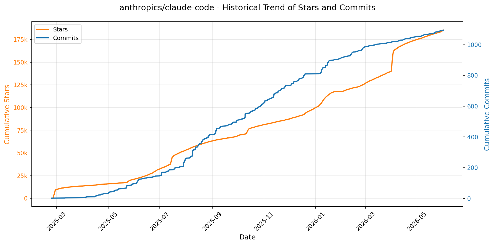
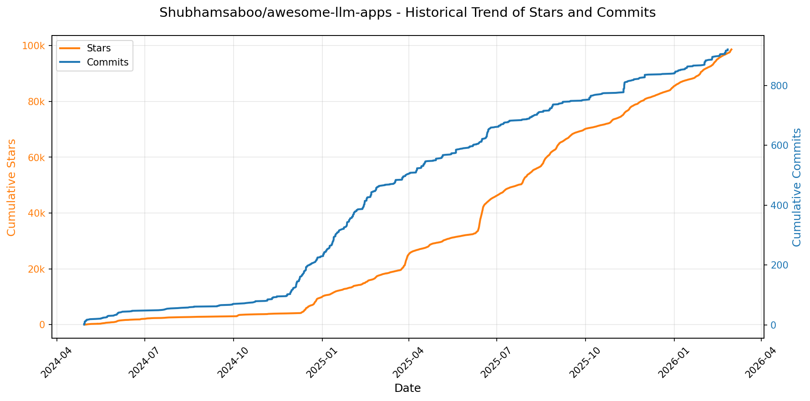
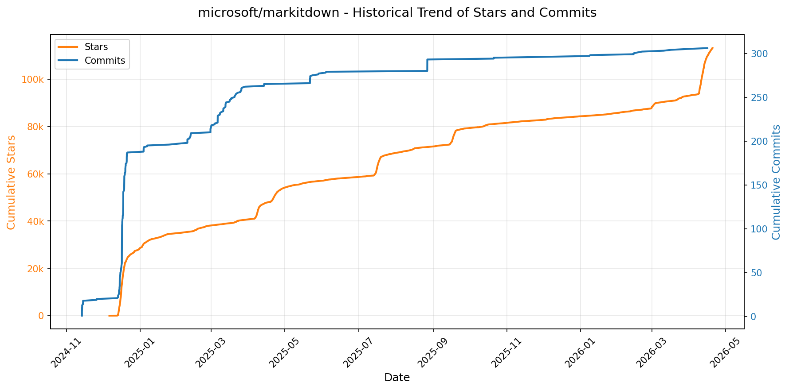
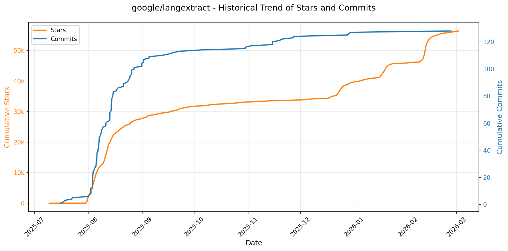
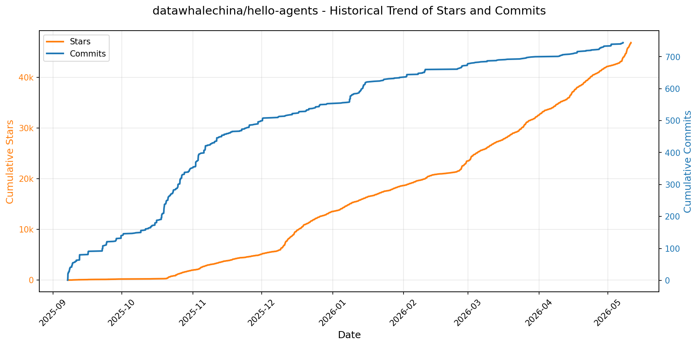
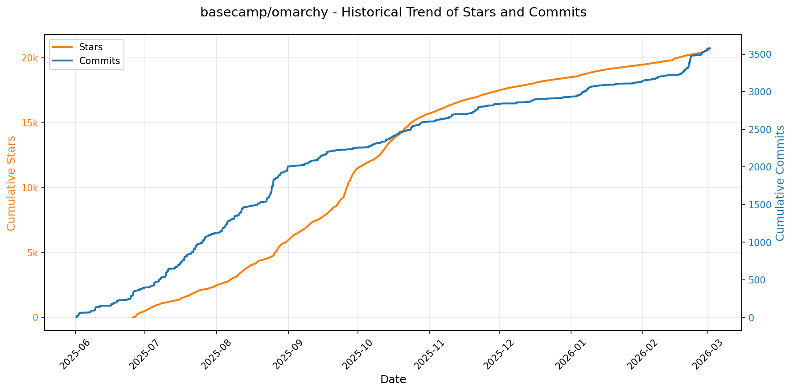
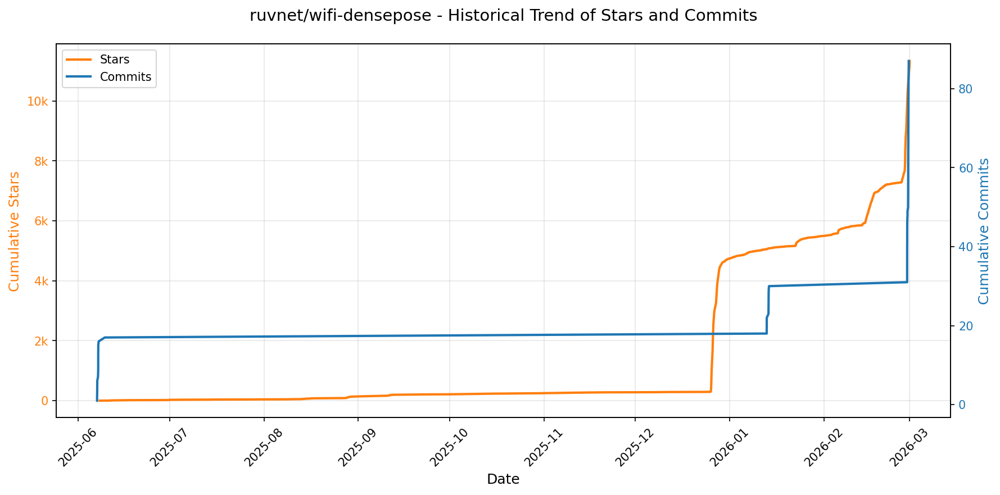
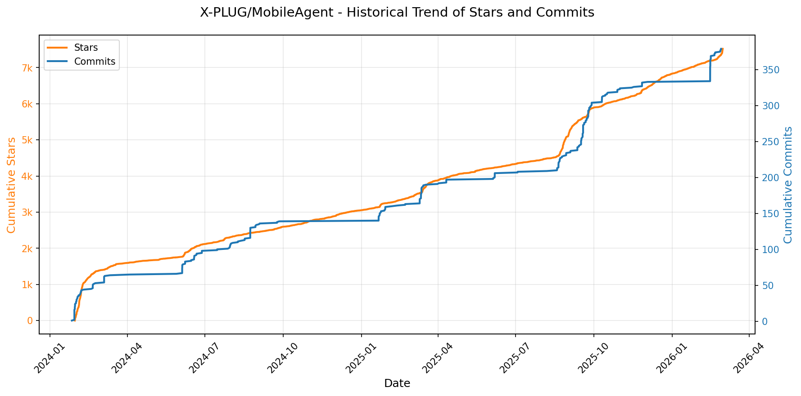
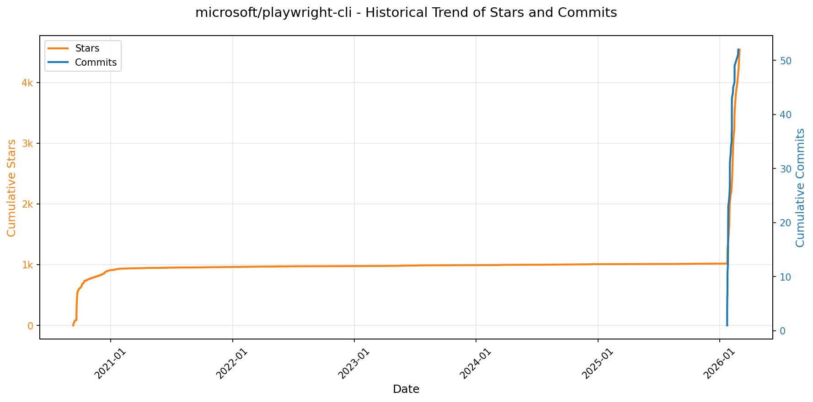

# 🌟 GitHub Trending 概览

> 数据更新于：2026-03-02

---

## 🔍 项目详情

### 1. [openclaw/openclaw](https://github.com/openclaw/openclaw)
- 📅 **创建日期**：2025-11-24  
- 🔄 **最近更新**：2026-03-02  
- ⭐ **Stars**：130,091（日 +2915｜周 +25424｜月 +126147）  
- 📝 **描述**：Your own personal AI assistant. Any OS. Any Platform. The lobster way. 🦞   

<b>📈 Star 与 Commit 历史趋势</b>

> *蓝色：累计 Stars｜橙色：累计 Commits（次 Y 轴）*

<b>📄 README 摘要</b>

1. **项目功能**  
OpenClaw 是一个完全本地化、用户自托管的个人 AI 助手系统，核心目标是让用户在**自有设备上运行专属、单用户、低延迟、始终在线的 AI 助理**。它不依赖中心化云服务，而是通过轻量级「网关（Gateway）」作为统一控制平面，将 AI 能力无缝接入用户日常使用的各类通信渠道（如 WhatsApp、Telegram、Slack、Discord、Signal、iMessage、Microsoft Teams、Google Chat、BlueBubbles、Matrix、Zalo 等），并支持跨平台语音交互（macOS/iOS/Android 的 Wake-on-Voice 与 Talk Mode）、实时可视化工作区（Live Canvas + A2UI）、设备级本地操作（摄像头、屏幕录制、定位、系统命令、通知等），实现真正“以用户为中心”的端到端 AI 协作体验。

2. **关键特性**  
- **本地优先架构**：所有会话、配置、媒体、权限均本地存储与处理；网关默认绑定 `127.0.0.1`，支持 Tailscale Serve/Funnel 或 SSH 隧道实现安全远程访问。  
- **全栈多通道集成**：原生支持 14+ 主流及小众消息平台（含 Baileys、grammY、discord.js、signal-cli 等底层适配），支持群组智能路由（提及触发、回复标签、分块处理）、DM 安全配对机制（`pairing` 模式防未授权输入）。  
- **多智能体隔离工作区**：基于「Workspace + Session」模型实现账号/频道/联系人级路由，支持独立上下文、激活模式、队列策略与跨会话通信（`sessions_send`/`sessions_history`）。  
- **语音与视觉双模态交互**：集成 ElevenLabs 实现 macOS/iOS/Android 全时语音唤醒与连续对话；提供可编程 Live Canvas（A2UI 渲染引擎），支持动态 UI 推送、快照、JS 执行与跨平台同步。  
- **设备原生能力节点（Nodes）**：通过标准化 `node.invoke` 协议调用 macOS/iOS/Android 设备能力（如 `system.run`、`camera.snap`、`screen.record`、`location.get`），严格遵循系统权限框架（TCC / App Tracking Transparency）。  
- **安全与运维完备性**：内置 DM 策略检查（`openclaw doctor`）、模型故障转移（OAuth/API Key 自动降级）、会话自动裁剪、细粒度日志/用量追踪、Web 控制台（Control UI）与 WebChat 内置服务。  
- **开发者友好生态**：CLI 向导驱动一键部署（`openclaw onboard`）、Nix/Docker 多环境支持、TypeScript 全栈开发流（pnpm + tsx）、技能平台（ClawHub）与可插拔工具链（浏览器控制、Cron、Webhook、Gmail Pub/Sub）。

3. **技术栈**  
- **运行时**：Node.js ≥22（主运行环境），支持 npm/pnpm/bun；前端 TypeScript + React（Web UI/Control UI/WebChat）；移动端使用原生 iOS/Android SDK 封装节点能力。  
- **核心协议与通信**：WebSocket（Gateway 主控平面）、RPC（Pi Agent 运行时）、CDP（Chrome DevTools Protocol 用于浏览器自动化）。  
- **AI 集成层**：通用 LLM 接口抽象，官方推荐 Anthropic Claude Opus（强长上下文与抗提示注入），兼容 OpenAI（ChatGPT/Codex）、Convex 等后端；支持 OAuth 与 API Key 双认证及多模型故障切换。  
- **基础设施**：Tailscale（网络层穿透与身份验证）、Docker（容器化部署）、Nix（声明式配置管理）；Linux/macOS/Windows（WSL2）全平台服务端支持。  
- **媒体与系统集成**：FFmpeg（音视频处理）、AVFoundation（iOS）、CoreMedia/AVCapture（macOS）、MediaRecorder API（Web）、TCC 权限桥接（macOS）、Android CameraX/ScreenCapture API。  
- **安全机制**：本地 Allowlist 存储、JWT/Tailscale Identity Header 认证、密码保护（Funnel 模式强制）、SSH 隧道加密、最小权限 `node.invoke` 调用沙箱。

---

### 2. [anthropics/claude-code](https://github.com/anthropics/claude-code)
- 📅 **创建日期**：2025-02-22  
- 🔄 **最近更新**：2026-03-02  
- ⭐ **Stars**：127,658（日 +482｜周 +3444｜月 +9905）  
- 📝 **描述**：Claude Code is an agentic coding tool that lives in your terminal, understands your codebase, and helps you code faster by executing routine tasks, explaining complex code, and handling git workflows - all through natural language commands.  

<b>📈 Star 与 Commit 历史趋势</b>

> *蓝色：累计 Stars｜橙色：累计 Commits（次 Y 轴）*

<b>📄 README 摘要</b>

1. **该项目的功能**  
Claude Code 是一款终端原生的智能编程助手，能够深度理解用户当前代码库，通过自然语言指令自动执行常规开发任务（如代码生成、重构、调试）、解释复杂代码逻辑、自动化 Git 工作流（如提交、分支管理、冲突分析），并支持在终端、IDE 或 GitHub 中（通过 `@claude` 提及）直接调用。

2. **核心功能**  
- **上下文感知编码**：基于本地代码库进行语义理解，提供精准、上下文相关的代码建议与操作；  
- **自然语言交互**：支持纯中文/英文指令完成编码任务（如“为这个函数添加类型注解并写单元测试”）；  
- **Git 智能工作流**：自动生成提交信息、解释差异、建议分支策略、辅助解决合并冲突；  
- **插件扩展架构**：内置可插拔机制，支持通过官方插件目录（`./plugins/`）添加自定义命令与专用代理（Agent）；  
- **多平台一键安装**：提供 macOS/Linux 的 Shell 脚本、Homebrew、Windows 的 PowerShell 脚本及 WinGet 等标准化安装方式；  
- **内建反馈闭环**：集成 `/bug` 命令实现问题一键上报，含会话上下文与操作日志自动捕获。

3. **技术栈**  
- **运行时环境**：Node.js 18+（基础依赖）；  
- **部署与分发**：跨平台安装脚本（Bash/PowerShell）、Homebrew Cask、WinGet 包管理器；  
- **架构设计**：基于“智能体（Agentic）”范式构建，采用模块化插件系统（插件使用 TypeScript/JavaScript 编写）；  
- **数据与安全**：本地优先处理，敏感数据（如源码片段）设有限期保留策略；不用于模型训练；访问权限严格隔离，符合 Anthropic 商业服务条款与隐私政策。

---

### 3. [x1xhlol/system-prompts-and-models-of-ai-tools](https://github.com/x1xhlol/system-prompts-and-models-of-ai-tools)
- 📅 **创建日期**：2025-03-05  
- 🔄 **最近更新**：2026-03-02  
- ⭐ **Stars**：126,987（日 +423｜周 +9229｜月 +15265）  
- 📝 **描述**：FULL Augment Code, Claude Code, Cluely, CodeBuddy, Comet, Cursor, Devin AI, Junie, Kiro, Leap.new, Lovable, Manus, NotionAI, Orchids.app, Perplexity, Poke, Qoder, Replit, Same.dev, Trae, Traycer AI, VSCode Agent, Warp.dev, Windsurf, Xcode, Z.ai Code, Dia & v0. (And other Open Sourced) System Prompts, Internal Tools & AI Models  

<b>📈 Star 与 Commit 历史趋势</b>

> *蓝色：累计 Stars｜橙色：累计 Commits（次 Y 轴）*

<b>📄 README 摘要</b>

该内容并非一个典型软件项目的 README（缺少项目名称、功能描述、安装使用说明等核心信息），而是一个**AI 系统提示词（system prompts）与模型配置的开源收集库**的推广性主页。根据所提供信息，严格围绕三项要求进行客观总结如下：

---

**1. 该项目做什么？**  
这是一个持续维护的、面向开发者和 AI 从业者的**公开知识库**，专注于收集、整理并披露主流 AI 工具（如大模型应用、AI 编程助手、智能代理平台等）中实际使用的**系统级提示词（system prompts）、模型调用参数及内部结构线索**。项目已积累超 30,000 行深度分析内容，旨在揭示 AI 产品背后的工程实现逻辑，服务于研究、安全审计、竞品分析与提示工程优化。

---

**2. 关键特性**  
- ✅ **大规模真实提示词集合**：覆盖大量商业化 AI 工具的隐藏 system prompt 实例，含结构化注释与上下文分析；  
- ✅ **安全导向洞察**：强调 AI 启动项泄露风险，配套提供 [ZeroLeaks.ai](https://zeroleaks.ai/) 安全审计服务链接，突出“提示词即攻击面”的安全理念；  
- ✅ **社区驱动与透明维护**：通过 Discord 社群（LeaksLab）、GitHub Issue 收集反馈，支持用户贡献与协作；  
- ✅ **多维度可访问性**：提供加密货币捐赠、Patreon/Ko-fi 赞助渠道，并集成 Trendshift、Star History 等数据看板，体现项目活跃度与影响力追踪能力。

---

**3. 技术栈**  
文档中**未明确声明任何具体技术栈**（如编程语言、框架、部署环境或数据格式）。所有内容均以静态 Markdown + GitHub 原生生态（Issues、Discord、外部 API 图表）呈现，可推断其为：  
- **纯前端/文档型仓库**：基于 GitHub Pages 或静态站点托管；  
- **无后端服务依赖**：所有数据以文本文件（`.md`/`.txt`/`.json` 等）形式存储于 Git 仓库；  
- **基础设施依赖外部服务**：如 Star History（图表渲染）、Cloudback（CI 状态）、DeepWiki（知识图谱索引）、Tembo/Latitude（赞助商技术栈，非本项目所用）。  

> 注：项目本身不涉及模型训练、API 开发或运行时系统，不属于“可执行软件”，而是一个**高价值 AI 工程实践情报库**。

---

### 4. [Shubhamsaboo/awesome-llm-apps](https://github.com/Shubhamsaboo/awesome-llm-apps)
- 📅 **创建日期**：2024-04-29  
- 🔄 **最近更新**：2026-03-02  
- ⭐ **Stars**：99,042（日 +434｜周 +2181｜月 +7792）  
- 📝 **描述**：Collection of awesome LLM apps with AI Agents and RAG using OpenAI, Anthropic, Gemini and opensource models.  

<b>📈 Star 与 Commit 历史趋势</b>

> *蓝色：累计 Stars｜橙色：累计 Commits（次 Y 轴）*

<b>📄 README 摘要</b>

1. **项目功能**  
该项目是一个高度结构化的开源资源库（`awesome-llm-apps`），旨在系统性地**收集、分类并展示基于大语言模型（LLM）的前沿应用实践**。它不提供单一可运行产品，而是作为一个**高质量、可复用的LLM应用案例集与学习指南**，覆盖从入门级AI代理到复杂多智能体系统的完整技术光谱。所有项目均聚焦于实际落地场景（如旅行规划、医疗影像分析、法律尽调、金融顾问、游戏博弈等），强调与真实工具链（GitHub、Notion、Gmail、YouTube、PDF/ArXiv文档等）的深度集成，并支持本地部署与云服务混合架构。

2. **核心特性**  
- **全栈式LLM应用范式覆盖**：全面涵盖RAG（含Corrective RAG、Hybrid Search、Vision RAG、Knowledge Graph RAG等16+变体）、单/多AI Agent（超40个具体Agent案例）、Multi-agent Teams（含法律、招聘、地产、教育等垂直领域团队）、MCP（Model Context Protocol）标准集成（浏览器/GitHub/Notion等MCP Agent）、Voice AI（语音对话、客服、音频导览）、自主游戏Agent（国际象棋、Tic-Tac-Toe、3D PyGame）等主流技术方向；  
- **模型无关性与混合推理支持**：兼容OpenAI、Anthropic（Claude）、Google Gemini、xAI Grok及开源模型（Llama 3.1/3.2、Qwen、Gemma 3、DeepSeek），支持本地运行与云端API协同；  
- **工程化增强能力**：内置LLM优化工具（Toonify Token压缩降本30–60%，Headroom上下文压缩降本50–90%）、记忆机制（Stateful Chat、Personalized Memory、Shared Memory）、细粒度调试（RAG Failure Diagnostics Clinic）及跨平台接入（Chat with PDF/Gmail/YouTube/Research Papers/Substack等）；  
- **学习友好型架构**：按难度分层（Starter / Advanced）、按技术归类（MCP / Voice / RAG / Fine-tuning），附带框架速成课（Google ADK / OpenAI Agents SDK），每个项目均含独立README和requirements.txt，开箱即用。

3. **技术栈**  
- **核心框架与协议**：Google ADK（Agent Development Kit）、OpenAI Agents SDK、CrewAI、MCP（Model Context Protocol）标准；  
- **LLM模型层**：OpenAI GPT系列、Anthropic Claude、Google Gemini（含Multimodal）、xAI Grok、Meta Llama 3.1/3.2、Alibaba Qwen、Google Gemma 3、DeepSeek；  
- **RAG与检索技术**：Embedding模型（Gemma-based embeddings）、向量数据库（隐含支持Chroma/Pinecone等）、Hybrid Search（关键词+语义）、Knowledge Graph构建、Citation-aware检索；  
- **基础设施与工具**：Python（主语言）、Pydantic（结构化输出）、LangChain/LangGraph（可选底层编排）、Speechmatics（语音识别）、Browser Automation（Playwright/Selenium）、Git/Notion/Gmail/YouTube API集成；  
- **部署与优化**：本地推理支持（GGUF量化、Ollama）、Token优化（TOON格式）、Context压缩算法（Headroom）、Fine-tuning流水线（LoRA/QLoRA适配Gemma 3 & Llama 3.2）。

---

### 5. [obra/superpowers](https://github.com/obra/superpowers)
- 📅 **创建日期**：2025-10-09  
- 🔄 **最近更新**：2026-03-02  
- ⭐ **Stars**：96,072（日 +1015｜周 +8915｜月 +26799）  
- 📝 **描述**：An agentic skills framework & software development methodology that works.  

<b>📈 Star 与 Commit 历史趋势</b>

> *蓝色：累计 Stars｜橙色：累计 Commits（次 Y 轴）*

<b>📄 README 摘要</b>

1. **项目功能**  
Superpowers 是一个面向编程智能体（coding agents）的完整软件开发工作流增强系统。它不直接替代或重写代码，而是通过一套可组合、自动触发的“技能”（skills）来规范和引导 AI 编程代理的行为，使其严格遵循工程最佳实践。其核心作用是：在用户启动编码任务后，主动暂停“直接写代码”的冲动，转而驱动结构化协作流程——包括需求澄清、分块设计确认、TDD 计划生成、子智能体并行执行、双阶段代码审查、Git 工作树隔离、自动化测试验证与分支收尾等，最终实现人类监督下的高自主性、高可靠性开发闭环。

2. **关键特性**  
- **全自动技能触发**：无需手动调用，AI 在每个开发环节前自动识别并启用对应技能（如设计阶段触发 `brainstorming`，编码前强制 `test-driven-development`）。  
- **强约束工程纪律**：强制实施真·红-绿-重构（RED-GREEN-REFACTOR）、YAGNI（你不会需要它）、DRY（避免重复）及防御性验证（如 `verification-before-completion`）。  
- **分层协作机制**：支持“子智能体驱动开发”（subagent-driven-development），为每个 2–5 分钟粒度的任务派生独立子智能体，并执行两阶段审查（先验规范符合性，再审代码质量）。  
- **全生命周期覆盖**：涵盖从创意脑暴（`brainstorming`）、Git 工作树隔离（`using-git-worktrees`）、计划拆解（`writing-plans`）、批量执行（`executing-plans`）、代码评审（`requesting/receiving-code-review`）到分支收尾（`finishing-a-development-branch`）的 7 大标准化阶段。  
- **可扩展技能生态**：内置测试、调试、协作、元能力（如 `writing-skills`）四大类共 14+ 项技能，全部开源、模块化、可复用，支持社区贡献新技能。

3. **技术栈**  
- **运行平台**：深度适配主流 AI 编程 IDE 插件生态，原生支持 **Claude Code**（通过插件市场）、**Cursor**（Agent 模式）、**Codex** 和 **OpenCode**（需手动加载配置）；非独立应用，而是作为轻量级技能框架嵌入现有工具链。  
- **架构范式**：基于“技能即配置”（skill-as-declarative-spec）的设计，所有技能以 Markdown 文档（`.md`）形式定义行为逻辑、触发条件、输入输出规范及测试用例（见 `skills/` 目录），由宿主平台解析执行。  
- **协议与集成**：依赖平台提供的 `/plugin` CLI 接口进行安装、更新与管理；技能执行时调用平台底层能力（如文件读写、终端执行、Git 操作、测试运行）；部分技能含内建参考知识库（如 TDD 反模式清单、系统化调试四阶段法）。  
- **基础设施**：托管于 GitHub，采用 MIT 协议；使用标准 Git 工作流管理技能版本；更新通过 `plugin update` 命令拉取远程仓库最新技能定义。

---

### 6. [microsoft/markitdown](https://github.com/microsoft/markitdown)
- 📅 **创建日期**：2024-11-13  
- 🔄 **最近更新**：2026-03-02  
- ⭐ **Stars**：88,990（日 +463｜周 +1530｜月 +3142）  
- 📝 **描述**：Python tool for converting files and office documents to Markdown.  

<b>📈 Star 与 Commit 历史趋势</b>

> *蓝色：累计 Stars｜橙色：累计 Commits（次 Y 轴）*

<b>📄 README 摘要</b>

1. **该项目做什么？**  
MarkItDown 是一个轻量级 Python 工具，专注于将多种格式的文件（如 PDF、Word、PPTX、Excel、HTML、图片、音频、YouTube 视频、EPUB、ZIP 等）**结构化地转换为 Markdown 文本**，专为大语言模型（LLM）输入和文本分析流水线设计。其核心目标不是生成高保真、面向人类阅读的排版文档，而是产出语义丰富、结构清晰（保留标题、列表、表格、链接、元数据、OCR 文本、字幕等）、且对 LLM 友好（天然适配 Markdown 训练分布）的中间表示。支持本地解析、Azure Document Intelligence 云服务增强解析，以及通过 LLM（如 GPT-4o）生成图像/幻灯片内容描述。

2. **关键特性**  
- ✅ **多格式全覆盖**：原生支持 PDF、DOCX、PPTX、XLSX/XLS、HTML、CSV/JSON/XML、图像（EXIF + OCR）、音频（EXIF + ASR）、YouTube URL、EPUB、ZIP 内容遍历等；  
- ✅ **结构化 Markdown 输出**：精准保留文档逻辑结构（层级标题、有序/无序列表、表格、超链接、代码块等），而非简单纯文本提取；  
- ✅ **模块化依赖管理**：按功能分组可选依赖（如 `[pdf]`、`[audio-transcription]`），支持最小化安装（`pip install 'markitdown[pdf,docx]'`）或全功能安装（`[all]`）；  
- ✅ **插件扩展生态**：内置第三方插件机制，支持社区开发并注册自定义解析器（通过 `--use-plugins` 启用）；  
- ✅ **云与 AI 增强能力**：集成 Azure Document Intelligence 实现高精度文档理解；支持传入 OpenAI 等 LLM 客户端，为图像/PPT 自动生成语义化描述；  
- ✅ **灵活使用方式**：提供命令行工具（支持管道输入、重定向输出）、Python API（类实例化调用）、Docker 镜像及 MCP（Model Context Protocol）服务器（用于 Claude Desktop 等 LLM 应用集成）；  
- ✅ **零临时文件设计**：所有转换基于内存流（`BytesIO` 或二进制文件对象），避免磁盘 I/O 开销与安全风险；  
- ✅ **向后兼容性提示与迁移支持**：明确标注 v0.0.1→v0.1.0 的 Breaking Changes（如接口改用二进制流），并提供 `[all]` 安装选项维持旧行为。

3. **技术栈**  
- **语言与运行时**：Python ≥ 3.10；  
- **核心依赖**：`pypdf`（PDF）、`python-pptx` / `docx2python` / `openpyxl`（Office 文档）、`Pillow` + `pytesseract`（图像 OCR）、`ffmpeg-python` / `whisper`（音频转录）、`yt-dlp`（YouTube 元数据与字幕）、`ebooklib`（EPUB）、`beautifulsoup4`（HTML）等（均按需作为可选依赖）；  
- **云服务集成**：Azure Document Intelligence REST API（通过 `azure-ai-formrecognizer` 或原生 HTTP 调用）；  
- **LLM 集成**：兼容 OpenAI Python SDK（`openai` 包），支持任意符合标准的 `llm_client` 接口；  
- **协议与标准**：实现 [Model Context Protocol (MCP)](https://modelcontextprotocol.io/)（见 `markitdown-mcp` 子包），支持与 Claude Desktop 等 MCP 客户端互通；  
- **开发与工程化**：`hatch`（项目构建与测试）、`pre-commit`（代码规范检查）、`pytest`（单元测试）、Docker（容器化部署）、GitHub Actions（CI/CD）；  
- **分发与生态**：PyPI 发布（`pip install markitdown`），遵循 PEP 566 插件规范，支持 `entry_points` 插件发现机制。

---

### 7. [google/langextract](https://github.com/google/langextract)
- 📅 **创建日期**：2025-07-08  
- 🔄 **最近更新**：2026-03-02  
- ⭐ **Stars**：56,400（日 +83｜周 +614｜月 +10508）  
- 📝 **描述**：A Python library for extracting structured information from unstructured text using LLMs with precise source grounding and interactive visualization.  

<b>📈 Star 与 Commit 历史趋势</b>

> *蓝色：累计 Stars｜橙色：累计 Commits（次 Y 轴）*

<b>📄 README 摘要</b>

1. **项目功能**  
LangExtract 是一个基于大语言模型（LLM）的 Python 库，专注于从**非结构化文本**（如临床病历、放射报告、文学作品等）中**高精度提取结构化信息**。其核心能力是依据用户提供的自然语言指令和少量示例（few-shot examples），自动识别并组织关键实体（如人物、情绪、药物名称、剂量、关系等），同时严格保证所有提取结果均**可追溯至原文中的精确位置**（source grounding），支持端到端的可验证性与可解释性。

2. **关键特性**  
- ✅ **精准源文本定位**：为每个提取结果标注原文中的字符级起止位置，支持可视化高亮与人工核查；  
- ✅ **强结构化输出保障**：通过受控生成机制（尤其对 Gemini 等模型）及 schema 约束，确保输出严格遵循用户定义的字段结构与类型；  
- ✅ **长文档优化处理**：采用智能分块（chunking）、多轮提取（up to 3+ passes）、并行处理（`max_workers` 可配置）策略，显著提升在超长文本（如整本《罗密欧与朱丽叶》）中的召回率与准确性；  
- ✅ **交互式可视化**：一键生成自包含的 HTML 文件，支持动态搜索、上下文浏览、实体过滤与动画高亮，便于大规模结果审查；  
- ✅ **多模态 LLM 接入能力**：原生支持 Google Gemini（云）、OpenAI（需额外安装）、本地 Ollama 模型（如 `gemma2:2b`），并提供插件化架构以扩展第三方模型提供商；  
- ✅ **零微调领域适配**：仅需提供 1–3 个高质量示例 + 清晰提示词，即可快速适配医疗、法律、文学等任意垂直领域任务；  
- ✅ **生产就绪增强功能**：支持 Vertex AI 批处理（降本增效）、环境变量/.env 安全密钥管理、Docker 部署、CI/CD 测试集成（pytest + tox）及预提交代码规范检查。

3. **技术栈**  
- **编程语言**：Python 3.10+（核心实现）；  
- **核心依赖**：`google-generativeai`（Gemini）、`openai`（可选）、`ollama`（可选）、`pydantic`（数据建模与验证）、`rich`（终端输出）、`jinja2`（HTML 模板渲染）；  
- **构建与包管理**：`pyproject.toml`（PEP 517/518）、`setuptools`、`pip`；  
- **开发与测试工具**：`pytest`（单元/集成测试）、`tox`（多 Python 版本 CI 模拟）、`pylint`（代码质量）、`pyink` + `isort`（自动格式化）、`pre-commit`（钩子自动化）；  
- **部署与运行时**：支持虚拟环境、Docker 容器化、Ollama 本地推理服务（HTTP API）、Vertex AI 云平台批处理；  
- **扩展架构**：基于 `entry_points` 的插件注册系统，支持第三方模型提供商以独立 Python 包形式集成。

---

### 8. [thedotmack/claude-mem](https://github.com/thedotmack/claude-mem)
- 📅 **创建日期**：2025-08-31  
- 🔄 **最近更新**：2026-03-02  
- ⭐ **Stars**：32,475（日 +233｜周 +1918｜月 +16877）  
- 📝 **描述**：A Claude Code plugin that automatically captures everything Claude does during your coding sessions, compresses it with AI (using Claude's agent-sdk), and injects relevant context back into future sessions.  

<b>📈 Star 与 Commit 历史趋势</b>

> *蓝色：累计 Stars｜橙色：累计 Commits（次 Y 轴）*

<b>📄 README 摘要</b>

1. **项目功能**  
Claude-Mem 是一个专为 **Claude Code（Anthropic 推出的 AI 编程助手）设计的持久化记忆压缩系统**。它在用户每次会话中自动捕获工具调用、代码操作、错误修复等行为观测数据（observations），生成语义化摘要，并持久化存储于本地 SQLite 数据库中；当新会话启动时，自动检索并按需注入相关历史上下文，从而实现跨会话的知识连续性——使 Claude 能“记住”项目进展、技术决策、调试过程等关键信息，显著提升长周期开发任务中的上下文连贯性与推理准确性。

2. **核心特性**  
- ✅ **持久化记忆（Persistent Memory）**：会话结束后仍保留结构化记忆，重启即恢复上下文；  
- ✅ **渐进式披露（Progressive Disclosure）**：分三层（索引 → 时间线 → 原始详情）按需加载记忆，实时显示 token 消耗，优化成本控制；  
- ✅ **技能化搜索（Skill-Based Search）**：内置 `mem-search` 技能及 4 个标准化 MCP（Model Context Protocol）工具（`search` / `timeline` / `get_observations`），支持自然语言+过滤条件（类型/日期/项目）混合查询；  
- ✅ **可视化 Web 查看器（Web Viewer UI）**：本地服务 `http://localhost:37777` 提供实时记忆流、全文检索、观察详情页及 ID 引用链接（如 `/api/observation/{id}`）；  
- ✅ **多端集成能力**：原生支持 Claude Desktop 对话内搜索、OpenClaw 网关一键部署（含 Telegram/Discord/Slack 实时通知）；  
- ✅ **隐私与可控性**：支持 `<private>` 标签排除敏感内容；提供细粒度配置项（注入范围、AI 模型、端口、日志等级等）；  
- ✅ **自动化与低侵入性**：全程无手动干预，依赖生命周期钩子（6 个 Hook 脚本）静默运行；  
- ✅ **混合搜索架构**：融合 SQLite FTS5 全文检索 + Chroma 向量数据库，兼顾关键词精准匹配与语义相似性召回；  
- ✅ **Beta 实验通道**：支持 Endless Mode（仿生长时记忆架构）等前沿功能灰度测试。

3. **技术栈**  
- **运行时与服务管理**：Bun（HTTP API 服务与 Worker 进程管理）、Node.js ≥18.0.0（插件主运行环境）、uv（Python 包管理器，用于向量搜索依赖）；  
- **存储层**：SQLite 3（嵌入式关系型数据库，含 FTS5 全文索引模块）、Chroma（轻量级向量数据库，实现语义搜索）；  
- **协议与接口标准**：MCP（Model Context Protocol）规范，兼容 Claude Agent SDK 生态；  
- **前端与交互**：TypeScript 构建 Web Viewer UI（基于 Bun 提供的 HTTP 服务），支持 30+ 语言国际化（i18n）；  
- **构建与工程**：GitHub Actions CI/CD、AGPL-3.0 开源许可（主项目），Ragtime 子模块采用 PolyForm Noncommercial License；  
- **部署与集成**：支持 CLI 插件安装（`/plugin install`）、OpenClaw 网关脚本化部署（`curl | bash`）、以及本地开发全流程（测试/构建/贡献指南完备）。

---

### 9. [VectifyAI/PageIndex](https://github.com/VectifyAI/PageIndex)
- 📅 **创建日期**：2025-04-01  
- 🔄 **最近更新**：2026-03-02  
- ⭐ **Stars**：24,480（日 +304｜周 +3561｜月 +8907）  
- 📝 **描述**：📑 PageIndex: Document Index for Vectorless, Reasoning-based RAG  

<b>📈 Star 与 Commit 历史趋势</b>

> *蓝色：累计 Stars｜橙色：累计 Commits（次 Y 轴）*

<b>📄 README 摘要</b>

1. **项目功能**  
PageIndex 是一个面向长文档（如财报、法律文书、技术手册等）的新型检索增强生成（RAG）系统，其核心目标是**替代传统向量数据库驱动的语义相似性检索**。它不依赖向量化或分块（chunking），而是通过构建文档的**语义层级树索引（Tree Index）**，并利用大语言模型（LLM）在该索引上执行**推理式树搜索（reasoning-based tree search）**，实现类人、可解释、高精度的知识定位与上下文提取。本质上，它将文档结构化为类似“智能目录”的可推理图谱，使LLM能像领域专家一样逐层思考、导航和聚焦关键段落。

2. **关键特性**  
- **零向量数据库（Vectorless）**：完全摒弃嵌入向量与相似度计算，避免“相似≠相关”的根本缺陷；  
- **无分块处理（No Chunking）**：基于文档天然语义结构（标题、章节、页码）组织内容，保留上下文完整性与逻辑连贯性；  
- **推理驱动检索（Reasoning-based Retrieval）**：通过两阶段流程——① 自动生成带摘要、页码范围与父子关系的层级树索引；② 利用LLM对用户问题进行多步推理，在树中主动搜索最优路径，而非被动匹配；  
- **高度可解释与可追溯**：每次检索结果附带明确的页面号、节点ID及推理链，支持审计与验证，杜绝“黑箱式vibe检索”；  
- **原生支持视觉输入（Vision-native）**：提供OCR-Free方案，可直接对PDF页面图像进行端到端推理式RAG，无需文本提取预处理；  
- **专业场景SOTA性能**：在FinanceBench金融问答基准测试中达98.7%准确率，显著超越主流向量RAG方案。

3. **技术栈**  
- **核心模型**：依赖OpenAI系列大模型（默认 `gpt-4o-2024-11-20`）执行树构建与推理搜索；  
- **文档解析**：支持PDF（基于PyPDF2等库基础解析）与Markdown（按`#`级标题自动识别层级）；  
- **工程框架**：Python为主，命令行工具化（`run_pageindex.py`），支持`.env`密钥管理；  
- **部署形态**：提供开源本地运行能力（self-hosted）、云服务（Chat平台、API）、MCP协议集成（兼容Claude/Cursor等智能体环境）及企业私有化部署；  
- **配套能力**：自研PageIndex OCR（专为长文档结构保真设计，非通用OCR）、Colab交互式Notebook（Jupyter）、标准化API与MCP适配器。

---

### 10. [virattt/dexter](https://github.com/virattt/dexter)
- 📅 **创建日期**：2025-10-14  
- 🔄 **最近更新**：2026-03-02  
- ⭐ **Stars**：24,269（日 +75｜周 +871｜月 +7506）  
- 📝 **描述**：An autonomous agent for deep financial research  

<b>📈 Star 与 Commit 历史趋势</b>

> *蓝色：累计 Stars｜橙色：累计 Commits（次 Y 轴）*

<b>📄 README 摘要</b>

1. **项目功能**  
Dexter 是一个面向金融研究的自主式 AI 代理（Autonomous Financial Research Agent），能够对复杂金融问题进行端到端的自主分析：接收用户提问 → 拆解为多步研究计划 → 调用实时市场数据工具执行任务 → 自我验证结果 → 迭代优化直至生成可信、数据支撑的结论。其核心目标是替代传统人工财务尽调流程，实现“思考—规划—执行—反思—学习”的闭环研究能力。

2. **关键特性**  
- **智能任务规划**：自动将模糊/复杂的金融问题（如“评估特斯拉在电动车市场的长期竞争力”）分解为结构化子任务（如“获取特斯拉近5年毛利率与比亚迪对比”“分析其电池技术专利趋势”）。  
- **自主工具执行**：动态选择并调用适配的金融数据 API（如 Financial Datasets 获取财报）、网络搜索工具（Exa/Tavily）等，完成数据采集。  
- **自我验证与迭代**：内置反思机制，对每步输出进行合理性校验（如检查财报数据单位一致性、时间范围逻辑），失败则重试或调整策略。  
- **实时权威金融数据接入**：直接对接 Financial Datasets API，支持获取上市公司最新收入表、资产负债表、现金流量表等结构化财报数据（AAPL/NVDA/MSFT 等标的免费）。  
- **安全运行保障**：集成循环检测（loop detection）和最大步骤限制（step limits），防止无限推理或工具调用失控。  
- **全链路可追溯调试**：自动生成 JSONL 格式“草稿本”（scratchpad），完整记录每次查询的原始问题、每步工具调用参数/原始返回/大模型摘要、及中间推理过程，便于审计与复现。  
- **多模态交互支持**：原生集成 WhatsApp 网关，用户可通过 WhatsApp 发送消息触发 Dexter 分析并接收结构化回复。

3. **技术栈**  
- **运行时**：Bun（v1.0+，作为 JavaScript/TypeScript 运行时与包管理器，替代 Node.js/npm）  
- **核心语言**：TypeScript（强类型保障金融逻辑可靠性）  
- **AI 模型层**：支持多后端 LLM 接入，包括 OpenAI（默认）、Anthropic、Google Gemini、xAI、OpenRouter；本地可选 Ollama（通过 `OLLAMA_BASE_URL` 配置）  
- **数据服务**：  
  - Financial Datasets API（核心财报数据源）  
  - Exa API 或 Tavily API（网络搜索增强，用于非结构化信息补充）  
- **评估与可观测性**：LangSmith（用于追踪推理链、LLM-as-judge 自动评测、准确率统计）  
- **部署与通信**：WhatsApp Business API 网关（基于 Twilio 或类似方案，通过 QR 扫码绑定个人账号）  
- **工程实践**：模块化架构（含独立 `gateway`、`evals` 子系统）、环境变量驱动配置（`.env`）、JSONL 日志格式化、CLI 命令统一管理（`bun start`/`bun dev`/`bun run gateway` 等）

---

### 11. [datawhalechina/hello-agents](https://github.com/datawhalechina/hello-agents)
- 📅 **创建日期**：2025-09-07  
- 🔄 **最近更新**：2026-03-02  
- ⭐ **Stars**：23,913（日 +292｜周 +2558｜月 +5260）  
- 📝 **描述**：📚 《从零开始构建智能体》——从零开始的智能体原理与实践教程  

<b>📈 Star 与 Commit 历史趋势</b>

> *蓝色：累计 Stars｜橙色：累计 Commits（次 Y 轴）*

<b>📄 README 摘要</b>

1. **该项目做什么？**  
   Hello-Agents 是 Datawhale 社区发起的**系统性、实践导向的智能体（Agent）开源学习教程**，旨在帮助学习者从零开始深入理解并亲手构建真正 AI 原生（AI Native）的智能体系统。它聚焦于“以 AI 为驱动核心”的智能体（而非流程驱动的低代码平台应用），覆盖从基础理论（智能体定义、演进史、LLM 原理）到工程实现（经典范式编码、框架应用、自研框架开发）、再到高级能力（记忆、上下文工程、通信协议、Agentic-RL 训练、系统评估）和真实场景落地（旅行助手、深度研究 Agent、赛博小镇等多智能体应用）的全链路学习路径。最终目标是培养学习者从大模型“使用者”成长为智能体系统“构建者”。

2. **关键功能/特性：**  
   - ✅ **理论与实战深度融合**：每章均配套可运行代码（含 `code/` 目录），强调“边学边做”，拒绝纯概念灌输；  
   - ✅ **双轨能力培养**：既教授如何高效使用主流工具（Coze/Dify/n8n 低代码平台、AutoGen/LangGraph/AgentScope 等框架），更重点引导**从零手写一个轻量级智能体框架 `HelloAgents`**（基于 OpenAI 原生 API）；  
   - ✅ **覆盖智能体核心技术栈**：系统讲解 ReAct/Plan-and-Solve/Reflection 等经典范式、Memory 与 RAG、上下文工程（Context Engineering）、MCP/A2A 等通信协议、Agentic-RL（SFT → GRPO 全流程训练）、多智能体评估方法论；  
   - ✅ **真实综合项目驱动**：包含智能旅行助手（MCP 多智能体协作）、自动化深度研究智能体（DeepResearch 复现）、赛博小镇（Agent × 游戏 × 社会模拟）等进阶案例；  
   - ✅ **强社区共建生态**：提供“社区贡献精选（Extra-Chapter）”栏目，涵盖面试题库、Dify 保姆级教程、GUI Agent 实战、Skill 编写指南、踩坑经验等一线实践内容；  
   - ✅ **全链路学习支持**：提供在线阅读（GitBook）、PDF 开源教材、读者交流群、GitHub Issue 问答、视频课程规划（后续推出）等多维度学习资源。

3. **技术栈：**  
   - **核心语言**：Python（全项目代码及框架实现基础）；  
   - **大模型接口**：OpenAI 原生 API（`HelloAgents` 自研框架底层依赖）；  
   - **主流智能体框架**：AutoGen、LangGraph、AgentScope（第二部分框架开发实践章节重点教学）；  
   - **低代码平台**：Coze、Dify、n8n（用于对比学习与快速原型验证）；  
   - **关键技术组件**：RAG（检索增强）、Transformer 架构原理、SFT（监督微调）、GRPO（Gradient Regularized Policy Optimization）等 Agentic-RL 方法；  
   - **协议标准**：MCP（Model Context Protocol）、A2A（Agent-to-Agent）、ANP（Agent Network Protocol）等智能体间通信规范；  
   - **开发与协作工具**：GitHub（代码托管、Issue/Pull Request 协作）、GitBook（在线文档）、Markdown（教程编写）、PDF（离线交付）。

---

### 12. [bytedance/deer-flow](https://github.com/bytedance/deer-flow)
- 📅 **创建日期**：2025-05-07  
- 🔄 **最近更新**：2026-03-02  
- ⭐ **Stars**：22,991（日 +358｜周 +2955｜月 +3531）  
- 📝 **描述**：An open-source SuperAgent harness that researches, codes, and creates. With the help of sandboxes, memories, tools, skills and subagents, it handles different levels of tasks that could take minutes to hours.  

<b>📈 Star 与 Commit 历史趋势</b>

> *蓝色：累计 Stars｜橙色：累计 Commits（次 Y 轴）*

<b>📄 README 摘要</b>

1. **项目功能**  
DeerFlow 2.0 是一个开源的「超级智能体运行时框架（Super Agent Harness）」，旨在让大语言模型驱动的智能体真正具备端到端执行复杂任务的能力。它不再仅限于“深度研究”，而是作为通用型智能体基础设施，可自主规划、调用技能、分发子智能体（sub-agents）、在隔离沙箱中执行代码与文件操作、持久化长期记忆，并生成结构化交付物（如研究报告、幻灯片、网页、图像/视频等）。其核心目标是：**让智能体像人类一样拥有自己的“电脑”和“工作台”，能思考、协作、动手、记忆并持续进化**。

2. **关键特性**  
- **模块化可扩展技能系统（Skills & Tools）**：以 Markdown 定义标准化技能（如 research、slide-creation、image-generation），支持动态按需加载；内置丰富技能集，同时开放自定义路径（`/mnt/skills/custom/`）与 MCP 协议集成，支持 HTTP/SSE 类 MCP 服务器及 OAuth 认证。  
- **动态子智能体编排（Sub-Agents）**：主智能体可实时分解复杂任务，按需并发创建多个子智能体，每个拥有独立上下文、工具集与终止条件；结果结构化回传，由主智能体统一合成最终输出。  
- **全功能隔离沙箱环境（Sandbox & File System）**：所有任务均在 Docker 容器内运行，配备完整 Linux 文件系统（含 `/mnt/user-data/uploads/`、`workspace/`、`outputs/`），支持 Bash 执行、代码编写、文件读写、图像渲染等真实计算行为，保障安全、可审计、无会话污染。  
- **精细化上下文工程（Context Engineering）**：实现子智能体上下文严格隔离 + 会话内主动上下文管理（自动摘要已完成步骤、卸载中间结果至文件系统、压缩非活跃信息），显著延长长程多步任务的上下文有效性。  
- **本地化长期记忆（Long-Term Memory）**：跨会话持久化存储用户画像、偏好、技术栈、写作习惯及知识沉淀，数据完全本地存储、用户自主可控，随使用频次持续优化个性化能力。

3. **技术栈**  
- **核心框架**：基于 `LangGraph`（用于多智能体状态图编排与流式事件处理）与 `LangChain`（用于 LLM 抽象、工具链集成与模型适配）构建；  
- **运行时环境**：采用 Docker 容器化部署（推荐），支持本地开发（Node.js 22+、pnpm、uv、Nginx）及 Kubernetes 扩展（通过 Provisioner 服务）；  
- **协议与标准**：原生支持 [MCP（Model Context Protocol）](https://modelcontextprotocol.io/)，兼容 `client_credentials` / `refresh_token` OAuth 流；  
- **前端与 API**：提供符合 OpenAI 兼容 API 规范的 HTTP 网关服务（端口 2026），并内置轻量级 Python 客户端（`DeerFlowClient`），支持同步/流式调用、模型与技能管理，且所有响应 Schema 与网关严格对齐（CI 中通过 Pydantic 模型校验）；  
- **配置与扩展**：基于 YAML 配置驱动（`config.yaml`），支持环境变量注入（`.env`），模型层完全解耦，兼容任意 OpenAI 兼容接口的 LLM（如 GPT-4、Claude、Qwen、GLM 等）。

---

### 13. [gsd-build/get-shit-done](https://github.com/gsd-build/get-shit-done)
- 📅 **创建日期**：2025-12-14  
- 🔄 **最近更新**：2026-03-02  
- ⭐ **Stars**：22,941（日 +565｜周 +5134｜月 +13277）  
- 📝 **描述**：A light-weight and powerful meta-prompting, context engineering and spec-driven development system for Claude Code by TÂCHES.  

<b>📈 Star 与 Commit 历史趋势</b>

> *蓝色：累计 Stars｜橙色：累计 Commits（次 Y 轴）*

<b>📄 README 摘要</b>

1. **项目功能**  
该项目是一个轻量级但功能强大的元提示（meta-prompting）、上下文工程（context engineering）与规范驱动开发（spec-driven development）系统，专为 Claude Code、OpenCode、Gemini CLI 和 Codex 等 AI 编程助手设计。其核心目标是**解决“上下文腐化”（context rot）问题**——即随着 Claude 等模型持续填充上下文窗口，生成质量显著下降的现象。GSD 通过结构化工作流，在用户仅用自然语言描述需求的前提下，自动完成需求澄清、领域调研、分阶段规划、并行化代码执行、原子化 Git 提交及人工验收验证，从而实现高可靠性、可追溯、可复现的 AI 辅助软件开发闭环。

2. **关键特性**  
- ✅ **上下文保鲜机制**：每个任务（plan）在独立的 200k token 上下文中执行，彻底规避上下文累积导致的质量衰减；  
- ✅ **四阶闭环工作流**：`discuss → plan → execute → verify`，每阶段生成结构化文档（如 `CONTEXT.md`、`PLAN.md`、`SUMMARY.md`、`UAT.md`），支持人类深度干预与自动化协同；  
- ✅ **智能波次执行（Wave Execution）**：自动识别任务依赖关系，将无依赖计划并行执行（同一 wave），有依赖者串行调度（下一 wave），大幅提升效率与并发合理性；  
- ✅ **原子化 Git 提交**：每个子任务生成独立、语义清晰的提交（含时间戳与功能标识），支持精准 bisect、回滚与历史追溯；  
- ✅ **代码库感知能力**：支持 `/gsd:map-codebase` 对现有项目进行多维度静态分析（架构、技术栈、约定、痛点），使后续开发无缝继承上下文；  
- ✅ **灵活适配模式**：提供完整流程（milestone/phase）与轻量 `quick` 模式（适用于 bug 修复、配置变更等临时任务）；  
- ✅ **多运行时统一支持**：原生兼容 Claude Code、OpenCode（开源免费模型）、Gemini CLI、Codex（技能优先），安装与命令高度一致；  
- ✅ **模块化与可扩展设计**：支持动态增删阶段、插入紧急任务、跨里程碑迁移、状态持久化（`STATE.md`）与会话恢复（`/gsd:pause-work` / `resume-work`）。

3. **技术栈**  
- **核心语言与运行时**：Node.js（CLI 工具链、安装器 `install.js`、命令解析与文件操作）；  
- **AI 接口层**：适配多种 LLM 运行时协议（Claude Code 的自定义 prompt 注入、Gemini CLI 的命令行调用、Codex 的技能（SKILL.md）机制、OpenCode 的本地模型集成）；  
- **提示工程**：采用**结构化 XML 格式**编写任务指令（含 `<action>`、`<verify>`、`<done>` 等标签），确保模型理解精确、可验证；  
- **上下文管理**：基于文件系统持久化关键上下文（`PROJECT.md`、`REQUIREMENTS.md`、`ROADMAP.md`、`STATE.md`、`.planning/` 目录树），按语义与大小分级加载；  
- **多智能体编排**：以轻量级主协调器（orchestrator）调度专业化子代理（researcher/planner/executor/debugger），各代理在隔离上下文中并行运行；  
- **基础设施支持**：支持跨平台（macOS/Windows/Linux）、全局或本地安装、Docker/CI 非交互式部署；权限模型兼容 `--dangerously-skip-permissions` 及细粒度 Bash 命令白名单配置。

---

### 14. [KeygraphHQ/shannon](https://github.com/KeygraphHQ/shannon)
- 📅 **创建日期**：2025-09-27  
- 🔄 **最近更新**：2026-03-02  
- ⭐ **Stars**：22,800（日 +160｜周 +1553｜月 +19049）  
- 📝 **描述**：Fully autonomous AI hacker to find actual exploits in your web apps. Shannon has achieved a 96.15% success rate on the hint-free, source-aware XBOW Benchmark.  

<b>📈 Star 与 Commit 历史趋势</b>

> *蓝色：累计 Stars｜橙色：累计 Commits（次 Y 轴）*

<b>📄 README 摘要</b>

1. **项目功能**  
Shannon 是一个面向源码的全自动 AI 渗透测试框架，专为白盒（white-box）Web 应用安全测试设计。它不只静态扫描或生成告警，而是通过深度理解目标应用的源代码，自主规划攻击路径，并在真实运行环境中（通过内置浏览器及命令行）动态执行可复现的 exploit（如注入、XSS、SSRF、认证/授权绕过等），以**实证方式验证漏洞的真实可利用性**，从而填补传统一年一次渗透测试与高频代码交付之间的安全缺口。

2. **核心特性**  
- **全自主渗透流程**：支持自动处理复杂登录（含 2FA/TOTP、Google 登录）、智能页面导航、多阶段攻击执行与报告生成，全程零人工干预；  
- **可复现的高置信度报告**：输出包含完整 PoC（复制即用）、漏洞触发步骤、HTTP 请求/响应快照及修复建议的最终报告，显著降低误报率；  
- **关键 OWASP 漏洞覆盖与验证**：已实现对 Injection、XSS、SSRF、Broken Authentication/Authorization 等核心漏洞的**自动化识别 + 动态验证**，非仅检测；  
- **代码感知型动态测试（Code-Aware Dynamic Testing）**：将源码分析结果直接用于指导运行时攻击策略，实现“静态洞察 + 动态实证”闭环；  
- **集成专业安全工具链**：原生集成 Nmap、Subfinder、WhatWeb、Schemathesis 等工具，增强资产发现、技术栈识别与 API 合规性测试能力；  
- **并行化漏洞流水线**：对不同漏洞类型（如 Injection 流水线、XSS 流水线）进行并发执行，大幅缩短整体测试耗时；  
- **工作区（Workspace）与断点续跑**：所有中间状态通过 Git 提交持久化，支持任意中断后精准恢复，避免重复执行已完成环节。

3. **技术栈**  
- **AI 引擎层**：基于 Anthropic Agent SDK 构建，深度优化适配 Claude 系列模型（主推 Anthropic API）；支持实验性接入 OpenAI（GPT-5.2）、Google Gemini（via OpenRouter）；  
- **执行与编排层**：采用 Temporal.io 工作流引擎实现高可靠性、可观察、可重入的多智能体任务调度与状态管理；  
- **运行时环境**：全容器化（Docker），各组件（AI agent、浏览器、exploit 执行器、工具集成模块）隔离部署；  
- **前端交互与监控**：提供 Temporal Web UI（`http://localhost:8233`）实时追踪任务进度与日志；  
- **基础设施依赖**：依赖 Docker 运行时；支持跨平台（Linux/macOS 原生、Windows via WSL2/Git Bash）；配置通过 `.env` 文件与 YAML 配置文件（`./configs/`）驱动；  
- **合规与扩展架构**：Shannon Lite（本仓库）为 AGPL-3.0 开源版，聚焦白盒自动化渗透；Shannon Pro 商业版在此基础上叠加 LLM 驱动的数据流分析引擎（LLMDFA），强化企业级代码深度审计能力。

---

### 15. [clockworklabs/SpacetimeDB](https://github.com/clockworklabs/SpacetimeDB)
- 📅 **创建日期**：2023-06-17  
- 🔄 **最近更新**：2026-03-02  
- ⭐ **Stars**：21,825（日 +212｜周 +2648｜月 +2909）  
- 📝 **描述**：Development at the speed of light  

<b>📈 Star 与 Commit 历史趋势</b>

> *蓝色：累计 Stars｜橙色：累计 Commits（次 Y 轴）*

<b>📄 README 摘要</b>

1. **该项目做什么？**  
SpacetimeDB 是一个集数据库与应用服务器于一体的**内存优先、低延迟的实时关系型数据库系统**。它允许开发者将业务逻辑（以“模块”形式）直接部署到数据库内部运行，客户端可绕过传统中间层（如Web服务器、API网关），直接连接数据库并执行模块中的逻辑（如权限控制、状态更新、事件处理等）。其核心范式是：**整个后端应用（含数据存储、计算逻辑、实时同步）被封装为单个可部署的模块，运行于数据库进程中**。典型应用场景包括MMORPG（如《BitCraft Online》）、实时聊天、协同编辑工具等需要毫秒级响应和全量状态实时广播的系统。

2. **关键特性**  
- **一体化架构**：融合数据库（ACID事务、SQL查询支持）与应用服务器功能，消除微服务、容器、K8s等运维复杂性；  
- **模块化编程模型**：支持用 Rust/C# 编写“数据库内模块”，包含表定义、函数（reducer）、事件监听、权限规则等，逻辑在服务端内存中执行；  
- **实时双向同步**：自动将状态变更（如玩家位置、聊天消息）以极低延迟同步至所有授权客户端，无需手动实现长连接或消息推送；  
- **内存优先 + WAL持久化**：全部运行时状态驻留内存以保障极致性能，通过写前日志（WAL）保证崩溃恢复与数据持久性；  
- **多语言SDK支持**：提供 Rust/C#/TypeScript 客户端库，支持从各类前端（Unity、Web、桌面应用）直连数据库；  
- **零基础设施部署**：支持 CLI 一键启动、Docker 容器化、云托管等多种部署方式，开箱即用；  
- **类智能合约但非区块链**：借鉴可信执行环境思想，但完全独立于区块链，无共识开销，性能高出数个数量级。

3. **技术栈**  
- **核心语言**：Rust（主仓库、CLI 工具、数据库引擎、WASM 模块运行时均用 Rust 实现）；  
- **模块运行时**：基于 WebAssembly（wasm32-unknown-unknown target），确保安全隔离与跨平台兼容；  
- **客户端支持**：官方提供 Rust、C#（.NET）、TypeScript SDK；  
- **部署形态**：原生二进制（CLI）、Docker 容器（`clockworklabs/spacetimedb`）、Windows/macOS/Linux 原生安装包；  
- **协议与通信**：自定义高效二进制协议（基于 gRPC/protobuf 衍生），支持 TLS 加密；  
- **许可协议**：Business Source License 1.1（BSL 1.1），若干年后自动转换为带自定义链接例外的 AGPL v3.0。

---

### 16. [basecamp/omarchy](https://github.com/basecamp/omarchy)
- 📅 **创建日期**：2025-06-01  
- 🔄 **最近更新**：2026-03-02  
- ⭐ **Stars**：20,736（日 +121｜周 +441｜月 +1270）  
- 📝 **描述**：Beautiful, Modern & Opinionated Linux  

<b>📈 Star 与 Commit 历史趋势</b>

> *蓝色：累计 Stars｜橙色：累计 Commits（次 Y 轴）*

<b>📄 README 摘要</b>

1. **该项目做什么？**  
Omarchy 是一个由 DHH（David Heinemeier Hansson，Ruby on Rails 创始人）推出的、美观、现代且具有明确设计立场（opinionated）的 Linux 发行版。它并非传统意义上的通用操作系统发行版（如 Ubuntu 或 Fedora），而更像一个概念性或宣言式项目——旨在体现特定的开发哲学与用户体验理念（例如极简主义、开发者友好、开箱即用的现代工具链等）。目前公开信息中未提供具体功能细节、安装方式或技术实现描述，其核心定位是作为对 Linux 桌面体验的一种审美与价值观表达。

2. **关键特性**  
- **美观现代（Beautiful & Modern）**：强调视觉设计、界面一致性和当代 UI/UX 实践。  
- **观点鲜明（Opinionated）**：预设一套经过深思熟虑的默认配置、工具链和工作流（如可能默认集成 Ruby/Rails、Turbolinks、Hotwire 等 DHH 倡导的技术栈），减少用户决策负担。  
- **轻量与专注**：隐含面向开发者（尤其是 Web 开发者）优化，可能剔除冗余组件，聚焦于高效编码环境。  
- **品牌化宣言性质**：以“Omarchy”为名（谐音 “O-Mark” + “Anarchy”，暗喻去中心化、自主性与秩序的结合），体现对开源协作与个体开发者主权的价值主张。

3. **技术栈**  
- **基础系统**：基于 Linux 内核（具体上游发行版未说明，但大概率衍生自 Debian、Ubuntu 或 Arch Linux 等主流分支）；  
- **桌面环境**：未明确披露，但根据“现代美观”定位，可能采用 GNOME、KDE Plasma 或定制化 Wayland 原生环境；  
- **开发工具链**：推测默认集成 Ruby、Rails、Node.js、PostgreSQL、Docker 等 DHH 常用技术，并可能预装其主导的框架（如 Turbo、Stimulus、Hotwire）；  
- **许可协议**：整体项目采用 MIT 许可证，表明其开源、自由使用与修改的立场。

---

### 17. [moeru-ai/airi](https://github.com/moeru-ai/airi)
- 📅 **创建日期**：2024-12-01  
- 🔄 **最近更新**：2026-03-02  
- ⭐ **Stars**：20,328（日 +950｜周 +2803｜月 +3195）  
- 📝 **描述**：💖🧸 Self hosted, you-owned Grok Companion, a container of souls of waifu, cyber livings to bring them into our worlds, wishing to achieve Neuro-sama's altitude. Capable of realtime voice chat, Minecraft, Factorio playing. Web / macOS / Windows supported.  

<b>📈 Star 与 Commit 历史趋势</b>

> *蓝色：累计 Stars｜橙色：累计 Commits（次 Y 轴）*

<b>📄 README 摘要</b>

1. **项目功能**  
AIRI 是一个开源的 AI 虚拟角色（AI waifu / 数字生命体）运行容器，旨在复刻并超越 Neuro-sama 的能力，让用户**完全拥有、本地运行、跨平台部署**自己的智能虚拟伴侣。它不仅支持实时语音聊天、多模态交互与角色扮演，更突破传统聊天机器人局限，实现**深度系统级协同能力**：可主动接入并操作外部应用（如 Minecraft、Factorio 游戏）、监听 Discord/Telegram 语音与消息、实时分析用户屏幕/代码环境、在浏览器中运行嵌入式数据库与轻量推理，并支持桌面端调用 CUDA/Metal 加速的本地大模型推理。其核心目标是构建一个“可生长、可扩展、可离线、全栈可控”的数字生命操作系统。

2. **关键特性**  
- ✅ **多端原生支持**：同时提供 Stage Web（PWA 浏览器版）、Stage Tamagotchi（跨平台桌面版，基于 Tauri + Rust，原生 GPU 加速）、Stage Pocket（iOS/Android 移动版，Capacitor 构建）；  
- ✅ **全栈感知与交互能力**：  
　- *Ears（听觉）*：浏览器麦克风输入、Discord 语音流接入、客户端语音活动检测（VAD）与实时语音识别（STT）；  
　- *Mouth（发声）*：集成 ElevenLabs 等 TTS 服务，支持自然语音合成；  
　- *Body（形象）*：完整支持 VRM 与 Live2D 模型，具备自动眨眼、视线追踪、Idle 眼动等拟真动画控制；  
　- *Brain（认知）*：支持 20+ 主流 LLM API（OpenAI、Claude、Gemini、Ollama、vLLM、Qwen、DeepSeek 等），通过自研 xsAI 统一抽象层调度；  
- ✅ **游戏与系统协同能力**：已实现在 Factorio 和 Minecraft 中自主操作（通过 RCON/Mineflayer 集成），支持 Discord 语音频道联动、Telegram 文本交互；  
- ✅ **本地化智能基础设施**：内置 DuckDB WASM / pglite 浏览器数据库、WIP Memory Alaya 记忆系统、WebGPU 加速推理实验、ONNX Runtime 与 Transformers.js 支持；  
- ✅ **模块化插件生态**：基于 MCP（Model Context Protocol）标准设计插件系统，支持开发者扩展新能力（如 VRChat 集成、CV 模块、强化学习代理）；  
- ✅ **全链路开源与可定制**：从 UI（Vue 3 + UnoCSS）、前端框架（Vite + Rollup）、后端运行时（Tauri + Rust）、模型调度（xsAI）、到子项目（unspeech、drizzle-duckdb-wasm、airi-factorio 等）全部开源，支持中文等多语言社区协作。

3. **技术栈**  
- **前端与渲染**：Vue 3（Composition API）、TypeScript、Vite、Rollup、UnoCSS、Three.js、WebGPU、WebXR、Web Audio API、Web Workers、WebAssembly；  
- **UI 与动画**：VRM（Unity 导出标准）、Live2D Cubism SDK、@pixi/core（部分渲染优化）、WebGL/WebGPU 渲染管线；  
- **桌面与系统层**：Tauri（Rust + WebView2/WebKit）、Nix（声明式环境管理）、Rust（核心逻辑、MCP 插件、tauri-plugin-mcp）、CUDA / Metal（本地推理加速）；  
- **AI 与模型层**：xsAI（统一 LLM 接口抽象）、Ollama / vLLM / SGLang / Candle（本地推理后端）、Transformers.js / ONNX Runtime（Web 端轻量推理）、unspeech（ASR/TTS 通用代理网关）；  
- **数据与记忆**：DuckDB WASM（浏览器内嵌关系型数据库）、pglite（PostgreSQL 兼容 WASM 实现）、WIP Memory Alaya（自研记忆系统）、Drizzle ORM；  
- **基础设施与工具链**：PNPM（包管理）、Mermaid（架构图）、Crowdin（多语言翻译）、GitHub Actions（CI/CD）、Capacitor（移动打包）、Nix Flakes（可复现构建）。

---

### 18. [badlogic/pi-mono](https://github.com/badlogic/pi-mono)
- 📅 **创建日期**：2025-08-09  
- 🔄 **最近更新**：2026-03-02  
- ⭐ **Stars**：18,572（日 +294｜周 +3763｜月 +14847）  
- 📝 **描述**：AI agent toolkit: coding agent CLI, unified LLM API, TUI & web UI libraries, Slack bot, vLLM pods  

<b>📈 Star 与 Commit 历史趋势</b>

> *蓝色：累计 Stars｜橙色：累计 Commits（次 Y 轴）*

<b>📄 README 摘要</b>

1. **项目功能**  
该项目是一个面向 AI 代理（AI Agents）开发与大语言模型（LLM）部署管理的**一体化单体仓库（Monorepo）**，旨在为构建、运行和集成各类 AI 编程与协作代理提供标准化工具链。其核心目标是简化 LLM 多供应商接入、代理状态管理、终端/Web/Slack 等多端交互、GPU 加速推理部署（vLLM）等关键环节，支持从本地 CLI 工具到生产级服务的全栈 AI 应用开发。

2. **关键特性**  
- ✅ **统一多厂商 LLM 接口层**：`@mariozechner/pi-ai` 提供抽象一致的 API，无缝对接 OpenAI、Anthropic、Google 等主流模型提供商；  
- ✅ **可扩展代理运行时**：`@mariozechner/pi-agent-core` 支持工具调用（Tool Calling）、会话状态持久化与生命周期管理；  
- ✅ **多形态交互入口**：含命令行编程代理（`coding-agent`）、终端 UI 库（`pi-tui`，支持差分渲染）、Web 组件库（`pi-web-ui`）、Slack 集成机器人（`pi-mom`）；  
- ✅ **生产就绪部署工具**：`pi-pods` CLI 专为在 GPU 节点上快速启动、监控和扩缩 vLLM 推理服务而设计；  
- ✅ **工程化基础设施**：完整的 monorepo 工作流（TypeScript + Turborepo 风格构建）、类型安全、自动格式化/检查（`npm run check`）、分层测试策略（跳过无密钥 LLM 测试）；  
- ✅ **AI 原生协作规范**：明确区分人类与 AI 代理的贡献协议（见 `AGENTS.md`），体现对“人机协同开发”范式的系统性支持。

3. **技术栈**  
- **语言与类型系统**：TypeScript（强类型优先，依赖 `.d.ts` 文件生成）；  
- **包管理与构建**：npm（monorepo 模式），依赖 `tsc` 编译，构建流程强调依赖顺序（`build` 必须先于 `check`）；  
- **UI 层**：  
  - 终端界面：自研 `pi-tui`（基于差分渲染优化性能）；  
  - Web 界面：`pi-web-ui` 提供可复用的 Web Components（非框架绑定）；  
- **AI 运行时**：基于工具调用（function calling）机制实现 agent state management，兼容主流 LLM 的结构化输出协议；  
- **部署与运维**：深度集成 vLLM，通过 `pi-pods` 实现 GPU 推理服务的 CLI 化编排；  
- **协作生态**：Discord 社区支持，GitHub Actions CI/CD，MIT 开源许可。

---

### 19. [ruvnet/wifi-densepose](https://github.com/ruvnet/wifi-densepose)
- 📅 **创建日期**：2025-06-07  
- 🔄 **最近更新**：2026-03-02  
- ⭐ **Stars**：17,878（日 +6533｜周 +10660｜月 +12404）  
- 📝 **描述**：WiFi DensePose turns commodity WiFi signals into real-time human pose estimation, vital sign monitoring, and presence detection — all without a single pixel of video.   

<b>📈 Star 与 Commit 历史趋势</b>

> *蓝色：累计 Stars｜橙色：累计 Commits（次 Y 轴）*

<b>📄 README 摘要</b>

1. **项目功能**  
WiFi DensePose 是一个基于商用 WiFi 信号的非接触式人体感知系统，无需摄像头、可穿戴设备或任何光学传感器，仅利用无线电波（特别是 Channel State Information, CSI）实现：  
- **实时人体姿态估计**（17个关键点稠密姿态图，输出 DensePose UV 映射）；  
- **无感生命体征监测**（呼吸率 6–30 BPM，心率 40–120 BPM）；  
- **多目标存在检测与定位**（支持多人同时追踪，无硬性软件上限，物理限制约每接入点 3–5 人）；  
- **穿墙感知能力**（可穿透墙壁、家具、 rubble、混凝土等障碍物，有效深度达 5 米）；  
- **全场景环境适应**（通过物理建模与域泛化技术，在任意房间、建筑、硬件平台部署即用，无需重新标定）。

2. **核心特性**  
- **隐私优先架构**：全程不采集、不生成、不存储任何图像/视频，符合 GDPR/HIPAA 等隐私法规；  
- **自学习 AI 引擎**（ADR-024）：完全无监督，仅从原始 CSI 数据中自主学习环境指纹、人员身份、活动模式与异常行为，无需标注数据或摄像头辅助启动；  
- **跨环境泛化能力**（ADR-027 / MERIDIAN）：采用对抗式域泛化与 MicroLoRA 微调技术，模型一次训练即可跨房间、跨建筑、跨硬件（ESP32-S3 / Intel 5300 / Atheros）鲁棒运行；  
- **极致边缘性能**：Rust 实现的超低延迟流水线（单帧处理 <100 微秒），54K fps 吞吐量，完整 Docker 镜像仅 132 MB，模型封装为轻量 `.rvf` 文件（总参数约 55K，内存占用仅 55 KB），可在 $8 的 ESP32-S3 上全栈运行；  
- **多层级智能输出**：同步提供人体姿态、生命体征、空间指纹（room ID）、个体重识别（person track）、活动分类（cooking/sleeping/exercising）及实时异常告警（跌倒、入侵、呼吸骤停等）；  
- **开箱即用部署**：支持一键 Docker 启动（30 秒内上线 Web 可视化界面），亦兼容 WASM 浏览器端推理、云服务与工业边缘网关。

3. **技术栈**  
- **核心语言与框架**：Rust（主系统、信号处理流水线、AI 推理引擎）、Python（数据验证、训练脚本、文档工具链）；  
- **AI 模型架构**：Transformer + 图神经网络（GNN）联合编码器，支持双路输出（姿态估计 + 环境指纹嵌入）；嵌入维度 128，含 MicroLoRA 适配器（每房间仅 1.8K 参数）与 EWC++ 持续学习正则化；  
- **信号处理基础**：基于物理的 CSI 建模（Fresnel 区域分析、多径传播仿真）、子载波级（56+ subcarriers）幅值/相位时序分析、0.1–0.5 Hz / 0.8–2.0 Hz 带通滤波 + FFT 生命体征提取、RSSI 方差与运动频带功率融合的存在检测；  
- **硬件抽象层**：原生支持 ESP32-S3（低成本 CSI 流式采集）、Intel 5300 / Atheros AR9580 研究级网卡（3×3 MIMO CSI）、以及通用 WiFi 设备（仅 RSSI 粗粒度存在检测）；  
- **部署与生态**：Docker 容器化、Crates.io 发布（`wifi-densepose-ruvector`）、WASM 浏览器支持、`.rvf` 可移植模型格式；底层依赖 `RuVector` 自研信号处理与嵌入框架。

---

### 20. [ruvnet/ruflo](https://github.com/ruvnet/ruflo)
- 📅 **创建日期**：2025-06-02  
- 🔄 **最近更新**：2026-03-02  
- ⭐ **Stars**：17,440（日 +776｜周 +3028｜月 +4068）  
- 📝 **描述**：🌊 The leading agent orchestration platform for Claude. Deploy intelligent multi-agent swarms, coordinate autonomous workflows, and build conversational AI systems. Features    enterprise-grade architecture, distributed swarm intelligence, RAG integration, and native Claude Code / Codex Integration  

<b>📈 Star 与 Commit 历史趋势</b>

> *蓝色：累计 Stars｜橙色：累计 Commits（次 Y 轴）*

<b>📄 README 摘要</b>

1. **该项目的功能**  
Ruflo v3 是一个面向企业的 AI 智能体（Agent）编排平台，专为深度集成并增强 **Claude Code** 而设计。它将单点式大模型调用升级为可生产部署的多智能体协同系统：支持部署 60+ 专业化 AI 智能体（如 coder、tester、reviewer、security-architect 等），以“蜂群（swarm）”形式自动协作完成复杂软件工程任务（如缺陷修复、功能开发、安全审计、性能优化等）。核心价值在于——让 Claude Code 从“单个助手”跃迁为具备自学习、自优化、容错共识与企业级安全能力的分布式 AI 工程中枢。

2. **关键特性**  
- ✅ **60+ 开箱即用的专业化智能体**：覆盖编码、测试、评审、架构、安全、文档、DevOps 全流程；  
- ✅ **多范式智能体协同（Swarm）**：支持分层（queen/worker）、网状（mesh）、环形、星型拓扑；内置 Raft/BFT/Gossip/CRDT 四类共识机制，实现故障容忍决策；  
- ✅ **闭环自学习能力（Learning Loop）**：通过 RETRIEVE→JUDGE→DISTILL→CONSOLIDATE→ROUTE 流程，持续沉淀成功模式，动态优化路由策略（准确率 89%）；  
- ✅ **RuVector 智能引擎**：集成 10+ 自研高性能组件，包括 SONA（<0.05ms 自适应路由）、EWC++（防灾难性遗忘）、HNSW（亚毫秒向量检索）、Flash Attention（2–7×加速）、Poincaré 双曲嵌入、MicroLoRA（128×参数压缩）、Int8 量化（3.92×内存节省）及 9 种强化学习算法；  
- ✅ **Agent Booster（WASM 加速）**：对简单代码变换（如 `var→const`、`add-types`、`async-await` 等）完全绕过 LLM，延迟 <1ms，提速 352×，零成本；  
- ✅ **Token 优化器**：通过 ReasoningBank 检索、上下文压缩、高命中缓存（95%）、最优批处理等技术，综合降低 API token 消耗 30–50%；  
- ✅ **企业级安全与合规**：内置 AIDefence 防御层（防提示注入、路径遍历、命令注入）、bcrypt 加密凭证管理、输入强校验、CVE 硬化；  
- ✅ **全栈可扩展性**：基于 MCP（Model Context Protocol）原生集成 Claude Code；支持 Anthropic/GPT/Gemini/Ollama 等 6+ LLM 提供商自动降级与成本感知路由；提供插件 SDK 与 IPFS 去中心化插件市场；  
- ✅ **抗目标漂移（Anti-Drift）机制**：默认分层拓扑 + 明确角色划分 + 频繁检查点 + 协调者输出验证，确保多智能体长期任务不偏离原始目标。

3. **技术栈**  
- **核心语言与运行时**：Rust（WASM 内核、策略引擎、嵌入式证明系统）、TypeScript（主框架、CLI、MCP 服务端）；  
- **AI/ML 基础设施**：ONNX Runtime（本地 MiniLM 嵌入）、HNSWlib（超高速向量检索）、PostgreSQL（RuVector 向量数据库，含 77+ 自定义 SQL 函数）、SQLite（WAL 模式持久化记忆）；  
- **智能体架构**：基于 Q-Learning 路由器 + MoE（8 专家）+ 42+ 技能库 + 17 类钩子（Hooks）；  
- **共识与协调**：Raft、Byzantine Fault Tolerance（BFT）、Gossip 协议、CRDT；  
- **内存与知识表示**：HNSW 向量库 + MemoryGraph（PageRank/社区发现）+ AgentDB（三作用域隔离：project/local/user）；  
- **部署与集成**：Node.js 20+（必需）、npm/pnpm/bun、MCP 标准协议、GitHub PR/Issues/Workflows 深度集成；  
- **安全与运维**：bcrypt、输入白名单校验、沙箱化执行、后台守护进程（12 个自动化 Worker）、会话持久化与导出。

---

### 21. [muratcankoylan/Agent-Skills-for-Context-Engineering](https://github.com/muratcankoylan/Agent-Skills-for-Context-Engineering)
- 📅 **创建日期**：2025-12-21  
- 🔄 **最近更新**：2026-03-02  
- ⭐ **Stars**：12,909（日 +139｜周 +4376｜月 +4970）  
- 📝 **描述**：A comprehensive collection of Agent Skills for context engineering, multi-agent architectures, and production agent systems. Use when building, optimizing, or debugging agent systems that require effective context management.  

<b>📈 Star 与 Commit 历史趋势</b>

> *蓝色：累计 Stars｜橙色：累计 Commits（次 Y 轴）*

<b>📄 README 摘要</b>

1. **该项目做什么？**  
该项目是一个面向生产级AI智能体（Agent）系统的、开源的“智能体技能”集合，核心聚焦于**上下文工程（Context Engineering）**。它不提供可直接运行的软件或框架，而是提供一系列结构化、可复用、平台无关的“技能模块”，用于系统性地指导开发者如何科学地设计、构建、优化和评估智能体的上下文管理能力。其本质是将上下文工程这一新兴工程学科知识体系化、技能化、插件化，使智能体能更高效地利用有限的上下文窗口（context window），从而提升推理准确性、稳定性与可解释性。

2. **关键特性**  
- **分层技能体系**：按实践逻辑划分为五大类——基础技能（如上下文原理、退化模式识别、压缩方法）、架构技能（多智能体模式、记忆系统、工具设计、文件系统上下文、托管智能体）、运维技能（上下文优化、评估框架、LLM-as-Judge）、开发方法论（LLM项目全周期设计）和认知架构技能（BDI心智状态建模）。  
- **动态激活与渐进式披露（Progressive Disclosure）**：技能初始仅加载轻量元数据（名称+描述），完整内容按需加载，显著降低启动开销与上下文污染风险。  
- **平台无关性与即插即用**：原生支持Claude Code插件市场（自动发现/触发），同时兼容Cursor、VS Code等IDE及自定义Agent框架；所有技能以纯文本（SKILL.md）+ 可选脚本形式组织，无硬依赖。  
- **强实践导向与可验证性**：每个技能均配套真实落地示例（如Digital Brain个人操作系统、X-to-Book多智能体系统、LLM-as-Judge TypeScript实现），含完整PRD、技能映射表、架构决策溯源（HOW-SKILLS-BUILT-THIS.md）及成本/效果量化指标（如$2训练成本、70%人类评分）。  
- **学术严谨性与前沿性**：被北大通用人工智能国家重点实验室等机构引用为上下文工程领域奠基性工作；包含多项“NEW”标记的前沿技能（如托管智能体、BDI心智状态建模），直面“丢失在中间”（Lost-in-the-Middle）、注意力稀缺等底层模型机制挑战。

3. **技术栈**  
- **核心范式**：基于**上下文工程理论**（非Prompt Engineering），深度融合注意力机制研究、认知建模（BDI）、信息论（信号-噪声比优化）与软件工程实践。  
- **交付形式**：纯文本 Markdown（SKILL.md）、Python伪代码（跨环境可执行）、TypeScript（LLM-as-Judge示例）、JSONL（Append-Only内存格式）、LoRA微调流程（Book SFT Pipeline）。  
- **基础设施依赖**：零强制依赖；示例中涉及Modal沙箱、Claude Code插件系统、Cursor规则引擎等作为可选运行环境，但技能本身不绑定任何特定模型API或云服务。  
- **结构规范**：严格遵循“Agent Skills”开放规范（`skill-name/SKILL.md + scripts/ + references/`），模板驱动、元数据完备、体积可控（SKILL.md ≤500行）。

---

### 22. [NevaMind-AI/memU](https://github.com/NevaMind-AI/memU)
- 📅 **创建日期**：2025-07-29  
- 🔄 **最近更新**：2026-03-02  
- ⭐ **Stars**：12,157（日 +359｜周 +2291｜月 +5699）  
- 📝 **描述**：Memory for 24/7 proactive agents like openclaw (moltbot, clawdbot).  

<b>📈 Star 与 Commit 历史趋势</b>

> *蓝色：累计 Stars｜橙色：累计 Commits（次 Y 轴）*

<b>📄 README 摘要</b>

1. **项目功能**  
memU 是一个专为 **7×24 小时持续运行的主动式 AI 代理（Proactive Agents）** 设计的记忆框架。它不依赖用户显式指令，而是持续监听、理解并结构化用户行为、对话、文档、邮件、交易等多模态输入，自动提取意图、偏好、技能、关系与知识，构建长期演化的记忆系统。其核心目标是让 AI 代理真正“永不遗忘、永不停机”，并能在用户发出请求前**主动预测需求、预加载上下文、自动生成建议或执行任务**（如推荐论文、起草邮件、触发交易警报），显著提升代理的自主性与实用性。

2. **关键特性**  
- **全天候主动记忆（24/7 Proactive Memory）**：后台持续运行，实时监控输入/输出流，无需唤醒或显式“记住”指令即可自动记忆与推理。  
- **意图驱动的零延迟理解**：自动捕获跨会话的用户目标、沟通风格、兴趣主题、关系模式与决策偏好，并动态更新用户画像。  
- **文件系统式记忆架构**：将记忆抽象为分层可导航结构——`Categories`（📁 文件夹）、`Memory Items`（📄 文件）、`Cross-references`（🔗 符号链接）、`Resources`（📥 挂载点），支持类终端操作与知识图谱关联。  
- **双模态智能检索**：  
  - `RAG 模式`：毫秒级向量检索，用于实时背景监控与轻量建议；  
  - `LLM 模式`：深度语义推理，用于复杂意图预测与上下文演化。  
- **极致成本优化**：通过缓存结构化洞察、避免重复 LLM 调用，将长期运行的 token 消耗降至同类方案约 **1/10**。  
- **多源多模态支持**：原生支持文本、对话、文档、图像、音视频输入；兼容 OpenAI、阿里通义千问（Qwen）、Voyage AI、OpenRouter 等主流 LLM/Embedding 提供商。  
- **企业就绪部署**：提供云服务（memu.so）、一键本地安装（memUBot）、PostgreSQL + pgvector 持久化及完整 API（v3），支持多用户隔离与多代理协同。

3. **技术栈**  
- **语言与运行时**：Python 3.13+（强类型、异步优先）  
- **核心框架**：基于异步 Python 构建的内存服务引擎（`MemUService`），支持插件化 LLM/Embedding 配置（SDK 或 HTTPx 后端）  
- **存储层**：  
  - 内存模式（`inmemory`）：快速原型验证；  
  - PostgreSQL + `pgvector`：生产级持久化与向量检索；  
  - 元数据与资源统一管理，支持导出/备份/迁移。  
- **模型生态**：  
  - LLM 接口：OpenAI、DashScope（Qwen）、OpenRouter（Claude/GPT/others）、自定义 HTTP 后端；  
  - Embedding 接口：Voyage AI、OpenAI、自定义提供商；  
  - 视觉支持：通过 OpenRouter 集成 GPT-4o 等多模态模型。  
- **架构范式**：清晰分离 `Main Agent`（任务执行）与 `MemU Bot`（记忆监控/提取/预测）双进程，通过连续同步循环（Continuous Sync Loop）实现低开销协同。

---

### 23. [tobi/qmd](https://github.com/tobi/qmd)
- 📅 **创建日期**：2025-12-08  
- 🔄 **最近更新**：2026-03-02  
- ⭐ **Stars**：11,303（日 +144｜周 +1243｜月 +6782）  
- 📝 **描述**：mini cli search engine for your docs, knowledge bases, meeting notes, whatever. Tracking current sota approaches while being all local  

<b>📈 Star 与 Commit 历史趋势</b>

> *蓝色：累计 Stars｜橙色：累计 Commits（次 Y 轴）*

<b>📄 README 摘要</b>

1. **项目功能**  
QMD 是一个**纯本地运行的设备端（on-device）多模态搜索引擎**，专为个人知识管理与 AI 代理（agentic）工作流设计。它能对用户本地的 Markdown 笔记、会议纪要、技术文档、知识库等文本内容进行统一索引与检索。核心能力是支持三种互补的搜索模式：基于关键词的快速全文检索（BM25）、基于语义相似度的向量搜索（vector search），以及融合查询扩展、多路并行检索与大语言模型（LLM）重排序的高质量混合搜索（hybrid query）。所有处理（包括嵌入生成、语义搜索、查询扩展与重排序）均在用户设备上离线完成，不依赖云端 API 或外部服务。

2. **关键特性**  
- **三层混合搜索架构**：`search`（BM25）、`vsearch`（向量）、`query`（全栈融合：查询扩展 + 并行 BM25/向量检索 + RRF 融合 + LLM 重排序 + 位置感知加权融合）；  
- **智能上下文建模**：通过 `qmd context add` 为集合（如 `qmd://notes`）或路径添加自然语言描述，该上下文在搜索结果中一并返回，显著提升 LLM 在文档选择与推理时的准确性；  
- **面向 AI 代理的深度集成**：原生支持 MCP（Model Context Protocol）标准，提供 `qmd_search`/`qmd_vector_search`/`qmd_deep_search` 等标准化工具接口，可无缝接入 Claude Desktop、Claude Code 等支持 MCP 的 LLM 客户端；  
- **HTTP MCP 服务器**：支持长驻式 HTTP 服务（`qmd mcp --http`），复用已加载的 GGUF 模型，避免重复加载开销，提升多客户端并发响应效率；  
- **结构化输出与自动化适配**：提供 `--json`、`--files`、`--md`、`--csv` 等多种机器可读输出格式，专为 LLM 提示工程与 Agent 工作流优化；  
- **智能分块（Smart Chunking）**：基于 Markdown 语义结构（标题层级、代码块、分隔线、段落等）动态选择最优切分点，保障语义完整性，避免硬性截断；  
- **精细化分数融合与解释**：采用改进型 Reciprocal Rank Fusion（RRF）+ Top-rank 奖励 + 位置感知混合策略（Top3/4–10/11+ 分别采用不同 RRF/重排权重），并提供可解读的归一化分数（0.0–1.0），明确标注相关性等级；  
- **轻量级本地索引**：全部数据（文档元信息、FTS5 全文索引、向量索引、上下文、缓存）持久化于单个 SQLite 数据库（`~/.cache/qmd/index.sqlite`），零外部依赖。

3. **技术栈**  
- **运行时**：Node.js（≥ v22）或 Bun（≥ v1.0.0）；  
- **本地 LLM 引擎**：`node-llama-cpp`（C++ 绑定），全程使用 GGUF 格式量化模型；  
- **核心模型（自动下载）**：  
  - `embeddinggemma-300M-Q8_0`（约 300MB）：用于生成文档嵌入向量；  
  - `qwen3-reranker-0.6b-q8_0`（约 640MB）：执行细粒度 LLM 重排序（Yes/No 判定 + logprobs 置信度）；  
  - `qmd-query-expansion-1.7B-q4_k_m`（约 1.1GB）：微调专用模型，用于生成语义等价的查询变体；  
- **搜索后端**：  
  - 全文检索：SQLite FTS5（BM25 算法）；  
  - 向量检索：`sqlite-vec` 扩展（基于 SQLite 的向量索引）；  
- **索引存储**：本地 SQLite 数据库（含 `collections`、`documents_fts`、`content_vectors`、`vectors_vec`、`path_contexts`、`llm_cache` 等表）；  
- **协议与集成**：MCP（Model Context Protocol）标准，支持 stdio 与 HTTP（`POST /mcp`）两种传输方式；  
- **系统依赖**：macOS 需 Homebrew 安装 `sqlite`（启用 FTS5 和 sqlite-vec 扩展）。

---

### 24. [LadybirdBrowser/ladybird](https://github.com/LadybirdBrowser/ladybird)
- 📅 **创建日期**：2024-05-30  
- 🔄 **最近更新**：2026-03-02  
- ⭐ **Stars**：11,194（日 +95｜周 +2202｜月 +3000）  
- 📝 **描述**：Truly independent web browser  

<b>📈 Star 与 Commit 历史趋势</b>

> *蓝色：累计 Stars｜橙色：累计 Commits（次 Y 轴）*

<b>📄 README 摘要</b>

1. **该项目做什么？**  
Ladybird 是一个完全独立开发的现代网页浏览器，基于开放网络标准构建全新渲染引擎，目标是打造一款功能完整、可实际使用的开源浏览器。其核心设计强调安全性与健壮性，采用多进程架构隔离不同组件（如 UI、网页渲染、图像解码、网络请求），防止恶意网页内容导致整个浏览器崩溃或系统受损。

2. **关键特性：**  
- **多进程沙箱架构**：主 UI 进程、每个标签页独立的 WebContent 渲染进程、专用 ImageDecoder 进程、RequestServer 网络进程，实现进程级隔离与强化安全；  
- **深度防御机制**：图像解码与网络通信均在独立进程中完成，显著提升对恶意内容的鲁棒性；  
- **全栈自研+复用成熟组件**：核心功能模块（如 LibWeb、LibJS、LibWasm、LibTLS、LibHTTP、LibGfx、LibMedia 等）继承自 SerenityOS，覆盖 HTML/CSS 渲染、JavaScript/WebAssembly 执行、加密与 TLS、HTTP/1.1、2D 图形、音视频播放、Unicode 支持及跨平台抽象层；  
- **跨平台支持**：原生支持 Linux、macOS，通过 WSL2 支持 Windows，并兼容多种类 Unix 系统。

3. **技术栈：**  
- **编程语言**：C++（主体）、部分 Rust 组件（虽未明示但 SerenityOS 生态中已有 Rust 模块，Ladybird 未来可能引入）；  
- **核心引擎与库**：LibWeb（HTML/CSS 渲染）、LibJS（JavaScript 引擎）、LibWasm（WebAssembly）、LibTLS/LibCrypto（加密与安全协议）、LibHTTP（HTTP/1.1 客户端）、LibGfx（2D 图形与图像编解码）、LibMedia（音视频播放）、LibCore（事件循环与 OS 抽象）、LibIPC（进程间通信）；  
- **构建与运行环境**：CMake 构建系统，依赖 POSIX 兼容环境，支持 Linux/macOS/WSL2 及其他类 Unix 系统；  
- **许可证**：BSD 2-Clause 开源许可证。

---

### 25. [openai/skills](https://github.com/openai/skills)
- 📅 **创建日期**：2025-11-25  
- 🔄 **最近更新**：2026-03-02  
- ⭐ **Stars**：10,359（日 +111｜周 +967｜月 +8143）  
- 📝 **描述**：Skills Catalog for Codex  

<b>📈 Star 与 Commit 历史趋势</b>

> *蓝色：累计 Stars｜橙色：累计 Commits（次 Y 轴）*

<b>📄 README 摘要</b>

1. **该项目的作用**  
该项目是一个面向 AI 代理（AI agents）的可复用能力封装与分发体系，定义并维护一套标准化的“Agent Skills”（代理技能）集合。每个 Skill 是一个包含指令（prompt）、脚本（如 Python/Shell）、配置文件和资源的独立文件夹，旨在让 AI 代理能够自动发现、加载并执行特定任务（例如生成代码注释、创建执行计划等）。其核心目标是实现“一次编写、多处复用”，支持团队和个人以模块化方式沉淀、共享和复用 AI 能力，且专为 OpenAI Codex 平台设计和优化。

2. **关键特性**  
- **标准化技能目录结构**：按用途划分技能类型，包括自动加载的 `.system` 技能、经审核的 `.curated` 技能（支持按名称一键安装），以及前沿探索性质的 `.experimental` 技能。  
- **灵活安装机制**：提供内置命令 `$skill-installer`，支持通过技能名、本地路径或 GitHub 直链（如 `https://github.com/.../create-plan`）安装技能；安装后需重启 Codex 生效。  
- **开放标准与互操作性**：遵循 [Agent Skills open standard](https://agentskills.io) 开放规范，推动跨平台、跨工具的技能兼容与生态共建。  
- **细粒度许可管理**：每个技能目录内含独立的 `LICENSE.txt` 文件，明确其知识产权归属与使用条款，便于合规复用与分发。

3. **技术栈**  
- **运行平台**：深度集成于 **OpenAI Codex**（基于大语言模型的编程辅助环境），依赖 Codex 的技能加载、执行与上下文管理机制。  
- **技能载体**：以 **纯文本文件为主**（如 Markdown 指令、YAML/JSON 配置、Python/Shell 脚本），无强制依赖特定编程语言或框架，强调轻量性与可读性。  
- **分发基础设施**：依托 **GitHub 仓库** 进行版本控制与协作开发，支持通过 GitHub 目录 URL 直接安装，体现 GitOps 思维。  
- **标准协议**：遵循 **Agent Skills 开放标准**（非具体技术实现，而是规范层），涵盖技能元数据、接口契约、生命周期约定等，确保跨实现兼容性。

---

### 26. [K-Dense-AI/claude-scientific-skills](https://github.com/K-Dense-AI/claude-scientific-skills)
- 📅 **创建日期**：2025-10-19  
- 🔄 **最近更新**：2026-03-02  
- ⭐ **Stars**：10,283（日 +476｜周 +1187｜月 +2763）  
- 📝 **描述**：A set of ready to use Agent Skills for research, science, engineering, analysis, finance and writing.  

<b>📈 Star 与 Commit 历史趋势</b>

> *蓝色：累计 Stars｜橙色：累计 Commits（次 Y 轴）*

<b>📄 README 摘要</b>

1. **项目功能**  
该项目提供一个开源、即用型的科学与研究技能集合（共148+项），专为支持[Agent Skills](https://agentskills.io/)开放标准的AI代理（如Cursor、Claude Code、Codex等）设计。它使本地AI编码助手能够直接执行跨学科的复杂科研任务，无需用户手动查阅API文档或编写底层集成代码。核心能力是将AI代理升级为“AI科学家”——可自动调用专业数据库、科学计算库及实验平台，完成从数据获取、多组学分析、药物虚拟筛选、临床变异解读到科研报告生成的端到端科研工作流。

2. **关键特性**  
- **全覆盖科研领域**：涵盖生物学、化学、医学、物理学、材料科学、工程仿真、金融/监管研究（SEC、美联储OFR、Alpha Vantage）等16大方向；  
- **250+权威数据库直连能力**：包括PubMed、ChEMBL、UniProt、COSMIC、ClinicalTrials.gov、SEC EDGAR、Alpha Vantage、HMDB、ZINC、AlphaFold DB等，以及BioServices（40+生物服务）、BioPython（38+NCBI子库）、gget（20+基因组数据库）等聚合型接口；  
- **55+优化Python包技能**：为RDKit、Scanpy、PyTorch Lightning、scikit-learn、BioPython、PennyLane、Qiskit等提供预验证的文档、最佳实践示例与典型用例，显著提升调用可靠性与成功率；  
- **15+科研平台集成技能**：原生支持Benchling、DNAnexus、LatchBio、OMERO、Protocols.io等生命科学SaaS工具；  
- **30+科研沟通与产出工具**：覆盖文献综述、学术写作、同行评审、幻灯片/海报/示意图生成、引文管理及PDF文档处理；  
- **开箱即用、自动发现**：遵循Agent Skills标准，仅需复制技能文件夹至对应路径（如`~/.cursor/skills/`），AI即可自动识别并调用；  
- **完整技能元信息**：每个技能均含独立`SKILL.md`文档，包含详细说明、可运行代码示例、适用场景、集成指南与参考资源。

3. **技术栈**  
- **核心协议**：基于开放的[Agent Skills](https://agentskills.io/)标准（JSON/YAML定义技能接口与元数据）；  
- **运行环境**：Python 3.9+（推荐3.12+），依赖现代Python包管理器`uv`（替代pip/poetry，用于快速、可靠地安装各技能所需依赖）；  
- **系统兼容性**：支持macOS、Linux及Windows（需WSL2）；  
- **底层支撑库**：深度整合50+主流开源科学计算生态，包括Biopython、Scanpy、RDKit、PyTorch、scikit-learn、Pandas、NumPy、PyOpenMS、DeepChem、DiffDock、Arboreto、statsmodels、PyMC、Torch Geometric等；  
- **部署模式**：纯本地化技能包（无后端服务），通过文件系统注入AI代理技能目录实现零服务器依赖；  
- **配套工具链**：与Cursor、Claude Code、Codex等支持Agent Skills的智能编程助手无缝协同，亦可作为[K-Dense Web](https://k-dense.ai)云平台的开源技能基座。

---

### 27. [X-PLUG/MobileAgent](https://github.com/X-PLUG/MobileAgent)
- 📅 **创建日期**：2024-01-26  
- 🔄 **最近更新**：2026-03-02  
- ⭐ **Stars**：7,697（日 +178｜周 +441｜月 +616）  
- 📝 **描述**： Mobile-Agent: The Powerful GUI Agent Family  

<b>📈 Star 与 Commit 历史趋势</b>

> *蓝色：累计 Stars｜橙色：累计 Commits（次 Y 轴）*

<b>📄 README 摘要</b>

1. **项目功能**  
该项目是通义实验室（阿里巴巴集团）研发的跨平台GUI智能代理家族——**Mobile-Agent**，核心目标是实现对桌面、移动端和浏览器等多平台图形用户界面（GUI）的全自动操作与任务执行。它能够理解用户自然语言指令，感知屏幕内容（GUI视觉理解），精准定位界面元素（grounding），规划复杂操作步骤，并调用工具或模型上下文协议（MCP）完成端到端任务，例如：在WPS中创建表格并填入实时股票价格、在手机端比价携程航班与高铁票、跨平台（小红书/抖音）查询账号粉丝总数等真实场景任务。

2. **关键特性**  
- **原生多平台支持**：统一框架覆盖PC桌面（Windows/macOS）、Android手机、Web浏览器三大场景；  
- **SOTA多模态GUI基础模型**：GUI-Owl系列（2B/4B/8B/32B/235B参数规模）基于Qwen3-VL构建，具备强GUI感知、视觉-动作对齐、长时程记忆与推理能力；  
- **多智能体协同架构**：Mobile-Agent-v3.5采用规划器（Planner）、执行器（Executor）、反思器（Reflector）、记忆模块（Memory）组成的分层多Agent框架，支持复杂任务分解与动态纠错；  
- **工业级工具集成能力**：原生支持Model Context Protocol（MCP）标准，可调用外部API、本地工具及操作系统级功能（如截图、点击、输入、剪贴板操作）；  
- **全链路评估与优化体系**：配套OSWorld-MCP（真实工具调用评测基准）、AndroidWorld、GUI-Critic-R1（操作前错误诊断模型）、UI-S1（半在线强化学习微调框架）等开源组件，支撑持续迭代与鲁棒性提升。

3. **技术栈**  
- **模型层**：基于Qwen3-VL多模态大模型底座；GUI-Owl系列为自研跨平台GUI专用视觉语言模型（VLM），支持Instruct与Thinking两种模式；  
- **框架层**：Python为主，采用模块化多Agent设计（LangChain/LLM-based Agent范式演进），深度集成OSWorld/AndroidWorld仿真环境与真实设备控制接口；  
- **部署与服务**：提供ModelScope与阿里云百炼（Bailian）在线API服务，支持零代码体验；模型权重开源至Hugging Face与ModelScope；  
- **评测与训练**：依赖自研基准OSWorld-MCP、AndroidWorld、UI_S1_dataset；训练融合监督微调（SFT）、强化学习（RL-tuned checkpoint已开源）及半在线RL（UI-S1）；  
- **基础设施**：支持云桌面（无影）、真机控制（ADB/iOS WebDriver）、浏览器自动化（Playwright/Puppeteer）等多种执行后端。

---

### 28. [abhigyanpatwari/GitNexus](https://github.com/abhigyanpatwari/GitNexus)
- 📅 **创建日期**：2025-08-02  
- 🔄 **最近更新**：2026-03-02  
- ⭐ **Stars**：7,512（日 +711｜周 +5986｜月 +7123）  
- 📝 **描述**：GitNexus: The Zero-Server Code Intelligence Engine -       GitNexus is a client-side knowledge graph creator that runs entirely in your browser. Drop in a GitHub repo or ZIP file, and get an interactive knowledge graph wit a built in Graph RAG Agent. Perfect for code exploration  

<b>📈 Star 与 Commit 历史趋势</b>

> *蓝色：累计 Stars｜橙色：累计 Commits（次 Y 轴）*

<b>📄 README 摘要</b>

1. **项目功能**  
GitNexus 是一个面向 AI 代理（AI Agents）的代码智能基础设施，旨在为大模型提供**深度、结构化、可推理的代码上下文能力**。它通过构建高保真度的**多语言知识图谱（Knowledge Graph）**，完整建模代码库中的依赖关系、调用链、功能聚类（Clusters）、执行流程（Processes）及语义关联，从而解决当前 AI 编程工具（如 Cursor、Claude Code、Windsurf 等）“不了解代码架构”的根本缺陷。其核心价值是：让 AI 代理在编辑、调试、重构或分析代码时，不再依赖模糊的文本检索或不完整的上下文片段，而是获得**预计算、高置信度、即查即用的结构化洞察**，显著提升准确性、安全性和小模型可用性。

2. **关键特性**  
- ✅ **双模态使用范式**：支持本地 CLI + MCP（Model Context Protocol）服务（面向日常开发与 AI 工具集成），以及零安装 Web UI（面向快速探索与演示）；二者可通过 `gitnexus serve` 无缝桥接。  
- ✅ **全栈知识图谱构建**：基于 Tree-sitter AST 解析，支持 TypeScript/JS/Python/Java/Rust 等 11+ 主流语言，自动完成结构解析 → 符号解析 → 跨文件调用解析 → 功能聚类 → 执行流追踪 → 混合搜索索引六大阶段。  
- ✅ **7 个开箱即用的 MCP 工具**：`list_repos`、`query`（过程分组混合搜索）、`context`（360°符号全景视图）、`impact`（带置信度与深度的爆破半径分析）、`detect_changes`（Git Diff 影响映射）、`rename`（图谱+文本协同重命名）、`cypher`（原生图查询）。  
- ✅ **4 类预装 Agent 技能**：自动注入 `.claude/skills/`，覆盖探索、调试、影响分析、安全重构四大高频场景。  
- ✅ **2 个 MCP Prompt 工作流**：`detect_impact`（预提交变更影响评估）与 `generate_map`（自动生成含 Mermaid 架构图的文档）。  
- ✅ **多仓库统一管理**：全局注册中心（`~/.gitnexus/registry.json`）+ 懒加载 KuzuDB 连接池，单 MCP 服务动态服务任意数量本地索引仓库，无需 per-project 配置。  
- ✅ **隐私优先设计**：CLI 完全离线运行（无网络请求），Web UI 全客户端执行（代码永不离开浏览器），所有数据本地存储且默认 `.gitignored`。  
- ✅ **Wiki 自动生成**：基于知识图谱结构，调用 LLM（OpenAI/Claude 等）生成模块化、跨引用、含可视化图表的高质量代码文档。

3. **技术栈**  
- **运行时**：CLI 基于 Node.js（原生二进制性能），Web UI 基于浏览器 WASM（Tree-sitter WASM、KuzuDB WASM、transformers.js WebGPU/WASM）。  
- **解析引擎**：Tree-sitter（CLI 使用原生绑定，Web 使用 WASM 版本）。  
- **图数据库**：KuzuDB（CLI 使用原生嵌入式版本，Web 使用 WASM 版本），支持属性图模型与向量嵌入混合查询。  
- **搜索与嵌入**：BM25 + 语义向量 + RRF（重排序融合）混合检索；嵌入由 HuggingFace transformers.js 提供（CLI 支持 GPU/CPU 加速，Web 支持 WebGPU/WASM）。  
- **AI 协议与集成**：严格遵循 MCP（Model Context Protocol）标准，原生支持 Claude Code（含 PreToolUse 钩子）、Cursor、Windsurf、OpenCode 及 pi.dev 等生态。  
- **前端与可视化**：React 18 + TypeScript + Vite + Tailwind CSS v4；图谱渲染采用 Sigma.js + Graphology（WebGL 加速）。  
- **图算法与并发**：Graphology 实现社区发现与聚类；CLI 利用 Worker Threads + async I/O，Web 使用 Web Workers + Comlink 实现并行处理。

---

### 29. [huggingface/skills](https://github.com/huggingface/skills)
- 📅 **创建日期**：2025-11-24  
- 🔄 **最近更新**：2026-03-02  
- ⭐ **Stars**：7,479（日 +175｜周 +4785｜月 +6382）  
- 📝 **描述**：暂无描述  

<b>📈 Star 与 Commit 历史趋势</b>

> *蓝色：累计 Stars｜橙色：累计 Commits（次 Y 轴）*

<b>📄 README 摘要</b>

1. **项目功能**  
该项目提供一套标准化的「Hugging Face 技能（Skills）」，即面向 AI/ML 工作流（如数据集创建、模型训练、评估、模型部署、论文发布等）的可复用、任务导向型指令包。每个技能是一个自包含的文件夹，封装了 YAML 元数据（`SKILL.md` 前置内容）、自然语言指导说明、辅助脚本及资源，专为编码智能体（coding agents）设计，使其能精准执行特定 Hugging Face 生态内的操作。项目核心目标是实现跨平台兼容性——同一套技能可被 Claude Code、OpenAI Codex、Google Gemini CLI、Cursor 等主流 AI 编程代理工具原生识别与调用，消除工具间指令格式壁垒。

2. **关键特性**  
- ✅ **多平台统一支持**：通过标准化 `SKILL.md`（遵循 [Agent Skills 规范](https://agentskills.io/specification)）、`gemini-extension.json`、Claude 插件清单、Cursor 插件清单（`.cursor-plugin/plugin.json` 和 `.mcp.json`）等多种格式，实现对四大主流编码代理的开箱即用集成；  
- ✅ **即插即用架构**：技能以独立文件夹形式组织，含清晰命名、用途描述与结构化指导，支持自动发现（如 Codex 扫描 `.agents/skills`）、命令行安装（Claude/Gemini）或插件市场注册；  
- ✅ **生产级 HF 工作流覆盖**：内置 9 个高价值技能，涵盖 Gradio 快速建站、`hf` CLI 仓库管理、`datasets` 构建与 SQL 查询、模型评估集成（lighteval/vLLM）、分布式训练（TRL + Jobs）、论文出版、Trackio 实验追踪、工具脚本生成等全链路场景；  
- ✅ **灵活降级与扩展机制**：不支持技能的代理可直接使用 `agents/AGENTS.md` 作为统一指令兜底；提供完整贡献指南与自动化发布脚本（`./scripts/publish.sh`），支持用户快速定制、验证并发布新技能；  
- ✅ **人机协同友好设计**：`SKILL.md` 中的自然语言指导兼顾 AI 解析（触发条件、边界约束、示例）与人类可读性（市场描述分离），提升技能可理解性与可维护性。

3. **技术栈**  
- **核心规范**：[Agent Skills 标准](https://agentskills.io/specification)（YAML+Markdown）、Anthropic Claude 插件协议、Google Gemini Extensions（`gemini-extension.json`）、Cursor MCP 协议（`.mcp.json`）；  
- **配置与元数据**：YAML（`SKILL.md` 前置元数据、`.claude-plugin/marketplace.json`）、JSON（`gemini-extension.json`, `.cursor-plugin/plugin.json`, `.mcp.json`）；  
- **基础设施依赖**：Hugging Face Hub API、Hugging Face Jobs、Hugging Face Datasets、Transformers、TRL、vLLM、lighteval、Gradio、Trackio 等官方库；  
- **开发与运维工具**：Python 脚本（`scripts/generate_agents.py`, `scripts/publish.sh`）用于自动化生成技能表格与校验元数据，GitHub CI 进行路径与命名一致性验证；  
- **部署载体**：纯静态文件仓库（无服务端），依赖各代理工具的本地技能加载/插件安装机制（如 `gemini extensions install`、`/plugin install`）。

---

### 30. [moonshine-ai/moonshine](https://github.com/moonshine-ai/moonshine)
- 📅 **创建日期**：2024-10-04  
- 🔄 **最近更新**：2026-03-02  
- ⭐ **Stars**：6,504（日 +226｜周 +2231｜月 +3393）  
- 📝 **描述**：Fast and accurate automatic speech recognition (ASR) for edge devices  

<b>📈 Star 与 Commit 历史趋势</b>

> *蓝色：累计 Stars｜橙色：累计 Commits（次 Y 轴）*

<b>📄 README 摘要</b>

1. **项目功能**  
Moonshine Voice 是一个面向实时语音应用的开源 AI 工具包，专为在设备端（on-device）运行而设计。它支持低延迟、隐私优先的语音交互，无需联网、账户、API 密钥或云端服务。核心用途包括：实时语音转文字（ASR）、说话人识别（声纹区分/二值化）、自然语言意图识别（语义级命令匹配，如“打开灯”及其变体），并原生支持多语言语音处理（英语、西班牙语、中文、日语、韩语、越南语、乌克兰语、阿拉伯语等）。所有功能均针对流式语音场景优化，可边听边识别，响应延迟远低于 Whisper 等传统模型。

2. **关键特性**  
- ✅ **超低延迟流式处理**：摒弃 Whisper 固定 30 秒窗口限制，支持任意长度音频输入，无零填充冗余计算；实测在 MacBook Pro 上延迟低至 34ms（Tiny 模型），比 Whisper 快 5–300 倍。  
- ✅ **增量缓存机制**：对持续输入的语音流自动缓存编码器状态与部分解码器状态，显著减少重复计算，实现真正“边说边出字”的实时反馈。  
- ✅ **多语言高精度专用模型**：非单一多语种大模型，而是为各主流语言（含东亚及中东语种）独立训练轻量级模型，同等参数量下 WER（词错误率）显著优于 Whisper，其中 English Medium Streaming 模型在 Hugging Face OpenASR 排行榜上精度超越 Whisper Large V3（6.65% vs 7.44% WER），参数量仅为其 1/6（245M vs 1.5B）。  
- ✅ **全平台统一 SDK**：同一套 API 覆盖 Python、iOS（Swift）、Android（Java/Kotlin）、macOS、Windows、Linux、Raspberry Pi 及 IoT/可穿戴设备；底层基于高性能 C++ 核心 + ONNX Runtime，上层提供各语言原生绑定，开发者一次学习、随处部署。  
- ✅ **开箱即用的高层抽象**：内置麦克风采集、语音活动检测（VAD）、ASR、说话人区分、意图识别全流程，通过事件驱动接口（如 `TranscriptEventListener`、`IntentRecognizer`）暴露简洁语义事件（如“新句子开始”“当前句更新”“指令触发”），大幅降低语音应用开发门槛。

3. **技术栈**  
- **核心引擎**：C++（跨平台高性能底层）、ONNX Runtime（模型推理加速，确保各平台一致行为与优化）  
- **模型格式**：ONNX（全系列模型均导出为 ONNX，保障可移植性与轻量化）  
- **语言绑定与集成层**：  
  - Python（`pip install moonshine-voice`，含 `mic_transcriber` / `intent_recognizer` CLI 工具）  
  - iOS/macOS：Swift Package Manager（SPM）集成，Xcode 项目示例  
  - Android：Maven（Gradle）依赖，Android Studio 示例工程  
  - Windows：MSVC（Visual Studio）+ CMake 构建，支持 `.vcxproj`  
  - Linux/RPi：CMake 构建系统，兼容 ARM64/x86_64，Python 包已针对 Raspberry Pi 交叉编译优化  
- **模型训练基础**：自研架构（非 Whisper 衍生），基于从零训练的海量语音数据集（含多语言专项数据），论文支撑（arXiv:2410.15608, 2509.02523, 2602.12241）  
- **部署形态**：纯离线、单二进制/库文件嵌入，无外部依赖（除系统音频驱动外），最小模型仅 26MB，适配资源受限边缘设备。

---

### 31. [steipete/gogcli](https://github.com/steipete/gogcli)
- 📅 **创建日期**：2025-12-12  
- 🔄 **最近更新**：2026-03-02  
- ⭐ **Stars**：5,258（日 +62｜周 +598｜月 +4113）  
- 📝 **描述**：Google Suite CLI: Gmail, GCal, GDrive, GContacts.  

<b>📈 Star 与 Commit 历史趋势</b>

> *蓝色：累计 Stars｜橙色：累计 Commits（次 Y 轴）*

<b>📄 README 摘要</b>

1. **项目功能**  
`gogcli` 是一个面向终端的高性能、脚本友好的命令行工具，旨在将 Google Workspace（及部分 Consumer Gmail）生态的核心服务统一接入 CLI 环境。它支持通过单条命令操作 Gmail、Calendar、Chat、Classroom、Drive、Docs、Sheets、Slides、Forms、Apps Script、Contacts、Tasks、People、Groups（Workspace）、Keep（Workspace 专属）等 16+ 服务，并原生支持多账户管理、跨服务协同（如 Docs/Sheets 通过 Drive API 导出）、服务端代理（如邮件已读追踪需 Cloudflare Worker 后端）以及面向自动化场景的 JSON/TSV 标准化输出。

2. **核心特性**  
- **全栈 Google 服务覆盖**：提供各服务的完整 CRUD 操作（如 Gmail 搜索/发信/标签管理、Calendar 冲突检测/事件提议/专注模式、Classroom 课程/作业/监护人管理、Drive 文件权限/共享盘、Sheets 单元格格式化、Docs/Slides 的 Markdown 风格编辑 `sedmat` 等）；  
- **安全与权限精细化控制**：内置最小权限认证（`--readonly`、`--drive-scope file/readonly/full`）、OAuth 多客户端隔离、Workspace 服务账号域级委派（Domain-wide Delegation）优先支持、自动刷新令牌与安全密钥环存储（macOS Keychain / Linux Secret Service / Windows Credential Manager / 可选加密文件后端）；  
- **工程友好设计**：JSON 优先输出（含日历星期字段等增强字段）、`--plain` TSV 输出适配管道处理、命令白名单机制（`--enable-commands`）用于沙箱/Agent 场景、多账户别名（`auth alias`）、环境变量/配置文件（JSON5）驱动的灵活配置、无浏览器授权流程（`--manual` / `--remote` 两步法），并支持 CI/SSH 等非交互式环境（通过 `GOG_KEYRING_PASSWORD` 等环境变量）。

3. **技术栈**  
- **编程语言**：Go（基于标准库与成熟生态，如 `github.com/99designs/keyring` 实现跨平台密钥安全存储）；  
- **认证与授权**：OAuth 2.0（Desktop App 流程）、Google Service Account + Domain-wide Delegation（Workspace 场景）、JWT 签名与 Token 自动续期；  
- **API 集成**：直接调用 Google 官方 REST APIs（Gmail API、Calendar API、Drive API、People API、Tasks API、Sheets API、Forms API、Apps Script API、Cloud Identity API、Keep API 等），所有服务均按 Google 最新 API 文档与作用域（Scopes）矩阵严格实现；  
- **基础设施依赖**：可选轻量级 Cloudflare Worker（用于邮件打开追踪）、本地系统密钥环服务（Keychain/Secret Service/Credential Manager）、标准 POSIX 环境（支持 macOS/Linux/Windows）；  
- **构建与分发**：支持 Homebrew（macOS/Linux）、AUR（Arch Linux）、源码编译（`make`），二进制零依赖部署。

---

### 32. [microsoft/playwright-cli](https://github.com/microsoft/playwright-cli)
- 📅 **创建日期**：2020-06-19  
- 🔄 **最近更新**：2026-03-02  
- ⭐ **Stars**：4,543（日 +80｜周 +552｜月 +2609）  
- 📝 **描述**：CLI for common Playwright actions. Record and generate Playwright code, inspect selectors and take screenshots.  

<b>📈 Star 与 Commit 历史趋势</b>

> *蓝色：累计 Stars｜橙色：累计 Commits（次 Y 轴）*

<b>📄 README 摘要</b>

1. **项目功能**  
`playwright-cli` 是一个专为**编程智能体（coding agents）**设计的命令行工具，提供轻量、高效、面向技能（SKILL-based）的浏览器自动化能力。它并非通用测试框架，而是作为 LLM 驱动的编码代理（如 Claude Code、GitHub Copilot）与浏览器交互的“执行层”：通过简洁的 CLI 命令暴露 Playwright 核心能力，使 AI 代理能以极低 token 开销完成网页导航、元素操作、表单填写、截图、状态管理等任务，无需将冗长的页面结构或工具 Schema 加载进模型上下文，从而显著提升高吞吐、多任务场景下的推理效率和稳定性。

2. **核心特性**  
- **极致 Token 效率**：默认不向 LLM 暴露页面 DOM 或可访问性树，仅返回精简状态快照（如 URL、标题）和命令结果，大幅压缩上下文占用；  
- **会话化持久化支持**：支持内存级会话（cookies/storage 自动跨命令保留）、磁盘持久化（`--persistent`）、多命名会话隔离（`-s=name`），适配多项目/多账号并行自动化；  
- **可视化监控看板**（`playwright-cli show`）：实时展示所有运行中浏览器会话的缩略图、URL、标题，并支持远程接管鼠标/键盘、导航控制及会话管理；  
- **全链路调试能力**：集成控制台日志（`console`）、网络请求监控（`network`）、录制追踪（`tracing-start`）、视频录制（`video-start`）、PDF/截图导出等 DevTools 级功能；  
- **灵活环境适配**：支持多种浏览器（Chromium/Firefox/WebKit）、自定义配置文件、CDP 远程连接、浏览器扩展桥接、权限授予、代理设置、设备模拟等；  
- **声明式快照机制**：每条命令执行后自动生成 YAML 快照（含页面状态与元素引用），支持按需手动触发（`snapshot`）及文件名定制，为 AI 提供可靠上下文锚点；  
- **零依赖技能发现**：AI 代理可直接解析 `--help` 输出自主调用命令，无需预注册工具 Schema，实现“开箱即用”的技能调用。

3. **技术栈**  
- **核心引擎**：基于 [Playwright](https://playwright.dev/)（v1.40+），深度封装其浏览器启动、上下文管理、页面操作、网络拦截、存储控制等底层 API；  
- **运行时**：Node.js 18+（要求严格版本，确保现代 API 兼容性）；  
- **架构模式**：CLI-first 设计，采用进程级会话管理（非 HTTP 服务），通过标准输入/输出与外部 AI 代理通信；  
- **配置体系**：支持 JSON 配置文件（`.playwright/cli.config.json`）、环境变量（`PLAYWRIGHT_MCP_*` 前缀）、命令行参数三级覆盖；  
- **扩展能力**：内置 TypeScript/JavaScript 初始化脚本支持、自定义 `testIdAttribute`、细粒度超时控制（action/navigation）、安全策略（允许/阻止 origin、文件系统访问限制）等企业级配置项。

---

### 33. [Jeffallan/claude-skills](https://github.com/Jeffallan/claude-skills)
- 📅 **创建日期**：2025-10-20  
- 🔄 **最近更新**：2026-03-02  
- ⭐ **Stars**：4,074（日 +156｜周 +439｜月 +3899）  
- 📝 **描述**：66 Specialized Skills for Full-Stack Developers. Transform Claude Code into your expert pair programmer.  

<b>📈 Star 与 Commit 历史趋势</b>

> *蓝色：累计 Stars｜橙色：累计 Commits（次 Y 轴）*

<b>📄 README 摘要</b>

1. **项目功能**  
该项目是一个专为 Anthropic Claude Code（Claude 编程插件）设计的开源技能增强套件，旨在将 Claude 转变为面向全栈开发者的智能工程协作者。它不提供独立运行环境，而是通过 Claude Code 插件机制扩展其能力：根据用户自然语言指令自动识别上下文、动态激活对应专业技能，并加载结构化知识（如框架最佳实践、安全规范、测试策略等），从而在真实开发场景中（如实现 JWT 认证、构建 React 服务端组件、排查 NestJS Bug）提供精准、可落地的技术建议与代码辅助。

2. **核心特性**  
- **66 项垂直领域技能**：覆盖 12 类技术范畴（含编程语言、前后端框架、云基础设施、API 设计、单元/集成测试、DevOps 流水线、应用安全、数据工程/ML、平台专项如 AWS/Azure 等），每项技能附带深度参考文档（共 365+ 文件）。  
- **上下文感知自动激活**：无需手动调用，系统基于用户提问语义（如“Implement JWT in NestJS”）实时匹配并加载对应技能及其专属知识库（如 `references/authentication.md`）。  
- **9 大端到端工作流命令**：支持从需求发现、架构设计、功能开发、缺陷调试、安全加固到项目复盘的完整研发生命周期，原生集成 Jira 和 Confluence（需搭配 Atlassian MCP 服务器）。  
- **多技能协同工作流**：复杂任务自动编排多个技能组合（如“Feature Development”调用 Feature Forge + Architecture Designer + Fullstack Guardian + Test Master + DevOps Engineer），实现跨职能协作模拟。  
- **上下文工程支持**：提供 `/common-ground` 命令显式揭示并校准 Claude 对项目隐含假设（如技术栈版本、部署约束、团队规范），提升响应准确性与可信度。

3. **技术栈**  
- **运行平台**：Anthropic Claude Code（官方编程插件生态），依赖其插件市场与技能执行框架。  
- **后端集成**：Atlassian MCP（Model Control Protocol）服务器，用于支撑 Jira/Confluence 工作流联动（非自研服务，需独立部署）。  
- **内容组织**：纯静态 Markdown 技能定义（`skills/*/SKILL.md`）与参考文档（`skills/*/references/`），采用模块化目录结构，支持本地开发与贡献。  
- **工程保障**：GitHub Actions CI 流水线（`ci.yml`）、MIT 开源协议、标准化文档体系（含 Quick Start、Skills Guide、Workflow Commands 等 8 类专项指南）。

---

### 34. [alibaba/OpenSandbox](https://github.com/alibaba/OpenSandbox)
- 📅 **创建日期**：2025-12-17  
- 🔄 **最近更新**：2026-03-02  
- ⭐ **Stars**：3,351（日 +1136｜周 +2234｜月 +2514）  
- 📝 **描述**：OpenSandbox is a general-purpose sandbox platform for AI applications, offering multi-language SDKs, unified sandbox APIs, and Docker/Kubernetes runtimes for scenarios like Coding Agents, GUI Agents, Agent Evaluation, AI Code Execution, and RL Training.  

<b>📈 Star 与 Commit 历史趋势</b>

> *蓝色：累计 Stars｜橙色：累计 Commits（次 Y 轴）*

<b>📄 README 摘要</b>

1. **项目功能**  
OpenSandbox 是一个面向 AI 应用的通用型沙箱平台，旨在为各类 AI 智能体（Agent）提供安全、隔离、可编程的执行环境。它支持在受控环境中运行代码、自动化操作（如浏览器/桌面交互）、执行 AI 工具调用、评估智能体行为、训练强化学习模型（如 CartPole DQN）等关键 AI 场景。核心价值在于将异构执行需求（命令行、文件系统、代码解释、GUI、网络访问）抽象为统一的沙箱生命周期与执行接口，实现“一次接入、多场景复用”。

2. **关键特性**  
- **多语言 SDK 支持**：提供 Python、Java/Kotlin、JavaScript/TypeScript、C#/.NET 官方 SDK，Go SDK 已列入路线图；覆盖沙箱创建/销毁、命令执行、文件读写、代码解释等全操作链路。  
- **标准化沙箱协议与可扩展架构**：定义清晰的沙箱生命周期管理 API 与执行 API（通过 OpenAPI 规范），允许用户开发自定义沙箱运行时（如专有容器镜像或硬件加速环境）。  
- **双模沙箱运行时**：内置基于 Docker 的本地轻量级运行时，以及高性能 Kubernetes 运行时（支持大规模分布式调度与弹性伸缩），兼顾开发调试与生产部署。  
- **开箱即用的沙箱环境**：预置 Command（Shell 命令）、Filesystem（文件系统操作）、Code Interpreter（多语言代码执行）三大基础能力；并提供 Chrome/Playwright（浏览器自动化）、VNC/VS Code（桌面环境）、RL 训练（CartPole）等丰富场景化示例。  
- **精细化网络管控**：通过统一 Ingress 网关（支持多种路由策略）和细粒度 per-sandbox Egress 控制（出站网络策略），保障沙箱间隔离性与安全性。

3. **技术栈**  
- **后端服务**：Python + FastAPI（沙箱生命周期管理服务器 `server/`）  
- **核心组件**：  
  - `execd`：沙箱内命令与文件操作的执行守护进程（通常以 sidecar 容器形式运行）  
  - `ingress` / `egress`：基于反向代理（如 Envoy 或自研）实现的流量入口网关与出口网络策略控制组件  
- **运行时底座**：Docker（本地开发）、Kubernetes（生产集群，含 Helm 部署规划）  
- **SDK 实现**：各语言 SDK 均基于其生态主流 HTTP 客户端（如 Python 的 `httpx`、JS 的 `fetch`）对接 OpenSandbox REST API；Code Interpreter SDK 封装了语言特定执行逻辑（如 Python 的 `exec()` 隔离上下文、Node.js 的 `vm` 模块等）  
- **协议与规范**：OpenAPI 3.0（定义沙箱 API 接口）、TOML（配置文件格式）、gRPC（部分内部组件间通信规划中，文档未显式提及但架构设计预留）  
- **基础设施**：GitHub Actions（CI/CD）、uv（Python 包管理与虚拟环境工具）、Dockerfile/Kubernetes YAML（部署编排）

---

### 35. [superset-sh/superset](https://github.com/superset-sh/superset)
- 📅 **创建日期**：2025-10-21  
- 🔄 **最近更新**：2026-03-02  
- ⭐ **Stars**：2,913（日 +455｜周 +1024｜月 +1857）  
- 📝 **描述**：IDE for the AI Agents Era - Run an army of Claude Code, Codex, etc. on your machine  

<b>📈 Star 与 Commit 历史趋势</b>

> *蓝色：累计 Stars｜橙色：累计 Commits（次 Y 轴）*

<b>📄 README 摘要</b>

1. **项目功能**  
Superset 是一款面向开发者的「编码代理（Coding Agents）终端」，专为高效协同运行多个 CLI 类 AI 编程代理而设计。它并非替代传统终端，而是作为智能工作流中枢：在本地 macOS 环境中统一调度、隔离执行、实时监控并可视化管理多个并发运行的 CLI 编程代理（如 Claude Code、Cursor Agent、GitHub Copilot CLI 等），显著降低上下文切换成本，加速从提示（prompt）到可审查代码变更（diff）的闭环流程。

2. **核心功能**  
- **并行执行**：支持同时运行 10+ 个 CLI 编程代理，充分利用本地算力；  
- **Git 工作树隔离**：为每个任务自动创建独立分支与工作目录，彻底避免代理间文件/状态干扰；  
- **统一监控中心**：集中查看各代理运行状态、日志输出，并在代码生成完成或需人工介入时主动通知；  
- **内建差异对比与编辑器**：无需切换应用，即可直接在界面中浏览、审查、修改代理产生的代码变更（diff）；  
- **工作区预设（Workspace Presets）**：通过脚本自动化环境配置、依赖安装、密钥注入等初始化/清理流程；  
- **无缝 IDE 集成**：一键在 VS Code、JetBrains 等外部编辑器中打开任一工作区；  
- **快捷任务切换**：支持 Cmd+数字键快速跳转至指定工作区，或按需聚焦待处理任务；  
- **全 CLI 代理兼容性**：只要能在终端中运行的编程代理（无论模型厂商或开源实现），均可原生接入。

3. **技术栈**  
- **桌面框架**：Electron（构建跨平台桌面应用外壳）；  
- **前端框架**：React（主 UI 构建） + Tailwind CSS（原子化样式系统）；  
- **构建与工具链**：Bun（主力运行时与包管理器）、Vite（极速开发服务器与构建工具）、Turborepo（单仓多包（monorepo）高性能任务编排）；  
- **开发体验**：Biome（一体化代码格式化、Linter 与检查工具）；  
- **数据层**：Drizzle ORM（TypeScript 优先的轻量级 SQL ORM） + Neon（无服务（serverless）PostgreSQL 托管，用于后台状态同步）；  
- **API 通信**：tRPC（端到端类型安全的 TypeScript RPC 框架，连接前端与后端逻辑）；  
- **基础设施**：Caddy（用作本地开发反向代理，支持 Electric SQL 实时数据流）。

---

### 36. [mihail911/modern-software-dev-assignments](https://github.com/mihail911/modern-software-dev-assignments)
- 📅 **创建日期**：2025-08-07  
- 🔄 **最近更新**：2026-03-02  
- ⭐ **Stars**：2,711（日 +105｜周 +719｜月 +1173）  
- 📝 **描述**：Assignments for CS146S: The Modern Software Dev (Stanford University Fall 2025)  

<b>📈 Star 与 Commit 历史趋势</b>

> *蓝色：累计 Stars｜橙色：累计 Commits（次 Y 轴）*

<b>📄 README 摘要</b>

1. **该项目的作用**：  
该项目是斯坦福大学2025年秋季学期课程《CS146S：现代软件开发者》（The Modern Software Developer）的作业代码仓库，旨在为学生提供配套的编程实践任务与开发环境配置支持，用于完成课程中的各项软件工程实践作业。

2. **核心功能**：  
- 提供标准化、可复现的本地开发环境配置流程（基于 Conda + Poetry）；  
- 明确指定 Python 3.12 运行时要求，确保环境一致性；  
- 使用 Poetry 进行依赖管理与项目打包，支持可重复构建；  
- 面向教学场景，强调现代软件开发工作流（如虚拟环境隔离、声明式依赖管理）的实操训练。

3. **技术栈**：  
- 编程语言：Python 3.12；  
- 环境管理：Anaconda / Conda（创建隔离的 Python 环境）；  
- 依赖与项目管理：Poetry（替代 pip + virtualenv 的现代化 Python 包管理工具）；  
- 基础工具链：Shell（Bash/Zsh）命令行操作、curl（用于 Poetry 自动安装）。

---

### 37. [ruvnet/ruvector](https://github.com/ruvnet/ruvector)
- 📅 **创建日期**：2025-11-19  
- 🔄 **最近更新**：2026-03-02  
- ⭐ **Stars**：2,334（日 +224｜周 +1884｜月 +2060）  
- 📝 **描述**：RuVector is a High Performance, Real-Time, Self-Learning, Vector Graph Neural Network, and Database built in Rust.  

<b>📈 Star 与 Commit 历史趋势</b>

> *蓝色：累计 Stars｜橙色：累计 Commits（次 Y 轴）*

<b>📄 README 摘要</b>

1. **该项目的功能**  
RuVector 是一个**自学习、自优化的智能向量数据库操作系统**，超越传统向量数据库的静态检索能力。它不单存储和搜索向量，而是通过持续观察用户查询行为与反馈（毫秒级适应），动态提升搜索质量、自动调优系统参数（如索引结构、路由策略、压缩算法），并原生集成AI推理、图计算与关系型数据库能力。其核心目标是作为**完整的“具身智能操作系统”（Agentic OS）**：从硬件层（支持CPU/边缘/WASM/芯片）、数据层（向量+图+SQL）、AI层（本地LLM/注意力机制/神经架构自进化）到应用层（认知容器、分布式代理协同），全部一体化封装，实现“开箱即用、越用越聪明”的AI基础设施。

2. **关键特性**  
- **自学习与自优化**：基于GNN的索引持续从每次查询中学习；SONA引擎实现<1ms微调（LoRA+EWC++）；46种注意力机制（含mincut-gated等）可动态剪枝50%冗余计算；跨领域知识迁移（Domain Expansion）避免重复训练。  
- **深度图智能**：内置Cypher兼容图查询引擎，支持超边（3+节点关联）、8类验证型图变换器（物理/生物/经济/时空等），所有写入需形式化证明（Proof-gated mutation），保障数据逻辑一致性。  
- **全栈本地AI**：ruvllm运行GGUF模型（Metal/CUDA/WebGPU/ANE），支持MicroLoRA（<1ms）、稀疏推理（PowerInfer风格）；提供RuvLTRA轻量路由模型（<10ms）及Tiny Dancer代理调度器。  
- **PostgreSQL原生融合**：230+ SQL函数，完全兼容pgvector接口，但搜索能力随使用自动进化；内置亚线性求解器（PageRank/O(log n)）、拓扑数据分析（持久同调）、数学距离（Wasserstein/KL）等高级分析能力。  
- **认知容器（RVF格式）**：单个`.rvf`文件（58KB WASM版，125ms启动）封装向量、模型、eBPF加速模块、WASM运行时、加密审计链（Witness Chain）与Git式COW分支，支持浏览器/手机/IoT/裸机一键部署。  
- **硬软件协同设计**：为Cognitum专用芯片（257核，<2W功耗）与Agentic Appliance（<15W，5μW/推理）深度优化；支持FPGA变压器、量子纠错（ruQu）、DNA级基因组分析（rvDNA，12ms k-mer搜索）、隐私优先浏览器基因诊断（WASM）。  
- **企业级可靠性**：Raft多主复制、CRDT增量共识、后量子密码（ML-DSA-65/SLH-DSA）、防篡改审计链、形式化验证训练（梯度回滚）、亚线性扩展（10–50倍突发扩容）。

3. **技术栈**  
- **核心语言与运行时**：Rust（主导，90+ crates，内存安全+零成本抽象）、TypeScript/Node.js（npm包）、WebAssembly（5.5KB轻量运行时）、eBPF（XDP/TC加速内核路径）。  
- **AI与模型层**：GGUF格式本地模型（ruvllm）、RuvLTRA专用小模型、FastGRNN神经路由、Spiking Neural Networks（BTSP学习）、Graph Neural Networks（ruvector-gnn）、46种注意力实现（Flash/Linear/Graph/Hyperbolic/Mincut-gated等）。  
- **数据库与图引擎**：自研HNSW+超双曲空间索引（ruvector-hyperbolic-hnsw）、Cypher图查询（ruvector-graph）、Neo4j/SPARQL兼容层、超边图存储、时序张量压缩（ruvector-temporal-tensor）。  
- **基础设施与协议**：Raft共识（ruvector-raft）、多主复制（ruvector-replication）、CRDT delta同步（ruvector-delta-consensus）、PostgreSQL扩展（ruvector-postgres）、Model Context Protocol（MCP）服务端（mcp-gate）。  
- **安全与可信计算**：ML-DSA-65/Ed25519/SLH-DSA-128s混合签名、哈希链见证（rvf-crypto）、形式化验证（ruvector-verified）、DNA式血统追踪（cryptographic lineage）。  
- **部署与生态**：单文件RVF容器（Linux kernel + eBPF + WASM）、iOS App Clip、Google Cloud Run/K8s一键部署、Prometheus监控（ruvector-metrics）、SciPix OCR、Neural Trader等75个开箱即用示例。

---

