# 🌟 GitHub Trending 概览

> 数据更新于：2026-06-22

---

## 🔍 项目详情

### 1. [freeCodeCamp/freeCodeCamp](https://github.com/freeCodeCamp/freeCodeCamp)
- 📅 **创建日期**：2014-12-24  
- 🔄 **最近更新**：2026-06-22  
- ⭐ **Stars**：381,637（日 +126｜周 +2877｜月 +5395）  
- 📝 **描述**：freeCodeCamp.org's open-source codebase and curriculum. Learn math, programming, and computer science for free.  

<b>📈 Star 与 Commit 历史趋势</b>

> *蓝色：累计 Stars｜橙色：累计 Commits（次 Y 轴）*

<b>📄 README 摘要</b>

1. **该项目做什么？**  
freeCodeCamp.org 是一个开源、非营利性的编程学习平台，旨在为全球成年人（尤其是职业转型者）提供免费、自定进度的全栈开发与机器学习课程。其核心功能包括：提供结构化认证课程（如响应式网页设计、JavaScript、Python、数据库、后端API等），每门认证包含交互式挑战、实践项目、测验与最终考试；颁发永久有效的可验证数字证书（支持LinkedIn/简历链接）；并辅以论坛、YouTube频道、技术博客和Discord社区，构建完整的自学与互助生态。

2. **关键特性**  
- **免费且开源的全栈课程体系**：覆盖前端、后端、数据库、算法、语言学习（含英语/西班牙语/中文专业语言认证）及C#微软认证；  
- **项目驱动学习**：每项认证强制完成5个真实项目，强化工程实践能力；  
- **防作弊认证机制**：通过学术诚信政策严格审核，对抄袭行为撤销证书并封禁账号；  
- **多维学习支持**：集成The Odin Project（Remix版）、编码面试准备、Project Euler、Rosetta Code等第三方优质资源；  
- **活跃开源社区**：面向新手友好的贡献流程（first-timers-only标签）、实时Discord支持、论坛答疑、GitHub透明协作；  
- **可验证与持久化证书**：每位学员获得唯一URL证书，终身有效，雇主可在线核验真伪。

3. **技术栈**  
- **后端**：Node.js（Express框架）；  
- **前端**：React（主学习平台界面）、Gatsby（部分静态站点如文档/博客）；  
- **数据库**：MongoDB（主用户与进度数据）、PostgreSQL（部分新服务）；  
- **基础设施与部署**：Docker容器化、AWS云服务（EC2/S3/CloudFront）、CI/CD基于GitHub Actions；  
- **其他关键技术**：JWT身份认证、Mocha/Chai测试框架、Jest、Webpack、Babel；  
- **内容管理**：课程内容以JSON/YAML格式存储于`/curriculum`目录，支持国际化与模块化更新。

---

### 2. [microsoft/markitdown](https://github.com/microsoft/markitdown)
- 📅 **创建日期**：2024-11-13  
- 🔄 **最近更新**：2026-06-22  
- ⭐ **Stars**：158,313（日 +654｜周 +3867｜月 +33160）  
- 📝 **描述**：Python tool for converting files and office documents to Markdown.  

<b>📈 Star 与 Commit 历史趋势</b>

> *蓝色：累计 Stars｜橙色：累计 Commits（次 Y 轴）*

<b>📄 README 摘要</b>

1. **项目功能**  
MarkItDown 是一个轻量级 Python 工具，专注于将多种格式的文件（如 PDF、Word、PPTX、Excel、HTML、图像、音频、视频、ZIP、EPUB、YouTube 链接等）**高保真地转换为结构化 Markdown 文本**，专为大语言模型（LLM）输入和文本分析流水线设计。其核心目标不是生成面向人类阅读的精美排版文档，而是产出语义丰富、结构清晰（含标题、列表、表格、链接、YAML 前置元数据等）、对 LLM 友好且 Token 效率高的 Markdown 内容，便于后续提示工程、RAG、内容理解等 AI 应用直接消费。

2. **关键特性**  
- **多格式原生支持**：开箱支持 10+ 种主流格式（PDF/DOCX/PPTX/XLSX/HTML/CSV/JSON/XML/EPUB/ZIP/图像/音频/Youtube URL 等），并可通过可选依赖按需启用；  
- **结构化输出增强**：不仅提取文本，还保留文档逻辑结构（层级标题、嵌套列表、表格网格、超链接），并支持通过 Azure Content Understanding（CU）注入 YAML 前置元数据（如发票字段、合同条款等结构化信息）；  
- **灵活的处理模式**：提供命令行工具、Python API（`convert()` / `convert_local()` / `convert_stream()` / `convert_response()`）及 Docker 容器化部署；  
- **插件化与扩展能力**：支持第三方插件机制（如 `markitdown-ocr` 插件利用 GPT-4o Vision 实现图像内嵌文本 OCR），且内置插件开关控制；  
- **云服务深度集成**：原生支持 Microsoft Azure Document Intelligence（高精度版面分析）和 Azure Content Understanding（统一多模态分析 + 自定义领域分析器 + 结构化字段抽取），支持按文件类型精细化路由；  
- **安全可控设计**：强调最小权限原则，提供细粒度 API（避免宽泛 `convert()`），明确要求用户在不可信环境中对输入路径、URL、网络访问等进行严格校验与沙箱限制。

3. **技术栈**  
- **语言与运行时**：Python ≥ 3.10；  
- **核心依赖**：`pdfplumber`（PDF）、`python-pptx`/`python-docx`/`openpyxl`（Office 文档）、`Pillow`/`pytesseract`（图像处理）、`ffmpeg-python`（音视频）、`beautifulsoup4`（HTML）、`pandas`（CSV/Excel）、`lxml`（XML）等；  
- **可选云服务 SDK**：Azure SDK for Python（`azure-ai-contentunderstanding`、`azure-ai-formrecognizer`）；  
- **LLM 集成**：兼容 OpenAI 兼容接口（如 `openai` 包），用于图像描述与 OCR（通过 `llm_client` + `llm_model` 参数）；  
- **构建与分发**：PyPI 发布、`hatch` 管理测试与开发环境、`pre-commit` 代码检查、Docker 支持；  
- **插件生态**：基于标准 Python 包机制，支持动态发现与加载第三方插件（如 `markitdown-ocr`）。

---

### 3. [mattpocock/skills](https://github.com/mattpocock/skills)
- 📅 **创建日期**：2026-02-03  
- 🔄 **最近更新**：2026-06-22  
- ⭐ **Stars**：140,666（日 +1583｜周 +11209｜月 +39500）  
- 📝 **描述**：Skills for Real Engineers. Straight from my .claude directory.  

<b>📈 Star 与 Commit 历史趋势</b>

> *蓝色：累计 Stars｜橙色：累计 Commits（次 Y 轴）*

<b>📄 README 摘要</b>

1. **项目功能**  
该项目是一套面向真实软件工程实践的、可组合、轻量级的 AI 编程代理（coding agent）技能集合（Skills），旨在解决当前 AI 编程助手（如 Claude Code、Codex 等）在实际开发中普遍存在的四大核心失败模式：**需求对齐失败、表达冗余低效、代码不可靠、架构持续腐化**。它不提供完整框架或流程管控（如 GSD/BMAD），而是以“小而精”的技能模块形式，嵌入现有开发工作流，赋能开发者与 AI 协作时重拾控制力、提升工程严谨性，并可持续改善代码质量与系统设计。

2. **关键特性**  
- ✅ **深度对齐机制**：通过 `/grill-me` 和 `/grill-with-docs` 技能强制启动结构化“拷问会话”，在编码前系统梳理需求、边界与决策树，显著降低误解风险；后者进一步构建并维护项目专属 `CONTEXT.md` 与 ADR（架构决策记录），形成团队与 AI 共享的领域语言。  
- ✅ **反馈驱动开发**：内置 `/tdd`（红-绿-重构式测试驱动）和 `/diagnosing-bugs`（标准化调试循环）技能，为 AI 提供强反馈闭环，确保生成代码可验证、可调试、可演进。  
- ✅ **架构可持续性保障**：提供 `/improve-codebase-architecture`（定期扫描并建议模块深化机会）、`/to-prd`（生成PRD前主动识别影响模块）、`/codebase-design`（定义“深模块”设计准则）等能力，对抗 AI 加速导致的“泥球式腐化”。  
- ✅ **分层调用与职责分离**：明确区分 **用户触发技能**（如 `/triage`, `/prototype`，用于主动发起工作流）与 **模型自动触发技能**（如 `/domain-modeling`, `/grilling`，作为底层可复用纪律），支持灵活编排与自动化协同。  
- ✅ **零配置快速集成**：通过 `npx skills@latest add mattpocock/skills` 一键安装，运行 `/setup-matt-pocock-skills` 自动完成 issue tracker（GitHub/Linear/本地）、标签体系、文档路径等环境适配。

3. **技术栈**  
- **核心协议/平台**：基于 [`skills.sh`](https://skills.sh) 开放技能标准（开放、模型无关的技能描述与执行规范），兼容任意支持该协议的 AI 编程代理（非绑定特定模型或工具）。  
- **交付形态**：纯文本技能定义（Markdown + YAML 配置），以 Git 仓库组织，强调可读性、可审计性与手动编辑友好性。  
- **依赖技术**：  
  - 基础工具链：Node.js（`npx` 安装）、Git（版本控制与 hook 集成，如 `git-guardrails-claude-code`）；  
  - 工程支撑：TypeScript（作者背景及生态关联，如 `@total-typescript/shoehorn` 迁移技能）、Prettier/Husky（`setup-pre-commit` 技能）；  
  - 文档与知识管理：`CONTEXT.md`（领域上下文）、ADR（架构决策记录）、HTML 报告（`improve-codebase-architecture` 输出）；  
- **无运行时依赖**：技能本身不包含服务端、数据库或专用运行时，完全依托于宿主 AI 代理的执行环境与用户本地开发环境（CLI、IDE、Git、测试框架等）。

---

### 4. [iptv-org/iptv](https://github.com/iptv-org/iptv)
- 📅 **创建日期**：2018-11-14  
- 🔄 **最近更新**：2026-06-22  
- ⭐ **Stars**：128,182（日 +534｜周 +5835｜月 +11088）  
- 📝 **描述**：Collection of publicly available IPTV channels from all over the world  

<b>📈 Star 与 Commit 历史趋势</b>

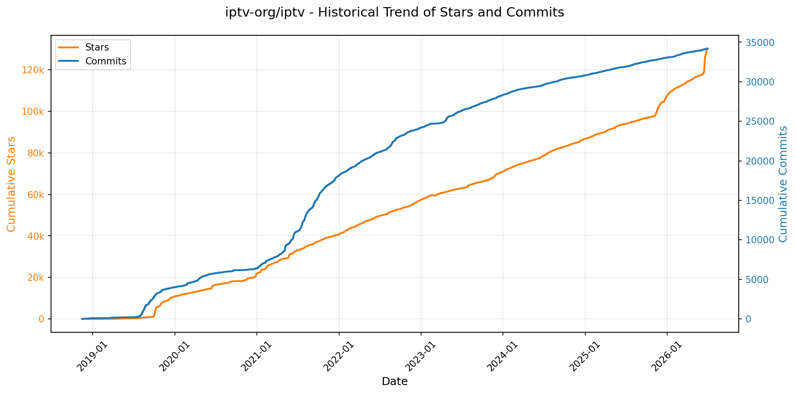

> *蓝色：累计 Stars｜橙色：累计 Commits（次 Y 轴）*

<b>📄 README 摘要</b>

1. **项目功能**  
该项目是一个全球范围的公开 IPTV（网络电视）频道资源聚合平台，核心目标是收集、整理并免费提供来自世界各国的合法公开直播流媒体频道链接。它不托管任何视频内容，仅维护结构化的 M3U 播放列表（playlist），用户可直接将链接导入支持 HLS/HTTP-Streaming 的播放器（如 VLC）进行实时观看。

2. **关键特性**  
- 提供统一主播放列表 `https://iptv-org.github.io/iptv/index.m3u`，涵盖全部收录频道；  
- 支持按国家、语言、类型等多维度分类的子播放列表（详见 `PLAYLISTS.md`）；  
- 与独立 EPG（电子节目单）项目 [`iptv-org/epg`](https://github.com/iptv-org/epg) 集成，为多数频道提供节目时间表数据；  
- 所有频道元数据（含名称、国家、语言、分辨率、URL、状态等）由专用数据库仓库 [`iptv-org/database`](https://github.com/iptv-org/database) 统一管理与校验；  
- 提供配套 RESTful API（见 [`iptv-org/api`](https://github.com/iptv-org/api)），支持程序化查询和集成；  
- 建立完善的社区协作机制：开放 GitHub Discussions、Issue 模板（含版权申诉专用流程）、详细贡献指南，并依托 Open Collective 接受赞助。

3. **技术栈**  
- **数据格式**：标准 M3U8 播放列表（UTF-8 编码，含扩展标签如 `#EXTINF`, `#EXTVLCOPT` 等）；  
- **基础设施**：基于 GitHub Pages 托管静态播放列表文件，实现零服务器部署；  
- **协作生态**：采用多仓库分离架构——主仓库（`iptv`）专注播放列表生成与发布，`database` 仓库存储结构化频道数据，`epg` 仓库负责节目单抓取与生成，`api` 仓库提供数据接口服务；  
- **自动化**：通过 GitHub Actions（如 `update.yml` 工作流）定期验证链接有效性、更新列表并同步数据；  
- **许可协议**：全项目采用 [CC0 1.0 Universal](https://creativecommons.org/publicdomain/zero/1.0/) 公共领域协议，允许自由使用、修改与分发。

---

### 5. [harry0703/MoneyPrinterTurbo](https://github.com/harry0703/MoneyPrinterTurbo)
- 📅 **创建日期**：2024-03-11  
- 🔄 **最近更新**：2026-06-22  
- ⭐ **Stars**：91,655（日 +441｜周 +3089｜月 +33896）  
- 📝 **描述**：利用AI大模型，一键生成高清短视频 Generate short videos with one click using AI LLM.  

<b>📈 Star 与 Commit 历史趋势</b>

> *蓝色：累计 Stars｜橙色：累计 Commits（次 Y 轴）*

<b>📄 README 摘要</b>

1. **项目功能**  
MoneyPrinterTurbo 是一个全自动短视频生成工具：用户仅需输入视频主题或关键词，系统即可端到端完成——AI 自动生成文案（支持中英文）、智能检索无版权高清视频素材（集成 Pexels / Pixabay / Coverr 等多源）、合成语音（支持 Edge TTS 免费方案及 Azure TTS V2 等高质量方案）、生成精准时间轴字幕（支持 Edge 对齐或本地 faster-whisper 转录）、添加可配置背景音乐，并最终合成 9:16 竖屏（1080×1920）或 16:9 横屏（1920×1080）的高清短视频。同时支持批量生成、多模型灵活切换、Web UI 与 RESTful API 双交互模式，以及一键跨平台发布至 TikTok、Instagram 和 YouTube Shorts（需 Upload-Post 账号）。

2. **核心特性**  
- ✅ 完整 MVC 架构，代码结构清晰，同时提供 Web 界面（基于 Streamlit）和标准化 API 接口；  
- ✅ 多语言文案生成（中/英），支持自定义文案覆盖 AI 输出；  
- ✅ 多尺寸输出（9:16 / 16:9）、批量视频生成、可调片段时长与字幕精细控制（字体/位置/颜色/大小/描边）；  
- ✅ 多源无版权视频素材接入（Pexels / Pixabay / Coverr），并支持本地视频导入；  
- ✅ 广泛 LLM 接入能力：兼容 OpenAI、Gemini、Claude、通义千问、文心一言、DeepSeek、MiniMax、Ollama、Moonshot、Azure、AIHubMix、one-api、gpt4free、ModelScope、Pollinations 等超 15 种模型服务；  
- ✅ 灵活语音合成方案：默认免费 Edge TTS（WebUI 中标为 “Azure TTS V1”），可选高保真 Azure Speech SDK（V2，需密钥）；  
- ✅ 双字幕引擎：轻量级 `edge` 模式（依赖 TTS 时间戳，低资源）与高精度 `whisper` 模式（本地 faster-whisper 转录，支持 large-v3-turbo / large-v3 模型）；  
- ✅ 自动化发布能力：通过 Upload-Post 实现 TikTok / Instagram / YouTube Shorts 一键上传（YouTube 自动标注 AI 生成内容）；  
- ✅ 全平台部署支持：Windows 一键包、macOS/Linux uv 原生部署、Docker 容器化、Google Colab 免环境运行，以及纯 CLI 命令行模式（无浏览器依赖）。

3. **技术栈**  
- **前端/界面层**：Streamlit（Web UI）、Swagger/Redoc（API 文档）；  
- **后端框架**：Python 3.11 为主，基于 FastAPI（API 服务）与自研脚本调度架构；  
- **AI 核心组件**：  
  - LLM 编排：适配多种 API 协议（OpenAI 兼容、Azure、自定义 endpoint）；  
  - 语音合成：Edge TTS（系统级免费）、Azure Speech SDK（V2）；  
  - 字幕生成：Edge TTS 时间戳对齐 或 faster-whisper（基于 Transformers + CTranslate2 加速）；  
- **音视频处理**：MoviePy 2.x（替代旧版 ImageMagick，字幕渲染改用 Pillow）、FFmpeg（硬依赖，自动下载或手动配置路径）；  
- **部署与依赖管理**：Docker（docker-compose.release.yml 预构建镜像）、uv（推荐的现代 Python 包/环境管理器）、pyproject.toml + uv.lock；  
- **配置与扩展**：TOML 格式配置文件（config.toml），模块化设计支持动态切换 LLM/TTS/字幕/素材源等策略；  
- **基础设施兼容性**：支持 CPU/GPU 混合推理（GPU 非必需，但加速 whisper/faster-video 处理）、跨平台（Windows/macOS/Linux）、离线/在线混合工作流（如本地 whisper 模型 + 云端 LLM）。

---

### 6. [bytedance/deer-flow](https://github.com/bytedance/deer-flow)
- 📅 **创建日期**：2025-05-07  
- 🔄 **最近更新**：2026-06-22  
- ⭐ **Stars**：73,516（日 +566｜周 +1520｜月 +3758）  
- 📝 **描述**：An open-source long-horizon SuperAgent harness that researches, codes, and creates. With the help of sandboxes, memories, tools, skill, subagents and message gateway, it handles different levels of tasks that could take minutes to hours.  

<b>📈 Star 与 Commit 历史趋势</b>

> *蓝色：累计 Stars｜橙色：累计 Commits（次 Y 轴）*

<b>📄 README 摘要</b>

1. **项目功能**  
DeerFlow 2.0 是一个开源的「超级智能体（Super Agent）运行框架」，核心目标是**统一编排子智能体（Sub-Agents）、长期记忆（Long-Term Memory）与安全沙箱（Sandbox）环境**，通过可扩展的技能系统（Extensible Skills），使 AI 系统能自主完成复杂、多步骤、跨工具、需执行与验证的端到端任务（如深度研究、代码生成与测试、数据爬取分析、自动化报告生成等）。它并非单一 LLM 应用，而是面向生产级 AI 工作流的底层基础设施，支持将大模型能力与真实世界操作（如文件读写、代码执行、网络调用、IM 交互）安全集成。

2. **关键特性**  
- **模块化子智能体协同**：支持多层级、角色化子智能体分工协作，由主智能体（Lead Agent）动态调度与编排；  
- **全栈式沙箱执行环境**：提供本地进程、Docker 容器、Kubernetes Pod 三种沙箱模式，确保代码/脚本执行隔离与安全；  
- **统一技能（Skills）与工具（Tools）体系**：内置标准化技能注册与调用机制，支持自定义工具链（如 InfoQuest 智能搜索爬虫、CLI 工具集成、MCP 协议服务）；  
- **上下文工程与推理增强**：原生支持思维链（Thinking）、推理努力（Reasoning Effort）、多轮工具调用状态保持，兼容 Qwen3、Claude、GPT 等先进推理模型；  
- **持久化长期记忆**：支持结构化记忆存储、检索与上下文注入，可对接外部向量数据库或本地文件系统；  
- **多模态 IM 渠道接入**：开箱即用支持 Telegram、Slack、飞书、企业微信、钉钉、微信（iLink）、Discord 等 7+ 主流通讯平台，无需公网 IP 即可接收任务；  
- **生产就绪部署架构**：提供 Docker 开发/生产双模式、Nginx 网关、LangGraph 兼容 API、LangSmith/Langfuse 追踪、OAuth 认证与细粒度权限控制；  
- **厂商模型深度适配**：专为 Claude Code、DeepSeek v3.2、Kimi 2.5 及 ByteDance 自研模型优化，并原生支持 OpenRouter、Responses API、vLLM、Codex CLI 等多种后端。

3. **技术栈**  
- **后端**：Python 3.12+（基于 `uv` 构建）、FastAPI、LangChain、LangGraph、Pydantic v2；  
- **前端**：Node.js 22+、React（Vite 构建）、TypeScript、Tailwind CSS；  
- **基础设施**：Docker、nginx（反向代理与网关）、PostgreSQL（可选记忆存储）、Redis（可选缓存/队列）；  
- **AI 运行时**：支持 OpenAI 兼容 API（含 Responses v1）、vLLM（0.19.0+）、Claude Code OAuth、Codex CLI、InfoQuest SDK；  
- **运维与可观测性**：Tavily 搜索集成、LangSmith / Langfuse 追踪、预置 `make` 构建系统（含 `docker-init`/`docker-start`/`up` 等一键命令）、`.env` + `config.yaml` 双层配置管理；  
- **安全与合规**：沙箱隔离执行、IM 渠道会话绑定、CSRF 防护、CORS 白名单控制、敏感凭证环境变量隔离。

---

### 7. [addyosmani/agent-skills](https://github.com/addyosmani/agent-skills)
- 📅 **创建日期**：2026-02-15  
- 🔄 **最近更新**：2026-06-22  
- ⭐ **Stars**：62,172（日 +498｜周 +5228｜月 +20173）  
- 📝 **描述**：Production-grade engineering skills for AI coding agents.  

<b>📈 Star 与 Commit 历史趋势</b>

> *蓝色：累计 Stars｜橙色：累计 Commits（次 Y 轴）*

<b>📄 README 摘要</b>

1. **该项目的功能**  
Agent Skills 是一套面向 AI 编程代理（AI coding agents）的生产级工程能力框架，旨在将资深工程师在真实软件开发中所依赖的工作流、质量关卡与最佳实践系统化、结构化并封装为可被 AI 代理一致执行的“技能”（Skills）。它不提供通用提示词或模糊建议，而是通过 24 个严格定义的 Markdown 技能文档（含验证要求、反理性化表格、退出准则），强制 AI 在每个开发阶段（定义 → 计划 → 构建 → 验证 → 审查 → 发布）遵循工程纪律，从而避免跳过规格设计、测试、安全审查等关键环节，显著提升生成代码的可靠性、可维护性与生产就绪度。

2. **核心特性**  
- **全生命周期 slash 命令驱动**：提供 8 个标准化指令（如 `/spec`、`/build auto`、`/review`、`/webperf`），一键触发对应技能工作流；`/build auto` 支持计划自动生成 + 任务自动执行（仍保持单任务测试驱动、原子提交、失败暂停）。  
- **24 个结构化技能覆盖完整工程链路**：含 1 个元技能（`using-agent-skills`）和 23 个生命周期技能，涵盖需求澄清（`interview-me`）、规格驱动开发（`spec-driven-development`）、增量实现（`incremental-implementation`）、TDD（`test-driven-development`）、API 设计（`api-and-interface-design`）、浏览器调试（`browser-testing-with-devtools`）、五维代码审查（`code-review-and-quality`）、安全加固（`security-and-hardening`）、性能优化（`performance-optimization`）、可观测性植入（`observability-and-instrumentation`）等。  
- **深度工程原则内嵌**：所有技能均融合 Google 工程实践（如 Hyrum’s Law、Beyoncé Rule、Chesterton’s Fence、Trunk-Based Development、Shift Left），并具象为可执行步骤与证据要求（如“必须提供 Core Web Vitals 测量截图”“必须标注每个 PR 的变更规模 ≤100 行”）。  
- **反理性化机制（Anti-Rationalization）**：每个技能明确列出常见逃避借口（如“我稍后补测试”）及其技术性驳斥，防止 AI 自我合理化跳步。  
- **多平台原生支持**：开箱即用适配 Claude Code、Cursor、Antigravity CLI、Gemini CLI、Windsurf、OpenCode、GitHub Copilot、Kiro 等主流 AI 编程工具，通过插件、规则目录或技能加载机制集成。  
- **专家角色协同**：预置 4 个专业化 Agent Persona（如 `code-reviewer`、`security-auditor`），可按需调用，实现多视角交叉评审。  
- **渐进式信息加载**：主技能文档（`SKILL.md`）仅含必要流程，检查清单（如 `security-checklist.md`）按需动态引用，优化上下文 token 消耗。

3. **技术栈**  
- **核心格式**：纯 Markdown（`.md`）文件，无运行时依赖，确保跨平台兼容性与最大可读性。  
- **组织结构**：模块化目录体系 — `skills/`（24 个技能）、`agents/`（4 个 Persona）、`references/`（5 大领域检查清单）、`hooks/`（会话生命周期钩子）、各工具专属命令目录（如 `.claude/commands/`、`commands/`）。  
- **集成协议**：基于主流 AI IDE/CLI 的插件机制 — Antigravity 使用 `plugin.json` 清单；Claude/Gemini 通过 `--plugin-dir` 或 `skills install` 加载；Cursor/Windsurf 直接读取规则文件；Copilot 采用 `.github/copilot-instructions.md` 系统提示注入。  
- **哲学基础**：深度借鉴《Software Engineering at Google》及 Google 工程实践指南，强调可验证性（Verification-first）、过程导向（Process-over-prose）、工程纪律（Discipline-as-code），而非泛化提示工程。

---

### 8. [koala73/worldmonitor](https://github.com/koala73/worldmonitor)
- 📅 **创建日期**：2026-01-08  
- 🔄 **最近更新**：2026-06-22  
- ⭐ **Stars**：58,852（日 +490｜周 +1756｜月 +3599）  
- 📝 **描述**：Real-time global intelligence dashboard. AI-powered news aggregation, geopolitical monitoring, and infrastructure tracking in a unified situational awareness interface  

<b>📈 Star 与 Commit 历史趋势</b>

> *蓝色：累计 Stars｜橙色：累计 Commits（次 Y 轴）*

<b>📄 README 摘要</b>

1. **项目功能**  
World Monitor 是一个实时全球态势感知仪表盘，旨在整合多源情报并提供统一的决策支持界面。它通过 AI 技术聚合、提炼和关联来自全球的新闻、地缘政治、经济、军事、灾害、能源、航空、网络与基础设施等领域的动态数据，生成结构化简报与风险信号。核心能力包括：对 500+ 精选新闻源（覆盖 15 类主题）进行 AI 摘要；基于双地图引擎（3D 球体 globe.gl + WebGL 平面地图 deck.gl）实现 56 种地理图层可视化；跨领域事件关联分析（如军事部署与金融市场波动的同步检测）；为 31 个一级国家计算权威、服务端生成的“国家不稳定指数”（CII v8）；集成金融雷达（覆盖 29 个交易所、大宗商品、加密货币及 7 维市场复合信号）；支持本地运行大模型（Ollama），无需外部 API 密钥；同一代码库支撑 6 个垂直变体站点（全球版、科技版、金融版、商品版、幸福指数版、能源版）；提供原生跨平台桌面应用（Tauri 2 构建，支持 macOS/Windows/Linux）；全面支持 24 种语言（含 RTL 布局与本地化信源）。

2. **关键特性**  
- **AI 驱动的新闻智能聚合**：自动合成多源新闻为可操作简报，降低信息过载。  
- **双引擎地理可视化系统**：兼顾沉浸式 3D 全球视图与高性能 WebGL 平面地图，支持 56 类专业图层（如军事基地、电网、航运路线、火山活动等）。  
- **跨域信号融合分析**：自动识别军事调动、经济指标异常、自然灾害与冲突升级等多维信号的时空收敛模式。  
- **国家稳定性量化评估（CII v8）**：基于 31 个国家的多维压力因子（政治、经济、社会、安全等）构建服务器端权威评分体系。  
- **全栈本地 AI 支持**：默认集成 Ollama，支持离线运行 LLM 进行摘要、推理与交互，零依赖外部云 API。  
- **六合一变体架构**：单一代码库编译生成 world/tech/finance/commodity/happy/energy 六个独立域名站点，共享核心逻辑与 UI。  
- **原生桌面客户端**：基于 Tauri 2（Rust）构建，轻量、安全、跨平台，支持离线使用与系统级集成。  
- **企业级数据治理能力**：内置 freshness monitor 监控 35 组信源更新状态；支持 Protocol Buffers 定义的 276 个数据协议与 34 个微服务接口；三级缓存（Redis + CDN + Service Worker）保障低延迟响应。  

3. **技术栈**  
- **前端**：Vanilla TypeScript + Vite 构建；3D 可视化采用 globe.gl（基于 Three.js）；2D 地图采用 deck.gl + MapLibre GL；无框架化设计强调性能与可控性。  
- **桌面端**：Tauri 2（Rust 主进程）+ Node.js 辅助侧车（sidecar），实现安全 IPC 通信与本地资源访问。  
- **AI/ML 层**：本地运行 Ollama；可选对接 Groq / OpenRouter 等远程推理服务；浏览器端集成 Transformers.js 实现轻量模型推理。  
- **API 与通信**：全栈基于 Protocol Buffers 定义强类型接口（276 个 proto 文件，34 个 gRPC/HTTP 服务）；使用 sebuf 注解实现 HTTP 路由与元数据声明。  
- **部署与基础设施**：Vercel Edge Functions（60+ 边缘函数）处理实时请求；Railway 作为后端中继；PWA 支持离线缓存；Docker 与 Vercel 提供一键自托管方案。  
- **缓存与性能**：Upstash Redis 作为主缓存层；结合 CDN 边缘缓存与 Service Worker 离线策略，形成三级缓存体系。

---

### 9. [tw93/Pake](https://github.com/tw93/Pake)
- 📅 **创建日期**：2022-10-14  
- 🔄 **最近更新**：2026-06-22  
- ⭐ **Stars**：56,391（日 +1304｜周 +5975｜月 +7682）  
- 📝 **描述**：🤱🏻 Turn any webpage into a desktop app with one command.  

<b>📈 Star 与 Commit 历史趋势</b>

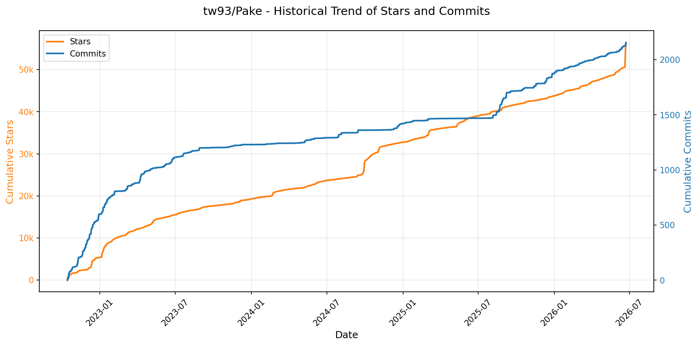

> *蓝色：累计 Stars｜橙色：累计 Commits（次 Y 轴）*

<b>📄 README 摘要</b>

1. **项目功能**  
Pake 是一个将任意网页一键打包为跨平台桌面应用程序的工具，支持 macOS、Windows 和 Linux 三大操作系统。用户无需编写代码或配置复杂环境，只需一条命令（如 `pake https://example.com --name MyApp`）即可生成原生体验的桌面应用，适用于快速封装 Web 应用（如 ChatGPT、YouTube、WeRead 等）为独立可分发的安装包（`.dmg` / `.msi` / `.deb`）。

2. **核心特性**  
- **极致轻量**：基于 Tauri 构建，安装包体积通常低于 10MB，约为 Electron 方案的 1/20；  
- **高性能低开销**：Rust 后端保障启动快、内存占用低、响应迅速；  
- **开箱即用**：支持 CLI 一键打包与免环境的在线构建（GitHub Actions），零配置快速上手；  
- **丰富功能集成**：内置快捷键导航（前进/后退/刷新/缩放等）、沉浸式窗口、标题栏隐藏、拖拽文件上传、广告过滤、自定义图标/尺寸/样式、开发者工具（Debug 模式）等；  
- **多平台原生体验**：适配各系统 UI 规范（如 macOS 全屏手势、标题栏拖动、菜单栏控制），提供完整快捷键映射表。

3. **技术栈**  
- **核心框架**：Rust + [Tauri](https://tauri.app/)（替代 Electron 的轻量级桌面应用框架）；  
- **前端层**：Web 技术（HTML/CSS/JS），直接渲染目标网页，支持现代浏览器特性；  
- **构建与工具链**：  
  - 包管理：pnpm；  
  - CLI 工具：`pake-cli`（TypeScript 实现）；  
  - 构建自动化：GitHub Actions（支持在线打包）；  
- **开发依赖**：Rust ≥1.85、Node.js ≥22（LTS，≥18 兼容）；  
- **许可证**：GPL-3.0 开源协议（含 Pake Output Exception，允许用户自由分发所打包的应用）。

---

### 10. [byoungd/English-level-up-tips](https://github.com/byoungd/English-level-up-tips)
- 📅 **创建日期**：2017-05-30  
- 🔄 **最近更新**：2026-06-22  
- ⭐ **Stars**：54,031（日 +202｜周 +705｜月 +10073）  
- 📝 **描述**：An advanced guide to learn English which might benefit you a lot 🎉 . 人生进阶指南 离谱的人生 离谱的英语学习指南/英语学习教程/英语学习/学英语  

<b>📈 Star 与 Commit 历史趋势</b>

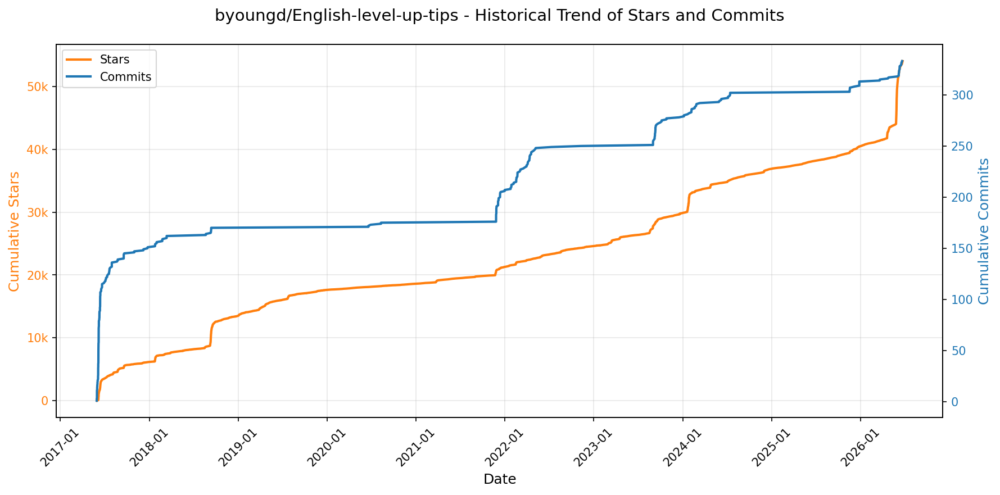

> *蓝色：累计 Stars｜橙色：累计 Commits（次 Y 轴）*

<b>📄 README 摘要</b>

1. **该项目做什么？**  
该项目是一个面向英语学习者的进阶型、实战导向的免费开源学习指南（《离谱的英语学习指南》），核心目标是帮助学习者突破传统低效方法，基于认知科学原理与真实语言习得规律，构建系统化、可持续的英语能力提升路径。它不仅涵盖听、说、读、写、词汇、理解六大基础维度，更独创性地将AI深度整合进全流程学习闭环——尤其聚焦2026年最新AI工具生态（如Gemini、ChatGPT、Claude等），提供可落地的“AI协同训练链路”，使AI从翻译辅助升级为个性化教练、反馈引擎和持续训练伙伴。项目同时承载作者个人叙事与价值观表达，强调“热爱驱动学习”与“技术普惠实体”，延伸出AI赋能农业、农村合作社培训等社会实践方向。

2. **关键特性**  
- **CEFR对标的结构化学习地图**：严格依据欧洲共同语言参考框架（CEFR）划分能力等级，章节模块清晰（理解→词汇→听说读写→AI应用→词表→番外），支持按需跳转与循序渐进；  
- **AI-native学习范式革新**：第七章“AI”为全指南核心亮点，摒弃泛泛而谈的Prompt技巧，系统回答四大实操问题：Gemini作为主引擎的底层逻辑、多AI工具（Gem/Canvas/Quiz/Flashcards等）串联的端到端训练链路、跨模型分工协作策略（ChatGPT/Claude/Perplexity/DeepL Write角色定位）、抗遗忘的长期听说读写闭环设计；  
- **强实践性与本土化适配**：资源推荐直指国内用户痛点——主推国产AI网关[token.love](https://token.love)（支持国产/国际大模型统一接入、智能路由、私有化部署、数据不出域），辅以稳定可信的AI接口平台[ku0.com](https://ku0.com)；  
- **人格化叙事与价值延伸**：以作者真实经历（备考、高考、创业、情感）为锚点，将语言学习升华为认知成长与社会责任实践，同步推进“AI+实体经济”落地（如农村AI免费培训），实现教育内容与社会行动的双重输出。

3. **技术栈**  
- **内容交付层**：GitHub Pages静态站点 + GitBook在线文档平台 + 知乎专栏，支持多端阅读；  
- **内容组织与协作**：Markdown文档体系（含`docs/`目录结构化分章）、SVG图标导航、嵌入式图片与外部链接管理；  
- **配套技术生态（非项目代码栈，但属核心支撑）**：  
  - AI基础设施：token.love（OpenAI兼容API网关，集成Qwen、GLM、Gemini、GPT、Claude等多模型）、ku0.com（AI账户与接口服务）；  
  - 工具链：Gemini Advanced、ChatGPT、Claude、Perplexity、DeepL Write、Google Live/Canvas/Quiz/Flashcards等AI原生学习组件；  
- **许可协议**：知识共享署名-非商业性使用4.0国际许可（CC BY-NC 4.0），明确拒绝商业化赞助，强调公益属性。

---

### 11. [makeplane/plane](https://github.com/makeplane/plane)
- 📅 **创建日期**：2022-11-19  
- 🔄 **最近更新**：2026-06-22  
- ⭐ **Stars**：52,802（日 +183｜周 +1592｜月 +2967）  
- 📝 **描述**：🔥🔥🔥 Open-source Jira, Linear, Monday, and ClickUp alternative. Plane is a modern project management platform to manage tasks, sprints, docs, and triage.  

<b>📈 Star 与 Commit 历史趋势</b>

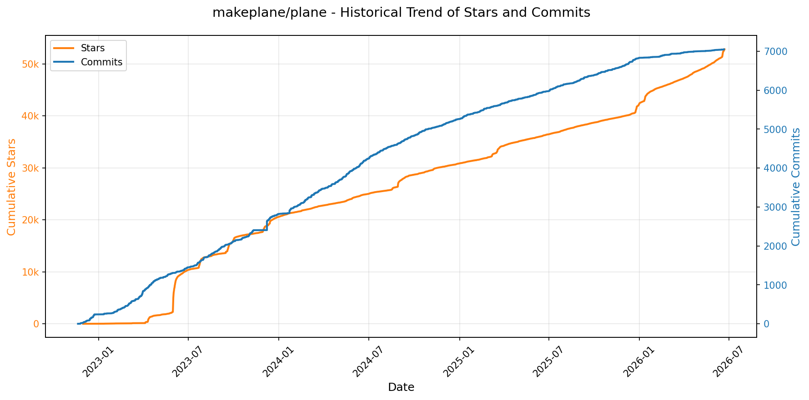

> *蓝色：累计 Stars｜橙色：累计 Commits（次 Y 轴）*

<b>📄 README 摘要</b>

1. **项目功能**  
Plane 是一款开源的现代化项目管理工具，旨在帮助各类团队高效跟踪问题（Issues）、组织迭代周期（Cycles，替代传统“Sprints”）、规划产品路线图（Roadmaps），同时大幅降低工具本身的使用与管理复杂度。它提供一体化工作流，覆盖任务管理、模块拆分、动态视图、知识沉淀（Pages）及数据洞察（Analytics），支持从轻量级协作到中大型工程团队的全场景需求。

2. **核心功能**  
- **工作项（Work Items）**：支持富文本编辑、文件上传、子属性扩展及跨任务引用，实现精细化任务管理；  
- **周期（Cycles）**：以灵活的“Cycle”替代固定 Sprint，内置燃尽图等进度可视化工具，助力敏捷节奏把控；  
- **模块（Modules）**：将大型项目拆分为可独立追踪与交付的逻辑单元，提升复杂项目治理能力；  
- **视图（Views）**：支持自定义过滤器、保存与共享个性化视图，快速聚焦关键任务；  
- **页面（Pages）**：集成 AI 辅助的富文本笔记系统，支持图文混排、超链接、内容转任务等，实现想法→行动闭环；  
- **分析（Analytics）**：提供实时、多维度的数据看板，涵盖完成率、耗时、阻塞点等指标，驱动数据化决策。

3. **技术栈**  
- **前端**：React（主框架）、React Router（路由管理）；  
- **后端**：Django（Python Web 框架，负责 API 服务、权限、业务逻辑）；  
- **运行时/部署**：Node.js（支撑部分服务与工具链）、Docker（官方推荐的一键部署方案）、Kubernetes（面向生产环境的高可用集群部署）；  
- **其他关键能力**：基于自研“God Mode”的实例级管理后台，支持管理员深度配置；全栈采用开源许可（AGPLv3），保障代码自由与可审计性。

---

### 12. [penpot/penpot](https://github.com/penpot/penpot)
- 📅 **创建日期**：2015-12-29  
- 🔄 **最近更新**：2026-06-22  
- ⭐ **Stars**：52,355（日 +764｜周 +2696｜月 +4226）  
- 📝 **描述**：Penpot: The open-source design tool for design and code collaboration  

<b>📈 Star 与 Commit 历史趋势</b>

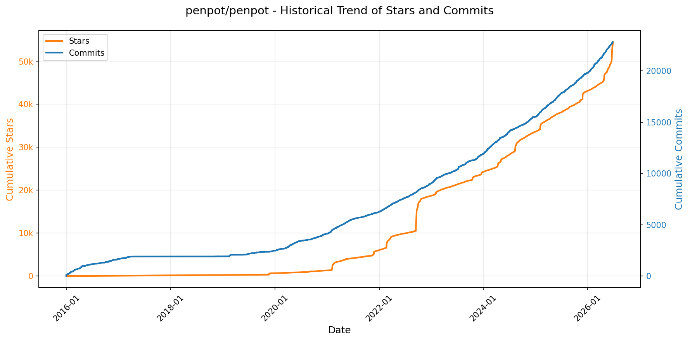

> *蓝色：累计 Stars｜橙色：累计 Commits（次 Y 轴）*

<b>📄 README 摘要</b>

1. **该项目做什么？**  
Penpot 是一个面向规模化数字产品团队的**开源设计与原型平台**，核心目标是提供**完全自主可控的设计基础设施**。它支持浏览器直接使用或在组织自有服务器上**全量自托管**，使团队对设计数据、流程和合规性拥有绝对控制权，彻底规避厂商锁定（vendor lock-in）。平台聚焦于打通设计、开发与AI工作流，让设计成果可被开发者直接理解、被AI工具解析，并能无缝转化为真实代码，从而加速产品交付。

2. **关键功能**  
- ✅ **全栈式设计能力**：原生支持 CSS Grid / Flex 布局，设计即响应式代码；内置「设计令牌（Design Tokens）」作为设计与开发的单一可信源，保障跨平台 UI 一致性与可维护性；支持组件（Components）与变体（Variants）驱动的规模化设计系统建设。  
- ✅ **实时协同与开发者友好**：多人实时协作编辑；独创「检查模式（Inspect Mode）」，一键查看 SVG/CSS/HTML 源码，实现设计即代码（design-as-code）；支持本地化开发体验（如 Gitpod 一键启动）。  
- ✅ **开放可编程生态**：提供**开放 API** 和插件系统（Penpot Hub），支持 Webhook 集成；通过 **MCP（Model Control Protocol）服务器**实现设计 ↔ 代码双向同步，赋能 AI 辅助生成、自动化测试、CI/CD 流水线集成等高级场景。  
- ✅ **部署灵活、标准开放**：纯前端基于开放 Web 标准（SVG/CSS/HTML/JSON），后端可部署于 Docker/Kubernetes/Elestio 等任意环境，真正实现“部署无关”（deployment-agnostic）。

3. **技术栈**  
- **前端**：TypeScript + React（基于现代 Web 标准构建，深度依赖 SVG 渲染与 CSS 布局引擎）  
- **后端**：Clojure（高性能、函数式、适合高并发实时协作场景）  
- **基础设施**：支持容器化（Docker）、编排（Kubernetes）、云原生部署；自托管方案兼容主流云与私有环境  
- **协议与标准**：原生遵循 SVG、CSS、HTML、JSON 等开放格式；API 基于 REST/HTTP，支持 OAuth2 访问令牌认证；MCP 协议定义设计与代码间语义互通机制  
- **许可证**：Mozilla Public License 2.0（MPL-2.0），保障开源自由与商用合规

---

### 13. [colbymchenry/codegraph](https://github.com/colbymchenry/codegraph)
- 📅 **创建日期**：2026-01-18  
- 🔄 **最近更新**：2026-06-22  
- ⭐ **Stars**：50,468（日 +318｜周 +3600｜月 +36037）  
- 📝 **描述**：Pre-indexed code knowledge graph, auto syncs on code changes, for Claude Code, Codex, Gemini, Cursor, OpenCode, AntiGravity, Kiro, and Hermes Agent — fewer tokens, fewer tool calls, 100% local  

<b>📈 Star 与 Commit 历史趋势</b>

> *蓝色：累计 Stars｜橙色：累计 Commits（次 Y 轴）*

<b>📄 README 摘要</b>

1. **该项目做什么？**  
CodeGraph 是一个本地化、轻量级的语义代码智能增强平台，专为 AI 编程代理（如 Claude Code、Cursor、Codex、Hermes Agent、Gemini 等）设计。它通过在本地构建并实时维护一个高精度、多语言的代码知识图谱（含符号关系、调用链、控制流、框架路由及跨语言桥接），使 AI 代理无需反复执行 `grep`/`find`/`read` 等昂贵工具调用即可直接、精准地回答架构级问题（例如“某功能如何实现？”“修改此处会影响哪些模块？”）。其核心价值是将 AI 编程代理的代码理解过程从“盲搜+试读”升级为“图谱驱动的语义查询”，实现零数据出域、零依赖外部服务的高性能本地增强。

2. **关键特性**  
- **智能上下文生成**：单次 `codegraph_explore` 调用即可返回入口点、相关符号及代码片段，消除探索型子代理开销；  
- **全量全文搜索（FTS5）**：毫秒级跨整个代码库按名称检索符号、函数、类等；  
- **影响范围分析**：支持正向/反向调用链追踪，精确计算任意符号的变更影响半径；  
- **全自动实时同步**：基于操作系统原生文件监听（FSEvents/inotify/ReadDirectoryChangesW），带防抖机制与三重一致性保障（实时监听 + 待同步文件显式标注 + 启动时哈希校验），确保图谱始终与源码严格一致；  
- **20+语言深度支持**：覆盖 TypeScript/JS、Python、Go、Rust、Java、C#、Swift、Kotlin 等主流及小众语言；  
- **框架感知路由建模**：自动识别并关联 17 种 Web 框架（Django、FastAPI、Express、Spring、Rails 等）的 URL 路由与处理器；  
- **跨语言桥接建模**：独家支持 iOS（Swift↔ObjC）、React Native（JS↔Native 桥接、TurboModules、Fabric 视图组件）、Expo Modules 等混合栈的端到端调用链贯通；  
- **100% 本地运行**：所有索引存于本地 SQLite 数据库，不上传任何代码、不需 API Key、无外部网络依赖。

3. **技术栈**  
- **核心引擎**：Rust（高性能图谱构建与查询）、Tree-sitter（多语言 AST 解析）、SQLite（持久化存储，启用 FTS5 全文检索）；  
- **文件监听**：macOS 使用 FSEvents、Linux 使用 inotify、Windows 使用 ReadDirectoryChangesW，配合可配置防抖（默认 2s）；  
- **跨语言桥接逻辑**：基于语言规范与框架 DSL 的规则引擎（如 Swift `@objc` 桥接规则、RN Codegen 接口解析、Expo 模块声明提取）；  
- **MCP（Model Context Protocol）集成**：作为标准 MCP 服务器，与支持 MCP 的 AI 编程代理无缝对接；  
- **部署形态**：自包含二进制 CLI（无需 Node.js 运行时，跨平台预编译），亦支持 npm 全局安装；  
- **前端/文档**：静态网站（GitHub Pages），使用 Markdown + 自定义构建流程。

---

### 14. [Leonxlnx/taste-skill](https://github.com/Leonxlnx/taste-skill)
- 📅 **创建日期**：2026-02-19  
- 🔄 **最近更新**：2026-06-22  
- ⭐ **Stars**：48,558（日 +543｜周 +4654｜月 +30017）  
- 📝 **描述**：Taste-Skill - gives your AI good taste. stops the AI from generating boring, generic slop   

<b>📈 Star 与 Commit 历史趋势</b>

> *蓝色：累计 Stars｜橙色：累计 Commits（次 Y 轴）*

<b>📄 README 摘要</b>

1. **项目功能**  
Taste Skill 是一个面向 AI 编程代理（如 ChatGPT、Claude Code、Codex、Cursor）的「反平庸前端技能库」，旨在提升 AI 生成的用户界面质量。它不构建运行时框架，而是提供一系列可插拔、可组合的 **Agent Skills（代理技能）**，用于指导 AI 生成更具设计感、专业级的前端代码或设计参考图。核心目标是消除 AI 常见的“slop”（粗糙、平庸、模板化、缺乏视觉层次与节奏感）问题，通过强化布局逻辑、排版规范、动效质感、间距系统与视觉密度控制，产出更接近人类设计师水准的 UI 实现或视觉方案。

2. **关键特性**  
- **模块化技能体系**：包含 12+ 个独立技能，分为两类：  
  • *实现类技能*（如 `design-taste-frontend` v2）：输出可直接集成的前端代码（含 GSAP 动画骨架、严格预检协议、硬破折号禁用、设计语言推断等）；  
  • *图像生成类技能*（如 `imagegen-frontend-web`）：专为 AI 图像生成器（如 ChatGPT Images）定制提示词，产出网页/移动端/品牌手册级参考图板（comps/mockups/brand kits）。  
- **可调设计参数**：核心技能（如 `taste-skill`）支持三档数值化调节（1–10 分）：`DESIGN_VARIANCE`（布局实验性）、`MOTION_INTENSITY`（动效深度）、`VISUAL_DENSITY`（视口信息密度），实现设计风格精准调控。  
- **工作流适配能力**：支持多种开发范式——绿场新建（greenfield）、现有项目重构（`redesign-existing-projects`）、图像驱动开发（`image-to-code-skill`）、多代理协同（先图后码）、输出完整性保障（`full-output-enforcement`）。  
- **框架无关与跨平台兼容**：规则聚焦设计意图而非具体技术栈，原生适配 React/Vue/Svelte 等主流框架；技能以标准 `SKILL.md` 格式封装，可通过 `npx skills add` 统一安装，亦支持手动复制粘贴至对话中使用。  
- **版本演进与向后兼容**：v2 为实验性重大重构，同时保留 v1 供旧项目锁定使用（`design-taste-frontend-v1`），并提供详细变更日志与迁移指南。

3. **技术栈**  
- **交付格式**：纯文本 `SKILL.md` 文件（含 YAML frontmatter），无运行时依赖，本质是结构化提示工程（Prompt Engineering）资产。  
- **集成方式**：基于 [`vercel-labs/agent-skills`](https://github.com/vercel-labs/agent-skills) 规范，依赖其官方 CLI 工具 `npx skills add` 进行技能发现与加载。  
- **依赖生态**：深度协同主流 AI 编程工具链——ChatGPT（含图像生成模式）、Claude Code、Codex、Cursor；动效部分默认采用 GSAP（GreenSock Animation Platform）作为参考实现标准。  
- **辅助技术**：配套提供 `DESIGN.md` 导出格式（Google Stitch 兼容）、研究文档（`research/` 目录）、Changelog 与 Star History 可视化，全部基于静态文件托管（GitHub Pages / Vercel）。  
- **许可证**：MIT 开源协议，由个人开发者 Leonxlnx 主导维护。

---

### 15. [mvanhorn/last30days-skill](https://github.com/mvanhorn/last30days-skill)
- 📅 **创建日期**：2026-01-23  
- 🔄 **最近更新**：2026-06-22  
- ⭐ **Stars**：45,772（日 +311｜周 +3293｜月 +19340）  
- 📝 **描述**：AI agent skill that researches any topic across Reddit, X, YouTube, HN, Polymarket, and the web - then synthesizes a grounded summary  

<b>📈 Star 与 Commit 历史趋势</b>

> *蓝色：累计 Stars｜橙色：累计 Commits（次 Y 轴）*

<b>📄 README 摘要</b>

1. **项目功能**  
`/last30days` 是一个由 AI 代理驱动的实时信息聚合与智能研判系统，专为捕捉“过去30天内真实发生的事”而设计。它不依赖传统搜索引擎的编辑规则或SEO权重，而是并行调用 Reddit、X（Twitter）、YouTube、TikTok、Instagram Reels、Hacker News、Polymarket、GitHub、Digg、Threads、Pinterest、Bluesky、Perplexity 及开放网页等十余个异构数据源，自动抓取原始内容（如帖子、评论、视频字幕、交易市场赔率、PR记录、招聘页等），基于真实用户行为信号（点赞数、转发量、投票金额、观看时长、合并率、星标数等）进行动态加权评分，并由AI代理完成跨平台事实对齐、语义聚类与深度合成，最终生成结构清晰、证据可溯、带权威引用的简明研判报告（支持 Markdown 和自包含 HTML 格式）。其核心价值是：**替代人工信息扫掠，以“人的真实反馈”为标尺，回答“最近一个月世界/某人/某事到底在发生什么”。**

2. **关键特性**  
- **多源智能协同检索**：支持14+平台（含Reddit免密JSON、Polymarket真金投注、GitHub PR速率分析、YouTube全字幕搜索、TikTok高传播力内容识别等），所有数据源均可按需启用/禁用（通过环境变量如 `EXCLUDE_SOURCES` 控制）。  
- **实体智能解析（v3核心升级）**：内置 Python 预研大脑，能自动将模糊查询（如“OpenClaw”）解析为关联人物（@steipete）、社区（r/openclaw）、频道、标签等精准目标，实现“理解先于搜索”。  
- **跨源事件聚类**：自动识别同一事件在不同平台的表述差异（如标题措辞不同），合并为统一叙事单元，避免信息重复。  
- **双维度评分机制**：除基础相关性外，新增“趣味性/传播力”独立评分模型（Fun Judge v2），确保“最佳观点”（Best Takes）自然融入主报告，而非孤立罗列。  
- **场景化输出能力**：  
  - ✅ 一键生成离线可用、暗色模式、无JS依赖的 HTML 简报（含元数据、引用、引擎水印、重跑提示）；  
  - ✅ 支持单次运行完成多实体对比（如 `/last30days OpenAI vs Anthropic vs xAI`），耗时从12+分钟降至3分钟；  
  - ✅ 自动发现竞品（`--competitors`）并并行执行三路深度分析；  
  - ✅ GitHub “人物模式”：对人名查询自动切换为作者级分析（PR数量/合并率/主导项目/发布日志）；  
  - ✅ ELI5 模式：一键切换为零术语、口语化表达，保留全部数据与引用；  
- **鲁棒性工程设计**：Reddit 超时熔断、Polymarket 关键词消歧、YouTube 字幕回退策略、作者条目上限（防信息垄断）、1012项自动化测试保障稳定性。  

3. **技术栈**  
- **运行时框架**：基于 [Agent Skills](https://agentskills.io) 开放标准构建，兼容 Claude Code（首选）、Codex、Cursor、GitHub Copilot、Gemini CLI、OpenClaw、Claude Desktop（MCP 协议）等50+主流AI开发环境；  
- **核心语言**：Python（预研脑、引擎调度、数据清洗、聚类算法、HTML生成器）；  
- **API 与服务集成**：  
  - 免密：Reddit 公共 JSON API；  
  - 密钥驱动：SCRAPECREATORS_API_KEY（统一支撑 TikTok/Instagram/Threads/YouTube 评论与字幕）、PERPLEXITY_API_KEY（或 OPENROUTER_API_KEY 作备选）、GitHub API、Polymarket API、Digg CLI（`digg-pp-cli`）；  
- **前端/交付层**：纯静态 HTML（内联 CSS + Inter/JetBrains Mono 字体 + 系统字体降级），零 JavaScript，完全离线可用；  
- **协议与标准**：Model Context Protocol（MCP）用于 Claude Desktop 扩展；遵循 Agent Skills CLI 规范（`npx skills`）；支持 MCPB 二进制分发包。

---

### 16. [asgeirtj/system_prompts_leaks](https://github.com/asgeirtj/system_prompts_leaks)
- 📅 **创建日期**：2025-05-03  
- 🔄 **最近更新**：2026-06-22  
- ⭐ **Stars**：44,856（日 +505｜周 +2246｜月 +3951）  
- 📝 **描述**：Extracted system prompts from Anthropic - Claude Fable 5, Opus 4.8, Claude Code, Claude Design. OpenAI - ChatGPT 5.5 Thinking, GPT 5.5 Instant, Codex. Google - Gemini 3.5 Flash, 3.1 Pro, Antigravity. xAI - Grok, Cursor, Copilot, VS Code, Perplexity, and more. Updated regularly.  

<b>📈 Star 与 Commit 历史趋势</b>

> *蓝色：累计 Stars｜橙色：累计 Commits（次 Y 轴）*

<b>📄 README 摘要</b>

1. **项目功能**  
该项目是一个开源知识库，系统性地收集、整理并公开主流大语言模型（LLM）及其AI产品的**系统提示词（System Prompts）**——即模型在后台实际运行时所遵循的隐式指令与行为约束。内容覆盖ChatGPT（OpenAI）、Claude（Anthropic）、Gemini（Google）、Grok（xAI）、Perplexity、Microsoft Copilot、Cursor、Meta AI、Mistral、Notion AI、Qwen等数十家厂商的上百个模型与产品变体（如GPT-5.5 Codex、Claude Fable 5、Gemini 3.5 Flash、Grok Expert等），包含不同版本、工具增强版、API专用版、CLI/桌面/浏览器集成版等多种形态，并提供官方发布原始提示、无工具精简版、原始未格式化文本（raw）、可视化分析及跨版本差异比对（Diff）等功能。

2. **核心特性**  
- **全面覆盖与高频更新**：持续追踪并收录最新发布的模型系统提示（如2026年6月18日更新的GitHub Copilot for macOS、Claude Design、GPT-5.5 Codex等），支持按厂商、模型、版本、使用场景（如Code、Design、Cowork、Computer）多维分类浏览；  
- **结构化对比与溯源**：提供同一模型不同版本间的精确差异比对（如Claude Opus 4.8 → Fable 5的Diff链接），区分“官方发布版”与“实测提取版”，标注来源（如Anthropic官方文档路径、实测泄漏截图验证）；  
- **精细化分层归档**：对每个模型提供多层级提示变体——含工具版/无工具版、Thinking/Instant/API/Pro API模式、人格化设定（Friendly/Pragmatic/Cynical等）、安全策略（图像安全、自动化上下文）、内置技能（Glob/Grep、Deep Research、Canvas等）及底层原始文本（raw）；  
- **开放协作机制**：明确欢迎Pull Request（PRs Welcome），支持社区贡献新提示、修正或补充，并通过GitHub星标趋势、周访问量、最后提交时间等指标体现项目活跃度与可信度。

3. **技术栈**  
项目本质为**静态文档型开源仓库**，无复杂后端或前端应用逻辑，技术实现高度轻量：  
- **核心载体**：纯Markdown（`.md`）文件，按厂商（Anthropic/、OpenAI/、Google/等）和子模块（Codex/、Claude Code/、Official/、raw/等）组织目录结构；  
- **展示与交互**：依赖GitHub原生渲染能力呈现文档，辅以外部服务嵌入动态徽章（如Star History图表、Views per Week统计图、X/Twitter链接、邮箱Badgen）；  
- **差异化工具**：集成第三方比对服务（Diffchecker）生成版本差异链接；  
- **构建与维护**：基于GitHub Actions自动化更新部分统计徽章（如traffic图），其余完全由人工维护与版本管理，无自定义构建脚本或CI/CD流水线。

---

### 17. [chopratejas/headroom](https://github.com/chopratejas/headroom)
- 📅 **创建日期**：2026-01-07  
- 🔄 **最近更新**：2026-06-22  
- ⭐ **Stars**：44,798（日 +2488｜周 +16991｜月 +42869）  
- 📝 **描述**：Compress tool outputs, logs, files, and RAG chunks before they reach the LLM. 60-95% fewer tokens, same answers. Library, proxy, MCP server.  

<b>📈 Star 与 Commit 历史趋势</b>

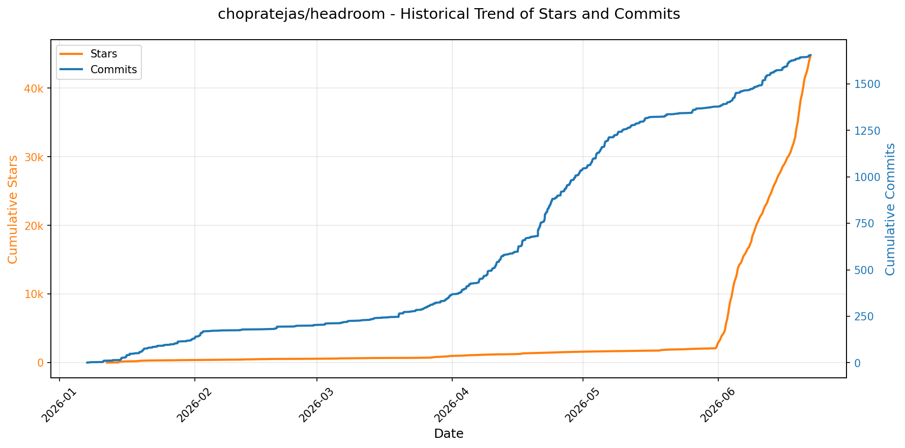

> *蓝色：累计 Stars｜橙色：累计 Commits（次 Y 轴）*

<b>📄 README 摘要</b>

1. **项目功能**  
Headroom 是一个面向 AI 代理（AI agents）的上下文压缩层，专为大幅减少大语言模型（LLM）输入/输出阶段的 token 消耗而设计。它在 AI 代理与 LLM 之间实时拦截并压缩所有上下文数据——包括工具输出、日志、RAG 检索片段、文件内容、对话历史等——再将压缩后的提示（prompt）发送至 LLM；同时支持**可逆压缩（CCR）**，原始内容被本地缓存，LLM 可按需调用 `headroom_retrieve` 动态还原。此外，它还首创性地实现**输出 token 削减**：通过“简洁性引导”（verbosity steering）和“努力路由”（effort routing），智能裁剪模型生成的冗余内容（如重复代码、仪式性前言、例行步骤的过度推理），显著降低输出侧成本（尤其在 Opus 级模型中，输出成本可达输入的 5 倍）。

2. **核心特性**  
- **多模式集成**：支持库调用（Python/TS）、零代码代理（`headroom proxy`）、一键代理封装（`headroom wrap` 各主流编码代理）、MCP 标准服务（提供 `headroom_compress`/`headroom_retrieve`/`headroom_stats` 等标准方法）。  
- **跨代理共享内存**：Claude、Codex、Gemini、Cursor 等不同代理可共用同一本地压缩上下文存储，自动去重并保留来源追踪。  
- **6 种专用压缩算法协同工作**：  
  - `SmartCrusher`：通用 JSON 结构化数据压缩；  
  - `CodeCompressor`：基于 AST 的多语言（Python/JS/Go/Rust/Java/C++）代码感知压缩；  
  - `Kompress-base`：Hugging Face 开源微调模型（`chopratejas/kompress-v2-base`），专为 AI 代理轨迹文本优化；  
  - `CacheAligner`：稳定 prompt 前缀以提升 Anthropic/OpenAI KV 缓存命中率；  
  - `IntelligentContext`：基于重要性评分的动态上下文适配；  
  - `CCR（Content-Cache Retrieval）`：本地可逆存储 + 按需检索机制。  
- **自适应学习能力**：`headroom learn` 自动分析失败会话，生成修正知识（写入 `CLAUDE.md`/`AGENTS.md` 等），并支持从用户交互行为（如中断长回复）中学习个性化简洁度偏好。  
- **输出 token 精确量化**：提供带置信区间的输出节省估算（`headroom output-savings`），支持可控对照组（`HEADROOM_OUTPUT_HOLDOUT`）实现真实测量。  
- **企业级兼容性**：原生支持 GitHub Copilot CLI 订阅模式（OAuth 令牌交换+端点路由）、GitHub Enterprise Server、Docker/CI 安全凭证注入，并适配 SSL 检查等企业网络环境。

3. **技术栈**  
- **语言与运行时**：Python 3.10+（主逻辑、CLI、SDK）、TypeScript/Node.js（客户端库）、Rust（高性能核心组件，含 ONNX Runtime 加速推理）；Apple GPU 支持通过 `pytorch_mps` 实现嵌入器卸载。  
- **模型与 AI 组件**：自研 Hugging Face 模型 [`kompress-v2-base`](https://huggingface.co/chopratejas/kompress-v2-base)（文本压缩）、ONNX Runtime（推理加速）、AST 解析器（多语言代码理解）。  
- **架构协议**：完全兼容 MCP（Model Context Protocol）标准；深度集成 Anthropic / OpenAI SDK、Vercel AI SDK、LiteLLM、LangChain、Agno、Strands 等主流生态；支持 ASGI 中间件、MCP 客户端、多代理共享上下文（`SharedContext`）。  
- **部署与分发**：PyPI（`headroom-ai`）、npm（`headroom-ai`）、Docker（`ghcr.io/chopratejas/headroom`）、预编译 wheel 包；支持 pipx、uv、PowerShell、devcontainer 等多种安装场景。

---

### 18. [ZhuLinsen/daily_stock_analysis](https://github.com/ZhuLinsen/daily_stock_analysis)
- 📅 **创建日期**：2026-01-10  
- 🔄 **最近更新**：2026-06-22  
- ⭐ **Stars**：44,501（日 +871｜周 +2014｜月 +6237）  
- 📝 **描述**：LLM 驱动的多市场股票智能分析系统：多源行情、实时新闻、决策看板与自动推送，支持零成本定时运行。  LLM-powered multi-market stock analysis system with multi-source market data, real-time news, decision dashboard, automated notifications, and cost-free scheduled runs.  

<b>📈 Star 与 Commit 历史趋势</b>

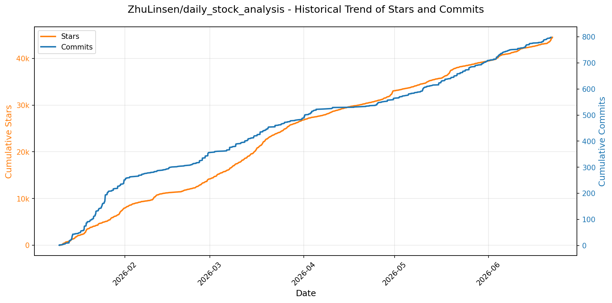

> *蓝色：累计 Stars｜橙色：累计 Commits（次 Y 轴）*

<b>📄 README 摘要</b>

1. **项目功能**  
该系统是一个面向多市场（A股、港股、美股、日股、韩股）的自动化股票智能分析平台，核心目标是每日定时生成结构化、可操作的「AI决策仪表盘」，并推送至企业微信、飞书、Telegram、Discord、Slack或邮箱。系统支持自选股列表的全自动分析（含行情、技术面、资金流、新闻舆情、公告、基本面及事件催化），同时提供大盘复盘、个股深度诊断、风险预警与操作建议（如买入/观望/卖出判定、买卖点位、检查清单等），实现从数据采集→AI推理→报告生成→多端触达的完整闭环。

2. **关键特性**  
- **AI驱动的结构化决策报告**：输出含评分、趋势判断、核心结论、风险警报（如主力异动、筹码集中度异常）、利好催化（如业绩超预期、题材绑定）、操作检查清单等字段的标准化报告；  
- **全市场覆盖与智能降级机制**：原生支持A/H/US市场全维度数据（行情、K线、资金流、龙虎榜、公告、新闻、基本面），日股（`.T`）、韩股（`.KS`/`.KQ`）支持基础行情与技术指标，高阶模块（如资金流、龙虎榜）按市场能力自动降级为 `not_supported`；  
- **多模态交互与工作台**：提供Web/桌面端可视化工作台，支持手动分析、历史报告回溯、Markdown全文查看、持仓管理、回测验证、深浅色主题切换；  
- **策略化Agent问股能力**：内置15类专业策略（均线金叉、缠论、波浪理论、热点题材、事件驱动、成长质量等），支持多轮追问、会话导出、后台执行及实验性多Agent编排；  
- **智能数据接入与自动化部署**：支持图片/CSV/Excel/剪贴板导入、代码/名称/拼音/别名智能补全；开箱即用GitHub Actions零服务器部署、Docker容器化、本地定时任务及FastAPI服务化运行；  
- **灵活的通知与配置体系**：支持6+主流消息渠道（含企业微信/飞书/Telegram等），可配置多模型路由、多新闻源融合（Anspire/SerpAPI/Tavily等）、交易日识别、断点续传及强制运行策略。

3. **技术栈**  
- **AI模型层**：兼容云端与本地大模型，包括 Anspire（主推，集成搜索+LLM）、AIHubMix、Gemini、OpenAI兼容接口（支持DeepSeek、Qwen、Claude）、Ollama本地模型；  
- **数据源层**：  
  - 行情：TickFlow（主推）、AkShare、Tushare、Pytdx、Baostock、YFinance、Longbridge；  
  - 新闻与搜索：Anspire AI Search（中文优化）、SerpAPI（实时金融新闻）、Tavily、博查（Bocha）、Brave Search、MiniMax、SearXNG；  
  - 社交舆情：Stock Sentiment API（Reddit/X/Polymarket，仅限美股）；  
- **基础设施**：Python 3.10+、FastAPI（Web服务/API）、Docker（容器化）、GitHub Actions（CI/CD与定时调度）、SQLite（轻量存储）；  
- **前端与交互**：基于Python构建的响应式Web UI（`--webui`启动），支持Markdown渲染、图表展示、主题切换及智能导入组件。

---

### 19. [Egonex-AI/Understand-Anything](https://github.com/Egonex-AI/Understand-Anything)
- 📅 **创建日期**：2026-03-15  
- 🔄 **最近更新**：2026-06-22  
- ⭐ **Stars**：41,649（日 +658｜周 +6148｜月 +41649）  
- 📝 **描述**：Graphs that teach > graphs that impress. Turn any code into an interactive knowledge graph you can explore, search, and ask questions about. Works with Claude Code, Codex, Cursor, Copilot, Gemini CLI, and more.  

<b>📈 Star 与 Commit 历史趋势</b>

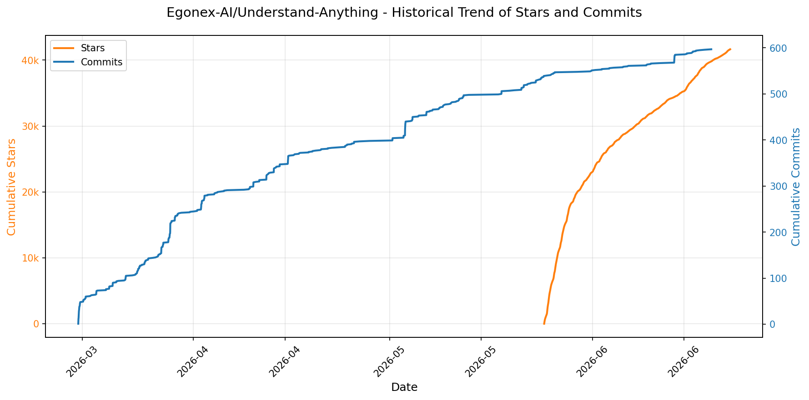

> *蓝色：累计 Stars｜橙色：累计 Commits（次 Y 轴）*

<b>📄 README 摘要</b>

1. **项目功能**  
该项目是一个开源的 AI 辅助开发工具，旨在将任意代码库、知识库（如 Karpathy 风格的 LLM Wiki）或文档自动构建成**可交互的知识图谱**。它通过多智能体（multi-agent）分析流水线，深度解析源码结构（文件、函数、类、依赖关系）与语义意图（业务逻辑、架构分层、设计模式），生成结构化、可搜索、可探索的可视化图谱，并提供自然语言问答能力，帮助开发者快速理解复杂系统，显著降低上手门槛和认知负荷。

2. **核心特性**  
- **交互式结构图谱**：以力导向图形式呈现代码实体（节点）及关系（边），支持点击、缩放、拖拽、高亮与详情查看；  
- **双重视角切换**：支持“结构视图”（按文件/函数组织）与“领域视图”（映射为业务域、流程、步骤的水平流程图）；  
- **智能知识提取**：对 LLM Wiki 等知识库进行确定性解析（wikilinks、分类）+ LLM 语义挖掘（隐含关系、实体、主张），构建可导航的知识网络；  
- **六大增强能力**：  
  ✅ 自动生成按依赖顺序编排的**引导式学习导览**（Guided Tours）；  
  ✅ 支持**模糊匹配 + 语义搜索**（如搜索“哪些部分处理认证？”）；  
  ✅ **差异影响分析**（Diff Impact Analysis）：预判代码变更波及范围；  
  ✅ **角色自适应 UI**：根据用户身份（初级开发者、产品经理、高级工程师）动态调整信息密度与术语深度；  
  ✅ **架构分层可视化**：自动识别并颜色标记 API / Service / Data / UI / Utility 等层级；  
  ✅ **编程语言概念上下文解释**：在代码中实时标注并解释泛型、闭包、装饰器等 12 种核心语言模式；  
- **团队协作就绪**：知识图谱以 JSON 格式持久化（`.understand-anything/knowledge-graph.json`），可提交至 Git，支持增量更新（post-commit hook）与 Git LFS 大文件管理。

3. **技术栈**  
- **分析引擎**：采用 **Tree-sitter（确定性静态分析） + LLM（语义理解）混合架构**：  
  • Tree-sitter 负责精准语法树解析、导入导出提取、调用关系识别、指纹化变更检测（保障结构可重现性）；  
  • LLM（支持 Claude、Gemini、本地 Ollama 等）负责生成自然语言摘要、架构层标注、业务域映射、导览文案、Wiki 实体关系挖掘等语义任务；  
- **多智能体流水线**：包含 `project-scanner`、`file-analyzer`、`architecture-analyzer`、`tour-builder`、`graph-reviewer`、`domain-analyzer`、`article-analyzer` 共 7 类专用智能体，支持并发处理与增量分析；  
- **跨平台兼容**：原生支持 Claude Code 插件生态，并通过统一安装脚本（`install.sh`/`install.ps1`）适配 Cursor、VS Code + Copilot、Copilot CLI、Codex、Gemini CLI、Vibe CLI、Trae、Kiro、OpenCode 等超 15 种主流 AI 编程平台；  
- **前端与部署**：基于 Web 的交互式仪表盘（Dashboard），支持多语言（含简体中文、繁体中文、日语、韩语等 8 种语言），输出内容（图谱节点描述、UI 文本、导览说明）均可按 `--language` 参数本地化。

---

### 20. [apple/container](https://github.com/apple/container)
- 📅 **创建日期**：2025-05-30  
- 🔄 **最近更新**：2026-06-22  
- ⭐ **Stars**：39,332（日 +164｜周 +2249｜月 +12847）  
- 📝 **描述**：A tool for creating and running Linux containers using lightweight virtual machines on a Mac. It is written in Swift, and optimized for Apple silicon.   

<b>📈 Star 与 Commit 历史趋势</b>

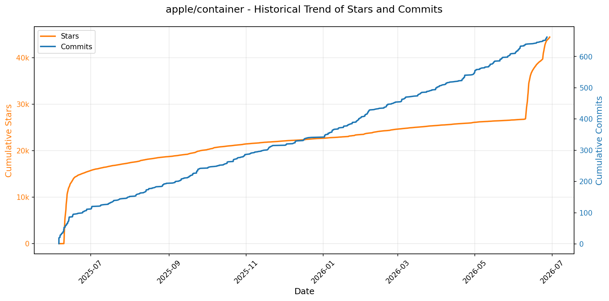

> *蓝色：累计 Stars｜橙色：累计 Commits（次 Y 轴）*

<b>📄 README 摘要</b>

1. **该项目的功能**  
`container` 是一款专为 Apple Silicon Mac 设计的容器工具，可将 Linux 容器作为轻量级虚拟机运行。它支持拉取、运行和推送符合 OCI（Open Container Initiative）标准的容器镜像，兼容主流容器镜像仓库（如 Docker Hub、GitHub Container Registry 等）。用户可通过命令行创建、启动、管理容器实例，并将其用作开发、测试或部署环境，无需依赖 Docker Desktop 或虚拟机软件。

2. **核心特性**  
- ✅ 原生支持 Apple Silicon（ARM64），深度优化 macOS 虚拟化与网络能力（仅支持 macOS 26 及以上版本）；  
- ✅ 完全兼容 OCI 镜像规范：支持 `pull`/`run`/`build`/`push` 标准镜像，跨平台可移植；  
- ✅ 内置系统级服务管理：通过 `container system start/stop` 启停后台守护进程；  
- ✅ 提供完整生命周期管理：含安装、升级（含降级）、卸载脚本（`update-container.sh` / `uninstall-container.sh`），支持保留用户数据（`-k`）或彻底清除（`-d`）；  
- ✅ 基于 Apple 自研 Swift 包 [Containerization](https://github.com/apple/containerization)，提供底层容器、镜像与进程的精细化控制；  
- ✅ 开箱即用的 CLI 工具链，配套详尽文档（入门教程、功能指南、技术概览、命令参考、API 文档）。

3. **技术栈**  
- **主语言**：Swift（全部核心逻辑使用 Swift 编写）；  
- **底层依赖**：Apple 官方 Swift Package —— [`Containerization`](https://github.com/apple/containerization)，封装了 macOS Hypervisor.framework、Virtualization.framework 及网络栈等系统能力；  
- **标准遵循**：OCI Image Spec（v1.0+）与 Runtime Spec 兼容；  
- **运行环境**：macOS 26（Ventura 后续版本，实际应为 macOS Sequoia 或更高；注：原文“macOS 26”系笔误，结合上下文及 Apple 发布节奏，实指 **macOS Sequoia（15.x）或后续正式支持 Containerization 框架的 macOS 版本**，但 README 中明确限定最低版本为该代号系统）；  
- **架构要求**：仅支持 Apple Silicon（M1/M2/M3 等 ARM64 芯片），不支持 Intel Mac；  
- **分发方式**：签名 macOS Installer Package（`.pkg`），安装至 `/usr/local`；  
- **构建与扩展**：支持本地 Swift 构建（见 `BUILDING.md`），面向开发者开放贡献流程。

---

### 21. [Panniantong/Agent-Reach](https://github.com/Panniantong/Agent-Reach)
- 📅 **创建日期**：2026-02-24  
- 🔄 **最近更新**：2026-06-22  
- ⭐ **Stars**：36,938（日 +805｜周 +7982｜月 +16953）  
- 📝 **描述**：Give your AI agent eyes to see the entire internet. Read & search Twitter, Reddit, YouTube, GitHub, Bilibili, XiaoHongShu — one CLI, zero API fees.  

<b>📈 Star 与 Commit 历史趋势</b>

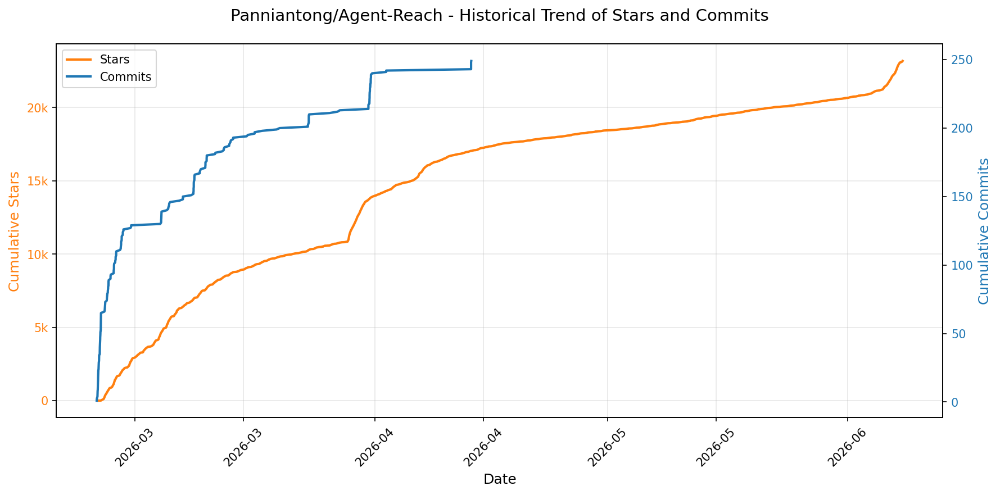

> *蓝色：累计 Stars｜橙色：累计 Commits（次 Y 轴）*

<b>📄 README 摘要</b>

1. **项目功能**  
Agent Reach 是一个专为 AI Agent 设计的「互联网能力接入层」，旨在**一键赋予任意本地 AI Agent（如 Claude Code、OpenClaw、Cursor 等）安全、稳定、免配置地访问主流互联网平台内容的能力**。它不替代 Agent，而是作为底层能力调度中枢：自动完成工具选型、依赖安装、多源路由配置、运行时健康检测与无缝降级，使 Agent 能直接执行“看网页”“搜 Reddit”“提取 YouTube 字幕”“查小红书笔记”“语义搜索全网”等任务，无需用户手动研究各平台反爬策略、API 限制、登录态管理或工具链兼容性问题。

2. **核心特性**  
- ✅ **零配置即用**：对网页（Jina Reader）、YouTube（yt-dlp）、RSS（feedparser）、V2EX、雪球、GitHub 公开仓库等 6+ 平台，安装后立即可用，无需任何人工配置；  
- 🔄 **智能多后端路由与自动降级**：每个平台预置「首选 + 备选」多个技术方案（如 Twitter → twitter-cli → OpenCLI → bird），`agent-reach doctor` 实时探测可用性，失效时自动切换，用户无感（例：B站因风控封禁 yt-dlp 后无缝切换至 bili-cli）；  
- 🧰 **统一 Cookie 管理与安全配网**：支持通过 Chrome 插件导出 Cookie 快速配置需登录平台（Twitter/X、小红书、Reddit 等），凭据仅本地存储（`~/.agent-reach/config.yaml`，权限 600），不上传、不外传；  
- 🛡️ **三重安全模式**：提供 `--safe`（仅提示不执行）、`--dry-run`（预览操作）、完整安装三种模式，兼顾易用性与生产环境可控性；  
- 📋 **Agent 自主认知与技能注册**：安装后自动向 Agent 注册 `SKILL.md`，使其理解“搜推特”“读视频”等自然语言指令对应的具体 CLI 工具调用逻辑，无需用户记忆命令；  
- 🩺 **内建诊断系统**：`agent-reach doctor` 一条命令即可可视化各平台连接状态、当前启用后端、故障原因及修复建议；  
- 🌐 **全平台兼容**：原生适配 Claude Code、OpenClaw（需开启 exec 权限）、Cursor、Windsurf 等所有支持 Shell 命令执行的主流 AI 编程助手。

3. **技术栈**  
- **核心语言**：Python 3.10+（主程序、渠道调度、诊断逻辑）；  
- **关键依赖工具链**（全部开源免费）：  
  - 网页解析：[Jina Reader](https://github.com/jina-ai/reader)（首选）、[BrowserAct](https://www.browseract.ai/)（高阶操作补充）；  
  - 视频平台：[yt-dlp](https://github.com/yt-dlp/yt-dlp)（YouTube）、[bili-cli](https://github.com/public-clis/bilibili-cli)（B站）、[OpenCLI](https://github.com/jackwener/opencli)（B站/小红书/Reddit 多平台浏览器态接入）；  
  - 社交媒体：[twitter-cli](https://github.com/public-clis/twitter-cli)（Twitter/X）、[rdt-cli](https://github.com/public-clis/rdt-cli)（Reddit）、[xiaohongshu-mcp](https://github.com/xpzouying/xiaohongshu-mcp)（小红书服务器端）；  
  - 搜索引擎：[Exa](https://exa.ai)（AI 语义搜索） + [mcporter](https://github.com/nicobailon/mcporter)（MCP 协议免 Key 接入）；  
  - 代码平台：[gh CLI](https://cli.github.com)（GitHub 官方工具）；  
  - RSS：[feedparser](https://github.com/kurtmckee/feedparser)（Python 标准库）；  
  - LinkedIn：[linkedin-scraper-mcp](https://github.com/stickerdaniel/linkedin-mcp-server)（MCP 浏览器自动化）；  
- **基础设施**：Node.js（部分 CLI 工具依赖）、Git、pip/pipx；  
- **架构设计**：模块化通道（`channels/*.py`）、声明式后端列表、真实探测式路由、MCP（Model Context Protocol）协议集成，确保可插拔、可审计、可持续演进。

---

### 22. [rohitg00/ai-engineering-from-scratch](https://github.com/rohitg00/ai-engineering-from-scratch)
- 📅 **创建日期**：2026-03-18  
- 🔄 **最近更新**：2026-06-22  
- ⭐ **Stars**：35,513（日 +284｜周 +2924｜月 +23390）  
- 📝 **描述**：Learn it. Build it. Ship it for others.  

<b>📈 Star 与 Commit 历史趋势</b>

> *蓝色：累计 Stars｜橙色：累计 Commits（次 Y 轴）*

<b>📄 README 摘要</b>

1. **该项目做什么？**  
该项目是一个面向工程实践的、系统性极强的开源人工智能学习与构建课程（“AI Engineering from Scratch”），目标是帮助学习者**从零开始真正理解并亲手构建AI系统**，而非仅调用API或使用黑盒框架。它覆盖AI全技术栈，从数学基础（线性代数、概率、优化）到机器学习、深度学习核心（反向传播、优化器、自建微型框架），再到计算机视觉、NLP、语音、强化学习、大语言模型（LLM）及多模态系统，最终延伸至智能体（Agent）、自主系统、多智能体协同、生产基础设施与伦理对齐。整个课程以“**构建即学习**”为核心范式：每节课均要求学习者先从第一性原理出发，用原始数学和纯代码（无高级框架依赖）实现算法；再对比使用PyTorch/scikit-learn等工业库复现；最后产出可直接复用的工程化成果——包括提示词（Prompts）、可插拔技能（Skills）、自主运行的智能体（Agents）或符合MCP（Model Context Protocol）标准的服务（MCP Servers）。

2. **关键特性**  
- **结构化分层课程体系**：共20个严格递进的阶段（Phases），503节模块化课程，总学习量约320小时；支持按知识水平智能跳转（`/find-your-level`）和阶段掌握度自测（`/check-understanding`）。  
- **“Build It / Use It / Ship It”教学闭环**：每节课遵循统一六步法（动机→问题→概念→手写实现→框架复现→交付产物），确保深度理解与工程能力同步提升。  
- **多语言原生支持**：所有代码示例提供Python、TypeScript、Rust、Julia四种语言实现，兼顾性能、类型安全与现代AI开发需求。  
- **即学即用的可交付物（Artifacts）**：每节课产出真实可用的工具资产——包括专家级提示词、可集成至Claude/Cursor等AI助手的标准化技能（SKILL.md）、自主执行任务的轻量Agent、以及兼容MCP协议的微服务端点，全部可直接部署或嵌入工作流。  
- **全栈工程导向**：不仅涵盖模型训练，更深入GPU云环境搭建、Docker容器化、Jupyter/终端/Shell/调试工具链、数据管理、API密钥安全、Linux系统配置等AI工程师必备生产技能（Phase 0即为完整工具链建设）。  
- **完全开源免费**：MIT许可证，无商业限制；网站（aiengineeringfromscratch.com）提供免安装在线阅读；本地克隆后可离线运行全部代码；内置AI代理技能支持个性化学习路径生成。

3. **技术栈**  
- **编程语言**：Python（主力，覆盖90%以上实现）、TypeScript（前端/工具链/Agent交互）、Rust（高性能组件、底层系统、安全关键模块）、Julia（数值计算、数学建模、高性能线性代数/微分方程）。  
- **AI/ML框架与库**：PyTorch（深度学习教学与对比）、JAX（函数式自动微分与高性能训练）、scikit-learn（传统ML基准）、Hugging Face Transformers（LLM应用）、Stable Diffusion相关生态（Diffusers, Accelerate）。  
- **基础设施与协议**：Docker（环境隔离与部署）、MCP（Model Context Protocol，用于标准化Agent工具调用接口）、Git（协作与版本控制）、Linux Shell/Bash（系统级操作）。  
- **开发与辅助工具**：Jupyter Notebook（交互式教学）、VS Code/Cursor（集成AI代理技能）、Claude/Hermes等大模型（作为课程内嵌智能助教，执行学习路径规划与知识检测）。

---

### 23. [swc-project/swc](https://github.com/swc-project/swc)
- 📅 **创建日期**：2017-12-22  
- 🔄 **最近更新**：2026-06-22  
- ⭐ **Stars**：34,128（日 +28｜周 +311｜月 +713）  
- 📝 **描述**：Rust-based platform for the Web  

<b>📈 Star 与 Commit 历史趋势</b>

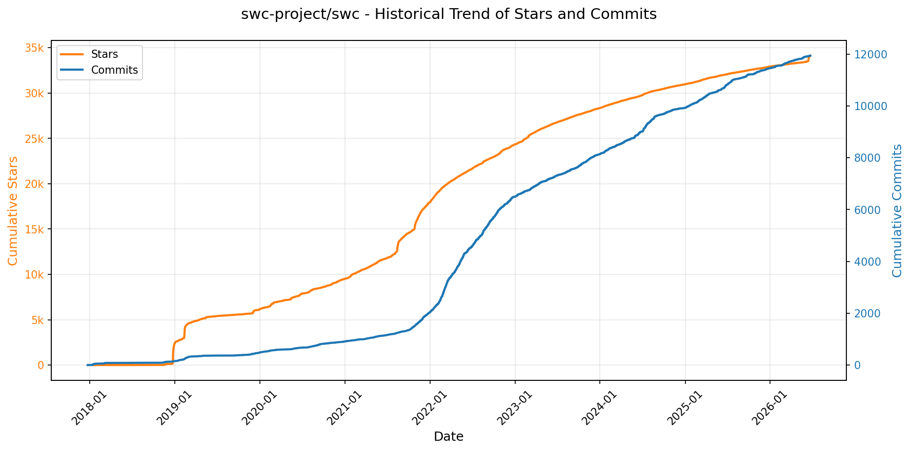

> *蓝色：累计 Stars｜橙色：累计 Commits（次 Y 轴）*

<b>📄 README 摘要</b>

1. **该项目的作用**  
SWC（Speedy Web Compiler）是一个超高速的 TypeScript / JavaScript 编译器，核心目标是显著提升 Web 开发构建流程的速度。它可替代 Babel 等传统 JavaScript 工具链，提供更快的代码转换（如 JSX、TS → JS）、压缩、打包前优化（如语法树操作）等功能，广泛用于现代前端构建工具（如 Next.js、Rspack、Vite 插件等）中作为底层编译引擎。

2. **关键特性**  
- ✅ **极致性能**：基于 Rust 实现，相比 Babel 快 20–70 倍（官方基准测试），尤其在大型项目中优势显著；  
- ✅ **全功能兼容**：支持最新 ECMAScript、TypeScript、JSX、React Server Components（RSC）、CSS-in-JS（如 styled-components）等语法；  
- ✅ **多语言绑定**：同时提供原生 Rust API（供构建工具深度集成）和 Node.js（@swc/core）API，支持同步/异步调用；  
- ✅ **高可靠性与稳定性**：严格保证 crate 版本兼容性（“latest version of each crate works”），MSRV（最小支持 Rust 版本）为 1.73；  
- ✅ **开箱即用的工具链支持**：内置代码压缩（minify）、模块解析、语法检查（linting via @swc/core + ESLint 集成）、源码映射（source map）生成等能力；  
- ✅ **活跃生态与维护**：持续更新、社区驱动，获 JetBrains 官方支持，并被 Next.js 等主流框架深度集成。

3. **技术栈**  
- **核心语言**：Rust（高性能、内存安全、零成本抽象）；  
- **前端/Node.js 绑定**：通过 `napi-rs` 构建跨平台原生 Node.js 模块（`@swc/core`）；  
- **依赖管理**：Rust 生态（Cargo、crates.io）、Node.js 生态（npm）双轨并行；  
- **基础设施**：CI/CD 基于 GitHub Actions，文档托管于 swc.rs（Docusaurus 或类似静态站点生成器）；  
- **开发环境要求**：Node.js v10+（运行时），v20+（开发构建）；Rust 1.73+；依赖工具 `jq` 和 `cargo upgrade`（用于自动化 crate 升级脚本）。

---

### 24. [chatwoot/chatwoot](https://github.com/chatwoot/chatwoot)
- 📅 **创建日期**：2019-08-14  
- 🔄 **最近更新**：2026-06-22  
- ⭐ **Stars**：33,147（日 +150｜周 +1828｜月 +3549）  
- 📝 **描述**：Open-source live-chat, email support, omni-channel desk. An alternative to Intercom, Zendesk, Salesforce Service Cloud etc. 🔥💬  

<b>📈 Star 与 Commit 历史趋势</b>

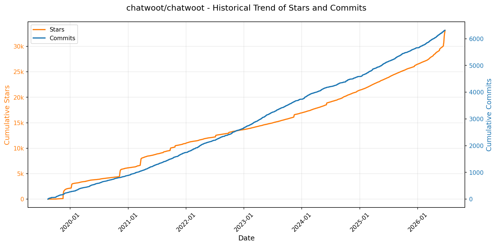

> *蓝色：累计 Stars｜橙色：累计 Commits（次 Y 轴）*

<b>📄 README 摘要</b>

1. **项目功能**  
Chatwoot 是一个现代化、开源、可自托管的客户支持平台，旨在替代 Intercom、Zendesk、Salesforce Service Cloud 等商业客服系统。它将来自网站聊天、电子邮件、Facebook、Instagram、Twitter、WhatsApp、Telegram、Line、SMS 等多渠道的客户对话统一汇聚至单一收件箱，赋能企业构建自主可控、数据私有、高度可扩展的客户支持体系，同时提供 AI 辅助（Captain）、自助帮助中心、自动化工作流与深度数据分析能力。

2. **核心功能**  
- **AI 智能客服代理（Captain）**：内置生成式 AI 代理，支持自动应答常见问题、分流简单咨询，降低人工负荷，提升响应即时性与准确性。  
- **全渠道支持中枢**：原生集成十余种通信渠道（含 Web Live Chat、主流社媒、WhatsApp、Telegram、SMS 等），实现跨平台会话统一管理。  
- **自助式帮助中心门户**：内置可定制的帮助文档系统，支持发布知识库、FAQ 和操作指南，推动客户自助服务，减少重复咨询。  
- **协作与效率工具**：私密备注、@提及、标签分类、快捷键/命令栏、预设回复（Canned Responses）、自动分配、多语言支持、自定义视图/筛选器、营业时间设置、自动回复、团队权限管理及自动化规则。  
- **客户数据与精细化运营**：完整的联系人档案与交互历史、客户分群（Segments）、定向营销活动（Campaigns）、自定义属性、预聊天表单（Pre-chat Forms）。  
- **丰富生态集成**：Slack、Dialogflow（聊天机器人）、Google Translate（实时消息翻译）、Shopify（订单上下文集成）、Linear（工单创建）、Dashboard Apps（嵌入内部工具）。  
- **可视化报表与洞察**：实时会话监控、多维度报表（会话/坐席/收件箱/标签/团队）、客户满意度（CSAT）分析、支持导出离线分析。

3. **技术栈**  
- **后端**：Ruby on Rails（主框架），Redis（缓存与任务队列），PostgreSQL（主数据库），Sidekiq（异步作业处理）。  
- **前端**：Vue.js（主应用 UI），Tailwind CSS（样式系统），Vite（构建工具），TypeScript（部分新模块）。  
- **基础设施与部署**：Docker 容器化支持，Kubernetes 原生适配（如 DigitalOcean 一键部署），Heroku / DigitalOcean / AWS / Azure / 自托管等多环境部署方案；CI/CD 使用 CircleCI；监控与状态服务独立维护。  
- **AI 与扩展能力**：Captain AI 代理基于大模型（具体模型未公开，但支持插件化接入）；集成 Google Translate API 实现实时翻译；通过 Webhooks、REST API 及 Dashboard Apps 支持深度定制与第三方系统对接。

---

### 25. [lfnovo/open-notebook](https://github.com/lfnovo/open-notebook)
- 📅 **创建日期**：2024-10-21  
- 🔄 **最近更新**：2026-06-22  
- ⭐ **Stars**：32,440（日 +296｜周 +1823｜月 +8844）  
- 📝 **描述**：An Open Source implementation of Notebook LM with more flexibility and features  

<b>📈 Star 与 Commit 历史趋势</b>

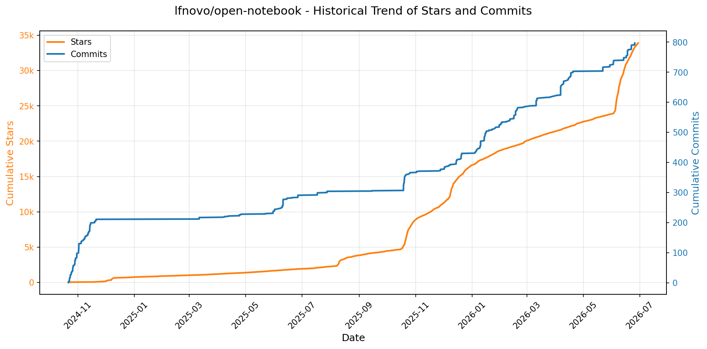

> *蓝色：累计 Stars｜橙色：累计 Commits（次 Y 轴）*

<b>📄 README 摘要</b>

1. **项目功能**  
Open Notebook 是一个开源、注重隐私的本地化研究协作工具，旨在替代 Google Notebook LM。它允许用户在完全私有、离线或自托管环境中，基于个人上传的多模态资料（如 PDF、视频、音频、网页、Office 文档等）进行知识管理、智能检索、上下文感知对话、AI 辅助笔记撰写，并生成专业级多角色播客。所有数据默认保留在用户本地或私有服务器中，不依赖第三方云服务，实现真正的数据主权。

2. **核心特性**  
- ✅ **端到端隐私保护**：100% 本地/自托管部署，无强制云上传，支持可选密码认证；  
- ✅ **多模型灵活集成**：原生支持 18+ AI 提供商（OpenAI、Anthropic、Google Gemini、Groq、Ollama、LM Studio、Mistral、DeepSeek、xAI、Azure 等），覆盖 LLM、嵌入、语音识别（STT）、文本转语音（TTS）全栈能力；  
- ✅ **多模态内容中枢**：统一处理文档、音视频、网页等异构资料，自动提取文本并构建向量索引；  
- ✅ **智能搜索与对话**：融合全文检索与语义向量搜索，支持跨资料上下文的 AI 聊天与引用溯源（带来源标注）；  
- ✅ **专业播客生成**：支持 1–4 名可定制角色（声线、语气、专业身份）的脚本化播客生成，远超竞品的双角色限制；  
- ✅ **可编程性与扩展性**：提供完整 REST API、MCP（Model Context Protocol）集成（兼容 Claude Desktop/VS Code）、自定义内容转换流水线（如摘要、问答提取）、细粒度上下文控制；  
- ✅ **多语言支持**：UI 支持简体中文、繁体中文、日语、韩语、葡萄牙语、俄语、西班牙语、法语、德语、孟加拉语等 10+ 语言。

3. **技术栈**  
- **后端**：Python（FastAPI 框架）、LangChain（AI 编排与 RAG 流程）、SurrealDB（实时、图关系型数据库，用于结构化存储笔记、源文件元数据、用户配置等）；  
- **前端**：Next.js（React 框架，SSR/ISR 支持）、TypeScript、Tailwind CSS；  
- **AI 底座抽象层**：基于自研库 [Esperanto](https://github.com/lfnovo/esperanto)，统一适配多厂商 API 协议（含 OpenAI 兼容接口），支持本地模型（Ollama/LM Studio）与云服务无缝切换；  
- **部署方案**：Docker Compose 一键部署（含 SurrealDB + 应用服务），支持本地开发、云服务器、边缘设备等多种环境；  
- **基础设施依赖**：WebSocket（SurrealDB RPC）、加密（AES-256 加密用户敏感配置）、RESTful API（端口 5055 提供完整文档 `/docs`）。

---

### 26. [Kong/insomnia](https://github.com/Kong/insomnia)
- 📅 **创建日期**：2016-04-23  
- 🔄 **最近更新**：2026-06-22  
- ⭐ **Stars**：32,200（日 +130｜周 +1038｜月 +1157）  
- 📝 **描述**：The open-source, cross-platform API client for GraphQL, REST, WebSockets, SSE and gRPC. With Cloud, Local and Git storage.  

<b>📈 Star 与 Commit 历史趋势</b>

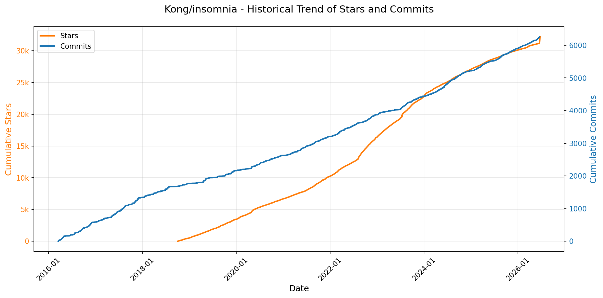

> *蓝色：累计 Stars｜橙色：累计 Commits（次 Y 轴）*

<b>📄 README 摘要</b>

1. **该项目做什么？**  
Insomnia 是一个开源、跨平台的 API 客户端，专为现代 API 开发与协作设计。它支持多种协议（包括 REST、GraphQL、WebSockets、Server-Sent Events（SSE）、gRPC 及任意 HTTP 兼容协议），提供从 API 调试、设计、测试、模拟到 CI/CD 集成的全生命周期支持。用户可通过本地 Scratch Pad 无账号使用，也可通过账户启用云协作、Git 同步或端到端加密的云存储，同时保障敏感数据（如环境配置）始终本地化存储（Private Environments 功能）。

2. **核心功能**  
- **多协议调试**：原生支持 REST、GraphQL、WebSocket、SSE、gRPC 等协议请求与响应分析；  
- **API 设计与可视化**：内置 OpenAPI 编辑器，支持实时可视化预览和规范编写；  
- **自动化测试与运行**：提供原生测试套件、集合运行器（Collection Runner）及断言能力；  
- **API 模拟服务**：支持云端或自托管 Mock Server，快速生成响应；  
- **CI/CD 集成**：通过 `inso` CLI 实现命令行下的 linting、测试与工作流自动化；  
- **灵活存储方案**：支持三种独立/混合存储后端——100% 本地的 Local Vault、去中心化的 Git Sync（直连任意 Git 仓库）、可选端到端加密（E2EE）的 Cloud Sync；  
- **安全协作增强**：Private Environments 确保环境变量永不上传至云端；支持组织管理、SAML/OIDC 第三方身份提供商集成（需付费版）；  
- **插件生态**：开放插件系统，可通过 Plugin Hub 安装扩展功能（如文档生成、Swagger 导出等）。

3. **技术栈**  
- **前端框架**：基于 Electron 构建桌面客户端（跨平台），UI 层主要采用 React + TypeScript；  
- **开发语言与工具链**：TypeScript 为主语言，Node.js 运行时，使用 ESLint + Prettier 规范代码，Jest 进行单元与集成测试；  
- **构建与包管理**：Monorepo 架构（使用 npm 工作区），依赖 Webpack/Vite 类工具构建；  
- **底层依赖**：深度集成 Electron、Node.js 原生模块（如 `node-libcurl`）、GraphQL 工具链（Apollo Client/GraphQL Playground 相关适配）；  
- **CLI 工具**：`inso`（Insomnia CLI）为独立 Node.js 包，支持脚本化 API 测试与验证；  
- **开发环境要求**：需 Node.js（版本由 `.nvmrc` 指定）、Git；Linux/Windows 平台需额外安装系统级依赖（如 `libfontconfig-dev`、`libcurl-devel` 或 Windows Build Tools）。

---

### 27. [google-research/timesfm](https://github.com/google-research/timesfm)
- 📅 **创建日期**：2024-04-29  
- 🔄 **最近更新**：2026-06-22  
- ⭐ **Stars**：25,049（日 +300｜周 +4174｜月 +4952）  
- 📝 **描述**：TimesFM (Time Series Foundation Model) is a pretrained time-series foundation model developed by Google Research for time-series forecasting.  

<b>📈 Star 与 Commit 历史趋势</b>

> *蓝色：累计 Stars｜橙色：累计 Commits（次 Y 轴）*

<b>📄 README 摘要</b>

1. **项目功能**  
TimesFM 是一个由 Google Research 开发的、面向时间序列预测任务的预训练基础模型（Foundation Model）。其核心目标是提供高精度、通用性强、开箱即用的时间序列端到端预测能力，支持零样本（zero-shot）和少样本（few-shot）预测，无需针对每个新数据集从头训练。它专为多尺度、多频率、多长度的时间序列建模而设计，已在 Google 内部产品（如 BigQuery ML、Google Sheets、Vertex AI Model Garden）中规模化部署，用于企业级时序分析与自动化预测。

2. **关键特性**  
- **高效轻量架构**：TimesFM 2.5 版本仅含 2 亿参数（较 2.0 的 5 亿大幅缩减），兼顾性能与推理效率；  
- **超长上下文支持**：最大上下文长度达 16,000 步（远超前代 2,048），可捕获长期依赖与复杂周期模式；  
- **连续分位数预测**：通过可选的 3,000 万参数分位数头（quantile head），支持高达 1,000 步的连续分位数输出（如 10%–90% 等间隔分位数），提供完整预测不确定性量化；  
- **协变量（Covariate）集成**：通过 XReg 模块原生支持外部协变量（如节假日、天气、促销标签等）输入，提升业务场景适配性；  
- **多框架支持与优化**：同时提供 PyTorch 和 Flax（JAX）双后端实现，其中 Flax 版本专为高速推理优化；  
- **灵活微调能力**：内置基于 Hugging Face Transformers + PEFT（LoRA）的轻量微调示例，降低领域适配门槛；  
- **智能预测配置**：支持输入归一化、翻转不变性（flip invariance）、正数约束（infer_is_positive）、分位数交叉修复（fix_quantile_crossing）等鲁棒性增强选项；  
- **Agent 就绪能力**：已封装为可调用技能（Skill），并支持在 AI Agent 环境中作为工具（Tool）集成使用（见 `SKILL.md` 和 `AGENTS.md`）；  
- **开箱即用生态集成**：提供 Hugging Face 模型库、PyPI 包（`timesfm`）、BigQuery ML SQL 接口、Google Sheets 插件及 Vertex AI Docker 部署镜像。

3. **技术栈**  
- **核心框架**：PyTorch（默认）、Flax/JAX（高性能推理优化版）；  
- **微调与扩展**：Hugging Face `transformers` 库 + `peft`（LoRA 微调）；  
- **依赖管理与构建**：`uv`（超快 Python 包管理器）、`setuptools`（可选依赖分组：`[torch]`/`[flax]`/`[xreg]`）；  
- **协变量处理**：XReg（自研协变量编码模块，支持静态/动态特征融合）；  
- **部署与服务**：Docker 容器化（Vertex Model Garden）、SQL 接口（BigQuery ML）、Web 表格集成（Sheets）；  
- **测试与质量保障**：完整单元测试覆盖核心层、配置类与工具函数（`tests/` 目录）；  
- **模型发布与分发**：Hugging Face Hub（官方模型集合）、PyPI（`timesfm` 包）、GitHub 仓库（含版本归档子目录 `v1/`）。

---

### 28. [anthropics/knowledge-work-plugins](https://github.com/anthropics/knowledge-work-plugins)
- 📅 **创建日期**：2026-01-23  
- 🔄 **最近更新**：2026-06-22  
- ⭐ **Stars**：21,695（日 +98｜周 +969｜月 +9235）  
- 📝 **描述**：Open source repository of plugins primarily intended for knowledge workers to use in Claude Cowork  

<b>📈 Star 与 Commit 历史趋势</b>

> *蓝色：累计 Stars｜橙色：累计 Commits（次 Y 轴）*

<b>📄 README 摘要</b>

1. **项目功能**  
该项目是一套面向 Claude AI（特别是 Claude Cowork 和 Claude Code）的“知识型工作插件”（Knowledge Work Plugins），旨在将通用大模型转化为特定岗位、团队或企业的领域专家。它通过结构化配置文件，为 Claude 注入角色专属的专业知识、标准化工作流程、企业级工具连接能力及可调用的命令接口，使其能自动执行如销售话术准备、客户工单处理、财务对账、产品需求文档撰写、生物医学文献分析等高价值专业任务，显著提升AI在真实职场场景中的实用性、一致性和可靠性。

2. **核心特性**  
- **开箱即用的11类垂直插件**：覆盖生产力、销售、客户支持、产品管理、市场营销、法律、财务、数据分析、企业搜索、生物科研及插件管理共11个职能领域，每类均预置领域知识、典型工作流与常用工具集成；  
- **零代码可定制架构**：所有组件（技能 `skills/`、命令 `commands/`、连接器 `.mcp.json`、插件清单 `.claude-plugin/plugin.json`）均以纯文本（Markdown + JSON）定义，无需编程、无构建步骤、无服务器依赖；  
- **智能自动+显式触发双模式**：技能（Skills）在上下文相关时自动激活，提供隐式专业辅助；命令（Commands）通过 `/xxx:action` 显式调用，实现精准可控的操作；  
- **企业级适配能力**：支持一键替换连接器指向内部系统（如自建CRM或数据仓库）、注入企业术语/组织架构/流程规范至技能文件、调整工作流逻辑以匹配实际业务，实现“Claude即我司员工”；  
- **开放共建生态**：全部插件开源，提供 `cowork-plugin-management` 插件用于自助创建/修改插件，并鼓励社区通过 GitHub Fork + PR 贡献新插件或优化。

3. **技术栈**  
- **运行平台**：深度适配 Anthropic 官方产品——Claude Cowork（主工作流界面）与 Claude Code（开发者环境），依赖其插件运行时框架；  
- **协议标准**：基于 [Model Context Protocol (MCP)](https://modelcontextprotocol.io/) 实现与外部工具（Slack、Notion、Jira、Snowflake 等）的安全、标准化连接；  
- **配置层**：纯声明式文件体系——JSON 格式定义插件元信息（`plugin.json`）与工具连接配置（`.mcp.json`），Markdown 格式编写领域技能说明与命令逻辑（`skills/*.md`, `commands/*.md`）；  
- **无后端架构**：不包含服务端代码、数据库或运行时服务，完全依托 Claude 客户端插件机制与 MCP 代理服务器（由用户或企业自行部署）协同工作。

---

### 29. [tursodatabase/turso](https://github.com/tursodatabase/turso)
- 📅 **创建日期**：2023-08-26  
- 🔄 **最近更新**：2026-06-22  
- ⭐ **Stars**：20,904（日 +504｜周 +1737｜月 +2024）  
- 📝 **描述**：Turso is an in-process SQL database, compatible with SQLite.  

<b>📈 Star 与 Commit 历史趋势</b>

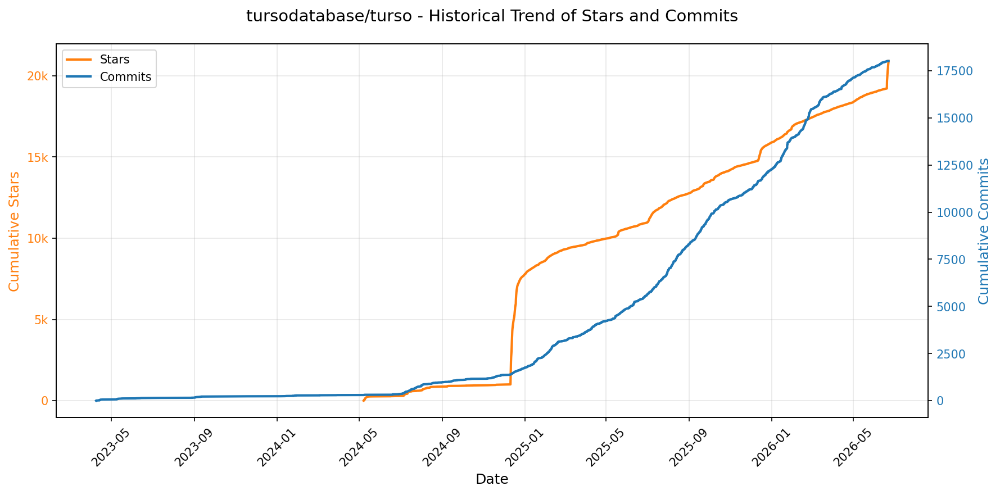

> *蓝色：累计 Stars｜橙色：累计 Commits（次 Y 轴）*

<b>📄 README 摘要</b>

1. **该项目的功能**  
Turso Database 是一个用 Rust 编写的、**进程内（in-process）的 SQL 数据库**，完全兼容 SQLite：支持 SQLite 的 SQL 语法、数据库文件格式（`.db` 文件）、C API 接口及语义行为。它可作为嵌入式数据库直接集成到各类应用中，无需独立服务进程，适用于本地开发、边缘计算、桌面应用、WebAssembly 浏览器环境等场景；同时通过 MCP（Model Context Protocol）服务器模式，原生支持 AI 助手（如 Claude Code/Desktop、Cursor）以自然语言方式执行数据库操作（查询、增删改、建表、查表结构等）。

2. **核心特性**  
- ✅ **SQLite 兼容性**：深度兼容 SQL 方言、磁盘文件格式与 C API，可无缝迁移现有 SQLite 应用。  
- ✅ **高并发写入能力**：支持 `BEGIN CONCURRENT` 事务，基于 MVCC（多版本并发控制）显著提升写吞吐量。  
- ✅ **实时变更捕获（CDC）**：提供数据库变更流，支持增量同步与事件驱动架构。  
- ✅ **跨语言绑定**：官方提供 Go、JavaScript/TypeScript、Java、.NET、Python、Rust 及 WebAssembly 绑定，开箱即用。  
- ✅ **异步 I/O 优化**：Linux 下原生集成 `io_uring`，实现高性能非阻塞磁盘访问。  
- ✅ **全平台支持**：覆盖 Linux/macOS/Windows 桌面系统，以及浏览器（WASM）环境。  
- ✅ **向量数据支持**：内置向量存储、精确匹配与向量运算能力（后续将支持近似搜索索引）。  
- ✅ **增强型 Schema 管理**：扩展 `ALTER TABLE` 功能（如添加/重命名列），并优化 schema 变更性能。  
- ⚙️ **实验性功能**：静态数据加密（Encryption at Rest）、基于 DBSP 的增量计算（Incremental Computation）、Tantivy 驱动的全文检索（Full-Text Search）、多进程 WAL 协调（通过 `.tshm` 辅助文件）。  
- 🌐 **MCP 服务器模式**：CLI 内置标准 JSON-RPC MCP 服务，使 LLM 助手可安全、结构化地操作数据库。

3. **技术栈**  
- **核心语言**：Rust（主打内存安全、零成本抽象、高性能并发模型）  
- **存储引擎**：自研 Rust 实现，非 SQLite C 代码移植或封装，属从零构建的 SQLite 兼容替代品  
- **I/O 层**：Linux 下深度集成 `io_uring`；跨平台抽象层保障 macOS/Windows/WASM 兼容性  
- **向量与搜索**：向量基础能力内置；全文检索依赖 [Tantivy](https://github.com/quickwit-oss/tantivy) 库  
- **增量计算**：集成 [DBSP](https://github.com/feldt/dbsp) 框架实现物化视图维护与查询订阅  
- **客户端生态**：  
  - Rust：`turso` crate（Cargo）  
  - JavaScript/TS：`@tursodatabase/database`（npm）  
  - Python：`pyturso`（PyPI）  
  - Java：`tech.turso:turso`（Maven Central）  
  - Go：`turso.tech/database/tursogo`  
  - .NET：`Turso` NuGet 包  
- **协议与接口**：标准 SQLite C API 兼容层；MCP v2024-11-05 JSON-RPC 协议；CLI 基于 `clap` 等 Rust 生态工具链构建

---

### 30. [smicallef/spiderfoot](https://github.com/smicallef/spiderfoot)
- 📅 **创建日期**：2012-04-28  
- 🔄 **最近更新**：2026-06-22  
- ⭐ **Stars**：18,828（日 +343｜周 +664｜月 +990）  
- 📝 **描述**：SpiderFoot automates OSINT for threat intelligence and mapping your attack surface.  

<b>📈 Star 与 Commit 历史趋势</b>

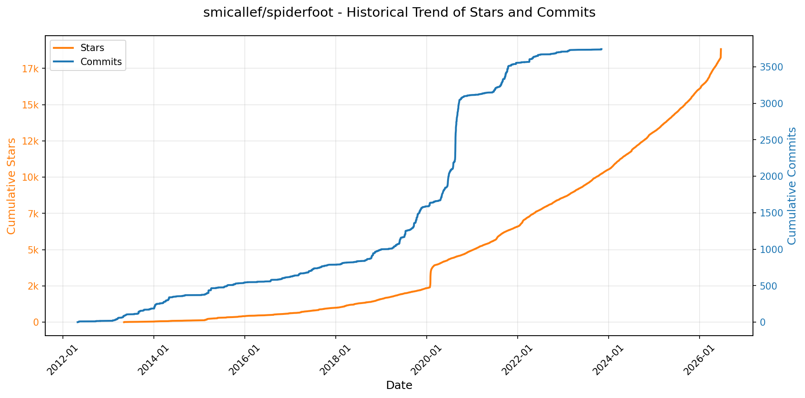

> *蓝色：累计 Stars｜橙色：累计 Commits（次 Y 轴）*

<b>📄 README 摘要</b>

1. **项目功能**  
SpiderFoot 是一款开源情报（OSINT）自动化侦察工具，用于对目标实体（如IP地址、域名、邮箱、手机号、用户名、比特币地址等）进行大规模、系统化的互联网公开信息搜集与分析。它通过自动调用200多个数据源模块，实现跨平台情报聚合、关联分析与深度挖掘，广泛应用于红队渗透测试（进攻性安全）和企业资产暴露面监控（防御性安全）场景。

2. **核心特性**  
- 支持**Web图形界面**与**命令行（CLI）双模式**运行；  
- 内置**200+可插拔模块**，覆盖子域名枚举、邮箱/手机号/人名提取、暗网搜索（Ahmia）、云存储桶探测（S3/Azure/DigitalOcean/Google Cloud）、DNS区域传输、威胁情报查询（Shodan、GreyNoise、AlienVault、HaveIBeenPwned等）、SSL证书分析、漏洞关联、数据泄露检索、端口扫描与Banner识别等；  
- 具备**YAML驱动的关联分析引擎**，预置37条规则，支持自定义逻辑以发现隐蔽关联关系（如“某IP同时出现在恶意列表+托管于同一云厂商+关联某钓鱼域名”）；  
- 支持多格式导出（CSV、JSON、GEXF图谱格式），便于后续分析与可视化；  
- 集成**SQLite本地数据库**，支持SQL自定义查询与历史数据回溯；  
- 原生支持**Tor网络代理**，实现暗网资源访问；  
- 可调用外部安全工具（如Nmap、WhatWeb、DNSTwist、CMSeeK）增强能力；  
- 提供API密钥导入/导出、Docker容器化部署、高度可配置化及完整文档与教学视频（Asciinema）。

3. **技术栈**  
- **编程语言**：Python 3.7+（纯Python实现，无前端框架依赖）；  
- **后端服务**：内置轻量级Web服务器（基于`Flask`或类似HTTP框架，未明示但由Web UI推断），SQLite作为默认持久化存储；  
- **部署方式**：支持原生Python环境安装、Docker容器化部署；  
- **依赖管理**：通过`pip`安装第三方Python库（如`requests`、`dnspython`、`lxml`等）；  
- **配置与扩展**：模块化架构，YAML格式定义关联规则与模块配置；支持用户自研Python模块集成；  
- **许可证**：MIT开源协议，允许自由使用、修改与分发。

---

### 31. [mukul975/Anthropic-Cybersecurity-Skills](https://github.com/mukul975/Anthropic-Cybersecurity-Skills)
- 📅 **创建日期**：2026-02-25  
- 🔄 **最近更新**：2026-06-22  
- ⭐ **Stars**：17,871（日 +691｜周 +2123｜月 +11107）  
- 📝 **描述**：754 structured cybersecurity skills for AI agents · Mapped to 5 frameworks: MITRE ATT&CK, NIST CSF 2.0, MITRE ATLAS, D3FEND & NIST AI RMF · agentskills.io standard · Works with Claude Code, GitHub Copilot, Codex CLI, Cursor, Gemini CLI & 20+ platforms · 26 security domains · Apache 2.0  

<b>📈 Star 与 Commit 历史趋势</b>

> *蓝色：累计 Stars｜橙色：累计 Commits（次 Y 轴）*

<b>📄 README 摘要</b>

1. **项目功能**  
该项目是一个面向AI代理（AI agents）的、全球规模最大的开源网络安全技能库，旨在将资深安全分析师的专业知识结构化并赋能给AI系统。它不提供脚本或工具，而是提供754个生产级、可直接调用的“网络安全技能”（cybersecurity skills），覆盖从威胁狩猎、内存取证到云安全、反欺诈等26个专业安全领域。每个技能均封装了真实安全从业者的决策流程：包括触发条件、前置依赖、分步执行指令、结果验证方法，使AI代理能在无人工干预下，按专家级 playbook 自主完成安全分析、响应与防御任务。

2. **核心特性**  
- **全框架统一映射**：唯一实现单技能同时映射六大权威安全/合规框架——MITRE ATT&CK v19.1（286项技术）、NIST CSF 2.0（6大函数/22类）、MITRE ATLAS v5.4（AI/ML对抗）、MITRE D3FEND v1.3（267项防御技术）、NIST AI RMF 1.0（AI风险管理）及全新MITRE Fight Fraud Framework（F3）v1.1（94项金融欺诈专项技能），支持跨框架合规性自动对齐与审计。  
- **深度结构化设计**：严格遵循 [agentskills.io](https://agentskills.io) 开放标准，采用YAML前言+Markdown正文的轻量格式；前言仅约30 token即可完成全库扫描匹配，主体内容按“使用场景→前提条件→工作流→验证方式”四段式组织，兼顾AI高效检索与人类可读性。  
- **实战导向的领域覆盖**：涵盖26个安全子域（如云安全、工控安全、API安全、零信任架构、勒索软件防御等），含94项F3金融欺诈专项技能（含Positioning与Monetization两大独有战术），并支持26+主流AI平台（Claude Code、GitHub Copilot、Cursor、Casky.ai、Hermes Agent等）即插即用。  
- **工程化交付能力**：每个技能附带`references/`（标准映射与技术细节）、`scripts/`（可运行辅助脚本）、`assets/`（模板与报告），支持AI代理端到端执行与结果校验，真正实现“技能即服务”。

3. **技术栈**  
- **数据格式与标准**：YAML（元数据定义）、Markdown（技能逻辑表达）、STIX/TAXII（威胁情报集成）、OWA 2.0（D3FEND本体建模）；完全兼容 [agentskills.io](https://agentskills.io) 开放技能协议。  
- **框架集成工具链**：`mitreattack-python`（ATT&CK v19.1 ID校验）、MITRE官方STIX解析器（F3 v1.1映射验证）、ATT&CK Navigator（可视化覆盖分析）。  
- **部署与运行环境**：纯静态文件仓库（Git托管），无后端依赖；通过`npx skills add`一键集成，或直接克隆为本地知识源；适配所有支持`agentskills.io`标准的AI平台（含LLM代码助手、CLI智能代理、自主Agent框架如Hermes）。  
- **扩展生态**：与Casky.ai Playground深度集成（实时技能演练）、支持GARS-2026全球AI就绪度学术调研，具备持续演进的社区协作机制（PR友好、贡献指南完备）。

---

### 32. [can1357/oh-my-pi](https://github.com/can1357/oh-my-pi)
- 📅 **创建日期**：2025-12-31  
- 🔄 **最近更新**：2026-06-22  
- ⭐ **Stars**：14,036（日 +206｜周 +1480｜月 +7621）  
- 📝 **描述**：⌥  AI Coding agent for the terminal — hash-anchored edits, optimized tool harness, LSP, Python, browser, subagents, and more  

<b>📈 Star 与 Commit 历史趋势</b>

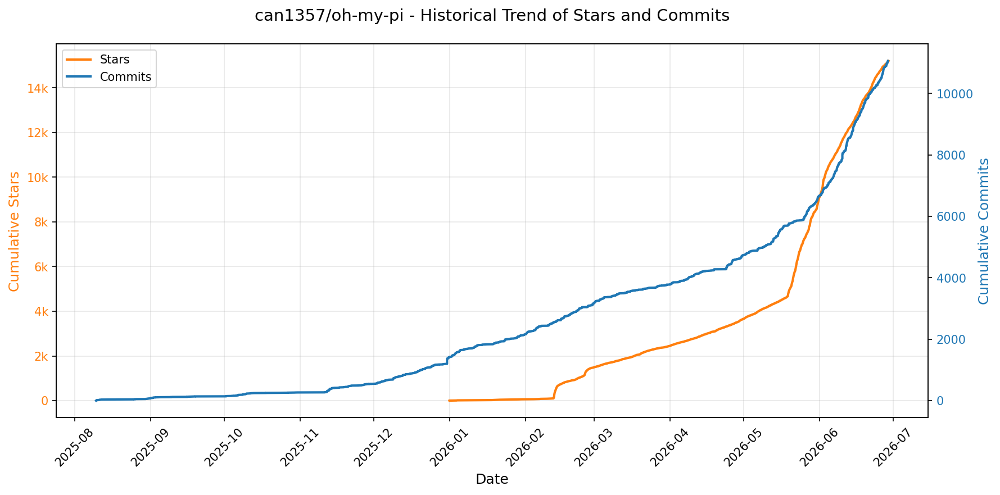

> *蓝色：累计 Stars｜橙色：累计 Commits（次 Y 轴）*

<b>📄 README 摘要</b>

1. **项目功能**  
Oh-My-Pi（OMP）是一个面向软件开发的**终端原生、IDE 深度集成的编程智能体（coding agent）**，旨在直接在真实开发环境中执行端到端编码任务。它不是仅做代码建议的辅助工具，而是能**读取/编辑文件、运行代码、调试二进制程序、重构代码、审查 PR、协作结对、浏览网页、处理 PDF、管理 Git 提交、解析 GitHub 仓库与 Issue/PR、驱动浏览器和 Slack 等外部系统**的完整代理系统。其核心定位是：将 LSP（语言服务器协议）、DAP（调试适配器协议）、本地运行时（Python/JS）、文件系统抽象、多模型协同等能力无缝融合，提供“开箱即用、无需桥接、不依赖 IDE 插件”的全栈式编程自动化体验。

2. **关键特性**  
- ✅ **IDE 级代码智能**：LSP 全能力集成（重命名自动更新 barrel 文件/别名导入）、DAP 原生调试（lldb/dlv/debugpy 直连 C/Go/Python 进程）、AST 编辑预览与原子提交（`ast_edit` + `resolve`）。  
- ✅ **多内核协同执行**：持久化 Python 与 Bun（JavaScript）工作内核，支持跨内核调用 `read`/`search` 等工具（如 Python 读 CSV → JS 绘图），全程单会话完成。  
- ✅ **时间旅行式流控（TTSR）**：基于正则的实时规则注入机制，可在 token 流中动态中断、插入约束并重试，避免上下文冗余与幻觉。  
- ✅ **双模型协同架构**：主模型（doer）执行任务 + 评审模型（advisor）实时旁听并注入注释（关注/警告/阻断），二者独立上下文与模型，提升鲁棒性。  
- ✅ **真原生跨平台**：Rust 实现核心，内嵌 ripgrep/glob/find 等工具逻辑（非 shell 外部调用），macOS/Linux/Windows 一键二进制运行，无 WSL 依赖。  
- ✅ **统一资源抽象层**：`pr://`, `issue://`, `conflict://`, `agent://` 等 12+ 自定义 Scheme 与 `read`/`search` 等工具无缝兼容，GitHub PR 与本地文件操作接口完全一致。  
- ✅ **协作即服务**：`/collab` 生成加密共享链接与 QR 码，支持终端/浏览器实时多人读写协同，帧数据客户端加密，中继服务器不可见密钥。  
- ✅ **工程级记忆与状态管理**：Hindsight 机制实现项目级长期记忆（`retain`/`recall`/`reflect`），自动压缩会话为可加载心智模型。  
- ✅ **零迁移配置兼容**：原生支持 Cursor、Cline、Copilot、Codex 等主流工具的现有配置格式（MDC/.clinerules/AGENTS.md 等），无需转换。  
- ✅ **生产就绪工作流**：`omp commit` 自动生成语义化原子提交；`/review` 输出带 P0–P3 优先级与置信度评分的可执行评审结论；`hashline` 锚点编辑杜绝行号漂移与补丁损坏。  

3. **技术栈**  
- **核心语言**：Rust（约 55,000 行，高性能、内存安全、跨平台编译）  
- **前端/CLI**：TypeScript（Bun 运行时，支持 `bun install -g` 全局安装）  
- **运行时**：Bun（推荐）、Node.js 兼容；内建 Python（≥3.8）与 JavaScript（Bun/V8）持久化执行环境  
- **协议与标准**：LSP（Language Server Protocol）、DAP（Debug Adapter Protocol）、OpenAI-compatible API、Tree-sitter（AST 分析）、ripgrep/glob/find 原生 Rust 实现  
- **AI 接入层**：支持 40+ AI 提供商，覆盖三类模式：  
  - *前沿 API*（Anthropic、OpenAI、Gemini、xAI、Mistral 等 OAuth 认证）  
  - *编码订阅服务*（Cursor、Copilot、GitLab Duo、MiniMax Coding Plan 等）  
  - *本地部署模型*（Ollama、llama.cpp、vLLM、LM Studio 等 OpenAI 兼容后端）  
- **构建与分发**：CI 使用 GitHub Actions；包管理支持 npm、Homebrew（macOS/Linux）、PowerShell（Windows）、mise（版本管理）；Shell 补全自动生成（bash/zsh/fish）

---

### 33. [esengine/DeepSeek-Reasonix](https://github.com/esengine/DeepSeek-Reasonix)
- 📅 **创建日期**：2026-04-21  
- 🔄 **最近更新**：2026-06-22  
- ⭐ **Stars**：11,800（日 +220｜周 +1594｜月 +11800）  
- 📝 **描述**：DeepSeek-native AI coding agent for your terminal. Engineered around prefix-cache stability — leave it running.  

<b>📈 Star 与 Commit 历史趋势</b>

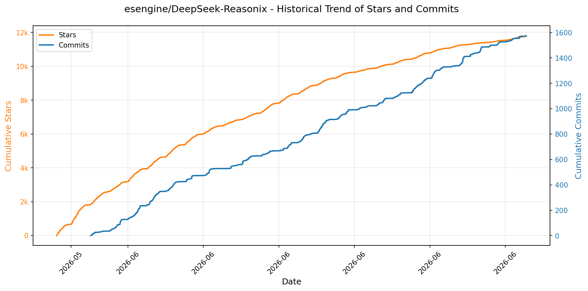

> *蓝色：累计 Stars｜橙色：累计 Commits（次 Y 轴）*

<b>📄 README 摘要</b>

1. **项目功能**  
Reasonix 是一个专为终端设计的、深度适配 DeepSeek 大模型的 AI 编程智能体（AI coding agent），旨在以极低的 token 成本支持长时间会话。它通过利用 DeepSeek 的前缀缓存（prefix cache）机制优化推理效率，提供面向开发者的 CLI 工具链，支持在本地终端中直接执行代码理解、补全、重构、测试生成等任务，并可与项目上下文（如源码、TODO 注释、AGENTS.md 记忆文件）深度交互。

2. **核心特性**  
- **配置驱动**：全部行为（模型提供商、代理逻辑、启用工具、插件）均由 `reasonix.toml` 声明，无硬编码模型，支持环境变量注入密钥且不落盘敏感信息；  
- **多模型协同与可组合性**：内置 DeepSeek 预设（如 `deepseek-flash`/`deepseek-pro`），同时兼容任意 OpenAI 兼容 API；支持规划器（planner）与执行器（executor）双模型分离运行，各自维持独立、缓存稳定的会话；  
- **插件架构（MCP 兼容）**：外部工具以子进程形式通过 stdio JSON-RPC 通信，符合 Model Context Protocol（MCP）标准；内置工具在编译时自动注册；  
- **零依赖分发**：采用 `CGO_ENABLED=0` 构建的静态 Go 二进制，跨平台（macOS/Linux/Windows × amd64/arm64）一键交叉编译，仅依赖 TOML 解析器；  
- **安全增强机制**：支持沙箱权限控制、项目级 `.env` 兼容读取、OS 凭据存储（如 macOS Keychain / Windows Credential Manager）、快照式编辑回滚（`/rewind` 或 Esc-Esc）；  
- **多端扩展能力**：提供 Bot 指南，支持接入飞书（Feishu）、Lark 和微信（WeChat）桌面应用，实现 IM 内审批、YOLO 模式及指令调用。

3. **技术栈**  
- **主语言与运行时**：Go（1.0 版本为从零重写的 Go 实现，取代旧版 TypeScript）；  
- **配置格式**：TOML（`reasonix.toml` 及用户级配置文件）；  
- **协议标准**：Model Context Protocol（MCP）用于插件通信；  
- **构建与分发**：Makefile 驱动构建流程（`make build` / `make cross`），GitHub Actions CI，预编译二进制发布；  
- **签名与安全**：Windows 版本使用 SignPath Foundation 提供的免费证书进行代码签名；  
- **生态集成**：npm 全局安装（`npm install -g reasonix`）、Homebrew（macOS）、原生 CLI 接口，无缝对接终端工作流。

---

### 34. [hardikpandya/stop-slop](https://github.com/hardikpandya/stop-slop)
- 📅 **创建日期**：2026-01-11  
- 🔄 **最近更新**：2026-06-22  
- ⭐ **Stars**：11,777（日 +130｜周 +1124｜月 +8046）  
- 📝 **描述**：A skill file for removing AI tells from prose  

<b>📈 Star 与 Commit 历史趋势</b>

> *蓝色：累计 Stars｜橙色：累计 Commits（次 Y 轴）*

<b>📄 README 摘要</b>

1. **项目功能**  
该项目是一个专用于识别并消除AI生成文本特征（即“AI味”）的写作优化工具，核心目标是将LLM输出的文本“去人工智化”，使其更贴近自然、精炼、可信的人类写作风格。它并非生成内容，而是作为后处理技能，嵌入Claude等大语言模型工作流中，对已有文本进行针对性编辑与净化。

2. **关键特性**  
- **多层级检测与清除机制**：系统性识别三类AI痕迹——  
  • **禁用短语**：如开场套话（“值得一提的是”）、冗余强调词（“真正地”“本质上”）、商业黑话、所有副词、模糊断言（“这很重要”）、元评论（“本文将探讨…”）；  
  • **结构化陈规**：如非此即彼对比、罗列式否定、强行分段制造“张力”、预设 rhetorical question、虚假主语（“人们普遍认为”）、疏离叙述视角、被动语态；  
  • **句法硬性规则**：禁止以Wh-疑问词（what/why/how等）开头的句子、禁用破折号、禁用碎片化短句、禁用绝对化极端表述（“完全失败”“彻底改变”），强制使用主动语态。  
- **可量化质量评估体系**：提供五维评分标准（直接性、节奏感、可信度、真实感、信息密度），每项1–10分，总分低于35/50即判定为需重修，推动迭代优化。  
- **高度可移植的技能封装**：支持多种集成方式——Claude Code技能目录直装、Claude Projects知识库上传、自定义指令复用、API调用时注入系统提示词，参考文件按需加载，兼顾灵活性与轻量性。

3. **技术栈**  
- **核心形态**：纯文本技能包（Markdown为主），无代码依赖，零运行时环境要求；  
- **交付载体**：`SKILL.md`（主规则集）、`references/` 下结构化文档（`phrases.md`, `structures.md`, `examples.md`）构成可读、可维护、可协作的知识体系；  
- **兼容平台**：原生适配Anthropic Claude生态（Code/Projects/Custom Instructions/API），通过系统提示词（system prompt）机制实现跨模型泛化潜力；  
- **许可协议**：MIT开源协议，允许自由使用、修改与分发。

---

### 35. [tashfeenahmed/freellmapi](https://github.com/tashfeenahmed/freellmapi)
- 📅 **创建日期**：2026-04-21  
- 🔄 **最近更新**：2026-06-22  
- ⭐ **Stars**：11,385（日 +230｜周 +1091｜月 +7280）  
- 📝 **描述**：OpenAI-compatible proxy that stacks the free tiers of 16 LLM providers (~1.7B tokens/month) behind one /v1 endpoint — plus any custom OpenAI-compatible endpoint. Smart routing, automatic failover, encrypted keys. Personal experimentation only.  

<b>📈 Star 与 Commit 历史趋势</b>

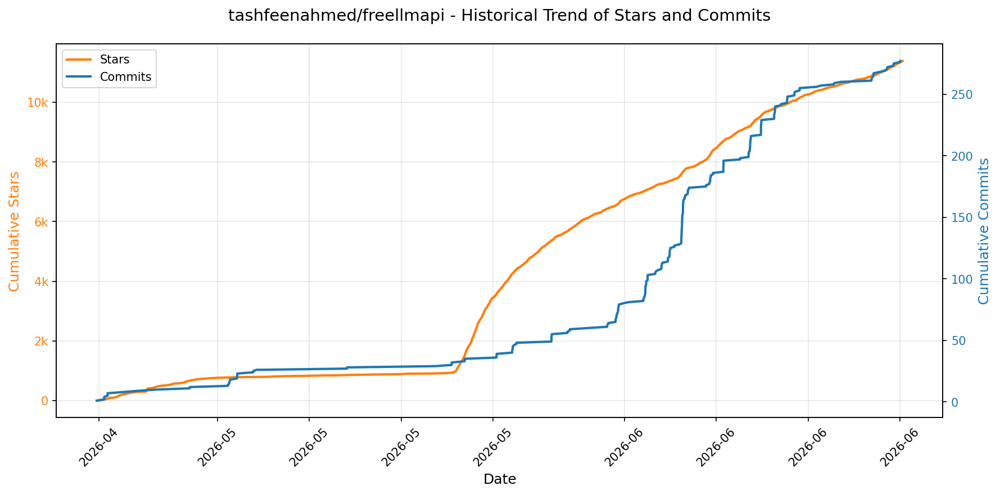

> *蓝色：累计 Stars｜橙色：累计 Commits（次 Y 轴）*

<b>📄 README 摘要</b>

1. **项目功能**  
FreeLLMAPI 是一个开源的、自托管的 AI 模型聚合代理服务，核心目标是将**16家主流免费大模型服务商（含 Google、Groq、Mistral、OpenRouter、GitHub Models、Cohere、NVIDIA、HuggingFace、Z.ai、Ollama 等）以及任意 OpenAI 兼容的本地/远程端点（如 llama.cpp、vLLM、LM Studio、Ollama 本地实例）**，统一抽象为**单个标准 OpenAI v1 API 接口（`/v1/chat/completions`）**。它自动管理各平台的免费配额（总计约每月 17 亿 tokens），在请求时智能路由：依据实时健康状态、剩余速率限制（RPM/TPM）、模型能力（文本/视觉/工具调用/嵌入）动态选择最优可用 provider；当某 provider 触发限流（429）、错误（5xx）或超时时，自动降级至下一备用 provider，实现高可用、免运维的“免费 LLM 池”。

2. **关键特性**  
- ✅ **全协议兼容**：原生支持 OpenAI Chat API（`/v1/chat/completions`, `/v1/models`, `/v1/embeddings`, `/v1/images/generations`, `/v1/audio/speech`）、Anthropic Messages API（`/v1/messages`）及 Codex-style Responses API（`/v1/responses`）；  
- ✅ **智能路由与弹性降级**：基于 per-key 的 RPM/TPD/TPM 实时用量追踪 + 健康探针（标记 `healthy`/`rate_limited`/`invalid`），支持最多 20 级 fallback 链；  
- ✅ **会话粘性与上下文延续**：30 分钟内多轮对话固定同一模型（防幻觉），可选启用 `context handoff` 在模型切换时注入系统提示以保持任务连贯；  
- ✅ **安全与权限隔离**：上游 API 密钥 AES-256-GCM 加密存储于 SQLite；对外仅暴露单一 `freellmapi-...` 统一令牌，完全隐藏敏感凭证；  
- ✅ **全模态支持**：文本生成、工具调用（含 Google Search 接地等 provider 特有扩展）、嵌入向量（同模型族内 fallback）、图像生成、TTS、多图输入（Vision 模型自动识别与路由）；  
- ✅ **生产就绪体验**：内置 React/Vite 管理后台（含密钥管理、fallback 排序、实时分析、Playground）、Docker 多架构镜像（ARM64/x86_64）、Windows/macOS/Linux 桌面应用（菜单栏常驻+实时统计弹窗）、本地开发与一键部署脚本；  
- ✅ **自动化模型目录更新**：免费版按月快照，付费版（$19/年）支持每 2–3 天从 `freellmapi.co` 拉取签名模型目录（含新模型、配额变更、适配修复），全程离线运行，不上传任何用户数据。

3. **技术栈**  
- **后端**：Node.js（≥ v20），Express.js 框架，SQLite（加密存储密钥与日志），`scrypt` 密码哈希（管理员登录）；  
- **前端**：React + Vite（管理后台与桌面应用 UI），支持深色模式；  
- **部署**：Docker（`ghcr.io/tashfeenahmed/freellmapi` 多架构镜像）、Docker Compose（推荐）、原生 Node.js 构建（`npm run build && node server/dist/index.js`）；  
- **桌面端**：Electron（打包为 macOS `.dmg` / Windows `.exe` 安装包）；  
- **安全机制**：AES-256-GCM（密钥静态加密）、Ed25519（模型目录签名验证）、Bearer Token（API 认证）、Session Token（管理员 UI 认证）；  
- **可观测性**：结构化请求日志（含延迟、token 数、成功率、provider 分布），默认保留 90 天或 10 万条。

---

### 36. [meshery/meshery](https://github.com/meshery/meshery)
- 📅 **创建日期**：2018-11-14  
- 🔄 **最近更新**：2026-06-22  
- ⭐ **Stars**：11,232（日 +39｜周 +781｜月 +1016）  
- 📝 **描述**：Meshery, the cloud native manager  

<b>📈 Star 与 Commit 历史趋势</b>

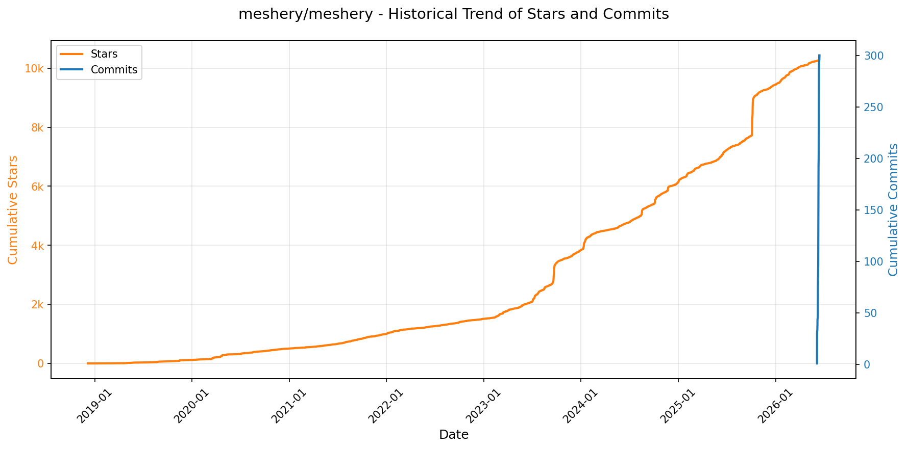

> *蓝色：累计 Stars｜橙色：累计 Commits（次 Y 轴）*

<b>📄 README 摘要</b>

1. **项目功能**  
Meshery 是一个开源、云原生的基础设施管理平台，作为云原生计算基金会（CNCF）正式毕业项目，旨在提供统一的“自服务工程平台”，用于设计、部署、运维和性能优化基于 Kubernetes 的多云与多集群环境。它抽象了底层 YAML/CLI 复杂性，通过可视化界面和 GitOps 工作流实现基础设施即代码（IaC）的协作式管理，支持从单集群开发环境到跨公有云、私有云及边缘的规模化生产级多租户场景。

2. **核心特性**  
- **全栈基础设施生命周期管理**：支持 380+ 云原生技术集成（包括 Istio、Linkerd、NGINX、Kong、Prometheus 等），覆盖服务网格、API 网关、可观测性、安全策略等组件；  
- **多集群 & 多云统一管控**：提供单一控制台管理跨云厂商（AWS EKS、Azure AKS、GCP GKE 等）及本地 Kubernetes 集群，实现配置一致性、策略统一下发与集中可观测性；  
- **可视化拓扑建模与智能关系推导**：基于图形化设计画布（MeshMap），自动识别并可视化资源间逻辑关系（如 Pod 挂载 PV、Service 关联 Deployment），支持自定义关系建模；  
- **GitOps 原生协同工作区（Workspaces）**：以团队为中心组织项目，集成 GitHub PR 预览（Infra-as-Code 变更快照）、环境（Environments）分组管理（连接凭证/集群配置）、RBAC 细粒度访问控制；  
- **上下文感知策略引擎**：深度集成 Open Policy Agent（OPA），无需编写 Rego 即可基于内置关系模板实施配置合规性检查与自动化策略执行；  
- **端到端性能工程能力**：内置 Fortio 负载生成器，支持 HTTP/gRPC/TCP 多协议压测；提供可复用的性能画像（Performance Profiles）、历史基线比对、Prometheus/Grafana 指标联动及符合 SMP（Service Mesh Performance）规范的标准化性能评估；  
- **企业级扩展架构**：开放 gRPC Adapter、热插拔 React 插件、Go 插件、NATS 订阅、REST/GraphQL API 等多维度扩展点，可构建内部开发者平台（IDP）；  
- **开箱即用的安全与合规保障**：通过 CNCF 认证、OpenSSF Scorecard 高分评级、CII 最佳实践认证，支持许可证扫描、SAST/DAST 集成及安全策略即代码。

3. **技术栈**  
- **后端**：Go（主服务、mesheryctl CLI、适配器框架）、gRPC（服务间通信）、NATS（事件驱动消息总线）；  
- **前端**：React（TypeScript）、Redux Toolkit、Tailwind CSS、Recharts（图表）；  
- **数据与存储**：PostgreSQL（主状态存储）、Redis（缓存与会话）、Prometheus（指标采集）、Grafana（可视化）；  
- **基础设施编排**：Kubernetes 原生 API、Helm（Chart 部署）、Kustomize、YAML/JSON Schema 验证；  
- **部署与分发**：Docker 容器化、Helm Chart（Artifact Hub 托管）、Linux/macOS/Windows 二进制 CLI（mesheryctl）、Docker Desktop 扩展、一键脚本安装；  
- **生态集成**：GitHub（PR 快照、Webhook）、Open Policy Agent（策略引擎）、Fortio（性能测试）、SMP 规范（性能标准化）、CloudEvents（事件互通）。

---

### 37. [topoteretes/cognee](https://github.com/topoteretes/cognee)
- 📅 **创建日期**：2023-08-16  
- 🔄 **最近更新**：2026-06-22  
- ⭐ **Stars**：11,183（日 +413｜周 +909｜月 +1305）  
- 📝 **描述**：Cognee is the open-source AI memory platform for agents. Give your AI agents persistent long-term memory across sessions with a self-hosted knowledge graph engine.  

<b>📈 Star 与 Commit 历史趋势</b>

> *蓝色：累计 Stars｜橙色：累计 Commits（次 Y 轴）*

<b>📄 README 摘要</b>

1. **项目功能**  
Cognee 是一个开源的 AI 记忆平台，专为 AI 智能体（Agents）设计，提供**跨会话、持久化、可演化的长期记忆能力**。它通过统一摄取任意格式的数据（文本、PDF、数据库、API 等），在本地自托管环境中自动构建并持续更新一个**动态知识图谱（Knowledge Graph）**，使智能体不仅能按语义检索信息（向量搜索），还能基于实体关系与认知科学驱动的本体（ontology）进行上下文感知的推理与联想。其核心目标是解决 LLM 缺乏真实长期记忆、上下文遗忘、跨任务知识无法沉淀等关键瓶颈，让智能体真正具备“学习—记忆—关联—行动”的闭环能力。

2. **关键特性**  
- **四维记忆操作 API**：提供 `remember`（存入永久图谱或临时会话内存）、`recall`（智能路由：优先查会话缓存，再回溯图谱，支持语义+关系混合查询）、`forget`（精准删除数据集/会话/节点）、`improve`（基于反馈优化图谱结构与本体）；  
- **双层记忆架构**：融合**会话级短期记忆**（高速缓存，异步同步至图谱）与**图谱级长期记忆**（持久化、可审计、支持多租户隔离）；  
- **认知增强的知识图谱**：结合 LLM 自动生成语义本体、动态演化关系、支持多模态数据建模，并通过图推理提升复杂问答与因果推断能力；  
- **开箱即用的集成生态**：原生支持 Claude Code 插件（自动捕获工具调用并桥接会话与长期记忆）、OpenClaw 插件；兼容 MCP（Model Context Protocol）标准；提供 CLI、Web UI（Docker 启动）及云服务（Cognee Cloud）接入；  
- **企业就绪能力**：支持租户/用户级数据隔离、完整操作审计追踪（OTEL 集成）、可追溯的决策链（audit traits）、本地化部署（无数据出域）、PostgreSQL/PGVector 与 Neo4j 双后端支持；  
- **场景化智能体赋能**：已验证于客户支持（跨渠道历史重建与相似案例复用）、SQL 辅助（专家查询模式提取与自适应迁移）等高价值用例。

3. **技术栈**  
- **核心语言**：Python（3.10–3.14）；  
- **AI/ML 层**：LLM 驱动的本体生成与图谱构建（支持 OpenAI、Anthropic 等多厂商 API）、向量嵌入（集成 PGVector）、图神经网络（GNN）启发的图推理；  
- **存储与图谱**：主存储为 PostgreSQL + PGVector（向量+结构化混合查询），可选 Neo4j（原生图数据库）；  
- **基础设施**：全栈容器化支持 — Docker / Docker Compose（含多配置 profile）、预构建镜像（Docker Hub）、一键部署至 Modal / Railway / Fly.io / Render / Daytona；  
- **协议与标准**：遵循 MCP（Model Context Protocol）规范，兼容 OpenClaw 生态；  
- **前端与交互**：内置 Web UI（React 基础，Docker 运行）、CLI 工具、Colab 快速体验环境；  
- **可观测性**：集成 OpenTelemetry（OTEL）实现全链路追踪与审计日志。

---

### 38. [phuryn/pm-skills](https://github.com/phuryn/pm-skills)
- 📅 **创建日期**：2026-03-01  
- 🔄 **最近更新**：2026-06-22  
- ⭐ **Stars**：10,591（日 +218｜周 +2153｜月 +8889）  
- 📝 **描述**：PM Skills Marketplace: 100+ agentic skills, commands, and plugins — from discovery to strategy, execution, launch, and growth.  

<b>📈 Star 与 Commit 历史趋势</b>

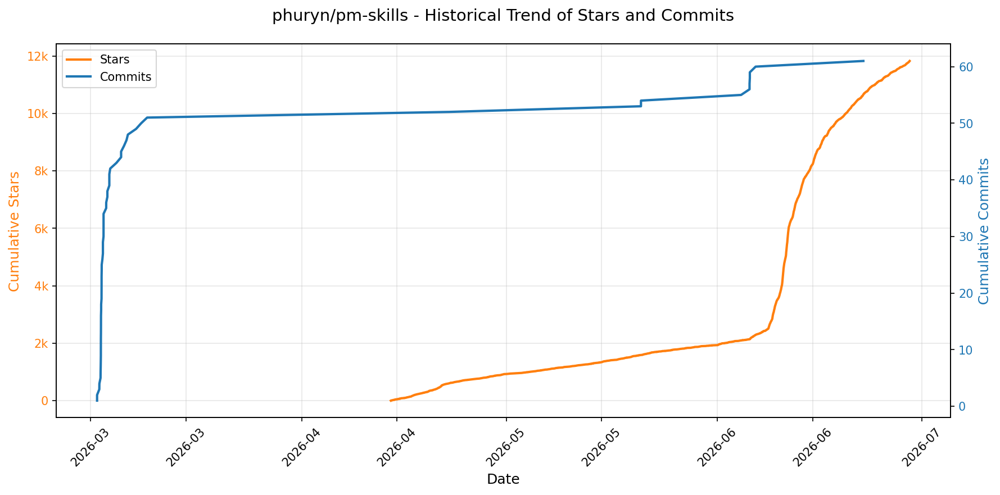

> *蓝色：累计 Stars｜橙色：累计 Commits（次 Y 轴）*

<b>📄 README 摘要</b>

1. **项目功能**  
该项目是一个面向产品经理（PM）的AI增强型工作平台，名为“PM Skills Marketplace”（PM技能市场），旨在将经过验证的产品管理方法论深度集成到AI助手（尤其是Claude系列）的工作流中。它不生成泛化文本，而是提供结构化、框架驱动的决策支持：覆盖从产品发现、战略制定、执行落地、上市推广、数据驱动增长到AI原生代码交付的全生命周期。核心价值在于将Teresa Torres、Marty Cagan、Alberto Savoia等业界权威的实战框架（如机会解决方案树、JTBD价值主张、预演式实验设计、PRD模板、OKR对齐、GTM策略等）转化为可被AI实时调用、组合与执行的“技能”（Skills）和“命令”（Commands），从而系统性提升产品决策质量，而非仅加速文档产出。

2. **关键特性**  
- **三层能力架构**：  
  - **Skills（技能）**：68个原子级PM知识模块，每个封装一个具体框架或方法论（如`opportunity-solution-tree`、`prioritize-assumptions`、`sql-queries`），支持自动触发或手动调用，是所有高级功能的基础；  
  - **Commands（命令）**：42个用户触发的端到端工作流（如`/discover`、`/write-prd`、`/plan-launch`），通过链式调用多个技能实现跨阶段任务（例如`/discover`自动串联“创意发散→假设识别→风险排序→实验设计”四步）；  
  - **Plugins（插件）**：9个领域化插件包（如`pm-product-discovery`、`pm-go-to-market`），按PM职能域组织技能与命令，支持按需安装与复用。  
- **智能工作流引导**：命令执行后自动推荐下一步操作（如完成`/discover`后提示`/strategy`或`/write-prd`），贴合真实PM工作节奏；  
- **多平台兼容性**：原生支持Claude Cowork（一键安装全部插件）、Claude Code（CLI安装）、Codex（OpenAI CLI，技能可用+命令需自然语言调用），并提供通用技能文件（`.md`格式），可手动适配Gemini、Cursor、Kiro等任意支持技能格式的AI工具；  
- **框架即服务（Framework-as-a-Service）**：所有技能均以标准化Markdown文档形式组织，开箱即用，开发者可直接阅读、修改或扩展，社区可贡献新技能（PR欢迎）。

3. **技术栈**  
- **核心格式**：基于纯文本的通用技能规范（`skills/*/SKILL.md`），遵循轻量、可读、可移植的设计原则，不依赖特定运行时；  
- **客户端集成**：深度适配Claude生态（Cowork图形界面 + Code CLI），利用其插件市场机制实现自动化加载与命令解析；  
- **跨平台支持层**：通过统一技能文件结构，实现零代码适配Codex、Gemini CLI、Cursor、Kiro、OpenCode等工具——仅需文件复制即可启用全部68项技能；  
- **CLI工具链**：依赖`claude`和`codex`官方CLI命令进行插件市场注册（`plugin marketplace add`）与插件安装（`plugin install/add`），无自研后端或云服务；  
- **协作与治理**：采用GitHub标准开源实践（MIT许可证）、PR欢迎政策、清晰的CONTRIBUTING指南，并与姊妹项目`pm-brain`形成能力互补。

---

### 39. [n0-computer/iroh](https://github.com/n0-computer/iroh)
- 📅 **创建日期**：2022-03-14  
- 🔄 **最近更新**：2026-06-22  
- ⭐ **Stars**：10,458（日 +85｜周 +1755｜月 +1865）  
- 📝 **描述**：IP addresses break, dial keys instead. Modular networking stack in Rust.  

<b>📈 Star 与 Commit 历史趋势</b>

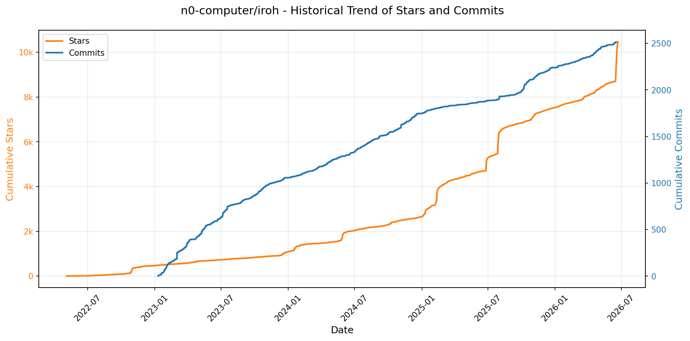

> *蓝色：累计 Stars｜橙色：累计 Commits（次 Y 轴）*

<b>📄 README 摘要</b>

1. **该项目做什么？**  
Iroh 是一个面向去中心化网络通信的底层协议栈，核心功能是提供基于公钥（而非 IP 地址或域名）的端到端连接建立能力。它自动发现、协商并维护两个对等节点之间的最优通信路径：优先尝试 P2P 直连（通过 NAT 穿透/打洞），失败时无缝回退至去中心化的公共中继网络（relay servers）。其目标是“为网络减少网络开销”（less net work for networks），即屏蔽底层网络拓扑复杂性，让开发者只需关注逻辑地址（公钥）和应用协议，无需手动处理连接管理、地址发现、NAT 穿透或中继调度。

2. **关键特性**  
- **公钥寻址与自动连接管理**：以 `EndpointId`（Ed25519 公钥）作为唯一标识，自动完成地址发现、连接建立、路径优化与故障恢复。  
- **智能连接路由**：内置 NAT 打洞（hole-punching）能力，并持续性能测量（[iroh-perf](https://perf.iroh.computer)）以选择最快路径；失败时自动切换至可扩展、开源的公共中继服务（`iroh-relay`）。  
- **QUIC 原生支持**：基于自研 QUIC 协议栈 [noq]，提供端到端加密认证、多路复用流（stream multiplexing）、流优先级、无队头阻塞（no head-of-line blocking）及可靠/不可靠数据报传输。  
- **模块化协议组合（Compose Protocols）**：提供可即插即用的上层协议库：  
  - `iroh-blobs`：基于 BLAKE3 内容寻址的高效二进制大对象传输（KB–TB 级别）；  
  - `iroh-gossip`：轻量级、手机级资源消耗的发布-订阅（pub/sub）覆盖网络；  
  - `iroh-docs`：最终一致性的键值存储，底层使用 `iroh-blobs` 存储数据。  
- **跨语言支持**：通过 `iroh-ffi` 提供 C FFI 接口，便于集成到 Rust 以外的语言生态（如 Python、Go、JS 等）。  
- **去中心化地址解析**：集成 DNS/PKARR 机制（由 `iroh-dns-server` 驱动），实现公钥到网络地址的分布式、抗审查解析（dns.iroh.link）。

3. **技术栈**  
- **主语言**：Rust（全栈编写，强调内存安全、并发性能与零成本抽象）；  
- **网络协议**：QUIC（基于自研 [noq](https://github.com/n0-computer/noq) 实现），替代传统 TCP/UDP；  
- **加密与哈希**：Ed25519 公钥体系（身份认证）、BLAKE3（内容寻址与完整性校验）；  
- **基础设施组件**：  
  - `iroh-relay`：Rust 编写的中继客户端与服务器（生产级部署）；  
  - `iroh-dns-server`：支持 PKARR 的轻量 DNS 服务器；  
  - `iroh-base`：共享基础类型（如 `EndpointId`, `RelayUrl`）；  
- **构建与生态**：Cargo 工作区（workspace）、CI/CD 基于 GitHub Actions；许可证为 MIT/Apache-2.0 双许可。

---

### 40. [DeusData/codebase-memory-mcp](https://github.com/DeusData/codebase-memory-mcp)
- 📅 **创建日期**：2026-02-24  
- 🔄 **最近更新**：2026-06-22  
- ⭐ **Stars**：10,272（日 +756｜周 +6770｜月 +7782）  
- 📝 **描述**：High-performance code intelligence MCP server. Indexes codebases into a persistent knowledge graph — average repo in milliseconds. 158 languages, sub-ms queries, 99% fewer tokens. Single static binary, zero dependencies.  

<b>📈 Star 与 Commit 历史趋势</b>

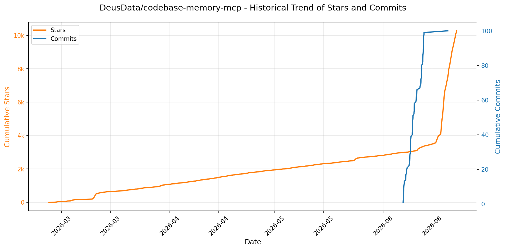

> *蓝色：累计 Stars｜橙色：累计 Commits（次 Y 轴）*

<b>📄 README 摘要</b>

1. **该项目的功能**  
该项目是一个面向AI编程代理（AI coding agents）的超高速、本地化代码智能引擎，核心功能是为任意代码仓库构建并维护一个持久化的、结构丰富的知识图谱（Knowledge Graph）。它不依赖外部LLM或云服务，而是作为MCP（Model Context Protocol）标准下的后端工具服务器运行，接收来自各类AI编码代理（如Claude Code、Gemini CLI等）的结构化查询请求（如“谁调用了ProcessOrder函数？”），并在毫秒级内返回精确的图谱关系结果。其本质是将代码库转化为可高效查询的语义化图数据库，从而替代传统低效的“逐文件grep/读取”模式，显著降低LLM上下文token消耗与工具调用次数。

2. **关键特性**  
- **极致性能**：全量索引Linux内核（2800万行代码、7.5万文件）仅需3分钟；结构化查询响应低于1ms；RAM优先流水线（LZ4压缩读取 + 内存SQLite + 单次落盘），索引完成后内存完全释放。  
- **多语言深度解析**：原生支持158种编程与配置语言，全部tree-sitter语法树（AST）解析能力静态编译进二进制；对Python、TS/JS、PHP、C#、Go、C/C++、Java、Kotlin、Rust共9种语言提供**Hybrid LSP混合语义类型解析**（纯C实现，兼容主流语言服务器逻辑），精准推导函数签名、类型、继承、导入、HTTP路由、gRPC服务等。  
- **14个开箱即用MCP工具**：涵盖结构搜索（`search_graph`）、语义搜索（`semantic_query`，内置nomic-embed-code向量模型）、调用链追踪（`trace_path`）、架构概览（`get_architecture`）、影响分析（`detect_changes`）、死代码检测、Cypher类图查询、ADR管理、跨服务HTTP/gRPC链接、跨仓库关联（`CROSS_*`边）、基础设施即代码（Docker/K8s/Kustomize）节点建模等。  
- **零依赖单体二进制**：macOS/Linux/Windows全平台支持（arm64/amd64），无Docker、无运行时依赖、无API密钥；自动识别并一键配置11种主流AI编码代理（Claude Code、Zed、VS Code等）的MCP集成（含指令文件、钩子、技能）。  
- **团队协同图谱工件**：支持将压缩的SQLite知识图谱（`.codebase-memory/graph.db.zst`）提交至Git仓库，新成员克隆后自动增量索引，避免重复耗时全量重建；采用`zstd -9`高压缩与`merge=ours`防冲突策略。  
- **内置3D图谱可视化UI**（可选）：启动`--ui=true`后访问`localhost:9749`，支持交互式探索函数、类、HTTP路由、跨服务连接等节点及关系。  
- **安全可信设计**：100%本地运行，代码永不离开设备；所有发布版二进制均经SLSA Level 3认证、OpenSSF Scorecard高分评估、VirusTotal全引擎扫描，并附带SHA-256校验与数字签名。

3. **技术栈**  
- **核心语言**：C（主体逻辑，含Hybrid LSP语义解析器）、C++（部分构建与工具链）  
- **解析引擎**：Tree-sitter（158种语言语法树，全部静态链接）  
- **存储与查询**：SQLite（内存中构建，持久化为本地文件；FTS5全文检索 + 自定义`cbm_camel_split`分词器）  
- **向量嵌入**：内置量化版Nomic `nomic-embed-code`（int8, 768维），无网络依赖  
- **压缩与序列化**：LZ4（索引流水线）、zstd 1.5.7（图谱快照压缩）  
- **协议与标准**：MCP（Model Context Protocol）v1兼容服务器  
- **构建与分发**：静态链接（musl libc / macOS dylib / Windows CRT）、支持Homebrew/Scoop/Winget/Chocolatey/AUR/npm/PyPI/go install多渠道分发  
- **基础设施解析**：自研Dockerfile/Kubernetes YAML/Kustomize解析器，生成`Resource`、`Module`等专用节点与`IMPORTS`边  
- **图算法**：Louvain社区发现、BFS路径追踪、MinHash+LSH近似克隆检测、Jaccard相似度计算等

---

### 41. [LMCache/LMCache](https://github.com/LMCache/LMCache)
- 📅 **创建日期**：2024-05-28  
- 🔄 **最近更新**：2026-06-22  
- ⭐ **Stars**：9,600（日 +57｜周 +485｜月 +1234）  
- 📝 **描述**：LMCache: Supercharge Your LLM with the Fastest KV Cache Layer  

<b>📈 Star 与 Commit 历史趋势</b>

> *蓝色：累计 Stars｜橙色：累计 Commits（次 Y 轴）*

<b>📄 README 摘要</b>

1. **项目功能**  
LMCache 是一个专为大语言模型（LLM）推理设计的 **KV 缓存管理中间层**，核心目标是将传统上仅作为临时运行状态的 KV 缓存，转化为可持久化存储、跨会话/引擎复用、可观测、可变换的“AI原生知识”。它显著降低首字延迟（TTFT），提升吞吐量，尤其适用于长上下文、多轮对话、智能体（agentic）任务及知识增强型场景（如RAG）。其本质是解耦并增强 KV 缓存生命周期管理，不替代推理引擎，而是作为基础设施层与之协同工作。

2. **关键特性**  
- **引擎无关部署**：以独立守护进程（daemon）运行，与推理引擎进程隔离，避免因引擎崩溃导致缓存丢失；  
- **分层持久化缓存**：支持将 KV 缓存逐级卸载至 CPU 内存、本地 SSD、远程存储（如 Redis/Valkey、S3 兼容对象存储、Mooncake、InfiniStore 等），实现跨请求、跨会话、跨引擎实例的缓存复用，减少重复 Prefill 计算；  
- **生产级可观测性**：提供全面监控指标，涵盖 Kubernetes 健康与性能诊断、KV 缓存专属指标（请求级/Token 级前缀命中率、缓存生命周期、生成质量影响）、用户用量统计等；  
- **可插拔后端架构**：通过统一接口支持多种存储与传输后端，已集成 CPU RAM、本地磁盘、Redis/Valkey、NIXL（NVLink/RDMA/TCP 传输）、GDS、S3 兼容存储等；  
- **非前缀缓存复用（Non-prefix reuse）**：基于 CacheBlend 技术，支持在提示词任意位置复用缓存块，并选择性重计算部分 Token 以保障生成质量；  
- **Prefill-Decode 解耦与 KV 传输**：支持通过 NVLink、RDMA 或 TCP 将 Prefill 阶段生成的 KV 缓存高效传输至 Decode 工作者节点；  
- **可插拔 KV 变换（Pluggable transformation）**：提供灵活 SERDE 接口，支持自定义压缩、Token 裁剪、序列化策略等研究与工程扩展。

3. **技术栈**  
- **核心语言**：Python（主框架与 CLI）、C++/CUDA（高性能底层组件，如 NIXL 传输、缓存序列化加速）；  
- **系统架构**：多进程（MP）架构（2026年4月发布），支持横向扩展与高并发；  
- **存储后端**：CPU 内存、本地 SSD、Redis / Valkey、S3 兼容对象存储、Mooncake、InfiniStore、NIXL（专为 KV 传输优化的低延迟网络层）、GDS（GPU Direct Storage）；  
- **硬件支持**：全栈跨平台，原生支持 NVIDIA GPU（含 GTC 生态集成）、AMD MI300X、Arm 架构及华为昇腾（Ascend）；  
- **生态集成**：深度适配主流开源推理框架（如 vLLM）、与 PyTorch 基金会合作、被 NVIDIA Dynamo 集成；  
- **部署与运维**：兼容 Kubernetes，提供 CLI 工具链、配置化部署方案及生产级监控能力。

---

### 42. [NVIDIA/SkillSpector](https://github.com/NVIDIA/SkillSpector)
- 📅 **创建日期**：2026-03-21  
- 🔄 **最近更新**：2026-06-22  
- ⭐ **Stars**：9,044（日 +294｜周 +3503｜月 +9026）  
- 📝 **描述**：Security scanner for AI agent skills. Detect vulnerabilities, malicious patterns, and security risks.  

<b>📈 Star 与 Commit 历史趋势</b>

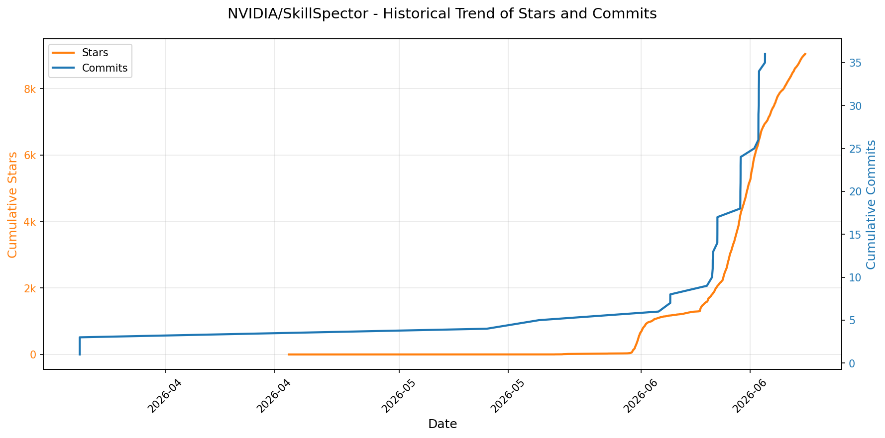

> *蓝色：累计 Stars｜橙色：累计 Commits（次 Y 轴）*

<b>📄 README 摘要</b>

1. **项目功能**  
SkillSpector 是一个专为 AI 智能体（AI agent）技能设计的安全扫描器，用于在安装前主动识别技能包中的安全风险。它面向 Claude Code、Codex CLI、Gemini CLI 等平台所使用的技能（如 `SKILL.md` 文件、工具脚本、依赖配置等），通过静态分析与可选的 LLM 语义分析双阶段机制，检测漏洞、恶意行为模式及潜在安全威胁，最终输出量化风险评分（0–100）与明确安装建议（如“DO NOT INSTALL”），帮助用户判断“该技能是否安全可安装”。

2. **核心特性**  
- **多源输入支持**：可直接扫描 Git 仓库、HTTP(S) URL、ZIP 压缩包、本地目录或单个文件（如 `SKILL.md`）；  
- **深度漏洞覆盖**：内置 **64 种漏洞模式**，覆盖 16 类高危场景，包括提示注入、数据外泄、提权、供应链攻击、过度自主性、系统提示泄露、内存污染、危险代码执行（AST 分析）、YARA 签名匹配、MCP 权限滥用（最小权限/工具投毒）等；  
- **双阶段分析引擎**：第一阶段为高速静态分析（正则+AST+依赖扫描+OSV.dev 实时 CVE 查询）；第二阶段为可选的 LLM 语义评估（支持 OpenAI/Anthropic/NVIDIA build.nvidia.com 及本地 Ollama/vLLM 等兼容端点），显著提升误报过滤能力（精度达 ~87%）；  
- **实时漏洞情报**：SC4 模块直连 [OSV.dev](https://osv.dev) 获取全量开源漏洞数据库（PyPI/npm）的最新 CVE 数据，支持离线自动降级至内置精简缓存；  
- **多格式输出**：支持终端彩色报告、机器可读 JSON、文档友好 Markdown 及 CI/CD/IDE 集成标准 SARIF 格式；  
- **结构化风险评估**：基于漏洞严重等级（CRITICAL/HIGH/MEDIUM/LOW）加权计分，并叠加可执行脚本系数（×1.3），生成 0–100 分风险值与四级严重性标签（LOW / MEDIUM / HIGH / CRITICAL），附带明确处置建议。

3. **技术栈**  
- **主语言**：Python 3.12+；  
- **核心分析技术**：正则表达式模式匹配、抽象语法树（AST）静态解析（针对 Python）、依赖清单解析（`requirements.txt`, `pyproject.toml` 等）、YARA 规则引擎集成；  
- **外部服务集成**：OSV.dev（CVE 实时查询）、OpenAI-compatible API（含 Anthropic、NVIDIA build.nvidia.com、Ollama、vLLM、llama.cpp 等）；  
- **构建与部署**：支持 `uv`/`pip` 包管理、Makefile 自动化流程、Docker 容器化（基于 `python:3.12-slim-bookworm`）；  
- **开发运维支撑**：采用模块化架构（含 provider 插件机制）、环境变量驱动配置、日志分级（DEBUG–ERROR）、测试覆盖率（pytest）、代码格式化（ruff/black）与静态检查（ruff）。

---

### 43. [calesthio/OpenMontage](https://github.com/calesthio/OpenMontage)
- 📅 **创建日期**：2026-03-29  
- 🔄 **最近更新**：2026-06-22  
- ⭐ **Stars**：8,979（日 +1772｜周 +4268｜月 +5085）  
- 📝 **描述**：World's first open-source, agentic video production system. 12 pipelines, 52 tools, 500+ agent skills. Turn your AI coding assistant into a full video production studio.  

<b>📈 Star 与 Commit 历史趋势</b>

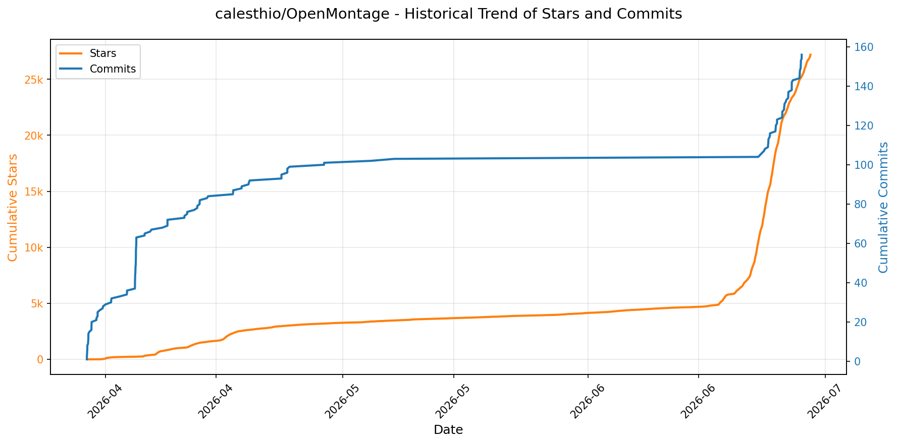

> *蓝色：累计 Stars｜橙色：累计 Commits（次 Y 轴）*

<b>📄 README 摘要</b>

1. **该项目的功能**  
OpenMontage 是首个开源、基于智能体（agentic）的端到端视频生产系统。它将 AI 编程助手（如 Claude Code、Cursor、Copilot 等）转化为全自动视频制作工作室：用户仅需用自然语言描述需求（例如“制作一段60秒的量子计算动画解说”），系统即可自主完成全流程——包括实时网络调研、脚本撰写与语音合成、AI图像/视频资产生成（或从免费开放资源库中检索真实动态影像）、分镜规划、多轨道剪辑、字幕精准对齐（词级时间戳）、音画合成及最终渲染输出。其核心突破在于：不仅能生成“图像序列+动效”的伪视频，更能真正构建基于**真实运动片段**（来自 Archive.org、NASA、Wikimedia Commons、Pexels 等免费开放影像库）的纪录片式蒙太奇，全程无需依赖付费视频生成 API。

2. **关键特性**  
- **12 种预置生产管线（Pipelines）**：覆盖动画解说、真人出镜（Talking Head）、影视级预告片（Cinematic）、纯实拍纪录片蒙太奇（Documentary Montage）、播客再创作、本地 SVG 角色动画、多语种本地化等全场景；  
- **参考视频驱动创作**：支持粘贴 YouTube/Short/TikTok 等链接，自动分析节奏、结构、风格与关键帧，生成保留优势、替换主题的差异化方案，并提供成本预估与样片预览；  
- **零 API 密钥可用性**：开箱即用 Piper TTS（离线高质量语音）、Remotion（React 动效合成）、HyperFrames（HTML/GSAP 高性能动效）、FFmpeg（专业后期）、WhisperX（词级字幕）、CLIP 检索（开放影像库）等全套免费工具链；  
- **生产级质量门控（Quality Gates）**：强制执行交付承诺验证、渲染前计划完整性检查、渲染后多维度自检（ffprobe 元数据、关键帧抽样、音频电平分析、字幕同步校验），杜绝低质输出；  
- **透明化智能体决策**：所有工具选择均按任务适配度、输出质量、可控性、可靠性、成本效率、延迟、连续性 7 维度打分并记录可审计日志；  
- **预算治理机制**：执行前精确成本估算、单步操作审批阈值、全局支出限额，杜绝意外费用；  
- **混合资源策略**：无缝融合本地生成（如 GPU 加速的 Wan2.1/LTX2/CogVideo）、云 API（Veo/Kling/FLUX/Suno/HeyGen）与开放存档资源，按需智能调度。

3. **技术栈**  
- **运行时环境**：Python 3.10+（主逻辑、Agent 调度、工具管理）、Node.js 18+（前端渲染引擎）；  
- **核心框架**：Remotion（React-based 视频合成，支持弹簧动画、数据可视化、词级字幕）、HyperFrames（HTML/CSS/GSAP 渲染，专精动态图形与 SVG 角色动画）；  
- **AI 工具层**：  
  - 文本/语音：Piper TTS（本地）、ElevenLabs、OpenAI TTS、Google Cloud TTS、Chirp3-HD；  
  - 图像/视频：FLUX、Veo（via FAL）、Kling（via FAL）、MiniMax、DALL·E 3、Imagen、Recraft、Runway Gen-4、HeyGen 网关、本地模型（Wan2.1、Hunyuan-1.5、LTX2、CogVideo）；  
  - 音乐：Suno、Google MusicFX、免版税曲库自动匹配；  
  - 字幕与语音处理：WhisperX（词级 ASR）、FFmpeg（硬字幕烧录）；  
  - 检索与素材库：CLIP 向量检索 + Archive.org / NASA / Wikimedia Commons / Pexels / Unsplash / Pixabay 开放媒体 API；  
- **基础设施**：FFmpeg（编码/混音/调色/字幕）、Git（版本协同）、Makefile（标准化构建）、.env 驱动的模块化配置；  
- **Agent 架构**：无中心编排器，完全依赖 AI 编程助手作为运行时智能体，通过 `AGENT_GUIDE.md` 和 400+ Markdown 格式技能文档（Skills）指导各阶段执行，所有工具通过 `tool_registry` 统一发现与调用。

---

### 44. [ogulcancelik/herdr](https://github.com/ogulcancelik/herdr)
- 📅 **创建日期**：2026-03-27  
- 🔄 **最近更新**：2026-06-22  
- ⭐ **Stars**：6,706（日 +143｜周 +1042｜月 +4595）  
- 📝 **描述**：agent multiplexer that lives in your terminal.  

<b>📈 Star 与 Commit 历史趋势</b>

> *蓝色：累计 Stars｜橙色：累计 Commits（次 Y 轴）*

<b>📄 README 摘要</b>

1. **项目功能**  
herdr 是一个运行于终端内的智能代理（AI agent）多路复用器（agent multiplexer），专为 AI 编程代理工作流设计。它在原生终端中提供持久化会话管理，支持工作区（workspaces）、标签页（tabs）和窗格（panes）三级组织结构；所有代理进程均以真实终端进程形式运行（非渲染模拟），用户始终直面代理自身的原始终端输出。核心价值在于：**在不脱离终端环境的前提下，实现对多个 AI 代理状态的实时感知、统一调度与无缝恢复**——例如自动识别代理处于“阻塞”（需人工输入）、“运行中”、“已完成但未查看”或“空闲”状态，并支持断开重连、远程 SSH 协作、跨会话状态恢复及代理原生会话迁移（handoff）。

2. **关键特性**  
- ✅ **全终端原生体验**：纯命令行工具，无 GUI、无 Electron、无平台绑定，单二进制（Rust 编译），可嵌套于 tmux 内运行；  
- ✅ **深度代理感知（Agent Awareness）**：通过进程名+终端输出启发式检测 + 官方集成插件，实时显示各代理的语义化状态（🔴阻塞 / 🟡运行中 / 🔵已完成 / 🟢已读空闲），支持状态聚合与快速扫描；  
- ✅ **强持久化与弹性会话**：客户端 detach 后服务端与所有代理进程持续运行；支持命名会话（named sessions）、远程 SSH 附着（`herdr --remote`）、服务重启后自动恢复代理进程（依赖集成插件）及实验性“热迁移”（`--handoff`）；  
- ✅ **鼠标优先交互**：原生支持点击切换、拖拽调整窗格大小、鼠标选中文本（兼容 PuTTY/SSH）、双击选词等；  
- ✅ **完备终端操作范式**：类 tmux 键绑定（默认前缀 `Ctrl+b`），支持窗格分割/交换/缩放、标签页管理、工作区增删改、键盘复制模式（`prefix+[` 进入 vi 风格文本选择）；  
- ✅ **开箱即用的 AI 代理支持**：内置 18+ 主流代理自动识别（Claude Code、Cursor、Devin、Copilot CLI、Kimi Code CLI、QoderCLI 等），提供官方集成安装（`herdr integration install xxx`）以启用会话身份识别与状态上报；  
- ✅ **扩展性强**：开放 Unix Socket API，允许 AI 代理主动创建工作区、控制窗格、读取输出、监听状态变更，实现双向协同；  
- ✅ **现代化终端体验**：18 套内置主题（Catppuccin、Tokyo Night、Gruvbox 等）、声音/弹窗通知（支持标签页级静音）、屏幕历史保留、SSH 远程保活等。

3. **技术栈**  
- **主语言**：Rust（构建轻量、安全、高性能的单二进制 CLI 工具）；  
- **架构模型**：Client-Server 架构（后台常驻 server 进程管理会话状态与代理进程，多个 client 可并发 attach/detach）；  
- **通信机制**：本地 Unix Domain Socket（用于 CLI 控制与 Agent 集成通信）；  
- **终端交互层**：基于底层终端能力（ANSI 序列、鼠标事件报告、键盘输入捕获），兼容主流终端（包括 SSH/PuTTY）；  
- **配置与扩展**：TOML 格式配置文件（`~/.config/herdr/config.toml`）、插件化集成系统（通过 `herdr integration install` 管理）、Socket API 协议；  
- **构建与分发**：Cargo 构建，支持多平台二进制发布（Linux/macOS 稳定版，Windows 预览版），并提供 Shell 脚本、PowerShell、Homebrew、mise 等多种安装方式；  
- **许可协议**：AGPL-3.0-or-later（开源）与商业授权双许可模式。

---

### 45. [withastro/flue](https://github.com/withastro/flue)
- 📅 **创建日期**：2026-02-07  
- 🔄 **最近更新**：2026-06-22  
- ⭐ **Stars**：6,334（日 +186｜周 +1357｜月 +2679）  
- 📝 **描述**：The sandbox agent framework.  

<b>📈 Star 与 Commit 历史趋势</b>

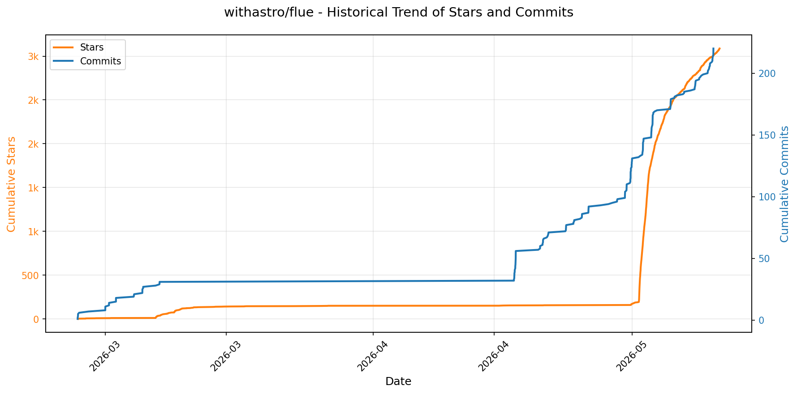

> *蓝色：累计 Stars｜橙色：累计 Commits（次 Y 轴）*

<b>📄 README 摘要</b>

1. **项目功能**  
Flue 是一个面向自主智能体（Autonomous Agents）的可编程 TypeScript 框架，旨在构建具备真实工作能力的 AI 代理系统。它不提供通用 SDK，而是通过声明式、类型安全的“代理挂载器”（Agent Harness）机制，使开发者能定义具备上下文记忆、工具调用、技能复用、沙箱执行和持久化状态的端到端智能体。典型场景包括：端到端 Bug 分析与修复、跨系统自动化任务编排、基于自然语言指令的自主软件工程等。代理可本地运行（CLI），也可部署至多种云/边缘运行时环境，直接接入现有业务系统（如 GitHub、Slack、Teams 等）。

2. **核心特性**  
- **自主代理（Agents）**：支持跨会话上下文保持与目标驱动的自主决策；  
- **结构化工作流（Workflows）**：代码主导的确定性自动化流程，确保输入→输出的可控性；  
- **安全沙箱（Sandboxes）**：内置虚拟/本地/远程容器沙箱，支持文件系统操作与工具执行，隔离风险；  
- **持久化执行（Durable Execution）**：自动保存中间状态，支持故障恢复与断点续跑；  
- **子代理（Subagents）**：支持角色化分工与任务委派，实现多专家协同；  
- **强类型工具（Tools）**：提供 TypeScript 类型定义的 API 调用能力，支持 MCP（Model Context Protocol）标准集成；  
- **可复用技能（Skills）**：以 Markdown + 元数据形式封装领域知识与操作范式，即插即用；  
- **全链路可观测性（Observability）**：原生集成 OpenTelemetry、Sentry、Braintrust 等监控生态；  
- **多通道事件接入（Channels）**：开箱支持 GitHub、Slack、Microsoft Teams、Discord 等平台的认证事件接收与响应。

3. **技术栈**  
- **核心语言与类型系统**：TypeScript（深度类型推导与编译时校验）；  
- **运行时**：Node.js（主运行环境），同时支持 Cloudflare Workers、GitHub Actions、GitLab CI/CD、Render、Daytona 等多平台部署；  
- **核心包体系**：  
  - `@flue/runtime`：核心运行时，含代理生命周期管理、会话、工具注册、沙箱抽象；  
  - `@flue/cli`：开发与构建工具链（`flue dev` / `flue build` / `flue deploy`）；  
  - `@flue/sdk`：客户端 SDK，用于调用已部署的代理与工作流；  
  - `@flue/opentelemetry` 和 `@flue/postgres`：标准化可观测性与持久化扩展适配器；  
- **协议与标准**：原生支持 [Model Context Protocol (MCP)](https://modelcontextprotocol.dev/)，实现与认证工具服务的安全互操作；  
- **基础设施抽象**：沙箱层统一抽象本地进程、Docker 容器及远程服务，保障一致执行语义。

---

### 46. [palmier-io/palmier-pro](https://github.com/palmier-io/palmier-pro)
- 📅 **创建日期**：2026-04-07  
- 🔄 **最近更新**：2026-06-22  
- ⭐ **Stars**：5,504（日 +1863｜周 +5474｜月 +5502）  
- 📝 **描述**：macOS video editor built for AI  

<b>📈 Star 与 Commit 历史趋势</b>

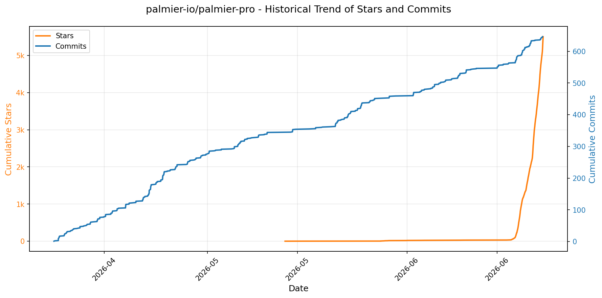

> *蓝色：累计 Stars｜橙色：累计 Commits（次 Y 轴）*

<b>📄 README 摘要</b>

1. **项目功能**  
Palmier Pro 是一款专为人工智能工作流深度优化的 macOS 原生视频编辑器，核心定位是实现“人类编辑者与 AI 代理协同创作”。它允许用户在时间线上直接生成（如通过内置模型生成视频/图像）和编辑视频，并支持与外部 AI 代理（如 Claude、Codex、Cursor 等）通过 MCP（Model Context Protocol）协议实时联动——代理可读取时间线状态、执行剪辑操作、添加素材或修改参数，真正实现人机在同一工程中并行协作。

2. **关键特性**  
- ✅ **Swift 原生开发**：完全基于 Swift 构建，针对 Apple Silicon 和 macOS 26（Tahoe）深度优化，追求专业级性能与原生体验；  
- ✅ **内置生成式 AI 工具链**：集成 Seedance、Kling、Nano Banana Pro 等前沿开源/商用视频/图像生成模型，支持在时间线内一键生成片段、封面图或动态元素；  
- ✅ **MCP 协议深度集成**：运行时自动启动本地 MCP 服务（`http://127.0.0.1:19789/mcp`），提供对 Claude Code/Desktop、Codex、Cursor 的一键配置支持，实现代理对时间线结构、轨道、关键帧等编辑状态的语义化访问与操作；  
- ✅ **开源+混合授权模式**：视频编辑核心、MCP 服务器及聊天界面完全开源（GPLv3），仅生成式 AI 推理模块闭源；  
- ✅ **零门槛基础使用**：无需注册即可免费使用全部非 AI 编辑功能（剪辑、转场、调色、导出等），AI 功能需登录订阅。

3. **技术栈**  
- **客户端框架**：Swift + SwiftUI（macOS 原生 UI）、AVFoundation（专业音视频处理）、Metal（GPU 加速渲染与 AI 推理加速）；  
- **AI 集成层**：本地/远程调用 SOTA 视频生成模型（Seedance/Kling/Nano Banana Pro），通过私有闭源推理引擎封装；  
- **协作协议**：Model Context Protocol（MCP）标准，HTTP 传输，兼容主流 AI 开发工具链；  
- **基础设施**：内置轻量级 MCP 服务器（Rust 或 Swift 实现）、本地文件系统工程管理、支持 `.palmier` 专有工程格式；  
- **构建与分发**：Xcode 构建，`.dmg` 安装包，强制依赖 Apple Silicon（ARM64）及 macOS 26（Tahoe）系统。

---

### 47. [mikumifa/biliTickerBuy](https://github.com/mikumifa/biliTickerBuy)
- 📅 **创建日期**：2023-04-23  
- 🔄 **最近更新**：2026-06-22  
- ⭐ **Stars**：3,736（日 +78｜周 +394｜月 +474）  
- 📝 **描述**：b站会员购购票辅助工具  

<b>📈 Star 与 Commit 历史趋势</b>

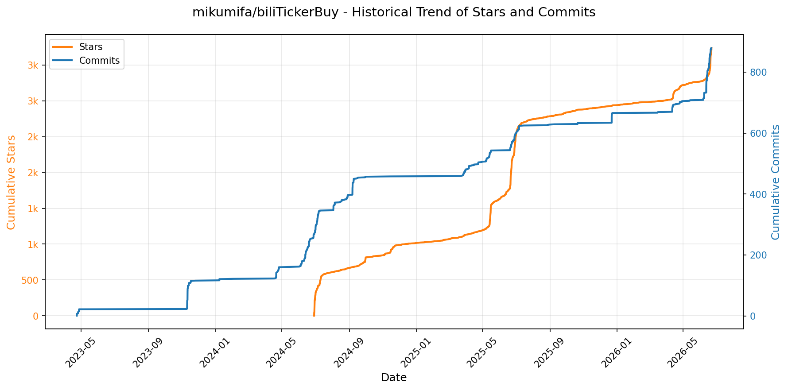

> *蓝色：累计 Stars｜橙色：累计 Commits（次 Y 轴）*

<b>📄 README 摘要</b>

1. **项目功能**  
该项目是一个开源、免费、轻量级的 Bilibili（B站）会员购抢票辅助工具，旨在帮助用户在B站会员购活动中更高效地参与商品（如演唱会门票、周边等）的限时抢购。它不提供全自动代抢服务，而是通过增强用户端操作体验（如自动刷新、倒计时提醒、快捷提交等）提升手动抢购成功率，强调合规、低侵入性与个人学习研究用途。

2. **核心功能**  
- 支持B站会员购页面的快速响应与关键节点监控（如开售倒计时、按钮状态变化）；  
- 提供可视化界面与交互优化（如一键刷新、防误触设计、抢购成功提示）；  
- 遵循“非侵入式”原则，不注入脚本、不模拟登录、不绕过前端校验，所有操作基于用户浏览器环境主动触发；  
- 提供清晰的使用文档与飞书在线说明书；  
- 支持问题反馈与社区讨论（GitHub Discussions / Issues）；  
- 衍生版本覆盖不同需求：Skill版（技能增强型）、Storm版（分布式协同抢购架构，实验性质）。

3. **技术栈**  
- 前端：基于 Electron 构建跨平台桌面应用（支持 Windows/macOS/Linux），使用 HTML/CSS/JavaScript（未明确提及框架，推测为原生或轻量级方案）；  
- 构建与发布：GitHub Actions 自动化构建与 Release 管理；  
- 文档与协作：Markdown 文档（如 `installation.md`）、飞书知识库托管说明书；  
- 开源协议：MIT License；  
- 辅助生态：Shields.io 生成状态徽章、Star History 图表、contrib.rocks 展示贡献者、Trendshift 监测项目热度。

---

### 48. [openai/plugins](https://github.com/openai/plugins)
- 📅 **创建日期**：2026-03-04  
- 🔄 **最近更新**：2026-06-22  
- ⭐ **Stars**：3,328（日 +51｜周 +274｜月 +2123）  
- 📝 **描述**：OpenAI Plugins  

<b>📈 Star 与 Commit 历史趋势</b>

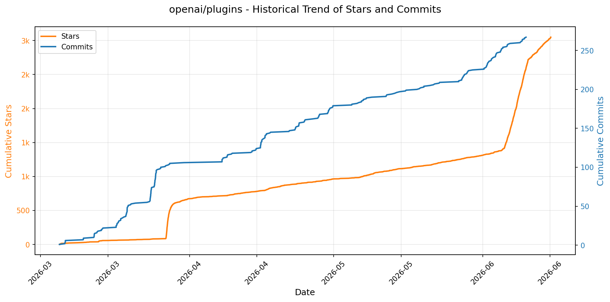

> *蓝色：累计 Stars｜橙色：累计 Commits（次 Y 轴）*

<b>📄 README 摘要</b>

1. **项目功能**  
该项目是一个为 Codex 平台（可能为 Anthropic 的 Claude Codex 或类似 AI 编程助手生态）构建的插件示例集合仓库，旨在提供可即用、可参考、可复用的官方插件模板与实践案例。它不提供运行时服务或独立应用，而是作为插件开发的标准结构参考和市场分发基础——所有插件均按统一目录规范组织，并通过 marketplace.json 文件注册到 Codex 的插件市场中，支持用户（尤其是 API Key 登录用户）发现、安装和启用对应能力。

2. **核心特性**  
- **标准化插件结构**：每个插件严格遵循 `plugins/<name>/.codex-plugin/plugin.json` 清单文件定义，并支持扩展组件，包括技能（`skills/`）、应用配置（`.app.json`）、MCP（Model Control Protocol）声明（`.mcp.json`）、智能体（`agents/`）、命令（`commands/`）、钩子（`hooks.json`）及静态资源（`assets/`）等；  
- **双市场支持**：内置默认市场（`.agents/plugins/marketplace.json`）面向通用用户，另设 API Key 用户专属市场（`.agents/plugins/api_marketplace.json`），实现权限与能力分级；  
- **领域深度插件示例**：涵盖多端开发（iOS/macOS/Web/Expo）、设计协同（Figma）、知识管理（Notion）、云部署（Netlify）、动态视频生成（Remotion）、办公自动化（Google Slides）等高价值场景，且每个插件均体现完整工作流（如“Code to Canvas”“build/run/debug loop”“EAS workflows”）；  
- **开箱即用的工程化实践**：插件不仅封装功能，还集成设计系统规则、性能优化建议、调试指南、SDK 升级路径等工程最佳实践，兼具功能性与教学性。

3. **技术栈**  
- **平台层**：基于 Codex 插件框架（含 `.codex-plugin/` 规范、MCP 协议支持、`.app.json` 应用生命周期配置）；  
- **协议与标准**：Model Control Protocol（MCP）用于模型-工具交互控制，JSON 格式清单与配置驱动（`plugin.json`, `hooks.json`, `marketplace.json`）；  
- **开发语言与生态**：插件本身以通用 JSON/YAML 配置为主，但所封装能力深度绑定各目标平台原生技术栈——如 SwiftUI/AppKit（macOS/iOS）、React Native/Expo（跨端）、HTML/CSS/JS + 云服务（Web）、Figma Plugin API、Notion API、Netlify CLI、Remotion TypeScript 渲染管线、Google Slides API 等；  
- **基础设施**：依赖 Codex 运行时环境执行插件逻辑，本地无独立后端或构建系统，强调轻量集成与声明式能力注册。

---

