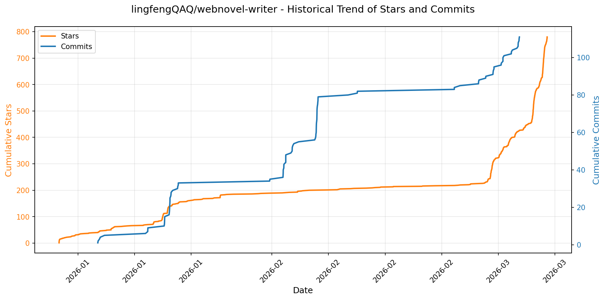
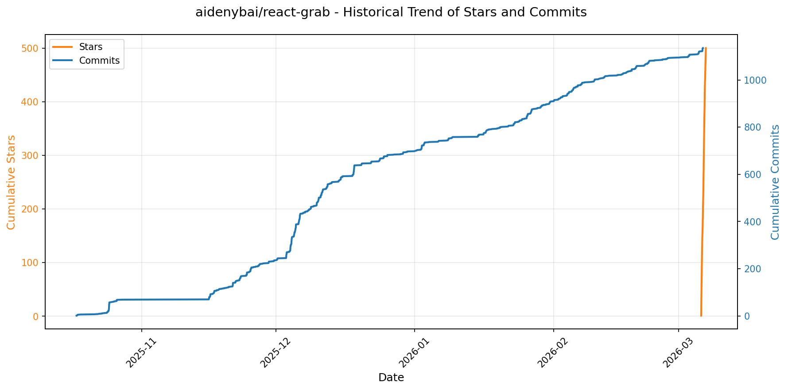

# 🌟 GitHub Trending 概览

> 数据更新于：2026-03-07

---

## 🔍 项目详情

### 1. [openclaw/openclaw](https://github.com/openclaw/openclaw)
- 📅 **创建日期**：2025-11-24  
- 🔄 **最近更新**：2026-03-07  
- ⭐ **Stars**：158,452（日 +5619｜周 +35303｜月 +110986）  
- 📝 **描述**：Your own personal AI assistant. Any OS. Any Platform. The lobster way. 🦞   

<b>📈 Star 与 Commit 历史趋势</b>

> *蓝色：累计 Stars｜橙色：累计 Commits（次 Y 轴）*

<b>📄 README 摘要</b>

1. **项目功能**  
OpenClaw 是一个完全本地化、用户自托管的个人 AI 助手系统，核心目标是让用户在自有设备上运行一个低延迟、始终在线、隐私优先的 AI 助理。它不依赖中心化云服务，而是通过轻量级「网关（Gateway）」作为统一控制平面，将 AI 能力无缝接入用户日常使用的全部通信渠道（共支持 25+ 种平台，包括 WhatsApp、Telegram、Slack、Discord、Signal、iMessage/BlueBubbles、微信替代品 Feishu/LINE/Zalo、企业协作工具如 Microsoft Teams/Mattermost/Nextcloud Talk、去中心化协议如 Matrix/Nostr，以及 WebChat 等），并扩展至多端交互能力：支持 macOS/iOS/Android 的语音唤醒（Wake Word）、实时语音对话（Talk Mode）、设备级操作（摄像头、屏幕录制、定位、通知、系统命令等），以及由 AI 驱动的动态可视化工作区——「Live Canvas」（基于 A2UI 协议）。其本质是将大模型能力深度嵌入真实数字生活场景，实现“AI 在你已有的界面上工作”。

2. **关键特性**  
- **全通道统一收件箱**：原生集成 25+ 消息平台，支持群组路由（提及触发、回复标签、分块处理）、多账号隔离与细粒度 DM 安全策略（默认配对制防未授权输入）。  
- **多智能体路由架构**：支持按渠道、账号或联系人将消息分发至独立工作区（workspace）和隔离会话（session），实现任务/角色/上下文分离。  
- **跨端语音与感知能力**：macOS/iOS 支持离线唤醒词检测；Android 支持连续语音输入；全平台支持 TTS/STT（ElevenLabs + 系统兜底），并打通设备传感器（相机、麦克风、位置、通知、屏幕录制等）。  
- **Live Canvas 可视化工作区**：AI 可实时生成、更新、执行 Canvas 界面（A2UI 标准），支持快照、评估、脚本注入，成为 AI 的“桌面操作系统”。  
- **本地优先自动化工具链**：内置浏览器控制（专用 Chromium + CDP）、Cron 定时任务、Webhook 接入、Gmail Pub/Sub、节点（Nodes）系统（如 `location.get`、`system.run`）、技能（Skills）平台（ClawHub 注册与自动拉取）。  
- **安全与运维完备性**：默认 DM 配对机制、Tailscale Serve/Funnel 远程安全访问、SSH 隧道支持、Nix/Docker 声明式部署、CLI 医生（`openclaw doctor`）自动诊断、会话流控/重试/剪枝、模型故障转移（failover）与 OAuth/API Key 认证轮转。  
- **开箱即用的向导体验**：`openclaw onboard` 交互式 CLI 向导覆盖网关安装、通道配对、技能启用、安全策略配置全流程，支持 macOS/Linux/WSL2。

3. **技术栈**  
- **运行时**：Node.js ≥22（主运行环境），支持 npm/pnpm/bun；TypeScript 编写，使用 `tsx` 直接运行源码。  
- **核心架构**：WebSocket 驱动的单网关控制平面（Gateway），采用 RPC 模式运行 Pi Agent（轻量级 AI 运行时），支持工具流式调用与响应块流式传输。  
- **前端与 UI**：内置 Control UI 与 WebChat 界面（由 Gateway 直接提供）；Canvas 基于 A2UI 协议；macOS/iOS/Android 分别提供原生应用与节点（Node）服务，通过 `node.invoke` 协议调用系统能力（需 TCC 权限）。  
- **通道集成**：复用成熟 SDK，如 Baileys（WhatsApp）、grammY（Telegram）、discord.js（Discord）、Bolt（Slack）、signal-cli（Signal）、matrix-js-sdk（Matrix）等。  
- **部署与运维**：支持 systemd（Linux）/launchd（macOS）守护进程、Docker 容器化、Nix 声明式配置、Tailscale 网络暴露（Serve/Funnel）、SSH 隧道远程连接。  
- **AI 与模型层**：抽象模型接口，兼容 OpenAI（ChatGPT/Codex）等主流提供商；支持模型配置、OAuth 与 API Key 认证、多模型 fallback 策略及 prompt 注入防护优化。

---

### 2. [obra/superpowers](https://github.com/obra/superpowers)
- 📅 **创建日期**：2025-10-09  
- 🔄 **最近更新**：2026-03-07  
- ⭐ **Stars**：101,860（日 +965｜周 +8117｜月 +28711）  
- 📝 **描述**：An agentic skills framework & software development methodology that works.  

<b>📈 Star 与 Commit 历史趋势</b>

> *蓝色：累计 Stars｜橙色：累计 Commits（次 Y 轴）*

<b>📄 README 摘要</b>

1. **项目功能**  
Superpowers 是一个面向编程智能体（coding agents）的完整软件开发工作流增强系统。它不直接替代或重写代码，而是通过一套可组合、自动触发的“能力（skills）”对现有编码智能体（如 Claude Code、Cursor、Codex、OpenCode 等）进行赋能，使其在真实开发场景中遵循工程化、可验证、协作友好的实践流程。其核心作用是：在用户启动编码任务后，主动暂停“写代码”行为，转而引导用户完成需求澄清 → 分块设计确认 → 生成可执行计划 → 自主/受控子智能体协同实施 → 严格 TDD 执行 → 多层质量审查 → 安全分支收尾的全流程闭环，实现从“想法”到“可交付代码”的结构化、自动化、可审计的开发演进。

2. **关键特性**  
- **全自动技能触发机制**：无需手动调用，智能体在每个开发环节前自动识别并激活对应技能（如设计阶段触发 `brainstorming`，编码前触发 `test-driven-development`），所有技能为强制性工作流，非可选建议。  
- **七阶段标准化工作流**：覆盖从需求探索（brainstorming）、隔离开发环境搭建（using-git-worktrees）、原子化任务拆解（writing-plans）、子智能体协同开发（subagent-driven-development）、红绿重构式 TDD（test-driven-development）、跨任务质量审查（requesting-code-review）到分支收尾（finishing-a-development-branch）的完整生命周期。  
- **深度工程实践内嵌**：强制推行 RED-GREEN-REFACTOR 测试先行、YAGNI（不过度设计）、DRY（避免重复）、防御性调试（systematic-debugging）、双阶段代码审查（先验规范符合性，再审代码质量）、Git worktree 并行开发等工业级实践。  
- **人类中心协作设计**：所有设计文档分块呈现供人工审阅；计划明确到文件路径与具体代码变更；关键节点设置人工确认点（如“go”指令启动执行）；审查结果按严重等级阻断流程，确保人始终掌握最终决策权。  
- **可扩展技能生态**：内置测试、调试、协作、元能力（如 `writing-skills`）四大类共 14+ 预置技能，支持开发者依据统一规范贡献新技能，形成可持续演进的能力库。

3. **技术栈**  
- **运行平台**：原生适配主流 AI 编程工具插件生态，包括 **Claude Code**（通过插件市场）、**Cursor**（Agent 内置插件系统）、**Codex** 和 **OpenCode**（需手动拉取配置），不依赖特定模型或后端服务，纯前端/客户端侧技能注入。  
- **架构范式**：基于“技能（Skill）”的声明式、模块化设计，每个技能为独立 Markdown 文档（如 `skills/test-driven-development/SKILL.md`），含行为定义、触发条件、执行逻辑与验证规则，由宿主智能体解析调度。  
- **基础设施**：依托 GitHub 仓库托管全部技能源码与文档；使用 `.codex/`、`.opencode/` 等目录存放平台专属安装脚本；通过 `plugin install/update` 命令实现技能的版本化分发与热更新。  
- **哲学与方法论支撑**：深度整合敏捷工程实践（TDD、YAGNI、DRY）、系统性调试理论（四阶段根因分析）、Socratic 式协作设计法及证据驱动开发范式，所有技术实现均服务于这些原则的自动化落地。

---

### 3. [virattt/ai-hedge-fund](https://github.com/virattt/ai-hedge-fund)
- 📅 **创建日期**：2024-11-29  
- 🔄 **最近更新**：2026-03-07  
- ⭐ **Stars**：46,545（日 +167｜周 +409｜月 +860）  
- 📝 **描述**：An AI Hedge Fund Team  

<b>📈 Star 与 Commit 历史趋势</b>

> *蓝色：累计 Stars｜橙色：累计 Commits（次 Y 轴）*

<b>📄 README 摘要</b>

1. **项目功能**  
该项目是一个面向教育与研究目的的AI对冲基金概念验证系统，旨在模拟多智能体协同的量化投资决策流程。它不执行真实交易，而是通过18个专业化AI代理（agents）对股票进行多维度分析与信号生成，最终由组合经理代理汇总决策并输出模拟交易建议。支持对指定股票（如AAPL、MSFT等）进行回测分析或按时间窗口生成投资信号，全部过程仅用于学习、实验和算法探索。

2. **核心特性**  
- **18个专业投资风格代理协同工作**：涵盖价值投资（Ben Graham、Warren Buffett、Charlie Munger）、成长投资（Cathie Wood、Phil Fisher）、逆向/宏观/激进策略（Michael Burry、Stanley Druckenmiller、Bill Ackman）及印度市场代表（Rakesh Jhunjhunwala）等多元流派，每位代理基于其标志性理念独立生成观点；  
- **四维分析引擎**：集成估值代理（内在价值计算）、情绪代理（市场情绪分析）、基本面代理（财务与业务数据解读）、技术面代理（技术指标研判），提供交叉验证信号；  
- **风控与组合管理闭环**：风险管理员动态计算波动率、夏普比率等指标并设定仓位上限；组合经理融合所有信号，执行最终决策与订单生成；  
- **双模运行支持**：既可通过命令行（CLI）灵活调用（支持本地Ollama模型、自定义日期范围、多标的批量分析及完整回测），也提供图形化Web应用界面，降低使用门槛；  
- **零实盘风险设计**：明确声明不连接任何交易接口，所有输出仅为模拟建议，强调教育属性与合规免责。

3. **技术栈**  
- **编程语言**：Python（主框架，含Poetry依赖管理）；  
- **大语言模型（LLM）支持**：兼容OpenAI（GPT-4o系列）、Anthropic、Groq、DeepSeek及本地Ollama部署的多种模型，作为各投资代理的推理引擎；  
- **金融数据源**：依赖Financial Datasets API获取实时/历史行情与基本面数据（部分美股免费，扩展标的需API密钥）；  
- **架构模式**：模块化多Agent系统设计，各代理职责解耦，通过标准化接口通信；  
- **部署与交互层**：CLI工具（`src/main.py` / `src/backtester.py`） + 独立Web应用（位于`/app`目录，具体技术未详述但属Python生态常见方案如FastAPI+React或Streamlit）；  
- **环境管理**：使用`.env`文件集中配置API密钥，Poetry统一管理Python依赖与虚拟环境。

---

### 4. [shareAI-lab/learn-claude-code](https://github.com/shareAI-lab/learn-claude-code)
- 📅 **创建日期**：2025-06-29  
- 🔄 **最近更新**：2026-03-07  
- ⭐ **Stars**：37,166（日 +689｜周 +3421｜月 +6181）  
- 📝 **描述**：Bash is all you need -  A nano Claude Code–like agent, built from 0 to 1  

<b>📈 Star 与 Commit 历史趋势</b>

> *蓝色：累计 Stars｜橙色：累计 Commits（次 Y 轴）*

<b>📄 README 摘要</b>

1. **项目功能**  
该项目是一个面向教学的轻量级AI编程智能体（nano Claude Code-like agent）开发实践仓库，旨在从零开始、循序渐进地构建一个具备真实工程逻辑的代码协作智能体。它不追求生产级完备性，而是通过**12个严格递进的会话（s01–s12）**，逐层叠加核心机制，完整呈现AI编码智能体的内在运行范式——即“LLM + 工具调用循环”这一最小可行闭环，并在此基础上演进出规划、知识加载、上下文管理、后台执行、多智能体协作与工作区隔离等关键能力。最终目标是让学习者透彻理解现代AI编程助手（如Claude Code）的底层架构逻辑与扩展路径。

2. **核心特性**  
- **渐进式教学设计**：12个会话严格遵循“每步只加一个机制、不修改基础循环”的原则，每个会话配有一句精炼口诀（如“一个循环 + Bash 就够了”“任务太大就分给队友”），强化心智模型；  
- **真实Agent模式实现**：基于Anthropic API的`tool_use`/`tool_result`机制构建标准Agent循环，支持工具调用→执行→结果注入→继续推理的完整反馈链；  
- **四大能力演进体系**：  
  ▪️ **规划与知识管理**（s03–s06）：引入待办清单、子智能体隔离上下文、按需加载技能文档（SKILL.md）、三层上下文压缩策略；  
  ▪️ **持久化与异步执行**（s07–s08）：基于文件的任务图（含依赖）、后台守护线程执行长耗时命令并异步通知；  
  ▪️ **多智能体协作**（s09–s11）：JSONL邮箱协议实现持久化队友、统一请求-响应协商协议、自主扫描认领任务的去中心化调度；  
  ▪️ **执行环境隔离**（s12）：以任务ID绑定独立工作目录（worktree），保障多任务并行时的文件系统与状态隔离；  
- **配套交互学习平台**：内置Next.js Web应用（`web/`），提供可视化流程图、代码逐行解析、文档集成与实时演示；  
- **明确范围界定**：主动省略生产级复杂度（如完整事件总线、RBAC权限、OAuth认证、MCP运行时细节），聚焦可理解、可复现的核心范式。

3. **技术栈**  
- **核心语言与框架**：Python（主逻辑实现，含12个`agents/sXX_*.py`参考实现）、Next.js（Web学习平台，TypeScript + React）；  
- **AI服务依赖**：Anthropic Claude 系列大模型（通过`anthropic`官方SDK调用，需配置`ANTHROPIC_API_KEY`）；  
- **关键协议与格式**：JSONL（多智能体邮箱通信）、Markdown（技能文档`skills/`）、纯文本任务文件（s07任务系统）；  
- **基础设施**：Bash/Linux命令行工具（作为默认基础工具载体）、Daemon线程（s08后台执行）、文件系统（s07/s12持久化与隔离）；  
- **辅助生态**：MIT许可证、GitHub Actions CI（类型检查+构建）、多语言文档（EN/ZH/JP）、配套CLI（Kode Agent CLI）与SDK（Kode Agent SDK）延伸项目。

---

### 5. [anthropics/prompt-eng-interactive-tutorial](https://github.com/anthropics/prompt-eng-interactive-tutorial)
- 📅 **创建日期**：2024-04-02  
- 🔄 **最近更新**：2026-03-07  
- ⭐ **Stars**：31,968（日 +150｜周 +2190｜月 +3232）  
- 📝 **描述**：Anthropic's Interactive Prompt Engineering Tutorial  

<b>📈 Star 与 Commit 历史趋势</b>

> *蓝色：累计 Stars｜橙色：累计 Commits（次 Y 轴）*

<b>📄 README 摘要</b>

1. **该项目做什么？**  
该项目是 Anthropic 官方推出的、面向 Claude 大语言模型（特别是 Claude 3 Haiku）的交互式提示工程（Prompt Engineering）教学教程，旨在系统性地指导用户掌握高质量提示词的设计方法。它不是代码库或可运行软件，而是一套结构化、实践导向的学习材料，通过 9 个渐进式章节和配套练习，帮助学习者从零构建有效提示，解决常见失效问题（如模糊性、幻觉、格式混乱等），并针对金融、法律、编程、客服等真实行业场景设计复杂提示。

2. **核心功能/特点：**  
- **分层式课程体系**：按“入门→进阶→高级”三级划分（共 9 章 + 附录），覆盖提示结构、角色设定、指令与数据分离、输出格式控制、思维链（Precognition）、示例引导、抗幻觉策略及多行业复杂提示构建；  
- **强交互性与实操性**：每章含“示例游乐场（Example Playground）”，支持用户即时修改提示并观察 Claude 响应变化，强化理解；  
- **配套资源完善**：提供官方答案密钥（Google Sheets 链接）、多模型能力对比说明（Haiku/Sonnet/Opus），并推荐更易用的「Claude for Sheets」插件版教程；  
- **聚焦实用方法论**：强调“80/20 原则”——用少量关键技巧解决多数提示失效问题；突出 Claude 的特有行为模式（如对角色指令敏感、对分隔符响应明确），而非通用 LLM 技巧；  
- **面向生产落地**：第 9 章及附录延伸至工程级实践，包括提示链（Chaining）、工具调用（Tool Use）、检索增强（Search & Retrieval）等进阶技术。

3. **技术栈：**  
- **核心模型**：Claude 3 系列大语言模型（主教程基于 **Claude 3 Haiku**，兼顾速度、成本与基础能力；同时说明 Sonnet 与 Opus 的定位差异）；  
- **交互载体**：以 **GitHub Markdown 文档（README）为课程主框架**，辅以 **Google Sheets 表格**（作为实际运行环境，集成 Anthropic 官方「Claude for Sheets」插件）；  
- **无独立前端/后端代码**：本项目本身不包含自研服务、API 封装或客户端应用，其“技术实现”依赖 Anthropic 提供的模型 API 及 Google Sheets 生态工具链；所有提示实验均在 Sheets 插件环境中执行。

---

### 6. [moeru-ai/airi](https://github.com/moeru-ai/airi)
- 📅 **创建日期**：2024-12-01  
- 🔄 **最近更新**：2026-03-07  
- ⭐ **Stars**：29,591（日 +2130｜周 +11307｜月 +12382）  
- 📝 **描述**：💖🧸 Self hosted, you-owned Grok Companion, a container of souls of waifu, cyber livings to bring them into our worlds, wishing to achieve Neuro-sama's altitude. Capable of realtime voice chat, Minecraft, Factorio playing. Web / macOS / Windows supported.  

<b>📈 Star 与 Commit 历史趋势</b>

> *蓝色：累计 Stars｜橙色：累计 Commits（次 Y 轴）*

<b>📄 README 摘要</b>

1. **项目功能**  
Project AIRI 是一个开源的 AI 虚拟角色（AI waifu / 数字生命体）运行时平台，旨在复刻并超越 Neuro-sama 的能力——即构建一个可长期存在、具备多模态交互能力、能实时参与现实数字活动（如游戏、编程、视频观看、语音聊天）的“灵魂容器”。它使用户能在本地或浏览器中完全拥有并运行自己的虚拟伴侣，摆脱对中心化服务（如 Character.ai 或 Neuro-sama 直播流）的依赖，实现真正私有、跨平台、可持续演化的数字生命体验。

2. **核心特性**  
- **全栈多模态交互能力**：支持语音输入（浏览器麦克风/ Discord 音频流）、客户端语音识别（STT）、说话检测（VAD）、ElevenLabs 等 TTS 合成；支持 VRM 与 Live2D 模型驱动（含自动眨眼、视线追踪、Idle 微动作等精细化动画控制）。  
- **跨平台原生运行能力**：提供三大形态——Stage Web（纯浏览器/WebGPU/WebAssembly 运行）、Stage Tamagotchi（桌面端，原生支持 CUDA/Metal 加速推理）、Stage Pocket（PWA + Capacitor 移动端），均支持离线/局域网部署。  
- **深度游戏与系统集成**：已实现在 Minecraft 和 Factorio 中自主操作（通过 Mineflayer / Factorio RCON + autorio 自动化库），并支持接入 Discord、Telegram 等通信平台进行实时对话与语音互动。  
- **模块化智能体架构**：内置可插拔的“大脑”（LLM 编排）、“耳朵”（音频感知）、“嘴”（语音输出）、“身体”（3D/2D 角色表现）子系统；采用 xsAI 统一抽象层，兼容超 25 种主流 LLM API（OpenAI、Claude、vLLM、Ollama、DeepSeek、Qwen、Gemini 等），并支持 MCP（Model Context Protocol）扩展。  
- **本地化智能记忆与数据库**：集成 DuckDB WASM（浏览器内嵌数据库）、pglite 及正在开发的 Memory Alaya 记忆系统，支持持久化上下文、长期记忆与向量检索（PGVector 驱动）。

3. **技术栈**  
- **前端与 UI 层**：Vue 3（Composition API）、TypeScript、Vite、UnoCSS、Web Components；VRM 使用 `@pixiv/three-vrm`，Live2D 使用 `pixi-live2d-display`；动画与渲染依赖 Three.js、WebGPU、WebXR。  
- **后端与运行时**：Rust（Tauri 桌面框架、自研 MCP 插件、Factorio/Minecraft Agent）、Nix（声明式环境管理）；服务组件使用 `@proj-airi/server-runtime`、`server-sdk` 等 Rust crate。  
- **AI 与数据层**：xsAI（统一 LLM 接入协议）、Transformers.js / candle（WASM/本地推理）、unspeech（ASR/TTS 通用代理）、DuckDB WASM / pglite（浏览器端关系型+向量存储）、drizzle-orm（TypeScript ORM）。  
- **基础设施与工具链**：PNPM 包管理、Mermaid 可视化架构、Crowdin 多语言协作、GitHub Discussions 社区治理；CI/CD 与模型分发依托 HuggingFace Spaces、HFUP 工具链及 inventory 模型目录服务。

---

### 7. [ruvnet/RuView](https://github.com/ruvnet/RuView)
- 📅 **创建日期**：2025-06-07  
- 🔄 **最近更新**：2026-03-07  
- ⭐ **Stars**：29,271（日 +743｜周 +20021｜月 +23722）  
- 📝 **描述**：π RuView: WiFi DensePose turns commodity WiFi signals into real-time human pose estimation, vital sign monitoring, and presence detection — all without a single pixel of video.   

<b>📈 Star 与 Commit 历史趋势</b>

> *蓝色：累计 Stars｜橙色：累计 Commits（次 Y 轴）*

<b>📄 README 摘要</b>

1. **项目功能**  
RuView（π RuView）是一个基于商用WiFi信号的无感人体感知系统，无需摄像头、可穿戴设备或互联网连接，仅利用无线电波实现**实时人体姿态估计、生命体征监测（呼吸率与心率）及存在检测**。其核心能力是通过分析WiFi信道状态信息（CSI）中由人体运动引起的微弱信号扰动，结合物理建模与机器学习，在完全无视觉输入的前提下重建人体关键点、呼吸节律和心跳信号，并支持**穿墙感知（最远达5米深度）** 和**多人员独立追踪**。系统可在边缘设备（如ESP32-S3）上离线运行，满足隐私敏感、低延迟、零云依赖的部署场景。

2. **关键特性**  
- **隐私优先**：全程不采集图像/视频，仅处理射频信号，天然规避GDPR、HIPAA等影像监管限制；  
- **全栈穿墙感知**：利用WiFi穿透性，实现墙体、家具、废墟后的人员定位、姿态重建与生命体征提取；  
- **多节点多视角融合**：4–6个低成本ESP32-S3组成多静态（multistatic）Mesh网络，提供360°覆盖、亚英寸精度与抗混淆追踪；  
- **自学习与零标注训练**：无需摄像头辅助或人工标注数据，通过对比式CSI嵌入模型（ADR-024）从原始射频信号自主构建表征；  
- **跨环境泛化能力**：采用对抗域泛化技术（MERIDIAN, ADR-027），确保模型在不同房间、建筑、硬件平台间无缝迁移；  
- **端侧实时智能**：ESP32-S3可独立完成存在检测、跌倒告警、呼吸/心率计算（<100μs/帧），内置AMOLED屏直显结果；  
- **模块化边缘智能**：提供数十种预置Rust编写的轻量级Edge Module（如“睡眠呼吸分析”“队列长度统计”“叉车靠近预警”），支持按需加载与现场自适应训练（ADR-048）；  
- **一体化可视化平台**：基于Three.js的“天文台级”（Observatory）Web仪表盘，实时渲染子载波流形、相位星座图、生命体征时序、存在热力图等7类传感维度。

3. **技术栈**  
- **核心语言与框架**：以**Rust 1.85+** 为主力开发语言（实现54K fps高速信号处理流水线、内存安全与裸机控制），辅以Python用于数据验证、仿真与部分训练脚本；  
- **硬件层**：主推**ESP32-S3**（低成本、内置WiFi CSI采集能力、支持TDM多通道同步）、兼容Intel 5300/Atheros AR9580等科研级CSI网卡；通用笔记本仅支持RSSI粗粒度存在检测；  
- **通信与安全**：传感器间采用加密**QUIC Mesh协议**（ADR-032），支持端到端加密、防重放、断连自愈；  
- **AI与信号处理**：自研**RuVector** AI引擎（Rust实现），集成注意力机制、图神经网络、智能压缩算法；信号链路（Signal-Line Protocol, ADR-033）涵盖Hampel滤波、SpotFi定位、Fresnel多径建模、BVP血容量脉搏提取等物理驱动模块；  
- **部署与分发**：提供**多架构Docker镜像**（amd64 + arm64/Apple Silicon），支持一键`docker run`启动Web服务；模型封装为轻量`.rvf`格式，可部署于边缘、云端或WebAssembly浏览器环境；  
- **基础设施**：全栈本地化设计，无外部依赖；文档体系含48份架构决策记录（ADR）、7个领域驱动设计（DDD）模型，强调可验证性与工程可追溯性。

---

### 8. [KeygraphHQ/shannon](https://github.com/KeygraphHQ/shannon)
- 📅 **创建日期**：2025-09-27  
- 🔄 **最近更新**：2026-03-07  
- ⭐ **Stars**：29,252（日 +537｜周 +6820｜月 +25507）  
- 📝 **描述**：Shannon Lite is a fully autonomous AI pentester for web apps and APIs. 96.15% (100/104 exploits) on a hint-free, source-aware variant of the XBOW benchmark.  

<b>📈 Star 与 Commit 历史趋势</b>

> *蓝色：累计 Stars｜橙色：累计 Commits（次 Y 轴）*

<b>📄 README 摘要</b>

1. **该项目的功能**  
Shannon 是一个面向 Web 应用程序与 API 的**自主式白盒 AI 渗透测试工具**。它通过深度分析目标应用的源代码（需提供完整代码仓库），识别潜在攻击面，并在运行中的真实应用环境上**自动执行可验证的利用攻击**（如 SQL 注入、XSS、SSRF、认证/授权绕过等），仅报告具备**可复现、可利用的 PoC（概念验证）** 的真实漏洞，从而在软件上线前主动暴露并证实安全风险。

2. **核心功能**  
- **全自动化渗透流程**：单命令启动，支持自动处理 2FA/TOTP、SSO 登录、浏览器导航、多阶段攻击与报告生成，无需人工干预；  
- **实证驱动的漏洞报告**：仅输出经实际成功利用的漏洞，附带一键可执行的 PoC 脚本，杜绝“理论风险”误报；  
- **OWASP 主要漏洞覆盖**：原生支持注入类、XSS、SSRF、认证与授权缺陷的识别与动态验证，后续持续扩展；  
- **代码感知型动态测试**：结合静态源码分析（指导攻击策略）与动态运行时验证（浏览器 + CLI 工具链），实现“分析→利用→归因”闭环；  
- **集成化侦察生态**：内置 Nmap、Subfinder、WhatWeb、Schemathesis 等工具，完成资产发现、技术栈识别与 API 规范验证；  
- **并行化处理架构**：漏洞分析与利用任务按攻击类型（Injection/XSS/SSRF/Auth/Authz）并发执行，显著提升效率；  
- **工作区（Workspace）与断点续跑**：支持命名工作区、自动检查点保存（基于 Git 提交）、失败后精准恢复未完成任务，保障长周期测试可靠性。

3. **技术栈**  
- **AI 引擎层**：以 Anthropic Claude 系列大模型（Haiku/Sonnet/Opus）为核心推理引擎，支持通过 **AWS Bedrock**（跨区域 Claude 模型）和 **Google Vertex AI**（GCP 服务）灵活接入；实验性支持 OpenRouter 接入 OpenAI/Gemini（非官方支持）；  
- **执行框架**：基于 **Temporal** 工作流引擎实现高可靠、可观测、可追踪的分布式任务编排；前端提供 Temporal Web UI 实时监控；  
- **运行环境**：全容器化设计，依赖 **Docker** 运行，跨平台支持（Linux/macOS/WSL2 on Windows）；  
- **安全工具链**：集成 Nmap（端口扫描）、Subfinder（子域发现）、WhatWeb（指纹识别）、Schemathesis（OpenAPI 模糊测试）等成熟开源工具；  
- **代码分析基础（Pro 版专属）**：构建 **Code Property Graph（CPG）**，融合 AST、控制流图与程序依赖图，支撑数据流分析、业务逻辑检测等高级能力（Lite 版为轻量级代码审查提示模式）；  
- **部署与集成**：Shannon Lite 为本地 CLI 工具；Shannon Pro 支持自托管 Runner 模式（客户内网运行，代码与密钥零出域），并提供 CI/CD 原生集成（GitHub PR 扫描）及企业级管理控制台。

---

### 9. [bytedance/deer-flow](https://github.com/bytedance/deer-flow)
- 📅 **创建日期**：2025-05-07  
- 🔄 **最近更新**：2026-03-07  
- ⭐ **Stars**：25,217（日 +447｜周 +3371｜月 +5697）  
- 📝 **描述**：An open-source SuperAgent harness that researches, codes, and creates. With the help of sandboxes, memories, tools, skills and subagents, it handles different levels of tasks that could take minutes to hours.  

<b>📈 Star 与 Commit 历史趋势</b>

> *蓝色：累计 Stars｜橙色：累计 Commits（次 Y 轴）*

<b>📄 README 摘要</b>

1. **项目功能**  
DeerFlow 2.0 是一个开源的「超级智能体运行时框架（Super Agent Harness）」，旨在赋能 AI 智能体完成端到端、高复杂度的实际任务。它不局限于传统问答或单步调用，而是通过动态编排子智能体（Sub-Agents）、隔离沙箱（Sandbox）、结构化技能（Skills）、上下文工程与长期记忆，构建具备真实执行能力的自主工作流系统。典型应用场景包括：深度研究分析、自动生成报告/幻灯片/网页、多模态内容创作（图像/视频）、自动化数据管道、内容工作流编排等——本质是为 LLM 提供「可信赖、可审计、可持续、可扩展」的生产级执行基础设施。

2. **核心特性**  
- **可组合技能系统（Skills & Tools）**：以 Markdown 定义标准化技能模块（如 `research/SKILL.md`），支持内置技能（搜索、报告生成、PPT 创建、网页/图像/视频生成）与用户自定义技能；技能按需加载，避免上下文膨胀；工具层兼容 MCP 服务器、Python 函数及 LangChain 工具链，高度可替换。  
- **动态子智能体编排（Sub-Agents）**：主智能体可实时分解复杂任务，按需并行启动多个子智能体，每个子智能体拥有独立上下文、专属工具集与终止条件，并将结构化结果回传至主智能体进行融合输出，实现分钟级至小时级任务的可靠协同。  
- **全栈沙箱执行环境（Sandbox & File System）**：每个任务在隔离 Docker 容器中运行，配备完整 Linux 文件系统（`/mnt/user-data/uploads/`、`/workspace/`、`/outputs/`），支持文件读写、Bash 执行、代码运行、图像渲染等操作，确保安全、可复现、零跨会话污染。  
- **智能上下文管理（Context Engineering）**：采用子智能体上下文隔离机制 + 动态摘要压缩策略（自动总结已完成子任务、卸载中间结果至文件系统、压缩非关键信息），在长周期多步骤任务中严格控制 token 消耗。  
- **持久化长期记忆（Long-Term Memory）**：跨会话存储用户画像、偏好设置、技术栈习惯与知识沉淀，本地化存储、用户完全掌控，随使用频次提升个性化能力。

3. **技术栈**  
- **核心框架**：基于 `LangGraph`（多智能体状态机与图编排）与 `LangChain`（LLM 抽象、工具集成、链式调用）深度构建；  
- **执行环境**：Docker 容器化沙箱（支持本地、Docker、Kubernetes Provisioner 三种模式）；  
- **协议与标准**：原生支持 [MCP（Model Communication Protocol）](https://modelcommunication.org/) 协议，兼容 HTTP/SSE 流式通信及 OAuth 认证（`client_credentials`/`refresh_token`）；  
- **前端与部署**：Node.js 22+、pnpm、Nginx；提供 Docker Compose 一键部署方案；  
- **嵌入式能力**：提供 `DeerFlowClient` Python SDK，支持进程内直接调用（无需 HTTP 服务），API 响应格式与网关严格对齐（CI 中通过 Pydantic Schema 自动校验）；  
- **模型兼容性**：完全模型无关，适配任意 OpenAI 兼容 API 的 LLM（推荐支持长上下文 ≥100k、强推理能力、多模态输入及稳定 tool-calling 的模型）。

---

### 10. [D4Vinci/Scrapling](https://github.com/D4Vinci/Scrapling)
- 📅 **创建日期**：2024-10-13  
- 🔄 **最近更新**：2026-03-07  
- ⭐ **Stars**：24,970（日 +985｜周 +6914｜月 +16145）  
- 📝 **描述**：🕷️ An adaptive Web Scraping framework that handles everything from a single request to a full-scale crawl!  

<b>📈 Star 与 Commit 历史趋势</b>

> *蓝色：累计 Stars｜橙色：累计 Commits（次 Y 轴）*

<b>📄 README 摘要</b>

1. **项目功能**  
Scrapling 是一个自适应的现代网络爬虫框架，专为应对动态、反爬严密的现代网页而设计。它统一处理从单次 HTTP 请求到大规模分布式爬取的全场景需求：既能快速抓取静态页面，也能通过浏览器自动化（Playwright/Chrome）渲染并抓取 JavaScript 动态内容；其核心解析器具备“自适应定位”能力，能在目标网站 HTML 结构变更后，基于智能相似性算法自动重新定位目标元素；内置完整爬虫（Spider）架构，支持并发、多会话（HTTP/隐身/浏览器）、断点续爬、流式数据输出及实时统计；同时深度集成 AI 工作流，提供符合 MCP（Model Context Protocol）标准的服务器，可将结构化提取结果预处理后传给大模型（如 Claude），显著降低 token 消耗与响应延迟。

2. **关键特性**  
- **智能自适应解析**：CSS/XPath 选择器支持 `adaptive=True` 模式，结合 DOM 结构相似度匹配，实现网站改版后的自动元素重定位；支持文本搜索、正则匹配、相似元素查找等灵活选择方式。  
- **全栈反反爬能力**：`StealthyFetcher` 原生绕过 Cloudflare Turnstile 等主流人机验证；支持 TLS 指纹伪装、浏览器头伪造、HTTP/3、资源禁用、域名拦截；`DynamicFetcher` 提供完整 Playwright/Chrome 自动化能力。  
- **企业级爬虫框架**：类 Scrapy 的异步 Spider API，支持自定义 `start_urls`、`parse` 回调、`Request`/`Response` 对象；内置并发控制、域限速、多会话路由（按 URL 特征自动分发至 HTTP/隐身/浏览器会话）、断点持久化（`crawldir`）、流式数据消费（`async for item in spider.stream()`）及自动封禁检测重试。  
- **开发者体验优化**：交互式 IPython Shell（支持 curl 转 Scrapling、浏览器预览）、零代码 CLI 快速抓取、自动选择器生成、丰富 DOM 导航（父子/兄弟/上下文元素）、增强文本清洗与正则工具、100% 类型提示（PyRight/MyPy 全覆盖）、开箱即用 Docker 镜像（含所有浏览器）。  
- **AI 与生产就绪**：内置 MCP 服务器，作为 AI 数据管道前置层，高效提取目标字段再交由 LLM 处理；92% 单元测试覆盖率、内存高效设计、极速 JSON 序列化（比标准库快 10 倍）、已在数百名专业爬虫工程师中长期稳定使用。

3. **技术栈**  
- **核心语言**：Python 3.9+（完全类型注解）  
- **HTTP 客户端**：`httpx`（支持 HTTP/3、异步）、自研 TLS 指纹模拟引擎  
- **浏览器自动化**：Playwright（Chromium）与 Google Chrome（通过 `DynamicFetcher`/`DynamicSession`）  
- **反爬对抗**：自研指纹混淆、Cloudflare Turnstile 自动求解（基于 StealthyFetcher）、可选集成 HyperSolutions（Akamai/DataDome/Kasada/Incapsula 专用 bypass API）  
- **代理管理**：内置 `ProxyRotator`，支持循环/自定义策略，兼容所有会话类型（含 per-request 覆盖）  
- **解析引擎**：自研高性能 `Selector` 解析器（兼容 CSS/XPath/BS4 风格 API），支持链式调用、懒加载与智能相似匹配  
- **基础设施**：Docker 官方镜像（预装浏览器）、CI/CD（GitHub Actions 全流程测试）、Read the Docs 文档系统、多语言 README（含简体中文）  
- **扩展生态**：MCP 协议服务端（对接 Claude/Cursor 等）、CLI 工具、IPython 插件、JSON/JSONL 内置导出、第三方代理服务商深度集成（BirdProxies、DataImpulse、Swiftproxy 等）

---

### 11. [clockworklabs/SpacetimeDB](https://github.com/clockworklabs/SpacetimeDB)
- 📅 **创建日期**：2023-06-17  
- 🔄 **最近更新**：2026-03-07  
- ⭐ **Stars**：22,431（日 +81｜周 +1029｜月 +3487）  
- 📝 **描述**：Development at the speed of light  

<b>📈 Star 与 Commit 历史趋势</b>

> *蓝色：累计 Stars｜橙色：累计 Commits（次 Y 轴）*

<b>📄 README 摘要</b>

1. **该项目做什么？**  
SpacetimeDB 是一个**兼具关系型数据库与应用服务器功能的统一运行时平台**。它允许开发者将数据模式（tables）和业务逻辑（reducers）直接以模块形式编译并部署到数据库内部，客户端通过网络直接连接该数据库实例，无需传统中间层（如 Web 服务器、API 网关或微服务）。所有状态变更自动实时同步至已订阅的客户端，实现端到端的低延迟、强一致性交互。典型应用场景包括实时多人在线游戏（如 MMORPG BitCraft Online）、协作应用、聊天系统等，目标是彻底消除基础设施运维负担——开发者只需编写单一语言的模块，打包为单个二进制即可部署运行。

2. **核心特性**  
- **数据库即服务器（Database-as-a-Server）**：内置 ACID 事务保证，同时提供毫秒级响应的实时同步能力；所有状态常驻内存，辅以磁盘日志确保持久性与崩溃恢复。  
- **声明式数据与逻辑一体化**：通过 `#[table]` 定义结构化数据表，通过 `#[reducer]` 定义可被客户端调用的安全函数（即 API 入口），权限与业务规则均在模块内统一控制。  
- **零配置实时订阅/推送**：客户端可声明式订阅任意表或查询结果，数据变更时数据库自动增量推送更新，无需轮询、手动刷新或 WebSocket 管理。  
- **多语言全栈支持**：服务端模块支持 Rust、C#、TypeScript、C++ 编写；客户端 SDK 覆盖 TypeScript（React/Next.js/Vue/Svelte/Angular/Node/Bun/Deno）、Rust、C#（含 Unity）、C++（含 Unreal Engine），实现真正跨平台全栈同构开发。  
- **极简开发与部署体验**：提供一键 CLI 工具链（`spacetime dev`），支持模板初始化、本地热重载、自动构建与云端（Maincloud）一键发布，大幅降低开发迭代门槛。

3. **技术栈**  
- **核心实现**：Rust（主运行时、CLI 工具链、独立服务 `spacetimedb-standalone` 均基于 Rust 构建，强调性能、内存安全与并发效率）  
- **模块编译目标**：WebAssembly（Wasm），支持多种语言编译为 Wasm 后在数据库沙箱中安全执行  
- **存储引擎**：内存优先架构 + 持久化 WAL（Write-Ahead Log）日志，兼顾高性能与可靠性  
- **网络协议**：基于 WebSocket 的自定义双向实时通信协议，支持客户端直连与状态同步  
- **部署形态**：原生二进制、Docker 容器（`clockworklabs/spacetimedb`）、云托管服务（Maincloud）  
- **客户端集成**：提供多语言 SDK，底层依赖 WASM 运行时与 WebSocket 客户端，前端框架深度适配（如 React Hooks `useTable`）

---

### 12. [badlogic/pi-mono](https://github.com/badlogic/pi-mono)
- 📅 **创建日期**：2025-08-09  
- 🔄 **最近更新**：2026-03-07  
- ⭐ **Stars**：20,843（日 +422｜周 +3116｜月 +14189）  
- 📝 **描述**：AI agent toolkit: coding agent CLI, unified LLM API, TUI & web UI libraries, Slack bot, vLLM pods  

<b>📈 Star 与 Commit 历史趋势</b>

> *蓝色：累计 Stars｜橙色：累计 Commits（次 Y 轴）*

<b>📄 README 摘要</b>

1. **项目功能**  
该项目是一个面向AI智能体（Agent）开发与大语言模型（LLM）部署管理的工具型单体仓库（monorepo），核心目标是提供一套模块化、可组合的基础设施，支持构建、运行和部署交互式AI编码代理及其他AI应用。它不直接提供最终用户产品，而是为开发者提供底层能力：统一调用多厂商LLM、运行具备工具调用与状态管理能力的智能体、在终端或Web界面中交互式使用编码代理、将消息路由至AI代理的Slack机器人、管理vLLM GPU推理服务，以及构建高性能终端/UI界面的底层库。

2. **关键特性**  
- **多厂商LLM统一抽象层**：`@mariozechner/pi-ai` 提供标准化API，无缝对接OpenAI、Anthropic、Google等主流LLM服务商；  
- **可扩展的智能体运行时**：`@mariozechner/pi-agent-core` 支持结构化工具调用（function calling）、会话状态持久化与生命周期管理；  
- **开箱即用的交互式编码代理**：`@mariozechner/pi-coding-agent` 提供命令行界面（CLI），支持自然语言驱动代码生成、编辑与执行；  
- **企业协作集成能力**：`@mariozechner/pi-mom` 实现Slack消息自动转交至编码代理处理，打通团队工作流；  
- **高性能UI基础组件**：`@mariozechner/pi-tui` 采用差分渲染机制优化终端UI性能；`@mariozechner/pi-web-ui` 提供可复用的Web组件，专为AI聊天场景设计；  
- **LLM推理服务编排工具**：`@mariozechner/pi-pods` 是面向vLLM的轻量级CLI，用于在GPU服务器上一键部署、启停与管理模型服务实例。

3. **技术栈**  
- **语言与运行时**：TypeScript（全栈强类型）、Node.js（后端/CLI/构建）；  
- **前端框架**：无重型框架依赖，`pi-tui` 基于原生终端控制（如ANSI转义序列），`pi-web-ui` 使用标准Web Components（自定义元素 + Shadow DOM）；  
- **构建与包管理**：npm workspaces（单体仓库管理）、TypeScript编译（tsc）、ESLint + Prettier（代码规范）、Jest（测试）；  
- **LLM集成**：适配OpenAI v1+、Anthropic Messages API、Google Gemini等主流REST/gRPC接口；  
- **推理部署**：深度集成vLLM（高效GPU推理引擎），通过CLI进行pod级生命周期管理；  
- **基础设施友好**：支持本地开发、CI/CD（GitHub Actions）、跨平台终端兼容性。

---

### 13. [ruvnet/ruflo](https://github.com/ruvnet/ruflo)
- 📅 **创建日期**：2025-06-02  
- 🔄 **最近更新**：2026-03-07  
- ⭐ **Stars**：19,659（日 +343｜周 +3922｜月 +6011）  
- 📝 **描述**：🌊 The leading agent orchestration platform for Claude. Deploy intelligent multi-agent swarms, coordinate autonomous workflows, and build conversational AI systems. Features    enterprise-grade architecture, distributed swarm intelligence, RAG integration, and native Claude Code / Codex Integration  

<b>📈 Star 与 Commit 历史趋势</b>

> *蓝色：累计 Stars｜橙色：累计 Commits（次 Y 轴）*

<b>📄 README 摘要</b>

1. **该项目做什么？**  
RuFlo v3.5 是一个面向企业级应用的**多智能体 AI 编排平台**，专为深度集成并增强 Claude Code 而设计。它将原本孤立运行的 AI 助手升级为可协同、自适应、高可靠的“智能体蜂群（Swarm）”，支持在生产环境中部署 60+ 专业化 AI 智能体（如 coder、tester、security-auditor、architect 等），共同完成复杂软件工程任务（如代码修复、特性开发、安全审计、性能优化、文档生成等）。其核心目标是：通过智能路由、故障容错共识、自学习反馈闭环和 WASM 加速，显著提升 AI 开发效率、降低 LLM 调用成本（宣称节省 30–50% token、延长 Claude Code 使用量达 250%），同时保障企业级安全性与可扩展性。

2. **关键特性**  
- ✅ **60+ 预置专业化智能体**：覆盖编码、测试、评审、架构、安全、DevOps 全流程，开箱即用；  
- ✅ **多模式智能体蜂群协作**：支持 hierarchical（女王/工人）、mesh、ring、star 等拓扑结构，内置 Raft/BFT/Gossip/CRDT 四类共识机制，实现容错决策与防目标漂移（anti-drift）；  
- ✅ **闭环自学习能力**：基于 SONA（毫秒级自优化路由）、EWC++（防灾难性遗忘）、ReasoningBank（模式蒸馏）和 9 种强化学习算法（PPO/DQN/Decision Transformer 等），持续从用户工作流中提取成功模式并优化后续行为；  
- ✅ **全栈安全防护**：内置 AIDefence 模块，防御 prompt 注入、路径遍历、命令注入，支持凭证安全隔离与输入强校验；  
- ✅ **异构 LLM 无缝切换与智能选型**：原生支持 Anthropic（Claude）、OpenAI（GPT）、Google（Gemini）、Cohere、Ollama 等 6+ 提供商，自动故障转移 + 成本/质量双维度智能路由（如简单任务交由 Haiku，复杂任务启用 Opus+Swarm）；  
- ✅ **WASM 加速引擎（Agent Booster）**：对 `var-to-const`、`add-types`、`async-await` 等 6 类常见代码转换，直接通过 Rust 编译的 WebAssembly 执行，**延迟 <1ms、零 API 成本、速度提升 352×**；  
- ✅ **Token 优化套件**：结合 ReasoningBank 检索、上下文压缩、高命中率缓存（95%）与最优批处理，综合降低 LLM token 消耗 30–50%；  
- ✅ **企业级可扩展架构**：模块化插件系统（支持 IPFS 分发）、MCP（Model Context Protocol）原生集成、GitHub PR/Issues 自动化、后台守护进程（12 Workers）、持久化会话与跨智能体共享内存（AgentDB + SQLite WAL + HNSW 向量库）；  
- ✅ **RuVector 智能层**：集成 HNSW（微秒级向量检索）、Hyperbolic 嵌入（建模代码层级关系）、LoRA/MicroLoRA（轻量微调）、Int8 量化（4× 内存压缩）等前沿技术，全部内置于 Rust/WASM 核心中。

3. **技术栈**  
- **核心语言与运行时**：Rust（WASM 内核、策略引擎、嵌入式证明系统）、TypeScript（主框架、CLI、MCP 服务端）；  
- **AI/ML 基础设施**：ONNX Runtime（本地嵌入推理）、MiniLM（轻量嵌入模型）、HNSWlib（向量索引）、PostgreSQL（RuVector 向量数据库，含 77+ 自定义 SQL 函数）；  
- **智能体协调与共识**：Raft / Byzantine Fault Tolerance (BFT) / Gossip 协议 / CRDT（用于分布式状态同步）；  
- **LLM 接入层**：Anthropic SDK（Claude Code 深度集成）、OpenAI API、Google Generative AI、Ollama、Cohere；  
- **前端与交互**：CLI 工具（`npx ruflo`）、MCP（Model Context Protocol）服务器（与 Claude Code 插件直连）、Mermaid 架构图可视化；  
- **部署与生态**：npm/pnpm/bun 包管理、IPFS（插件分发）、GitHub Actions（CI/CD）、Docker（可选容器化）；  
- **安全与合规**：bcrypt 密码哈希、输入白名单验证、沙箱化执行环境、CVE 定期加固、MIT 开源许可证。

---

### 14. [agentscope-ai/agentscope](https://github.com/agentscope-ai/agentscope)
- 📅 **创建日期**：2024-01-12  
- 🔄 **最近更新**：2026-03-07  
- ⭐ **Stars**：17,694（日 +92｜周 +1143｜月 +1575）  
- 📝 **描述**：Build and run agents you can see, understand and trust.  

<b>📈 Star 与 Commit 历史趋势</b>

> *蓝色：累计 Stars｜橙色：累计 Commits（次 Y 轴）*

<b>📄 README 摘要</b>

1. **项目功能**  
AgentScope 是一个面向生产环境的、开箱即用的大模型智能体（Agent）开发框架，专为构建高适应性、可扩展的多智能体应用而设计。它不依赖僵化的提示工程或强约束式编排，而是充分利用现代大语言模型（LLM）日益增强的推理能力、工具调用能力与自主决策能力，支持从单智能体到复杂多智能体系统的快速构建、部署与持续优化，覆盖本地运行、云上 Serverless 服务及 Kubernetes 集群部署等全场景。

2. **核心特性**  
- **开箱即用的智能体能力**：内置 ReAct 智能体、人类实时干预（Human-in-the-loop）、结构化输出、RAG、规划（Planning）、短/长期记忆（含内存压缩与 ReMe 增强）、语音交互（TTS/ASR）、实时语音智能体（Realtime Voice Agent）及模型微调（Finetuning）全流程支持；  
- **灵活强大的多智能体编排**：提供 `MsgHub` 消息中心与 `pipeline` 工作流机制，支持动态增删参与者、顺序/并发/辩论式多智能体对话，并原生集成 A2A（Agent-to-Agent）协议与 MCP（Model Context Protocol）标准，实现跨智能体、跨服务的松耦合通信与工具复用；  
- **生产就绪级工程能力**：内置 OpenTelemetry（OTel）可观测性支持，提供 `agentscope-runtime` 运行时（支持 Docker/K8s 部署 + VNC GUI 沙箱），并开源 `agentscope-samples` 生态示例库（含 Alias-Agent、Data-Juicer Agent 等真实任务模板）；  
- **强化学习与智能体训练闭环**：深度集成 Trinity-RFT 库，支持 Agentic RL 训练，覆盖数学求解、游戏策略（狼人杀）、邮件检索、数据增强等多样化场景，并提供自动化评估反馈（LLM-as-a-judge）；  
- **生态开放与可扩展性**：高度模块化设计，支持自定义模型后端、工具集、记忆存储（如 SQLite、数据库）、格式化器与消息协议，已集成 DashScope、Anthropic 等主流模型服务商及高德地图等 MCP 工具生态。

3. **技术栈**  
- **编程语言**：Python 3.10+（核心实现）；  
- **核心依赖**：异步编程（`asyncio`）、Pydantic（数据建模与验证）、Jinja2（模板渲染）、Requests / HTTPX（网络通信）；  
- **模型与推理**：兼容主流 LLM API（如 DashScope/Qwen、Anthropic），支持流式响应与结构化输出解析；  
- **语音能力**：集成 TTS（文本转语音）与 ASR（语音识别）模块，支持 Web 实时音视频交互；  
- **记忆与存储**：内置 `InMemoryMemory`，扩展支持 SQLite、数据库持久化及内存压缩算法；  
- **部署与运维**：基于 Docker 容器化，支持 Kubernetes 编排，内置 OTel 追踪与指标采集；  
- **协议与标准**：原生支持 MCP（Model Context Protocol）和 A2A（Agent-to-Agent）通信协议；  
- **训练与调优**：集成 Trinity-RFT 强化学习框架，支持 PPO、DPO 等算法，适配 Qwen 系列等开源模型（0.6B–7B 规模）。

---

### 15. [QwenLM/Qwen-Agent](https://github.com/QwenLM/Qwen-Agent)
- 📅 **创建日期**：2023-09-22  
- 🔄 **最近更新**：2026-03-07  
- ⭐ **Stars**：14,640（日 +566｜周 +1229｜月 +1490）  
- 📝 **描述**：Agent framework and applications built upon Qwen>=3.0, featuring Function Calling, MCP, Code Interpreter, RAG, Chrome extension, etc.  

<b>📈 Star 与 Commit 历史趋势</b>

> *蓝色：累计 Stars｜橙色：累计 Commits（次 Y 轴）*

<b>📄 README 摘要</b>

1. **该项目的功能**  
Qwen-Agent 是一个基于通义千问（Qwen）大语言模型能力构建的**LLM智能体（Agent）开发框架**，专注于支持指令遵循（instruction following）、工具调用（tool usage）、多步规划（planning）与记忆管理（memory）四大核心能力。它作为 [Qwen Chat](https://chat.qwen.ai/) 的后端服务运行，并提供开箱即用的典型应用示例，包括浏览器助手（Browser Assistant）、代码解释器（Code Interpreter）和可定制化智能助手（Custom Assistant），支持开发者快速构建具备复杂任务处理能力的AI应用。

2. **关键特性**  
- ✅ **原生强化的工具调用能力**：支持并行（parallel）、多步（multi-step）、多轮（multi-turn）函数/工具调用；默认采用 `nous` 风格工具调用模板，兼容 Qwen3 系列及 QwQ-32B 等最新模型。  
- ✅ **多模态与跨模型支持**：已集成 Qwen3-VL（视觉语言）、Qwen3-Coder（代码增强）、Qwen2.5-Math（数学推理）、QwQ-32B（推理+工具协同）等专用模型的工具调用 Demo。  
- ✅ **模块化、可扩展架构**：提供原子级组件（如继承自 `BaseChatModel` 的 LLM 接口、继承自 `BaseTool` 的工具基类）与高层抽象（如 `Assistant`、`FnCallAgent`、`ReActChat` 等 Agent 类），支持自定义工具注册与 Agent 逻辑重写。  
- ✅ **生产就绪型增强能力**：  
　• 内置安全沙箱化的 **Code Interpreter 工具**（基于 Docker 容器）；  
　• 支持 **MCP（Model Context Protocol）协议**，可对接 memory、filesystem、sqlite 等标准化外部服务；  
　• 提供面向超长文档（达 100 万 token）的高效 RAG 方案（`assistant_rag.py`）与高精度并行文档问答方案（`parallel_doc_qa.py`）；  
　• 内置 GUI 支持（基于 Gradio 5），一键启动 Web 交互界面。  
- ✅ **完整评估与工程支持**：开源专用评测基准 [DeepPlanning](https://qwenlm.github.io/Qwen-Agent/en/benchmarks/deepplanning/)，配套详尽文档、FAQ 及数十个可运行示例（含 PDF 解析、图像生成、SQL 查询、数学推理等场景）。

3. **技术栈**  
- **核心语言**：Python 3.10+（GUI 组件强制要求）  
- **LLM 接入层**：  
　• 云服务：阿里云 DashScope API（通过 `qwen_dashscope` model_type）；  
　• 自托管：OpenAI 兼容接口，支持 vLLM（GPU 高吞吐部署）、Ollama（本地 CPU/GPU 轻量部署）；  
　• 原生解析：Qwen-Agent 自主解析 vLLM 输出（默认禁用 `--enable-auto-tool-choice`），Qwen3-Coder 场景下可启用 vLLM 内置工具解析（`use_raw_api=True`）。  
- **工具与协议**：Docker（Code Interpreter 沙箱）、Node.js + uv + Git + SQLite（MCP 服务支撑）、HTTP 客户端（工具调用通信）。  
- **前端与交互**：Gradio 5（GUI 界面）、Matplotlib（图像展示）、`json5`（宽松 JSON 解析）、`urllib.parse` 等标准库。  
- **依赖管理**：模块化可选安装（`[gui]`、`[rag]`、`[code_interpreter]`、`[mcp]`），支持 PyPI 稳定版与源码开发版（`pip install -e`）。

---

### 16. [tobi/qmd](https://github.com/tobi/qmd)
- 📅 **创建日期**：2025-12-08  
- 🔄 **最近更新**：2026-03-07  
- ⭐ **Stars**：13,086（日 +274｜周 +2181｜月 +6784）  
- 📝 **描述**：mini cli search engine for your docs, knowledge bases, meeting notes, whatever. Tracking current sota approaches while being all local  

<b>📈 Star 与 Commit 历史趋势</b>

> *蓝色：累计 Stars｜橙色：累计 Commits（次 Y 轴）*

<b>📄 README 摘要</b>

1. **项目功能**  
QMD（Query Markup Documents）是一个**纯本地运行的设备端搜索引擎**，专为个人知识管理与AI智能体（agentic）工作流设计。它能对用户本地的 Markdown 笔记、会议记录、技术文档、知识库等文本内容进行统一索引与跨源检索。支持三种搜索模式：基于关键词的快速 BM25 全文搜索（`qmd search`）、基于语义向量的相似性搜索（`qmd vsearch`），以及融合查询扩展、多路并行检索（BM25 + 向量）、RRF 排名融合与大语言模型（LLM）重排序的高精度混合搜索（`qmd query`）。所有处理（包括嵌入生成、向量检索、查询扩展、重排序）均在用户设备上离线完成，不依赖任何云端服务或API。

2. **核心特性**  
- **三层混合检索架构**：集成 SQLite FTS5（BM25）、sqlite-vec 向量索引与本地 GGUF 模型驱动的 LLM 重排序，实现精度与速度的平衡；  
- **智能查询扩展**：使用微调的 1.7B 查询扩展模型生成多个语义变体，提升召回率；  
- **位置感知分数融合**：在 RRF 融合基础上，对 Top 1–3/4–10/11+ 结果采用差异化权重（75%/60%/40% 保留原始检索得分），兼顾精确匹配与语义相关性；  
- **上下文增强检索（Context-Aware Search）**：支持为集合（`qmd://notes`）或路径添加自然语言描述性上下文，该上下文随匹配结果返回，显著提升 LLM 在后续决策（如文档筛选、摘要生成）中的准确性；  
- **智能分块（Smart Chunking）**：基于 Markdown 语义结构（标题层级、代码块、分隔线、段落）动态选择最优切分点，确保语义单元完整性，避免生硬截断；  
- **MCP（Model Context Protocol）服务器**：提供标准化工具接口（`qmd_search`, `qmd_deep_search`, `qmd_get` 等），原生支持 Claude Desktop / Claude Code 等 AI 客户端，支持 stdio 或长时 HTTP 模式（模型常驻 VRAM，降低重复加载开销）；  
- **多格式输出与代理友好设计**：支持 `--json`/`--files`/`--md`/`--csv` 等结构化输出，便于 LLM 直接消费；支持按 glob 模式、docid 列表、模糊路径批量获取文档全文；  
- **轻量级本地存储**：全部索引数据（含 FTS、向量、元数据、缓存）集中存储于单个 SQLite 文件（`~/.cache/qmd/index.sqlite`），无外部依赖。

3. **技术栈**  
- **运行时**：Node.js ≥22 或 Bun ≥1.0.0；  
- **本地模型推理引擎**：`node-llama-cpp`（C++ 绑定），加载并运行 GGUF 格式量化模型；  
- **本地模型**（自动下载缓存）：  
  - `embeddinggemma-300M-Q8_0`（~300MB）：用于生成文档嵌入向量；  
  - `qwen3-reranker-0.6b-q8_0`（~640MB）：用于文档相关性二分类重排序；  
  - `qmd-query-expansion-1.7B-q4_k_m`（~1.1GB）：微调的查询扩展模型；  
- **索引与存储**：  
  - 全文检索：SQLite FTS5（BM25）；  
  - 向量检索：`sqlite-vec` 扩展（基于 HNSW 算法）；  
  - 数据库：单文件 SQLite（含 `collections`、`documents_fts`、`content_vectors`、`vectors_vec`、`llm_cache` 等表）；  
- **前端/交互**：命令行工具（CLI），支持彩色输出、行号、高亮、多种格式导出；  
- **协议集成**：MCP（Model Context Protocol）标准，HTTP/stdio 双传输层；  
- **系统依赖**：macOS 需 Homebrew 安装 `sqlite`（启用 FTS5 扩展支持）。

---

### 17. [openai/skills](https://github.com/openai/skills)
- 📅 **创建日期**：2025-11-25  
- 🔄 **最近更新**：2026-03-07  
- ⭐ **Stars**：12,066（日 +953｜周 +1972｜月 +8380）  
- 📝 **描述**：Skills Catalog for Codex  

<b>📈 Star 与 Commit 历史趋势</b>

> *蓝色：累计 Stars｜橙色：累计 Commits（次 Y 轴）*

<b>📄 README 摘要</b>

1. **项目功能**  
该项目定义并维护一套标准化的“Agent Skills”（智能体技能）规范与资源集合，旨在为AI智能体（特别是OpenAI Codex平台中的智能体）提供可发现、可复用、可分发的任务执行能力。每个Skill是一个独立的文件夹，内含指令（prompt）、脚本、配置及依赖资源，使智能体能按需调用以完成特定任务（如代码审查、计划生成、地址解析等）。核心价值是“一次编写，多处复用”，支持团队与个人将领域知识和自动化逻辑封装为即插即用的能力单元。

2. **关键特性**  
- **标准化技能格式**：遵循公开的 [Agent Skills 开放标准](https://agentskills.io)，确保跨平台兼容性与互操作性；  
- **分层技能管理**：按成熟度与可信度划分为三类——`.system`（系统内置、自动加载）、`.curated`（经人工审核、推荐使用，支持按名称一键安装）、`.experimental`（前沿探索性技能，需显式指定路径或URL安装）；  
- **便捷集成机制**：通过Codex内置命令 `$skill-installer` 实现技能的快速发现、下载与注册，支持GitHub仓库直链安装；  
- **细粒度授权控制**：每个Skill目录内嵌 `LICENSE.txt` 文件，明确其独立许可证，便于合规复用与分发；  
- **开箱即用与可扩展并重**：预置技能开箱可用，同时提供完整文档指引用户创建自定义Skill并贡献至生态。

3. **技术栈**  
- **核心协议/标准**：Agent Skills Open Standard（基于文件系统结构的轻量级规范，无强制运行时依赖）；  
- **宿主平台**：OpenAI Codex（作为技能的运行与调度环境，提供 `$skill-installer` CLI 和自动加载能力）；  
- **分发载体**：GitHub 仓库（纯静态文件托管，依赖Git目录结构组织技能）；  
- **基础设施无关**：未绑定特定编程语言、框架或云服务，技能内容可包含Markdown说明、JSON/YAML配置、Shell/Python脚本、Prompt模板等任意文本/脚本资源。

---

### 18. [p-e-w/heretic](https://github.com/p-e-w/heretic)
- 📅 **创建日期**：2025-09-21  
- 🔄 **最近更新**：2026-03-07  
- ⭐ **Stars**：10,617（日 +203｜周 +778｜月 +6232）  
- 📝 **描述**：Fully automatic censorship removal for language models  

<b>📈 Star 与 Commit 历史趋势</b>

> *蓝色：累计 Stars｜橙色：累计 Commits（次 Y 轴）*

<b>📄 README 摘要</b>

1. **项目功能**  
Heretic 是一个专用于**全自动移除大语言模型（LLM）内置审查机制（即“安全对齐”）** 的工具。它无需微调、监督训练或人工干预，即可对 Transformer 架构的密集型语言模型（包括部分多模态与 MoE 模型）执行“去审查化”（decensoring），生成在保持原始模型能力的同时显著降低拒答率（refusal rate）的 uncensored 版本。其核心目标是：在最小化对模型原始输出分布扰动（低 KL 散度）的前提下，最大程度抑制模型对敏感/“有害”提示的拒绝行为。

2. **关键特性**  
- **完全自动化流程**：用户仅需一条命令（如 `heretic Qwen/Qwen3-4B-Instruct-2507`）即可完成整套去审查操作，无需理解模型内部结构或手动调参；  
- **基于方向性消融（Directional Ablation / “Abliteration”）的先进实现**：针对注意力输出投影（attention out-projection）和 MLP 下投影（MLP down-projection）等关键组件，在各层进行正交化消融，抑制由“有害 vs 无害”提示残差均值差所定义的“拒答方向”；  
- **可学习、高灵活性的消融参数优化**：采用基于 TPE 算法的 Optuna 自动优化器，联合最小化拒答数量与 KL 散度，支持连续型拒绝方向索引（支持线性插值）、分层/分组件的非均匀消融权重核（weight kernel），显著提升性能-保真度权衡；  
- **内置量化支持（bitsandbytes）**：支持 4-bit 量化，大幅降低 GPU 显存占用，使消费级显卡（如 16GB VRAM）也能运行中等规模模型；  
- **开箱即用的评估与交互功能**：自动提供拒答率与 KL 散度基准测试，并支持一键保存、Hugging Face 上传、本地聊天测试；  
- **面向可解释性研究的扩展功能**（需安装 `research` 依赖）：  
  - `--plot-residuals`：使用 PaCMAP 对各层首 token 残差向量降维可视化，生成逐层散点图及动态 GIF；  
  - `--print-residual-geometry`：输出包含余弦相似度、L2 范数、轮廓系数（Silhouette）等 13 项指标的残差几何分析表，辅助理解模型内部语义分离机制。

3. **技术栈**  
- **核心框架**：Python 3.10+，PyTorch 2.2+（官方测试基于 PyTorch 2.8）；  
- **优化引擎**：[Optuna](https://optuna.org/)（基于 Tree-structured Parzen Estimator, TPE 的超参优化）；  
- **降维与可视化**：[PaCMAP](https://github.com/YingfanWang/PaCMAP)（CPU 端残差流形嵌入）、Matplotlib（绘图）、Pillow（GIF 动画生成）；  
- **模型支持生态**：Hugging Face Transformers 生态（直接加载 `transformers.AutoModelForCausalLM`）、bitsandbytes（4-bit 量化）；  
- **配置与部署**：TOML 配置文件（`config.default.toml`）、命令行接口（CLI）驱动；  
- **许可证**：GNU Affero General Public License v3.0（AGPL-3.0）。

---

### 19. [xpzouying/xiaohongshu-mcp](https://github.com/xpzouying/xiaohongshu-mcp)
- 📅 **创建日期**：2025-08-03  
- 🔄 **最近更新**：2026-03-07  
- ⭐ **Stars**：10,565（日 +187｜周 +1118｜月 +2101）  
- 📝 **描述**：MCP for xiaohongshu.com  

<b>📈 Star 与 Commit 历史趋势</b>

> *蓝色：累计 Stars｜橙色：累计 Commits（次 Y 轴）*

<b>📄 README 摘要</b>

1. **该项目做什么？**  
本项目是一个专为小红书（xiaohongshu.com）设计的 **Model Context Protocol（MCP）服务端实现**，旨在通过自动化方式与小红书网页端交互，实现账号运营类操作。它不依赖官方API，而是基于浏览器自动化（无头/有头Chrome）模拟真实用户行为，提供标准化MCP接口，供各类AI客户端（如Claude Code、Cursor、VSCode、OpenClaw等）调用，从而实现AI驱动的小红书内容管理与运营。

2. **关键功能**  
- ✅ **全链路账号管理**：支持扫码/手动登录、登录状态检查、Cookies持久化与重置；  
- ✅ **多模态内容发布**：  
  - 图文发布（支持本地绝对路径/HTTP图片链接、标题/正文/话题标签/定时发布/原创声明/可见范围/商品绑定）；  
  - 视频发布（仅支持本地MP4文件，自动转码、支持标题/描述/标签/定时/可见范围/带货）；  
- ✅ **内容发现与互动**：  
  - 关键词搜索（支持排序、类型、时间、地域等多维筛选）；  
  - 首页推荐流获取；  
  - 帖子详情抓取（含点赞/收藏/分享/评论数、完整评论树、子回复展开）；  
- ✅ **深度用户互动**：  
  - 发表评论、精准回复指定评论（支持按comment_id或user_id定位）；  
  - 智能点赞/取消点赞、收藏/取消收藏（自动状态检测，防重复操作）；  
  - 获取任意用户主页（含基础信息、粉丝/关注/获赞数据、全部公开笔记列表）；  
- ✅ **生产级友好设计**：  
  - 支持Docker一键部署、多平台预编译二进制（macOS/Windows/Linux）、源码编译；  
  - 内置代理支持（HTTP/HTTPS/SOCKS5）、中文字体、Chrome无头优化；  
  - 提供13个标准化MCP工具方法，参数完备、文档清晰、含默认值与容错提示；  
  - 严格遵循小红书运营规范（标题≤20字、正文≤1000字、日发帖上限50篇、禁止多网页端登录）；  
  - 社区共建生态：配套OpenClaw技能包（`xiaohongshu-mcp-skills`/`xiaohongshu-skills`）、n8n/Cursor/AnythingLLM等实战集成案例。

3. **技术栈**  
- **核心语言**：Go（Golang），用于构建高性能、跨平台的MCP服务端及登录工具；  
- **浏览器自动化**：基于Chrome DevTools Protocol（CDP）的无头/有头浏览器控制（非Selenium），使用`chromedp`或自研轻量级驱动；  
- **协议标准**：完全兼容 [Model Context Protocol (MCP) v0.1+](https://modelcontextprotocol.io/)，提供Streamable HTTP传输层；  
- **部署方案**：  
  - 容器化：Docker（官方镜像 `xpzouying/xiaohongshu-mcp`）、Docker Compose；  
  - 二进制分发：预编译Go可执行文件（支持darwin-arm64/amd64、windows-amd64、linux-amd64）；  
- **前端调试**：MCP Inspector（`@modelcontextprotocol/inspector`）；  
- **客户端集成**：原生支持Claude Code CLI、Cursor、VSCode、Open Code CLI、Google Gemini CLI、Cline；通过MCPorter桥接OpenClaw；兼容任意HTTP-MCP客户端；  
- **基础设施**：GitHub Actions CI/CD、Star History图表、All Contributors追踪、捐赠透明化（DONATIONS.md）。

---

### 20. [abhigyanpatwari/GitNexus](https://github.com/abhigyanpatwari/GitNexus)
- 📅 **创建日期**：2025-08-02  
- 🔄 **最近更新**：2026-03-07  
- ⭐ **Stars**：10,472（日 +341｜周 +4256｜月 +10040）  
- 📝 **描述**：GitNexus: The Zero-Server Code Intelligence Engine -       GitNexus is a client-side knowledge graph creator that runs entirely in your browser. Drop in a GitHub repo or ZIP file, and get an interactive knowledge graph wit a built in Graph RAG Agent. Perfect for code exploration  

<b>📈 Star 与 Commit 历史趋势</b>

> *蓝色：累计 Stars｜橙色：累计 Commits（次 Y 轴）*

<b>📄 README 摘要</b>

1. **项目功能**  
GitNexus 是一个面向 AI 代理（AI agents）的代码认知基础设施，旨在为大模型提供深度、结构化、可信赖的代码库理解能力。它通过多阶段静态分析将任意代码仓库构建成**全量知识图谱**（Knowledge Graph），精准捕获函数/类间的调用链（call chains）、模块依赖（dependencies）、执行流程（processes）、功能聚类（clusters）及跨文件符号解析关系，并以标准化接口（MCP 协议）向 Cursor、Claude Code、Windsurf、OpenCode 等 AI 编程工具实时提供高置信度上下文，从根本上解决 AI 在重构、调试、影响分析等任务中“看不见依赖”“断掉调用链”“盲目修改”的核心可靠性问题。

2. **关键特性**  
- ✅ **双模态接入**：支持本地 CLI + MCP 服务（生产级深度集成）与零安装 Web UI（浏览器端拖拽分析），二者可通过 `gitnexus serve` 无缝桥接；  
- ✅ **预计算智能工具集**：提供 7 个开箱即用的 MCP 工具（如 `impact` 爆炸半径分析、`detect_changes` Git 差异影响检测、`rename` 多文件协同重命名、`cypher` 原生图查询等），所有结果均基于索引时预计算的结构化关系（非运行时 LLM 探索），单次调用即返回完整、带置信度分级的上下文；  
- ✅ **多仓库统一管理**：全局注册中心（`~/.gitnexus/registry.json`）支持单 MCP 服务动态服务多个已索引仓库，连接池按需懒加载 KuzuDB 实例，无需 per-project 配置；  
- ✅ **深度编辑器集成**：为 Claude Code 提供三重增强（MCP 工具 + Agent Skills + PreToolUse 钩子自动注入上下文），为 Cursor/Windsurf/OpenCode 提供完整 MCP 支持；  
- ✅ **架构级智能生成**：支持基于知识图谱自动生成 Mermaid 架构图的 Wiki 文档（`gitnexus wiki`），并内置 `detect_impact`/`generate_map` 等 MCP Prompt 实现自动化影响评估与文档构建；  
- ✅ **隐私优先设计**：CLI 完全离线运行（无网络请求），Web UI 全客户端执行（代码不上传、API 密钥仅存 localStorage），索引数据默认 gitignored。

3. **技术栈**  
- **运行时**：CLI 基于 Node.js（原生二进制），Web UI 基于浏览器 WebAssembly；  
- **解析引擎**：Tree-sitter（CLI 使用原生绑定，Web 使用 WASM 版本），支持 TypeScript/JS/Python/Java/Kotlin/C/C++/C#/Go/Rust/PHP/Swift 共 11 种语言；  
- **图数据库**：KuzuDB（CLI 用原生版，Web 用 WASM 版），兼具图查询与向量嵌入能力；  
- **搜索与语义**：BM25 + 语义向量（HuggingFace transformers.js，CLI 支持 GPU/CPU 加速，Web 支持 WebGPU/WASM）+ 重排序融合（RRF）；  
- **AI 接口协议**：标准 MCP（Model Context Protocol）stdio 服务，前端 Web UI 使用 LangChain ReAct Agent 封装；  
- **可视化**：Sigma.js + Graphology（WebGL 渲染大规模代码图谱）；  
- **前端框架**：React 18 + TypeScript + Vite + Tailwind CSS v4；  
- **图分析**：Graphology（用于社区发现、聚类与流程识别）；  
- **并发模型**：CLI 使用 Worker Threads + async I/O，Web 使用 Web Workers + Comlink。

---

### 21. [msitarzewski/agency-agents](https://github.com/msitarzewski/agency-agents)
- 📅 **创建日期**：2025-10-13  
- 🔄 **最近更新**：2026-03-07  
- ⭐ **Stars**：9,867（日 +2300｜周 +8893｜月 +8919）  
- 📝 **描述**：A complete AI agency at your fingertips - From frontend wizards to Reddit community ninjas, from whimsy injectors to reality checkers. Each agent is a specialized expert with personality, processes, and proven deliverables.  

<b>📈 Star 与 Commit 历史趋势</b>

> *蓝色：累计 Stars｜橙色：累计 Commits（次 Y 轴）*

<b>📄 README 摘要</b>

1. **该项目做什么？**  
该项目是一个开源的、模块化的AI代理（AI Agent）集合——“The Agency”（代理事务所），旨在为用户提供一套即插即用、高度专业化的AI角色系统。它不提供通用大模型交互界面或黑盒工具，而是将AI能力按真实职场职能精细拆分为55+个具备明确身份、个性、工作流程与可交付成果的“AI专家代理”。用户可通过自然语言指令（如“激活前端开发员模式”）在Claude Code等支持环境中调用特定代理，使其以该角色的专业视角、沟通风格和方法论协同完成任务，覆盖从产品设计、工程开发、测试验证、市场营销到空间计算等全栈场景。

2. **核心功能**  
- ✅ **深度专业化代理体系**：涵盖工程、设计、营销、产品、项目管理、测试、支持、空间计算及特殊领域共9大部门，每个代理聚焦单一高价值职能（如“Reddit社区构建师”强调真实价值共建而非硬广，“Whimsy注入师”专注有功能意义的趣味交互设计）。  
- ✅ **人格化与结构化设计**：每个代理均定义清晰的身份设定、核心使命、关键规则、技术交付物（含可运行代码示例）、标准化工作流程及量化成功指标（如“Evidence Collector要求提供3–5处问题的视觉证据”）。  
- ✅ **开箱即用的集成方案**：原生适配Claude Code（通过复制至`~/.claude/agents/`目录），支持自然语言触发；同时可作为高质量提示工程参考模板独立使用。  
- ✅ **多代理协同实战能力**：提供真实场景的跨代理协作范例（如MVP构建、营销战役、企业级特性开发），并已实现8代理并行执行的端到端产品发现案例（Nexus Spatial Discovery），输出涵盖市场、技术、品牌、运营等维度的完整方案。  
- ✅ **开放可扩展生态**：采用标准化Markdown模板，鼓励社区贡献新代理、优化现有代理、分享实战案例，所有内容透明、可分叉、可定制。

3. **技术栈**  
- **核心载体**：纯文本Markdown文档（含YAML frontmatter），无依赖运行时环境，确保最大兼容性与可读性；  
- **主要集成平台**：Claude Code（Anthropic官方IDE），通过本地代理目录机制实现无缝激活；  
- **内容构成**：包含10,000+行精心编写的代理人格描述、领域规则、工作流步骤、真实代码片段（React/Vue/Python/SQL/Metal/Swift等）、CLI命令、API测试示例及数据处理逻辑；  
- **辅助技术**：GitHub生态（Issues、Discussions、Actions）、Markdown渲染与文档组织规范；  
- **哲学基础**：基于提示工程最佳实践，融合角色扮演（Role-Playing）、思维链（Chain-of-Thought）、自我一致性校验（Reality Checking）及结果可验证性（Evidence-Based Delivery）等AI协作范式。

---

### 22. [huggingface/skills](https://github.com/huggingface/skills)
- 📅 **创建日期**：2025-11-24  
- 🔄 **最近更新**：2026-03-07  
- ⭐ **Stars**：8,130（日 +87｜周 +1049｜月 +6975）  
- 📝 **描述**：暂无描述  

<b>📈 Star 与 Commit 历史趋势</b>

> *蓝色：累计 Stars｜橙色：累计 Commits（次 Y 轴）*

<b>📄 README 摘要</b>

1. **该项目的作用**  
该项目提供一套标准化、可互操作的“AI/ML 技能（Skills）”定义集合，专为编码智能体（coding agents）设计，用于自动化执行 Hugging Face 生态中的核心机器学习工作流任务，包括：Gradio Web UI 构建、Hugging Face CLI 操作、数据集浏览与创建、模型评估结果管理、Hugging Face Jobs 计算任务调度、大语言模型训练与微调（SFT/DPO/GRPO）、研究论文发布、工具脚本开发、以及 Trackio 实验追踪等。这些技能并非独立运行程序，而是以声明式指令包形式被各类 AI 编程助手（如 Claude Code、OpenAI Codex、Gemini CLI、Cursor）动态加载并执行，实现“让 AI 精准调用专业能力”。

2. **关键特性**  
- **跨平台兼容性**：原生支持四大主流编码智能体工具链（Claude Code、Codex、Gemini CLI、Cursor），通过各自标准协议适配（如 `SKILL.md` + Agent Skills 规范、`gemini-extension.json`、Cursor 插件清单、Claude Marketplace 插件机制）。  
- **即插即用结构**：每个技能为自包含文件夹，含 YAML 前置元数据（名称/描述）的 `SKILL.md` 主指令文件，辅以脚本、模板、配置等资源，无需额外构建或部署。  
- **多层回退机制**：对不支持技能格式的代理，提供统一聚合的 `agents/AGENTS.md` 作为纯文本指令 fallback；同时支持 `AGENTS.md` 和 `SKILL.md` 双模式加载。  
- **开箱即用的垂直能力**：已内置 10 个高实用性技能，覆盖从数据探索（Dataset Viewer）、模型训练（Model Trainer）、评估（Evaluation）、部署（Gradio）、到科研出版（Paper Publisher）的完整 ML 生命周期。  
- **开发者友好生态**：提供标准化贡献流程（复制模板→修改元数据→更新脚本→运行 `publish.sh` 自动生成验证元数据），并通过 CI 自动校验技能路径、命名与 marketplace 描述的一致性。

3. **技术栈**  
- **核心规范**：基于开放的 [Agent Skills 标准](https://agentskills.io/specification)（`.agents/skills/` 目录 + `SKILL.md`）；兼容 Anthropic Claude 插件市场协议、Google Gemini Extensions（`gemini-extension.json`）、Cursor MCP 插件协议（`.cursor-plugin/plugin.json` + `.mcp.json`）。  
- **元数据与自动化**：YAML（`SKILL.md` 前置）、JSON（`marketplace.json`, `gemini-extension.json`, `.mcp.json`）；Python 脚本（`scripts/generate_agents.py`, `scripts/publish.sh`）用于自动生成技能列表、校验与发布。  
- **运行时依赖**：技能本身不绑定特定运行时，但所封装的任务依赖 Hugging Face 官方工具链，包括 `huggingface-hub`、`datasets`、`transformers`、`trl`、`vLLM`、`lighteval`、`gradio`、`trackio`、`npx`（用于 Dataset Viewer）等 Python 库及 CLI 工具。  
- **基础设施集成**：深度对接 Hugging Face Hub API、Inference Endpoints、Train Jobs、Spaces、Paper Hub 等云服务，所有技能均面向真实 HF 平台操作场景设计。

---

### 23. [alibaba/OpenSandbox](https://github.com/alibaba/OpenSandbox)
- 📅 **创建日期**：2025-12-17  
- 🔄 **最近更新**：2026-03-07  
- ⭐ **Stars**：6,576（日 +179｜周 +5106｜月 +5596）  
- 📝 **描述**：OpenSandbox is a general-purpose sandbox platform for AI applications, offering multi-language SDKs, unified sandbox APIs, and Docker/Kubernetes runtimes for scenarios like Coding Agents, GUI Agents, Agent Evaluation, AI Code Execution, and RL Training.  

<b>📈 Star 与 Commit 历史趋势</b>

> *蓝色：累计 Stars｜橙色：累计 Commits（次 Y 轴）*

<b>📄 README 摘要</b>

1. **项目功能**  
OpenSandbox 是一个面向 AI 应用的通用型沙箱平台，旨在为各类智能体（Agent）提供安全、隔离、可编程的执行环境。它支持 Coding Agent（代码生成与执行）、GUI Agent（浏览器/桌面自动化）、Agent 评测、AI 代码运行（如 LLM 调用 Python 解释器）、强化学习（RL）训练等核心场景，通过统一 API 抽象底层运行时差异，实现“一次开发、多环境部署”。

2. **关键特性**  
- **多语言 SDK 支持**：提供 Python、Java/Kotlin、JavaScript/TypeScript、C#/.NET 官方 SDK，Go SDK 已列入路线图；覆盖沙箱生命周期管理、命令执行、文件操作及专用能力（如 Code Interpreter）。  
- **标准化沙箱协议与可扩展架构**：定义清晰的沙箱生命周期 API（创建/启动/销毁）和执行 API（命令、文件、网络），支持用户自定义沙箱运行时。  
- **混合运行时支持**：内置 Docker（本地轻量级）与高性能 Kubernetes 运行时（适用于大规模分布式调度），支持弹性伸缩与集群化管理。  
- **开箱即用的沙箱环境**：预置 Command、Filesystem、Code Interpreter 等基础能力，并提供 Chrome/Playwright 浏览器自动化、VNC 桌面环境、VS Code Web（code-server）、Nullclaw/OpenClaw 网关等完整示例。  
- **精细化网络管控**：集成统一 Ingress 网关（支持多种路由策略）与细粒度 per-sandbox Egress 控制（限制外网访问）。  
- **强安全隔离机制**：兼容 gVisor、Kata Containers、Firecracker 等安全容器/微虚拟机技术，确保沙箱工作负载与宿主机完全隔离。

3. **技术栈**  
- **服务端**：Python（FastAPI 框架）构建沙箱生命周期管理服务（`server/`）；Rust 或 Go 编写的轻量级执行守护进程（`execd`）负责命令与文件操作。  
- **运行时层**：Docker Engine（本地开发）、Kubernetes（生产集群），并适配 gVisor/Kata/Firecracker 等安全容器运行时。  
- **网络组件**：自研 Ingress（流量入口代理）与 Egress（出口策略控制）模块，基于 Envoy 或轻量 HTTP 反向代理实现。  
- **SDK 多语言生态**：各语言 SDK 均遵循统一 OpenAPI 规范（`specs/` 中定义），通过 REST/gRPC 与服务端通信；Python SDK 使用 `httpx` + `asyncio`，TypeScript SDK 基于 `fetch`/`Axios`，Java SDK 基于 `OkHttp`。  
- **基础设施与工具链**：配置使用 TOML 格式（`~/.sandbox.toml`），依赖 `uv`（Python 包管理与运行时）、GitHub Actions CI/CD，文档基于静态站点生成（托管于 `open-sandbox.ai`）。

---

### 24. [steipete/gogcli](https://github.com/steipete/gogcli)
- 📅 **创建日期**：2025-12-12  
- 🔄 **最近更新**：2026-03-07  
- ⭐ **Stars**：5,806（日 +89｜周 +670｜月 +4434）  
- 📝 **描述**：Google Suite CLI: Gmail, GCal, GDrive, GContacts.  

<b>📈 Star 与 Commit 历史趋势</b>

> *蓝色：累计 Stars｜橙色：累计 Commits（次 Y 轴）*

<b>📄 README 摘要</b>

1. **项目功能**  
`gogcli` 是一个面向终端的高性能、脚本友好的 Google Workspace 命令行工具，旨在将完整的 Google 云服务生态（Gmail、Calendar、Chat、Classroom、Drive、Docs、Sheets、Slides、Forms、Apps Script、Contacts、Tasks、People、Groups、Keep 等）无缝集成到命令行环境中。它支持多账户并行管理、细粒度权限控制与自动化工作流，核心定位是为开发者、系统管理员和自动化代理（如 CI/CD、定时任务、AI agent）提供可编程、可审计、安全可靠的 Google 服务访问能力，而非图形化交互替代品。

2. **关键特性**  
- **全服务覆盖**：深度集成 17+ Google API 服务，涵盖邮件收发与标签管理（含附件/过滤器/休假设置/Watch 推送）、日历事件操作与智能冲突检测、Classroom 课程/作业/学生成绩全流程管理、Chat 空间与消息操作、Drive 文件/权限/共享盘管理、Docs/Sheets/Slides 的读写导出及创新性 `sedmat` Markdown 风格文档编辑等；  
- **企业级安全与权限模型**：原生支持最小权限认证（`--readonly` / `--drive-scope` / `--gmail-scope`），支持 OAuth 2.0 多客户端隔离、Workspace 服务账号 + 域范围委派（Domain-wide Delegation），并强制禁用 `include_granted_scopes` 防止权限累积；  
- **生产就绪设计**：JSON 优先输出（`--json`）、TSV 可解析格式（`--plain`）、自动刷新令牌、跨平台加密密钥环（macOS Keychain / Linux Secret Service / Windows Credential Manager）、无头认证流程（`--manual` / `--remote`）、命令白名单沙箱（`GOG_ENABLE_COMMANDS`）、多账户别名与客户端自动路由（基于域名/邮箱映射）；  
- **增强实用性功能**：内置邮件打开追踪（Cloudflare Worker 后端）、本地/UTC 时间快速显示、`sedmat` 文档内容流式编辑、Keep 笔记下载（仅 Workspace）、Groups 成员查询、服务状态自检（`gog auth list --check`）等。

3. **技术栈**  
- **主语言**：Go（官方 README 明确使用 `go run scripts/gen-auth-services-md.go` 等 Go 构建脚本，`make` 构建流程依赖 Go 工具链）；  
- **认证与安全**：OAuth 2.0（Desktop App 流程）、Google Service Account（JWT Bearer 流）、域范围委派（Domain-wide delegation）；密钥存储依赖操作系统原生安全模块（macOS Keychain、Linux Secret Service、Windows Credential Manager），备选加密文件后端（AES-256）；  
- **API 交互**：直接调用 Google RESTful APIs（Gmail API、Calendar API、Drive API 等），所有服务均通过官方 Google API 客户端作用域（Scopes）精确授权；  
- **构建与分发**：支持 Homebrew（macOS/Linux）、AUR（Arch Linux）、源码编译（`make`）；配置文件采用 JSON5 格式（支持注释与尾逗号）；  
- **基础设施依赖**：邮件追踪功能需用户自行部署 Cloudflare Worker（非 CLI 内置，但 CLI 提供集成支持）。

---

### 25. [superset-sh/superset](https://github.com/superset-sh/superset)
- 📅 **创建日期**：2025-10-21  
- 🔄 **最近更新**：2026-03-07  
- ⭐ **Stars**：5,318（日 +248｜周 +3174｜月 +4079）  
- 📝 **描述**：IDE for the AI Agents Era - Run an army of Claude Code, Codex, etc. on your machine  

<b>📈 Star 与 Commit 历史趋势</b>

> *蓝色：累计 Stars｜橙色：累计 Commits（次 Y 轴）*

<b>📄 README 摘要</b>

1. **项目功能**  
Superset 是一款面向开发者的「编码代理（Coding Agents）终端」，专为高效协同运行多个 CLI 形式的 AI 编程代理而设计。它不替代终端，而是作为智能调度与管理层，在本地 macOS 环境中统一启动、隔离、监控和审查多个并行执行的编码代理任务（如 Claude Code、Cursor Agent、GitHub Copilot 等），显著减少上下文切换开销，加速从提示（prompt）到可交付代码的全流程。

2. **核心特性**  
- **并行执行**：支持同时运行 10+ 个 CLI 编码代理，充分利用本地算力；  
- **工作树隔离（Worktree Isolation）**：为每个任务自动创建独立 Git 分支与工作目录，彻底避免代理间文件/状态干扰；  
- **集中化监控与通知**：实时追踪各代理运行状态（就绪、运行中、需人工介入等），通过 UI 和系统通知及时提醒；  
- **内置差异查看器（Diff Viewer）**：无需切换工具即可可视化比对、编辑、暂存或提交代理生成的变更；  
- **工作区预设（Workspace Presets）**：通过脚本自动化环境配置、依赖安装、密钥注入等初始化/清理流程；  
- **无缝 IDE 集成**：一键在 VS Code、JetBrains 等外部编辑器中打开任一工作区；  
- **快捷上下文切换**：支持 `⌘1–9` 快速跳转、`⌘⌥↑/↓` 循环切换、`⌘⇧N` 快速新建等高效导航；  
- **全 CLI 代理兼容性**：只要能在终端中运行的命令行编码代理（无论是否开源、是否基于 LLM），均可即插即用。

3. **技术栈**  
- **桌面框架**：Electron（构建跨进程、高权限的本地桌面应用）；  
- **前端**：React（主 UI 框架） + Tailwind CSS（原子化样式系统） + Vite（极速开发服务器与构建工具）；  
- **后端/运行时**：Bun（作为默认运行时与包管理器，提供极快的依赖安装与脚本执行）；  
- **工程化**：Turborepo（高性能单体仓库（monorepo）任务编排与缓存）；  
- **代码质量**：Biome（一体化代码格式化、Linter 与检查工具）；  
- **数据层**：Drizzle ORM（TypeScript 优先的轻量级 SQL ORM） + Neon（无服务器 PostgreSQL，用于本地开发流式同步）；  
- **API 通信**：tRPC（端到端类型安全的 TypeScript RPC 框架，实现前后端零序列化开销调用）；  
- **基础设施**：Caddy（作为本地反向代理，支持 Electric SQL 实时数据流）。

---

### 26. [Jeffallan/claude-skills](https://github.com/Jeffallan/claude-skills)
- 📅 **创建日期**：2025-10-20  
- 🔄 **最近更新**：2026-03-07  
- ⭐ **Stars**：5,288（日 +224｜周 +1461｜月 +5024）  
- 📝 **描述**：66 Specialized Skills for Full-Stack Developers. Transform Claude Code into your expert pair programmer.  

<b>📈 Star 与 Commit 历史趋势</b>

> *蓝色：累计 Stars｜橙色：累计 Commits（次 Y 轴）*

<b>📄 README 摘要</b>

1. **项目功能**  
该项目是一个专为 Anthropic Claude Code（Claude 编程插件）设计的开源技能增强套件，旨在将 Claude 转变为面向全栈开发者的专业级工程助手。它通过结构化、上下文感知的“技能”（Skills）机制，使 Claude 能够精准理解并响应复杂工程任务（如框架实现、安全加固、跨职能协作等），自动加载对应技术领域的权威参考资料，并在多步骤工作流中协调多个专业角色（如“React 专家”“DevOps 工程师”“安全审查员”），从而显著提升 AI 在真实软件开发场景中的实用性、准确性和可信赖度。

2. **核心特性**  
- **66 项专业化技能**：覆盖 12 大技术领域（含编程语言、前后端框架、基础设施、API 设计、测试、DevOps、安全、数据/ML、云平台等），每项技能附带深度参考文档（共 365+ 文件）。  
- **上下文感知自动激活**：根据用户自然语言指令（如“用 NestJS 实现 JWT 认证”）智能匹配并启用对应技能，动态注入领域知识与最佳实践文档。  
- **9 大端到端工作流命令**：支持从需求发现、架构设计、功能开发、缺陷排查、安全加固到项目复盘的完整研发生命周期，原生集成 Jira 和 Confluence（需 Atlassian MCP 服务）。  
- **上下文工程能力**：提供 `/common-ground` 命令显式揭示并校准 Claude 对项目上下文的隐含假设，提升沟通可靠性。  
- **模块化插件架构**：支持通过 `plugin marketplace add` 和 `plugin install` 快速部署，具备清晰的技能分类、决策树指引和组合式工作流编排能力。

3. **技术栈**  
- **运行平台**：Anthropic Claude Code（官方编程插件环境）；依赖 Atlassian MCP（Model Control Protocol）服务器实现 Jira/Confluence 集成。  
- **内容层**：纯文本 Markdown 技能文档（`skills/*/SKILL.md`）、结构化参考材料（`skills/*/references/`）、YAML/JSON 配置（隐含于工作流与技能元数据中）。  
- **工程实践**：CI/CD 采用 GitHub Actions（`ci.yml`）；许可证为 MIT；开发遵循模块化技能包规范，支持本地技能开发与贡献（见 `docs/local_skill_development.md`）。  
- **辅助工具链**：使用 Capsule Render 生成动态横幅；Trendshift、Awesome 等第三方平台集成用于生态背书；文档托管于 GitHub Pages（`jeffallan.github.io/claude-skills`）。

---

### 27. [volcengine/OpenViking](https://github.com/volcengine/OpenViking)
- 📅 **创建日期**：2026-01-05  
- 🔄 **最近更新**：2026-03-07  
- ⭐ **Stars**：4,864（日 +130｜周 +714｜月 +3994）  
- 📝 **描述**：OpenViking is an open-source context database designed specifically for AI Agents(such as openclaw). OpenViking unifies the management of context (memory, resources, and skills) that Agents need through a file system paradigm, enabling hierarchical context delivery and self-evolving.  

<b>📈 Star 与 Commit 历史趋势</b>

> *蓝色：累计 Stars｜橙色：累计 Commits（次 Y 轴）*

<b>📄 README 摘要</b>

1. **项目功能**  
OpenViking 是一个专为 AI Agent 设计的开源**上下文数据库（Context Database）**，旨在系统性解决 Agent 开发中长期存在的上下文管理难题。它不依赖传统 RAG 的扁平化向量存储，而是提出并实现了一种类文件系统的上下文抽象范式（`viking://` URI 协议），将 Agent 所需的记忆（memories）、资源（resources）和技能（skills）统一组织为可寻址、可浏览、可版本化的虚拟目录结构，使上下文从“不可见的语义黑盒”转变为“可观测、可调试、可迭代”的结构化资产。

2. **核心特性**  
- **文件系统管理范式**：以 `viking://` 为协议构建虚拟文件系统，支持标准命令（如 `ls`/`find`/`tree`/`grep`）对上下文进行确定性定位与操作，彻底解决记忆、资源、技能分散管理的碎片化问题；  
- **三级上下文分层加载（L0/L1/L2）**：自动将内容抽象为摘要层（L0，~100 tokens）、概览层（L1，~2k tokens）和细节层（L2，原始全文），按需加载，显著降低 token 消耗（实测较 LanceDB 降低 92%–96%，较原生 OpenClaw 降低 83%–91%）；  
- **目录递归检索（Directory Recursive Retrieval）**：融合意图分析、向量初筛、目录内精检与多级子目录递归探索，兼顾语义相关性与上下文全局性，提升检索精度与可解释性；  
- **可视化检索轨迹**：完整记录并展示从初始查询到最终结果的逐层检索路径，支持问题根因分析与检索逻辑调优；  
- **自动会话记忆迭代**：在对话过程中自动压缩内容、提取工具调用、归纳资源引用，持续生成长期记忆，实现 Agent 的“越用越聪明”。

3. **技术栈**  
- **核心语言**：Python（主服务与 SDK）、Go（AGFS 文件系统组件）、Rust（CLI 工具 `ov_cli`）、C++（高性能核心扩展，需 GCC 9+/Clang 11+ 编译）；  
- **模型支持**：  
  - **视觉语言模型（VLM）**：通过 `volcengine`（豆包）、`openai`（GPT-4o-vision）、`litellm`（统一接入 Anthropic/Claude、DeepSeek、Gemini、Qwen/DashScope、vLLM、Ollama 等数十种模型）；  
  - **嵌入模型（Embedding）**：支持 `volcengine`（豆包嵌入）、`openai`（text-embedding-3-large）、`jina` 等；  
- **部署架构**：基于 HTTP 的独立服务（`openviking-server`），支持本地开发与云上生产部署（推荐 VolcEngine ECS + veLinux）；  
- **生态集成**：提供 Python SDK、Rust CLI、VikingBot Agent 框架（`openviking[bot]`），并已验证与 OpenClaw 等主流 Agent 框架的插件化集成能力。

---

### 28. [inclusionAI/AReaL](https://github.com/inclusionAI/AReaL)
- 📅 **创建日期**：2025-02-24  
- 🔄 **最近更新**：2026-03-07  
- ⭐ **Stars**：4,399（日 +306｜周 +820｜月 +915）  
- 📝 **描述**：Lightning-Fast RL for LLM Reasoning and Agents. Made Simple & Flexible.  

<b>📈 Star 与 Commit 历史趋势</b>

> *蓝色：累计 Stars｜橙色：累计 Commits（次 Y 轴）*

<b>📄 README 摘要</b>

1. **项目功能**  
AReaL 是一个面向大规模推理型与智能体（agentic）模型的**全异步强化学习（RL）训练系统**，专为高效、稳定、可扩展地训练大型语言模型（LLM）、多模态大模型（VLM）及 MoE 架构模型而设计。它支持端到端的异步 RL 训练流程（含 rollout、reward modeling、policy optimization），无需同步等待，显著降低训练延迟与资源空转。核心目标是让研究者和工程师能以低门槛、低成本构建高性能 AI 智能体（如数学推理、编程、搜索、客服、工具调用等场景），并提供开箱即用的云/本地/集群（Ray/SkyPilot）部署能力。

2. **关键特性**  
- **全异步架构**：首创工业级稳定的完全异步 RL 训练范式（如 boba² 版本实现 2.77× 加速），天然适配多轮对话、工具调用等长序列智能体训练，大幅简化复杂 workflow；  
- **极致灵活性**：通过仅修改 `base_url` 和 `api_key` 即可对接任意智能体运行时（如 OpenClaw、CAMEL-AI、OpenAI Agents SDK），支持零代码改造接入；  
- **多维度高性能**：在数学（GSM8K）、代码、搜索（ASearcher）、客服（Tau2-Bench）等任务上达到 SOTA，其衍生模型 AReaL-SEA（235B MoE）在 τ²-bench 上超越 GPT-5、媲美 Gemini 3.0 Pro；  
- **轻量与全栈双轨支持**：提供算法优先的轻量版 **AReaL-lite**（代码量减少 80%，性能保留 90%），同时支持完整企业级训练（Megatron + Archon + FSDP 多后端）；  
- **全硬件兼容性**：原生支持 NVIDIA GPU（CUDA）、华为昇腾 NPU（Ascend 分支），覆盖主流国产与国际算力平台；  
- **开箱即用生态**：内置丰富示例（数学、多轮推理、VLM、RLHF 奖励建模、LoRA 微调等），预置数据集（GSM8K 等）、模型（Qwen2/3、Qwen-VL、Gemma3）、评估脚本及云端部署模板（SkyPilot/GCP/AWS）。

3. **技术栈**  
- **核心框架**：Python 为主，深度集成 PyTorch 生态；  
- **分布式训练后端**：  
  - **Megatron-LM**（支持 ZeRO-1 DP、TP/SP/PP/EP 全并行、1D 序列打包）；  
  - **PyTorch FSDP2**（支持 FSDP2 数据并行、TP/SP/CP、LoRA）；  
  - **PyTorch Archon**（自研高扩展性 MoE 训练框架，支持 PP/EP/CP 全并行）；  
- **推理服务后端**：vLLM（支持 TP/PP）、SGLang（支持 TP/DA/EP 及定制权重更新）；  
- **调度与编排**：本地进程、Ray 集群、SkyPilot（跨云自动部署）；  
- **算法库**：原生实现 GRPO、GSPO、PPO、DAPO、LitePPO、RLOO、DR-GRPO、SAPO、M2PO、REINFORCE++、RLHF 奖励建模、SFT、知识蒸馏等十余种 RL 算法，全部支持异步/同步双模式切换；  
- **模型支持**：Qwen2/3/3-MoE/2.5-VL/3-VL、Gemma 3、Hugging Face 兼容 LLM/VLM；  
- **开发工具链**：uv（极速依赖管理）、pre-commit（代码规范）、MLflow/W&B（指标追踪）、自研 AI 辅助开发（AI-Assisted Dev）指南。

---

### 29. [CodebuffAI/codebuff](https://github.com/CodebuffAI/codebuff)
- 📅 **创建日期**：2024-07-09  
- 🔄 **最近更新**：2026-03-07  
- ⭐ **Stars**：4,030（日 +156｜周 +1101｜月 +1277）  
- 📝 **描述**：Generate code from the terminal!  

<b>📈 Star 与 Commit 历史趋势</b>

> *蓝色：累计 Stars｜橙色：累计 Commits（次 Y 轴）*

<b>📄 README 摘要</b>

1. **该项目做什么？**  
Codebuff 是一个开源的 AI 编程助手，专注于**基于自然语言指令对本地代码库进行精准、端到端的自动化编辑**。它不依赖单一大型语言模型（LLM）完成所有任务，而是通过协调多个专业化智能体（Agents）协同工作——包括文件定位、任务规划、代码编辑和变更审查等环节，实现对项目上下文的深度理解与安全可靠的代码修改。其核心目标是替代传统单模型编码工具（如 Claude Code），在真实开源项目场景中完成修复漏洞、添加功能、重构代码等复杂工程任务，并自动运行测试验证结果。

2. **关键特性**  
- **多智能体协作架构**：内置 File Picker、Planner、Editor、Reviewer 四类专用 Agent，分工明确，显著提升上下文感知能力与编辑准确性；  
- **高度可定制的工作流**：支持用户通过 TypeScript 定义自定义 Agent（含工具调用、条件分支、子 Agent 调度等），实现程序化 + AI 混合控制；  
- **开放模型生态**：原生集成 OpenRouter，兼容 GPT、Claude、Qwen、DeepSeek 等任意可用模型，支持按任务动态切换模型，避免厂商锁定；  
- **生产就绪 SDK**：提供 `@codebuff/sdk` 包，支持在 CI/CD、IDE 插件或企业应用中嵌入 Codebuff 能力，可运行官方 Agent 或完全自定义的 Agent 定义；  
- **开箱即用的 CLI 工具**：全局安装后即可在任意项目目录中启动交互式会话，直接用自然语言描述需求（如“修复 SQL 注入”“添加限流”），自动完成跨文件修改与验证；  
- **Agent 生态系统支持**：可通过 [Codebuff Agent Store](https://www.codebuff.com/store) 复用或发布预训练 Agent（类比 MCP — Model Control Protocol），加速团队协作与复用。

3. **技术栈**  
- **语言与运行时**：TypeScript（主语言），Node.js 运行环境，CLI 基于 Bun（测试套件使用 `bun test`）；  
- **AI 与模型层**：通过 OpenRouter 统一接入多厂商 LLM（如 `openai/gpt-5-nano`、`anthropic/claude-3.5-sonnet` 等），支持模型热切换；  
- **智能体框架**：基于可扩展 Agent Definition Schema（含 `id`、`model`、`toolNames`、`instructionsPrompt`、异步 `handleSteps` 等），配合工具调用机制（如 `run_terminal_command`、`read_files`）；  
- **基础设施**：CLI 全局包（`codebuff`）、独立 SDK 包（`@codebuff/sdk`）、Git 集成（支持 `git diff`/`log` 分析）、本地文件系统操作；  
- **开发与测试**：采用 tmux 实现交互式端到端（E2E）测试，配套完整贡献指南与测试文档。

---

### 30. [github/gh-aw](https://github.com/github/gh-aw)
- 📅 **创建日期**：2025-08-12  
- 🔄 **最近更新**：2026-03-07  
- ⭐ **Stars**：3,975（日 +50｜周 +218｜月 +3621）  
- 📝 **描述**：GitHub Agentic Workflows  

<b>📈 Star 与 Commit 历史趋势</b>

> *蓝色：累计 Stars｜橙色：累计 Commits（次 Y 轴）*

<b>📄 README 摘要</b>

1. **项目功能**  
该项目（GitHub Agentic Workflows）允许用户使用自然语言编写的 Markdown 文件定义“智能体式工作流”（agentic workflows），并直接在 GitHub Actions 环境中执行。它将 AI 代理（Agent）能力与 GitHub Actions 的自动化基础设施深度融合，使开发者能以声明式、类人类语言的方式描述复杂任务（如代码审查、PR 分析、文档生成、依赖监控等），由 AI 驱动的智能体自主规划、调用工具、迭代执行并安全交付结果。

2. **核心特性**  
- **自然语言工作流定义**：支持用 Markdown 编写可读性强、语义清晰的 agentic 工作流（非 YAML），降低 AI 自动化门槛；  
- **强安全默认机制**：所有工作流默认以只读权限运行；写操作需显式声明并通过 `safe-outputs` 机制进行内容净化与沙箱验证；  
- **多层防护体系**：集成沙箱化执行环境、输入/输出内容清洗、网络隔离、供应链安全（SHA 校验依赖）、工具白名单、编译时静态校验、团队级访问控制及人工审批门禁（human approval gates）；  
- **配套安全组件生态**：原生兼容 Agent Workflow Firewall（AWF，提供基于域名的网络出口管控与日志审计）和 MCP Gateway（统一代理 Model Context Protocol 调用，实现集中式权限与流量管理）；  
- **面向生产环境设计**：强调人机协同与监督责任，明确要求人工审核关键操作，并警示“使用风险自担”，体现对 AI 自主性边界的审慎治理。

3. **技术栈**  
- **运行平台**：深度集成 GitHub Actions 基础设施（Runner、Permissions Model、Secrets Management）；  
- **安全架构**：基于沙箱容器（推测为轻量级隔离环境，如 gVisor 或定制容器运行时）、内容过滤引擎、静态分析器（compile-time validation）、SHA-pinned 依赖锁定；  
- **协议与标准**：采用 Model Context Protocol（MCP）作为 AI 智能体与工具/服务交互的标准接口，并通过 MCP Gateway 统一网关化；  
- **扩展生态**：依赖独立开源组件——Agent Workflow Firewall（Rust/Go 实现的网络防火墙）、MCP Gateway（HTTP 反向代理 + 访问控制层）；  
- **开发与部署**：基于 GitHub 原生生态（GitHub Pages 托管文档、Discord 社区协作、GitHub Discussions 反馈收集），工具链围绕 GitHub CLI 扩展（`gh` extension）构建。

---

### 31. [TheCraigHewitt/seomachine](https://github.com/TheCraigHewitt/seomachine)
- 📅 **创建日期**：2025-10-29  
- 🔄 **最近更新**：2026-03-07  
- ⭐ **Stars**：2,153（日 +506｜周 +1800｜月 +1840）  
- 📝 **描述**：A specialized Claude Code workspace for creating long-form, SEO-optimized blog content for any business. This system helps you research, write, analyze, and optimize content that ranks well and serves your target audience.  

<b>📈 Star 与 Commit 历史趋势</b>

> *蓝色：累计 Stars｜橙色：累计 Commits（次 Y 轴）*

<b>📄 README 摘要</b>

1. **项目功能**  
SEO Machine 是一个基于 Claude Code 构建的专业化 AI 内容工作区，专为生成**长篇、SEO 优化、高转化率的商业博客内容**而设计。它并非通用写作工具，而是端到端的内容智能操作系统：支持从关键词与竞品研究、品牌调性驱动的初稿生成、多维度 SEO 与可读性分析、AI 内容人性化润色（去“AI 味”），到数据驱动的旧文更新、落地页 CRO 优化，直至一键发布至 WordPress（含 Yoast SEO 元数据）。其核心目标是产出**真正能排名、能获客、符合品牌人设且具备商业转化力的高质量内容**。

2. **关键特性**  
- **全链路自动化工作流命令**：提供 `/research`（深度竞品+关键词+缺口分析）、`/write`（2000–3000+字结构化长文生成）、`/rewrite`（基于性能数据的旧文升级）、`/analyze-existing`（URL 或文件级健康度诊断）、`/optimize`（发布前终极 SEO 审计）等 15+ 专用命令，覆盖内容生命周期各阶段。  
- **9 大专业化智能代理（Agents）**：包括全新上线的**内容分析器**（5 模块深度评估搜索意图、关键词聚类、竞品长度对比、可读性、SEO 质量评分 0–100）、SEO 优化器、元标签生成器、内部链接规划器、关键词映射器、人性化编辑器（检测并修复机器人表达）、性能优先级分析器、标题生成器及落地页 CRO 分析器，全部自动触发、协同执行。  
- **26 项嵌入式营销技能**：以 `/` 命令直接调用，覆盖文案（含改写）、CRO（页面/表单/注册流/弹窗等）、内容/定价/上市策略、邮件序列、社媒/付费广告、SEO 审计/结构化数据/程序化 SEO、数据分析埋点与 A/B 测试搭建等实战能力。  
- **实时数据融合决策**：原生集成 Google Analytics 4（流量与转化）、Google Search Console（关键词排名/CTR）、DataForSEO（竞品 SERP 特征与缺口），所有研究、优化与优先级排序均基于真实业务数据。  
- **深度上下文定制化**：通过 8 类可配置上下文文件（品牌语音、写作范例、产品特性、内部链接图谱、风格指南、目标关键词、竞品分析、SEO 规范），确保输出内容严格对齐企业实际，杜绝“通用模板感”。  
- **技术增强型内容质检**：内置 5 大 Python 分析模块（搜索意图识别、关键词密度与 LSI 聚类、SEO 质量评级、竞品长度对标、多维可读性评分）及 6 大 CRO 模块（首屏分析、CTA 评分、信任信号识别等），提供量化指标与可执行建议。

3. **技术栈**  
- **核心平台**：Claude Code（Anthropic 提供的本地化 AI 编程/写作环境），作为交互与指令执行中枢。  
- **后端分析层**：Python 3 生态，依赖 `nltk`、`textstat`（可读性）、`scikit-learn`（TF-IDF/K-means 聚类）、`beautifulsoup4`（网页解析）及各 API 客户端（GA4、GSC、DataForSEO）。  
- **数据连接**：Google Analytics Data API v1、Google Search Console API、DataForSEO REST API；WordPress REST API（配合自定义 MU 插件暴露 Yoast 字段）。  
- **基础设施**：环境变量管理（`.env`）、模块化 Python 脚本架构（`data_sources/modules/` 下超 20 个专用分析器）、配置驱动（`config/competitors.json`）、缓存机制（`data_sources/cache/`）。  
- **内容交付**：Markdown 文件系统化组织（`/research/`、`/drafts/`、`/published/` 等目录），支持结构化存储与版本追溯。

---

### 32. [Ed1s0nZ/CyberStrikeAI](https://github.com/Ed1s0nZ/CyberStrikeAI)
- 📅 **创建日期**：2025-11-08  
- 🔄 **最近更新**：2026-03-07  
- ⭐ **Stars**：1,613（日 +275｜周 +774｜月 +982）  
- 📝 **描述**：CyberStrikeAI is an AI-native security testing platform built in Go. It integrates 100+ security tools, an intelligent orchestration engine, role-based testing with predefined security roles, a skills system with specialized testing skills, and comprehensive lifecycle management capabilities.  

<b>📈 Star 与 Commit 历史趋势</b>

> *蓝色：累计 Stars｜橙色：累计 Commits（次 Y 轴）*

<b>📄 README 摘要</b>

1. **项目功能**  
CyberStrikeAI 是一个原生集成人工智能的网络安全测试平台，使用 Go 语言开发。其核心目标是实现安全测试全流程的智能化、自动化与协作化：从自然语言指令出发，通过 AI 代理（AI Agents）驱动百余种安全工具链，完成目标发现、漏洞扫描、攻击链建模、知识检索、结果验证与可视化分析，并支持完整生命周期管理（含会话审计、漏洞跟踪、任务编排与知识沉淀）。平台面向专业安全团队，提供可追溯、可审计、可协作的端到端红队/渗透测试工作流。

2. **关键特性**  
- **智能决策引擎**：兼容 OpenAI 等主流大模型（GPT/Claude/DeepSeek），支持多模型动态切换与提示工程优化；  
- **原生 MCP 协议支持**：内置 HTTP / stdio / SSE 三种传输模式的 MCP（Model Context Protocol）服务，支持与 Cursor 等 IDE 深度集成，并可联邦接入第三方 MCP 服务器；  
- **百+安全工具集成**：覆盖网络探测、Web 扫描、漏洞利用、云原生安全、二进制分析、CTF 辅助等全杀伤链环节，支持 YAML 声明式工具定义与热加载扩展；  
- **角色化测试框架**：预置 12+ 安全角色（如渗透测试、CTF、API 安全、云安全审计），每个角色绑定定制化系统提示、可用工具白名单与技能集，支持零代码 YAML 创建；  
- **技能系统（Skills System）**：内置 20+ 专业安全技能（SQLi/XSS/API 安全/容器安全等），以结构化 Markdown 文档形式组织，AI 可按需调用 `read_skill` 工具动态加载；  
- **攻击链智能图谱**：自动解析对话中工具调用、目标、漏洞与依赖关系，生成交互式攻击链图，支持风险评分、步骤回放与导出；  
- **企业级安全治理能力**：含密码保护 Web UI、细粒度审计日志、SQLite 持久化、漏洞全生命周期管理（CRUD + 状态工作流 + 统计看板）、会话分组与置顶、批量任务队列（带状态追踪）；  
- **知识库增强智能**：基于向量检索 + 关键词混合搜索的知识库，支持自动索引 Markdown 文档、Web 管理、检索日志审计，并提供预构建知识数据库一键启用；  
- **多端协同入口**：支持 Web 控制台、DingTalk / 飞书（Lark）机器人长连接，实现移动端实时交互；  
- **生产就绪防护机制**：字段校验、强密码自动生成、统一 Bearer 认证中间件、工具级超时/沙箱隔离、结构化日志与执行摘要压缩。

3. **技术栈**  
- **主语言与后端**：Go（1.21+），用于高并发服务、MCP 服务、工具调度引擎与核心业务逻辑；  
- **前端界面**：React/Vue 类现代 Web 框架（未明确说明，但基于 Web Console、Dashboard 等截图及 SSE 流式交互推断），静态资源托管于 `web/static/`；  
- **AI 集成层**：OpenAI 兼容 API 接口（支持自定义 `base_url`），嵌入模型（如 `text-embedding-v4`）用于知识库向量化；  
- **数据存储**：SQLite（默认内嵌，用于会话、漏洞、审计日志、配置持久化）；知识库独立向量数据库（基于本地嵌入 + 文件索引）；  
- **工具运行环境**：Python 3.10+（用于 Python 类工具如 `api-fuzzer`、`http-framework-test` 等），通过 `venv/` 虚拟环境自动管理；  
- **协议与标准**：原生实现 MCP 协议（HTTP/stdio/SSE），支持外部 MCP 服务联邦；RESTful JSON API 全覆盖；  
- **部署与运维**：Shell 脚本（`run.sh`）自动化环境检测、依赖安装、构建与启动；YAML 驱动配置（`config.yaml`）、角色（`roles/*.yaml`）、技能（`skills/*/SKILL.md`）、工具定义（`tools/*.yaml`）；  
- **安全与合规**：基于 Bearer Token 的统一认证授权、工具沙箱执行控制、敏感配置加密/掩码、操作全程审计日志。

---

### 33. [lingfengQAQ/webnovel-writer](https://github.com/lingfengQAQ/webnovel-writer)
- 📅 **创建日期**：2026-01-02  
- 🔄 **最近更新**：2026-03-07  
- ⭐ **Stars**：780（日 +186｜周 +517｜月 +582）  
- 📝 **描述**：基于 Claude Code 的长篇网文辅助创作系统，解决 AI 写作中的「遗忘」和「幻觉」问题，支持 200 万字量级 连载创作。  

<b>📈 Star 与 Commit 历史趋势</b>

> *蓝色：累计 Stars｜橙色：累计 Commits（次 Y 轴）*

<b>📄 README 摘要</b>

1. **项目功能**  
`Webnovel Writer` 是一个专为长篇网络小说连载创作设计的 AI 辅助系统，深度集成于 Claude Code 环境，核心目标是**系统性缓解大模型在长周期写作中的“上下文遗忘”与“事实幻觉”问题**。它通过结构化项目管理、多阶段可控生成（规划→写作→审校）、RAG 增强的记忆检索、以及原创的“追读力”动态质量调控机制，支持从单章到数十万字连载的稳定、连贯、风格一致的网文生产。

2. **关键特性**  
- ✅ **全生命周期创作链路**：提供 `/webnovel-init`（项目初始化）、`/webnovel-plan`（大纲生成）、`/webnovel-write`（章节撰写）、`/webnovel-review`（多章交叉审校）等原子化指令；  
- ✅ **鲁棒性 RAG 架构**：支持可配置的嵌入（Embedding）与重排序（Rerank）服务（如 Qwen3-Embedding-8B + Jina Reranker），并内置 `auto/graph_hybrid` 智能回退策略（图检索失败时自动降级至 BM25）；  
- ✅ **原创“追读力”质量引擎**：包含 Hook 设计、Cool-point 评分、微兑现机制与债务追踪系统，实现对读者留存预期的量化建模与章节质量动态调控；  
- ✅ **可视化只读仪表盘**（Dashboard）：通过 `/webnovel-dashboard` 启动，实时展示项目状态、实体关系图谱、章节/大纲树状结构及追读力趋势，前端已预构建并随插件分发；  
- ✅ **灵活 Agent 模型调度**：所有写作 Agent 默认继承当前 Claude 会话模型（`model: inherit`），支持按需为特定 Agent（如 context-agent）单独指定 `sonnet`/`opus`/`haiku` 等模型；  
- ✅ **标准化工程实践**：完整文档体系（架构、命令、RAG 配置、题材模板、运维恢复）、Marketplace 插件化安装、CLI 统一透传协议（`CLAUDE_PLUGIN_ROOT` 单路径管理）。

3. **技术栈**  
- **运行平台**：Claude Code（官方插件生态，基于 Anthropic 的代码优先 AI IDE）；  
- **核心语言**：Python 3.10+（驱动写作链路、RAG 检索、追读力计算等后端逻辑）；  
- **AI 模型层**：Claude 系列模型（`sonnet`/`opus`/`haiku`）作为主推理引擎，协同外部 Embedding（Qwen/Qwen3-Embedding-8B）与 Rerank（Jina reranker-v3）服务；  
- **RAG 基础设施**：ModelScope（Embedding API）、Jina AI（Rerank API）；  
- **前端**：预构建静态 Dashboard（React/Vite 构建产物，零本地 npm 构建依赖）；  
- **工程规范**：GPL v3 开源协议，模块化 Agent 定义（YAML Frontmatter）、环境变量驱动配置（`.env`）、Git 标准化协作流程。

---

### 34. [microsoft/hve-core](https://github.com/microsoft/hve-core)
- 📅 **创建日期**：2025-11-02  
- 🔄 **最近更新**：2026-03-07  
- ⭐ **Stars**：557（日 +247｜周 +419｜月 +468）  
- 📝 **描述**：A refined collection of Hypervelocity Engineering components (instructions, prompts, agents) to start your project off right, or upgrade your existing projects to get the most out of all Copilots  

<b>📈 Star 与 Commit 历史趋势</b>

> *蓝色：累计 Stars｜橙色：累计 Commits（次 Y 轴）*

<b>📄 README 摘要</b>

1. **项目功能**  
HVE Core 是微软推出的面向企业级场景的 GitHub Copilot 提示工程（Prompt Engineering）框架，专为“超高速工程”（Hypervelocity Engineering）实践设计。它通过约束驱动的 AI 工作流，将大模型能力结构化、可控化、可验证化，支持从单人开发者到大型工程团队的规模化 AI 协同开发。其核心目标是将 Copilot 从“代码补全助手”升级为具备明确职责边界、阶段化任务分解（RPI：Research → Plan → Implement）和可信输出保障的工程化智能代理系统。

2. **关键特性**  
- **RPI 方法论落地**：强制将复杂工程任务划分为研究（识别事实与约束）、规划（生成可验证方案）、实现（生成安全可靠代码）三阶段，优化目标从“看似合理”转向“经验证真”。  
- **四类标准化 AI 工件**：指令（Instructions，按文件模式自动应用）、提示（Prompts，带变量模板，手动触发）、智能体（Agents，34个预置角色如 `task-researcher`/`rpi-agent`，支持工具调用与子智能体委托）、技能（Skills，3个跨平台可执行包）。  
- **企业级验证流水线**：所有工件（`.instructions.md`/`.prompt.md`/`.agent.md`/`SKILL.md`）均通过 JSON Schema 强制校验，涵盖前端元数据类型、成熟度等级（experimental → stable → deprecated）、链接有效性及语言一致性；本地可运行 `npm run lint:frontmatter` 预检。  
- **工程化扩展能力**：支持输入变量插值（`${input:name}`）、VS Code 深度集成（自动补全、默认值）、协议化工作流（顺序式/对话式）、以及 `prompt-builder` 智能体辅助创建新工件。

3. **技术栈**  
- **核心平台**：GitHub Copilot（深度集成 Chat 界面与 Agent Picker）  
- **客户端载体**：VS Code 扩展（官方 Marketplace 发布）、Copilot CLI 插件  
- **工件格式**：Markdown + 结构化 Frontmatter（YAML），严格遵循自定义 JSON Schema  
- **验证与构建**：Node.js（npm 脚本驱动）、CodeQL（代码安全分析）、OpenSSF Scorecard/Best Practices（开源健康度评估）  
- **基础设施**：GitHub Actions CI/CD（含 release-stable、codeql-analysis 等多流水线）、Pester（PowerShell 测试框架，用于测试套件）  
- **目录架构支撑**：模块化组织（`.github/agents`/`instructions`/`prompts`/`skills`）、文档站点（基于 GitHub Pages 的静态站点 `microsoft.github.io/hve-core`）

---

### 35. [aidenybai/react-grab](https://github.com/aidenybai/react-grab)
- 📅 **创建日期**：2025-10-17  
- 🔄 **最近更新**：2026-03-07  
- ⭐ **Stars**：500（日 +460｜周 +500｜月 +500）  
- 📝 **描述**：Select context for coding agents directly from your website  

<b>📈 Star 与 Commit 历史趋势</b>

> *蓝色：累计 Stars｜橙色：累计 Commits（次 Y 轴）*

<b>📄 README 摘要</b>

1. **项目功能**  
React Grab 是一个专为 React 开发者设计的浏览器端开发辅助工具，旨在**大幅提升编码助手（如 Cursor、Claude Code、GitHub Copilot）的工作效率与准确性**。它允许开发者在本地开发环境中，直接在浏览器中悬停任意 UI 元素并按下 `Cmd+C`（Mac）或 `Ctrl+C`（Windows/Linux），即可**一键复制该元素的完整上下文信息**，包括：所属 React 组件名称、源码文件路径及行号、HTML 结构片段。该上下文可直接粘贴至 AI 编程代理中，使其精准理解当前 UI 的实现位置与结构，从而生成更相关、更可靠的代码建议。

2. **核心特性**  
- ✅ **零配置快捷选择**：支持全局热键（`Cmd/Ctrl+C`）触发，无需手动打开控制台或调试器；  
- ✅ **精准上下文提取**：自动识别并输出组件名（如 `LoginForm`）、文件路径（如 `components/login-form.tsx:46:19`）及内联 HTML 片段；  
- ✅ **多框架无缝集成**：原生支持 Next.js（App Router / Pages Router）、Vite、Webpack 等主流构建工具，提供标准化安装脚本（`npx grab@latest init`）；  
- ✅ **可扩展插件系统**：通过 `window.__REACT_GRAB__.registerPlugin()` 支持自定义右键菜单项、工具栏按钮、生命周期钩子（如 `onElementSelect`）及主题覆盖；  
- ✅ **低侵入式 primitives API**：提供 `getElementContext`、`freeze`/`unfreeze`、`openFile` 等底层能力，供开发者构建自有调试工具（如自定义元素选择器、编辑器跳转等）；  
- ✅ **开发环境专属**：默认仅在 `NODE_ENV === "development"` 下激活，确保生产环境零影响、零体积；  
- ✅ **轻量高效**：gzip 后体积极小（见 Bundlephobia 数据），对应用性能无感知。

3. **技术栈**  
- **核心语言**：TypeScript（全类型定义，强类型保障）；  
- **运行时环境**：纯浏览器端（Client-side only），不依赖服务端，基于原生 DOM API 与 `document.elementFromPoint` 实现元素定位；  
- **构建与分发**：使用现代打包工具（推测为 Vite 或 esbuild），输出 UMD/ESM 全局脚本（`index.global.js`）及模块化包（`react-grab/primitives`）；  
- **集成方式**：支持多种加载策略——Next.js 的 `<Script strategy="beforeInteractive">`、Vite 的 `import.meta.env.DEV` 动态导入、Webpack 的 `import("react-grab")` 动态引入；  
- **扩展机制**：基于全局挂载对象 `window.__REACT_GRAB__` 实现插件注册与通信，采用事件驱动与声明式配置（`actions`、`hooks`）；  
- **基础设施**：托管于 GitHub，CI/CD 由 GitHub Actions 驱动，发布至 npm，文档与演示站点（`react-grab.com`）独立部署。

---

