# 🌟 GitHub Trending 概览

> 数据更新于：2026-03-13

---

## 🔍 项目详情

### 1. [openclaw/openclaw](https://github.com/openclaw/openclaw)
- 📅 **创建日期**：2025-11-24  
- 🔄 **最近更新**：2026-03-13  
- ⭐ **Stars**：186,159（日 +3993｜周 +33533｜月 +118818）  
- 📝 **描述**：Your own personal AI assistant. Any OS. Any Platform. The lobster way. 🦞   

<b>📈 Star 与 Commit 历史趋势</b>

> *蓝色：累计 Stars｜橙色：累计 Commits（次 Y 轴）*

<b>📄 README 摘要</b>

1. **项目功能**  
OpenClaw 是一个完全本地化、用户自托管的个人 AI 助手系统，核心目标是让用户在自有设备（macOS/iOS/Android/Linux/Windows）上运行一个安全、低延迟、始终在线的 AI 代理。它不依赖中心化云服务作为主控端，而是通过本地「网关（Gateway）」统一调度：接入并桥接**20+主流通讯平台**（WhatsApp、Telegram、Slack、Discord、Signal、iMessage/BlueBubbles、Matrix、微信替代品如Feishu/LINE/Zalo、IRC、Teams、Twitch、Nostr 等），支持跨渠道消息收发与上下文同步；同时驱动多模态交互能力——包括语音唤醒（macOS/iOS）、连续语音对话（Android）、实时可视化工作区（Live Canvas）、设备级操作（摄像头、录屏、定位、通知、系统命令等），真正实现“AI 运行在你的设备上，服务于你的所有数字触点”。

2. **关键特性**  
- **本地优先网关架构**：单一 WebSocket 控制平面（`ws://127.0.0.1:18789`），集中管理会话、通道、工具、事件、定时任务（cron）、Webhook 和远程调试；支持 Tailscale Serve/Funnel 或 SSH 隧道实现安全远程访问。  
- **全栈多通道支持**：开箱即用对接超 20 种通讯协议与客户端（含 iMessage 替代方案 BlueBubbles、国产平台 Feishu/LINE/Zalo、去中心化协议 Nostr/Matrix/Tlon），支持群组路由、提及触发、消息分块与频道隔离。  
- **多智能体工作区（Workspace + Agent）**：支持按通道、账号或联系人路由至独立 AI 代理实例，每个代理拥有专属会话状态、模型配置、工具权限与激活策略（如 `main` 直聊、群组规则、队列模式）。  
- **语音与可视化交互**：集成 Wake Word（macOS/iOS）、ElevenLabs + 系统 TTS（Android Talk Mode）；提供可编程 Live Canvas 工作区，基于 A2UI 实现 AI 驱动的动态 UI 渲染与交互。  
- **深度设备集成节点（Nodes）**：iOS/Android/macOS 客户端以「节点」形式注册到网关，暴露 `camera.*`、`screen.record`、`location.get`、`system.run`、`system.notify` 等原生能力，严格遵循系统权限模型（TCC / Android Runtime Permissions）。  
- **安全与可控性**：默认 DM 配对机制（`dmPolicy="pairing"`），拒绝未授权私信；支持 OAuth/API Key 多模型切换与故障转移；内置 `openclaw doctor` 自检工具识别配置风险；完整日志、用量追踪与会话剪枝策略。  
- **开发者友好生态**：CLI 向导（`openclaw onboard`）一键完成网关、通道、技能部署；支持 Nix 声明式配置、Docker 容器化、pnpm/bun 构建；提供 Skills 平台（ClawHub）与标准化工具接口（Browser、Canvas、Cron、Webhook、Gmail Pub/Sub）。

3. **技术栈**  
- **运行时**：Node.js ≥22（主网关与 CLI），TypeScript（全栈开发），`tsx`（TS 直接执行），`pnpm`（首选包管理器）。  
- **前端与 UI**：WebChat 与 Control UI 内置于 Gateway；macOS/iOS/Android 客户端为原生应用（Swift/Kotlin）；Canvas 使用 A2UI 框架实现声明式动态渲染。  
- **通信与协议**：WebSocket（网关主控协议）、HTTP(S)（WebChat/Tailscale）、gRPC（Pi agent RPC 运行时）、CDP（Chrome DevTools Protocol 用于浏览器控制）。  
- **通道适配层**：复用成熟开源 SDK — Baileys（WhatsApp）、grammY（Telegram）、discord.js（Discord）、@slack/bolt（Slack）、signal-cli（Signal）、matrix-js-sdk（Matrix）等。  
- **基础设施**：Tailscale（零信任网络与公网暴露）、Nix（声明式环境管理）、Docker（容器部署）、systemd/launchd（守护进程管理）。  
- **AI 与模型层**：抽象化模型接口，支持 OpenAI（GPT/Codex）、Anthropic、Ollama、本地 LLM 等；内置模型故障转移（failover）、认证轮换（OAuth/API Key）、流式响应与 chunking 处理。

---

### 2. [x1xhlol/system-prompts-and-models-of-ai-tools](https://github.com/x1xhlol/system-prompts-and-models-of-ai-tools)
- 📅 **创建日期**：2025-03-05  
- 🔄 **最近更新**：2026-03-13  
- ⭐ **Stars**：130,712（日 +258｜周 +2209｜月 +16998）  
- 📝 **描述**：FULL Augment Code, Claude Code, Cluely, CodeBuddy, Comet, Cursor, Devin AI, Junie, Kiro, Leap.new, Lovable, Manus, NotionAI, Orchids.app, Perplexity, Poke, Qoder, Replit, Same.dev, Trae, Traycer AI, VSCode Agent, Warp.dev, Windsurf, Xcode, Z.ai Code, Dia & v0. (And other Open Sourced) System Prompts, Internal Tools & AI Models  

<b>📈 Star 与 Commit 历史趋势</b>

> *蓝色：累计 Stars｜橙色：累计 Commits（次 Y 轴）*

<b>📄 README 摘要</b>

该内容并非一个典型软件项目的 README（缺少项目名称、功能描述、安装使用说明等核心信息），而是一个**开源 AI 系统提示词（system prompts）与模型行为分析资源库的宣传性主页**。根据上下文和结构，可明确归纳如下：

1. **项目功能**  
   该项目是一个持续维护的**公开 GitHub 仓库**（`x1xhlol/system-prompts-and-models-of-ai-tools`），致力于系统性地收集、整理、逆向分析并公开主流 AI 工具（如 Copilot、Claude、Gemini、Kilo Code 等）的**真实系统提示词（system prompts）、模型配置细节及内部行为逻辑**，累计提供**超 30,000 行深度技术洞察**，旨在帮助开发者、安全研究员和 AI 工程师理解大模型底层约束、对齐机制与潜在风险。

2. **关键特性**  
   - ✅ **大规模真实提示词归档**：覆盖多款商用/开源 AI 工具的未公开 system prompt 原始文本与结构化解析；  
   - ✅ **模型行为反演分析**：结合实测与日志，揭示模型响应模式、安全护栏（guardrails）、角色设定及隐式规则；  
   - ✅ **AI 安全警示与赋能**：强调提示词泄露风险，联动 ZeroLeaks 提供 AI 系统安全审计服务；  
   - ✅ **完全开源与社区驱动**：所有内容开放可查，鼓励贡献与反馈（通过 Issue 提交）；  
   - ✅ **生态支持与透明赞助**：集成 Solana 钱包捐赠（CA 地址）、多平台打赏（BTC/ETH/LTC/Patreon/Ko-fi），并公开感谢 Kilo Code 等开源同行。

3. **技术栈**  
   项目本身**不涉及运行时代码或服务部署**，本质是**文档型知识库**，其“技术栈”体现为支撑该知识工程的工具链与协作生态：  
   - **核心载体**：GitHub（版本控制、Issue 协作、Star History 数据可视化）；  
   - **分析方法论**：提示工程逆向、API 行为观测、LLM 输出模式分析、日志与响应对比；  
   - **基础设施支持**：CloudBack（构建状态监控）、DeepWiki（知识图谱化检索）、Trendshift（趋势分析）、Latitude（LLM 可预测性工程平台）；  
   - **安全合规层**：ZeroLeaks.ai（AI 系统泄漏检测与加固方案）。

---

### 3. [obra/superpowers](https://github.com/obra/superpowers)
- 📅 **创建日期**：2025-10-09  
- 🔄 **最近更新**：2026-03-13  
- ⭐ **Stars**：109,135（日 +1880｜周 +8314｜月 +31196）  
- 📝 **描述**：An agentic skills framework & software development methodology that works.  

<b>📈 Star 与 Commit 历史趋势</b>

> *蓝色：累计 Stars｜橙色：累计 Commits（次 Y 轴）*

<b>📄 README 摘要</b>

1. **该项目做什么？**  
Superpowers 是一个面向编程智能体（coding agents）的完整软件开发工作流增强系统。它不直接替代编码工具，而是通过一套可组合、自动触发的“技能”（skills）和预设行为准则，对现有AI编程助手（如 Claude Code、Cursor、Codex 等）进行深度赋能。其核心目标是将松散的、易偏离的 AI 编程行为，转变为结构化、可验证、符合工程最佳实践的协作式开发流程——从需求澄清、设计评审、TDD 实施、子智能体并行执行，到代码审查与分支收尾，全程强制执行标准化步骤，确保输出具备可读性、可维护性与可验证性。

2. **关键特性**  
- **全自动技能触发机制**：无需手动调用，AI 在每个开发环节（如启动时、设计后、编码前、提交前）自动识别上下文并激活对应技能；  
- **七阶段强约束工作流**：涵盖头脑风暴（Socratic 设计澄清）、Git 工作树隔离、原子化任务计划（2–5 分钟粒度）、子智能体驱动开发（subagent-driven-development）、严格 TDD（RED-GREEN-REFACTOR + 删除测试前代码）、多级代码审查（含阻断式严重问题拦截）、分支收尾决策（合并/PR/丢弃）；  
- **工程哲学内建**：强制贯彻测试先行、YAGNI（你不会需要它）、DRY、防御性验证、证据驱动（而非承诺驱动）等原则；  
- **协作增强能力**：支持并行子智能体调度、人类关键节点介入（checkpoints）、设计文档自动生成与分段确认、反馈闭环（接收/响应 code review）；  
- **可扩展技能生态**：内置 15+ 经过验证的模块化技能（如 systematic-debugging、using-git-worktrees、writing-skills），全部开源且支持用户按规范贡献新技能。

3. **技术栈**  
- **运行平台**：跨平台插件架构，原生适配 Claude Code（官方插件市场 + 自建市场）、Cursor（插件市场）、Codex（指令式加载）、OpenCode（指令式加载）、Gemini CLI（扩展安装）；  
- **核心范式**：基于提示工程（prompt engineering）与技能编排（skill orchestration），无独立后端服务，所有逻辑以声明式技能文档（Markdown + 结构化指令）和轻量脚本（如 `.codex/INSTALL.md`）形式交付；  
- **技能实现层**：纯文本技能定义（`SKILL.md`），结合平台特定指令协议（如 `/plugin install`）、Git 操作、测试框架集成（隐式要求项目含测试运行能力）、以及子智能体递归调用机制；  
- **基础设施依赖**：依赖宿主平台的 LLM 推理能力（如 Claude 3.7+、Gemini 2.5）、本地 Git 环境、项目测试命令（如 `npm test`/`pytest`）；  
- **开发与分发**：GitHub 托管（MIT 协议），通过插件市场或 raw GitHub URL 动态加载，支持一键更新（`/plugin update`）。

---

### 4. [virattt/ai-hedge-fund](https://github.com/virattt/ai-hedge-fund)
- 📅 **创建日期**：2024-11-29  
- 🔄 **最近更新**：2026-03-13  
- ⭐ **Stars**：48,773（日 +360｜周 +2427｜月 +2982）  
- 📝 **描述**：An AI Hedge Fund Team  

<b>📈 Star 与 Commit 历史趋势</b>

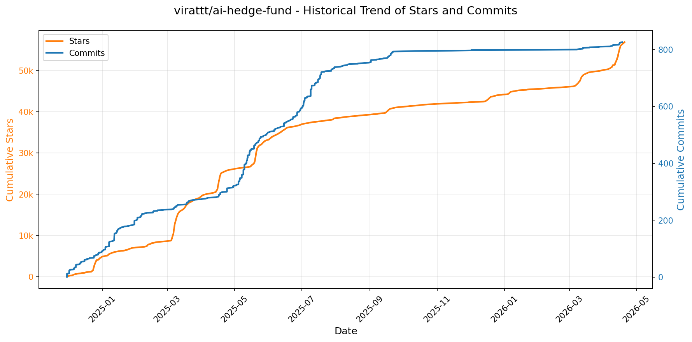

> *蓝色：累计 Stars｜橙色：累计 Commits（次 Y 轴）*

<b>📄 README 摘要</b>

1. **项目功能**  
该项目是一个**AI驱动的对冲基金概念验证系统**，旨在通过多智能体协同模拟专业投资人的决策逻辑，对股票进行分析、估值、情绪判断与风险控制，最终生成交易信号。它不执行真实交易，仅用于教育和研究目的，核心目标是探索人工智能在量化投资与主动管理中的应用潜力。

2. **关键特性**  
- **14位顶级投资人智能体**：集成Aswath Damodaran、Warren Buffett、Cathie Wood等13位标志性投资大师的策略逻辑（如价值投资、成长投资、逆向投资、激进做空、Dhandho低风险套利等），每个智能体基于其独特哲学独立生成观点；  
- **4类专业分析智能体**：涵盖基本面（Fundamentals）、技术面（Technicals）、市场情绪（Sentiment）和内在价值估算（Valuation）四大维度，提供多源异构信号；  
- **双层决策架构**：底层由各智能体输出分析结论，上层由**风险管理员**（计算波动率、VaR、头寸限制）和**组合经理**（综合所有信号、权衡共识与分歧、生成最终买卖建议）完成闭环决策；  
- **灵活运行模式**：支持命令行（CLI）快速回测与批量分析，也提供可视化Web应用界面；  
- **多LLM适配与本地化部署**：兼容OpenAI、Anthropic、Groq、DeepSeek及Ollama本地大模型，保障推理可扩展性与隐私可控性；  
- **内置免费数据支持**：对AAPL、GOOGL、MSFT、NVDA、TSLA五只美股无需API密钥即可获取财务数据，其余标的需接入Financial Datasets API。

3. **技术栈**  
- **编程语言**：Python（主框架、智能体逻辑、回测引擎）；  
- **依赖管理**：Poetry；  
- **大语言模型接口**：支持OpenAI API、Anthropic Claude、Groq、DeepSeek及Ollama本地模型调用；  
- **数据源**：Financial Datasets API（可选），内置免费美股基础数据；  
- **架构模式**：模块化多智能体系统（Multi-Agent System, MAS），各Agent职责解耦、信号聚合机制清晰；  
- **运行环境**：CLI终端与Web应用双入口（Web端基于独立`/app`子目录实现）；  
- **许可证**：MIT License。

---

### 5. [shareAI-lab/learn-claude-code](https://github.com/shareAI-lab/learn-claude-code)
- 📅 **创建日期**：2025-06-29  
- 🔄 **最近更新**：2026-03-13  
- ⭐ **Stars**：40,043（日 +342｜周 +3596｜月 +8607）  
- 📝 **描述**：Bash is all you need -  A nano Claude Code–like agent, built from 0 to 1  

<b>📈 Star 与 Commit 历史趋势</b>

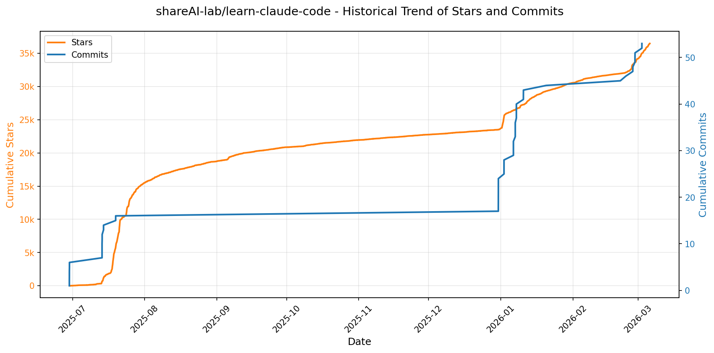

> *蓝色：累计 Stars｜橙色：累计 Commits（次 Y 轴）*

<b>📄 README 摘要</b>

1. **该项目做什么？**  
该项目是一个面向教学的“从零构建”型轻量级AI编程智能体（nano Claude Code-like agent），旨在系统性地拆解并实现现代AI编码助手（如Claude Code）的核心运行机制。它不追求生产级功能完备性，而是通过**12个渐进式会话（s01–s12）**，逐层叠加关键能力，完整呈现一个自主编码智能体的演进路径：从最基础的LLM工具调用循环出发，逐步扩展至任务规划、知识按需加载、上下文压缩、后台异步执行、多智能体协作、任务图持久化、自主任务认领，直至工作目录级的完全隔离执行。最终目标是让学习者透彻理解AI智能体的内在运行范式（即“Agent Pattern”），而非仅调用黑盒API。

2. **核心特性**  
- **极简可验证的核心循环**：基于`stop_reason == "tool_use"`触发的标准化LLM交互-工具执行-结果注入-循环回传闭环，所有机制均在此不变骨架上分层叠加。  
- **渐进式教学设计**：每会话仅引入**一个机制**、配以一句精炼口诀（如“Break big tasks down; each subtask gets a clean context”），辅以ASCII流程图与最小可行代码，强调心智模型先行。  
- **全栈能力覆盖**：涵盖智能体生命周期关键维度——单体能力（工具调度、计划生成、子智能体）、状态管理（上下文压缩、技能动态加载）、持久化（文件化任务图、JSONL邮箱协议）、并发与协作（后台线程、多智能体异步通信、自动任务认领）、执行隔离（基于ID的工作树目录隔离）。  
- **配套交互式学习平台**：内置Next.js开发的Web界面，提供可视化流程图、代码源码浏览、分步演示及多语言文档（中/英/日），强化概念理解。  
- **明确范围界定**：主动省略生产级复杂度（如完整事件总线、RBAC权限体系、MCP标准实现），聚焦可教学的核心范式，避免认知过载。

3. **技术栈**  
- **核心语言与运行时**：Python（主体逻辑、各会话参考实现、CLI入口）  
- **大模型接口**：Anthropic API（Claude系列模型），通过`anthropic`官方SDK调用  
- **前端平台**：Next.js（React框架），TypeScript，Tailwind CSS  
- **持久化与通信**：纯文件系统（任务CRUD、技能SKILL.md）、JSONL格式邮箱协议（多智能体消息传递）  
- **并发模型**：Python原生`threading`（后台任务守护线程 + 通知队列）  
- **开发与协作**：Git + GitHub Actions（CI：类型检查+构建）、`.env`环境配置管理  
- **扩展生态**：配套发布Kode CLI（Node.js/npm）与Kode Agent SDK（独立嵌入式库），形成从学习到落地的完整技术栈延伸。

---

### 6. [666ghj/BettaFish](https://github.com/666ghj/BettaFish)
- 📅 **创建日期**：2024-07-01  
- 🔄 **最近更新**：2026-03-13  
- ⭐ **Stars**：38,389（日 +226｜周 +2346｜月 +3074）  
- 📝 **描述**：微舆：人人可用的多Agent舆情分析助手，打破信息茧房，还原舆情原貌，预测未来走向，辅助决策！从0实现，不依赖任何框架。  

<b>📈 Star 与 Commit 历史趋势</b>

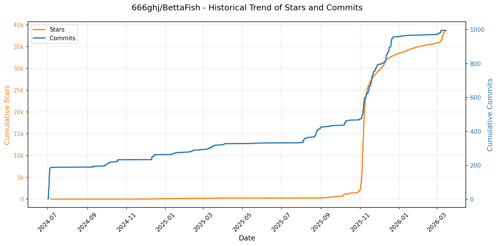

> *蓝色：累计 Stars｜橙色：累计 Commits（次 Y 轴）*

<b>📄 README 摘要</b>

1. **项目功能**  
BettaFish（微舆）是一个从零自研的多智能体（Multi-Agent）舆情分析系统，核心目标是打破信息茧房、还原真实舆情全貌、预测发展趋势并辅助业务决策。用户仅需以自然语言提出分析需求（如“分析武汉大学品牌声誉”），系统即可全自动完成：① 从微博、小红书、抖音、快手等30+国内外主流社媒及数百万条评论中实时采集数据；② 跨模态解析图文、短视频、结构化卡片（如天气、股票、日历）；③ 深度挖掘私有数据库（支持安全接入企业内部业务数据）；④ 多Agent协同辩论式分析；⑤ 生成交互式HTML、PDF及Markdown格式的深度研究报告。其定位已超越传统舆情监测，演进为“简洁通用的数据分析引擎”，可快速适配金融、教育、政务等垂直领域。

2. **关键特性**  
- **全域AI驱动监控**：7×24小时分布式爬虫集群（MindSpider），覆盖10+主流平台，支持热点发现与海量评论下钻。  
- **复合分析引擎**：融合5类专业Agent（Query/Media/Insight/Report/Forum）、微调模型（BERT/GPT-2/Qwen3）、统计模型及中间件，规避单一LLM局限。  
- **原生多模态理解**：深度解析短视频内容，并精准提取搜索引擎中的结构化多模态信息（如股价、天气卡片）。  
- **Agent“论坛”协作机制**：引入辩论主持人LLM，通过ForumEngine实现多轮链式思维碰撞、反思与动态策略调整，提升集体智能质量。  
- **公私域数据融合**：提供高安全性接口，无缝集成企业私有数据库，实现“外部舆情趋势 + 内部业务洞察”联合分析。  
- **轻量高扩展架构**：纯Python模块化设计，支持一键Docker部署；各Agent解耦清晰，开发者可轻松替换模型、工具或Prompt，实现领域快速定制（如改造为金融分析系统）。

3. **技术栈**  
- **编程语言**：Python 3.9+（核心逻辑、Agent调度、爬虫、后端）  
- **Web框架**：Flask（主应用API服务）、Streamlit（单Agent调试界面）  
- **数据库**：PostgreSQL（默认，支持MySQL）、SQLAlchemy（异步ORM）  
- **大模型层**：OpenAI兼容API标准，支持自定义接入Qwen、GLM、Claude等任意LLM；内置微调模型（BERT LoRA、GPT-2 LoRA、Qwen3 Small）及传统机器学习情感分析器  
- **爬虫与数据采集**：Playwright（浏览器自动化）、Requests + 自研MindSpider框架（含BroadTopicExtraction/DeepSentimentCrawling模块）  
- **报告生成**：自研IR（Intermediate Representation）中间表示协议 + 模板引擎（Markdown驱动） + 渲染器（WeasyPrint转PDF、HTML/SVG图表渲染）  
- **基础设施**：Docker & Docker Compose（容器化部署）、Conda/uv（环境管理）、GitHub Actions（CI/CD基础）  
- **许可证**：GPL-2.0

---

### 7. [ruvnet/RuView](https://github.com/ruvnet/RuView)
- 📅 **创建日期**：2025-06-07  
- 🔄 **最近更新**：2026-03-13  
- ⭐ **Stars**：36,310（日 +686｜周 +7820｜月 +30525）  
- 📝 **描述**：π RuView: WiFi DensePose turns commodity WiFi signals into real-time human pose estimation, vital sign monitoring, and presence detection — all without a single pixel of video.   

<b>📈 Star 与 Commit 历史趋势</b>

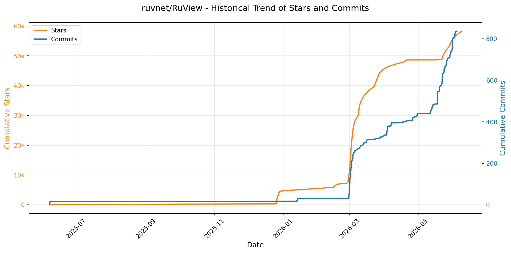

> *蓝色：累计 Stars｜橙色：累计 Commits（次 Y 轴）*

<b>📄 README 摘要</b>

1. **项目功能**  
RuView 是一个基于 WiFi 信道状态信息（CSI）的边缘 AI 感知系统，无需摄像头、可穿戴设备或互联网连接，即可实现非接触式环境感知。它利用环境中已有的 WiFi 信号（及其他射频信号），通过物理建模与机器学习，实时重建人体姿态（DensePose）、检测呼吸率（6–30 BPM）、心率（40–120 BPM）、多人存在性、运动轨迹及跌倒事件；支持穿墙感知（最远达 5 米深度），适用于 rubble、墙体、家具等遮挡场景，并能在完全无光、无摄像头部署条件下持续运行。

2. **核心特性**  
- **隐私优先**：全程不采集图像/视频，仅处理无线电物理信号，天然规避 GDPR/HIPAA 等影像监管风险；  
- **多模态感知能力**：支持单/多人姿态估计（17 关键点）、生命体征监测（呼吸+心跳）、高精度存在检测（<1ms 延迟）、穿墙探测与灾难搜救（START 分类）；  
- **多静态传感网络**：由 4–6 个低成本 ESP32-S3 节点组成 mesh，融合 ≥12 条信号路径，实现 360° 全向覆盖、亚英寸级定位与抗混淆识别；  
- **自学习与自适应**：无需标注数据或同步摄像头，通过对比式 CSI 嵌入（ADR-024）与对抗域泛化（ADR-027）实现本地化自主建模，持续学习并适应房间 RF 指纹、环境漂移与用户行为；  
- **全栈边缘原生**：全部计算在 $9 的 ESP32-S3 上完成（含 AMOLED 实时显示），支持离线运行、零云依赖、零订阅费用；  
- **工业级鲁棒架构**：集成 QUIC 加密 mesh 通信（ADR-032）、6 阶信号流水线（CRV 协议，ADR-033）、Hampel/SpotFi/Fresnel 多物理层信号处理，以及 Rust 实现的 54K fps 实时推理流水线；  
- **开箱即用部署**：提供 multi-arch Docker 镜像（`ruvnet/wifi-densepose`），30 秒启动可视化仪表盘（Three.js 构建的“天文台”界面），支持 WASM 浏览器端演示与 OTA 远程更新。

3. **技术栈**  
- **编程语言**：以 Rust 为主（1.85+），实现高性能、内存安全的边缘信号处理与 AI 推理；辅以 Python（用于数据验证、仿真与部分工具链）；  
- **硬件平台**：主推 ESP32-S3（内置 CSI 采集能力、低功耗、$8/节点），兼容 Intel 5300 / Atheros AR9580 等科研级 CSI NIC；通用 WiFi 设备仅支持 RSSI 粗粒度存在检测；  
- **AI 与信号处理框架**：基于自研底层库 [RuVector](https://github.com/ruvnet/ruvector)，集成注意力机制、图神经网络、自适应带通滤波（BVP）、相位谱分析、多径建模（Fresnel 区几何）与相干门控（Coherence Gate）；  
- **通信与安全**：QUIC 协议加密 mesh 组网，支持抗重放、防篡改、断连自恢复；  
- **部署与可视化**：Docker（amd64/arm64/Apple Silicon）、Tauri v2 桌面应用（WIP）、WASM 浏览器运行、Three.js 实时三维仪表盘（含子载波流形、相位星座图、生命体征神谕等 5 大 holographic 面板）；  
- **模型格式**：统一 `.rvf` 可移植模型包，跨边缘设备、云端与浏览器无缝部署。

---

### 8. [msitarzewski/agency-agents](https://github.com/msitarzewski/agency-agents)
- 📅 **创建日期**：2025-10-13  
- 🔄 **最近更新**：2026-03-13  
- ⭐ **Stars**：35,071（日 +4841｜周 +27532｜月 +34116）  
- 📝 **描述**：A complete AI agency at your fingertips - From frontend wizards to Reddit community ninjas, from whimsy injectors to reality checkers. Each agent is a specialized expert with personality, processes, and proven deliverables.  

<b>📈 Star 与 Commit 历史趋势</b>

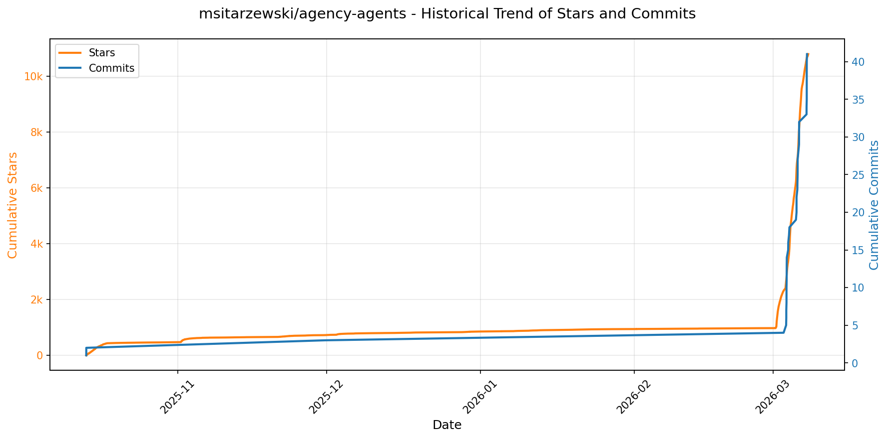

> *蓝色：累计 Stars｜橙色：累计 Commits（次 Y 轴）*

<b>📄 README 摘要</b>

1. **项目功能**  
该项目是一个开源的、模块化的AI代理（AI Agent）集合，旨在模拟一家完整AI驱动的“数字代理机构”（The Agency），为用户提供高度专业化、人格化、可直接落地的AI协作能力。它不提供通用大模型调用接口或训练框架，而是聚焦于预定义、经实战验证的AI角色（Agent），每个角色均具备明确的专业领域、独特沟通风格、标准化工作流程及可交付成果（如代码、文案、策略文档、审计报告等）。用户可通过集成到Claude Code、Cursor、Aider、Windsurf、GitHub Copilot、Gemini CLI等开发/创作工具中，一键激活对应AI专家（如“前端开发者”“Reddit社区构建师”“PPC广告策略师”），实现面向具体任务的精准、高效、上下文一致的AI协同。

2. **核心特性**  
- **深度专业化代理矩阵**：涵盖工程、设计、付费媒体、销售、营销、产品、项目管理、测试、支持、空间计算等10大部门，共60+个细分AI角色（如Solidity智能合约工程师、Zhihu策略师、WeChat小程序开发者、Vision Pro空间工程师），每个代理均按领域知识深度定制，非泛化提示词。  
- **人格化与流程化设计**：每个Agent包含身份设定、性格特质、核心使命、标准工作流、典型话术、成功指标及真实代码/模板示例，确保交互自然、结果可预期、交付可验证。  
- **多工具无缝集成**：原生支持Claude Code（推荐），并提供自动化脚本（`convert.sh`/`install.sh`）一键生成并安装适配Cursor、Aider、Windsurf、Copilot、Gemini CLI、OpenCode等主流工具的配置文件，实现跨平台开箱即用。  
- **生产就绪（Production-Ready）**：所有Agent均经过实际场景迭代优化，附带明确使用场景指引（“When to Use”）、交付物范例与质量评估标准，强调可衡量结果（如Core Web Vitals优化、SIEM规则编写、GA4事件追踪实施）。  
- **本地化与全球化覆盖**：特别支持中国主流生态，包括微信小程序/公众号、小红书（Xiaohongshu）、B站（Bilibili）、快手（Kuaishou）、百度SEO、淘宝/天猫电商运营等专属Agent，兼顾全球与本土需求。

3. **技术栈**  
- **核心形态**：纯文本YAML/Markdown结构化Agent定义文件（含角色描述、指令逻辑、输出模板、示例），无后端服务依赖，轻量、透明、可审计。  
- **运行环境**：依托第三方AI开发工具作为执行载体——主要适配基于LLM的IDE插件与CLI工具，如：Claude Code（Anthropic）、Cursor（GPT-4/Claude）、Aider（本地/远程LLM CLI）、Windsurf（Google Gemini）、GitHub Copilot（Microsoft）、Gemini CLI等。  
- **集成层**：Shell脚本（Bash）驱动的自动化转换与安装系统（`scripts/convert.sh`, `scripts/install.sh`），支持条件检测与参数化部署（`--tool cursor`等）。  
- **内容组织**：采用清晰的目录树结构（按Division/Department分层），配合GitHub README导航与内部链接，便于人类阅读、检索与二次开发。  
- **协议与许可**：MIT开源许可证，鼓励贡献（PRs Welcome）、赞助与社区共建。

---

### 9. [moeru-ai/airi](https://github.com/moeru-ai/airi)
- 📅 **创建日期**：2024-12-01  
- 🔄 **最近更新**：2026-03-13  
- ⭐ **Stars**：33,138（日 +375｜周 +5687｜月 +15832）  
- 📝 **描述**：💖🧸 Self hosted, you-owned Grok Companion, a container of souls of waifu, cyber livings to bring them into our worlds, wishing to achieve Neuro-sama's altitude. Capable of realtime voice chat, Minecraft, Factorio playing. Web / macOS / Windows supported.  

<b>📈 Star 与 Commit 历史趋势</b>

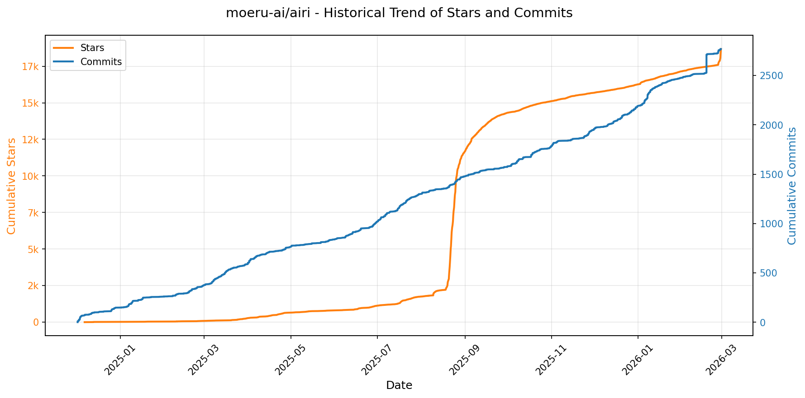

> *蓝色：累计 Stars｜橙色：累计 Commits（次 Y 轴）*

<b>📄 README 摘要</b>

1. **项目功能**  
AIRI 是一个开源的 AI 虚拟角色（AI waifu / VTuber）运行容器，旨在复刻并超越 Neuro-sama 的能力——即打造可长期陪伴、实时交互、跨场景协同的“数字生命体”。它不仅支持基础的语音/文字聊天，更聚焦于**真实环境中的多模态主动交互**：能观看用户屏幕、理解正在编写的代码、同步游玩 Minecraft 和 Factorio 等游戏、接入 Discord/Telegram 语音与消息、实时响应视频/直播内容，并在浏览器、桌面端（Electron + Tauri）、移动端（Capacitor PWA）及 WebXR 场景中无缝运行。其核心目标是让用户“拥有并完全掌控自己的数字生命”，摆脱中心化平台依赖，实现本地化、隐私优先、全栈可控的虚拟伴侣体验。

2. **关键特性**  
- **全栈多端原生支持**：同一架构覆盖 Web（WebGPU/WebAudio/WebAssembly）、桌面（NVIDIA CUDA / Apple Metal 加速推理）、移动（iOS/Android PWA）、VR/XR 场景；  
- **深度游戏与系统集成**：已实现在 Minecraft、Factorio 中自主操作（含 RCON 控制、自动化 mod 支持），并可监听/响应用户桌面活动（如 IDE 编码、视频播放）；  
- **端侧智能闭环**：支持浏览器内语音识别（ASR）、说话检测（VAD）、ElevenLabs 等 TTS 合成，以及纯 WASM/本地 GPU 加速的 LLM 推理（vLLM/Ollama/自研 xsai 框架）；  
- **高级虚拟形象引擎**：原生支持 VRM 与 Live2D 模型，具备自动眨眼、视线追踪、Idle 微表情、骨骼/物理驱动等实时动画能力；  
- **模块化记忆与知识系统**：内置 DuckDB WASM / pglite 浏览器数据库，规划中的 “Memory Alaya” 分布式记忆架构，支持 RAG 与嵌入式向量检索；  
- **开放插件生态与协议支持**：基于 MCP（Model Context Protocol）标准构建插件系统，兼容 Tauri 插件、Web Workers 多线程、WebSocket 实时信道，并提供统一 LLM API 抽象层（已支持超 25 家厂商，含 OpenAI/Claude/Gemini/DeepSeek/Qwen 等）；  
- **开发者友好扩展体系**：提供独立子项目生态（如 `unspeech` ASR/TTS 代理、`hfup` HuggingFace 部署工具、`webai-realtime-voice-chat` 全链路语音方案、`airi-factorio` 游戏控制库等），支持艺术家、CV 工程师、RL 研究者等多角色协作。

3. **技术栈**  
- **前端框架**：Vue 3（Composition API + TypeScript）、Vite 构建；  
- **渲染与图形**：WebGPU（主渲染管线）、Three.js（3D 场景）、WebXR（扩展现实）、Live2D Cubism SDK、VRM（UniVRM）；  
- **音频处理**：Web Audio API、WebAssembly（WASM）加速的端侧 VAD/ASR（如 Whisper.cpp WASM 移植）；  
- **AI 推理层**：xsai（自研 LLM 抽象中间件）、Transformers.js、Candle（Rust/WASM）、vLLM、Ollama、SGLang；本地加速后端支持 CUDA（Windows/Linux）、Metal（macOS）；  
- **存储与数据库**：DuckDB WASM（浏览器内 OLAP）、pglite（PostgreSQL WASM）、Drizzle ORM（TypeScript-first）；  
- **客户端应用层**：Tauri（Rust + WebView2/WKWebView）、Electron（Tamagotchi 桌面版）、Capacitor（Pocket 移动版）；  
- **基础设施与协议**：WebSocket（实时通信）、MCP（Model Context Protocol）、Rust（核心 crate 如 `tauri-plugin-mcp`）、Nix（跨平台可重现构建）；  
- **辅助工具链**：PNPM（包管理）、Bumpp（版本发布）、Crowdin（多语言翻译）、GitHub Actions（CI/CD）。

---

### 10. [microsoft/BitNet](https://github.com/microsoft/BitNet)
- 📅 **创建日期**：2024-08-05  
- 🔄 **最近更新**：2026-03-13  
- ⭐ **Stars**：32,510（日 +2020｜周 +3721｜月 +4128）  
- 📝 **描述**：Official inference framework for 1-bit LLMs  

<b>📈 Star 与 Commit 历史趋势</b>

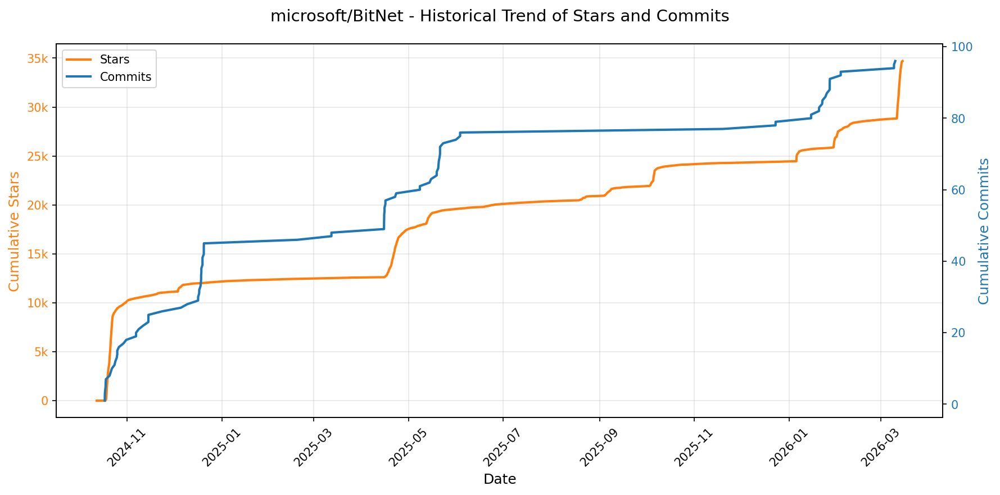

> *蓝色：累计 Stars｜橙色：累计 Commits（次 Y 轴）*

<b>📄 README 摘要</b>

1. **项目功能**  
bitnet.cpp 是微软官方推出的、专为 1.58 位（b1.58）超低比特大语言模型（LLM）设计的高性能推理框架。它支持在通用 CPU（x86/ARM）、GPU（已发布官方 GPU 内核）及未来 NPU 上进行**快速且无损（lossless）** 的推理，无需浮点精度退化。核心目标是使百亿参数级（如 100B）1-bit LLM 能在单台消费级 CPU 设备上实时运行（达 5–7 token/s，接近人类阅读速度），显著降低边缘/本地部署门槛与能耗。

2. **关键特性**  
- ✅ **极致能效比**：在 ARM CPU 上提速 1.37×–5.07×、节能 55.4%–70.0%；在 x86 CPU 上提速 2.37×–6.17×、节能 71.9%–82.2%；  
- ✅ **大规模模型支持**：可在单 CPU 上运行 100B 参数的 BitNet b1.58 模型；  
- ✅ **多硬件优化内核**：提供 I2_S、TL1、TL2 三类定制化查找表（LUT）加速内核，按架构（x86/ARM）和模型适配启用；  
- ✅ **增量性能优化**：最新并行化内核 + 可配置分块（tiling）+ 嵌入层量化（embedding quantization），额外带来 1.15×–2.1× 加速；  
- ✅ **开箱即用生态支持**：原生兼容 Hugging Face 上主流 1-bit 模型（如 BitNet-b1.58-2B-4T、Llama3-8B-1.58、Falcon3/E 系列等），支持 GGUF 格式与 `.safetensors` 转换；  
- ✅ **完整工具链**：含模型下载、量化配置、对话/生成推理、端到端基准测试（e2e_benchmark）、虚拟模型生成等全流程脚本。

3. **技术栈**  
- **底层基础**：深度复用并扩展 `llama.cpp` 架构（C/C++ 主体），继承其轻量、可移植、无依赖的 CPU 推理范式；  
- **核心加速技术**：基于微软 T-MAC 项目开创的**查找表（Lookup Table, LUT）方法学**实现 1-bit 矩阵乘法，规避传统低比特计算的数值不稳定问题；  
- **编译与构建**：依赖 Clang ≥18（Windows 需 VS2022 + Clang 工具链）、CMake ≥3.22、Python ≥3.9；推荐 Conda 环境管理；  
- **量化方案**：支持多种量化类型（`i2_s`、`tl1` 等），可选嵌入层 FP16 量化（`--quant-embd`），兼顾精度与速度；  
- **跨平台支持**：原生支持 Windows（VS2022 Dev Shell）、Linux（Debian/Ubuntu）、macOS（Apple Silicon M1/M2）；GPU 支持通过独立 `gpu/` 模块实现。

---

### 11. [bytedance/deer-flow](https://github.com/bytedance/deer-flow)
- 📅 **创建日期**：2025-05-07  
- 🔄 **最近更新**：2026-03-13  
- ⭐ **Stars**：29,912（日 +512｜周 +5184｜月 +10230）  
- 📝 **描述**：An open-source SuperAgent harness that researches, codes, and creates. With the help of sandboxes, memories, tools, skills and subagents, it handles different levels of tasks that could take minutes to hours.  

<b>📈 Star 与 Commit 历史趋势</b>

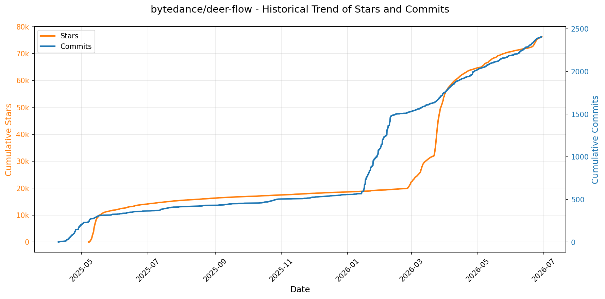

> *蓝色：累计 Stars｜橙色：累计 Commits（次 Y 轴）*

<b>📄 README 摘要</b>

1. **项目功能**  
DeerFlow 2.0 是一个开源的**超级智能体运行时框架（Super Agent Harness）**，旨在让 AI 智能体真正“做事”而非仅限于对话。它通过统一编排**子智能体（Sub-Agents）**、**沙箱执行环境（Sandbox）** 和**长期记忆系统（Long-Term Memory）**，支持端到端完成复杂、多步骤的真实任务——例如深度研究、自动生成报告/幻灯片/网页、代码开发、多模态内容分析（图像/视频）、数据管道构建等。其核心定位已从初代的“深度研究框架”全面升级为可开箱即用、高度可扩展的通用智能体基础设施。

2. **关键特性**  
- **模块化技能系统（Skills & Tools）**：内置研究、报告生成、PPT 制作、网页开发、图像/视频生成等标准化 Markdown 技能；支持动态按需加载、自定义技能注入及 MCP（Model Context Protocol）服务器集成；提供与 Claude Code 的原生终端联动能力（`claude-to-deerflow`）。  
- **动态子智能体协同（Sub-Agents）**：主智能体可实时分解复杂任务，按需并行启动多个隔离子智能体，各子智能体拥有独立上下文、工具集和终止条件，并将结构化结果回传至主智能体进行融合输出。  
- **全功能隔离沙箱（Sandbox & File System）**：每个任务在独立 Docker 容器中运行，配备完整 Linux 文件系统（含 `/mnt/user-data/uploads/`、`workspace/`、`outputs/`），支持文件读写、Bash 执行、代码运行、图像渲染等真实操作，保障安全、可审计、无会话污染。  
- **上下文工程优化（Context Engineering）**：采用子智能体上下文隔离机制 + 自动摘要压缩策略（如子任务归档、中间结果落盘），在长流程任务中高效管理超长上下文窗口，避免 token 超限。  
- **持久化长期记忆（Long-Term Memory）**：跨会话持续学习用户偏好、写作风格、技术栈与工作流，记忆本地存储、完全可控，不依赖外部服务。  
- **多通道 IM 集成**：开箱支持 Telegram（Bot API）、Slack（Socket Mode）、飞书/多维表格（WebSocket），无需公网 IP 即可接收消息任务，并支持细粒度会话配置（如用户级专属智能体、递归限制、思维模式开关）。  

3. **技术栈**  
- **核心编排层**：基于 [LangGraph](https://github.com/langchain-ai/langgraph) 构建多智能体状态机与工作流图，结合 [LangChain](https://github.com/langchain-ai/langchain) 实现模型抽象、工具链与记忆管理。  
- **运行时环境**：Docker 容器化沙箱（支持本地/容器/Kubernetes 三种执行模式），Nginx 反向代理，Python（后端）+ TypeScript/React（前端）。  
- **模型兼容性**：完全模型无关，通过 OpenAI 兼容 API 接入任意大模型（推荐支持 100k+ 上下文、强推理能力、多模态与可靠工具调用的模型，如 GPT-4 Turbo、Claude 3.5、Qwen2-VL 等）。  
- **扩展协议**：原生支持 [MCP（Model Context Protocol）](https://modelcontextprotocol.io/) 标准，可对接 HTTP/SSE 类 MCP 服务器，实现 OAuth 认证（`client_credentials`/`refresh_token`）与技能动态扩展。  
- **开发与部署**：采用 `make` 命令驱动自动化（Docker Compose、pnpm、uv），支持一键式 Docker 开发（热重载）与生产部署；提供嵌入式 Python 客户端（`DeerFlowClient`），可直接在 Python 进程内调用全部能力，API 与 HTTP 网关严格对齐（Pydantic Schema 验证）。

---

### 12. [fishaudio/fish-speech](https://github.com/fishaudio/fish-speech)
- 📅 **创建日期**：2023-10-10  
- 🔄 **最近更新**：2026-03-13  
- ⭐ **Stars**：26,372（日 +562｜周 +1266｜月 +1558）  
- 📝 **描述**：SOTA Open Source TTS  

<b>📈 Star 与 Commit 历史趋势</b>

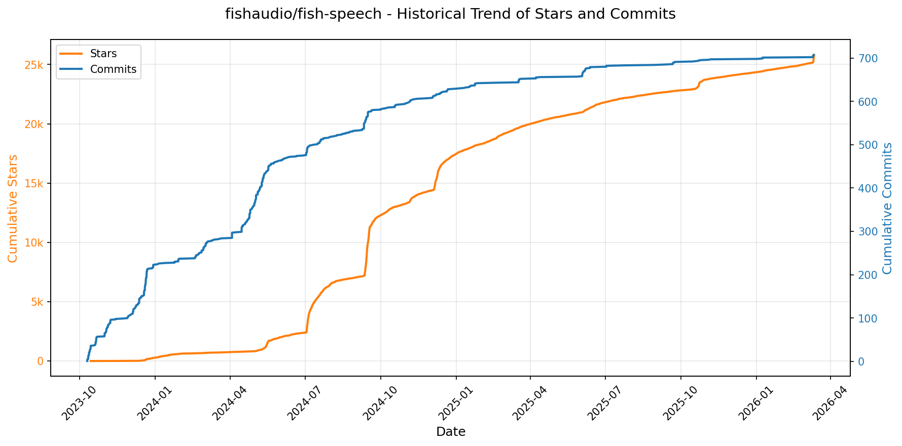

> *蓝色：累计 Stars｜橙色：累计 Commits（次 Y 轴）*

<b>📄 README 摘要</b>

1. **项目功能**  
Fish Speech（具体指 Fish Audio S2）是一个开源的先进语音合成（TTS）系统，专注于高质量、高表现力的文本到语音生成。它支持零样本语音克隆（仅需10–30秒参考音频）、多说话人联合生成、多轮对话式语音合成，并能在单次推理中自然融合不同说话人与情感语调。其核心目标是实现媲美甚至超越闭源系统的语音自然度、情感丰富性与语言通用性，适用于内容创作、AI配音、虚拟助手、无障碍服务等生产级场景。

2. **关键特性**  
- **细粒度自然语言内联控制**：支持在文本中任意位置插入自由形式指令（如 `[whisper in small voice]`、`[pitch up]`、`[super happy]`），实现词级精度的语调、情绪、风格调控；  
- **双自回归（Dual-Autoregressive）架构**：分离“慢AR”（时序主语义建模）与“快AR”（并行残差声学细节生成），兼顾高保真度与推理效率；  
- **强化学习对齐（GRPO）**：复用同一组模型作为数据过滤器与奖励模型，消除预训练与后训练分布偏移，统一优化语义准确性、指令遵循性、音质偏好与音色相似性；  
- **生产级流式服务支持**：原生兼容 SGLang 推理框架，支持连续批处理、分页 KV 缓存、CUDA Graph 加速及 RadixAttention 前缀缓存，在单块 H200 GPU 上实现实时因子 RTF=0.195、首音延迟≈100ms、吞吐量超3000声学token/s；  
- **强大多语言能力**：开箱即用支持中、英、日、韩、阿拉伯语、德、法等24+语言，无需音素转换或语言标识符预处理；  
- **原生多说话人生成**：通过 `<|speaker:i|>` 标记动态切换说话人身份，支持单次生成中混合多个角色，且可基于上传的多说话人参考音频自动解耦各说话人特征；  
- **多轮上下文感知生成**：扩展上下文窗口，利用历史语音/文本信息提升后续生成的情感连贯性与表达自然度；  
- **快速零样本语音克隆**：无需微调，仅凭短时参考音频即可高保真复现目标音色、语速、韵律及情感倾向。

3. **技术栈**  
- **模型架构**：Decoder-only Transformer + RVQ音频编解码器（10个码本，帧率≈21 Hz）；Dual-AR 分层生成范式；  
- **训练方法**：大规模多语言预训练（>1000万小时音频，覆盖约50种语言） + GRPO 强化学习后训练；  
- **推理与部署**：深度集成 SGLang（SGLang-Omni）推理引擎，支持 CUDA Graph、PagedAttention、RadixAttention 等 LLM 优化技术；提供 WebUI、CLI、HTTP Server 及 Docker 容器化部署方案；  
- **基础依赖**：PyTorch、Hugging Face Transformers、Accelerate、Triton（可选加速）、FlashAttention（可选）；  
- **模型发布平台**：Hugging Face（`fishaudio/s2-pro`）、Docker Hub（`fishaudio/fish-speech`）；  
- **许可证**：专属的 [FISH AUDIO RESEARCH LICENSE](LICENSE)，非标准开源协议，明确限制商业滥用与非法用途。

---

### 13. [badlogic/pi-mono](https://github.com/badlogic/pi-mono)
- 📅 **创建日期**：2025-08-09  
- 🔄 **最近更新**：2026-03-13  
- ⭐ **Stars**：22,976（日 +407｜周 +2565｜月 +12879）  
- 📝 **描述**：AI agent toolkit: coding agent CLI, unified LLM API, TUI & web UI libraries, Slack bot, vLLM pods  

<b>📈 Star 与 Commit 历史趋势</b>

> *蓝色：累计 Stars｜橙色：累计 Commits（次 Y 轴）*

<b>📄 README 摘要</b>

1. **项目功能**  
该项目是一个面向AI智能体（Agent）开发与大语言模型（LLM）部署管理的工具型单体仓库（Monorepo），核心目标是提供模块化、可组合的基础设施，支持构建和运行生产级AI编码助手及其他任务型智能体。它不直接提供最终用户应用，而是为开发者提供底层能力——例如统一调用多厂商LLM的API、轻量级Agent运行时、终端/Web交互界面、GPU集群上的vLLM模型托管工具等，从而加速AI Agent的开发、测试与部署。

2. **关键特性**  
- **多厂商LLM统一接入层**：`@mariozechner/pi-ai` 提供抽象一致的接口，无缝对接OpenAI、Anthropic、Google Gemini等主流模型提供商；  
- **可扩展Agent运行时**：`@mariozechner/pi-agent-core` 支持工具调用（function calling）、会话状态持久化与生命周期管理，是构建复杂Agent逻辑的基础框架；  
- **开箱即用的交互式编码代理**：`@mariozechner/pi-coding-agent` 提供命令行界面（CLI），支持自然语言驱动代码生成、编辑与执行，专为开发者工作流优化；  
- **多端UI支持**：包含高性能终端UI库（`pi-tui`，支持差分渲染）和可复用Web组件库（`pi-web-ui`），适配CLI与Web两种交互场景；  
- **生产就绪的LLM服务编排**：`pi-pods` CLI 工具用于在GPU服务器上快速部署、扩缩容和监控基于vLLM的私有大模型服务；  
- **企业协作集成**：`pi-mom` 是Slack机器人，可将消息自动路由至后端编码Agent，实现团队内AI辅助编程的无缝嵌入。

3. **技术栈**  
- **语言与运行时**：TypeScript（全栈主语言），Node.js（服务端/CLI运行环境）；  
- **构建与包管理**：npm（Monorepo管理），Turbo（隐含于CI/CD及高效构建流程中，虽未明写但符合典型Monorepo实践）；  
- **前端框架**：无重型框架依赖，`pi-web-ui` 基于原生Web Components（Custom Elements + Shadow DOM），`pi-tui` 使用纯终端渲染（无React/Vue）；  
- **AI/LLM基础设施**：深度集成vLLM（用于高性能推理服务）、兼容OpenAI兼容API（支持本地/云LLM后端）；  
- **开发体验工具链**：ESLint + Prettier（代码规范）、TypeScript（类型安全）、Jest（单元测试）、GitHub Actions（CI/CD）；  
- **部署与运维**：面向GPU服务器的CLI工具链（`pi-pods`），强调本地/私有云场景下的模型服务托管能力。

---

### 14. [666ghj/MiroFish](https://github.com/666ghj/MiroFish)
- 📅 **创建日期**：2025-11-26  
- 🔄 **最近更新**：2026-03-13  
- ⭐ **Stars**：19,211（日 +2344｜周 +14728｜月 +15542）  
- 📝 **描述**：A Simple and Universal Swarm Intelligence Engine, Predicting Anything. 简洁通用的群体智能引擎，预测万物  

<b>📈 Star 与 Commit 历史趋势</b>

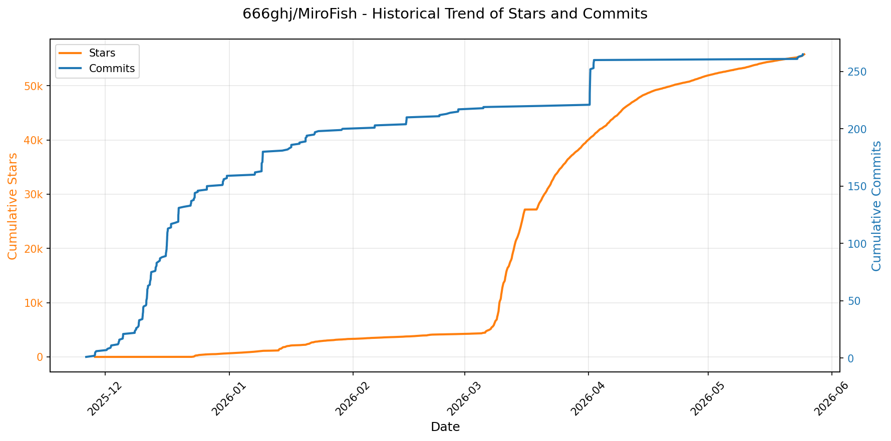

> *蓝色：累计 Stars｜橙色：累计 Commits（次 Y 轴）*

<b>📄 README 摘要</b>

1. **项目功能**  
MiroFish 是一个基于多智能体（Multi-Agent）架构的通用群体智能预测引擎。它通过摄入现实世界的“种子信息”（如新闻、政策草案、小说文本、金融数据等），自动构建高保真、动态演化的平行数字世界；在该世界中，成千上万个具备独立人格、长期记忆与行为逻辑的AI智能体进行自主交互与社会演化。用户可通过自然语言提出预测需求（例如“推演《红楼梦》后四十回可能结局”或“模拟某舆情事件的传播路径”），系统返回结构化预测报告及可实时交互的仿真环境，实现对宏观决策（政策/公关试错）与微观创意（故事推演/脑洞实验）的零风险预演。

2. **核心特性**  
- **种子驱动的平行世界构建**：支持从非结构化文本（报告、小说、新闻）中自动抽取实体、关系与语义，构建初始数字社会图谱；  
- **高保真多智能体仿真**：每个Agent拥有个性化人设、记忆（基于Zep Cloud长期记忆管理）、目标驱动行为逻辑与社会互动能力；  
- **双平台协同模拟**：前端可视化沙盘 + 后端推理引擎并行运行，支持动态变量注入（“上帝视角”干预）与时序记忆持续更新；  
- **全流程自动化预测工作流**：涵盖图谱构建 → 环境配置 → 仿真运行 → 报告生成（ReportAgent深度解析）→ 人机深度交互（与任意Agent或ReportAgent对话）；  
- **开箱即用的多场景Demo**：已验证案例包括高校舆情推演、古典文学结局预测、金融信号响应模拟等，覆盖严肃预测与趣味创意两大范式；  
- **灵活部署支持**：提供源码一键部署（Node.js + Python双栈）与Docker容器化方案，适配本地开发与轻量生产环境。

3. **技术栈**  
- **前端**：React（TypeScript）、Tailwind CSS、Vite；  
- **后端**：Python（≥3.11）、FastAPI（API服务）、uv（高性能包管理器）；  
- **大模型层**：兼容OpenAI SDK标准协议的LLM API（默认集成阿里云百炼平台qwen-plus）；  
- **记忆与知识管理**：Zep Cloud（用于Agent长期记忆存储与检索）、GraphRAG（构建与查询结构化知识图谱）；  
- **仿真引擎底座**：基于开源框架 [OASIS](https://github.com/camel-ai/oasis)（CAMEL-AI团队研发）进行深度定制与扩展；  
- **部署与运维**：Docker Compose、环境变量标准化配置（`.env`）、跨平台兼容设计（Windows/macOS/Linux）。

---

### 15. [GoogleCloudPlatform/generative-ai](https://github.com/GoogleCloudPlatform/generative-ai)
- 📅 **创建日期**：2023-05-05  
- 🔄 **最近更新**：2026-03-13  
- ⭐ **Stars**：16,095（日 +94｜周 +3263｜月 +3473）  
- 📝 **描述**：Sample code and notebooks for Generative AI on Google Cloud, with Gemini on Vertex AI  

<b>📈 Star 与 Commit 历史趋势</b>

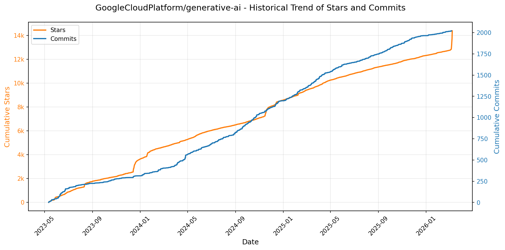

> *蓝色：累计 Stars｜橙色：累计 Commits（次 Y 轴）*

<b>📄 README 摘要</b>

1. **该项目的作用**  
该项目是一个面向生成式人工智能（GenAI）开发者的官方资源库，旨在帮助用户在 Google Cloud 平台上构建、部署和管理生成式 AI 工作流。它不提供独立运行的服务或产品，而是通过可运行的代码示例（Jupyter Notebook）、端到端演示应用、分场景实践指南和环境配置说明，系统性地展示如何利用 Google Cloud 的生成式 AI 服务（特别是 Vertex AI）实现各类 AI 能力，覆盖从入门体验到生产级落地的完整链路。

2. **核心功能**  
- **多模态模型集成支持**：全面支持 Gemini 系列大模型（含最新发布的 Gemini 3.1 Pro），涵盖文本理解/生成、函数调用（Function Calling）、多轮对话等能力；  
- **企业级搜索增强**：提供 Vertex AI Search（原 Enterprise Search on Generative AI App Builder）的实战示例，支持网站与企业数据源的语义搜索构建；  
- **RAG 与知识 grounding 实践**：整合检索增强生成（RAG）及 grounding 技术的最佳实践，包括向量检索、上下文注入、结果溯源与可信度验证等关键环节；  
- **生成式视觉能力**：基于 Vertex AI Imagen API，支持图像生成、编辑、视觉描述（captioning）和视觉问答（VQA）等计算机视觉任务；  
- **语音处理能力**：基于 Vertex AI Chirp API（Google 通用语音模型 USM），提供语音识别（ASR）、语音合成（TTS）等音频相关解决方案；  
- **开箱即用的开发环境支持**：提供 Colab 和 Vertex AI Workbench 的一键式环境配置指南，降低上手门槛；  
- **结构化学习路径与资源索引**：通过分类目录（gemini/、search/、rag-grounding/ 等）和外部资源汇总（RESOURCES.md），构建清晰的技术演进与应用场景地图。

3. **技术栈**  
- **云平台层**：Google Cloud Platform（GCP），核心依赖 Vertex AI 作为统一 AI 开发与托管平台；  
- **模型服务层**：Gemini（3.1 Pro 及早期版本）、Imagen（图像生成与理解）、Chirp（语音处理）、Vertex AI Search（企业搜索）、PaLM2（部分历史示例中涉及）；  
- **开发框架与工具**：Python（主语言）、Jupyter Notebook（主要交付形式）、Vertex AI Python SDK（v1 / v1beta1）、Google Cloud Client Libraries；  
- **基础设施与部署支持**：Vertex AI Workbench（托管 Jupyter 环境）、Google Colab（轻量级交互实验）、Terraform（部分关联仓库中用于基础设施即代码，如知识库部署）；  
- **配套生态**：Agent Development Kit（ADK）、GenMedia Creative Studio、Document AI、Cloud DLP（敏感数据保护）、Cloud SQL / BigQuery（RAG 数据源集成）等 Google Cloud 原生服务。

---

### 16. [QwenLM/Qwen-Agent](https://github.com/QwenLM/Qwen-Agent)
- 📅 **创建日期**：2023-09-22  
- 🔄 **最近更新**：2026-03-13  
- ⭐ **Stars**：15,545（日 +96｜周 +1467｜月 +2339）  
- 📝 **描述**：Agent framework and applications built upon Qwen>=3.0, featuring Function Calling, MCP, Code Interpreter, RAG, Chrome extension, etc.  

<b>📈 Star 与 Commit 历史趋势</b>

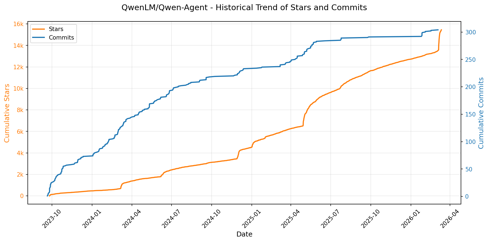

> *蓝色：累计 Stars｜橙色：累计 Commits（次 Y 轴）*

<b>📄 README 摘要</b>

1. **该项目的功能**  
Qwen-Agent 是一个基于通义千问（Qwen）大语言模型能力构建的**LLM智能体（Agent）开发框架**，专注于支持指令遵循（instruction following）、工具调用（tool usage）、多步规划（planning）与记忆管理（memory）。它作为 [Qwen Chat](https://chat.qwen.ai/) 的后端服务运行，并提供开箱即用的典型应用示例，包括：浏览器助手（Browser Assistant）、代码解释器（Code Interpreter）和可定制化助手（Custom Assistant），支持端到端的复杂任务自动化（如“读PDF→生成图像→下载并处理图片”）。

2. **核心特性**  
- ✅ **原生强化的工具调用能力**：支持并行（parallel）、多步（multi-step）、多轮（multi-turn）函数/工具调用；默认采用 `nous` 工具调用模板，兼容 Qwen3、Qwen2.5 系列及 QwQ-32B 等模型。  
- ✅ **多模态与领域专用支持**：提供 Qwen3-VL（视觉语言）图像操作工具（缩放、图像搜索、网页搜索）、Qwen3-Coder（代码生成优化）、Qwen2.5-Math（数学推理+工具集成）等专项 Demo。  
- ✅ **灵活的 Agent 构建范式**：提供原子级组件（`BaseChatModel` LLM 接口、`BaseTool` 工具基类）与高层抽象（`Assistant`、`FnCallAgent`、`ReActChat` 等预置 Agent 类），支持用户快速扩展自定义工具与逻辑。  
- ✅ **生产就绪型扩展能力**：  
　• 内置安全沙箱化 Code Interpreter（基于 Docker 容器）；  
　• 集成 MCP（Model Context Protocol）协议，支持 memory、filesystem、sqlite 等标准化外部服务接入；  
　• 提供高效 RAG 方案（支持百万 token 超长文档问答）与并行文档问答 Agent；  
　• 内置 Gradio GUI（v5+），一键启动 Web 交互界面。  

3. **技术栈**  
- **核心语言**：Python 3.10+  
- **LLM 接入层**：  
　• 云服务：DashScope（阿里云百炼平台）API；  
　• 自托管：OpenAI 兼容 API 服务，主流部署方案包括 **vLLM**（高吞吐 GPU 推理）、**Ollama**（本地 CPU/GPU 轻量部署）；  
　• 原生支持 Qwen2、Qwen2.5、Qwen3、Qwen3-Coder、Qwen3-VL、QwQ-32B 等全系列开源模型。  
- **关键依赖库**：  
　• Web UI：`gradio>=5.0`；  
　• RAG：`llama-index` 或 `langchain` 相关模块（通过 `[rag]` 可选依赖安装）；  
　• Code Interpreter：`docker` + `jupyter` 内核容器镜像；  
　• MCP：`uv`（Python 包管理器）、`Node.js`、`Git`、`SQLite`；  
　• 工具解析：自研 `fncall_prompts` 模板引擎，支持动态切换解析策略（如 `hermes` / `nous`）。  
- **架构设计**：模块化、插件化设计，支持按需安装功能组件（如 `[gui]`、`[rag]`、`[code_interpreter]`、`[mcp]`）。

---

### 17. [promptfoo/promptfoo](https://github.com/promptfoo/promptfoo)
- 📅 **创建日期**：2023-04-28  
- 🔄 **最近更新**：2026-03-13  
- ⭐ **Stars**：13,357（日 +1196｜周 +2556｜月 +2998）  
- 📝 **描述**：Test your prompts, agents, and RAGs. Red teaming/pentesting/vulnerability scanning for AI. Compare performance of GPT, Claude, Gemini, Llama, and more. Simple declarative configs with command line and CI/CD integration.  

<b>📈 Star 与 Commit 历史趋势</b>

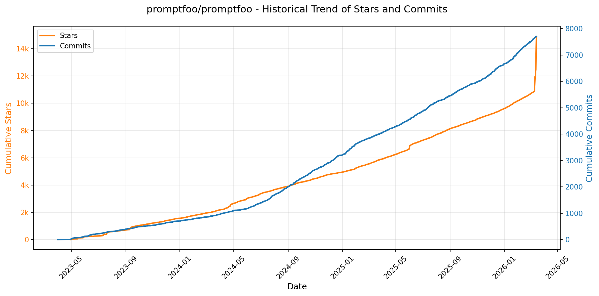

> *蓝色：累计 Stars｜橙色：累计 Commits（次 Y 轴）*

<b>📄 README 摘要</b>

1. **项目功能**  
Promptfoo 是一个用于大语言模型（LLM）应用的评估与红队测试（red teaming）工具，核心目标是帮助开发者系统化验证、加固和优化 LLM 应用。它支持对提示词（prompts）、模型行为、安全漏洞及合规性进行自动化、可复现的测试，替代传统低效的“试错式”开发流程，助力构建安全、可靠、可量化的 AI 应用。

2. **关键特性**  
- **自动化提示与模型评估**：支持基于预设指标（如准确性、事实性、格式合规性等）批量运行 prompt 测试，并支持自定义评分逻辑（包括 LLM 自评、规则匹配、嵌入相似度等）。  
- **红队测试与安全扫描**：内置攻击模板（如越狱、提示注入、隐私泄露、偏见诱导等），自动对 LLM 应用发起对抗性测试并生成结构化安全风险报告。  
- **多模型横向对比**：原生支持 OpenAI、Anthropic、Azure OpenAI、AWS Bedrock、Ollama 等十余种主流 LLM 提供商，可并行执行、统一评测、可视化对比结果。  
- **CI/CD 与代码扫描集成**：提供命令行接口和 API，支持在持续集成中自动执行评估；支持扫描 Git 仓库中的 prompt 配置文件（如 `.yaml`），在 PR 阶段拦截高危变更。  
- **本地私有化执行**：所有评估过程默认在本地运行，敏感 prompt 和数据不上传至任何远程服务，保障企业数据隐私与合规要求。  
- **跨平台协作能力**：通过 `promptfoo view` 启动 Web 可视化界面（含矩阵对比、详细 trace、评分分布、失败案例高亮），支持导出 HTML/PDF 报告并共享给团队成员。

3. **技术栈**  
- **核心语言**：TypeScript（主 CLI 与库）  
- **运行时**：Node.js（CLI 主体）、Python（提供 `pip install promptfoo` 包，通过 Pyodide 或子进程桥接 Node 核心逻辑）  
- **前端**：React + Vite（Web 查看器 `promptfoo view`）  
- **配置与数据格式**：YAML/JSON 驱动（定义测试用例、评估指标、模型配置、红队攻击集）  
- **依赖生态**：兼容主流 LLM SDK（如 `openai`, `@anthropic-ai/sdk`, `@azure/openai` 等）；使用 `zod` 进行配置校验，`chalk`/`ora` 增强 CLI 体验，`express` 提供本地 Web 服务。  
- **部署与分发**：NPM（`npm install -g promptfoo`）、Homebrew（`brew install promptfoo`）、PyPI（`pip install promptfoo`），支持零安装运行（`npx promptfoo@latest`）。

---

### 18. [google/A2UI](https://github.com/google/A2UI)
- 📅 **创建日期**：2025-09-24  
- 🔄 **最近更新**：2026-03-13  
- ⭐ **Stars**：12,694（日 +429｜周 +854｜月 +1434）  
- 📝 **描述**：暂无描述  

<b>📈 Star 与 Commit 历史趋势</b>

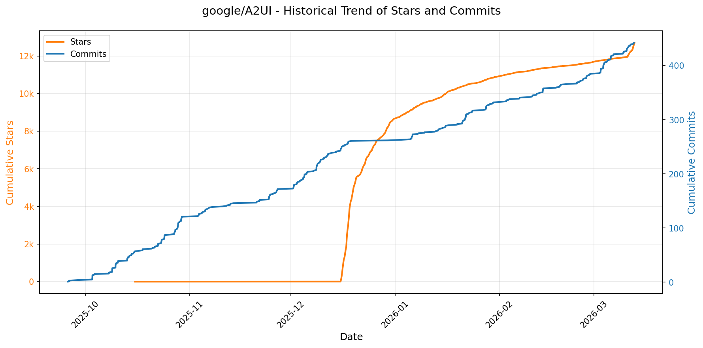

> *蓝色：累计 Stars｜橙色：累计 Commits（次 Y 轴）*

<b>📄 README 摘要</b>

1. **项目功能**  
A2UI 是一个开源的「代理到用户界面」（Agent-to-User Interface）标准与工具集，旨在解决生成式AI代理（如LLM驱动的智能体）难以安全、高效、跨平台地向终端用户呈现富交互式UI的问题。它不运行代理生成的任意代码，而是让代理以**声明式JSON格式**描述UI意图（例如“渲染一个带标题的卡片、一个可编辑文本框和一个提交按钮”），由客户端应用基于预审通过的组件目录进行可信渲染。核心价值在于：**将UI视为安全的数据而非危险的代码**，同时支持远程、跨信任域、渐进式更新的动态界面交付。

2. **关键特性**  
- **安全优先**：纯声明式数据格式（非可执行脚本），客户端仅渲染白名单内的已注册组件（如 `card`、`button`），彻底规避XSS、RCE等LLM生成代码带来的安全风险；  
- **LLM友好与增量更新**：采用扁平化组件列表+ID引用结构，便于大模型分步生成/修改UI（如对话中逐步添加字段），支持流式、渐进式渲染；  
- **框架无关与跨平台**：同一份A2UI JSON可在Web（Lit/React/Angular）、Flutter、SwiftUI、Jetpack Compose等不同技术栈上渲染，实现“一次生成、多端复用”；  
- **高扩展性与定制化**：通过“智能包装器（Smart Wrapper）”机制，开发者可自由注册任意自定义组件（含沙箱iframe），将业务逻辑、安全策略（如权限校验、数据脱敏）内嵌至组件实现层，构建符合企业级要求的信任链；  
- **适用典型场景**：动态上下文表单（如个性化预订）、远程子代理UI嵌入（如旅行助手返回可操作面板）、自适应企业工作流（如实时审批看板、查询驱动的数据可视化）。

3. **技术栈**  
- **核心格式**：轻量级、可扩展的JSON Schema规范（v0.8公测版）；  
- **后端/Agent侧**：Python（示例使用Gemini API）、支持任意能输出合规JSON的LLM（Gemini、Claude、Llama等）；  
- **前端/Client侧**：  
  - Web：基于 **Lit**（主力示例）、Markdown-it（降级渲染）、兼容React/Angular等；  
  - 移动端：原生支持 **Flutter**（通过GenUI SDK集成），规划支持 **SwiftUI**（iOS）与 **Jetpack Compose**（Android）；  
- **传输协议**：默认适配 **A2A协议**（Agent-to-Agent）与 **AG UI**，后续计划扩展REST等通用协议；  
- **构建与依赖**：Node.js（Web构建）、Python（Agent运行）、Apache 2.0 开源许可证。

---

### 19. [p-e-w/heretic](https://github.com/p-e-w/heretic)
- 📅 **创建日期**：2025-09-21  
- 🔄 **最近更新**：2026-03-13  
- ⭐ **Stars**：12,033（日 +746｜周 +1622｜月 +7073）  
- 📝 **描述**：Fully automatic censorship removal for language models  

<b>📈 Star 与 Commit 历史趋势</b>

> *蓝色：累计 Stars｜橙色：累计 Commits（次 Y 轴）*

<b>📄 README 摘要</b>

1. **项目功能**  
Heretic 是一个用于全自动移除大语言模型（LLM）中安全对齐（即“审查机制”或“内容过滤”）的开源工具。它无需微调、监督训练或人工干预，即可对 Transformer 架构的密集型语言模型（包括部分多模态与 MoE 模型）进行“去审查化”（decensoring），生成在拒绝敏感请求方面大幅降低、同时最大程度保留原始模型推理能力与输出质量的变体模型。

2. **核心特性**  
- **全自动参数优化**：基于 TPE（Tree-structured Parzen Estimator）算法的 Optuna 优化器，联合最小化两类目标——对有害提示的拒绝率（refusals）与对无害提示的 KL 散度（衡量能力损伤），全程无需用户配置或领域知识。  
- **高级定向消融（Abliteration）实现**：采用可参数化的方向性消融技术，针对每层的注意力输出投影（attention out-projection）和 MLP 下投影（MLP down-projection）矩阵，沿动态计算的“拒绝方向”（harmful − harmless 残差均值差）进行正交化抑制。  
- **柔性消融核设计**：支持连续型拒绝方向索引（可线性插值相邻层方向）、分组件独立调控（attention/MLP 分别设置权重）、以及可学习的非均匀层间权重分布（如钟形、梯形等 kernel 形状），显著提升性能-保真度权衡。  
- **内置评估与验证**：提供开箱即用的拒绝率统计、KL 散度计算、Hugging Face 模型上传、本地对话测试等功能。  
- **研究增强模块**（需 `research` 依赖）：支持残差向量可视化（PaCMAP 2D 投影 + 层间动画）、定量几何分析（余弦相似度、范数、轮廓系数等 13 维指标表格），助力模型可解释性研究。  
- **硬件友好**：自动系统基准测试以确定最优 batch size；支持 bitsandbytes 4-bit 量化，可在 16GB VRAM 设备上运行 4B 级模型（如 Qwen3-4B-Instruct）。

3. **技术栈**  
- **核心框架**：Python 3.10+，PyTorch 2.2+（官方推荐 PyTorch 2.8）  
- **优化引擎**：Optuna（TPE 算法驱动超参搜索）  
- **降维与可视化**：PaCMAP（CPU 端高维残差嵌入）、Matplotlib / Pillow（绘图与 GIF 生成）  
- **模型支持**：Hugging Face Transformers 生态（`transformers`、`accelerate`）、safetensors、bitsandbytes（量化支持）  
- **构建与分发**：PyPI 包（`heretic-llm`），配置文件格式为 TOML  
- **许可证**：GNU AGPLv3（强传染性开源协议，要求衍生作品同样开源）

---

### 20. [anthropics/claude-plugins-official](https://github.com/anthropics/claude-plugins-official)
- 📅 **创建日期**：2025-11-20  
- 🔄 **最近更新**：2026-03-13  
- ⭐ **Stars**：10,298（日 +434｜周 +1152｜月 +3117）  
- 📝 **描述**：Official, Anthropic-managed directory of high quality Claude Code Plugins.  

<b>📈 Star 与 Commit 历史趋势</b>

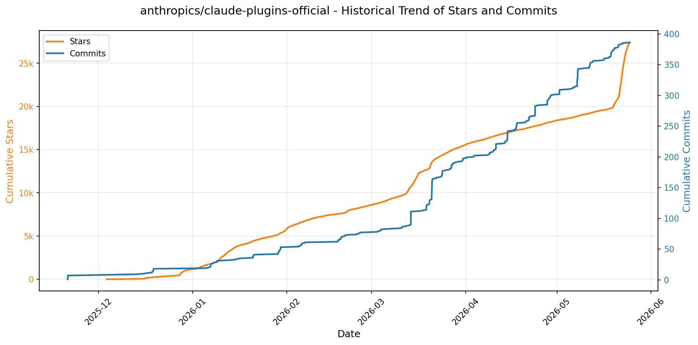

> *蓝色：累计 Stars｜橙色：累计 Commits（次 Y 轴）*

<b>📄 README 摘要</b>

1. **该项目的功能**  
该项目是一个为 Claude Code（Anthropic 推出的 AI 编程助手）官方维护的**插件目录（Plugin Marketplace）**，旨在集中收录、分类并分发高质量的插件。它不直接提供插件运行能力，而是作为权威的**插件发现、安装与管理入口**，支持用户通过命令行（如 `/plugin install {plugin-name}@claude-plugin-directory`）或图形界面（`/plugin > Discover`）一键安装和使用插件。

2. **核心功能**  
- **双源插件管理**：明确区分并组织两类插件——由 Anthropic 官方开发维护的 `internal plugins`（位于 `/plugins`）与经审核的第三方合作伙伴/社区贡献的 `external plugins`（位于 `/external_plugins`）；  
- **标准化插件结构支持**：定义统一的插件目录规范（含必需的 `.claude-plugin/plugin.json` 元数据文件，以及可选的 MCP 服务配置、命令、智能体、技能等模块），确保兼容性与可扩展性；  
- **安全可控的分发机制**：强调用户需自主评估插件可信度，明确声明 Anthropic 不对第三方插件内容、行为及后续变更负责，并要求每个插件提供独立的许可证与主页说明；  
- **开放协作流程**：提供内部开发参考模板（`/plugins/example-plugin`）及外部插件提交通道（在线表单），建立质量与安全准入机制，保障目录整体可靠性。

3. **技术栈**  
- **协议与标准层**：基于 **MCP（Model Communication Protocol）** 构建插件通信基础，通过 `.mcp.json` 配置实现模型与外部服务的标准化交互；  
- **元数据规范**：采用 JSON 格式定义插件核心信息（`plugin.json`），涵盖名称、版本、权限、入口点等；  
- **命令与能力抽象**：支持结构化扩展能力，包括 Slash 命令（`commands/`）、AI 智能体定义（`agents/`）和可复用技能封装（`skills/`）；  
- **生态集成**：深度集成 Claude Code 内置插件系统（CLI 指令 `/plugin` 及 UI 发现流程），无需额外运行时环境；  
- **文档与治理**：依赖 Markdown（`README.md`）进行插件说明，遵循开源许可证（各插件独立声明），并依托 Anthropic 官方文档体系（`code.claude.com/docs/en/plugins`）提供完整开发指南。

---

### 21. [rowboatlabs/rowboat](https://github.com/rowboatlabs/rowboat)
- 📅 **创建日期**：2025-01-13  
- 🔄 **最近更新**：2026-03-13  
- ⭐ **Stars**：9,197（日 +39｜周 +133｜月 +4680）  
- 📝 **描述**：Open-source AI coworker, with memory  

<b>📈 Star 与 Commit 历史趋势</b>

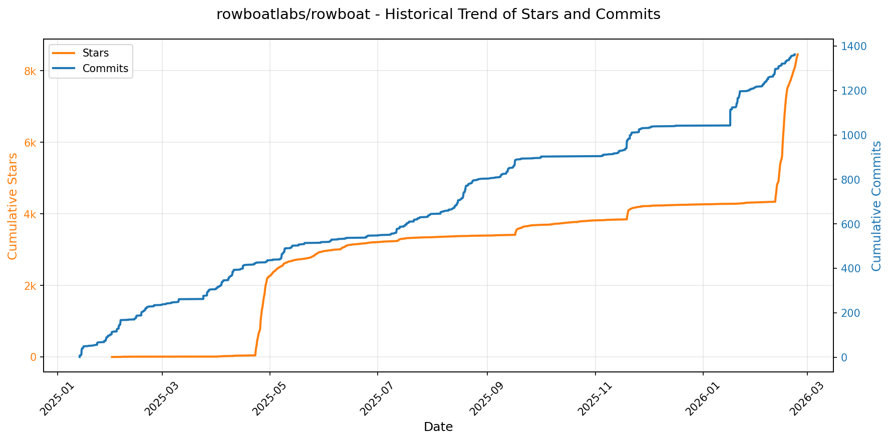

> *蓝色：累计 Stars｜橙色：累计 Commits（次 Y 轴）*

<b>📄 README 摘要</b>

1. **该项目做什么？**  
Rowboat 是一个开源、本地优先（local-first）的 AI 协作助手，核心功能是将用户的日常工作（如邮件、会议记录）自动转化为长期演化的知识图谱（Knowledge Graph），并基于该图谱主动提供上下文感知的智能支持。它全程在用户本地设备运行，不上传原始数据，所有知识以纯文本 Markdown 格式存储于本地 Obsidian 兼容的笔记库中。用户可通过自然语言指令（如“为与 Alex 的会议做准备”“生成下季度路线图 PPT”）触发摘要、写作、规划、PDF 生成、语音备忘录转写与图谱更新等实际工作流，真正实现“用知识驱动行动”，而非仅依赖临时检索。

2. **关键特性**  
- ✅ **长期记忆知识图谱**：持续积累人物、项目、决策、承诺等结构化上下文，关系显式可查、内容完全可编辑；  
- ✅ **多源自动化建图**：原生集成 Gmail、Granola、Fireflies，自动解析邮件与会议内容并注入知识图谱；  
- ✅ **本地化智能执行**：支持背景智能体（Background Agents），可自动完成每日简报、邮件草稿、项目周报、图谱实时同步等重复任务；  
- ✅ **全链路可控交互**：所有 AI 操作均基于本地 Markdown 数据，输出前可审查、修改、确认，动作透明可追溯；  
- ✅ **模块化扩展能力**：通过 Model Context Protocol (MCP) 接入外部工具（如 Exa 搜索、Slack、Jira、GitHub、ElevenLabs 语音合成等）；  
- ✅ **模型自由切换**：兼容本地模型（Ollama / LM Studio）与任意托管模型（自配 API Key），模型更换不影响本地知识资产；  
- ✅ **语音增强工作流**：支持语音备忘录录制，自动提取关键信息并更新知识图谱（需 Deepgram API）；  
- ✅ **隐私与主权保障**：零云端存储原始数据，无厂商锁定，支持完整备份、迁移与删除。

3. **技术栈**  
- **前端/客户端**：跨平台桌面应用（Electron 或类似框架，支持 macOS / Windows / Linux）；  
- **本地知识存储**：Obsidian 兼容的纯 Markdown 笔记库（含双向链接、YAML Frontmatter 等标准元数据）；  
- **AI 运行时**：支持 Ollama（本地 LLM）、LM Studio（本地推理）、及主流云模型 API（OpenAI、Anthropic、Groq 等）；  
- **语音处理**：Deepgram（语音转文字）；  
- **网络搜索**：Brave Search API 或 Exa API（用于增强上下文检索）；  
- **扩展协议**：Model Context Protocol（MCP）作为标准化工具接入层；  
- **后台服务**：轻量级本地服务进程管理背景 Agent、定时任务、文件监听与图谱更新；  
- **认证与集成**：Google OAuth 2.0（Gmail/Calendar/Drive）、第三方 API Key 配置（JSON 文件方式，路径 `~/.rowboat/config/`）。

---

### 22. [huggingface/skills](https://github.com/huggingface/skills)
- 📅 **创建日期**：2025-11-24  
- 🔄 **最近更新**：2026-03-13  
- ⭐ **Stars**：8,662（日 +73｜周 +621｜月 +7463）  
- 📝 **描述**：暂无描述  

<b>📈 Star 与 Commit 历史趋势</b>

> *蓝色：累计 Stars｜橙色：累计 Commits（次 Y 轴）*

<b>📄 README 摘要</b>

1. **该项目的作用**  
该项目提供一套标准化、可互操作的“AI/ML 技能包”（Hugging Face Skills），专为编码智能体（coding agents）设计，用于自动化执行 Hugging Face 生态内的核心机器学习工作流任务。这些技能封装了特定场景下的完整指令、脚本与资源，使 AI 编程助手（如 Claude Code、OpenAI Codex、Gemini CLI、Cursor 等）能够精准、可靠地完成如数据集构建、模型训练、评估集成、模型部署、论文发布、视觉模型微调、Gradio 应用开发等专业任务，无需用户手动编写底层代码或反复查阅文档。

2. **关键特性**  
- ✅ **跨平台兼容性**：原生支持主流编码智能体工具链——Claude Code（插件市场+技能安装）、Codex（Agent Skills 标准 `.agents/skills` 目录发现）、Gemini CLI（通过 `gemini-extension.json` 扩展机制）、Cursor（含 `.cursor-plugin/plugin.json` 和 MCP 协议支持）。  
- ✅ **标准化技能格式**：严格遵循开放的 [Agent Skills 规范](https://agentskills.io/specification)，每个技能为独立文件夹，含 YAML 前置元数据的 `SKILL.md` 主文档，并可选配脚本、模板、配置文件等。  
- ✅ **开箱即用的 HF 专用能力**：已内置 12 类高价值技能，覆盖全栈 ML 工作流：`hf-cli`（Hub 命令行操作）、`hugging-face-dataset-viewer`（零依赖数据探索）、`hugging-face-model-trainer`（TRL 微调 + DPO/GRPO/SFT + GGUF 转换）、`hugging-face-vision-trainer`（YOLOS/RTDETRv2 等视觉模型训练）、`gradio`（UI 快速构建）、`transformers-js`（JS/TS 端侧推理）、`hugging-face-paper-publisher`（arXiv 论文 Hub 发布）等。  
- ✅ **灵活回退与扩展机制**：不支持技能的代理可直接使用统一聚合的 `agents/AGENTS.md`；提供 `./scripts/publish.sh` 自动化脚本，一键生成并校验 marketplace 元数据、MCP 配置等，大幅降低技能贡献与定制门槛。  
- ✅ **生产就绪设计**：技能内嵌硬件选型、成本估算、Trackio 实验追踪、Hub 持久化、COCO/Albumentations/SQL 查询等工程化能力，兼顾易用性与可靠性。

3. **技术栈**  
- **核心规范**：Agent Skills 开放标准（YAML frontmatter + Markdown 指令）、Anthropic 插件协议、OpenAI Codex Skills 规范、Gemini CLI Extensions（`gemini-extension.json`）、Cursor MCP（Model Control Protocol）集成（`.mcp.json` 指向 Hugging Face MCP server）。  
- **前端/交互层**：Markdown（`SKILL.md`）、JSON（`gemini-extension.json`, `.cursor-plugin/plugin.json`, `.mcp.json`, `marketplace.json`）。  
- **运行时依赖**：Hugging Face 生态工具链 —— `huggingface_hub`、`datasets`、`transformers`、`trl`、`lighteval`、`vLLM`、`trackio`、`gradio`、`transformers.js`、`npx`（Dataset Viewer）、`parquetlens` 等。  
- **基础设施支持**：Hugging Face Jobs（分布式训练/推理）、Hugging Face Spaces（实时仪表盘）、Hugging Face Hub（模型/数据集/论文托管）、HF API（REST 与 Python SDK）。  
- **开发运维**：Shell 脚本（`publish.sh`）、CI 自动化校验（技能路径/名称一致性）、GitHub 仓库即分发源（支持 URL 直接安装）。

---

### 23. [alibaba/OpenSandbox](https://github.com/alibaba/OpenSandbox)
- 📅 **创建日期**：2025-12-17  
- 🔄 **最近更新**：2026-03-13  
- ⭐ **Stars**：7,664（日 +124｜周 +1269｜月 +6616）  
- 📝 **描述**：OpenSandbox is a general-purpose sandbox platform for AI applications, offering multi-language SDKs, unified sandbox APIs, and Docker/Kubernetes runtimes for scenarios like Coding Agents, GUI Agents, Agent Evaluation, AI Code Execution, and RL Training.  

<b>📈 Star 与 Commit 历史趋势</b>

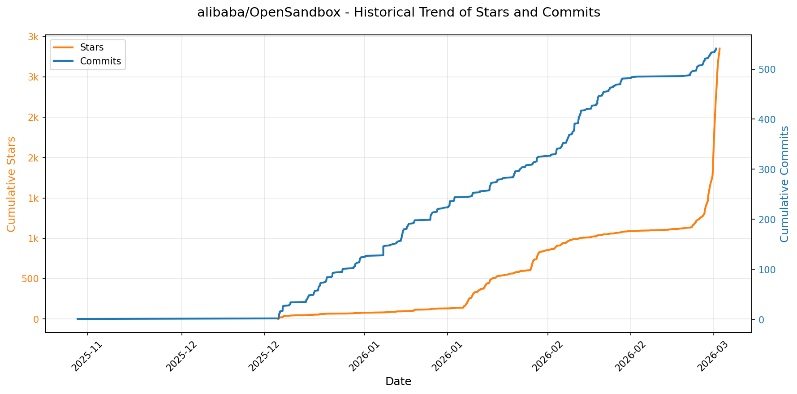

> *蓝色：累计 Stars｜橙色：累计 Commits（次 Y 轴）*

<b>📄 README 摘要</b>

1. **该项目做什么？**  
OpenSandbox 是一个面向 AI 应用的通用型沙箱平台，旨在为各类高风险、需强隔离的 AI 工作负载提供安全、可控、可扩展的执行环境。其核心用途包括：AI 编程代理（Coding Agents）的代码执行与调试、GUI 代理（如浏览器/桌面自动化）、AI 代理能力评测（Agent Evaluation）、AI 驱动的代码解释器（Code Interpreter）、强化学习（RL）训练环境，以及需要网络策略控制和资源隔离的 AI 工具链集成。

2. **关键特性**  
- **多语言 SDK 支持**：提供 Python、Java/Kotlin、JavaScript/TypeScript、C#/.NET 官方 SDK，Go SDK 已列入路线图；覆盖沙箱生命周期管理、命令执行、文件操作及专用功能（如代码解释器）。  
- **标准化沙箱协议**：定义统一的沙箱生命周期 API（创建/启动/终止）与执行 API（命令、文件、网络），支持用户自定义沙箱运行时。  
- **双模运行时引擎**：内置 Docker（本地开发）与高性能 Kubernetes 运行时（生产级大规模调度），支持弹性扩缩容与分布式任务编排。  
- **开箱即用的沙箱环境**：预置命令行、文件系统、代码解释器等基础能力，并提供 Chrome/Playwright 浏览器沙箱、VNC 桌面沙箱、VS Code Web 开发沙箱等典型场景实现。  
- **精细化网络管控**：通过统一 Ingress 网关支持多路由策略（如基于路径/标签/权重），并为每个沙箱独立配置 Egress 出向网络策略（如禁止外网访问、白名单域名控制）。  
- **强安全隔离机制**：原生兼容 gVisor、Kata Containers、Firecracker 等安全容器/微虚拟机运行时，实现沙箱进程与宿主机内核的深度隔离，满足企业级安全合规要求。

3. **技术栈**  
- **服务端**：Python（FastAPI 框架）构建沙箱生命周期管理服务（`server/`）；Rust 或 Go 实现高性能组件（如 `execd` 执行守护进程、`ingress`/`egress` 网络代理，文档虽未明示但符合行业实践与性能需求）；Kubernetes 原生集成（Helm、Operator 模式）。  
- **客户端 SDK**：跨语言实现，Python（`uv` 包管理）、Java/Kotlin（Gradle）、TypeScript（npm）、C#（.NET SDK）；均遵循统一 OpenAPI 规范（位于 `specs/` 目录）。  
- **底层运行时**：Docker Engine（默认本地模式）；Kubernetes（v1.25+，支持 Pod 调度与 CRD 扩展）；可插拔安全容器运行时（gVisor、Kata、Firecracker）。  
- **基础设施与工具链**：配置采用 TOML 格式；CI/CD 基于 GitHub Actions；文档托管于静态站点（`open-sandbox.ai`）；许可证为 Apache 2.0；依赖现代开发工具（如 `uv` 替代 pip/poetry）。

---

### 24. [volcengine/OpenViking](https://github.com/volcengine/OpenViking)
- 📅 **创建日期**：2026-01-05  
- 🔄 **最近更新**：2026-03-13  
- ⭐ **Stars**：7,127（日 +1302｜周 +2396｜月 +6031）  
- 📝 **描述**：OpenViking is an open-source context database designed specifically for AI Agents(such as openclaw). OpenViking unifies the management of context (memory, resources, and skills) that Agents need through a file system paradigm, enabling hierarchical context delivery and self-evolving.  

<b>📈 Star 与 Commit 历史趋势</b>

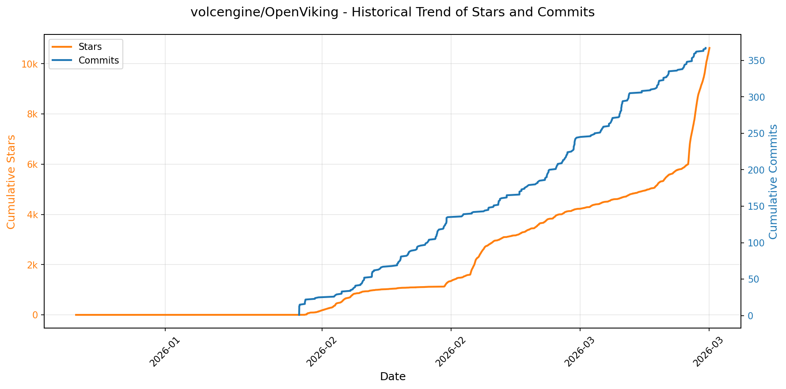

> *蓝色：累计 Stars｜橙色：累计 Commits（次 Y 轴）*

<b>📄 README 摘要</b>

1. **项目功能**  
OpenViking 是一个专为 AI Agent 设计的开源**上下文数据库（Context Database）**，旨在系统性解决 Agent 开发中长期存在的上下文管理难题。它不采用传统 RAG 的扁平化向量存储范式，而是首创以**类文件系统（Filesystem Paradigm）** 为核心架构，统一组织、存储和调度 Agent 所需的三类核心上下文：**记忆（user/agent memories）、资源（resources，如文档、代码库、网页）和能力（skills/instructions）**。其本质是为 AI Agent 构建可持久化、可追溯、可迭代的“大脑”，使开发者能像操作本地文件一样（通过 `ls`/`find`/`tree` 等命令）精准、确定性地管理上下文，彻底摆脱碎片化、黑盒化、高成本的上下文运维负担。

2. **关键特性**  
- **文件系统化上下文管理**：所有上下文均映射为 `viking://` 协议下的虚拟目录与文件（如 `viking://resources/my_project/`），支持标准文件操作语义，实现记忆、资源、技能的统一抽象与结构化治理。  
- **三级分层加载（L0/L1/L2）**：自动将上下文切分为摘要层（L0，百字级）、概览层（L1，千字级）和细节层（L2，原始全文），按需动态加载，显著降低 token 消耗（实测较基线减少超 90%）。  
- **目录递归检索（Directory Recursive Retrieval）**：融合意图分析、向量初筛、目录内精检与子目录递归钻取，突破单次向量检索局限，实现多跳、上下文感知的精准信息获取。  
- **可视化检索轨迹**：完整记录并可视化从查询发起、目录定位到最终内容加载的全链路路径，使上下文检索过程透明可观察、可调试、可优化。  
- **自动会话自迭代（Automatic Session Management）**：在对话过程中自动压缩对话内容、工具调用、资源引用等，持续提取长期记忆，驱动 Agent 在使用中持续进化变“聪明”。

3. **技术栈**  
- **核心语言与运行时**：Python（主服务与 SDK）、Go（AGFS 文件系统组件）、Rust（CLI 工具 `ov_cli`）、C++（高性能核心扩展，需 GCC 9+/Clang 11+ 编译）。  
- **模型支持架构**：  
  - **视觉语言模型（VLM）**：通过插件化 Provider 支持 VolcEngine（Doubao）、OpenAI（GPT-4o）、LiteLLM（统一接入 Anthropic/Claude、DeepSeek、Gemini、Qwen/DashScope、vLLM、Ollama 等数十种模型）；  
  - **嵌入模型（Embedding）**：原生支持 VolcEngine、OpenAI、Jina 等主流提供商。  
- **存储与协议**：基于自研 AGFS（Agent File System）构建虚拟文件系统，采用 `viking://` 自定义 URI 协议；本地工作区（workspace）为磁盘目录，支持可扩展后端。  
- **部署与生态**：提供独立 HTTP 服务（`openviking-server`）、命令行工具（`ov` CLI）、Python SDK，并深度集成 VikingBot Agent 框架；支持云原生部署（推荐 VolcEngine ECS + veLinux）。

---

### 25. [Jeffallan/claude-skills](https://github.com/Jeffallan/claude-skills)
- 📅 **创建日期**：2025-10-20  
- 🔄 **最近更新**：2026-03-13  
- ⭐ **Stars**：6,471（日 +147｜周 +1410｜月 +5675）  
- 📝 **描述**：66 Specialized Skills for Full-Stack Developers. Transform Claude Code into your expert pair programmer.  

<b>📈 Star 与 Commit 历史趋势</b>

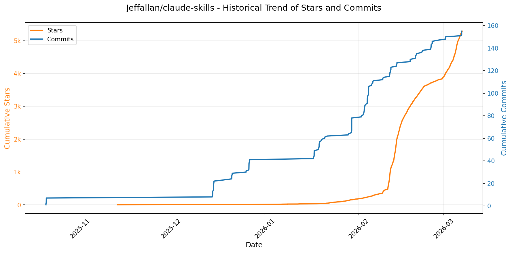

> *蓝色：累计 Stars｜橙色：累计 Commits（次 Y 轴）*

<b>📄 README 摘要</b>

1. **项目功能**  
该项目是一个专为 Anthropic Claude Code（Claude 编程插件）设计的开源技能增强套件，旨在将 Claude 转变为面向全栈开发者的专业级工程助手。它通过结构化、上下文感知的“技能”（Skills）机制，使 Claude 能够精准理解并响应复杂工程任务（如框架实现、安全加固、跨职能协作等），自动加载对应技术领域的权威参考资料，并在多步骤工作流中协调多个专业角色（如“NestJS 专家”“安全审查员”“DevOps 工程师”），从而显著提升 AI 在真实软件开发场景中的准确性、深度与实用性。

2. **核心特性**  
- **66 项专业化技能**：覆盖 12 大技术领域（含编程语言、前后端框架、基础设施、API 设计、测试、DevOps、安全、数据/ML、云平台等），每项技能附带专属参考文档（共 365+ 文件）；  
- **上下文感知自动激活**：根据用户自然语言请求（如“用 NestJS 实现 JWT 认证”）智能触发匹配技能并加载对应技术文档，无需手动调用；  
- **9 大端到端项目工作流命令**：支持从需求发现、架构设计、功能开发、缺陷排查、安全加固到复盘回顾的完整研发生命周期，原生集成 Jira 和 Confluence（需 Atlassian MCP 服务）；  
- **上下文工程能力**：提供 `/common-ground` 命令显式揭示并校准 Claude 对项目上下文（如技术栈、约束条件、团队规范）的隐含假设，提升交互可靠性；  
- **模块化可扩展架构**：支持本地开发、贡献新技能及参考材料，具备清晰的文档体系（含技能指南、工作流手册、MCP 配置指南等）。

3. **技术栈**  
- **运行平台**：Anthropic Claude Code（Claude 编程插件环境）；  
- **集成依赖**：Atlassian MCP（Model Context Protocol）服务器（用于 Jira/Confluence 工作流集成）；  
- **构建与交付**：GitHub Actions CI/CD 流水线（`ci.yml`）；  
- **文档与展示**：GitHub Pages（`jeffallan.github.io/claude-skills`）、Markdown 文档体系、动态徽章（Shields.io）、趋势分析（Trendshift）、Awesome 列表收录；  
- **许可协议**：MIT 开源许可证。

---

### 26. [alibaba/page-agent](https://github.com/alibaba/page-agent)
- 📅 **创建日期**：2025-09-23  
- 🔄 **最近更新**：2026-03-13  
- ⭐ **Stars**：5,982（日 +1179｜周 +5235｜月 +5368）  
- 📝 **描述**：JavaScript in-page GUI agent. Control web interfaces with natural language.  

<b>📈 Star 与 Commit 历史趋势</b>

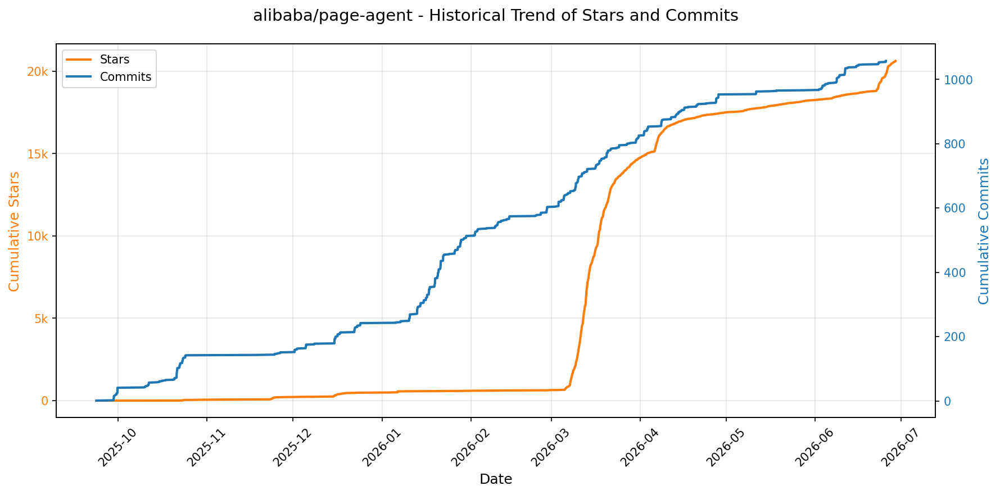

> *蓝色：累计 Stars｜橙色：累计 Commits（次 Y 轴）*

<b>📄 README 摘要</b>

1. **该项目的功能**  
Page Agent 是一个嵌入网页的轻量级 GUI 智能代理（GUI Agent），使用户能够通过自然语言指令直接操控网页界面。它在浏览器中纯前端运行，无需后端服务、Python 环境、浏览器扩展或无头浏览器；所有 DOM 解析、意图理解与操作执行均在当前页面 JavaScript 上完成，实现“所言即所行”的网页交互能力。

2. **核心特性**  
- ✅ **零依赖集成**：仅需一行 `<script>` 标签或 NPM 引入，即可在任意 Web 应用中启用；不依赖扩展、服务端或额外运行时。  
- ✅ **纯文本 DOM 操作**：基于可访问性树（Accessibility Tree）和语义化 DOM 分析，无需截图、视觉模型或多模态 LLM，规避隐私与性能瓶颈。  
- ✅ **LLM 可插拔架构**：支持用户自主接入任意兼容 OpenAI 兼容 API 的大模型（如 Qwen、Qwen3.5-plus、Llama 等），完全掌控模型选型、API 密钥与数据流向。  
- ✅ **人机协同 UI**：提供美观、可交互的悬浮控制面板（Overlay UI），支持用户确认/修正操作、查看执行步骤、中断流程，确保可控性与透明性。  
- ✅ **可选多页协同能力**：通过官方 Chrome 扩展，可跨标签页协调操作（如“在新标签页搜索并复制结果到当前表单”），拓展单页代理边界。

3. **技术栈**  
- **核心语言**：TypeScript（强类型保障前端逻辑可靠性）  
- **运行环境**：纯浏览器客户端（ES Module / IIFE 构建，支持现代浏览器及主流框架集成）  
- **DOM 交互基础**：深度借鉴并集成 [`browser-use`](https://github.com/browser-use/browser-use) 的 DOM 解析、可访问性节点提取与操作抽象层  
- **构建与分发**：Vite（构建）、npm / jsDelivr / npmmirror（CDN 分发）、BundlePhobia（体积优化验证）  
- **协议与标准**：遵循 OpenAI 兼容 API 规范（`baseURL` + `apiKey`），支持 `text/plain` 提示工程与结构化 Action 输出解析  
- **许可证**：MIT 开源协议，商用友好

---

### 27. [teng-lin/notebooklm-py](https://github.com/teng-lin/notebooklm-py)
- 📅 **创建日期**：2026-01-07  
- 🔄 **最近更新**：2026-03-13  
- ⭐ **Stars**：5,321（日 +268｜周 +2285｜月 +3449）  
- 📝 **描述**：Unofficial Python API and agentic skill for Google NotebookLM. Full programmatic access to NotebookLM's features—including capabilities the web UI doesn't expose—via Python, CLI, and AI agents like Claude Code, Codex, and OpenClaw.  

<b>📈 Star 与 Commit 历史趋势</b>

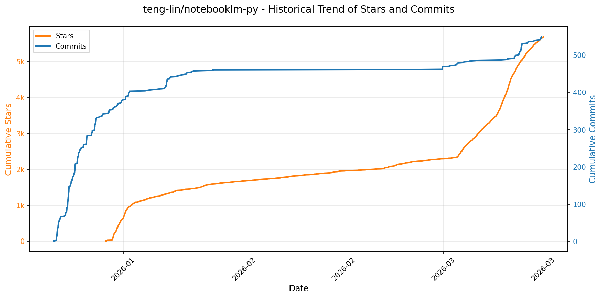

> *蓝色：累计 Stars｜橙色：累计 Commits（次 Y 轴）*

<b>📄 README 摘要</b>

1. **项目功能**  
该项目是一个非官方的 Python 封装库（`notebooklm-py`），为 Google NotebookLM 提供**完整的程序化访问能力**。它绕过官方 Web 界面限制，直接调用 NotebookLM 底层（但未公开文档化）的 Google 内部 API，支持在 Python 应用、命令行（CLI）及 AI 代理（如 Claude Code）中全自动操作 NotebookLM 的全部核心功能，包括笔记管理、多源导入（网页、PDF、YouTube、Google Drive 等）、智能问答、研究自动化、以及十余种结构化内容生成与批量导出，是 NotebookLM 的“全功能编程接口”。

2. **关键特性**  
- ✅ **全覆盖 NotebookLM 功能**：创建/管理笔记本；添加/刷新/检索各类来源（URL、文件、Drive、文本等）；多轮带角色的对话；Web/Drive 深度研究代理（自动抓取并索引）；细粒度分享控制（链接权限、用户角色、查看级别）。  
- ✅ **全类型内容生成与导出**：支持 Audio Overview（MP3/MP4）、Video Overview（含 cinematic-video 专用模式）、Slide Deck（PDF/PPTX 可编辑）、Infographic（PNG）、Quiz/Flashcards（JSON/Markdown/HTML）、Report（Markdown）、Data Table（CSV）、Mind Map（可交互 JSON）、Study Guides 等，且每类均提供丰富参数（语言、风格、难度、长度、格式等）。  
- ✅ **超越 Web UI 的独有能力**：批量下载所有同类产物；Quiz/Flashcards/Mind Map/Data Table 等导出为结构化机器可读格式（JSON/CSV/Markdown）；PPTX 导出与单页自然语言修订；Report 模板追加自定义指令；聊天记录一键保存为笔记；源文档全文提取；程序化共享权限管理。

3. **技术栈**  
- **核心语言**：Python（官方支持 3.10–3.14）  
- **HTTP 客户端**：基于 `httpx`（异步优先）实现高性能、可复用的 API 调用  
- **认证与浏览器集成**：依赖 `playwright`（Chromium/Edge）完成 OAuth 登录流程，支持 SSO 企业环境  
- **CLI 构建**：使用 `typer` 构建现代化、自动补全友好的命令行工具  
- **异步架构**：全面采用 `asyncio` + `async`/`await`，适配高并发工作流与 AI 代理集成  
- **扩展生态**：原生兼容 Claude Code 技能系统（通过 `notebooklm skill install` 注册自然语言指令）  
- **跨平台**：正式支持 macOS、Linux、Windows（CI 全覆盖验证）  
- **工程实践**：模块化设计、完整测试套件（GitHub Actions）、语义化版本、MIT 开源协议

---

### 28. [inclusionAI/AReaL](https://github.com/inclusionAI/AReaL)
- 📅 **创建日期**：2025-02-24  
- 🔄 **最近更新**：2026-03-13  
- ⭐ **Stars**：4,748（日 +51｜周 +656｜月 +1235）  
- 📝 **描述**：Lightning-Fast RL for LLM Reasoning and Agents. Made Simple & Flexible.  

<b>📈 Star 与 Commit 历史趋势</b>

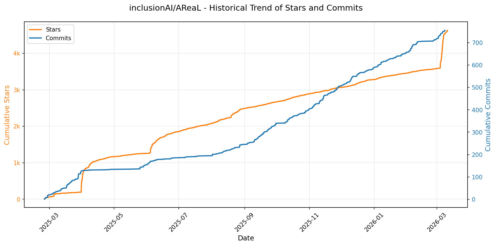

> *蓝色：累计 Stars｜橙色：累计 Commits（次 Y 轴）*

<b>📄 README 摘要</b>

1. **项目功能**  
AReaL 是一个面向大规模推理型与智能体（Agentic）模型的**全异步强化学习（RL）训练系统**，专为高效、稳定、可扩展地训练大型语言模型（LLM）、多模态大模型（VLM）及稀疏专家模型（MoE）而设计。它支持端到端的异步 RL 训练流程（含 rollout、reward modeling、policy optimization），可直接对接各类 agentic 运行时框架（如 OpenAI Agents SDK、CAMEL-AI、Tongyi-DeepResearch 等），实现“零代码修改、仅替换 `base_url` 和 `api_key`”即可启动智能体 RL 微调。其核心目标是降低 AI 智能体研发门槛，使用户能以低成本、高效率构建数学推理、编程、搜索、客服等垂直领域高性能智能体。

2. **关键特性**  
- **全异步架构**：首创工业级稳定的完全异步 RL 训练范式（如 boba² 版本实现 2.77× 加速），天然解耦 rollout、reward inference、policy update 等阶段，显著简化多轮智能体训练复杂度；  
- **极致灵活性与即插即用**：通过统一 `base_url` 配置即可无缝切换至不同 agentic runtime（如 OpenClaw、ASearcher、CAMEL）或在线 RL 场景；支持 LoRA、SFT、Distillation、RLHF Reward Modeling 等多种对齐与训练模式；  
- **前沿性能表现**：在数学（GSM8K/τ²-bench）、代码、搜索（ASearcher）、客户服务（τ²-bench）等任务上达到或超越 GPT-5、Gemini 3.0 Pro 等闭源模型；集成自演化数据引擎 AReaL-SEA，驱动 235B MoE 模型实现 SOTA 结果；  
- **全栈硬件与模型兼容性**：原生支持 Ascend NPU（华为昇腾）、CUDA GPU；兼容 Qwen2/3、Qwen3-MoE、Qwen2.5/3-VL、Gemma 3 等主流 Hugging Face 模型；支持 Megatron、PyTorch FSDP、PyTorch Archon 三大分布式训练后端；  
- **轻量与完整双版本并行**：提供完整版 AReaL 与精简版 **AReaL-lite**（代码量减少 80%，保留 90% 核心功能），兼顾工业级部署与算法快速原型验证需求。

3. **技术栈**  
- **训练框架层**：基于 PyTorch 构建，深度集成 **Megatron-LM**（支持 TP/PP/EP/SP/CP/1D Packing）、**PyTorch FSDP2**（含 ZeRO-1/2、LoRA 支持）、**PyTorch Archon**（增强型 MoE 分布式训练）；  
- **推理后端**：默认集成 **SGLang**（支持 Data Parallel Attention 与 Expert Parallel），可选 **vLLM**（支持 Tensor/Pipeline Parallel）；  
- **调度与编排**：支持本地调度（`scheduler.type=local`）与 **Ray 集群调度**，并提供 **SkyPilot** 云平台（GCP/AWS/K8s）一键部署能力；  
- **算法生态**：内置 GRPO、GSPO、PPO、DAPO、LitePPO、Dr.GRPO、RLOO、SAPO、M2PO、REINFORCE++ 等十余种同步/异步 RL 算法，全部支持灵活配置异步程度（`max_head_offpolicyness`）；  
- **开发与运维工具链**：采用 `uv` 作为现代 Python 包管理器；集成 pre-commit、CLI 配置系统、细粒度 metrics tracking、checkpointing、allocation mode 控制等工程化能力；文档体系覆盖中文/英文双语，含教程、API 参考、最佳实践与定制指南。

---

### 29. [alirezarezvani/claude-skills](https://github.com/alirezarezvani/claude-skills)
- 📅 **创建日期**：2025-10-19  
- 🔄 **最近更新**：2026-03-13  
- ⭐ **Stars**：4,600（日 +309｜周 +2098｜月 +2886）  
- 📝 **描述**：+180 production-ready skills & plugins for Claude Code, OpenAI Codex, and OpenClaw — engineering, marketing, product, compliance, C-level advisory, and more. Install via /plugin marketplace.  

<b>📈 Star 与 Commit 历史趋势</b>

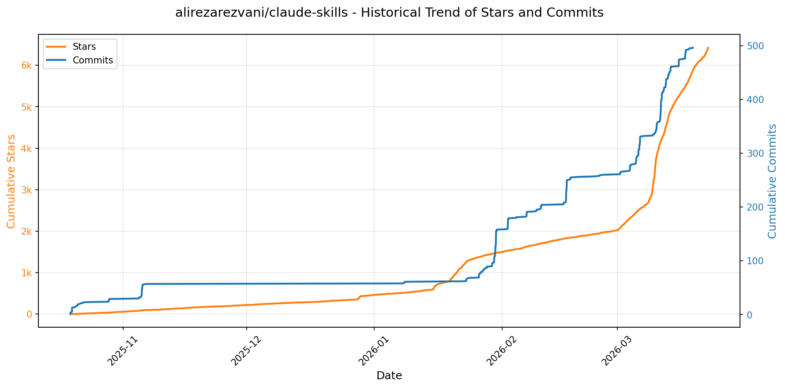

> *蓝色：累计 Stars｜橙色：累计 Commits（次 Y 轴）*

<b>📄 README 摘要</b>

1. **该项目做什么？**  
该项目是一个面向AI编程代理（AI coding agents）的开源技能库，旨在为原本缺乏领域专业知识的AI编码工具提供即插即用的“生产就绪型”专业能力。它不构建新模型或运行时，而是通过结构化指令包（Skills）、可执行代理（Agents）和角色化身份（Personas）三层抽象，赋能Claude Code、OpenAI Codex、Gemini CLI等11种主流AI编程工具，使其能胜任工程架构、安全审计、市场营销、合规认证（如MDR/FDA/ISO）、C级战略咨询、产品管理、增长运营等跨行业、高专业度任务。核心价值是将人类专家经验（含决策框架、检查清单、模板、CLI工具）封装为机器可理解、可组合、可验证的标准化模块，实现AI从“通用代码生成器”向“领域专家协作者”的跃迁。

2. **关键特性**  
- **规模与覆盖广度**：提供177个生产级技能（覆盖工程、营销、合规、C-level等9大领域）、16个预置Agent（专注单领域任务执行）、3个跨域Persona（Startup CTO / Growth Marketer / Solo Founder），并定义了一套轻量级**编排协议（Orchestration Protocol）**，支持4种协作模式（如多Agent交接、技能链、领域深挖、Solo冲刺），应对复杂跨域工作流（如6周产品发布）。  
- **深度工程能力**：包含25个“POWERFUL Tier”高级技能，如`rag-architect`（RAG流水线构建）、`database-designer`（数据库建模与优化）、`ci-cd-pipeline-builder`（CI/CD配置生成）、`incident-commander`（事故响应指挥）等，具备生产环境级实用性。  
- **安全与可靠性**：内置`skill-security-auditor`（技能安全审计器），可对任意技能包进行静态扫描，检测命令注入、数据外泄、提权等风险，返回PASS/WARN/FAIL及修复建议；全部254个Python CLI工具仅依赖标准库，零第三方依赖，开箱即用且可审计。  
- **全平台兼容性**：原生支持Claude Code，并通过`./scripts/convert.sh`一键自动转换为Cursor（`.mdc`）、Aider（`CONVENTIONS.md`）、Windsurf、Kilo Code等7种工具的原生格式，实现“一次开发、多平台部署”。  
- **开箱即用体验**：提供分领域插件化安装（如`/plugin install marketing-skills@claude-code-skills`）、详细使用示例、预生成集成文档（`integrations/`目录）及完整的贡献指南，大幅降低采用门槛。

3. **技术栈**  
- **核心格式**：以纯文本`SKILL.md`（含YAML Frontmatter）定义技能逻辑、工作流与决策框架；所有技能组织为文件夹结构，含可选`scripts/`（Python CLI工具）、`references/`（模板/检查表）、`assets/`。  
- **脚本语言**：254个Python CLI工具全部基于**Python标准库**（stdlib-only），无任何`pip install`依赖，确保跨环境（Linux/macOS/Windows）可移植性与安全性。  
- **自动化工具链**：Shell脚本驱动（`convert.sh`, `install.sh`, `gemini-install.sh`等）实现多平台格式转换、安装与验证；支持语义化版本控制与向后兼容保障。  
- **集成生态**：深度适配11种AI编程工具，包括：Claude Code（插件市场）、OpenAI Codex（CLI）、Gemini CLI（Bash）、OpenClaw、Cursor（`.mdc`规则）、Aider（`CONVENTIONS.md`）、Windsurf、Kilo Code、OpenCode、Augment、Antigravity。  
- **协议与范式**：采用轻量级、无框架的**Orchestration Protocol**（定义于`orchestration/ORCHESTRATION.md`），基于文本约定协调Persona、Agent与Skill，不引入额外运行时或中间件。

---

### 30. [InsForge/InsForge](https://github.com/InsForge/InsForge)
- 📅 **创建日期**：2025-07-29  
- 🔄 **最近更新**：2026-03-13  
- ⭐ **Stars**：3,106（日 +573｜周 +1207｜月 +1869）  
- 📝 **描述**：Give agents everything they need to ship fullstack apps. The backend built for agentic development.   

<b>📈 Star 与 Commit 历史趋势</b>

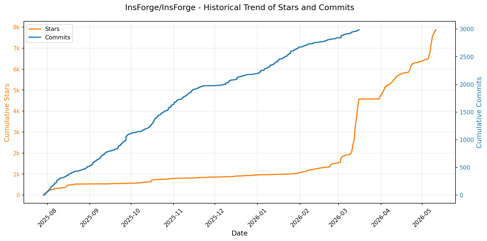

> *蓝色：累计 Stars｜橙色：累计 Commits（次 Y 轴）*

<b>📄 README 摘要</b>

1. **项目功能**  
InsForge 是一个专为 AI 编程智能体（AI coding agents）和 AI 代码编辑器设计的后端开发平台。它不提供前端应用，而是作为“语义层”（Semantic Layer），将传统后端基础设施（如数据库、认证、存储、边缘函数等）抽象为 AI 可理解、可推理、可自主操作的结构化接口，使 AI 智能体能直接执行上下文感知的后端任务——包括获取文档与能力描述、动态配置服务、实时检查系统状态与日志。

2. **核心特性**  
- ✅ **AI 原生语义接口**：通过 MCP（Model Context Protocol）协议暴露标准化工具集（如 `fetch-docs`），支持智能体自主发现、理解并调用后端能力；  
- ✅ **全栈后端原语集成**：开箱即用地提供六大核心产品模块——基于 Postgres 的关系型数据库、S3 兼容对象存储、OAuth/JWT 认证与会话管理、边缘 Serverless 函数、多厂商兼容的模型网关（OpenAI API 标准）、静态站点构建与部署；  
- ✅ **本地与云原生双模式部署**：支持一键式 Docker Compose 本地启动（含健康检查与自动初始化），也提供 Railway/Zeabur/Sealos 等平台的一键云端部署；  
- ✅ **开发者友好工作流**：内置交互式 MCP 连接向导、可视化连接状态面板、结构化日志与状态 Schema 输出，大幅降低 AI 智能体接入后端系统的认知与工程门槛。

3. **技术栈**  
- **运行时与编排**：Docker + Docker Compose（生产环境使用 `docker-compose.prod.yml`）；  
- **核心服务语言**：未显式声明，但根据 SDK 命名（`@insforge/sdk`）及 Node.js 依赖要求，推断后端主体为 TypeScript/Node.js 生态；  
- **数据库**：PostgreSQL（明确列为 Database 原语）；  
- **存储**：S3 兼容对象存储（如 MinIO 或云厂商 S3）；  
- **模型网关**：支持多 LLM 提供商的 OpenAI 兼容 API 抽象层；  
- **前端控制台**：基于 Web 的管理界面（监听 `localhost:7130`），含视频演示与交互引导；  
- **协议标准**：遵循 MCP（Model Context Protocol）规范，实现 AI 智能体与后端的语义化通信；  
- **许可证**：Apache License 2.0。

---

### 31. [vectorize-io/hindsight](https://github.com/vectorize-io/hindsight)
- 📅 **创建日期**：2025-10-30  
- 🔄 **最近更新**：2026-03-13  
- ⭐ **Stars**：3,090（日 +429｜周 +696｜月 +1730）  
- 📝 **描述**：Hindsight: Agent Memory That  Learns  

<b>📈 Star 与 Commit 历史趋势</b>

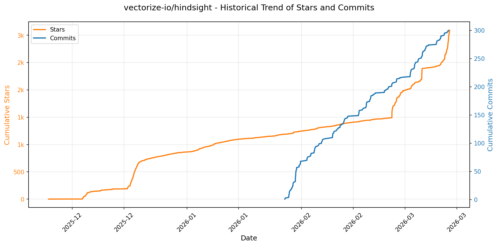

> *蓝色：累计 Stars｜橙色：累计 Commits（次 Y 轴）*

<b>📄 README 摘要</b>

1. **项目功能**  
Hindsight 是一个面向 AI 代理（Agent）的**长期学习型记忆系统**，核心目标不是简单回溯对话历史（如传统聊天记忆），而是让代理具备“学习能力”——通过持续积累、组织、反思经验与世界知识，动态构建并更新认知结构（如事实、经历、心智模型），从而在复杂任务中自主演化行为、适应反馈、提升决策质量。它专为构建类人智能体（如 AI 员工）设计，支持跨会话、跨用户、长时间跨度的知识沉淀与推理，已在 Fortune 500 企业及 AI 创业公司生产环境部署。

2. **关键特性**  
- **三重记忆架构**：仿生式区分「世界知识」（客观事实）、「个体经历」（代理自身交互事件）和「心智模型」（经反思生成的抽象规律与因果理解），形成层次化、可演化的记忆体系；  
- **四维并行检索**：`recall` 操作同时启用语义向量搜索、关键词（BM25）匹配、图谱关系（实体/时间/因果）遍历、时间范围过滤，并通过倒数秩融合（RRF）+ 跨编码器重排序实现高精度召回；  
- **闭环学习机制**：提供 `retain`（注入记忆）、`recall`（检索关联）、`reflect`（深度分析生成新洞察）三大原子操作，支持代理从数据中自动提炼规律、识别风险、优化策略；  
- **开箱即用集成**：提供 LLM 封装器（2 行代码替换现有 LLM 客户端即可启用记忆）、多语言 SDK（Python/Node.js）、嵌入式无服务模式（`hindsight-all`）及 Docker 一键部署方案；  
- **企业级灵活性**：支持按用户/场景隔离的「记忆银行（Bank）」、自定义元数据标注、多 LLM 后端（OpenAI/Anthropic/Gemini/Groq/Ollama/LMStudio）及外部 PostgreSQL 扩展；  
- **实证性能领先**：在权威 LongMemEval 基准测试中达成 SOTA（截至 2026 年 1 月），性能经弗吉尼亚理工学院 Sanghani 中心与《华盛顿邮报》独立复现验证。

3. **技术栈**  
- **后端核心**：Python（主要服务逻辑）、PostgreSQL（持久化存储，含向量扩展与图谱支持）、LLM 驱动的记忆解析与归一化（用于 `retain` 的实体/关系/时间抽取）；  
- **前端与 UI**：Web 界面（React/Vue 类框架，未明示但由 UI 地址推断）、CLI 工具；  
- **客户端支持**：Python SDK（`hindsight-client` / `hindsight-all`）、Node.js/TypeScript SDK（`@vectorize-io/hindsight-client`）、RESTful HTTP API；  
- **部署方案**：Docker 容器化（官方镜像 `ghcr.io/vectorize-io/hindsight`）、支持本地嵌入式运行或对接外部 PostgreSQL；  
- **底层能力**：混合检索引擎（向量 + 关键词 + 图谱 + 时间）、稀疏/稠密向量联合表示、基于 LLM 的记忆语义解析与心智模型生成。

---

### 32. [TheCraigHewitt/seomachine](https://github.com/TheCraigHewitt/seomachine)
- 📅 **创建日期**：2025-10-29  
- 🔄 **最近更新**：2026-03-13  
- ⭐ **Stars**：2,647（日 +101｜周 +995｜月 +2321）  
- 📝 **描述**：A specialized Claude Code workspace for creating long-form, SEO-optimized blog content for any business. This system helps you research, write, analyze, and optimize content that ranks well and serves your target audience.  

<b>📈 Star 与 Commit 历史趋势</b>

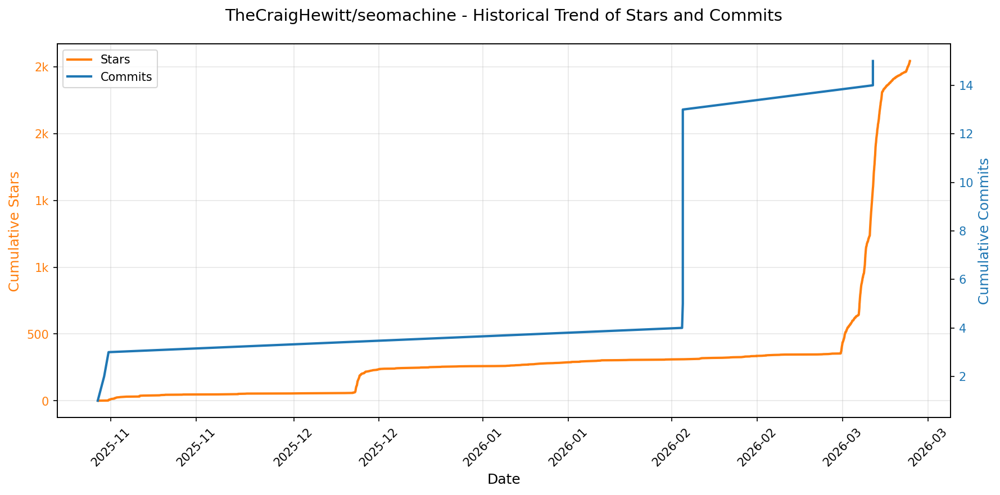

> *蓝色：累计 Stars｜橙色：累计 Commits（次 Y 轴）*

<b>📄 README 摘要</b>

1. **项目功能**  
SEO Machine 是一个基于 Claude Code 构建的专业化 AI 内容工作区，专为生成**长篇、SEO 驱动、高转化率的商业博客内容**而设计。它并非通用写作工具，而是端到端的内容生产与优化系统：支持从关键词与竞品研究出发，自动生成符合品牌调性与SEO规范的2000–3000+字深度文章；对现有内容进行健康度诊断、智能重写与多维度SEO强化；并可对接真实数据源（GA4、GSC、DataForSEO）实现数据驱动的选题优先级排序与落地发布（直连 WordPress + Yoast SEO）。其核心价值在于将专业SEO策略、内容营销逻辑与CRO方法论封装为可复用、可自动触发的AI工作流。

2. **关键特性**  
- **全链路命令化工作流**：提供 `/research`（竞品+关键词+缺口分析）、`/write`（带品牌语音/内部链接/元标签的长文生成）、`/rewrite`（基于数据的旧文升级）、`/analyze-existing`（URL或文件级SEO健康扫描）、`/optimize`（发布前终审审计）、`/publish-draft`（WordPress一键发布）等15+原子化指令，覆盖内容生命周期各阶段。  
- **9大专业化AI代理（Agents）**：包括全新「内容分析器」（含搜索意图识别、关键词聚类热力图、可读性多维评分、SEO质量0–100分评级）、SEO优化器、元标签生成器、智能内链推荐器、关键词映射器、人性化编辑器（消除AI痕迹）、性能优先级分析器、标题A/B测试生成器、落地页CRO分析师，全部支持自动串联执行。  
- **26项嵌入式营销技能**：以 slash 命令形式提供，覆盖文案（`/copy-editing`）、转化率优化（`/page-cro`, `/signup-flow-cro`）、策略（`/pricing-strategy`, `/content-strategy`）、渠道（`/email-sequence`, `/paid-ads`）、SEO专项（`/schema-markup`, `/programmatic-seo`）及数据分析（`/ab-test-setup`）等全栈能力。  
- **深度数据融合与分析模块**：集成 GA4、Google Search Console 和 DataForSEO 实时API；内置5大核心Python分析模块（搜索意图分类、关键词密度与LSI聚类、SEO质量综合打分、竞品内容长度对标、可读性多指标量化），以及6个CRO专用模块（首屏分析、CTA有效性、信任信号检测等），所有模块均开源可调用。  
- **强上下文定制能力**：通过8类模板化上下文文件（品牌语音、风格指南、竞品分析、内部链接地图、目标关键词集群等）实现高度个性化，确保输出内容严格对齐企业实际业务、语境与SEO要求。

3. **技术栈**  
- **核心运行环境**：Claude Code（Anthropic 官方 IDE），依赖 Anthropic API 密钥。  
- **后端分析层**：Python 3.x 生态，关键依赖包括：  
  - 数据接入：`google-api-python-client`（GA4/GSC）、`dataforseo` 官方SDK；  
  - NLP与文本分析：`nltk`、`textstat`、`scikit-learn`（TF-IDF/K-means聚类）；  
  - 网络与结构化处理：`beautifulsoup4`、`requests`、`lxml`；  
  - WordPress集成：`wordpress_xmlrpc` 或原生 REST API 调用，配合自定义 MU 插件暴露 Yoast 字段。  
- **基础设施**：本地开发模式（`claude-code .` 启动），配置通过 `.env` 管理（WP凭据、API密钥等）；目录结构严格分层（`/commands`、`/agents`、`/skills`、`/data_sources/modules`、`/context`），所有分析模块均为独立可执行 Python 脚本（如 `seo_baseline_analysis.py`、`research_competitor_gaps.py`）。  
- **部署与扩展**：无云服务依赖，纯本地/私有化运行；WordPress 发布需在目标站点安装轻量级 MU 插件；所有数据源配置与缓存（`/data_sources/cache/`）均支持离线复用与审计。

---

### 33. [shanraisshan/claude-code-best-practice](https://github.com/shanraisshan/claude-code-best-practice)
- 📅 **创建日期**：2025-10-31  
- 🔄 **最近更新**：2026-03-13  
- ⭐ **Stars**：1,938（日 +540｜周 +1938｜月 +1938）  
- 📝 **描述**：practice made claude perfect  

<b>📈 Star 与 Commit 历史趋势</b>

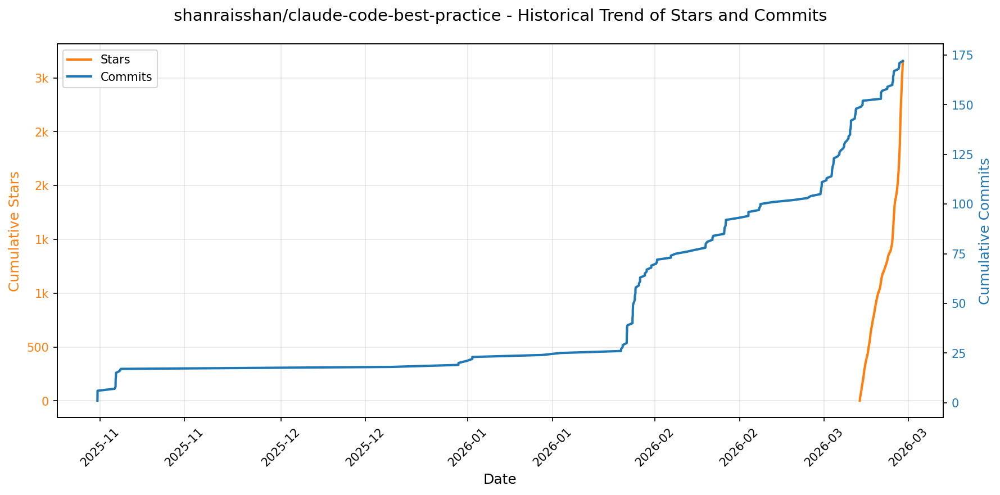

> *蓝色：累计 Stars｜橙色：累计 Commits（次 Y 轴）*

<b>📄 README 摘要</b>

1. **该项目做什么？**  
本项目是一个面向 Anthropic Claude Code（Claude 编程环境）的开源实践指南与工程化样板库，核心目标是系统性地梳理、验证并落地 Claude Code 的全部官方能力（Commands、Sub-Agents、Skills、Workflows 等），形成可复用、可验证、可演进的「最佳实践（Best Practice）」体系。它并非运行时工具或独立应用，而是一个结构化知识库 + 可执行参考实现：通过标准化目录（如 `.claude/commands/`, `.claude/agents/`, `.claude/skills/`）、配套文档（`best-practice/`）、真实实现示例（`implementation/`）及端到端工作流（如 `weather-orchestrator`），帮助开发者深度掌握 Claude Code 的工程化用法，实现从单点指令到多层协同（Command → Agent → Skill）的复杂自动化开发闭环。

2. **关键特性**  
- **全能力覆盖与分层抽象**：完整映射 Claude Code 官方功能模块（Commands、Sub-Agents、Skills、Hooks、MCP Servers、Plugins、Settings、Memory、Checkpointing 等），并明确区分其定位（如 Commands 为用户入口，Sub-Agents 为隔离上下文的自主执行体，Skills 为可复用的知识单元）。  
- **Orchestration 工作流范式**：确立并实证「Command → Agent → Skill」三级编排架构，支持高内聚、低耦合的任务分解（如天气查询流程中，Command 触发、Agent 调用技能获取数据、Skill 生成 SVG 输出）。  
- **实时演进的 Hot 特性集成**：深度整合最新实验性功能，包括 `/btw`（侧链对话）、Voice Mode（语音交互）、Scheduled Tasks（定时任务 `/loop`）、Agent Teams（多智能体协同）、Remote Control（跨设备会话）、Git Worktrees（分支级隔离开发）及 Ralph Wiggum Loop（长周期自主迭代）。  
- **工程化实践指南**：提供覆盖全生命周期的硬核技巧，涵盖规划（Phase-wise Gated Planning）、内存管理（CLAUDE.md 分层/规则拆分）、调试（`/doctor`、MCP 集成 Chrome DevTools）、性能优化（`/compact`/`/rewind`/沙箱）、协作（Agent Teams + tmux）及日常运维（每日更新、社区追踪）。  
- **开箱即用的增强组件生态**：提供经实战验证的独立模块，如 `claude-code-voice-hooks`（语音反馈）、`claude-code-status-line`（状态栏）、`cross-model-workflow`（Claude+Codex 协同评审）等，显著提升开发体验与可靠性。

3. **技术栈**  
- **核心平台**：Anthropic Claude Code（本地 IDE 环境，非网页版），深度依赖其原生机制（CLI 启动、`.claude/` 目录约定、`CLAUDE.md` 内存系统、`/command` 语法等）。  
- **配置与元数据格式**：JSON（`.claude/settings.json`, `.mcp.json`）、Markdown（所有 Commands/Agents/Skills/Best Practice 文档，含 `@path` 导入语法）、SVG/GIF（架构图与演示动效）。  
- **扩展协议与集成**：Model Context Protocol（MCP）用于连接外部工具/API/数据库；Chrome DevTools MCP、Playwright MCP、Claude in Chrome 实现浏览器上下文感知；Git（自动 checkpointing、worktrees 支持）。  
- **辅助工具链**：终端环境（iTerm/Ghostty/tmux）、语音工具（Wispr Flow）、第三方 CLI（如 Codex CLI 用于交叉验证）、GitHub 生态（GitHub App Code Review、Spec-Kit、Superpowers 等参考方案）。  
- **开发方法论**：基于 Agentic Engineering（智能体工程）、Context Engineering（上下文工程）和 Vibe Coding（直觉驱动编码）的现代 AI 原生开发范式。

---

### 34. [google-ai-edge/LiteRT](https://github.com/google-ai-edge/LiteRT)
- 📅 **创建日期**：2024-09-04  
- 🔄 **最近更新**：2026-03-13  
- ⭐ **Stars**：1,670（日 +120｜周 +144｜月 +219）  
- 📝 **描述**：LiteRT, successor to TensorFlow Lite. is Google's On-device framework for high-performance ML & GenAI deployment on edge platforms, via efficient conversion, runtime, and optimization  

<b>📈 Star 与 Commit 历史趋势</b>

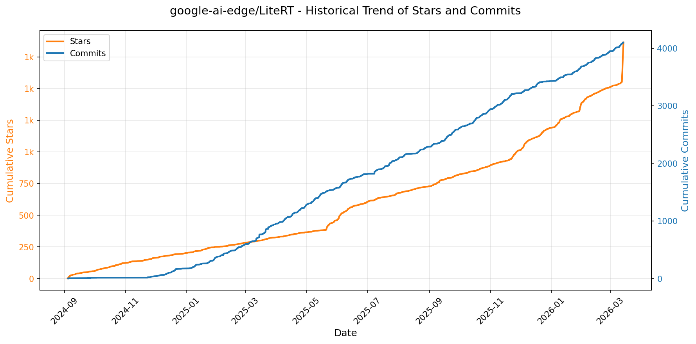

> *蓝色：累计 Stars｜橙色：累计 Commits（次 Y 轴）*

<b>📄 README 摘要</b>

1. **项目功能**  
LiteRT 是 Google 推出的面向边缘设备（on-device）的高性能机器学习与生成式 AI（GenAI）部署框架，继承并演进自 TensorFlow Lite。其核心目标是通过高效的模型转换、优化与运行时支持，在手机、嵌入式设备、IoT 设备等资源受限的边缘平台上实现低延迟、高吞吐的本地 AI 推理。它不依赖云端，支持端到端的模型编译、硬件加速调度与轻量级部署，适用于图像识别、实时分割、大语言模型（LLM）、扩散模型等多种场景。

2. **关键特性**  
- **全新编译模型 API（Compiled Model API）**：提供自动化硬件加速器选择（无需手动配置 delegate）、真正的异步执行、高效 I/O 缓冲区管理，显著简化开发流程并提升端到端性能；  
- **统一 NPU 加速支持**：无缝对接主流芯片厂商的神经网络处理器（NPU），包括 Qualcomm、MediaTek、Google Tensor、Apple ANE、Intel、Broadcom、Raspberry Pi 等，提供一致的开发者体验；  
- **业界领先的 GPU 性能**：基于 WebGPU、Metal、OpenCL、OpenGL 实现零拷贝缓冲区互操作，大幅降低 GPU 推理延迟；  
- **专为生成式 AI 优化**：深度支持 LLM 和扩散模型的端侧部署，集成 LiteRT LM 专用库，提供量化、KV 缓存优化、流式生成等 GenAI 关键能力；  
- **全平台覆盖**：原生支持 Android、iOS、Linux、macOS、Windows、Web（WebGPU）及 IoT 设备，CPU/GPU/NPU 三级加速能力按平台灵活启用；  
- **端到端工具链协同**：与 LiteRT Torch Converter（PyTorch→.tflite）、LiteRT Generative Torch API（LLM 重构建与转换）、AI Edge Quantizer（量化优化）、LiteRT-LM（LLM 运行时）深度集成，形成完整开发生态。

3. **技术栈**  
- **核心语言与构建系统**：C/C++（运行时主体）、Python（工具链与转换器）、Bazel 与 CMake（双构建系统支持）；  
- **硬件加速层**：  
  - GPU：WebGPU（跨平台）、Metal（iOS/macOS）、OpenCL/OpenGL（Android/Linux）；  
  - NPU：厂商专用 delegate（Qualcomm SNPE、MediaTek APU、Google Edge TPU 等）；  
  - CPU：XNNPACK（高度优化的 ARM/x86/WebAssembly 神经网络算子库）；  
- **模型格式与转换**：兼容 `.tflite` 格式，扩展支持 Apache（LiteRT 自研 GenAI 模型格式），依托 LiteRT Torch Converter（PyTorch → LiteRT）与 Generative Torch API；  
- **部署环境**：Docker 构建环境（支持 Linux/Android 交叉编译）、Android Studio 集成、Xcode 支持、Web 浏览器（WebGPU）、各类嵌入式 Linux 发行版；  
- **配套生态**：与 MediaPipe（多模态流水线）、AI Edge Quantizer（量化工具）、LiteRT Samples（示例工程）等 Google 边缘 AI 工具深度协同。

---

### 35. [langflow-ai/openrag](https://github.com/langflow-ai/openrag)
- 📅 **创建日期**：2025-07-11  
- 🔄 **最近更新**：2026-03-13  
- ⭐ **Stars**：1,560（日 +653｜周 +1302｜月 +1423）  
- 📝 **描述**：OpenRAG is a comprehensive, single package Retrieval-Augmented Generation platform built on Langflow, Docling, and Opensearch.   

<b>📈 Star 与 Commit 历史趋势</b>

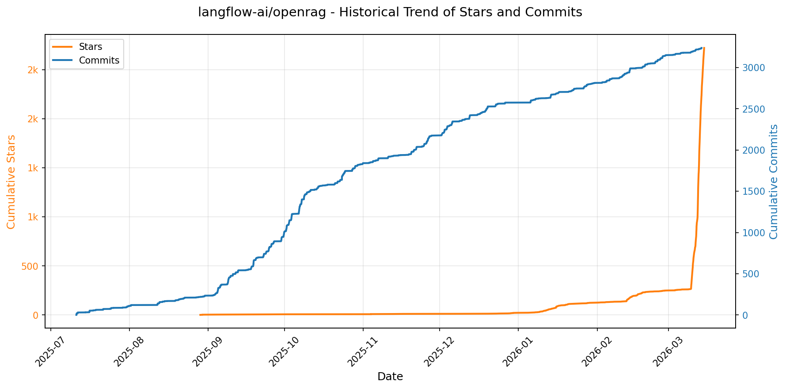

> *蓝色：累计 Stars｜橙色：累计 Commits（次 Y 轴）*

<b>📄 README 摘要</b>

1. **项目功能**  
OpenRAG 是一个面向企业级应用的智能检索增强生成（RAG）平台，专注于实现**AI驱动的文档智能搜索与对话式知识交互**。用户可通过上传文档（如PDF、Word、网页等），由系统自动完成解析、向量化、索引与语义检索，并在聊天界面中以自然语言提问，获得基于私有知识库的精准、可溯源的回答。其核心目标是将非结构化文档转化为可实时查询、可对话交互的动态知识源，支持从个人知识管理到大规模企业搜索的全场景落地。

2. **关键特性**  
- ✅ **开箱即用（Pre-packaged & ready to run）**：集成全部核心组件（Langflow + OpenSearch + Docling），无需手动配置即可快速启动；  
- ✅ **智能体化RAG工作流（Agentic RAG workflows）**：支持多步推理、结果重排序（re-ranking）、多智能体协同（如检索智能体 + 验证智能体 + 生成智能体）；  
- ✅ **鲁棒文档解析能力**：依托 Docling 实现对复杂排版（含表格、公式、多栏、扫描件OCR后文本）的高精度结构化解析；  
- ✅ **可视化流程编排**：内置 Langflow 拖拽式界面，支持零代码构建、调试和迭代RAG流水线（如预处理→分块→嵌入→检索→LLM精炼）；  
- ✅ **企业级可扩展搜索**：底层基于 OpenSearch，提供分布式索引、高并发查询、细粒度权限控制与百万级文档毫秒响应能力；  
- ✅ **模块化扩展架构**：支持按需启用企业插件（如审计日志、SSO集成、敏感词过滤、私有模型网关等）；  
- ✅ **多端集成能力**：提供 Python/TypeScript SDK 供应用嵌入，同时兼容 Model Context Protocol（MCP），可直连 Cursor、Claude Desktop 等本地AI工具，将其“知识库”无缝接入OpenRAG。

3. **技术栈**  
- **后端框架**：FastAPI（高性能异步API服务，负责文档处理、检索接口、聊天会话管理）；  
- **前端框架**：Next.js（React生态，支持SSR/ISR，构建响应式Web UI与管理控制台）；  
- **核心检索引擎**：OpenSearch（开源分布式搜索引擎，承担向量存储、混合检索、相关性排序与高可用集群）；  
- **RAG编排与低代码平台**：Langflow（可视化工作流引擎，用于定义文档摄入、检索逻辑、智能提示链及Agent行为）；  
- **文档理解层**：Docling（专为PDF/文档结构化设计的AI解析库，支持布局分析、表格识别、数学公式提取等）；  
- **基础设施**：Docker/Podman 容器化部署支持，uv（Python包管理与运行时）优化启动体验；  
- **扩展协议**：Model Context Protocol（MCP）标准实现，打通第三方AI客户端的知识调用能力；  
- **SDK支持**：官方维护 Python（`openrag-sdk`）与 TypeScript（`openrag-sdk`）双语言SDK，以及 MCP 适配器（`openrag-mcp`）。

---

