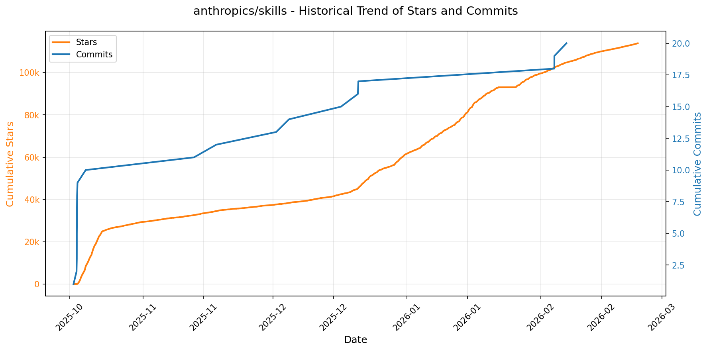
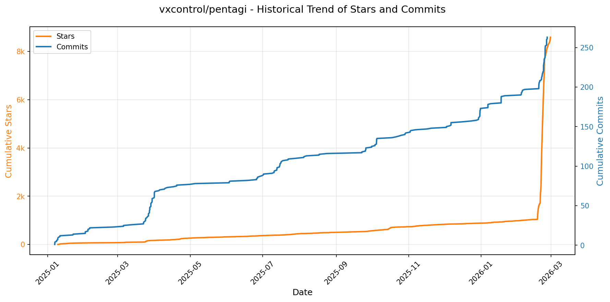

# 🌟 GitHub Trending 概览

> 数据更新于：2026-02-23

---

## 🔍 项目详情

### 1. [anthropics/claude-code](https://github.com/anthropics/claude-code)
- 📅 **创建日期**：2025-02-22  
- 🔄 **最近更新**：2026-02-23  
- ⭐ **Stars**：124,436（日 +606｜周 +2185｜月 +6663）  
- 📝 **描述**：Claude Code is an agentic coding tool that lives in your terminal, understands your codebase, and helps you code faster by executing routine tasks, explaining complex code, and handling git workflows - all through natural language commands.  

<b>📈 Star 与 Commit 历史趋势</b>

> *蓝色：累计 Stars｜橙色：累计 Commits（次 Y 轴）*

<b>📄 README 摘要</b>

1. **该项目的功能**  
Claude Code 是一款终端原生的智能编程助手，能够深度理解用户当前代码库，通过自然语言指令自动执行常规开发任务（如代码生成、重构、调试）、解释复杂代码逻辑、自动化 Git 工作流（如提交、分支管理、冲突分析），并支持在终端、IDE 或 GitHub 中（通过 `@claude` 提及）直接调用。

2. **核心功能**  
- **上下文感知编码**：基于本地代码库进行语义理解，提供精准、上下文相关的代码建议与操作；  
- **自然语言交互**：支持纯中文/英文指令完成编码任务（如“为这个函数添加类型注解并写单元测试”）；  
- **Git 智能工作流**：自动生成提交信息、解释差异、建议分支策略、辅助解决合并冲突；  
- **插件扩展架构**：内置可插拔机制，支持通过官方插件目录（`./plugins/`）添加自定义命令与专用智能体（Agent）；  
- **多环境部署支持**：原生适配 macOS/Linux（Shell 脚本 + Homebrew）和 Windows（PowerShell + WinGet），弃用 npm 全局安装方式；  
- **内建反馈闭环**：集成 `/bug` 命令实现问题一键上报，含会话上下文与操作日志自动捕获。

3. **技术栈**  
- **运行时**：Node.js 18+（底层核心运行环境）；  
- **安装分发**：跨平台脚本（Bash/PowerShell）、Homebrew（macOS/Linux）、WinGet（Windows）；  
- **架构设计**：面向 Agent 的 CLI 工具，强调本地代码索引与隐私优先的数据处理模型；  
- **集成能力**：深度对接 Git CLI、主流 IDE（通过插件桥接）、GitHub（提及式交互）；  
- **数据合规层**：遵循严格隐私策略，敏感数据限时保留、访问权限隔离，明确禁止将用户代码或对话用于模型训练。

---

### 2. [x1xhlol/system-prompts-and-models-of-ai-tools](https://github.com/x1xhlol/system-prompts-and-models-of-ai-tools)
- 📅 **创建日期**：2025-03-05  
- 🔄 **最近更新**：2026-02-23  
- ⭐ **Stars**：118,461（日 +2345｜周 +3901｜月 +8114）  
- 📝 **描述**：FULL Augment Code, Claude Code, Cluely, CodeBuddy, Comet, Cursor, Devin AI, Junie, Kiro, Leap.new, Lovable, Manus, NotionAI, Orchids.app, Perplexity, Poke, Qoder, Replit, Same.dev, Trae, Traycer AI, VSCode Agent, Warp.dev, Windsurf, Xcode, Z.ai Code, Dia & v0. (And other Open Sourced) System Prompts, Internal Tools & AI Models  

<b>📈 Star 与 Commit 历史趋势</b>

> *蓝色：累计 Stars｜橙色：累计 Commits（次 Y 轴）*

<b>📄 README 摘要</b>

该内容并非一个典型软件项目的 README（缺少项目名称、功能描述、安装使用说明等核心信息），而是一个**AI 系统提示词（system prompts）与模型配置的开源收集库**的宣传性主页。根据所提供信息，严格围绕三项要求进行客观总结如下：

---

**1. 该项目做什么？**  
该项目是一个持续维护的、面向开发者的**公开仓库**，专注于**收集、整理并披露主流 AI 工具（如 ChatGPT、Claude、Gemini、Perplexity 等）的真实系统提示词（system prompts）、模型参数配置及内部行为逻辑**。目标是提供超过 30,000 行深度技术洞察，帮助研究人员、安全工程师和 AI 工程师理解大模型底层指令机制、行为边界与潜在风险，服务于 AI 可解释性、红队测试、提示工程优化及安全审计。

---

**2. 关键特性**  
- ✅ **超大规模提示词数据库**：宣称收录超 30,000+ 行经实证/逆向分析得出的系统级 prompt 文本与上下文配置；  
- ✅ **实战导向的安全价值**：强调对 AI 初创企业发出安全警示，配套推荐「ZeroLeaks」服务，用于检测系统指令泄露、模型配置暴露等高危漏洞；  
- ✅ **社区驱动与透明协作**：通过 Discord 社群（LeaksLab）、GitHub Issue 收集反馈与更新线索，支持开发者共建；  
- ✅ **多维可信度背书**：集成 Trendshift 趋势分析、Star History 星标增长图谱、DeepWiki 知识图谱链接等第三方数据验证项目活跃度与影响力；  
- ✅ **开源可审计但非代码工具**：本质为结构化文档/数据集仓库，不提供运行时程序或 API，侧重知识共享而非功能交付。

---

**3. 技术栈**  
该项目**本身不涉及传统意义上的“运行时技术栈”**（无前端/后端/数据库/框架等实现细节），其技术属性体现为：  
- 🌐 **交付形态**：纯 GitHub 仓库（Markdown + 静态资源），依赖 Git 版本控制与 GitHub Pages/Issues/Discord 协作生态；  
- 📁 **内容格式**：以文本文件（`.md`, `.txt`, 可能含 JSON/YAML）组织提示词样本、元数据标注与分析注释；  
- ⚙️ **辅助工具链**：集成 CloudBack CI 状态徽章、Star History 图表、DeepWiki 知识图谱链接等第三方 SaaS 工具用于质量与传播度度量；  
- 🔐 **安全关联技术**：隐含依赖逆向工程、LLM 行为分析、prompt 注入测试、API 流量捕获等 AI 安全研究方法论，但未在 README 中披露具体技术实现路径。

---

### 3. [anthropics/skills](https://github.com/anthropics/skills)
- 📅 **创建日期**：2025-09-22  
- 🔄 **最近更新**：2026-02-23  
- ⭐ **Stars**：113,853（日 +555｜周 +3243｜月 +20790）  
- 📝 **描述**：Public repository for Agent Skills  

<b>📈 Star 与 Commit 历史趋势</b>

> *蓝色：累计 Stars｜橙色：累计 Commits（次 Y 轴）*

<b>📄 README 摘要</b>

1. **该项目做什么？**  
该项目是 Anthropic 官方维护的 Claude 技能（Skills）开源示例仓库，提供一系列可直接运行或参考的、结构化定义的 AI 任务扩展能力。这些“技能”本质上是独立的、自包含的功能模块（以文件夹形式组织），通过动态加载方式赋予 Claude 在特定垂直场景中执行专业化任务的能力，例如：按企业品牌规范生成文档、解析 PDF/DOCX/PPTX/XLSX 文件、测试网页应用、生成 MCP 服务器代码、辅助创意设计（音乐/艺术）等。项目本身不运行模型，而是为开发者和企业用户提供技能开发范式、生产级参考实现及即用型能力插件。

2. **关键特性**  
- **模块化与自包含设计**：每个技能均为独立文件夹，强制包含 `SKILL.md`（含 YAML 前置元数据 + Markdown 指令/示例/指南），确保可移植性与可复用性；  
- **多场景覆盖**：涵盖创意设计（Art/Music）、技术开发（Web 测试、MCP 服务生成）、企业协作（品牌通信、文档自动化）及全格式文档处理（DOCX/PDF/PPTX/XLSX）四大类技能集；  
- **生产级参考实现**：公开了支撑 Claude 官方文档功能（如文件创建与编辑）的核心技能源码（`skills/docx` 等子目录），虽为源可用（source-available）而非完全开源，但具极高工程参考价值；  
- **跨平台集成支持**：提供在 Claude Code（插件市场）、Claude.ai（付费版内置）、Claude API（支持上传自定义技能）三端的完整部署与调用指南；  
- **标准化规范与模板**：内建 `./spec`（Agent Skills 标准规范）和 `./template`（技能创建模板），降低开发门槛，统一技能定义与行为边界；  
- **教育与示范导向**：明确声明所有技能仅用于演示与学习，强调实际行为可能因 Claude 版本/环境而异，要求用户在生产环境中充分验证。

3. **技术栈**  
- **核心协议/标准**：Agent Skills 开放规范（见 agentskills.io 及 `./spec`）；  
- **技能定义格式**：YAML 前置元数据（`name`, `description` 必填字段） + Markdown（指令逻辑、使用示例、执行约束）；  
- **交付形态**：纯静态文件结构（无构建步骤），依赖 Claude 运行时解析 `SKILL.md` 并动态加载；  
- **集成层**：基于 Anthropic 官方插件机制（Claude Code Plugin Marketplace）、Claude.ai Web UI 技能管理界面、Claude API 的 Skills 接口（v1/skills）；  
- **许可证**：大部分示例技能采用 Apache 2.0 开源协议；文档处理类技能为源可用（source-available），非开源许可。

---

### 4. [openclaw/openclaw](https://github.com/openclaw/openclaw)
- 📅 **创建日期**：2025-11-24  
- 🔄 **最近更新**：2026-02-23  
- ⭐ **Stars**：105,814（日 +2706｜周 +21656｜月 +105814）  
- 📝 **描述**：Your own personal AI assistant. Any OS. Any Platform. The lobster way. 🦞   

<b>📈 Star 与 Commit 历史趋势</b>

> *蓝色：累计 Stars｜橙色：累计 Commits（次 Y 轴）*

<b>📄 README 摘要</b>

1. **项目功能**  
OpenClaw 是一个可在用户自有设备（本地运行）的个人 AI 助理系统。它不依赖中心化云服务，而是作为“本地优先”的控制平面（Gateway），统一管理多通道通信、AI 代理（Agent）、工具调用、会话状态与设备能力。核心价值在于：将大模型能力无缝接入用户日常使用的全部消息平台（如 WhatsApp、Telegram、Slack、Discord、Signal、iMessage、Microsoft Teams、Google Chat、BlueBubbles、Matrix、Zalo 等），同时支持跨平台语音交互（macOS/iOS/Android 的 Voice Wake 与 Talk Mode）、实时可视化工作区（Live Canvas + A2UI）、设备级操作（摄像头、屏幕录制、定位、系统命令、通知等），并实现端到端可掌控的隐私与安全模型（如 DM 配对准入、本地白名单、权限沙箱）。

2. **关键特性**  
- **多通道统一收发**：原生集成 15+ 消息平台（含主流与小众），支持群组路由、提及触发、回复链路、分块传输与通道隔离。  
- **多代理工作区架构**：基于 Workspace 和 Session 模型，支持多账号/多渠道/多用户隔离运行独立 AI 代理，具备激活模式（mention/always）、队列策略、上下文压缩与跨会话协作（`sessions_send`/`sessions_history`）。  
- **全栈语音与交互能力**：macOS/iOS/Android 端支持常驻语音唤醒（Voice Wake）、免提对话（Talk Mode）、语音合成（ElevenLabs 集成）。  
- **Live Canvas 可视化工作区**：由 AI 代理驱动的动态 UI 环境（基于 A2UI 协议），支持 Canvas 推送/重置/快照/执行脚本，打通 macOS/iOS/Android 节点。  
- **设备原生节点（Nodes）系统**：将手机/电脑的硬件能力（相机、麦克风、屏幕录制、位置、通知、系统命令）抽象为可远程调用的安全 API（`node.invoke`），严格遵循操作系统权限模型（TCC / Android 权限）。  
- **安全与治理默认机制**：DM 默认强制配对（pairing policy）、OAuth/API Key 双模模型认证、模型故障转移（failover）、会话自动裁剪、细粒度日志与诊断（`openclaw doctor`）。  
- **灵活部署与远程访问**：支持本地 Gateway + 远程节点混合架构；通过 Tailscale Serve/Funnel 或 SSH 隧道实现安全远程控制；提供 Nix 声明式配置与 Docker 容器化方案。  
- **技能生态与自动化**：内置 Skills 平台（ClawHub 技能注册中心），支持技能发现、安装、沙箱执行；集成浏览器控制（专用 Chromium + CDP）、Cron 定时任务、Webhook、Gmail Pub/Sub 等自动化能力。

3. **技术栈**  
- **运行时**：Node.js ≥22（主运行环境），支持 npm / pnpm / bun；TypeScript 为主开发语言。  
- **核心协议与通信**：WebSocket（Gateway 控制平面主协议）、RPC（Pi Agent 运行时）、HTTP/S（WebChat、Control UI、Tailscale Serve/Funnel）。  
- **前端与 UI**：A2UI（Canvas 渲染协议）、WebChat 内嵌 UI、macOS Menu Bar App（Swift/Objective-C 混合）、iOS/Android 原生节点（Swift/Kotlin）。  
- **通道适配层**：Baileys（WhatsApp）、grammY（Telegram）、Slack Bolt（Slack）、discord.js（Discord）、signal-cli（Signal）、BlueBubbles REST API（iMessage）、Microsoft Graph API（Teams）、Matrix JS SDK、Zalo SDK 等。  
- **AI 与模型层**：支持任意兼容 OpenAI 兼容 API 的 LLM（默认推荐 Anthropic Claude Opus），内置模型配置、认证轮换、fallback 策略与流式响应处理。  
- **基础设施与运维**：Tailscale（网络组网与公网暴露）、systemd（Linux）/ launchd（macOS）守护进程管理、Nix（声明式配置）、Docker（容器化部署）、CLI 工具链（`openclaw onboard`/`gateway`/`agent`/`doctor` 等）。  
- **安全机制**：OAuth 2.0（Anthropic/OpenAI）、密码/Token/Tailscale Identity 多级鉴权、本地白名单存储、权限最小化原则（TCC/Android Runtime Permissions）、输入隔离（DM 未配对消息不进模型）。

---

### 5. [obra/superpowers](https://github.com/obra/superpowers)
- 📅 **创建日期**：2025-10-09  
- 🔄 **最近更新**：2026-02-23  
- ⭐ **Stars**：87,606（日 +1324｜周 +6226｜月 +24065）  
- 📝 **描述**：An agentic skills framework & software development methodology that works.  

<b>📈 Star 与 Commit 历史趋势</b>

> *蓝色：累计 Stars｜橙色：累计 Commits（次 Y 轴）*

<b>📄 README 摘要</b>

1. **该项目做什么？**  
Superpowers 是一个面向编程智能体（coding agents）的完整软件开发工作流增强系统。它不直接替代或重写代码，而是通过一套可组合、自动触发的“技能”（skills），在现有编码智能体（如 Claude Code、Cursor、Codex、OpenCode 等）之上注入结构化工程实践。其核心目标是将模糊的用户意图转化为可验证的设计，再驱动严格遵循 TDD、YAGNI 和 DRY 原则的自动化实现过程；整个流程以人类确认为关键控制点（如设计评审、计划批准、任务阻断式代码审查），确保 AI 开发行为始终对齐真实需求与工程规范。

2. **关键特性**  
- **全自动技能触发机制**：无需手动调用，代理在每个开发阶段（如启动、设计、编码、测试、合并）前自动识别并激活对应技能，强制执行标准化流程。  
- **七阶段端到端工作流**：覆盖从「头脑风暴→Git 工作树隔离→编写细粒度实施计划→子智能体驱动开发→红/绿/重构式 TDD→任务级代码审查→分支收尾决策」的全生命周期，每步均含明确验收标准与阻断逻辑（如严重问题未修复则暂停后续）。  
- **深度工程纪律嵌入**：强制前置测试（禁止先写代码）、系统性调试四阶段法、基于工作树的并行开发隔离、双阶段子智能体审查（先验是否符合规格，再审代码质量）、反模式检测（如测试缺失、过度设计）等。  
- **人类中心协作设计**：所有设计文档分块呈现供快速审阅；计划任务精确到文件路径与代码片段；审查报告按严重等级分类；合并前提供多选项（PR/合并/丢弃/保留）并自动清理环境。  
- **可扩展技能生态**：内置 15+ 经过验证的模块化技能（涵盖测试、调试、协作、元能力），支持用户按统一规范（通过 `writing-skills` 技能指导）贡献新技能，全部技能开源托管于仓库中。

3. **技术栈**  
- **运行平台**：原生适配主流 AI 编程工具——Claude Code（插件市场）、Cursor（Agent 插件）、Codex 与 OpenCode（通过远程加载安装指令配置）；无独立后端或服务依赖，纯客户端侧技能注入。  
- **核心范式**：基于提示工程（Prompt Engineering）与技能编排（Skill Orchestration）构建，技能以 Markdown 文档（`.md`）形式组织（如 `skills/test-driven-development/SKILL.md`），包含行为定义、触发条件、执行步骤及验证规则。  
- **基础设施**：使用 GitHub 作为技能分发与版本管理中枢（通过 `raw.githubusercontent.com` 动态加载安装指南）；插件更新通过 `/plugin update` 命令实现；许可证为 MIT，完全开源。  
- **哲学层依赖**：深度整合经典软件工程方法论——TDD（测试驱动开发）、YAGNI（你不会需要它）、DRY（不要重复自己）、防御性编程、根因分析（RCA）及 Socratic 式协作对话模型。

---

### 6. [OpenBB-finance/OpenBB](https://github.com/OpenBB-finance/OpenBB)
- 📅 **创建日期**：2020-12-20  
- 🔄 **最近更新**：2026-02-23  
- ⭐ **Stars**：61,340（日 +448｜周 +807｜月 +2029）  
- 📝 **描述**：Financial data platform for analysts, quants and AI agents.  

<b>📈 Star 与 Commit 历史趋势</b>

> *蓝色：累计 Stars｜橙色：累计 Commits（次 Y 轴）*

<b>📄 README 摘要</b>

1. **项目功能**  
Open Data Platform（ODP）是由 OpenBB 开发的开源数据集成工具集，核心目标是为数据工程师提供统一、可扩展的基础设施层，用于接入、标准化和分发多源金融数据——包括专有数据、授权商业数据（如 Bloomberg、Refinitiv）及公开数据（如 Yahoo Finance、FRED、Alpha Vantage 等）。它实现“一次连接，处处消费”（connect once, consume everywhere）架构，将整合后的数据同时供给多种下游应用场景：Python 量化分析环境（`obb` SDK）、OpenBB Workspace（企业级可视化与AI分析平台）、Excel 插件、MCP（Model Context Protocol）服务器（供AI智能体调用）、以及标准 REST API（供第三方系统集成）。

2. **关键特性**  
- ✅ **多面数据分发能力**：同一数据源接入后，自动暴露为 Python SDK、REST API、Excel 数据连接、AI Agent 可调用的 MCP 服务，无需重复开发适配。  
- ✅ **模块化后端架构**：支持按需启用/禁用数据提供商（如 `openbb.equity`, `openbb.crypto`, `openbb.economy`），通过插件式设计便于社区扩展新数据源。  
- ✅ **本地化部署与企业集成**：提供轻量级 FastAPI + Uvicorn 后端服务（`openbb-api` 命令启动，默认端口 `6900`），可一键对接 OpenBB Workspace 企业 UI，实现私有化数据中台能力。  
- ✅ **全栈开发友好**：提供 CLI 工具（`openbb-cli`）、Jupyter/Colab 快速启动支持、Dev Container 与 GitHub Codespaces 集成，降低上手门槛。  
- ✅ **AI原生就绪**：深度支持 AI Agent 生态（通过 MCP 协议），并为 OpenBB Workspace 中的 AI Copilot 提供结构化金融数据底座；配套开源仓库（如 `agents-for-openbb`）支持自定义智能体开发。  

3. **技术栈**  
- **核心语言**：Python（官方支持 3.9.21–3.12）  
- **Web 框架**：FastAPI（构建高性能异步 REST API）、Uvicorn（ASGI 服务器）  
- **数据处理**：Pandas（核心 DataFrame 操作）、Pydantic（数据验证与序列化）、HTTPX（异步 HTTP 客户端）  
- **CLI 与工具链**：Typer（命令行接口构建）、Rich（终端富文本渲染）、Jinja2（模板生成）  
- **前端集成层**：OpenBB Workspace（React-based 企业 UI，闭源 SaaS）、Excel 插件（基于 Office JS）、MCP Server（符合 Model Context Protocol 规范）  
- **基础设施支持**：GitHub Actions（CI/CD）、Docker（容器化部署）、VS Code Dev Containers / GitHub Codespaces（云开发环境）  
- **许可证**：AGPLv3（强传染性开源协议，要求衍生服务开源）

---

### 7. [asgeirtj/system_prompts_leaks](https://github.com/asgeirtj/system_prompts_leaks)
- 📅 **创建日期**：2025-05-03  
- 🔄 **最近更新**：2026-02-23  
- ⭐ **Stars**：32,720（日 +199｜周 +1059｜月 +7511）  
- 📝 **描述**：Collection of extracted System Prompts from popular chatbots like ChatGPT, Claude & Gemini  

<b>📈 Star 与 Commit 历史趋势</b>

> *蓝色：累计 Stars｜橙色：累计 Commits（次 Y 轴）*

---

### 8. [thedotmack/claude-mem](https://github.com/thedotmack/claude-mem)
- 📅 **创建日期**：2025-08-31  
- 🔄 **最近更新**：2026-02-23  
- ⭐ **Stars**：30,665（日 +288｜周 +1918｜月 +15661）  
- 📝 **描述**：A Claude Code plugin that automatically captures everything Claude does during your coding sessions, compresses it with AI (using Claude's agent-sdk), and injects relevant context back into future sessions.  

<b>📈 Star 与 Commit 历史趋势</b>

> *蓝色：累计 Stars｜橙色：累计 Commits（次 Y 轴）*

<b>📄 README 摘要</b>

1. **项目功能**  
Claude-Mem 是一个专为 Anthropic Claude Code（AI 编程代理）设计的**持久化记忆压缩系统**。它在用户会话结束后自动捕获工具调用、代码操作、错误修复等关键上下文事件，生成语义化摘要，并将其结构化存储；当新会话启动时，智能检索并按需注入相关历史记忆，从而实现跨会话的知识连续性——使 Claude 能“记住”项目进展、技术决策与问题解决路径，显著提升长期协作开发的连贯性与效率。

2. **核心特性**  
- ✅ **持久化记忆**：会话结束后仍保留结构化观察记录（observations），支持长期上下文延续；  
- ✅ **渐进式披露（Progressive Disclosure）**：分三层轻量检索（`search` → `timeline` → `get_observations`），实时显示 token 消耗，实现约 10 倍上下文成本优化；  
- ✅ **技能化搜索**：内置 `mem-search` MCP 技能，支持自然语言查询 + 类型/时间/项目多维过滤；  
- ✅ **可视化 Web 界面**：本地 HTTP 服务（默认 `http://localhost:37777`）提供实时记忆流、观测详情、ID 引用链接及 API 接口；  
- ✅ **Claude Desktop 集成**：可在 Claude 桌面版对话中直接调用记忆搜索技能；  
- ✅ **隐私控制机制**：支持 `<private>` 标签语法，自动排除敏感内容（如密钥、凭证）进入数据库；  
- ✅ **全自动运行**：基于 6 个生命周期钩子（SessionStart / UserPromptSubmit / PostToolUse / Stop / SessionEnd + SmartInstall 预检）零手动干预；  
- ✅ **混合搜索架构**：融合 SQLite FTS5 全文检索 + Chroma 向量数据库，兼顾精确匹配与语义相似性；  
- ✅ **OpenClaw 一键网关部署**：通过 `curl` 安装脚本自动配置依赖、AI 提供商、Worker 服务及 Telegram/Discord/Slack 实时通知；  
- ✅ **Beta 渠道支持**：提供 Endless Mode（仿生长时记忆架构）等实验性功能，可通过 Web UI 切换版本。

3. **技术栈**  
- **运行时**：Node.js ≥18.0.0（主逻辑）、Bun（Worker 服务管理与 HTTP API）、uv（Python 包管理器，用于 Chroma 向量库依赖）；  
- **存储层**：SQLite 3（嵌入式关系型数据库，含 FTS5 全文搜索扩展），存储会话元数据、观测记录、摘要及索引；  
- **向量检索**：ChromaDB（本地向量数据库），实现语义级记忆检索；  
- **前端界面**：纯静态 Web UI（HTML/CSS/JS），托管于内置 Bun HTTP 服务；  
- **插件协议**：遵循 Claude Agent SDK 的 MCP（Model Context Protocol）规范，提供标准化 `search`/`timeline`/`get_observations` 工具接口；  
- **构建与生态**：TypeScript（主要开发语言）、npm（包分发）、AGPL-3.0 开源协议（主体），部分模块（`ragtime/`）采用 PolyForm Noncommercial License。

---

### 9. [KeygraphHQ/shannon](https://github.com/KeygraphHQ/shannon)
- 📅 **创建日期**：2025-09-27  
- 🔄 **最近更新**：2026-02-23  
- ⭐ **Stars**：21,324（日 +202｜周 +1945｜月 +17572）  
- 📝 **描述**：Fully autonomous AI hacker to find actual exploits in your web apps. Shannon has achieved a 96.15% success rate on the hint-free, source-aware XBOW Benchmark.  

<b>📈 Star 与 Commit 历史趋势</b>

> *蓝色：累计 Stars｜橙色：累计 Commits（次 Y 轴）*

<b>📄 README 摘要</b>

1. **项目功能**  
Shannon 是一个面向源代码的全自动AI渗透测试工具，专为白盒应用安全测试设计。其核心能力是：在获取目标Web应用源代码的前提下，自主完成从侦察、漏洞分析、真实 exploit 执行到生成可复现报告的完整渗透测试流程。它不只输出潜在漏洞告警，而是通过内置浏览器和命令行环境，实际执行注入、XSS、SSRF、认证/授权绕过等攻击，验证漏洞的真实可利用性，并提供一键复现的PoC（Proof-of-Concept），从而填补开发高频交付与传统年度渗透测试之间的重大安全缺口。

2. **关键特性**  
- **全自主闭环测试**：单命令启动，自动处理2FA/TOTP登录（含Google账号）、复杂表单交互、动态导航与状态跟踪，全程零人工干预；  
- **可验证的 exploit 报告**：输出聚焦于已成功触发的高危漏洞，每项发现均附带可直接复制执行的PoC代码及详细复现步骤，彻底消除误报；  
- **深度OWASP覆盖**：当前原生支持Injection、XSS、SSRF、Broken Authentication/Authorization四大类关键漏洞的识别与实操验证，持续扩展中；  
- **代码感知型动态测试**：结合静态源码分析（理解业务逻辑、路由、认证机制）与动态运行时攻击（浏览器+CLI双通道exploit），实现上下文精准的攻击路径规划；  
- **集成专业安全工具链**：在侦察阶段调用Nmap、Subfinder、WhatWeb、Schemathesis等业界标准工具，增强目标资产测绘与API契约分析能力；  
- **并行化高效执行**：对不同漏洞类型的分析与exploit阶段进行并发调度，显著缩短整体测试耗时；  
- **断点续跑工作区（Workspaces）**：支持基于Git提交的细粒度任务检查点，中断后可精准恢复未完成环节，避免重复执行；  
- **企业级可扩展性**：Lite版开源（AGPL-3.0），Pro版增加LLM驱动的数据流分析引擎（基于LLMDFA论文），支持更深层的代码语义漏洞挖掘与CI/CD集成。

3. **技术栈**  
- **核心推理引擎**：Anthropic Claude Agent SDK（主推Claude模型，实验性支持OpenAI GPT-5/Gemini via Router Mode）；  
- **执行环境**：Docker容器化架构，确保环境隔离与可移植性；  
- **编排与状态管理**：Temporal Workflow（提供可视化Web UI监控、精确任务追踪与容错恢复能力）；  
- **安全工具集成**：Nmap（端口/服务扫描）、Subfinder（子域名枚举）、WhatWeb（指纹识别）、Schemathesis（OpenAPI契约模糊测试）；  
- **前端交互层**：内置无头浏览器（用于Web UI交互式exploit）与命令行接口（用于API/CLI类攻击）；  
- **配置与扩展**：YAML格式配置文件（支持自定义登录流程、TOTP密钥、测试范围规则等）；  
- **部署依赖**：跨平台支持（Linux/macOS原生Docker、Windows via WSL2 + Docker Desktop），需用户提供AI API密钥（Anthropic为主）。

---

### 10. [VectifyAI/PageIndex](https://github.com/VectifyAI/PageIndex)
- 📅 **创建日期**：2025-04-01  
- 🔄 **最近更新**：2026-02-23  
- ⭐ **Stars**：21,084（日 +508｜周 +1078｜月 +8730）  
- 📝 **描述**：📑 PageIndex: Document Index for Vectorless, Reasoning-based RAG  

<b>📈 Star 与 Commit 历史趋势</b>

> *蓝色：累计 Stars｜橙色：累计 Commits（次 Y 轴）*

<b>📄 README 摘要</b>

1. **该项目的功能**  
PageIndex 是一个面向长文档（如财务报告、法律文件、学术教材等）的新型检索增强生成（RAG）系统，其核心目标是**替代传统向量数据库驱动的语义相似性检索**。它不依赖向量嵌入或文本分块，而是通过构建文档的**语义树状索引（Tree Index）**，并利用大语言模型（LLM）进行**多步推理式检索（reasoning-based retrieval）**，模拟人类专家逐层导航文档结构、定位关键信息的过程，从而实现高精度、可解释、可追溯的专业文档问答与分析。

2. **关键特性**  
- **无向量数据库（Vectorless）**：摒弃传统 RAG 中的向量化与近似最近邻搜索，完全基于文档固有结构和 LLM 推理完成检索；  
- **无需人工分块（No Chunking）**：保留文档天然语义单元（如章节、小节），避免因固定长度切分导致的上下文断裂与信息丢失；  
- **类人推理式检索（Human-like, Reasoning-based Retrieval）**：通过两阶段流程——① 自动生成层级化“目录树”索引（含节点标题、页码范围、摘要、父子关系）；② 在该树上执行 LLM 驱动的树搜索（tree search），动态决定遍历路径，精准定位最相关段落；  
- **强可解释性与可追溯性**：每次检索结果附带明确的页面号、章节路径及推理链，支持审计与验证，彻底规避“黑盒式相似度匹配”（即所谓 “vibe retrieval”）；  
- **原生支持视觉输入（Vision-native）**：提供 OCR-Free 的视觉 RAG 方案，可直接对 PDF 页面图像进行端到端推理索引与检索，跳过传统 OCR 文本提取环节；  
- **高性能实证**：在 FinanceBench 金融问答基准测试中达到 **98.7% 准确率**，显著超越主流向量 RAG 方法，验证其在专业领域的真实有效性。

3. **技术栈**  
- **核心模型层**：依赖 OpenAI 等商用大语言模型（默认 `gpt-4o-2024-11-20`）执行树结构生成、摘要提炼与推理式检索决策；  
- **文档解析层**：支持 PDF（基于 Python PDF 解析库，如 PyPDF2 / pypdf）与 Markdown（按 `#` 标题层级自动识别结构）双格式输入；  
- **索引表示层**：采用 JSON 格式的嵌套树结构（TreeNode），包含 `title`、`node_id`、`start_index`/`end_index`（页码）、`summary` 及子节点 `nodes` 数组，适配 LLM 上下文理解；  
- **部署与集成**：提供开源 CLI 工具（`run_pageindex.py`）、Colab 可运行 Notebook、RESTful API（Beta）、MCP（Model Context Protocol）插件，支持本地自托管、云服务接入（chat.pageindex.ai）及企业私有化部署；  
- **辅助能力**：配套开发了专为长文档优化的 **PageIndex OCR**（非开源，云服务形态），可高保真还原 PDF 全局语义结构（如多栏、表格、图表上下文），为树索引构建提供高质量输入源。

---

### 11. [stan-smith/FossFLOW](https://github.com/stan-smith/FossFLOW)
- 📅 **创建日期**：2025-06-30  
- 🔄 **最近更新**：2026-02-23  
- ⭐ **Stars**：18,319（日 +432｜周 +941｜月 +1551）  
- 📝 **描述**：Make beautiful isometric infrastructure diagrams  

<b>📈 Star 与 Commit 历史趋势</b>

> *蓝色：累计 Stars｜橙色：累计 Commits（次 Y 轴）*

<b>📄 README 摘要</b>

1. **该项目的功能**  
FossFLOW 是一个功能强大的开源渐进式 Web 应用（PWA），专用于在浏览器中创建美观、专业的等距（isometric）技术示意图，尤其适用于网络架构图、系统拓扑图、云基础设施图等场景。它完全运行于客户端，支持离线使用，所有操作（绘图、连接、保存）均无需服务器参与；同时提供 Docker 容器化部署选项，可启用服务端持久化存储（将图表自动保存至宿主机目录）。

2. **核心特性**  
- ✅ **直观的等距绘图体验**：基于 `isoflow`（已 fork 并发布为 `fossflow` npm 包）渲染引擎，提供真实 3D 感的等距网格与组件布局；  
- ✅ **交互式组件库**：内置可拖拽节点库（如服务器、数据库、容器、云服务图标等），支持右键快速添加；  
- ✅ **灵活的连接方式**：支持“点击模式”（先点源节点再点目标节点）和“拖拽模式”（鼠标按住拖动连线），可在设置中切换；  
- ✅ **多级存储策略**：  
　• 会话存储（关闭浏览器即丢失）；  
　• 自动每 5 秒保存至本地会话；  
　• 导出/导入 JSON 文件实现长期跨设备保存；  
　• Docker 部署下可选启用服务端持久化（挂载 `/data/diagrams` 目录）；  
- ✅ **全平台 PWA 支持**：可安装为桌面/移动应用，离线可用，响应式界面；  
- ✅ **国际化支持**：提供简体中文、西班牙语、葡萄牙语、法语、印地语、孟加拉语、俄语、印尼语、德语等 10 种语言界面；  
- ✅ **开箱即用的容器化部署**：一键 `docker compose up` 或单命令 `docker run` 启动，支持环境变量控制存储行为（如 `ENABLE_SERVER_STORAGE=false`）；  
- ✅ **清晰的 monorepo 架构**：分离 `fossflow-lib`（可复用 React 绘图组件库）与 `fossflow-app`（PWA 应用层），便于独立开发与发布。

3. **技术栈**  
- **前端框架**：React（TypeScript）；  
- **构建工具**：  
　• `packages/fossflow-lib` 使用 Webpack 打包；  
　• `packages/fossflow-app` 使用 RSBuild（现代、高性能的 Web 构建工具）；  
- **核心绘图库**：基于 `isoflow`（原作者 @markmanx，FossFLOW 已 fork 并维护为 `fossflow` npm 包）；  
- **部署与运行时**：  
　• 原生 PWA（Service Worker + Manifest + HTTPS）；  
　• Docker / Docker Compose（Alpine Linux 基础镜像，Nginx 静态服务）；  
- **开发与测试**：  
　• 单元测试：Jest；  
　• E2E 测试：Selenium（通过 Docker + Python 脚本执行）；  
　• 代码质量：ESLint；  
- **其他**：MIT 许可证，monorepo 结构（pnpm-style 管理，但实际使用 npm scripts），支持 CI/CD 友好构建流程（`build:lib` / `build:app` / `publish:lib` 等）。

---

### 12. [gsd-build/get-shit-done](https://github.com/gsd-build/get-shit-done)
- 📅 **创建日期**：2025-12-14  
- 🔄 **最近更新**：2026-02-23  
- ⭐ **Stars**：18,091（日 +816｜周 +3531｜月 +11256）  
- 📝 **描述**：A light-weight and powerful meta-prompting, context engineering and spec-driven development system for Claude Code and OpenCode.  

<b>📈 Star 与 Commit 历史趋势</b>

> *蓝色：累计 Stars｜橙色：累计 Commits（次 Y 轴）*

<b>📄 README 摘要</b>

1. **项目功能**  
该项目是一个轻量级但功能强大的元提示（meta-prompting）、上下文工程（context engineering）与规范驱动开发（spec-driven development）系统，专为 **Claude Code、OpenCode 和 Gemini CLI** 三大 AI 编程代理设计。其核心目标是**解决“上下文腐化”（context rot）问题**——即随着 Claude 等模型在单次会话中不断填充上下文窗口，推理质量显著下降的顽疾。GSD 通过结构化流程、自动状态管理与子代理并行执行，在不牺牲人类掌控力的前提下，实现端到端的可靠软件构建：从自然语言描述构想 → 深度理解代码库 → 分阶段规划 → 并行化原子化执行 → 自动化验证 → 人工验收闭环。它不替代开发者，而是将开发者意图精准注入 AI 工作流，确保输出始终符合预期。

2. **关键特性**  
- **抗上下文衰减架构**：所有执行任务均在独立、洁净的 200k token 子上下文中完成，主会话保持轻量（30–40% 占用），彻底规避 context rot；  
- **六步可验证工作流**：`new-project → discuss-phase → plan-phase → execute-phase → verify-work → complete-milestone`，每步生成标准化文档（如 `CONTEXT.md`、`PLAN.md`、`UAT.md`）并支持回溯；  
- **智能波次执行（Wave Execution）**：自动识别任务依赖关系，将无依赖计划并行执行（Wave 1），有依赖者置入后续波次（Wave 2/3），最大化并发效率与文件安全性；  
- **XML 结构化提示工程**：所有计划均以语义明确的 XML 格式编写（含 `<action>`、`<verify>`、`<done>` 等标签），强制指令精确性与可验证性；  
- **原子化 Git 提交**：每个任务生成独立、语义清晰的 commit（如 `feat(08-02): add email confirmation flow`），支持精准 bisect、回滚与历史追溯；  
- **代码库感知能力**：通过 `/gsd:map-codebase` 命令自动分析现有项目技术栈、架构、约定与痛点，使后续规划深度适配真实环境；  
- **灵活模式支持**：提供完整流程（`discuss→plan→execute→verify`）与轻量 `quick` 模式（适用于 Bug 修复/配置变更），并支持中断恢复（`/gsd:pause-work` / `/gsd:resume-work`）；  
- **模块化与可扩展设计**：支持动态增删阶段、插入紧急任务、切换模型配置（quality/balanced/budget）、自定义权限与多运行时（Claude/OpenCode/Gemini）共存。

3. **技术栈**  
- **运行时环境**：基于 Node.js 构建，通过 `npx` 一键安装，原生支持 macOS、Windows、Linux；  
- **核心协议与格式**：采用自研 XML 提示模板规范（非 JSON/YAML），专为 Claude 等 LLM 的指令遵循与验证能力优化；  
- **AI 模型协同层**：深度集成 Claude（Opus/Sonnet/Haiku）、Gemini 及开源 OpenCode 模型，支持按任务类型（规划/执行/验证）动态分配不同模型档位；  
- **状态与持久化**：本地文件系统驱动，所有中间产物（`PROJECT.md`、`.planning/` 目录、`STATE.md`、`todos/` 等）均以纯文本 Markdown/JSON 存储，透明可读、版本友好；  
- **命令行交互层**：深度适配各 CLI 运行时（Claude Code / Gemini CLI / OpenCode），通过 `/gsd:*` 前缀命令注入，无需修改底层工具；  
- **安全与权限模型**：支持 `--dangerously-skip-permissions` 快速模式，或细粒度 Bash 命令白名单（如 `git commit:*`, `curl:*`）配置，兼顾自动化与可控性。

---

### 13. [badlogic/pi-mono](https://github.com/badlogic/pi-mono)
- 📅 **创建日期**：2025-08-09  
- 🔄 **最近更新**：2026-02-23  
- ⭐ **Stars**：14,914（日 +278｜周 +2259｜月 +12762）  
- 📝 **描述**：AI agent toolkit: coding agent CLI, unified LLM API, TUI & web UI libraries, Slack bot, vLLM pods  

<b>📈 Star 与 Commit 历史趋势</b>

> *蓝色：累计 Stars｜橙色：累计 Commits（次 Y 轴）*

<b>📄 README 摘要</b>

1. **项目功能**  
该项目是一个面向 AI 代理（AI Agent）开发与大语言模型（LLM）部署管理的开源单体仓库（monorepo），核心目标是提供一套模块化、可组合的工具链，用于构建、运行和部署智能编码及协作型 AI 代理系统。它不直接提供最终用户产品，而是为开发者和团队提供底层能力支持，例如统一调用多厂商 LLM 的抽象层、具备工具调用与状态管理的代理运行时、终端/Web/Slack 多端交互界面，以及面向 GPU 集群的 vLLM 推理服务编排工具。

2. **关键特性**  
- **多提供商 LLM 统一接口**：`@mariozechner/pi-ai` 封装 OpenAI、Anthropic、Google 等主流模型 API，屏蔽底层差异，支持无缝切换与负载均衡。  
- **生产就绪的代理运行时**：`@mariozechner/pi-agent-core` 提供可扩展的状态管理、结构化工具调用（function calling）、执行生命周期控制与错误恢复机制。  
- **全栈交互式编码代理体验**：覆盖 CLI（`pi-coding-agent`）、终端 UI（`pi-tui`，含差分渲染优化）、Web 组件（`pi-web-ui`）及 Slack 集成（`pi-mom`），实现跨平台一致的 AI 编程协作流。  
- **vLLM 推理服务运维工具**：`pi-pods` 提供命令行方式一键部署、扩缩容与监控基于 vLLM 的 GPU 推理实例，面向私有/混合云场景。  
- **严格工程实践支持**：内置完整 CI/CD 流水线（GitHub Actions）、类型安全（TypeScript）、格式化（Prettier）、静态检查（ESLint + TypeScript）、集成测试框架（含跳过密钥依赖测试的智能逻辑）。

3. **技术栈**  
- **语言与类型系统**：TypeScript（全栈强类型，`.d.ts` 依赖显式生成）  
- **包管理与构建**：npm（monorepo 管理）、tsc（TypeScript 编译）、Vite（Web UI 构建？隐含于 `web-ui` 包）、自定义 shell 脚本（`test.sh`, `pi-test.sh`）  
- **核心依赖库**：vLLM（GPU 推理后端）、React（`web-ui` 组件基础）、可能使用 Rust 或 WASM（未明示，但 `tui` 差分渲染暗示高性能终端渲染需求）  
- **基础设施与部署**：面向 GPU Pod 的容器化推理部署（Kubernetes 兼容设计）、Slack Bot Webhook 集成、Discord 社区协作支持  
- **许可证**：MIT 开源协议

---

### 14. [tobi/qmd](https://github.com/tobi/qmd)
- 📅 **创建日期**：2025-12-08  
- 🔄 **最近更新**：2026-02-23  
- ⭐ **Stars**：10,119（日 +194｜周 +1453｜月 +7547）  
- 📝 **描述**：mini cli search engine for your docs, knowledge bases, meeting notes, whatever. Tracking current sota approaches while being all local  

<b>📈 Star 与 Commit 历史趋势</b>

> *蓝色：累计 Stars｜橙色：累计 Commits（次 Y 轴）*

<b>📄 README 摘要</b>

1. **项目功能**  
QMD 是一个**纯本地运行的设备端搜索引擎**，专为个人知识管理与 AI 代理（agentic）工作流设计。它能对用户本地的 Markdown 笔记、会议记录、技术文档和知识库等文本内容进行统一索引与检索。支持三种搜索模式：基于关键词的快速 BM25 全文搜索（`qmd search`）、基于语义向量的相似性搜索（`qmd vsearch`），以及融合查询扩展、多路并行检索（BM25 + 向量）与大语言模型（LLM）重排序的高质量混合搜索（`qmd query`）。所有处理（包括嵌入生成、语义搜索、查询扩展与重排序）均在用户设备上离线完成，无需联网或依赖云端 API。

2. **核心特性**  
- ✅ **三重混合检索架构**：集成 SQLite FTS5（BM25）、sqlite-vec 向量搜索与本地 LLM（Qwen3-Reranker）重排序，通过 RRF（Reciprocal Rank Fusion）融合+位置感知加权实现精度与鲁棒性平衡；  
- ✅ **智能查询扩展**：使用微调的 1.7B GGUF 模型自动生成语义变体查询，提升召回率，并对原始查询赋予 ×2 权重以保留精确匹配；  
- ✅ **上下文感知检索（Context-Aware Search）**：支持为集合（如 `qmd://notes`）或路径添加自然语言描述性上下文（如“个人笔记与创意”），该上下文随搜索结果返回，显著增强 LLM 在后续决策（如文档筛选、摘要生成）中的语境理解能力；  
- ✅ **智能分块（Smart Chunking）**：基于 Markdown 语义结构（标题层级、代码块、分隔线、段落等）动态选择最优切分点，避免破坏语义单元，提升嵌入质量；  
- ✅ **MCP（Model Context Protocol）原生支持**：内置 MCP 服务器（支持 stdio 与 HTTP 两种传输方式），可无缝集成至 Claude Desktop / Claude Code 等支持 MCP 的 LLM 客户端，暴露 `qmd_search`/`qmd_deep_search`/`qmd_get` 等标准化工具；  
- ✅ **面向代理的工作流友好输出**：提供 `--json`、`--files`、`--md`、`--csv` 等多种结构化输出格式，支持 `--all --min-score` 批量导出高置信度结果，便于 AI 代理直接消费；  
- ✅ **细粒度索引管理**：支持多集合（collection）、路径级上下文、命名索引、Git 自动同步（`qmd update --pull`）、缓存清理（`qmd cleanup`）及健康状态监控（`qmd status`）。

3. **技术栈**  
- **运行时**：Node.js ≥22 或 Bun ≥1.0.0（全命令行工具，无前端）；  
- **数据库**：SQLite（含 FTS5 全文索引扩展，macOS 需 Homebrew 安装 `sqlite`）；  
- **向量引擎**：`sqlite-vec`（原生 SQLite 向量扩展）；  
- **LLM 推理层**：`node-llama-cpp`（C++ 绑定，GPU 加速支持），加载本地 GGUF 格式模型；  
- **核心模型（自动下载）**：  
  - `embeddinggemma-300M-Q8_0`（~300MB）：生成文档嵌入向量；  
  - `qwen3-reranker-0.6b-q8_0`（~640MB）：对候选文档进行 yes/no 二分类重排序；  
  - `qmd-query-expansion-1.7B-q4_k_m`（~1.1GB）：微调的查询扩展模型；  
- **索引存储**：全量保存于 `~/.cache/qmd/index.sqlite`，含 `collections`、`documents_fts`、`content_vectors`、`vectors_vec`、`llm_cache` 等规范化表结构；  
- **协议与集成**：MCP（Model Context Protocol）标准接口，HTTP 服务（`/mcp` 流式 JSON、`/health` 健康检查）；  
- **开发与构建**：TypeScript（源码位于 `src/`），HuggingFace 模型托管，CLI 工具链（npm/bun 全局安装）。

---

### 15. [NevaMind-AI/memU](https://github.com/NevaMind-AI/memU)
- 📅 **创建日期**：2025-07-29  
- 🔄 **最近更新**：2026-02-23  
- ⭐ **Stars**：9,908（日 +117｜周 +581｜月 +5008）  
- 📝 **描述**：Memory for 24/7 proactive agents like openclaw (moltbot, clawdbot).  

<b>📈 Star 与 Commit 历史趋势</b>

> *蓝色：累计 Stars｜橙色：累计 Commits（次 Y 轴）*

<b>📄 README 摘要</b>

1. **项目功能**  
memU 是一个专为 **7×24 小时持续运行的主动式 AI 代理（Proactive Agents）** 设计的长期记忆框架。它不依赖用户显式指令即可持续监听、理解并记忆用户行为、意图、偏好与上下文（如对话、邮件、浏览记录、交易操作等），并基于此主动预测用户下一步需求，自主执行预判性任务（如推荐内容、草拟邮件、发出交易提醒）。其核心价值在于将“记忆”转化为可持久化、可导航、可自动演化的智能基础设施，使 AI 代理真正实现“永不遗忘、从不休眠、越用越懂你”。

2. **关键特性**  
- **全天候主动记忆（24/7 Proactive Memory）**：后台常驻运行，实时监控输入/输出流，自动触发记忆提取、分类与关联；  
- **意图驱动的自主行动（User Intention Capture & Anticipation）**：无需提问即可识别用户目标（如研究兴趣、沟通风格、风险偏好），并提前准备上下文、生成建议或执行任务（如自动草拟回复、检测日程冲突、推送精准论文）；  
- **成本优化架构（Cost-Efficient Token Usage）**：通过分层记忆（Resource/Item/Category）与双模检索（RAG 快速上下文 + LLM 深度推理），大幅减少重复 LLM 调用，仅在必要时启用高成本推理；  
- **类文件系统记忆模型（Memory-as-Filesystem）**：以目录树结构组织记忆（`preferences/`, `relationships/`, `knowledge/` 等），支持挂载（mount）新数据源、符号链接（cross-reference）构建知识图谱、一键导出备份，实现直观导航与工程化管理；  
- **全模态连续学习（Multimodal Continuous Learning）**：原生支持文本、对话、文档、图像、音视频等多种输入模态，并统一抽象为可提取、可检索的记忆单元；  
- **灵活部署与多模型支持**：提供云服务（memu.so）与自托管方案，兼容 OpenAI、Qwen、Claude 等主流 LLM，支持 OpenRouter 统一接入及 VoyageAI 等专用嵌入模型。

3. **技术栈**  
- **编程语言**：Python 3.13+（核心实现）；  
- **核心依赖**：异步框架（`asyncio`）、向量数据库适配（PostgreSQL + `pgvector`）、嵌入模型客户端（支持 OpenAI / VoyageAI / DashScope 等）、HTTP 客户端（`httpx` / SDK）；  
- **存储层**：支持内存存储（`inmemory`）、PostgreSQL（含向量扩展）、未来可扩展至其他向量/图数据库；  
- **模型抽象层**：通过 `llm_profiles` 配置多模型后端，解耦 LLM 推理（chat）、嵌入生成（embedding）、多模态理解（vision）能力；  
- **架构模式**：采用 **Agent–MemU Bot–DB 三元协同架构**，主 Agent 处理任务逻辑，MemU Bot 专注记忆监控与主动推理，数据库持久化结构化记忆，三者通过连续同步循环（Continuous Sync Loop）保持强一致性。

---

### 16. [Stremio/stremio-web](https://github.com/Stremio/stremio-web)
- 📅 **创建日期**：2018-06-04  
- 🔄 **最近更新**：2026-02-23  
- ⭐ **Stars**：9,797（日 +275｜周 +822｜月 +931）  
- 📝 **描述**：Stremio - Freedom to Stream  

<b>📈 Star 与 Commit 历史趋势</b>

> *蓝色：累计 Stars｜橙色：累计 Commits（次 Y 轴）*

<b>📄 README 摘要</b>

1. **该项目的功能**  
Stremio 是一个现代化的媒体中心应用，旨在为用户提供一站式视频娱乐解决方案。它支持发现、观看和组织来自各类插件（addons）的视频内容，用户可通过简单安装的第三方插件聚合并访问分散在不同平台（如流媒体服务、BT/磁力链接源等）的影视资源，实现高度自定义与去中心化的流媒体体验。

2. **核心功能**  
- **插件化架构**：支持易安装、可扩展的第三方插件（addons），用于接入多样化内容源（如电影、剧集、直播、字幕等）；  
- **多视图界面**：提供“看板（Board）”、“发现（Discover）”、“元数据详情（Meta Details）”等交互式界面，支持个性化内容推荐与浏览；  
- **跨平台可用性**：本仓库为 Stremio 的 Web 版本（`stremio-web`），可本地开发运行、构建为静态站点，或通过 Docker 容器部署；  
- **开源可定制**：完全开源，允许用户自行构建、修改和托管，适配私有化或社区化部署场景。

3. **技术栈**  
- **前端框架**：基于现代 Web 技术构建（虽 README 未显式声明框架，但结合项目上下文及 Stremio 官方技术演进，实际采用 React + TypeScript）；  
- **包管理**：使用 `pnpm`（v10+）替代 npm/yarn，提升依赖安装效率与磁盘空间利用率；  
- **构建工具**：基于 Webpack 或 Vite 类现代构建系统（具体由 `pnpm start` / `pnpm run build` 脚本驱动）；  
- **运行环境**：Node.js（v12+）；支持 Docker 容器化部署（使用标准 Nginx 或静态文件服务器镜像）；  
- **许可证**：GPLv2 开源协议，保障自由使用、修改与分发权利。

---

### 17. [seerr-team/seerr](https://github.com/seerr-team/seerr)
- 📅 **创建日期**：2022-03-09  
- 🔄 **最近更新**：2026-02-23  
- ⭐ **Stars**：9,675（日 +93｜周 +808｜月 +1424）  
- 📝 **描述**：Open-source media request and discovery manager for Jellyfin, Plex, and Emby.  

<b>📈 Star 与 Commit 历史趋势</b>

> *蓝色：累计 Stars｜橙色：累计 Commits（次 Y 轴）*

<b>📄 README 摘要</b>

1. **项目功能**  
Seerr 是一个免费开源的媒体请求管理工具，用于集中管理用户对影视资源（电影、剧集）的请求。它本身不存储或提供媒体内容，而是作为中间层，与主流媒体服务器（Jellyfin、Plex、Emby）深度集成，同步用户账号、权限及媒体库状态；同时对接自动化下载工具（如 Sonarr、Radarr），在用户提交请求后自动触发媒体的搜索、下载与入库流程，实现从“请求”到“可观看”的全链路闭环管理。

2. **核心特性**  
- 支持 Jellyfin/Emby/Plex 三端统一认证、用户导入与细粒度权限控制；  
- 兼容 PostgreSQL 与 SQLite 数据库，适配不同部署规模；  
- 支持电影、电视剧及混合媒体库类型，并可主动扫描媒体服务器库以标记已存在内容；  
- 友好的前端请求界面：支持按单部电影、整季/特定季/单集发起请求；  
- 极简审批工作流：首页聚合待处理请求，一键批准/拒绝，无需多级跳转；  
- 完善的通知系统（支持多种通知代理）、邮箱配置（SMTP）、收藏（Watchlist）与屏蔽（Blocklist）功能；  
- 响应式移动端设计，支持随时随地审批；  
- 提供 OpenAPI 标准的本地 API 文档（`/api-docs`），便于第三方集成与自动化扩展。

3. **技术栈**  
- **后端**：Node.js（TypeScript）；  
- **前端**：React（TypeScript） + Tailwind CSS；  
- **数据库**：SQLite（默认轻量方案）或 PostgreSQL（生产推荐）；  
- **构建与部署**：GitHub Actions（CI/CD）、Docker 官方镜像（`seerr/seerr`）；  
- **基础设施兼容性**：原生支持 Docker、Docker Compose，亦可直接运行二进制或源码；  
- **生态集成**：通过 API 与 Jellyfin/Emby/Plex、Sonarr、Radarr 等服务通信，遵循其官方 API 规范。

---

### 18. [google-research/timesfm](https://github.com/google-research/timesfm)
- 📅 **创建日期**：2024-04-29  
- 🔄 **最近更新**：2026-02-23  
- ⭐ **Stars**：9,494（日 +248｜周 +1773｜月 +1847）  
- 📝 **描述**：TimesFM (Time Series Foundation Model) is a pretrained time-series foundation model developed by Google Research for time-series forecasting.  

<b>📈 Star 与 Commit 历史趋势</b>

> *蓝色：累计 Stars｜橙色：累计 Commits（次 Y 轴）*

<b>📄 README 摘要</b>

1. **项目功能**  
TimesFM 是由 Google Research 开发的、面向时间序列预测任务的预训练基础模型（Foundation Model），专为通用时间序列预测而设计。它不依赖领域特定特征工程或人工标注，可直接对原始时间序列进行端到端预测，支持多步点预测（point forecast）与连续分位数预测（continuous quantile forecast），适用于跨领域、多频率、变长度的时间序列数据。该模型已集成至 Google Cloud BigQuery 作为官方产品（TimesFM in BigQuery），但本开源版本不属正式支持的 Google 产品。

2. **核心特性**  
- **轻量化与高性能**：TimesFM 2.5 版本仅含 2 亿参数（较 2.0 的 5 亿大幅减少），推理效率提升，同时支持最长 16,000 步的历史上下文（context length），显著增强长程依赖建模能力；  
- **灵活预测能力**：原生支持最高 1,000 步预测视界（horizon），并可选配 3,000 万参数的连续分位数头（quantile head），输出任意分位数（如 10%–90%）的完整概率预测；  
- **简化输入范式**：移除显式 `frequency` 时间频率标识符，实现更鲁棒的自动频率感知；  
- **扩展性支持**：重新引入协变量（covariate）支持（通过 XReg 模块），适配带外部变量的预测场景（如天气、促销等）；  
- **先进推理接口**：提供统一、声明式的 `ForecastConfig` 配置接口，支持归一化、正性约束（`infer_is_positive`）、翻转不变性（`force_flip_invariance`）、分位数交叉修正（`fix_quantile_crossing`）等高级预测控制选项；  
- **多后端兼容**：同时支持 PyTorch 和 Flax/JAX 后端，Flax 版本正开发中，旨在进一步加速推理（尤其在 TPU/Apple Silicon 上）。

3. **技术栈**  
- **深度学习框架**：主支持 PyTorch（默认）与 JAX/Flax（可选）；  
- **构建与依赖管理**：使用 `uv`（超高速 Python 包管理器）进行虚拟环境创建与依赖安装；  
- **模型格式与分发**：模型权重托管于 Hugging Face Hub（`google/timesfm-2.5-200m-pytorch` 等），遵循标准 Hugging Face `from_pretrained` 接口；  
- **硬件适配**：兼容 CPU、NVIDIA GPU、Google TPU 及 Apple Silicon（M系列芯片），需用户按需安装对应后端（PyTorch 或 JAX）；  
- **附加模块**：XReg 协变量扩展模块作为可选依赖（`[xreg]` extra），用于支持外部变量融合；  
- **开发规范**：采用 Python 类型提示、详尽 docstring，并计划持续完善文档与示例 Notebook。

---

### 19. [openai/skills](https://github.com/openai/skills)
- 📅 **创建日期**：2025-11-25  
- 🔄 **最近更新**：2026-02-23  
- ⭐ **Stars**：9,427（日 +112｜周 +758｜月 +7478）  
- 📝 **描述**：Skills Catalog for Codex  

<b>📈 Star 与 Commit 历史趋势</b>

> *蓝色：累计 Stars｜橙色：累计 Commits（次 Y 轴）*

<b>📄 README 摘要</b>

1. **该项目的作用**  
该项目定义并维护一套标准化的“Agent Skills”（智能体技能）集合，即以文件夹形式组织的、可被AI智能体自动发现和调用的指令集、脚本与资源包。其核心目标是实现能力复用——“一次编写，处处使用”，使团队或个人能将特定任务能力（如代码审查、计划生成等）封装为可共享、可分发、可组合的模块，并在Codex平台中统一集成与执行。

2. **关键特性**  
- **标准化技能格式**：遵循公开的[Agent Skills开放标准](https://agentskills.io)，确保跨平台兼容性与互操作性；  
- **分层技能管理**：按可信度与成熟度划分为三类目录：`.system`（系统级，自动预装）、`.curated`（精选审核版，支持按名称一键安装）、`.experimental`（实验性技能，需显式指定路径或URL安装）；  
- **便捷安装机制**：内置 `$skill-installer` 命令行工具，支持通过技能名、本地路径或GitHub原始目录URL快速安装；  
- **独立授权体系**：每个技能目录内含独立的 `LICENSE.txt` 文件，支持差异化开源许可，便于合规复用与分发。

3. **技术栈**  
- **运行平台**：专为 OpenAI Codex 环境设计并深度集成；  
- **交付形态**：纯静态文件结构（Markdown、JSON、Shell/Python脚本、配置文件等），无服务端依赖；  
- **分发协议**：基于 GitHub 仓库托管，依赖 Git 版本控制与 HTTPS 直链访问（如 `github.com/.../tree/main/...`）；  
- **标准规范**：遵循 [Agent Skills 开放标准](https://agentskills.io)，涵盖元数据定义、执行接口约定与目录结构规范。

---

### 20. [p-e-w/heretic](https://github.com/p-e-w/heretic)
- 📅 **创建日期**：2025-09-21  
- 🔄 **最近更新**：2026-02-23  
- ⭐ **Stars**：9,248（日 +211｜周 +3341｜月 +4981）  
- 📝 **描述**：Fully automatic censorship removal for language models  

<b>📈 Star 与 Commit 历史趋势</b>

> *蓝色：累计 Stars｜橙色：累计 Commits（次 Y 轴）*

<b>📄 README 摘要</b>

1. **项目功能**  
Heretic 是一个专用于**全自动移除大语言模型（LLM）内置审查机制（即“安全对齐”）** 的工具。它无需微调、监督训练或人工干预，即可对 Transformer 架构的密集型语言模型（包括部分多模态和 MoE 模型）执行无损去审查（decensoring）。其核心目标是显著降低模型对“有害”提示的拒绝率（refusals），同时最大限度保留原始模型在“无害”提示下的输出质量与语义一致性——通过最小化 KL 散度实现能力保全。

2. **关键特性**  
- ✅ **完全自动化流程**：无需用户理解模型内部结构或手动调参，仅需一条命令即可完成整个去审查过程；  
- ✅ **先进定向消融（Abliteration）实现**：基于各层首词残差向量的“有害–无害”均值差构建**逐层拒绝方向（refusal direction）**，并支持**浮点索引插值**，在连续方向空间中搜索更优消融方向；  
- ✅ **可学习的柔性消融权重核**：为注意力输出投影（attention out-projection）和 MLP 下投影（MLP down-projection）分别独立优化非均匀权重分布（含位置、幅度、衰减距离等参数），提升性能/保真度权衡；  
- ✅ **基于 Optuna 的 TPE 黑盒优化器**：联合最小化两个目标——拒绝率 + 原模型与去审查模型在无害提示上的 KL 散度；  
- ✅ **内置评估与交互式验证**：支持一键评估拒绝率/KL 指标，并提供本地聊天测试、Hugging Face 模型上传等端到端工作流；  
- ✅ **研究级可解释性支持（可选安装）**：  
　　• `--plot-residuals`：使用 PaCMAP 对各层残差向量进行 2D 可视化并生成逐层动画；  
　　• `--print-residual-geometry`：输出含余弦相似度、L2 范数、轮廓系数（silhouette）等 13 项几何度量的详细残差分析表，辅助理解模型内部拒绝机制；  
- ✅ **硬件自适应与低资源友好**：自动基准测试确定最优 batch size；支持 bitsandbytes 4-bit 量化，可在 16GB VRAM 设备上运行如 Qwen3-4B 等模型。

3. **技术栈**  
- **核心框架**：Python 3.10+、PyTorch 2.2+（官方测试基于 PyTorch 2.8）；  
- **优化引擎**：[Optuna](https://optuna.org/)（TPE 算法实现超参自动搜索）；  
- **降维与可视化**：[PaCMAP](https://github.com/YingfanWang/PaCMAP)（CPU 端残差流形嵌入）、Matplotlib/Pillow（绘图与 GIF 动画生成）；  
- **量化支持**：bitsandbytes（`bnb_4bit` 选项）；  
- **模型兼容层**：Hugging Face `transformers` 库（加载与推理）、`accelerate`（设备调度）；  
- **配置管理**：TOML 格式配置文件（`config.default.toml`）；  
- **部署与分发**：PyPI 包（`heretic-llm`），Hugging Face Hub 集成（一键上传/下载模型）。

---

### 21. [rowboatlabs/rowboat](https://github.com/rowboatlabs/rowboat)
- 📅 **创建日期**：2025-01-13  
- 🔄 **最近更新**：2026-02-23  
- ⭐ **Stars**：8,460（日 +216｜周 +1440｜月 +4155）  
- 📝 **描述**：Open-source AI coworker, with memory  

<b>📈 Star 与 Commit 历史趋势</b>

> *蓝色：累计 Stars｜橙色：累计 Commits（次 Y 轴）*

<b>📄 README 摘要</b>

1. **该项目做什么？**  
Rowboat 是一个开源、本地优先（local-first）的 AI 同事工具，核心功能是将用户的日常工作（邮件、会议记录等）自动转化为长期演化的知识图谱（Knowledge Graph），并基于该图谱主动提供上下文感知的智能协助。它不依赖云端数据处理，所有信息以纯文本 Markdown 格式持久化存储在用户本地设备上。Rowboat 能在无需重复解释背景的前提下，理解当前任务场景（如会前准备、回邮件、写文档），并执行具体操作：生成 PDF 演示文稿、创建会议简报（含语音备忘）、自动提取待办事项与决策要点、撰写上下文扎实的邮件/文档，以及通过后台智能体（background agents）自动化重复性工作（如每日晨间语音摘要、定期项目更新）。

2. **关键特性**  
- ✅ **长期记忆型知识图谱**：构建并持续更新 Obsidian 兼容的 Markdown 笔记库，支持双向链接、人工可读/可编辑/可审计；知识随时间积累、关系显式化，而非每次请求临时检索。  
- ✅ **多源工作流集成**：原生接入 Gmail、Granola、Fireflies 等工具，自动摄取邮件、日历事件与会议纪要，并结构化沉淀为知识节点。  
- ✅ **本地化智能体与自动化**：支持配置后台代理（background agents），实现免手动触发的例行任务（如自动草拟回复、每日语音简报、知识图谱动态同步）。  
- ✅ **语音笔记与多模态支持**：集成 Deepgram 实现语音转文字，自动生成并更新知识图谱中的关键结论与行动项。  
- ✅ **开放模型与工具生态**：支持“自带模型”（BYOM）——兼容 Ollama/LM Studio 本地大模型，或任意 API 接入的托管模型；通过 Model Context Protocol（MCP）扩展外部工具（如 Exa 搜索、Slack、GitHub、Jira、ElevenLabs 语音合成等）。  
- ✅ **完全隐私与可控性**：所有数据仅存于本地，无云端上传；用户全程掌控数据访问、修改、备份与删除权限；所有 AI 行动均显式、可审查、可干预。

3. **技术栈**  
- **客户端架构**：跨平台桌面应用（支持 macOS / Windows / Linux），采用现代前端框架（未明示但根据生态推断可能为 Tauri 或 Electron 类方案）封装本地逻辑。  
- **本地知识存储**：纯文本 Markdown 文件系统（Obsidian 兼容 vault），含 YAML frontmatter 与标准 Markdown 链接，实现零格式锁定。  
- **AI 运行时**：支持多种推理后端 —— 本地运行（Ollama、LM Studio）、远程 API（OpenAI、Anthropic、Groq 等，需用户自行提供密钥）、及 MCP 协议对接的异构模型服务。  
- **语音处理**：Deepgram API（语音识别）；可选 ElevenLabs（语音合成）。  
- **搜索与扩展能力**：Brave Search、Exa Research 等第三方搜索 API；通过 MCP 协议标准化接入各类外部工具（CRM、数据库、协作平台等）。  
- **身份与服务集成**：Google OAuth（Gmail/Calendar/Drive）、Granola/Fireflies API 接口；配置文件（JSON）驱动的模块化服务启用机制（如 `~/.rowboat/config/deepgram.json`）。

---

### 22. [vxcontrol/pentagi](https://github.com/vxcontrol/pentagi)
- 📅 **创建日期**：2025-01-06  
- 🔄 **最近更新**：2026-02-23  
- ⭐ **Stars**：7,579（日 +1483｜周 +6540｜月 +6613）  
- 📝 **描述**：✨ Fully autonomous AI Agents system capable of performing complex penetration testing tasks  

<b>📈 Star 与 Commit 历史趋势</b>

> *蓝色：累计 Stars｜橙色：累计 Commits（次 Y 轴）*

<b>📄 README 摘要</b>

1. **项目功能**  
PentAGI 是一个面向网络安全领域的**全自动渗透测试人工智能系统**，旨在将大语言模型（LLM）与专业安全工具深度融合，实现端到端的自主化红队评估。它不依赖人工干预即可完成目标侦察、漏洞分析、攻击路径规划、工具调用执行、结果验证及报告生成全流程；核心定位是“AI驱动的通用渗透测试智能体”，而非传统脚本化扫描器或单点AI辅助工具。

2. **关键特性**  
- **全栈沙箱化执行**：所有安全工具（nmap、Metasploit、SQLMap 等 20+）均在隔离 Docker 容器中运行，保障宿主环境与目标系统双向安全；  
- **多智能体协同架构**：内置专业化 AI 角色（研究员/开发者/执行者），支持任务分解、知识复用与动态委托；  
- **语义增强型知识图谱**：基于 Neo4j + Graphiti 构建动态知识图谱，自动建模工具行为、漏洞模式、攻击链关系与历史成功经验；  
- **智能记忆系统**：融合长期记忆（pgvector 向量库）、工作记忆（实时上下文）与情景记忆（行动-结果闭环），支持跨任务经验沉淀与检索；  
- **多源情报融合**：集成 Tavily、Perplexity、Google Custom Search 等 6+ 外部搜索 API，结合内置无头浏览器（Scraper）实现实时 Web 情报采集；  
- **企业级可观测性**：原生集成 Grafana/Prometheus/Jaeger/Loki/OpenTelemetry，提供全链路指标、日志、追踪与 LLM 行为分析（Langfuse）；  
- **生产就绪架构**：微服务化设计、水平可扩展、自托管部署、细粒度认证（Bearer Token + 多 LLM 厂商适配）、持久化审计存储（PostgreSQL + pgvector）；  
- **上下文智能压缩**：采用分层链式摘要（Chain Summarization）机制，动态优化 LLM 输入长度，在保留关键 QA 对与操作语义前提下显著降低 token 开销。

3. **技术栈**  
- **后端核心**：Go（高性能 API 服务）、GraphQL + REST 接口；  
- **前端界面**：React + TypeScript（现代化响应式 Web UI）；  
- **AI 引擎层**：多 LLM 接入抽象层（OpenAI / Anthropic / Ollama / Gemini / Bedrock / DeepSeek / Moonshot / OpenRouter 等）；  
- **向量数据库**：PostgreSQL + pgvector 扩展（统一存储记忆、嵌入向量与结构化元数据）；  
- **图数据库**：Neo4j（支撑 Graphiti 知识图谱，管理实体关系与攻击知识拓扑）；  
- **监控与可观测性**：Grafana + VictoriaMetrics（指标）、Jaeger（分布式追踪）、Loki（日志）、OpenTelemetry（统一采集）、Langfuse（LLM 分析）；  
- **分析与缓存**：ClickHouse（分析型数据仓库）、Redis（高速缓存与限流）、MinIO（S3 兼容对象存储）；  
- **安全工具层**：Docker 容器化封装的 20+ 专业渗透工具集 + 自研 Web Scraper 浏览器沙箱；  
- **基础设施**：Docker Compose 编排、多网络隔离（core/monitoring/analytics）、环境变量驱动配置。

---

### 23. [alibaba/zvec](https://github.com/alibaba/zvec)
- 📅 **创建日期**：2025-12-05  
- 🔄 **最近更新**：2026-02-23  
- ⭐ **Stars**：7,226（日 +714｜周 +4564｜月 +7200）  
- 📝 **描述**：A lightweight, lightning-fast, in-process vector database  

<b>📈 Star 与 Commit 历史趋势</b>

> *蓝色：累计 Stars｜橙色：累计 Commits（次 Y 轴）*

<b>📄 README 摘要</b>

1. **项目功能**  
Zvec 是一个开源的、**进程内嵌式向量数据库**，专为轻量化、低延迟、高吞吐的相似性搜索场景设计。它无需独立服务进程或复杂配置，可直接作为库集成到应用程序中（如 Python/Node.js 服务、Jupyter Notebook、CLI 工具甚至边缘设备），提供生产级的向量检索能力。其核心目标是让开发者在数秒内完成安装与使用，实现“开箱即搜”，同时支持海量向量（达十亿级）的毫秒级响应。

2. **关键特性**  
- **极致性能**：基于阿里巴巴自研、经大规模业务验证的向量搜索引擎 **Proxima** 构建，实测可在毫秒内完成数十亿向量的相似性搜索；  
- **多模态向量支持**：原生兼容**稠密向量（Dense）与稀疏向量（Sparse）**，并支持单次查询中混合多种向量类型的**多向量联合检索**；  
- **混合搜索（Hybrid Search）**：支持将语义相似度（向量距离）与结构化过滤条件（如标签、时间范围、数值区间等）无缝结合，提升结果精准度；  
- **零运维部署**：纯 in-process 架构，无服务器依赖、无网络通信开销、无配置文件，跨平台开箱即用；  
- **全栈可用性**：提供 Python（PyPI）和 Node.js（npm）官方 SDK，覆盖主流开发语言生态。

3. **技术栈**  
- **底层引擎**：深度集成并优化阿里巴巴内部高性能向量检索引擎 **Proxima**（C++ 实现，支持 IVF-PQ、HNSW 等先进索引算法）；  
- **绑定层与SDK**：Python 绑定基于 **pybind11**，Node.js 绑定采用 **N-API**，确保高性能与跨语言兼容性；  
- **构建与分发**：通过 GitHub Actions 实现多平台 CI/CD（Linux x86_64/ARM64、macOS ARM64），预编译二进制包发布至 PyPI 和 npm；  
- **语言与环境**：主开发语言为 C++，对外提供 Python（支持 3.10–3.12）与 JavaScript/TypeScript 接口；运行时无需额外依赖，静态链接核心组件，保障部署简洁性。

---

### 24. [MoonshotAI/kimi-cli](https://github.com/MoonshotAI/kimi-cli)
- 📅 **创建日期**：2025-10-15  
- 🔄 **最近更新**：2026-02-23  
- ⭐ **Stars**：6,671（日 +47｜周 +227｜月 +2753）  
- 📝 **描述**：Kimi Code CLI is your next CLI agent.  

<b>📈 Star 与 Commit 历史趋势</b>

> *蓝色：累计 Stars｜橙色：累计 Commits（次 Y 轴）*

<b>📄 README 摘要</b>

1. **项目功能**  
Kimi Code CLI 是一个运行在终端中的 AI 编程智能体（AI agent），专注于辅助软件开发与终端操作。它能够：读取和修改本地代码文件、执行 Shell 命令、搜索并抓取网页内容，并在任务执行过程中自主规划步骤、动态调整策略，实现端到端的自动化开发辅助。

2. **核心特性**  
- **双模终端交互**：支持常规 AI 对话模式与快捷切换的 Shell 命令模式（`Ctrl-X` 触发），允许用户在不退出 CLI 的前提下直接运行任意 Shell 命令（注：暂不支持内建命令如 `cd`）；  
- **多 IDE 深度集成**：  
  - 提供官方 VS Code 扩展，实现编辑器内原生调用；  
  - 原生支持 **Agent Client Protocol (ACP)**，可无缝接入 Zed、JetBrains 等 ACP 兼容 IDE，通过配置即可在 IDE 的 Agent 面板中启动 Kimi Code CLI 会话；  
- **Zsh 插件化支持**：提供 `zsh-kimi-cli` 插件，集成至 Zsh 后可通过 `Ctrl-X` 快速启用 AI 代理模式，增强日常 Shell 使用体验；  
- **MCP（Model Context Protocol）工具生态支持**：  
  - 内置 `kimi mcp` 子命令组，支持动态添加/删除/授权 HTTP 或 stdio 类型的 MCP 服务（如 Context7、Linear、Chrome DevTools）；  
  - 支持通过 `--mcp-config-file` 参数加载 JSON 格式的 MCP 配置文件，实现灵活、声明式的上下文工具集成。

3. **技术栈**  
- **主语言与运行时**：Python（基于现代 Python 生态构建，使用 `uv` 作为依赖管理与运行工具）；  
- **协议标准**：原生实现 [Agent Client Protocol (ACP)](https://github.com/agentclientprotocol/agent-client-protocol) 和 [Model Context Protocol (MCP)](https://modelcontextprotocol.io/)；  
- **构建与打包**：采用 `make` 统一管理开发流程，依赖 `uv` 进行快速环境准备与运行，支持构建 Python 包（`pip install`）及独立可执行二进制（`make build-bin`）；  
- **前端组件**：内置 Web UI（用于部分可视化交互场景），使用 Node.js/npm 构建并嵌入 Python 包（`make build-web`）；  
- **测试与质量保障**：集成代码格式化（`make format`）、静态类型检查（`make check`）、多层级单元测试（含 CLI、kosong、pykaos 等子模块专项测试）。

---

### 25. [steipete/gogcli](https://github.com/steipete/gogcli)
- 📅 **创建日期**：2025-12-12  
- 🔄 **最近更新**：2026-02-23  
- ⭐ **Stars**：4,704（日 +138｜周 +1533｜月 +4145）  
- 📝 **描述**：Google Suite CLI: Gmail, GCal, GDrive, GContacts.  

<b>📈 Star 与 Commit 历史趋势</b>

> *蓝色：累计 Stars｜橙色：累计 Commits（次 Y 轴）*

<b>📄 README 摘要</b>

1. **项目功能**  
`gogcli` 是一个面向终端的、高性能且可脚本化的命令行工具，旨在将 Google Workspace 生态（包括 Gmail、Calendar、Chat、Classroom、Drive、Docs、Sheets、Slides、Forms、Apps Script、Contacts、Tasks、People、Groups、Keep 等）深度集成到本地终端环境中。它支持对多个 Google 账户（含个人与企业 Workspace 账户）进行统一管理，提供安全的身份认证（OAuth 2.0 或 Workspace 服务账号 + 域范围委派）、细粒度权限控制，并以结构化、可解析的方式（尤其是 JSON 格式）输出数据，专为自动化、CI/CD、运维脚本和 AI 代理等场景设计。

2. **核心特性**  
- **全栈 Google Workspace 支持**：覆盖 17+ 服务，涵盖邮件收发与标签管理、日历事件/冲突检测/OOO 设置、Classroom 课程与作业管理、Chat 空间与消息操作、Drive 文件/权限/共享盘管理、Sheets/Docs/Slides 的读写与导出、Forms 表单与响应分析、Apps Script 项目运行、Contacts/People/Groups/Keep（仅 Workspace）数据访问等；  
- **高级认证与安全机制**：支持多 OAuth 客户端隔离、服务账号域委派（Workspace 专属）、最小权限授权（`--readonly` / `--drive-scope`）、自动刷新令牌、OS 原生密钥环（macOS Keychain / Linux Secret Service / Windows Credential Manager）或加密磁盘密钥环存储；  
- **工程友好设计**：默认 JSON 输出（`--json`）、稳定 TSV 输出（`--plain`）、命令白名单（`--enable-commands`）、账户别名、客户端/域名自动路由、环境变量驱动配置（如 `GOG_ACCOUNT`, `GOG_ENABLE_COMMANDS`）、无交互式 CI 支持（通过 `GOG_KEYRING_PASSWORD`）、本地时间工具、邮件打开追踪（集成 Cloudflare Worker 后端）等。

3. **技术栈**  
- **主语言**：Go（使用标准库及成熟生态，如 `github.com/99designs/keyring` 实现跨平台密钥安全存储）；  
- **认证协议**：OAuth 2.0（桌面应用流，支持 headless 远程授权）与 Google Service Account（JWT + Domain-Wide Delegation）；  
- **API 依赖**：直接调用 Google 官方 REST API（Gmail API、Calendar API、Drive API、People API、Tasks API、Sheets API、Forms API、Chat API、Classroom API、Cloud Identity API、Keep API 等），并按需组合多 API 范围（Scopes）；  
- **构建与分发**：支持 Homebrew（macOS/Linux）、AUR（Arch Linux）、源码编译（`make`）；  
- **配置格式**：JSON5（支持注释与尾逗号），配置文件路径遵循 XDG Base Directory 规范（Linux/macOS）或 Windows AppData；  
- **安全基础设施**：基于 OS 原生凭据存储后端，无明文密钥落盘；非 GUI 环境自动降级至密码加密文件密钥环。

---

### 26. [steipete/summarize](https://github.com/steipete/summarize)
- 📅 **创建日期**：2025-12-17  
- 🔄 **最近更新**：2026-02-23  
- ⭐ **Stars**：4,196（日 +153｜周 +1182｜月 +3295）  
- 📝 **描述**：Point at any URL/YouTube/Podcast or file. Get the gist. CLI and Chrome Extension.  

<b>📈 Star 与 Commit 历史趋势</b>

> *蓝色：累计 Stars｜橙色：累计 Commits（次 Y 轴）*

<b>📄 README 摘要</b>

1. **项目功能**  
该项目是一个跨平台、多模态的智能内容摘要工具，核心目标是**对网页链接（URL）、本地文件（PDF/图片/音视频）及媒体资源（YouTube、播客、RSS等）进行快速、高质量的自动化摘要**。它同时提供两种主要使用形态：  
- **浏览器端**：作为 Chrome 侧边栏（Side Panel）和 Firefox 侧边栏（Sidebar）扩展，支持在当前网页上下文中一键触发摘要，并集成实时流式聊天代理、带时间戳的 YouTube 幻灯片截图+OCR+转录卡片、自动媒体类型识别（区分网页/视频/音频）等功能；  
- **命令行端（CLI）**：支持终端直接调用，可处理 URL、文件路径、标准输入（stdin）、YouTube 视频、播客 RSS、Apple/Spotify 播客页面等，输出 Markdown/纯文本/JSON 格式结果，并附带诊断指标（时延、Token 消耗、缓存状态等）。  
所有摘要均通过可配置的大模型（本地、付费或免费 API）完成，且支持流式响应、智能长度控制与多语言输出。

2. **关键特性**  
- ✅ **全场景输入支持**：覆盖网页（含 Firecrawl 备用提取）、PDF、图像（JPEG/PNG/WebP/GIF）、音频（MP3/WAV/M4A/OGG/FLAC）、视频（MP4/MOV/WEBM）、YouTube（含字幕/OCR幻灯片/时间戳跳转）、播客（Apple/Spotify/Amazon/Podbean/RSS 等）、RSS 提要（含 Podcasting 2.0 转录）。  
- ✅ **YouTube 深度增强**：自动提取视频关键帧生成幻灯片卡片，叠加 OCR 文字识别与原始字幕，支持点击幻灯片跳转至对应时间点，提供 OCR/字幕双模式切换。  
- ✅ **流式智能摘要体验**：终端/侧边栏中实时流式输出 Markdown 渲染结果，同步显示性能指标（延迟、Token 数、缓存命中率），并支持 ANSI/OSC 终端特性（如内联缩略图、可点击时间戳链接）。  
- ✅ **混合模型调度能力**：支持 OpenAI/Anthropic/Google/xAI/OpenRouter 等兼容 LiteLLM 的远程模型，也支持本地 CLI 工具作为模型后端（Claude/Gemini/Codex/Agent），并具备自动 fallback、API Key 智能路由、CLI 优先级配置等高级策略。  
- ✅ **本地化媒体处理流水线**：依赖 `yt-dlp` + `ffmpeg` 提取视频/音频，`whisper.cpp`（ONNX）或云服务（OpenAI/FAL/Apify）完成语音转录，`tesseract` 实现幻灯片 OCR，全部通过本地守护进程（daemon）安全执行，保障浏览器沙箱外的计算能力。  
- ✅ **灵活输出与配置体系**：支持 `--length` 预设（short/xxl）与硬性 `--max-output-tokens` 限制；提供 `--json` 机器可读诊断、`--slides` 幻灯片导出、`--extract` 内容提取、`--video-mode transcript` 强制转录等数十种细粒度控制参数；配置统一托管于 `~/.summarize/config.json`（支持 JSON5），涵盖模型策略、环境变量、UI 主题、缓存策略等。

3. **技术栈**  
- **前端/扩展层**：Chrome MV3 / Firefox WebExtensions API 构建侧边栏界面，React（隐含于构建流程）+ TypeScript；终端渲染依赖 ANSI 转义序列与 OSC-8 超链接协议（适配 kitty/iTerm/Konsole）。  
- **CLI 层**：TypeScript 编写，基于 Node.js 22+ 运行；核心逻辑封装于 `@steipete/summarize-core` 包；依赖 `LiteLLM` 统一抽象 LLM 接口；使用 `zod` 做配置校验、`picocolors`/`ink` 做 CLI UI、`execa` 调用外部二进制（yt-dlp/ffmpeg/tesseract/whisper-cli）。  
- **本地服务层（Daemon）**：Node.js 后台守护进程，监听 `127.0.0.1`，提供 HTTP API 供扩展通信；系统级自启：macOS（launchd）、Linux（systemd user）、Windows（Scheduled Task）。  
- **媒体处理生态**：`yt-dlp`（视频下载）、`ffmpeg`（音视频解码/截图/场景检测）、`tesseract`（OCR）、`whisper.cpp` 或 `sherpa-onnx`（本地语音转录）、`uvx markitdown`（HTML→Markdown 转换）。  
- **模型与 AI 生态**：兼容 OpenAI-compatible API（含 Azure）、Anthropic、Google Vertex AI、xAI、Zhipu、OpenRouter 等；支持 CLI 模型代理（Codex/Claude/Gemini/Agent）；内置 `model.rules` 规则引擎实现动态模型选型与降级策略。  
- **基础设施**：GitHub Actions CI/CD；PNPM 工作区管理多包（`apps/chrome-extension`, `packages/core`, `docs`）；配置采用 JSON5 格式（宽松解析，支持注释除外）。

---

### 27. [ThePrimeagen/99](https://github.com/ThePrimeagen/99)
- 📅 **创建日期**：2025-11-22  
- 🔄 **最近更新**：2026-02-23  
- ⭐ **Stars**：4,033（日 +26｜周 +205｜月 +2948）  
- 📝 **描述**：Neovim AI agent done right  

<b>📈 Star 与 Commit 历史趋势</b>

> *蓝色：累计 Stars｜橙色：累计 Commits（次 Y 轴）*

<b>📄 README 摘要</b>

1. **该项目做什么？**  
该项目（`99`）是一个专为 Neovim 设计的 AI 编程助手客户端，旨在将大语言模型能力深度集成进传统手写代码（tradcoding）工作流中。它不替代开发者，而是作为“智能协作者”：支持在编辑器内直接发起 AI 请求（如代码补全、搜索、调试、上下文增强生成），通过规则（`#rule`）、文件引用（`@file`）、项目级 `AGENT.md` 配置等机制动态构建高质量提示词（prompt），并将结果精准注入当前编辑位置（如视觉选区、光标处）。其核心定位是“为仍热爱亲手编码的开发者打造的 AI 工具”。

2. **关键功能**  
- **多模态交互支持**：提供 `visual()`（基于可视选区生成）、`search()`（语义化代码搜索）、`stop_all_requests()`（中断所有进行中的请求）等核心命令；  
- **智能上下文注入**：支持 `#` 前缀自动补全自定义技能规则（`SKILL.md`），`@` 前缀模糊搜索并注入项目文件内容至 AI 上下文；  
- **动态配置与扩展**：内置对 `AGENT.md` 的层级自动发现（基于项目根目录/CWD），支持自定义临时目录、日志路径及调试级别；  
- **多后端 AI 提供商无缝切换**：原生支持 OpenCode、Claude Code、Cursor Agent、Gemini CLI 四种 CLI 工具，可通过配置或 Telescope/fzf-lua 快速切换 Provider 与模型；  
- **工程化调试支持**：提供 `view_logs()`、`prev_request_logs()`、`next_request_logs()` 等日志导航接口，便于精准复现与问题追踪；  
- **可扩展架构**：模块化设计，已集成 Telescope 和 fzf-lua 的模型/Provider 选择器扩展，便于生态整合。

3. **技术栈**  
- **宿主环境**：Neovim（要求 Lua 配置，推荐 Lazy.nvim 插件管理器）；  
- **核心语言**：Lua（插件主体逻辑、API 封装、Neovim 集成）；  
- **AI 后端协议**：依赖外部 CLI 工具通信（非内置模型），包括：  
  - `opencode`（默认，基于 Claude Sonnet 4.5）  
  - `claude`（Anthropic 官方 CLI）  
  - `cursor-agent`（Cursor IDE 后端）  
  - `gemini`（Google Gemini CLI）；  
- **补全引擎**：兼容 `cmp`（nvim-cmp）或 `blink` 补全框架；  
- **UI 扩展依赖**：可选集成 `telescope.nvim` 或 `fzf-lua` 实现交互式模型/Provider 选择；  
- **底层能力支撑**：利用 Neovim 内置 `vim.uv`（libuv）、`vim.fs`、Treesitter（计划中用于更精准选区分析）等 API 实现跨平台文件操作与编辑器深度集成。

---

### 28. [cloudflare/agents](https://github.com/cloudflare/agents)
- 📅 **创建日期**：2025-01-29  
- 🔄 **最近更新**：2026-02-23  
- ⭐ **Stars**：3,848（日 +320｜周 +653｜月 +819）  
- 📝 **描述**：Build and deploy AI Agents on Cloudflare   

<b>📈 Star 与 Commit 历史趋势</b>

> *蓝色：累计 Stars｜橙色：累计 Commits（次 Y 轴）*

<b>📄 README 摘要</b>

1. **项目功能**  
该项目提供基于 Cloudflare Durable Objects 构建的**持久化、有状态的智能体（Agent）运行时环境**，专为“代理式工作负载”（agentic workloads）设计。每个 Agent 是一个独立、隔离的执行单元，拥有专属状态、存储和生命周期；支持按需唤醒与自动休眠（idle hibernation），实现极高的资源效率——百万级 Agent 实例可同时存在，且空闲时零成本。它使开发者能轻松构建用户级、会话级或场景级（如游戏房间）的长期运行智能体，并原生集成实时通信、AI 调用、工作流编排等能力。

2. **核心特性**  
- ✅ **持久化状态管理**：状态自动同步至所有连接客户端，重启不丢失；  
- ✅ **类型安全的远程调用（RPC）**：通过 `@callable()` 装饰器声明方法，前端可像调用本地函数一样触发；  
- ✅ **灵活调度系统**：支持一次性任务、周期性任务及 Cron 表达式定时任务；  
- ✅ **WebSocket 实时双向通信**：含连接/断开/消息等全生命周期钩子；  
- ✅ **AI 对话增强能力**：内置消息持久化、可恢复流式响应、服务端/客户端工具调用（Tool Calling）；  
- ✅ **MCP（Model Context Protocol）支持**：既可作为 MCP 服务端提供能力，也可作为 MCP 客户端接入其他系统；  
- ✅ **耐久化工作流（Durable Workflows）**：支持多步骤、带人工审批（human-in-the-loop）、可暂停/恢复的复杂流程；  
- ✅ **邮件集成**：通过 Cloudflare Email Routing 接收并自动响应邮件；  
- ✅ **Code Mode（实验性）**：LLM 直接生成可执行 TypeScript 代码，替代传统单步工具调用；  
- ✅ **内嵌 SQLite 支持**：直接在 Durable Object 中执行 SQL 查询；  
- ✅ **前端深度集成**：提供 React Hooks（`useAgent` / `useAgentChat`）及通用 JS 客户端（`AgentClient`）；  
- ⏳ **即将上线**：实时语音代理、无头浏览器网页浏览、沙箱化代码执行、多渠道通信（SMS/即时通讯）。

3. **技术栈**  
- **底层基础设施**：Cloudflare Durable Objects（提供强一致性、低延迟、自动扩缩与休眠的有状态计算单元）；  
- **运行时环境**：Cloudflare Workers（V8 isolates + Web Standard APIs）；  
- **核心语言**：TypeScript（全栈强类型支持，含装饰器元编程）；  
- **前端框架适配**：React（官方 Hooks）、Hono（轻量 Web 框架中间件 `hono-agents`）；  
- **数据库**：SQLite（通过 Durable Objects 原生绑定，无需外部 DB）；  
- **包管理与工程化**：npm workspaces（单体仓库多包管理）、Vitest（测试）、ESLint/Prettier（代码规范）；  
- **AI 协议层**：原生支持 MCP，配套 `@cloudflare/ai-chat` 封装 OpenAI/Anthropic 等模型交互模式；  
- **部署与生态**：深度集成 Cloudflare 平台能力（Email Routing、Pages、R2、KV 等），文档托管于 developers.cloudflare.com。

---

### 29. [github/gh-aw](https://github.com/github/gh-aw)
- 📅 **创建日期**：2025-08-12  
- 🔄 **最近更新**：2026-02-23  
- ⭐ **Stars**：3,589（日 +91｜周 +752｜月 +3276）  
- 📝 **描述**：GitHub Agentic Workflows  

<b>📈 Star 与 Commit 历史趋势</b>

> *蓝色：累计 Stars｜橙色：累计 Commits（次 Y 轴）*

<b>📄 README 摘要</b>

1. **项目功能**  
该项目（GitHub Agentic Workflows）允许用户使用自然语言编写的 Markdown 文件定义“智能体式工作流”（agentic workflows），并直接在 GitHub Actions 环境中执行。其核心目标是将 AI 代理（AI agent）能力与 GitHub 原生 CI/CD 基础设施深度集成，使开发者能以声明式、低代码方式自动化复杂、需推理与决策的仓库任务（如代码审查建议、PR 摘要生成、依赖风险分析、跨文件逻辑重构等），同时确保整个过程在受控、可审计的安全边界内运行。

2. **关键特性**  
- **自然语言驱动的工作流定义**：支持用 Markdown 编写含指令、条件逻辑与工具调用意图的流程，无需编写 YAML 或脚本；  
- **默认只读与安全写入机制**：所有工作流默认以只读权限运行，任何写操作（如提交代码、创建 Issue）必须通过显式声明、经严格校验的 `safe-outputs` 输出通道触发；  
- **多层安全防护体系**：包括沙箱化执行环境、输入内容净化、网络隔离（配合 AWF 实现域名级出站管控）、供应链安全（SHA256 固定依赖哈希）、工具白名单、编译时静态验证；  
- **细粒度访问控制与人工审批门禁**：支持按团队授权，并为高危操作（如推送生产分支）强制配置人工批准环节；  
- **可扩展生态集成**：原生兼容 Model Context Protocol（MCP），通过 MCP Gateway 统一管理大模型工具调用；与 Agent Workflow Firewall（AWF）协同实现网络行为审计与策略管控；  
- **面向生产环境的设计哲学**：强调“人类监督优先”，明确警示风险，要求开发者主动评估、测试并承担使用责任。

3. **技术栈**  
- **运行时平台**：GitHub Actions（底层执行引擎）；  
- **安全基础设施**：自研 Guardrails 框架（含沙箱、输入净化、权限控制模块） + Agent Workflow Firewall（AWF，Rust/Go 实现的网络代理网关） + MCP Gateway（HTTP 反向代理，用于 MCP 服务路由与鉴权）；  
- **协议标准**：Model Context Protocol（MCP）作为 AI 工具交互规范；  
- **依赖治理**：采用 SHA-pinned 依赖（确定性构建，防供应链投毒）；  
- **部署形态**：以 GitHub Action 的复合操作（composite action）或自托管 runner 插件形式集成，配套 CLI 扩展（`gh-aw`）辅助本地开发与调试。

---

### 30. [huggingface/skills](https://github.com/huggingface/skills)
- 📅 **创建日期**：2025-11-24  
- 🔄 **最近更新**：2026-02-23  
- ⭐ **Stars**：3,186（日 +1403｜周 +1958｜月 +2162）  
- 📝 **描述**：暂无描述  

<b>📈 Star 与 Commit 历史趋势</b>

> *蓝色：累计 Stars｜橙色：累计 Commits（次 Y 轴）*

<b>📄 README 摘要</b>

1. **该项目的作用**  
该项目提供一套标准化、可互操作的“AI/ML技能包”（Hugging Face Skills），专为编码智能体（coding agents）设计，用于自动化执行与 Hugging Face 生态系统紧密集成的核心机器学习任务。这些技能封装了完整的任务上下文，包括自然语言指令（`SKILL.md`）、可执行脚本、配置文件和资源，使 OpenAI Codex、Anthropic Claude Code、Google Gemini CLI、Cursor 等主流 AI 编程助手能一致、可靠地完成如模型训练、数据集构建、模型评估、论文发布、Hub CLI 操作、云算力调度等专业工作。

2. **核心功能**  
- ✅ **跨平台兼容性**：原生支持四大主流编码智能体（Claude Code / Codex / Gemini CLI / Cursor），通过各自标准格式（`SKILL.md` / `AGENTS.md` / `gemini-extension.json` / `.cursor-plugin/plugin.json` + `.mcp.json`）实现无缝集成；不支持技能的工具可直接回退使用统一 `AGENTS.md`。  
- ✅ **模块化技能设计**：每个技能为独立文件夹，含 YAML 前置元数据（名称、描述）+ 详细任务指南 + 实用脚本/模板，确保自包含、可复用、易调试。  
- ✅ **覆盖 Hugging Face 全流程工作流**：提供 8 个开箱即用的生产级技能，涵盖：HF CLI 操作、数据集创建与 SQL 查询、模型评估与结果嵌入、HF Jobs 云任务调度、TRL 多范式模型训练（SFT/DPO/GRPO/奖励建模）、研究论文发布与关联、API 工具链构建、Trackio 实验追踪可视化。  
- ✅ **面向开发者友好**：提供标准化贡献流程（复制→修改→注册→发布），配套自动化脚本（`./scripts/publish.sh`）生成并校验市场元数据（`marketplace.json`），CI 强制保证技能路径、名称与文档一致性。  
- ✅ **智能体调用语义化**：用户仅需在指令中自然提及技能名（如“Use the HF model evaluation skill…”），智能体即可自动加载对应上下文与工具，无需手动切换模式或路径。

3. **技术栈**  
- **核心规范**：遵循 [Agent Skill](https://agentskills.io/home) 标准化格式，以 Markdown（`SKILL.md`）为指令载体，YAML 前置声明元数据。  
- **多平台适配层**：  
  - Anthropic Claude：`.claude-plugin/` 目录 + `marketplace.json` + 插件安装命令；  
  - OpenAI Codex：`AGENTS.md`（统一指令入口）；  
  - Google Gemini CLI：`gemini-extension.json`（扩展定义）；  
  - Cursor：`.cursor-plugin/plugin.json`（插件清单） + `.mcp.json`（连接 Hugging Face MCP 服务器）。  
- **运行时依赖**：各技能内部调用 Hugging Face 官方工具链，包括 `huggingface-hub`、`datasets`、`transformers`、`trl`、`vLLM`、`lighteval`、`trackio` 等 Python 库，以及 `hf-cli` 命令行工具和 HF Jobs API。  
- **基础设施支持**：深度集成 Hugging Face Hub、Spaces、Inference Endpoints、Jobs 云算力平台及 Trackio 实验追踪服务。  
- **工程化工具**：Python 脚本（`scripts/generate_agents.py`, `publish.sh`）实现文档自动生成、元数据校验与发布流水线。

---

### 31. [SynkraAI/aios-core](https://github.com/SynkraAI/aios-core)
- 📅 **创建日期**：2025-12-09  
- 🔄 **最近更新**：2026-02-23  
- ⭐ **Stars**：1,694（日 +70｜周 +847｜月 +1660）  
- 📝 **描述**：Synkra AIOS: AI-Orchestrated System for Full Stack Development - Core Framework v4.0  

<b>📈 Star 与 Commit 历史趋势</b>

> *蓝色：累计 Stars｜橙色：累计 Commits（次 Y 轴）*

<b>📄 README 摘要</b>

1. **该项目做什么？**  
Synkra AIOS 是一个面向实际工程落地的**自修改型（self-modifying）AI代理框架**，核心目标是实现真正可协作、可审计、上下文一致的**AI原生敏捷开发范式（Agentic Agile）**。它并非通用聊天机器人或简单任务执行器，而是构建了一套由专业化AI代理（Agents）组成的“虚拟全栈团队”，通过严格的两阶段工作流驱动软件开发：  
- **第一阶段（规划层）**：由 `@analyst`、`@pm`、`@architect` 等代理协同生成结构完整、逻辑自洽的产品需求文档（PRD）与系统架构设计；  
- **第二阶段（执行层）**：由 `@sm`（Scrum Master）将规划结果转化为富含上下文的“用户故事文件”，再交由 `@dev` 和 `@qa` 代理进行高精度编码与验证。  
整个流程以**CLI为唯一可信源（source of truth）**，所有智能决策、自动化与状态流转均在命令行中完成，UI仅用于可观测性与轻量管理，确保可复现性、可调试性与工程可控性。

2. **关键特性**  
- ✅ **双阶段智能工作流**：首创“规划代理 → 故事化分解 → 执行代理”闭环，彻底解决AI开发中常见的**规划不一致**与**上下文丢失**两大顽疾；  
- ✅ **CLI优先架构**：严格遵循 `CLI First → Observability Second → UI Third` 分层原则，所有功能必须100%通过CLI可用，UI仅为只读观察视图；  
- ✅ **跨IDE生命周期钩子（Hooks）支持**：针对Claude Code（全支持）、Gemini CLI（高支持）、Codex CLI（部分支持）等主流AI IDE提供深度集成，实现自动化上下文注入、工具调用前/后守卫（guardrails）及会话审计；  
- ✅ **自更新与零配置安装**：通过 `npx aios-core init/install` 一键完成项目初始化/升级，自动备份定制文件、检测环境、同步IDE规则，并支持 `--dry-run` 和交互式向导（含彩色提示、进度指示、多包管理器选择）；  
- ✅ **领域泛化能力（Squads）**：内置11个预置专业代理（含Meta、Planning、Development、QA类），并支持扩展至非技术领域（如创意写作、商业策略、健康 wellness、教育等），通过“Squad”机制组合领域专用Agent；  
- ✅ **生产级可观测性**：提供 `aios-core doctor` 健康诊断、SSE实时仪表盘、结构化日志与时间线追踪，确保AI行为全程可监控、可追溯、可验证。

3. **技术栈**  
- **运行时**：Node.js ≥18.0.0（推荐v20+），npm ≥9.0.0；  
- **核心依赖**：`@clack/prompts`（现代化交互式CLI界面）、`commander`（CLI命令解析）、`execa`（进程执行）、`fs-extra`（文件系统操作）、`picocolors`（终端着色）；  
- **集成生态**：深度适配 Claude Code、Gemini CLI、Codex CLI、Cursor、GitHub Copilot、AntiGravity 等AI开发环境，通过 `.claude/`, `.gemini/`, `AGENTS.md`, 全局规则文件等标准化路径实现配置同步；  
- **架构模式**：基于事件驱动的代理协作模型，采用“元代理（Meta-Agent）+ 专业代理（Specialized Agent）+ Squad编排”三层结构，不依赖外部大模型服务绑定，聚焦于提示工程、上下文管理与工作流编排；  
- **工程实践**：MIT开源协议，GitHub Actions CI/CD，Codecov代码覆盖率，全平台（Windows/macOS/Linux）测试验证，模块化设计支持增量升级与定制化扩展。

---

### 32. [abhigyanpatwari/GitNexus](https://github.com/abhigyanpatwari/GitNexus)
- 📅 **创建日期**：2025-08-02  
- 🔄 **最近更新**：2026-02-23  
- ⭐ **Stars**：1,662（日 +472｜周 +1200｜月 +1315）  
- 📝 **描述**：GitNexus: The Zero-Server Code Intelligence Engine -       GitNexus is a client-side knowledge graph creator that runs entirely in your browser. Drop in a GitHub repo or ZIP file, and get an interactive knowledge graph wit a built in Graph RAG Agent. Perfect for code exploration  

<b>📈 Star 与 Commit 历史趋势</b>

> *蓝色：累计 Stars｜橙色：累计 Commits（次 Y 轴）*

<b>📄 README 摘要</b>

1. **项目功能**  
GitNexus 是一个面向 AI 代理（AI agents）的代码理解基础设施，核心目标是“为 AI 构建具备上下文感知能力的 Git”。它将任意代码库（支持 TypeScript/JS/Python/Java/C/C++/C#/Go/Rust 等 9 种语言）深度解析并构建成结构化、语义丰富的**知识图谱（Knowledge Graph）**，精准捕获函数调用链、模块依赖、执行流程（Processes）、功能聚类（Clusters）、继承/实现关系等全维度架构信息。该图谱并非仅用于检索，而是通过预计算（precomputed relational intelligence）直接生成高置信度、结构化、可操作的上下文——使 AI 代理（如 Claude Code、Cursor、Windsurf、OpenCode）在编写、重构、调试或分析代码时，不再“盲操作”，彻底避免因遗漏依赖、误判调用链或忽略副作用而导致的破坏性变更。

2. **关键特性**  
- **双模态接入**：提供 **CLI + MCP 服务端**（推荐，生产级）与 **纯前端 Web UI**（零安装、拖拽即用）两种使用方式，兼顾深度集成与快速探索。  
- **7 大智能 MCP 工具**：`query`（过程分组混合搜索）、`context`（360° 符号全景视图）、`impact`（带置信度与深度分层的影响分析）、`detect_changes`（Git diff 级变更影响映射）、`rename`（跨文件协同重命名）、`cypher`（原生图查询）、`list_repos`（多仓库管理）。  
- **4 类预装 Agent 技能**：自动部署至 `.claude/skills/` 等目录，涵盖「代码探索」「缺陷追踪」「影响分析」「安全重构」四大高频场景。  
- **2 个 MCP Prompt 模板**：`detect_impact`（提交前风险评估）与 `generate_map`（自动生成含 Mermaid 图表的架构文档）。  
- **多仓库统一 MCP 架构**：全局注册中心（`~/.gitnexus/registry.json`）+ 懒加载 KuzuDB 连接池，一套配置服务所有已索引仓库，无需项目级重复配置。  
- **预计算智能（Precomputed Relational Intelligence）**：在索引阶段即完成聚类、流程追踪、置信度评分、关系聚合等计算，工具响应为一次性结构化结果（非传统 RAG 的多次图遍历），大幅提升可靠性、Token 效率与小模型可用性。  
- **Wiki 自动生成**：基于知识图谱结构，调用 LLM（支持 OpenAI/Claude 等）生成模块化、交叉引用的架构文档，并输出 Mermaid 流程图。  
- **极致隐私保障**：CLI 全本地运行（无网络请求、索引存于 `.gitnexus/`）、Web 版纯浏览器执行（代码不上传、API 密钥仅存 localStorage）。

3. **技术栈**  
- **运行时**：CLI 基于 **Node.js（原生）**；Web 版基于 **WebAssembly（WASM）**（Tree-sitter WASM、KuzuDB WASM、transformers.js WebGPU/WASM）。  
- **解析引擎**：**Tree-sitter**（CLI 使用原生绑定，Web 使用 WASM 版本）进行精准 AST 提取。  
- **图数据库**：**KuzuDB**（CLI 用原生版，Web 用 WASM 版），支持原生向量嵌入与 Cypher 查询。  
- **嵌入与搜索**：**HuggingFace transformers.js**（CLI 支持 GPU/CPU 加速，Web 支持 WebGPU/WASM）；搜索采用 **BM25 + 语义向量 + RRF（重排序融合）** 混合策略。  
- **图算法与可视化**：**Graphology**（聚类、社区发现、图数据结构）；Web 端使用 **Sigma.js + Graphology**（WebGL 加速渲染）。  
- **前端框架**：Web UI 基于 **React 18 + TypeScript + Vite + Tailwind CSS v4**。  
- **Agent 协议**：完全遵循 **Model Context Protocol（MCP）** 标准，提供 stdio 接口；Web 版额外集成 **LangChain ReAct agent**。  
- **并发模型**：CLI 使用 **Worker Threads + async/await**；Web 使用 **Web Workers + Comlink**。

---

### 33. [modelcontextprotocol/ext-apps](https://github.com/modelcontextprotocol/ext-apps)
- 📅 **创建日期**：2025-11-21  
- 🔄 **最近更新**：2026-02-23  
- ⭐ **Stars**：1,625（日 +43｜周 +122｜月 +1224）  
- 📝 **描述**：Official repo for spec & SDK of MCP Apps protocol - standard for UIs embedded AI chatbots, served by MCP servers  

<b>📈 Star 与 Commit 历史趋势</b>

> *蓝色：累计 Stars｜橙色：累计 Commits（次 Y 轴）*

<b>📄 README 摘要</b>

1. **项目功能**  
MCP Apps 是一个面向 Model Context Protocol（MCP）生态的扩展框架，用于构建可在兼容型 AI 聊天客户端（如 Claude、ChatGPT、VS Code、Postman 等）中**内联渲染的交互式 UI 组件**。它使 MCP 工具不仅能返回文本或结构化数据，还能动态提供图表、表单、3D 场景、设计画布、实时监控面板等富交互界面，并与聊天上下文无缝集成。

2. **核心特性**  
- ✅ **跨客户端内联渲染**：UI 以沙箱 iframe 形式直接嵌入对话流，无需跳转外部页面；  
- ✅ **标准化 UI 声明机制**：工具通过 `ui://` 协议声明 HTML 界面资源，由主机自动拉取并渲染；  
- ✅ **双向通信能力**：支持主机向 UI 传递工具调用数据（via notifications），UI 也可通过主机调用其他 MCP 工具；  
- ✅ **AI 编程代理友好**：内置 4 个 Agent Skills（如 `create-mcp-app`、`migrate-oai-app`），支持 Claude 等智能体一键生成/迁移应用；  
- ✅ **多框架支持**：提供 React、Vue、Svelte、Solid、Preact、Vanilla JS 等 Starter 模板及对应 SDK；  
- ✅ **开箱即用示例库**：涵盖地图可视化（CesiumJS）、3D 渲染（Three.js）、着色器（ShaderToy）、PDF 查看、QR 生成、客户分群热力图、预算分配器等 20+ 实战案例；  
- ✅ **模块化 SDK 分层设计**：区分 App 开发者（`@modelcontextprotocol/ext-apps`）、React 开发者（`/react`）、客户端集成方（`/app-bridge`）和服务器注册方（`/server`）的不同职责。

3. **技术栈**  
- **前端运行时**：纯 Web 标准技术（HTML/CSS/JS），依赖沙箱 iframe 隔离执行；  
- **SDK 实现**：TypeScript 编写，发布为 NPM 包（`@modelcontextprotocol/ext-apps` 及其子包）；  
- **通信协议**：基于 MCP 标准协议扩展，使用 `postMessage` 实现 UI 与主机间的双向消息传递；  
- **构建与部署**：Node.js 生态（npm / npx），支持本地开发服务（`npm start`）及 stdio 模式集成；  
- **服务端语言**：示例覆盖 Node.js（主流）与 Python（如 `qr-server`、`say-server`），通过 `--stdio` 与 MCP 主机交互；  
- **客户端集成基础**：参考实现 `basic-host`（Node.js + Express），生产级客户端可选用 `mcp-ui` SDK 或自研桥接层。

---

