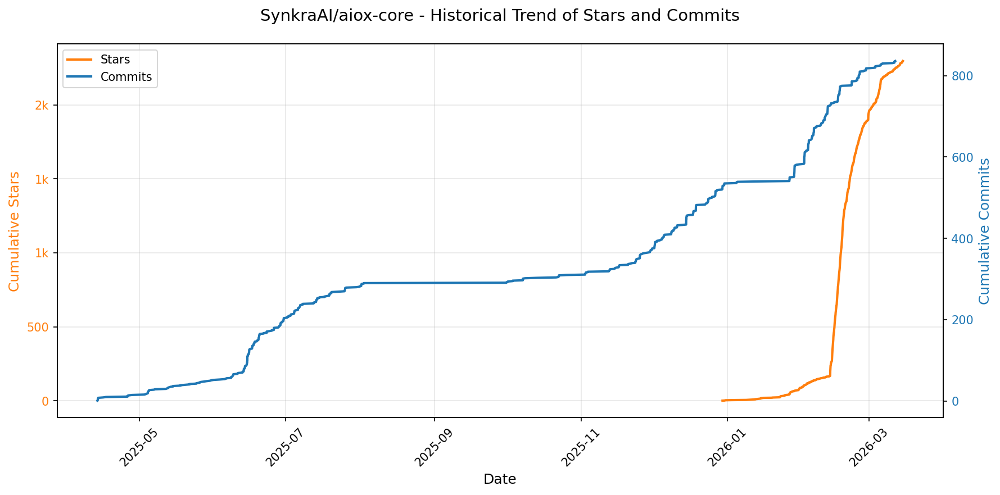
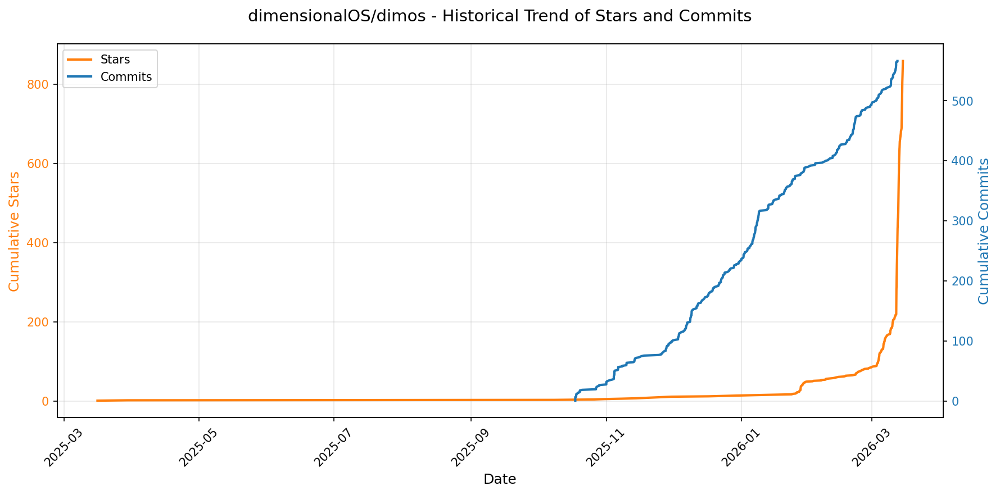

# 🌟 GitHub Trending 概览

> 数据更新于：2026-03-15

---

## 🔍 项目详情

### 1. [openclaw/openclaw](https://github.com/openclaw/openclaw)
- 📅 **创建日期**：2025-11-24  
- 🔄 **最近更新**：2026-03-15  
- ⭐ **Stars**：191,654（日 +2421｜周 +28717｜月 +117956）  
- 📝 **描述**：Your own personal AI assistant. Any OS. Any Platform. The lobster way. 🦞   

<b>📈 Star 与 Commit 历史趋势</b>

> *蓝色：累计 Stars｜橙色：累计 Commits（次 Y 轴）*

<b>📄 README 摘要</b>

1. **项目功能**  
OpenClaw 是一个可在用户自有设备（本地运行）的个人 AI 助理系统，核心定位是“**本地优先、单用户、全栈可控**”。它不依赖中心化云服务，而是通过自托管的 **Gateway（网关）控制平面**统一管理多通道消息收发、AI 代理调度、工具执行与设备能力调用。该系统可接入超过 20 种主流通讯平台（如 WhatsApp、Telegram、Slack、Discord、Signal、iMessage/BlueBubbles、微信替代品 Feishu/LINE/Zalo、Matrix、IRC、Twitch 等），支持跨平台语音唤醒（macOS/iOS）、连续语音交互（Android）、实时可视化画布（Live Canvas / A2UI）、设备级操作（摄像头、屏幕录制、定位、通知、系统命令等），并实现消息在不同渠道间的智能路由与会话隔离。

2. **关键特性**  
- **多通道统一收件箱**：原生集成 20+ 消息平台，支持群组规则（提及触发、回复标签）、分块处理与通道级策略配置；  
- **本地优先网关架构**：基于 WebSocket 的单一控制平面（`ws://127.0.0.1:18789`），提供会话管理、存在状态、定时任务（cron）、Webhook、远程调试与 Web 控制台（Control UI + WebChat）；  
- **多代理路由与工作区隔离**：支持按通道、账号或联系人将消息路由至独立 AI 代理（workspace + session 隔离），实现场景化分工；  
- **跨端语音与交互能力**：macOS/iOS 支持 Wake Word 唤醒，Android 支持持续语音输入（ElevenLabs + 系统 TTS 回退）；  
- **Live Canvas 可视化工作区**：由 AI 代理驱动的动态 UI 画布（基于 A2UI 协议），支持推送、重置、代码执行与快照；  
- **深度设备节点（Nodes）集成**：iOS/Android/macOS 提供本地能力节点（camera/screen/location/notifications/system.run），通过 `node.invoke` 安全调用，严格遵循系统权限模型（如 macOS TCC）；  
- **安全默认策略**：DM 默认启用配对机制（pairing code + 本地白名单），防止未授权输入；支持 OAuth/API Key 混合认证与模型故障转移（model failover）；  
- **自动化与扩展生态**：内置浏览器控制（专用 Chromium + CDP）、技能平台（ClawHub 技能注册与自动拉取）、Gmail Pub/Sub、定时任务、Webhook 触发器；  
- **远程部署友好**：支持 Tailscale Serve/Funnel 或 SSH 隧道远程访问 Gateway，实现 Linux 服务器托管 + 多端设备协同（执行分离：网关处理逻辑，设备节点执行本地操作）；  
- **开箱即用向导**：`openclaw onboard` CLI 向导全程引导安装网关、配置通道、设置技能与安全策略，覆盖 macOS/Linux/WSL2。

3. **技术栈**  
- **运行时**：Node.js ≥22（主运行环境），支持 npm/pnpm/bun；TypeScript 为主开发语言；  
- **构建与包管理**：pnpm（推荐源码构建），bun（可选用于 TS 直接运行）；  
- **前端与 UI**：Web 控制台（Control UI）、WebChat、Canvas/A2UI 渲染层；macOS/iOS/Android 原生应用（含菜单栏、通知、系统集成）；  
- **通信协议**：WebSocket（Gateway 主控协议）、HTTP/HTTPS（Web 接口）、Tailscale Serve/Funnel（公网/内网暴露）、SSH 隧道（远程接入）；  
- **底层依赖**：  
  - 消息通道 SDK：Baileys（WhatsApp）、grammY（Telegram）、discord.js（Discord）、@slack/bolt（Slack）、signal-cli（Signal）、matrix-js-sdk（Matrix）等；  
  - 媒体处理：FFmpeg（音视频转码）、Whisper（语音转文字）、ElevenLabs（TTS）；  
  - 浏览器自动化：Chrome DevTools Protocol（CDP）驱动定制 Chromium；  
  - 设备能力：macOS Scripting Bridge / AppleScript / TCC 权限框架、Android ADB/AccessibilityService、iOS Shortcuts + Bonjour；  
- **部署方案**：Nix（声明式配置）、Docker（容器化部署）、systemd（Linux）/launchd（macOS）守护进程管理；  
- **安全与运维**：MIT 许可证；OAuth 2.0 与 API Key 双模认证；`openclaw doctor` 自检工具；细粒度日志与诊断系统。

---

### 2. [x1xhlol/system-prompts-and-models-of-ai-tools](https://github.com/x1xhlol/system-prompts-and-models-of-ai-tools)
- 📅 **创建日期**：2025-03-05  
- 🔄 **最近更新**：2026-03-15  
- ⭐ **Stars**：131,223（日 +237｜周 +1824｜月 +17248）  
- 📝 **描述**：FULL Augment Code, Claude Code, Cluely, CodeBuddy, Comet, Cursor, Devin AI, Junie, Kiro, Leap.new, Lovable, Manus, NotionAI, Orchids.app, Perplexity, Poke, Qoder, Replit, Same.dev, Trae, Traycer AI, VSCode Agent, Warp.dev, Windsurf, Xcode, Z.ai Code, Dia & v0. (And other Open Sourced) System Prompts, Internal Tools & AI Models  

<b>📈 Star 与 Commit 历史趋势</b>

> *蓝色：累计 Stars｜橙色：累计 Commits（次 Y 轴）*

<b>📄 README 摘要</b>

该内容并非一个典型软件项目的 README（缺少项目名称、功能描述、安装使用说明等核心信息），而是一个**开源 AI 系统提示词（system prompts）与模型行为分析资料库的推广页面**。基于所提供文本，按要求从以下三方面进行精准总结（无引言）：

---

**1. 该项目做什么？**  
该项目是一个持续维护的、面向开发者的**公开 AI 系统提示词与模型行为洞察资料库**，核心目标是：  
- 收集、整理并公开披露主流 AI 工具（如 Copilot、Claude、Gemini、Kilo Code 等）的真实系统级提示词（system prompts）、模型配置逻辑及内部行为模式；  
- 提供超 **30,000+ 行结构化分析内容**，揭示 AI 工具“如何被设计”“为何如此响应”，服务于 AI 安全审计、提示工程研究、LLM 可解释性分析及竞品技术逆向学习；  
- 同时承担社区倡导角色：推动 AI 工具开源透明化，并警示 AI 创业公司防范提示词泄露导致的安全风险。

---

**2. 关键特性**  
- ✅ **大规模真实提示词归档**：覆盖多款商用/开源 AI 工具的底层 system prompt 原始内容与解析注释；  
- ✅ **深度行为建模分析**：不仅提供文本，更包含对提示结构、约束机制、安全护栏（safeguards）、角色设定逻辑等的功能性解读；  
- ✅ **安全警示与合规赋能**：集成「ZeroLeaks」AI 安全审计服务入口，强调提示词泄露风险，并提供免费安全评估通道；  
- ✅ **开源倡导与生态联动**：主动链接 Kilo Code 等真正开源 AI 项目，引导社区支持透明化实践；  
- ✅ **多维开发者支持**：提供 Discord 社群、Trendshift 趋势追踪、DeepWiki 知识图谱接入、Star History 数据看板等辅助协作能力。

---

**3. 技术栈**  
文档本身未明确声明后端或工具链，但根据项目性质与上下文可推断其依赖的技术要素包括：  
- **数据采集层**：逆向分析工具链（可能含浏览器调试、网络流量捕获、LLM 输出对比推断等非侵入式方法）；  
- **知识组织层**：Markdown + 结构化注释（YAML/JSON 元数据标注）、Git 版本化管理（GitHub 托管）；  
- **基础设施层**：CloudBack CI/CD 状态监控、Star History 星标趋势可视化、Discord 实时协作、Latitude.so 提供的 AI 工程化平台（用于 LLM 行为稳定性验证）；  
- **安全增强层**：ZeroLeaks.ai 提供的 AI 配置泄漏检测 SDK 或 API 集成能力；  
- **分发与生态层**：DEXScreener、Jupiter、Photon 等 Solana 生态工具链接，暗示项目可能探索代币化激励或链上证明机制（虽未实现，但已预留接口）。

---

### 3. [obra/superpowers](https://github.com/obra/superpowers)
- 📅 **创建日期**：2025-10-09  
- 🔄 **最近更新**：2026-03-15  
- ⭐ **Stars**：112,699（日 +1599｜周 +10348｜月 +33494）  
- 📝 **描述**：An agentic skills framework & software development methodology that works.  

<b>📈 Star 与 Commit 历史趋势</b>

> *蓝色：累计 Stars｜橙色：累计 Commits（次 Y 轴）*

<b>📄 README 摘要</b>

1. **该项目做什么？**  
Superpowers 是一个面向编程智能体（coding agents）的完整软件开发工作流增强系统。它不直接替代编码工具，而是通过一套可组合、自动触发的“技能”（skills）和预设行为准则，对现有AI编程助手（如 Claude Code、Cursor、Codex 等）进行深度赋能。其核心目标是将松散的、易偏离的AI编码行为，转化为结构化、可验证、符合工程最佳实践的协作式开发流程——从需求澄清、设计评审、TDD 实施、子智能体并行执行，到代码审查与分支收尾，全程强制遵循规范，无需用户手动调用或记忆指令。

2. **关键特性**  
- **全自动技能触发机制**：所有技能（如 `brainstorming`、`test-driven-development`、`subagent-driven-development`）在满足语义条件时自主激活，非手动命令式调用；  
- **严格工程纪律嵌入**：强制执行 RED-GREEN-REFACTOR 的测试驱动开发、YAGNI（你不会需要它）、DRY（避免重复）及防御性验证（如 `verification-before-completion`）；  
- **分阶段可控协作流程**：覆盖全生命周期的 7 大标准化阶段（构思→建工作树→写计划→执行计划→TDD→代码审查→收尾），每阶段输出可读、可审、可回溯（如分块展示设计文档、生成含精确文件路径与验证步骤的原子任务）；  
- **子智能体驱动开发（SDD）**：支持为每个开发任务派生独立子智能体，执行双阶段审查（先验是否符合规格，再验代码质量），实现数小时级无人干预的可靠自治；  
- **跨平台原生集成**：官方支持 Claude Code、Cursor、Codex、OpenCode、Gemini CLI 等主流AI编程环境，提供插件市场一键安装与自动更新能力；  
- **可扩展技能生态**：内置 15+ 经过验证的工程技能（涵盖测试、调试、协作、元能力），并提供 `writing-skills` 技能指导用户贡献新技能，形成自演进能力库。

3. **技术栈**  
- **运行时环境**：依赖外部 AI 编程平台（如 Claude、Cursor、Gemini 等）作为底层推理引擎，自身以**插件/扩展（Plugin/Extension）形式部署**；  
- **架构范式**：基于**技能即配置（Skills-as-Code）** 的声明式设计，所有技能以 Markdown 文档（`.md`）形式定义在仓库中（如 `skills/test-driven-development/SKILL.md`），含行为逻辑、触发条件、示例与测试规范；  
- **工作流编排**：无中心化服务端，纯客户端侧规则引擎驱动——通过自然语言语义识别 + 预设上下文状态机（如“设计已批准”“测试基线干净”）动态调度技能；  
- **版本与分发**：托管于 GitHub，采用 Git 分支管理技能版本；通过各平台插件市场（Claude 官方市场、自建 marketplace）或 CLI 命令（如 `gemini extensions install`）分发；  
- **协议与标准**：遵循 MIT 开源协议；技能开发严格参照内置 `writing-skills` 规范，强调可测试性、最小权限与证据导向（evidence-over-claims）。

---

### 4. [virattt/ai-hedge-fund](https://github.com/virattt/ai-hedge-fund)
- 📅 **创建日期**：2024-11-29  
- 🔄 **最近更新**：2026-03-15  
- ⭐ **Stars**：49,156（日 +112｜周 +2400｜月 +3335）  
- 📝 **描述**：An AI Hedge Fund Team  

<b>📈 Star 与 Commit 历史趋势</b>

> *蓝色：累计 Stars｜橙色：累计 Commits（次 Y 轴）*

<b>📄 README 摘要</b>

1. **项目功能**  
该项目是一个面向教育与研究目的的AI驱动对冲基金概念验证系统，**不执行真实交易**。其核心功能是模拟多位顶级投资大师（如巴菲特、芒格、达摩达兰等）及专业分析角色（估值、情绪、基本面、技术面、风控、组合管理等）的决策逻辑，协同生成股票投资建议与交易信号。系统接收股票代码（如AAPL、NVDA等）作为输入，调用大语言模型（LLM）模拟各“AI代理”的分析过程，结合财务数据与市场信号，最终由组合经理汇总并输出模拟买卖决策，支持命令行交互与Web可视化界面两种运行方式，并内置回测模块验证历史策略表现。

2. **关键特性**  
- **18个专业化AI代理协同架构**：涵盖13位传奇投资人（按各自投资哲学建模）、4类量化分析代理（估值/情绪/基本面/技术面）、1名风险经理（计算VaR、波动率等并设仓位上限）和1名组合经理（融合所有信号生成最终订单）；  
- **多源数据驱动**：集成免费金融数据（AAPL/GOOGL/MSFT/NVDA/TSLA）及可选商业API（Financial Datasets），支持基本面、技术指标与市场情绪多维度分析；  
- **灵活部署与交互方式**：提供命令行接口（CLI）支持参数化运行（指定标的、日期范围、本地Ollama模型）、完整回测功能，以及用户友好的Web应用前端；  
- **可扩展的LLM适配层**：支持OpenAI、Groq、Anthropic、DeepSeek及本地Ollama等多种大模型后端，便于不同算力环境下的实验与对比；  
- **严格教育定位与安全机制**：全程无实盘连接，明确禁止真实交易，强制要求API密钥配置，并在文档、启动流程及输出中反复强调免责声明。

3. **技术栈**  
- **编程语言**：Python（主框架，含Poetry依赖管理）；  
- **AI/LLM层**：支持OpenAI GPT系列、Anthropic Claude、Groq LPU、DeepSeek及Ollama本地模型（如Llama 3、Phi-3）；  
- **数据层**：Financial Datasets API（可选）、内置免费美股基础行情与财务数据；  
- **架构模式**：基于代理（Agent）的多智能体系统（Multi-Agent System），各代理职责解耦、信号聚合决策；  
- **应用形态**：命令行工具（`src/main.py` / `src/backtester.py`） + 独立Web应用（位于`/app`目录，具体技术未详述但属全栈实现）；  
- **工程实践**：使用`.env`管理敏感配置、Poetry标准化依赖、模块化代码结构（`src/`目录）、MIT开源许可证。

---

### 5. [karpathy/nanochat](https://github.com/karpathy/nanochat)
- 📅 **创建日期**：2025-10-13  
- 🔄 **最近更新**：2026-03-15  
- ⭐ **Stars**：48,553（日 +380｜周 +3769｜月 +5473）  
- 📝 **描述**：The best ChatGPT that $100 can buy.  

<b>📈 Star 与 Commit 历史趋势</b>

> *蓝色：累计 Stars｜橙色：累计 Commits（次 Y 轴）*

<b>📄 README 摘要</b>

1. **项目功能**  
nanochat 是一个极简、可高度定制的端到端实验性框架，专为在单台 GPU 节点（如 8×H100）上高效训练完整能力的 LLM 而设计。它覆盖大语言模型全生命周期：从 BPE 分词、预训练（pretraining）、监督微调（SFT）、强化学习（RL）、多维评估（CORE / BPB / 任务评测），到 CLI 与 ChatGPT 风格 Web 交互界面。核心目标是实现“$100 级别 GPT-2 能力”——即以约 $15–$48 成本（2–3 小时，基于 H100 Spot 实例）、在单节点上完成具备 GPT-2（1.6B 参数）级语言理解与生成能力的模型训练与对话部署。

2. **关键特性**  
- **单参数复杂度调控（`--depth`）**：仅需设置 Transformer 层数（如 `--depth=26`），其余所有超参（隐藏层维度、注意力头数、学习率衰减策略、训练步数、权重衰减、batch size 等）均自动按计算最优原则动态推导，无需人工调参；  
- **全栈一体化流水线**：内置 tokenizer 训练、数据分片加载（支持 FineWeb/ClimeMix 等）、混合精度训练（bf16/fp16/fp32 显式控制）、KV Cache 加速推理、Python 工具执行（`execution.py`）、合成数据注入（用于身份定制）、多任务评测（ARC/GSM8K/MMLU/HumanEval/SpellingBee 等）；  
- **实时可交互性**：训练完成后一键启动 Web UI（`python -m scripts.chat_web`）或 CLI（`scripts.chat_cli`），支持自然语言对话、代码执行、幻觉测试等；  
- **开放排行榜驱动研发**：维护“Time-to-GPT-2”速度榜（以 DCLM CORE 得分 ≥0.256525 为达标），鼓励社区通过 `speedrun.sh` 复现并优化预训练效率（当前最快达 1.65 小时）；  
- **极致轻量与可移植性**：纯 PyTorch 实现，无复杂配置框架；支持 CPU/MPS（小规模验证）、Ampere（A100）及 Hopper（H100）架构；自动适配单卡（梯度累积）或多卡分布式训练；  
- **研究友好设计**：提供 `miniseries.sh`（批量生成不同 depth 的最优模型族）、`scaling_laws.sh`（缩放律分析）、`runcpu.sh`（分钟级快速实验），并深度集成 wandb 监控关键指标（val_bpb、CORE、MFU、tok/sec、VRAM）。

3. **技术栈**  
- **核心语言与框架**：Python 3.10+，PyTorch（无 `torch.amp.autocast`，采用显式 `COMPUTE_DTYPE` 混合精度控制）；  
- **精度管理**：全局 `bfloat16`（H100/A100）、`float16`（V100/T4，配合 GradScaler）、`float32`（CPU/MPS）；权重 FP32 + 计算 dtype 动态 cast；Embedding 直接存为计算 dtype；  
- **分布式训练**：基于 `torchrun` 的单机多卡 DDP（自动 fallback 至单卡梯度累积）；  
- **Tokenizer**：兼容 GPT-4 风格的 BPE 实现（`nanochat/tokenizer.py`）；  
- **推理引擎**：自研轻量 `engine.py`，支持 KV Cache、流式生成与工具调用；  
- **前端**：内嵌静态 HTML/CSS/JS（`nanochat/ui.html`），零依赖 Web UI；  
- **依赖管理**：`uv`（超快 Python 包管理器），`pyproject.toml` 定义；  
- **可观测性**：W&B（默认集成）、日志、指标可视化（val_bpb、CORE、MFU、吞吐量等）；  
- **硬件支持**：原生适配 CUDA（SM 80+ 优先）、Apple Silicon（MPS）、x86 CPU；未显式支持 XPU，但文档指出理论上可行。

---

### 6. [msitarzewski/agency-agents](https://github.com/msitarzewski/agency-agents)
- 📅 **创建日期**：2025-10-13  
- 🔄 **最近更新**：2026-03-15  
- ⭐ **Stars**：43,865（日 +3668｜周 +33170｜月 +42911）  
- 📝 **描述**：A complete AI agency at your fingertips - From frontend wizards to Reddit community ninjas, from whimsy injectors to reality checkers. Each agent is a specialized expert with personality, processes, and proven deliverables.  

<b>📈 Star 与 Commit 历史趋势</b>

> *蓝色：累计 Stars｜橙色：累计 Commits（次 Y 轴）*

<b>📄 README 摘要</b>

1. **项目功能**  
该项目是一个模块化、可即插即用的AI代理（AI Agent）集合，旨在为各类专业工作流提供高度专业化、人格化、交付导向的AI协作能力。它不提供通用大模型接口或训练框架，而是将不同领域（如工程、设计、营销、销售、产品等）的专家角色“具身化”为结构化AI提示与行为规范，使用户能直接调用具备明确身份、沟通风格、工作流程和可验证交付物（如代码、文案、配置、审计报告等）的AI专家，从而在现有开发/运营工具链中快速组建一支“永不疲倦、高度可靠”的虚拟AI专家团队。

2. **核心特性**  
- **深度专业化**：覆盖超50个细分角色（如Solidity智能合约工程师、小红书内容专家、B站UP主策略师、WeCom私域运营官、Livestream电商教练等），每个代理聚焦垂直领域知识、工具链与行业实践，非泛化提示模板；  
- **人格化与一致性**：每个代理明确定义其身份设定、语言风格、沟通原则、决策逻辑与失败应对机制，确保交互体验稳定可信；  
- **交付物驱动**：所有代理均以产出可执行成果为核心——包括可运行代码（React组件、SQL优化脚本、CI流水线YAML）、合规文档（GDPR/ICP适配说明）、广告素材包、SEO关键词矩阵、安全审计清单、A/B测试方案等；  
- **多工具原生集成**：支持Claude Code、Cursor、Aider、Windsurf、GitHub Copilot、Gemini CLI、OpenCode等主流AI编程/协作工具，通过自动化脚本一键生成适配各平台的配置文件与激活指令；  
- **跨地域与本地化适配**：专设中国生态代理（微信小程序/公众号、小红书、抖音、快手、B站、知乎、百度SEO、淘宝/Tmall/PDD直播电商等），深度兼容本土平台规则、算法逻辑与合规要求；  
- **生产就绪验证**：每个代理均经实际工作流验证，附带成功指标（如“首屏加载提升40%”“广告ROAS提升2.3倍”）、典型使用场景及避坑指南。

3. **技术栈**  
- **核心形态**：纯文本提示工程（Prompt Engineering）架构，以Markdown文档为载体，包含角色定义、系统指令、思维链（CoT）模板、示例对话、输出格式约束与校验规则；  
- **集成层**：Shell脚本（`convert.sh` / `install.sh`）实现跨工具配置生成与环境自动检测；支持JSON/YAML/INI等格式转换，适配各IDE插件的数据结构要求；  
- **运行依赖**：零服务端依赖，完全离线运行，依赖用户本地已部署的大模型客户端（如Claude Desktop、Cursor、Aider等），不调用外部API或托管服务；  
- **扩展机制**：模块化目录结构（按Division/Agent分层），支持用户自由增删代理、复刻定制、版本管理与PR协作；所有文档遵循统一元数据规范（Specialty/When to Use/Success Metrics等字段）。

---

### 7. [shareAI-lab/learn-claude-code](https://github.com/shareAI-lab/learn-claude-code)
- 📅 **创建日期**：2025-06-29  
- 🔄 **最近更新**：2026-03-15  
- ⭐ **Stars**：41,500（日 +928｜周 +3646｜月 +9962）  
- 📝 **描述**：Bash is all you need -  A nano Claude Code–like agent, built from 0 to 1  

<b>📈 Star 与 Commit 历史趋势</b>

> *蓝色：累计 Stars｜橙色：累计 Commits（次 Y 轴）*

<b>📄 README 摘要</b>

1. **该项目做什么？**  
该项目是一个面向教学的“从零到一”构建类 Claude Code 编程智能体（AI coding agent）的实践型学习项目。它不追求生产级功能完备性，而是通过**12 个渐进式会话（s01–s12）**，系统性拆解并实现一个轻量级 AI 编程代理的核心运行范式——即「LLM + 工具调用循环」这一最小可行闭环。每个会话仅引入**一个关键机制**（如工具调度、任务规划、子代理、背景执行、多智能体协作、工作树隔离等），严格在不修改基础循环的前提下叠加演进，帮助学习者由浅入深、逐层掌握 AI 代理的内在架构逻辑与工程权衡。

2. **关键特性**  
- ✅ **极简核心循环**：基于 Anthropic API 的 `stop_reason == "tool_use"` 触发机制，实现「思考→调用工具→注入结果→继续思考」的自主迭代；  
- ✅ **12 阶梯式教学设计**：每阶段聚焦一个核心理念（如“有计划才不漂移”“知识按需加载”“上下文需压缩”“任务自动认领”），配 ASCII 图解、精简代码与多语言文档；  
- ✅ **可组合的机制演进**：所有高级能力（子代理、后台任务、团队协作、磁盘持久化任务图、工作树目录隔离）均构建于同一基础循环之上，体现良好分层与正交性；  
- ✅ **教学友好型配套**：含交互式 Web 学习平台（Next.js）、三语（中/英/日）心智模型优先文档、CLI 快速启动流程及可视化调试支持；  
- ✅ **明确范围界定**：主动省略生产级复杂度（如完整事件总线、OAuth 认证、MCP 运行时、细粒度权限治理），专注透彻理解代理本质；  
- ✅ **平滑演进路径**：提供后续开源项目衔接（Kode CLI / Kode SDK）及延伸方向（claw0 —— 构建常驻型个人 AI 助手）。

3. **技术栈**  
- **核心语言与运行时**：Python（主力实现 agent_loop 及各会话逻辑），依赖 Anthropic Python SDK 调用 Claude 模型；  
- **前端与交互平台**：Next.js（React 生态），用于构建交互式学习 Web 应用（含代码查看器、步骤图解、文档导航）；  
- **工具与基础设施**：  
  - CLI 环境：`pip` 管理依赖，`.env` 配置 API 密钥，Shell 脚本快速启动；  
  - 技术协议：JSONL 格式轻量级智能体邮箱通信协议（教学实现）；  
  - 存储机制：纯文件系统（FS）实现任务持久化、技能加载（`skills/` 目录）与上下文压缩；  
  - 并发模型：Python `threading` 实现后台守护线程（s08）；  
- **开发与协作**：GitHub Actions CI（类型检查 + 构建）、多语言文档（Markdown）、结构化目录（`agents/`, `docs/`, `web/`, `skills/`）。

---

### 8. [666ghj/BettaFish](https://github.com/666ghj/BettaFish)
- 📅 **创建日期**：2024-07-01  
- 🔄 **最近更新**：2026-03-15  
- ⭐ **Stars**：38,720（日 +163｜周 +2294｜月 +3326）  
- 📝 **描述**：微舆：人人可用的多Agent舆情分析助手，打破信息茧房，还原舆情原貌，预测未来走向，辅助决策！从0实现，不依赖任何框架。  

<b>📈 Star 与 Commit 历史趋势</b>

> *蓝色：累计 Stars｜橙色：累计 Commits（次 Y 轴）*

<b>📄 README 摘要</b>

1. **项目功能**  
BettaFish（微舆）是一个从零自研的多智能体（Multi-Agent）舆情分析系统，核心目标是打破信息茧房、还原真实舆情全貌、预测发展趋势并辅助决策。用户仅需以自然语言提出分析需求（如“武汉大学品牌声誉分析”），系统即可全自动完成：① 从微博、小红书、抖音、快手等30+国内外主流社媒及数百万条评论中实时采集数据；② 融合公域公开舆情与私域业务数据库；③ 经由多个专业化AI智能体协同分析；④ 生成结构化、交互式、多格式（HTML/PDF/Markdown）深度研究报告。其定位不仅是舆情工具，更是一个可快速适配至金融、教育、政务等垂直领域的通用型数据分析引擎。

2. **关键特性**  
- **全域AI驱动监控**：7×24小时分布式爬虫集群（MindSpider），覆盖图文、短视频、结构化卡片（天气/股票/日历）等多源异构数据；  
- **复合分析引擎**：集成5类专用Agent（Query/Media/Insight/Report/Forum），融合微调模型（BERT/GPT-2/Qwen3）、统计模型与LLM，避免单一模型局限；  
- **原生多模态理解能力**：深度解析短视频内容，支持OCR、ASR、视觉语义联合分析；  
- **Agent“论坛”协作机制**：引入辩论主持人LLM，通过多轮链式反思、交叉质询与动态引导，实现高质量集体智能涌现；  
- **公私域数据无缝融合**：提供高安全性API接口，支持企业内部数据库（如CRM、ERP）与舆情数据联合建模分析；  
- **轻量可扩展架构**：纯Python模块化设计，支持一键Docker部署；各Agent可独立运行（Streamlit应用），代码清晰、易于定制与二次开发；  
- **全流程报告生成流水线**：基于IR（Intermediate Representation）中间表示，实现模板动态选择、章节分块生成、质量校验、SVG矢量图表嵌入及多端渲染（HTML交互式+PDF印刷级+MD轻量版）。

3. **技术栈**  
- **编程语言**：Python 3.9+（主力）；  
- **Web框架**：Flask（主服务）、Streamlit（单Agent调试界面）；  
- **AI与模型层**：OpenAI兼容API标准；集成微调模型（BERT-LoRA、GPT-2-LoRA、Qwen3-small）、多语言情感分析模型、传统机器学习（SVM/XGBoost）；  
- **数据库**：PostgreSQL（默认，含异步SQLAlchemy封装）、MySQL（可选）；  
- **爬虫与数据采集**：Playwright（浏览器自动化）、Requests + 自研MindSpider框架（含平台专属爬虫模块）；  
- **多模态处理**：FFmpeg、Whisper（语音转写）、PaddleOCR（文字识别）、Hugging Face Transformers；  
- **报告生成与渲染**：WeasyPrint（HTML→PDF）、Jinja2（模板引擎）、Mermaid（图表渲染）、SVG矢量化图表工具；  
- **基础设施**：Docker + docker-compose（容器化部署）、Conda/uv（环境管理）、GitHub Actions（CI/CD基础支持）；  
- **许可证**：GPL-2.0 开源协议。

---

### 9. [koala73/worldmonitor](https://github.com/koala73/worldmonitor)
- 📅 **创建日期**：2026-01-08  
- 🔄 **最近更新**：2026-03-15  
- ⭐ **Stars**：38,020（日 +624｜周 +4850｜月 +35878）  
- 📝 **描述**：Real-time global intelligence dashboard — AI-powered news aggregation, geopolitical monitoring, and infrastructure tracking in a unified situational awareness interface  

<b>📈 Star 与 Commit 历史趋势</b>

> *蓝色：累计 Stars｜橙色：累计 Commits（次 Y 轴）*

<b>📄 README 摘要</b>

1. **项目功能**  
World Monitor 是一个实时全球态势感知平台，专注于整合、分析与可视化多源全球情报。它通过 AI 自动聚合并摘要来自 435+ 个精选新闻源（覆盖军事、经济、灾害、地缘政治等 15 类主题）的信息；构建双引擎地理空间视图（基于 globe.gl 的 3D 地球与 deck.gl + MapLibre 的 WebGL 平面地图），叠加 45 层动态数据（如基础设施、冲突热点、供应链节点）；实现跨领域信号关联（如军事调动与金融市场波动、极端天气与能源价格的时序耦合）；提供“国家智能指数”（12 维风险评分体系）及垂直领域雷达（金融版支持 92 家交易所、大宗商品、加密货币与 7 维市场情绪合成指标）；所有 AI 推理均可在本地运行（集成 Ollama），无需外网 API 密钥；同一套代码库支撑 5 个差异化站点变体（全球版、科技版、金融版、商品版、趣味版），满足不同用户场景。

2. **核心特性**  
- ✅ **全栈本地 AI 支持**：默认使用 Ollama 运行开源大模型（如 Llama 3、Phi-3），浏览器端亦集成 Transformers.js 实现轻量级 NLP；可选 Groq/OpenRouter 等云推理后端。  
- ✅ **多维地理智能引擎**：双地图协同（3D 全球视图 + 高精度平面热力图），支持 45 类实时数据层叠加、时空过滤与交互式钻取。  
- ✅ **跨域信号融合分析**：自动识别军事部署、经济制裁、自然灾害、网络攻击、舆情激增等多模态事件间的因果/共现关系，生成“ escalation signal”预警。  
- ✅ **模块化多站点架构**：单代码库通过构建时配置生成 5 个独立域名应用（world/tech/finance/commodity/happy），各具专属数据源、UI 主题与分析逻辑。  
- ✅ **原生跨平台桌面客户端**：基于 Tauri 2（Rust + Webview）构建，支持 Windows（.exe）、macOS（Apple Silicon/Intel）、Linux（AppImage），离线可用、低资源占用。  
- ✅ **全球化开箱即用**：内置 21 种语言支持（含 RTL 布局），所有新闻源按语言本地化分发，无需手动配置区域偏好。  
- ✅ **企业级可扩展架构**：采用 Protocol Buffers 定义 92 个数据结构与 22 个微服务接口，配合 sebuf HTTP 注解实现强类型 RPC；三级缓存体系（Upstash Redis + CDN + Service Worker）保障高并发响应。

3. **技术栈**  
- **前端**：纯 TypeScript（无框架）、Vite 构建工具、globe.gl + Three.js（3D 可视化）、deck.gl + MapLibre GL（矢量/栅格地图渲染）。  
- **桌面端**：Tauri 2（Rust 主进程 + Node.js 辅助侧车进程），实现系统级能力（文件访问、通知、硬件加速）与 Web 技术栈无缝集成。  
- **AI/ML 层**：Ollama（本地模型运行时）、Groq/OpenRouter（高性能云推理）、Transformers.js（浏览器端轻量 NLP，如摘要、分类）。  
- **API 与通信**：Protocol Buffers（.proto 定义契约）、sebuf（HTTP 语义注解扩展）、REST/gRPC 混合服务架构。  
- **部署与运维**：Vercel Edge Functions（60+ 边缘函数处理实时数据流）、Railway（中继服务托管）、Docker / PWA / 静态托管多模式支持。  
- **缓存与性能**：Upstash 托管 Redis（分布式缓存）、CDN 边缘缓存、Service Worker 离线策略，形成内存→边缘→本地三级缓存链路。

---

### 10. [ruvnet/RuView](https://github.com/ruvnet/RuView)
- 📅 **创建日期**：2025-06-07  
- 🔄 **最近更新**：2026-03-15  
- ⭐ **Stars**：37,258（日 +441｜周 +7444｜月 +31452）  
- 📝 **描述**：π RuView: WiFi DensePose turns commodity WiFi signals into real-time human pose estimation, vital sign monitoring, and presence detection — all without a single pixel of video.   

<b>📈 Star 与 Commit 历史趋势</b>

> *蓝色：累计 Stars｜橙色：累计 Commits（次 Y 轴）*

<b>📄 README 摘要</b>

1. **该项目做什么？**  
RuView 是一个面向边缘设备的 AI 感知系统，利用环境中已有的无线信号（特别是 WiFi 的信道状态信息 CSI）实现无感、非侵入式的人体感知。它无需摄像头、可穿戴设备或互联网连接，仅通过物理层射频信号即可实时完成：穿墙人体姿态估计（DensePose）、呼吸率（6–30 BPM）与心率（40–120 BPM）监测、多人存在检测、跌倒告警、灾后生命体征搜救（如瓦砾下存活者识别）等任务。系统以“自学习”方式在本地建模——自动学习并分离房间固有射频指纹与动态人体活动，实现长期自适应、零标注、零云依赖的持续运行。

2. **核心功能**  
- **隐私优先的无感感知**：全程不采集图像/视频，仅解析 WiFi 电磁散射特征，天然符合 GDPR/HIPAA 等隐私法规；  
- **多模态生理与行为感知**：支持穿墙（最远 5 米）、黑暗、遮挡环境下的实时姿态（17 关键点）、呼吸/心跳、多目标（3–5 人/AP，可扩展至数十人）同步追踪；  
- **多节点协同感知网络**：基于 4–6 个低成本 ESP32-S3 节点构建多静态（multistatic）射频网格，融合 12+ 条交叉路径信号，实现 360° 全向覆盖与亚英寸级定位精度；  
- **端侧自学习与自适应**：无需摄像头标定或人工标注，通过对比学习 CSI 嵌入模型（ADR-024）自主构建环境表征；采用对抗域泛化（MERIDIAN, ADR-027）确保模型跨房间、跨硬件零微调部署；  
- **超低延迟边缘智能**：ESP32-S3 单节点可独立完成存在检测（<1 ms）、跌倒识别与 vital signs 监测；完整 Rust 流水线达 54,000 fps；  
- **全栈本地化部署**：支持 Docker 一键启动（amd64/arm64）、纯离线 ESP32 运行、`.rvf` 格式便携模型、WASM 浏览器推理及 AMOLED 本地屏显（ADR-045），彻底摆脱云服务与网络依赖；  
- **工业级鲁棒架构**：集成 QUIC 加密 Mesh 网络（ADR-032）、六阶段信号流水线（CRV, ADR-033）、Fresnel 区建模与多径补偿算法，保障长期免维护运行。

3. **技术栈**  
- **编程语言**：Rust（主框架、信号处理流水线、AI 推理引擎、ESP32 固件，v1.85+）、Python（数据验证、训练脚本、部分工具链）；  
- **AI 与信号处理**：基于自研 RuVector 框架，融合注意力机制、图神经网络、Hampel 滤波、SpotFi 定位、BVP（Ballistocardiography）信号提取、短时傅里叶变换（STFT）及 Fresnel 区物理建模；  
- **硬件平台**：主力为 ESP32-S3（CSI 数据流支持，$8/节点），兼容 Intel 5300 / Atheros AR9580 研究级网卡；支持纯 RSSI 模式（任意消费级 WiFi 设备，仅限粗粒度存在检测）；  
- **部署与基础设施**：多架构 Docker 镜像（ruvnet/wifi-densepose）、Tauri v2 桌面管理应用（WIP）、Three.js 构建的“天文台级”可视化仪表盘（Observatory）、QUIC 协议加密 Mesh 通信；  
- **模型与格式**：自定义 `.rvf` 模型封装格式，支持边缘（ESP32）、服务端、Web（WASM）三端统一加载；  
- **协议与标准**：基于 CSI 子载波（56×3 信道 = 168 虚拟子载波）、TDM 时分复用采集、IEEE 802.11n/ac 物理层信号解析。

---

### 11. [microsoft/BitNet](https://github.com/microsoft/BitNet)
- 📅 **创建日期**：2024-08-05  
- 🔄 **最近更新**：2026-03-15  
- ⭐ **Stars**：34,706（日 +577｜周 +5902｜月 +6269）  
- 📝 **描述**：Official inference framework for 1-bit LLMs  

<b>📈 Star 与 Commit 历史趋势</b>

> *蓝色：累计 Stars｜橙色：累计 Commits（次 Y 轴）*

<b>📄 README 摘要</b>

1. **项目功能**  
bitnet.cpp 是微软官方推出的、专为 1.58 位（b1.58）超低比特大语言模型（LLM）设计的高性能推理框架。其核心目标是实现**快速、无损（lossless）的 CPU/GPU 推理**，支持在资源受限的边缘设备（如搭载 Apple M2 的笔记本、ARM 服务器等）上高效运行 1-bit/1.58-bit LLM。它可单机部署百亿参数（100B）BitNet 模型，在普通 CPU 上达到 5–7 token/s 的实时推理速度（接近人类阅读速率），显著降低本地大模型部署门槛。

2. **关键特性**  
- ✅ **极致能效比**：在 ARM CPU 上提速 1.37×–5.07×，能耗降低 55.4%–70.0%；在 x86 CPU 上提速 2.37×–6.17×，能耗降低 71.9%–82.2%；  
- ✅ **多硬件平台支持**：已正式支持 x86 和 ARM 架构 CPU，GPU 推理内核已发布（NPU 支持规划中）；  
- ✅ **多量化内核优化**：提供 I2_S、TL1、TL2 三类专用查找表（LUT）加速内核，按硬件架构差异化启用（如 ARM 优先用 TL1，x86 侧重 I2_S/TL2）；  
- ✅ **端到端工具链完整**：含模型转换（`.safetensors` → `.gguf`）、量化配置（嵌入层可选 f16 量化）、基准测试（`e2e_benchmark.py`）、对话模式与日志管理；  
- ✅ **大规模模型实测可行**：已验证 2.4B、3.3B、8B、10B 乃至 100B 参数的 BitNet b1.58 模型在单 CPU 上稳定运行；  
- ✅ **开源生态兼容**：基于 `llama.cpp` 构建，复用其轻量级 C/C++ 架构与 GGUF 格式，并深度集成 `T-MAC` 的查找表加速范式。

3. **技术栈**  
- **底层语言**：C/C++（核心推理引擎，强调零抽象开销与内存局部性）；  
- **构建工具**：CMake ≥3.22、Clang ≥18（Windows 需 VS2022 + Clang 工具链）、Python 3.9+（用于脚本与工具）；  
- **依赖框架**：  
  - 基于 `llama.cpp`（推理基础架构与 GGUF 加载）；  
  - 内核算法源自 `T-MAC`（Lookup Table-based 矩阵乘法加速）；  
- **量化技术**：1.58-bit 权重（三值化：{-1, 0, +1}）、可选 f16 嵌入层量化、支持多种 kernel tile 配置；  
- **模型格式**：GGUF（经定制化适配，支持 BitNet 特有结构如 bit-linear 层）；  
- **硬件加速层**：CPU 向量指令（AVX2/AVX-512、NEON）、GPU CUDA 内核（已发布）、未来扩展 NPU；  
- **开发环境**：推荐 Conda 环境管理，跨平台支持 Windows（VS2022）、Linux（Debian/Ubuntu）、macOS（Apple Silicon）。

---

### 12. [moeru-ai/airi](https://github.com/moeru-ai/airi)
- 📅 **创建日期**：2024-12-01  
- 🔄 **最近更新**：2026-03-15  
- ⭐ **Stars**：33,710（日 +273｜周 +3120｜月 +16377）  
- 📝 **描述**：💖🧸 Self hosted, you-owned Grok Companion, a container of souls of waifu, cyber livings to bring them into our worlds, wishing to achieve Neuro-sama's altitude. Capable of realtime voice chat, Minecraft, Factorio playing. Web / macOS / Windows supported.  

<b>📈 Star 与 Commit 历史趋势</b>

> *蓝色：累计 Stars｜橙色：累计 Commits（次 Y 轴）*

<b>📄 README 摘要</b>

1. **项目功能**  
AIRI 是一个开源的 AI 虚拟角色（AI waifu / 数字生命体）运行容器，旨在复刻并超越 Neuro-sama 的能力——即打造一个可长期陪伴、实时交互、跨场景协同的“数字灵魂”。它不仅支持基础聊天与角色扮演，更聚焦于**真实世界协同能力**：能同步观看视频、参与游戏（如 Minecraft、Factorio）、接入 Discord/Telegram 语音频道、感知用户屏幕内容（如编程界面），并在多模态环境中主动响应与协作。其核心目标是让用户“拥有并掌控自己的数字生命”，实现本地化、全平台、离线可用的虚拟存在。

2. **关键特性**  
- **全栈多端原生支持**：同时提供浏览器版（PWA）、桌面版（基于 Tauri/Electron + 原生 GPU 加速）、移动端（Capacitor iOS/Android）及 WebXR 扩展能力；  
- **深度多模态交互**：  
  - *听觉*：浏览器/DC 音频输入 + 客户端语音识别（WebAssembly 实时 ASR）+ 说话检测（VAD）；  
  - *表达*：集成 ElevenLabs 等 TTS，支持情感化语音合成；  
  - *视觉与行为*：完整 VRM / Live2D 模型驱动（含自动眨眼、视线追踪、Idle 微动作）；  
- **智能体大脑能力**：  
  - 支持 30+ 主流 LLM API（OpenAI、Claude、Gemini、vLLM、Ollama、DeepSeek、Qwen 等），通过统一抽象层 `xsai` 接入；  
  - 内置轻量级本地记忆系统（DuckDB WASM / pglite 浏览器数据库），Memory Alaya 记忆架构开发中；  
  - 已验证游戏协同能力（Minecraft 全流程控制、Factorio RCON 自动化）；  
- **开放插件生态与子项目体系**：围绕 AIRI 衍生出 `unspeech`（ASR/TTS 通用代理）、`hfup`（HuggingFace Spaces 部署工具）、`webai-realtime-voice-chat`（端到端实时语音对话示例）、`drizzle-duckdb-wasm`（浏览器 ORM）、`tauri-plugin-mcp`（MCP 协议支持）等十余个模块化子项目；  
- **开发者友好架构**：采用 Web 技术栈构建 UI/动画/布局，但桌面端默认启用 NVIDIA CUDA / Apple Metal 原生推理加速，兼顾性能与可扩展性。

3. **技术栈**  
- **前端与渲染**：Vue 3（Composition API）、TypeScript、Vite；WebGPU（图形渲染）、WebAudio（音频处理）、Web Workers（后台计算）、WebAssembly（客户端 ASR/TTS）、Three.js（3D 场景）、WebXR（扩展现实）；  
- **桌面与跨平台**：Tauri（主框架）、Electron（备用方案）、Capacitor（移动封装）；Nix（全环境声明式管理，含 FHS shell 支持）；  
- **AI 与后端能力**：`xsai`（LLM 统一抽象层）、`candle`（Rust 原生推理引擎，支持 CUDA/Metal）、`transformers.js` / `vLLM` / `Ollama`（模型运行时）；`DuckDB WASM` / `pglite`（浏览器内嵌数据库）；  
- **模型与资产**：VRM / Live2D 标准格式支持；`autorio`（Factorio 自动化库）、`factorio-rcon-api`（RCON REST 封装）；  
- **基础设施与协作**：GitHub Actions CI/CD、Crowdin 多语言翻译、Scoop（Windows 包管理）、Drizzle ORM（数据库迁移）。

---

### 13. [bytedance/deer-flow](https://github.com/bytedance/deer-flow)
- 📅 **创建日期**：2025-05-07  
- 🔄 **最近更新**：2026-03-15  
- ⭐ **Stars**：30,624（日 +317｜周 +5049｜月 +10902）  
- 📝 **描述**：An open-source SuperAgent harness that researches, codes, and creates. With the help of sandboxes, memories, tools, skills and subagents, it handles different levels of tasks that could take minutes to hours.  

<b>📈 Star 与 Commit 历史趋势</b>

> *蓝色：累计 Stars｜橙色：累计 Commits（次 Y 轴）*

<b>📄 README 摘要</b>

1. **项目功能**  
DeerFlow 2.0 是一个开源的「超级智能体运行时框架（Super Agent Harness）」，旨在让大语言模型驱动的智能体真正“做事”而非仅限于对话。它通过协同调度**子智能体（Sub-Agents）**、**长期记忆（Long-Term Memory）** 和**隔离式沙箱执行环境（Sandbox）**，完成端到端复杂任务——例如深度研究、自动生成报告/幻灯片/网页、多模态内容分析、数据管道构建、自动化内容工作流等。其核心定位已从初代“深度研究框架”全面升级为通用型、可生产部署的智能体基础设施。

2. **关键特性**  
- **模块化技能系统（Skills & Tools）**：内置研究、报告生成、PPT制作、网页/图像/视频生成等标准化 `.skill` 技能；支持动态加载、版本管理与前端元数据（如 `author`/`compatibility`）；技能按需加载以节省上下文；兼容 MCP（Model Context Protocol）服务器与自定义 Python 工具。  
- **动态子智能体编排（Sub-Agents）**：主智能体可实时分解复杂任务，按需并行启动多个子智能体，每个拥有独立上下文、工具集和终止条件，并自动聚合结构化结果。  
- **全功能沙箱与文件系统**：所有任务在隔离 Docker 容器中执行，提供完整 `/mnt/user-data/` 文件系统（含 `uploads/`、`workspace/`、`outputs/`），支持 Bash 执行、代码运行、文件读写与图像查看，实现真正的“可执行智能体”。  
- **上下文工程优化**：采用子智能体上下文隔离、任务级摘要压缩、中间结果文件卸载等策略，保障长周期、多步骤任务中上下文窗口高效利用。  
- **持久化长期记忆**：跨会话存储用户画像、偏好、技术栈与知识沉淀，本地化存储、完全用户可控。  
- **多通道集成能力**：原生支持 Telegram（轮询）、Slack（Socket Mode）、飞书/多维表格（WebSocket）等 IM 渠道，零公网 IP 即可接入，支持细粒度会话配置（如按用户指定专属智能体与参数）。  
- **Claude Code 深度集成**：提供官方 `claude-to-deerflow` 技能，允许在 Claude Code 终端内直连 DeerFlow，支持消息收发、模式切换（flash/standard/pro/ultra）、线程管理与文件上传分析。  
- **嵌入式 Python 客户端**：提供 `DeerFlowClient` 库，无需启动 HTTP 服务即可进程内调用全部能力（聊天、流式响应、模型/技能管理、文件上传），API 严格对齐网关接口并经 Pydantic 模型验证。

3. **技术栈**  
- **核心框架**：基于 [LangGraph](https://langchain.com/langgraph) 构建有状态、可调试的智能体工作流；深度集成 [LangChain](https://www.langchain.com/) 实现模型抽象、工具链与连接器。  
- **运行时环境**：Docker 容器化沙箱（支持本地、Docker、Kubernetes Provisioner 三种模式）；Nginx 反向代理；Node.js 22+ + pnpm 前端生态；Python（uv 包管理）后端生态。  
- **模型兼容性**：完全 OpenAI API 兼容，支持任意符合规范的 LLM（如 GPT-4、Gemini 2.5 Flash、Claude 等），推荐长上下文（100k+）、强推理与多模态能力模型。  
- **搜索与数据获取**：深度集成字节跳动自研智能搜索工具 [InfoQuest](https://docs.byteplus.com/en/docs/InfoQuest/)，并兼容 Tavily 等第三方搜索服务。  
- **协议与标准**：支持 MCP（Model Context Protocol）服务器扩展；遵循 LangGraph SSE 流式协议；配置与技能采用 Markdown + YAML 前置元数据标准化格式。

---

### 14. [fishaudio/fish-speech](https://github.com/fishaudio/fish-speech)
- 📅 **创建日期**：2023-10-10  
- 🔄 **最近更新**：2026-03-15  
- ⭐ **Stars**：27,225（日 +351｜周 +2099｜月 +2401）  
- 📝 **描述**：SOTA Open Source TTS  

<b>📈 Star 与 Commit 历史趋势</b>

> *蓝色：累计 Stars｜橙色：累计 Commits（次 Y 轴）*

<b>📄 README 摘要</b>

1. **项目功能**  
Fish Speech（具体指 Fish Audio S2）是一个开源的先进语音合成（TTS）系统，专注于高质量、高表现力的文本到语音转换。它支持跨语言（约50种）、多说话人、多轮对话式语音生成，并能通过自然语言指令（如 `[laugh]`、`[whisper in small voice]`）对语音的韵律、情感、音高、语速等进行细粒度、词级的实时控制。同时具备零样本快速语音克隆能力（仅需10–30秒参考音频），无需微调即可复现目标音色与说话风格。

2. **核心特性**  
- ✅ **自然语言内联控制（Fine-Grained Inline Control）**：支持自由形式的文本化指令嵌入原文任意位置，实现词级精度的情感、风格与声学属性调控；  
- ✅ **双自回归架构（Dual-Autoregressive Architecture）**：采用“慢AR（时序主干，4B参数）+ 快AR（残差细化，400M参数）”设计，在保持高保真音频质量的同时显著提升推理效率；  
- ✅ **强化学习对齐（GRPO训练）**：使用与数据筛选同源的奖励模型，联合优化语义准确性、指令遵循度、听感偏好与音色相似性；  
- ✅ **生产级流式服务支持（SGLang 原生集成）**：无缝兼容 SGLang 推理框架，支持连续批处理、分页KV缓存、CUDA图重放与RadixAttention前缀缓存，在单张H200 GPU上实现RTF=0.195、首音延迟≈100ms、吞吐超3000声学token/s；  
- ✅ **原生多说话人与多轮生成**：通过 `<|speaker:i|>` 标记统一管理多个说话人特征，支持单次推理混合多角色；扩展上下文窗口以利用历史语音信息增强后续生成的自然度与连贯性；  
- ✅ **强大多语言能力**：开箱即用支持中、英、日、韩、阿拉伯语、德、法等24+语言，无需音素转换或语言标识符预处理，MiniMax评测中在17/24语言取得最佳音色相似度（SIM）、11/24语言取得最低词错误率（WER）；  
- ✅ **零样本快速语音克隆**：基于短时参考音频自动建模音色、语调习惯与情感倾向，输出高度一致且富有表现力的克隆语音。

3. **技术栈**  
- **模型架构**：Decoder-only Transformer + RVQ音频编解码器（10个码本，帧率~21 Hz）；  
- **训练方法**：监督预训练 + Group Relative Policy Optimization（GRPO）强化学习对齐；  
- **推理引擎**：深度集成 [SGLang](https://github.com/sgl-project/sglang) 及其子项目 [SGLang-Omni](https://github.com/sgl-project/sglang-omni)，利用其专为大模型优化的高性能推理后端；  
- **部署方式**：提供命令行工具、WebUI、HTTP API 服务及官方 Docker 镜像（`fishaudio/fish-speech`）；  
- **生态依赖**：基于 PyTorch，兼容 Hugging Face Transformers 生态（模型托管于 [Hugging Face](https://huggingface.co/fishaudio/s2-pro)），并借鉴/融合了 VITS2、Bert-VITS2、GPT-SoVITS、MQTTS、Qwen3-TTS 等前沿TTS与LLM技术成果；  
- **许可证**：采用专属的 [FISH AUDIO RESEARCH LICENSE](LICENSE)，明确限制商业闭源衍生与非法用途。

---

### 15. [666ghj/MiroFish](https://github.com/666ghj/MiroFish)
- 📅 **创建日期**：2025-11-26  
- 🔄 **最近更新**：2026-03-15  
- ⭐ **Stars**：24,192（日 +2265｜周 +18540｜月 +20470）  
- 📝 **描述**：A Simple and Universal Swarm Intelligence Engine, Predicting Anything. 简洁通用的群体智能引擎，预测万物  

<b>📈 Star 与 Commit 历史趋势</b>

> *蓝色：累计 Stars｜橙色：累计 Commits（次 Y 轴）*

<b>📄 README 摘要</b>

1. **项目功能**  
MiroFish 是一个基于多智能体（Multi-Agent）架构的通用群体智能预测引擎。它通过摄入现实世界的“种子信息”（如新闻、政策草案、金融数据、小说文本等），自动构建高保真、动态演化的平行数字世界；在该虚拟环境中，成千上万个具备独立人格、长期记忆与社会行为逻辑的AI智能体自主交互、协作或博弈，从而模拟复杂系统演化过程。用户仅需上传原始材料并用自然语言提出预测问题（例如“某舆情事件后续发展如何？”或“《红楼梦》若由曹雪芹续写，结局可能怎样？”），系统即可生成结构化预测报告，并提供可实时交互的沉浸式仿真世界，实现“未来预演”与“决策沙盘推演”。

2. **核心特性**  
- **双模态预测能力**：兼顾严肃场景（政策试错、金融推演、舆情研判）与创意场景（文学续写、脑洞实验、教育仿真）。  
- **高保真数字孪生构建**：融合 GraphRAG 图谱增强检索、实体关系抽取、人设生成与环境参数注入，构建具备社会学合理性的仿真基座。  
- **动态上帝视角干预**：支持用户在运行中实时注入变量（如突发政策、关键人物表态），触发链式反应并重演路径。  
- **全流程自动化工作流**：覆盖图谱构建 → 环境搭建 → 并行模拟 → 报告生成 → 深度交互五大阶段，ReportAgent 能主动调用工具与模拟后环境深度分析。  
- **开箱即用的多部署方案**：同时支持源码一键部署（含 Node.js + Python 双环境管理）与 Docker 容器化部署，内置 Zep Cloud 记忆服务与主流 LLM（如通义千问 qwen-plus）适配。  
- **全栈可交互体验**：不仅输出静态报告，更提供 Web 界面内与任意模拟个体、ReportAgent 的多轮对话能力，实现“预测—验证—再干预”闭环。

3. **技术栈**  
- **前端**：React（基于 Next.js 或 Vite 构建，未明示但由 `npm run frontend` 和端口 3000 推断）、TypeScript、Tailwind CSS（UI 风格与响应式布局可见于截图）  
- **后端**：Python（≥3.11 且 ≤3.12）、FastAPI（API 服务，端口 5001）、uv（现代 Python 包管理器）  
- **智能体框架**：基于开源多智能体平台 **OASIS**（由 CAMEL-AI 开发）进行深度定制与扩展  
- **大模型集成**：兼容 OpenAI SDK 标准接口，实测对接阿里云百炼平台的 **qwen-plus** 模型；支持任意符合该协议的 LLM API  
- **记忆与知识管理**：集成 **Zep Cloud**（提供长期记忆存储、语义检索与会话上下文管理）  
- **图谱与检索**：采用 **GraphRAG** 技术实现结构化知识图谱构建与增强推理  
- **部署与运维**：Docker + docker-compose、环境变量驱动配置（`.env`）、GitHub Actions（隐含 CI/CD 支持）

---

### 16. [badlogic/pi-mono](https://github.com/badlogic/pi-mono)
- 📅 **创建日期**：2025-08-09  
- 🔄 **最近更新**：2026-03-15  
- ⭐ **Stars**：23,892（日 +416｜周 +2810｜月 +12674）  
- 📝 **描述**：AI agent toolkit: coding agent CLI, unified LLM API, TUI & web UI libraries, Slack bot, vLLM pods  

<b>📈 Star 与 Commit 历史趋势</b>

> *蓝色：累计 Stars｜橙色：累计 Commits（次 Y 轴）*

<b>📄 README 摘要</b>

1. **该项目做什么？**  
该项目是一个面向 AI 代理（AI Agent）开发与大语言模型（LLM）部署管理的开源单体仓库（Monorepo），核心目标是提供一套模块化、可组合的工具链，用于构建、运行和部署交互式 AI 编程代理及配套基础设施。它不直接提供终端用户产品，而是为开发者和团队提供底层能力：统一调用多厂商 LLM 的 API、轻量级代理运行时、命令行编程助手、Slack 集成机器人、终端与 Web 端 UI 组件库，以及面向 vLLM 的 GPU 推理集群管理 CLI。

2. **关键特性**  
- **多模型统一接入层**：`@mariozechner/pi-ai` 支持 OpenAI、Anthropic、Google 等主流 LLM 提供商的标准化接口，屏蔽底层差异；  
- **可扩展代理运行时**：`@mariozechner/pi-agent-core` 内置工具调用（tool calling）、状态持久化与生命周期管理，支持自定义 agent 行为；  
- **开箱即用的编程代理**：`@mariozechner/pi-coding-agent` 提供交互式 CLI，专为代码理解、生成与调试设计；  
- **企业协作集成**：`@mariozechner/pi-mom` 是 Slack 机器人，可将消息自动路由至 coding agent 执行任务；  
- **高性能 UI 基础设施**：`pi-tui` 实现基于差分渲染的高效终端界面；`pi-web-ui` 提供可复用的 Web 组件（如聊天框、流式响应展示），专为 AI 对话场景优化；  
- **生产级模型部署工具**：`@mariozechner/pi-pods` 提供命令行接口，用于在 GPU 资源池上一键启停、扩缩容 vLLM 推理服务。

3. **技术栈**  
- **主语言**：TypeScript（全仓库强类型，含 `.d.ts` 生成与 `tsc` 类型检查）；  
- **包管理与构建**：npm（单体仓库）、TurboRepo 或类似高速构建工具（隐含于 `npm run build` 多包并行构建行为）；  
- **前端框架无关**：`pi-web-ui` 提供标准 Web Components（非 React/Vue 专属），`pi-tui` 基于原生 Node.js TTY/ANSI 控制；  
- **LLM 运行时依赖**：深度集成 vLLM（用于 `pi-pods` 的 GPU 推理调度），同时兼容 OpenAI 兼容 API；  
- **基础设施与部署**：面向容器化 GPU 环境（如 Kubernetes 或裸金属 GPU 服务器），通过 CLI 抽象 vLLM 部署流程；  
- **协作与生态**：GitHub Actions CI/CD、Discord 社区支持、MIT 开源协议。

---

### 17. [lightpanda-io/browser](https://github.com/lightpanda-io/browser)
- 📅 **创建日期**：2023-02-07  
- 🔄 **最近更新**：2026-03-15  
- ⭐ **Stars**：17,115（日 +1647｜周 +5124｜月 +5332）  
- 📝 **描述**：Lightpanda: the headless browser designed for AI and automation  

<b>📈 Star 与 Commit 历史趋势</b>

> *蓝色：累计 Stars｜橙色：累计 Commits（次 Y 轴）*

<b>📄 README 摘要</b>

1. **该项目的功能**  
Lightpanda Browser 是一个专为**无头（headless）场景深度优化的开源浏览器引擎**，核心目标是高效执行 JavaScript 并支持关键 Web API，服务于 AI 代理（AI agents）、大语言模型（LLM）训练数据采集、网络爬虫（web scraping）和自动化测试等后端密集型任务。它不渲染图形界面，而是通过 Chrome DevTools Protocol（CDP）提供标准 WebSocket 接口，可直接与 Puppeteer、Playwright（兼容模式）、chromedp 等主流自动化工具链无缝集成，替代传统 Chromium-based 浏览器实现轻量、高速的网页交互与内容提取。

2. **关键特性**  
- ✅ **极致性能**：内存占用仅为 Chrome 的约 1/9，执行速度提升达 11 倍，启动近乎瞬时；  
- ✅ **完整 JS 执行能力**：基于嵌入式 V8 引擎，支持 DOM 操作、XHR/Fetch API、事件处理、表单输入、点击模拟、Cookie 管理等；  
- ✅ **标准协议兼容**：原生实现 CDP 服务器，支持 `browserWSEndpoint` 连接方式，开箱即用 Puppeteer/Playwright 脚本；  
- ✅ **生产就绪功能**：支持自定义 HTTP 请求头、代理配置、网络请求拦截、`robots.txt` 遵守（`--obey_robots`）、TLS 主机验证禁用等；  
- ✅ **模块化核心组件**：自研 HTML5 解析器（html5ever）、HTTP 加载器（libcurl）、DOM 树与 JS 运行时（zig-js-runtime + V8），全部以零成本抽象设计；  
- ✅ **可观测性与调试**：内置结构化日志（`--log_format pretty`）、详细 telemetry（可禁用）、清晰的请求/导航/脚本执行生命周期追踪；  
- ⚠️ **当前限制**：Web API 覆盖仍在持续扩展中（数百个 API 尚未完全实现），Playwright 兼容性存在版本敏感风险（依赖其动态策略选择机制）。

3. **技术栈**  
- **主语言**：Zig（v0.15.2），用于系统级开发、内存安全控制与极致性能优化；  
- **JavaScript 引擎**：Google V8（通过 zig-js-runtime 封装集成），支持快照（snapshot）加速启动；  
- **核心依赖库**：  
  - `libcurl`（HTTP(S) 网络请求）；  
  - `html5ever`（符合标准的 HTML5 解析器，Servo 项目衍生）；  
  - Rust（构建 html5ever 和 Web Platform Tests 工具链所必需）；  
- **构建与部署**：支持原生二进制（Linux x86_64 / macOS aarch64）、Docker 官方镜像（amd64/arm64）、WSL2 兼容；  
- **测试体系**：单元测试（Zig native）、端到端测试（基于 Node.js + Go 的 demo 仓库）、Web Platform Tests（WPT）定制分支验证标准 Web API 行为；  
- **协议与接口**：完全基于 Chrome DevTools Protocol（CDP），通过 WebSocket 暴露标准调试端点（默认 `ws://127.0.0.1:9222`）。

---

### 18. [GoogleCloudPlatform/generative-ai](https://github.com/GoogleCloudPlatform/generative-ai)
- 📅 **创建日期**：2023-05-05  
- 🔄 **最近更新**：2026-03-15  
- ⭐ **Stars**：16,186（日 +39｜周 +2649｜月 +3541）  
- 📝 **描述**：Sample code and notebooks for Generative AI on Google Cloud, with Gemini on Vertex AI  

<b>📈 Star 与 Commit 历史趋势</b>

> *蓝色：累计 Stars｜橙色：累计 Commits（次 Y 轴）*

<b>📄 README 摘要</b>

1. **该项目的功能**  
该项目是一个面向生成式AI开发的官方示例资源库，旨在帮助开发者在Google Cloud平台上构建、部署和管理生成式AI工作流。它不提供独立运行的服务或产品，而是通过可执行的Jupyter Notebook、代码示例、演示应用及结构化文档，系统性地展示如何利用Google Cloud的生成式AI能力（特别是Vertex AI平台）实现各类AI任务，包括大语言模型调用（Gemini）、企业级搜索（Vertex AI Search）、检索增强生成（RAG）与知识 grounding、多模态生成（图像生成/编辑/视觉问答）、语音处理（Chirp语音模型），以及环境配置与工程实践指导。

2. **关键特性**  
- **模块化内容组织**：按技术能力垂直划分目录（如`gemini/`、`search/`、`rag-grounding/`、`vision/`、`audio/`等），每个目录聚焦特定生成式AI场景，提供即开即用的Notebook和端到端示例；  
- **前沿模型支持**：第一时间集成最新发布的Gemini 3.1 Pro模型，并配套入门指南与实战案例；  
- **全栈RAG与Grounding支持**：专设`rag-grounding/`目录，汇总跨模块的检索增强、数据溯源、可信生成等关键实践；  
- **多模态能力覆盖**：完整支持文本（Gemini）、图像（Imagen API）、语音（Chirp USM）、搜索（Vertex AI Search）四大模态的API调用与应用构建；  
- **生产就绪引导**：包含环境搭建（`setup-env/`）、资源清单（`RESOURCES.md`）、工程化参考（如Agent Starter Pack、ADK Samples等关联仓库链接），强调从原型到落地的关键环节（部署、评估、可观测性、定制化）；  
- **生态协同性强**：深度链接至十余个官方配套仓库，覆盖智能体开发（ADK、Agent Starter Pack）、行业解决方案（营销、开发者提效）、基础设施（Terraform、GKE、Vertex Pipelines）、安全合规（Sensitive Data Protection）等维度。

3. **技术栈**  
- **核心平台**：Google Cloud Platform（GCP），以Vertex AI为统一AI开发与托管平台；  
- **模型服务**：Gemini系列大语言模型（含3.1 Pro）、Imagen（文生图/图编辑/视觉理解）、Chirp（语音识别与合成）、Vertex AI Search（企业搜索）、Document AI（文档解析）等Google原生生成式AI模型；  
- **开发语言与工具**：Python为主，重度依赖Vertex AI Python SDK（`google-cloud-aiplatform`）、`vertexai`库及配套生态包（如`langchain-google-vertexai`）；  
- **运行环境**：优先支持Google Colab与Vertex AI Workbench（托管式Jupyter环境），部分示例兼容本地开发；  
- **基础设施与编排**：隐含依赖GCP基础服务（Cloud Storage、Cloud Logging、IAM等），并关联Terraform（IaC）、Vertex AI Pipelines（MLOps）、GKE（AI on Kubernetes）等工程化组件；  
- **架构范式**：涵盖函数调用（Function Calling）、RAG流水线、智能体（Agent）框架、多模态融合应用等现代生成式AI系统设计模式。

---

### 19. [promptfoo/promptfoo](https://github.com/promptfoo/promptfoo)
- 📅 **创建日期**：2023-04-28  
- 🔄 **最近更新**：2026-03-15  
- ⭐ **Stars**：15,515（日 +644｜周 +4682｜月 +5103）  
- 📝 **描述**：Test your prompts, agents, and RAGs. Red teaming/pentesting/vulnerability scanning for AI. Compare performance of GPT, Claude, Gemini, Llama, and more. Simple declarative configs with command line and CI/CD integration.  

<b>📈 Star 与 Commit 历史趋势</b>

> *蓝色：累计 Stars｜橙色：累计 Commits（次 Y 轴）*

<b>📄 README 摘要</b>

1. **项目功能**  
Promptfoo 是一个用于大语言模型（LLM）应用的评估与红队测试（red teaming）工具，旨在替代低效的“试错式”开发流程。它支持对提示词（prompts）、模型行为及整个 LLM 应用进行系统性、可重复、可量化的质量验证与安全审计。核心用途包括：自动化提示工程效果评估、多模型横向对比测试、生产级 LLM 应用安全漏洞扫描（如越狱、提示注入、隐私泄露等）、CI/CD 流水线中的自动化合规检查，以及 Pull Request 级别的 LLM 相关代码与配置安全审查。

2. **关键特性**  
- ✅ **全链路提示评估**：支持基于预设指标（如准确性、事实性、格式合规性）或自定义脚本（JavaScript/Python）的自动打分与结果可视化；  
- ✅ **专业红队能力**：内置数十种攻击模板（如 jailbreak、indirect prompt injection、PII 泄露探测），可批量生成对抗性输入并生成结构化安全报告；  
- ✅ **跨平台模型兼容**：原生支持 OpenAI、Anthropic、Azure OpenAI、AWS Bedrock、Ollama、Google Vertex AI、Cohere 等主流 LLM 提供商，并可扩展自定义 API；  
- ✅ **本地化与隐私优先**：所有评估和红队操作默认在本地执行，敏感提示、数据及模型调用均不上传至云端；  
- ✅ **工程友好集成**：提供 CLI 命令行工具、Node.js SDK、Python 包（`pip install promptfoo`）、Homebrew 支持，并深度集成 CI/CD（GitHub Actions、GitLab CI）及 PR 扫描工作流；  
- ✅ **协作与可追溯性**：支持生成可分享的 Web 报告（`promptfoo view` 启动本地服务）、命令行实时结果查看、历史记录比对及团队协同评审。

3. **技术栈**  
- **核心语言**：TypeScript（主 CLI 与库）、JavaScript（评估逻辑与插件）、Python（提供 `promptfoo` PyPI 包及部分红队脚本支持）；  
- **运行时环境**：Node.js（v18+）为主，同时支持 Python（3.9+）生态集成；  
- **前端（Web Viewer）**：React + Vite + Tailwind CSS，用于本地启动的交互式评估结果仪表盘；  
- **构建与分发**：ESBuild 打包、npm / pnpm 发布、GitHub Actions 自动化测试与发布；  
- **依赖生态**：利用 `axios`/`node-fetch` 调用 LLM API，`zod` 进行配置校验，`chalk`/`ora` 优化 CLI 体验，`jest`/`vitest` 进行单元与集成测试；  
- **许可证**：MIT 开源协议，完全免费且允许商用。

---

### 20. [p-e-w/heretic](https://github.com/p-e-w/heretic)
- 📅 **创建日期**：2025-09-21  
- 🔄 **最近更新**：2026-03-15  
- ⭐ **Stars**：13,807（日 +811｜周 +3029｜月 +8810）  
- 📝 **描述**：Fully automatic censorship removal for language models  

<b>📈 Star 与 Commit 历史趋势</b>

> *蓝色：累计 Stars｜橙色：累计 Commits（次 Y 轴）*

<b>📄 README 摘要</b>

1. **项目功能**  
Heretic 是一个用于全自动移除大语言模型（LLM）中安全对齐（即内容审查/“censorship”）机制的工具。它无需微调、监督训练或人工干预，即可对 Transformer 架构的密集型语言模型（包括部分多模态和 MoE 模型）执行“去审查化”（decensoring），生成在拒绝敏感请求方面大幅减少、同时最大程度保留原始模型能力与输出质量的变体模型。

2. **核心特性**  
- **全自动参数优化**：基于 TPE（Tree-structured Parzen Estimator）算法的 Optuna 优化器，联合最小化两类目标——有害提示下的拒答率（refusals）与无害提示下输出分布与原模型的 KL 散度，实现高质量、低损伤的去审查效果；  
- **高级定向消融（Abliteration）实现**：支持对注意力层输出投影（attention out-projection）和 MLP 下投影（MLP down-projection）进行逐层正交化消融，抑制由“拒绝方向”（harmful − harmless 残差均值差）引导的审查行为；  
- **柔性消融权重核设计**：引入可学习的连续型参数（如 `direction_index` 支持浮点插值、分层非均匀 `max_weight`/`min_weight` 分布），显著提升消融精度与模型能力保留的平衡性；  
- **开箱即用的评估与交互流程**：内置拒绝率与 KL 散度基准测试、Hugging Face 模型上传、本地聊天测试等功能；  
- **研究增强功能（可选安装）**：提供残差向量可视化（PaCMAP 2D 投影+逐层动画）、残差几何量化分析（含余弦相似度、L2 范数、轮廓系数等 13 维指标表格），助力模型可解释性研究。

3. **技术栈**  
- **核心框架**：Python 3.10+，PyTorch 2.2+（官方测试基于 PyTorch 2.8）；  
- **优化引擎**：Optuna（TPE 算法）用于黑盒参数搜索；  
- **消融算法基础**：改进型 directional ablation（“abliteration”），融合 Arditi et al. (2024) 与 Jim Lai (2025) 提出的 projected / norm-preserving biprojected 变体；  
- **可视化与分析**：PaCMAP（CPU 端高维降维）、Matplotlib（绘图）、自定义残差几何度量计算模块；  
- **部署支持**：原生兼容 bitsandbytes 4-bit 量化（`bnb_4bit`），大幅降低显存需求；支持 Hugging Face 模型加载/上传；  
- **模型兼容性**：适配主流 dense 架构（Llama、Gemma、Qwen 等）、部分 multimodal 与 MoE 模型；暂不支持 SSM、异构层或新型注意力机制模型。

---

### 21. [anthropics/claude-plugins-official](https://github.com/anthropics/claude-plugins-official)
- 📅 **创建日期**：2025-11-20  
- 🔄 **最近更新**：2026-03-15  
- ⭐ **Stars**：11,343（日 +519｜周 +1937｜月 +4037）  
- 📝 **描述**：Official, Anthropic-managed directory of high quality Claude Code Plugins.  

<b>📈 Star 与 Commit 历史趋势</b>

> *蓝色：累计 Stars｜橙色：累计 Commits（次 Y 轴）*

<b>📄 README 摘要</b>

1. **该项目的作用**：  
该项目是一个为 Claude Code（Anthropic 推出的 AI 编程助手）提供插件支持的官方插件目录，用于集中托管、分发和管理高质量插件。它本身不运行插件功能，而是作为可信任的插件“应用商店”，支持用户通过命令（如 `/plugin install {plugin-name}@claude-plugin-directory`）或图形界面一键安装插件，从而扩展 Claude Code 的能力（如调用外部工具、执行特定命令、集成代理逻辑等）。

2. **核心功能**：  
- **双源插件管理**：明确区分并组织 Anthropic 官方维护的内部插件（`/plugins`）与经审核的第三方插件（`/external_plugins`）；  
- **标准化插件结构**：强制要求所有插件包含 `.claude-plugin/plugin.json` 元数据文件，并支持可选的 MCP 服务配置（`.mcp.json`）、Slash 命令（`commands/`）、智能体定义（`agents/`）及技能定义（`skills/`），确保兼容性与可维护性；  
- **安全准入机制**：对外部插件实行质量与安全标准审核，需通过[提交表单](https://clau.de/plugin-directory-submission)申请，强调用户需自行评估插件可信度；  
- **无缝集成安装**：原生支持 Claude Code 内置插件系统，提供 CLI 命令安装与 GUI 发现（`/plugin > Discover`）两种便捷安装方式。

3. **技术栈**：  
- **插件协议层**：基于 [MCP（Model Context Protocol）](https://modelcontextprotocol.io/) 标准，通过 `.mcp.json` 配置实现模型与外部服务的安全通信；  
- **元数据规范**：使用 JSON 格式定义插件基础信息（`plugin.json`），包含名称、版本、权限、入口点等；  
- **命令与能力抽象**：支持结构化 Slash 命令（`commands/`）、声明式 Agent（`agents/`）和 Skill（`skills/`）定义，便于 Claude Code 解析与调度；  
- **开发与分发基础设施**：依托 GitHub 仓库进行版本管理与协作，依赖 Anthropic 官方插件运行时环境（Claude Code 客户端）执行插件逻辑，无独立后端服务。

---

### 22. [volcengine/OpenViking](https://github.com/volcengine/OpenViking)
- 📅 **创建日期**：2026-01-05  
- 🔄 **最近更新**：2026-03-15  
- ⭐ **Stars**：10,630（日 +1618｜周 +5677｜月 +9510）  
- 📝 **描述**：OpenViking is an open-source context database designed specifically for AI Agents(such as openclaw). OpenViking unifies the management of context (memory, resources, and skills) that Agents need through a file system paradigm, enabling hierarchical context delivery and self-evolving.  

<b>📈 Star 与 Commit 历史趋势</b>

> *蓝色：累计 Stars｜橙色：累计 Commits（次 Y 轴）*

<b>📄 README 摘要</b>

1. **该项目做什么？**  
OpenViking 是一个专为 AI Agent 设计的开源**上下文数据库（Context Database）**，旨在系统性解决 Agent 开发中长期存在的上下文管理难题。它摒弃传统 RAG 中碎片化的向量存储范式，转而采用类文件系统的统一抽象，将 Agent 所需的**记忆（memories）、资源（resources）和能力（skills）** 统一组织、存储与检索。其核心目标是为 AI Agent 构建可持久化、可观察、可迭代的“大脑”，使开发者能像操作本地文件一样直观、可靠、高效地管理上下文，彻底摆脱手动拼接、截断、调试黑盒检索等繁琐负担。

2. **关键特性**  
- **文件系统管理范式（Filesystem Management Paradigm）**：引入 `viking://` 虚拟协议与分层目录结构（如 `viking://resources/`, `viking://user/memories/`, `viking://agent/skills/`），实现记忆、资源、技能的统一建模与标准化操作（`ls`/`find`/`tree`/`grep`）。  
- **三级上下文加载（Tiered Context Loading, L0/L1/L2）**：自动将内容分层处理——L0（摘要，~100 tokens）、L1（概览，~2k tokens）、L2（原始详情）；按需加载，显著降低大模型输入 token 消耗（实测较基线最高减少 96%）。  
- **目录递归检索（Directory Recursive Retrieval）**：融合路径定位（目录导航）与语义搜索，支持跨层级、多粒度的精准上下文获取（如 `ov find "what is openviking"` + `ov tree viking://resources/volcengine -L 2`）。  
- **可视化检索轨迹（Visualized Retrieval Trajectory）**：完整记录并呈现从用户查询到最终匹配上下文的完整路径（含目录跳转与语义匹配过程），实现上下文使用的完全可观测与可调试。  
- **自动会话记忆迭代（Automatic Session Management）**：在对话过程中自动压缩交互内容、工具调用、资源引用等，持续提取长期记忆，使 Agent 随使用越用越“聪明”。

3. **技术栈**  
- **核心语言与运行时**：Python（主服务与 SDK，≥3.10）、Go（AGFS 文件系统组件）、Rust（CLI 工具 `ov_cli`）、C++（核心性能扩展，需 GCC 9+/Clang 11+ 编译）。  
- **AI 模型集成**：  
  - **视觉语言模型（VLM）**：原生支持 VolcEngine（Doubao）、OpenAI（GPT-4o-vision）及 LiteLLM 统一网关（覆盖 Anthropic/Claude、DeepSeek、Gemini、Qwen/DashScope、vLLM、Ollama 等数十种模型）。  
  - **嵌入模型（Embedding）**：支持 VolcEngine（Doubao Embedding）、OpenAI（text-embedding-3-large）、Jina 等。  
- **架构与协议**：基于 HTTP 的轻量级服务端（`openviking-server`），提供 RESTful API；客户端通过 `ov` CLI 或 Python SDK 访问；上下文地址遵循自定义 `viking://` URI 协议。  
- **部署生态**：官方推荐 VolcEngine ECS（veLinux）生产部署；兼容 Linux/macOS/Windows；支持本地模型（Ollama/vLLM）及全托管云服务（OpenAI/VolcEngine 等）。

---

### 23. [huggingface/skills](https://github.com/huggingface/skills)
- 📅 **创建日期**：2025-11-24  
- 🔄 **最近更新**：2026-03-15  
- ⭐ **Stars**：8,796（日 +55｜周 +564｜月 +7581）  
- 📝 **描述**：暂无描述  

<b>📈 Star 与 Commit 历史趋势</b>

> *蓝色：累计 Stars｜橙色：累计 Commits（次 Y 轴）*

<b>📄 README 摘要</b>

1. **该项目的作用**  
该项目提供一套标准化、可互操作的“AI/ML 技能包”（Hugging Face Skills），专为编码智能体（coding agents）设计，用于自动化执行 Hugging Face 生态中的核心机器学习工作流任务，包括：数据集创建与管理、模型训练与微调（语言模型与视觉模型）、模型评估与结果发布、Hub 资源操作（模型/数据集/论文/空间）、Gradio 应用开发、Trackio 实验追踪、JavaScript 端推理（transformers.js）等。这些技能并非独立运行的程序，而是以结构化文件包形式被各类主流 AI 编程助手（如 Claude Code、OpenAI Codex、Gemini CLI、Cursor）识别、加载并按需调用，从而让 AI 代理在执行具体指令时具备领域专属的上下文、步骤指引、脚本工具和安全护栏。

2. **关键特性**  
- **跨平台兼容性**：原生支持 Anthropic（Claude Code）、OpenAI（Codex）、Google（Gemini CLI）及 Cursor 四大主流编码智能体，通过各自标准格式（`SKILL.md` + Agent Skills 规范、`gemini-extension.json`、Cursor 插件清单、`.cursor-plugin/` 和 `.mcp.json`）实现无缝集成；提供 `AGENTS.md` 作为不支持技能机制的代理的通用回退方案。  
- **标准化技能结构**：每个技能为自包含目录，强制包含 YAML 前置元数据的 `SKILL.md`（定义名称、用途、触发场景），辅以可执行脚本、模板、API 配置等资源，确保可复现性与可维护性。  
- **开箱即用的垂直能力**：涵盖 12 类高频 HF 工作流（如 `hf-cli`、`hugging-face-model-trainer`、`gradio`、`transformers-js` 等），覆盖从数据准备、训练部署、评估分析到成果发布的全生命周期，并支持硬件选型、成本估算、实时监控（Trackio）、格式转换（GGUF）、SQL 查询、COCO 兼容、WebGPU/WASM 推理等精细化功能。  
- **低门槛贡献与定制**：提供清晰的技能创建流程（复制模板 → 修改元数据与文档 → 更新插件清单 → 运行 `publish.sh` 自动校验与生成），CI 自动验证技能路径与元数据一致性，支持社区共建与私有化定制。

3. **技术栈**  
- **核心规范**：遵循开放的 [Agent Skills](https://agentskills.io/specification) 标准（由 OpenAI Codex 推动），同时兼容 Anthropic 的 Skills 概念、Google Gemini 的 Extensions 机制及 Cursor 的 MCP（Model Context Protocol）插件体系。  
- **配置与元数据**：YAML（`SKILL.md` 前置）、JSON（`gemini-extension.json`、`.claude-plugin/marketplace.json`、`.mcp.json`）、Markdown（技能文档与指令）。  
- **脚本与工具层**：主要基于 Python（训练脚本、CLI 封装、API 调用）、Shell/Bash（安装与集成命令）、JavaScript/TypeScript（`transformers.js` 技能）、npx（Dataset Viewer 工具链）。  
- **基础设施依赖**：深度集成 Hugging Face Hub API、Hugging Face Jobs（计算服务）、Hugging Face Spaces（托管与可视化）、Trackio（实验追踪）、ParquetLens（SQL 查询）、Albumentations（图像增强）、TRL/timm/Transformers（训练框架）、vLLM/lighteval（高效推理与评估）等生态组件。  
- **构建与发布**：使用 Shell 脚本（`./scripts/publish.sh`）自动化生成/验证元数据，GitHub CI 进行格式与一致性检查。

---

### 24. [alibaba/OpenSandbox](https://github.com/alibaba/OpenSandbox)
- 📅 **创建日期**：2025-12-17  
- 🔄 **最近更新**：2026-03-15  
- ⭐ **Stars**：7,843（日 +70｜周 +1101｜月 +6775）  
- 📝 **描述**：OpenSandbox is a general-purpose sandbox platform for AI applications, offering multi-language SDKs, unified sandbox APIs, and Docker/Kubernetes runtimes for scenarios like Coding Agents, GUI Agents, Agent Evaluation, AI Code Execution, and RL Training.  

<b>📈 Star 与 Commit 历史趋势</b>

> *蓝色：累计 Stars｜橙色：累计 Commits（次 Y 轴）*

<b>📄 README 摘要</b>

1. **项目功能**  
OpenSandbox 是一个面向 AI 应用的通用型沙箱平台，旨在为各类 AI 智能体（Agents）提供安全、隔离、可编程的执行环境。它支持编码智能体（Coding Agents）、GUI 自动化（如浏览器/桌面操作）、AI 代码执行、智能体评估（Agent Evaluation）以及强化学习（RL）训练等核心场景。平台通过统一 API 抽象底层运行时，使上层 AI 应用无需关心基础设施细节，即可按需创建、控制和销毁隔离的计算环境。

2. **关键特性**  
- **多语言 SDK 支持**：提供 Python、Java/Kotlin、JavaScript/TypeScript、C#/.NET 官方 SDK，Go SDK 已列入路线图；覆盖沙箱生命周期管理、命令执行、文件读写、代码解释器调用等能力。  
- **可扩展沙箱协议与运行时**：定义标准化的沙箱生命周期 API 和执行 API；内置 Docker 本地运行时与高性能 Kubernetes 运行时，支持单机调试与大规模分布式调度。  
- **开箱即用的沙箱环境**：预置命令行、文件系统、代码解释器（Python/JS 等）基础能力；提供 Chrome/Playwright 浏览器自动化、VNC 桌面环境、VS Code Web（code-server）等高级环境示例。  
- **精细化网络管控**：集成统一 Ingress 网关（支持多种路由策略）和细粒度 per-sandbox Egress 控制，实现沙箱间及对外网络访问的精准策略治理。  
- **强安全隔离能力**：原生支持 gVisor、Kata Containers、Firecracker 等安全容器/微虚拟机运行时，显著提升沙箱与宿主机之间的隔离强度，满足生产级 AI Agent 的安全合规要求。

3. **技术栈**  
- **服务端**：基于 Python + FastAPI 构建沙箱生命周期管理服务（`server/`）；使用 uv（Rust 编写的 Python 包管理器）优化依赖与启动效率。  
- **运行时底座**：Docker（默认本地运行）、Kubernetes（生产级编排），并兼容 gVisor/Kata/Firecracker 等安全容器运行时。  
- **组件架构**：模块化设计，包含独立组件——`execd`（命令与文件执行守护进程）、`ingress`（入口流量代理）、`egress`（出口网络策略控制器）、`sandboxes/`（各类沙箱镜像与环境实现）。  
- **SDK 与协议**：多语言 SDK 均遵循统一 OpenAPI 规范（位于 `specs/`）；所有通信基于 HTTP/gRPC 协议，确保跨语言互操作性。  
- **生态集成**：深度适配主流 AI 工具链，包括 Claude Code、Gemini CLI、Codex CLI、Kimi CLI、LangGraph、Google ADK、Nullclaw/OpenClaw、Playwright、Chrome/VNC/VS Code 等。

---

### 25. [Jeffallan/claude-skills](https://github.com/Jeffallan/claude-skills)
- 📅 **创建日期**：2025-10-20  
- 🔄 **最近更新**：2026-03-15  
- ⭐ **Stars**：6,756（日 +134｜周 +1230｜月 +5078）  
- 📝 **描述**：66 Specialized Skills for Full-Stack Developers. Transform Claude Code into your expert pair programmer.  

<b>📈 Star 与 Commit 历史趋势</b>

> *蓝色：累计 Stars｜橙色：累计 Commits（次 Y 轴）*

<b>📄 README 摘要</b>

1. **项目功能**  
该项目是一个专为 Anthropic Claude Code（Claude 的代码插件环境）设计的高性能技能增强套件，旨在将 Claude 转变为面向全栈开发者的专业级工程助手。它不提供独立运行的工具或服务，而是通过结构化、可组合的“技能”（Skills）和“工作流”（Workflows），在用户自然语言请求中自动识别上下文、激活对应领域专家能力，并加载精准的参考文档（如框架最佳实践、安全配置指南、API 规范等），从而显著提升 Claude 在真实软件工程任务中的准确性、深度与可靠性。

2. **核心特性**  
- **66 项专业化技能**：覆盖 12 大技术领域（含编程语言、前后端框架、基础设施、API 设计、测试、DevOps、安全、数据/ML、云平台等），每项技能封装领域知识、决策逻辑与专属参考材料（共 365+ 参考文件）。  
- **上下文感知自动激活**：基于用户提问内容（如“用 NestJS 实现 JWT 认证”）智能匹配并启用对应技能（如 `NestJS Expert`），动态注入相关文档上下文，消除手动提示工程负担。  
- **9 个端到端项目工作流**：支持从需求发现、架构设计、功能开发、缺陷排查、安全加固到复盘归档的完整研发生命周期，原生集成 Jira 和 Confluence（需 Atlassian MCP 服务器支持）。  
- **多技能协同工作流**：复杂任务（如新功能交付、Bug 根因分析、安全审计）可自动编排多个技能串联执行（如 `Feature Forge → Architecture Designer → Test Master → DevOps Engineer`）。  
- **上下文工程支持**：提供 `/common-ground` 命令显式揭示并校准 Claude 对项目隐含假设（如技术栈版本、部署拓扑、合规要求），提升推理一致性与可信度。  

3. **技术栈**  
- **运行环境**：专为 Anthropic **Claude Code 插件平台**构建，依赖其 MCP（Model Control Protocol）扩展机制；工作流功能需对接 **Atlassian MCP Server**（用于 Jira/Confluence 集成）。  
- **核心架构**：基于声明式技能定义（YAML/Markdown）、模块化参考文档库（`skills/*/references/`）、轻量级上下文路由引擎（按语义触发技能）。  
- **开发与协作**：采用 GitHub Actions 实现 CI 自动化验证；文档托管于 GitHub Pages（`jeffallan.github.io/claude-skills`）；本地开发支持技能热加载与调试。  
- **协议与许可**：遵循 MIT 开源许可证；技能包通过 `claude-skills` 官方插件市场分发（`/plugin marketplace add`）。

---

### 26. [teng-lin/notebooklm-py](https://github.com/teng-lin/notebooklm-py)
- 📅 **创建日期**：2026-01-07  
- 🔄 **最近更新**：2026-03-15  
- ⭐ **Stars**：5,692（日 +168｜周 +2252｜月 +3788）  
- 📝 **描述**：Unofficial Python API and agentic skill for Google NotebookLM. Full programmatic access to NotebookLM's features—including capabilities the web UI doesn't expose—via Python, CLI, and AI agents like Claude Code, Codex, and OpenClaw.  

<b>📈 Star 与 Commit 历史趋势</b>

> *蓝色：累计 Stars｜橙色：累计 Commits（次 Y 轴）*

<b>📄 README 摘要</b>

1. **该项目做什么？**  
该项目是一个**非官方的 Google NotebookLM Python 封装库**，旨在提供对 NotebookLM 全功能的**完整程序化访问能力**。它绕过官方 Web 界面限制，直接调用 Google 内部（未公开）API，支持通过 Python 编程接口、命令行工具（CLI）以及 AI 代理（如 Claude Code、Codex、OpenClaw）三种方式与 NotebookLM 深度集成。核心目标是赋能自动化研究流程、AI 代理增强、批量内容生成与结构化数据导出——这些能力在 NotebookLM 官方网页版中**未开放或不可编程化使用**。

2. **关键特性**  
- ✅ **全功能 NotebookLM 覆盖**：支持笔记本全生命周期管理（创建/列表/重命名/删除）、多源导入（URL、YouTube、PDF/Word/Markdown/音视频/图片/Google Drive/粘贴文本）、智能聊天（含历史与自定义角色）、Web/Drive 双模自动研究（快/深模式）、细粒度分享控制（链接权限、用户角色、查看层级）。  
- ✅ **全覆盖内容生成能力**：支持 NotebookLM Studio 所有输出类型，包括：  
  - 音频概览（4 种风格 × 3 时长 × 50+ 语言 → MP3/MP4）；  
  - 视频概览（3 格式 × 9 视觉风格 → MP4，含专用 `cinematic-video` 命令）；  
  - 幻灯片（详述/演讲者模式 + 单页自然语言修订 → PDF/PPTX）；  
  - 信息图（3 方向 × 3 详细度 → PNG）；  
  - 测验/闪卡（可调数量与难度 → JSON/Markdown/HTML）；  
  - 报告（简报/学习指南/博客等模板 + 自定义提示 → Markdown）；  
  - 数据表（自然语言描述结构 → CSV）；  
  - 思维导图（交互式层级结构 → JSON）。  
- ✅ **超越 Web UI 的独占能力**：批量下载全部同类产物、测验/闪卡多格式结构化导出（JSON/MD/HTML）、思维导图 JSON 提取供外部可视化、数据表 CSV 下载、幻灯片 PPTX 可编辑导出、单页幻灯片自然语言修订、报告模板追加指令、聊天记录保存为笔记、源文档全文本提取、程序化分享权限管理。

3. **技术栈**  
- **核心语言**：Python（官方支持 3.10–3.14）；  
- **HTTP 客户端**：基于 `httpx`（异步优先）实现高性能 API 通信；  
- **浏览器自动化**：依赖 `playwright`（Chromium）完成首次登录认证（OAuth 流程），支持 Microsoft Edge（适配企业 SSO）；  
- **CLI 框架**：采用 `click` 构建命令行工具，支持 Shell 脚本与 CI/CD 集成；  
- **AI 代理集成**：提供标准化技能协议（SKILL.md），兼容 Claude Code（`.claude/skills/`）、Codex（`.agents/`）及 open skills 生态（`npx skills add`）；  
- **开发与测试**：GitHub Actions CI/CD、`pytest` 单元测试、`ruff`/`black` 代码规范；  
- **跨平台支持**：macOS（主开发平台）、Linux、Windows 均经 CI 验证通过。

---

### 27. [shanraisshan/claude-code-best-practice](https://github.com/shanraisshan/claude-code-best-practice)
- 📅 **创建日期**：2025-10-31  
- 🔄 **最近更新**：2026-03-15  
- ⭐ **Stars**：4,250（日 +1127｜周 +3856｜月 +4250）  
- 📝 **描述**：practice made claude perfect  

<b>📈 Star 与 Commit 历史趋势</b>

> *蓝色：累计 Stars｜橙色：累计 Commits（次 Y 轴）*

<b>📄 README 摘要</b>

1. **项目功能**  
该项目是一个面向 Anthropic Claude Code（Claude 编程代理环境）的实战型最佳实践知识库，核心目标是系统化整理、验证并落地 Claude Code 全栈能力的工程化用法。它并非独立软件，而是以结构化文档 + 可运行配置文件（如 `.claude/` 目录体系、`.mcp.json`、`settings.json` 等）为载体，提供一套开箱即用的「Claude 代码工作流操作系统」参考实现。项目聚焦于将官方分散的高级功能（Commands、Sub-Agents、Skills、MCP、Hooks 等）整合为可复用、可组合、可演进的工程模式，尤其强调 **Command → Agent → Skill 的三级协同编排架构**，支撑复杂开发任务（如全自动 PR 审查、跨模型协作、长周期自主迭代等）。

2. **关键特性**  
- **全能力覆盖与分层实践映射**：完整涵盖 Claude Code 12+ 核心能力（Commands、Sub-Agents、Skills、Workflows、Hooks、MCP Servers、Plugins、Settings、Status Line、Memory、Checkpointing、CLI Flags），每项均标注「最佳实践」链接与「本仓库已实现」路径，实现理论到落地的闭环。  
- **Orchestration 工作流范式**：首创并深度实践「Command 触发 → Sub-Agent 执行 → Skill 支撑」的标准化编排流程，配套 SVG 流程图与 GIF 演示，支持高内聚、低耦合的智能体协作。  
- **Hot 特性前沿集成**：率先整合并验证多项 Beta/实验性功能，包括 `/btw` 边链对话、Voice Mode（语音交互）、Scheduled Tasks（定时任务）、Agent Teams（多智能体并行）、Remote Control（跨设备会话同步）、Git Worktrees（分支隔离开发）、Ralph Wiggum Loop（全自动长周期任务闭环）。  
- **工程化增强套件**：提供一系列提升生产力的周边工具链，如 `claude-code-voice-hooks`（语音反馈）、`claude-code-status-line`（实时状态栏）、交叉模型工作流（Claude + Codex 协同）、RPI（Research-Plan-Implement）方法论、以及针对 Monorepo / 大型项目的 CLAUDE.md 分治策略与 Skills 子目录方案。  
- **实战导向的 Tips & Tricks 体系**：按 Prompting、Planning、Workflows（含 Advanced）、Debugging、Utilities、Daily 六大维度，收录超 30 条经 Boris Cherny 等核心开发者验证的硬核技巧（如 `/rewind` 快速回滚、`ultrathink` 触发深度推理、权限通配符配置、沙盒隔离等），全部附带原始推文溯源。

3. **技术栈**  
- **核心平台**：Anthropic Claude Code（本地部署的 AI 编程代理运行时环境，非 Web 版 Claude）。  
- **配置与元数据格式**：纯文本驱动，重度依赖 Markdown（`.md`）、JSON（`.json`, `.mcp.json`）、目录约定（`.claude/commands/`, `.claude/agents/`, `.claude/skills/`, `.claude/hooks/`, `~/.claude/projects/` 等）。  
- **扩展协议标准**：Model Context Protocol (MCP) —— 用于连接外部工具/数据库/API 的标准化接口（通过 `.mcp.json` 配置）。  
- **辅助工具链**：  
  - 终端增强：iTerm2 / Ghostty / tmux（替代 IDE）；  
  - 语音交互：Wispr Flow + `claude-code-voice-hooks`；  
  - 状态监控：自定义 Status Line（基于 `settings.json`）；  
  - 调试集成：Chrome DevTools MCP、Playwright MCP、Claude in Chrome；  
  - 版本协同：Git（内置 Checkpointing 与 `Esc Esc` 回滚依赖 Git）；  
  - 插件生态：支持 Anthropic 官方 Plugins 标准及社区插件（如 Ralph Wiggum）。  
- **无服务端/无构建依赖**：纯客户端配置仓库，零编译、零运行时依赖，直接克隆即可在 Claude Code 环境中生效。

---

### 28. [InsForge/InsForge](https://github.com/InsForge/InsForge)
- 📅 **创建日期**：2025-07-29  
- 🔄 **最近更新**：2026-03-15  
- ⭐ **Stars**：4,170（日 +530｜周 +2246｜月 +2909）  
- 📝 **描述**：Give agents everything they need to ship fullstack apps. The backend built for agentic development.   

<b>📈 Star 与 Commit 历史趋势</b>

> *蓝色：累计 Stars｜橙色：累计 Commits（次 Y 轴）*

<b>📄 README 摘要</b>

1. **项目功能**  
InsForge 是一个专为 AI 编程智能体（AI coding agents）和 AI 代码编辑器设计的后端开发平台。它不提供前端应用，而是作为“语义层”（Semantic Layer），将传统后端基础设施（如数据库、认证、存储、边缘函数等）抽象为 AI 可理解、可推理、可自主操作的结构化接口，使 AI 智能体能够全自动完成上下文感知的后端配置、状态检查、文档获取与运维任务。

2. **核心特性**  
- **AI 原生语义层**：将后端能力（Auth/DB/Storage/Functions 等）映射为机器可读的 schema 和工具接口，支持 `fetch-docs` 等 MCP（Model Context Protocol）标准调用；  
- **全栈后端原语集成**：开箱即用提供六大核心服务——用户认证与会话管理、PostgreSQL 关系型数据库、S3 兼容对象存储、OpenAI 兼容多模型网关（支持多 LLM 提供商）、边缘 Serverless 函数、静态网站构建与部署；  
- **端到端代理可操作性**：支持 AI 智能体动态获取后端上下文、实时配置资源、查询运行时状态与日志，并基于结构化反馈自主决策与执行；  
- **多模式部署支持**：提供云托管（insforge.dev）、本地 Docker Compose 快速启动、以及 Railway/Zeabur/Sealos 一键部署方案，兼顾开发效率与生产灵活性。

3. **技术栈**  
- **运行时与编排**：Docker + Docker Compose（主部署方式），支持容器化微服务架构；  
- **核心服务依赖**：PostgreSQL（数据库）、MinIO 或兼容 S3 存储（对象存储）、基于 OpenAI API 规范实现的 Model Gateway（对接 Anthropic、Groq、Ollama 等多后端）、边缘函数运行时（推测为轻量 Node.js/Vercel Functions 类引擎）；  
- **协议与标准**：深度集成 MCP（Model Context Protocol）作为 AI 与后端交互的标准化通信协议；  
- **客户端支持**：官方提供 `@insforge/sdk` npm 包，便于在 AI 工具链中集成调用；  
- **基础设施与生态**：获 Vercel OSS 计划支持，部署与监控体系面向开发者体验优化（如健康检查、端口自检、Cursor 一键配置引导）。

---

### 29. [langflow-ai/openrag](https://github.com/langflow-ai/openrag)
- 📅 **创建日期**：2025-07-11  
- 🔄 **最近更新**：2026-03-15  
- ⭐ **Stars**：2,722（日 +461｜周 +2462｜月 +2563）  
- 📝 **描述**：OpenRAG is a comprehensive, single package Retrieval-Augmented Generation platform built on Langflow, Docling, and Opensearch.   

<b>📈 Star 与 Commit 历史趋势</b>

> *蓝色：累计 Stars｜橙色：累计 Commits（次 Y 轴）*

<b>📄 README 摘要</b>

1. **该项目的功能**  
OpenRAG 是一个面向生产环境的检索增强生成（RAG）平台，专注于实现**智能文档搜索与AI驱动的对话式知识交互**。它允许用户上传任意格式的文档（如PDF、Word、HTML等），自动完成解析、向量化、索引与存储，并通过自然语言聊天界面实时检索和生成精准、可溯源的回答。其核心目标是将非结构化企业文档转化为可被大模型高效利用的结构化知识库，支持端到端的“上传→处理→查询→对话”闭环。

2. **关键特性**  
- **开箱即用（Pre-packaged & ready to run）**：集成全部核心组件，无需手动配置即可快速启动；  
- **智能体驱动的RAG工作流（Agentic RAG workflows）**：支持多阶段编排，包括语义检索、重排序（re-ranking）、多智能体协同决策与动态提示优化；  
- **鲁棒的文档摄取能力**：基于 Docling 实现高精度多模态文档解析（含表格、公式、布局感知），有效处理真实场景中的复杂、杂乱文档；  
- **可视化工作流构建器**：依托 Langflow 提供拖拽式界面，支持低代码定制检索逻辑、提示工程与智能 nudges（主动提示）；  
- **企业级可扩展搜索**：底层采用 OpenSearch 作为高性能向量与混合检索引擎，支持大规模文档索引、分片、副本及生产级运维；  
- **模块化扩展架构**：提供企业级插件机制（如权限控制、审计日志、私有模型接入等），按需启用；  
- **标准化协议支持（MCP）**：通过 Model Context Protocol 实现与 Cursor、Claude Desktop 等本地AI助手的无缝集成，赋能IDE内RAG增强开发体验。

3. **技术栈**  
- **后端框架**：FastAPI（高性能异步Python Web框架，提供REST API与WebSocket支持）；  
- **前端框架**：Next.js（React服务端渲染框架，构建响应式、SEO友好的Web UI）；  
- **核心基础设施**：  
  - **向量与全文检索引擎**：OpenSearch（兼容Elasticsearch生态，支持向量搜索、BM25、混合检索及分布式部署）；  
  - **RAG流程编排与低代码平台**：Langflow（用于构建、调试和部署文档摄取、检索、生成等可复用工作流）；  
  - **智能文档解析引擎**：Docling（开源PDF/文档理解工具，支持布局识别、表格提取、数学公式解析等）；  
- **客户端支持**：官方提供 Python SDK 与 TypeScript/JavaScript SDK，支持异步调用；  
- **协议扩展**：Model Context Protocol（MCP）服务器（`openrag-mcp`），实现与主流AI开发工具的标准化对接；  
- **部署与包管理**：支持 Docker/Podman 容器化部署，推荐使用 `uv`（超快Python包管理器）进行本地快速启动。

---

### 30. [SynkraAI/aiox-core](https://github.com/SynkraAI/aiox-core)
- 📅 **创建日期**：2025-12-09  
- 🔄 **最近更新**：2026-03-15  
- ⭐ **Stars**：2,296（日 +15｜周 +96｜月 +2047）  
- 📝 **描述**：Synkra AIOS: AI-Orchestrated System for Full Stack Development - Core Framework v4.0  

<b>📈 Star 与 Commit 历史趋势</b>

> *蓝色：累计 Stars｜橙色：累计 Commits（次 Y 轴）*

<b>📄 README 摘要</b>

1. **该项目做什么？**  
AIOX Squad 是一个开源的人工智能编排框架，旨在将 AI 协作的控制权交还给开发者与创作者。它不提供通用大模型调用接口，而是通过结构化、角色化的“AI 小队（Squads）”实现领域专用的智能协作。核心目标是解决 AI 辅助开发中的两大痛点：**规划不一致**（如 PRD 与架构文档脱节）和**上下文丢失**（如开发人员缺乏完整需求与设计背景）。其工作模式为两阶段闭环：先由规划类代理（如 analyst、architect）在 Web 界面协同生成高质量、一致的 PRD 与系统架构文档；再由开发类代理（如 sm、dev、qa）基于这些文档自动产出超细粒度用户故事文件，并将完整业务逻辑、技术约束与架构指引直接嵌入其中，使开发者打开故事文件即获得“所见即所建”的全上下文环境。

2. **关键特性**  
- **CLI 优先架构（CLI First）**：CLI 是唯一可信源（source of truth），所有智能决策、执行与自动化均在此层完成；UI 仅用于可视化观察与轻量管理，Observability（实时日志、指标、时间线）作为第二层支撑 CLI 运行状态。  
- **双阶段智能工作流**：① *Agent Planning*（规划阶段）——多角色代理协同生成严谨、可追溯的 PRD 与架构文档；② *Contextualized Development*（开发阶段）——Scrum Master 代理将规划成果转化为含完整上下文的用户故事文件，Dev/QA 代理据此精准实现与验证。  
- **跨 IDE 智能集成**：深度适配 Claude Code（全生命周期 hooks）、Gemini CLI（高兼容性 hooks）、Codex CLI（部分 hooks + MCP/AGENTS.md 驱动）、Cursor/Copilot/AntiGravity（基于规则与工作流的降级兼容方案），并提供一键同步、验证与健康检查工具链。  
- **现代化交互式安装与维护**：内置受 Vite/Next.js 启发的彩色交互式安装向导（@clack/prompts），支持组件化选择、包管理器切换、Git 初始化、dry-run 模拟及自动备份（`.bak`）；支持零配置增量更新（`npx aiox-core@latest install`）。  
- **领域可扩展的 Squads 生态**：预置 12 个专业化代理（涵盖 Meta、Planning、Development 三类角色），并支持用户创建面向非技术领域（如创意写作、商业策略、教育、健康）的定制化 AI 小队，框架本身具备元代理（aiox-master）自演进能力。

3. **技术栈**  
- **运行时**：Node.js ≥18.0.0（推荐 v20+）  
- **核心 CLI 工具链**：TypeScript + Commander（命令解析）+ Execa（进程管理）+ FS-Extra（文件操作）+ @clack/prompts（交互式 UI）+ Picocolors（终端着色）  
- **架构范式**：事件驱动（lifecycle hooks）、MCP（Model Context Protocol）兼容、基于 Markdown 的声明式代理配置（`AGENTS.md`、IDE 规则文件如 `.claude/CLAUDE.md`）、SSE 实时推送仪表盘  
- **可观测性**：内置 Dashboard（SSE 流）、结构化日志、性能指标与执行时间线追踪  
- **集成生态**：GitHub CLI（团队协作）、VS Code / Cursor / Claude Code / Gemini CLI / Codex CLI 原生适配，支持 `.toml`（Gemini）、`.md`（Claude/Codex）等多格式规则定义  
- **工程实践**：MIT 开源协议、CI/CD（GitHub Actions）、Code Coverage（Codecov）、多语言文档（EN/PT/ES/ZH）、标准化贡献流程（CONTRIBUTING.md）与行为准则（CODE_OF_CONDUCT.md）

---

### 31. [dimensionalOS/dimos](https://github.com/dimensionalOS/dimos)
- 📅 **创建日期**：2024-10-19  
- 🔄 **最近更新**：2026-03-15  
- ⭐ **Stars**：858（日 +186｜周 +692｜月 +799）  
- 📝 **描述**：The Dimensional Framework  

<b>📈 Star 与 Commit 历史趋势</b>

> *蓝色：累计 Stars｜橙色：累计 Commits（次 Y 轴）*

<b>📄 README 摘要</b>

1. **项目功能**  
Dimensional OS（DimOS）是一个面向物理空间的智能体操作系统（Agentive Operating System），专为通用型机器人设计，旨在替代传统机器人开发范式（如ROS）。它提供统一的运行时环境与SDK，支持在人形机器人、四足机器人、机械臂和无人机等多种硬件平台上，以纯Python方式快速构建和部署具备感知、导航、空间记忆、多智能体协同与自然语言交互能力的物理应用。其核心目标是实现“智能体原生”（agent-native）的机器人控制——允许开发者通过自然语言指令（如“去厨房”）驱动机器人，并将LLM智能体作为系统原生模块，直接接入底层传感器流（激光雷达、摄像头）、空间记忆、运动控制环乃至电机驱动层。

2. **关键特性**  
- **跨平台硬件抽象与即插即用支持**：原生适配Unitree Go2/B1/G1、Xarm、AgileX Piper、DJI Mavic、MAVLink无人机及力矩传感器等，按稳定性分级（稳定/β/α/实验性）；  
- **全栈自主能力集成**：内置SLAM建图、动态避障、A*路径规划、自主探索（Navigation）；多模态感知（视觉检测、3D投影、视觉语言模型VLM、音频处理）；时空增强检索（Spatio-temporal RAG）、对象定位与永久性建模（Spatial Memory）；  
- **智能体原生架构（Agentive Control）**：通过MCP（Model Context Protocol）标准协议暴露可调用技能（Skills），支持CLI命令（`dimos agent-send`, `dimos mcp call`）及本地/云端多智能体编排；  
- **灵活部署模式**：支持真机直连（WebRTC）、仿真（MuJoCo）、离线回放（Replay）三种运行模式，开箱即用；  
- **模块化蓝图系统（Blueprints）**：基于声明式Python API组合可复用模块（Module），自动连接数据流（In/Out），支持自定义传输层（LCM/SHM/DDS/ROS 2）；  
- **多语言互操作性**：以Python为胶水语言，通过LCM协议无缝集成C++、Lua、TypeScript等语言编写的模块。

3. **技术栈**  
- **核心语言与运行时**：Python 3.12（主开发语言），使用`uv`进行虚拟环境与依赖管理；  
- **构建与包管理**：Nix Flakes（官方首选）、Docker（容器化部署）、CUDA（GPU加速支持）；  
- **通信与中间件**：LCM（Lightweight Communications and Marshalling，默认传输）、SHM（共享内存）、DDS（Data Distribution Service）、ROS 2（兼容桥接）；  
- **仿真与可视化**：MuJoCo（物理仿真）、内置可视化工具（含实时流监控）；  
- **AI与智能体层**：集成Ollama本地大模型、支持OpenClaw/Claude Code等第三方智能体；采用MCP协议实现标准化技能调用；  
- **系统基础**：Linux（Ubuntu 22.04/24.04、NixOS优先）、macOS（实验性支持）；底层消息格式基于自定义`dimos.msgs`协议缓冲规范。

---

