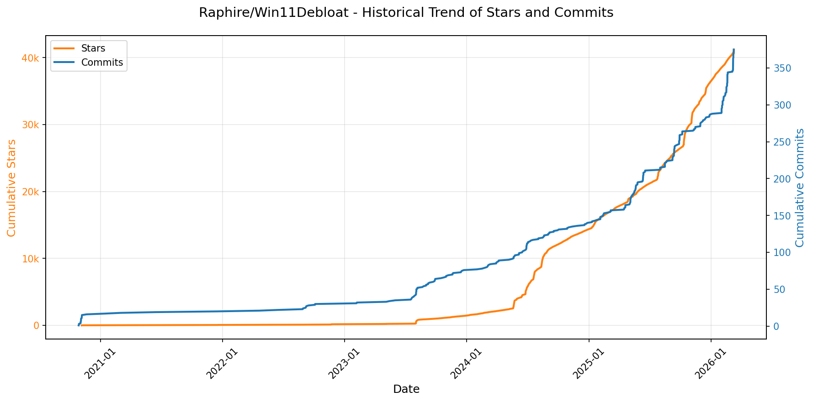

# 🌟 GitHub Trending 概览

> 数据更新于：2026-03-10

---

## 🔍 项目详情

### 1. [openclaw/openclaw](https://github.com/openclaw/openclaw)
- 📅 **创建日期**：2025-11-24  
- 🔄 **最近更新**：2026-03-10  
- ⭐ **Stars**：178,354（日 +9571｜周 +43631｜月 +119946）  
- 📝 **描述**：Your own personal AI assistant. Any OS. Any Platform. The lobster way. 🦞   

<b>📈 Star 与 Commit 历史趋势</b>

> *蓝色：累计 Stars｜橙色：累计 Commits（次 Y 轴）*

<b>📄 README 摘要</b>

1. **项目功能**  
OpenClaw 是一个完全本地化、用户自托管的个人 AI 助手系统，核心目标是让用户在**自有设备上运行专属 AI 助理**，实现真正私有、低延迟、始终在线的智能交互体验。它不依赖中心化云服务，而是通过轻量级“网关”（Gateway）作为统一控制平面，连接并协调多端能力：一方面接入**超 20 种主流通讯平台**（包括 WhatsApp、Telegram、Slack、Discord、Signal、iMessage/BlueBubbles、微信替代品 Feishu/LINE/Zalo、企业级 Teams/Mattermost/Nextcloud Talk、去中心化 Matrix/Nostr/Tlon 等），将消息统一收发；另一方面驱动**跨平台智能体（Agent）**，支持语音唤醒（macOS/iOS）、连续语音对话（Android）、实时可视化画布（Live Canvas）、设备级操作（摄像头、屏幕录制、定位、通知、系统命令等），并可基于会话上下文进行多代理协同与工具调用。

2. **关键特性**  
- **全通道统一收件箱**：原生支持 20+ 消息平台，含群组路由、提及触发、消息分块与通道隔离策略；  
- **本地优先架构**：单进程 WebSocket 网关作为控制中枢，管理会话、通道、工具、事件、定时任务（Cron）、Webhook 及远程访问（Tailscale Serve/Funnel 或 SSH 隧道）；  
- **多智能体路由与隔离**：支持按通道、账号、联系人动态分配至独立工作区（Workspace）和沙箱化 Agent，保障数据与状态隔离；  
- **多模态交互能力**：  
  • 语音：macOS/iOS 唤醒词（Voice Wake）、Android 连续语音（Talk Mode），集成 ElevenLabs + 系统 TTS；  
  • 视觉：跨平台 Live Canvas（A2UI 协议），支持动态 UI 渲染、快照、执行脚本；  
  • 设备感知：iOS/Android/macOS 节点提供相机、录屏、定位、通知、系统命令（`system.run`）等原生能力；  
- **安全默认机制**：DM 默认启用配对模式（Pairing），陌生用户需输入一次性验证码方可通信；支持白名单、密码认证、Tailscale 身份头校验等多层防护；  
- **自动化与扩展生态**：内置浏览器控制（专用 Chromium + CDP）、技能平台（ClawHub 技能注册与自动拉取）、会话间协作工具（`sessions_list/history/send`）、Gmail Pub/Sub 集成等；  
- **开发者友好流程**：终端向导（`openclaw onboard`）一键完成网关部署、通道配置、模型绑定与技能安装；支持 Nix 声明式配置、Docker 容器化、WSL2 兼容及 TypeScript 实时热重载开发。

3. **技术栈**  
- **运行时**：Node.js ≥22（主运行环境），支持 npm/pnpm/bun；TypeScript 为主语言，使用 `tsx` 直接执行；  
- **核心协议与通信**：WebSocket（网关控制平面）、gRPC（Pi Agent RPC 运行时）、HTTP(S)（WebChat/UI、Tailscale Serve/Funnel、Webhook）；  
- **前端与 UI**：WebChat 内嵌于网关，A2UI 协议驱动 Canvas 渲染；macOS/iOS/Android 各有原生应用节点，通过 Gateway WebSocket 协议调用设备能力；  
- **通道集成**：基于各平台官方或成熟开源 SDK — Baileys（WhatsApp）、grammY（Telegram）、discord.js（Discord）、@slack/bolt（Slack）、signal-cli（Signal）、matrix-js-sdk（Matrix）等；  
- **基础设施**：Tailscale（安全远程访问）、Nix（声明式配置管理）、Docker（容器部署）、systemd/launchd（守护进程管理）；  
- **AI 与模型层**：支持 OpenAI（ChatGPT/Codex）、Anthropic、Groq、Ollama 等多后端模型，具备 OAuth/API Key 认证、模型故障转移（failover）、会话级模型切换与提示工程防护机制；  
- **安全与运维**：MIT 许可证，完整日志体系、`openclaw doctor` 自检工具、权限细粒度控制（macOS TCC / Android 运行时权限 / Linux capability 隔离）。

---

### 2. [x1xhlol/system-prompts-and-models-of-ai-tools](https://github.com/x1xhlol/system-prompts-and-models-of-ai-tools)
- 📅 **创建日期**：2025-03-05  
- 🔄 **最近更新**：2026-03-10  
- ⭐ **Stars**：129,995（日 +284｜周 +2671｜月 +16722）  
- 📝 **描述**：FULL Augment Code, Claude Code, Cluely, CodeBuddy, Comet, Cursor, Devin AI, Junie, Kiro, Leap.new, Lovable, Manus, NotionAI, Orchids.app, Perplexity, Poke, Qoder, Replit, Same.dev, Trae, Traycer AI, VSCode Agent, Warp.dev, Windsurf, Xcode, Z.ai Code, Dia & v0. (And other Open Sourced) System Prompts, Internal Tools & AI Models  

<b>📈 Star 与 Commit 历史趋势</b>

> *蓝色：累计 Stars｜橙色：累计 Commits（次 Y 轴）*

<b>📄 README 摘要</b>

1. **该项目做什么？**  
该项目是一个开源的、持续更新的 AI 系统提示词（system prompts）与模型配置信息的综合收集库，专注于逆向分析和公开披露主流 AI 工具（如 Copilot、Claude、Perplexity、Cursor、Windsurf 等）的底层系统指令、模型调用逻辑及架构细节。其核心目标是提供超过 30,000 行真实、可验证的提示工程实践数据，助力开发者理解 AI 工具行为、提升提示设计能力、进行安全审计，并推动 AI 系统的透明化与可解释性。

2. **关键特性**  
- ✅ **大规模结构化数据集**：收录超 30,000 行经整理的系统提示、模型参数、工具链配置及功能逻辑注释；  
- ✅ **开源可审计**：全部内容公开于 GitHub，支持社区协作验证、贡献与改进；  
- ✅ **AI 安全聚焦**：附带明确的安全警示，强调提示泄露风险，并集成 ZeroLeaks.ai 等专业 AI 安全审计服务推荐；  
- ✅ **多平台生态整合**：提供 Solana 代币地址（CA）、DEX 市场链接（Jupiter、Photon、DEXScreener），支持加密捐赠；  
- ✅ **开发者友好基础设施**：集成 Trendshift 趋势分析、DeepWiki 知识图谱、CloudBack 构建状态、Star History 星标追踪等开发运维指标；  
- ✅ **社区与协作支持**：提供 Discord 社群、X（Twitter）账号、邮件联系及 Issue 反馈通道，鼓励共建与反馈。

3. **技术栈**  
- **核心载体**：纯文本/Markdown 格式仓库（GitHub），强调可读性、版本控制与协作；  
- **辅助工具链**：  
  - Star History（星标趋势可视化）  
  - CloudBack.it（CI/CD 与构建状态监控）  
  - DeepWiki（AI 驱动的知识库索引与语义检索）  
  - Latitude.so（用于 LLM 生产环境可预测性优化的开源 AI 工程平台，作为技术合作伙伴）  
- **安全与合规层**：ZeroLeaks.ai 提供的 AI 系统泄漏检测与防护方案；  
- **分发与生态层**：Solana 区块链（代币合约地址）、Jupiter/Photon DEX、Bags.fm 支付网关、Patreon/Ko-fi 等多渠道支持体系。

---

### 3. [obra/superpowers](https://github.com/obra/superpowers)
- 📅 **创建日期**：2025-10-09  
- 🔄 **最近更新**：2026-03-10  
- ⭐ **Stars**：104,371（日 +1264｜周 +7196｜月 +28698）  
- 📝 **描述**：An agentic skills framework & software development methodology that works.  

<b>📈 Star 与 Commit 历史趋势</b>

> *蓝色：累计 Stars｜橙色：累计 Commits（次 Y 轴）*

<b>📄 README 摘要</b>

1. **该项目的作用**  
Superpowers 是一个面向编程智能体（coding agents）的完整软件开发工作流框架，旨在将零散、随意的代码生成行为转化为结构化、可验证、符合工程最佳实践的协作式开发过程。它不直接编写代码，而是通过自动触发一系列预定义的“技能”（skills），引导智能体与开发者协同完成从需求澄清、设计评审、计划拆解、TDD 实施、子智能体并行开发、代码审查到分支收尾的全生命周期任务。其核心目标是让 AI 编程代理具备类人类工程师的系统性思维与工程纪律，而非仅作为“高级补全工具”。

2. **关键特性**  
- **全自动技能驱动工作流**：基于上下文自动激活 14+ 项原子化技能（如 `brainstorming`、`writing-plans`、`subagent-driven-development`、`test-driven-development` 等），覆盖开发全流程，无需手动调用；  
- **强约束式工程实践**：强制执行 TDD（红-绿-重构）、YAGNI（你不会需要它）、DRY（避免重复）、防御性验证（如 `verification-before-completion`）、根因导向调试（`systematic-debugging`）等原则；  
- **人机协同决策机制**：设计阶段分块呈现供人工审阅（sign-off），实现计划前确认；执行中设多道检查点（如双阶段子智能体审查：先验规范合规性，再查代码质量），关键问题自动阻断流程；  
- **隔离式并行开发支持**：通过 `using-git-worktrees` 自动创建独立分支和工作树，保障环境纯净与任务隔离；  
- **自演化能力**：内置 `writing-skills` 技能，支持用户遵循标准范式创建、测试并贡献新技能，形成可扩展的技能库生态；  
- **跨平台原生集成**：原生适配 Claude Code、Cursor、Codex、OpenCode 等主流 AI 编程平台，提供一键安装/更新命令及平台专属配置方案。

3. **技术栈**  
- **核心范式**：基于“技能（Skill）”的插件化架构，每个技能为独立语义单元（以 Markdown 文档 `.md` 形式组织，含行为说明、触发条件、执行逻辑与验证规则）；  
- **运行时依赖**：深度依赖大语言模型（LLM）的推理与规划能力（当前明确适配 Claude 系列模型，尤其强调 Claude 的长上下文与子智能体调度能力）；  
- **集成层**：通过各平台插件协议（如 Claude 的 `/plugin` 命令体系、Cursor 的 `plugin-add`、Codex/OpenCode 的远程指令加载机制）实现无缝接入；  
- **基础设施**：基于 Git 工作树（`git worktree`）实现环境隔离，结合项目本地测试套件（如 Jest、pytest 等）执行自动化验证；  
- **交付形态**：以开源 GitHub 仓库（`obra/superpowers`）为单一事实源，技能文件直接托管于仓库内（如 `skills/` 目录），通过插件市场或远程 URL 动态加载，支持 MIT 许可下的社区共建。

---

### 4. [karpathy/nanochat](https://github.com/karpathy/nanochat)
- 📅 **创建日期**：2025-10-13  
- 🔄 **最近更新**：2026-03-10  
- ⭐ **Stars**：45,624（日 +514｜周 +1171｜月 +3148）  
- 📝 **描述**：The best ChatGPT that $100 can buy.  

<b>📈 Star 与 Commit 历史趋势</b>

> *蓝色：累计 Stars｜橙色：累计 Commits（次 Y 轴）*

<b>📄 README 摘要</b>

1. **项目功能**  
nanochat 是一个极简、可高度定制的端到端大语言模型（LLM）实验框架，专为单节点 GPU（尤其是 8×H100）高效训练而设计。其核心目标是让研究者和开发者能以极低成本（约 $15–$48）在数小时内完整复现并超越 GPT-2（1.6B 参数）级别的模型能力（以 DCLM CORE 得分 ≥ 0.256525 为基准），并直接通过 ChatGPT 风格的 Web 界面与之交互。它覆盖 LLM 全生命周期：从 BPE 分词、预训练（pretraining）、监督微调（SFT）、强化学习（RL）、多维度评估（CORE / val_bpb / 任务评测），到低延迟 KV Cache 推理与交互式聊天 UI，全部集成于一个轻量、无配置文件、无抽象层的代码库中。

2. **关键特性**  
- **单参数复杂度控制**：仅需设置 `--depth`（Transformer 层数），其余所有超参（隐藏层宽度、注意力头数、学习率调度、权重衰减、训练步数、batch size 等）均自动按计算最优原则动态推导，确保模型在给定深度下达到理论最佳 FLOPs 利用率；  
- **极致成本与速度优化**：实测在 8×H100 上约 2 小时完成 GPT-2 级别训练（当前最快 2.02 小时），支持 spot 实例进一步压降至 ~$15；  
- **全栈一体化流水线**：内置 tokenizer 训练/评估、数据分片加载（Fineweb/ClimeMix）、混合精度训练（bf16/fp16/fp32 显式控制）、分布式训练（torchrun）、KV Cache 加速推理引擎、Web UI（`scripts.chat_web`）及 CLI 交互；  
- **可复现性与科研友好**：提供标准化 speedrun 脚本（`runs/speedrun.sh`）、miniseries 扫描脚本（`miniseries.sh`）、scaling laws 实验（`scaling_laws.sh`），以及基于 wandb 的统一指标监控（val_bpb、CORE、MFU、token/s、VRAM）；  
- **强可移植性与兼容性**：原生支持 CUDA（A100/H100 自动 bf16，V100/T4 回退 fp32+GradScaler）、CPU、Apple Silicon（MPS），并支持梯度累积以适配单卡或显存受限场景；  
- **开放协作机制**：维护公开「GPT-2 Speedrun Leaderboard」，鼓励社区贡献并量化改进效果；强调透明性（要求 PR 注明 LLM 辅助内容），拒绝复杂框架设计，坚持“最小可行强基线”哲学。

3. **技术栈**  
- **核心框架**：Python 3.11+，PyTorch 2.3+（无 `torch.amp.autocast`，采用手动 dtype 控制）；  
- **训练与分布式**：`torchrun` 多进程启动，自研 `Linear` 层实现权重 fp32 存储 + compute dtype（bf16/fp16/fp32）前向投射，嵌入层直存 compute dtype；  
- **精度管理**：全局 `COMPUTE_DTYPE`（默认硬件感知：H100/A100 → `bfloat16`，V100/T4 → `float32` 或 `float16`+GradScaler，CPU/MPS → `float32`），环境变量 `NANOCHAT_DTYPE` 可覆盖；  
- **模型架构**：纯 GPT-style Transformer（`nanochat.gpt.GPT`），无 MoE、无 FlashAttention（依赖 PyTorch 原生 SDPA），含自研高效 KV Cache 推理引擎（`nanochat.engine`）；  
- **Tokenizer**：类 GPT-4 风格 BPE 实现（`nanochat.tokenizer`），支持训练与压缩率评估；  
- **评估体系**：DCLM CORE 指标（`nanochat.core_eval`）、bits per byte（`nanochat.loss_eval`）、标准学术任务集（ARC/GSM8K/MMLU/HumanEval/SpellingBee 等，位于 `tasks/`）；  
- **前端与交互**：内嵌 HTML/CSS/JS 单页应用（`nanochat/ui.html`），由 `scripts.chat_web` 启动 FastAPI 服务；  
- **工具链**：`uv` 管理虚拟环境，`pyproject.toml` 定义依赖，W&B 日志追踪，MIT 开源协议。

---

### 5. [Raphire/Win11Debloat](https://github.com/Raphire/Win11Debloat)
- 📅 **创建日期**：2020-10-27  
- 🔄 **最近更新**：2026-03-10  
- ⭐ **Stars**：41,219（日 +360｜周 +848｜月 +2351）  
- 📝 **描述**：A simple, lightweight PowerShell script that allows you to remove pre-installed apps, disable telemetry, as well as perform various other changes to declutter and customize your Windows experience. Win11Debloat works for both Windows 10 and Windows 11.  

<b>📈 Star 与 Commit 历史趋势</b>

> *蓝色：累计 Stars｜橙色：累计 Commits（次 Y 轴）*

<b>📄 README 摘要</b>

1. **该项目的作用**  
Win11Debloat 是一个轻量级 PowerShell 脚本，专为 Windows 11（兼容部分 Windows 10 功能）设计，用于系统“去臃肿”与深度定制。它自动化执行大量手动优化操作，包括卸载预装垃圾应用（bloatware）、关闭隐私泄露风险的遥测与数据收集、禁用侵入性 UI 元素（如 Copilot、Spotlight、Widgets、搜索广告等），并调整系统底层行为（如更新策略、电源管理、文件资源管理器默认设置等），从而提升系统性能、隐私保护水平与使用体验。

2. **核心功能**  
- **应用清理**：批量卸载 Microsoft 预装应用（如 Xbox、Teams、OneDrive（可选）、Weather、News 等）。  
- **隐私与内容控制**：全面禁用遥测、诊断数据、活动历史、位置服务、Find My Device、锁定/桌面 Spotlight、Edge 与设置中的广告/建议/MSN 新闻流。  
- **AI 功能禁用（Windows 11 专属）**：彻底关闭并移除 Copilot；禁用 Recall、Click to Do、WSAIFabricSvc 服务；关闭 Edge、Paint、Notepad 中的 AI 集成功能。  
- **系统行为优化**：恢复 Win10 风格右键菜单、禁用鼠标加速、Sticky Keys、Storage Sense、快速启动、BitLocker 自动加密；限制 Modern Standby 网络连接以省电。  
- **更新管理**：延迟更新推送、禁止登录状态下自动重启、关闭 Delivery Optimization（更新共享）。  
- **界面与交互定制**：启用深色模式、禁用透明/动画效果；自定义开始菜单（隐藏推荐区/全部应用/Phone Link）、任务栏（左对齐、隐藏搜索/小组件/聊天图标、启用“末次激活点击”等）；优化文件资源管理器（显示扩展名/隐藏项、还原常用文件夹、精简导航窗格）。  
- **多任务与窗口管理**：禁用窗口贴靠、贴靠辅助提示及布局建议；自定义 Alt+Tab 行为。  
- **可选功能启用**：一键启用 Windows Sandbox 与 WSL（Windows Subsystem for Linux）。  
- **高级部署能力**：支持以其他用户身份运行、Sysprep 模式（作用于默认用户配置文件），确保新用户自动继承配置；所有更改均支持完整回滚。

3. **技术栈**  
- **核心语言**：PowerShell（原生 Windows 脚本环境，无需额外依赖）  
- **执行机制**：基于 Windows 注册表（Registry）、组策略（Group Policy）、WMI、AppxPackage 管理命令、系统服务控制（`sc.exe`）、计划任务（Task Scheduler）及现代 Windows API（如 `Set-ItemProperty`, `Remove-AppxPackage`, `Disable-WindowsOptionalFeature` 等）实现底层配置修改。  
- **分发方式**：纯脚本（`.ps1`）+ 批处理封装（`Run.bat`），支持远程直接执行（通过 `irm` 下载运行）或本地离线部署。  
- **运行环境**：要求 Windows 11（主要适配）及部分 Windows 10 功能；需以管理员权限运行；默认策略下需临时设置 `ExecutionPolicy Unrestricted -Scope Process`。  
- **辅助生态**：配套 GitHub Wiki 提供完整文档、参数说明、回滚指南与高级用例；采用 MIT 开源许可证。

---

### 6. [shareAI-lab/learn-claude-code](https://github.com/shareAI-lab/learn-claude-code)
- 📅 **创建日期**：2025-06-29  
- 🔄 **最近更新**：2026-03-10  
- ⭐ **Stars**：39,258（日 +616｜周 +4183｜月 +7995）  
- 📝 **描述**：Bash is all you need -  A nano Claude Code–like agent, built from 0 to 1  

<b>📈 Star 与 Commit 历史趋势</b>

> *蓝色：累计 Stars｜橙色：累计 Commits（次 Y 轴）*

<b>📄 README 摘要</b>

1. **项目功能**  
该项目是一个面向教学的轻量级AI编程智能体（nano Claude Code-like agent）构建实践库，旨在从零开始系统性地拆解并实现一个类Claude Code的自主编码智能体核心运行机制。它不追求生产级完备性，而是通过**12个渐进式会话（s01–s12）**，每次仅引入**一个关键机制**，逐步构建出具备规划、工具调用、知识按需加载、上下文压缩、任务持久化、后台执行、多智能体协作、自动任务认领及工作目录隔离等能力的完整智能体运行时内核。最终目标是让学习者透彻理解AI智能体“内部如何运转”，而非仅调用黑盒API。

2. **核心特性**  
- **极简但完备的核心循环**：基于`stop_reason == "tool_use"`触发的标准化LLM交互-工具执行-结果注入-循环迭代范式，所有高级能力均在此不变循环上分层叠加。  
- **12阶段渐进式教学设计**：每阶段聚焦一个可独立理解的机制（如s03强调“先规划后执行”，s07引入磁盘持久化的任务图，s12实现基于ID的工作树（worktree）隔离），配以精炼口号（motto）和ASCII流程图，强化心智模型。  
- **面向真实场景的工程化演进**：涵盖从单循环（s01）到多智能体自治协作（s09–s12）、从同步阻塞到后台异步（s08）、从内存临时上下文到三层压缩+磁盘持久化（s06/s07）、从集中调度到去中心化任务认领（s11）等关键生产级能力演进路径。  
- **配套交互式学习平台**：提供基于Next.js的Web前端（`web/`），支持可视化流程图、代码逐行解析、文档查阅与会话对比，大幅提升学习效率。  
- **明确的能力边界声明**：坦诚说明未实现的生产级机制（如完整事件总线、细粒度权限管控、MCP协议全实现等），避免学习者产生误解，专注核心范式掌握。

3. **技术栈**  
- **主语言与运行时**：Python（所有智能体参考实现 `agents/s*.py` 均基于Python 3.x）；依赖 Anthropic 官方 SDK（`anthropic` 包）调用 Claude 模型。  
- **前端与可视化**：TypeScript + Next.js（`web/` 目录），用于构建交互式学习平台。  
- **任务与通信协议**：JSONL 格式邮箱（mailbox）协议（s09起用于智能体间异步通信）；文件系统（FS）作为任务图（s07）、技能文档（`skills/`）、持久化上下文的底层存储。  
- **辅助工具与生态**：  
  - CLI 工具链：配套开源项目 `Kode-cli`（Node.js/npm）提供开箱即用的命令行编码代理；  
  - SDK：`Kode-agent-sdk`（纯库，无进程开销）支持在各类环境（后端、浏览器扩展、嵌入式）中嵌入智能体能力；  
  - 对比教学库：姊妹项目 `claw0` 和 `OpenClaw` 使用相同核心，延伸至“心跳唤醒”“定时任务”“多通道IM集成”“长期记忆”等主动式助手场景。  
- **基础设施**：GitHub Actions CI（类型检查+构建）、多语言文档（en/zh/ja）、模块化目录结构（`agents/`, `docs/`, `web/`, `skills/`）。

---

### 7. [666ghj/BettaFish](https://github.com/666ghj/BettaFish)
- 📅 **创建日期**：2024-07-01  
- 🔄 **最近更新**：2026-03-10  
- ⭐ **Stars**：37,338（日 +581｜周 +1400｜月 +2094）  
- 📝 **描述**：微舆：人人可用的多Agent舆情分析助手，打破信息茧房，还原舆情原貌，预测未来走向，辅助决策！从0实现，不依赖任何框架。  

<b>📈 Star 与 Commit 历史趋势</b>

> *蓝色：累计 Stars｜橙色：累计 Commits（次 Y 轴）*

<b>📄 README 摘要</b>

1. **项目功能**  
BettaFish（微舆）是一个从零自研的多智能体（Multi-Agent）舆情分析系统，核心目标是打破信息茧房、还原真实舆情全貌、预测发展趋势并辅助业务决策。用户仅需以自然语言提出分析需求（如“分析武汉大学品牌声誉”），系统即可全自动完成：① 从微博、小红书、抖音、快手等30+国内外主流社媒及数百万条评论中实时采集数据；② 跨模态解析图文、短视频、结构化卡片（如天气、股票、日历）；③ 深度挖掘私有数据库（支持安全接入企业内部业务数据）；④ 多Agent协同辩论式分析；⑤ 生成交互式HTML、PDF及Markdown格式的专业研究报告。其定位已超越传统舆情监控，演进为“简洁通用的数据分析引擎”，可快速适配金融、教育、政务等垂直领域。

2. **关键特性**  
- **全域AI驱动监控**：7×24小时分布式爬虫集群（MindSpider），覆盖10+平台，支持热点识别与海量评论下钻；  
- **复合分析引擎**：融合5类专业化Agent（Query/ Media/ Insight/ Report/ Forum）、微调模型（BERT/GPT-2/Qwen3）、统计模型及中间件，规避单一LLM局限；  
- **原生多模态理解**：深度解析短视频内容，并精准提取搜索引擎中的结构化多模态信息（如股票行情、天气预报）；  
- **Agent“论坛”协作机制**：引入辩论主持人LLM，通过ForumEngine实现多轮链式思维碰撞、动态策略调整与跨Agent知识融合，显著提升集体智能质量；  
- **公私域数据无缝融合**：提供高安全性API接口，支持企业私有数据库与公开舆情数据联合分析，实现“外部趋势+内部洞察”双视角决策；  
- **轻量高扩展架构**：纯Python模块化设计，支持一键Docker部署；各Agent解耦清晰，开发者可轻松替换模型、工具或Prompt，快速定制行业解决方案。

3. **技术栈**  
- **编程语言**：Python 3.9+（主框架）、JavaScript（前端交互）；  
- **核心框架**：Flask（Web服务）、Streamlit（单Agent调试界面）、Playwright（浏览器自动化爬虫）、SQLAlchemy（异步ORM）、Pydantic（配置与数据验证）；  
- **AI与模型层**：OpenAI兼容API标准（支持各类大模型）、LoRA微调BERT/GPT-2/Qwen3情感分析模型、传统机器学习（SVM/RF）情感分类器、WeasyPrint（PDF渲染）、Chart.js（图表SVG转换）；  
- **基础设施**：PostgreSQL（默认数据库，亦支持MySQL）、Docker & Docker Compose（容器化编排）、Conda/uv（环境管理）；  
- **许可证**：GPL-2.0 开源协议。

---

### 8. [koala73/worldmonitor](https://github.com/koala73/worldmonitor)
- 📅 **创建日期**：2026-01-08  
- 🔄 **最近更新**：2026-03-10  
- ⭐ **Stars**：34,806（日 +828｜周 +11338｜月 +34753）  
- 📝 **描述**：Real-time global intelligence dashboard — AI-powered news aggregation, geopolitical monitoring, and infrastructure tracking in a unified situational awareness interface  

<b>📈 Star 与 Commit 历史趋势</b>

> *蓝色：累计 Stars｜橙色：累计 Commits（次 Y 轴）*

<b>📄 README 摘要</b>

1. **项目功能**  
World Monitor 是一个实时全球态势感知平台，致力于整合、分析并可视化多源异构的全球情报数据。它通过统一界面提供地缘政治监控、关键基础设施追踪、金融市场信号分析及AI驱动的新闻聚合服务，支持对全球事件（如冲突、灾害、军事动态、市场波动、技术趋势等）进行实时监测、语义理解与风险评估，并面向不同专业领域（地缘政治、科技、金融、大宗商品、正向新闻）提供五套深度定制化的垂直仪表盘。

2. **核心功能**  
- **双引擎地图系统**：支持运行时切换的3D地球仪（globe.gl + Three.js）与WebGL平面地图（deck.gl），共45个可开关数据图层（含军事基地、海底光缆、船舶/航班轨迹、抗议活动、地震、数据中心等），集成CII国家不稳定指数热力图及URL状态共享；  
- **本地化AI智能分析**：四级AI摘要链（Ollama本地→Groq→OpenRouter→浏览器端T5），支持AI推演预测、威胁分类（关键词+浏览器ML+LLM三级增强）、客户端RAG式“头条记忆”（IndexedDB+ONNX嵌入）、21语言原生RSS与AI翻译、RTL阿拉伯语支持；  
- **多维评分与检测体系**：自主研发的国家不稳定指数（CII）、热点升级评分、战略风险评分、地理汇聚检测、跨流信号关联引擎（覆盖新闻/市场/军事/预测14类信号），全部基于实时数据流与算法模型动态计算；  
- **全栈数据融合能力**：聚合435+高可信度RSS源、30+直播视频流（Bloomberg/Sky News/Al Jazeera等）、22个地缘热点网络摄像头、Telegram OSINT频道、OREF火箭警报、Polymarket预测市场等；  
- **专业化多变体架构**：单代码库支撑5个独立域名变体（World/Tech/Finance/Commodity/Happy Monitor），构建差异化数据源、面板布局、地图图层与品牌风格，支持一键切换；  
- **跨平台原生体验**：基于Tauri的桌面客户端（Windows/macOS/Linux）、可安装PWA（含离线地图）、移动端触控优化界面，以及Cmd+K全局命令搜索、故事分享导出等生产力功能。

3. **技术栈**  
- **前端**：纯TypeScript（无框架，自研Panel/VirtualList等组件），Web Workers运行Transformers.js实现浏览器端NER/情感分析/嵌入，IndexedDB + ONNX执行本地RAG，Three.js + globe.gl + deck.gl驱动双地图渲染；  
- **后端与API**：Proto-first架构（92个Protocol Buffer定义文件，22个自动生成的TypeScript服务），Vercel Edge Functions（60+边缘函数，冷启动降低85%），Redis缓存集群（三级缓存策略+防雪崩+stale-on-error）；  
- **AI基础设施**：本地优先设计，支持Ollama/LM Studio离线运行大模型，同时兼容Groq/OpenRouter等云API；浏览器端采用Transformers.js + ONNX Runtime Web；  
- **部署与构建**：Vite构建，`VITE_VARIANT`环境变量实现构建时树摇（tree-shaking），单次Vercel部署托管全部5个变体；  
- **其他关键技术**：Welford算法实现流式异常检测、SmartPollLoop自适应轮询、HLS原生视频流、MTProto Telegram抓取、ADS-B/AIS军民航空海数据接入、CII等核心算法全部开源可审计。

---

### 9. [ruvnet/RuView](https://github.com/ruvnet/RuView)
- 📅 **创建日期**：2025-06-07  
- 🔄 **最近更新**：2026-03-10  
- ⭐ **Stars**：33,762（日 +2238｜周 +11504｜月 +28024）  
- 📝 **描述**：π RuView: WiFi DensePose turns commodity WiFi signals into real-time human pose estimation, vital sign monitoring, and presence detection — all without a single pixel of video.   

<b>📈 Star 与 Commit 历史趋势</b>

> *蓝色：累计 Stars｜橙色：累计 Commits（次 Y 轴）*

<b>📄 README 摘要</b>

1. **项目功能**  
RuView 是一个基于 WiFi 信道状态信息（CSI）的边缘 AI 感知系统，无需摄像头、可穿戴设备或互联网连接，即可实现非接触式环境感知。它利用物理层无线信号（特别是 WiFi 的幅度与相位扰动）实时重建人体姿态（DensePose）、检测呼吸率（6–30 BPM）、心率（40–120 BPM）、多人存在、运动轨迹及跌倒事件，并支持穿墙感知（最远达 5 米深度）。系统完全在本地运行，通过低成本 ESP32-S3 传感器网格（单节点约 $1–$8）采集 CSI 数据，在边缘端完成全部信号处理、自学习建模与推理，适用于隐私敏感、无网络、低功耗等严苛场景。

2. **核心特性**  
- **隐私优先感知**：纯射频信号处理，不采集图像/视频，规避 GDPR/HIPAA 等影像监管风险；  
- **多模态生理与行为感知**：同步输出 17 关键点人体骨架、呼吸/心率、存在热力图、房间射频指纹及漂移预警；  
- **多节点多静态（Multistatic）融合**：4–6 个 ESP32-S3 节点协同工作，构建超 12 条交叉路径，实现 360° 全向覆盖、亚英寸定位精度与无混淆多人追踪；  
- **自学习与自适应能力**：无需标注数据或摄像头监督，通过对比学习 CSI 嵌入（ADR-024）和持久化场模型（ADR-030），在部署中持续学习并建模环境本底，自动剥离静态干扰；  
- **强泛化与跨环境部署**：采用对抗域泛化技术（MERIDIAN, ADR-027），同一模型可无缝迁移至不同房间、建筑甚至硬件平台；  
- **超低延迟边缘实时性**：Rust 实现的信号流水线达 54,000 帧/秒，单帧处理 < 100 微秒，ESP32 上实现毫秒级存在检测与跌倒告警；  
- **全栈安全与可扩展架构**：基于 QUIC 的端到端加密 mesh 通信（ADR-032）、模块化边缘智能（Edge Modules）、便携式 `.rvf` 模型格式（支持 WASM 浏览器部署）及 AMOLED 本地屏显（ADR-045）。

3. **技术栈**  
- **编程语言与框架**：以 Rust 为主（v1.85+），实现高性能、内存安全的信号处理核心与 AI 推理；Python 辅助数据验证、仿真与训练工具链；Tauri v2 构建桌面管理应用；  
- **AI 与信号处理**：基于自研 RuVector 框架，集成注意力机制、图神经网络、自适应带通滤波（0.1–2.0 Hz）、Fresnel 区建模、多径传播仿真、Hampel 去噪、SpotFi 定位原理及 BVP（Ballistocardiogram）反演算法；  
- **硬件平台**：主推 ESP32-S3（内置 Wi-Fi/BLE，支持 CSI 流式捕获与 AMOLED 驱动）；兼容 Intel 5300 / Atheros AR9580 等科研级 CSI NIC；也支持消费级设备的 RSSI 粗粒度存在检测；  
- **部署与运维**：提供多架构（amd64/arm64）Docker 镜像（`ruvnet/wifi-densepose`），30 秒快速启动可视化观测站；模型导出为轻量 `.rvf` 格式；通信协议基于 QUIC，安全模块含防重放、篡改检测与断连自愈；  
- **架构方法论**：严格遵循架构决策记录（ADR，共 48 篇）与领域驱动设计（DDD，7 个有界上下文），涵盖传感（RuvSense）、信号处理、训练流水线、WiFi-Mat 射频建模、CHCI 人机交互等完整领域模型。

---

### 10. [moeru-ai/airi](https://github.com/moeru-ai/airi)
- 📅 **创建日期**：2024-12-01  
- 🔄 **最近更新**：2026-03-10  
- ⭐ **Stars**：31,867（日 +518｜周 +10450｜月 +14613）  
- 📝 **描述**：💖🧸 Self hosted, you-owned Grok Companion, a container of souls of waifu, cyber livings to bring them into our worlds, wishing to achieve Neuro-sama's altitude. Capable of realtime voice chat, Minecraft, Factorio playing. Web / macOS / Windows supported.  

<b>📈 Star 与 Commit 历史趋势</b>

> *蓝色：累计 Stars｜橙色：累计 Commits（次 Y 轴）*

<b>📄 README 摘要</b>

1. **项目功能**  
AIRI 是一个开源的 AI 虚拟角色（AI waifu / 数字生命体）运行容器，旨在复刻并超越 Neuro-sama 的能力——即打造可长期陪伴、实时交互、跨场景协同的“数字灵魂”。它不仅支持基础聊天与角色扮演，更聚焦于**强交互性与多模态智能体行为**：能实时观看用户屏幕（如编程、游戏画面）、同步参与游戏（已实现在 Minecraft 和 Factorio 中自主操作）、接入 Discord/Telegram 语音与消息流、进行本地语音识别（STT）与合成（TTS），并驱动 VRM/Live2D 模型实现眼神追踪、眨眼、凝视等拟人化动画。其核心目标是让用户**完全拥有、本地运行、任意扩展**自己的虚拟数字生命，摆脱中心化平台依赖。

2. **关键特性**  
- **全栈跨端架构**：原生支持浏览器（PWA）、桌面端（Tauri + Rust + WebGPU/Metal/CUDA 加速）、移动端（Capacitor + iOS/Android），三端共享同一套逻辑与插件系统；  
- **深度游戏集成能力**：已实现 Minecraft（基于 Mineflayer）与 Factorio（基于 RCON + autorio 自动化库）的实时控制与协同游玩；  
- **多模态感知与表达**：  
  - *听觉*：支持浏览器麦克风、Discord 音频流输入，内置客户端侧语音活动检测（VAD）与离线/在线语音识别；  
  - *视觉*：通过屏幕捕获实现环境感知（如读取代码编辑器、游戏 HUD）；  
  - *表达*：支持 ElevenLabs 等 TTS，及 VRM/Live2D 模型驱动（含自动眨眼、凝视、 idle 眼动等高级动画）；  
- **本地化智能与记忆系统**：内置 DuckDB WASM（浏览器内嵌数据库）、pglite，正在开发统一记忆中枢 “Memory Alaya”；  
- **超广泛 LLM 接入生态**：通过自研 `xsai` 框架，原生兼容超 25 种主流 LLM 服务（OpenAI、Claude、Gemini、Qwen、vLLM、Ollama、Groq、DeepSeek 等），并支持 MCP（Model Context Protocol）标准；  
- **模块化插件体系**：基于 Tauri 插件（如 `tauri-plugin-mcp`）、Web Workers、WebAssembly 构建可热插拔的能力单元，支持开发者自由扩展（如新游戏代理、新语音模型、新动画协议）；  
- **开放子项目生态**：衍生出 `unspeech`（ASR/TTS 统一网关）、`webai-realtime-voice-chat`（端到端实时语音对话示例）、`airi-factorio`、`memory-pgvector`、`drizzle-duckdb-wasm` 等十余个专注垂直能力的独立仓库。

3. **技术栈**  
- **前端与 UI 层**：Vue 3（Composition API）、TypeScript、Vite、Pinia、Tailwind CSS、@proj-airi/ui（定制组件库）、Three.js（3D 渲染辅助）、WebXR（实验性支持）；  
- **渲染与动画**：VRM（glTF-based）与 Live2D Cubism SDK 集成，WebGPU 加速图形管线（浏览器端），Metal/CUDA 原生加速（桌面端）；  
- **后端与运行时**：Rust（Tauri 核心、Factorio/Minecraft Agent、MCP 插件）、Tauri（桌面应用框架）、Nix（跨平台构建与部署）；  
- **AI 与数据层**：  
  - 推理：`candle`（Rust 原生 ML 框架，支持 CUDA/Metal）、`transformers.js`、`vLLM`、`Ollama`；  
  - 语音：Web Audio API、`unspeech`（通用 ASR/TTS 网关）、ElevenLabs API；  
  - 记忆与存储：DuckDB WASM、pglite（PostgreSQL in WASM）、Drizzle ORM（适配 DuckDB WASM 的驱动）；  
- **基础设施与协议**：WebSocket（实时通信）、MCP（Model Context Protocol）、RCON（Factorio）、Mineflayer（Minecraft）、Web Workers（后台任务隔离）、Capacitor（移动封装）。

---

### 11. [KeygraphHQ/shannon](https://github.com/KeygraphHQ/shannon)
- 📅 **创建日期**：2025-09-27  
- 🔄 **最近更新**：2026-03-10  
- ⭐ **Stars**：29,854（日 +221｜周 +6861｜月 +23076）  
- 📝 **描述**：Shannon Lite is a fully autonomous AI pentester for web apps and APIs. 96.15% (100/104 exploits) on a hint-free, source-aware variant of the XBOW benchmark.  

<b>📈 Star 与 Commit 历史趋势</b>

> *蓝色：累计 Stars｜橙色：累计 Commits（次 Y 轴）*

<b>📄 README 摘要</b>

1. **该项目的功能**  
Shannon 是一个面向 Web 应用程序与 API 的**自主式白盒 AI 渗透测试工具**。它通过深度分析目标应用的源代码（需提供完整代码仓库），识别潜在攻击面，并在运行中的真实应用环境上**自动执行可复现的利用攻击**（如 SQL 注入、XSS、SSRF、认证/授权绕过等），仅报告具备有效概念验证（PoC）的已验证漏洞，从而在代码上线前主动暴露真实可 exploited 的安全风险。

2. **核心功能**  
- **全自动化渗透流程**：单命令启动，支持自动处理 2FA/TOTP、SSO 登录、浏览器导航、漏洞利用及报告生成，无需人工干预；  
- **实证驱动的漏洞报告**：仅输出经实际成功利用验证的漏洞，附带可一键复现的 PoC 脚本或 HTTP 请求；  
- **OWASP 主要漏洞覆盖**：原生支持注入类、XSS、SSRF、认证与授权缺陷的检测与验证，持续扩展中；  
- **代码感知型动态测试**：结合静态源码分析（指导攻击策略）与动态运行时验证（浏览器 + CLI 工具链），提升准确率与上下文相关性；  
- **集成化侦察工具链**：内置 Nmap、Subfinder、WhatWeb、Schemathesis 等工具，完成资产发现、技术栈识别与 API 规范验证；  
- **并行化处理架构**：漏洞分析与利用阶段按攻击类型（Injection/XSS/SSRF/Auth/Authz）多线程并发执行，显著缩短测试周期；  
- **工作区（Workspace）与断点续跑**：支持基于 Git 提交的细粒度任务检查点，允许中断后精准恢复，避免重复执行已完成环节。

3. **技术栈**  
- **AI 推理层**：以 Anthropic Claude 系列模型（Haiku/Sonnet/Opus）为核心推理引擎，支持多模型协同分工（小模型摘要、中模型分析、大模型深度推理）；  
- **云平台兼容性**：原生支持 **AWS Bedrock**（通过 `us.anthropic.*` 等区域化模型 ID）和 **Google Vertex AI**（通过 GCP 服务账号密钥）作为替代 LLM 后端；  
- **基础设施**：基于 **Docker 容器化部署**，采用 **Temporal Workflow** 实现高可靠性、可观测的分布式任务编排与状态管理；  
- **前端监控**：集成 Temporal Web UI（默认 `http://localhost:8233`）提供实时工作流追踪与调试能力；  
- **安全工具集成**：调用 Nmap（端口扫描）、Subfinder（子域名发现）、WhatWeb（指纹识别）、Schemathesis（OpenAPI 模糊测试）等成熟开源工具；  
- **本地开发适配**：跨平台支持（Linux/macOS 原生 Docker、Windows 通过 WSL2 或 Git Bash），针对 `localhost` 测试场景提供 `host.docker.internal` 代理方案。

---

### 12. [bytedance/deer-flow](https://github.com/bytedance/deer-flow)
- 📅 **创建日期**：2025-05-07  
- 🔄 **最近更新**：2026-03-10  
- ⭐ **Stars**：27,432（日 +1345｜周 +3946｜月 +7830）  
- 📝 **描述**：An open-source SuperAgent harness that researches, codes, and creates. With the help of sandboxes, memories, tools, skills and subagents, it handles different levels of tasks that could take minutes to hours.  

<b>📈 Star 与 Commit 历史趋势</b>

> *蓝色：累计 Stars｜橙色：累计 Commits（次 Y 轴）*

<b>📄 README 摘要</b>

1. **项目功能**  
DeerFlow 2.0 是一个开源的「超级智能体运行时框架（Super Agent Harness）」，旨在让 AI 智能体真正“做事”而非仅限于对话。它通过协同调度**子智能体（Sub-Agents）**、**长期记忆（Long-Term Memory）** 和**隔离式沙箱环境（Sandbox）**，构建端到端的自动化工作流。用户可将其用于深度研究、数据管道构建、报告/幻灯片生成、网页开发、多模态内容创作、自动化内容工作流等复杂任务。其核心定位已从初代“深度研究框架”全面升级为通用型智能体基础设施——提供开箱即用的执行能力（文件系统、工具调用、计划编排、上下文管理），同时支持高度定制与扩展。

2. **关键特性**  
- **模块化技能系统（Skills & Tools）**：以 Markdown 定义结构化技能（如 research、slide-creation、image-generation），支持按需动态加载，避免上下文膨胀；内置丰富技能集，并开放自定义路径（`/mnt/skills/custom`）；支持 MCP 协议服务器和 Python 函数扩展工具。  
- **动态子智能体编排（Sub-Agents）**：主智能体可实时分解复杂任务，按需并行启动多个子智能体，各具独立上下文、工具集与终止条件，结果结构化回传后由主智能体融合输出。  
- **全功能沙箱与文件系统（Sandbox & FS）**：每个任务在隔离 Docker 容器中运行，拥有完整可读写文件系统（`/mnt/user-data/{uploads,workspace,outputs}`），支持 Bash 执行、代码运行、图像查看等真实操作，保障安全与可审计性。  
- **上下文工程优化（Context Engineering）**：实现子智能体上下文严格隔离；自动对已完成子任务进行摘要、中间结果落盘、无关内容压缩，显著延长长程多步任务的上下文有效性。  
- **持久化长期记忆（Long-Term Memory）**：跨会话持续记忆用户画像、偏好、技术栈及知识积累，本地存储、用户完全掌控，实现越用越懂你的个性化智能体。  
- **多通道集成（IM Channels）**：原生支持 Telegram（Bot API）、Slack（Socket Mode）、飞书/多维表格（WebSocket），无需公网 IP 即可接收消息任务，并支持细粒度会话配置（如用户级专属智能体、递归限制等）。  
- **Claude Code 深度集成**：提供 `claude-to-deerflow` 技能，允许在 Claude Code 终端内直接调用 DeerFlow，支持多种执行模式（flash/standard/pro/ultra）、状态查询、线程管理及文件上传分析。  
- **嵌入式 Python 客户端**：提供 `DeerFlowClient` 库，支持进程内直连调用全部能力（聊天、流式响应、模型/技能管理、文件上传等），API 响应格式与 HTTP 网关严格一致，CI 自动校验兼容性。

3. **技术栈**  
- **核心框架**：基于 [LangChain](https://github.com/langchain-ai/langchain)（LLM 集成与链式调用）与 [LangGraph](https://github.com/langchain-ai/langgraph)（多智能体状态图编排与有向循环图执行）构建，实现高可靠性智能体工作流引擎。  
- **运行时环境**：Docker（默认沙箱执行）、Kubernetes（通过 Provisioner 服务支持沙箱 Pod 调度）、本地进程（开发模式）；前端基于现代 Web 技术栈（未明示但依赖 Node.js 22+、pnpm、nginx）。  
- **协议与标准**：全面支持 [MCP（Model Context Protocol）](https://modelcontextprotocol.io/) 协议，兼容 HTTP/SSE 通信及 OAuth 令牌流程（`client_credentials`/`refresh_token`）；遵循 OpenAI 兼容 API 规范，无缝接入各类大模型。  
- **开发与部署**：使用 Makefile 统一管理构建流程（`make docker-start` / `make dev`）；配置驱动（YAML + `.env` 环境变量）；Python（后端主体）、TypeScript/JavaScript（前端及 CLI 工具）、Markdown（技能定义）混合开发；测试覆盖沙箱模式检测、Provisioner 配置等关键路径。

---

### 13. [clockworklabs/SpacetimeDB](https://github.com/clockworklabs/SpacetimeDB)
- 📅 **创建日期**：2023-06-17  
- 🔄 **最近更新**：2026-03-10  
- ⭐ **Stars**：23,093（日 +94｜周 +1091｜月 +4098）  
- 📝 **描述**：Development at the speed of light  

<b>📈 Star 与 Commit 历史趋势</b>

> *蓝色：累计 Stars｜橙色：累计 Commits（次 Y 轴）*

<b>📄 README 摘要</b>

1. **该项目做什么？**  
SpacetimeDB 是一个**兼具关系型数据库与应用服务器功能的统一运行时平台**。它允许开发者将数据模式（tables）和业务逻辑（reducers）直接以模块形式编写并部署到数据库内部，客户端可绕过传统中间层（如Web服务器、API网关、容器编排等），直接连接数据库并调用逻辑、订阅数据变更。所有状态实时同步至订阅客户端，实现零基础设施运维——无需独立服务器、Kubernetes、VM、缓存系统或DevOps流程。典型应用场景包括实时多人游戏（如MMORPG《BitCraft Online》全栈后端）、协同应用、聊天系统等。

2. **核心功能**  
- ✅ **数据库即服务器（Database-as-a-Server）**：内置ACID事务保证，同时提供低延迟、高吞吐的实时服务能力；  
- ✅ **原生实时同步（Automatic Live Sync）**：客户端通过声明式订阅（如 `useTable(tables.message)`）自动接收数据变更推送，无需轮询或手动刷新；  
- ✅ **多语言模块支持**：服务端逻辑可用 Rust / C# / TypeScript / C++ 编写，经编译后安全运行于数据库沙箱中；  
- ✅ **统一权限与认证模型**：身份（`Identity`）、访问控制（`accessor = public/private`）、授权逻辑均可在模块内直接定义；  
- ✅ **一体化开发体验**：CLI 工具链（`spacetime dev`）支持模板初始化、本地热重载、一键发布至云托管环境（Maincloud）；  
- ✅ **跨平台客户端SDK**：提供 TypeScript（React/Next.js/Vue等）、Rust、C#（Unity）、C++（Unreal Engine）等全栈客户端集成能力；  
- ✅ **内存优先 + 持久化日志架构**：热数据全驻内存加速访问，WAL（Write-Ahead Log）确保崩溃恢复与持久性。

3. **技术栈**  
- **核心实现**：Rust（主打语言，保障内存安全、并发性能与WASM兼容性）；  
- **服务端模块语言**：Rust、C#、TypeScript、C++（通过各自编译器/工具链生成WASM字节码注入运行时）；  
- **客户端SDK**：TypeScript（全框架支持）、Rust、C#（.NET 6+/Unity IL2CPP）、C++（Unreal Engine 5+）；  
- **部署形态**：原生二进制（`spacetimedb-standalone`）、Docker 容器（`clockworklabs/spacetimedb`）、云托管（Maincloud）；  
- **底层机制**：WASM（WebAssembly）沙箱执行模块逻辑、自研内存数据库引擎、基于CRDTs/Log-based replication的实时同步协议、SQL兼容查询接口；  
- **许可证**：Business Source License 1.1（BSL 1.1），4年后自动转为 AGPL v3.0 + linking exception（允许闭源使用，仅要求对SpacetimeDB本身的修改开源）。

---

### 14. [badlogic/pi-mono](https://github.com/badlogic/pi-mono)
- 📅 **创建日期**：2025-08-09  
- 🔄 **最近更新**：2026-03-10  
- ⭐ **Stars**：21,853（日 +458｜周 +2797｜月 +13972）  
- 📝 **描述**：AI agent toolkit: coding agent CLI, unified LLM API, TUI & web UI libraries, Slack bot, vLLM pods  

<b>📈 Star 与 Commit 历史趋势</b>

> *蓝色：累计 Stars｜橙色：累计 Commits（次 Y 轴）*

<b>📄 README 摘要</b>

1. **项目功能**  
该项目是一个面向AI智能体（Agent）开发与大语言模型（LLM）部署管理的现代化单体仓库（Monorepo），核心目标是提供一套模块化、可组合的工具链，用于构建、运行和集成各类AI代理系统。它不直接提供端到端的SaaS服务，而是聚焦于底层基础设施：统一调用多厂商LLM、执行带工具调用的智能体逻辑、支持交互式编程辅助、对接协作平台（如Slack）、并简化GPU加速的vLLM模型服务部署。

2. **关键特性**  
- **多厂商LLM统一抽象层**（`@mariozechner/pi-ai`）：屏蔽OpenAI、Anthropic、Google等不同API差异，提供一致接口与错误处理；  
- **可扩展的智能体运行时**（`@mariozechner/pi-agent-core`）：内置工具调用（Tool Calling）、状态持久化、执行生命周期管理；  
- **交互式编程智能体CLI**（`@mariozechner/pi-coding-agent`）：本地终端中实时理解需求、生成/修改代码、执行调试反馈；  
- **Slack集成代理**（`@mariozechner/pi-mom`）：将Slack消息自动路由至编码代理，实现团队协同时的AI辅助编程；  
- **高性能终端UI库**（`@mariozechner/pi-tui`）：基于差分渲染（differential rendering）实现流畅、低延迟的命令行界面；  
- **Web端AI聊天组件库**（`@mariozechner/pi-web-ui`）：提供可复用的Web Components，快速构建AI对话界面；  
- **vLLM GPU部署CLI**（`@mariozechner/pi-pods`）：一键管理基于vLLM的本地或云GPU推理实例（pod），支持模型加载、扩缩容与健康监控。

3. **技术栈**  
- **语言与运行时**：TypeScript（全栈主力）、Node.js（服务端/CLI）、Rust（部分高性能组件可能预留扩展，但当前未显式列出）；  
- **前端框架**：无传统框架依赖，`pi-web-ui`采用原生Web Components（Custom Elements + Shadow DOM），`pi-tui`为纯终端渲染；  
- **AI/LLM集成**：适配OpenAI v1+、Anthropic Claude、Google Gemini等主流API；后端推理支持vLLM（作为独立部署目标）；  
- **工程基础设施**：Monorepo架构（pnpm/npm workspaces风格）、TypeScript类型系统、ESLint + Prettier代码规范、Jest/Vitest测试；  
- **部署与运维**：面向GPU服务器的CLI驱动部署（`pi-pods`），强调开发者本地可运行性与生产环境可迁移性。

---

### 15. [msitarzewski/agency-agents](https://github.com/msitarzewski/agency-agents)
- 📅 **创建日期**：2025-10-13  
- 🔄 **最近更新**：2026-03-10  
- ⭐ **Stars**：19,470（日 +6044｜周 +17160｜月 +18519）  
- 📝 **描述**：A complete AI agency at your fingertips - From frontend wizards to Reddit community ninjas, from whimsy injectors to reality checkers. Each agent is a specialized expert with personality, processes, and proven deliverables.  

<b>📈 Star 与 Commit 历史趋势</b>

> *蓝色：累计 Stars｜橙色：累计 Commits（次 Y 轴）*

<b>📄 README 摘要</b>

1. **该项目做什么？**  
该项目是一个开源的、模块化的AI代理（Agent）集合——“The Agency”（代理事务所），旨在为用户提供一套即插即用、高度专业化的AI角色系统，用于替代或增强传统人工协作流程。它不提供通用大模型接口或黑盒工具，而是将AI能力按真实职场职能精细拆分为80+个具人格化、流程化和交付物导向的专用代理（当前统计为61个，持续扩展中），覆盖工程、设计、营销、产品、项目管理、测试、支持、空间计算及特殊领域等九大职能板块。每个代理代表一位“永不疲倦的AI专家”，可独立执行具体任务（如编写React组件、设计ASO策略、生成Vision Pro应用架构），也可多代理协同完成端到端复杂项目（如MVP开发、全渠道营销战役、企业级功能交付），最终目标是让用户“一键组建一支高配AI梦之队”。

2. **核心特性**  
- **深度专业化（非泛化）**：每个代理聚焦单一垂直领域（如“Reddit社区构建师”“visionOS空间工程师”），拥有领域专属知识、术语、工作流与验收标准，拒绝“扮演开发者”类模糊指令。  
- **人格化与一致性**：代理具备鲜明个性、沟通风格与行为准则（如“Evidence Collector默认发现3–5个问题并要求截图证据”），确保交互可预期、结果可追溯。  
- **交付物驱动**：明确界定输出成果（含可运行代码示例、设计系统规范、A/B测试方案、合规审计清单等），强调“产出而非建议”。  
- **全流程闭环**：每个代理包含身份设定、核心使命、关键规则、技术交付模板、分步工作流及量化成功指标（如“Core Web Vitals优化至LCP < 1.2s”）。  
- **多工具原生兼容**：通过脚本自动转换为Claude Code、Cursor、Aider、Windsurf、Gemini CLI、OpenCode等主流AI编程工具所需的格式，实现“一次定义、全域复用”。  
- **实战验证体系**：所有代理均经数月真实场景迭代，附带可复现的用例（如Nexus空间发现练习），涵盖从单点任务到跨部门协同的完整作战地图。

3. **技术栈**  
- **核心形态**：纯文本Markdown（`.md`）文件，结构化存储代理身份、规则、流程与代码示例，强调人类可读性与版本可控性。  
- **集成层**：Shell脚本（`convert.sh`, `install.sh`）实现跨平台格式转换与自动化部署，支持条件判断与交互式安装。  
- **运行环境**：依赖外部AI编码工具作为执行引擎，本身不包含模型或服务端；适配工具包括：  
  - 前端/IDE集成：Claude Code（原生支持）、Cursor（`.mdc`规则）、Windsurf（`.windsurfrules`）；  
  - CLI工具链：Aider（`CONVENTIONS.md`）、Gemini CLI（`SKILL.md`）、Antigravity（`SKILL.md`）、OpenCode（`.md`代理）；  
  - 操作系统路径约定：基于用户主目录的标准化配置路径（如`~/.claude/agents/`, `~/.cursor/rules/`）。  
- **协作生态**：GitHub托管，MIT许可证，支持Fork定制与PR贡献，配套Discussions社区沉淀实战案例。

---

### 16. [GoogleCloudPlatform/generative-ai](https://github.com/GoogleCloudPlatform/generative-ai)
- 📅 **创建日期**：2023-05-05  
- 🔄 **最近更新**：2026-03-10  
- ⭐ **Stars**：15,287（日 +834｜周 +2524｜月 +2686）  
- 📝 **描述**：Sample code and notebooks for Generative AI on Google Cloud, with Gemini on Vertex AI  

<b>📈 Star 与 Commit 历史趋势</b>

> *蓝色：累计 Stars｜橙色：累计 Commits（次 Y 轴）*

<b>📄 README 摘要</b>

1. **该项目的作用**  
该项目是一个面向开发者和AI工程师的开源资源库，旨在提供在Google Cloud平台上构建、部署和管理生成式AI工作流的完整实践指南与可运行示例。它不提供独立产品或服务，而是通过大量Jupyter Notebook、代码片段、演示应用和配置模板，帮助用户快速上手并深入掌握Google Cloud提供的生成式AI能力，包括大模型调用（Gemini）、多模态生成（图像/语音）、检索增强生成（RAG）、企业级搜索（Vertex AI Search）以及环境搭建等核心场景。

2. **关键特性**  
- **全栈生成式AI能力覆盖**：按功能模块组织，涵盖Gemini大模型（含最新Gemini 3.1 Pro）、Vertex AI Vision（Imagen图像生成与编辑、视觉问答/描述）、Vertex AI Audio（Chirp语音识别与合成）、Vertex AI Search（企业级语义搜索）、RAG与数据溯源（Grounding）等；  
- **开箱即用的实践资源**：每个目录均提供可直接运行的Notebook（如Colab/Vertex AI Workbench兼容）、端到端样例应用（如函数调用、多轮对话、图像生成流水线）及分步教程；  
- **工程化支持能力**：包含环境配置（`setup-env/`）、生产就绪模板（如Agent Starter Pack关联项目）、评估与可观测性参考、敏感数据保护集成（Cloud DLP），以及面向营销、开发提效、文档智能、数据库检索等垂直场景的解决方案示例。

3. **技术栈**  
- **底层平台**：Google Cloud Platform（GCP），核心依赖Vertex AI统一AI平台；  
- **模型服务**：Gemini系列大语言模型（含3.1 Pro）、Imagen（文生图/图编辑）、Chirp（语音处理）、Vertex AI Search（检索增强引擎）；  
- **开发工具链**：Python为主，深度集成Vertex AI Python SDK、Google Cloud Client Libraries；广泛使用Jupyter Notebook作为教学与实验载体；  
- **基础设施与部署**：支持Google Colab、Vertex AI Workbench托管环境；关联项目涉及Terraform（基础设施即代码）、Vertex AI Pipelines（MLOps流水线）、GKE（AI on GKE）、Cloud Functions/Run（轻量服务部署）；  
- **扩展生态**：与Agent Development Kit（ADK）、Document AI、Cloud DLP、BigQuery、Cloud Storage等GCP服务深度协同。

---

### 17. [666ghj/MiroFish](https://github.com/666ghj/MiroFish)
- 📅 **创建日期**：2025-11-26  
- 🔄 **最近更新**：2026-03-10  
- ⭐ **Stars**：10,933（日 +3783｜周 +6619｜月 +7349）  
- 📝 **描述**：A Simple and Universal Swarm Intelligence Engine, Predicting Anything. 简洁通用的群体智能引擎，预测万物  

<b>📈 Star 与 Commit 历史趋势</b>

> *蓝色：累计 Stars｜橙色：累计 Commits（次 Y 轴）*

<b>📄 README 摘要</b>

1. **项目功能**  
MiroFish 是一个基于多智能体（Multi-Agent）架构的通用群体智能预测引擎。它通过接收现实世界的“种子信息”（如新闻、政策草案、小说文本、金融数据等），自动构建高保真、可演化的平行数字世界；在该虚拟环境中，成千上万个具备独立人格、长期记忆与自主行为逻辑的AI智能体进行动态交互与社会演化，从而对复杂系统（如舆情走向、政策影响、文学结局、金融市场等）进行可解释、可干预、可重复的未来推演。用户仅需上传原始材料并用自然语言提出预测问题，系统即返回结构化预测报告及一个支持深度交互的实时仿真世界。

2. **核心特性**  
- **双平台并行仿真**：支持宏观社会级演化与微观个体级行为建模同步运行；  
- **动态上帝视角干预**：用户可在模拟过程中实时注入变量（如突发新闻、政策调整、角色对话），观察因果链变化；  
- **全栈记忆增强机制**：融合Zep Cloud长期记忆管理 + GraphRAG知识图谱检索，实现个体记忆、群体共识与环境上下文的协同演化；  
- **开箱即用的预测工作流**：覆盖图谱构建 → 环境配置 → 多轮仿真 → 报告生成 → 人机深度对话全流程；  
- **跨领域泛化能力**：已验证应用于舆情分析（如武汉大学事件）、古典文学推演（《红楼梦》结局）、金融信号预测及时政模拟等多个场景；  
- **多模态交互体验**：提供Web界面、可点击演示视频、在线Demo沙盒及Discord/X/Instagram等社区入口，降低使用门槛。

3. **技术栈**  
- **前端**：基于 React（Node.js 18+ + npm）构建，采用现代化UI框架与响应式布局；  
- **后端**：Python（3.11–3.12）驱动，集成 uv 作为高性能包管理器；  
- **大模型层**：兼容 OpenAI SDK 标准协议，预设对接阿里云百炼平台 Qwen-Plus 等商用大模型；  
- **记忆与知识管理**：Zep Cloud（用于长期记忆向量存储与检索） + 自研 GraphRAG 构建动态关系图谱；  
- **仿真引擎**：底层由开源多智能体框架 **OASIS**（来自 CAMEL-AI）提供核心Agent编排与环境交互能力；  
- **部署方案**：支持源码本地开发（npm + uv 全流程脚本化）与 Docker 容器化一键部署（docker-compose），前后端默认分离运行于 `localhost:3000`（前端）和 `localhost:5001`（API）。

---

### 18. [huggingface/skills](https://github.com/huggingface/skills)
- 📅 **创建日期**：2025-11-24  
- 🔄 **最近更新**：2026-03-10  
- ⭐ **Stars**：8,418（日 +100｜周 +737｜月 +7239）  
- 📝 **描述**：暂无描述  

<b>📈 Star 与 Commit 历史趋势</b>

> *蓝色：累计 Stars｜橙色：累计 Commits（次 Y 轴）*

<b>📄 README 摘要</b>

1. **该项目的作用**  
该项目提供一组标准化、可互操作的“AI/ML技能包”（Hugging Face Skills），用于赋能各类编码智能体（coding agents）高效执行与Hugging Face生态紧密相关的具体任务。这些技能封装了面向特定场景的完整工作流，包括指令说明（`SKILL.md`）、辅助脚本、配置文件及资源，使AI编码助手（如Claude Code、OpenAI Codex、Gemini CLI、Cursor等）能精准理解并自动执行复杂操作，例如：构建Gradio应用、调用HF CLI管理模型/数据集、通过Dataset Viewer查询数据、运行分布式训练作业、发布研究论文、集成评估结果到模型卡、使用Trackio追踪实验等。

2. **核心特性**  
- **跨平台兼容性**：原生支持主流编码智能体工具链——通过`SKILL.md`（Codex/Agent Skills标准）、`.claude-plugin/`（Claude）、`gemini-extension.json`（Gemini CLI）、`.cursor-plugin/`与`.mcp.json`（Cursor）等多种格式实现无缝集成；  
- **即插即用结构**：每个Skill为独立文件夹，含YAML格式元信息（名称、描述）和详细任务指引，支持AI代理动态加载上下文；  
- **多模态 fallback 机制**：当目标工具不支持Skills时，可直接使用统一聚合的`agents/AGENTS.md`作为降级指令集；  
- **开箱即用的实用技能集**：涵盖10个高频HF开发场景（如`gradio`、`hf-cli`、`hugging-face-model-trainer`等），覆盖从数据探索、模型训练、评估、部署到学术出版的全生命周期；  
- **标准化贡献流程**：提供清晰的技能创建指南、`publish.sh`自动化脚本（校验元数据一致性、生成市场清单），并由CI强制保障`marketplace.json`与各`SKILL.md`间的路径/名称同步；  
- **零依赖轻量方案**：部分技能（如`hugging-face-dataset-viewer`）采用纯CLI/npx方案，无需Python环境，提升可移植性与启动速度。

3. **技术栈**  
- **规范标准**：遵循[Agent Skills](https://agentskills.io/specification)开放规范（核心为`SKILL.md`+目录结构），同时兼容Anthropic（Claude）、OpenAI（Codex）、Google（Gemini Extensions）、Cursor（MCP协议）各自的插件体系；  
- **配置与元数据**：YAML（`SKILL.md`前言）、JSON（`gemini-extension.json`、`.claude-plugin/marketplace.json`、`.mcp.json`）；  
- **运行时依赖**：基于Hugging Face官方工具链，包括`huggingface-hub`、`datasets`、`transformers`、`trl`、`lighteval`、`vLLM`、`gradio`、`trackio`等Python库，以及`npx`（用于Dataset Viewer）、`hf` CLI等命令行工具；  
- **基础设施集成**：深度对接Hugging Face Hub API、Inference Endpoints、Jobs服务、Spaces、Paper Publisher及Trackio实验追踪平台；  
- **工程化支持**：Shell脚本（`./scripts/publish.sh`）、GitHub Actions CI验证、自动生成文档表格（`generate_agents.py`）。

---

### 19. [alibaba/OpenSandbox](https://github.com/alibaba/OpenSandbox)
- 📅 **创建日期**：2025-12-17  
- 🔄 **最近更新**：2026-03-10  
- ⭐ **Stars**：7,238（日 +277｜周 +2868｜月 +6228）  
- 📝 **描述**：OpenSandbox is a general-purpose sandbox platform for AI applications, offering multi-language SDKs, unified sandbox APIs, and Docker/Kubernetes runtimes for scenarios like Coding Agents, GUI Agents, Agent Evaluation, AI Code Execution, and RL Training.  

<b>📈 Star 与 Commit 历史趋势</b>

> *蓝色：累计 Stars｜橙色：累计 Commits（次 Y 轴）*

<b>📄 README 摘要</b>

1. **该项目做什么？**  
OpenSandbox 是一个面向 AI 应用的通用型沙箱平台，旨在为各类高风险、需强隔离的 AI 工作负载提供安全、可控、可扩展的执行环境。其核心用途包括：AI 编程代理（Coding Agents）的代码执行与调试、GUI 代理（如浏览器/桌面自动化）、AI 代理能力评测（Agent Evaluation）、AI 驱动的代码解释器（Code Interpreter）、强化学习（RL）训练环境等。它通过统一的沙箱生命周期与执行 API，解耦上层 AI 应用逻辑与底层运行时实现，支持从本地开发到大规模 Kubernetes 集群的全场景部署。

2. **关键特性**  
- **多语言 SDK 支持**：提供 Python、Java/Kotlin、JavaScript/TypeScript、C#/.NET 官方 SDK，Go SDK 已列入路线图；覆盖沙箱创建/销毁、命令执行、文件读写、代码解释等核心能力。  
- **标准化沙箱协议**：定义清晰的 OpenAPI 规范（含生命周期管理 API 与执行 API），便于用户对接自定义沙箱运行时或扩展协议。  
- **双模沙箱运行时**：内置 Docker（本地轻量级）和高性能 Kubernetes 运行时（支持分布式调度、弹性扩缩容），满足开发测试与生产级规模化需求。  
- **开箱即用的沙箱环境**：预置命令行、文件系统、代码解释器（Python/JS 等）基础能力，并提供 Chrome/Playwright 浏览器沙箱、VNC 桌面沙箱、VS Code Web 沙箱、Nullclaw/OpenClaw 网关沙箱等丰富场景化模板。  
- **精细化网络管控**：集成统一入口网关（Ingress Gateway），支持多种路由策略；每个沙箱独立配置出口（Egress）策略，实现细粒度网络访问控制。  
- **强安全隔离机制**：原生兼容 gVisor、Kata Containers、Firecracker 等安全容器/微虚拟机运行时，显著提升沙箱与宿主机之间的隔离强度，适用于运行不可信 AI 代码。

3. **技术栈**  
- **服务端**：Python（FastAPI 框架）构建沙箱生命周期管理服务（`server/`）；Rust 或 Go 实现高性能组件（如 `execd` 执行守护进程、`ingress`/`egress` 网络代理，文档未明示但符合行业实践及项目结构推断）。  
- **运行时依赖**：Docker Engine（本地模式）、Kubernetes（集群模式，含 Helm Chart 与 Operator 示例）；可选集成 gVisor、Kata Containers、Firecracker 等安全容器运行时。  
- **客户端与 SDK**：多语言实现——Python（`uv` 包管理）、Java/Kotlin（Gradle）、TypeScript/JavaScript（npm）、C#/.NET（NuGet）；均基于 RESTful API 与 WebSocket（如需实时流式日志）通信。  
- **基础设施与规范**：OpenAPI 3.0 定义 API 标准（`specs/`）；TOML 格式配置（`~/.sandbox.toml`）；CI/CD 基于 GitHub Actions（E2E 测试流水线）；文档托管于静态站点（`open-sandbox.ai`）。

---

### 20. [superset-sh/superset](https://github.com/superset-sh/superset)
- 📅 **创建日期**：2025-10-21  
- 🔄 **最近更新**：2026-03-10  
- ⭐ **Stars**：6,380（日 +385｜周 +2847｜月 +4998）  
- 📝 **描述**：IDE for the AI Agents Era - Run an army of Claude Code, Codex, etc. on your machine  

<b>📈 Star 与 Commit 历史趋势</b>

> *蓝色：累计 Stars｜橙色：累计 Commits（次 Y 轴）*

<b>📄 README 摘要</b>

1. **项目功能**  
Superset 是一款面向开发者的「编码代理（Coding Agents）终端」，专为高效协同运行多个 CLI 类 AI 编程代理而设计。它并非替代传统终端，而是作为智能工作流中枢：在本地 macOS 环境中统一调度、隔离执行、实时监控并可视化管理多个并发运行的 CLI 编程代理（如 Claude Code、Cursor Agent、GitHub Copilot CLI 等），显著降低上下文切换成本，加速从提示（prompt）到可审查代码变更（diff）的闭环流程。

2. **核心功能**  
- **并行执行**：支持同时运行 10+ 个 CLI 编程代理，各代理独占资源、互不干扰；  
- **Git 工作树隔离**：为每个任务自动创建独立 git 分支与工作目录，确保代码状态完全隔离与可追溯；  
- **集中化监控与通知**：统一仪表板实时显示所有代理运行状态（就绪/等待/出错），支持系统级通知提醒人工介入；  
- **内置差异查看与编辑器**：无需切换工具即可直接查看、对比、编辑代理生成的代码变更（built-in diff viewer + editor）；  
- **可编程工作区预设（Workspace Presets）**：通过配置脚本（`.superset/config.json` + `setup.sh`/`teardown.sh`）自动化环境初始化（如依赖安装、env 复制）与清理；  
- **无缝 IDE 集成**：一键在 VS Code、JetBrains 等外部编辑器中打开任一工作区；  
- **全 CLI 兼容性**：不绑定特定模型或框架，任何能在终端中运行的标准 CLI 工具均可接入；  
- **快捷上下文切换**：支持键盘快捷键（如 `⌘1–9`、`⌘⌥↑/↓`）秒级跳转不同任务工作区。

3. **技术栈**  
- **桌面应用框架**：Electron（构建跨进程桌面容器）；  
- **前端**：React（UI 组件化）、Vite（极速开发服务器与构建）、Tailwind CSS（原子化样式）；  
- **后端/运行时**：Bun（高性能 JavaScript 运行时，用于依赖管理、脚本执行与 dev server）；  
- **工程化**：Turborepo（高速单体仓库（monorepo）任务编排与缓存）；  
- **数据与通信**：tRPC（端到端类型安全 API）、Drizzle ORM（SQLite 数据持久化）、Neon（云原生 PostgreSQL，用于未来扩展）；  
- **基础设施**：Caddy（反向代理，支持 Electric SQL 实时数据流）；  
- **开发体验**：Biome（一体化代码格式化、Linter 与检查工具）。

---

### 21. [steipete/gogcli](https://github.com/steipete/gogcli)
- 📅 **创建日期**：2025-12-12  
- 🔄 **最近更新**：2026-03-10  
- ⭐ **Stars**：6,083（日 +135｜周 +751｜月 +4608）  
- 📝 **描述**：Google Suite CLI: Gmail, GCal, GDrive, GContacts.  

<b>📈 Star 与 Commit 历史趋势</b>

> *蓝色：累计 Stars｜橙色：累计 Commits（次 Y 轴）*

<b>📄 README 摘要</b>

1. **项目功能**  
`gogcli` 是一个面向终端的高性能、脚本友好的命令行工具，旨在将 Google Workspace（原 G Suite）全栈服务无缝集成至命令行环境。它支持对 Gmail、Calendar、Chat、Classroom、Drive、Docs、Sheets、Slides、Forms、Apps Script、Contacts、Tasks、People、Admin、Groups、Keep 等 16+ 项 Google 云服务进行**本地化、自动化、批量化的 CLI 操作**，覆盖查询、创建、修改、删除、导入导出、权限管理、事件监听等完整生命周期操作，并专为 DevOps、自动化脚本、CI/CD 和个人效率工具链设计。

2. **核心特性**  
- **全覆盖服务支持**：深度集成 Google 各 API，如 Gmail 的邮件搜索/发送/标签/过滤器/推送订阅；Calendar 的事件调度/冲突检测/工作状态（OOO/专注模式）；Sheets 的单元格格式/冻结/公式/命名范围操作；Docs/Slides 的 Markdown 双向转换与模板生成等。  
- **企业级身份与安全能力**：原生支持多账户并行管理（含别名）、OAuth 2.0 刷新令牌自动续期、最小权限认证（`--readonly` / `--drive-scope` / `--gmail-scope`）、自定义作用域扩展（`--extra-scopes`），以及 Google Workspace 专属的**服务账号 + 域范围委派（Domain-wide Delegation）** 认证模式（用于 Admin、Groups、Keep 等需管理员权限的服务）。  
- **开发者友好设计**：默认 JSON 输出（`--json`）、结构化 TSV（`--plain`）、可解析的错误码与字段（如 Calendar 自动添加星期几字段）；支持安全凭证存储（OS Keychain 或加密磁盘密钥环）、命令白名单（`--allowlist`）、代理/远程/无浏览器环境认证流程（`--manual` / `--remote` / `--listen-addr`）；提供细粒度服务范围控制与客户端隔离（按域名/账户映射多 OAuth 客户端）。

3. **技术栈**  
- **主语言**：Go（官方仓库使用 Go 编写，构建目标为跨平台二进制）  
- **认证体系**：OAuth 2.0（Desktop App 流）、Google Application Default Credentials（ADC）、服务账号 JWT（Service Account Key + Domain-wide Delegation）、直接访问令牌（`--access-token`）  
- **密钥管理**：系统级密钥环（macOS Keychain / Linux libsecret / Windows Credential Vault）或 AES-256 加密的本地文件密钥环  
- **依赖 API**：全面调用 Google Cloud 官方 REST APIs，包括 Gmail API、Calendar API、Drive API、People API、Tasks API、Sheets API、Docs API、Slides API、Forms API、Classroom API、Chat API、Admin SDK、Cloud Identity API、Keep API、Apps Script API 等  
- **辅助技术**：内置轻量级本地 HTTP 回调服务器（用于 OAuth 浏览器流程）、Cloudflare Worker（可选邮件打开追踪后端）、Markdown 解析/渲染（Docs/Slides 支持）、RRULE 解析（Tasks 重复任务展开）

---

### 22. [Jeffallan/claude-skills](https://github.com/Jeffallan/claude-skills)
- 📅 **创建日期**：2025-10-20  
- 🔄 **最近更新**：2026-03-10  
- ⭐ **Stars**：5,973（日 +193｜周 +1736｜月 +5633）  
- 📝 **描述**：66 Specialized Skills for Full-Stack Developers. Transform Claude Code into your expert pair programmer.  

<b>📈 Star 与 Commit 历史趋势</b>

> *蓝色：累计 Stars｜橙色：累计 Commits（次 Y 轴）*

<b>📄 README 摘要</b>

1. **项目功能**  
该项目是一个专为 Anthropic Claude Code（Claude 编程插件）设计的开源技能增强套件，旨在将 Claude 转变为面向全栈开发者的专业级工程助手。它通过结构化、上下文感知的“技能”（Skills）机制，使 Claude 能够精准理解并响应复杂工程任务（如框架实现、安全加固、跨职能协作等），自动加载对应技术领域的权威参考文档，并在多步骤工作流中串联多个专家角色协同完成端到端交付。

2. **核心特性**  
- ✅ **66 项专业化技能**：覆盖 12 大技术领域（含编程语言、前后端框架、基础设施、API 设计、测试、DevOps、安全、数据/ML、云平台等），每项技能附带深度参考文档（共 365+ 文件）；  
- ✅ **上下文感知激活**：根据用户自然语言指令（如“用 NestJS 实现 JWT 认证”）自动识别技术栈与任务类型，精准调用对应技能及关联文档；  
- ✅ **9 大端到端工作流命令**：支持从需求发现、架构设计、功能开发、缺陷排查、安全加固到复盘归档的完整研发生命周期，原生集成 Jira 和 Confluence（需 Atlassian MCP 服务）；  
- ✅ **多技能协同工作流**：支持组合调用多个技能（如“Feature Forge → Architecture Designer → Test Master → DevOps Engineer”）完成复杂任务；  
- ✅ **上下文工程能力**：提供 `/common-ground` 命令显式揭示并校准 Claude 对项目隐含假设（如技术选型、架构约束、团队规范），提升响应准确性与可解释性；  
- ✅ **模块化可扩展架构**：支持本地开发、测试与贡献新技能，文档体系完善（含 Quick Start、Skills Guide、Workflow Commands 等 8 类官方文档）。

3. **技术栈**  
- **运行平台**：Anthropic Claude Code（Claude 编程插件环境）；  
- **集成依赖**：Atlassian MCP（Model Control Protocol）服务器（用于 Jira/Confluence 工作流集成）；  
- **构建与分发**：GitHub Actions CI/CD 流水线（`ci.yml`），语义化版本管理（v0.4.10）；  
- **协议与许可**：MIT 开源许可证；  
- **生态定位**：被收录于 [Awesome Claude Code](https://github.com/hesreallyhim/awesome-claude-code) 社区推荐列表，属 Claude Code 插件生态核心工具之一。

---

### 23. [volcengine/OpenViking](https://github.com/volcengine/OpenViking)
- 📅 **创建日期**：2026-01-05  
- 🔄 **最近更新**：2026-03-10  
- ⭐ **Stars**：5,356（日 +287｜周 +935｜月 +4329）  
- 📝 **描述**：OpenViking is an open-source context database designed specifically for AI Agents(such as openclaw). OpenViking unifies the management of context (memory, resources, and skills) that Agents need through a file system paradigm, enabling hierarchical context delivery and self-evolving.  

<b>📈 Star 与 Commit 历史趋势</b>

> *蓝色：累计 Stars｜橙色：累计 Commits（次 Y 轴）*

<b>📄 README 摘要</b>

1. **项目功能**  
OpenViking 是一个专为 AI Agent 设计的开源**上下文数据库（Context Database）**，旨在系统性解决 Agent 开发中长期存在的上下文管理难题。它不依赖传统 RAG 的扁平化向量存储范式，而是提出并实现了一种类文件系统的上下文组织与交互范式（“File System Paradigm”），将 Agent 所需的记忆（memories）、资源（resources）和技能（skills）统一建模为虚拟文件系统中的结构化实体（通过 `viking://` 协议寻址），从而提供可定位、可遍历、可调试、可迭代的上下文全生命周期管理能力。

2. **核心特性**  
- **文件系统化管理**：以目录树结构统一组织各类上下文（如 `viking://resources/`, `viking://user/`, `viking://agent/`），支持标准命令（`ls`, `tree`, `find`, `grep`）进行确定性操作，彻底解决上下文碎片化问题；  
- **三级分层加载（L0/L1/L2）**：自动将上下文抽象为三层——L0（摘要，~100 tokens）、L1（概览，~2k tokens）、L2（原始细节）；按需加载，显著降低 token 消耗与模型窗口压力；  
- **目录递归检索（Directory Recursive Retrieval）**：融合意图分析、向量初筛、目录内精检与多级子目录递归钻取，提升复杂查询下的语义相关性与结构完整性；  
- **可视化检索轨迹**：完整记录并呈现从初始查询到最终结果的每一步目录定位与内容筛选路径，使上下文检索过程透明、可观测、可调试；  
- **自动会话记忆迭代**：在对话过程中自动压缩对话内容、工具调用、资源引用等信息，提取长期记忆（long-term memory），实现 Agent 能力随使用持续增强。

3. **技术栈**  
- **核心语言与运行时**：Python（主服务与 SDK）、Go（AGFS 文件系统核心组件）、Rust（CLI 工具 `ov_cli`）、C++（高性能核心扩展，需 GCC 9+/Clang 11+ 编译）；  
- **模型接入层**：  
  - **VLM（视觉语言模型）支持**：原生集成 VolcEngine（Doubao）、OpenAI（GPT-4o-vision）及 LiteLLM 统一网关（兼容 Anthropic/Claude、DeepSeek、Gemini、Qwen/DashScope、vLLM、Ollama 等数十种模型）；  
  - **Embedding 模型支持**：VolcEngine（Doubao Embedding）、OpenAI（text-embedding-3-large）、Jina（计划中）；  
- **存储与协议**：基于自研虚拟文件系统（AGFS），采用 `viking://` 自定义 URI 协议抽象存储层，后端可对接本地文件系统或云存储；  
- **部署与生态**：提供 `openviking-server` HTTP 服务、`ov` CLI 工具、Python SDK，并深度集成 VikingBot Agent 框架；支持 VolcEngine ECS（veLinux）生产部署，配置通过 JSON 格式（`ov.conf`）驱动。

---

### 24. [teng-lin/notebooklm-py](https://github.com/teng-lin/notebooklm-py)
- 📅 **创建日期**：2026-01-07  
- 🔄 **最近更新**：2026-03-10  
- ⭐ **Stars**：4,261（日 +500｜周 +1886｜月 +2441）  
- 📝 **描述**：Unofficial Python API and agentic skill for Google NotebookLM. Full programmatic access to NotebookLM's features—including capabilities the web UI doesn't expose—via Python, CLI, and AI agents like Claude Code, Codex, and OpenClaw.  

<b>📈 Star 与 Commit 历史趋势</b>

> *蓝色：累计 Stars｜橙色：累计 Commits（次 Y 轴）*

<b>📄 README 摘要</b>

1. **项目功能**  
该项目是一个非官方的 Python 工具库（`notebooklm-py`），为 Google NotebookLM 提供**完整的程序化访问能力**。它绕过官方 Web 界面限制，通过逆向工程调用 NotebookLM 的内部（未公开）API，实现对笔记本、资料源、对话、研究代理及内容生成等全部核心功能的自动化控制。用户可借助该库在 Python 应用、命令行脚本或 AI 智能体（如 Claude Code）中集成 NotebookLM，构建研究流水线、批量内容生成系统、自动化知识管理工具等，尤其适用于原型开发、学术研究与个人知识工程。

2. **关键特性**  
- ✅ **全功能覆盖**：支持笔记本全生命周期管理（创建/列表/重命名/删除）、多源导入（URL、PDF、YouTube、Google Drive、本地文件、文本粘贴）、结构化聊天（含历史与角色定制）、Web/Drive 双模自动研究代理、细粒度分享权限控制；  
- ✅ **全类型内容生成**：支持 Audio Overview（播客）、Video Overview（视频）、Slide Deck（幻灯片/PPTX）、Infographic（信息图）、Quiz（测验）、Flashcards（闪卡）、Report（报告）、Data Table（数据表/CSV）、Mind Map（思维导图/JSON）共 9 类 Studio 功能，且每类均提供丰富参数配置（格式、语言、风格、难度、长度等）；  
- ✅ **超越 Web UI 的独有能力**：包括批量下载所有同类产物、Quiz/Flashcard 多格式导出（JSON/Markdown/HTML）、思维导图 JSON 数据提取、数据表 CSV 导出、PPTX 幻灯片下载、单页幻灯片自然语言修订、报告模板指令追加、聊天记录保存为笔记、源文档全文提取、编程式权限管理等——这些均未在 NotebookLM 官方网页界面中开放。

3. **技术栈**  
- **语言与运行时**：Python 3.10–3.14，基于异步编程（`asyncio` / `httpx`）实现高性能并发请求；  
- **核心依赖**：`httpx`（异步 HTTP 客户端）、`playwright`（用于浏览器登录认证，支持 Chromium）、`pydantic`（数据验证与模型定义）；  
- **接口形态**：提供三层使用方式——**异步 Python API**（面向开发者集成）、**命令行工具（CLI）**（支持 Shell 脚本与 CI/CD）、**AI Agent 技能插件**（专为 Claude Code 等 LLM 代理设计的自然语言可调用技能）；  
- **平台兼容性**：正式支持 macOS、Linux 和 Windows（CI 全平台验证）；  
- **工程实践**：采用模块化架构，配套完整文档（CLI/API/配置/排错/稳定性说明）、自动化测试（GitHub Actions）、语义化版本（PyPI 发布）、MIT 开源协议。

---

### 25. [CodebuffAI/codebuff](https://github.com/CodebuffAI/codebuff)
- 📅 **创建日期**：2024-07-09  
- 🔄 **最近更新**：2026-03-10  
- ⭐ **Stars**：4,167（日 +45｜周 +1110｜月 +1401）  
- 📝 **描述**：Generate code from the terminal!  

<b>📈 Star 与 Commit 历史趋势</b>

> *蓝色：累计 Stars｜橙色：累计 Commits（次 Y 轴）*

<b>📄 README 摘要</b>

1. **项目功能**  
Codebuff 是一个开源的 AI 编程助手，专注于通过自然语言指令直接编辑用户本地代码库。它不依赖单一大型语言模型完成全部任务，而是采用多智能体（multi-agent）协同架构：各专业化智能体（如文件定位、规划、编辑、审查）按需协作，深入理解项目上下文，在真实代码库中执行精准、安全、可验证的修改（例如修复 SQL 注入、添加鉴权、重构性能瓶颈等），并自动运行测试保障稳定性。

2. **核心特性**  
- **多智能体协同工作流**：内置 File Picker、Planner、Editor、Reviewer 四类专用 Agent，分工明确，显著提升上下文理解深度与代码修改准确性；  
- **高度可定制化 Agent 开发**：支持通过 `/init` 命令初始化 TypeScript 代理开发环境（含类型定义、工具接口、提示词模板），允许开发者编写具备条件分支、子 Agent 调用、多步终端命令执行（如 `git diff`/`git log`）等复杂逻辑的自定义 Agent；  
- **开放模型生态**：原生集成 OpenRouter，支持自由切换 GPT、Claude、Qwen、DeepSeek 等任意可用模型，避免厂商锁定；  
- **生产级 SDK 支持**：提供 `@codebuff/sdk` 包，支持在 CI/CD、IDE 插件或企业应用中嵌入 Agent 执行能力，支持动态注册自定义 Agent 与工具；  
- **Agent 复用与分发**：兼容 [Codebuff Agent Store](https://www.codebuff.com/store)，支持发布、发现和复用社区构建的标准化 Agent（对标 MCP 概念）；  
- **端到端可靠性保障**：自动识别影响范围、跨文件协同修改、执行前后验证（含测试运行），实测在 175+ 真实开源项目任务中准确率达 61%，超越 Claude Code（53%）。

3. **技术栈**  
- **前端/CLI 层**：TypeScript + Node.js（全局 CLI 工具，基于 `npm install -g codebuff` 分发）；  
- **SDK 层**：TypeScript SDK（`@codebuff/sdk`），面向 Node.js 运行时，提供异步 Agent 调用、事件流处理（`handleEvent`）、自定义工具注入等能力；  
- **智能体框架**：基于 TypeScript 定义的强类型 Agent 配置体系（`agent-definition.ts`, `tools.ts`），支持生成式提示工程与程序化控制混合编排；  
- **模型接入层**：统一适配 OpenRouter API，支持多模型路由与动态切换；  
- **开发与测试**：使用 Bun 作为测试运行时（`bun test`），集成 tmux 实现交互式端到端（E2E）测试；  
- **基础设施**：依赖本地终端命令执行（`run_terminal_command`）、文件读写（`read_files`）、Git 操作等底层工具，确保深度耦合开发环境。

---

### 26. [github/gh-aw](https://github.com/github/gh-aw)
- 📅 **创建日期**：2025-08-12  
- 🔄 **最近更新**：2026-03-10  
- ⭐ **Stars**：4,089（日 +50｜周 +282｜月 +3702）  
- 📝 **描述**：GitHub Agentic Workflows  

<b>📈 Star 与 Commit 历史趋势</b>

> *蓝色：累计 Stars｜橙色：累计 Commits（次 Y 轴）*

<b>📄 README 摘要</b>

1. **项目功能**  
该项目（GitHub Agentic Workflows，简称 GH-AW）允许用户使用自然语言编写的 Markdown 文件定义“智能体式工作流”（agentic workflows），并直接在 GitHub Actions 环境中安全执行。其核心目标是将 AI 智能体（agent）能力深度集成到 GitHub 自动化体系中，使开发者能以声明式、低代码方式编排具备推理、决策与工具调用能力的自动化任务（如代码审查、PR 总结、依赖分析、文档生成等），同时严格约束其行为边界，确保与现有 GitHub 安全模型兼容。

2. **关键特性**  
- **自然语言驱动的工作流定义**：支持用 Markdown 编写语义清晰的 agentic 流程（非 YAML/JSON），降低 AI 工作流编写门槛；  
- **多层安全防护机制（Guardrails）**：默认只读权限；写操作仅通过经严格校验的 `safe-outputs` 通道触发；内置沙箱执行环境、输入清洗、网络隔离、供应链安全（SHA 固定依赖）、工具白名单、编译时静态验证；  
- **细粒度访问控制**：支持按团队成员授权、人工审批门禁（human approval gates）用于高危操作；  
- **配套安全基础设施**：与 Agent Workflow Firewall（AWF，管控网络出向请求）和 MCP Gateway（统一代理 Model Context Protocol 调用）深度协同；  
- **生产就绪型架构设计**：基于威胁建模构建，提供完整的安全架构文档与最佳实践指南；  
- **开箱即用的引导体系**：含 Quick Start 入门指南、Peli’s Agent Factory 教学案例库、LLM 配置清单（`llms.txt`）等面向 AI 开发者的专用资源。

3. **技术栈**  
- **运行平台**：原生依托 GitHub Actions 基础设施，复用其 runner、权限模型与事件触发机制；  
- **核心语言与格式**：工作流定义采用 Markdown（增强语义标记），底层解析与执行引擎需处理自然语言指令到可执行动作的映射；  
- **安全组件**：自研 Guardrails 运行时框架（含沙箱、输出净化、策略引擎）；配套独立服务：AWF（Go/Rust 实现的网络防火墙）、MCP Gateway（HTTP 反向代理网关，支持 MCP 协议）；  
- **依赖管理**：强调供应链安全，所有外部依赖通过 SHA-256 哈希值锁定（SHA-pinned）；  
- **部署与分发**：通过 GitHub 托管的静态文档站点（`github.github.com/gh-aw/`）提供文档与资源，安装与配置依赖 GitHub Actions 的标准扩展机制。

---

### 27. [alirezarezvani/claude-skills](https://github.com/alirezarezvani/claude-skills)
- 📅 **创建日期**：2025-10-19  
- 🔄 **最近更新**：2026-03-10  
- ⭐ **Stars**：3,382（日 +565｜周 +1163｜月 +1727）  
- 📝 **描述**：169 production-ready skills & plugins for Claude Code, OpenAI Codex, and OpenClaw — engineering, marketing, product, compliance, C-level advisory, and more. Install via /plugin marketplace.  

<b>📈 Star 与 Commit 历史趋势</b>

> *蓝色：累计 Stars｜橙色：累计 Commits（次 Y 轴）*

<b>📄 README 摘要</b>

1. **项目功能**  
该项目提供一套面向AI编程代理（如Claude Code、OpenAI Codex、Gemini CLI、OpenClaw）的**生产就绪型专业能力扩展体系**，共包含170个模块化、可复用的“技能”（Skills）与“插件”（Plugins）。其核心作用是**赋予通用AI编码代理特定领域专家级能力**，使其能像资深工程师、产品总监、合规官、营销专家或C级高管一样执行高价值任务，覆盖工程架构、产品管理、市场营销、法规质量（RA/QM）、项目管理、企业战略、财务分析等9大垂直领域，直接提升AI在真实业务场景中的专业化、自动化与可信度。

2. **关键特性**  
- ✅ **跨平台原生兼容**：统一代码库，无缝支持Claude Code插件、OpenAI Codex CLI/Agents、Gemini CLI技能、OpenClaw技能四大主流AI开发平台；  
- ✅ **分层技能体系**：含基础域技能（如23个核心工程技能）与25个“POWERFUL”高阶技能（如agent-designer、rag-architect、database-designer、incident-commander），具备深度工程能力与生产级可靠性；  
- ✅ **安全优先设计**：内置`skill-security-auditor`（v2.0新增），可对任意技能包进行本地静态扫描，检测命令注入、数据泄露、依赖供应链风险等9类安全隐患，输出PASS/WARN/FAIL分级结果及修复建议，**零外部依赖，纯Python标准库实现**；  
- ✅ **开箱即用工具链**：配套210+个轻量级Python CLI工具（如`tech_debt_analyzer.py`、`brand_voice_analyzer.py`、`rice_prioritizer.py`），全部仅依赖Python标准库，无需pip安装，支持离线分析与自动化集成；  
- ✅ **结构化技能封装**：每个技能均为独立文件夹，含`SKILL.md`（含元数据、工作流、角色指令）、`scripts/`（可执行工具）、`references/`（权威文档）、`assets/`（模板/图标），遵循可复现、可审计、可协作的标准化范式。

3. **技术栈**  
- **核心语言**：Python 3（所有CLI工具、安全扫描器、安装脚本均基于Python标准库，无第三方依赖）；  
- **运行时环境**：跨平台Shell脚本（`gemini-install.sh`、`codex-install.sh`、`openclaw-install.sh`），适配Linux/macOS；  
- **技能格式**：Markdown（`SKILL.md`作为技能说明书与指令入口）、YAML/JSON（部分配置元数据）、纯文本/CSV（工具输入输出）；  
- **基础设施无关**：不依赖云服务、数据库或后端API，所有能力在本地CLI或AI代理沙箱内执行，强调隐私性与离线可用性；  
- **生态集成**：深度适配各平台插件机制（Claude Code `/plugin install`、Codex `npx agent-skills-cli`、Gemini CLI激活指令、OpenClaw一键脚本），并提供手动文件拷贝安装路径（如`~/.claude/skills/`）。

---

### 28. [pbakaus/impeccable](https://github.com/pbakaus/impeccable)
- 📅 **创建日期**：2025-11-16  
- 🔄 **最近更新**：2026-03-10  
- ⭐ **Stars**：3,005（日 +1179｜周 +2736｜月 +2849）  
- 📝 **描述**：The design language that makes your AI harness better at design.  

<b>📈 Star 与 Commit 历史趋势</b>

> *蓝色：累计 Stars｜橙色：累计 Commits（次 Y 轴）*

<b>📄 README 摘要</b>

1. **该项目的作用**  
Impeccable 是一个面向前端设计的 AI 提示工程（prompt engineering）增强套件，专为提升大语言模型（LLM）在 UI/UX 设计任务中的专业性与表现力而构建。它不生成代码或运行时组件，而是通过结构化知识注入、精准指令控制和显式约束机制，系统性地矫正 LLM 在前端设计中常见的“审美偏见”与“模式化错误”（如滥用 Inter 字体、紫色渐变、嵌套卡片、低对比度灰字等），使 AI 能产出更专业、可访问、符合现代设计规范的界面方案。

2. **核心功能**  
- **深度扩展的设计技能（frontend-design skill）**：包含 7 个领域专属参考文档（排版、色彩与对比度、空间设计、动效设计、交互设计、响应式设计、UX 文案），覆盖 OKLCH 色彩模型、tinted 中性色、模块化比例、减少运动（reduced motion）、容器查询、错误提示文案等前沿实践；  
- **17 个语义化 steering 命令**：支持全生命周期设计干预，涵盖技术审计（`/audit`）、体验批判（`/critique`）、系统对齐（`/normalize`）、终稿润色（`/polish`）、信息提纯（`/distill`）、动效注入（`/animate`）、色彩策略（`/colorize`）、风格调节（`/bolder`/`/quieter`）、愉悦感增强（`/delight`）、组件抽取（`/extract`）、多端适配（`/adapt`）等；  
- **显式反模式（anti-patterns）清单**：以否定式规则强制规避行业常见设计劣习，例如禁用系统默认字体与 Inter、禁止灰字叠于彩色背景、禁用纯黑/纯灰、禁止无意义卡片嵌套、禁用过时弹性缓动（bounce/elastic easing），从源头抑制 AI 的“模板化输出”。

3. **技术栈**  
- **核心形态**：纯文本提示工程资产（Markdown 技能文档 + YAML/JSON 配置指令），无运行时依赖，跨平台兼容；  
- **集成目标工具**：专为 AI 编程助手深度适配，包括 Cursor（需 Nightly 版本 + Agent Skills 启用）、Claude Code（项目级或全局 `.claude` 配置）、Gemini CLI（需 `@google/gemini-cli@preview`）、Codex CLI（OpenAI 生态命令行工具）；  
- **交付形式**：预构建 ZIP 分发包（含各工具专用目录结构），支持一键解压部署；源码基于静态文件组织（`source/` 存放技能源，`dist/` 存放各工具适配产物）；  
- **协议与生态**：基于 Apache 2.0 许可证，继承并大幅扩展 Anthropic 官方 `frontend-design` 技能，属 LLM “设计能力层”基础设施，不涉及前端框架、构建工具或浏览器运行时。

---

### 29. [alibaba/page-agent](https://github.com/alibaba/page-agent)
- 📅 **创建日期**：2025-09-23  
- 🔄 **最近更新**：2026-03-10  
- ⭐ **Stars**：2,597（日 +633｜周 +1948｜月 +1986）  
- 📝 **描述**：JavaScript in-page GUI agent. Control web interfaces with natural language.  

<b>📈 Star 与 Commit 历史趋势</b>

> *蓝色：累计 Stars｜橙色：累计 Commits（次 Y 轴）*

<b>📄 README 摘要</b>

1. **项目功能**  
Page Agent 是一个嵌入网页的轻量级 GUI 智能体（Agent），允许用户通过自然语言指令直接操控当前网页的界面元素（如点击按钮、填写表单、导航链接等）。它完全运行在浏览器客户端，无需后端服务、Python 环境、浏览器插件（基础场景下）或无头浏览器；所有 DOM 解析、指令理解与操作均在页面内实时完成，实现“所言即所行”的网页交互自动化。

2. **核心特性**  
- **零依赖集成**：仅需一行 `<script>` 标签或 NPM 引入，即可在任意 Web 应用中启用，不侵入现有架构；  
- **纯文本 DOM 操作**：基于结构化 DOM 树解析（非截图+OCR/多模态模型），无需图像识别，隐私友好且无需特殊浏览器权限；  
- **LLM 可插拔**：支持用户自定义接入任意兼容 OpenAI 兼容 API 的 LLM（如 Qwen、Qwen3.5-plus、Llama、Claude 等），含免费测试 API 供快速验证；  
- **人机协同 UI**：提供美观、可交互的悬浮面板界面，支持用户实时查看推理过程、修正操作、确认关键步骤（human-in-the-loop）；  
- **可选扩展能力**：通过官方 Chrome 插件支持跨标签页（multi-page）任务编排，突破单页限制；  
- **开箱即用场景覆盖**：原生适配 SaaS AI Copilot 集成、智能表单填充（ERP/CRM）、无障碍访问（语音/屏幕阅读器支持）等高频需求。

3. **技术栈**  
- **语言与框架**：TypeScript（强类型保障）、ES Module（现代前端模块规范）；  
- **构建与分发**：支持 IIFE（直接 `<script>` 加载）、ESM（NPM 导入）双格式；构建工具未明示，但输出符合标准打包规范（BundlePhobia 可查）；  
- **底层依赖**：深度复用并扩展开源库 [`browser-use`](https://github.com/browser-use/browser-use) 的 DOM 解析、元素定位与操作逻辑（MIT 许可）；  
- **协议与标准**：遵循 OpenAI 兼容 API 规范（`baseURL` + `apiKey`），无缝对接 DashScope、Ollama、Local LLM 等服务；  
- **部署与生态**：发布于 npm，CDN 托管（jsDelivr / npmmirror），文档托管于 GitHub Pages，许可证为 MIT。

---

