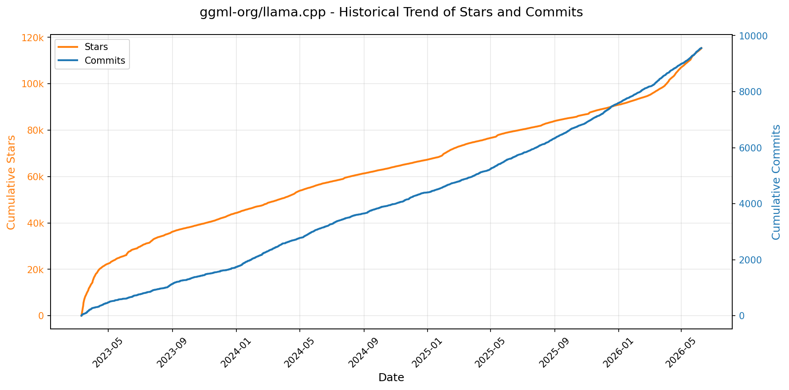
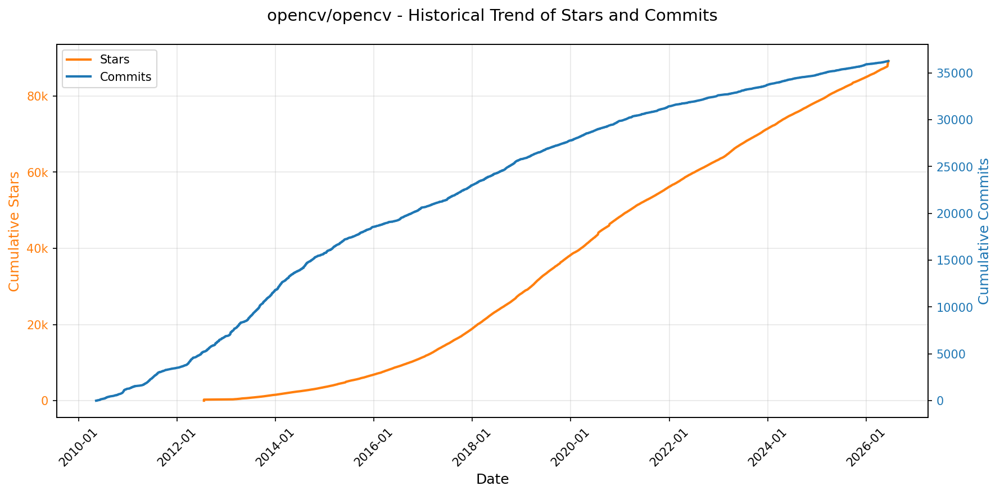
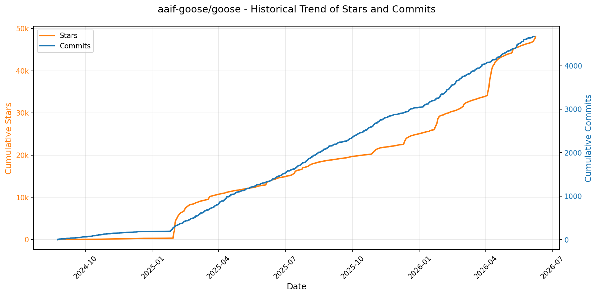
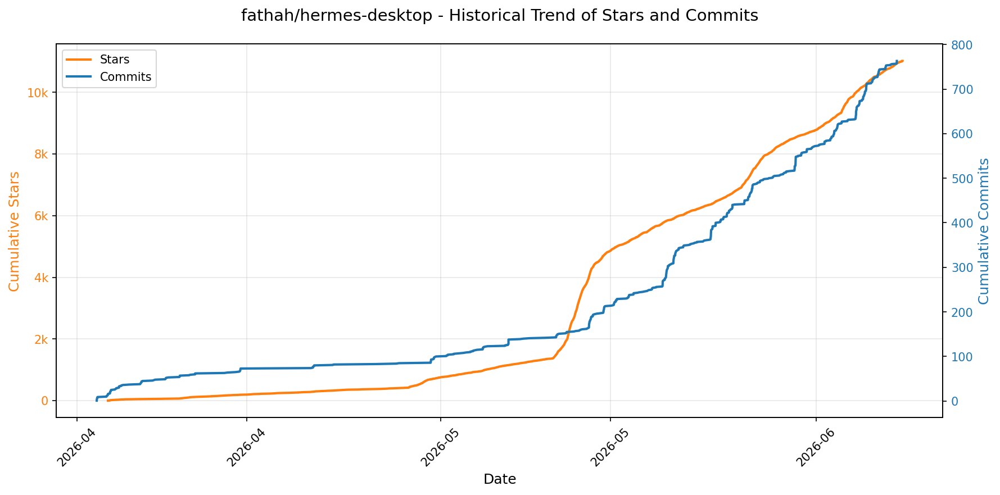
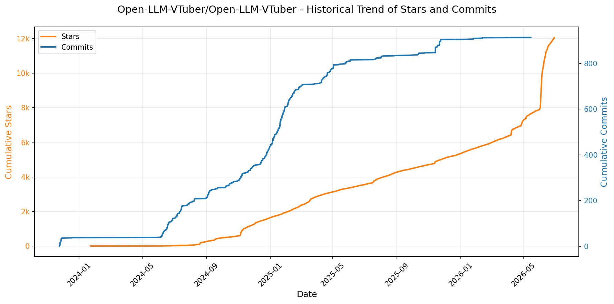
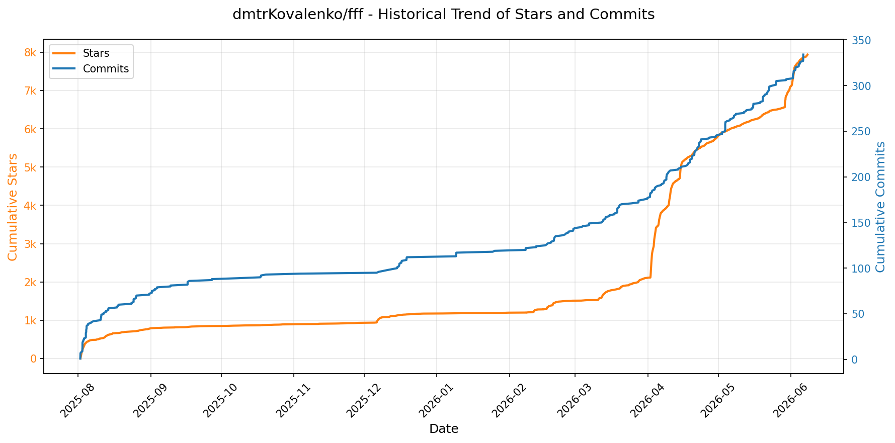
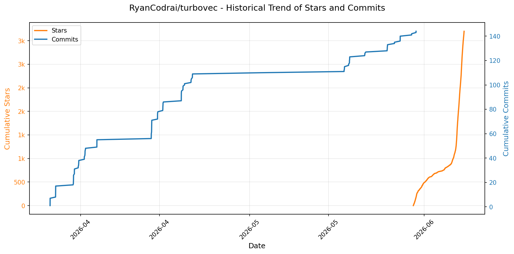
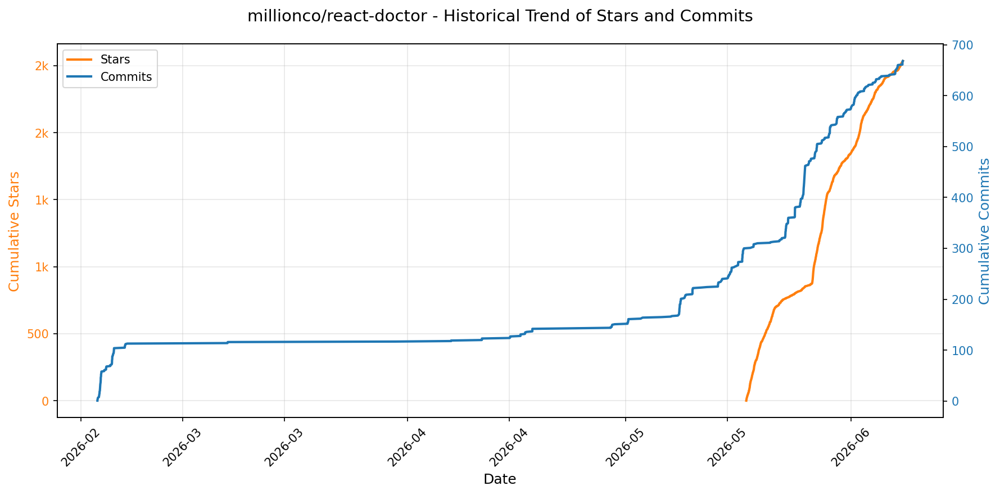
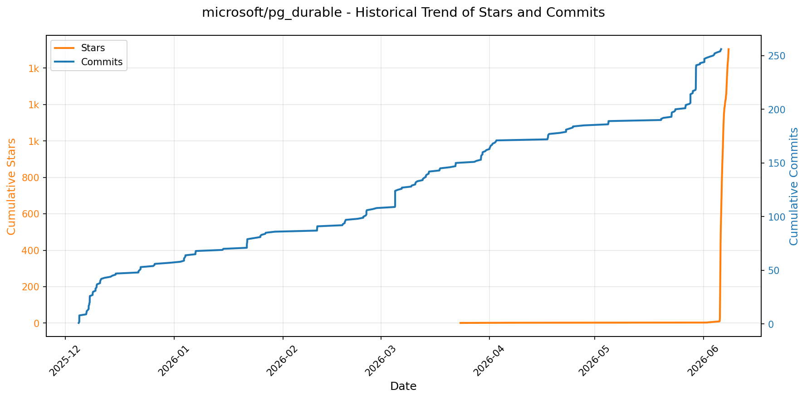

# 🌟 GitHub Trending 概览

> 数据更新于：2026-06-08

---

## 🔍 项目详情

### 1. [affaan-m/ECC](https://github.com/affaan-m/ECC)
- 📅 **创建日期**：2026-01-18  
- 🔄 **最近更新**：2026-06-08  
- ⭐ **Stars**：205,119（日 +676｜周 +9452｜月 +35332）  
- 📝 **描述**：The agent harness performance optimization system. Skills, instincts, memory, security, and research-first development for Claude Code, Codex, Opencode, Cursor and beyond.  

<b>📈 Star 与 Commit 历史趋势</b>

> *蓝色：累计 Stars｜橙色：累计 Commits（次 Y 轴）*

<b>📄 README 摘要</b>

1. **该项目的功能**  
ECC（Harness-Native Operator System for Agentic Work）是一个面向“智能体工作流”（agentic work）的、原生适配多种AI代理运行时环境（即“harnesses”）的操作系统级框架。它并非简单的配置集合或提示工程工具包，而是提供端到端的生产级智能体基础设施：支持技能（skills）定义与复用、本能（instincts）建模、记忆优化与持久化、持续学习（自动从会话中提炼可复用模式）、安全扫描（集成AgentShield）、研究优先型开发范式，以及对遗留命令的无缝兼容（shims）。其核心目标是统一跨不同AI开发环境（如Claude Code、Cursor、Codex、OpenCode、GitHub Copilot、Zed、Gemini等）的智能体行为、生命周期管理与工程实践，实现真正可移植、可审计、可扩展的多harness智能体协同工作流。

2. **关键特性**  
- **跨harness一致性架构**：确保同一套代理、技能、规则、钩子（hooks）和MCP配置在12+语言生态（TypeScript/Python/Go/Java/Perl/Kotlin/Rust/C++/PHP/Swift等）及主流AI IDE中行为一致；  
- **Operator工作流系统**：v2.0引入公共Operator层（如`brand-voice`、`customer-billing-ops`、`workspace-surface-audit`），支持业务级自动化编排；  
- **智能体全生命周期管理**：含会话状态持久化（SQLite存储）、分支/搜索/导出/压缩/指标分析（NanoClaw v2）、恢复/暂停/守护进程控制（Rust控制平面`ecc2/` alpha版）；  
- **动态安装与模块化**：基于清单（manifest）的按需安装（`install-plan.js`）、语言/能力粒度裁剪（`--profile minimal/core/full`、`--with capability:machine-learning`）、增量更新与状态追踪；  
- **安全与治理强化**：内置AgentShield深度集成（102条规则、1282项测试）、沙箱隔离、输入净化、CVE防护、成本审计（`ecc-tools-cost-audit`）、权限门控（如Itô API访问隔离）；  
- **自进化能力**：连续学习v2（本能驱动+置信度评分）、技能自动演化、模式提取与复用；  
- **可观测性与协作就绪**：`ecc status --markdown`生成可交付状态快照，支持GitHub/Linear工作项同步、自动化就绪检查（`--exit-code`）；  
- **多模态与发布就绪工具链**：内建`manim-video`/`remotion-video-creation`视频生成、`frontend-slides`零依赖PPTX生成、技术传播内容自动化；  
- **企业级运维支撑**：PM2多代理编排、GitHub App托管服务（ECC Pro）、赞助生态（GitHub Sponsors）、CI全面硬化（997+通过测试）。

3. **技术栈**  
- **主语言与运行时**：TypeScript（核心CLI、工具链、前端逻辑）、Python（`ecc_dashboard.py` GUI、部分技能与脚本）、Go（部分底层工具）、Java/Kotlin/Perl/Rust/C++/PHP/Swift（通过规则与构建解析器支持的12+语言生态）；  
- **前端与GUI**：Tkinter（桌面仪表盘）、Markdown（文档与配置）、HTML/PPTX（内容生成输出）；  
- **基础设施与存储**：SQLite（本地会话与状态存储）、Git工作树（并行化开发）、Shell/Bash/PowerShell（安装与部署脚本）；  
- **构建与包管理**：npm/pnpm/yarn/bun（JS生态）、Rust（`ecc2/`控制平面原型）、Python pip（可选依赖）；  
- **集成协议与标准**：MCP（Model Context Protocol）、LLM提示路由（`/model-route`）、Harness事件总线（OpenCode插件系统20+事件类型）、GitHub Marketplace App、GitHub Actions（CI/CD）；  
- **安全与合规**：MIT开源许可证、端到端沙箱、内容哈希缓存、结构化文本校验（regex vs LLM）、成本感知流水线（`cost-aware-llm-pipeline`）。

---

### 2. [microsoft/markitdown](https://github.com/microsoft/markitdown)
- 📅 **创建日期**：2024-11-13  
- 🔄 **最近更新**：2026-06-08  
- ⭐ **Stars**：148,418（日 +1016｜周 +12138｜月 +26030）  
- 📝 **描述**：Python tool for converting files and office documents to Markdown.  

<b>📈 Star 与 Commit 历史趋势</b>

> *蓝色：累计 Stars｜橙色：累计 Commits（次 Y 轴）*

<b>📄 README 摘要</b>

1. **该项目的功能**  
MarkItDown 是一个轻量级 Python 工具，专为将多种格式的文件（如 PDF、Word、PPTX、Excel、图像、音频、HTML、ZIP、YouTube 链接、EPUB 等）**高保真结构化地转换为 Markdown 文本**而设计，核心目标是服务于大语言模型（LLM）和文本分析流水线。它并非面向人类阅读的排版工具，而是强调保留语义结构（标题、列表、表格、链接、YAML 前置元数据等），以提升 LLM 对输入内容的理解与处理效率。

2. **关键特性**  
- **多格式统一支持**：原生支持 10+ 种主流文档与媒体格式（含本地文件、远程 URL、压缩包内嵌文件等）。  
- **结构化 Markdown 输出**：优先保留逻辑结构（如层级标题、嵌套列表、表格对齐、超链接），并支持通过 Azure Content Understanding（CU）注入 YAML 前置元数据（如发票字段、合同条款等结构化信息）。  
- **灵活的依赖管理**：采用可选依赖机制（`[pdf]`、`[docx]`、`[audio-transcription]` 等），按需安装，避免冗余。  
- **插件扩展架构**：支持第三方插件（如 `markitdown-ocr`），可通过 LLM Vision（如 GPT-4o）对文档内嵌图片执行 OCR，无需额外 ML 依赖。  
- **云服务深度集成**：  
  - **Azure Content Understanding（CU）**：提供跨模态（文档/图像/音视频）高质量解析、自定义分析器、结构化字段提取；  
  - **Azure Document Intelligence（DI）**：针对扫描 PDF 和复杂版式提供云端布局分析与 OCR。  
- **安全可控的 API 设计**：提供细粒度转换方法（`convert_local()`、`convert_stream()`、`convert_response()`），强制开发者根据信任边界选择最小权限接口，防范路径遍历、SSRF 等风险。  
- **全链路开发支持**：提供 CLI 命令行、Python API、Docker 镜像及完整插件开发模板（`markitdown-sample-plugin`）。

3. **技术栈**  
- **核心语言**：Python 3.10+  
- **核心依赖**：`PyPDF2` / `pdfplumber`（PDF）、`python-pptx` / `python-docx` / `openpyxl`（Office）、`Pillow` / `tesseract`（图像）、`whisper` / `ffmpeg`（音频）、`beautifulsoup4`（HTML）、`youtube-transcript-api`（YouTube）等（按需加载）  
- **云服务 SDK**：Azure REST API 客户端（Content Understanding / Document Intelligence）  
- **LLM 集成**：兼容 OpenAI 兼容客户端（如 `openai`、`litellm`），支持 `llm_client` + `llm_model` 统一调用模式（用于图像描述、OCR、语音转录等）  
- **工程基础设施**：`hatch`（构建/测试）、`pre-commit`（代码规范）、Docker（容器化部署）、GitHub Actions（CI/CD）  
- **许可证与合规**：MIT 许可证，遵循 Microsoft 开源行为准则与 CLA 贡献协议

---

### 3. [mattpocock/skills](https://github.com/mattpocock/skills)
- 📅 **创建日期**：2026-02-03  
- 🔄 **最近更新**：2026-06-08  
- ⭐ **Stars**：121,065（日 +1003｜周 +7465｜月 +54358）  
- 📝 **描述**：Skills for Real Engineers. Straight from my .claude directory.  

<b>📈 Star 与 Commit 历史趋势</b>

> *蓝色：累计 Stars｜橙色：累计 Commits（次 Y 轴）*

<b>📄 README 摘要</b>

1. **项目功能**  
该项目是一套面向真实软件工程场景的、可即插即用的 AI 编程助手（Coding Agent）技能集合（Skills），旨在系统性解决当前大模型编程代理在实际开发中普遍存在的四大核心问题：**需求对齐失败、表达冗余低效、代码质量不可靠、架构持续腐化**。它不提供独立运行的工具或框架，而是以标准化技能（Skill）形式，供支持 `skills.sh` 协议的 AI 编程代理（如 Claude Code、Codex 等）加载和调用，将经过验证的工程实践（如深度对齐、领域语言共建、TDD、架构治理等）直接嵌入 AI 工作流，从而提升人机协同的准确性、效率与可持续性。

2. **关键特性**  
- **小而专、高组合性**：每个技能聚焦单一工程问题（如 `/grill-me` 对齐需求、`/tdd` 强制测试驱动、`/diagnose` 标准化调试），体积轻量、逻辑清晰，可自由组合使用，不绑定特定模型或平台。  
- **工程本质驱动**：深度融入《程序员修炼之道》《领域驱动设计》《软件设计哲学》等经典工程思想，将“小步反馈”“共享语言”“每日设计投资”等原则转化为可执行的 AI 指令流程。  
- **领域知识沉淀机制**：通过 `/grill-with-docs` 自动构建并维护 `CONTEXT.md`（项目术语表）和 ADR（架构决策记录），使 AI 能理解业务语义、减少歧义、生成更一致的命名与代码结构。  
- **全生命周期覆盖**：覆盖从需求澄清（`/grill-me`）、任务拆解（`/to-issues`）、PRD 生成（`/to-prd`）、编码实现（`/tdd`）、缺陷诊断（`/diagnose`）、架构优化（`/improve-codebase-architecture`）到知识交接（`/handoff`）的完整研发闭环。  
- **开箱即用的配置化接入**：通过 `/setup-matt-pocock-skills` 一键完成仓库级配置（如 Issue Tracker 类型、标签体系、文档路径），为其他技能提供统一上下文。

3. **技术栈**  
- **协议层**：基于 `skills.sh` 开放技能标准协议（由 Total TypeScript 团队推动），定义技能元数据、触发指令、输入输出规范及安装方式（`npx skills@latest add`）。  
- **交付形态**：纯文本 Markdown 技能定义文件（`.md`），内含结构化指令、示例、约束条件与资源链接，无二进制依赖，完全透明可审计。  
- **运行环境**：不依赖特定后端或服务，技能本身为声明式提示工程（Prompt Engineering）产物，由兼容 `skills.sh` 的 AI 编程代理（如 Claude Code 插件、自研 Agent）解析并执行。  
- **配套生态**：与 `@total-typescript/shoehorn`（类型断言迁移）、Husky + lint-staged + Prettier + Jest（前端工程化）等主流前端/TypeScript 工具链集成，体现其扎根真实技术栈的设计哲学。

---

### 4. [ggml-org/llama.cpp](https://github.com/ggml-org/llama.cpp)
- 📅 **创建日期**：2023-03-10  
- 🔄 **最近更新**：2026-06-08  
- ⭐ **Stars**：115,369（日 +350｜周 +1450｜月 +6698）  
- 📝 **描述**：LLM inference in C/C++  

<b>📈 Star 与 Commit 历史趋势</b>

> *蓝色：累计 Stars｜橙色：累计 Commits（次 Y 轴）*

<b>📄 README 摘要</b>

1. **项目功能**  
`llama.cpp` 是一个专注于本地大语言模型（LLM）高效推理的开源项目，核心目标是**在无需复杂依赖和云服务的前提下，于各类硬件（包括消费级设备）上实现高性能、低资源占用的 LLM 推理**。它不训练模型，而是提供轻量级、可嵌入的 C/C++ 运行时，支持直接加载 GGUF 格式模型文件进行推理，并可通过命令行工具（`llama-cli`）、REST API 服务器（`llama-server`）或编程接口（`libllama`）调用。项目同时支撑文本生成、多模态（图像理解）、代码补全（FIM）、流式响应、OpenAI 兼容 API 等实际应用场景，强调“开箱即用、离线可用、跨平台部署”。

2. **关键特性**  
- ✅ **极致轻量与零依赖**：纯 C/C++ 实现，无 Python 或外部框架依赖，编译后二进制体积小，适合嵌入式/边缘设备；  
- ✅ **全平台硬件加速支持**：原生优化 Apple Silicon（Metal/Neon/Accelerate）、x86（AVX/AVX2/AVX512/AMX）、RISC-V（RVV/ZVFH/ZFH 等）、NVIDIA GPU（CUDA）、AMD GPU（HIP）、Intel GPU（SYCL）、摩尔线程 GPU（MUSA）、华为昇腾 NPU（CANN）、Vulkan、WebGPU（浏览器端运行）、OpenCL、IBM Z 等；  
- ✅ **先进量化能力**：支持 1.5-bit 至 8-bit 整数量化（含 MXFP4 原生支持），显著降低显存/内存占用并提升推理速度；  
- ✅ **CPU+GPU 混合推理**：自动将模型层卸载至 GPU，剩余部分在 CPU 运行，突破单卡 VRAM 容量限制；  
- ✅ **广泛模型兼容性**：原生支持超 70 种主流架构（LLaMA 1/2/3、Gemma、Qwen、Phi、DeepSeek、ChatGLM、RWKV、Mamba、Grok、OLMo、Bloom、Falcon、StableLM、Jamba、DBRX、Command-R 等）及多模态模型（LLaVA、Qwen2-VL、Moondream、Yi-VL、MiniCPM 等）；  
- ✅ **开箱即用生态集成**：内置 Hugging Face 模型直连下载（`-hf` 参数）、标准 HF 缓存目录共享、GGUF 格式统一、OpenAI 兼容 REST API、WebUI、VS Code/Vim 插件、Docker/Winget/Nix/Brew 多渠道分发；  
- ✅ **前沿技术落地**：已实现在浏览器中通过 WebGPU 运行 LLM、支持 `gpt-oss` 原生 MXFP4、LLaMA Server 多模态推理、RPC 分布式后端等。

3. **技术栈**  
- **核心语言**：C（90%+）、C++（少量封装与工具）；  
- **模型格式**：专有高效二进制格式 **GGUF**（替代旧版 GGML），支持元数据、分片、多张量类型、量化描述；  
- **底层计算库**：自研轻量级张量库 **ggml**（独立子项目），提供张量操作、自动微分（实验性）、图优化与后端抽象；  
- **构建与构建系统**：CMake（主构建系统）、Makefile（辅助）、支持 Ninja/MSVC/Xcode 等；  
- **后端加速层**：Metal（Apple）、CUDA/HIP/MUSA/CANN（GPU）、Vulkan/SYCL/OpenCL（通用 GPU）、WebGPU（Web）、BLAS/BLIS/ZenDNN（CPU 数值加速）、RPC（远程卸载）；  
- **部署与集成**：提供静态/动态库（`libllama`）、CLI 工具、HTTP 服务器（`llama-server`）、WASM 浏览器版本、以及覆盖 Python/Go/Node.js/Rust/Java/JS/TS/Flutter/Dart/Swift/Ruby/PHP 等 20+ 语言的第三方绑定；  
- **基础设施支持**：Kubernetes（LLMKube、llmaz）、LLMOps 平台（Paddler、GPUStack）、Web 服务（Hugging Face Inference Endpoints 原生支持 GGUF）、模型转换工具（`ggify`、`unsloth` 导出 GGUF）。

---

### 5. [opencv/opencv](https://github.com/opencv/opencv)
- 📅 **创建日期**：2012-07-19  
- 🔄 **最近更新**：2026-06-08  
- ⭐ **Stars**：88,162（日 +292｜周 +485｜月 +889）  
- 📝 **描述**：Open Source Computer Vision Library  

<b>📈 Star 与 Commit 历史趋势</b>

> *蓝色：累计 Stars｜橙色：累计 Commits（次 Y 轴）*

<b>📄 README 摘要</b>

1. **该项目的功能**：  
OpenCV（Open Source Computer Vision Library）是一个开源的计算机视觉与机器学习软件库，旨在为实时图像处理、视频分析、目标检测与识别、三维重建、增强现实、人脸识别、光学字符识别（OCR）、运动分析等任务提供高效、跨平台的算法实现和工具支持。它广泛应用于学术研究、工业界及嵌入式系统中，是计算机视觉领域最成熟、使用最广泛的底层基础库之一。

2. **核心特性**：  
- 提供超过2500种优化的计算机视觉和机器学习算法（含传统方法如SIFT/SURF/HOG，以及深度学习推理支持）；  
- 支持多平台（Windows、Linux、macOS、Android、iOS、WebAssembly）和多语言绑定（C++、Python、Java、JavaScript）；  
- 内置丰富模块：图像处理（滤波、几何变换、形态学）、特征检测与匹配、对象检测（Haar/LBP级联、DNN模块集成YOLO/SSD等模型）、相机标定与3D重建、光流计算、视频分析（背景分割、运动跟踪）等；  
- 高性能设计：底层基于Intel IPP、OpenCL、CUDA（部分模块）加速，支持多线程与SIMD指令集优化；  
- 活跃生态：官方扩展库 `opencv_contrib` 提供非核心但前沿的算法（如SIFT/SURF的完整实现、文本检测、人脸关键点、AR工具等）；  
- 完善的文档、教程、社区问答论坛及持续更新的在线课程资源。

3. **技术栈**：  
- **核心语言**：C++（主实现，兼顾性能与可移植性）；  
- **主要接口语言**：Python（通过`cv2`模块，依赖NumPy）、Java（Android支持）、JavaScript（WebAssembly/WebGL后端）；  
- **构建与依赖管理**：CMake（构建系统）、Git（版本控制）、Eigen（线性代数）、TBB（并行计算）、FFmpeg（视频I/O）、libjpeg/libpng/libtiff（图像编解码）；  
- **硬件加速支持**：OpenCL、CUDA（DNN及部分模块）、Intel IPP、Vulkan（实验性）；  
- **深度学习集成**：内置DNN模块，支持ONNX、TensorFlow、PyTorch、Caffe、Darknet等主流框架导出的模型推理（无训练能力）；  
- **开发与协作基础设施**：GitHub（源码托管、Issue跟踪、PR管理）、Discourse（官方论坛）、Jenkins（CI/CD）。

---

### 6. [harry0703/MoneyPrinterTurbo](https://github.com/harry0703/MoneyPrinterTurbo)
- 📅 **创建日期**：2024-03-11  
- 🔄 **最近更新**：2026-06-08  
- ⭐ **Stars**：81,939（日 +759｜周 +6475｜月 +24849）  
- 📝 **描述**：利用AI大模型，一键生成高清短视频 Generate short videos with one click using AI LLM.  

<b>📈 Star 与 Commit 历史趋势</b>

> *蓝色：累计 Stars｜橙色：累计 Commits（次 Y 轴）*

<b>📄 README 摘要</b>

1. **项目功能**  
MoneyPrinterTurbo 是一个全自动短视频生成工具，用户仅需输入视频主题或关键词，系统即可端到端完成：AI生成多语言（中/英文）视频文案 → 智能匹配高清无版权视频素材（支持本地素材）→ TTS语音合成（含实时试听与多音色选择）→ 精准字幕生成（支持Edge时间戳对齐或本地Whisper转写）→ 背景音乐自动添加（随机/指定+音量调节）→ 多尺寸高清视频合成（竖屏9:16/横屏16:9）。同时支持批量生成、参数精细调控（如片段时长、字体/位置/颜色/描边等字幕样式），并提供Web界面与RESTful API双模式交互。

2. **核心功能特性**  
- ✅ 完整MVC架构，代码结构清晰，兼顾可维护性与扩展性；  
- ✅ 双模文案生成：AI自动生成（支持15+主流LLM后端）或人工自定义；  
- ✅ 多格式输出：原生支持9:16（1080×1920）与16:9（1920×1080）高清分辨率；  
- ✅ 批量生产与A/B测试：单次任务可并发生成多个版本，便于优选；  
- ✅ 灵活音频控制：集成Edge TTS（免费免Key）、Azure TTS V2（高自然度付费版）及多种TTS服务；  
- ✅ 智能字幕系统：提供“edge”（轻量快速）与“whisper”（高精度本地转写）双引擎，支持全参数化定制（字体/位置/颜色/描边）；  
- ✅ 无版权素材生态：默认对接Pexels等图库，同时兼容用户本地视频/图片/音频资源；  
- ✅ 全栈模型兼容：无缝接入OpenAI、Gemini、Claude、DeepSeek、Qwen、Moonshot、文心一言、Ollama、MiniMax、ModelScope、Pollinations、AIHubMix、OneAPI、gpt4free、Azure等14+大模型平台；  
- ✅ 跨平台部署：提供Windows一键包、Docker容器化、Google Colab在线体验、Mac/Linux手动部署（uv/venv）等多种启动方式。

3. **技术栈**  
- **前端框架**：Streamlit（Web UI）、FastAPI（API服务）；  
- **核心处理库**：MoviePy（视频合成）、faster-whisper（本地语音转字幕）、edge-tts（免费TTS）、Pillow（字幕渲染，已弃用ImageMagick）；  
- **AI服务层**：支持HTTP调用各类LLM（OpenAI/Gemini/Qwen等）与TTS（Azure/Edge）API，配置解耦于`config.toml`；  
- **依赖管理**：主推`uv`（Python 3.11+），兼容`venv + pip`；  
- **部署方案**：Docker（docker-compose）、WSL2（Windows）、原生Linux/macOS、Google Colab；  
- **媒体资源**：FFmpeg（音视频处理，自动下载或手动配置路径）、自定义字体/音乐/模型文件目录（`resource/fonts`/`songs`/`models`）；  
- **基础设施适配**：GPU加速可选（用于whisper推理、批量渲染），CPU/内存为关键瓶颈，网络稳定性要求高（依赖外部API与HuggingFace模型下载）。

---

### 7. [ruvnet/RuView](https://github.com/ruvnet/RuView)
- 📅 **创建日期**：2025-06-07  
- 🔄 **最近更新**：2026-06-08  
- ⭐ **Stars**：58,256（日 +367｜周 +2316｜月 +9633）  
- 📝 **描述**：π RuView turns commodity WiFi signals into real-time spatial intelligence, vital sign monitoring, and presence detection — all without a single pixel of video.  

<b>📈 Star 与 Commit 历史趋势</b>

> *蓝色：累计 Stars｜橙色：累计 Commits（次 Y 轴）*

<b>📄 README 摘要</b>

1. **项目功能**  
RuView 是一个基于 WiFi 信道状态信息（CSI）的**无感空间感知平台**，利用普通 WiFi 信号实现穿墙、非接触式环境智能监测。它无需摄像头、可穿戴设备或用户手机 App，仅通过部署低成本硬件（如 ESP32-S3 节点），即可在完全离线、无云服务、无互联网连接的条件下，实时完成：人员存在与人数统计、穿墙运动轨迹跟踪、呼吸/心率等生命体征监测（含睡眠中）、跌倒检测、17 关键点无线姿态估计（WiFi DensePose）、多房间活动识别（如“浴室占用”“会议进行中”“老人久坐异常”）、环境变化感知（家具移动、新物体出现）及未来 occupancy 预测等核心任务。

2. **关键特性**  
- ✅ **全栈边缘原生**：全部计算在本地完成（ESP32 + Cognitum Seed），支持零延迟响应与隐私保障；  
- ✅ **多生态无缝集成**：原生兼容 Home Assistant（MQTT/HAP/Matter）、Apple Home（HAP-1.1 桥接）、Google Home、Amazon Alexa 和 SmartThings，语音指令（Siri/Google Assistant/Alexa）可直接查询“主卧有人吗？”“奶奶心率是否正常？”；  
- ✅ **21 类开箱即用实体**：每节点提供 11 个原始信号指标 + 10 个语义化状态（如 `someone-sleeping`、`fall-risk-elevated`、`meeting-in-progress`），并附带 3 套 HA Blueprints 快速落地；  
- ✅ **自适应学习能力**：基于脉冲神经网络（SNN），环境自校准 <30 秒，支持 LoRA 适配器微调；  
- ✅ **多频段协同感知**：6 信道跳频扫描 + 邻居路由器作为免费雷达源，提升 3× 感知带宽；  
- ✅ **密码学可信链**：所有测量结果通过 Ed25519 签名生成见证链（witness chain），确保数据不可篡改、可审计；  
- ✅ **超轻量模型部署**：预训练模型经 4-bit 量化后仅 8 KB，可在树莓派上微秒级推理；17 点姿态模型在 Pi 5 上冷启动仅需 8.4 ms；  
- ✅ **105+ 边缘模块生态**：涵盖健康、安防、建筑、零售、工业等场景的即插即用 Rust 编写“Cog”模块（如 `elevator-count`、`clean-room`、`person-matching`），全部开源可验证；  
- ✅ **多模态融合能力**：支持 WiFi CSI + 摄像头深度（MiDaS）+ 毫米波雷达的 3D 点云统一建模（22 ms/帧，>19K 点/帧）；  
- ✅ **科研级硬件支持**：完整支持 ESP32-S3（$9）、ESP32-C6（Wi-Fi 6 + 802.15.4，$6–10）、Intel 5300/AR9580 研究网卡，提供实测性能基准与 ADR（架构决策记录）支撑。

3. **技术栈**  
- **编程语言**：Rust（核心固件、服务端、SNN 处理器）、Python（训练/评估/客户端/CLI 工具）、C/C++（ESP-IDF 底层驱动）；  
- **AI 框架**：Candle（轻量级 Rust ML 框架，用于模型推理）、PyTorch（训练阶段）、safetensors（模型序列化）；  
- **硬件平台**：ESP32-S3 / ESP32-C6（CSI 数据采集）、Cognitum Seed（边缘向量存储、kNN 检索、加密见证、AI 协处理器）；  
- **通信协议**：MQTT（HA 集成）、HAP-1.1（Apple Home）、Matter（跨平台统一接入）、ESP-NOW（C6 多节点同步）、UDP/TDM（多频 mesh 调度）；  
- **模型与数据**：Hugging Face 托管预训练模型（`ruvnet/wifi-densepose-pretrained`、`ruvnet/wifi-densepose-mmfi-pose`），采用对比学习 + 自监督预训练 + 相机配对微调；  
- **部署方式**：Docker（仿真调试）、pip 包（`ruview` / `wifi-densepose`，含 PyO3 编译轮子）、裸机固件（idf.py 构建）、Cognitum Seed 固件；  
- **基础设施**：CI/CD 全面覆盖（1463+ 测试用例）、多架构 Docker 镜像（amd64/arm64）、GitHub Actions 自动发布、ADR 文档驱动架构演进。

---

### 8. [aaif-goose/goose](https://github.com/aaif-goose/goose)
- 📅 **创建日期**：2024-08-23  
- 🔄 **最近更新**：2026-06-08  
- ⭐ **Stars**：48,114（日 +497｜周 +1476｜月 +2966）  
- 📝 **描述**：an open source, extensible AI agent that goes beyond code suggestions - install, execute, edit, and test with any LLM  

<b>📈 Star 与 Commit 历史趋势</b>

> *蓝色：累计 Stars｜橙色：累计 Commits（次 Y 轴）*

<b>📄 README 摘要</b>

1. **项目功能**  
goose 是一个运行在本地设备上的通用型开源 AI 智能体（AI agent），支持桌面应用、命令行工具（CLI）和 RESTful API 三种使用形态，面向开发者与终端用户，适用于代码生成与审查、科研辅助、内容创作、自动化任务、数据分析等广泛场景。它不依赖云端中心化服务，所有处理均可离线或在用户本地完成，强调隐私性、可控性与自主性。

2. **核心特性**  
- **多平台原生支持**：提供 macOS、Linux 和 Windows 的原生桌面应用（含图形界面），以及功能完备的跨平台 CLI 工具；  
- **多模型供应商集成**：原生兼容 15+ AI 服务商，包括 Anthropic（Claude）、OpenAI（GPT）、Google（Gemini）、Ollama（本地大模型）、OpenRouter、Azure AI Studio、AWS Bedrock 等；  
- **ACP（Agent Connection Protocol）支持**：可复用现有 ChatGPT/Claude/Gemini 订阅凭证，实现一键接入；  
- **Model Context Protocol（MCP）标准兼容**：支持连接超 70 种扩展（如文件系统、Git、数据库、浏览器、Notion、Slack 等），实现上下文感知与工具调用；  
- **高度可定制与分发**：支持构建预配置品牌化发行版（Custom Distributions），集成指定模型提供商、扩展插件及 UI 主题；  
- **开源治理与基金会背书**：现由 Linux 基金会下属的 Agentic AI Foundation（AAIF）托管，具备明确的开源治理框架（GOVERNANCE.md）。

3. **技术栈**  
- **主语言**：Rust（保障高性能、内存安全、跨平台编译能力与二进制分发效率）；  
- **架构设计**：模块化、可嵌入式架构，支持桌面 GUI（可能基于 Tauri 或类似框架）、CLI 和 HTTP API 三端统一内核；  
- **协议标准**：深度集成开放协议——[Model Context Protocol (MCP)](https://modelcontextprotocol.io/)（用于扩展生态）与 [Agent Connection Protocol (ACP)](https://goose-docs.ai/docs/guides/acp-providers)（用于模型接入）；  
- **许可证**：Apache License 2.0（允许商用、修改与分发，具备良好开源兼容性）；  
- **基础设施**：CI/CD 基于 GitHub Actions，代码托管与协作依托 GitHub，社区运营整合 Discord、YouTube、LinkedIn 及 X（Twitter）。

---

### 9. [colbymchenry/codegraph](https://github.com/colbymchenry/codegraph)
- 📅 **创建日期**：2026-01-18  
- 🔄 **最近更新**：2026-06-08  
- ⭐ **Stars**：41,580（日 +694｜周 +8296｜月 +41580）  
- 📝 **描述**：Pre-indexed code knowledge graph for Claude Code, Codex, Gemini, Cursor, OpenCode, AntiGravity, Kiro, and Hermes Agent — fewer tokens, fewer tool calls, 100% local  

<b>📈 Star 与 Commit 历史趋势</b>

> *蓝色：累计 Stars｜橙色：累计 Commits（次 Y 轴）*

<b>📄 README 摘要</b>

1. **该项目的功能**  
CodeGraph 是一个本地运行的语义化代码知识图谱平台，专为增强 AI 编程代理（如 Claude Code、Cursor、Codex、Hermes Agent、Gemini 等）的代码理解能力而设计。它通过在本地构建并实时维护一个高精度、跨语言、跨框架的代码结构图谱（含符号关系、调用链、控制流、路由映射及多语言桥接），使 AI 代理无需反复执行 `grep`/`find`/`read` 等低效文件扫描操作，而是直接通过单次 `codegraph_explore` 工具调用即可获取精准上下文。其核心价值在于：将 AI 代理的“探索式代码理解”转化为“图谱驱动的即时查询”，显著提升响应质量、速度与成本效率。

2. **关键特性**  
- **智能上下文生成**：单次工具调用即可返回入口点、相关符号及高亮代码片段，消除冗余探索子代理；  
- **毫秒级全文搜索（FTS5）**：支持全代码库按名称/标识符即时检索；  
- **影响范围分析**：可精确追踪任意符号的调用者（callers）、被调用者（callees）及完整影响链（impact radius）；  
- **全自动实时同步**：基于操作系统原生文件监听（FSEvents/inotify/ReadDirectoryChangesW），配合防抖机制与三重保障（staleness banner、connect-time catch-up、内容哈希校验），确保图谱始终与源码一致，零手动干预；  
- **超广语言支持（20+）**：覆盖 TypeScript/JS、Python、Rust、Go、Java、C#、Swift、Kotlin、C/C++、Objective-C、Ruby、PHP、Dart、Lua/Luau、Svelte、Liquid、Pascal/Delphi 等；  
- **深度框架感知路由**：自动识别并关联 Django、Flask、FastAPI、Express、NestJS、Laravel、Rails、Spring、Gin、Axum、ASP.NET、React Router、SvelteKit 等 14 种框架的 URL 路由与处理器；  
- **端到端跨语言桥接**：独家支持 iOS（Swift ↔ Objective-C）、React Native（JS ↔ ObjC/Swift/Java/Kotlin，含 Legacy Bridge / TurboModules / Fabric / Paper）、Expo Modules 及原生事件通道的语义化连接，突破静态解析的语言边界；  
- **100% 本地化与隐私安全**：所有数据（SQLite 数据库）完全保留在用户设备，不上传、不联网、无需 API 密钥。

3. **技术栈**  
- **核心引擎**：Rust（高性能图谱构建与查询）、SQLite（嵌入式持久化，启用 FTS5 全文检索）；  
- **语言解析**：Tree-sitter（多语言语法树提取，保证准确率与性能）；  
- **文件监听**：原生 OS API（macOS FSEvents、Linux inotify、Windows ReadDirectoryChangesW）；  
- **CLI 与运行时**：自包含二进制分发（无 Node.js 依赖），亦支持 npm 全局安装；内置轻量 MCP（Model Context Protocol）服务器，兼容主流 AI 编程代理的工具协议；  
- **跨语言桥接逻辑**：基于规则引擎与启发式合成（如 Swift-ObjC 命名转换、RN 宏/注解解析、Expo DSL 提取、Fabric 组件命名约定匹配等），所有合成边均带 `provenance: 'heuristic'` 与 `metadata.synthesizedBy` 标签以保障可追溯性；  
- **部署形态**：纯本地 CLI 工具 + 后台 MCP 服务进程，无云端组件或外部依赖。

---

### 10. [Leonxlnx/taste-skill](https://github.com/Leonxlnx/taste-skill)
- 📅 **创建日期**：2026-02-19  
- 🔄 **最近更新**：2026-06-08  
- ⭐ **Stars**：36,694（日 +1215｜周 +6631｜月 +20517）  
- 📝 **描述**：Taste-Skill - gives your AI good taste. stops the AI from generating boring, generic slop   

<b>📈 Star 与 Commit 历史趋势</b>

> *蓝色：累计 Stars｜橙色：累计 Commits（次 Y 轴）*

<b>📄 README 摘要</b>

1. **项目功能**  
该项目提供一套可移植的「AI代理技能（Agent Skills）」，专为提升由AI生成的前端界面质量而设计。其核心目标是消除常见AI生成UI中普遍存在的“平庸感”（slop）——即布局呆板、排版松散、动效缺失、间距混乱等缺陷。它不构建完整框架或运行时库，而是通过结构化提示（SKILL.md文件）引导AI编码代理（如Codex、Cursor、Claude Code、ChatGPT）产出更高水准的前端代码；同时支持图像生成类技能，用于产出专业级设计参考图（网页/移动端线框图、品牌手册等），形成「图像→分析→代码」的闭环工作流。

2. **关键特性**  
- **多版本与多风格技能体系**：提供v1/v2双版本默认技能，并内置8+种定向视觉风格技能（如`soft-skill`软奢风、`minimalist-skill`极简风、`brutalist-skill`粗野主义），支持按需组合；  
- **可调设计参数（仅`taste-skill`）**：通过三个1–10数值滑块（`DESIGN_VARIANCE`布局自由度、`MOTION_INTENSITY`动效强度、`VISUAL_DENSITY`信息密度）精细调控输出倾向；  
- **双重能力类型分离**：明确区分「实现类技能」（输出可运行前端代码）与「图像生成类技能」（输出设计参考图），二者均通过统一CLI（`npx skills add`）安装；  
- **工程化工作流支持**：内置`redesign-skill`用于重构现有项目、`image-to-code-skill`打通图像到代码全流程、`output-skill`强制完整输出防截断；  
- **高度可移植性与框架无关**：所有技能以纯文本SKILL.md格式交付，兼容React/Vue/Svelte等任意前端技术栈，不依赖特定运行环境；  
- **研究驱动规则**：设计规范（如禁用硬破折号、GSAP动效骨架、预检协议）源自`research/`目录中的专项设计语言研究。

3. **技术栈**  
- **交付形式**：纯文本Markdown技能文件（`.md`），含YAML Frontmatter元数据；  
- **集成方式**：基于Vercel Labs开源的`agent-skills` CLI工具链（`npx skills add`），自动扫描`skills/`目录；  
- **运行环境**：无服务端或客户端运行时依赖，完全在AI代理（如GPT-4o、Claude 3.5、Cursor、Codex）的提示工程层生效；  
- **辅助工具链**：与ChatGPT Images、Codex图像模式等多模态AI协同，支持图像生成→人工审核→代码实现的混合人机协作流程；  
- **许可证**：MIT开源协议。

---

### 11. [mvanhorn/last30days-skill](https://github.com/mvanhorn/last30days-skill)
- 📅 **创建日期**：2026-01-23  
- 🔄 **最近更新**：2026-06-08  
- ⭐ **Stars**：31,873（日 +2622｜周 +4807｜月 +6570）  
- 📝 **描述**：AI agent skill that researches any topic across Reddit, X, YouTube, HN, Polymarket, and the web - then synthesizes a grounded summary  

<b>📈 Star 与 Commit 历史趋势</b>

> *蓝色：累计 Stars｜橙色：累计 Commits（次 Y 轴）*

<b>📄 README 摘要</b>

1. **该项目做什么？**  
该工具 `/last30days` 是一个由 AI 代理驱动的实时聚合型搜索引擎，专为捕捉“过去30天内真实世界正在发生什么”而设计。它不依赖传统编辑、SEO 或静态网页索引，而是并行检索并融合来自15+个独立平台（如 Reddit、X/Twitter、YouTube、TikTok、Instagram Reels、Hacker News、Polymarket、GitHub、Bluesky、Digg、Threads、Pinterest、Perplexity Sonar 等）的原始数据，并基于**真实用户行为信号**（点赞数、评论数、播放量、押注金额、PR 合并率、话题热度等）对内容进行加权评分与交叉验证。最终由 AI 代理进行多源语义合成，生成结构化、可引用、带上下文的简报（Brief），回答“某人/某事/某趋势在最近30天究竟做了什么、说了什么、引发了哪些真实反应”。

2. **核心功能**  
- ✅ **智能预研（Intelligent Search）**：v3 引擎内置 Python 预研究模块，能自动解析查询对象的实体身份（如将 “Paperclip” 映射至 @dotta、将 “Peter Steinberger” 解析为 @steipete + GitHub steipete + r/ClaudeCode），再定向搜索相关社区、账号与子版块，大幅提升召回精度。  
- ✅ **跨平台聚类合并（Cross-source Cluster Merging）**：自动识别同一事件在不同平台（如 Reddit 帖子、X 推文、YouTube 视频）中的表述差异，按语义实体合并为单一信息簇，避免重复冗余。  
- ✅ **双维度评分机制**：除常规相关性（relevance）外，新增“趣味性/传播力”（fun/virality）评分模型，自动生成「Best Takes」板块，精选最具洞察力、幽默感或病毒性的原生引述。  
- ✅ **可分享 HTML 简报**：一键生成自包含、无 JS、离线可用、深色模式友好的 HTML 文件（含元数据、完整引用、引擎水印、重运行提示），支持直接拖入 Slack/Notion/邮件。  
- ✅ **单次并行对比分析**：支持如 `/last30days OpenAI vs Anthropic vs xAI` 的三向对比，通过实体感知子查询实现单轮并发执行（耗时从12+分钟降至约3分钟）。  
- ✅ **人物模式（GitHub Person-mode）**：当查询对象为人名时，自动切换为作者中心视角，聚合其 GitHub PR 活动（数量、合并率、仓库星标）、X 动态、Reddit 讨论、YouTube 访谈等，构建动态职业画像。  
- ✅ **ELI5 模式**：随时启用“用最简单语言解释”功能，保留全部事实与引用，仅重构为零术语、高可读性叙述。  
- ✅ **零配置即用基础源**：Reddit（含评论）、Hacker News、Polymarket、GitHub 四大平台无需任何密钥，开箱即用；其余平台（X、YouTube、TikTok 等）通过用户自有凭证（浏览器会话、API Key）按需激活，支持细粒度开关（如 `EXCLUDE_SOURCES=tiktok,instagram`）。  
- ✅ **抗干扰鲁棒性**：具备超时预算、失败降级、作者去重（每人限3条）、实体消歧（避免“Apple”误匹配汽车话题）、Polymarket 噪声过滤等工程优化。

3. **技术栈**  
- **运行时环境**：基于 [Agent Skills](https://agentskills.io) 开放标准构建，兼容 50+ 主流 AI 编程助手与代理框架，包括 Claude Code（首选）、Codex、Cursor、GitHub Copilot、Gemini CLI、OpenClaw、Windsurf、Aider 等。  
- **核心引擎**：Python（含自研预研究模块、多源调度器、聚类合并器、双判分模型）；前端简报生成采用纯静态 HTML + 内联 CSS（系统字体栈 fallback，支持 Inter/JetBrains Mono），零 JavaScript 依赖。  
- **数据接入层**：  
  - 免密源：Reddit 公共 JSON API、Hacker News API、GitHub REST API、Polymarket 公开市场数据；  
  - 用户凭证源：X（浏览器 Cookie）、YouTube（`yt-dlp`）、Bluesky（App Password）、ScrapeCreators（统一接入 TikTok/Instagram/Threads/Pinterest/YouTube Comments）、OpenRouter（Perplexity Sonar）、Brave Search（Web 搜索）；  
- **本地密钥管理**：支持 `.env` 文件、进程环境变量、macOS Keychain 多级优先级存储；  
- **构建与分发**：CI/CD 自动化打包为 `.skill` 插件格式（Claude 生态），同时提供 `npx skills` 全局安装支持；含 1012 个自动化测试用例保障稳定性。

---

### 12. [Lum1104/Understand-Anything](https://github.com/Lum1104/Understand-Anything)
- 📅 **创建日期**：2026-03-15  
- 🔄 **最近更新**：2026-06-08  
- ⭐ **Stars**：30,438（日 +665｜周 +6934｜月 +30438）  
- 📝 **描述**：Graphs that teach > graphs that impress. Turn any code into an interactive knowledge graph you can explore, search, and ask questions about. Works with Claude Code, Codex, Cursor, Copilot, Gemini CLI, and more.  

<b>📈 Star 与 Commit 历史趋势</b>

> *蓝色：累计 Stars｜橙色：累计 Commits（次 Y 轴）*

<b>📄 README 摘要</b>

1. **项目功能**  
该项目将任意代码库、知识库（如 Karpathy 风格的 LLM Wiki）或技术文档自动转化为**可交互的知识图谱**，支持可视化探索、语义化搜索与自然语言问答。用户无需手动建模，系统通过多智能体流水线自动解析结构（文件/函数/类/依赖关系）、提取语义（业务逻辑、架构分层、设计模式等），并生成面向不同角色（初级开发者、产品经理、资深工程师）自适应的交互式仪表盘，显著降低大型代码库（如 20 万行）的理解门槛和团队协作成本。

2. **核心特性**  
- **结构化知识图谱探索**：基于力导向布局的交互式图谱，支持点击节点查看英文摘要、依赖关系及上下文代码；支持平移、缩放、模糊搜索与语义搜索（如“哪些模块处理认证？”）。  
- **双重视图切换**：提供**结构视图**（按文件/函数组织）与**领域视图**（按业务域、流程、步骤水平展开），实现技术实现与业务逻辑的双向映射。  
- **智能辅助能力**：  
  - 自动生成按依赖顺序编排的**引导式学习路径**（Guided Tours）；  
  - **变更影响分析**（Diff Impact Analysis），预判代码修改波及范围；  
  - **架构分层自动识别与着色**（API/Service/Data/UI/Utility）；  
  - 内置**12 种编程语言概念解释**（泛型、闭包、装饰器等），在上下文中动态标注；  
  - **多语言支持**（中/英/日/韩/俄/繁体中文/西班牙语/土耳其语），覆盖图谱内容、UI 界面与引导文案。  
- **知识库分析扩展**：专为 Karpathy 模式 Wiki 设计，可解析 `index.md` 中的 wikilink 与分类，结合 LLM 发掘隐含实体、主张与关联，构建可导航的领域知识网络。  
- **团队协作就绪**：知识图谱以 JSON 格式持久化（`.understand-anything/knowledge-graph.json`），可提交至 Git，支持增量更新（`--auto-update`）与 Git LFS 大文件管理，简化新人入职与 PR 审查。

3. **技术栈**  
- **静态分析层**：基于 **Tree-sitter** 构建确定性语法树，精准提取导入导出、函数/类定义、调用点、继承关系等结构化事实，支撑可复现的图谱边生成与增量变更检测。  
- **语义理解层**：集成 **多 LLM 智能体协同流水线**（5–6 个专用 Agent），包括项目扫描器、文件分析器、架构分析器、导览生成器、图谱校验器、领域分析器及文章分析器，负责生成自然语言摘要、架构分层标签、业务域映射、引导教程等语义内容。  
- **跨平台兼容架构**：原生支持 **Claude Code 插件市场**；通过统一安装脚本（`install.sh`/`install.ps1`）适配 **Codex、Cursor、VS Code + GitHub Copilot、Copilot CLI、Gemini CLI、Vibe CLI、Trae、OpenCode 等 15+ 主流 AI 编程平台**；采用插件协议自动发现（如 Cursor/VS Code 的 `.cursor-plugin/plugin.json`）。  
- **前端交互层**：基于 Web 技术构建轻量级交互式仪表盘（支持本地启动），实现图谱渲染、搜索、节点详情弹窗及多角色 UI 自适应。

---

### 13. [rohitg00/ai-engineering-from-scratch](https://github.com/rohitg00/ai-engineering-from-scratch)
- 📅 **创建日期**：2026-03-18  
- 🔄 **最近更新**：2026-06-08  
- ⭐ **Stars**：30,029（日 +500｜周 +3952｜月 +23595）  
- 📝 **描述**：Learn it. Build it. Ship it for others.  

<b>📈 Star 与 Commit 历史趋势</b>

> *蓝色：累计 Stars｜橙色：累计 Commits（次 Y 轴）*

<b>📄 README 摘要</b>

1. **该项目做什么？**  
该项目是一个面向工程实践的、系统性极强的开源人工智能学习与构建课程（AI Engineering Curriculum），目标是帮助学习者**从零开始亲手构建完整的AI系统栈**，而非仅调用API或使用黑箱框架。它覆盖AI全技术生命周期：从数学基础（线性代数、概率、优化）、经典机器学习、深度学习核心（反向传播、优化器、自建微型框架），到计算机视觉、NLP、语音、强化学习、大语言模型（LLM）原理与工程化（含从零实现LLM）、多模态、Agent设计、自主系统、多智能体协同、生产基础设施、伦理对齐，直至综合项目实战。每课均以“先手写底层实现→再对比工业框架（如PyTorch）→最终交付可复用生产级工件”为闭环，强调**知其然更知其所以然**，致力于弥合“学生广泛使用AI工具”与“职业级AI工程能力严重不足”之间的鸿沟。

2. **关键特性**  
- **结构化渐进式架构**：20个严格递进的阶段（Phases），形成“数学为基、代理与生产为顶”的完整知识脊柱；支持按能力水平智能跳转（`/find-your-level`技能）。  
- **每课即产出品**：503节课每节均产出一个可直接复用的工程资产——包括**提示词（Prompts）**、**可插拔AI技能（Skills）**、**自主运行的智能体（Agents）** 或 **MCP（Model Context Protocol）兼容服务器**，全部开源且MIT许可。  
- **双轨实践法（Build It / Use It）**：强制先用纯Python/TypeScript/Rust/Julia从零推导并实现算法（如反向传播、注意力机制、Agent循环），再用PyTorch等框架复现，确保深度理解。  
- **内置AI助教能力**：原生集成Claude、Cursor等主流AI助手的可执行技能（如`/check-understanding <phase>`自动测验+精准复习建议），实现个性化学习路径与即时反馈。  
- **全栈多语言支持**：统一采用Python、TypeScript、Rust、Julia四语言并行实现，兼顾易用性、性能与系统级控制力。  
- **开箱即用与本地化**：完全离线可运行，所有代码可在个人笔记本上执行，无需依赖云服务或特定硬件（GPU为可选增强）。

3. **技术栈**  
- **核心编程语言**：Python（主力教学与实现）、TypeScript（前端/协议层）、Rust（高性能/系统级组件）、Julia（数值计算/数学建模）；  
- **AI框架与库**：PyTorch（深度学习工业标准）、JAX（函数式高性能计算）、scikit-learn（传统ML）、Hugging Face Transformers（预训练模型生态）；  
- **基础设施与协议**：Docker（环境隔离）、MCP（Model Context Protocol，标准化AI模型交互协议）、Git（协作与版本控制）；  
- **开发与部署工具**：Jupyter Notebook（交互式学习）、Linux终端/Shell（生产环境基础）、CUDA（GPU加速支持）；  
- **辅助技术**：Mermaid（课程结构可视化）、JetBrains Mono（代码字体）、Markdown（文档与技能定义格式）。

---

### 14. [Crosstalk-Solutions/project-nomad](https://github.com/Crosstalk-Solutions/project-nomad)
- 📅 **创建日期**：2025-06-24  
- 🔄 **最近更新**：2026-06-08  
- ⭐ **Stars**：29,941（日 +386｜周 +1967｜月 +4204）  
- 📝 **描述**：Project N.O.M.A.D, is a self-contained, offline survival computer packed with critical tools, knowledge, and AI to keep you informed and empowered—anytime, anywhere.  

<b>📈 Star 与 Commit 历史趋势</b>

> *蓝色：累计 Stars｜橙色：累计 Commits（次 Y 轴）*

<b>📄 README 摘要</b>

1. **项目功能**  
Project N.O.M.A.D. 是一个离线优先（offline-first）的自托管知识与教育服务器，旨在为用户提供无需互联网连接即可随时访问的关键信息、学习资源和本地AI能力。它通过统一的Web管理界面（“Command Center”）集中编排和管理一系列容器化工具，构建一个可部署在本地设备上的完整离线知识基础设施，适用于教育、应急准备、偏远地区使用及隐私敏感场景。

2. **核心功能**  
- **本地AI助手**：集成 Ollama（支持GPU加速）或兼容OpenAI API的本地推理服务（如LM Studio、llama.cpp），结合Qdrant实现文档上传、向量存储与RAG语义检索；  
- **离线知识库**：通过Kiwix提供全量离线Wikipedia、医学指南（如MSD Manual）、生存手册、开源电子书等ZIM格式内容；  
- **离线教育平台**：基于Kolibri部署Khan Academy课程体系，支持多用户、进度追踪与离线学习；  
- **离线地图服务**：集成ProtoMaps，支持按区域下载矢量地图并实现本地搜索与导航；  
- **数据处理工具**：内置CyberChef，提供加密、编码、哈希、正则分析等300+安全与数据操作功能；  
- **轻量笔记系统**：采用FlatNotes实现本地Markdown笔记，无云端同步、完全离线；  
- **硬件性能基准测试**：内置系统压测与评分工具，并接入公开社区排行榜（benchmark.projectnomad.us）；  
- **可视化配置向导**：首次启动时提供图形化引导流程，支持按需选择安装内容包（如语言、学科、工具集）；  
- **内容管理套件**：含ZIM库管理器、Wikipedia内容筛选器、离线资源浏览器等专用工具。

3. **技术栈**  
- **基础架构**：基于Docker容器化部署，采用Docker Compose编排多服务依赖（如MySQL、Nginx、Ollama等）；  
- **前端界面**：Web UI（Command Center）运行于Node.js/Express或静态服务，通过浏览器访问（默认端口8080）；  
- **AI层**：默认后端为Ollama（支持CUDA/ROCm GPU加速），RAG检索引擎为Qdrant（向量数据库）；  
- **知识库引擎**：Kiwix（ZIM文件解析与HTTP服务）、Kolibri（SCORM/Learnosity标准课程引擎）、ProtoMaps（PMTiles矢量瓦片服务）；  
- **工具集成**：CyberChef（WebAssembly前端+Node.js后端）、FlatNotes（纯前端Markdown应用）；  
- **系统层**：安装脚本面向Debian/Ubuntu（APT包管理），支持WSL2；高级部署依赖Docker CLI与Compose v2+；所有组件均设计为无状态或本地持久化（SQLite/文件系统）；  
- **安全与网络**：零默认认证（无内置用户系统），依赖网络层隔离；通信协议限于本地HTTP/HTTPS，无遥测、无外连（仅安装阶段联网下载）。

---

### 15. [lfnovo/open-notebook](https://github.com/lfnovo/open-notebook)
- 📅 **创建日期**：2024-10-21  
- 🔄 **最近更新**：2026-06-08  
- ⭐ **Stars**：27,392（日 +688｜周 +3472｜月 +4330）  
- 📝 **描述**：An Open Source implementation of Notebook LM with more flexibility and features  

<b>📈 Star 与 Commit 历史趋势</b>

> *蓝色：累计 Stars｜橙色：累计 Commits（次 Y 轴）*

<b>📄 README 摘要</b>

1. **项目功能**  
Open Notebook 是一个开源、隐私优先的本地化研究协作工具，旨在替代 Google Notebook LM。它允许用户在完全自主控制的数据环境中，基于个人上传的多模态资料（如 PDF、音视频、网页、Office 文档等）进行知识管理、AI 辅助分析与内容生成。核心价值在于将 AI 研究工作流彻底本地化或私有化部署，确保敏感数据不出本地，同时支持端到端加密与全链路数据主权。

2. **关键特性**  
- ✅ **强隐私保障**：100% 本地/自托管架构，无强制云上传，支持可选密码保护与细粒度上下文权限控制；  
- ✅ **多模型灵活接入**：原生兼容 18+ AI 服务商（OpenAI、Anthropic、Google GenAI、Groq、Mistral、DeepSeek、xAI、Ollama、LM Studio 等），含 LLM、嵌入、语音识别（STT）、文本转语音（TTS）全能力矩阵；  
- ✅ **专业级多模态处理**：支持 PDF/视频/音频/网页等数十种格式的自动解析、向量化与元数据提取；  
- ✅ **智能检索与对话**：融合全文搜索 + 向量搜索，实现跨所有笔记与资料的精准语义检索；支持上下文感知的 AI 聊天，答案自动附带来源引用；  
- ✅ **高级播客生成**：业界领先的多说话人（1–4 人）播客创作能力，支持自定义角色设定、脚本编辑与多风格输出；  
- ✅ **可编程扩展性**：提供完整 REST API（端口 5055）、MCP 协议集成（兼容 Claude Desktop / VS Code）、自定义内容转换流水线（如摘要、问答提取）；  
- ✅ **多语言与无障碍支持**：UI 已支持简体中文、繁体中文、日语、韩语、俄语、葡萄牙语、西班牙语、法语、德语、孟加拉语等 10+ 语言。

3. **技术栈**  
- **后端**：Python（FastAPI 框架）、LangChain（AI 编排与 RAG 核心逻辑）、SurrealDB（实时、图文档混合型数据库，用于结构化存储笔记、源文件、会话与用户配置）；  
- **前端**：Next.js（App Router 架构） + React（现代化响应式 UI，支持服务端渲染与静态生成）；  
- **AI 集成层**：基于自研库 [Esperanto](https://github.com/lfnovo/esperanto)，统一抽象各厂商 API，实现模型无关的标准化调用；  
- **部署方案**：开箱即用 Docker Compose（含 SurrealDB 与主服务），支持一键本地启动；亦可对接 Ollama 实现纯离线大模型运行，或扩展至云环境（AWS/Azure/GCP）；  
- **安全机制**：AES-256 加密存储敏感凭证（如 API Key）、HTTPS 默认启用、可配置身份认证（Basic Auth）。

---

### 16. [Imbad0202/academic-research-skills](https://github.com/Imbad0202/academic-research-skills)
- 📅 **创建日期**：2026-02-26  
- 🔄 **最近更新**：2026-06-08  
- ⭐ **Stars**：26,394（日 +361｜周 +3347｜月 +23607）  
- 📝 **描述**：Academic Research Skills for Claude Code: research → write → review → revise → finalize  

<b>📈 Star 与 Commit 历史趋势</b>

> *蓝色：累计 Stars｜橙色：累计 Commits（次 Y 轴）*

<b>📄 README 摘要</b>

1. **该项目的功能**  
本项目是一个专为学术研究设计的、面向 Claude Code 平台的综合性 AI 协作技能套件（Academic Research Skills for Claude Code，简称 ARS），覆盖从研究选题、文献调研、实验验证（通过配套 Experiment Agent）、论文撰写、多轮同行评审、格式化出版到事后可审计性验证的**全学术生命周期流程**。它不替代研究者，而是以“人类在环”（human-in-the-loop）为核心范式，将研究者置于决策中心，由 AI 承担重复性、高风险、易出错的“苦力工作”——包括文献检索与去幻觉验证、引用溯源与主张支撑性核查（L3-level claim-faithfulness audit）、逻辑一致性检验、数据真实性复核、APA/IEEE 等多格式自动排版、写作风格校准、机器生成痕迹识别与优化、以及全流程质量门控（integrity gates）。其根本目标是**提升学术产出质量与可信度，而非掩盖 AI 参与**。

2. **核心功能**  
- **深度研究模块（13-agent）**：支持 Socratic 引导式探索、PRISMA 系统性综述、意图识别驱动的对话健康监控、跨模型交叉验证（DA）、Semantic Scholar API 实时引文验证、VLM 图表真实性核查；首创“ concession threshold protocol”抑制过度让步倾向。  
- **学术论文写作模块（12-agent）**：集成风格校准（基于用户历史文本学习个人语体）、写作质量检测（识别机械感句式）、LaTeX 硬化编译（支持 APA 7.0 中文特例）、可视化辅助、修订教练（将审稿意见结构化为行动路线图）、反信息泄露协议、AI 披露声明自动生成（适配 NeurIPS 等会议）。  
- **学术论文评审模块（7-agent）**：提供多视角同行评审（主编 EIC + 3 动态评审人 + 恶魔代言人），采用 0–100 分制量化评分体系，内置让步阈值控制、攻击强度保持机制、R&R 可追溯矩阵，并支持用户自定义黄金标准集进行评审器校准（FNR<0.15, FPR<0.10）。  
- **十阶段学术流水线（Academic Pipeline v3.11.1）**：强制设置 Stage 2.5（初稿完整性审查）和 Stage 4.5（终稿发布前审查）双重完整性门禁，执行 7 模式阻断检查（含伪造引用、统计错误等）；引入 Material Passport（含可选 repro_lock 锁文件）、三层次定位锚点（locator anchor）支撑主张级审计；新增 Collaboration Depth Observer 进行协作深度评估（非阻断式）。  
- **可审计性与可信基础设施**：v3.7+ 起实现“信任链前置元数据”（trust-chain frontmatter）；v3.8 新增 `ARS_CLAIM_AUDIT=1` 可选审计模式，实时抓取被引原文并判定主张是否获支持，识别 5 类高危问题（如 claim-not-supported、fabricated-reference），并通过硬闸（hard gate）拒绝输出不合格内容；所有技能声明 `data_access_level`（raw/redacted/verified_only）与 `task_type`（open-ended/outcome-gradable），确保数据隔离与评估透明。

3. **技术栈**  
- **运行平台**：Claude Code（v3.7.0+，依赖其插件系统与 agent 编排能力）；提供 Codex CLI 兼容分支（`academic-research-skills-codex`）。  
- **核心架构**：模块化多智能体（multi-agent）协同架构，按功能域划分为 Deep Research / Academic Paper / Reviewer / Pipeline 四大子系统；各技能以独立 `.md` 文件定义行为、触发逻辑与元数据（含 `data_access_level`, `task_type`, benchmark schema）。  
- **关键工具链**：  
  - 文档生成：Pandoc（DOCX 输出）、Tectonic + Source Han Serif TC（APA 7.0 PDF 编译）；  
  - 引文与数据验证：Semantic Scholar API、arXiv/bioRxiv/SSRN/PMC 跨库比对、VLM（视觉语言模型）图表验证；  
  - 审计与合规：自研 locator infrastructure（三层锚点）、Material Passport、repro_lock 锁文件（声明式配置，非字节级重放保证）；  
  - 性能与治理：Token 预算管控、跨模型交叉验证（`ARS_CROSS_MODEL`）、benchmark JSON Schema 标准化、自动化数据访问级别校验脚本（`scripts/check_data_access_level.py`）。  
- **语言与格式支持**：原生支持英文与繁体中文（简体中文通过翻译文档支持）；意图识别层支持任意语言触发；兼容 APA 7.0（含中文规则）、Chicago、MLA、IEEE、Vancouver 五大引用格式；适配 IMRaD、文献综述、理论分析、案例研究等六类论文结构。

---

### 17. [supermemoryai/supermemory](https://github.com/supermemoryai/supermemory)
- 📅 **创建日期**：2024-02-27  
- 🔄 **最近更新**：2026-06-08  
- ⭐ **Stars**：26,248（日 +176｜周 +2609｜月 +3690）  
- 📝 **描述**：Memory engine and app that is extremely fast, scalable. The Memory API for the AI era.  

<b>📈 Star 与 Commit 历史趋势</b>

> *蓝色：累计 Stars｜橙色：累计 Commits（次 Y 轴）*

<b>📄 README 摘要</b>

1. **该项目做什么？**  
Supermemory 是一个面向 AI 的**先进记忆与上下文引擎**，旨在解决大语言模型（LLM）在对话间“失忆”的根本问题。它为 AI 系统提供**持久化、动态演化的个人/组织级记忆能力**，使 AI 能够跨会话持续学习用户偏好、项目进展、事实关系与行为模式，并自动处理知识更新、矛盾消解和过期信息遗忘。既可作为终端用户的“个人大脑”（通过 App/浏览器插件/MCP 集成），也可作为开发者构建 AI 应用的底层“上下文基础设施”，一站式替代传统 RAG、向量数据库、用户画像系统和多源数据同步管道。

2. **核心功能**  
- **智能记忆管理**：从对话中自动提取结构化事实，支持时序演化（如地址变更）、矛盾识别与自动覆盖、基于时效性的自动遗忘（如考试日期过后自动失效）。  
- **实时用户画像（Profile）**：单次调用（~50ms）返回融合静态属性（“偏好暗色模式”）与动态状态（“正在调试速率限制”）的完整用户上下文，开箱即用注入提示词。  
- **混合搜索（Hybrid Search）**：在同一查询中无缝融合 RAG（知识库文档检索）与个性化记忆检索，返回兼具通用知识与个人语境的结果。  
- **全栈连接器（Connectors）**：原生支持 Google Drive、Gmail、Notion、OneDrive、GitHub 及网页爬虫，通过实时 Webhook 自动同步、解析并索引外部数据。  
- **多模态内容处理**：支持 PDF、图像（OCR）、视频（语音转录）、代码（AST 感知分块）等格式的上传与自动结构化提取。  
- **项目级上下文隔离**：通过 `containerTag`（如 `user_123` 或 `project-acme-api`）实现工作/生活、客户/项目等维度的严格上下文隔离与权限控制。  
- **标准化 MCP 协议支持**：提供开源 MCP（Model Context Protocol）服务器，开箱兼容 Claude Desktop、Cursor、VS Code、Hermes 等主流 AI 客户端，支持 OAuth 或 API Key 认证。

3. **技术栈**  
- **客户端 SDK**：提供 **TypeScript（npm）** 与 **Python（PyPI）** 官方 SDK，支持零配置快速集成。  
- **框架深度集成**：提供对 Vercel AI SDK、LangChain、LangGraph、OpenAI Agents SDK、Mastra、Agno、n8n 等主流 AI 开发框架的即插即用封装（`withSupermemory`）。  
- **后端核心能力**：自研统一记忆本体（Ontology）与内存结构，内置事实抽取引擎、动态画像生成器、混合检索索引、多模态解析流水线及实时同步中间件；**不依赖外部向量数据库或手动 embedding/chunking 配置**。  
- **协议与标准**：基于开放的 **MCP（Model Context Protocol）** 构建，确保跨客户端互操作性；自研开源基准测试框架 **MemoryBench**，支持与 Mem0、Zep 等竞品横向对比。

---

### 18. [anthropics/financial-services](https://github.com/anthropics/financial-services)
- 📅 **创建日期**：2026-02-23  
- 🔄 **最近更新**：2026-06-08  
- ⭐ **Stars**：25,396（日 +138｜周 +1313｜月 +10411）  
- 📝 **描述**：暂无描述  

<b>📈 Star 与 Commit 历史趋势</b>

> *蓝色：累计 Stars｜橙色：累计 Commits（次 Y 轴）*

<b>📄 README 摘要</b>

1. **项目功能**  
该项目为金融服务业（FSI）提供一套即用型、可部署的AI智能体（Agents）与技能（Skills）参考实现，覆盖投资银行、股权研究、私募股权、财富管理、基金运营及合规运营等核心业务场景。其核心目标是自动化分析师日常高重复性、规则性强的工作流输出，包括：制作尽调备忘录（IC Memo）、撰写pitch deck、生成可比公司分析（Comps）、执行DCF/LBO建模、 earnings call后研究报告、GL账务调节、月度关账、LP报表审计、KYC文档筛查等。所有输出均定位为“草稿级工作产品”，严格要求人工审核与签批，**不替代专业判断、不执行交易、不绑定风险、不记账、不批准开户**，仅作为辅助生产力工具。

2. **关键特性**  
- **双模式交付**：同一套逻辑代码同时支持两种部署方式——作为Claude Cowork插件开箱即用，或通过Claude Managed Agents API集成至客户自建工作流引擎（如内部Orchestrator），实现私有化、可控化部署。  
- **分层模块化架构**：  
  • **Agent层**：8个端到端命名智能体（如Pitch Agent、GL Reconciler、KYC Screener），每个均为自包含插件（含专属系统提示词+所需技能），开箱即用并支持按需定制；  
  • **Vertical Skill层**：7大垂直领域插件（如investment-banking、equity-research）及2个合作伙伴插件（LSEG、S&P Global），封装领域专属技能、 slash命令（如`/comps`、`/earnings`、`/ic-memo`）和统一数据连接器；  
  • **MCP标准化连接**：内置12个主流金融数据源的Model Context Protocol（MCP）服务器连接配置（Daloopa、FactSet、S&P、LSEG、PitchBook等），实现安全、协议化的外部数据接入；  
- **企业就绪能力**：支持Excel/PPTX文件头式生成（`/pptx-author`）、品牌模板注入（`/ppt-template`）、多级子智能体委派（preview）、细粒度安全说明、租户级Microsoft 365插件定制部署工具（支持Vertex AI/Bedrock/私有LLM网关）；  
- **完全开源可定制**：全部基于Markdown/YAML/JSON，无编译步骤；提供完整脚本支持技能同步（`sync-agent-skills.py`）、部署（`deploy-managed-agent.sh`）、校验（`check.py`）与编排（`orchestrate.py`）。

3. **技术栈**  
- **核心平台**：Anthropic Claude（专为Claude 3.5+优化），深度集成Claude Cowork插件生态与Claude Managed Agents API（`/v1/agents`）；  
- **协议标准**：Model Context Protocol（MCP）作为统一数据连接层，对接12家金融数据服务商；  
- **配置与编排**：YAML（`agent.yaml`）、Markdown（技能文档、Agent说明）、Python（部署脚本`deploy-managed-agent.sh`、校验工具`check.py`、编排参考`orchestrate.py`）；  
- **交付形态**：纯文件化（file-based），零构建步骤；支持ZIP插件包上传（Cowork）、CLI命令行安装（Claude Code）、API POST部署（Managed Agents）；  
- **扩展生态**：Microsoft 365插件定制工具（基于Azure AD与Microsoft Graph）、合作伙伴插件（LSEG、S&P Global）；  
- **许可证**：Apache License 2.0。

---

### 19. [Panniantong/Agent-Reach](https://github.com/Panniantong/Agent-Reach)
- 📅 **创建日期**：2026-02-24  
- 🔄 **最近更新**：2026-06-08  
- ⭐ **Stars**：23,181（日 +664｜周 +2491｜月 +4235）  
- 📝 **描述**：Give your AI agent eyes to see the entire internet. Read & search Twitter, Reddit, YouTube, GitHub, Bilibili, XiaoHongShu — one CLI, zero API fees.  

<b>📈 Star 与 Commit 历史趋势</b>

> *蓝色：累计 Stars｜橙色：累计 Commits（次 Y 轴）*

<b>📄 README 摘要</b>

1. **项目功能**  
Agent Reach 是一个专为 AI Agent 设计的「互联网能力增强脚手架」，旨在一键赋予本地或服务器部署的 AI Agent 访问和操作主流中文及国际互联网平台的能力。它不运行代理服务、不托管数据，而是通过自动化安装、配置和编排一系列开源 CLI 工具（如 `twitter-cli`、`rdt-cli`、`yt-dlp`、`xhs-cli` 等），使 Agent 能直接执行命令完成网页阅读、视频字幕提取、社交媒体搜索/浏览、代码仓库分析、RSS 订阅、语义化全网搜索等任务，彻底解决 Agent “无法联网获取真实世界信息”的核心短板。

2. **关键特性**  
- ✅ **零配置开箱即用**：对网页、YouTube、RSS、微信公众号、微博、V2EX、雪球等 10+ 平台，无需任何手动配置即可调用；  
- 🧩 **可插拔渠道架构**：每个平台对应独立 Python 模块（如 `twitter.py`、`xiaohongshu.py`），仅负责检测工具可用性，实际能力由上游开源工具原生提供，支持自由替换；  
- 🛠️ **智能自动化配置**：通过自然语言指令（如“帮我配 Twitter”）触发全自动流程——引导用户用 Cookie-Editor 导出浏览器 Cookie → 本地安全存储 → 自动注册至对应 CLI 工具；  
- 🩺 **内置诊断与安全机制**：`agent-reach doctor` 一键检测各平台连通状态；支持 `--safe`（只提示不执行）和 `--dry-run`（预览操作）模式；凭据（Cookie/Token）严格本地加密存储（`~/.agent-reach/config.yaml`，权限 600），绝不上传；  
- 🔍 **免密语义搜索集成**：默认通过 MCP 协议接入 Exa AI 搜索引擎，无需 API Key，实现高质量全网语义检索；  
- 🌐 **跨平台兼容性**：原生支持 Claude Code、OpenClaw（需启用 exec）、Cursor、Windsurf 等所有能执行 Shell 命令的 AI 编程助手；  
- 📦 **一键安装/更新/卸载**：全程通过自然语言指令驱动（如“帮我安装 Agent Reach”），自动完成依赖安装、工具配置、SKILL 文档注册与环境适配。

3. **技术栈**  
- **核心语言**：Python 3.10+（主程序、CLI 入口、渠道管理）；  
- **底层工具链**（全部开源 CLI）：  
  - 网页解析：[Jina Reader](https://github.com/jina-ai/reader)（免费无 Key）；  
  - 社交媒体：`twitter-cli`（X/Twitter）、`rdt-cli`（Reddit）、`xhs-cli`（小红书）、`bili-cli`（B站）、`douyin-mcp-server`（抖音）、`linkedin-scraper-mcp`（LinkedIn）；  
  - 视频处理：`yt-dlp`（YouTube/B站/1800+ 站点字幕与元数据提取）；  
  - 代码平台：GitHub CLI（`gh`）；  
  - RSS：`feedparser`；  
  - 搜索引擎：Exa（via `mcporter` MCP 适配器）；  
  - 微信公众号：Exa + Camoufox（可选反爬增强）；  
- **协议与标准**：MCP（Model Context Protocol）用于统一调用非 CLI 服务（如抖音、小红书、LinkedIn）；  
- **辅助技术**：Chrome 插件 Cookie-Editor（Cookie 导出）、Camoufox（浏览器伪装）、pipx（隔离安装 CLI 工具）；  
- **安全机制**：本地文件权限控制（600）、YAML 配置加密存储、完全离线运行、全栈开源可审计。

---

### 20. [EveryInc/compound-engineering-plugin](https://github.com/EveryInc/compound-engineering-plugin)
- 📅 **创建日期**：2025-10-09  
- 🔄 **最近更新**：2026-06-08  
- ⭐ **Stars**：20,523（日 +197｜周 +1615｜月 +4080）  
- 📝 **描述**：Official Compound Engineering plugin for Claude Code, Codex, Cursor, and more  

<b>📈 Star 与 Commit 历史趋势</b>

> *蓝色：累计 Stars｜橙色：累计 Commits（次 Y 轴）*

<b>📄 README 摘要</b>

1. **该项目做什么？**  
该项目是一个面向软件工程全流程的AI增强型插件系统（Compound Engineering Plugin），旨在通过结构化、可复用的AI技能（skills）与智能体（agents）将每次工程活动转化为未来工作的“复利”——即让后续开发更简单、更快、更可靠。它不替代开发者，而是重构工程工作流：强调前期深度规划（如策略制定、需求脑暴、实施计划）、执行中系统性调试与协作式代码审查、交付后知识沉淀（compounding learning），最终形成持续强化的工程正向循环。核心目标是逆转传统技术债累积趋势，使代码库越演进越易维护、团队上下文越积累越清晰。

2. **关键特性**  
- **端到端AI驱动工作流闭环**：提供9个标准化指令（如 `/ce-strategy`、`/ce-brainstorm`、`/ce-plan`、`/ce-work`、`/ce-debug`、`/ce-code-review`、`/ce-compound`、`/ce-product-pulse`、`/ce-ideate`），覆盖从产品战略锚定、创意生成、需求分析、计划拆解、编码执行、缺陷根因分析、多智能体代码审查，到经验沉淀与用户脉搏监测的全链路；  
- **复利式知识沉淀机制**（Compounding）：`/ce-compound` 将每次解决的问题、发现的模式、验证的方案结构化记录为可检索、可复用的“复合笔记”，直接赋能后续同类任务，避免重复学习；  
- **强上下文锚定设计**：以 `STRATEGY.md` 作为长期产品战略锚点，所有脑暴、规划、评审均主动读取该文件以确保技术决策与业务目标对齐；`/ce-product-pulse` 自动生成时间窗口（如24h/7d）的用户行为与系统健康度报告，并存档为可追溯的时间线，为下一轮策略迭代提供真实数据依据；  
- **跨平台原生兼容性**：官方支持 Claude Code、Cursor、Codex、GitHub Copilot（VS Code & CLI）、Factory Droid、Qwen Code、OpenCode、Pi、Gemini CLI、Kiro 等十余种主流AI编程环境，且针对各平台特性（如Codex缺失原生Agent支持）提供定制化安装与补全方案；  
- **企业级工程实践集成**：内置多智能体协同审查（multi-agent code review）、工作树（worktree）任务跟踪、系统性调试流水线、自动化文档生成等能力，直击复杂项目中的协作、质量与可维护性痛点；  
- **本地化开发与分支测试友好**：提供完备的本地开发工作流（含Shell别名、分支缓存、多目标一键安装），支持即时验证修改并安全隔离生产环境。

3. **技术栈**  
- **核心语言与运行时**：TypeScript + Bun（作为主要构建、打包、安装与CLI工具链，替代Node.js/npm，提升性能与一致性）；  
- **插件架构标准**：基于Claude Code兼容的插件规范（Plugin Manifest）设计，同时通过自研Bun转换器（`@every-env/compound-plugin`）适配Codex、OpenCode、Pi、Gemini、Kiro等非Claude生态；  
- **AI智能体层**：依赖各平台原生Agent框架（如Codex Agent、Copilot Agent、Pi Subagents），并通过Bun脚本注入定制化Reviewer/Researcher/Workflow类Agent（尤其在Codex中需额外安装）；  
- **工程基础设施**：GitHub Actions CI/CD 自动化测试与发布；语义化版本管理；CHANGELOG与GitHub Releases双轨发布历史；MIT开源许可证；  
- **部署与分发**：NPM包（`@every-env/compound-plugin`）分发CLI工具；GitHub Marketplace托管插件源；本地文件系统路径注册（支持开发态热加载）。

---

### 21. [yikart/AiToEarn](https://github.com/yikart/AiToEarn)
- 📅 **创建日期**：2025-02-24  
- 🔄 **最近更新**：2026-06-08  
- ⭐ **Stars**：19,072（日 +554｜周 +1778｜月 +9811）  
- 📝 **描述**：Let's use AI to Earn!  

<b>📈 Star 与 Commit 历史趋势</b>

> *蓝色：累计 Stars｜橙色：累计 Commits（次 Y 轴）*

<b>📄 README 摘要</b>

1. **项目功能**  
AiToEarn 是一个面向 OPC（一人公司）、独立创作者、品牌及中小企业的 AI 内容营销智能体平台，专注于实现内容的**自动化创作、跨平台分发、智能互动与结果导向的商业变现**。它通过 AI Agent 技术重构内容生产与运营全流程，帮助用户在抖音、小红书、B站、视频号、TikTok、YouTube、Instagram、X（Twitter）、LinkedIn 等全球 14+ 主流社交与视频平台，完成从“创意生成→批量制作→定时发布→精准互动→效果转化→收益结算”的全链路闭环，核心目标是让个体创作者和小微团队具备规模化、专业化的内容营销与商业化能力。

2. **关键功能**  
- **Monetize（变现）**：内置 CPS（按成交）、CPE（按互动）、CPM（按千次播放）三种结果导向结算模式，支持创作者通过内容承接商家推广任务并自动分账；上线内容交易市场，实现供需匹配。  
- **Publish（发布）**：支持一键/批量向全部目标平台发布图文与视频内容；提供可视化日历排期系统，统一管理多平台发布时间；兼容 OAuth 授权与 Relay 中继机制，简化抖音、小红书、TikTok 等平台登录与发布流程。  
- **Engage（互动）**：通过浏览器插件实现跨平台自动化运营，包括点赞、关注、收藏；集成大模型实现 AI 智能评论回复、高转化意图识别（如“求链接”“怎么买”）及品牌舆情实时监测。  
- **Create（创作）**：AI Agent 驱动端到端内容生成：支持调用 Grok、Veo、Seedance、Nano Banana Pro 等多模态模型进行视频生成、图文生成、AI 翻译、智能剪辑；支持参考图/视频输入、平台适配限制、多模型切换与提示词工程；具备批量任务下发与并行处理能力，适配矩阵账号与规模化运营场景。  
- **多形态接入**：提供 Web 直用、OpenClaw（龙虾）插件集成、MCP 协议兼容（Claude/Cursor 等 AI 助手）、Docker 私有化部署、源码二次开发五大使用路径，兼顾易用性与可控性。

3. **技术栈**  
- **后端**：Node.js（要求 v20.18.x）、NestJS / Express 架构；采用 MongoDB 存储业务数据、Redis 缓存；支持 MCP（Model Control Protocol）与 SSE（Server-Sent Events）双协议通信；集成 OAuth 2.0 授权体系与 Relay 中继服务。  
- **前端**：Web 端基于现代前端框架（未明示但代码结构显示使用 Nx + React/Vue 类生态）；提供 Electron 桌面客户端（AttAiToEarn 仓库）；支持响应式设计与多语言（简中/英文/日文）。  
- **AI 与多媒体能力**：深度集成多种开源与商用 AI 模型，包括视频生成（Veo、Seedance、HappyHorse）、图像生成（Nano Banana Pro）、语音/口型驱动（MuseTalk、CosyVoice）、人脸增强（FaceFusion）、视频爬取（video_spider）、AI 视频合成（MoneyPrinterTurbo、NarratoAI）等；自研内容理解、平台规则适配与多模态工作流编排引擎。  
- **部署与运维**：提供 Docker Compose 一键部署方案（含 MongoDB/Redis 容器化）；支持本地开发（PNPM + Nx 工作区）、生产环境配置（Relay、对象存储、AI 服务对接）；遵循 MIT 开源协议，模块化架构便于社区贡献与定制扩展。

---

### 22. [chopratejas/headroom](https://github.com/chopratejas/headroom)
- 📅 **创建日期**：2026-01-07  
- 🔄 **最近更新**：2026-06-08  
- ⭐ **Stars**：17,050（日 +1006｜周 +13884｜月 +15373）  
- 📝 **描述**：Compress tool outputs, logs, files, and RAG chunks before they reach the LLM. 60-95% fewer tokens, same answers. Library, proxy, MCP server.  

<b>📈 Star 与 Commit 历史趋势</b>

> *蓝色：累计 Stars｜橙色：累计 Commits（次 Y 轴）*

<b>📄 README 摘要</b>

1. **项目功能**  
Headroom 是一个面向 AI 代理（AI agents）的**上下文压缩层**，专为在 LLM 调用前对输入内容进行高效、无损（可逆）压缩而设计。它透明地压缩 AI 代理运行过程中产生的全部上下文数据——包括工具输出、日志、RAG 检索片段、文件内容、对话历史等——显著降低发送至大语言模型（如 Claude、GPT、Gemini 等）的 token 数量（实测减少 60–95%），同时严格保持任务准确性与响应质量。其核心价值在于：**不修改原有 agent 逻辑即可实现大幅 token 节省，并支持跨 agent 共享记忆与原始内容按需精准还原**。

2. **关键特性**  
- **多模式接入**：支持库调用（`compress()`）、零代码代理（`headroom proxy`）、agent 封装（`headroom wrap`）、MCP 协议服务（`headroom_compress`/`retrieve`/`stats`）四种集成方式；  
- **内容智能路由（ContentRouter）**：自动识别输入类型（JSON / 代码 / 纯文本 / 图像），动态调度最优压缩器；  
- **六种专用压缩算法**：  
  - `SmartCrusher`：通用 JSON 结构压缩（支持嵌套、混合类型）；  
  - `CodeCompressor`：AST 感知的多语言代码压缩（Python/JS/Go/Rust/Java/C++）；  
  - `Kompress-base`：基于 Hugging Face 的轻量级微调模型，专为 agentic trace 文本优化；  
  - `CacheAligner`：稳定 prompt 前缀，提升 Anthropic/OpenAI KV 缓存命中率；  
  - `IntelligentContext`：基于重要性评分的上下文自适应裁剪；  
  - 图像压缩模块：通过 ML 路由实现 40–90% token 减少；  
- **可逆压缩（CCR, Context-Conditional Retrieval）**：原始数据始终本地存储，LLM 可通过 `headroom_retrieve` 工具按需实时获取未压缩内容，确保信息无损；  
- **跨 agent 记忆共享**：统一本地存储，支持 Claude、Codex、Cursor、Aider、Copilot 等多 agent 自动去重与上下文协同；  
- **失败驱动学习（`headroom learn`）**：自动挖掘失败会话，生成修正知识并写入 `CLAUDE.md`/`AGENTS.md` 等文档，实现持续优化；  
- **全栈兼容性**：原生支持 LangChain、Agno、Strands、Vercel AI SDK、LiteLLM、ASGI 应用及 MCP 客户端，并提供 Docker 镜像与企业级部署方案。

3. **技术栈**  
- **主语言**：Python（核心逻辑、CLI、代理服务器）、TypeScript（Node.js 客户端、前端集成）；  
- **模型与 AI 组件**：Hugging Face `chopratejas/kompress-base`（文本压缩专用微调模型）；集成 RTK（shell 输出重写）、lean-ctx（CLI 上下文工具）作为可选依赖；  
- **架构组件**：  
  - 本地优先（local-first）设计，所有数据默认保留在用户设备；  
  - 模块化 pipeline（Setup → Input Routed → Compressed → Remembered → Pre-Send…）；  
  - Provider 插件化架构（`headroom/providers/` 下分仓管理 Claude/Gemini/Copilot/OpenClaw 等适配）；  
- **基础设施**：支持 ASGI 中间件、Docker 容器化部署、CI/CD（GitHub Actions）、代码覆盖率（Codecov）、PyPI/npm 多源分发；  
- **运行要求**：Python ≥ 3.10，支持 macOS/Windows/Linux/Docker 环境，提供 `pipx`、devcontainer 等开发友好支持。

---

### 23. [CloakHQ/CloakBrowser](https://github.com/CloakHQ/CloakBrowser)
- 📅 **创建日期**：2026-02-22  
- 🔄 **最近更新**：2026-06-08  
- ⭐ **Stars**：16,941（日 +184｜周 +1805｜月 +13658）  
- 📝 **描述**：Stealth Chromium that passes every bot detection test. Drop-in Playwright replacement with source-level fingerprint patches. 30/30 tests passed.  

<b>📈 Star 与 Commit 历史趋势</b>

> *蓝色：累计 Stars｜橙色：累计 Commits（次 Y 轴）*

<b>📄 README 摘要</b>

1. **项目功能**  
CloakBrowser 是一个深度定制的、可直接替代 Playwright/Puppeteer 的“隐身 Chromium 浏览器”，专为绕过现代反爬与反自动化检测系统（如 Cloudflare Turnstile、reCAPTCHA v3、FingerprintJS、BrowserScan、Kasada 等）而设计。它并非通过 JavaScript 注入、运行时配置篡改或代理层欺骗实现隐身，而是**直接修改 Chromium 源码（C++ 层级）并重新编译生成原生二进制文件**，使浏览器在指纹特征（GPU、WebGL、Canvas、音频、字体、屏幕、WebRTC、TLS、UA、navigator 属性、CDP 行为等）上完全等同于真实用户使用的 Chrome，从而被各类 Bot 检测服务识别为“合法人类浏览器”。其核心目标是**预防 CAPTCHA 触发**，而非解决 CAPTCHA；不内置代理轮换或验证码破解能力，而是作为底层隐身引擎与现有自动化框架无缝集成。

2. **关键特性**  
- ✅ **58 项 C++ 源码级补丁**：覆盖渲染、硬件抽象、网络栈、自动化信号（如 `navigator.webdriver` 强制设为 `false`）、CDP 输入行为模拟等，杜绝 JS/flag 层面补丁易被检测和随 Chrome 更新失效的问题；  
- ✅ **开箱即用的 `humanize=True`**：启用后自动注入贝塞尔曲线鼠标移动、逐字符键盘输入、自然滚动节奏，通过 behavioral detection（如 deviceandbrowserinfo.com 全 24/24 信号通过）；  
- ✅ **实测高可信度指标**：reCAPTCHA v3 服务端验证得分稳定 **0.9（人类级别）**，Cloudflare Turnstile 非交互/托管模式均 **100% 通过**，FingerprintJS/BrowserScan 等 30+ 主流检测平台全部通过或标记为 “NORMAL”；  
- ✅ **零配置快速迁移**：Python/JS 中仅需替换 `import` 语句（如 `from cloakbrowser import launch`），原有 Playwright/Puppeteer 代码无需修改，3 行代码即可启用隐身能力；  
- ✅ **全自动二进制管理**：首次运行自动下载适配平台的预编译 Chromium 146 二进制（约 200MB），校验 SHA-256 完整性，后台静默更新；  
- ✅ **企业级扩展能力**：支持 HTTP/SOCKS5 代理（含内联认证与 DNS/SSL 时序脱敏）、自动基于代理 IP 推断时区/语言（`geoip=True`）、WebRTC IP 自动伪装、Chrome 扩展加载、持久化用户配置文件（含 Widevine DRM 支持，Linux 下首启即生效）；  
- ✅ **配套浏览器配置管理器（CloakBrowser Manager）**：开源、自托管的 GUI 工具（Docker 一键启动），提供多账号隔离、指纹定制、代理绑定、noVNC 远程控制等类 Multilogin 功能；  
- ✅ **全栈兼容性**：原生支持 Playwright 和 Puppeteer API（含同步/异步接口），兼容 AI 自动化框架（LangChain、Crawl4AI、Stagehand 等）及 Selenium 封装层。

3. **技术栈**  
- **核心引擎**：深度定制的 **Chromium 146**（基于官方源码，58 处 C++ 补丁，Linux/Windows/macOS 多平台预编译二进制）；  
- **封装层**：  
  - Python：基于 `playwright-core` / `puppeteer-core` 的轻量 wrapper，提供 `launch()`、`launch_persistent_context()` 等高级 API；  
  - JavaScript/Node.js：兼容 ESM/CJS，支持 Playwright 和 Puppeteer 双模式导入（`import { launch } from 'cloakbrowser'` 或 `import { launch } from 'cloakbrowser/puppeteer'`）；  
- **依赖与扩展**：  
  - 可选 `geoip` 子模块（`pip install cloakbrowser[geoip]`）集成 IP 地理定位库；  
  - 支持 Widevine CDM 手动侧载（仅 Linux 生效）以解锁 DRM 内容；  
- **部署形态**：支持本地 pip/npm 安装、Docker 容器化（`cloakhq/cloakbrowser` / `cloakhq/cloakbrowser-manager`）、CI/CD 无状态环境；  
- **协议与安全**：TLS 指纹（JA3N/JA4/Akamai）与真实 Chrome 完全一致；所有二进制下载经 SHA-256 校验；代理通信支持 QUIC/HTTP3 隧道化（SOCKS5 UDP ASSOCIATE）。

---

### 24. [nesquena/hermes-webui](https://github.com/nesquena/hermes-webui)
- 📅 **创建日期**：2026-03-30  
- 🔄 **最近更新**：2026-06-08  
- ⭐ **Stars**：13,946（日 +192｜周 +3776｜月 +7787）  
- 📝 **描述**：Hermes WebUI: The best way to use Hermes Agent from the web or from your phone!  

<b>📈 Star 与 Commit 历史趋势</b>

> *蓝色：累计 Stars｜橙色：累计 Commits（次 Y 轴）*

<b>📄 README 摘要</b>

1. **项目功能**  
Hermes Web UI 是 Hermes Agent 的轻量级、自托管式浏览器前端界面，提供与 Hermes CLI 完全一致的功能体验。它不依赖构建流程、前端框架或打包工具，仅使用 Python 后端和原生 JavaScript 实现。用户可通过本地浏览器（经 SSH 隧道安全访问）与已部署的 Hermes Agent 交互，所有操作——包括聊天、会话管理、文件工作区浏览、技能调用、定时任务、语音输入等——均直接复用后端 Hermes Agent 的现有能力、模型配置、记忆系统和插件生态，无需额外部署或重复配置。

2. **核心特性**  
- **三栏布局与沉浸式交互**：左侧会话/导航侧边栏（支持按日期分组、置顶、归档、项目/标签分类）、中央流式聊天区（支持 SSE 实时响应、消息编辑/重试/取消、工具调用卡片、子代理活动可视化、Mermaid 图表渲染、思考链折叠显示、危险命令审批）、右侧可拖拽文件工作区（支持目录树导航、文本/代码/Markdown/图片内联预览、Git 状态提示、文件增删改查）。  
- **全功能会话管理**：支持创建/重命名/克隆/搜索/导出（Markdown/JSON）会话；CLI 会话自动同步并带历史导入；会话级 Profile 绑定与 Token/Cost 实时统计。  
- **智能 Profile 体系**：Composer 底部常驻 Profile 选择器，支持多配置切换（含网关状态、模型信息、技能数）、一键克隆、本地模型服务（Ollama/LMStudio）免配置快速接入，切换即时生效。  
- **增强安全性与访问控制**：可选密码认证（环境变量 `HERMES_WEBUI_PASSWORD` 启用）及 WebAuthn 密钥登录；HMAC 签名 HTTP-only Cookie（24 小时有效期）；严格安全头（X-Content-Type-Options 等）；CDN 资源 SRI 校验。  
- **深度定制化体验**：双维度主题系统（Theme + Skin，含 11 种皮肤如 Catppuccin/Geist Contrast）；全平台响应式设计（移动端汉堡菜单+滑入式面板）；内置 Slash 命令（`/model`, `/workspace`, `/usage` 等）；语音输入（Web Speech API）；多平台通知（任务完成 Toast、后台错误横幅）。  
- **企业级扩展能力**：支持动态会话召回预填充（对接 Obsidian/Joplin 等）、Hermes Gateway 流量代理；Docker 单/多容器部署；WSL2/Windows 原生双路径支持；自动化启动脚本（`ctl.sh` 管理守护进程生命周期）。

3. **技术栈**  
- **后端**：Python 3.11+（无框架，纯标准库 + `http.server` 或 `uvicorn` 可选），依赖 Hermes Agent 的本地 SQLite 数据库与模型 API 接口；状态持久化至 `~/.hermes/webui` 目录。  
- **前端**：零构建、零框架的 Vanilla JavaScript（ES6+），CSS 使用 CSS 变量 + BEM 风格；UI 渲染基于原生 DOM 操作；语法高亮采用 Prism.js；图表渲染集成 Mermaid；语音识别调用 Web Speech API；响应式布局使用纯 CSS 媒体查询。  
- **基础设施**：完全自托管，支持 SSH 隧道、Tailscale、反向代理（兼容 CSP 配置）；Docker 支持（单容器轻量部署 / 多容器分离部署）；环境变量驱动配置（`HERMES_WEBUI_*` 系列）；日志统一写入 `~/.hermes/webui.log`；配置存储于 `settings.json`（服务端）+ `localStorage`（客户端优化加载）。

---

### 25. [HunxByts/GhostTrack](https://github.com/HunxByts/GhostTrack)
- 📅 **创建日期**：2023-04-15  
- 🔄 **最近更新**：2026-06-08  
- ⭐ **Stars**：13,821（日 +175｜周 +331｜月 +858）  
- 📝 **描述**：Useful tool to track location or mobile number  

<b>📈 Star 与 Commit 历史趋势</b>

> *蓝色：累计 Stars｜橙色：累计 Commits（次 Y 轴）*

<b>📄 README 摘要</b>

1. **项目功能**  
GhostTrack 是一款开源情报（OSINT）工具，主要用于多维度信息搜集，支持通过 IP 地址、手机号码和社交媒体用户名三种输入源进行目标身份与位置信息追踪。其核心用途包括：定位 IP 地址的地理信息（如国家、城市、ISP）、查询手机号归属地及运营商信息、在主流社交平台（如 Instagram、Twitter、GitHub 等）中检索指定用户名的公开账号资料。

2. **关键特性**  
- 提供图形化菜单界面（基于终端），分为三大功能模块：`IP Tracker`、`Phone Tracker` 和 `Username Tracker`；  
- 支持与外部 OSINT 工具 Seeker 集成，可结合钓鱼定位技术获取目标实时 IP；  
- 跨平台兼容，原生支持 Linux（Debian/Ubuntu 等）及 Android Termux 环境；  
- 采用模块化设计，依赖清晰（通过 `requirements.txt` 管理），安装与启动流程简洁；  
- 持续更新维护（当前版本为 2.2），界面配有截图说明，提升用户操作直观性。

3. **技术栈**  
- 主语言：Python 3（核心逻辑与 CLI 界面实现）；  
- 依赖库：基于 `requests`（HTTP 请求）、`json`（API 响应解析）、`colorama` 或类似库（终端着色输出）等标准/轻量级第三方包（具体由 `requirements.txt` 定义）；  
- 运行环境：Linux 系统（需 `apt` 包管理器）或 Termux（Android 终端模拟环境）；  
- 外部集成：可选对接 [Seeker](https://github.com/thewhiteh4t/seeker)（基于 Python 的地理位置钓鱼框架）以增强 IP 获取能力；  
- 无前端/后端服务，纯命令行工具，不依赖数据库或 Web 服务器。

---

### 26. [decolua/9router](https://github.com/decolua/9router)
- 📅 **创建日期**：2026-01-05  
- 🔄 **最近更新**：2026-06-08  
- ⭐ **Stars**：13,367（日 +165｜周 +1380｜月 +7591）  
- 📝 **描述**：Unlimited FREE AI coding. Connect Claude Code, Codex, Cursor, Cline, Copilot, Antigravity to FREE Claude/GPT/Gemini via 40+ providers. Auto-fallback, RTK -40% tokens, never hit limits.  

<b>📈 Star 与 Commit 历史趋势</b>

> *蓝色：累计 Stars｜橙色：累计 Commits（次 Y 轴）*

<b>📄 README 摘要</b>

1. **该项目的功能**  
9Router 是一个开源的 AI 请求智能路由代理工具，核心作用是作为本地中间层，统一接入并调度 40+ 家 AI 服务商（含 100+ 模型），为各类 AI 编程工具（如 Claude Code、Cursor、Copilot、OpenClaw、Codex、Cline 等）提供标准化 OpenAI 兼容 API 接口。它不直接提供大模型能力，而是通过智能路由、格式转换、自动降级与内容优化，在用户无感知前提下实现：**零中断编码体验 + 显著降低 token 消耗（20–40%）+ 最大化利用免费/低价/订阅资源**。

2. **关键特性**  
- ✅ **RTK Token Saver（内置）**：自动识别并压缩工具输出（如 `git diff`、`ls`、`grep`、日志等冗余上下文），在请求发送前进行无损精简，节省 20–40% 输入 token；  
- ✅ **三层智能降级（3-Tier Fallback）**：按优先级自动切换——订阅服务（Claude/Codex/Copilot）→ 低价服务（GLM/MiniMax，$0.2–0.6/1M tokens）→ 免费服务（Kiro、OpenCode Free、Vertex $300 试用额度），全程零人工干预；  
- ✅ **跨平台协议翻译**：无缝转换 OpenAI / Claude / Gemini / Cursor / Kiro / Vertex 等十余种 API 格式，使任意支持自定义 OpenAI endpoint 的 CLI 工具均可即插即用；  
- ✅ **实时配额监控与自动续期**：追踪各服务商 token 使用量、重置倒计时、成本估算，并自动刷新 OAuth 访问令牌（如 Claude、GitHub、Cursor）；  
- ✅ **多账号负载均衡**：同一服务商可绑定多个账号，支持轮询或优先级路由，提升稳定性与容错性；  
- ✅ **高级功能集成**：支持 Caveman Mode（极致压缩输出，再省 65% 输出 token）、自定义模型组合（Combo）、全链路请求日志、跨设备云同步（加密）、细粒度用量分析与可视化报表；  
- ✅ **全场景部署支持**：本地运行（localhost）、Docker、VPS、Cloudflare Workers，开箱即用。

3. **技术栈**  
- **前端**：Next.js（App Router）、TypeScript、Tailwind CSS、shadcn/ui；  
- **后端/核心逻辑**：Node.js（基于 Express 或 Next.js API Routes 实现代理网关），集成 RTK（token 压缩库）、Caveman（极简响应生成）、OAuth2 流程管理、格式转换中间件；  
- **部署与分发**：npm 包（`9router`）、Docker 镜像（`decolua/9router`）、GitHub Container Registry（GHCR）、Cloudflare Workers 兼容；  
- **基础设施依赖**：支持环境变量配置（`.env`）、HTTPS 代理兼容、自定义 `BASE_URL` 与云同步端点；  
- **协议与标准**：严格遵循 OpenAI v1 API 规范（`/v1/chat/completions` 等），同时原生适配 Anthropic、Google Gemini、Cursor 等私有协议格式。

---

### 27. [refactoringhq/tolaria](https://github.com/refactoringhq/tolaria)
- 📅 **创建日期**：2026-02-14  
- 🔄 **最近更新**：2026-06-08  
- ⭐ **Stars**：12,820（日 +474｜周 +1357｜月 +2967）  
- 📝 **描述**：Desktop app to manage markdown knowledge bases  

<b>📈 Star 与 Commit 历史趋势</b>

> *蓝色：累计 Stars｜橙色：累计 Commits（次 Y 轴）*

<b>📄 README 摘要</b>

1. **项目功能**  
Tolaria 是一款跨平台（macOS、Windows、Linux）的桌面应用，专为管理和组织**纯文本 Markdown 知识库（vault）**而设计。它支持用户构建个人“第二大脑”、归档公司文档以增强 AI 上下文理解、存储 AI 助手（如 OpenClaw）的记忆与操作流程等场景。核心定位是作为本地优先、数据主权完全归属用户的知识操作系统——所有内容以标准 Markdown 文件形式持久化在本地文件系统中，无需云端账户或订阅服务。

2. **关键特性**  
- **文件优先（Files-first）**：笔记即普通 `.md` 文件，无专有格式，可被任意编辑器读写，零导出成本；  
- **Git 优先（Git-first）**：每个知识库默认为 Git 仓库，天然支持版本控制、分支管理与任意远程托管（如 GitHub/GitLab）；  
- **离线优先 & 零锁定（Offline-first, zero lock-in）**：完全离线运行，不依赖服务器、不强制联网、无账号体系，卸载后数据完整保留；  
- **开源免费（Open source）**：基于 AGPL-3.0 协议开源，代码透明，可审计、可自建、可贡献；  
- **标准兼容（Standards-based）**：采用标准 Markdown + YAML Frontmatter，确保与其他工具（Obsidian、Joplin、AI CLI 工具等）无缝互操作；  
- **类型即视图（Types as lenses）**：类型（Types）仅用于分类导航与快速筛选，不施加字段约束或数据验证；  
- **AI 原生但非绑定（AI-first but not AI-only）**：内置对 Claude Code、Codex CLI、Gemini CLI 的配置引导，并提供 `AGENTS.md` 标准接口供外部 AI 工具调用，但完全不强制使用 AI；  
- **键盘优先（Keyboard-first）**：深度优化快捷键与命令面板（Command Palette），面向高效键盘操作的重度用户；  
- **真实场景驱动（Built from real use）**：由作者日常管理超 10,000 篇笔记的实际需求驱动开发，所有功能均源于解决真实工作流痛点。

3. **技术栈**  
- **前端框架**：React（v18+） + TypeScript（严格类型检查）；  
- **桌面应用框架**：Tauri（v2.x），利用 Rust 构建轻量、安全、高性能的原生外壳，替代 Electron，显著降低内存占用与二进制体积；  
- **构建与包管理**：pnpm（v8+）作为包管理器，Vite（v5+）作为构建工具；  
- **后端/系统层**：Rust（用于 Tauri 核心、系统集成、本地文件操作与安全沙箱）；  
- **AI 集成支持**：通过本地进程通信调用系统级 Node.js 运行时（Linux 需系统安装 Node），支持外部 AI CLI 工具接入；  
- **开发环境要求**：Node.js 20+、pnpm 8+、Rust stable、macOS/Linux 开发环境（Windows 仅支持构建发布版，不推荐开发）；  
- **Linux 依赖**：WebKit2GTK 4.1、GTK 3、libappindicator、libsoup 等原生 GUI 与系统集成库。

---

### 28. [rohitg00/agentmemory](https://github.com/rohitg00/agentmemory)
- 📅 **创建日期**：2026-02-25  
- 🔄 **最近更新**：2026-06-08  
- ⭐ **Stars**：12,270（日 +171｜周 +1545｜月 +12270）  
- 📝 **描述**：#1 Persistent memory for AI coding agents based on real-world benchmarks  

<b>📈 Star 与 Commit 历史趋势</b>

> *蓝色：累计 Stars｜橙色：累计 Commits（次 Y 轴）*

<b>📄 README 摘要</b>

1. **项目功能**  
该项目（`agentmemory`）为各类 AI 编程智能体（如 Claude Code、GitHub Copilot CLI、Cursor、Gemini CLI、Codex CLI、Hermes、OpenClaw、pi、OpenCode 等）提供**持久化、跨代理共享的上下文记忆能力**。它自动捕获用户与智能体在开发会话中的交互行为（代码修改、调试过程、配置选择、偏好设定等），通过压缩、结构化和索引，构建可检索的长期记忆库；在后续会话中，智能体能自动召回相关历史上下文（例如“JWT 认证使用 `jose` 而非 `jsonwebtoken`，因需 Edge 兼容”），彻底消除重复解释、重复发现 Bug 或重复配置，实现真正的“有记忆的编码助手”。

2. **核心特性**  
- ✅ **全自动记忆捕获**：内置 12 种智能体钩子（hooks），零手动调用即可静默记录操作行为；  
- ✅ **混合检索引擎**：融合 BM25（关键词）、向量（`all-MiniLM-L6-v2` 本地嵌入）、知识图谱三路信号，采用 RRF（Reciprocal Rank Fusion）融合排序，实测 LongMemEval-S 基准下 **R@5 达 95.2%**；  
- ✅ **跨代理统一记忆池**：基于 MCP（Model Context Protocol）标准协议 + REST API + 租约/信号机制，支持 53+ 种智能体（含 Claude、Copilot、Cursor、Gemini、Aider、Warp 等）共享同一内存服务；  
- ✅ **精细化记忆生命周期管理**：四层记忆整合（临时→短期→中期→长期）、时间衰减、自动遗忘策略，避免过期信息干扰；  
- ✅ **极致轻量与离线优先**：**零外部数据库依赖**（仅内置 SQLite + 自研 `iii` 引擎），本地嵌入模型免费免密，年 token 消耗仅约 **17 万（成本约 $10）**，较人工粘贴全量上下文降低 **92% token 使用**；  
- ✅ **开箱即用的可观测性**：内置实时内存浏览器（`http://localhost:3113`）、iii 控制台、CLI 演示与验证工具（`agentmemory demo`）、1423+ 单元测试保障稳定性。

3. **技术栈**  
- **核心引擎**：自研 `iii` 引擎（[github.com/iii-hq/iii](https://github.com/iii-hq/iii)），提供底层记忆索引、融合检索与生命周期控制；  
- **语言与运行时**：TypeScript（主逻辑）、Node.js（服务端）；  
- **存储**：SQLite（嵌入式、零配置、单文件持久化），无 PostgreSQL/Qdrant/pgvector 等外部依赖；  
- **嵌入模型**：`all-MiniLM-L6-v2`（本地 CPU 可运行，免 API 密钥）；  
- **协议与集成标准**：MCP（Model Context Protocol）v1.x、HTTP REST API、CLI 工具链；  
- **前端与可视化**：轻量 Web UI（内存实时查看器，端口 3113）、iii Console；  
- **构建与分发**：npm 包（`@agentmemory/agentmemory`）、WSL2 优先支持（Windows 原生需手动配置）。

---

### 29. [can1357/oh-my-pi](https://github.com/can1357/oh-my-pi)
- 📅 **创建日期**：2025-12-31  
- 🔄 **最近更新**：2026-06-08  
- ⭐ **Stars**：11,159（日 +156｜周 +1958｜月 +7034）  
- 📝 **描述**：⌥  AI Coding agent for the terminal — hash-anchored edits, optimized tool harness, LSP, Python, browser, subagents, and more  

<b>📈 Star 与 Commit 历史趋势</b>

> *蓝色：累计 Stars｜橙色：累计 Commits（次 Y 轴）*

<b>📄 README 摘要</b>

1. **项目功能**  
Oh-My-Pi（OMP）是一个面向软件开发的**全栈式编程智能体（coding agent）**，其核心定位是“将真实 IDE 的全部能力深度集成进 AI 编程代理中”。它并非仅调用 LLM 生成代码片段的轻量工具，而是直接内嵌并驱动**语言服务器协议（LSP）**、**调试适配器协议（DAP）**、**本地/远程运行时环境（Python/Bun/Shell）**、**Git 工作流**、**浏览器自动化**及**多源网络搜索**等完整开发基础设施。用户可通过命令行（`omp` CLI）或嵌入编辑器（如 Zed）以自然语言指令完成从代码阅读、精准编辑、跨文件重命名、调试原生二进制、审查 PR、自动生成原子化提交，到解析 arXiv 论文 PDF 等端到端开发任务——所有操作均在统一、可编程、可审计的代理上下文中执行。

2. **关键特性**  
- **IDE 级代码智能**：LSP 深度集成，支持语义级重命名（自动更新 re-export/别名）、引用查找、诊断与代码操作，行为与 VS Code/Neovim 一致；  
- **真调试能力（DAP）**：原生驱动 lldb（C/C++）、dlv（Go）、debugpy（Python）等调试器，可交互式断点、步进、变量检查与表达式求值；  
- **混合执行环境**：持久化 Python + JavaScript（Bun）内核，支持工具调用（如 `read` 加载 CSV 后在 JS 中绘图），无需进程间通信开销；  
- **时间旅行流规则（TTSR）**：实时正则匹配中断输出流，动态注入规则（如禁止 `Box::leak`），实现零上下文税的流式纠偏；  
- **结构化子代理（Subagents）**：`task` 命令并行分发带类型约束的子任务，结果以 schema 验证对象返回，杜绝文本解析歧义与合并冲突；  
- **哈希锚点编辑（Hashline）**：基于内容哈希定位代码行，避免因空格/换行导致的 patch 失败，提升编辑鲁棒性与 token 效率（Grok 4 Fast 降低 61% 输出 token）；  
- **原生跨平台实现**：内嵌 ripgrep/glob/find 等工具逻辑（非 shell-out），Windows/macOS/Linux 单二进制运行，无 WSL 依赖；  
- **GitHub 即文件系统**：统一 `pr://`, `issue://`, `conflict://` 等 URI 方案，`read`/`search` 等工具直读 PR 差异、Issue 内容、冲突块；  
- **Hindsight 记忆系统**：会话间持久化项目专属知识库，支持 `retain`/`recall`/`reflect` 实现跨会话代码理解与归纳；  
- **AC P（Editor-Driven Agent）**：原生支持 Zed 编辑器，直接读取当前 buffer、写入编辑器保存路径、复用终端，零插件、零桥接；  
- **全自动代码审查**：`/review` 并行扫描变更，按 P0–P3 优先级排序问题并给出发布建议；  
- **原子化 Git 提交**：`omp commit` 自动识别逻辑无关变更，按依赖顺序生成原子提交，排除 lockfiles，确保主干提交聚焦核心逻辑；  
- **多模态扩展能力**：支持浏览器自动化（Stealth 模式）、图像生成/分析（Gemini Vision）、Mermaid 渲染、PDF/Notebook/SQLite 结构化解析等。

3. **技术栈**  
- **核心语言**：**Rust**（约 27,000 行，承担高性能底层逻辑、LSP/DAP 协议实现、文件系统抽象、内存管理）；  
- **前端/CLI 层**：**TypeScript**（构建跨平台 CLI、TUI 界面、配置解析、工具编排逻辑）；  
- **运行时**：**Bun**（推荐，作为 TypeScript 运行时与包管理器，替代 Node.js 提升启动与执行速度）；  
- **AI 接入层**：支持 **40+ LLM 提供商**，涵盖 OpenAI、Anthropic、Google Gemini、xAI、Mistral、Ollama、LM Studio、llama.cpp、vLLM 等，通过统一 OpenAI 兼容接口抽象；  
- **协议与标准**：深度实现 **LSP（Language Server Protocol）**、**DAP（Debug Adapter Protocol）**、**Tree-sitter（AST 编辑与查询）**、**BM25 工具发现**；  
- **基础设施**：内嵌 **ripgrep/glob/find**（Rust 实现）、**Puppeteer（Chromium CDP）**、**Git 原生绑定**、**SQLite 集成**、**PDF 解析（pdf-extract）**；  
- **部署与分发**：支持 macOS/Linux/Windows 一键安装脚本、Bun 全局包、mise 版本管理，CI/CD 基于 GitHub Actions。

---

### 30. [fathah/hermes-desktop](https://github.com/fathah/hermes-desktop)
- 📅 **创建日期**：2026-04-02  
- 🔄 **最近更新**：2026-06-08  
- ⭐ **Stars**：11,016（日 +195｜周 +2172｜月 +9702）  
- 📝 **描述**：Desktop Companion for Hermes Agent  

<b>📈 Star 与 Commit 历史趋势</b>

> *蓝色：累计 Stars｜橙色：累计 Commits（次 Y 轴）*

<b>📄 README 摘要</b>

1. **该项目的功能**  
Hermes Desktop 是一个原生桌面应用程序，用于一站式安装、配置和交互使用 [Hermes Agent](https://github.com/NousResearch/hermes-agent) —— 一款具备工具调用能力、跨平台消息集成与闭环自主学习能力的自进化AI助手。它替代了手动命令行操作，通过图形界面统一完成 Hermes 的本地部署（自动安装 Git/uv/Python 3.11+ 等依赖）、多模型/多提供商配置、实时流式对话、会话管理、记忆系统、技能调度、自动化任务编排及16种消息网关集成（如 Telegram、Discord、微信、邮件、短信等），并支持连接远程 Hermes API 服务。

2. **核心功能**  
- ✅ **向导式首次安装**：自动检测/安装 Hermes 至 `~/.hermes`，含进度追踪与依赖解析；  
- ✅ **双模式运行**：支持本地（`127.0.0.1:8642`）或远程 Hermes API 连接；  
- ✅ **全栈模型支持**：覆盖 OpenRouter、Anthropic、OpenAI、Gemini、Grok、Qwen、MiniMax、Hugging Face、Groq 及本地兼容端点（Ollama/LM Studio/vLLM/llama.cpp 等）；  
- ✅ **增强型聊天界面**：SSE 流式响应、工具执行进度可视化、Markdown 渲染、语法高亮、实时 token 计数与成本显示、22 个内置 Slash 命令（如 `/web`、`/image`、`/shell`、`/usage`）；  
- ✅ **会话与环境管理**：SQLite FTS5 全文搜索历史、按日期分组归档、多 Profile 隔离配置（含独立 config/state/memory）；  
- ✅ **智能记忆系统**：支持编辑用户画像（SOUL.md）、查看/增删记忆条目、接入 Honcho/Mem0/Supermemory 等主流记忆后端；  
- ✅ **14 类工具集**：涵盖网页搜索、浏览器控制、终端执行、文件操作、代码运行、多模态视觉、图像生成、TTS、技能调用、任务规划（MoA）、澄清与委托等；  
- ✅ **定时任务引擎**：可视化 Cron 构建器（支持分钟/小时/日/周/自定义），15 种交付目标；  
- ✅ **16 大消息网关**：Telegram/Discord/Slack/WhatsApp/Signal/Matrix/Email/SMS/iMessage/钉钉/飞书/企业微信/微信（iLink Bot）/Webhook/Home Assistant；  
- ✅ **Hermes Office（Claw3d）**：3D 可视化开发工作区，支持适配器与服务管理；  
- ✅ **运维与调试能力**：完整数据备份/导入、日志实时查看（网关+Agent）、自动更新（electron-updater）、国际化框架（已覆盖全部界面的英文 locale）、完备 Vitest 测试套件（SSE 解析、IPC、预加载 API、安装器逻辑等）。

3. **技术栈**  
- **桌面框架**：Electron v39（跨平台原生壳）；  
- **前端框架**：React v19 + TypeScript v5.9（主进程与渲染进程全程强类型）；  
- **构建与开发工具**：Vite v7 + `electron-vite`（极速热更新与构建）；  
- **样式方案**：Tailwind CSS v4（实用优先原子化 CSS）；  
- **本地存储**：`better-sqlite3`（会话历史持久化 + FTS5 全文检索）；  
- **国际化**：`i18next`（开箱即用多语言支持，当前含简体中文/日语/西班牙语等）；  
- **测试框架**：Vitest（覆盖流解析、IPC 通信、安装逻辑、常量校验等关键路径）。

---

### 31. [Open-LLM-VTuber/Open-LLM-VTuber](https://github.com/Open-LLM-VTuber/Open-LLM-VTuber)
- 📅 **创建日期**：2023-11-24  
- 🔄 **最近更新**：2026-06-08  
- ⭐ **Stars**：10,359（日 +138｜周 +2435｜月 +2816）  
- 📝 **描述**：Talk to any LLM with hands-free voice interaction, voice interruption, and Live2D taking face running locally across platforms  

<b>📈 Star 与 Commit 历史趋势</b>

> *蓝色：累计 Stars｜橙色：累计 Commits（次 Y 轴）*

<b>📄 README 摘要</b>

1. **项目功能**  
Open-LLM-VTuber 是一个完全离线、跨平台的语音交互式 AI 虚拟伴侣（VTuber）系统，核心目标是通过开源技术在本地设备（Windows/macOS/Linux）上复现类似 Neuro-sama 的闭源 AI VTuber 体验。它支持实时语音对话、视觉感知（摄像头/录屏/截图）、Live2D 动态角色驱动，并以桌面宠物模式（透明背景、置顶、穿透点击）或网页端形式运行，所有数据与模型均保留在用户本地，无需联网即可使用。

2. **关键特性**  
- ✅ **全离线运行**：默认依赖本地模型（LLM/ASR/TTS），保障隐私与安全；亦可选配云 API 作为补充。  
- ✅ **多模态交互**：支持语音打断（免耳机）、触控反馈（点击/拖拽）、Live2D 表情映射、AI 主动发言、内心独白显示、多语言 TTS 翻译（如中文输入→日语语音输出）。  
- ✅ **强视觉能力**：集成摄像头、屏幕录制与截图识别，使 AI “看得见”用户及当前屏幕内容。  
- ✅ **深度定制化**：  
　• 支持导入任意 Live2D 模型、修改 Prompt 塑造角色人格、进行语音克隆；  
　• 提供模块化配置（通过 `conf.yaml` 切换组件），无需改代码；  
　• 开放 Agent 接口，可接入 HumeAI EVI、Mem0、OpenAI Her 等第三方智能体框架；  
　• 易于扩展新 LLM/ASR/TTS 后端（已内置超 15 种主流方案）。  
- ✅ **双形态部署**：兼具 Web 界面与原生桌面客户端，后者支持全局置顶、鼠标穿透、自由拖拽的“桌面宠物”模式。

3. **技术栈**  
- **后端**：Python（主语言），基于 FastAPI 构建服务；依赖 `uv`（Python 包管理与运行时）、`PyQt6`（桌面客户端 GUI）；  
- **大模型推理**：Ollama、GGUF、vLLM、LM Studio、OpenAI/Gemini/Claude/Zhipu 等兼容 OpenAI API 的服务；  
- **语音识别（ASR）**：sherpa-onnx、FunASR、Faster-Whisper、Whisper.cpp、Azure ASR 等；  
- **语音合成（TTS）**：sherpa-onnx、MeloTTS、Coqui-TTS、GPT-SoVITS、Bark、CosyVoice、Edge TTS、Azure TTS、Fish Audio 等；  
- **前端与渲染**：Live2D Cubism SDK（WebGL/WebGPU 渲染）、HTML/CSS/JS（Web 端）、PyQt6 + OpenGL（桌面端）；  
- **部署与运维**：Docker 官方镜像支持、GitHub Actions 自动化 CI（CodeQL/Ruff）、HTTPS 反向代理推荐（用于远程安全访问麦克风）；  
- **其他工具链**：ffmpeg（音视频处理）、ModelScope/HF Model Cache 管理、Zulip（开发者协作）、Discord/QQ 社群支持。

---

### 32. [pbakaus/impeccable](https://github.com/pbakaus/impeccable)
- 📅 **创建日期**：2025-11-16  
- 🔄 **最近更新**：2026-06-08  
- ⭐ **Stars**：10,166（日 +506｜周 +3678｜月 +6500）  
- 📝 **描述**：The design language that makes your AI harness better at design.  

<b>📈 Star 与 Commit 历史趋势</b>

> *蓝色：累计 Stars｜橙色：累计 Commits（次 Y 轴）*

<b>📄 README 摘要</b>

1. **项目功能**  
Impeccable 是一个面向前端设计的 AI 协作技能（AI skill），旨在系统性提升 AI 辅助前端开发的设计质量。它不生成代码，而是为开发者与大模型（如 Claude、Cursor、Gemini 等）之间建立一套**可执行、可复用、有共识的设计协作语言**。通过统一的 `/impeccable` 命令入口，它将专业设计原则注入 AI 工作流，帮助团队在 AI 生成阶段即规避同质化、低质化设计（如“Inter 字体泛滥”“卡片套卡片”“灰色文字压色块”等），实现从“能用”到“ impeccable（无可挑剔）”的设计跃迁。

2. **核心特性**  
- **7 大领域设计参考体系**：内置结构化、可加载的权威设计知识库，覆盖排版、色彩与对比度（基于 OKLCH）、空间布局、动效、交互、响应式及 UX 文案，每项均含具体实践指南与技术规范（如“禁用纯黑/灰，必须使用色调中性色”）。  
- **23 个语义化设计命令**：提供精准、可组合的指令集（如 `/impeccable audit` 技术审查、`/impeccable critique` 体验评审、`/impeccable distill` 极简提炼、`/impeccable animate` 目的性动效），支持带上下文参数（如 `/impeccable polish checkout`），并可通过 `pin` 创建快捷别名（如 `/audit`）。  
- **双重反模式检测机制**：  
  • **27 条确定性规则**：纯前端/CLI 实现，无需调用 LLM 或 API 密钥，实时识别常见设计缺陷（如“侧边标签栏边框”“紫色渐变滥用”“弹性缓动”“行宽超 80ch”“触摸目标过小”等）；  
  • **12 条 LLM 辅助批判规则**：由 AI 执行更深层设计判断（如情感共鸣、层级逻辑一致性）。  
  同时提供独立 CLI 工具（`npx impeccable detect`）支持本地文件、目录或网页扫描，并支持 `--fast`（正则轻量模式）和 `--json` 输出。

3. **技术栈**  
- **运行环境**：深度适配多款 AI 编程助手，原生支持 Cursor、Claude Code、Gemini CLI、Codex CLI、GitHub Copilot、OpenCode、Pi、Trae（含中国版 traе-cn）、Rovo Dev、Qoder、Kiro 等主流工具，通过自动检测 harness 类型完成定制化安装（`.cursor/`, `.claude/`, `.gemini/`, `.agents/`, `.github/` 等路径）。  
- **构建与分发**：基于 npm 包管理（`npx impeccable` CLI），采用 Git submodule 方式支持团队级版本控制与 vendoring；提供网站一键下载 ZIP（按工具预编译）、CLI 自动安装（`npx impeccable skills install`）及手动文件复制等多种集成方式。  
- **核心技术能力**：依赖 Puppeteer 实现网页远程检测；采用模块化设计文档结构（Markdown 参考文件 + SKILL.src.md 主技能定义）；所有规则与命令均围绕现代 Web 标准（OKLCH 色彩模型、容器查询、减少动效偏好、无障碍对比度等）构建，无框架绑定，兼容任意前端技术栈。

---

### 33. [aquasecurity/trivy](https://github.com/aquasecurity/trivy)
- 📅 **创建日期**：2019-04-11  
- 🔄 **最近更新**：2026-06-08  
- ⭐ **Stars**：9,895（日 +93｜周 +875｜月 +1259）  
- 📝 **描述**：Find vulnerabilities, misconfigurations, secrets, SBOM in containers, Kubernetes, code repositories, clouds and more  

<b>📈 Star 与 Commit 历史趋势</b>

> *蓝色：累计 Stars｜橙色：累计 Commits（次 Y 轴）*

<b>📄 README 摘要</b>

1. **项目功能**  
Trivy 是一个全面、轻量且开箱即用的开源安全扫描器，专注于在软件开发生命周期（SDLC）早期自动识别各类安全风险。它可对多种目标进行统一扫描，包括容器镜像、本地文件系统、远程 Git 仓库、虚拟机镜像及 Kubernetes 集群，并在其中检测漏洞（CVE）、软件物料清单（SBOM）、基础设施即代码（IaC）配置错误、敏感信息/密钥泄露以及开源软件许可证合规性问题。

2. **核心特性**  
- **多目标支持**：原生支持容器镜像（如 `trivy image nginx:alpine`）、文件系统（`trivy fs ./src`）、Git 远程仓库（`trivy repo https://github.com/user/repo`）、VM 镜像（如 QEMU QCOW2）、Kubernetes 集群（`trivy k8s cluster`）等。  
- **多维度扫描能力**：集成五大扫描器——`vuln`（已知漏洞）、`sbom`（生成 SPDX/Syft 格式 SBOM）、`misconfig`（基于 OPA/Rego 的 IaC 配置审计）、`secret`（正则+熵值识别硬编码密钥/凭证）、`license`（开源许可证合规检查）。  
- **广泛兼容性**：覆盖主流操作系统（Alpine、Debian、RHEL 等）、编程语言（Java/JAR、Python/Pip、Node.js/NPM、Go/Binary、Ruby/Gem 等）及云原生技术栈（Helm、Terraform、Kubernetes YAML、Dockerfile 等）。  
- **生产就绪集成**：提供官方 GitHub Actions、Kubernetes Operator、VS Code 插件、CI/CD 流水线嵌入式 CLI，支持 Docker 容器化运行与二进制一键部署，同时提供 Canary 构建版本用于快速尝鲜。  
- **高可用与可扩展**：无依赖、单二进制分发；支持离线扫描、缓存加速、增量扫描及自定义策略（通过 Rego 或内置规则集）。

3. **技术栈**  
- **主语言**：Go（Golang），保障高性能、静态编译、跨平台（Linux/macOS/Windows）及零依赖部署。  
- **核心依赖与技术**：  
  - 漏洞数据库：基于 Aqua Security 维护的实时更新 CVE 数据源（含 NVD、Alpine、Debian Security Tracker 等）；  
  - SBOM 生成：集成 [Syft](https://github.com/anchore/syft) 引擎；  
  - IaC 扫描：基于 [Open Policy Agent (OPA)](https://www.openpolicyagent.org/) 和 [Rego](https://www.openpolicyagent.org/docs/latest/#rego) 策略语言；  
  - 密钥检测：结合正则表达式模式匹配与 Shannon 熵值分析；  
  - 容器运行时：官方 Docker 镜像（`aquasec/trivy`）基于 Alpine Linux；  
  - 构建与发布：GitHub Actions 自动化 CI/CD、Docker Hub / GitHub Container Registry / Amazon ECR 多仓库同步、Sigstore 签名验证。

---

### 34. [HKUDS/ViMax](https://github.com/HKUDS/ViMax)
- 📅 **创建日期**：2025-03-30  
- 🔄 **最近更新**：2026-06-08  
- ⭐ **Stars**：9,049（日 +82｜周 +571｜月 +5540）  
- 📝 **描述**："ViMax: Agentic Video Generation (Director, Screenwriter, Producer, and Video Generator All-in-One)"  

<b>📈 Star 与 Commit 历史趋势</b>

> *蓝色：累计 Stars｜橙色：累计 Commits（次 Y 轴）*

---

### 35. [dmtrKovalenko/fff](https://github.com/dmtrKovalenko/fff)
- 📅 **创建日期**：2025-07-31  
- 🔄 **最近更新**：2026-06-08  
- ⭐ **Stars**：7,939（日 +61｜周 +814｜月 +1872）  
- 📝 **描述**：The fastest and the most accurate file search toolkit for AI agents, Neovim, Rust, C, and NodeJS  

<b>📈 Star 与 Commit 历史趋势</b>

> *蓝色：累计 Stars｜橙色：累计 Commits（次 Y 轴）*

<b>📄 README 摘要</b>

1. **项目功能**  
fff 是一个面向人类用户与 AI 代理（agent）的超高速文件搜索工具包。它提供** typo 抗干扰的路径与内容搜索**、**基于使用频次与时间（frecency）的智能文件排序**、**后台文件系统监听器**，以及**轻量级内存中内容索引**。其核心目标是替代传统 CLI 工具（如 ripgrep、fzf）在长期运行进程中的重复搜索场景——实测速度显著更快。最初作为广受好评的 Neovim 插件（`fff.nvim`）诞生，后演进为通用底层搜索引擎，被集成至 AI 编程助手（Claude Code、Cursor、Cline 等）、编辑器插件（Pi Agent）、Node.js/Bun 应用及原生 Rust/C 项目中，统一提供高精度、低延迟、上下文感知的文件发现能力。

2. **关键特性**  
- **frecency 智能排序**：自动学习用户真实打开行为，结合 Git 提交/修改历史预热排序，高频/近期访问文件优先呈现；支持独立数据库持久化（`frecency.db` / `history.db`）。  
- **定义优先（Definition-first）提示**：Rust 层原生识别代码定义行（如函数、类、变量声明），避免在 AI 提示中依赖低效正则匹配，提升语义理解准确率。  
- **智能大小写 + 自动模糊回退**：`IsOffTheRecord` 可匹配 `is_off_the_record` 等蛇形变体；零匹配时自动切换至模糊搜索并返回最优近似结果。  
- **Git 感知增强**：原生标注 `modified`/`staged`/`untracked` 等状态，使 AI 或编辑器能精准聚焦当前开发上下文。  
- **约束式查询语法**：支持混合使用 `git:modified`、路径 glob（`src/**/*.rs`）、排除语法（`!test/`）、扩展过滤（`*.md`）等，灵活组合过滤条件。  
- **多模式 grep 支持**：`plain`/`regex`/`fuzzy` 三模式动态切换（`<S-Tab>`），支持上下文行（`before/afterContext`）、定义分类、二进制安全扫描及超大文件限流。  
- **零配置 Git 集成**：自动读取 `.gitignore`，支持独立 `.ignore` 文件实现 picker 专属过滤。  
- **跨平台统一 SDK 接口**：Neovim Lua API、MCP 标准服务器、Pi Agent 扩展、TypeScript Node SDK、Rust crate、C 动态库五层封装，行为一致、性能无损。

3. **技术栈**  
- **核心引擎**：Rust（高性能内存索引、并发扫描、frecency 算法、Git 状态解析）；编译为 `cdylib` 供 C/Node/Neovim 调用。  
- **Neovim 插件层**：Lua（`fff.nvim`），通过 FFI 调用 Rust 二进制或动态库，深度集成 LSP/Telescope 生态，支持浮动窗口、预览、多选、Quickfix 等交互。  
- **AI 代理集成层**：  
  - MCP（Model Context Protocol）服务器（Rust 实现），兼容 Claude Code、Cursor 等客户端；  
  - Pi Agent 扩展（TypeScript），支持 `tools-only`/`override` 等运行时模式切换；  
- **通用 SDK 层**：  
  - TypeScript（`@ff-labs/fff-node`），适配 Node.js/Bun，提供 `FileFinder` 类封装；  
  - Rust crate（`fff-search`），直接暴露 `file_search`/`content_search` 等底层 API；  
  - C library（`libfff.so`/`.dylib`/`.dll`），供任意 C/C++ 项目嵌入调用。  
- **构建与分发**：Cargo 构建、预编译二进制分发（含 Nix 支持）、Shell/PowerShell 一键安装脚本、npm/Bun 包管理。

---

### 36. [revfactory/harness](https://github.com/revfactory/harness)
- 📅 **创建日期**：2026-03-26  
- 🔄 **最近更新**：2026-06-08  
- ⭐ **Stars**：6,464（日 +166｜周 +1755｜月 +3273）  
- 📝 **描述**：A meta-skill that designs domain-specific agent teams, defines specialized agents, and generates the skills they use.  

<b>📈 Star 与 Commit 历史趋势</b>

> *蓝色：累计 Stars｜橙色：累计 Commits（次 Y 轴）*

<b>📄 README 摘要</b>

1. **项目功能**  
Harness 是一个面向 Claude Code 的「团队架构工厂」（Team-Architecture Factory），核心能力是将用户用自然语言描述的领域需求（如“为这个项目构建一个harness”）自动转化为结构化的多智能体协作系统。它不直接执行任务，而是**生成可立即运行的 agent 团队定义（`.claude/agents/`）和配套技能（`.claude/skills/`）**，使 Claude Code 能以预设的、工程化的方式协同完成复杂任务。

2. **关键特性**  
- **六大标准团队架构模式**：提供 Pipeline（串行流水线）、Fan-out/Fan-in（并行分发与聚合）、Expert Pool（上下文驱动的专家动态调用）、Producer-Reviewer（生成+质量审查）、Supervisor（中心调度型）、Hierarchical Delegation（递归式层级委派）六种经过验证的协作范式；  
- **渐进式技能生成（Progressive Disclosure）**：自动创建结构清晰、上下文精简的技能文件，优化 LLM 推理效率与可控性；  
- **端到端编排能力**：内置跨 agent 数据传递、错误传播机制、任务依赖管理及团队协调协议；  
- **全流程验证体系**：支持触发条件校验、无技能/有技能对比测试、dry-run 模拟执行，确保生成团队的可靠性与可复现性。

3. **技术栈**  
- **运行时平台**：深度集成 Claude Code Agent Teams（需启用 `CLAUDE_CODE_EXPERIMENTAL_AGENT_TEAMS=1`）；  
- **插件框架**：基于 Claude Code 原生插件机制（`.claude-plugin/plugin.json`），以全局技能（Global Skill）形式部署；  
- **内容组织**：纯 Markdown 技能文档体系（含 SKILL.md、架构参考、示例模板、测试指南等），零代码依赖，全声明式配置；  
- **生态定位**：位于 Claude Code 生态的 **L3 Meta-Factory 层**，专精于「团队架构」子层（Team-Architecture Factory），与 Archon（Runtime-Configuration Factory）、ECC（跨 harness 工作流层）等协同共存。

---

### 37. [RyanCodrai/turbovec](https://github.com/RyanCodrai/turbovec)
- 📅 **创建日期**：2026-03-26  
- 🔄 **最近更新**：2026-06-08  
- ⭐ **Stars**：3,700（日 +1458｜周 +3190｜月 +3700）  
- 📝 **描述**：A vector index built on TurboQuant, written in Rust with Python bindings  

<b>📈 Star 与 Commit 历史趋势</b>

> *蓝色：累计 Stars｜橙色：累计 Commits（次 Y 轴）*

<b>📄 README 摘要</b>

1. **项目功能**  
turbovec 是一个面向高性能、低内存开销向量检索场景的本地化向量索引库，核心目标是**在极高压缩率下实现比 FAISS 更快的搜索速度与更高或相当的召回率**。它专为隐私敏感、内存受限或延迟关键型 RAG（检索增强生成）系统设计，支持千万级文档在仅 4 GB 内存中完成索引与毫秒级相似性搜索（原 float32 存储需 31 GB）。其本质是一个基于 Google TurboQuant 算法的、免训练（no train phase）、在线可扩展（online ingest）的量化向量搜索引擎，无需代码本训练、参数调优或索引重建，即可动态增删向量并保持稳定性能。

2. **核心特性**  
- **零训练、纯在线索引**：添加向量即实时索引，无独立训练阶段、无超参调优、无全量重建；首次 `add` 自动完成坐标校准（TQ+），后续复用，真正支持流式/增量场景。  
- **极致压缩与高效搜索**：采用 TurboQuant 量化（2-bit/4-bit），1536 维向量从 6144 字节（FP32）压缩至 384 字节（2-bit），达 **16× 压缩比**；结合手写 NEON（ARM）和 AVX-512BW（x86）SIMD 内核，在 ARM 上比 FAISS IndexPQFastScan 快 12–20%，x86 上多数配置持平或领先。  
- **原生支持搜索时过滤（Filter-at-Search）**：通过 `allowlist`（ID 列表）或位掩码直接在 SIMD 核心内短路非候选块，避免过量计算与结果丢弃；输出严格为 `min(k, len(allowed))` 个有效结果，无填充、无召回损失。  
- **稳定外部 ID 管理**：`IdMapIndex` 支持 uint64 外部 ID 的 O(1) 增删查，ID 持久化且删除后不重用，满足生产级文档生命周期管理需求。  
- **全栈隐私与离线部署**：纯本地运行，无网络外连、无数据出设备/VPC；可与任意开源嵌入模型组合，构建完全空气隔离（air-gapped）的 RAG 系统。  
- **无缝框架集成**：提供 LangChain、LlamaIndex、Haystack、Agno 的 drop-in 替换模块，复用现有 pipeline 接口与持久化语义，仅需修改 import 即可迁移。

3. **技术栈**  
- **核心语言**：Rust（高性能、内存安全、SIMD 友好），所有计算密集型逻辑（量化、旋转、LUT 查找、SIMD 扫描）均以 Rust 实现。  
- **Python 绑定**：通过 `maturin` 构建，提供简洁易用的 Python API（`TurboQuantIndex` / `IdMapIndex`），兼容 NumPy 数组。  
- **底层算法**：基于 Google TurboQuant（arXiv:2504.19874），融合随机正交旋转 + 坐标级 Beta 分布建模 + TQ+ 动态校准 + Lloyd-Max 最优标量量化 + 长度归一化打分（RaBitQ 启发）；理论逼近香农失真率下界。  
- **硬件加速**：深度优化 ARM（NEON）与 x86（AVX-512BW 主路径 + AVX2 回退）指令集，运行时自动检测并启用最佳内核。  
- **构建与分发**：Python 包发布于 PyPI，Rust crate 发布于 crates.io；支持 `pip install turbovec` 和 `cargo add turbovec` 一键集成。

---

### 38. [millionco/react-doctor](https://github.com/millionco/react-doctor)
- 📅 **创建日期**：2026-02-13  
- 🔄 **最近更新**：2026-06-08  
- ⭐ **Stars**：2,535（日 +76｜周 +667｜月 +2535）  
- 📝 **描述**：Your agent writes bad React. This catches it  

<b>📈 Star 与 Commit 历史趋势</b>

> *蓝色：累计 Stars｜橙色：累计 Commits（次 Y 轴）*

<b>📄 README 摘要</b>

由于您提供的内容仅包含文件路径 `packages/react-doctor/README.md`，而未附上该 README 文件的实际文本内容，我无法获取关于该项目的具体描述、功能列表或技术栈信息。

因此，目前**无法对以下三方面进行实质性总结**：

1. 该项目的功能（What does this project do?）  
2. 关键特性（Key features）  
3. 技术栈（Tech stack）

⚠️ 提示：请提供 `packages/react-doctor/README.md` 的完整文本内容（例如项目简介、功能说明、安装使用方式、依赖列表等），我将立即为您生成符合要求的、准确详尽的中文（简体）三要素总结。

---

### 39. [openai/plugins](https://github.com/openai/plugins)
- 📅 **创建日期**：2026-03-04  
- 🔄 **最近更新**：2026-06-08  
- ⭐ **Stars**：2,090（日 +276｜周 +772｜月 +1051）  
- 📝 **描述**：OpenAI Plugins  

<b>📈 Star 与 Commit 历史趋势</b>

> *蓝色：累计 Stars｜橙色：累计 Commits（次 Y 轴）*

<b>📄 README 摘要</b>

1. **项目功能**  
该项目是一个精选的 Codex 插件示例集合仓库，旨在为 Codex（一款面向开发者的 AI 编程助手）提供可复用、即插即用的功能扩展。每个插件封装了特定领域（如设计、移动端开发、Web 开发、协作工具集成等）的专业能力，使 Codex 能够调用外部服务、执行复杂工作流、生成代码、操作文档或自动化任务。

2. **核心特性**  
- 每个插件采用标准化结构：位于 `plugins/<name>/` 目录下，必须包含 `.codex-plugin/plugin.json` 清单文件，定义元数据与能力声明；  
- 支持多类型扩展表面（surfaces）：包括技能（`skills/`）、应用配置（`.app.json`）、MCP（Model Control Protocol）定义（`.mcp.json`）、插件级智能体（`agents/`）、命令（`commands/`）、钩子（`hooks.json`）、静态资源（`assets/`）等；  
- 提供多个深度集成的高质量示例插件，覆盖主流开发场景：  
  • `figma`：支持 Figma 设计协同、代码转画布、设计系统规则校验；  
  • `notion`：实现会议纪要、研究规划、知识库构建等知识工作流；  
  • `build-ios-apps` / `build-macos-apps`：提供 SwiftUI/AppKit 工程实践、调试优化、打包分发全流程支持；  
  • `build-web-apps`：涵盖前端部署、UI 实现、支付集成、数据库操作等 Web 全栈能力；  
  • `expo`：深度支持 React Native 开发，含 SDK 升级、EAS 构建、Codex Run 自动化指令；  
  • `netlify`、`remotion`、`google-slides`：分别实现静态网站托管、视频生成、幻灯片自动化等第三方服务集成。

3. **技术栈**  
- 基于 **Codex 插件架构规范**（含 `.codex-plugin/` 标准目录结构与 `plugin.json` 清单格式）；  
- 依赖 **MCP（Model Control Protocol）** 实现模型与外部工具/服务的安全、标准化交互；  
- 插件能力通过 **技能（Skills）** 和 **命令（Commands）** 定义，部分插件集成 **自主智能体（Agents）** 实现多步推理与任务编排；  
- 配套使用 **JSON 配置驱动**（如 `hooks.json`, `.app.json`, `.mcp.json`）进行行为定义与协议绑定；  
- 实际运行时需配合 Codex 运行环境，底层可能涉及 HTTP API 调用、OAuth 授权、CLI 工具集成及平台 SDK（如 Figma REST API、Notion API、Apple Xcode 工具链、Expo CLI、Netlify CLI 等）。

---

### 40. [microsoft/pg_durable](https://github.com/microsoft/pg_durable)
- 📅 **创建日期**：2026-02-13  
- 🔄 **最近更新**：2026-06-08  
- ⭐ **Stars**：1,504（日 +284｜周 +1502｜月 +1502）  
- 📝 **描述**：PostgreSQL in-database durable execution  

<b>📈 Star 与 Commit 历史趋势</b>

> *蓝色：累计 Stars｜橙色：累计 Commits（次 Y 轴）*

<b>📄 README 摘要</b>

1. **该项目的作用**  
pg_durable 是一个 PostgreSQL 扩展，旨在**在数据库内部原生支持长时、容错、可恢复的 SQL 工作流执行**。它使用户无需依赖外部调度器（如 Airflow、Temporal）、队列系统（如 Redis/RabbitMQ）、cron 作业或自定义 worker 进程，即可在 PostgreSQL 中直接定义、启动并可靠运行复杂后台任务。核心价值是：将“持久化执行”能力下沉至数据库层，所有状态（进度、检查点、变量、实例历史）均持久化存储于 PostgreSQL 本地表中，确保数据库崩溃、重启或单步失败后能自动从最后一个成功检查点精确续跑，彻底消除重复执行、手动状态修复和分布式协调开销。

2. **关键特性**  
- **强持久性（Durable）**：每个工作流步骤执行后自动写入检查点；故障后自动从最近检查点恢复，保障 exactly-once 语义（非 at-least-once）。  
- **纯 SQL 原生定义（SQL-native）**：通过链式操作符（如 `|=>`、`~>`）、DSL 函数（`df.if()`、`df.join()`、`df.loop()`）在 SQL 中声明式构建有向无环图（DAG）工作流。  
- **数据库深度集成（Database-aware）**：原生支持基于 SQL 查询的条件分支、并行执行（fan-out）、定时/延迟触发、状态轮询与人工审批等待等运维场景。  
- **零外部依赖（Zero infrastructure）**：作为单扩展部署，不依赖任何外部服务（无 Redis、无独立服务进程），全部逻辑运行于 PostgreSQL 后台工作进程（background worker）内。  
- **多租户与安全隔离（Multi-user & RLS）**：基于行级安全（RLS）实现租户隔离，各用户仅可见/可操作自身工作流实例；支持细粒度权限控制与角色委托。  
- **可观测性与运维友好**：所有运行时状态（`df.instances`、`df.nodes`、`df.vars`）均为标准 PostgreSQL 表，可直接 SQL 查询、审计、备份，复用现有数据库监控与权限体系。

3. **技术栈**  
- **核心语言与框架**：Rust（主逻辑与后台工作进程）、PostgreSQL C API（通过 [pgrx](https://github.com/pgcentralfoundation/pgrx) 框架开发扩展）  
- **底层运行时**：  
  - [`duroxide`](https://github.com/microsoft/duroxide)：Rust 编写的通用持久化任务运行时（提供确定性重放、嵌套编排、定时器、子工作流等能力）；  
  - [`duroxide-pg`](https://github.com/microsoft/duroxide-pg)：duroxide 的 PostgreSQL 状态后端适配器，将运行时状态（实例、历史、队列）持久化至 `duroxide.*` 模式下的数据库表。  
- **数据库版本**：官方支持 PostgreSQL 17 与 18（含 amd64 Debian 包及源码构建支持）。  
- **开发与测试工具链**：Rust nightly、cargo-pgrx 0.16.1、PostgreSQL pg_regress 测试框架、本地 pgrx 集群、Docker E2E 测试环境。

---

### 41. [TapXWorld/ChinaTextbook](https://github.com/TapXWorld/ChinaTextbook)
- 📅 **创建日期**：2020-01-05  
- 🔄 **最近更新**：2026-06-08  
- ⭐ **Stars**：0（日 +0｜周 +0｜月 +0）  
- 📝 **描述**：所有小初高、大学PDF教材。  

<b>📄 README 摘要</b>

1. **项目功能**  
该项目是一个开源的中国各级数学教材资源库，系统性地收集、整理并免费公开中国大陆义务教育阶段（小学、初中、高中）及高等教育阶段（大学）的官方数学教科书PDF文件，涵盖人教版等主流教材。其核心目标是打破信息壁垒，抵制非法加水印转售行为，推动教育公平与普惠；同时服务海外华人家庭，使其子女可无障碍获取国内标准化数学教育资源。

2. **关键特性**  
- **全学段覆盖**：完整收录小学（1–6年级）、初中（7–9年级）、高中（含A版教材目录）及大学（高等数学、线性代数、离散数学、概率论）全周期数学教材；  
- **开源可获取**：所有教材以原始PDF格式托管于GitHub，按学段、年级、版本分类组织，路径清晰、链接直达；  
- **大文件智能拆分与一键合并**：针对GitHub单文件大小限制（>50MB警告、>100MB拒绝），自动将超大教材PDF拆分为≤35MB的分卷（如`.pdf.1`, `.pdf.2`），并提供跨平台（首发Windows）图形化合并工具`mergePDFs-windows-amd64.exe`，双击即可自动识别并合成完整PDF；  
- **多场景适配方案**：为境内用户提供基于开源爬虫工具`tchMaterial-parser`的自主重下载能力，为境外用户提供直接Git克隆优化访问；  
- **社区共建机制**：支持教材捐赠倡议，通过Telegram社群促进用户协作与反馈，并接受公益捐赠以保障项目持续维护与扩展。

3. **技术栈**  
- **存储与分发层**：GitHub Git仓库（纯静态文件托管），利用其版本控制与全球CDN加速能力；  
- **文件处理工具**：自研独立可执行程序 `mergePDFs-windows-amd64.exe`（Go语言编译，Windows x64平台），集成PDF流式合并逻辑，无需依赖运行时环境；  
- **辅助生态工具**：推荐使用第三方开源解析器 `tchMaterial-parser`（Python实现），用于从教育官网动态抓取并结构化下载教材；  
- **基础设施补充**：外部链接集成（如“大学数学网”dxsx.net），形成资源互补网络；未涉及Web服务端、数据库或前端框架，属轻量级静态资源聚合项目。

---

