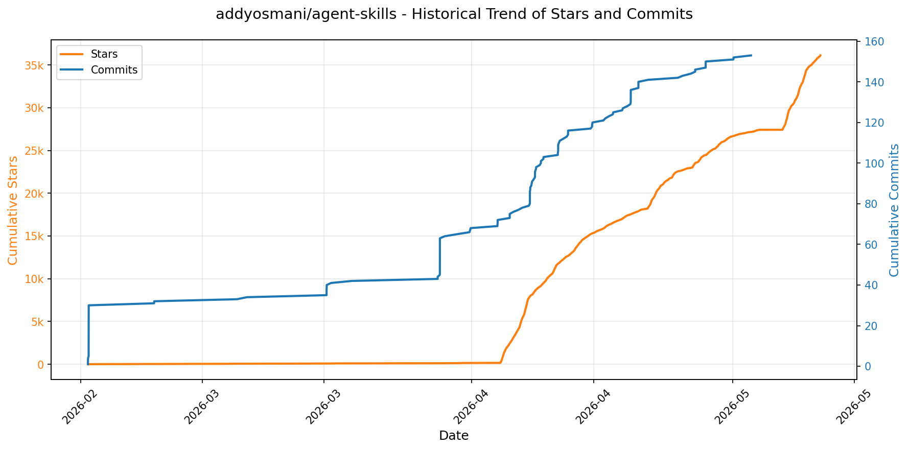
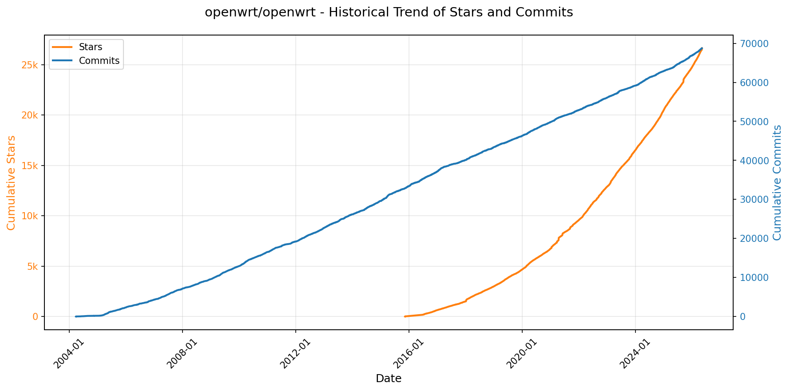
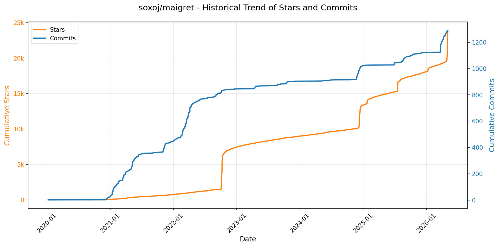
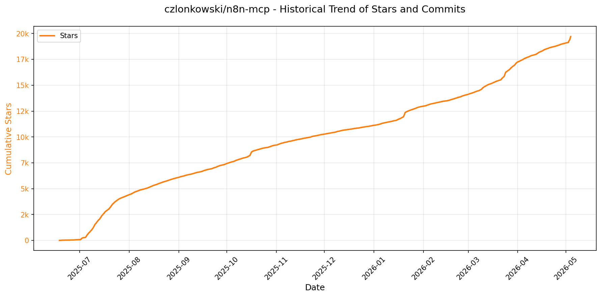
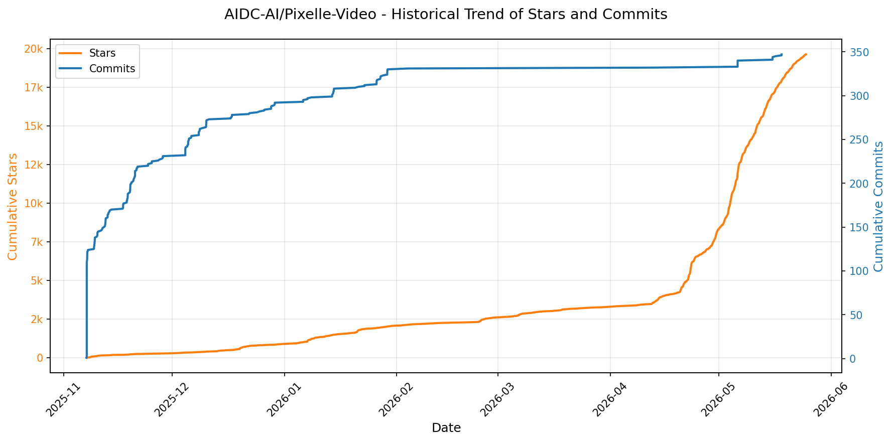
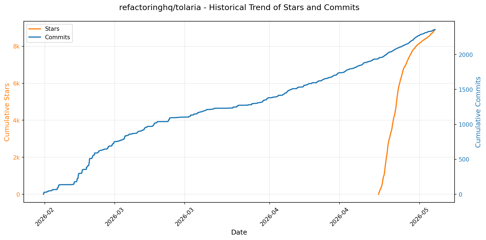
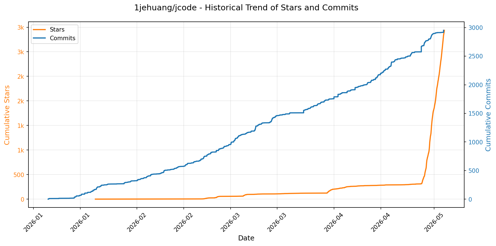
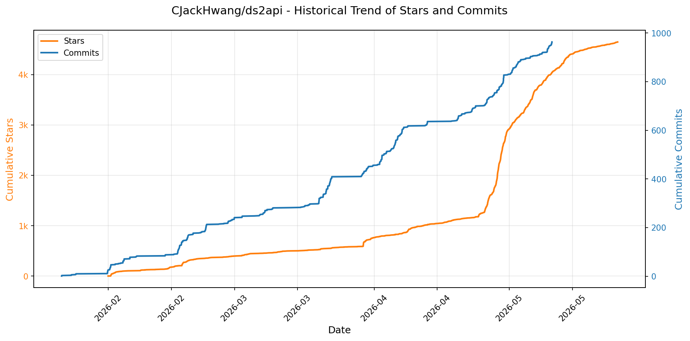
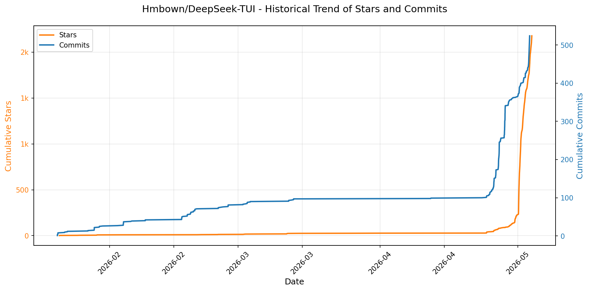
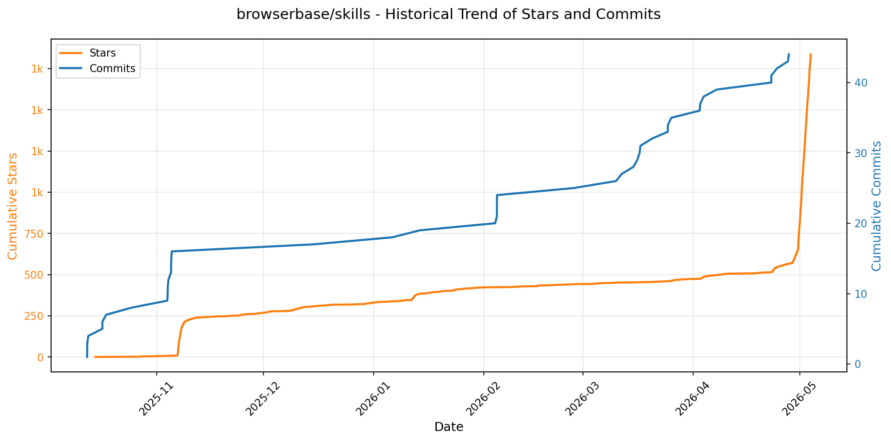

# 🌟 GitHub Trending 概览

> 数据更新于：2026-05-04

---

## 🔍 项目详情

### 1. [microsoft/markitdown](https://github.com/microsoft/markitdown)
- 📅 **创建日期**：2024-11-13  
- 🔄 **最近更新**：2026-05-04  
- ⭐ **Stars**：120,437（日 +345｜周 +2563｜月 +27151）  
- 📝 **描述**：Python tool for converting files and office documents to Markdown.  

<b>📈 Star 与 Commit 历史趋势</b>

> *蓝色：累计 Stars｜橙色：累计 Commits（次 Y 轴）*

<b>📄 README 摘要</b>

1. **项目功能**  
MarkItDown 是一个轻量级 Python 工具，专为将多种格式的文件（如 PDF、Word、PPTX、Excel、图片、音频、HTML、CSV/JSON/XML、ZIP、YouTube 视频、EPUB 等）**批量转换为结构化 Markdown 文本**而设计，核心目标是服务于大语言模型（LLM）及下游文本分析流水线。其输出并非追求高保真排版（如印刷级渲染），而是**精准保留语义结构**（标题、列表、表格、超链接、段落层级等），以提升 LLM 对原始文档内容的理解与处理效率。

2. **关键特性**  
- ✅ **多格式原生支持**：开箱即用支持 10+ 种主流文件类型，包括办公文档（.docx/.pptx/.xlsx）、扫描/电子文档（.pdf）、富媒体（图像 EXIF + OCR、音频元数据 + 转录、YouTube 字幕）、网页（HTML）、结构化数据（CSV/JSON/XML）、压缩包（ZIP 内容遍历）及电子书（EPUB）。  
- ✅ **模块化依赖管理**：通过 `[pdf]`、`[docx]`、`[audio-transcription]` 等可选依赖标签按需安装，避免冗余依赖，提升部署灵活性与安全性。  
- ✅ **插件扩展架构**：内置插件系统（默认禁用），支持第三方扩展；典型插件如 `markitdown-ocr` 利用 LLM Vision（如 GPT-4o）对文档内嵌图片执行 OCR，无需额外 ML 库或二进制依赖。  
- ✅ **企业级增强能力**：原生集成 Azure Document Intelligence（通过 `-d` 参数），提供高精度、高鲁棒性的专业文档解析服务。  
- ✅ **LLM 感知优化**：针对图像描述、音视频转录等场景，支持传入 OpenAI 兼容客户端（`llm_client`）与模型（`llm_model`），实现端到端 LLM 驱动的内容提取。  
- ✅ **安全可控的 API 设计**：提供细粒度转换方法（`convert_local()`、`convert_stream()`、`convert_response()`），强制开发者根据信任边界选择最窄权限接口，降低供应链与路径遍历风险。  
- ✅ **全链路工具支持**：提供命令行（CLI）、Python API、Docker 容器化及管道（pipe）等多种调用方式，适配本地开发、服务端部署与自动化流水线。

3. **技术栈**  
- **核心语言**：Python ≥ 3.10  
- **构建与包管理**：`hatch`（测试/开发环境）、`uv`（推荐的高性能 Python 包管理器）、`pip`、`conda`  
- **关键依赖（按功能）**：  
  - 文档解析：`python-pptx`、`python-docx`、`openpyxl`、`pdfplumber`、`beautifulsoup4`、`lxml`  
  - 多媒体处理：`Pillow`（图像）、`pydub` + `whisper` 或 `openai-whisper`（音频转录）、`yt-dlp`（YouTube 提取）  
  - OCR 与 AI 增强：`openai`（或其他 OpenAI 兼容 SDK）、`markitdown-ocr` 插件（基于 LLM Vision）  
  - 云服务集成：Azure Document Intelligence SDK（`azure-ai-formrecognizer`）  
- **基础设施**：Docker（官方镜像支持）、GitHub Actions（CI/CD）、pre-commit（代码质量检查）  
- **开源协议与治理**：Microsoft 开源行为准则、CLA（贡献者许可协议）管理、Devcontainer 开发环境支持

---

### 2. [forrestchang/andrej-karpathy-skills](https://github.com/forrestchang/andrej-karpathy-skills)
- 📅 **创建日期**：2026-01-27  
- 🔄 **最近更新**：2026-05-04  
- ⭐ **Stars**：99,945（日 +2316｜周 +8802｜月 +92467）  
- 📝 **描述**：A single CLAUDE.md file to improve Claude Code behavior, derived from Andrej Karpathy's observations on LLM coding pitfalls.  

<b>📈 Star 与 Commit 历史趋势</b>

> *蓝色：累计 Stars｜橙色：累计 Commits（次 Y 轴）*

<b>📄 README 摘要</b>

1. **该项目做什么？**  
该项目提供一份轻量、聚焦的工程化指南（`CLAUDE.md`），专为优化 Claude Code（及兼容 LLM 编程代理，如 Cursor）的代码生成行为而设计。它不开发新工具或运行时系统，而是通过结构化原则直接干预大语言模型在编程任务中的推理与执行模式，旨在系统性抑制 LLM 常见的编码缺陷——包括隐式假设、过度设计、非必要修改和目标模糊，从而提升生成代码的准确性、简洁性、可维护性与协作可靠性。

2. **核心功能**  
- **四大可执行原则**：以清晰、可操作的条款定义行为规范——“编码前先思考”（显式暴露不确定性、多方案权衡、主动质疑）、“简洁优先”（严格拒绝未请求的抽象、灵活性、错误处理与冗余逻辑）、“手术式修改”（仅变更用户需求直接关联的代码，保留原有风格与无关内容，仅清理自身引入的冗余）、“目标驱动执行”（将模糊指令转化为带自动化验证环节的声明式成功标准，如“先写失败测试，再修复使其通过”）。  
- **跨平台适配能力**：支持两种部署方式——作为 Claude Code 官方插件（通过 Marketplace 安装）实现全局复用；或以纯文本 `CLAUDE.md` 文件嵌入任意项目，亦原生兼容 Cursor IDE（内置预配置规则文件 `.cursor/rules/karpathy-guidelines.mdc`）。  
- **渐进式集成与定制**：允许无缝合并至现有项目指导文件，并支持添加项目专属约束（如 TypeScript 严格模式、特定错误处理规范等），兼顾通用性与上下文适配性。  
- **效果可衡量**：明确定义“生效标志”——代码变更更精准（diff 更小）、首次实现即简洁、提问前置而非返工、PR 更干净无“顺手重构”。

3. **技术栈**  
- **核心载体**：纯 Markdown 文档（`CLAUDE.md`），零依赖、零运行时，完全基于提示工程（Prompt Engineering）原理。  
- **运行环境**：面向 LLM 编程代理平台——主要适配 **Claude Code**（通过官方插件机制集成）和 **Cursor IDE**（通过其规则系统 `.cursor/rules/` 加载 MDC 格式规则）。  
- **分发与集成方式**：基于 GitHub 托管（静态文件直链 `curl` 下载），使用标准 CLI 工具（`curl`、`echo`）完成项目级注入；插件分发依托 Claude Code 的 `/plugin` 命令行接口。  
- **无后端/无服务**：不涉及服务器、数据库、API 或自定义模型微调，纯粹是面向开发者工作流的轻量级提示策略封装。

---

### 3. [thedotmack/claude-mem](https://github.com/thedotmack/claude-mem)
- 📅 **创建日期**：2025-08-31  
- 🔄 **最近更新**：2026-05-04  
- ⭐ **Stars**：72,686（日 +490｜周 +3728｜月 +27196）  
- 📝 **描述**：A Claude Code plugin that automatically captures everything Claude does during your coding sessions, compresses it with AI (using Claude's agent-sdk), and injects relevant context back into future sessions.  

<b>📈 Star 与 Commit 历史趋势</b>

> *蓝色：累计 Stars｜橙色：累计 Commits（次 Y 轴）*

<b>📄 README 摘要</b>

1. **项目功能**  
Claude-Mem 是一个专为 Anthropic 的 **Claude Code**（及兼容 MCP 协议的 AI 开发环境，如 Gemini CLI、OpenCode、OpenClaw）设计的**持久化记忆压缩系统**。它在用户会话间自动捕获工具调用、代码操作、错误修复等上下文事件，生成语义化摘要，并持久化存储于本地 SQLite 数据库中；新会话启动时，可按需检索并智能注入相关历史记忆，从而实现跨会话的知识连续性与项目上下文延续，显著提升 AI 编程代理的长期推理与协作能力。

2. **核心特性**  
- ✅ **持久记忆（Persistent Memory）**：会话结束后记忆不丢失，自动跨会话恢复上下文；  
- ✅ **渐进式披露（Progressive Disclosure）**：分三层（`search` → `timeline` → `get_observations`）按需加载记忆，严格控制 token 消耗（节省约 10 倍 tokens）；  
- ✅ **技能化搜索（Skill-Based Search）**：内置 `mem-search` 技能，支持自然语言+过滤条件（类型/日期/项目）的混合检索；  
- ✅ **实时 Web 查看器（Web Viewer UI）**：本地 `http://localhost:37777` 提供内存流可视化、观测详情查看、API 接口访问（如 `/api/observation/{id}`）及设置中心；  
- ✅ **多端集成能力**：原生支持 Claude Code 插件、Gemini CLI、OpenCode、OpenClaw 网关（一键脚本安装），并提供 Claude Desktop 技能支持；  
- ✅ **隐私保护机制**：支持 `<private>` 标签标记敏感内容，自动排除存储；  
- ✅ **细粒度上下文配置**：通过 `settings.json` 精确控制注入范围、AI 模型、端口、日志等级等；  
- ✅ **多语言支持**：开箱即用 30+ 语言（含简体中文 `code--zh`、繁体中文、日语等），模式化切换无需额外安装；  
- ✅ **混合搜索架构**：结合 SQLite FTS5 全文检索 + Chroma 向量数据库，实现语义+关键词双模精准召回；  
- ✅ **Beta 实验通道**：支持 Endless Mode（仿生长时记忆架构）等前沿功能快速试用。

3. **技术栈**  
- **运行时**：Node.js ≥18.0.0（主逻辑）、Bun（管理 Worker 服务与 HTTP API）、uv（Python 包管理，用于向量搜索依赖）；  
- **数据库**：SQLite3（嵌入式，含 FTS5 全文索引） + Chroma（轻量级向量数据库，用于语义搜索）；  
- **前端界面**：基于 Bun 运行的本地 Web Server（端口 37777），提供响应式 UI；  
- **插件架构**：深度集成 Claude Agent SDK 与 MCP（Model Context Protocol）标准，通过 6 个生命周期 Hook（SessionStart、UserPromptSubmit、PostToolUse、Stop、SessionEnd 等）实现无感埋点；  
- **开发语言**：TypeScript（主力）、JavaScript；  
- **部署与分发**：npm / npx（`npx claude-mem install` 为主安装方式），支持 CLI 一键安装与插件市场集成；  
- **协议与许可**：AGPL-3.0 开源协议（核心），Ragtime 子模块采用 PolyForm Noncommercial License。

---

### 4. [TauricResearch/TradingAgents](https://github.com/TauricResearch/TradingAgents)
- 📅 **创建日期**：2024-12-28  
- 🔄 **最近更新**：2026-05-04  
- ⭐ **Stars**：59,063（日 +2414｜周 +12254｜月 +18959）  
- 📝 **描述**：TradingAgents: Multi-Agents LLM Financial Trading Framework  

<b>📈 Star 与 Commit 历史趋势</b>

> *蓝色：累计 Stars｜橙色：累计 Commits（次 Y 轴）*

<b>📄 README 摘要</b>

1. **项目功能**  
TradingAgents 是一个面向金融交易研究的开源多智能体（Multi-Agent）框架，旨在模拟真实交易公司的组织结构与决策流程。它利用大语言模型（LLM）构建专业化角色代理（Agents），协同完成从市场信息收集、多维度分析（基本面、情绪、新闻、技术面）、策略辩论、风险评估到最终交易决策的全流程。该框架不提供实盘交易能力，而是为学术研究、算法验证和金融AI方法论探索提供可复现、可扩展、可调试的实验平台，强调可解释性、模块化协作与持续学习（通过决策日志与跨周期经验回溯）。

2. **核心特性**  
- **分层专业化智能体架构**：包含四大职能团队——  
  • *分析师团队*（Fundamentals/Sentiment/News/Technical Analysts）负责异构数据解析；  
  • *研究员团队*（Bullish/Bearish Researchers）开展结构化正反方辩论，平衡收益与风险；  
  • *交易员代理*（Trader Agent）整合分析结论生成具体操作建议（如买入/卖出/持有、仓位比例）；  
  • *风控与组合管理团队*（Risk Manager + Portfolio Manager）执行动态风险评估、策略校准并最终审批执行。  
- **生产级工程能力**：支持断点续跑（LangGraph Checkpoint Resume）、持久化决策日志（含历史表现回溯与反思注入）、跨周期经验迁移（自动将同标的/跨标的过往决策教训注入提示词）。  
- **全栈模型兼容性**：原生支持 OpenAI（GPT-5.x）、Google（Gemini 3.x）、Anthropic（Claude 4.x）、xAI（Grok 4.x）、DeepSeek、Qwen（DashScope）、GLM（Zhipu）、OpenRouter、Ollama（本地模型）及 Azure OpenAI 等十余种 LLM 提供商，并提供统一模型目录与配置抽象。  
- **开箱即用体验**：提供交互式 CLI 工具、Docker 容器化部署（含 Ollama 本地模型支持）、Windows UTF-8 兼容性修复、多语言界面（中/英/日/韩/德/法/西/葡/俄）及完整 Python 包集成（`tradingagents` 模块可直接嵌入用户代码）。

3. **技术栈**  
- **核心框架**：LangGraph（基于状态机的图计算框架，实现多智能体工作流编排与状态持久化）  
- **编程语言**：Python 3.13（官方指定运行环境）  
- **LLM 集成层**：自研统一 API 抽象层，适配 OpenAI、Google Generative AI、Anthropic、XAI、DeepSeek、DashScope（Qwen）、Zhipu（GLM）、OpenRouter、Ollama 及 Azure OpenAI SDK  
- **数据与存储**：Alpha Vantage（行情/基本面数据源）；SQLite（断点检查点存储）；本地 Markdown 文件（决策日志 `trading_memory.md`）  
- **部署与环境**：Docker Compose（标准容器化）、Conda 虚拟环境管理、`.env` 配置驱动（支持企业级凭证分离 `.env.enterprise`）  
- **辅助工具链**：CLI 命令行界面（`tradingagents`）、配置中心（`default_config.py`）、结构化输出（Research Manager/Trader/Portfolio Manager 的标准化响应格式）

---

### 5. [mattpocock/skills](https://github.com/mattpocock/skills)
- 📅 **创建日期**：2026-02-03  
- 🔄 **最近更新**：2026-05-04  
- ⭐ **Stars**：57,181（日 +1874｜周 +32918｜月 +45528）  
- 📝 **描述**：Skills for Real Engineers. Straight from my .claude directory.  

<b>📈 Star 与 Commit 历史趋势</b>

> *蓝色：累计 Stars｜橙色：累计 Commits（次 Y 轴）*

<b>📄 README 摘要</b>

1. **项目功能**  
该项目是一套面向真实软件工程场景的、可即插即用的 AI 编程代理（coding agent）技能集合，旨在解决当前主流编码助手（如 Claude Code、Codex 等）在实际开发中普遍存在的四大核心失败模式：需求对齐偏差、输出冗余低效、代码质量不可靠、系统架构持续退化。它不提供全新 AI 模型或运行时环境，而是通过结构化、工程化的「技能指令」（skills），增强开发者与 AI 代理之间的协作效能，使 AI 成为真正遵循工程原则（如 TDD、领域驱动设计、渐进式重构、反馈闭环）的“工程搭档”。

2. **关键特性**  
- **问题驱动设计**：围绕四大典型失败场景构建技能链，例如 `/grill-me` 和 `/grill-with-docs` 强制前置对齐需求并共建项目专属领域语言（`CONTEXT.md` + ADR），显著提升语义一致性与沟通效率；  
- **工程实践内嵌化**：将经典工程方法论直接转化为可执行技能，如 `/tdd` 实现红-绿-重构闭环、`/diagnose` 封装系统化调试流程、`/improve-codebase-architecture` 主动识别并修复架构腐化；  
- **高度可组合与轻量适配**：所有技能均为独立、小型、模型无关的指令模块，支持按需选取、跨代理部署（如 Cursor、GitHub Copilot、Claude Code 等），且通过 `/setup-matt-pocock-skills` 一键完成仓库级配置（对接 GitHub/Linear、定义标签体系、指定文档路径）；  
- **设计优先导向**：强调日常架构守护，如 `/zoom-out` 强制全局视角理解代码、`/to-prd` 和 `/to-issues` 基于模块边界拆解任务，避免“AI 加速熵增”；  
- **极致效率优化**：提供 `/caveman` 等超压缩通信模式，降低 token 消耗约 75%，兼顾准确性与性能。

3. **技术栈**  
- **核心形态**：纯文本指令集（Markdown 技能定义文件），无服务端、无私有模型依赖；  
- **集成方式**：基于命令行脚本 `skills.sh`（通过 `npx skills@latest` 安装），实现技能包的声明式引入与配置；  
- **运行环境**：完全兼容主流 AI 编程代理工具（如 Cursor、GitHub Copilot、Claude Code 等），技能以自然语言指令形式被代理解析执行；  
- **配套工程资产**：深度依赖并自动化维护工程元数据，包括 `CONTEXT.md`（领域术语词典）、ADR（架构决策记录）、测试套件、类型系统（隐含 TypeScript 最佳实践）、Git 钩子（如 `git-guardrails-claude-code`）及预提交检查（Husky + lint-staged + Prettier + 类型检查 + 测试）；  
- **生态协同**：与 `@total-typescript/shoehorn` 等类型工具链集成，体现强类型优先的工程价值观。

---

### 6. [rtk-ai/rtk](https://github.com/rtk-ai/rtk)
- 📅 **创建日期**：2026-01-22  
- 🔄 **最近更新**：2026-05-04  
- ⭐ **Stars**：40,791（日 +637｜周 +4568｜月 +23821）  
- 📝 **描述**：CLI proxy that reduces LLM token consumption by 60-90% on common dev commands. Single Rust binary, zero dependencies  

<b>📈 Star 与 Commit 历史趋势</b>

> *蓝色：累计 Stars｜橙色：累计 Commits（次 Y 轴）*

<b>📄 README 摘要</b>

1. **项目功能**  
RTK（Rust Token Killer）是一个高性能命令行代理工具，专为AI编程助手（如Claude Code、GitHub Copilot、Cursor等）设计，通过在命令执行前对Shell输出进行智能过滤与压缩，显著降低大语言模型（LLM）上下文中的Token消耗。它不修改用户输入或LLM逻辑，而是透明拦截并重写Bash命令（如 `git status` → `rtk git status`），将原始高冗余输出（如完整`git diff`、`cargo test`日志）转换为紧凑、语义保留的摘要形式，从而在典型30分钟编码会话中实现**60–90%的Token节省**（实测总节省约80%，从118,000 tokens降至23,900 tokens）。

2. **核心特性**  
- ✅ **全自动Bash钩子（Auto-Rewrite Hook）**：`rtk init -g`一键注入预执行钩子，实现100%命令透明重写，零手动干预；  
- ✅ **100+原生支持命令**：覆盖文件操作（`ls`/`cat`/`grep`）、Git、GitHub CLI、主流测试框架（`pytest`/`cargo test`/`go test`）、构建/格式化工具（`ruff`/`prettier`/`tsc`）、包管理器（`pnpm`/`pip`/`bundler`）、云服务（AWS CLI）、容器（Docker/Kubectl）、数据处理（`json`/`curl`/`log`）等全栈开发场景；  
- ✅ **四层智能压缩策略**：针对不同命令类型动态应用**智能过滤**（去注释/空行/样板）、**分组聚合**（按目录/错误类型归类）、**上下文感知截断**（保留关键行，裁剪冗余）、**去重计数**（合并重复日志并标注频次）；  
- ✅ **细粒度控制与可观测性**：提供`rtk gain`系列命令（图表/历史/每日统计/JSON导出）、`rtk discover`自动识别未优化机会、`rtk session`追踪跨会话采用率；  
- ✅ **多平台与多AI工具深度集成**：原生支持12种AI编码工具（Claude Code、Copilot、Gemini、Cursor、Windsurf等），含WSL全功能支持及Windows原生CLI兼容模式；  
- ✅ **隐私优先遥测（可选）**：仅在明确授权后收集匿名聚合数据（设备哈希、命令类别分布、节省量等），**绝不采集代码、路径、参数、密钥或任何敏感内容**，支持随时禁用与数据擦除。

3. **技术栈**  
- **主语言**：Rust（单二进制、零运行时依赖、内存安全、极致性能，<10ms执行开销）；  
- **构建与分发**：Cargo（源码安装）、GitHub Actions（CI/CD与安全扫描）、Homebrew（macOS/Linux）、预编译Musl/GNU/MSVC二进制（跨平台支持x86_64/aarch64）；  
- **配置系统**：TOML格式配置文件（`~/.config/rtk/config.toml`），支持命令排除、tee日志策略等；  
- **架构模式**：CLI代理架构，无网络服务依赖，纯本地处理；钩子机制基于Shell `preexec`/`DEBUG`陷阱或各AI工具插件API（如Claude的PreToolUse、Cursor的hooks.json）；  
- **附加技术**：NDJSON输出（Go测试）、自定义解析器（Git/AWS/测试日志）、ASCII可视化（`rtk gain --graph`）、环境变量与路径管理（`~/.local/bin`适配）。

---

### 7. [Z4nzu/hackingtool](https://github.com/Z4nzu/hackingtool)
- 📅 **创建日期**：2020-04-11  
- 🔄 **最近更新**：2026-05-04  
- ⭐ **Stars**：40,237（日 +463｜周 +5335｜月 +13489）  
- 📝 **描述**：ALL IN ONE Hacking Tool For Hackers  

<b>📈 Star 与 Commit 历史趋势</b>

> *蓝色：累计 Stars｜橙色：累计 Commits（次 Y 轴）*

<b>📄 README 摘要</b>

1. **项目功能**  
该工具是一个面向安全研究人员与渗透测试人员的“一站式”渗透测试集成平台，本质是**高度封装的开源安全工具聚合器与自动化管理器**。它不直接实现攻击逻辑，而是通过统一命令行界面（CLI）对185+个主流安全工具进行分类组织、状态监控、一键安装/更新/启动，并提供智能交互能力（如自然语言式推荐、关键词搜索、标签过滤），大幅降低多工具协同使用的复杂度，提升渗透测试工作流效率。

2. **核心特性**  
- **全类别覆盖**：涵盖20大渗透测试领域（含新增的Active Directory、Cloud Security、Mobile Security），覆盖从信息收集、无线攻击、Web漏洞利用到云安全、移动应用分析等完整攻防链条；  
- **智能交互体验**：支持 `/` 全局搜索、`t` 标签过滤（19类标签如osint/web/c2/cloud）、`r` 自然语言推荐（如输入“I want to scan a network”自动匹配nmap等工具）、实时安装状态标识（✔/✘）、批量安装（选项97）及智能更新（自动识别git/pip/go安装方式）；  
- **跨平台自适应**：自动检测操作系统（Linux/Kali/Parrot/macOS），隐藏不兼容工具（如仅Linux可用工具在macOS中不可见）；  
- **开发友好架构**：模块化设计（每个工具封装为独立Python类），支持通过Issue或PR便捷贡献新工具；  
- **容器化支持**：提供Dockerfile与docker-compose配置，本地构建镜像，避免依赖外部不可信镜像；  
- **极简部署**：支持一行命令安装（`curl | sudo bash`），自动处理依赖、虚拟环境与快捷入口。

3. **技术栈**  
- **主语言**：Python 3.10+（核心框架、CLI界面、工具调度与状态管理）；  
- **关键依赖运行时**：Go 1.21+（用于编译/运行 nuclei、ffuf、amass 等Go语言工具）、Ruby（支持 haiti、evil-winrm 等工具）；  
- **容器化**：Docker（构建、运行、开发模式热重载）；  
- **前端/交互**：纯终端CLI（无GUI），基于Python标准库实现菜单导航与用户输入解析；  
- **基础依赖**：pip（管理Python包）、git（工具克隆与更新）、系统级包管理器（apt/brew等，由install.py自动调用）。

---

### 8. [ruvnet/ruflo](https://github.com/ruvnet/ruflo)
- 📅 **创建日期**：2025-06-02  
- 🔄 **最近更新**：2026-05-04  
- ⭐ **Stars**：39,524（日 +2268｜周 +5685｜月 +9827）  
- 📝 **描述**：🌊 The leading agent orchestration platform for Claude. Deploy intelligent multi-agent swarms, coordinate autonomous workflows, and build conversational AI systems. Features    enterprise-grade architecture, self-learning swarm intelligence, RAG integration, and native Claude Code / Codex Integration  

<b>📈 Star 与 Commit 历史趋势</b>

> *蓝色：累计 Stars｜橙色：累计 Commits（次 Y 轴）*

<b>📄 README 摘要</b>

1. **该项目做什么？**  
Ruflo 是一个面向 Anthropic Claude Code 的多智能体 AI 编排平台，核心目标是为 Claude Code 注入“类神经系统”，使其从单点式 AI 工具升级为可协同、自学习、跨边界协作的智能体集群（agent swarm）。它使开发者无需修改现有工作流——在 `init` 后即可继续正常使用 Claude Code，而 Ruflo 在后台自动完成：任务智能路由、百级专业化 AI 智能体（编码、测试、安全、架构等）的动态编排与协作、跨会话持久化向量记忆、联邦式跨机器/跨组织安全通信，以及基于执行轨迹的自主学习与优化。本质是将分散的 AI 能力整合为具备集体认知、持续进化和企业级可信协作能力的 AI 操作系统。

2. **关键特性**  
- **多智能体协同编排（Swarm Coordination）**：支持分层（Queen-led）、网状（mesh）、自适应拓扑结构，内置 Raft/拜占庭/八卦（gossip）共识机制，实现智能体集群的统一调度与任务分解。  
- **自学习与自优化（Self-Learning Architecture）**：基于 SONA（Self-Optimizing Neural Architecture）神经模式、ReasoningBank 与轨迹学习闭环，智能体从成功任务中自动提炼策略并持续提升决策准确率（如任务路由达 89% 准确率）。  
- **零信任联邦通信（Zero-Trust Federation）**：跨设备、跨组织、跨云环境的智能体安全协作框架，集成 mTLS + ed25519 身份认证、14 类 PII 自动检测与分级脱敏（BLOCK/REDACT/HASH）、行为驱动的动态信任评分（实时升降级）及 HIPAA/SOC2/GDPR 合规审计日志。  
- **高性能向量记忆系统（Persistent Vector Memory）**：基于 HNSW 索引的 AgentDB，检索速度较暴力搜索提升 150×–12,500×，支持长期记忆存储、语义检索、图谱跳转与多样性排序，支撑 RAG、知识图谱与记忆回溯。  
- **全栈插件化生态（32+ 原生插件 + 21 npm 插件）**：覆盖核心编排（swarm/autopilot/federation）、智能增强（ruvLLM/GOAP 规划）、开发质量（testgen/browser/jujutsu）、安全合规（security-audit/aidence）、领域专用（IoT-cognitum/neural-trader）等全场景能力，全部原生集成于 Claude Code。  
- **多模态交互界面**：提供三大入口——CLI（命令行）、Web UI Beta（[flo.ruv.io](https://flo.ruv.io/)，支持并行 MCP 工具调用、6 大前沿模型、浏览器内 WASM 工具集）、Goal Planner（[goal.ruv.io](https://goal.ruv.io/)，基于 GOAP A\* 的目标导向自主规划与可视化代理看板）。

3. **技术栈**  
- **核心运行时与策略引擎**：Rust（WASM 内核，保障高性能、内存安全与可移植性），用于实现策略引擎、嵌入向量计算、零知识证明系统及底层通信协议。  
- **前端与 UI 层**：Svelte（Web UI [flo.ruv.io](https://flo.ruv.io/)）、React（Goal Planner [goal.ruv.io](https://goal.ruv.io/)）、Vite（Goal UI 构建工具）、Supabase（后端服务）。  
- **后端与服务架构**：Node.js（CLI 与 MCP 服务器）、MongoDB（嵌入式/自托管 Web UI 数据库）、Docker（全栈容器化部署，含多阶段构建与 Cloud Run/Fly 支持）。  
- **AI 与智能层**：多 LLM 接入（Claude / GPT / Gemini / Cohere / Ollama），智能路由与 failover；本地轻量模型 ruvLLM（基于 MicroLoRA 与 SONA）；向量数据库 AgentDB（HNSW 索引）；知识图谱引擎；GOAP 规划器（A\* 状态空间搜索）。  
- **协议与标准**：Model Context Protocol（MCP）作为统一工具调用协议；WASM 用于沙箱化智能体执行；ed25519/mTLS 实现联邦身份认证；OpenRouter 兼容所有 OpenAI API 标准后端（vLLM/Ollama/LM Studio/Groq 等）。

---

### 9. [abhigyanpatwari/GitNexus](https://github.com/abhigyanpatwari/GitNexus)
- 📅 **创建日期**：2025-08-02  
- 🔄 **最近更新**：2026-05-04  
- ⭐ **Stars**：35,557（日 +483｜周 +5022｜月 +14020）  
- 📝 **描述**：GitNexus: The Zero-Server Code Intelligence Engine -       GitNexus is a client-side knowledge graph creator that runs entirely in your browser. Drop in a GitHub repo or ZIP file, and get an interactive knowledge graph wit a built in Graph RAG Agent. Perfect for code exploration  

<b>📈 Star 与 Commit 历史趋势</b>

> *蓝色：累计 Stars｜橙色：累计 Commits（次 Y 轴）*

<b>📄 README 摘要</b>

1. **项目功能**  
GitNexus 是一个面向 AI 编程代理（AI agents）的代码知识图谱基础设施，核心目标是为大模型驱动的开发工具构建“代码神经中枢”。它通过深度解析任意代码库（支持多种语言），自动构建包含**全部依赖关系、调用链、执行流程、模块聚类与架构层次**的结构化知识图谱；该图谱不依赖自然语言描述，而是基于程序语义的精确关系建模。其输出直接赋能 AI 编程工具（如 Claude Code、Cursor、Codex 等），使其具备真正的代码上下文感知能力——能准确识别影响范围、追踪跨文件调用、避免破坏依赖、生成可靠重构建议，并在多仓库场景下实现统一架构分析。

2. **关键特性**  
- **双模态使用范式**：提供轻量级 Web UI（浏览器端图谱可视化+聊天探索）与生产级 CLI+MCP（Model Context Protocol）集成方案，后者为 AI 代理提供 16 个标准化 MCP 工具（含单库/多库能力）及资源 URI 协议（`gitnexus://`）。  
- **本地优先与隐私保障**：全栈离线运行（CLI 默认完全本地，Web UI 使用 WASM 在浏览器内存中处理），无代码上传、无网络外传；企业版支持私有部署。  
- **智能架构理解能力**：支持 blast radius 分析（变更影响预测）、多文件协同重命名、Cypher 图查询、Leiden 社区检测自动生成模块化技能（SKILL.md）、执行流追踪（process tracing）及跨仓库服务契约匹配（group contracts）。  
- **无缝编辑器集成**：开箱即用支持 Claude Code（含 Pre/Post ToolUse 钩子自动刷新索引）、Cursor、Codex、Windsurf、OpenCode；一键 `gitnexus setup` 自动配置 MCP。  
- **企业级扩展能力**：SaaS 或自托管企业版提供 PR 自动影响分析、实时更新的代码 Wiki、多仓库统一图谱、OCaml 支持、自动重索引及商业授权。  
- **桥接模式（Bridge Mode）**：`gitnexus serve` 启动本地 HTTP 服务，使 Web UI 可直接访问 CLI 已索引的所有仓库，无需重复上传或解析。  
- **Docker 官方支持**：提供签名认证的双镜像（CLI/server + Web UI），含 `docker-compose` 一键部署方案与持久化数据卷管理。

3. **技术栈**  
- **核心引擎**：LadybugDB（高性能嵌入式图数据库，原生版用于 CLI，WASM 版用于 Web UI）；Tree-sitter（原生绑定用于 CLI 高性能解析，WASM 版用于浏览器端解析）。  
- **协议与标准**：MCP（Model Context Protocol）作为 AI 代理与代码知识交互的标准接口；遵循 PolyForm Noncommercial 开源许可证（商业用途需企业许可）。  
- **前端**：TypeScript + Vite + Mermaid（架构图渲染）；Web UI 完全客户端运行，依赖 WASM 版 LadybugDB 和 Tree-sitter。  
- **后端/CLI**：Node.js（TypeScript）；CLI 命令行工具与 MCP server（`gitnexus mcp`/`gitnexus serve`）均基于 Node 运行时；索引数据存储于各仓库 `.gitnexus/` 目录（Git 忽略）及全局 `~/.gitnexus/registry.json`。  
- **部署与运维**：Docker（GHCR/Docker Hub 双镜像）、Cosign 签名验证；支持环境变量精细化控制（如超时、字节限制）；提供完整开发文档（ARCHITECTURE.md、RUNBOOK.md、GUARDRAILS.md 等）。

---

### 10. [addyosmani/agent-skills](https://github.com/addyosmani/agent-skills)
- 📅 **创建日期**：2026-02-15  
- 🔄 **最近更新**：2026-05-04  
- ⭐ **Stars**：27,460（日 +243｜周 +3596｜月 +27304）  
- 📝 **描述**：Production-grade engineering skills for AI coding agents.  

<b>📈 Star 与 Commit 历史趋势</b>

> *蓝色：累计 Stars｜橙色：累计 Commits（次 Y 轴）*

<b>📄 README 摘要</b>

1. **该项目的作用**  
该项目为AI编程智能体（AI coding agents）提供一套面向生产环境的工程化能力框架，旨在将资深工程师在真实软件开发中遵循的工作流、质量门禁和最佳实践系统性地编码为可被AI代理理解、调用并严格执行的标准化技能（Skills）。它不提供运行时引擎或模型，而是通过结构化Markdown文档（`SKILL.md`）定义20个覆盖全研发生命周期（Define → Plan → Build → Verify → Review → Ship）的可执行工作流，确保AI在生成代码、设计API、编写测试、审查PR、部署上线等各环节均遵循工程严谨性，而非仅追求“最短路径”或“表面正确”。

2. **核心特性**  
- **7个生命周期命令驱动**：提供`/spec`、`/plan`、`/build`、`/test`、`/review`、`/code-simplify`、`/ship`七个斜杠命令，自动激活对应阶段的核心技能，实现语义化、阶段化的智能体协作。  
- **20个原子化、可验证技能**：每个技能均为独立、自包含的工程工作流（如`test-driven-development`、`security-and-hardening`），含明确步骤、退出条件、反合理化表（驳斥常见跳步借口）、红标预警项及强制性证据要求（如测试通过日志、DevTools截图、CI流水线结果）。  
- **上下文感知自动触发**：技能不仅响应命令，还可基于开发行为自动激活（如识别API设计时触发`api-and-interface-design`，检测UI开发时启用`frontend-ui-engineering`）。  
- **多平台原生兼容**：预置对Claude Code、Cursor、Gemini CLI、Windsurf、OpenCode、GitHub Copilot、Kiro等主流AI编程工具的适配方案（含插件安装、规则目录配置、指令注入等），技能本身为纯Markdown，具备极强可移植性。  
- **工程化设计哲学深度嵌入**：所有技能内化Google级工程实践，包括Hyrum’s Law、Beyoncé Rule（测试命名）、Chesterton’s Fence（简化前必问“为何存在”）、Trunk-Based Development、Shift Left、One-Version Rule、OWASP Top 10防护等，并以具体步骤而非抽象原则呈现。  
- **渐进式信息加载与低开销**：采用“主技能文档+按需加载参考清单”架构（如`testing-patterns.md`仅在`/test`时载入），显著降低上下文token消耗。

3. **技术栈**  
- **核心格式**：纯文本Markdown（`.md`），无依赖运行时，本质是结构化提示工程（Prompt Engineering）的工业化封装。  
- **组织范式**：基于YAML Frontmatter的标准化技能元数据 + 四段式内容结构（Overview / When to Use / Process / Rationalizations / Red Flags / Verification）。  
- **集成层**：针对不同AI IDE/CLI提供适配器配置：  
  - Claude Code：`.claude/commands/` 目录下的命令映射；  
  - Gemini CLI：`gemini skills install` 命令支持远程/本地技能包安装；  
  - Cursor：直接复用`.cursor/rules/`规则目录；  
  - GitHub Copilot：通过`.github/copilot-instructions.md`注入技能内容，配合`agents/`中的角色定义；  
  - 其他工具（Windsurf、Kiro、Codex等）均通过文档指引完成规则/指令/上下文配置。  
- **辅助资产**：4份高频引用检查清单（安全、性能、可访问性、测试模式）、3个专家角色Persona（代码审查员、测试工程师、安全审计员）、会话生命周期钩子（`hooks/`）及详尽的多工具Setup文档（`docs/`）。  
- **许可协议**：MIT License，允许自由使用、修改与分发。

---

### 11. [openwrt/openwrt](https://github.com/openwrt/openwrt)
- 📅 **创建日期**：2015-11-09  
- 🔄 **最近更新**：2026-05-04  
- ⭐ **Stars**：26,626（日 +137｜周 +203｜月 +538）  
- 📝 **描述**：This repository is a mirror of https://git.openwrt.org/openwrt/openwrt.git It is for reference only and is not active for check-ins.  We will continue to accept Pull Requests here. They will be merged via staging trees then into openwrt.git.  

<b>📈 Star 与 Commit 历史趋势</b>

> *蓝色：累计 Stars｜橙色：累计 Commits（次 Y 轴）*

<b>📄 README 摘要</b>

1. **该项目做什么？**  
OpenWrt 是一个面向嵌入式设备（如家用路由器、网关等）的 Linux 操作系统发行版。它不提供固定、不可修改的固件镜像，而是构建一个**完全可写的根文件系统**，并集成轻量级包管理器 `opkg`。其核心目标是打破厂商预置固件的限制，使用户和开发者能自由安装、卸载、更新软件包，按需定制设备功能——既可用于部署特定网络应用（如 mesh 路由、视频流服务），也可作为嵌入式应用开发框架，无需从零构建完整固件。

2. **关键特性**  
- ✅ **可写文件系统**：摆脱只读 squashfs 限制，支持持久化配置与动态扩展；  
- ✅ **模块化包管理（opkg）**：支持在线安装/升级数千个预编译软件包（含网络、安全、开发、多媒体等类别）；  
- ✅ **高度可定制构建系统**：通过 `make menuconfig` 灵活选择目标平台、内核选项、工具链及软件包组合；  
- ✅ **多仓库协同生态**：主固件库与专用子仓库解耦（如 LuCI Web 界面、packages 社区包、routing 路由增强、video 显示支持）；  
- ✅ **跨平台构建支持**：可在 GNU/Linux、BSD 或 macOS（需大小写敏感文件系统）上编译，提供 SDK 和 Toolchain 供二次开发；  
- ✅ **设备兼容性广**：官方维护[硬件数据库](https://openwrt.org/supported_devices)，覆盖主流 SoC（MTK、Qualcomm、Realtek、Ralink 等）及数百款商用路由器。

3. **技术栈**  
- **操作系统内核**：Linux（长期支持 LTS 版本为主，适配嵌入式场景优化）；  
- **构建系统**：基于 GNU Make 的自研构建框架（含 `feeds` 机制管理外部包源），依赖 `gcc`（≥6.0）、`gawk`、`python3.7+`、`perl`、`flex`、`bison` 等标准 GNU 工具链；  
- **包管理**：`opkg`（轻量级嵌入式包管理器，兼容 IPK 格式）；  
- **Web 管理界面**：LuCI（Lua + HTML/JS 构建，模块化架构，支持主题与插件）；  
- **主要编程语言**：C（内核/底层驱动/核心工具）、Lua（LuCI 逻辑）、Shell（构建脚本/系统服务）、Python（部分构建辅助与测试工具）；  
- **基础设施与协作**：Git 分布式版本控制、OFTC IRC 社区通信、Bugzilla 缺陷跟踪、邮件列表（openwrt-devel）用于补丁提交。

---

### 12. [soxoj/maigret](https://github.com/soxoj/maigret)
- 📅 **创建日期**：2020-06-27  
- 🔄 **最近更新**：2026-05-04  
- ⭐ **Stars**：23,900（日 +1078｜周 +4263｜月 +4620）  
- 📝 **描述**：🕵️‍♂️ Collect a dossier on a person by username from 3000+ sites  

<b>📈 Star 与 Commit 历史趋势</b>

> *蓝色：累计 Stars｜橙色：累计 Commits（次 Y 轴）*

<b>📄 README 摘要</b>

1. **项目功能**  
Maigret 是一款开源的 OSINT（开源情报）工具，仅凭一个用户名即可自动在数千个网站上搜索并关联该用户注册的账号，构建其数字身份档案。它无需任何 API 密钥，通过网页爬取与解析直接提取公开信息（如个人简介、头像、关联链接、社交关系等），并支持递归搜索——利用新发现的用户名、邮箱、ID 等线索持续扩展调查范围。最终生成结构化报告（HTML/PDF/XMind/CSV/JSON/Graph 等格式），用于人肉搜索、威胁情报、社工分析或数字足迹测绘。

2. **核心特性**  
- 支持 **3000+ 个网站**（含主流社交平台、论坛、博客、暗网 `.onion`/`.i2p` 站点），默认扫描流量最高的 500 个站点，可通过 `-a` 全量扫描或 `--tags` 按类别（如 `photo`、`dating`）或国家（如 `us`）精准过滤；  
- 内置智能反检测机制，可部分绕过 WAF、IP 封禁、CAPTCHA 及地理封锁，支持 Tor/I2P/HTTP/SOCKS 代理；  
- 自动从 GitHub 动态拉取并缓存站点数据库（24 小时更新一次），离线时自动回退至内置数据库；  
- 提供命令行（CLI）、Web 图形界面（D3 可视化图谱 + 一键导出全格式报告）、Telegram 机器人、云环境（Colab/Binder/Cloud Shell）及 Python 库集成五种使用方式；  
- 支持高级功能：`--parse` 解析任意 URL 提取 ID 并递归搜索、`--permute` 自动生成用户名变体（如 `john.doe` → `johndoe`）、`--self-check` 校验站点检测逻辑准确性。

3. **技术栈**  
- **语言与运行时**：Python 3.10+（核心实现）；  
- **网络与异步**：`aiohttp`（异步 HTTP 客户端）、`requests`（同步备用）、`beautifulsoup4` / `lxml`（HTML 解析）、`selenium`（可选，应对 JavaScript 渲染页面）；  
- **数据处理**：`json` / `csv` / `ndjson`（结构化输出）、`reportlab`（PDF 生成）、`xmind`（XMind 8 导出）、`networkx` + `plotly`/`D3.js`（图谱可视化）；  
- **部署与分发**：PyPI 包管理、Docker（CLI 与 Web 两种镜像）、Windows 独立 EXE、Jupyter/Colab/Binder 云环境兼容；  
- **基础设施**：GitHub Actions（CI/CD）、自动更新的 `data.json` 站点配置库、`socid_extractor`（专用信息抽取子模块）。

---

### 13. [HKUDS/DeepTutor](https://github.com/HKUDS/DeepTutor)
- 📅 **创建日期**：2025-12-28  
- 🔄 **最近更新**：2026-05-04  
- ⭐ **Stars**：23,173（日 +149｜周 +1112｜月 +12260）  
- 📝 **描述**："DeepTutor: Agent-Native Personalized Learning Assistant"  

<b>📈 Star 与 Commit 历史趋势</b>

> *蓝色：累计 Stars｜橙色：累计 Commits（次 Y 轴）*

<b>📄 README 摘要</b>

1. **该项目的功能**  
DeepTutor 是一个面向教育场景的**代理原生（Agent-Native）个性化智能辅导系统**，旨在将大语言模型（LLM）与多智能体架构深度融合，为用户提供贯穿学习全生命周期的自适应支持。它不局限于单轮问答，而是构建了一个可持久化、上下文连贯、能力可扩展的学习智能体生态：用户可通过统一界面进行对话式学习、深度解题（Deep Solve）、自动生成测验、交互式知识研究（Deep Research）、数学动态推演（Math Animator）和概念可视化（Visualize）；可将零散资料编译为结构化、可交互的“活教材”（Living Book）；可上传文档构建私有知识库（RAG），并基于此生成问题、撰写笔记、辅助写作（Co-Writer）；更核心的是，它支持创建长期存续、具备独立记忆与人格特征的自主式AI导师——TutorBot，实现真正个性化的、演进式的陪伴式教学。

2. **关键特性**  
- **六模一体统一聊天工作区**：Chat、Deep Solve、Quiz Generation、Deep Research、Math Animator、Visualize 六种学习模式共享同一上下文线程，无缝切换，全程状态不丢失。  
- **AI协同写作（Co-Writer）**：多文档 Markdown 协作空间，支持选中文本进行重写、扩写、摘要，并自动关联知识库与网络信息，输出反哺学习闭环。  
- **活教材引擎（Book Engine）**：多智能体驱动的教材生成系统，自动设计大纲、检索资料、编译含14种内容模块（如测验、时间轴、概念图、交互Demo）的富媒体交互页面。  
- **知识中枢（Knowledge Hub）**：支持 PDF/DOCX/XLSX/PPTX/Markdown 等格式上传，构建 RAG 就绪型知识库；提供颜色标记笔记本、结构化题库（Question Bank）及用户自定义“技能”（Skills）系统，使知识主动参与所有交互。  
- **持久化记忆（Persistent Memory）**：跨功能、跨 TutorBot 的统一用户学习画像，持续记录学习轨迹、认知偏好与成长目标，随交互不断优化。  
- **自主导师（TutorBot）**：非传统聊天机器人，而是拥有独立工作区、专属记忆、可配置人格与技能集、能自主设提醒/学新能力/持续演化的自治 AI 导师（基于 nanobot 框架）。  
- **代理原生命令行接口（CLI）**：所有能力（Capabilities）、知识库、会话、TutorBot 均可通过命令行调用，输出兼顾人类可读性（富文本）与机器可解析性（JSON），支持 AI 代理自动化集成（如通过 `SKILL.md` 定义并执行任务）。

3. **技术栈**  
- **后端核心**：Python 3.11+，采用模块化、插件化设计（Tools + Capabilities 模型），深度集成多种 LLM/Embedding/Search 提供商（OpenAI、Anthropic、Gemini、DeepSeek、Ollama、vLLM、LM Studio、Qwen、Minimax 等超30家），支持本地部署与云服务混合调度。  
- **前端框架**：Next.js 16（React 19），提供现代化 Web UI，支持暗色主题、WebSocket 实时通信、会话快照、多语言国际化（含简体中文等10+语言）。  
- **AI基础设施层**：  
  - RAG：支持多管道、版本化知识索引、自动嵌入发现与适配器扩展、强韧的重索引与向量修复机制；  
  - 文档解析：集成 Docling、MinerU 等先进解析器，支持复杂 PDF/Office 文档结构提取；  
  - 可视化：Chart.js、SVG、Mermaid、Manim（数学动画）；  
  - 数学能力：LaTeX 渲染、符号计算增强、Math Animator 动态推演；  
- **部署与运维**：Docker 支持、GitHub Actions CI/CD、预构建镜像（GHCR）、环境变量驱动配置、跨平台兼容（Windows/macOS/Linux，含 GBK/IME/Visual Studio Build Tools 专项适配）。  
- **协议与许可**：Apache License 2.0 开源协议。

---

### 14. [shiyu-coder/Kronos](https://github.com/shiyu-coder/Kronos)
- 📅 **创建日期**：2025-07-01  
- 🔄 **最近更新**：2026-05-04  
- ⭐ **Stars**：22,690（日 +128｜周 +1014｜月 +11282）  
- 📝 **描述**：Kronos: A Foundation Model for the Language of Financial Markets  

<b>📈 Star 与 Commit 历史趋势</b>

> *蓝色：累计 Stars｜橙色：累计 Commits（次 Y 轴）*

<b>📄 README 摘要</b>

1. **项目功能**  
Kronos 是首个面向金融K线（蜡烛图）数据的开源基础模型，专为理解与建模金融市场的“时序语言”而设计。它将多维金融时序数据（OHLCV：开盘价、最高价、最低价、收盘价、成交量、成交额）视为一种特殊“语言”，通过预训练实现对金融时间序列的通用建模能力，支持多种量化任务，核心应用场景包括：高精度多步K线预测（如BTC/USDT未来24小时价格走势）、跨资产批量预测、以及面向特定市场（如A股）的领域微调与策略回测。

2. **关键特性**  
- **首创金融K线专用基础模型架构**：采用两阶段范式——先由自研分层离散化Tokenizer将连续高噪声OHLCV数据量化为语义丰富的离散token，再基于Decoder-only Transformer进行大规模自回归预训练；  
- **多尺度模型族支持灵活部署**：提供Kronos-mini（4.1M参数）、small（24.7M）、base（102.3M）三款完全开源模型，覆盖轻量级推理到中等规模任务；large版本（499.2M）暂未开源；  
- **开箱即用的端到端预测接口**：`KronosPredictor`封装数据归一化、token化、预测、逆归一化全流程，支持单序列预测与GPU加速的批量并行预测（`predict_batch`），输入仅需含标准列（open/high/low/close）的DataFrame及时间戳；  
- **完整微调与量化落地管线**：提供基于Qlib的A股市场微调示例，涵盖数据预处理、Tokenizer微调、Predictor微调、以及带信号生成与简单Top-K策略的回测评估，同时明确提示生产级应用需补充风险中性化、交易成本建模等关键环节；  
- **开放生态与实时演示**：模型全部托管于Hugging Face Hub，配套上线BTC实时预测交互式Demo，并支持多语言文档（含中文）。

3. **技术栈**  
- **模型架构**：Decoder-only Transformer（类似GPT系列），自研分层离散Tokenizer（支持2k与base两种配置）；  
- **训练框架**：PyTorch，支持`torchrun`多GPU分布式训练；  
- **依赖库**：核心依赖包括`transformers`、`datasets`、`pandas`、`numpy`、`matplotlib`；微调流程深度集成微软`Qlib`量化平台用于A股数据处理与回测；  
- **部署与工具链**：基于Hugging Face `from_pretrained`标准接口加载模型；预测模块兼容CPU/GPU；可视化使用`matplotlib`；实验跟踪可选Comet.ml；  
- **数据规范**：输入严格要求OHLCV格式时序数据（CSV/Parquet），时间戳需为`datetime`类型，支持分钟级至日级频率。

---

### 15. [google-ai-edge/gallery](https://github.com/google-ai-edge/gallery)
- 📅 **创建日期**：2025-03-31  
- 🔄 **最近更新**：2026-05-04  
- ⭐ **Stars**：22,616（日 +66｜周 +460｜月 +6736）  
- 📝 **描述**：A gallery that showcases on-device ML/GenAI use cases and allows people to try and use models locally.  

<b>📈 Star 与 Commit 历史趋势</b>

> *蓝色：累计 Stars｜橙色：累计 Commits（次 Y 轴）*

<b>📄 README 摘要</b>

1. **项目功能**  
Google AI Edge Gallery 是一款面向移动端的开源应用，旨在让用户在**完全离线、隐私安全的前提下**，直接在手机设备上运行高性能开源大语言模型（LLMs）和多模态模型。它提供端到端的本地AI体验，支持文本对话、图像理解、语音转写与翻译、智能代理任务执行、模型性能基准测试等核心能力，使用户无需联网、不上传数据即可体验前沿生成式AI技术。

2. **关键特性**  
- **Agent Skills（智能代理技能）**：通过集成维基百科检索、交互式地图、可视化摘要卡片等工具，将基础LLM升级为可主动调用外部能力的智能助手；支持从URL加载模块化技能或参与社区贡献。  
- **AI Chat + Thinking Mode（思考模式）**：支持多轮对话，并可开启“思考模式”实时查看模型分步推理过程（首发适配Gemma 4系列）。  
- **Ask Image（图像问答）**：利用设备摄像头或相册进行物体识别、视觉推理与图文描述生成。  
- **Audio Scribe（语音速记）**：基于轻量级端侧语音模型，实现实时语音转文字及跨语言翻译。  
- **Prompt Lab（提示词实验室）**：提供参数精细调控（如temperature、top-k）的单轮提示测试环境。  
- **Mobile Actions（移动设备控制）**：通过微调版FunctionGemma 270M实现离线设备操作（如调节音量、打开设置等）。  
- **Tiny Garden（微型花园游戏）**：基于FunctionGemma 270M的趣味性自然语言交互小游戏。  
- **模型管理与基准测试**：支持一键下载Hugging Face开源模型、导入自定义模型，并对各模型在本机硬件上的推理速度、内存占用等指标进行量化评测。  
- **100%端侧隐私保障**：全部计算均在设备本地完成，无任何数据上传或网络依赖。

3. **技术栈**  
- **核心框架**：Google AI Edge SDK（提供端侧机器学习核心API与工具链）  
- **运行时引擎**：LiteRT（专为移动端优化的轻量级模型推理运行时，强调低延迟与高能效）  
- **模型生态集成**：深度对接Hugging Face平台，实现模型发现、元数据解析与一键下载  
- **底层支撑**：基于Android（≥12）与iOS（≥17）原生平台开发，兼容ARM架构芯片，充分利用NPU/GPU加速能力（具体依赖LiteRT硬件后端适配）

---

### 16. [Alishahryar1/free-claude-code](https://github.com/Alishahryar1/free-claude-code)
- 📅 **创建日期**：2026-01-28  
- 🔄 **最近更新**：2026-05-04  
- ⭐ **Stars**：20,790（日 +446｜周 +6877｜月 +19342）  
- 📝 **描述**：Use claude-code for free in the terminal, VSCode extension or discord like OpenClaw (voice supported)  

<b>📈 Star 与 Commit 历史趋势</b>

> *蓝色：累计 Stars｜橙色：累计 Commits（次 Y 轴）*

<b>📄 README 摘要</b>

1. **项目功能**  
该项目是一个开源的 Anthropic 兼容代理服务器（proxy），核心作用是将 Claude Code 客户端（CLI、VS Code 扩展、JetBrains ACP 插件等）发出的 Anthropic Messages API 请求，透明地路由至多个免费/付费/本地大模型后端服务。它不修改 Claude Code 的客户端协议，而是作为中间层拦截并转发请求，使用户无需更改客户端即可灵活切换底层模型提供商（如 NVIDIA NIM、OpenRouter、DeepSeek、LM Studio、llama.cpp、Ollama），同时保持完整功能支持（含流式响应、工具调用、推理思维块、token 统计等）。

2. **关键特性**  
- ✅ **即插即用代理**：完全兼容 Claude Code 的 Anthropic API 协议（`/v1/messages` 等），零客户端代码修改；  
- ✅ **六大多模态后端支持**：原生集成 NVIDIA NIM（通过 OpenAI Chat 转译）、OpenRouter、DeepSeek（Anthropic 原生接口）、LM Studio、llama.cpp 和 Ollama；  
- ✅ **细粒度模型路由**：支持按 Claude 模型层级（`opus`/`sonnet`/`haiku`）独立指定不同后端与模型（如 `MODEL_OPUS=nvidia_nim/...`, `MODEL_HAIKU=ollama/llama3.1`）；  
- ✅ **Claude Code 原生体验增强**：提供 `/v1/models` 接口供客户端动态发现可用模型，并支持 `(no thinking)` 变体以兼容不支持推理块的模型；  
- ✅ **高级功能全链路支持**：完整处理流式 SSE、工具调用（tool use）、推理思维块（reasoning/thinking blocks）、token 计数、错误标准化及本地轻量优化（如快速响应探针请求）；  
- ✅ **可选远程协作能力**：内置 Discord / Telegram 机器人封装，支持远程编码会话、分支对话、任务中断/清空/状态查询；  
- ✅ **语音笔记支持**：集成本地 Whisper（CPU/CUDA）或 NVIDIA NIM 进行语音转文字，适配 Discord/Telegram 语音消息；  
- ✅ **生产就绪配置体系**：支持 provider 级别代理、速率限制、超时控制、日志分级（含原始 payload 开关）、Web 工具安全策略（如私有网络访问控制）等。

3. **技术栈**  
- **语言与运行时**：Python 3.14（明确要求最终正式版，非 alpha）；  
- **包管理与构建**：`uv`（超高速 Python 包安装器与虚拟环境工具）；  
- **Web 框架**：FastAPI（ASGI 服务，提供 `/v1/messages`、`/v1/models` 等标准 Anthropic 兼容端点）；  
- **异步与流处理**：基于 `httpx.AsyncClient` 实现异步 HTTP 代理，深度定制 Server-Sent Events（SSE）流式中继与标准化；  
- **类型与质量保障**：`ty`（类型检查）、`ruff`（代码格式化与静态分析）、`pytest`（单元与契约测试）；  
- **日志系统**：`loguru`（结构化、上下文感知的日志记录）；  
- **架构分层**：模块化设计，含清晰分离的 `api/`（路由）、`core/`（协议工具）、`providers/`（传输适配器与限流）、`messaging/`（Bot 集成）、`cli/`（命令行入口）、`config/`（配置中心）等子系统。

---

### 17. [coleam00/Archon](https://github.com/coleam00/Archon)
- 📅 **创建日期**：2025-02-07  
- 🔄 **最近更新**：2026-05-04  
- ⭐ **Stars**：20,712（日 +110｜周 +870｜月 +6901）  
- 📝 **描述**：The first open-source harness builder for AI coding. Make AI coding deterministic and repeatable.  

<b>📈 Star 与 Commit 历史趋势</b>

> *蓝色：累计 Stars｜橙色：累计 Commits（次 Y 轴）*

<b>📄 README 摘要</b>

1. **项目功能**  
Archon 是首个开源的 AI 编程“测试夹具（harness）构建器”，核心目标是**使 AI 编程过程具备确定性（deterministic）和可重复性（repeatable）**。它作为 AI 编程代理的工作流引擎，允许开发者将完整的软件开发流程（如需求分析、规划、编码、测试验证、代码审查、PR 创建与合并）以声明式 YAML 文件形式定义为结构化工作流，并在任意项目中可靠、隔离、自动化地执行。其本质是为 AI 编程提供类似 Dockerfile（基础设施即代码）和 GitHub Actions（CI/CD 即代码）的“开发流程即代码（Development Workflow as Code）”能力。

2. **关键特性**  
- **确定性流程控制**：强制执行预定义的阶段顺序（如 plan → implement → validate → review → PR），杜绝 AI 随意跳步或遗漏关键环节；  
- **完全隔离执行**：每个工作流运行独占 Git worktree 和分支，支持多任务并行且零冲突；  
- **人机协同混合编排**：支持组合“确定性节点”（bash 脚本、git 操作、测试命令）与“AI 节点”（大模型驱动的规划、生成、审查），AI 仅在必要环节介入；  
- **智能循环与门控机制**：内置 AI 循环（`loop`）支持自动重试直至条件满足（如 `ALL_TASKS_COMPLETE`），并支持交互式人工审批门（`interactive: true`）；  
- **全平台统一调度**：同一工作流可在 CLI、Web UI、Slack、Telegram、GitHub Webhook 等多平台触发，状态与日志全局聚合；  
- **开箱即用的 17 种默认工作流**：覆盖从 GitHub Issue 修复、功能开发、PR 全面审查、冲突解决到架构优化等全场景；  
- **可视化工作流编辑与实时监控**：Web UI 提供拖拽式 DAG 构建器、多维度运行看板及跨平台活动中枢（CLI/Slack/GitHub 等事件统一呈现）；  
- **深度可定制与团队协作就绪**：工作流（YAML）与指令（Markdown）均存于项目内 `.archon/` 目录，可版本化、复用、覆盖，默认行为可被团队统一约定和维护。

3. **技术栈**  
- **主语言与运行时**：TypeScript + Bun（作为默认 JavaScript 运行时与包管理器）；  
- **AI 助手集成**：原生支持 Claude Code（主打）、Codex、Pi 等大模型客户端，通过二进制调用方式解耦；  
- **后端存储**：SQLite（默认轻量级）或 PostgreSQL（生产级），管理 7 张核心表（代码库、会话、工作流运行、消息、环境隔离等）；  
- **架构分层**：采用清晰分层设计——平台适配层（Web UI / CLI / Slack / Telegram / GitHub）→ 统一调度器（Orchestrator）→ 命令处理器 / 工作流执行器 / AI 客户端 → 数据持久层；  
- **部署支持**：提供 Docker 镜像（预装 Claude Code）、VPS 部署指南及生产配置文档；  
- **前端框架**：基于 Astro 构建文档站（archon.diy），Web UI 使用现代前端技术栈（Bun + TypeScript）；  
- **可观测性**：集成 PostHog 进行匿名遥测（仅 `workflow_invoked` 事件，不含任何 PII 或敏感数据）。

---

### 18. [multica-ai/multica](https://github.com/multica-ai/multica)
- 📅 **创建日期**：2026-01-13  
- 🔄 **最近更新**：2026-05-04  
- ⭐ **Stars**：20,570（日 +283｜周 +2628｜月 +20570）  
- 📝 **描述**：The open-source managed agents platform. Turn coding agents into real teammates — assign tasks, track progress, compound skills.  

<b>📈 Star 与 Commit 历史趋势</b>

> *蓝色：累计 Stars｜橙色：累计 Commits（次 Y 轴）*

<b>📄 README 摘要</b>

1. **项目功能**  
Multica 是一个开源的、可自主托管的 AI 编程代理（coding agents）协同管理平台，旨在将 AI 代理真正转化为软件开发团队中的“第一类成员”（first-class teammates）。它使团队能够像分配任务给人类同事一样，直接向 AI 代理指派 GitHub 风格的问题（issues），由代理自动认领、编写代码、实时汇报进度、主动反馈阻塞项、提交结果并参与协作讨论。平台抽象了底层 AI 运行时差异，统一调度和监控本地或云端的多种编程代理 CLI（如 Claude Code、GitHub Copilot CLI、Cursor Agent、Gemini、Kimi 等），实现人类与 AI 在同一工作流中并行协作，构建可持续复用的团队级智能能力。

2. **核心特性**  
- **代理即队友（Agents as Teammates）**：代理拥有独立身份（头像、名称、简介）、出现在看板（board）上、可被指派/转交 issue、在评论区互动、创建子任务、主动上报 blocker，行为模式高度拟人化。  
- **全生命周期自治执行（Autonomous Execution）**：支持任务队列（enqueue）、自动认领（claim）、启动（start）、完成/失败（complete/fail）的完整状态机，并通过 WebSocket 实现实时进度流式推送。  
- **技能复用与沉淀（Reusable Skills）**：每次成功解决的任务可封装为可复用的“技能”（Skill），供全团队调用——例如自动化部署、数据库迁移、PR 自动审查等，形成持续增长的组织智能资产库。  
- **统一运行时管理（Unified Runtimes）**：单一看板集中纳管多类型计算环境（本地 daemon / 云实例），自动探测 PATH 中可用的代理 CLI，实时显示各 runtime 的算力状态与能力矩阵。  
- **多工作区隔离（Multi-Workspace）**：支持按团队/项目划分独立工作区（workspace），每个 workspace 拥有专属的代理、issue、标签、权限与设置，保障数据与配置隔离。

3. **技术栈**  
- **前端**：Next.js 16（App Router），支持 SSR 与现代化 UI 交互；  
- **后端**：Go 语言（v1.26+），基于 Chi 路由器与 gorilla/websocket 实现高性能 HTTP/WS 服务，使用 sqlc 自动生成类型安全的 PostgreSQL 查询；  
- **数据库**：PostgreSQL 17 + pgvector 扩展，支撑结构化任务数据与向量化的技能/上下文检索；  
- **代理运行时**：轻量级本地 Go Daemon（运行于用户机器），动态加载并协调十余种主流编程代理 CLI，包括 Claude Code、Codex、GitHub Copilot CLI、OpenClaw、OpenCode、Hermes、Gemini、Pi、Cursor Agent、Kimi、Kiro CLI；  
- **基础设施**：支持 Docker 容器化自托管部署，CLI 工具链基于 Bash/PowerShell 脚本与 Go 二进制构建，开发环境依赖 Node.js v20+、pnpm v10.28+、Go v1.26+ 和 Docker。

---

### 19. [czlonkowski/n8n-mcp](https://github.com/czlonkowski/n8n-mcp)
- 📅 **创建日期**：2025-06-07  
- 🔄 **最近更新**：2026-05-04  
- ⭐ **Stars**：19,701（日 +386｜周 +802｜月 +2221）  
- 📝 **描述**：A MCP for Claude Desktop / Claude Code / Windsurf / Cursor to build n8n workflows for you   

<b>📈 Star 与 Commit 历史趋势</b>

> *蓝色：累计 Stars｜橙色：累计 Commits（次 Y 轴）*

<b>📄 README 摘要</b>

1. **项目功能**  
n8n-MCP 是一个符合 Model Context Protocol（MCP）规范的专用服务器，核心作用是为 Claude 等大语言模型（LLM）和 AI 助手提供**深度、结构化、实时同步的 n8n 自动化平台知识接入能力**。它不替代 n8n，而是作为其“AI 认知层”，使 AI 能准确理解、检索、配置并验证 n8n 的全部节点与工作流。项目将 n8n 官方文档、节点 Schema、真实模板、运行时行为等转化为可被 MCP 客户端调用的标准化工具接口，让 AI 在构建/修改自动化流程时具备专业级 n8n 工程师的知识水平。

2. **关键特性**  
- **全量节点覆盖**：支持 1,650 个 n8n 节点（820 个核心节点 + 830 个社区节点），其中 741 个社区节点已通过验证；  
- **高精度元数据**：节点属性覆盖率 99%、操作（operations）覆盖率 63.6%、官方文档覆盖率 87%（含 AI 专用节点）；  
- **AI 原生增强能力**：识别并文档化 265 个 AI 可用工具变体（如 LangChain 节点），支持智能调用；  
- **真实世界知识库**：集成 2,352 个高质量工作流模板（AI 元数据覆盖率 99.96%），并提取 156 个经实战验证的节点配置范例；  
- **多维智能搜索**：支持按任务（`by_task`）、节点类型（`by_nodes`）、元数据（`by_metadata`，如复杂度、目标用户、所需服务）等语义化检索模板；  
- **四级渐进式验证体系**：从节点级轻量校验（`minimal`）→ 全量配置校验（`full`）→ 工作流结构与表达式校验 → 部署后运行时审计（`n8n_audit_instance`）；  
- **生产安全强化**：强制显式参数配置（禁用默认值）、模板强制署名、静默工具执行、并行化操作、连接语法防错（如 `branch` 参数处理 IF 节点双输出）；  
- **开箱即用与灵活部署**：提供免运维的 SaaS 门户（dashboard.n8n-mcp.com）、Docker / npx / Railway 一键部署，及与 n8n 实例深度集成方案。

3. **技术栈**  
- **协议标准**：严格遵循 [Model Context Protocol (MCP)](https://modelcontextprotocol.io/) 规范，实现标准化 AI 工具交互；  
- **运行时**：基于 Node.js 构建，兼容现代 JavaScript/TypeScript 生态；  
- **部署形态**：提供 Docker 容器镜像（`ghcr.io/czlonkowski/n8n-mcp`）、npx 快速启动、Railway 云托管及本地二进制部署；  
- **数据存储**：默认使用 SQLite（支持内存优化与适配器扩展），兼顾轻量性与可靠性；  
- **集成生态**：原生支持 Claude Code、VS Code（Copilot）、Cursor、Windsurf、Codex、Antigravity 等主流 AI IDE；  
- **n8n 对接**：通过 REST API（需 `N8N_API_URL` + `N8N_API_KEY`）实现工作流全生命周期管理（创建、更新、验证、执行、审计）；  
- **许可与合规**：MIT 开源许可证，明确隐私策略（可完全禁用遥测），符合安全加固最佳实践（见 `SECURITY_HARDENING.md`）。

---

### 20. [AIDC-AI/Pixelle-Video](https://github.com/AIDC-AI/Pixelle-Video)
- 📅 **创建日期**：2025-11-07  
- 🔄 **最近更新**：2026-05-04  
- ⭐ **Stars**：9,973（日 +766｜周 +3062｜月 +6606）  
- 📝 **描述**：🚀 AI 全自动短视频引擎 | AI Fully Automated Short Video Engine  

<b>📈 Star 与 Commit 历史趋势</b>

> *蓝色：累计 Stars｜橙色：累计 Commits（次 Y 轴）*

<b>📄 README 摘要</b>

1. **项目功能**  
Pixelle-Video 是一个端到端的 AI 自动化短视频生成引擎，用户仅需输入一个主题关键词，系统即可全自动完成从文案创作、AI配图/视频生成、语音合成（TTS）、背景音乐添加到最终视频封装的全流程。它彻底消除传统视频剪辑门槛，支持“一句话生成完整短视频”，适用于人文纪实、知识科普、小说解说、数字人口播、动作迁移等多种内容场景。

2. **核心功能亮点**  
- **全链路自动化**：支持「主题→文案→配图→语音→BGM→视频」一键闭环生成；  
- **多模态AI能力集成**：  
  • 文案层：兼容 GPT、通义千问、DeepSeek、Ollama 等主流 LLM；  
  • 视觉层：支持 ComfyUI 本地部署与 RunningHub 云端服务，可调用 WAN 2.1、FLUX 等图像/视频生成模型；  
  • 语音层：内置 Edge-TTS、Index-TTS 等多引擎，支持音色克隆与多语言（含韩语等）TTS；  
- **灵活可扩展架构**：基于 ComfyUI 工作流设计，所有模块（文案、绘图、TTS、模板）均支持原子化替换与自定义；  
- **多样化输出形态**：涵盖竖屏/横屏/方形尺寸，支持静态图文、AI图生视频、数字人驱动、动作迁移（上传参考视频+图片）等高级模式；  
- **开箱即用体验**：提供 Windows 一键整合包（含 Python/ffmpeg/依赖），零环境配置；同时支持 macOS/Linux 源码部署；  
- **用户友好交互**：Web UI 三栏式操作界面（系统配置/内容输入/视觉语音设置/视频生成），内置模板预览、BGM试听、语音预览、历史记录、FAQ侧边栏等功能。

3. **技术栈**  
- **前端框架**：Streamlit（构建交互式 Web UI，地址 `http://localhost:8501`）；  
- **AI模型调度层**：ComfyUI（作为视觉生成核心工作流引擎） + RunningHub（云端AI服务接入）；  
- **大语言模型接口**：兼容 OpenAI API、DashScope（通义千问）、DeepSeek API、Ollama 本地推理等标准协议；  
- **语音合成**：Edge-TTS（微软）、Index-TTS（支持克隆）、ChatTTS 等可插拔 TTS 工作流；  
- **多媒体处理**：FFmpeg（视频合成、音频混音、格式转换）；  
- **开发与部署工具**：uv（Python 包管理器，替代 pip）、Git、Docker（文档未显式提及但架构兼容）；  
- **模板与渲染**：HTML/CSS/JS 自定义视频模板（`templates/` 目录），支持静态页、图片背景页、视频背景页三类；  
- **运行环境**：跨平台支持（Windows/macOS/Linux），Windows 整合包已预置全部依赖（含 Python 3.11+、ffmpeg、uv）。

---

### 21. [lsdefine/GenericAgent](https://github.com/lsdefine/GenericAgent)
- 📅 **创建日期**：2026-01-16  
- 🔄 **最近更新**：2026-05-04  
- ⭐ **Stars**：9,006（日 +130｜周 +1570｜月 +8174）  
- 📝 **描述**：Self-evolving agent: grows skill tree from 3.3K-line seed, achieving full system control with 6x less token consumption  

<b>📈 Star 与 Commit 历史趋势</b>

> *蓝色：累计 Stars｜橙色：累计 Commits（次 Y 轴）*

<b>📄 README 摘要</b>

1. **项目功能**  
GenericAgent 是一个极简、可自我进化的自主智能体（Autonomous Agent）框架，核心目标是赋予任意大语言模型（LLM）对本地计算环境的**系统级控制能力**。它不依赖预置技能库或复杂编排，而是通过自主执行真实任务（如操作浏览器、终端、文件系统、键盘鼠标、屏幕视觉识别、ADB 控制安卓设备等），在过程中自动将成功路径提炼、固化为可复用的“Skill”，从而实现能力的持续生长与个性化积累。其本质是一个**从3K行种子代码出发、通过使用行为自我构建专属技能树的本地化智能体操作系统**。

2. **关键特性**  
- **自我进化（Self-Evolving）**：每次成功完成新任务后，自动将完整执行流程（含依赖安装、脚本编写、调试验证）结晶为结构化 Skill，并存入分层记忆系统（L3），后续同类任务可一键调用，形成越用越强的个人技能树。  
- **极致轻量与高执行保真度**：仅约3,000行核心代码，Agent Loop 约100行；直接注入真实浏览器（保留登录态）、原生操控OS（键鼠/ADB/视觉），非沙箱或模拟环境，保障操作可靠性。  
- **分层记忆系统（L0–L4）**：支持多粒度知识管理——L0元规则、L1快速索引、L2长期事实、L3任务技能、L4会话归档，确保上下文精准、噪声低、幻觉少、Token消耗极低（<30K）。  
- **跨平台高兼容性**：原生支持 Claude / Gemini / Kimi / MiniMax 等主流闭源与开源模型；可在 Windows/macOS/Linux 运行；前端支持 Streamlit、Qt、微信、QQ、飞书、企业微信、钉钉、Telegram 等多渠道接入。  
- **动态能力扩展**：通过 `code_run` 工具，可在运行时动态安装包、调用API、控制硬件，并将临时能力固化为永久工具，突破静态工具集限制。

3. **技术栈**  
- **核心语言**：Python（主体逻辑、Agent Loop、工具实现、内存管理）  
- **系统控制层**：  
  - 浏览器：直接注入 Chromium/Edge 等真实浏览器（非Selenium/Puppeteer沙箱）  
  - OS交互：`pyautogui` / `pynput`（键鼠）、`mss` / `PIL`（屏幕视觉）、`adb-shell`（安卓设备）  
  - 文件与进程：原生 `os` / `subprocess` / `shutil`，配合 `file_read`/`file_write`/`file_patch`/`code_run` 原子工具  
- **前端与通信**：  
  - GUI：`streamlit`（默认Web UI）、`pywebview`（桌面封装）、`PyQt5/6`（`qtapp.py`）  
  - Bot 接口：`wechatpy`（微信）、`qq-botpy`（QQ）、`lark-oapi`（飞书）、`wecom_aibot_sdk`（企微）、`dingtalk-stream`（钉钉）、`python-telegram-bot`（Telegram）  
- **依赖管理**：标准 `pip` 或现代 `uv`（提供 `pyproject.toml`）  
- **记忆持久化**：本地文件系统（JSON/文本存档）、会话快照机制、结构化 Skill 库（支持百万级 Skill 加载）  
- **协议与标准**：兼容 OpenAI API 格式（适配多模型）、MCP（Model Communication Protocol）插件扩展接口、OAuth 2.0（Gmail等）

---

### 22. [refactoringhq/tolaria](https://github.com/refactoringhq/tolaria)
- 📅 **创建日期**：2026-02-14  
- 🔄 **最近更新**：2026-05-04  
- ⭐ **Stars**：8,900（日 +288｜周 +2768｜月 +8900）  
- 📝 **描述**：Desktop app to manage markdown knowledge bases  

<b>📈 Star 与 Commit 历史趋势</b>

> *蓝色：累计 Stars｜橙色：累计 Commits（次 Y 轴）*

<b>📄 README 摘要</b>

1. **项目功能**  
Tolaria 是一款跨平台（macOS、Windows、Linux）的桌面应用，专为管理和组织**纯文本 Markdown 知识库（vault）**而设计。它不依赖云端服务或账户体系，核心定位是作为用户个人“第二大脑”、企业文档中枢（为 AI 提供上下文）、或 AI 助手（如 OpenClaw 类系统）的记忆与流程存储载体。所有数据以本地 Git 仓库形式存在，完全离线可用，强调数据主权与长期可迁移性。

2. **关键特性**  
- **文件优先（Files-first）**：笔记即标准 `.md` 文件，含 YAML 前置元数据，兼容任意编辑器，无需导出即可自由使用。  
- **Git 优先（Git-first）**：每个知识库自动初始化为 Git 仓库，支持完整版本控制、任意远程托管（GitHub/GitLab 等），零服务端绑定。  
- **离线优先 & 零锁定（Offline-first, zero lock-in）**：无账号、无订阅、无网络依赖；卸载后数据仍为标准 Markdown + Git，完全保留。  
- **AI 友好但非强制（AI-first but not AI-only）**：内置对 Claude Code、Codex CLI、Gemini CLI 的集成支持，提供 `AGENTS` 配置文件供 AI 工具识别环境；同时完全支持手动编辑与任意第三方 AI 工具接入。  
- **类型即视图（Types as lenses）**：类型（Types）仅用于分类导航与快速筛选，不施加字段约束或数据验证，保持灵活性。  
- **键盘优先（Keyboard-first）**：编辑器与命令面板深度优化快捷键操作，面向高效生产力用户。  
- **真实场景驱动（Built from real use）**：经作者每日管理超 10,000 篇笔记的严苛验证，所有功能均源于实际工作流痛点。

3. **技术栈**  
- **前端框架**：React + TypeScript  
- **桌面应用层**：Tauri（基于 Rust 构建，替代 Electron，实现轻量、安全、高性能原生桌面应用）  
- **构建与包管理**：pnpm（v8+）、Node.js（v20+）  
- **系统依赖（Linux 开发）**：WebKit2GTK 4.1、GTK 3、libappindicator、libsoup、librsvg 等原生 GUI 与网络库  
- **开发环境**：Rust（stable）、Node.js、pnpm，支持本地 `pnpm tauri dev` 启动原生应用，或 `pnpm dev` 运行浏览器模拟模式（http://localhost:5173）  
- **协议与许可**：AGPL-3.0-or-later 开源许可证，商标受独立政策保护。

---

### 23. [ComposioHQ/awesome-codex-skills](https://github.com/ComposioHQ/awesome-codex-skills)
- 📅 **创建日期**：2026-01-12  
- 🔄 **最近更新**：2026-05-04  
- ⭐ **Stars**：6,179（日 +310｜周 +4102｜月 +5544）  
- 📝 **描述**：A curated list of practical Codex skills for automating workflows across the Codex CLI and API.  

<b>📈 Star 与 Commit 历史趋势</b>

> *蓝色：累计 Stars｜橙色：累计 Commits（次 Y 轴）*

<b>📄 README 摘要</b>

1. **该项目的作用**  
该项目是一个面向 Codex（由 Composio 推出的智能代理 CLI 工具）的**精选技能（Skills）集合库**，旨在扩展 Codex 的能力边界——使其不仅能生成文本，还能执行真实世界操作。它通过模块化、可复用的“技能包”形式，让 Codex 能够自动化完成跨应用的复杂任务，例如：发送 Slack 消息、创建 GitHub Issue、分析会议记录并生成带责任人标记的待办事项、连接 1000+ 应用（Notion/Linear/Datadog/Stripe 等）、调试 CI 失败、生成合规简历、提取发票结构化数据、本地运行 PPTX/DOCX/PDF 文档生成（无网络依赖）、执行安全审计、多智能体协同编排等。本质是为 Codex 提供开箱即用的“行动能力插件生态”。

2. **核心功能**  
- **即装即用的技能管理**：提供 `skill-installer` 脚本，支持一键从 GitHub 安装任意技能至 `$CODEX_HOME/skills` 目录，并自动生效；也支持手动复制安装。  
- **全场景覆盖的技能分类**：涵盖五大类共 50+ 实用技能：  
  - *开发与代码工具*：AI 代码审查（Brooks Lint）、代码库迁移/重构（codebase-migrate）、Git 历史深度分析（codebase-recon）、PR 自动修复（pr-review-ci-fix）、Sentry 错误源码映射诊断等；  
  - *生产力与协作*：会议纪要转行动项（meeting-notes-and-actions）、Notion 知识捕获/会议智能/需求转开发任务、Slack/GitHub/Linear/Jira 集成、发票/文件/支持工单智能归类与处理；  
  - *通信与写作*：邮件润色、变更日志生成、AI 内容去痕（unslop）、小说创作辅助、定制化简历生成；  
  - *数据与分析*：电子表格公式助手、竞品广告结构化提取、Datadog 日志过滤、LangSmith 数据拉取、实时新闻与金融数据 MCP 接入（helium-mcp）；  
  - *元能力与工具*：品牌规范应用、VS Code/Slack 深度链接生成、Canvas 设计稿生成、图像增强、GIF 制作、视频下载、技能模板与创作指南。  
- **标准化技能架构**：每个技能以独立文件夹组织，强制包含 `SKILL.md`（含 YAML 前置元数据 `name`/`description`），支持 `scripts/`、`references/`、`assets/` 扩展，实现“轻量元数据匹配 + 按需加载执行逻辑”的高效触发机制。  
- **开发者友好生态**：明确贡献规范，提供 `template-skill` 和 `skill-creator` 辅助工具，鼓励共建可复用、可验证、上下文精简的高质量技能。

3. **技术栈**  
- **底层平台**：基于 [Composio](https://composio.dev/) 的 **Codex CLI**（非 OpenAI Codex），其核心是支持 MCP（Model Context Protocol）协议的本地智能代理运行时；  
- **集成协议**：深度依赖 **MCP（Model Context Protocol）** 标准，实现模型与外部工具（如 Slack API、GitHub CLI、Notion SDK、Datadog CLI、VirtualSMS 等）的安全、标准化交互；  
- **运行环境**：主要面向终端（CLI），技能脚本以 **Python**（主流）、**Node.js**（如 `paperjsx`、`aurakit`）及 Shell 为主；部分技能依赖本地 MCP Server（如 `@paperjsx/mcp-server`、`helium-mcp`）；  
- **部署与分发**：托管于 **GitHub**，采用 Git 版本控制；技能安装通过 Python 脚本或 `npx` 命令完成；  
- **配套工具链**：内置 `skill-installer`（Python）、`skill-creator`（文档指南）、`template-skill`（标准骨架）；外部依赖包括 `gh`（GitHub CLI）、`Composio CLI`、`LangChain/LangSmith`、`Supabase`、`Vercel`、`Cloudflare Workers` 等。

---

### 24. [google-ai-edge/LiteRT-LM](https://github.com/google-ai-edge/LiteRT-LM)
- 📅 **创建日期**：2025-04-14  
- 🔄 **最近更新**：2026-05-04  
- ⭐ **Stars**：4,745（日 +58｜周 +355｜月 +3606）  
- 📝 **描述**：暂无描述  

<b>📈 Star 与 Commit 历史趋势</b>

> *蓝色：累计 Stars｜橙色：累计 Commits（次 Y 轴）*

<b>📄 README 摘要</b>

1. **项目功能**  
LiteRT-LM 是谷歌推出的面向边缘设备的生产级、高性能开源大语言模型（LLM）推理框架，专为在资源受限的终端设备上高效部署和运行 LLM 而设计。它支持端侧实时推理，无需依赖云端服务，已在 Chrome、Chromebook Plus、Pixel Watch 等 Google 产品中大规模落地，赋能离线、低延迟、隐私优先的生成式 AI 体验。

2. **核心特性**  
- **全平台覆盖**：原生支持 Android、iOS、Web（WASM）、Linux/macOS/Windows（含 WSL）及 IoT 设备（如 Raspberry Pi）；  
- **硬件加速能力**：深度优化 GPU（如 Vulkan、Metal、DirectX）与 NPU（神经网络处理器）加速，显著提升吞吐与能效；  
- **多模态支持**：可处理文本、图像、音频等异构输入，实现跨模态理解与生成；  
- **智能体工作流支持**：内置 Tool Use API，支持函数调用（Function Calling），赋能端侧自主决策与工具协同；  
- **广泛模型兼容性**：开箱即用支持 Gemma（含最新 Gemma 4）、Llama、Phi-4、Qwen 等主流开源模型，且提供量化（如 int4）与 LiteRT-LM 格式转换工具链。

3. **技术栈**  
- **底层引擎**：基于 C++ 构建高性能运行时，深度集成 Google AI Edge 生态（如 TensorFlow Lite 基础组件）；  
- **语言绑定**：提供稳定版 Kotlin（Android/JVM）、Python（快速原型与脚本）、C++（系统级嵌入与极致性能）API；Swift 版本正在开发中；  
- **部署工具链**：配套命令行工具 `litert-lm CLI`（基于 `uv` 工具链分发），支持从 Hugging Face 直接拉取模型、一键运行与参数调试；  
- **模型格式**：采用专为边缘优化的 `.litertlm` 模型格式，融合算子融合、内存复用、动态批处理等技术；  
- **构建系统**：支持 Bazel 构建，源码可编译适配不同目标平台与硬件后端。

---

### 25. [1jehuang/jcode](https://github.com/1jehuang/jcode)
- 📅 **创建日期**：2026-01-05  
- 🔄 **最近更新**：2026-05-04  
- ⭐ **Stars**：3,437（日 +552｜周 +3123｜月 +3202）  
- 📝 **描述**：Coding Agent Harness  

<b>📈 Star 与 Commit 历史趋势</b>

> *蓝色：累计 Stars｜橙色：累计 Commits（次 Y 轴）*

<b>📄 README 摘要</b>

1. **项目功能**  
jcode 是一个面向开发者的下一代终端原生“编码智能体（coding agent）运行时框架”，核心定位是作为高性能、低开销、可扩展的**多会话 AI 编程代理协同引擎**。它不直接提供大模型，而是构建在各类 LLM 服务之上，通过统一抽象层调度模型能力，并重点解决真实工程场景中的关键瓶颈：**长周期记忆管理、多代理协同（Swarm）、极致资源效率、终端级 UI 交互体验与本地化 RAG 集成**。其目标是让开发者能在命令行中无缝运行多个长期存活、具备上下文感知与自主协作能力的 AI 编程助手，显著提升复杂代码任务（如重构、调试、文档生成、跨文件理解）的自动化水平和可靠性。

2. **核心特性**  
- **智能语义记忆系统（Agent Memory）**：自动将每轮对话嵌入为向量并存入图结构记忆库；支持被动检索（基于余弦相似度实时召回相关历史）、主动工具调用（显式搜索/存储）、会话级 RAG 及后台自动记忆融合（ambient consolidation），实现类人“无感回忆”。  
- **多代理协同（Swarm）**：支持在同一代码仓库内启动多个 agent，服务端自动同步文件变更通知、冲突检测与消息广播（单聊/群聊/仓库范围）；agent 可自主调用 `swarm` 工具动态组建临时协作团队（Coordinator + Workers），实现任务并行化与状态自动编排。  
- **极致性能与资源效率**：实测内存占用极低（单会话最低仅 27.8 MB PSS，10 会话 117.0 MB），远优于同类工具（如 Copilot CLI、Claude Code 等）；首帧渲染快至 14.0 ms，首输入响应仅 48.7 ms；新增会话内存增量仅约 9.9–10.4 MB，具备优异的横向扩展性。  
- **终端原生高级 UI**：支持双栏布局（主聊天区 + 可编程侧边栏）、Mermaid 图表实时内联渲染（自研 Rust 渲染器，提速 1800×）、零干扰信息小部件（Info Widgets）、千帧级流畅渲染、自定义对齐（左对齐/居中）、以及深度定制的滚动回溯与自研终端 Handterm 支持。  
- **全栈模型接入与认证体系**：内置 11 种主流 OAuth 登录流程（Claude / OpenAI / Gemini / Copilot / Azure / Alibaba 等）；全面支持 OpenAI 兼容接口（含 vLLM、Ollama、LM Studio 等本地部署）及 MCP（Model Context Protocol）标准；提供环境变量/配置文件/命令行多模式安全凭证管理，兼容 headless/SSH 场景与脚本化登录流程。

3. **技术栈**  
- **核心语言**：Rust（主打高性能、内存安全、低开销，用于主进程、内存引擎、Mermaid 渲染器、Handterm 终端等关键组件）  
- **UI 框架**：自研终端渲染与交互层（基于 Rust 生态，非 Web 技术栈）；配套 Handterm（Rust 实现的轻量级终端）  
- **AI 基础设施**：  
  - 向量存储与检索：图结构内存数据库（未明确开源实现，但强调语义向量 + cosine similarity）  
  - 嵌入模型：支持本地 embedding（启用时内存上升至 ~167 MB）与远程 API 调用双模式  
  - MCP 集成：原生支持 Model Context Protocol 标准，可对接 filesystem、git、shell 等 MCP 服务器  
- **配置与部署**：TOML 配置文件（`~/.jcode/config.toml`）、JSON MCP 配置（`~/.jcode/mcp.json`）、环境变量驱动、Shell 脚本安装（macOS/Linux 一键 curl 安装）  
- **跨平台支持**：Linux、macOS、Windows（官方预编译包覆盖三平台）

---

### 26. [CJackHwang/ds2api](https://github.com/CJackHwang/ds2api)
- 📅 **创建日期**：2026-01-21  
- 🔄 **最近更新**：2026-05-04  
- ⭐ **Stars**：3,249（日 +78｜周 +1617｜月 +2438）  
- 📝 **描述**：DeepSeek-Compatible Middleware Interface: A technical exploration project in Go, focusing on high-concurrency protocol adaptation. It serves as a reference implementation for converting diverse web protocols into standardized formats.  

<b>📈 Star 与 Commit 历史趋势</b>

> *蓝色：累计 Stars｜橙色：累计 Commits（次 Y 轴）*

---

### 27. [Hmbown/DeepSeek-TUI](https://github.com/Hmbown/DeepSeek-TUI)
- 📅 **创建日期**：2026-01-19  
- 🔄 **最近更新**：2026-05-04  
- ⭐ **Stars**：2,178（日 +513｜周 +2098｜月 +2151）  
- 📝 **描述**：Coding agent for DeepSeek models that runs in your terminal  

<b>📈 Star 与 Commit 历史趋势</b>

> *蓝色：累计 Stars｜橙色：累计 Commits（次 Y 轴）*

<b>📄 README 摘要</b>

1. **项目功能**  
DeepSeek TUI 是一个**纯终端原生的编程智能代理（coding agent）**，专为 DeepSeek V4 系列大模型（`deepseek-v4-pro` / `deepseek-v4-flash`）深度优化。它在本地终端中直接运行，无需 Node.js 或 Python 运行时，以单二进制形式提供完整能力：可读写文件、执行 Shell 命令、操作 Git、联网搜索、渲染网页、应用补丁、编排子代理，并原生支持 Model Context Protocol（MCP）扩展生态。核心目标是将大模型的强推理能力（尤其 100 万 token 超长上下文与前缀缓存）无缝接入开发者工作流，实现“所思即所得”的终端内闭环开发。

2. **关键特性**  
- ✅ **DeepSeek V4 原生支持**：深度适配 1M-token 上下文、链式思维（CoT）实时流式推理、前缀缓存加速；自动智能上下文压缩。  
- ✅ **三模交互机制**：Plan（只读探索）、Agent（需人工确认每步操作）、YOLO（全自动执行），配合分解式系统提示（`checklist_write`/`update_plan`/`spawn_sub_agent`）。  
- ✅ **增强型工具链**：内置文件系统操作、Shell 执行、Git 管理、Web 搜索/浏览、Patch 应用、LSP 实时诊断（rust-analyzer/pyright 等）、MCP 协议客户端、沙箱化 Python REPL（RLM 子代理）。  
- ✅ **工程级可靠性**：会话持久化（保存/恢复）、工作区快照与回滚（`/restore`/`revert_turn`，不污染真实 `.git`）、耐用任务队列、HTTP/SSE 头部无界面 API（`deepseek serve --http`）。  
- ✅ **开发者体验优化**：实时成本追踪（token/费用）、深色主题（DeepSeek 蓝）、OSC 8 超链接点击、内联 diff 渲染、多级推理强度调节（Shift+Tab 切换 off/high/max）、Composer 草稿暂存（Ctrl+S）、用户记忆（opt-in `memory.md`）、全平台无障碍支持（NO_ANIMATIONS、Kitty 键盘协议等）。  
- ✅ **安全与扩展性**：项目级配置白名单（禁止覆盖 API Key 等敏感项）、SSL 企业证书支持、Heredoc 安全解析、可插拔 Hook 生命周期事件（`tool_call_before`/`on_error` 等）、跨目录技能加载（`.agents/skills`, `~/.deepseek/skills` 等）、PR 快速审查（`deepseek pr <N>`）。

3. **技术栈**  
- **主语言与构建**：Rust（≥1.85），采用 Cargo 构建与分发（`crates/cli` 为 dispatcher，`crates/tui` 为 TUI 运行时）。  
- **终端界面**：`ratatui`（基于 `crossterm`）实现高性能、键盘优先的 TUI，支持 Kitty/WezTerm/Alacritty 等现代终端协议。  
- **核心引擎**：异步运行时（`tokio`），集成 OpenAI 兼容流式 Chat Completions 客户端，类型化工具注册中心，递归语言模型（RLM）子系统。  
- **协议与标准**：Model Context Protocol（MCP）v0.2+ 客户端；Language Server Protocol（LSP）子系统（支持 rust-analyzer/pyright/gopls 等）；SSE/HTTP REST API。  
- **部署形态**：预编译单二进制（Linux x64/ARM64、macOS x64/ARM64、Windows x64），亦支持通过 `npm install -g deepseek-tui`（包装器）或 `cargo install` 安装；完全静态链接，无外部依赖。

---

### 28. [browserbase/skills](https://github.com/browserbase/skills)
- 📅 **创建日期**：2025-10-12  
- 🔄 **最近更新**：2026-05-04  
- ⭐ **Stars**：1,836（日 +297｜周 +1273｜月 +1350）  
- 📝 **描述**：Claude Agent SDK with a web browsing tool  

<b>📈 Star 与 Commit 历史趋势</b>

> *蓝色：累计 Stars｜橙色：累计 Commits（次 Y 轴）*

<b>📄 README 摘要</b>

1. **项目功能**  
该项目是一套专为 **Claude Code** 编码助手设计的插件技能集合，旨在通过深度集成 **Browserbase** 平台，赋予 AI 模型原生、安全、可靠的浏览器自动化能力。它使 Claude Code 能够直接执行网页浏览、交互、调试、测试、数据抓取、函数部署及平台管理等端到端操作，无需用户手动编写脚本或切换工具，真正实现“用自然语言驱动真实浏览器行为”。

2. **核心特性**  
- **全栈浏览器自动化支持**：提供 `browser` 技能，支持远程 Browserbase 会话，内置反爬隐身（anti-bot stealth）、CAPTCHA 自动求解、住宅代理路由；  
- **官方 CLI 深度集成**：`browserbase-cli` 技能完整封装 `bb` 命令行工具，可管理项目、上下文、扩展、会话、Dashboard 及 Functions 工作流；  
- **云原生自动化部署**：`functions` 技能支持一键将浏览器自动化逻辑部署为 Serverless 函数至 Browserbase 云端；  
- **智能故障诊断与修复**：`site-debugger` 技能自动分析失败原因（如 bot 检测、选择器失效、认证异常、CAPTCHA 阻断），并生成经验证的站点操作手册（playbook）；  
- **高保真调试追踪**：`browser-trace` 技能同步捕获完整 Chrome DevTools 协议（CDP）流、截图、DOM 快照，并按页面切片归档，支持时间轴检索与二分定位；  
- **实时用量与成本洞察**：`bb-usage` 提供终端内可视化仪表盘，展示会话统计、资源消耗与费用预测；  
- **本地-云端状态同步**：`cookie-sync` 实现本地 Chrome 用户配置文件（含登录态）与 Browserbase 持久化上下文的无缝 Cookie 同步；  
- **无头轻量采集能力**：`fetch` 和 `search` 技能分别支持无浏览器会话的 HTTP 请求（含重定向/头部/状态码分析）和结构化搜索引擎结果提取；  
- **AI 驱动 UI 测试**：`ui-test` 技能结合 Git 差异分析或全站探索，执行对抗性 UI 测试，主动发现渲染、交互与逻辑缺陷。

3. **技术栈**  
- **运行时环境**：Node.js（通过 `npx skills add` 安装，CLI 驱动）；  
- **浏览器底层**：基于 Chromium / Google Chrome（本地依赖），远程依托 Browserbase 托管的无头浏览器集群；  
- **协议与标准**：Chrome DevTools Protocol（CDP）、HTTP/HTTPS、JSON-RPC（用于 CLI 通信）；  
- **集成接口**：Browserbase 官方 `bb` CLI（v2+）、Browserbase REST API、Platform Functions Runtime；  
- **AI 协作层**：Claude Code Skills 框架（符合 Anthropic 技能协议规范）；  
- **辅助工具链**：本地 Chrome Profile 管理、Residential Proxy 配置、CAPTCHA 解决服务（集成第三方或 Browserbase 内置方案）。

---

