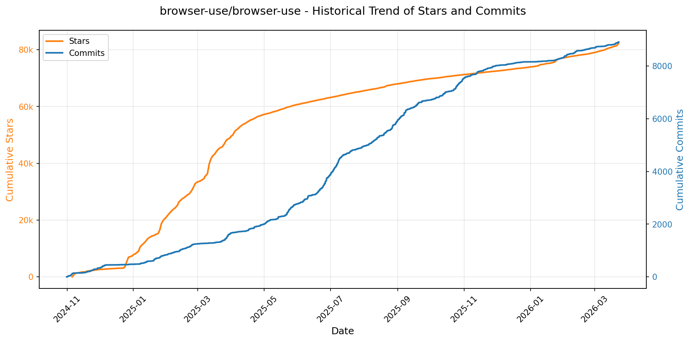
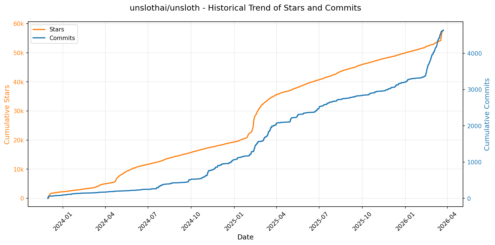
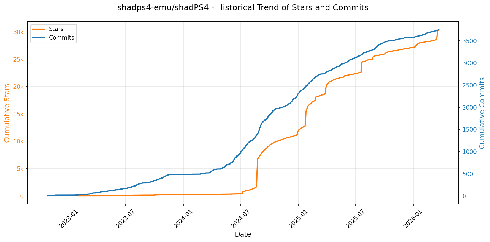
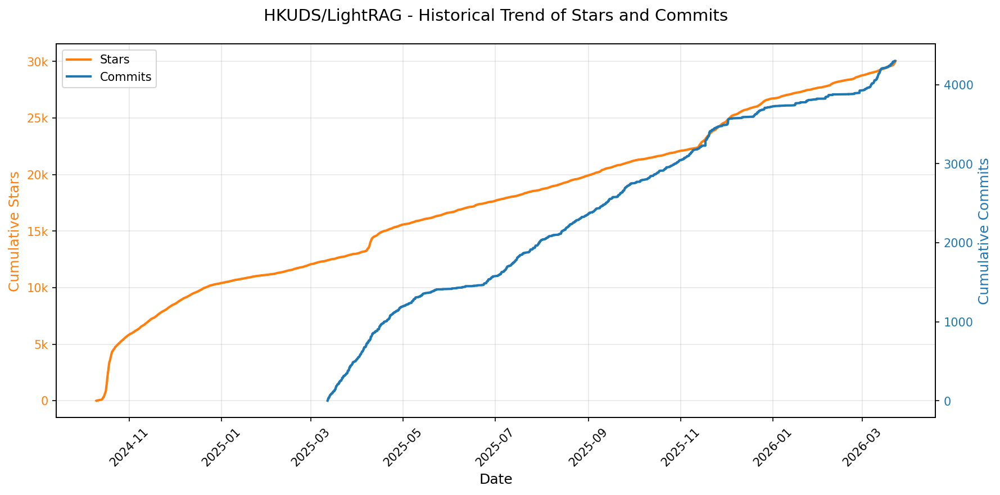
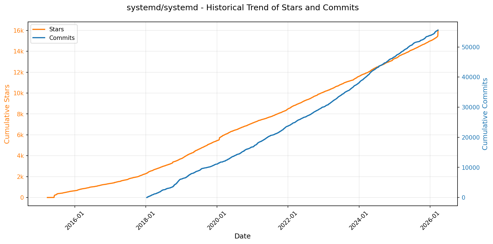
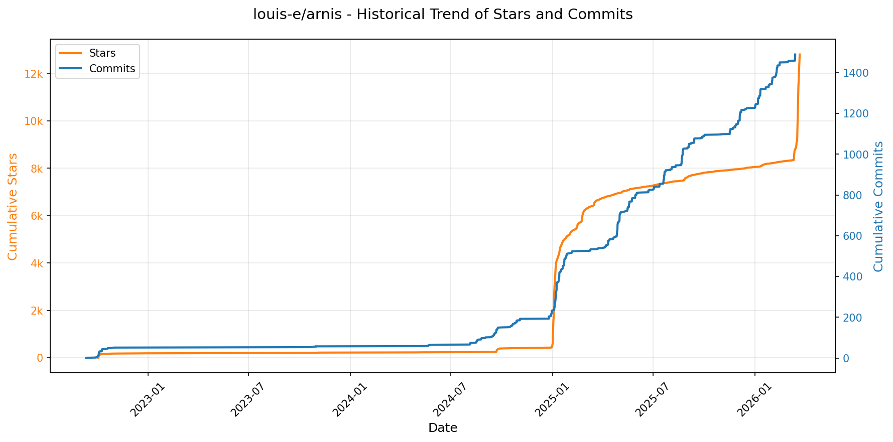
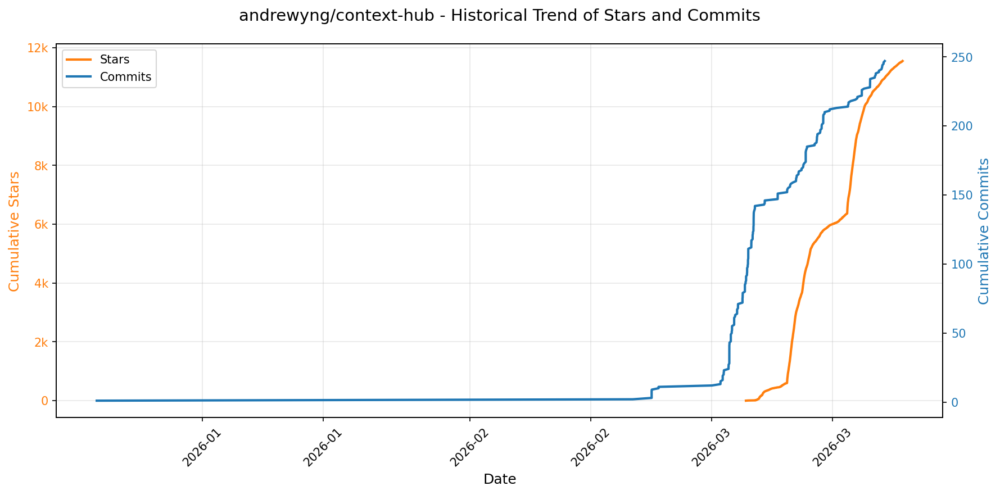
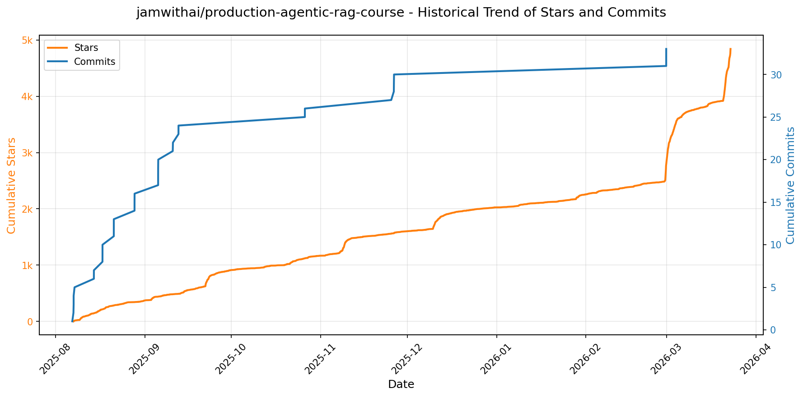

# 🌟 GitHub Trending 概览

> 数据更新于：2026-03-23

---

## 🔍 项目详情

### 1. [obra/superpowers](https://github.com/obra/superpowers)
- 📅 **创建日期**：2025-10-09  
- 🔄 **最近更新**：2026-03-23  
- ⭐ **Stars**：135,002（日 +2081｜周 +19448｜月 +50018）  
- 📝 **描述**：An agentic skills framework & software development methodology that works.  

<b>📈 Star 与 Commit 历史趋势</b>

> *蓝色：累计 Stars｜橙色：累计 Commits（次 Y 轴）*

<b>📄 README 摘要</b>

1. **项目功能**  
Superpowers 是一个面向编程智能体（coding agents）的完整软件开发工作流增强系统。它不直接替代编码代理，而是为其注入结构化、可验证、工程严谨的开发能力：从需求澄清、设计评审、TDD 实施、分支隔离开发，到子智能体协同执行、自动化代码审查与分支收尾，全程自动触发、强制执行。其核心目标是将原本易偏离、缺乏纪律的 AI 编程行为，转化为符合专业软件工程实践（如红-绿-重构、YAGNI、DRY、防御性调试、工作树隔离）的可靠流程。

2. **关键特性**  
- **全自动技能触发（No manual invocation）**：代理在每步操作前自动检测并启用匹配的“技能”，所有流程为强制性工作流，非可选建议；  
- **七阶段端到端开发闭环**：涵盖头脑风暴（Socratic 设计细化）、Git 工作树隔离、原子级任务拆解（2–5 分钟粒度）、子智能体驱动开发（双阶段审查：规范符合性 + 代码质量）、严格 TDD（含测试先行、禁止先写实现）、阶段性代码审查（按严重性阻断）、分支收尾决策（合并/PR/丢弃）；  
- **内建工程哲学约束**：强制测试先行、根因导向调试（4 阶段系统化流程）、复杂度抑制（优先简化）、证据驱动（所有“修复”必须经验证确认）；  
- **可扩展技能库**：提供开箱即用的 15+ 模块化技能（如 `systematic-debugging`、`dispatching-parallel-agents`、`writing-skills`），支持用户遵循标准范式贡献新技能；  
- **多平台原生集成**：官方支持 Claude Code、Cursor、Codex、OpenCode、Gemini CLI，通过插件市场一键安装与自动更新。

3. **技术栈**  
- **运行时环境**：深度适配主流 AI 编程代理平台（Claude Code、Cursor 等），以插件（Plugin/Extension）形式加载；  
- **核心范式**：基于指令工程（prompt engineering）与技能编排（composable skill orchestration），无独立后端或服务依赖；  
- **技能实现层**：采用 Markdown 文档驱动（`.md` 技能定义文件，如 `skills/test-driven-development/SKILL.md`），结合平台特定指令协议（如 `/plugin install`、`/add-plugin`）；  
- **基础设施**：托管于 GitHub（`obra/superpowers`），使用 Git 工作流管理技能版本，依赖 raw.githubusercontent.com 提供动态安装指引（如 Codex/OpenCode 的 `.codex/INSTALL.md`）；  
- **协议与标准**：遵循 TDD 三步法、YAGNI、DRY、Git Worktree 最佳实践等工程规范，技能设计内置测试方法论与反模式清单。

---

### 2. [affaan-m/everything-claude-code](https://github.com/affaan-m/everything-claude-code)
- 📅 **创建日期**：2026-01-18  
- 🔄 **最近更新**：2026-03-23  
- ⭐ **Stars**：98,173（日 +3441｜周 +20326｜月 +49875）  
- 📝 **描述**：The agent harness performance optimization system. Skills, instincts, memory, security, and research-first development for Claude Code, Codex, Opencode, Cursor and beyond.  

<b>📈 Star 与 Commit 历史趋势</b>

> *蓝色：累计 Stars｜橙色：累计 Commits（次 Y 轴）*

<b>📄 README 摘要</b>

1. **项目功能**  
该项目是一个面向 AI 代理（AI Agent）运行时环境的**高性能优化系统**，专为 Claude Code、Codex、Cowork、Cursor、OpenCode 等主流 AI 代理框架（Agent Harness）设计。它远不止是一组配置文件，而是一套完整的生产级能力体系：提供可复用的智能体（28+）、技能（116+）、命令（60+）、规则（覆盖12种语言生态）、安全扫描（集成 AgentShield）、记忆持久化、持续学习机制、子代理协同编排、验证闭环（Verification Loops）、模型路由与 Token 优化等，目标是显著提升 AI 代理在真实软件工程场景中的**稳定性、安全性、效率与自主性**。

2. **核心特性**  
- ✅ **多平台/多框架兼容**：原生支持 Claude Code、Codex（App & CLI）、Cursor、OpenCode、Antigravity 等主流 IDE/CLI 代理平台，实现跨平台行为一致性；  
- ✅ **模块化选择性安装**：基于 `install-plan.js` 的声明式安装管道，支持按需安装特定语言（TypeScript/Python/Java/Kotlin/Rust/Go/C++/PHP/Perl/Swift）及组件，避免冗余；  
- ✅ **智能体即服务（Agents-as-a-Service）**：内置 28 个专业化子智能体（如 `typescript-reviewer`、`java-build-resolver`、`pytorch-build-resolver`、`security-reviewer`），覆盖代码审查、构建排错、安全审计、E2E 测试、文档同步等全生命周期任务；  
- ✅ **技能驱动的工作流自动化**：116+ 领域技能（如 `frontend-slides` 生成 HTML/PPTX 演示文稿、`investor-materials` 自动生成融资材料、`continuous-learning-v2` 基于本能（Instinct）的模式提取与置信度评估）；  
- ✅ **安全增强架构**：集成 AgentShield 安全扫描器（102 条规则、1282 项测试），提供 `/security-scan` 命令；支持沙箱访问控制、输入净化、CVE 检测、五层观察者防护机制；  
- ✅ **状态与记忆基础设施**：SQLite 状态存储 + CLI 查询接口 + 会话适配器，自动保存/加载上下文；支持技能自演化（self-improving skills）；  
- ✅ **运行时动态调控**：通过环境变量 `ECC_HOOK_PROFILE`（minimal/standard/strict）和 `ECC_DISABLED_HOOKS` 实现钩子（Hook）的细粒度启停与严格性分级；  
- ✅ **企业级可观测性与治理**：提供 `/harness-audit`、`/loop-status`、`/quality-gate`、`/model-route` 等运维命令；NanoClaw v2 支持会话分支/搜索/导出/压缩/指标追踪；  
- ✅ **社区与生态友好**：GitHub Marketplace 应用（免费/专业/企业版）、PowerShell 安装器、多语言文档（7 种语言）、CI 全量通过（997+ 自动化测试）、30+ 社区贡献者 PR 合并。

3. **技术栈**  
- **主语言与运行时**：TypeScript（核心逻辑、钩子、CLI 工具）、Node.js（所有脚本重写以保障跨平台兼容性）；  
- **多语言规则与技能支持**：TypeScript、Python、Java、Go、Kotlin、Rust、C++、PHP、Perl、Swift（共 10+ 主流语言，扩展至 12 个语言生态系统）；  
- **基础设施与工具链**：  
  - 存储：SQLite（本地状态持久化）；  
  - 构建/安装：npm / pnpm / yarn / bun（自动检测与适配）；  
  - 进程管理：PM2（支持多服务工作流编排）；  
  - 安全：AgentShield（深度集成）、自研沙箱与 sanitization 机制；  
  - 测试：997+ 内部单元与集成测试（覆盖 agents/skills/hooks/rules）；  
- **部署与分发**：GitHub Marketplace App、Claude Code 插件机制、独立 CLI 入口（`npx ecc-install`）、PowerShell 脚本（Windows 支持）；  
- **辅助技术**：Markdown（全部 agent/skill 文档）、Shell（安装脚本）、Git Worktrees（并行开发）、MCP（Model Control Protocol）配置支持。

---

### 3. [browser-use/browser-use](https://github.com/browser-use/browser-use)
- 📅 **创建日期**：2024-10-31  
- 🔄 **最近更新**：2026-03-23  
- ⭐ **Stars**：82,659（日 +760｜周 +1840｜月 +4246）  
- 📝 **描述**：🌐 Make websites accessible for AI agents. Automate tasks online with ease.  

<b>📈 Star 与 Commit 历史趋势</b>

> *蓝色：累计 Stars｜橙色：累计 Commits（次 Y 轴）*

<b>📄 README 摘要</b>

1. **项目功能**  
Browser-Use 是一个面向浏览器自动化的 AI 代理（AI Browser Agent）开源框架，旨在让大语言模型（LLM）能够像人类一样真实操作网页：理解页面结构、识别可交互元素、执行点击/输入/滚动/截图等动作，并基于任务目标自主完成端到端的网页任务（如填写表单、比价购物、信息检索、PC硬件选配等）。它既支持本地运行（通过 Chromium 浏览器），也提供托管云服务（Browser Use Cloud），实现免配置、高隐蔽性、可扩展的自动化。

2. **核心特性**  
- ✅ **自然语言驱动的任务执行**：用户仅需用中文或英文描述任务（如“查找 browser-use 仓库的 star 数”），Agent 自动解析、导航、操作并返回结果；  
- ✅ **多 LLM 后端支持**：原生集成 `ChatBrowserUse`（专为浏览器任务优化的商用模型）、Google Gemini、Anthropic Claude，同时兼容 OpenAI、Ollama 等本地/第三方模型；  
- ✅ **生产级浏览器控制能力**：支持真实 Chrome 用户配置文件（复用登录态）、会话持久化、CAPTCHA 规避（通过云服务的隐身浏览器）、代理与指纹管理；  
- ✅ **灵活扩展机制**：支持自定义工具（Custom Tools）、系统提示词覆盖（`extend_system_message`）、MCP（Model Context Protocol）集成；  
- ✅ **全栈开发友好**：提供 Python SDK（异步 API）、命令行界面（CLI，支持链式交互式调试）、Claude Code 技能插件、预置模板（`uvx browser-use init`）及丰富示例（求职申请、Instacart 购物、PCPartPicker 配件搜索等）；  
- ✅ **云原生增强能力**：Browser Use Cloud 提供免维护的 stealth 浏览器集群、自动内存管理、水平扩展、高并发执行与企业级安全策略。

3. **技术栈**  
- **核心语言**：Python（≥3.11），基于 `asyncio` 构建异步浏览器控制流；  
- **浏览器引擎**：Chromium（本地依赖 `playwright` 或 `undetected-chromedriver` 类机制；云服务使用定制隐身浏览器）；  
- **前端交互层**：DOM 解析与可操作元素智能识别（结合 ARIA 属性、文本内容、视觉位置等多维信号）；  
- **LLM 集成层**：统一抽象的 `Chat*` 接口（如 `ChatBrowserUse`, `ChatGoogle`），支持结构化工具调用（Function Calling）与响应解析；  
- **开发与部署工具**：`uv`（超快 Python 包管理器）、Docker（云服务底层）、GitHub Actions（CI/CD）；  
- **基础设施**：Browser Use Cloud 基于分布式容器编排（推测为 Kubernetes）、反检测浏览器沙箱、动态代理池与 token 缓存加速层。

---

### 4. [unslothai/unsloth](https://github.com/unslothai/unsloth)
- 📅 **创建日期**：2023-11-29  
- 🔄 **最近更新**：2026-03-23  
- ⭐ **Stars**：57,727（日 +205｜周 +3650｜月 +5235）  
- 📝 **描述**：Unified web UI for training and running open models like Qwen, DeepSeek, gpt-oss and Gemma locally.  

<b>📈 Star 与 Commit 历史趋势</b>

> *蓝色：累计 Stars｜橙色：累计 Commits（次 Y 轴）*

<b>📄 README 摘要</b>

1. **项目功能**  
Unsloth 是一个面向本地 AI 模型运行与训练的统一开发平台，支持在 Windows、Linux 和 macOS 系统上直接部署和微调多种模态的大模型。它提供两种使用方式：一是图形化 Web UI（Unsloth Studio），支持零代码交互式聊天、多模态文件上传（图像、音频、PDF、DOCX、代码等）、数据集自动构建与可视化处理；二是代码优先的 Unsloth Core 库，供开发者集成至 Python 项目中进行高性能训练与推理。核心目标是大幅降低大模型本地化部署与微调的硬件门槛与技术复杂度。

2. **关键特性**  
- **推理能力**：支持搜索、下载并运行 GGUF、LoRA、safetensors 等主流格式模型；提供模型导出（GGUF/16-bit safetensors 等）；支持自愈式工具调用、网页搜索、沙盒代码执行、自动参数调优与自定义对话模板；原生兼容多模态输入（图像、音频、文档等）。  
- **训练能力**：支持超 500 种模型（含 Llama、Qwen、Mistral、Gemma、Phi、GPT-OSS、Orpheus-TTS 等），训练速度最高提升 2 倍，显存占用最多降低 70%（无精度损失）；支持全参数微调、预训练、4-bit/16-bit/FP8 训练及 MoE 模型加速（MoE 训练快 12×，显存省 35%）；内置 Triton 自定义核（RoPE/MLP/Padding-Free Packing），实现 3× 训练加速与 30% 显存节省；支持长达 500K 上下文的训练；强化学习（GRPO）显存占用降低 80%，并支持 FP8 与视觉 RL（VLM-RL）；提供实时训练可观测性（loss、GPU 利用率、自定义图表）及多 GPU 分布式训练（含即将发布的重大升级）。  
- **数据与生态**：内置“Data Recipes”功能，可从 PDF/CSV/DOCX 等格式自动构建训练数据集，并通过可视化节点工作流编辑；深度协同 PyTorch、Hugging Face（TRL/Transformers）、llama.cpp、NVIDIA NeMo 等主流生态，修复多个关键模型（如 Qwen3、Llama 4、Gemma 3、Phi-4）的底层 Bug，提升准确率与稳定性；提供数十个免费 Colab/Kaggle Notebook，覆盖文本、语音、嵌入、视觉、RL 等全场景开箱即用示例。

3. **技术栈**  
- **前端与部署**：Unsloth Studio 基于 Web 技术栈（未明示框架，但含 React/Vue 类组件特征），支持跨平台本地运行（含 WSL）；提供 Docker 镜像（`unsloth/unsloth`）、Shell/PowerShell 安装脚本及 `uv`（Astral 开发的极速 Python 包管理器）驱动的虚拟环境方案；macOS 支持 MLX 后端（开发中），Windows 兼容 PyTorch + CUDA，AMD/Intel GPU 通过定制后端支持（需单独配置）。  
- **核心计算层**：深度依赖 PyTorch（支持 `--torch-backend=auto` 自动适配 CUDA/ROCm/Metal/MLX），集成自研 Triton 内核（优化 RoPE、MLP、注意力机制）；利用 llama.cpp 实现高效 GGUF 推理与量化；与 Hugging Face Transformers/TRL 深度集成以支持标准训练流程；FP8 训练依赖 PyTorch AO（Accelerated Operators）；多模态支持依托于开源 VLM/TTS/Embedding 框架（如 Qwen-VL、Orpheus-TTS、EmbeddingGemma）。  
- **基础设施**：采用 `uv` 替代 pip/poetry 进行极速依赖管理；支持 Python 3.13；Docker 镜像预置 Jupyter、SSH 及 GPU 加速环境；训练可观测性基于实时日志与指标可视化模块。

---

### 5. [harry0703/MoneyPrinterTurbo](https://github.com/harry0703/MoneyPrinterTurbo)
- 📅 **创建日期**：2024-03-11  
- 🔄 **最近更新**：2026-03-23  
- ⭐ **Stars**：51,094（日 +567｜周 +939｜月 +1730）  
- 📝 **描述**：利用AI大模型，一键生成高清短视频 Generate short videos with one click using AI LLM.  

<b>📈 Star 与 Commit 历史趋势</b>

> *蓝色：累计 Stars｜橙色：累计 Commits（次 Y 轴）*

<b>📄 README 摘要</b>

1. **项目功能**  
MoneyPrinterTurbo 是一个端到端的 AI 短视频自动生成工具。用户仅需输入一个视频主题或关键词，系统即可全自动完成：AI 生成视频文案（支持中英文）、智能匹配高清无版权视频素材（含本地素材支持）、语音合成（多引擎+多音色+实时试听）、智能字幕生成与样式定制（字体/位置/颜色/描边等）、背景音乐添加与音量调节，最终合成高分辨率短视频（支持竖屏 9:16 和横屏 16:9 两种主流格式）。同时支持批量生成、多模型灵活切换、Web UI 与 RESTful API 双模式交互。

2. **关键特性**  
- ✅ 全流程自动化：从文案→素材→配音→字幕→BGM→合成，一键生成完整短视频；  
- ✅ 多模态大模型兼容：原生支持 OpenAI、通义千问、DeepSeek、Moonshot、Gemini、文心一言、Ollama、ModelScope、Pollinations、Azure、gpt4free、one-api 等十余种 LLM 接入方式，中国用户可直连 DeepSeek/Moonshot（免代理、注册即赠额度）；  
- ✅ 高度可配置：支持自定义视频尺寸、片段时长、字幕样式、BGM 音量、语音引擎及音色；  
- ✅ 双字幕引擎：提供轻量快速的 `edge` 模式与高精度但需本地模型的 `whisper` 模式（支持手动下载 `whisper-large-v3`）；  
- ✅ 多部署方案：开箱即用的一键 Windows 启动包、Docker 容器化部署、Google Colab 在线体验、以及完整的手动 Conda 环境部署；  
- ✅ 生产就绪能力：支持批量生成、API 文档（Swagger/Redoc）、WebUI 实时配置、本地素材库与字体管理、多语言界面（中/英）；  
- ✅ 社区友好生态：提供在线免部署服务（reccloud.cn）、赞助支持（PicWish 图像处理平台）、详细故障排查指南与中文视频教程。

3. **技术栈**  
- **后端框架**：Python 3.11 + FastAPI（API 服务） + Streamlit（Web UI）；  
- **架构模式**：标准 MVC 架构，模块解耦清晰，便于二次开发与维护；  
- **AI 能力层**：  
  - 大语言模型（LLM）：通过适配器统一接入多种 Provider（REST API / SDK / 本地 Ollama）；  
  - 语音合成（TTS）：集成 Azure Neural TTS、Edge TTS 等，支持 9+ 新增 Azure 高保真音色；  
  - 字幕识别（ASR）：支持 Edge（云端轻量）与 Whisper（本地 `whisper-large-v3` 模型）双引擎；  
- **多媒体处理**：  
  - 视频合成：依赖 `ffmpeg`（自动下载或手动配置路径）；  
  - 图像处理：依赖 `ImageMagick`（静态版推荐，用于字幕渲染与图像操作）；  
- **依赖管理与部署**：  
  - 包管理：`pip` + `conda`（推荐虚拟环境隔离）；  
  - 容器化：`Docker` + `docker-compose`；  
  - 前端资源：内置 `resource/songs`（BGM）、`resource/fonts`（字幕字体）、`models/`（Whisper 模型缓存目录）；  
- **配置与扩展**：基于 TOML 格式配置文件（`config.toml`），支持动态热更新关键参数（如 API Key、模型选择、路径设置等）。

---

### 6. [shareAI-lab/learn-claude-code](https://github.com/shareAI-lab/learn-claude-code)
- 📅 **创建日期**：2025-06-29  
- 🔄 **最近更新**：2026-03-23  
- ⭐ **Stars**：50,721（日 +787｜周 +8005｜月 +18879）  
- 📝 **描述**：Bash is all you need -  A nano claude code–like 「agent harness」, built from 0 to 1  

<b>📈 Star 与 Commit 历史趋势</b>

> *蓝色：累计 Stars｜橙色：累计 Commits（次 Y 轴）*

<b>📄 README 摘要</b>

1. **该项目做什么？**  
该项目是一个面向“智能体（Agent）系统”底层工程实践的深度教学项目，核心目标是**系统性传授“Harness Engineering”（智能体承载架构/运行环境工程）这一关键能力**。它不训练模型，也不构建LLM本身，而是聚焦于为已有的大语言模型（如Claude）构建高可用、可扩展、安全可控的**运行环境（Harness）**——即让模型能在真实软件工程场景中有效感知、推理与行动所需的全套基础设施。通过12个渐进式会话（s01–s12），项目从最简代理循环出发，逐步叠加生产级机制（工具调度、子智能体隔离、按需知识加载、上下文压缩、任务持久化、后台执行、多智能体协作、工作区隔离等），最终构建出一个类Claude Code的完整编码智能体运行时。

2. **关键特性**  
- **以模型为中心的设计哲学**：严格区分“Agent = 模型（learned intelligence）”与“Harness = 工程实现（execution environment）”，拒绝prompt chaining等伪智能体方案；  
- **渐进式、模块化教学体系**：12个会话各聚焦一个核心Harness机制，每个机制均附有明确设计信条（Motto）、ASCII架构图与最小可行代码，支持零基础到全栈掌握；  
- **生产就绪的Harness模式库**：涵盖工具注册与分发（s02）、分层上下文压缩（s06）、基于文件的任务依赖图（s07）、异步后台执行（s08）、JSONL协议驱动的多智能体异步通信（s09–s11）、基于ID的工作树（worktree）隔离执行（s12）等；  
- **真实世界对齐能力**：强调权限治理（sandboxing、审批流）、知识按需加载（非系统提示硬编码）、任务状态持久化、跨会话上下文管理，直指工业部署痛点；  
- **跨领域可迁移范式**：所有机制抽象自Claude Code，但设计原则通用——文档明确指出其适用于农业、医疗、制造、酒店等任意需要“感知-推理-行动”闭环的领域。

3. **技术栈**  
- **核心语言**：Python（所有参考实现 `agents/s*.py` 均为纯Python，无框架依赖）；  
- **LLM交互层**：Anthropic Claude API（通过 `anthropic` 官方SDK调用，`messages.create` 流式交互）；  
- **运行时机制**：标准库为主——`threading`（后台任务）、`json`/`pathlib`（任务持久化与工作树管理）、`subprocess`（Bash工具执行）；  
- **Web学习平台**：Next.js（React框架）+ TypeScript，提供交互式可视化、代码浏览与分步演示；  
- **工程基础设施**：Git版本控制、多语言文档（Markdown）、CI/CD（GitHub Actions类型检查与构建）、环境变量管理（`.env`）；  
- **协议与数据格式**：自定义轻量级JSONL邮箱协议（s09–s11）、结构化工具调用约定（`tool_use`/`tool_result`）、三层上下文压缩策略（s06）。

---

### 7. [koala73/worldmonitor](https://github.com/koala73/worldmonitor)
- 📅 **创建日期**：2026-01-08  
- 🔄 **最近更新**：2026-03-23  
- ⭐ **Stars**：42,890（日 +462｜周 +4067｜月 +34185）  
- 📝 **描述**：Real-time global intelligence dashboard — AI-powered news aggregation, geopolitical monitoring, and infrastructure tracking in a unified situational awareness interface  

<b>📈 Star 与 Commit 历史趋势</b>

> *蓝色：累计 Stars｜橙色：累计 Commits（次 Y 轴）*

<b>📄 README 摘要</b>

1. **项目功能**  
World Monitor 是一个实时全球态势感知平台，专注于聚合、分析与可视化多源全球情报。它通过 AI 技术对 435+ 个精选新闻源（覆盖军事、经济、灾害、地缘政治等 15 类）进行自动摘要；内置双地图引擎（3D 球面 globe.gl + WebGL 平面 deck.gl），叠加 45 层动态地理空间数据；实现跨事件流（如军演、市场异动、自然灾害、外交升级）的信号关联与风险收敛分析；提供“国家智能指数”（基于 12 类信号的复合风险评分）；集成金融雷达模块（覆盖 92 个交易所、大宗商品、加密货币及 7 维市场信号合成指标）；支持完全本地化 AI 推理（通过 Ollama 无需 API 密钥）；并以单一代码库支撑 5 个垂直变体站点（全球版、科技版、金融版、商品版、快乐版），满足差异化信息需求。

2. **核心特性**  
- ✅ **多模态情报融合**：AI 新闻摘要 + 实时地理空间图层 + 跨域事件关联分析  
- ✅ **双渲染引擎地图系统**：globe.gl（WebGL 3D 地球）与 deck.gl + MapLibre GL（高性能矢量/热力/轨迹平面地图）协同呈现  
- ✅ **轻量本地 AI 支持**：开箱即用 Ollama 集成，支持浏览器端 Transformers.js 与服务端 Groq/OpenRouter 备选，零外部依赖即可运行核心分析  
- ✅ **多版本单体架构**：通过构建时配置（`npm run dev:finance` 等）生成 5 个语义独立的生产站点（world/tech/finance/commodity/happy）  
- ✅ **全平台原生桌面应用**：基于 Tauri 2（Rust）构建，支持 macOS（Intel/Apple Silicon）、Windows（.exe）和 Linux（.AppImage），含离线能力与 PWA 特性  
- ✅ **全球化就绪**：原生支持 21 种语言（含 RTL 布局）、本地化新闻源与界面，无区域锁定  
- ✅ **企业级可扩展架构**：Protocol Buffers 定义的 92 个数据协议与 22 个微服务接口、三层缓存（Redis Upstash + CDN + Service Worker）、Vercel Edge Functions 边缘计算部署  

3. **技术栈**  
- **前端**：Vanilla TypeScript + Vite 构建，无框架依赖；globe.gl / Three.js（3D 可视化）、deck.gl / MapLibre GL（地理空间渲染）  
- **桌面端**：Tauri 2（Rust 主进程） + Node.js Sidecar（用于系统级 I/O 和 AI 运行时桥接）  
- **AI/ML 层**：Ollama（本地 LLM）、Groq / OpenRouter（云端备选）、Transformers.js（浏览器内轻量模型推理）  
- **API 与通信**：Protocol Buffers（.proto 定义）+ sebuf HTTP 注解（自研 REST/gRPC 混合接口规范）  
- **部署与基础设施**：Vercel Edge Functions（60+ 边缘函数）、Railway（中继服务）、Docker / PWA / 静态托管多模式支持  
- **缓存与性能**：Upstash Redis（远程缓存）、内存+CDN+Service Worker 三级缓存策略

---

### 8. [ruvnet/RuView](https://github.com/ruvnet/RuView)
- 📅 **创建日期**：2025-06-07  
- 🔄 **最近更新**：2026-03-23  
- ⭐ **Stars**：40,276（日 +713｜周 +2535｜月 +33142）  
- 📝 **描述**：π RuView: WiFi DensePose turns commodity WiFi signals into real-time human pose estimation, vital sign monitoring, and presence detection — all without a single pixel of video.   

<b>📈 Star 与 Commit 历史趋势</b>

> *蓝色：累计 Stars｜橙色：累计 Commits（次 Y 轴）*

<b>📄 README 摘要</b>

1. **该项目做什么？**  
RuView 是一个面向边缘设备的 AI 感知系统，利用环境中已有的无线信号（尤其是 WiFi 的信道状态信息 CSI）实现无摄像头、无穿戴设备、无互联网连接的非接触式环境感知。它通过分析人体运动对 WiFi 无线电波造成的散射扰动，实时重建人体姿态（17 个关键点）、呼吸频率（6–30 BPM）、心率（40–120 BPM）、存在性、跌倒事件，并支持穿墙感知（最远达 5 米深度）。系统完全在本地运行，可部署于低成本硬件（如单节点仅约 $1 的 ESP32-S3），自主学习所在空间的射频（RF）指纹，持续适应环境变化，无需标注数据、训练摄像头或云端基础设施。

2. **核心功能**  
- **隐私优先的非视觉感知**：全程不采集图像/视频，规避 GDPR/HIPAA 等视频监管限制；  
- **多模态生命体征监测**：零接触获取呼吸、心跳、存在、跌倒等关键指标；  
- **穿墙与多人员同步追踪**：支持透过墙体、家具、 rubble 进行感知，可并行追踪多人（物理上限约 3–5 人/AP，多 AP 可线性扩展）；  
- **多基站协同传感（Multistatic Mesh）**：4–6 个 ESP32-S3 节点组成传感网，提供 360° 全向覆盖、亚英寸级定位精度及抗混淆能力；  
- **自学习与自适应智能**：基于原始 CSI 数据进行无监督对比学习（ADR-024），构建持久化房间场模型（ADR-030），支持跨环境泛化（ADR-027）与跨视角融合（ADR-031）；  
- **超低延迟边缘实时处理**：端侧推理延迟 <100 微秒，存在检测响应 <1 毫秒，全栈 Rust 实现达 54,000 帧/秒；  
- **全离线部署能力**：ESP32-S3 单节点即可独立完成感知、计算与告警（如跌倒），无需联网、无云依赖、无订阅费用；  
- **一体化可视化与交互**：提供基于 Three.js 的“天文台级”观测仪表盘（5 大全息面板），支持 AMOLED 屏直显，以及 WASM/Web 端实时融合演示（WiFi + 摄像头双模态）。

3. **技术栈**  
- **编程语言**：Rust（主框架、AI 信号处理、ESP32 固件、CLI 工具链；强调内存安全与极致性能）；Python（辅助数据验证、仿真、部分训练脚本）；TypeScript（Web 前端、Tauri 桌面应用）；  
- **核心算法与模型**：基于物理的 CSI 信号建模（Fresnel 区几何、多径传播）、Hampel 滤波、SpotFi 风格到达角估计、BVP（Ballistocardiogram）提取、FFT 频谱分析；自研 RuVector AI 引擎（含注意力机制、图神经网络、信号压缩与场建模）；Signal-Line Protocol（CRV，6 阶信号到语义的端到端流水线）；  
- **硬件平台**：主推 ESP32-S3（支持 CSI 流式采集，成本低至 $8/节点，集成 AMOLED 显示）；兼容 Intel 5300 / Atheros AR9580 等科研级 CSI NIC；基础功能（RSSI 存在检测）可在普通笔记本 WiFi 上运行；  
- **通信与安全**：QUIC 协议构建加密传感网（ADR-032），支持端到端加密、防重放、断连自愈；  
- **部署与分发**：多架构 Docker 镜像（amd64/arm64/Apple Silicon）；模型封装为轻量 `.rvf` 格式，支持边缘、云、WASM 浏览器三端运行；  
- **开发与治理**：62 份架构决策记录（ADRs）、7 个领域驱动设计（DDD）模型；MIT 开源协议；1300+ 单元/集成测试；Crates.io 发布 Rust crate（`wifi-densepose-ruvector`）。

---

### 9. [TauricResearch/TradingAgents](https://github.com/TauricResearch/TradingAgents)
- 📅 **创建日期**：2024-12-28  
- 🔄 **最近更新**：2026-03-23  
- ⭐ **Stars**：37,250（日 +1601｜周 +5028｜月 +7109）  
- 📝 **描述**：TradingAgents: Multi-Agents LLM Financial Trading Framework  

<b>📈 Star 与 Commit 历史趋势</b>

> *蓝色：累计 Stars｜橙色：累计 Commits（次 Y 轴）*

<b>📄 README 摘要</b>

1. **项目功能**  
TradingAgents 是一个面向金融交易研究的多智能体大语言模型（LLM）框架，旨在模拟真实交易公司的组织结构与决策流程。它通过部署多个专业化、角色明确的LLM智能体（如基本面分析师、情绪分析师、新闻分析师、技术分析师、多空研究员、交易员、风控团队及投资组合经理），协同完成市场分析、策略辩论、风险评估与交易决策全流程。所有智能体基于真实金融数据（如股价、新闻、社交媒体、宏观指标等）进行推理，并在动态讨论中达成共识或权衡分歧，最终输出可执行的模拟交易建议（如买入/卖出信号、仓位大小、时机判断等）。该框架专为学术研究与算法验证设计，不提供实盘交易服务，亦不构成任何投资建议。

2. **核心特性**  
- **角色化多智能体架构**：严格划分7类职能智能体（4类分析师 + 2类研究员 + 1类交易执行与风控闭环），各司其职又深度协作；  
- **多LLM供应商支持**：原生兼容 OpenAI（GPT-5.x）、Google（Gemini 3.x）、Anthropic（Claude 4.x）、xAI（Grok 4.x）、OpenRouter 及本地 Ollama 模型，支持按任务复杂度动态分配“深度思考”与“快速响应”模型；  
- **结构化辩论机制**：多空研究员基于分析师报告开展多轮辩证讨论，引入五级评级量表量化观点置信度与风险权重；  
- **端到端可配置工作流**：支持自定义股票代码、分析日期、LLM提供商、辩论轮次、温度参数、数据源（如 Alpha Vantage）等；  
- **双入口交互方式**：提供命令行界面（CLI）实现零代码交互式分析，同时支持 Python 包集成（`TradingAgentsGraph.propagate()`），便于嵌入研究 pipeline；  
- **全开源与可复现性**：完整公开架构、配置、示例及技术报告（arXiv:2412.20138），含详细文档与多语言支持（含中文）。

3. **技术栈**  
- **核心框架**：LangGraph（构建可扩展、状态化的多智能体有向图工作流）；  
- **编程语言**：Python 3.13（官方指定运行环境）；  
- **依赖管理**：Conda 虚拟环境推荐，`pip install .` 安装包；  
- **LLM 接入层**：统一抽象接口适配 OpenAI SDK、Google Generative AI、Anthropic SDK、xAI SDK、OpenRouter API 及 Ollama REST API；  
- **数据层**：集成 Alpha Vantage（金融时序数据）、网络爬虫/新闻API（用于新闻与舆情分析，具体实现隐含于模块中）；  
- **配置与环境**：基于 `.env` 文件管理敏感密钥，`default_config.py` 提供全参数化配置体系；  
- **部署与交互**：CLI 基于标准 Python `argparse`/`rich` 构建，支持实时进度可视化与分阶段结果展示。

---

### 10. [bytedance/deer-flow](https://github.com/bytedance/deer-flow)
- 📅 **创建日期**：2025-05-07  
- 🔄 **最近更新**：2026-03-23  
- ⭐ **Stars**：35,853（日 +2656｜周 +4886｜月 +15927）  
- 📝 **描述**：An open-source SuperAgent harness that researches, codes, and creates. With the help of sandboxes, memories, tools, skills and subagents, it handles different levels of tasks that could take minutes to hours.  

<b>📈 Star 与 Commit 历史趋势</b>

> *蓝色：累计 Stars｜橙色：累计 Commits（次 Y 轴）*

<b>📄 README 摘要</b>

1. **该项目的功能**  
DeerFlow 2.0 是一个开源的**超级智能体运行时框架（Super Agent Harness）**，旨在将大语言模型（LLM）转化为可实际执行复杂任务的自主工作系统。它不局限于问答或简单工具调用，而是通过协同调度**子智能体（Sub-Agents）、沙箱环境（Sandbox）、长期记忆（Long-Term Memory）和可扩展技能（Extensible Skills）**，完成端到端的高阶任务——例如深度网络调研、自动生成报告/幻灯片/网页、多模态内容创作（图像/视频）、数据管道构建、仪表板部署等。其核心定位是提供“开箱即用、可深度定制”的智能体基础设施，使AI不仅能规划（plan），更能可靠地执行（execute）、验证（verify）、迭代（iterate）并持久化成果。

2. **关键特性**  
- **模块化技能系统（Skills & Tools）**：以标准化 Markdown 文件定义技能（如 `research/SKILL.md`），支持动态按需加载，避免上下文膨胀；内置研究、报告生成、PPT制作、网页开发、图像/视频生成等技能，并支持通过 `.skill` 归档包安装自定义技能；全面兼容 MCP（Model Context Protocol）服务器，支持 OAuth 认证的远程工具集成。  
- **动态子智能体编排（Sub-Agents）**：主智能体可实时创建多个隔离的子智能体，各自拥有独立上下文、专属工具集与终止条件，支持并行执行与结构化结果回传，实现复杂任务的自动分解与协同合成（如“一份行业分析报告”可拆解为10+子任务并行处理后整合输出）。  
- **全功能隔离沙箱（Sandbox & File System）**：每个任务均在独立 Docker 容器中运行，配备完整 Linux 文件系统（`/mnt/user-data/uploads/`、`workspace/`、`outputs/`），支持文件读写、Bash 脚本执行、代码运行、图像渲染等真实计算操作，保障安全、可审计、无会话污染。  
- **先进上下文工程（Context Engineering）**：采用子智能体上下文隔离机制；结合主动摘要（summarization）、中间结果落盘（offloading）、上下文压缩等策略，长效维持多步骤长周期任务的推理连贯性与 token 效率。  
- **持久化长期记忆（Long-Term Memory）**：突破传统对话式遗忘限制，支持跨会话、跨任务的记忆存储与检索（如用户偏好、项目历史、知识沉淀），形成可演进的智能体认知基座。  
- **多通道交互与生产就绪架构**：原生支持 Telegram、Slack、飞书（Lark）等 IM 平台接入，无需公网 IP；提供 Docker 一键启停（含热重载开发模式）、LangGraph 可视化调试、CLI 工具链（如 `claude-to-deerflow` 技能直连 Claude Code 终端）及企业级配置管理（模型路由、沙箱模式切换、OAuth 集成等）。

3. **技术栈**  
- **后端**：Python 3.12+（核心逻辑、LangChain/LangGraph 集成、沙箱管理、MCP 服务）；依赖 `uv` 包管理器与 `pyproject.toml` 构建；深度集成 LangChain（v0.3+）与 LangGraph（用于有状态、可调试的图状智能体流程编排）；支持 OpenAI 兼容 API、Claude Code OAuth、Codex CLI 等多模型后端；沙箱基于 Docker/Kubernetes 实现容器化隔离。  
- **前端与工具链**：Node.js 22+（Web UI、CLI 工具、技能包管理）；使用 `pnpm` 管理依赖；提供 `make` 驱动的统一构建/启动/配置工作流（`make docker-start`, `make dev`, `make config` 等）；Nginx 作为反向代理与静态资源服务。  
- **基础设施与生态**：官方推荐搭配 ByteDance 自研模型（Doubao-Seed-2.0-Code、DeepSeek v3.2、Kimi 2.5）及 InfoQuest 智能搜索爬虫工具；支持 Tavily、OpenRouter 等第三方搜索与模型网关；配置体系基于 YAML + 环境变量（`.env`），支持多层级覆盖与敏感信息安全注入。

---

### 11. [moeru-ai/airi](https://github.com/moeru-ai/airi)
- 📅 **创建日期**：2024-12-01  
- 🔄 **最近更新**：2026-03-23  
- ⭐ **Stars**：35,375（日 +141｜周 +1357｜月 +17942）  
- 📝 **描述**：💖🧸 Self hosted, you-owned Grok Companion, a container of souls of waifu, cyber livings to bring them into our worlds, wishing to achieve Neuro-sama's altitude. Capable of realtime voice chat, Minecraft, Factorio playing. Web / macOS / Windows supported.  

<b>📈 Star 与 Commit 历史趋势</b>

> *蓝色：累计 Stars｜橙色：累计 Commits（次 Y 轴）*

<b>📄 README 摘要</b>

1. **项目功能**  
AIRI 是一个开源的“AI 虚拟生命容器”（cyber living soul container），旨在复刻并超越 Neuro-sama 这类高互动性 AI 虚拟主播/数字伴侣的能力，让用户**完全拥有、本地运行、跨平台部署**属于自己的智能虚拟角色。它不仅支持基础的多模态对话（文本/语音/视觉），更核心的是实现**真实场景中的协同能力**：如实时参与 Minecraft、Factorio、Kerbal Space Program 等游戏；在 Discord、Telegram 中语音/文字交互；结合用户当前屏幕内容（如编程、看视频）进行上下文感知对话；并具备持续演化的记忆与行为系统。

2. **关键特性**  
- **全栈多端原生支持**：同时提供浏览器版（PWA）、桌面版（基于 Tauri/Electron + 原生 GPU 加速）、移动版（Capacitor）三套运行时，均支持离线或混合云推理。  
- **深度游戏与环境交互**：已实现在 Minecraft、Factorio 等游戏中自主操作与协作（含 PoC），支持屏幕理解、输入模拟、实时状态反馈。  
- **多模态感知与表达**：  
  - *听觉*：浏览器/DC 音频输入 + 客户端语音识别（STT）+ 实时说话检测（VAD）；  
  - *言语*：集成 ElevenLabs 等 TTS，支持情感化语音合成；  
  - *视觉表现*：原生支持 VRM 与 Live2D 模型，具备自动眨眼、视线追踪、Idle 微动作等拟人动画；  
- **可扩展智能中枢**：  
  - 支持 20+ 主流 LLM API（OpenAI、Claude、vLLM、Ollama、Gemini、Qwen 等），通过统一抽象层 `xsai` 接入；  
  - 内置浏览器端嵌入式数据库（DuckDB WASM / pglite）与正在开发的长期记忆系统 “Memory Alaya”；  
  - 插件化架构（MCP 协议支持、Tauri 插件、WebGPU 渲染管线），便于集成 CV、RL、ASR/TTS 等能力。  
- **开放生态与子项目体系**：围绕 AIRI 衍生出 `unspeech`（通用 ASR/TTS 代理）、`hfup`（HuggingFace 部署工具）、`webai-realtime-voice-chat`（端到端实时语音对话示例）等专业化子项目。

3. **技术栈**  
- **前端与渲染**：TypeScript + Vue 3（Composition API），Three.js（3D 场景）、WebGPU（高性能图形/计算）、WebAudio（音频处理）、Web Workers（后台任务隔离）、WebSocket（实时通信）。  
- **桌面与移动端**：Tauri（主框架，替代 Electron 以提升性能与安全性）+ Rust（核心逻辑、插件开发）、Capacitor（iOS/Android 封装）、Nix（跨平台构建与依赖管理）。  
- **AI 与推理层**：  
  - 服务端：vLLM、SGLang、Ollama、Cloudflare Workers AI 等；  
  - 客户端：Transformers.js（实验性）、Candle（Rust 原生推理，支持 CUDA/Metal）、WebAssembly（WASM）轻量模型；  
- **数据与存储**：DuckDB WASM（浏览器内 OLAP）、Drizzle ORM（适配 DuckDB WASM 的驱动）、PostgreSQL 兼容层（pglite）；  
- **基础设施**：GitHub Actions CI/CD、Crowdin 多语言协作、Product Hunt/Trendshift 数据跟踪；  
- **辅助工具链**：PNPM（包管理）、Bumpp（版本发布）、Nix Flakes（可复现构建）。

---

### 12. [666ghj/MiroFish](https://github.com/666ghj/MiroFish)
- 📅 **创建日期**：2025-11-26  
- 🔄 **最近更新**：2026-03-23  
- ⭐ **Stars**：32,756（日 +1167｜周 +5500｜月 +28624）  
- 📝 **描述**：A Simple and Universal Swarm Intelligence Engine, Predicting Anything. 简洁通用的群体智能引擎，预测万物  

<b>📈 Star 与 Commit 历史趋势</b>

> *蓝色：累计 Stars｜橙色：累计 Commits（次 Y 轴）*

<b>📄 README 摘要</b>

1. **项目功能**  
MiroFish 是一个基于多智能体（Multi-Agent）架构的通用群体智能预测引擎。它通过摄入现实世界的“种子信息”（如新闻、政策草案、金融数据、小说文本等），自动构建高保真、可演化的平行数字世界；在该世界中，成千上万个具备独立人格、长期记忆与自主行为逻辑的AI智能体进行社会性交互与动态演化。用户仅需上传原始材料并以自然语言提出预测需求（例如“推演武汉大学舆情发酵路径”或“续写《红楼梦》失传结局”），系统即可生成结构化预测报告，并提供一个支持深度交互的实时仿真环境，实现“未来在数字沙盘中预演”。

2. **核心特性**  
- **双模态预测能力**：兼顾严肃场景（政策试错、金融推演、舆情预警）与创意场景（小说续写、脑洞模拟、教育实验）；  
- **全栈式仿真流水线**：覆盖图谱构建（GraphRAG + 记忆注入）、环境搭建（人设生成 + 关系抽取）、双平台并行模拟、动态时序记忆更新、多工具ReportAgent自动生成报告；  
- **上帝视角交互式控制**：支持用户随时注入变量、干预仿真进程，并与任意虚拟智能体或ReportAgent进行自然语言对话；  
- **开箱即用与灵活部署**：提供源码一键部署（`npm run setup:all` + `npm run dev`）和Docker容器化方案，内置阿里云百炼Qwen-Plus等主流LLM适配接口；  
- **真实案例验证**：已成功应用于武汉大学舆情推演、《红楼梦》结局预测等具象任务，证明其跨领域泛化能力。

3. **技术栈**  
- **前端**：基于 React（推测，由 `npm run frontend` 及端口3000推断），使用现代Web构建工具链；  
- **后端**：Python（≥3.11且≤3.12），依赖 `uv` 作为高性能包管理器，集成LLM API（兼容OpenAI SDK协议，实测对接阿里云百炼DashScope）、Zep Cloud（用于长期记忆管理）；  
- **智能体框架**：底层仿真引擎由开源项目 **OASIS**（CAMEL-AI团队开发）驱动，支撑多智能体协作、角色建模与社会演化；  
- **知识增强**：融合 GraphRAG 技术实现结构化知识图谱构建与检索增强；  
- **部署与运维**：支持 Docker Compose 容器编排，前后端分离架构（前端3000端口 / 后端5001端口），环境配置通过 `.env` 统一管理。

---

### 13. [shadps4-emu/shadPS4](https://github.com/shadps4-emu/shadPS4)
- 📅 **创建日期**：2022-10-24  
- 🔄 **最近更新**：2026-03-23  
- ⭐ **Stars**：30,368（日 +94｜周 +1799｜月 +2093）  
- 📝 **描述**：PlayStation 4 emulator for Windows, Linux and macOS written in C++  

<b>📈 Star 与 Commit 历史趋势</b>

> *蓝色：累计 Stars｜橙色：累计 Commits（次 Y 轴）*

<b>📄 README 摘要</b>

1. **项目功能**  
shadPS4 是一个面向 Windows、Linux 和 macOS 平台的早期 PlayStation 4（PS4）开源模拟器，专注于在 PC 上原生运行 PS4 游戏二进制文件（如 `.elf` 或游戏目录 `CUSAxxxxx`）。它仅提供命令行核心（CLI emulator core），**不包含图形用户界面（GUI）**；终端用户需配合独立的 [QtLauncher](https://github.com/shadps4-emu/shadPS4-qtlauncher) 使用。项目已实现对多款主流 PS4 游戏的基本运行支持，包括《Bloodborne》《Dark Souls Remastered》《Red Dead Redemption》《Yakuza 0》《Project DIVA Future Tone》和《DRIVECLUB™》等，但处于早期开发阶段，尚不具备完整兼容性与稳定性。

2. **关键特性**  
- ✅ **跨平台支持**：原生支持 Windows、Linux 和 macOS（需 macOS 15.4+，Intel Mac 存在严重 GPU 兼容问题）；  
- ✅ **低层硬件模拟**：专注模拟 PS4 的 AMD Jaguar CPU 架构与 GCN 系列 GPU（含定制着色器编译与渲染管线）；  
- ✅ **模块化固件加载**：支持加载从合法拥有的 PS4 主机提取的系统模块（`.sprx`），如 `libSceAudiodec.sprx`、`libSceJpegDec.sprx`、`libSceRtc.sprx` 等共 13 个关键模块，用于实现音频、图像、时间、字体等系统功能；  
- ✅ **灵活启动方式**：支持通过游戏 ID（如 `CUSA00001`）、ELF 文件路径、自定义参数（`-- -flag1 -flag2`）等方式启动；  
- ✅ **完备输入支持**：原生兼容 Xbox/DualShock 控制器；提供详尽可配置的键盘/鼠标映射（含轴向模拟、多键绑定、触控板/背键映射），并支持 per-game 配置保存；  
- ✅ **调试与诊断工具**：内置 FPS 计数器（F10）、视频调试信息（Ctrl+F10）、RenderDoc 截帧（F12）、全屏切换（F11）等开发者友好功能；  
- ✅ **容器化构建支持**：提供 Docker + VSCode 的标准化构建环境，降低跨平台编译门槛。

3. **技术栈**  
- **主语言**：C++（高性能底层模拟核心）；  
- **GPU 与图形**：基于 Vulkan API 实现渲染后端；着色器编译器以 Nintendo Switch 模拟器 **yuzu 的 Hades 编译器**为蓝本进行定制开发；  
- **CPU 模拟**：采用动态二进制翻译（DBT）或解释执行方式模拟 x86-64（Jaguar）指令集，借鉴 **Panda3DS**（3DS 模拟器）在 x64 原生执行方面的经验；  
- **系统层逆向支撑**：深度依赖 **fpPS4** 团队对 PS4 OS 内核与 SceLib 库的逆向研究成果；  
- **构建与开发环境**：CMake 构建系统；支持 Docker 容器化构建；Windows 使用 MSVC / vcpkg，Linux/macOS 使用 GCC/Clang 与 Conan/vcpkg；  
- **辅助工具链**：RenderDoc（图形调试）、Qt（配套 Launcher GUI）、GitHub Actions（CI/CD）；  
- **许可证**：GPL-2.0-or-later 开源协议。

---

### 14. [HKUDS/LightRAG](https://github.com/HKUDS/LightRAG)
- 📅 **创建日期**：2024-10-02  
- 🔄 **最近更新**：2026-03-23  
- ⭐ **Stars**：30,039（日 +201｜周 +641｜月 +1631）  
- 📝 **描述**：[EMNLP2025] "LightRAG: Simple and Fast Retrieval-Augmented Generation"  

<b>📈 Star 与 Commit 历史趋势</b>

> *蓝色：累计 Stars｜橙色：累计 Commits（次 Y 轴）*

<b>📄 README 摘要</b>

1. **项目功能**  
LightRAG 是一个轻量级、高性能的检索增强生成（RAG）框架，专注于在保持极简架构的同时实现**快速索引构建与低延迟混合检索**。其核心目标是解决传统RAG在知识图谱构建、多粒度检索和端到端可扩展性方面的瓶颈。它支持文档的自动解析、实体-关系三元组抽取、双层级（向量+图结构）混合检索，并原生集成知识图谱（KG）驱动的语义推理。项目既可作为嵌入式Python库（LightRAG Core）供开发者深度定制，也提供开箱即用的Web UI与REST API服务（LightRAG Server），并兼容Ollama接口，便于接入Open WebUI等主流AI聊天前端。

2. **关键特性**  
- ✅ **双模态混合检索**：融合向量相似性检索（VectorDB）与知识图谱子图匹配（Graph-based Retrieval），支持 `naive`/`local`/`global`/`hybrid` 四种查询模式；  
- ✅ **动态知识图谱（KG）构建与维护**：基于LLM自动从文本中提取实体与关系，支持文档删除后自动重建KG以保障查询一致性；  
- ✅ **统一多后端存储架构**：支持9+种存储后端灵活组合——包括 `JsonKV`/`PostgreSQL`/`MongoDB`/`Neo4j`/`OpenSearch`/`Qdrant`/`Milvus`/`Chroma`/`Faiss`，且已实现OpenSearch作为全栈统一存储（2026.03新增）；  
- ✅ **生产就绪增强能力**：内置Reranker（默认启用）、RAGAS自动化评估、Langfuse全链路追踪、引用溯源（Citation）、多模态扩展（通过RAG-Anything集成PDF/图像/表格/公式）、Docker一键部署及交互式配置向导；  
- ✅ **高扩展性与工程友好**：消除大规模数据处理瓶颈，支持超长上下文（64K+）LLM、多语言嵌入（如BGE-M3）、离线部署、安全审计（`.env`风险检查）及细粒度模块化初始化（显式调用 `initialize_storages()`）。

3. **技术栈**  
- **编程语言**：Python 3.10+（核心逻辑与API服务）；  
- **前端**：TypeScript + React（LightRAG WebUI），构建工具为 Bun；  
- **后端服务**：FastAPI（REST API）、uv（推荐包管理器）、asyncio（异步IO）；  
- **存储层**：支持多种KV/向量/图/状态存储后端，含 PostgreSQL、MongoDB、Neo4j、OpenSearch、Qdrant、Milvus、Chroma、Faiss、NetworkX 等；  
- **AI模型依赖**：兼容OpenAI、Ollama、本地HuggingFace模型；推荐LLM（≥32B参数、64K上下文）、Embedding（`BAAI/bge-m3`, `text-embedding-3-large`）、Reranker（`BAAI/bge-reranker-v2-m3`）；  
- **基础设施**：Docker Compose一键编排、CI/CD集成、PyPI发布（`lightrag-hku`）、Discord/WeChat社区支持。

---

### 15. [clockworklabs/SpacetimeDB](https://github.com/clockworklabs/SpacetimeDB)
- 📅 **创建日期**：2023-06-17  
- 🔄 **最近更新**：2026-03-23  
- ⭐ **Stars**：24,122（日 +70｜周 +532｜月 +4965）  
- 📝 **描述**：Development at the speed of light  

<b>📈 Star 与 Commit 历史趋势</b>

> *蓝色：累计 Stars｜橙色：累计 Commits（次 Y 轴）*

<b>📄 README 摘要</b>

1. **该项目的功能**  
SpacetimeDB 是一个兼具关系型数据库与应用服务器功能的统一运行时平台。它允许开发者将数据模式（tables）和业务逻辑（reducers）直接以模块形式编写并部署到数据库内部，客户端通过网络直连数据库执行逻辑、读写数据并实时订阅状态变更——无需传统中间层（如 Web 服务器、API 网关、容器编排或 DevOps 基础设施）。所有状态在内存中高速处理，同时通过磁盘持久化日志保障 ACID 事务与崩溃恢复能力，实现“单二进制、零运维”的极简全栈开发范式。

2. **核心特性**  
- **数据库即服务器（Database-as-a-Server）**：消除服务端中间件，客户端直连数据库调用 reducer（即无状态 API 函数），自动触发实时同步。  
- **声明式实时同步**：客户端可声明式订阅表（`useTable(tables.message)`），数据变更后由数据库主动推送更新，无需轮询或手动刷新。  
- **多语言模块支持**：服务端逻辑支持 Rust、C#、TypeScript、C++ 四种语言编写，统一编译为 Wasm 运行于数据库内核。  
- **内置身份与权限模型**：提供 `Identity` 类型及上下文（`ctx.sender`），可在 reducer 中直接实现细粒度访问控制与授权逻辑。  
- **开箱即用的云托管与本地开发**：支持一键部署至官方 Maincloud，也提供 CLI 工具链（`spacetime dev`）、Docker 镜像及源码构建能力，含模板化快速启动（如 `--template chat-react-ts`）。  
- **生产级可靠性与性能**：已支撑 MMORPG《BitCraft Online》全后端（聊天、物品、地形、玩家位置等），千人实时同步；具备完整 ACID 保证、内存优先架构与低延迟优化。

3. **技术栈**  
- **核心语言与运行时**：Rust（主语言，用于实现数据库内核、CLI 工具链及 Wasm 编译器）；Wasm（模块沙箱执行环境）。  
- **服务端开发语言**：Rust、C#、TypeScript、C++（均通过专用 SDK 编译为 Wasm 模块）。  
- **客户端 SDK**：TypeScript（全栈框架支持：React/Next.js/Vue/Svelte/Angular + Node.js/Bun/Deno）、Rust、C#（含 Unity）、C++（含 Unreal Engine）。  
- **基础设施与分发**：Docker 官方镜像、Rust Crates（`spacetimedb`）、NuGet（`SpacetimeDB.Runtime`）、npm（`spacetimedb`）；CI/CD 基于 GitHub Actions；云服务基于自研 Maincloud 平台。  
- **协议与存储**：基于内存的高性能状态管理 + 磁盘 WAL（Write-Ahead Log）持久化；通信协议面向低延迟优化，支持 WebSocket 等实时通道。

---

### 16. [lightpanda-io/browser](https://github.com/lightpanda-io/browser)
- 📅 **创建日期**：2023-02-07  
- 🔄 **最近更新**：2026-03-23  
- ⭐ **Stars**：23,883（日 +469｜周 +4841｜月 +12071）  
- 📝 **描述**：Lightpanda: the headless browser designed for AI and automation  

<b>📈 Star 与 Commit 历史趋势</b>

> *蓝色：累计 Stars｜橙色：累计 Commits（次 Y 轴）*

<b>📄 README 摘要</b>

1. **项目功能**  
Lightpanda Browser 是一个**从零开始全新编写的轻量级、纯头式（headless）浏览器**，专为 AI 代理（AI agents）、大语言模型（LLM）训练、网页自动化、数据抓取（scraping）和前端测试等服务端场景设计。它不依赖 Chromium、WebKit 或任何现有浏览器引擎，而是独立实现核心 Web 技术栈（HTML 解析、DOM、JavaScript 执行、网络请求等），并通过 Chrome DevTools Protocol（CDP）提供标准接口，兼容 Puppeteer、Playwright 和 chromedp 等主流自动化客户端工具。

2. **关键特性**  
- ✅ **极致性能**：内存占用仅为 Chrome 的 1/9，执行速度达 Chrome 的 11 倍，启动近乎瞬时；  
- ✅ **完整 CDP 支持**：提供标准 WebSocket CDP 服务（默认端口 `9222`），无缝接入 Puppeteer 等生态工具；  
- ✅ **核心 Web 功能已实现**：HTTP 加载（libcurl）、HTML5 解析（html5ever）、DOM 树、V8 JavaScript 引擎、XHR/Fetch API、表单输入、点击交互、Cookie 管理、自定义 HTTP 头、代理支持、网络请求拦截、`robots.txt` 遵循（`--obey_robots`）；  
- ✅ **生产就绪能力**：支持脚本执行、页面导航、资源加载追踪、结构化 DOM 输出（如 `fetch` 命令）、日志分级与格式化；  
- ✅ **可嵌入与可部署**：提供预编译二进制（Linux x86_64 / macOS aarch64）、Docker 官方镜像（amd64/arm64）、WSL2 兼容性；  
- ⚠️ **当前为 Beta 阶段**：Web API 覆盖仍在持续扩展中（数百个 API 已部分支持），稳定性与兼容性随版本快速提升，但尚未覆盖全部现代 Web 场景。

3. **技术栈**  
- **主语言**：Zig（v0.15.2），用于系统级高性能开发与内存安全控制；  
- **JavaScript 引擎**：Google V8（通过嵌入式快照优化启动性能）；  
- **网络层**：libcurl（HTTP(S) 请求与连接管理）；  
- **HTML 解析器**：html5ever（Servo 项目出品，符合 HTML5 规范的 Rust 实现，通过 Zig FFI 集成）；  
- **构建与依赖管理**：Zig Build System、Make、Nix（devShell 支持）、Rust（用于 html5ever 及部分工具链）、Go（E2E 测试 runner `wptrunner`）；  
- **协议与标准**：完全基于 Chrome DevTools Protocol（CDP），兼容 W3C Web Platform Tests（WPT），并维护定制化 WPT 分支用于持续合规验证。

---

### 17. [hsliuping/TradingAgents-CN](https://github.com/hsliuping/TradingAgents-CN)
- 📅 **创建日期**：2025-06-26  
- 🔄 **最近更新**：2026-03-23  
- ⭐ **Stars**：19,992（日 +498｜周 +1240｜月 +2447）  
- 📝 **描述**：基于多智能体LLM的中文金融交易框架 - TradingAgents中文增强版  

<b>📈 Star 与 Commit 历史趋势</b>

> *蓝色：累计 Stars｜橙色：累计 Commits（次 Y 轴）*

<b>📄 README 摘要</b>

1. **项目功能**  
本项目是一个面向中文用户的**多智能体与大模型股票分析学习平台**，基于开源框架 `TradingAgents` 进行深度本地化增强。其核心定位为**合规、非实盘的教育与研究工具**，旨在帮助用户系统学习如何利用多智能体架构（Multi-Agent System）和大语言模型（LLM）开展股票基本面、技术面、新闻舆情等多维度分析，支持 A股、港股、美股市场，但**不提供任何实盘交易指令或投资建议**。

2. **关键特性**  
- **全栈中文化与本土适配**：完整中文界面、A股数据源原生支持（Tushare/AkShare/BaoStock）、国产大模型集成（通义千问、DeepSeek等）、中文提示词工程优化；  
- **企业级功能体系**：用户权限管理、可视化配置中心（LLM端点/数据源/系统参数）、多级缓存（MongoDB+Redis+文件）、SSE+WebSocket实时进度推送、批量股票分析、智能选股与自选股管理、个股详情页及历史分析记录、虚拟模拟交易系统；  
- **智能分析增强能力**：动态LLM供应商管理、任务驱动的智能模型选择与持久化、多层次新闻过滤与质量评估、统一新闻分析工具、多源数据自动同步；  
- **专业输出与部署能力**：Markdown/Word/PDF格式专业分析报告导出、Docker多架构（amd64/arm64）一键部署、GitHub Actions自动化构建、绿色版（Windows免安装）与源码版灵活适配；  
- **稳定性与可靠性提升**：修复技术指标（如MACD、RSI）与财务指标（PE/PB）计算错误、消除死循环风险、保障全链路数据一致性。

3. **技术栈**  
- **后端**：FastAPI + Uvicorn（替代原Streamlit），提供高性能RESTful API与WebSocket实时通信；专有模块 `app/` 采用商业授权模式；  
- **前端**：Vue 3 + Vite + Element Plus 构建现代化单页应用（SPA），含Web配置界面与实时交互体验；专有模块 `frontend/` 同样需商业授权；  
- **数据库**：MongoDB（主存储，含用户、分析记录、配置等） + Redis（高速缓存与会话管理）；  
- **AI与数据层**：原生支持OpenAI、Google Gemini、DeepSeek、通义千问等多LLM提供商；集成Tushare、AkShare、BaoStock等国内主流金融数据源；  
- **基础设施**：Docker Compose容器编排、GitHub Actions CI/CD、跨平台兼容（Windows/macOS/Linux/ARM64设备如树莓派、M系列Mac）；  
- **许可证架构**：混合许可——基础代码（除`app/`和`frontend/`外）遵循Apache 2.0开源协议；核心前后端专有模块为商业授权闭源组件。

---

### 18. [FujiwaraChoki/MoneyPrinterV2](https://github.com/FujiwaraChoki/MoneyPrinterV2)
- 📅 **创建日期**：2024-02-12  
- 🔄 **最近更新**：2026-03-23  
- ⭐ **Stars**：19,816（日 +1767｜周 +4784｜月 +6841）  
- 📝 **描述**：Automate the process of making money online.  

<b>📈 Star 与 Commit 历史趋势</b>

> *蓝色：累计 Stars｜橙色：累计 Commits（次 Y 轴）*

<b>📄 README 摘要</b>

1. **项目功能**  
MoneyPrinter V2（MPV2）是一个自动化在线赚钱流程的应用程序。它通过程序化方式执行多项数字营销与内容分发任务，帮助用户批量生成收益机会，核心目标是降低人工干预、提升规模化变现效率。其本质是一个开源的“自动化创收工作流引擎”，聚焦于社交媒体运营、联盟营销和本地商业开发等实际盈利场景。

2. **关键特性**  
- ✅ **Twitter 机器人**：支持定时自动发布推文（基于 CRON 调度器），可集成文案生成与互动逻辑；  
- ✅ **YouTube Shorts 自动化工具**：实现短视频脚本生成、语音合成（依赖 KittenTTS）、剪辑（调用 FFmpeg 等工具）及自动上传全流程；  
- ✅ **联盟营销自动化**：原生支持 Amazon 联盟链接生成，并可结合 Twitter 推广进行带追踪的引流分佣；  
- ✅ **本地商家挖掘与冷启动触达**：通过网络爬虫（需 Go 环境支持）识别本地企业信息，并支持邮件批量冷 outreach（含模板化邮件生成与发送）；  
- ✅ **模块化架构与多语言生态**：作为 V1 的完全重写版本，强调高内聚低耦合设计；社区已衍生出中文版 MoneyPrinterTurbo 等本地化分支。

3. **技术栈**  
- **主语言**：Python 3.12（强制要求，用于核心逻辑、调度、API 集成及 CLI 控制）；  
- **辅助语言/工具**：Go（必需，用于商家信息爬取模块）；  
- **AI 相关依赖**：集成 [KittenTTS](https://github.com/KittenML/KittenTTS) 实现文本转语音（TTS），并引用 [gpt4free](https://github.com/xtekky/gpt4free) 提供免 API Key 的大模型文案生成能力；  
- **基础设施**：CRON 调度器（实现定时任务）、FFmpeg（视频处理）、虚拟环境（venv）、JSON 配置驱动；  
- **部署与协作**：GitHub 托管，使用 AGPL-3.0 开源协议，配套文档位于 `/docs` 目录，提供 Bash 脚本（`scripts/`）简化高频操作（如视频上传）。

---

### 19. [abhigyanpatwari/GitNexus](https://github.com/abhigyanpatwari/GitNexus)
- 📅 **创建日期**：2025-08-02  
- 🔄 **最近更新**：2026-03-23  
- ⭐ **Stars**：18,911（日 +185｜周 +4257｜月 +18136）  
- 📝 **描述**：GitNexus: The Zero-Server Code Intelligence Engine -       GitNexus is a client-side knowledge graph creator that runs entirely in your browser. Drop in a GitHub repo or ZIP file, and get an interactive knowledge graph wit a built in Graph RAG Agent. Perfect for code exploration  

<b>📈 Star 与 Commit 历史趋势</b>

> *蓝色：累计 Stars｜橙色：累计 Commits（次 Y 轴）*

<b>📄 README 摘要</b>

1. **项目功能**  
GitNexus 是一个面向 AI 编程代理（如 Claude Code、Cursor、Codex 等）的代码基座智能增强系统，核心目标是为 AI 代理构建具备“神经系统”级理解能力的**代码上下文感知能力**。它通过深度解析任意代码仓库（支持 15+ 主流语言），自动生成高保真、多维度的**知识图谱（Knowledge Graph）**，涵盖依赖关系、调用链、功能模块聚类（Clustering）、执行流程（Processes）、类型继承、构造器推断等结构化语义，并将这些预计算的结构化智能封装为标准化工具（MCP 协议接口）与资源 URI，使 AI 代理无需反复查询原始代码或图数据库，即可在单次调用中获取完整、可靠、带置信度的上下文（如影响分析、跨文件重命名、流程追踪等），从根本上解决 AI 编程中因缺乏架构认知导致的“盲改”“破窗”问题。

2. **关键特性**  
- ✅ **双模态使用方式**：提供 **CLI + MCP 服务端**（推荐，本地全量索引、隐私安全、支持无限规模仓库）和 **纯前端 Web UI**（零安装、拖拽即用、适合快速探索，支持 WASM 离线运行）；二者可通过 `gitnexus serve` 桥接，实现 Web UI 无缝访问所有 CLI 索引的仓库。  
- ✅ **深度编辑器集成**：原生支持 Claude Code（含 Pre/Post ToolUse 钩子自动增强搜索与提交后重索引）、Cursor、Codex、Windsurf、OpenCode 等主流 AI 编程工具，通过 MCP 协议注入结构化能力。  
- ✅ **7 大智能 MCP 工具**：`query`（混合检索）、`context`（360°符号视图）、`impact`（置信度驱动的爆破半径分析）、`detect_changes`（Git Diff 影响映射）、`rename`（图+文本协同多文件重命名）、`cypher`（原生图查询）、`list_repos`（多仓库管理）。  
- ✅ **4 类预置 Agent 技能 + 自动生成技能**：内置探索、调试、影响分析、重构四大通用技能；支持 `--skills` 参数基于 Leiden 社区发现算法，为每个功能模块自动生成 `.claude/skills/generated/SKILL.md`，提供精准领域上下文。  
- ✅ **多仓库统一 MCP 架构**：全局注册中心（`~/.gitnexus/registry.json`）+ 懒加载 LadybugDB 连接池，单 MCP 服务可动态服务任意数量已索引仓库，无需 per-project 配置。  
- ✅ **预计算关系智能（Precomputed Relational Intelligence）**：区别于传统 Graph RAG 的实时遍历，GitNexus 在索引阶段即完成聚类、流程追踪、置信度评分等计算，工具返回结果开箱即用、一次调用、零遗漏、高 token 效率。  
- ✅ **极致隐私与离线优先**：CLI 模式完全本地运行，无网络通信；Web UI 完全客户端执行（WASM），代码永不离开浏览器；所有索引数据默认存储于各仓库 `.gitnexus/` 目录（可 gitignore）。

3. **技术栈**  
- **核心图数据库**：LadybugDB（专为代码知识图谱优化的本地嵌入式图数据库，CLI 使用原生版，Web UI 使用 WASM 版）  
- **语法解析引擎**：Tree-sitter（CLI 使用原生绑定，Web UI 使用 Tree-sitter WASM）  
- **协议标准**：MCP（Model Context Protocol）—— AI 代理与上下文服务的标准化通信协议  
- **前端框架**：Web UI 基于现代 Web 技术栈（Vite + React / TypeScript，具体未明示但由 `npm run dev` 及 WASM 依赖推断）  
- **CLI 与构建**：TypeScript 编写，发布为 npm 包（`gitnexus`），依赖 Node.js 运行时  
- **索引算法**：Leiden 社区检测（功能聚类）、多语言 AST 分析与跨文件符号解析（含构造器推断、`this`/`self` 类型解析、框架模式识别等）、混合检索（BM25 + 语义嵌入 + RRF 融合）  
- **部署与托管**：Web UI 托管于 Vercel；项目许可证为 **PolyForm Noncommercial 1.0.0**（非商业用途免费）

---

### 20. [volcengine/OpenViking](https://github.com/volcengine/OpenViking)
- 📅 **创建日期**：2026-01-05  
- 🔄 **最近更新**：2026-03-23  
- ⭐ **Stars**：18,114（日 +503｜周 +5313｜月 +15007）  
- 📝 **描述**：OpenViking is an open-source context database designed specifically for AI Agents(such as openclaw). OpenViking unifies the management of context (memory, resources, and skills) that Agents need through a file system paradigm, enabling hierarchical context delivery and self-evolving.  

<b>📈 Star 与 Commit 历史趋势</b>

> *蓝色：累计 Stars｜橙色：累计 Commits（次 Y 轴）*

<b>📄 README 摘要</b>

1. **该项目的功能**  
OpenViking 是一个专为 AI Agent 设计的开源**上下文数据库（Context Database）**，旨在系统性解决 AI Agent 开发中长期存在的上下文管理难题。它不依赖传统 RAG 的扁平化向量存储，而是提出并实现了一种基于**类文件系统范式（Filesystem Paradigm）** 的新型上下文组织与交互模型。其核心功能是将 Agent 所需的各类上下文——包括用户记忆（user memories）、外部资源（resources）、技能指令（skills）、任务历史（task memories）等——统一映射为虚拟文件系统中的结构化目录与文件（通过 `viking://` 协议寻址），从而提供可定位、可遍历、可版本化、可调试的上下文全生命周期管理能力，使开发者能像操作本地文件一样高效、确定性地管理 Agent 的“大脑”。

2. **关键特性**  
- **文件系统化上下文管理**：摒弃碎片化存储，以统一的虚拟文件系统（`viking://resources/`, `viking://user/`, `viking://agent/`）抽象整合记忆、资源与技能，支持标准命令（如 `ls`, `find`, `tree`, `grep`）进行精准导航与操作。  
- **三级分层上下文加载（L0/L1/L2）**：自动将内容分层为摘要（L0）、概览（L1）和原始细节（L2），按需加载，显著降低大模型 Prompt Token 消耗（实测较基线方案降低超 90%），避免窗口溢出与噪声干扰。  
- **目录递归检索（Directory Recursive Retrieval）**：融合路径定位（如 `viking://resources/volcengine/OpenViking/docs/zh`）与语义搜索，支持跨层级、上下文感知的精准检索，提升召回质量与相关性。  
- **可视化检索轨迹（Visualized Retrieval Trajectory）**：完整记录并呈现从查询触发到最终上下文获取的完整路径（含目录遍历、语义匹配、层级加载等环节），使“黑盒式”RAG 检索过程完全可观测、可追溯、可调试。  
- **自动会话记忆迭代（Automatic Session Management）**：在对话过程中自动压缩、提炼并持久化内容摘要、工具调用、资源引用等信息，生成长期记忆（long-term memory），实现 Agent 能力随使用而持续进化。

3. **技术栈**  
- **核心语言与运行时**：Python（主服务与 SDK，要求 ≥3.10）、Go（用于构建 AGFS —— Agent Global File System 核心组件）、Rust（CLI 工具 `ov_cli`，通过 `cargo install` 安装）、C++（编译核心高性能扩展，需 GCC 9+/Clang 11+）。  
- **模型与 AI 服务集成**：  
  - **视觉语言模型（VLM）**：原生支持 VolcEngine（Doubao）、OpenAI（GPT-4o/Vision）、LiteLLM（统一接入 Anthropic/Claude、DeepSeek、Gemini、Qwen/DashScope、vLLM、Ollama 等数十种模型）。  
  - **嵌入模型（Embedding）**：支持 VolcEngine、OpenAI、Jina、Voyage、Minimax、VikingDB、Google Gemini（需 `google-genai`）等多种提供商。  
- **存储与协议**：自研虚拟文件系统抽象层（AGFS），基于 `viking://` 自定义 URI 协议；本地工作区（workspace）为物理存储根目录；支持分布式/云环境部署（推荐 VolcEngine ECS + veLinux）。  
- **配套工具链**：Python SDK（`pip install openviking`）、Rust CLI（`ov` 命令行工具）、Agent 框架 VikingBot（`openviking[bot]`）、OpenClaw/Opencode 等插件生态。

---

### 21. [langchain-ai/deepagents](https://github.com/langchain-ai/deepagents)
- 📅 **创建日期**：2025-07-27  
- 🔄 **最近更新**：2026-03-23  
- ⭐ **Stars**：16,790（日 +365｜周 +4956｜月 +7393）  
- 📝 **描述**：Agent harness built with LangChain and LangGraph. Equipped with a planning tool, a filesystem backend, and the ability to spawn subagents - well-equipped to handle complex agentic tasks.  

<b>📈 Star 与 Commit 历史趋势</b>

> *蓝色：累计 Stars｜橙色：累计 Commits（次 Y 轴）*

<b>📄 README 摘要</b>

1. **项目功能**  
Deep Agents 是一个开箱即用、高度集成的智能体（Agent）运行时框架（agent harness），旨在让用户无需手动编排提示词（prompts）、工具（tools）和上下文管理逻辑，即可立即获得一个具备完整能力的生产级 AI 代理。它本质上是一个“电池已内置”（batteries-included）的智能体基础设施，支持自主任务规划、文件系统操作、命令行执行、子智能体协同、上下文自适应压缩与持久化等核心能力，并可直接用于研究、开发或终端交互场景（如 CLI 编程助手）。

2. **关键特性**  
- **端到端任务规划能力**：内置 `write_todos` 工具实现任务分解、进度跟踪与状态管理；  
- **本地文件系统集成**：提供 `read_file`/`write_file`/`edit_file`/`ls`/`glob`/`grep` 等全套文件操作工具，支持上下文读写与持久化；  
- **安全沙箱化 Shell 执行**：通过 `execute` 工具调用系统命令，强制运行于隔离沙箱环境；  
- **层级化协作架构**：支持 `task` 子智能体机制，实现任务委派与独立上下文窗口隔离；  
- **智能上下文治理**：自动检测长对话/大输出，触发摘要压缩，并将超长内容自动落盘为文件；  
- **开箱即用的 CLI 编程助手**：提供交互式 TUI 终端界面，集成网络搜索、无头模式（headless）、远程沙箱、人工审核（human-in-the-loop）等工程化能力；  
- **LangGraph 原生支持**：`create_deep_agent()` 返回标准 LangGraph 编译图，天然兼容流式响应、检查点（checkpointing）、LangGraph Studio 可视化调试与持久化运行时；  
- **高度可定制性**：支持自由替换 LLM 模型（如 GPT-4o）、注入自定义工具、覆盖系统提示词、配置子智能体策略，并原生兼容 MCP（Model Communication Protocol）标准。

3. **技术栈**  
- **核心框架**：基于 [LangGraph](https://docs.langchain.com/oss/python/langgraph/overview) 构建，利用其有向图状态机（stateful graph）实现鲁棒、可观察、可恢复的智能体工作流；  
- **语言与生态**：Python 主栈，深度集成 LangChain 生态（如 `langchain.chat_models.init_chat_model`），并兼容 [`langchain-mcp-adapters`](https://github.com/langchain-ai/langchain-mcp-adapters) 实现 MCP 协议支持；  
- **部署与分发**：PyPI 发布（MIT 许可），支持 `pip` / `uv` 快速安装；CLI 版本通过 Bash 脚本一键安装；  
- **安全模型**：采用“信任 LLM 行为，约束工具权限”原则，所有高危操作（如 shell 执行）均在沙箱层硬隔离，不依赖模型自我审查；  
- **配套工具链**：与 [LangSmith](https://docs.langchain.com/langsmith/home) 深度协同，支持开发、调试、评估与部署全生命周期管理。

---

### 22. [systemd/systemd](https://github.com/systemd/systemd)
- 📅 **创建日期**：2015-03-25  
- 🔄 **最近更新**：2026-03-23  
- ⭐ **Stars**：16,027（日 +260｜周 +621｜月 +779）  
- 📝 **描述**：The systemd System and Service Manager   

<b>📈 Star 与 Commit 历史趋势</b>

> *蓝色：累计 Stars｜橙色：累计 Commits（次 Y 轴）*

<b>📄 README 摘要</b>

1. **该项目的功能**  
systemd 是一个用于 Linux 操作系统的系统与服务管理器（System and Service Manager），作为 init 系统（PID 1 进程）运行，负责系统启动、服务生命周期管理、进程监督、资源控制、日志记录（journald）、设备管理（udev 集成）、挂载点管理、网络配置（via systemd-networkd）、登录会话管理（logind）以及系统状态快照（snapshot）等核心系统功能。它取代了传统的 SysV init 和 Upstart，是现代主流 Linux 发行版（如 Fedora、Debian、Ubuntu、RHEL/CentOS Stream）默认的初始化系统。

2. **关键特性**  
- **并行化启动**：通过依赖关系图（unit 文件声明）实现服务并行启动，显著缩短系统启动时间；  
- **按需激活（socket/activation-based）**：支持基于套接字、D-Bus、路径、定时器等事件的服务按需启动；  
- **统一服务管理**：使用 `systemctl` 统一管理服务、套接字、挂载、目标（target）、定时器、路径等各类 unit；  
- **集成日志系统（journald）**：提供结构化、索引化、持久化的二进制日志，支持访问控制与日志转发；  
- **资源管控（cgroups v1/v2）**：为每个 service/scope/slice 提供精细化 CPU、内存、I/O、PID 等资源限制与统计；  
- **系统状态快照与恢复（systemd-snapshot）**：支持创建/回滚系统运行时状态快照；  
- **安全强化机制**：内置 Capability 分离、Seccomp BPF 过滤、PrivateTmp、ReadOnlyPaths、RestrictAddressFamilies 等沙箱化选项；  
- **跨组件集成**：深度整合 udev（设备管理）、logind（多用户会话）、networkd（网络配置）、resolved（DNS 解析）、timesyncd（NTP 同步）等子系统；  
- **向后兼容性与可扩展性**：支持 SysV init 脚本、LSB 标准，并提供丰富的 D-Bus API 与 C API 供第三方工具集成。

3. **技术栈**  
- **编程语言**：主要使用 C（GNU C 扩展），少量 Python（构建/测试脚本）、Shell（辅助工具）、C++（极个别工具如 systemd-boot 的部分组件）；  
- **构建系统**：Meson 构建系统（自 v246 起全面迁移，替代旧版 autotools）；  
- **核心依赖库**：glibc、libcap、libcrypt、libpam、libselinux、libseccomp、libkmod、libmount（libblkid/libfdisk）、libcurl（可选）、libidn2（可选）、libmicrohttpd（可选）；  
- **协议与标准**：D-Bus（IPC 与服务通信）、cgroups v1/v2（资源隔离）、POSIX/SUSv4（基础兼容性）、RFC 标准（如 DNS、NTP、DHCP）；  
- **开发与质量保障工具链**：Coverity、OSS-Fuzz、CI/CD（Semaphore CI、GitHub Actions）、Code Coverage（Coveralls）、Codespell、Translation Platform（Weblate/Fedora Translate）、OpenSSF Scorecard、CII Best Practices 认证；  
- **许可证**：GNU LGPLv2.1+（核心组件），部分工具采用 GPLv2+（如 systemctl、journalctl）。

---

### 23. [louis-e/arnis](https://github.com/louis-e/arnis)
- 📅 **创建日期**：2022-09-10  
- 🔄 **最近更新**：2026-03-23  
- ⭐ **Stars**：12,800（日 +505｜周 +3958｜月 +4509）  
- 📝 **描述**：Generate any location from the real world in Minecraft with a high level of detail.  

<b>📈 Star 与 Commit 历史趋势</b>

> *蓝色：累计 Stars｜橙色：累计 Commits（次 Y 轴）*

<b>📄 README 摘要</b>

1. **项目功能**  
Arnis 是一个开源地理信息生成工具，可将真实世界地理数据（包括地形高程、道路、建筑等）精准转换为 Minecraft Java 版（1.17+）和 Bedrock 版的可玩世界。用户只需框选任意现实区域（如家乡、城市或自然景观），即可自动生成高度还原的 Minecraft 世界，支持大规模真实地貌建模（如山脉、河流、街道网络与3D建筑），并兼容原版 Minecraft 服务端与客户端。

2. **核心特性**  
- ✅ **多源地理数据融合**：集成 OpenStreetMap（OSM）矢量数据（建筑轮廓、道路、土地利用）与全球高程数据（如SRTM、NASA GMTED），实现地形与地物的联合建模；  
- ✅ **双端 Minecraft 支持**：同时适配 Java Edition 与 Bedrock Edition 的区块格式与方块逻辑；  
- ✅ **可视化交互式操作**：内置图形界面（GUI），支持地图拖拽缩放、矩形选区、实时预览及参数调节（如世界缩放比例、出生点定位、建筑内部生成开关）；  
- ✅ **命令行与跨平台支持**：提供 CLI 模式（支持 bbox 坐标输入、路径指定），原生支持 Windows/macOS/Linux；  
- ✅ **高性能与模块化架构**：采用分阶段流水线处理（数据获取→坐标投影→网格化→体素化→Minecraft 区块写入），支持大区域（数百平方公里）高效生成；  
- ✅ **云端扩展能力**：配套 Web 工具 MapSmith（[arnismc.com/mapsmith/](https://arnismc.com/mapsmith/)）实现浏览器端无安装生成，支持更大范围地图输出。

3. **技术栈**  
- **编程语言**：Rust（主程序，强调内存安全与并发性能）；  
- **构建与包管理**：Cargo（Rust 生态标准构建工具）；  
- **地理计算**：使用 `proj`（坐标投影）、`gdal`/`rasterio` 类 Rust 绑定（栅格高程处理）、`osmpbf`（解析 OSM PBF 原始数据）；  
- **GUI 框架**：egui（轻量、跨平台、GPU 加速的即时模式 UI 库）；  
- **地理数据协议**：OpenStreetMap PBF 格式、GeoTIFF 高程数据、WGS84 坐标系；  
- **部署与分发**：GitHub Actions CI/CD 自动构建发布，Nix 支持声明式运行（`nix run`）；  
- **许可证**：Apache License 2.0（允许商用、修改与分发，含明确专利授权与免责条款）。

---

### 24. [vxcontrol/pentagi](https://github.com/vxcontrol/pentagi)
- 📅 **创建日期**：2025-01-06  
- 🔄 **最近更新**：2026-03-23  
- ⭐ **Stars**：12,319（日 +1199｜周 +2596｜月 +8166）  
- 📝 **描述**：Fully autonomous AI Agents system capable of performing complex penetration testing tasks  

<b>📈 Star 与 Commit 历史趋势</b>

> *蓝色：累计 Stars｜橙色：累计 Commits（次 Y 轴）*

<b>📄 README 摘要</b>

1. **项目功能**  
PentAGI 是一个面向网络安全领域的**自主式人工智能渗透测试平台**，旨在通过多智能体协同与大语言模型（LLM）驱动，实现端到端的自动化红队评估。它不依赖人工干预即可完成目标侦察、漏洞识别、利用路径规划、工具调用执行、结果分析与报告生成全流程；支持对任意网络系统（Web应用、基础设施、API等）进行安全评估，并以“AI代理团队”形式动态分工（研究者、开发者、执行者），在沙箱环境中安全、隔离地开展真实渗透操作。

2. **核心特性**  
- ✅ **全栈式自主渗透能力**：基于多智能体架构，自动完成信息收集→漏洞分析→攻击链构建→工具执行→结果验证闭环；  
- ✅ **企业级安全隔离**：所有渗透动作均在 Docker 沙箱中运行，杜绝宿主污染与横向移动风险；  
- ✅ **20+专业安全工具集成**：原生支持 nmap、sqlmap、Metasploit、Nuclei、Burp Suite（通过 API）、Gau、Waybackurls 等主流工具；  
- ✅ **智能记忆与知识图谱**：结合 PostgreSQL + pgvector 向量数据库实现长期记忆存储，并通过 Neo4j 驱动的 Graphiti 知识图谱建模漏洞关系、技术路径与上下文语义；  
- ✅ **多源情报融合**：深度集成 Tavily、Perplexity、Google Custom Search、DuckDuckGo、Searxng、Sploitus 等 7+ 外部搜索系统，增强威胁情报获取能力；  
- ✅ **自适应容器调度**：根据任务类型（如扫描/爆破/爬虫）自动选择最适配的 Docker 镜像（含专用 scraper 浏览器环境）；  
- ✅ **精细化监控与可观测性**：内置 Grafana + VictoriaMetrics + Loki + Jaeger + OpenTelemetry 全栈监控体系，支持实时追踪 AI 决策链、工具执行状态与系统资源；  
- ✅ **企业就绪架构**：微服务化设计、水平可扩展、全 API 化（REST/GraphQL）、Bearer Token 认证、支持 10+ LLM 厂商（OpenAI/Gemini/Anthropic/Ollama/Qwen/vLLM 等）及聚合网关（OpenRouter/DeepInfra）；  
- ✅ **高级智能增强机制**：含链式上下文压缩（Chain Summarization）、执行过程监督（Execution Monitoring）、智能任务分解（Intelligent Task Planning）、多层记忆系统（长期/工作/情景记忆）等前沿 AI 工程实践。

3. **技术栈**  
- **后端核心**：Go（高性能 API 服务 + GraphQL 支持）  
- **前端界面**：React + TypeScript（现代化 Web UI）  
- **AI 智能体层**：多 Agent 协同框架（Orchestrator/Researcher/Developer/Executor/Mentor），支持 Langfuse LLM 可观测性  
- **向量数据库**：PostgreSQL + pgvector 扩展（持久化命令输出、记忆向量化存储）  
- **图数据库**：Neo4j（知识图谱存储与语义推理）  
- **搜索与情报**：Tavily/Perplexity/Google/DuckDuckGo/Searxng/Sploitus/Traversaal 等多 API 统一接入  
- **安全工具执行环境**：Docker 容器化沙箱 + 自研 vxcontrol/scraper 浏览器镜像  
- **监控与可观测性**：Grafana + VictoriaMetrics（指标）、Loki（日志）、Jaeger（分布式追踪）、OpenTelemetry（统一采集）  
- **分析与缓存**：ClickHouse（LLM 行为分析）、Redis（缓存/限流）、MinIO（S3 兼容对象存储）  
- **部署与编排**：Docker Compose（一键部署）、支持 Kubernetes 生产级扩展  
- **认证与安全**：JWT Bearer Token、环境变量驱动的细粒度配置（含全部 summarizer/monitoring/planning 参数）

---

### 25. [andrewyng/context-hub](https://github.com/andrewyng/context-hub)
- 📅 **创建日期**：2025-10-30  
- 🔄 **最近更新**：2026-03-23  
- ⭐ **Stars**：11,549（日 +199｜周 +5299｜月 +11549）  
- 📝 **描述**：暂无描述  

<b>📈 Star 与 Commit 历史趋势</b>

> *蓝色：累计 Stars｜橙色：累计 Commits（次 Y 轴）*

<b>📄 README 摘要</b>

1. **项目功能**  
Context Hub 是一个专为编程智能体（coding agents）设计的上下文增强工具，旨在解决智能体在开发过程中“幻觉 API”和“会话间遗忘知识”的核心问题。它通过提供经过人工精选、版本化、语言特化的 API 文档与技能资源（如 agent skills），使智能体能实时获取准确、可信赖的上下文信息；同时支持本地标注（annotations）实现会话间知识延续，并通过反馈机制（up/down 评分）将真实使用数据闭环回传至文档维护者，驱动文档持续优化。

2. **关键特性**  
- **版本化 & 多语言支持**：同一 API 文档（如 `openai/chat`）提供 Python、JavaScript 等不同语言变体（`--lang py/js`），确保代码示例与目标环境严格匹配；  
- **增量式获取（Incremental Fetch）**：支持按需拉取特定文件（`--file`）或完整内容（`--full`），避免冗余 token 消耗；  
- **本地智能标注（Annotations）**：智能体可在任意文档 ID（如 `stripe/api`）上添加/清除/列出私有备注（如 `"Needs raw body for webhook verification"`），标注自动随后续 `chub get` 加载，实现跨会话自我学习；  
- **社区驱动反馈闭环（Feedback Loop）**：通过 `chub feedback <id> up/down` 提交评分与可选标签，数据直连文档作者，推动全网共享文档质量迭代；  
- **开放可审计内容生态**：所有文档与技能均以 Markdown + YAML Frontmatter 形式开源托管于本仓库，用户可随时审查、复刻、贡献（PR），保障透明性与可扩展性。

3. **技术栈**  
- **运行时**：Node.js（≥ v18）；  
- **分发方式**：发布为 npm 包 [`@aisuite/chub`](https://www.npmjs.com/package/@aisuite/chub)，支持全局安装（`npm install -g`）；  
- **内容格式**：纯文本 Markdown 文件，含结构化 YAML 元数据（用于标识版本、语言、分类等），符合轻量级、高可读、易协作的设计原则；  
- **集成模式**：命令行接口（CLI）驱动，面向智能体调用（非人类主操作），兼容主流 Agent 框架（如 Claude Code 技能目录集成）；  
- **协议与许可**：MIT 开源许可证，强调自由使用、修改与分发。

---

### 26. [jarrodwatts/claude-hud](https://github.com/jarrodwatts/claude-hud)
- 📅 **创建日期**：2026-01-02  
- 🔄 **最近更新**：2026-03-23  
- ⭐ **Stars**：11,360（日 +770｜周 +6836｜月 +7784）  
- 📝 **描述**：A Claude Code plugin that shows what's happening - context usage, active tools, running agents, and todo progress  

<b>📈 Star 与 Commit 历史趋势</b>

> *蓝色：累计 Stars｜橙色：累计 Commits（次 Y 轴）*

<b>📄 README 摘要</b>

1. **该项目做什么？**  
Claude HUD 是一个专为 Claude Code（Anthropic 官方终端 IDE）设计的轻量级插件，它通过原生 statusline API 在终端输入框下方持续显示实时会话状态信息，无需新开窗口或依赖 tmux。其核心作用是增强开发者对当前 Claude Code 会话的“态势感知”（situational awareness），直观呈现模型行为与资源消耗：包括当前项目路径与 Git 状态、上下文窗口占用率（精确到 token，支持百万级上下文）、Claude 订阅用量限制（小时/7天配额）、工具调用活动（如读取/编辑/搜索文件）、子代理（subagent）执行状态、以及待办任务（todo）完成进度。

2. **关键特性**  
- ✅ **原生集成 & 零侵入**：基于 Claude Code 官方 statusline API 实现，无额外进程、无弹窗、兼容任意终端；  
- ✅ **精准上下文监控**：直接解析 Claude Code 提供的真实 token 数据（非估算），动态适配不同模型上下文窗口（含 1M token 场景），支持百分比/绝对值/剩余量等多种可视化格式，并在高负载（≥85%）时自动展开 token 细节；  
- ✅ **全链路行为追踪**：实时解析 transcript JSONL 流，逐行展示工具调用（如 `✓ Read ×3`）、代理运行（如 `◐ explore [haiku]: Finding auth code`）及 todo 进度（如 `▸ Fix authentication bug (2/5)`）；  
- ✅ **高度可配置的状态栏**：提供 Full / Essential / Minimal 三级预设，支持交互式向导配置（`/claude-hud:configure`）及手动 JSON 编辑；可自由控制 14+ 个显示元素（如 Git 分支、内存占用、会话时长、输出速度等）的开关、顺序与样式；  
- ✅ **智能用量可视化**：自动对接 Claude 订阅的小时级与 7 天级配额（需登录 Anthropic 账户），支持阈值触发显示、缓存策略、代理环境适配及超时自定义；  
- ✅ **跨平台健壮性**：针对 Linux `/tmp` 跨设备链接问题、Windows Node.js 运行时缺失等典型场景提供明确修复指引；Git 状态支持脏工作区、远端偏离（↑N ↓N）、文件变更统计（!M +A ✘D ?U）等细粒度标识。

3. **技术栈**  
- **运行时**：Node.js 18+ 或 Bun（必需，用于插件主进程执行）；  
- **集成协议**：Claude Code 原生 stdin/stdout JSON 接口 + transcript JSONL 流式通信；  
- **核心机制**：基于标准输入接收 Claude Code 的实时状态数据（模型、上下文、工具事件、代理日志、todo 列表等），经本地解析与聚合后，按配置生成 ANSI 彩色文本输出至 statusline；  
- **配置管理**：JSON 格式配置文件（`~/.claude/plugins/claude-hud/config.json`），支持结构化字段（如 `elementOrder`, `gitStatus`, `colors.*`, `usage.cacheTtlSeconds`）；  
- **开发与构建**：npm（`npm ci && npm run build && npm test`），TypeScript（隐含于构建流程及类型安全需求中，虽未明写但符合项目工程实践）。

---

### 27. [Crosstalk-Solutions/project-nomad](https://github.com/Crosstalk-Solutions/project-nomad)
- 📅 **创建日期**：2025-06-24  
- 🔄 **最近更新**：2026-03-23  
- ⭐ **Stars**：10,067（日 +2952｜周 +8824｜月 +10049）  
- 📝 **描述**：Project N.O.M.A.D, is a self-contained, offline survival computer packed with critical tools, knowledge, and AI to keep you informed and empowered—anytime, anywhere.  

<b>📈 Star 与 Commit 历史趋势</b>

> *蓝色：累计 Stars｜橙色：累计 Commits（次 Y 轴）*

<b>📄 README 摘要</b>

1. **项目功能**  
Project N.O.M.A.D. 是一个离线优先（offline-first）、自包含的本地知识与教育服务器，旨在无网络环境下持续提供关键信息、学习资源和人工智能能力。它不依赖云端服务，所有功能均在本地设备上运行，适用于应急场景、偏远地区、教育欠发达区域或隐私敏感环境。核心目标是构建一个“永不掉线的知识节点”，通过一体化管理界面（Command Center）统一调度多个离线工具容器，实现知识获取、AI交互、教育学习、地图导航、数据处理与本地笔记等全栈能力。

2. **关键特性**  
- ✅ **本地化AI助手**：集成 Ollama 与 Qdrant，支持离线大语言模型（LLM）聊天、文档上传、语义检索（RAG），无需联网即可进行智能问答；  
- ✅ **离线知识库**：基于 Kiwix 提供完整离线 Wikipedia、医学指南（如 CDC、WHO）、生存手册、开源电子书等 ZIM 格式内容；  
- ✅ **结构化教育平台**：内置 Kolibri，预装 Khan Academy 全量课程，支持多用户账户、进度追踪与离线学习；  
- ✅ **离线地理服务**：通过 ProtoMaps 提供可下载的区域矢量地图，支持搜索、缩放与基本导航；  
- ✅ **安全数据工具集**：集成 CyberChef，提供加密/解密、编码转换、哈希计算、数据清洗等零依赖离线分析能力；  
- ✅ **轻量笔记系统**：采用 FlatNotes 实现本地 Markdown 笔记，数据完全自主可控；  
- ✅ **硬件性能基准测试**：内置 Benchmark 工具，支持生成硬件评分、打标（Builder Tags）并同步至公开社区排行榜；  
- ✅ **向导式部署与内容管理**：提供图形化安装向导、ZIM 库管理器、维基内容筛选器及资源探索器，降低离线系统使用门槛；  
- ✅ **零遥测与强隐私保障**：全程无后台通信、无用户数据收集，仅安装阶段需一次性联网下载依赖；  
- ✅ **灵活部署模式**：支持一键脚本安装（Ubuntu/Debian）与高级 Docker Compose 自定义部署，适配从树莓派到高性能GPU工作站的多级硬件。

3. **技术栈**  
- **核心架构**：基于 Docker 容器化编排，以 `docker-compose` 统一管理各微服务组件；  
- **前端管理界面（Command Center）**：React（推测自项目结构及现代Web实践）、TypeScript、Tailwind CSS；  
- **后端服务层**：Node.js（由 `package.json` 及语义化发布流程佐证），配合 MySQL（用于用户/进度等状态存储）；  
- **AI基础设施**：Ollama（本地LLM运行时）、Qdrant（向量数据库，支撑RAG）；  
- **知识服务组件**：Kiwix（ZIM离线内容引擎）、Kolibri（教育平台后端+前端）、ProtoMaps（离线地图渲染引擎）、CyberChef（WebAssembly 前端数据工具）、FlatNotes（Node.js + SQLite 轻量笔记）；  
- **系统工具链**：Bash 脚本驱动安装/启停/更新/卸载全流程；CI/CD 采用 semantic-release 自动化版本管理与发布；  
- **部署环境**：官方主推 Debian/Ubuntu 系统，兼容 x86_64 架构，GPU 加速（CUDA）可选支持大模型推理。

---

### 28. [alibaba/OpenSandbox](https://github.com/alibaba/OpenSandbox)
- 📅 **创建日期**：2025-12-17  
- 🔄 **最近更新**：2026-03-23  
- ⭐ **Stars**：9,086（日 +76｜周 +1163｜月 +7983）  
- 📝 **描述**：OpenSandbox is a general-purpose sandbox platform for AI applications, offering multi-language SDKs, unified sandbox APIs, and Docker/Kubernetes runtimes for scenarios like Coding Agents, GUI Agents, Agent Evaluation, AI Code Execution, and RL Training.  

<b>📈 Star 与 Commit 历史趋势</b>

> *蓝色：累计 Stars｜橙色：累计 Commits（次 Y 轴）*

<b>📄 README 摘要</b>

1. **项目功能**  
OpenSandbox 是一个面向 AI 应用的通用型沙箱平台，旨在为各类高风险、需强隔离的 AI 工作负载提供安全、可控、可扩展的执行环境。它核心服务于 Coding Agents（代码生成代理）、GUI Agents（图形界面交互代理）、Agent 评测（Agent Evaluation）、AI 代码执行（如动态解释运行用户提交的代码）、强化学习（RL）训练等场景，支持从单机开发调试到大规模 Kubernetes 集群调度的全栈部署。

2. **关键特性**  
- **多语言 SDK 支持**：提供 Python、Java/Kotlin、JavaScript/TypeScript、C#/.NET 官方 SDK，Go SDK 已列入路线图；覆盖沙箱生命周期管理、命令执行、文件读写、代码解释器调用等能力。  
- **标准化沙箱协议与可扩展架构**：定义统一的沙箱生命周期 API 与执行 API（基于 OpenAPI 规范），允许用户对接自定义沙箱运行时（如新型容器引擎或虚拟化方案）。  
- **双模沙箱运行时**：内置 Docker（本地轻量级运行）和高性能 Kubernetes 运行时（支持大规模分布式调度、弹性扩缩容与资源隔离）。  
- **开箱即用的沙箱环境**：预置 Command（命令行）、Filesystem（文件系统）、Code Interpreter（多语言代码解释器）三大基础能力，并提供浏览器自动化（Chrome/Playwright + VNC）、桌面环境（VS Code Web/code-server）、RL 训练等完整示例实现。  
- **精细化网络管控**：集成统一 Ingress 网关（支持多种路由策略），并为每个沙箱实例提供独立的 Egress 出向网络策略控制（如禁止外网访问、白名单域名限制等）。  
- **强安全隔离保障**：原生支持 gVisor、Kata Containers、Firecracker 等安全容器/微虚拟机运行时，实现沙箱进程与宿主机内核的深度隔离，满足 AI Agent 执行不可信代码的安全合规要求。

3. **技术栈**  
- **后端服务层**：Python（FastAPI 框架）构建沙箱生命周期管理服务（`server/`）；Rust 或 Go 可能用于高性能组件（如 `execd` 执行守护进程，文档未明确但符合行业实践趋势）；  
- **运行时层**：Docker（默认本地运行）、Kubernetes（生产级集群调度），兼容 gVisor/Kata/Firecracker 等安全容器运行时；  
- **协议与接口**：OpenAPI 3.0 定义标准 RESTful API（`specs/`），支持跨语言客户端生成；  
- **前端与集成层**：TypeScript/JavaScript SDK（含浏览器/Node.js 双环境支持），用于构建 GUI Agent、LangGraph 工作流、Chrome 自动化等上层应用；  
- **基础设施与工具链**：采用 TOML 配置（如 `~/.sandbox.toml`），CI/CD 基于 GitHub Actions（含真实 E2E 与 K8s E2E 流水线），依赖管理使用 `uv`（Python）与 `npm`/`pnpm`（JS）；  
- **许可证**：Apache License 2.0。

---

### 29. [shanraisshan/claude-code-best-practice](https://github.com/shanraisshan/claude-code-best-practice)
- 📅 **创建日期**：2025-10-31  
- 🔄 **最近更新**：2026-03-23  
- ⭐ **Stars**：8,811（日 +611｜周 +3449｜月 +8811）  
- 📝 **描述**：practice made claude perfect  

<b>📈 Star 与 Commit 历史趋势</b>

> *蓝色：累计 Stars｜橙色：累计 Commits（次 Y 轴）*

<b>📄 README 摘要</b>

1. **该项目的功能**  
本项目是一个面向 Anthropic Claude Code（Claude 编程环境）的权威性最佳实践知识库与工程化参考实现，核心目标是系统化梳理、验证并推广 Claude Code 全栈能力的生产级用法。它并非独立软件，而是以结构化文档 + 可运行配置文件（`.claude/` 目录体系）为载体，为开发者提供一套即开即用的“Claude Code 工程化操作系统”：涵盖从单次提示（Prompt）优化到多智能体协同开发、从本地代码审查到跨设备远程控制、从定时自动化任务到长期自主迭代（如 Ralph Wiggum Loop）的完整 AI 原生开发范式。其本质是将 Claude Code 的各项官方功能（Subagents、Commands、Skills 等）转化为可复用、可组合、可演进的工程构件。

2. **关键特性**  
- **三层抽象架构（Command → Agent → Skill）**：定义清晰的职责分层——Commands 为上下文内轻量工作流模板；Agents 为隔离、自治、有状态的子智能体；Skills 为可预加载、可发现、支持上下文分叉与渐进式披露的知识模块。  
- **全生命周期开发工作流支持**：内置 Research→Plan→Execute→Review→Ship 标准流程，并通过多个高星开源方案（如 Superpowers、Everything Claude Code、Spec Kit 等）提供差异化实现参考，覆盖 TDD-first、spec-driven、RPI（Role-Persona-Instruction）、多平台适配等场景。  
- **高级运行时能力**：包括 Git Worktrees 并行会话、Scheduled Tasks（定时/提醒/轮询）、Voice Dictation（20 语言语音输入）、Remote Control（跨设备续会）、Channels（Telegram/Discord/Webhook 事件驱动）、Code Review（多智能体 PR 分析）、Agent Teams（多智能体协同开发）及 Ralph Wiggum Loop（全自动长周期任务闭环）。  
- **深度可定制基础设施**：提供 Hooks（事件钩子）、MCP Servers（模型上下文协议外接工具）、Plugins（技能/子智能体/钩子/服务器打包分发）、Status Line（自定义状态栏）、Checkpointing（Git 自动快照与 `/rewind` 回滚）等底层扩展机制。  
- **实战导向知识体系**：集成 Boris Cherny 等核心贡献者 84+ 条经验证的 Tips & Tricks（含 Prompting、Planning、CLAUDE.md 写法、Debugging 等），强调“不 babysit”（免人工盯守）的自主开发哲学，并附大量真实案例、命令示例（如 `/weather-orchestrator`）和可视化流程图/GIF 演示。

3. **技术栈**  
- **核心平台**：Anthropic Claude Code（非开源 IDE，但本项目为其构建完整生态层）；依赖其原生功能体系（Subagents、Commands、Skills、Hooks、MCP、Settings 等）。  
- **配置与元数据格式**：纯文本驱动，基于 Markdown（`.md`）、JSON（`.claude/settings.json`, `.mcp.json`）、CLI 启动参数及环境变量；重度使用 `@path` 导入、CLAUDE.md 持久化内存、Git 版本控制实现自动 checkpointing。  
- **扩展机制**：  
  - **Hooks**：支持脚本（Shell/Python）、HTTP 服务、Prompt 或 Agent 调用；  
  - **MCP Servers**：通过 `.mcp.json` 配置连接外部数据库、API 或工具；  
  - **Plugins**：可分发的包格式（含 Skills、Agents、Hooks、MCP 配置）；  
  - **CLI 工具链**：`claude [flags]` 支持交互模式、子命令与环境变量注入。  
- **辅助生态**：深度集成 GitHub（Stars/Trending）、X（Twitter）社区讨论、第三方开源项目（如 HumanLayer、OpenSpec）及 Anthropic 官方文档/教程（Prompt Engineering、Model Context Protocol 等）。

---

### 30. [langchain-ai/open-swe](https://github.com/langchain-ai/open-swe)
- 📅 **创建日期**：2025-05-21  
- 🔄 **最近更新**：2026-03-23  
- ⭐ **Stars**：8,085（日 +137｜周 +2801｜月 +2850）  
- 📝 **描述**：An Open-Source Asynchronous Coding Agent  

<b>📈 Star 与 Commit 历史趋势</b>

> *蓝色：累计 Stars｜橙色：累计 Commits（次 Y 轴）*

<b>📄 README 摘要</b>

1. **项目功能**  
Open SWE 是一个开源框架，用于构建企业内部专属的编程智能体（coding agent），支持以自然语言在工程师日常协作场景（如 Slack 线程、Linear 工单、GitHub PR 评论）中触发代码级任务。它能自动克隆代码仓库、在隔离云沙箱中执行 Shell 命令与工具调用、编辑文件、运行测试/格式化、生成变更并自动创建 GitHub Draft PR，全程保持上下文感知（如工单详情、对话历史、`AGENTS.md` 规约），实现低人工干预的端到端自动化开发闭环。

2. **核心特性**  
- **多入口触发**：原生支持 Slack @提及、Linear 工单评论 `@openswe`、GitHub PR 评论中调用，自动关联上下文并复用会话 ID；  
- **实时交互与中断响应**：运行中可发送追加消息，通过 `check_message_queue_before_model` 中间件即时注入并响应；  
- **强隔离并行执行**：每个任务独占一个持久化云沙箱（Modal/Daytona/Runloop/LangSmith 等可插拔），互不干扰，支持高并发；  
- **结构化上下文注入**：自动读取根目录 `AGENTS.md`（定义团队编码规范、测试要求等） + 完整拉取 Linear 工单或 Slack 对话历史作为系统提示；  
- **子智能体协同**：基于 `task` 工具动态派生子 agent，各子任务拥有独立沙箱、中间件栈与待办清单，实现真正并行化分解；  
- **确定性安全兜底**：内置 `open_pr_if_needed` 中间件确保最终必提交 PR；`ToolErrorMiddleware` 统一容错；所有工具经严格筛选（仅约 15 个核心工具），杜绝“工具泛滥”；  
- **开箱即用集成**：内置 GitHub OAuth 认证、Linear/Slack Webhook 配置指南、Draft PR 自动创建与关联回链。

3. **技术栈**  
- **核心编排层**：基于 [LangGraph](https://langchain-ai.github.io/langgraph/) 构建有状态、可检查点（checkpointed）的 agent 工作流图；  
- **Agent 框架基座**：深度集成 [Deep Agents](https://github.com/langchain-ai/deepagents)，复用其文件操作（`read_file`/`edit_file`）、子任务调度（`task`）、内置工具链及中间件机制；  
- **沙箱基础设施**：支持多厂商云沙箱后端，包括 Modal、Daytona、Runloop 和 LangSmith，提供全 Linux shell 环境与 Git 能力；  
- **模型与协议**：兼容主流大模型（如 Anthropic Claude Opus），通过标准化接口接入；通信层依赖 Slack API、Linear REST API、GitHub App OAuth 及 Webhook；  
- **工程实践支撑**：采用 MIT 开源协议，模块化设计（沙箱/工具/中间件/触发器均可替换），配套完整定制化文档（`CUSTOMIZATION.md`）与部署指南（`INSTALLATION.md`）。

---

### 31. [aquasecurity/trivy](https://github.com/aquasecurity/trivy)
- 📅 **创建日期**：2019-04-11  
- 🔄 **最近更新**：2026-03-23  
- ⭐ **Stars**：7,265（日 +264｜周 +552｜月 +1924）  
- 📝 **描述**：Find vulnerabilities, misconfigurations, secrets, SBOM in containers, Kubernetes, code repositories, clouds and more  

<b>📈 Star 与 Commit 历史趋势</b>

> *蓝色：累计 Stars｜橙色：累计 Commits（次 Y 轴）*

<b>📄 README 摘要</b>

1. **项目功能**  
Trivy 是一个全面、轻量且开箱即用的开源安全扫描器，专注于在软件开发生命周期（SDLC）各阶段主动识别和报告安全风险。它可对多种目标（如容器镜像、本地文件系统、远程 Git 仓库、虚拟机镜像、Kubernetes 集群）执行统一的安全扫描，覆盖从代码到运行时的全栈资产，旨在帮助开发者和运维人员快速发现漏洞、配置缺陷与敏感信息泄露等问题。

2. **核心特性**  
- **多维度扫描能力**：支持五大类扫描器——SBOM（软件物料清单）生成、CVE 漏洞检测（含 OS 包与应用依赖）、基础设施即代码（IaC）配置合规性检查（如 Terraform/Kubernetes YAML）、密钥/敏感信息泄露检测（secret scanning）、开源许可证合规分析；  
- **广泛目标支持**：原生支持容器镜像（Docker/Podman）、本地目录/文件系统、Git 远程仓库（含 commit/branch/tag）、VM 镜像（如 AMI/VHD）、Kubernetes 集群（通过 `trivy k8s`）等多种扫描目标；  
- **高兼容性与易集成性**：支持主流操作系统（Alpine、Debian、RHEL 等）、编程语言生态（Java/JAR、Python/Pip、Node.js/NPM、Go/Go mod、Ruby/Gem 等）及云平台；提供 CLI、Docker、二进制、Homebrew 等多种安装方式，并深度集成 GitHub Actions、Kubernetes Operator、VS Code 插件等主流 DevOps 工具链；  
- **生产就绪设计**：默认离线缓存漏洞数据库、增量更新机制、细粒度扫描控制（如指定扫描器组合、忽略规则、严重级别过滤）、结构化输出（JSON/Template/ SARIF）及企业级报告（summary 视图、HTML 导出等）。

3. **技术栈**  
- **主语言**：Go（Golang），保证高性能、静态编译、跨平台二进制分发及内存安全性；  
- **核心依赖与技术**：  
  - 使用 [OSV](https://osv.dev/) 和 [NVD](https://nvd.nist.gov/) 等权威数据源构建本地化漏洞数据库；  
  - 基于 [Syft](https://github.com/anchore/syft)（同属 Aqua 生态）实现 SBOM 生成与依赖解析；  
  - IaC 扫描集成 [OPA/Rego](https://www.openpolicyagent.org/docs/latest/#rego) 引擎进行策略评估；  
  - Secret 扫描采用正则+熵值+上下文启发式算法识别凭证；  
- **部署形态**：提供独立 CLI 工具、Docker 容器镜像（`aquasec/trivy`）、Kubernetes Operator、CI/CD 插件等多种运行形态；  
- **基础设施**：CI/CD 基于 GitHub Actions，发布流程自动化（含 Canary 构建），文档托管于静态站点（trivy.dev），全部开源并遵循 Apache-2.0 许可证。

---

### 32. [alirezarezvani/claude-skills](https://github.com/alirezarezvani/claude-skills)
- 📅 **创建日期**：2025-10-19  
- 🔄 **最近更新**：2026-03-23  
- ⭐ **Stars**：6,420（日 +185｜周 +1123｜月 +4529）  
- 📝 **描述**：+192 Claude Code skills & agent plugins for Claude Code, Codex, Gemini CLI, Cursor, and 8 more coding agents — engineering, marketing, product, compliance, C-level advisory.  

<b>📈 Star 与 Commit 历史趋势</b>

> *蓝色：累计 Stars｜橙色：累计 Commits（次 Y 轴）*

<b>📄 README 摘要</b>

1. **项目功能**  
该项目是一个面向AI编程代理（AI Coding Agents）的开源技能库，提供205个生产就绪的“Claude Code技能”（亦称代理技能或插件），覆盖工程、DevOps、市场营销、合规监管、C级战略咨询、业务增长等9大专业领域。其核心价值在于：将人类专家经验封装为模块化、可复用的AI能力包，使各类AI编码工具能即插即用地获得特定领域的深度专业能力，无需从零训练模型。它并非独立运行的应用，而是作为“能力增强层”，赋能11种主流AI编程工具完成复杂、高可信度的专业任务。

2. **关键特性**  
- **跨平台原生兼容性**：原生支持Claude Code、OpenAI Codex、Gemini CLI、OpenClaw，并通过自动化脚本（`convert.sh`/`install.sh`）一键转换适配Cursor、Aider、Windsurf、Kilo Code、OpenCode、Augment、Antigravity共11种工具；  
- **三层能力抽象体系**：清晰区分**Skills（技能）**（执行方法）、**Agents（代理）**（任务定义）、**Personas（角色）**（思维模式与沟通风格），支持灵活组合与协同；  
- **全栈工程能力**：包含25个“POWERFUL Tier”高级技能（如`rag-architect`、`database-designer`、`ci-cd-pipeline-builder`、`incident-commander`），覆盖AI系统设计、数据库建模、安全审计、可观测性、技术债治理等生产级场景；  
- **零依赖Python工具链**：内置268个纯标准库（stdlib-only）CLI脚本，无任何pip依赖，开箱即用，保障安全与可移植性；  
- **内建安全机制**：集成`skill-security-auditor`技能，可在安装前对任意技能包进行恶意代码、命令注入、数据泄露等风险扫描，输出PASS/WARN/FAIL分级结果及修复建议；  
- **智能编排协议（Orchestration）**：提供无需框架的轻量级协调范式（如Solo Sprint、Multi-Agent Handoff、Skill Chain），支持跨领域、多阶段复杂工作流（如6周产品发布）；  
- **结构化知识资产**：每个技能均含`SKILL.md`（标准化指令与决策框架）、`scripts/`（可执行工具）、`references/`（模板/检查清单/领域知识），确保专业性与可维护性。

3. **技术栈**  
- **核心语言**：Python（所有CLI工具严格限定于标准库，零第三方依赖）；  
- **配置与文档**：Markdown（`SKILL.md`、`README.md`、`ORCHESTRATION.md`等结构化元数据）；  
- **自动化基础设施**：Shell脚本（`convert.sh`、`install.sh`、各工具专用安装脚本如`gemini-install.sh`）实现跨平台技能格式转换与部署；  
- **运行环境**：完全基于Python解释器与POSIX Shell，不依赖特定框架、服务或云平台，可在任意支持Python 3.x的本地/容器环境中运行；  
- **扩展生态**：与GitHub生态深度集成（Marketplace插件机制、Star History图表、语义化版本管理），并兼容多种AI代理的插件规范（如Claude Code的`/plugin install`、Cursor的`.mdc`规则、Aider的`CONVENTIONS.md`）。

---

### 33. [jamwithai/production-agentic-rag-course](https://github.com/jamwithai/production-agentic-rag-course)
- 📅 **创建日期**：2025-08-06  
- 🔄 **最近更新**：2026-03-23  
- ⭐ **Stars**：4,842（日 +356｜周 +967｜月 +2393）  
- 📝 **描述**：暂无描述  

<b>📈 Star 与 Commit 历史趋势</b>

> *蓝色：累计 Stars｜橙色：累计 Commits（次 Y 轴）*

<b>📄 README 摘要</b>

1. **该项目做什么？**  
该项目是一个面向学习者的实战型AI工程训练项目，核心目标是**从零构建一个生产级的检索增强生成（RAG）系统——“arXiv论文整理助手”**。它并非仅演示概念，而是通过**分阶段、渐进式、工业级实践路径**，引导用户搭建一个真实可用的学术研究辅助工具：自动抓取arXiv论文、结构化解析PDF、建立混合检索（BM25 + 向量）、集成本地大模型（Ollama）、实现流式响应与Gradio交互界面，并最终升级为具备自主决策能力的**智能体RAG（Agentic RAG）系统**，支持Telegram移动端对话与完整推理过程可追溯。

2. **关键特性**  
- **专业级RAG构建路径**：坚持“搜索基础先行”理念，先扎实实现OpenSearch BM25关键词检索（Week 3），再叠加语义层构建混合检索（Week 4），拒绝跳过搜索根基的AI优先陷阱。  
- **全栈生产基础设施**：开箱即用的Docker Compose编排，集成FastAPI（API服务）、PostgreSQL（元数据存储）、OpenSearch（混合搜索引擎）、Airflow（自动化数据流水线）、Ollama（本地LLM）、Redis（缓存）、Langfuse（可观测性追踪）。  
- **深度优化的RAG流水线**：包含科学文档专用解析（Docling）、章节感知智能分块、RRF（重排序融合）混合检索、80%提示词压缩带来的6倍响应加速、Server-Sent Events流式输出。  
- **Agentic RAG智能体能力（Week 7）**：基于LangGraph构建状态化工作流，支持动态决策（如是否重写查询）、文档语义分级（Grading）、多轮自适应检索、越界查询防护（Guardrails）、推理步骤全程透明化（Reasoning Trace）。  
- **全场景交付与可观测性**：提供Gradio Web界面、Telegram Bot移动端接入、Langfuse全链路追踪看板、OpenSearch Dashboards检索调试、Airflow工作流监控，覆盖开发、测试、部署、运维全生命周期。

3. **技术栈**  
- **后端框架**：FastAPI（Python 3.12+，异步高性能REST API）  
- **数据库/搜索**：PostgreSQL 16（结构化元数据）、OpenSearch 2.19（BM25 + 向量混合检索引擎，含Dashboards）  
- **AI核心组件**：Ollama（本地LLM运行时）、Jina AI（生产级文本嵌入服务，需API Key）、LangGraph（Agentic RAG工作流编排）  
- **基础设施与编排**：Docker + Docker Compose（全服务容器化）、Apache Airflow 3.0（论文抓取与处理自动化流水线）  
- **可观测性与性能**：Langfuse（RAG链路追踪与评估）、Redis（智能缓存，含TTL与降级策略）  
- **前端与交互**：Gradio（快速构建流式RAG聊天界面）、Telegram Bot API（移动端自然语言交互入口）  
- **开发与运维工具**：UV（极速Python包管理器）、Jupyter Notebook（分周交互式教学实验）、.env配置驱动（环境解耦）

---

### 34. [voidzero-dev/vite-plus](https://github.com/voidzero-dev/vite-plus)
- 📅 **创建日期**：2025-03-06  
- 🔄 **最近更新**：2026-03-23  
- ⭐ **Stars**：3,304（日 +106｜周 +1459｜月 +3295）  
- 📝 **描述**：Vite+ is the unified toolchain and entry point for web development. It manages your runtime, package manager, and frontend toolchain in one place.  

<b>📈 Star 与 Commit 历史趋势</b>

> *蓝色：累计 Stars｜橙色：累计 Commits（次 Y 轴）*

<b>📄 README 摘要</b>

1. **该项目做什么？**  
Vite+ 是一个面向 Web 开发的统一工具链，旨在将本地前端开发全生命周期（从项目初始化、依赖管理、开发调试、代码质量检查、测试、构建打包到单体仓库任务调度）整合进单一 CLI 工具 `vp`。它并非替代 Vite 等工具，而是以零配置方式深度集成并协调 Vite、Vitest、Oxlint、Oxfmt、Rolldown、tsdown 和 Vite Task 等核心工具，同时统一管理 Node.js 运行时环境与包管理器（pnpm/npm/Yarn）工作流，消除多工具配置碎片化问题，实现“一个命令、一套配置、全栈覆盖”。

2. **关键特性**  
- **一体化 CLI (`vp`)：** 提供 30+ 内置子命令，覆盖完整开发流程：`vp create`/`migrate`（脚手架与迁移）、`vp env`（Node 版本管理）、`vp install`（智能包安装）、`vp dev`（极速 HMR 开发服务器）、`vp check`（一键执行格式化+ lint + 类型检查）、`vp test`（Vitest 测试）、`vp build`（Vite+Rolldown 生产构建）、`vp pack`（库打包或二进制分发）、`vp run`（带缓存与依赖感知的 monorepo 任务调度）等；  
- **统一配置中心：** 所有功能（Vite、Vitest、Oxlint、Oxfmt、Vite Task、staged 工作流等）均可通过单个类型安全的 `vite.config.ts` 文件集中配置，支持自动合并旧配置（如 `.oxlintrc`）；  
- **智能包管理封装：** 自动识别项目锁文件和 `packageManager` 字段，透明代理所有包管理操作（`add`/`remove`/`update`/`dedupe` 等），无需切换命令行工具；  
- **Monorepo 原生支持：** `vp run` 支持任务缓存、拓扑排序、增量执行与跨包依赖解析；  
- **开箱即用与平滑迁移：** 提供 `vp migrate` 自动迁移现有项目，兼容主流配置格式；支持通过 `overrides`/`resolutions`/`pnpm overrides` 强制统一 Vite/Vitest 版本，避免生态冲突；  
- **CI/CD 友好：** 官方 GitHub Action `setup-vp` 支持快速集成。

3. **技术栈**  
- **核心框架/工具集成：** Vite（开发服务器与构建）、Vitest（单元测试）、Oxlint（超快 Rust 实现的 TypeScript/JS 代码检查）、Oxfmt（Rust 实现的代码格式化）、Rolldown（Rust 编写的 Vite 默认生产构建器，替代 Rollup）、tsdown（TypeScript 类型检查加速层）、Vite Task（轻量级任务运行器）；  
- **运行时与基础设施：** Node.js（通过 `vp env` 管理多版本）、支持 pnpm / npm / Yarn（自动检测与封装）；  
- **配置与工程化：** 基于 TypeScript 的类型安全配置系统（`vite-plus` SDK）、`vite.config.ts` 单点定义；  
- **部署与分发：** GitHub Actions 集成（`setup-vp`）、MIT 开源协议；  
- **底层语言：** 大量依赖 Rust 生态（Oxlint、Oxfmt、Rolldown、tsdown）以提升性能与可靠性。

---

