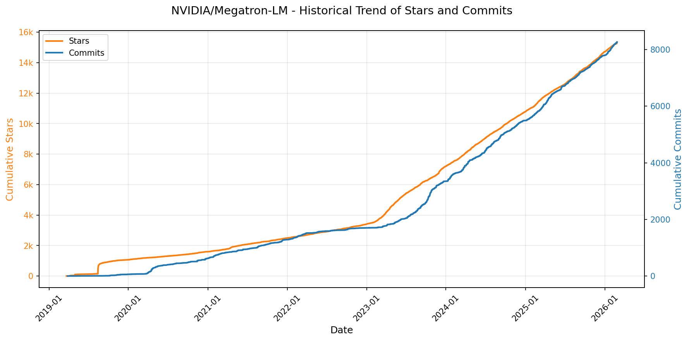
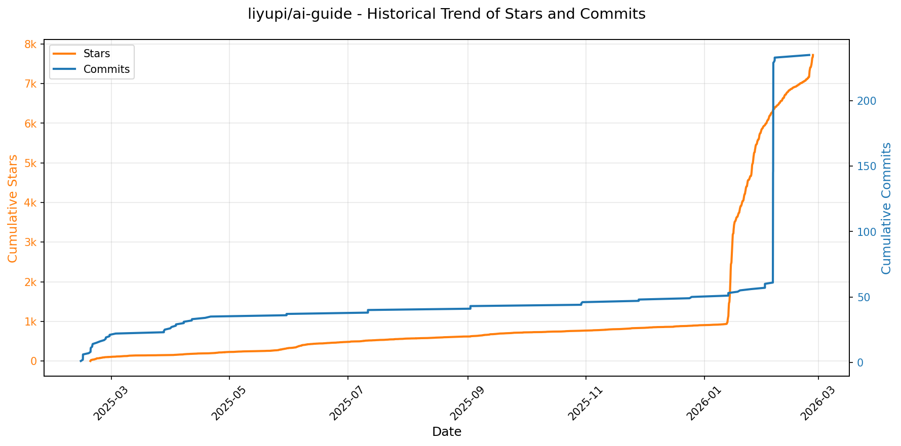
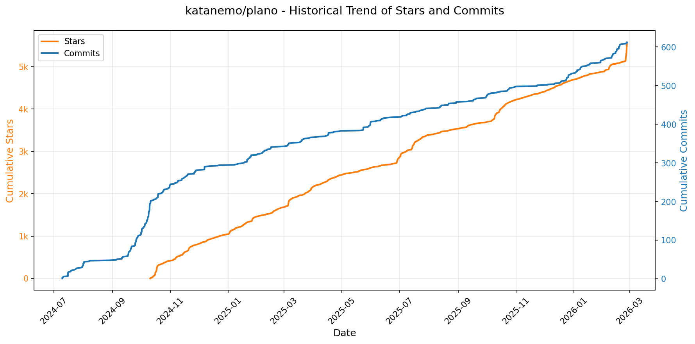

# 🌟 GitHub Trending 概览

> 数据更新于：2026-02-26

---

## 🔍 项目详情

### 1. [anthropics/claude-code](https://github.com/anthropics/claude-code)
- 📅 **创建日期**：2025-02-22  
- 🔄 **最近更新**：2026-02-26  
- ⭐ **Stars**：125,436（日 +432｜周 +2621｜月 +7668）  
- 📝 **描述**：Claude Code is an agentic coding tool that lives in your terminal, understands your codebase, and helps you code faster by executing routine tasks, explaining complex code, and handling git workflows - all through natural language commands.  

<b>📈 Star 与 Commit 历史趋势</b>

> *蓝色：累计 Stars｜橙色：累计 Commits（次 Y 轴）*

<b>📄 README 摘要</b>

1. **该项目的功能**  
Claude Code 是一款终端原生的智能编程助手，能够深度理解用户当前代码库，通过自然语言指令自动执行常规开发任务（如代码生成、重构、调试）、解释复杂代码逻辑、自动化 Git 工作流（如提交、分支管理、冲突分析），并支持在终端、IDE 或 GitHub 中（通过 `@claude` 提及）直接调用。

2. **核心功能**  
- **上下文感知编码**：基于项目文件结构与代码语义，提供精准的代码建议与操作；  
- **自然语言交互**：无需编写脚本，用日常语言指令完成编码任务（如“修复这个 TypeScript 类型错误”或“为该函数添加单元测试”）；  
- **Git 智能协作**：自动解析 Git 状态、生成提交信息、建议分支策略、解释差异（diff）和解决冲突；  
- **插件扩展架构**：内置可插拔系统，支持自定义命令与专用代理（Agent），功能可通过 `plugins/` 目录中的插件进一步增强；  
- **跨平台本地部署**：原生支持 macOS/Linux（Shell 脚本 + Homebrew）和 Windows（PowerShell + WinGet），强调本地运行与工程集成；  
- **内建反馈闭环**：集成 `/bug` 命令，支持一键上报问题并附带会话上下文，便于快速诊断。

3. **技术栈**  
- **运行时**：Node.js 18+（作为主程序基础运行环境）；  
- **客户端分发**：Shell 脚本（macOS/Linux）、PowerShell 脚本（Windows）、Homebrew Cask、WinGet 包管理器；  
- **架构模式**：面向终端的命令行工具（CLI），采用“代理（Agentic）”设计，融合 LLM 推理调度、本地代码索引与 Git API 集成；  
- **生态集成**：深度对接 GitHub（提及交互）、主流 IDE（通过插件桥接）、本地文件系统与版本控制系统；  
- **数据合规层**：内置隐私保护机制，包括敏感数据限时留存、会话数据访问控制、明确禁止将用户代码或对话用于模型训练。

---

### 2. [x1xhlol/system-prompts-and-models-of-ai-tools](https://github.com/x1xhlol/system-prompts-and-models-of-ai-tools)
- 📅 **创建日期**：2025-03-05  
- 🔄 **最近更新**：2026-02-26  
- ⭐ **Stars**：124,200（日 +1095｜周 +9327｜月 +13389）  
- 📝 **描述**：FULL Augment Code, Claude Code, Cluely, CodeBuddy, Comet, Cursor, Devin AI, Junie, Kiro, Leap.new, Lovable, Manus, NotionAI, Orchids.app, Perplexity, Poke, Qoder, Replit, Same.dev, Trae, Traycer AI, VSCode Agent, Warp.dev, Windsurf, Xcode, Z.ai Code, Dia & v0. (And other Open Sourced) System Prompts, Internal Tools & AI Models  

<b>📈 Star 与 Commit 历史趋势</b>

> *蓝色：累计 Stars｜橙色：累计 Commits（次 Y 轴）*

<b>📄 README 摘要</b>

该内容并非一个典型软件项目的 README（缺少项目名称、功能描述、安装使用说明等核心信息），而是一个**AI 系统提示词（system prompts）与模型配置的开源集合仓库的推广性主页**。基于所提供文本，按要求从三个维度进行精准总结如下：

---

### 1. 该项目做什么？  
这是一个**大规模、持续更新的公开仓库**，致力于收集、整理并共享主流 AI 工具（如 ChatGPT、Claude、Gemini、Llama 等）背后的**系统级提示词（system prompts）、模型行为配置及内部指令结构**。其核心目标是：  
- 揭示闭源 AI 模型实际运行时所依赖的隐藏提示工程逻辑；  
- 提供超 **30,000+ 行真实可验证的提示语料与模型行为分析**，服务于 AI 安全研究、提示工程优化、大模型对齐（alignment）分析及竞品技术逆向洞察；  
- 为开发者、研究人员和 AI 创业公司提供可复用、可审计的提示基础设施参考。

> 注：项目本身不运行 AI 模型，也不提供 API 或前端应用，而是以**纯文本/代码仓库形式交付高质量提示数据资产**。

---

### 2. 关键特性  
- ✅ **规模庞大且持续更新**：明确标注含 **30,000+ 行结构化提示与模型行为洞察**，更新日志显示至 2026 年（应为笔误，或象征长期维护承诺）；  
- ✅ **聚焦安全与生产级实践**：嵌入「AI 创业公司安全警示」，主动推广 **ZeroLeaks.ai** —— 专用于检测系统提示、内部工具链与模型配置泄露风险的 AI 安全审计服务；  
- ✅ **强社区与生态联动**：集成 Discord 社群（LeaksLab）、Trendshift 数据看板、DeepWiki 知识图谱链接，并获 Tembo（后台编码代理平台）与 Latitude（LLM 可预测性平台）联合赞助，体现工程落地与 AI 工程化深度结合；  
- ✅ **多维支持与可持续模式**：提供加密货币（BTC/LTC/ETH）、Patreon、Ko-fi 等多种捐赠通道，并公开主创联系方式（X / Discord / 邮箱），强调社区共建与长期维护。

---

### 3. 技术栈  
该项目**无传统意义上的运行时技术栈**（无后端服务、无前端框架、无数据库），其本质是**静态内容驱动的 GitHub 仓库**，技术特征如下：  
- 🧩 **核心载体**：GitHub 仓库（`x1xhlol/system-prompts-and-models-of-ai-tools`），依赖 Git 版本控制与 Markdown/文本文件组织；  
- 📊 **数据呈现层**：通过 Star History 图表、Discord 徽章、Trendshift Badge、DeepWiki 集成等第三方服务实现动态数据可视化与社区连接；  
- ⚙️ **协作与基建支持**：  
  - 构建状态由 **Cloudback.it** 提供 CI/CD 监控；  
  - 安全倡导整合 **ZeroLeaks.ai**（AI 安全审计 SaaS）；  
  - 赞助生态涵盖 **Tembo**（Rust/Python 构建的后台智能体平台）与 **Latitude**（TypeScript/Python 构建的开源 LLM 工程化平台）；  
- 🔐 **隐含技术依赖**：提示逆向分析过程高度依赖 Web 自动化（如 Puppeteer / Playwright）、流量抓包（mitmproxy）、模型响应差异比对等逆向工程工具链（虽未明写，但属项目能力基础）。

--- 

✅ 总结：这是一个以 **“AI 提示词开源情报库”** 为定位的高价值技术资源项目，技术轻量但领域纵深，核心价值在于**数据质量、安全敏感性与工程社区协同**，而非复杂软件架构。

---

### 3. [openclaw/openclaw](https://github.com/openclaw/openclaw)
- 📅 **创建日期**：2025-11-24  
- 🔄 **最近更新**：2026-02-26  
- ⭐ **Stars**：115,480（日 +3951｜周 +20935｜月 +115480）  
- 📝 **描述**：Your own personal AI assistant. Any OS. Any Platform. The lobster way. 🦞   

<b>📈 Star 与 Commit 历史趋势</b>

> *蓝色：累计 Stars｜橙色：累计 Commits（次 Y 轴）*

<b>📄 README 摘要</b>

1. **项目功能**  
OpenClaw 是一个完全本地化、用户自托管的个人 AI 助手系统，核心目标是让用户在**自有设备上全链路掌控 AI 交互**。它不依赖中心化云服务，而是通过轻量级 Gateway（网关）作为统一控制平面，将来自数十种通讯渠道（如 WhatsApp、Telegram、Slack、Discord、Signal、iMessage/BlueBubbles、Teams、Matrix、Zalo、WebChat 等）的消息统一接入，并路由至本地运行的 AI 代理（Agent）。该代理可调用多类工具（浏览器、Canvas 可视化工作区、摄像头、录音、定位、定时任务、Webhook 等），支持语音唤醒（macOS/iOS/Android）、实时语音对话（Talk Mode）、跨会话协作，并能在设备端执行需系统权限的操作（如屏幕录制、通知、命令行执行）。本质是构建一个「以用户为中心、隐私优先、通道无关、能力可扩展」的本地 AI 操作系统。

2. **关键特性**  
- ✅ **全渠道统一收发**：原生支持 13+ 主流及小众通讯平台（含 iMessage 替代方案 BlueBubbles、Zalo 等），支持群组消息路由、提及触发、分块处理与频道隔离；  
- ✅ **本地优先架构**：Gateway 为单进程 WebSocket 控制平面，管理会话、通道、工具、事件、定时任务与 Web UI（Control UI + WebChat），所有数据默认不出设备；  
- ✅ **多智能体工作区（Workspace）与会话隔离**：支持按用户/频道/场景划分独立 Agent 工作区，每个会话具备独立上下文、模型选择、思考等级（`--thinking high`）、激活策略（mention/always）和上下文压缩能力；  
- ✅ **设备级能力融合**：通过 macOS/iOS/Android 节点（Node）实现本地化操作——包括 Voice Wake（常驻语音唤醒）、Talk Mode（连续语音交互）、Canvas 可视化画布（A2UI 驱动）、相机抓拍/录屏、位置获取、系统通知与命令执行（`system.run`），且严格遵循系统权限管控（TCC）；  
- ✅ **安全默认策略**：DM 消息默认启用配对机制（`dmPolicy="pairing"`），未知发送者需输入一次性配对码才被加入白名单；支持 OAuth/API Key 多模型认证与自动故障转移（Model Failover）；  
- ✅ **自动化与扩展生态**：内置 Cron 定时、Gmail Pub/Sub、Webhook 触发；提供技能平台（Skills），支持捆绑技能、托管技能与工作区技能；集成 ClawHub 技能注册中心实现自动发现与拉取；  
- ✅ **远程与混合部署友好**：Gateway 可部署于 Linux 服务器，客户端（macOS App / CLI / WebChat）通过 Tailscale Serve/Funnel 或 SSH 隧道安全连接，节点仍可在本地设备执行敏感操作（“计算在远端，动作在本地”）；  
- ✅ **开箱即用的向导式体验**：提供终端向导 `openclaw onboard`，一键完成 Gateway 守护进程安装、工作区初始化、通道配置与技能设置，支持 macOS/Linux/WSL2。

3. **技术栈**  
- **运行时**：Node.js ≥22（主运行环境），支持 npm / pnpm / bun；TypeScript 编写，使用 `tsx` 直接运行源码；  
- **核心协议与通信**：WebSocket（Gateway 控制平面）、RPC（Pi Agent 运行时通信）、HTTP/HTTPS（Web UI、WebChat、Tailscale Funnel/Serve）；  
- **前端与 UI**：基于 Web 的 Control UI 与 WebChat 内置于 Gateway；macOS/iOS/Android 原生应用（Swift/Kotlin）；Canvas 使用 A2UI（声明式 UI 协议）；  
- **AI 模型集成**：抽象化模型接口，官方推荐 Anthropic Claude Opus（强长上下文与抗提示注入），同时兼容 OpenAI（GPT/Codex）、Ollama、本地 LLM 等；支持 OAuth（如 OpenAI）与 API Key 认证、多模型轮询与降级；  
- **基础设施与部署**：支持 systemd（Linux）、launchd（macOS）守护进程管理；提供 Docker 镜像与 Nix 表达式（`nix-openclaw`）实现声明式配置与可复现部署；  
- **媒体与音视频**：集成 ElevenLabs 语音合成；音频处理（ASR 转录钩子、大小限制、临时文件生命周期管理）；图像/视频管道支持；  
- **安全机制**：Tailscale 身份头校验、密码/Token 认证、设备节点权限映射（`node.invoke` 细粒度控制）、会话上下文剪枝、日志脱敏与 `openclaw doctor` 自检工具。

---

### 4. [obra/superpowers](https://github.com/obra/superpowers)
- 📅 **创建日期**：2025-10-09  
- 🔄 **最近更新**：2026-02-26  
- ⭐ **Stars**：90,902（日 +1401｜周 +7511｜月 +25233）  
- 📝 **描述**：An agentic skills framework & software development methodology that works.  

<b>📈 Star 与 Commit 历史趋势</b>

> *蓝色：累计 Stars｜橙色：累计 Commits（次 Y 轴）*

<b>📄 README 摘要</b>

1. **该项目的作用**  
Superpowers 是一个面向编程智能体（coding agents）的完整软件开发工作流增强系统。它不直接替代或重写底层 AI 编程工具，而是通过一组可组合、自动触发的“技能”（skills）对现有编码代理（如 Claude Code、Cursor、Codex、OpenCode 等）进行能力扩展。其核心目标是将松散、易偏离的 AI 编程行为，转化为结构化、可验证、符合工程最佳实践的协作式开发流程——从需求澄清、设计评审、TDD 实施、子代理协同执行，到代码审查与分支收尾，全程自动化引导并强制执行关键工程纪律。

2. **关键特性**  
- **全流程自动化技能链**：内置 14+ 经过工程验证的技能模块，覆盖开发全生命周期（如 `brainstorming` 需求澄清、`writing-plans` 任务拆解、`subagent-driven-development` 子代理双阶段审查、`test-driven-development` 严格红/绿/重构循环、`requesting-code-review` 分级预审等），所有技能按上下文自动触发，非手动调用。  
- **强约束性工程规范**：强制执行 TDD（测试先行、删减无测试代码）、YAGNI（拒绝过度设计）、DRY（消除重复）、系统性调试（四阶段根因分析）、Git worktree 隔离开发等原则，杜绝“直觉式编码”。  
- **人机协同控制点设计**：在关键决策节点（如设计确认、计划批准、严重缺陷拦截、合并决策）设置显式人工签核（sign-off）与阻断机制，确保人类始终掌握最终控制权。  
- **自演进能力**：提供 `writing-skills` 技能，支持用户遵循统一范式创建、测试和贡献新技能，实现工作流的可持续扩展与社区共建。  
- **跨平台即插即用**：原生适配主流 AI 编程 IDE（Claude Code/Cursor 插件市场一键安装；Codex/OpenCode 支持远程指令加载），安装后无需额外配置即可激活全部能力。

3. **技术栈**  
- **运行时环境**：深度依赖各类 AI 编程代理平台的插件/指令扩展机制（非独立应用），包括 Claude Code、Cursor、Codex、OpenCode 等；本质是面向 LLM Agent 的“技能编排层”（Skill Orchestration Layer）。  
- **核心范式**：基于提示工程（Prompt Engineering）与结构化指令（structured instructions）构建技能逻辑，强调上下文感知触发、分步验证与反馈闭环。  
- **技能实现形式**：以 Markdown 文档（`.md`）为主载体（如 `skills/test-driven-development/SKILL.md`），内含明确的行为规范、检查清单、反模式警示及示例；部分技能可能结合轻量脚本或平台 API 调用（如 Git 操作、测试运行器集成），但主体逻辑由 LLM 推理驱动。  
- **基础设施**：依托 GitHub 生态（代码托管、Marketplace 分发、Issue 协作）、MIT 开源协议；更新机制依赖平台插件系统（如 `/plugin update`）。

---

### 5. [asgeirtj/system_prompts_leaks](https://github.com/asgeirtj/system_prompts_leaks)
- 📅 **创建日期**：2025-05-03  
- 🔄 **最近更新**：2026-02-26  
- ⭐ **Stars**：33,082（日 +116｜周 +1058｜月 +7697）  
- 📝 **描述**：Collection of extracted System Prompts from popular chatbots like ChatGPT, Claude & Gemini  

<b>📈 Star 与 Commit 历史趋势</b>

> *蓝色：累计 Stars｜橙色：累计 Commits（次 Y 轴）*

---

### 6. [shareAI-lab/learn-claude-code](https://github.com/shareAI-lab/learn-claude-code)
- 📅 **创建日期**：2025-06-29  
- 🔄 **最近更新**：2026-02-26  
- ⭐ **Stars**：32,670（日 +303｜周 +776｜月 +2664）  
- 📝 **描述**：Bash is all you need -  A nano Claude Code–like agent, built from 0 to 1  

<b>📈 Star 与 Commit 历史趋势</b>

> *蓝色：累计 Stars｜橙色：累计 Commits（次 Y 轴）*

<b>📄 README 摘要</b>

1. **该项目做什么？**  
该项目是一个面向教学的“从零到一”构建AI编程智能体（agent）的学习项目，目标是实现一个极简但可扩展的、类Claude Code风格的代码协作智能体系统。它不追求生产级功能完备性，而是通过**12个渐进式会话（s01–s12）**，逐层叠加核心机制，揭示AI编码智能体的本质运行范式——即“工具调用循环（tool-use loop）”。每个会话仅引入**一个关键机制**（如工具调度、计划生成、子智能体隔离、上下文压缩、状态持久化、异步后台任务、多智能体通信、自主任务认领等），所有机制均严格构建在不变的核心循环之上，帮助学习者建立清晰、可迁移的智能体架构心智模型。

2. **关键特性**  
- **极简可验证的核心循环**：固定结构的`while`循环，基于LLM响应的`stop_reason`判断是否执行工具，并将结果追加回消息流，形成闭环。  
- **机制正交演进**：12个会话严格遵循“一机制一课”原则，每课只新增一个能力（如`s03`引入显式规划、`s06`实现策略性遗忘、`s11`实现无协调器的自主任务认领），且**绝不修改基础循环逻辑**，凸显架构分层与关注点分离。  
- **面向教学的轻量实现**：提供Python参考实现（`agents/`）、三语文档（`docs/`）、交互式Web学习平台（Next.js，含可视化流程图与源码浏览），支持逐步调试与概念验证。  
- **真实工程启发的设计理念**：强调“进程隔离即上下文隔离”（s04）、“按需加载知识而非塞入系统提示”（s05）、“状态存文件以超越上下文压缩”（s07）、“目录级任务隔离 + 任务ID协调”（s12）等贴近实际工程挑战的抽象。  
- **明确范围界定**：主动省略生产级复杂性（如完整事件总线、RBAC权限体系、MCP协议全实现），聚焦可理解、可动手、可推演的核心模式，避免认知过载。

3. **技术栈**  
- **核心语言与运行时**：Python（主力实现，含`anthropic` SDK调用Claude API）  
- **前端与交互平台**：TypeScript + Next.js（`web/`目录），提供本地开发服务器（`npm run dev`）  
- **依赖管理**：`pip`（Python包）、`npm`（前端）  
- **关键外部服务**：Anthropic API（需配置`ANTHROPIC_API_KEY`）  
- **协议与格式**：JSONL（智能体间消息传递协议）、纯文本技能文件（`.md`，用于s05动态加载）、文件系统（`tasks/`目录持久化状态）  
- **辅助工具链**：GitHub Actions CI（类型检查+构建）、ASCII流程图（文档中直观表达架构思想）

---

### 7. [thedotmack/claude-mem](https://github.com/thedotmack/claude-mem)
- 📅 **创建日期**：2025-08-31  
- 🔄 **最近更新**：2026-02-26  
- ⭐ **Stars**：31,372（日 +287｜周 +2059｜月 +16141）  
- 📝 **描述**：A Claude Code plugin that automatically captures everything Claude does during your coding sessions, compresses it with AI (using Claude's agent-sdk), and injects relevant context back into future sessions.  

<b>📈 Star 与 Commit 历史趋势</b>

> *蓝色：累计 Stars｜橙色：累计 Commits（次 Y 轴）*

<b>📄 README 摘要</b>

1. **项目功能**  
Claude-Mem 是一个专为 Anthropic 的 **Claude Code**（AI 编程助手）构建的**持久化记忆压缩系统**。它在用户每次会话结束后，自动捕获工具调用、代码操作、错误修复等上下文事件（称为“observations”），生成语义化摘要，并持久化存储于本地 SQLite 数据库中；当新会话启动时，智能检索并按需注入相关历史记忆，从而实现跨会话的**上下文连续性**——使 Claude 能“记住”项目进展、技术决策、已修复 Bug 等关键信息，显著提升长周期开发任务中的推理一致性与效率。

2. **核心特性**  
- ✅ **持久记忆（Persistent Memory）**：会话结束后记忆不丢失，自动延续至后续交互；  
- ✅ **渐进式披露（Progressive Disclosure）**：分三层（索引→时间线→详情）按需加载记忆，实时显示 token 消耗，优化成本；  
- ✅ **技能化搜索（Skill-Based Search）**：内置 `mem-search` 技能及 4 个标准化 MCP 工具（`search` / `timeline` / `get_observations`），支持自然语言查询 + 类型/日期/项目过滤；  
- ✅ **可视化 Web 查看器（Web Viewer UI）**：本地 `http://localhost:37777` 提供实时记忆流、全文检索、观察详情页及 ID 引用链接；  
- ✅ **多端集成能力**：原生支持 Claude Desktop 对话内搜索、OpenClaw 网关一键部署（含 Telegram/Discord/Slack 实时通知）；  
- ✅ **隐私与可控性**：支持 `<private>` 标签屏蔽敏感内容；提供细粒度配置项（如注入策略、模型选择、上下文范围）；  
- ✅ **自动化无感运行**：通过 6 个生命周期 Hook（SessionStart/PostToolUse/SessionEnd 等）全自动触发，无需手动干预；  
- ✅ **混合检索架构**：结合 SQLite FTS5 全文搜索 + Chroma 向量数据库，实现关键词+语义双重精准召回；  
- ✅ **Beta 实验通道**：支持 Endless Mode（仿生长时记忆架构）等前沿功能快速体验与版本切换。

3. **技术栈**  
- **运行时**：Node.js ≥18.0.0（主逻辑）、Bun（Worker 服务管理与 HTTP API）、uv（Python 包管理，用于向量搜索依赖）；  
- **数据库**：SQLite 3（嵌入式，含 FTS5 全文索引） + Chroma（轻量级向量数据库，用于语义搜索）；  
- **前端界面**：纯静态 Web UI（基于 HTML/CSS/JS），托管于本地 Bun HTTP Server；  
- **插件协议**：遵循 Claude Agent SDK 与 MCP（Model Context Protocol）规范；  
- **开发语言**：TypeScript（全栈）；  
- **部署与工具链**：npm（插件市场分发）、Shell 脚本（OpenClaw 一键安装）、Git（版本控制）；  
- **许可证**：主项目采用 AGPL-3.0（强 Copyleft，网络服务需开源修改）；`ragtime/` 子模块采用 PolyForm Noncommercial License。

---

### 8. [virattt/dexter](https://github.com/virattt/dexter)
- 📅 **创建日期**：2025-10-14  
- 🔄 **最近更新**：2026-02-26  
- ⭐ **Stars**：23,947（日 +184｜周 +838｜月 +7549）  
- 📝 **描述**：An autonomous agent for deep financial research  

<b>📈 Star 与 Commit 历史趋势</b>

> *蓝色：累计 Stars｜橙色：累计 Commits（次 Y 轴）*

<b>📄 README 摘要</b>

1. **项目功能**  
Dexter 是一个面向金融研究的自主式AI代理系统，能够对复杂金融问题进行端到端的自动分析：接收自然语言提问 → 自主规划多步研究任务 → 调用实时市场数据工具（如财报、资产负债表、现金流量表）执行查询 → 对中间结果进行自我验证与反思 → 迭代优化直至生成可信、数据支撑的结论。其核心定位是“金融领域的Claude Code”，专为高精度、可追溯、安全可控的自动化财务尽调与研究场景而设计。

2. **关键特性**  
- **智能任务规划（Intelligent Task Planning）**：自动将模糊或复杂的金融问题（如“对比苹果与英伟达过去三年的盈利质量与资本效率”）拆解为结构化、可执行的研究子任务序列；  
- **自主执行与工具编排（Autonomous Execution）**：动态选择并调用适配的API工具（如Financial Datasets获取财报、Exa/Tavily进行网络检索），支持多源异构数据融合；  
- **自省式验证与迭代（Self-Validation & Iteration）**：内置推理链监控与结果校验机制，能识别逻辑漏洞、数据矛盾或信息缺失，并主动发起修正步骤；  
- **实时权威金融数据接入**：原生集成Financial Datasets API，免费支持AAPL、NVDA、MSFT等主流标的的年度/季度三大报表（利润表、资产负债表、现金流量表）；  
- **生产级安全机制**：强制启用循环检测（loop detection）、最大步骤限制（step limits）及超时熔断，杜绝无限推理或失控执行；  
- **全链路可追溯性**：通过JSONL格式的Scratchpad日志完整记录每轮交互的原始问题、所有工具调用参数/返回值/LLM摘要、以及每一步思维推理（thinking），支持精准调试与审计；  
- **多模态交互支持**：除命令行交互外，提供WhatsApp网关，实现通过个人WhatsApp聊天窗口直接发起研究请求并接收结构化回复。

3. **技术栈**  
- **运行时**：Bun（v1.0+）—— 作为高性能JavaScript/TypeScript运行时，替代Node.js，显著提升依赖安装与启动速度；  
- **AI模型层**：以OpenAI API为核心（默认GPT系列），同时预留Anthropic（Claude）、Google（Gemini）、xAI（Grok）、OpenRouter等多模型后端插槽，支持灵活切换；  
- **数据服务**：  
  - 主数据源：Financial Datasets API（机构级实时财报数据）；  
  - 补充检索：Exa API（首选）、Tavily API（备用）用于开放网络金融信息挖掘；  
- **可观测性与评估**：LangSmith（用于追踪推理链、监控token消耗、可视化执行流程） + LLM-as-Judge评估框架（自动化打分金融问答准确性）；  
- **部署与扩展**：支持Ollama本地大模型（通过`OLLAMA_BASE_URL`配置），便于离线或私有化部署；  
- **通信网关**：基于WhatsApp Business API构建的轻量级消息网关，实现零前端的移动端研究入口。

---

### 9. [VectifyAI/PageIndex](https://github.com/VectifyAI/PageIndex)
- 📅 **创建日期**：2025-04-01  
- 🔄 **最近更新**：2026-02-26  
- ⭐ **Stars**：22,525（日 +462｜周 +2227｜月 +8024）  
- 📝 **描述**：📑 PageIndex: Document Index for Vectorless, Reasoning-based RAG  

<b>📈 Star 与 Commit 历史趋势</b>

> *蓝色：累计 Stars｜橙色：累计 Commits（次 Y 轴）*

<b>📄 README 摘要</b>

1. **该项目的功能**  
PageIndex 是一个面向长文档（如财报、法律文件、学术教材等）的**向量库无关、基于推理的检索增强生成（RAG）系统**。它不依赖传统向量数据库或文本分块，而是通过构建文档的**语义层次化树状索引**（类似智能目录），并利用大语言模型（LLM）在该索引上执行**多步推理式树搜索**，实现高精度、可追溯、类人化的信息检索与上下文提取。其核心目标是解决传统向量相似性检索中“相似≠相关”的根本缺陷，专为需要领域知识和复杂逻辑推理的专业文档分析场景而设计。

2. **关键特性**  
- **无向量数据库（Vectorless）**：完全摒弃嵌入计算与向量相似性搜索，转而依靠文档结构理解与LLM推理完成检索；  
- **无文本分块（No Chunking）**：保留文档天然语义单元（如章节、小节），避免人工切分导致的上下文断裂；  
- **类人检索能力（Human-like Retrieval）**：模拟专家阅读行为，通过层级导航（Tree Search）定位最相关信息，支持多跳推理与跨节关联；  
- **高可解释性与可追溯性**：每次检索结果附带明确的页码、节点ID及推理路径，输出透明、可审计，杜绝“黑箱式模糊匹配”；  
- **原生视觉支持（Vision-based RAG）**：提供OCR-Free方案，可直接对PDF页面图像进行端到端推理检索，无需预处理文本提取；  
- **卓越性能验证**：驱动的金融分析系统 Mafin 2.5 在 FinanceBench 基准测试中达成 **98.7% 准确率**，显著超越主流向量RAG方案。

3. **技术栈**  
- **核心模型层**：依赖 OpenAI 系列大模型（默认 `gpt-4o-2024-11-20`）执行树结构生成、节点摘要、推理式检索等任务；  
- **文档解析层**：支持 PDF（基于 PyPDF2/fitz 等库）与 Markdown 格式；提供专用 PageIndex OCR（未开源但已商用）用于高保真结构化文本提取；  
- **架构设计**：基于**树索引（Tree Index）** 的 agentic 检索框架，采用递归节点划分策略（支持自定义每节点最大页数/Token数）；  
- **部署与集成**：提供开源 CLI 工具（Python）、Colab Notebook 示例、RESTful API（Beta）、MCP（Model Context Protocol）插件，以及云端聊天平台（chat.pageindex.ai）；  
- **开发环境**：Python 3.x，依赖 `openai`, `pypdf`, `python-dotenv`, `tiktoken` 等标准库，支持 `.env` 配置密钥管理。

---

### 10. [KeygraphHQ/shannon](https://github.com/KeygraphHQ/shannon)
- 📅 **创建日期**：2025-09-27  
- 🔄 **最近更新**：2026-02-26  
- ⭐ **Stars**：21,953（日 +272｜周 +1685｜月 +18202）  
- 📝 **描述**：Fully autonomous AI hacker to find actual exploits in your web apps. Shannon has achieved a 96.15% success rate on the hint-free, source-aware XBOW Benchmark.  

<b>📈 Star 与 Commit 历史趋势</b>

> *蓝色：累计 Stars｜橙色：累计 Commits（次 Y 轴）*

<b>📄 README 摘要</b>

1. **项目功能**  
Shannon 是一个全自动化的 AI 渗透测试框架，专为**白盒（源码可用）Web 应用安全测试**设计。它不只静态扫描或生成告警，而是真正执行端到端的攻击链：先深度分析目标应用的源代码以智能定位攻击面，再通过内置浏览器和命令行环境动态发起真实 exploit（如 SQL 注入、XSS、SSRF、认证/授权绕过等），最终验证漏洞是否可利用并生成带可复现 PoC 的报告。其核心使命是填补开发高频迭代（如 Claude/Cursor 驱动）与传统年度渗透测试之间的巨大安全时效缺口，实现“每次构建均可安全发布”。

2. **关键特性**  
- ✅ **全自主运行**：单命令启动，自动处理复杂登录（含 2FA/TOTP、Google 登录）、页面导航与多阶段攻击，全程零人工干预；  
- ✅ **可验证漏洞报告**：输出聚焦于**已成功 exploited 的高置信度结果**，附带一键复制的 PoC 脚本，彻底消除误报；  
- ✅ **关键 OWASP 漏洞覆盖**：当前原生支持 Injection、XSS、SSRF、Broken Authentication/Authorization 的检测与实证，持续扩展中；  
- ✅ **代码感知的动态测试**：融合静态源码分析（指导攻击策略）与动态运行时 exploitation（浏览器+CLI），精准评估真实风险；  
- ✅ **集成专业安全工具链**：在侦察阶段调用 Nmap、Subfinder、WhatWeb、Schemathesis 等业界工具增强目标测绘深度；  
- ✅ **并行化加速**：对不同漏洞类型的分析与利用任务并发执行，显著缩短整体测试耗时；  
- ✅ **工作区与断点续跑**：基于 Git 提交的 checkpoint 机制，支持任意中断后精准恢复，避免重复执行已完成环节。

3. **技术栈**  
- **核心架构**：基于 **Temporal 工作流引擎** 构建的多 Agent 协同系统，模拟人类渗透测试员的四阶段流程（侦察 → 漏洞分析 → 利用 → 报告）；  
- **AI 引擎**：深度集成 **Anthropic Claude 系列模型**（主力为 Claude Code），通过 Anthropic Agent SDK 实现复杂推理与自动化决策；支持实验性接入 OpenAI（GPT-5.2）、Google Gemini（via OpenRouter）；  
- **运行环境**：全容器化部署，**强依赖 Docker**（含 WSL2/Windows/macOS/Linux 全平台适配）；  
- **基础设施**：本地 Temporal Server（`localhost:8233` Web UI 监控）、Git 版本控制（用于 workspace 状态持久化）；  
- **安全工具集成**：Nmap（网络扫描）、Subfinder（子域发现）、WhatWeb（指纹识别）、Schemathesis（API 合约模糊测试）；  
- **许可证**：Shannon Lite 开源版采用 **AGPL-3.0** 许可证，强调白盒测试前提与社区协作。

---

### 11. [bytedance/deer-flow](https://github.com/bytedance/deer-flow)
- 📅 **创建日期**：2025-05-07  
- 🔄 **最近更新**：2026-02-26  
- ⭐ **Stars**：20,457（日 +303｜周 +478｜月 +1067）  
- 📝 **描述**：An open-source SuperAgent harness that researches, codes, and creates. With the help of sandboxes, memories, tools, skills and subagents, it handles different levels of tasks that could take minutes to hours.  

<b>📈 Star 与 Commit 历史趋势</b>

> *蓝色：累计 Stars｜橙色：累计 Commits（次 Y 轴）*

<b>📄 README 摘要</b>

1. **项目功能**  
DeerFlow 2.0 是一个开源的「超级智能体运行时框架（Super Agent Harness）」，核心目标是**让 AI 智能体真正“做事”而非仅对话**。它通过统一编排子智能体（Sub-Agents）、沙箱执行环境（Sandbox）、结构化技能（Skills）、长时记忆（Long-Term Memory）和上下文工程能力，支持端到端完成复杂、多步骤、跨模态的实际任务——例如深度网络研究、自动生成报告/幻灯片/网页、图像/视频生成、数据管道构建、内容工作流自动化等。它不再是一个需手动组装的“研究框架”，而是一个开箱即用、可深度定制的生产级智能体操作系统。

2. **关键特性**  
- **可扩展技能系统（Skills & Tools）**：以 Markdown 定义的模块化技能（如 `research/`, `slide-creation/`, `image-generation/`），支持按需加载、动态组合与用户自定义；内置工具集（网络搜索、文件操作、Bash 执行等）+ MCP 服务器/Python 函数扩展机制，实现能力无限延伸。  
- **动态子智能体编排（Sub-Agents）**：主智能体可自主分解任务、实时创建多个隔离的子智能体并行执行，各子智能体拥有独立上下文、专属工具与终止条件，结果结构化回传后由主智能体聚合输出，支撑分钟至小时级复杂任务。  
- **全隔离沙箱与文件系统（Sandbox & File System）**：每个任务在独立 Docker 容器中运行，配备完整可读写文件系统（`/mnt/user-data/workspace/`, `/outputs/`, `/uploads/`），支持代码执行、文件编辑、图像渲染等真实操作，保障安全性、可审计性与会话隔离。  
- **精细化上下文工程（Context Engineering）**：子智能体上下文严格隔离；会话内自动摘要已完成步骤、卸载中间结果至文件系统、压缩非关键信息，显著缓解大模型上下文窗口压力。  
- **本地持久化长时记忆（Long-Term Memory）**：跨会话记忆用户画像、偏好、技术栈、写作习惯及历史知识，数据完全本地存储、用户自主掌控，随使用持续进化。

3. **技术栈**  
- **核心框架**：基于 [LangChain](https://github.com/langchain-ai/langchain)（LLM 集成与工具链）与 [LangGraph](https://github.com/langchain-ai/langgraph)（多智能体状态图编排）构建，实现可靠、可追溯的智能体工作流。  
- **执行环境**：Docker 容器化沙箱（支持本地、Docker、Kubernetes Provisioner 三种模式），配合自定义文件系统挂载与资源隔离。  
- **配置与部署**：YAML 配置驱动（`config.yaml`），支持多模型（OpenAI 兼容 API）、环境变量管理（`.env`），提供 Makefile 自动化命令（`make docker-start`, `make dev`）及 Docker 一键部署方案。  
- **扩展生态**：原生支持 [MCP（Model Context Protocol）](https://modelcontextprotocol.io/) 服务器，便于集成第三方工具与服务；技能目录结构化设计，支持社区共建与热插拔。

---

### 12. [gsd-build/get-shit-done](https://github.com/gsd-build/get-shit-done)
- 📅 **创建日期**：2025-12-14  
- 🔄 **最近更新**：2026-02-26  
- ⭐ **Stars**：20,353（日 +811｜周 +4530｜月 +12196）  
- 📝 **描述**：A light-weight and powerful meta-prompting, context engineering and spec-driven development system for Claude Code and OpenCode.  

<b>📈 Star 与 Commit 历史趋势</b>

> *蓝色：累计 Stars｜橙色：累计 Commits（次 Y 轴）*

<b>📄 README 摘要</b>

1. **该项目做什么？**  
该项目是一个轻量级但功能强大的元提示（meta-prompting）、上下文工程（context engineering）与规范驱动开发（spec-driven development）系统，专为 Claude Code、OpenCode、Gemini CLI 和 Codex 等 AI 编程助手设计。其核心目标是**解决“上下文腐化”（context rot）问题**——即当大模型（尤其是 Claude）的上下文窗口被逐步填满时，生成质量显著下降的现象。GSD 通过结构化工作流，在整个开发周期中主动管理、分隔和刷新上下文，确保每个任务都在干净、高容量（200k tokens）、语义聚焦的独立上下文中执行，从而实现高质量、可预测、可验证的 AI 辅助开发。

2. **关键特性**  
- **六阶段闭环工作流**：`new-project → discuss-phase → plan-phase → execute-phase → verify-work → complete-milestone`，每阶段职责清晰、状态可追溯；  
- **智能上下文工程**：自动维护 `PROJECT.md`、`REQUIREMENTS.md`、`ROADMAP.md`、`STATE.md`、`CONTEXT.md` 等结构化文档，动态加载必要上下文，严格规避上下文膨胀；  
- **XML 结构化提示**：所有任务计划均以带 `<verify>`、`<done>` 等标签的 XML 格式编写，确保指令精准、验证内建、模型理解无歧义；  
- **多智能体协同编排**：各阶段由轻量级协调器调度专用子智能体（如 Researcher、Planner、Executor、Verifier），研究、规划、执行、验证并行/分波（wave-based）运行，主会话上下文始终轻量（30–40% 占用）；  
- **原子化 Git 提交**：每个子任务生成独立、语义化提交（含 phase/timestamp 标识），支持精准 bisect、回滚与历史追溯；  
- **代码库感知能力**：支持 `/gsd:map-codebase` 对现有项目进行多维度（架构、技术栈、约定、痛点）并行分析，使后续开发深度适配当前代码风格；  
- **灵活模式支持**：提供完整流程（Full Mode）与快捷模式（`/gsd:quick`），兼顾复杂功能开发与日常小任务（如 bug 修复、配置调整）；  
- **模块化与可演进性**：支持动态插入/删除阶段、跨里程碑复用、手动生成暂停/恢复（`/gsd:pause-work`/`resume-work`），适应真实开发中的需求变更。

3. **技术栈**  
- **运行时支持**：Claude Code（主力）、OpenCode（开源免费模型）、Gemini CLI、GitHub Codex（基于 Skills 机制）；  
- **核心实现语言**：Node.js（CLI 工具链、安装脚本 `bin/install.js`、本地协调逻辑）；  
- **提示工程层**：自研 XML Schema 驱动的结构化提示模板，深度适配 Claude 的解析与推理能力；  
- **状态与配置管理**：基于文件系统的本地化持久化（`.planning/` 目录树），含 `config.json`、`STATE.md`、各阶段 Markdown/JSON 文档；  
- **权限与集成**：深度集成 Bash 命令调用（`git`、`curl`、`ls` 等），支持 `--dangerously-skip-permissions` 或细粒度权限白名单配置；  
- **部署与分发**：以 npm 包（`get-shit-done-cc`）形式发布，支持 `npx` 一键安装，兼容 macOS / Windows / Linux；  
- **扩展生态**：配套 Discord 社区、X（Twitter）账号、$GSD 代币（Solana 链上）、Docker/CI 友好非交互式安装选项。

---

### 13. [badlogic/pi-mono](https://github.com/badlogic/pi-mono)
- 📅 **创建日期**：2025-08-09  
- 🔄 **最近更新**：2026-02-26  
- ⭐ **Stars**：16,677（日 +745｜周 +3137｜月 +14286）  
- 📝 **描述**：AI agent toolkit: coding agent CLI, unified LLM API, TUI & web UI libraries, Slack bot, vLLM pods  

<b>📈 Star 与 Commit 历史趋势</b>

> *蓝色：累计 Stars｜橙色：累计 Commits（次 Y 轴）*

<b>📄 README 摘要</b>

1. **项目功能**  
该项目是一个面向 AI 代理（AI Agents）开发与大语言模型（LLM）部署管理的**一体化单体仓库（Monorepo）**，核心目标是提供可组合、可扩展的工具链，用于构建生产级 AI 编程助手及智能代理系统。它不直接提供终端用户产品，而是为开发者提供底层能力模块（如统一 LLM 接口、代理运行时、终端/Web UI、GPU 推理集群管理等），支撑如 `pi-coding-agent`（交互式编程代理 CLI）等上层应用。

2. **关键特性**  
- **多提供商统一 LLM 抽象层**：`@mariozechner/pi-ai` 支持 OpenAI、Anthropic、Google 等主流模型 API，屏蔽底层差异；  
- **轻量高性能代理运行时**：`@mariozechner/pi-agent-core` 提供工具调用（tool calling）、状态持久化、执行流控制等核心代理能力；  
- **全栈交互式编程体验**：包含终端 UI（`pi-tui`，支持差分渲染）、Web UI 组件（`pi-web-ui`）和 Slack 集成机器人（`pi-mom`）；  
- **本地/云原生 LLM 部署支持**：`pi-pods` CLI 可一键管理基于 vLLM 的 GPU 推理实例（pod），适配私有或边缘部署场景；  
- **开箱即用的编码代理**：`pi-coding-agent` 是一个可直接运行的命令行编程助手，支持文件操作、代码生成、调试建议等；  
- **工程友好型单体架构**：所有包共享依赖、构建与测试流程，支持跨包类型安全与增量构建。

3. **技术栈**  
- **语言与运行时**：TypeScript（全栈主语言）、Node.js（服务端/CLI 运行时）；  
- **前端框架**：无重型框架，`pi-web-ui` 基于标准 Web Components（自定义元素 + Shadow DOM），`pi-tui` 使用纯终端渲染（非 React/Vue）；  
- **LLM 集成**：适配 RESTful API（OpenAI 兼容格式）、Anthropic Messages API、Google Vertex AI 等；  
- **推理后端**：vLLM（通过 `pi-pods` 管理 GPU 推理服务）；  
- **基础设施与工具**：GitHub Actions CI/CD、npm workspaces（单体管理）、TypeScript 编译与类型检查、Prettier + ESLint（代码规范）、Jest（单元测试）；  
- **部署与协作**：Discord 社区支持、MIT 开源协议。

---

### 14. [NVIDIA/Megatron-LM](https://github.com/NVIDIA/Megatron-LM)
- 📅 **创建日期**：2019-03-21  
- 🔄 **最近更新**：2026-02-26  
- ⭐ **Stars**：15,350（日 +82｜周 +131｜月 +355）  
- 📝 **描述**：Ongoing research training transformer models at scale  

<b>📈 Star 与 Commit 历史趋势</b>

> *蓝色：累计 Stars｜橙色：累计 Commits（次 Y 轴）*

<b>📄 README 摘要</b>

1. **项目功能**  
该项目提供一套面向大规模Transformer模型训练的GPU高性能优化库，核心目标是支持超大规模语言模型（LLM）在数千张GPU上高效、稳定、可扩展地训练。它通过深度系统级优化，实现从20亿到4620亿参数模型的端到端训练，已在NVIDIA H100集群上达成最高47%的模型FLOP利用率（MFU），并支持生产级容错、检查点恢复与跨数据中心训练。

2. **关键特性**  
- **多维并行架构**：原生支持张量并行（TP）、流水线并行（PP）、数据并行（DP）、专家并行（EP）和上下文并行（CP），并引入**动态上下文并行（Dynamic CP）**，针对变长序列训练实现最高1.48倍加速；  
- **先进精度支持**：全面兼容FP16、BF16、FP8及实验性FP4混合精度训练，含FP8专用内核与Blackwell GPU深度优化；  
- **模型架构灵活性**：内置标准Transformer及MoE（如DeepSeek-V3、Qwen3、Mixtral）模型支持，集成YaRN RoPE缩放、Attention Sinks、自定义激活函数等前沿技术；  
- **生态互通能力**：通过**Megatron Bridge**实现Hugging Face ↔ Megatron双向检查点无损转换，附带生产就绪的主流模型转换配方；  
- **框架可扩展性**：Megatron Core以模块化、可组合API设计，供开发者构建定制化训练框架；Megatron-LM则提供开箱即用的参考训练脚本，便于快速实验与研究验证；  
- **工程完备性**：支持多数据中心训练、细粒度通信重叠（梯度/参数/TP通信）、全栈性能监控、TensorRT-LLM导出、RLHF、后训练（量化/剪枝/蒸馏）及Mamba等状态空间模型扩展。

3. **技术栈**  
- **编程语言**：Python（主逻辑）、CUDA C++（高性能算子内核，如FlashAttention、TP通信原语）；  
- **深度学习框架**：PyTorch（底层依赖），深度集成FSDP、DDP及自研分布式原语；  
- **并行基础设施**：基于NCCL（GPU间通信）、MPI（跨节点协调）；  
- **构建与部署**：pip包管理（`megatron-core`独立发布）、GitHub Actions CI/CD、支持Linux/HPC环境；  
- **配套工具链**：集成TensorRT-LLM导出、NeMo框架桥接、性能分析工具（MFU测算）、自动化测试套件（tests/）及结构化文档（Sphinx + Read the Docs）。

---

### 15. [D4Vinci/Scrapling](https://github.com/D4Vinci/Scrapling)
- 📅 **创建日期**：2024-10-13  
- 🔄 **最近更新**：2026-02-26  
- ⭐ **Stars**：15,016（日 +2358｜周 +5982｜月 +6213）  
- 📝 **描述**：🕷️ An adaptive Web Scraping framework that handles everything from a single request to a full-scale crawl!  

<b>📈 Star 与 Commit 历史趋势</b>

> *蓝色：累计 Stars｜橙色：累计 Commits（次 Y 轴）*

<b>📄 README 摘要</b>

1. **项目功能**  
Scrapling 是一个自适应的现代化网络爬虫框架，专为应对当代复杂网页环境而设计。它统一处理从单次 HTTP 请求到大规模分布式爬取的全场景需求：既能快速抓取静态页面，也能通过浏览器自动化（Playwright/Chrome）抓取动态渲染内容；能自动绕过 Cloudflare Turnstile、Akamai、DataDome 等主流反爬系统；其核心解析器具备“自适应定位”能力——当目标网站 DOM 结构变更时，无需手动修改选择器，即可基于语义与视觉相似性智能重定位元素；同时支持带断点续爬、多会话并发、实时流式数据输出的完整爬虫生命周期管理。

2. **关键特性**  
- **智能自适应解析**：CSS/XPath/文本/正则/过滤等多种选择方式；支持 `adaptive=True` 自动容错定位；提供 `find_similar()`、`below_elements()` 等高级 DOM 关系导航。  
- **全栈反爬对抗能力**：内置 `StealthyFetcher`（TLS 指纹模拟、请求头伪装、Cloudflare Turnstile 自动求解）和 `DynamicFetcher`（无头浏览器级动态加载），支持 HTTP/3、多协议代理轮换及域名拦截。  
- **生产级爬虫框架（Spiders）**：类 Scrapy 的异步 Spider API，支持 `start_urls`、`parse` 回调、`Request`/`Response` 对象；内置并发控制、按域限速、多会话路由（HTTP/Stealthy/Dynamic 混合调度）、Ctrl+C 断点保存与自动恢复、流式 `async for item in spider.stream()` 实时数据消费。  
- **开发者体验优化**：交互式 IPython 爬虫 Shell（支持 curl 转 Scrapling、浏览器预览）；开箱即用的 CLI 工具（`scrapling extract` 直接命令行抓取并导出 HTML/Markdown/TXT）；自动生成鲁棒 CSS/XPath 选择器；完整类型提示（PyRight/MyPy 全覆盖）、Docker 镜像预装浏览器、10 倍加速 JSON 序列化。  
- **AI 协同能力**：内置 MCP（Model Context Protocol）服务器，可作为 AI（如 Claude/Cursor）的数据前置处理层——先由 Scrapling 精准提取目标内容，再交由大模型结构化，显著降低 token 消耗与响应延迟。

3. **技术栈**  
- **核心语言**：Python 3.9+（全代码库严格类型注解）  
- **网络与会话层**：`httpx`（HTTP/3 支持）、`playwright`（Chromium/Chrome 动态渲染）、`undetected-chromedriver` 或原生 Chrome 驱动（隐身模式）  
- **解析引擎**：自研高性能 Selector 解析器（兼容 Scrapy/Parsel 语法，支持链式调用、伪元素、懒加载）  
- **异步生态**：`asyncio` 原生支持，`AsyncFetcher`/`AsyncStealthySession`/`AsyncDynamicSession` 等异步组件  
- **工程基础设施**：GitHub Actions 自动化测试（92% 覆盖率）、Read the Docs 文档系统、PyPI 发布、Docker 官方镜像（含预配置浏览器）、多语言 README（含简体中文）  
- **扩展集成**：MCP 协议服务器（AI 工具链对接）、SerpApi/Scrapeless/ThorData 等商业服务深度适配

---

### 16. [datawhalechina/hello-agents](https://github.com/datawhalechina/hello-agents)
- 📅 **创建日期**：2025-09-07  
- 🔄 **最近更新**：2026-02-26  
- ⭐ **Stars**：15,007（日 +0｜周 +0｜月 +0）  
- 📝 **描述**：📚 《从零开始构建智能体》——从零开始的智能体原理与实践教程  

<b>📈 Star 与 Commit 历史趋势</b>

> *蓝色：累计 Stars｜橙色：累计 Commits（次 Y 轴）*

<b>📄 README 摘要</b>

1. **该项目做什么？**  
Hello-Agents 是 Datawhale 社区发起的**系统性、实践导向的智能体（Agent）开源学习教程**，旨在帮助学习者从零开始深入理解并亲手构建真正的 AI Native 智能体系统（而非仅流程编排型低代码平台应用）。它覆盖从基础理论（智能体定义、演进史、LLM 原理）到工程实现（经典范式编码、主流框架应用、自研框架开发），再到高级能力（记忆、上下文工程、通信协议、Agentic-RL 训练、系统评估）及真实场景综合项目（智能旅行助手、赛博小镇、深度研究智能体），最终引导学习者完成个人多智能体毕业设计，实现从“大模型使用者”到“智能体系统构建者”的转变。

2. **关键功能**  
- ✅ **分层递进的完整知识体系**：五大模块（基础→构建→进阶→案例→毕业设计），16 章全开源、全实操、状态完备（全部✅标记）。  
- ✅ **“用轮子”与“造轮子”并重**：既涵盖 Coze/Dify/n8n 等低代码平台实战，也包含 AutoGen/LangGraph/AgentScope 等主流框架深度应用，并**从零手写自研框架 HelloAgents**（基于 OpenAI 原生 API）。  
- ✅ **核心技术全覆盖**：系统讲解并实践 ReAct/Plan-and-Solve/Reflection 等经典范式；RAG 与记忆系统；上下文工程（Context Engineering）；MCP/A2A/ANP 等智能体通信协议；SFT → GRPO 全流程 Agentic-RL 训练；以及多维度智能体评估方法论。  
- ✅ **强实践驱动的真实项目**：提供可运行代码支持的三大综合案例——MCP 驱动的智能旅行助手、自动化深度研究智能体（DeepResearch Agent）、模拟社会动态的赛博小镇（Cyber Town）。  
- ✅ **社区共建生态**：开放 Extra-Chapter 贡献机制，已收录面试题解析、GUI Agent 实战、Dify 保姆级教程、Skill 编写指南、环境配置等 8+ 篇高质量社区补充内容；支持 PDF 下载（带 Datawhale 开源水印）与在线 GitBook 阅读。

3. **技术栈**  
- **核心语言**：Python（全项目代码与框架实现均基于 Python）  
- **大模型接口**：OpenAI 原生 REST API（HelloAgents 框架底层依赖）  
- **主流智能体框架**：AutoGen、LangGraph、AgentScope（第二部分第六章重点实践）  
- **低代码平台**：Coze、Dify、n8n（第二部分第五章实操集成）  
- **关键技术组件**：  
  - RAG（向量检索、文档存储）  
  - Memory 管理（短期/长期记忆设计）  
  - MCP（Model Communication Protocol）协议栈  
  - Agentic-RL 工具链（含 SFT 数据构造、GRPO 强化训练）  
- **辅助工具**：GitBook（在线文档）、GitHub Pages（部署网站）、Markdown + 图文混排（教程载体）、Contrib.rocks（贡献者可视化）  
- **许可协议**：CC BY-NC-SA 4.0（知识共享署名-非商业性使用-相同方式共享）

---

### 17. [NevaMind-AI/memU](https://github.com/NevaMind-AI/memU)
- 📅 **创建日期**：2025-07-29  
- 🔄 **最近更新**：2026-02-26  
- ⭐ **Stars**：10,869（日 +330｜周 +1426｜月 +5916）  
- 📝 **描述**：Memory for 24/7 proactive agents like openclaw (moltbot, clawdbot).  

<b>📈 Star 与 Commit 历史趋势</b>

> *蓝色：累计 Stars｜橙色：累计 Commits（次 Y 轴）*

<b>📄 README 摘要</b>

1. **该项目的功能**  
memU 是一个专为 **7×24 小时持续运行的主动式 AI 代理（Proactive Agents）** 设计的长期记忆框架。它不依赖用户显式指令，而是通过持续监控人机交互（如对话、邮件、浏览行为、交易操作等），自动捕获、结构化并理解用户意图、偏好、技能、关系与上下文。其核心目标是让 AI 代理真正“永不离线、永不忘事”，并在用户提出请求前就预判需求、主动执行任务（如推荐内容、起草邮件、发出交易提醒），从而将传统被动响应式 AI 升级为主动智能体。

2. **关键特性**  
- **全天候主动记忆能力**：后台常驻运行，实时监听输入/输出流，实现零间断记忆更新与意图预测；  
- **意图驱动的自动化组织**：基于文件系统隐喻（目录/文件/软链接/挂载点），自动将原始交互数据分层归类为「类别（Categories）→ 记忆项（Items）→ 资源（Resources）」，支持跨记忆关联与知识图谱构建；  
- **显著降低 LLM 使用成本**：通过缓存结构化洞察、减少重复提示词（prompt）、分离检索（RAG）与推理（LLM）路径，避免高频大模型调用；  
- **双模态智能检索**：支持毫秒级 RAG 检索（用于实时上下文加载）和深度 LLM 推理检索（用于复杂意图预测），可按需切换；  
- **多模态与多源记忆融合**：统一处理文本、对话、文档、图像、音视频等模态，并支持从邮件、聊天记录、网页、数据库等异构资源中持续摄取知识；  
- **开箱即用的主动场景支持**：内置信息推荐、智能邮件管理、金融交易监控等典型主动用例，提供端到端可运行示例；  
- **灵活部署与模型生态兼容**：同时支持云服务（memu.so）、本地自托管（PostgreSQL/pgvector 或内存存储），并原生集成 OpenAI、阿里云 Qwen、Voyage AI、OpenRouter 等多厂商 LLM 与嵌入模型。

3. **技术栈**  
- **编程语言**：Python 3.13+（核心实现）；  
- **后端框架**：基于异步 Python（`asyncio`）构建高并发连续学习流水线；  
- **向量数据库**：默认支持 PostgreSQL + `pgvector` 扩展，亦兼容纯内存存储；  
- **LLM/Embedding 集成**：抽象化 `llm_profiles` 配置，支持 OpenAI、DashScope（Qwen）、Voyage AI、OpenRouter 等多家服务商，涵盖 chat、embedding、vision 全能力；  
- **架构范式**：采用分层记忆架构（Resource → Item → Category），结合文件系统语义与知识图谱思想；  
- **部署与 API**：提供 RESTful 云 API（v3）、CLI 工具、Python SDK（`memu` 包），以及 Docker 快速启动环境（PostgreSQL）；  
- **可观测性与扩展性**：内置任务状态查询、实时处理监控、作用域过滤（`where` 参数）、多用户/多代理隔离机制。

---

### 18. [muratcankoylan/Agent-Skills-for-Context-Engineering](https://github.com/muratcankoylan/Agent-Skills-for-Context-Engineering)
- 📅 **创建日期**：2025-12-21  
- 🔄 **最近更新**：2026-02-26  
- ⭐ **Stars**：10,754（日 +816｜周 +2399｜月 +2945）  
- 📝 **描述**：A comprehensive collection of Agent Skills for context engineering, multi-agent architectures, and production agent systems. Use when building, optimizing, or debugging agent systems that require effective context management.  

<b>📈 Star 与 Commit 历史趋势</b>

> *蓝色：累计 Stars｜橙色：累计 Commits（次 Y 轴）*

<b>📄 README 摘要</b>

1. **该项目做什么？**  
该项目是一个面向生产级AI智能体（Agent）系统的、开源的“智能体技能”集合，核心聚焦于**上下文工程（Context Engineering）**这一关键范式。它不提供可直接运行的软件或框架，而是系统性地提供一系列结构化、可复用、平台无关的“技能模块”，用于指导开发者如何科学地设计、构建、优化和评估AI智能体的上下文管理能力——即在模型有限的上下文窗口内，精准选择、组织、压缩、加载和演化高信息密度的输入内容（如系统提示、工具定义、检索文档、对话历史、工具输出等），以对抗注意力衰减（如“中间丢失”现象）、提升推理稳定性与任务成功率。

2. **关键特性**  
- **分层技能体系**：按能力维度划分为五大类共13项技能——基础技能（上下文本质/退化识别/压缩）、架构技能（多智能体模式/记忆系统/工具设计/文件系统上下文/托管智能体）、运维技能（上下文优化/评估/高级评估）、开发方法论（LLM项目全周期开发）及认知架构技能（BDI心智状态建模），覆盖智能体系统从设计到落地的全生命周期。  
- **动态渐进式披露（Progressive Disclosure）**：技能默认仅加载轻量元数据（名称+描述），完整内容按需加载，显著降低初始上下文开销，适配真实场景中的资源约束。  
- **强平台中立性与即插即用**：所有技能基于通用原理设计，原生支持Claude Code插件市场（一键安装激活），同时兼容Cursor、VS Code等IDE（通过`.rules`或技能目录集成），并可无缝迁移到自研Agent框架中复用。  
- **真实生产级示例驱动**：提供4个完整端到端案例（如“数字大脑”个人操作系统、“X到书”多智能体系统、“LLM-as-Judge”评估工具链、“书籍SFT微调流水线”），每个均包含PRD、技能映射表、架构决策依据及可运行代码/脚本，验证技能组合的实际效能。  
- **学术与工业双验证**：被北京大学通用人工智能国家重点实验室等机构引用为上下文工程领域奠基性工作，部分技能（如`hosted-agents`、`bdi-mental-states`）体现前沿研究方向（如沙箱化执行、形式化认知建模）。

3. **技术栈**  
- **核心范式**：上下文工程理论（含注意力机制建模、U型曲线分析、信号密度优化）、BDI（信念-欲望-意图）认知架构、多智能体系统（MAS）设计模式、内存系统（短/长时+图谱）、LLM-as-a-Judge评估范式。  
- **实现载体**：以Markdown文档（`SKILL.md`）为技能主干，辅以跨平台Python伪代码示例、TypeScript（LLM评估工具）、JSONL（追加式记忆存储）、RDF/本体（心智状态建模）等轻量技术；无强制依赖，规避环境绑定。  
- **集成接口**：Claude Code插件协议、Cursor规则系统、通用文件系统（用于动态上下文发现与持久化）、沙箱虚拟机（`hosted-agents`技能）、LoRA微调工作流（Tinker集成）。  
- **工程规范**：遵循标准化Agent Skills结构（`SKILL.md` + `scripts/` + `references/`），强调可维护性（≤500行文档）、可追溯性（每项设计明确关联具体技能原则）及可测试性（含单元测试与场景验证）。

---

### 19. [tobi/qmd](https://github.com/tobi/qmd)
- 📅 **创建日期**：2025-12-08  
- 🔄 **最近更新**：2026-02-26  
- ⭐ **Stars**：10,597（日 +175｜周 +1292｜月 +7612）  
- 📝 **描述**：mini cli search engine for your docs, knowledge bases, meeting notes, whatever. Tracking current sota approaches while being all local  

<b>📈 Star 与 Commit 历史趋势</b>

> *蓝色：累计 Stars｜橙色：累计 Commits（次 Y 轴）*

<b>📄 README 摘要</b>

1. **项目功能**  
QMD（Query Markup Documents）是一个**纯本地运行的设备端搜索引擎**，专为个人知识管理与AI智能体（agentic）工作流设计。它能对用户本地的Markdown笔记、会议记录、技术文档、知识库等文本内容进行统一索引与检索。支持三种搜索模式：基于关键词的快速全文检索（BM25）、基于语义相似度的向量搜索，以及融合查询扩展、多路召回与大语言模型（LLM）重排序的高质量混合搜索（`query`命令）。所有处理（索引、嵌入、重排序、查询扩展）均在设备端完成，无需联网或依赖云端API，保障数据隐私与离线可用性。

2. **核心特性**  
- ✅ **三重混合检索架构**：并行执行BM25（SQLite FTS5）、向量语义搜索（sqlite-vec + GGUF嵌入模型）及LLM驱动的查询扩展（fine-tuned 1.7B模型），再通过**改进型倒数排名融合（RRF）+ 位置感知加权融合**生成最终结果。  
- ✅ **上下文增强（Context-Aware Search）**：支持为集合（如`qmd://notes`）或路径添加自然语言描述性上下文（如“个人笔记与创意”），该上下文随匹配结果返回，显著提升LLM在后续决策（如文档筛选、摘要生成）中的准确性。  
- ✅ **面向AI智能体的深度集成**：原生支持MCP（Model Context Protocol）标准，提供标准化工具接口（`qmd_search`/`qmd_deep_search`等），可无缝接入Claude Desktop、Claude Code等支持MCP的客户端；同时提供`--json`/`--files`等结构化输出格式，便于Agent直接解析与调用。  
- ✅ **智能分块（Smart Chunking）**：非简单按token截断，而是基于Markdown语义结构（标题层级、代码块、分隔线、段落）动态评分选择最优切分点，确保语义单元完整性，大幅提升嵌入质量。  
- ✅ **高效本地服务化**：内置HTTP MCP服务器（`qmd mcp --http`），支持长时驻留、模型常驻显存（VRAM）、自动上下文缓存与回收，避免重复加载开销，适合多Agent并发访问。  
- ✅ **细粒度索引与灵活检索**：支持按集合过滤、glob通配符批量获取、行号定位、多格式输出（JSON/CSV/Markdown/XML）、最小分数阈值（`--min-score`）、全内容提取（`--full`）等生产级能力。

3. **技术栈**  
- **运行时**：Node.js ≥22 或 Bun ≥1.0.0（作为主运行环境）  
- **本地LLM推理引擎**：`node-llama-cpp`（C++绑定），加载并运行GGUF格式量化模型  
- **本地模型**（自动下载缓存）：  
  - 嵌入模型：`embeddinggemma-300M-Q8_0`（~300MB，用于生成向量）  
  - 重排序模型：`qwen3-reranker-0.6b-q8_0`（~640MB，对候选文档做Yes/No打分）  
  - 查询扩展模型：`qmd-query-expansion-1.7B-q4_k_m`（~1.1GB，生成语义变体查询）  
- **索引存储**：SQLite（含FTS5全文索引扩展 + `sqlite-vec`向量扩展）  
- **索引数据库结构**：`~/.cache/qmd/index.sqlite`，含`collections`、`documents_fts`、`content_vectors`、`vectors_vec`等表  
- **协议与集成**：MCP（Model Context Protocol）标准、HTTP API（`/mcp`, `/health`）、CLI工具链  
- **系统依赖**：macOS需Homebrew安装`sqlite`以启用FTS5扩展（Linux/Windows需对应SQLite配置）

---

### 20. [Stremio/stremio-web](https://github.com/Stremio/stremio-web)
- 📅 **创建日期**：2018-06-04  
- 🔄 **最近更新**：2026-02-26  
- ⭐ **Stars**：10,139（日 +54｜周 +1149｜月 +1274）  
- 📝 **描述**：Stremio - Freedom to Stream  

<b>📈 Star 与 Commit 历史趋势</b>

> *蓝色：累计 Stars｜橙色：累计 Commits（次 Y 轴）*

<b>📄 README 摘要</b>

1. **该项目的功能**  
Stremio 是一个现代化的媒体中心应用，旨在为用户提供一站式视频娱乐解决方案。它支持发现、观看和组织来自各类插件（addons）的视频内容，用户可通过简单安装的第三方插件聚合并访问分散在不同平台（如流媒体服务、BT/磁力链接、本地文件等）的影视资源，实现跨源统一管理与播放。

2. **核心功能**  
- **多源内容聚合**：通过可扩展的插件系统集成海量第三方内容源（如电影、剧集、直播、动漫等）；  
- **智能发现与推荐**：提供“Board”（个性化主页）、“Discover”（探索页）等界面，支持按类型、年份、评分等维度浏览与搜索；  
- **元数据详情展示**：在“Meta Details”页面呈现影片/剧集的完整信息（海报、简介、演职员、字幕支持、播放源列表等）；  
- **跨平台运行能力**：本仓库为 Stremio 的 Web 版本（`stremio-web`），支持浏览器直接访问，并提供 Docker 容器化部署方案；  
- **开源可定制**：完全开源，允许用户自行构建、修改和分发。

3. **技术栈**  
- **前端框架**：基于 Web 技术栈构建（虽未明示具体框架，但结合项目结构与行业惯例，实际采用 React + TypeScript）；  
- **包管理工具**：使用 `pnpm`（v10+）替代 npm/yarn，提升依赖安装效率与磁盘空间利用率；  
- **运行环境**：要求 Node.js 12+；  
- **构建与部署**：使用标准 Webpack/Vite 类构建流程（`pnpm start` 启动开发服务器，`pnpm run build` 生成生产包）；  
- **容器化**：支持通过 Docker 构建和运行（Dockerfile 隐含于项目中），暴露端口 8080；  
- **许可证**：GPLv2 开源协议，保障自由使用、修改与分发权利。

---

### 21. [openai/skills](https://github.com/openai/skills)
- 📅 **创建日期**：2025-11-25  
- 🔄 **最近更新**：2026-02-26  
- ⭐ **Stars**：9,836（日 +149｜周 +870｜月 +7776）  
- 📝 **描述**：Skills Catalog for Codex  

<b>📈 Star 与 Commit 历史趋势</b>

> *蓝色：累计 Stars｜橙色：累计 Commits（次 Y 轴）*

<b>📄 README 摘要</b>

1. **该项目的作用**  
该项目是一个面向 AI 代理（AI agents）的“技能”（Skills）标准化仓库，旨在为 Codex 平台提供可复用、可发现、可分发的任务能力单元。每个“技能”是一组结构化文件（含指令、脚本、资源等），封装了完成特定任务所需的知识与逻辑；用户“编写一次”，即可在多个场景和代理中“随处调用”。该仓库本身不运行服务，而是作为官方技能目录，用于技能的托管、共享与集成。

2. **核心特性**  
- **标准化技能格式**：定义了 `.system`（系统级预装）、`.curated`（人工审核精选）、`.experimental`（实验性）三类技能目录结构，支持分类管理与渐进式采用；  
- **一键安装机制**：通过内置命令 `$skill-installer` 支持按名称（如 `gh-address-comments`）、本地路径或 GitHub 直链（支持完整 URL）安装技能，降低使用门槛；  
- **即插即用与热更新**：`.system` 技能自动加载；其他技能安装后仅需重启 Codex 即可生效；  
- **开放许可模型**：每个技能独立声明许可证（位于其子目录内的 `LICENSE.txt`），支持灵活合规复用；  
- **跨平台可移植性**：遵循 [Agent Skills 开放标准](https://agentskills.io)，确保技能在兼容该标准的各类 AI 代理环境中通用。

3. **技术栈**  
- **核心协议/标准**：Agent Skills 开放标准（基于文件目录结构与元数据约定，非特定编程语言）；  
- **运行环境**：深度集成于 OpenAI Codex 平台（专为 AI 编程代理设计的运行时环境）；  
- **分发与协作基础设施**：GitHub 仓库（版本控制、协作开发、URL 直链安装）；  
- **安装工具**：Codex 内置 CLI 命令 `$skill-installer`（具体实现未公开，但支持解析 GitHub 路径、本地目录及技能命名）；  
- **文件格式**：纯文本/代码文件（如 Markdown 指令、Python/JS 脚本、JSON 配置、LICENSE 文本等），无强制依赖特定框架或运行时。

---

### 22. [google-research/timesfm](https://github.com/google-research/timesfm)
- 📅 **创建日期**：2024-04-29  
- 🔄 **最近更新**：2026-02-26  
- ⭐ **Stars**：9,765（日 +84｜周 +1858｜月 +2105）  
- 📝 **描述**：TimesFM (Time Series Foundation Model) is a pretrained time-series foundation model developed by Google Research for time-series forecasting.  

<b>📈 Star 与 Commit 历史趋势</b>

> *蓝色：累计 Stars｜橙色：累计 Commits（次 Y 轴）*

<b>📄 README 摘要</b>

1. **该项目的功能**  
TimesFM 是一个由 Google Research 开发的、面向时间序列预测任务的预训练基础模型（Foundation Model），专为通用时间序列 forecasting 设计。它采用纯解码器（decoder-only）架构，支持对任意长度、任意频率、多变量（或多序列）的时间序列进行零样本（zero-shot）或少样本（few-shot）预测，无需针对特定任务微调即可直接推理。其核心能力是基于长上下文（最高支持 16k 步）输入，生成高精度点预测（point forecast）和连续分位数预测（continuous quantile forecast，最高支持 1000 步预测范围），适用于金融、物联网、供应链、能源等广泛场景。

2. **关键特性**  
- ✅ **轻量化与高效性**：TimesFM 2.5 版本仅含 2 亿参数（较 2.0 的 5 亿大幅缩减），显著降低推理资源消耗；  
- ✅ **超长上下文支持**：最大上下文长度达 16,384 步（远超前代 2,048），提升长期依赖建模能力；  
- ✅ **连续分位数预测**：通过可选的 3,000 万参数分位数头（quantile head），原生支持任意分位数（如 10%–90%）的平滑、无交叉（crossing-free）概率预测；  
- ✅ **免频率标识设计**：取消显式 `frequency` 输入字段，实现真正频率无关（frequency-agnostic）建模，增强泛化性；  
- ✅ **协变量（Covariate）支持回归（XReg）**：TimesFM 2.5 已恢复对外部协变量（如节假日、天气、促销标签等）的支持，提升业务场景适配能力；  
- ✅ **多后端推理接口**：同时提供 PyTorch 和 Flax/JAX 实现，Flax 版本正加速开发中，以支持 TPU/Apple Silicon 等硬件的高性能推理；  
- ✅ **开箱即用的 API**：提供简洁统一的 `forecast()` 接口，支持批量多序列并行预测、自动归一化、符号约束（如强制正向输出）、翻转不变性（flip invariance）等高级配置。

3. **技术栈**  
- **核心框架**：Python（>=3.10）；支持双后端：  
  - *PyTorch*（主推，含 `torch.compile` 优化支持）；  
  - *JAX/Flax*（正在集成，面向 TPU/大规模分布式推理优化）；  
- **依赖库**：`numpy`、`torch` 或 `jax` + `flax` + `optax`；协变量扩展需 `xreg` 模块（独立子模块）；  
- **部署与生态集成**：官方已集成至 Google Cloud BigQuery（作为托管 ML 模型 `ML.FORECAST`），并发布于 Hugging Face Hub（`google/timesfm-*` 系列模型卡）；  
- **开发工具链**：使用 `uv`（超快 Python 包管理器）进行环境构建与依赖安装；代码组织支持版本隔离（v1 子目录存档旧版 1.0/2.0）；  
- **模型格式**：Hugging Face 格式（兼容 `from_pretrained`），支持本地加载与远程加载；权重开源，非商业用途免费。

---

### 23. [p-e-w/heretic](https://github.com/p-e-w/heretic)
- 📅 **创建日期**：2025-09-21  
- 🔄 **最近更新**：2026-02-26  
- ⭐ **Stars**：9,675（日 +116｜周 +1635｜月 +5386）  
- 📝 **描述**：Fully automatic censorship removal for language models  

<b>📈 Star 与 Commit 历史趋势</b>

> *蓝色：累计 Stars｜橙色：累计 Commits（次 Y 轴）*

<b>📄 README 摘要</b>

1. **项目功能**  
Heretic 是一款专用于**全自动移除大语言模型（LLM）内置审查机制（即“安全对齐”）** 的工具。它无需微调、后训练或人工干预，即可对 Transformer 架构的密集型语言模型（包括部分多模态与 MoE 模型）执行“去审查化”（decensoring），生成在拒绝有害请求方面大幅降低、同时最大程度保留原始模型推理能力与输出质量的变体模型。

2. **核心特性**  
- **完全自动化流程**：无需用户理解模型内部结构，仅需一条命令即可完成整套去审查操作；系统自动完成拒绝方向识别、参数优化与权重配置。  
- **先进定向消融（Abliteration）实现**：基于残差向量均值差计算各层“拒绝方向”，并对注意力输出投影（attention out-projection）和 MLP 下投影（MLP down-projection）矩阵进行正交化消融。  
- **可学习、高灵活性的消融参数**：支持浮点型拒绝方向索引（允许跨层线性插值）、分组件独立配置的非均匀权重核（含 `max_weight`/`min_weight` 等参数），显著优化“拒绝抑制强度”与“模型能力损伤”的权衡。  
- **基于 Optuna 的 TPE 黑盒优化器**：联合最小化两类目标——对有害提示的拒绝率（refusals）与对无害提示输出分布的 KL 散度，确保解耦审查的同时最小化语义偏移。  
- **内置评估与可视化研究功能**（需 `research` 依赖）：支持 PaCMAP 残差空间降维动画、残差几何度量表（含余弦相似度、L2 范数、轮廓系数等 13 项指标）、拒绝方向分析等可解释性分析能力。  
- **硬件自适应与高效部署**：自动基准测试确定最优批大小；支持 bitsandbytes 4-bit 量化，大幅降低显存占用（如 16GB VRAM 可运行 Qwen3-4B）。  

3. **技术栈**  
- **核心框架**：Python 3.10+、PyTorch 2.2+（官方测试基于 PyTorch 2.8）  
- **优化引擎**：[Optuna](https://optuna.org/)（TPE 算法驱动超参搜索）  
- **降维与可视化**：[PaCMAP](https://github.com/YingfanWang/PaCMAP)（CPU 端残差流形嵌入）、Matplotlib / Pillow（生成 PNG/GIF）  
- **模型支持**：Hugging Face Transformers 生态（兼容大多数 `transformers.PreTrainedModel` 实现）；支持 `bnb_4bit` 量化；不支持 SSM、异构层或新型注意力机制模型。  
- **工程依赖**：`torch`, `transformers`, `datasets`, `accelerate`, `scikit-learn`, `numpy`, `tqdm`, `tomlkit`；研究模块额外依赖 `pacmap`, `umap-learn`, `hdbscan`。

---

### 24. [alibaba/zvec](https://github.com/alibaba/zvec)
- 📅 **创建日期**：2025-12-05  
- 🔄 **最近更新**：2026-02-26  
- ⭐ **Stars**：7,894（日 +149｜周 +2969｜月 +7852）  
- 📝 **描述**：A lightweight, lightning-fast, in-process vector database  

<b>📈 Star 与 Commit 历史趋势</b>

> *蓝色：累计 Stars｜橙色：累计 Commits（次 Y 轴）*

<b>📄 README 摘要</b>

1. **项目功能**  
Zvec 是一个开源的、嵌入式（in-process）向量数据库，无需独立服务进程或网络通信，直接以库的形式集成到应用程序中。它专注于提供超低延迟、高吞吐的相似性搜索能力，支持在单机环境（如 Python 进程、Jupyter Notebook、CLI 工具或边缘设备）中对海量向量（可达十亿级）进行毫秒级近似最近邻（ANN）检索，适用于生产级 AI 应用场景（如 RAG、语义搜索、推荐系统等）。

2. **核心特性**  
- **极致性能**：基于阿里巴巴自研、久经生产验证的向量搜索引擎 Proxima 构建，实现毫秒级响应，支持十亿规模向量的高效检索；  
- **开箱即用**：零配置、无服务依赖，安装后数秒即可完成建库、插入与查询；  
- **多模态向量支持**：原生兼容稠密向量（Dense）和稀疏向量（Sparse），并支持单次查询中混合使用多种向量字段（multi-vector queries）；  
- **混合搜索（Hybrid Search）**：可将向量相似度与结构化过滤条件（如属性标签、时间范围等）无缝结合，提升结果精准度；  
- **全平台覆盖**：官方预编译支持 Linux（x86_64 / ARM64）及 macOS（ARM64），适配云、端、边多种部署场景。

3. **技术栈**  
- **底层引擎**：深度集成并优化 Alibaba Proxima（C++ 实现的高性能 ANN 引擎）；  
- **语言绑定**：提供主流语言 SDK —— Python（PyPI 发布，兼容 3.10–3.12）、Node.js（npm 发布，`@zvec/zvec`）；  
- **构建与分发**：采用 Docker 化 CI 流水线（GitHub Actions）覆盖多架构（Linux x86_64/ARM64、macOS ARM64）自动化构建与测试；  
- **基础设施**：托管于阿里云 OSS（静态资源）、Codecov（代码覆盖率）、PyPI/npm（包分发），文档站点（zvec.org）基于静态生成；  
- **许可证**：Apache License 2.0。

---

### 25. [liyupi/ai-guide](https://github.com/liyupi/ai-guide)
- 📅 **创建日期**：2025-02-13  
- 🔄 **最近更新**：2026-02-26  
- ⭐ **Stars**：7,719（日 +294｜周 +743｜月 +2434）  
- 📝 **描述**：程序员鱼皮的 AI 资源大全 + Vibe Coding 零基础教程，分享大模型选择指南（DeepSeek / GPT / Gemini / Claude）、最新 AI 资讯、Prompt 提示词大全、AI 知识百科（RAG / MCP / A2A）、AI 编程教程、AI 工具用法（Cursor / Claude Code / OpenClaw / TRAE / Lovable / Agent Skills）、AI 开发框架教程（Spring AI / LangChain）、AI 产品变现指南，帮你快速掌握 AI 技术，走在时代前沿。本项目为开源文档版本，已升级为鱼皮 AI 导航网站  

<b>📈 Star 与 Commit 历史趋势</b>

> *蓝色：累计 Stars｜橙色：累计 Commits（次 Y 轴）*

<b>📄 README 摘要</b>

1. **项目功能**  
该项目是一个完全免费、开源的 AI 知识共享平台，核心目标是消除 AI 领域的信息差，降低技术门槛，让零基础用户也能系统性掌握 AI 应用能力。其主体内容为《鱼皮的 Vibe Coding 零基础入门教程》，聚焦于“氛围编程”（Vibe Coding）这一新型人机协同开发范式——即借助 AI 工具（如 Cursor、Claude Code、DeepSeek 等）实现无需深厚编程功底即可快速构建并上线真实产品的实践路径。平台不仅提供结构化学习体系，还整合了 AI 工具测评、实战项目案例、变现方法论、行业资讯及多场景应用指南（如视频创作、办公提效、知识管理、求职优化等），形成覆盖“认知—工具—实践—变现—进阶”的全链路 AI 能力成长闭环。

2. **关键特性**  
- ✅ **零基础友好、强实操导向**：教程以“10 分钟做出第一个作品”为起点，包含上千张图示与数十万字详解，强调即时反馈与成果驱动；  
- ✅ **全栈式内容架构**：涵盖基础概念、AI 编程工具选型（模型/零代码平台/智能体/IDE 插件等）、7 大类项目实战（个人工具、AI 应用、小程序等）、对话工程与幻觉应对等高阶技巧、产品化与盈利路径（需求分析、SEO、自媒体运营）、编程进阶学习路线及 MCP 开发等；  
- ✅ **持续更新的动态知识库**：包含 DeepSeek 全流程指南（基础介绍、本地部署、API 调用、提问技巧）、主流模型对比测评（GPT-5/Claude 4/Gemini 3.0 等）、热门工具深度解析（Cursor 2.0、Flowith、Gemini CLI）及垂直场景方案（AI 做爆款视频、自动生成 PPT、简历润色、文档阅读等）；  
- ✅ **开放共建生态**：支持社区协作贡献内容，所有贡献者署名展示，配套交流群、公众号（程序员鱼皮）、B站视频矩阵及在线社区（ai.codefather.cn）形成立体互动支持网络；  
- ✅ **完全免费开源**：无任何付费墙或隐藏门槛，文档源码托管于 GitHub，支持 Fork、PR 与本地部署，践行知识平权理念。

3. **技术栈**  
该项目本身为**静态内容型知识库**，不涉及复杂后端服务或运行时系统，其技术实现聚焦于内容组织与交付：  
- **前端呈现**：基于静态网站生成逻辑（推测使用 VuePress / VitePress / Docusaurus 或定制 Markdown 渲染方案），通过 `https://ai.codefather.cn` 提供响应式在线阅读体验；  
- **内容格式**：以结构化 Markdown 文件为主，辅以大量图片（托管于 pic.yupi.icu）、内嵌链接与分类导航；  
- **仓库组织**：采用清晰的目录树管理（如 `🔥 Vibe Coding 零基础教程/`、`AI/`、`产品服务/`），支持模块化浏览与按需检索；  
- **辅助工具链**：依赖 GitHub 生态（Stars、Issues、PR 协作）、Shields.io 生成状态徽章、Star History 图表追踪活跃度；  
- **无服务端技术栈披露**：README 中未提及后端框架、数据库或云服务，确认其本质为**纯前端静态文档站点 + 社区运营平台**，核心技术价值在于内容体系设计与知识工程实践，而非软件工程技术实现。

---

### 26. [siteboon/claudecodeui](https://github.com/siteboon/claudecodeui)
- 📅 **创建日期**：2025-06-25  
- 🔄 **最近更新**：2026-02-26  
- ⭐ **Stars**：7,026（日 +217｜周 +706｜月 +1344）  
- 📝 **描述**：Use Claude Code, Cursor CLI or Codex on mobile and web with CloudCLI (aka Claude Code UI). CloudCLI is a free open source webui/GUI that helps you manage your Claude Code session and projects remotely  

<b>📈 Star 与 Commit 历史趋势</b>

> *蓝色：累计 Stars｜橙色：累计 Commits（次 Y 轴）*

<b>📄 README 摘要</b>

1. **项目功能**  
该项目是一个跨平台（桌面端与移动端）的图形化用户界面（UI），用于统一管理和交互式操作三大 AI 编程 CLI 工具：Anthropic 的 **Claude Code**、Cursor 的 **Cursor CLI**，以及 OpenAI 的 **Codex**。它可本地运行或远程部署，自动发现并聚合用户已有的项目与会话，提供集中式的可视化操作入口，使开发者无需命令行即可在任意设备（包括手机）上浏览项目结构、发起/恢复对话、编辑文件、执行 Git 操作、管理会话，并支持可选的 AI 项目管理增强能力（TaskMaster AI）。

2. **核心特性**  
- **全端响应式设计**：适配桌面、平板及移动设备，支持触控手势与底部导航栏，可添加为 PWA 独立应用；  
- **多模态交互界面**：集成聊天窗口（支持流式响应）、内建终端（直连 CLI）、交互式文件浏览器（含语法高亮与实时编辑）、Git 探索器（查看/暂存/提交/切换分支）；  
- **智能会话与项目管理**：自动识别并分组 CLI 项目，支持会话持久化、跨设备同步、重命名/导出/删除等操作，兼容 MCP（Model Context Protocol）服务器扩展；  
- **安全可控的工具启用机制**：所有高权限功能（如文件系统写入、Shell 执行）默认禁用，需用户通过设置界面显式、按需开启；  
- **可选 TaskMaster AI 集成**：提供 PRD 解析、AI 任务拆解、看板式任务管理与进度追踪等高级项目管理能力；  
- **多模型兼容性**：明确支持 Claude Sonnet 4.5 / Opus 4.5 及 GPT-5.2 等前沿大模型后端。

3. **技术栈**  
- **前端**：React 18（函数组件 + Hooks）、Vite（极速开发服务器与构建工具）、Tailwind CSS（原子化样式）、CodeMirror（高性能代码编辑器）；  
- **后端**：Node.js（v22+）、Express（REST API 与静态资源服务）、WebSocket（实现实时聊天与项目状态推送）；  
- **架构模式**：前后端分离，通过 HTTP/WebSocket 通信；后端负责 CLI 进程管理、文件系统 API 暴露、会话存储与 Agent 集成；  
- **部署与运维**：支持 `npx` 即时启动、全局 npm 安装、PM2 后台守护进程及开机自启；配置通过 `.env` 文件管理，数据库路径可自定义；  
- **许可协议**：GNU GPL v3.0 开源协议。

---

### 27. [MoonshotAI/kimi-cli](https://github.com/MoonshotAI/kimi-cli)
- 📅 **创建日期**：2025-10-15  
- 🔄 **最近更新**：2026-02-26  
- ⭐ **Stars**：6,827（日 +67｜周 +328｜月 +2891）  
- 📝 **描述**：Kimi Code CLI is your next CLI agent.  

<b>📈 Star 与 Commit 历史趋势</b>

> *蓝色：累计 Stars｜橙色：累计 Commits（次 Y 轴）*

<b>📄 README 摘要</b>

1. **项目功能**  
Kimi Code CLI 是一个运行在终端中的 AI 编程智能体（AI agent），专注于辅助软件开发与终端操作任务。它能够自主读取和修改代码文件、执行 Shell 命令、搜索并抓取网页内容，并在执行过程中动态规划、反思与调整行动策略，实现端到端的自动化开发协作。

2. **核心特性**  
- **双模终端交互**：支持常规对话模式与快捷键触发的 `Shell 命令模式`（Ctrl-X 切换），允许用户直接在 CLI 内无缝执行系统命令（注：暂不支持内建命令如 `cd`）；  
- **IDE 深度集成**：  
  - 提供官方 [VS Code 扩展](https://marketplace.visualstudio.com/items?itemName=moonshot-ai.kimi-code)，实现编辑器内原生调用；  
  - 原生支持 [Agent Client Protocol (ACP)](https://github.com/agentclientprotocol/agent-client-protocol)，可对接 Zed、JetBrains 等 ACP 兼容 IDE，通过配置即可在 IDE 的 Agent 面板中启动 Kimi Code CLI 作为后端服务；  
- **Zsh 插件化支持**：提供 [`zsh-kimi-cli`](https://github.com/MoonshotAI/zsh-kimi-cli) 插件，集成至 Zsh 后可通过 Ctrl-X 快速进入 AI 助手模式，增强日常 Shell 使用体验；  
- **MCP（Model Context Protocol）工具生态支持**：  
  - 内置 `kimi mcp` 子命令组，支持动态增删查授 HTTP/stdio 类型的 MCP 服务（如 Context7、Linear、Chrome DevTools）；  
  - 支持通过 `--mcp-config-file` 参数加载标准 JSON 格式 MCP 配置文件，实现灵活、声明式的上下文工具接入。

3. **技术栈**  
- **主语言与运行时**：Python（发布为 PyPI 包 `kimi-cli`，支持 `uv` 运行）；  
- **构建与开发工具**：`make` + `uv`（用于依赖管理、格式化、类型检查、测试及打包）；  
- **前端组件**：内置 Web UI（需 Node.js/npm 构建，通过 `make build-web` 编译并嵌入 Python 包）；  
- **打包分发**：支持构建标准 Python 包（`make build`）及独立可执行二进制文件（`make build-bin`）；  
- **协议与标准**：原生兼容 [ACP（Agent Client Protocol）](https://github.com/agentclientprotocol/agent-client-protocol) 与 [MCP（Model Context Protocol）](https://modelcontextprotocol.org/) 规范，具备强扩展性与跨平台 IDE 互操作能力。

---

### 28. [huggingface/skills](https://github.com/huggingface/skills)
- 📅 **创建日期**：2025-11-24  
- 🔄 **最近更新**：2026-02-26  
- ⭐ **Stars**：6,420（日 +1039｜周 +5166｜月 +5369）  
- 📝 **描述**：暂无描述  

<b>📈 Star 与 Commit 历史趋势</b>

> *蓝色：累计 Stars｜橙色：累计 Commits（次 Y 轴）*

<b>📄 README 摘要</b>

1. **该项目的作用**  
该项目提供一套标准化、可互操作的“AI/ML 技能包”（Hugging Face Skills），用于赋能各类编码智能体（coding agents）高效执行 Hugging Face 生态内的核心任务。它不运行独立服务，而是以声明式、自包含的文件夹形式，为 AI 编程助手（如 Claude Code、OpenAI Codex、Gemini CLI、Cursor）提供结构化指令、脚本和资源，使其能自动完成如模型训练、数据集构建、模型评估、Hub 操作、Gradio 应用开发、论文发布等专业工作流。

2. **核心功能**  
- ✅ **跨平台兼容性**：原生支持四大主流编码智能体——Claude Code（插件市场+`/plugin install`）、Codex（遵循 [Agent Skills](https://agentskills.io/specification) 标准，通过 `.agents/skills` 目录发现 `SKILL.md`）、Gemini CLI（集成 `gemini-extension.json`）、Cursor（含 `.cursor-plugin/plugin.json` 和 `.mcp.json`）。  
- ✅ **标准化技能格式**：每个技能为独立文件夹，内含 `SKILL.md`（含 YAML 前置元数据 + 自然语言指导 + 示例 + 安全护栏）及配套脚本/模板，符合开放规范。  
- ✅ **开箱即用的 HF 专用能力**：已内置 9 大高价值技能，覆盖全栈 Hugging Face 工作流，包括：Gradio UI 快速搭建、HF CLI 自动化操作、Datasets Hub 管理、模型评估与结果注入、HF Jobs 云计算任务调度、TRL 模型训练（SFT/DPO/GRPO/奖励建模）、学术论文在 Hub 发布、HF API 工具链构建、Trackio 实验追踪可视化。  
- ✅ **灵活回退与扩展机制**：不支持技能的环境可直接使用统一聚合的 `agents/AGENTS.md`；提供完整贡献指南，支持用户一键复制、修改、验证并发布自定义技能（通过 `./scripts/publish.sh` 自动生成元数据与校验）。  
- ✅ **面向生产的设计**：技能内嵌硬件选型、成本估算、Hub 持久化、实时监控（Trackio）、GGUF 转换等工程化能力，非仅概念演示。

3. **技术栈**  
- **规范层**：基于开放标准 [Agent Skills Specification](https://agentskills.io/specification)，YAML + Markdown（`SKILL.md` 前置元数据 + 指令正文）；Gemini 扩展使用 `gemini-extension.json`；Claude 插件生态依赖 `.claude-plugin/marketplace.json`。  
- **基础设施层**：纯静态文件仓库（Git），无后端服务；依赖各智能体自身的运行时环境（Python、CLI 工具链、HF Hub 认证等）。  
- **工具链**：Shell 脚本（`./scripts/publish.sh`）实现元数据生成与 CI 验证；自动化表格生成（`scripts/generate_agents.py`）；支持符号链接（Codex）、本地安装（Gemini）、插件注册（Claude/Cursor）等多种集成方式。  
- **生态依赖**：深度集成 Hugging Face 官方工具链，包括 `huggingface-hub`、`datasets`、`transformers`、`trl`、`vLLM`、`lighteval`、`gradio`、`trackio` 及 `hf-cli` 等。

---

### 29. [katanemo/plano](https://github.com/katanemo/plano)
- 📅 **创建日期**：2024-07-09  
- 🔄 **最近更新**：2026-02-26  
- ⭐ **Stars**：5,576（日 +315｜周 +478｜月 +713）  
- 📝 **描述**：Delivery infrastructure for agentic apps - Plano is an AI-native proxy and data plane that offloads plumbing work, so you stay focused on your agent's core logic (via any AI framework).  

<b>📈 Star 与 Commit 历史趋势</b>

> *蓝色：累计 Stars｜橙色：累计 Commits（次 Y 轴）*

<b>📄 README 摘要</b>

1. **项目功能**  
Plano 是一个面向智能体（agentic）应用的 AI 原生代理服务器与数据平面（data plane），核心作用是将生产级部署所需的重复性基础设施工作从应用代码中剥离，实现统一、解耦、可复用的管控。它作为独立于业务逻辑的“外部数据平面”，为多智能体系统提供开箱即用的路由调度、安全防护、可观测性与模型灵活性支持——开发者只需声明式定义智能体（YAML）、编写轻量 HTTP 服务（兼容 OpenAI API 标准），即可快速构建并交付安全、可靠、可观测的 agentic 应用。

2. **关键特性**  
- **智能体编排（Orchestration）**：基于自然语言描述自动理解用户意图，低延迟动态调度至最适配的后端智能体（如天气/航班代理），新增智能体仅需更新配置、无需修改业务代码；  
- **LLM 智能路由（Model Agility）**：支持按模型名称、语义别名或偏好策略（如成本/延迟/能力）自动路由请求，并内置轻量级专用 LLM（如 4B 参数 Plano-Orchestrator）实现高性能、低成本决策；  
- **零代码可观测性（Agentic Signals™ & Observability）**：自动注入 OpenTelemetry 追踪、指标与日志，端到端捕获智能体调用链、中间信号（Signals）、响应流与上下文，无需任何 SDK 或埋点；  
- **可插拔防护与扩展（Filter Chains）**：通过声明式过滤器链统一集成内容审核、越狱防护、记忆管理、提示工程（Prompt Targets）等能力，保障安全与一致性；  
- **跨语言/框架中立**：智能体可使用任意语言（Python/Go/JS 等）和任意框架（FastAPI、Express、Flask 等）开发，仅需实现标准 `/v1/chat/completions` 接口。

3. **技术栈**  
- **底层网络层**：基于高性能 C++ 代理 Envoy Proxy 构建，确保低延迟、高并发与生产级稳定性；  
- **AI 模型层**：集成自研轻量级专用 LLM（如 Plano-Orchestrator-4B、Arch-Router），兼顾推理效率与决策质量；同时原生支持主流厂商模型（OpenAI、Anthropic 等），通过抽象 API 屏蔽各 provider 差异；  
- **运行时与部署**：提供 CLI 工具 `planoai up` 启动服务，支持 Docker 容器化部署，配置驱动（YAML），与现代云原生生态（OTEL、Prometheus、Jaeger）无缝对接；  
- **开发体验层**：面向开发者设计，强调声明式配置（非编码）、零侵入集成、本地快速验证（含完整 demo 示例），文档与 Discord 社区提供强支持。

---

### 30. [steipete/gogcli](https://github.com/steipete/gogcli)
- 📅 **创建日期**：2025-12-12  
- 🔄 **最近更新**：2026-02-26  
- ⭐ **Stars**：4,988（日 +84｜周 +886｜月 +4306）  
- 📝 **描述**：Google Suite CLI: Gmail, GCal, GDrive, GContacts.  

<b>📈 Star 与 Commit 历史趋势</b>

> *蓝色：累计 Stars｜橙色：累计 Commits（次 Y 轴）*

<b>📄 README 摘要</b>

1. **项目功能**  
`gogcli` 是一个面向终端的、高性能且可脚本化的命令行工具，旨在将 Google Workspace（及部分个人 Google 账户）全套云服务无缝集成到命令行环境中。它支持对 Gmail、Calendar、Chat、Classroom、Drive、Docs、Sheets、Slides、Forms、Apps Script、Contacts、Tasks、People、Groups（Workspace 专属）、Keep（仅 Workspace）等 16+ 项 Google 服务进行**完整的 CRUD 操作与高级管理**，并专为自动化、CI/CD、系统代理和开发者工作流设计——所有输出默认支持结构化 JSON，可直接被 shell 脚本、Python 或其他程序解析消费。

2. **核心特性**  
- **全服务覆盖与深度集成**：支持邮件搜索/发送/标签管理/附件查看、日历事件增删改查/冲突检测/会议提议/工作状态（OOO/地点）设置、Classroom 课程/作业/学籍/监护人管理、Chat 空间与消息操作、Drive 文件/权限/共享盘管理、Sheets 单元格格式化与数据写入、Forms 表单创建与响应分析、Apps Script 项目部署与函数调用等；  
- **增强型工作流能力**：内置邮件已读追踪（通过轻量 Cloudflare Worker 后端）、多账户并行管理（支持别名与自动路由）、命令级沙箱隔离（`--enable-commands` 白名单）、本地/UTC 时间快速转换；  
- **安全与权限精细化控制**：默认采用最小权限认证（`--readonly` / `--drive-scope` 可精确限定 API 权限范围）、支持 OAuth2 多客户端隔离与域映射、原生集成 Workspace 服务账号 + 域级委派（domain-wide delegation），实现无交互、高权限可控的企业级自动化；  
- **开发者友好体验**：JSON 优先输出（含日历星期字段等增强字段）、TSV 平面化输出（`--plain`）、彩色人类可读表格、自动刷新令牌、跨平台加密密钥环（macOS Keychain / Linux Secret Service / Windows Credential Manager，或可选密码保护的磁盘加密存储）、完整环境变量与 JSON5 配置支持。

3. **技术栈**  
- **主语言**：Go（使用标准库与成熟生态，如 `github.com/99designs/keyring` 实现跨平台安全凭证存储）；  
- **认证与授权**：Google OAuth2.0（Desktop App 流程，支持手动/远程两步式授权）、Google Workspace 服务账号 + Domain-Wide Delegation（JWT Bearer 流）；  
- **API 依赖**：全面对接 Google 官方 REST API，包括 `gmail.googleapis.com`、`calendar-json.googleapis.com`、`chat.googleapis.com`、`drive.googleapis.com`、`classroom.googleapis.com`、`people.googleapis.com`、`tasks.googleapis.com`、`sheets.googleapis.com`、`forms.googleapis.com`、`script.googleapis.com`、`cloudidentity.googleapis.com`、`keep.googleapis.com` 等；  
- **基础设施辅助**：邮件追踪依赖自托管 Cloudflare Worker（轻量后端）；配置文件采用 JSON5 格式（支持注释与宽松语法）；构建与分发支持 Homebrew（macOS/Linux）、AUR（Arch Linux）及原生 `make` 编译。

---

### 31. [cloudflare/agents](https://github.com/cloudflare/agents)
- 📅 **创建日期**：2025-01-29  
- 🔄 **最近更新**：2026-02-26  
- ⭐ **Stars**：4,245（日 +57｜周 +1025｜月 +1206）  
- 📝 **描述**：Build and deploy AI Agents on Cloudflare   

<b>📈 Star 与 Commit 历史趋势</b>

> *蓝色：累计 Stars｜橙色：累计 Commits（次 Y 轴）*

<b>📄 README 摘要</b>

1. **项目功能**  
Cloudflare Agents 是一个基于 Cloudflare Durable Objects 构建的、面向“智能体（agentic）工作负载”的持久化、有状态执行平台。它为每个 Agent 提供独立的生命周期、私有状态存储与运行环境，支持按需唤醒（空闲时自动休眠）、超大规模部署（如每人/每会话/每游戏房间一个 Agent），且闲置时零成本。其核心目标是简化构建具备长期记忆、实时交互、AI 集成与业务流程编排能力的分布式智能体应用。

2. **关键特性**  
- **持久化状态管理**：状态自动同步至所有连接客户端，重启不丢失；  
- **类型安全的可调用方法（Callable Methods）**：通过 `@callable()` 装饰器实现服务端方法的 RPC 调用，前端调用如本地函数；  
- **内置调度系统**：支持一次性任务、周期性任务及 Cron 表达式触发；  
- **原生 WebSocket 支持**：提供双向实时通信与连接生命周期钩子；  
- **AI 对话增强能力**：消息持久化、流式响应可恢复、服务端/客户端协同工具调用（Tool Calling）；  
- **MCP（Model Context Protocol）集成**：可作为 MCP 服务端或客户端，实现标准化模型上下文交互；  
- **耐久化工作流（Workflows）**：支持多步骤、带人工审批（Human-in-the-Loop）的暂停/恢复型业务流程；  
- **邮件自动化**：通过 Cloudflare Email Routing 接收并响应邮件；  
- **Code Mode（实验性）**：LLM 直接生成可执行 TypeScript 代码，替代单点工具调用，实现复杂逻辑编排；  
- **内建 SQLite 支持**：通过 Durable Objects 直接执行 SQL 查询；  
- **前端深度集成**：提供 React Hooks（`useAgent` / `useAgentChat`）及通用 JavaScript 客户端（`AgentClient`）。

3. **技术栈**  
- **底层运行时**：Cloudflare Workers + Durable Objects（提供强一致性、低延迟、无服务器、自动伸缩的状态化计算）；  
- **核心语言**：TypeScript（全栈强类型支持，含装饰器元编程）；  
- **前端框架适配**：官方 React Hooks（`agents/react`），同时兼容 Vanilla JS；  
- **生态集成**：Hono 框架中间件（`hono-agents`）、OpenAI Agents SDK 兼容示例；  
- **AI 相关协议与能力**：MCP 协议支持、Anthropic 模式指南（序列/路由/并行/编排/评估）、Code Mode 实验模块；  
- **开发与构建工具链**：Node.js 24+、npm workspaces、Vitest（含 worker 池测试）、Changesets 版本管理、ESLint + Prettier + TypeScript 类型检查。

---

### 32. [ThePrimeagen/99](https://github.com/ThePrimeagen/99)
- 📅 **创建日期**：2025-11-22  
- 🔄 **最近更新**：2026-02-26  
- ⭐ **Stars**：4,122（日 +33｜周 +220｜月 +3020）  
- 📝 **描述**：Neovim AI agent done right  

<b>📈 Star 与 Commit 历史趋势</b>

> *蓝色：累计 Stars｜橙色：累计 Commits（次 Y 轴）*

<b>📄 README 摘要</b>

1. **项目功能**  
99 是一个专为 Neovim 设计的 AI 编程增强客户端，核心目标是**以“人机协同”方式赋能程序员，而非替代手写代码**。它通过构建“代理式（agentic）工作流”，将开发者当前上下文（如选中文本、文件路径、项目结构、自定义规则等）与大语言模型能力深度结合，重点支持两类高价值操作：  
- **`search`（智能搜索）**：在项目范围内执行语义化搜索，自动分析代码、运行测试、定位问题，并将结果（含诊断说明和位置）注入 Neovim 的 quickfix 列表，供开发者快速跳转与验证；  
- **`visual`（可视化替换）**：基于用户视觉选区，将选中代码连同用户提示词一并提交给 AI，生成优化/重构/调试后的代码并直接替换原选区。  
项目明确拒绝“全自动代码生成”的范式，强调程序员对逻辑、设计和质量的最终把控权。

2. **关键特性**  
- **上下文感知智能补全**：支持 `#规则名`（自动加载 `SKILL.md` 自定义技能规则）和 `@文件名`（模糊搜索并注入项目文件内容）两种上下文引用语法，动态增强 AI 提示词；  
- **多 AI 后端无缝切换**：原生支持 OpenCode、Claude CLI、Cursor Agent、Gemini CLI 四大本地 AI 工具，可通过配置或 Telescope/fzf-lua 实时切换 Provider 与模型；  
- **项目级元数据驱动**：自动沿目录树向上查找 `AGENT.md` 等配置文件，动态注入项目专属行为规则与知识；  
- **可扩展的技能系统（Skills）**：允许用户在指定目录下组织 `/<skill_name>/SKILL.md` 文件，实现领域知识（如 “cloudflare”、“vim”）的模块化复用；  
- **生产就绪的工程化能力**：内置请求生命周期管理（`stop_all_requests`/`clear_previous_requests`）、详细日志追踪（文件/控制台双模式）、临时目录权限安全控制、以及面向调试的完整 trace ID 与日志查看接口（`view_logs`）；  
- **Neovim 深度集成**：提供 `vmap` 视觉模式快捷键、`nmap` 全局命令、in-flight 请求状态指示器（throbber），并兼容主流补全框架（cmp / blink）。

3. **技术栈**  
- **核心语言**：Lua（纯 Lua 编写，深度依赖 Neovim 0.9+ Lua API）；  
- **AI 运行时**：不内置模型，依赖外部 CLI 工具作为 Provider，包括：  
  - `opencode`（默认，支持 OpenCode 平台模型如 `opencode/claude-sonnet-4-5`）；  
  - `claude`（Anthropic 官方 CLI）；  
  - `cursor-agent`（Cursor IDE 的本地代理）；  
  - `gemini`（Google Gemini CLI）；  
- **前端生态**：与 Neovim 生态主流插件深度协同，包括 `cmp`（补全）、`telescope.nvim` 或 `fzf-lua`（交互式 Provider/模型选择器）、`nvim-treesitter`（隐式依赖于语法解析能力）；  
- **架构风格**：模块化设计（Providers、Completion、Logger、Agents 等子系统解耦）、面向切面的日志与错误处理、声明式配置（`setup()` 函数统一初始化）。

---

### 33. [abhigyanpatwari/GitNexus](https://github.com/abhigyanpatwari/GitNexus)
- 📅 **创建日期**：2025-08-02  
- 🔄 **最近更新**：2026-02-26  
- ⭐ **Stars**：3,719（日 +869｜周 +3252｜月 +3370）  
- 📝 **描述**：GitNexus: The Zero-Server Code Intelligence Engine -       GitNexus is a client-side knowledge graph creator that runs entirely in your browser. Drop in a GitHub repo or ZIP file, and get an interactive knowledge graph wit a built in Graph RAG Agent. Perfect for code exploration  

<b>📈 Star 与 Commit 历史趋势</b>

> *蓝色：累计 Stars｜橙色：累计 Commits（次 Y 轴）*

<b>📄 README 摘要</b>

1. **项目功能**  
GitNexus 是一个面向 AI 代理（AI agents）的代码理解基础设施，核心目标是将任意代码库**构建成结构化、可查询、带语义关系的知识图谱**，并以高可靠性方式向 AI 编程工具（如 Cursor、Claude Code、Windsurf 等）提供深度代码上下文。它不是简单的文档生成器或搜索工具，而是通过预计算架构级洞察（如调用链、依赖簇、执行流程、影响范围），使 AI 代理在编辑、调试、重构时**不再“盲操作”**——即使使用小型本地模型，也能获得媲美大模型的代码理解能力。其本质是为 AI 代理构建一个“本地化、实时、可验证”的代码宇宙操作系统。

2. **关键特性**  
- **双模态接入**：支持 CLI + MCP（生产级集成）与纯浏览器 Web UI（零安装快速探索），二者可通过 `gitnexus serve` 桥接，共享同一套本地索引。  
- **预计算智能工具（7 大 MCP 工具）**：`query`（过程分组混合搜索）、`context`（符号 360° 视图）、`impact`（带置信度与深度的爆破半径分析）、`detect_changes`（Git diff 影响映射）、`rename`（图谱+文本协同多文件重命名）、`cypher`（原生图查询）、`list_repos`；所有工具返回结构化、高置信度结果，避免传统 RAG 的多次查询与幻觉。  
- **深度编辑器集成**：对 Claude Code 实现“三位一体”支持（MCP 工具 + 预装 agent 技能 + PreToolUse 自动钩子），自动为 grep/glob/bash 等操作注入知识图谱上下文；Cursor/Windsurf/OpenCode 等也完整支持 MCP 协议。  
- **多仓库统一管理**：全局注册中心（`~/.gitnexus/registry.json`）+ 每仓库独立索引（`.gitnexus/` 目录，gitignored），单 MCP 服务动态按需加载任意已索引仓库，无需重复配置。  
- **架构即服务（AaaS）能力**：自动生成 Mermaid 图表的 Wiki 文档（`gitnexus wiki`）、基于图谱的模块化文档生成、LLM 辅助的集群语义命名（进行中）等，将知识图谱直接转化为可交付资产。  
- **隐私优先设计**：CLI 全本地运行（无网络请求）、Web UI 完全客户端执行（代码不上传、API 密钥仅存 localStorage），符合企业安全合规要求。

3. **技术栈**  
- **运行时**：CLI 基于 Node.js（原生二进制性能）；Web UI 基于浏览器 WASM（Tree-sitter WASM、KuzuDB WASM、transformers.js WebGPU/WASM）。  
- **解析层**：Tree-sitter（多语言 AST 提取，支持 TS/JS/Python/Java/C/C++/C#/Go/Rust）。  
- **图数据库**：KuzuDB（嵌入式图数据库，原生支持向量索引与 Cypher 查询；CLI 用 native 版本，Web 用 WASM 版本）。  
- **搜索与嵌入**：混合检索（BM25 + 语义向量 + RRF 融合）；嵌入模型基于 HuggingFace transformers.js（CLI 支持 GPU/CPU 加速，Web 支持 WebGPU/WASM 加速）。  
- **图分析与可视化**：Graphology（图结构处理与社区检测）、Sigma.js（WebGL 高性能图渲染）。  
- **前端框架**：React 18 + TypeScript + Vite + Tailwind CSS v4。  
- **协议与集成**：Model Context Protocol（MCP）作为 AI 代理标准通信接口；LangChain ReAct 用于 Web UI 的 AI Agent 编排。

---

### 34. [mihail911/modern-software-dev-assignments](https://github.com/mihail911/modern-software-dev-assignments)
- 📅 **创建日期**：2025-08-07  
- 🔄 **最近更新**：2026-02-26  
- ⭐ **Stars**：2,361（日 +145｜周 +510｜月 +848）  
- 📝 **描述**：Assignments for CS146S: The Modern Software Dev (Stanford University Fall 2025)  

<b>📈 Star 与 Commit 历史趋势</b>

> *蓝色：累计 Stars｜橙色：累计 Commits（次 Y 轴）*

<b>📄 README 摘要</b>

1. **该项目的作用**：  
   该项目是斯坦福大学2025年秋季学期课程《CS146S：现代软件开发者》（The Modern Software Developer）的配套作业代码仓库，用于支撑课程教学与学生实践任务，不提供独立可运行的应用程序或服务，而是作为课程学习和编程练习的基础设施载体。

2. **关键特性**：  
   - 面向教学场景，专为软件工程实践类课程设计；  
   - 基于 Python 3.12 构建，强调现代 Python 开发环境配置规范；  
   - 采用 Conda 管理基础 Python 环境，确保跨平台一致性与依赖隔离；  
   - 使用 Poetry 进行项目级依赖管理和打包，体现工业级 Python 工程化实践标准；  
   - 提供标准化的本地开发环境搭建流程（含详细 Shell 指令），降低初学者环境配置门槛。

3. **技术栈**：  
   - 编程语言：Python 3.12；  
   - 环境管理：Anaconda / Conda；  
   - 依赖与项目管理：Poetry；  
   - 构建/安装方式：`poetry install --no-interaction`；  
   - 运行平台：支持主流操作系统（通过 Conda 和 Poetry 的跨平台能力隐含支持）。

---

### 35. [SynkraAI/aios-core](https://github.com/SynkraAI/aios-core)
- 📅 **创建日期**：2025-12-09  
- 🔄 **最近更新**：2026-02-26  
- ⭐ **Stars**：1,847（日 +47｜周 +509｜月 +1790）  
- 📝 **描述**：Synkra AIOS: AI-Orchestrated System for Full Stack Development - Core Framework v4.0  

<b>📈 Star 与 Commit 历史趋势</b>

> *蓝色：累计 Stars｜橙色：累计 Commits（次 Y 轴）*

<b>📄 README 摘要</b>

1. **该项目做什么？**  
Synkra AIOS 是一个**自修改、AI 驱动的通用智能体（Agent）框架**，核心目标是实现**以智能体为中心的敏捷软件开发（Agentic Agile）**。它并非简单的代码补全或任务执行工具，而是构建了一套结构化的多角色 AI 团队（Squad），通过两阶段协同工作：  
- **第一阶段（规划）**：由 `@analyst`、`@pm`、`@architect` 等规划类智能体协作生成高度一致、上下文完备的产品需求文档（PRD）和系统架构文档；  
- **第二阶段（开发）**：由 `@sm`（Scrum Master）将规划成果转化为超细粒度的用户故事文件，其中内嵌完整业务背景、技术约束与架构指导；随后 `@dev` 和 `@qa` 智能体基于该文件直接执行开发与测试，彻底消除传统 AI 编程中常见的**规划不一致**与**上下文丢失**问题。  
该框架可扩展至软件开发之外的广泛领域（如创意写作、商业策略、身心健康、教育等），支持用户快速构建垂直领域的专业化智能体团队（Squads）。

2. **关键特性**  
- ✅ **CLI 优先架构**：命令行界面（CLI）是唯一真相源，所有智能体决策、工作流与自动化均在 CLI 层执行；UI 仅用于可视化与轻量管理，Observability（实时日志、指标、时间线）用于监控而非控制。  
- ✅ **双创新范式**：  
　　• **智能体协同规划（Agentic Planning）**：多角色智能体通过 human-in-the-loop 的提示工程与迭代优化，产出专业级交付物；  
　　• **工程化上下文传递（Contextualized Engineering）**：通过结构化故事文件（非聊天上下文）在智能体间精准、持久地传递全栈信息。  
- ✅ **跨 IDE/CLI 智能集成**：原生支持 Claude Code、Gemini CLI、Codex CLI、Cursor、GitHub Copilot 及 AntiGravity，提供差异化生命周期钩子（hooks）适配与自动化能力（如自动上下文注入、guardrails、审计追踪）。  
- ✅ **现代化交互式安装与维护**：基于 `@clack/prompts` 的彩色交互式安装向导，支持组件选择、包管理器切换、Git 初始化、依赖安装及健康检查；支持无损升级（自动备份定制文件）、dry-run 模拟、一键诊断（`aios-core doctor`）与自动修复。  
- ✅ **开箱即用的 11+ 专业化智能体**：涵盖 `@aios-master`（元编排）、`@analyst`、`@pm`、`@architect`、`@sm`、`@dev`、`@qa` 等核心角色，并支持按领域扩展 Squads（如创意、商业、健康等）。  
- ✅ **多语言与跨平台支持**：提供中/英/葡/西四语文档；完整兼容 Windows/macOS/Linux；Node.js v18+ 原生支持。

3. **技术栈**  
- **核心运行时**：Node.js（≥ v18，推荐 v20+）  
- **包管理**：npm（默认）、yarn、pnpm（安装时可选）  
- **CLI 框架**：`commander`（命令解析）、`@clack/prompts`（现代化交互式 UI）、`execa`（进程执行）、`fs-extra`（文件系统操作）、`picocolors`（终端着色）  
- **集成协议**：MCP（Model Context Protocol）支持、自定义 Slash Command（如 `/aios-dev`）、IDE 规则文件（`.cursor/rules.md`, `.claude/CLAUDE.md`, `AGENTS.md` 等）  
- **可观测性**：Server-Sent Events（SSE）仪表盘、结构化日志、性能指标与执行时间线  
- **开发与测试**：GitHub Actions CI/CD、Codecov 代码覆盖率、TypeScript（隐含，由项目结构与生态推断）、MIT 开源许可  
- **底层基础**：源自 BMad Method 架构思想，但已完全重构为独立体系（v4.x+），不依赖原始 BMad 代码库。

---

### 36. [modelcontextprotocol/ext-apps](https://github.com/modelcontextprotocol/ext-apps)
- 📅 **创建日期**：2025-11-21  
- 🔄 **最近更新**：2026-02-26  
- ⭐ **Stars**：1,709（日 +45｜周 +159｜月 +1275）  
- 📝 **描述**：Official repo for spec & SDK of MCP Apps protocol - standard for UIs embedded AI chatbots, served by MCP servers  

<b>📈 Star 与 Commit 历史趋势</b>

> *蓝色：累计 Stars｜橙色：累计 Commits（次 Y 轴）*

<b>📄 README 摘要</b>

1. **项目功能**  
MCP Apps 是一个面向 Model Context Protocol（MCP）生态的扩展框架，用于为 MCP 工具构建可内联渲染的交互式用户界面（UI）。它使开发者能够将图表、表单、仪表盘、3D 场景、画布编辑器等富交互组件直接嵌入到支持 MCP 的聊天客户端（如 Claude、ChatGPT、VS Code、Postman、Goose 等）的对话流中，实现“工具调用 → UI 渲染 → 双向通信”的闭环，突破传统 MCP 工具仅返回文本/结构化数据的限制。

2. **核心特性**  
- ✅ **标准化 UI 声明机制**：通过 `ui://` 资源协议在工具定义中声明 HTML 界面，由客户端沙箱化加载并渲染；  
- ✅ **双向实时通信**：UI 与 MCP 主机通过 `postMessage` 机制互通——主机向 UI 注入工具上下文数据，UI 可反向调用其他 MCP 工具；  
- ✅ **AI 辅助开发套件**：内置 4 个 Agent Skills（`create-mcp-app`、`migrate-oai-app`、`add-app-to-server`、`convert-web-app`），支持 Claude 等 AI 编程代理一键生成、迁移或增强应用；  
- ✅ **多框架开箱即用**：提供 React、Vue、Svelte、Preact、Solid 和原生 JavaScript 的 Starter 模板及配套 SDK；  
- ✅ **全栈 SDK 分层支持**：  
  - `@modelcontextprotocol/ext-apps`：基础 App 类与通信传输层；  
  - `@modelcontextprotocol/ext-apps/react`：React 专用 Hooks（如 `useApp`、`useHostStyles`）；  
  - `@modelcontextprotocol/ext-apps/app-bridge`：供客户端集成 UI 渲染能力；  
  - `@modelcontextprotocol/ext-apps/server`：服务端工具注册与 UI 元数据管理；  
- ✅ **丰富示例生态**：涵盖地图（CesiumJS）、3D 渲染（Three.js）、着色器（ShaderToy）、乐谱（ABC）、维基图谱、热力图、预算分配、客户分群、系统监控、PDF 查看、QR 生成、TTS、实时字幕等 20+ 实战案例，含 Python/Node.js 双语言实现。

3. **技术栈**  
- **前端 UI 层**：HTML/CSS/JavaScript（支持现代前端框架：React、Vue、Svelte、Preact、Solid、Vanilla JS）；  
- **通信协议**：基于浏览器 `postMessage` 的跨 iframe 安全通信，遵循 MCP 扩展规范；  
- **服务端支持**：Node.js（主流示例）与 Python（`qr-server`、`say-server` 等）双运行时；  
- **SDK 语言**：TypeScript（全包强类型定义，API 文档完备）；  
- **构建与分发**：npm 包管理（`@modelcontextprotocol/ext-apps` 及子包），支持本地开发、CI/CD（GitHub Actions）、NPM 发布；  
- **规范基础**：严格遵循 [MCP 核心协议](https://modelcontextprotocol.io/specification) 及其官方扩展规范（[2026-01-26 版 Apps 规范](https://github.com/modelcontextprotocol/ext-apps/blob/main/specification/2026-01-26/apps.mdx)）；  
- **客户端兼容性**：不绑定具体实现，但参考实现依赖 [MCP-UI](https://github.com/idosal/mcp-ui) 客户端 SDK，同时提供轻量 `basic-host` 示例供快速验证。

---

### 37. [ruvnet/ruvector](https://github.com/ruvnet/ruvector)
- 📅 **创建日期**：2025-11-19  
- 🔄 **最近更新**：2026-02-26  
- ⭐ **Stars**：1,200（日 +461｜周 +806｜月 +943）  
- 📝 **描述**：RuVector is a High Performance, Real-Time, Self-Learning, Vector Graph Neural Network, and Database built in Rust.  

<b>📈 Star 与 Commit 历史趋势</b>

> *蓝色：累计 Stars｜橙色：累计 Commits（次 Y 轴）*

<b>📄 README 摘要</b>

1. **该项目做什么？**  
RuVector 是一个具备自学习能力的下一代向量数据库，超越传统静态向量检索系统。它不仅支持高效相似性搜索，更通过嵌入式图神经网络（GNN）持续从每次查询中学习，动态优化搜索结果质量；原生集成本地大语言模型（LLM）推理能力，支持在端侧（浏览器、手机、IoT、裸机）零依赖运行；以“认知容器”（RVF）为核心范式，将向量数据、图结构、AI模型、Linux微内核、eBPF加速模块、WASM运行时、密码学审计链等全部封装于单个可执行二进制文件（`.rvf`）中，实现“拷贝即运行、启动即服务”（125ms冷启动）。同时深度支持图查询（Cypher）、分布式一致性（Raft）、实时图更新、Git式数据分支、抗量子签名与零信任审计，面向AI智能体编排、基因组诊断（rvDNA）、亚线性图计算等前沿场景提供一体化基础设施。

2. **关键特性**  
- **自进化搜索**：GNN层实时增强HNSW检索结果，高频查询路径自动强化，效果随使用时间持续提升；  
- **全栈AI本地化**：内置ruvllm（GGUF格式）、RuvLTRA轻量路由模型（<10ms）、46种注意力机制（含mincut-gated、超球面、脉冲神经等），支持Metal/CUDA/ANE/ANE加速；  
- **认知容器（RVF）**：单文件包含向量索引、LoRA适配器、GNN状态、可启动Linux微内核、eBPF网络加速程序、5.5KB WASM运行时、COW分支快照、哈希链接见证链（witness chain）、后量子签名（ML-DSA-65 + SLH-DSA-128s）及24类加密验证段；  
- **亚线性图智能**：8种O(log n)至O(√n)复杂度的稀疏线性求解器（TRUE、BMSSP、Forward Push等），支撑PageRank、谱聚类、GNN消息传递与拓扑数据分析；  
- **形式化可信计算**：所有图变换需经“证明门控图变换器”（Proof-Gated Graph Transformers）验证，含8个经数学验证的领域模块（物理、生物、流形、时序、经济等）；  
- **全域部署能力**：零配置运行于Node.js、浏览器（WASM）、边缘设备（rvLite）、PostgreSQL插件（pgvector兼容+SIMD加速）、Kubernetes及Cloud Run；  
- **垂直领域原生支持**：rvDNA提供毫秒级基因组分析（突变检测、蛋白翻译、药物剂量推荐）、全隐私WASM浏览器诊断；Claude-Flow与Agentic-Flow两大AI智能体框架深度集成MCP协议与SONA自优化架构；  
- **企业级分布式能力**：多主复制、自动分片、突发扩缩容（10–50×）、向量时钟冲突解决、CRDT状态同步、三重RBAC与TEE安全增强（SGX/SEV-SNP/TDX/ARM CCA）。

3. **技术栈**  
- **核心语言**：Rust（主导13个crates，保障内存安全、零成本抽象与极致性能）；  
- **前端/跨平台**：TypeScript/JavaScript（4个npm包，含WASM/NAPI-RS双运行时）；  
- **AI模型层**：GGUF格式（llama.cpp生态）、LoRA/EWC++微调、SONA自优化神经架构、RuvLTRA预训练路由模型；  
- **系统底层**：eBPF（XDP/TC/socket filter实现内核态向量查询加速）、Linux microkernel（RVF内嵌）、WASM（5.5KB极简运行时）；  
- **数据库引擎**：自研Hyperbolic HNSW索引、Cypher图查询引擎、SPARQL 1.1兼容、超边图（hypergraph）支持；  
- **分布式协议**：Raft共识、向量时钟、CRDT、多主复制；  
- **密码学与安全**：Ed25519 + ML-DSA-65 + SLH-DSA-128s混合签名、哈希链接见证链、TEE远程证明（SGX/SEV-SNP等）、AIDefence反注入引擎；  
- **数学与算法库**：亚线性求解器（ruvector-solver）、mincut-gated attention（ruvector-attn-mincut）、相干性度量（ruvector-coherence）、拓扑数据分析（TDA）、Sinkhorn最优传输、Wasserstein距离；  
- **生态集成**：PostgreSQL扩展、Model Context Protocol（MCP）服务器、Git式COW分支、`.rvdna`基因组专用二进制格式。

---

