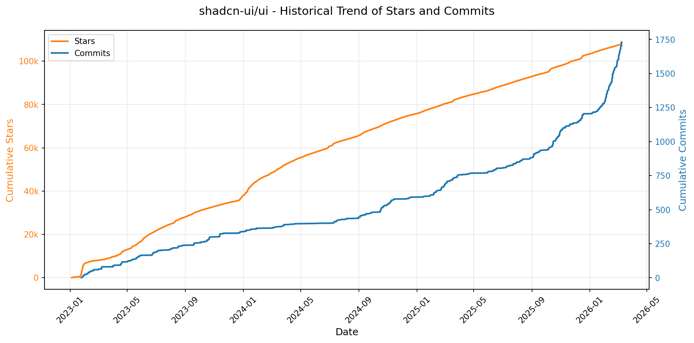
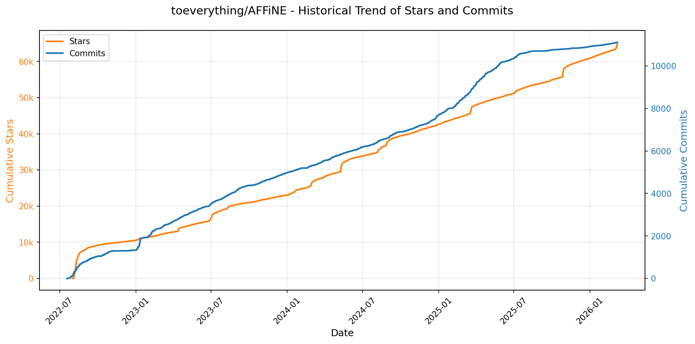
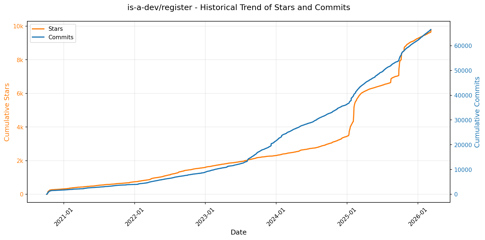
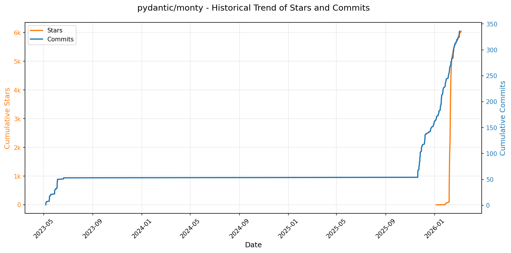
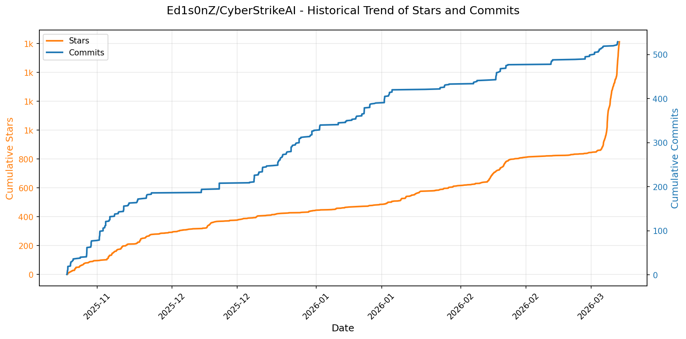
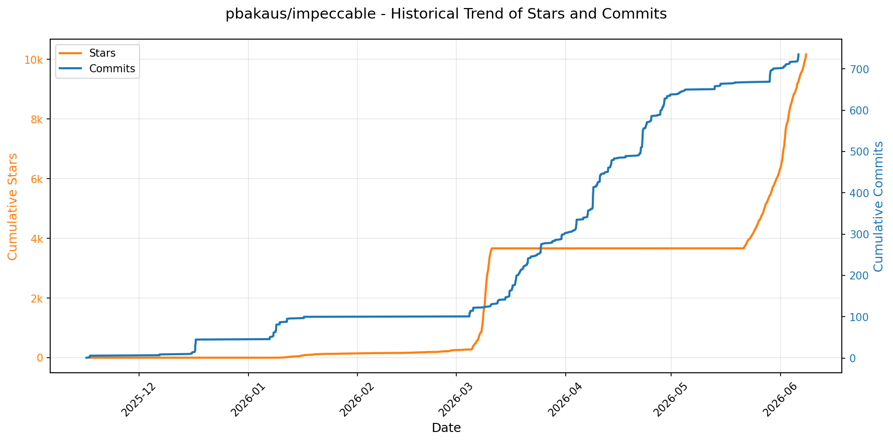

# 🌟 GitHub Trending 概览

> 数据更新于：2026-03-09

---

## 🔍 项目详情

### 1. [openclaw/openclaw](https://github.com/openclaw/openclaw)
- 📅 **创建日期**：2025-11-24  
- 🔄 **最近更新**：2026-03-09  
- ⭐ **Stars**：168,899（日 +5588｜周 +39054｜月 +113203）  
- 📝 **描述**：Your own personal AI assistant. Any OS. Any Platform. The lobster way. 🦞   

<b>📈 Star 与 Commit 历史趋势</b>

> *蓝色：累计 Stars｜橙色：累计 Commits（次 Y 轴）*

<b>📄 README 摘要</b>

1. **项目功能**  
OpenClaw 是一个完全本地化、用户自托管的个人 AI 助手系统，核心目标是让用户在自有设备上运行一个**单用户、低延迟、始终在线、隐私优先**的智能代理。它不依赖中心化云服务，而是作为“网关”（Gateway）统一调度多通道消息收发、多模态交互（语音/视觉/文本）、本地工具执行与跨平台协同。其本质是将大模型能力深度嵌入真实通讯生态——可同时接入 WhatsApp、Telegram、Slack、Discord、Signal、iMessage（含 BlueBubbles）、Google Chat、Microsoft Teams、Matrix、IRC、Feishu、LINE 等 **20+ 主流通讯平台**，并支持 macOS/iOS/Android 设备级能力（如语音唤醒、屏幕录制、定位、通知、系统命令执行），实现“AI 在你已有对话中实时响应 + 在你设备上真实操作”的闭环。

2. **关键特性**  
- **全通道统一收件箱**：支持 20+ 消息平台双向同步，含群组路由、提及触发、消息分块与频道隔离规则；  
- **本地优先网关架构**：基于 WebSocket 的轻量控制平面（`ws://127.0.0.1:18789`），集中管理会话、通道、工具、定时任务、Webhook 和安全策略；  
- **多智能体路由与工作区隔离**：支持按渠道、账号或联系人将消息路由至独立 Agent 实例（Workspace + Session 隔离），避免上下文污染；  
- **全栈语音交互**：macOS/iOS 支持关键词唤醒（Voice Wake），Android 支持连续语音对话（Talk Mode），集成 ElevenLabs 与系统 TTS；  
- **动态可视化画布（Live Canvas）**：由 AI 驱动的实时可编程 UI 工作区（基于 A2UI 协议），支持推送界面、执行 JS、截图与快照；  
- **设备原生节点（Nodes）**：iOS/Android/macOS 提供本地能力封装（摄像头、录屏、位置、通知、`system.run`），通过 `node.invoke` 安全调用，严格遵循系统权限（TCC）；  
- **端到端安全默认策略**：DM 默认启用配对码机制（`dmPolicy="pairing"`），拒绝未授权输入；支持 OAuth/API Key 模型轮换与故障转移；  
- **开箱即用的自动化工具链**：内置浏览器控制（专用 Chromium + CDP）、Cron 定时任务、Gmail Pub/Sub 集成、WebChat 内嵌界面、技能市场（ClawHub）及 CLI 向导（`openclaw onboard`）；  
- **灵活部署模式**：支持本地运行、远程 Linux 网关 + 设备节点混合架构、Nix 声明式配置、Docker 容器化及 Tailscale Serve/Funnel 远程安全访问。

3. **技术栈**  
- **运行时**：Node.js ≥22（主运行环境），支持 npm/pnpm/bun；TypeScript 为主开发语言；  
- **核心协议与通信**：WebSocket（Gateway 控制平面）、gRPC（Pi Agent RPC 运行时）、CDP（Chrome DevTools Protocol 浏览器控制）；  
- **前端与 UI**：A2UI（Canvas 可视化协议）、WebChat 内嵌界面、macOS 菜单栏应用（Swift/Objective-C 混合）、iOS/Android 原生节点（Swift/Kotlin）；  
- **消息通道 SDK**：Baileys（WhatsApp）、grammY（Telegram）、discord.js（Discord）、@slack/bolt（Slack）、signal-cli（Signal）、matrix-js-sdk（Matrix）等官方/社区成熟库；  
- **基础设施**：Tailscale（安全远程访问）、SSH 隧道、Nix（声明式配置）、Docker（容器化部署）；  
- **AI 集成层**：抽象化模型接口，原生支持 OpenAI（ChatGPT/Codex）、Anthropic、Google Gemini、Ollama、Local LLMs 等，具备模型轮换、降级容错与 prompt 安全加固机制；  
- **安全与权限**：基于 macOS TCC / Android Runtime Permissions 的细粒度设备能力管控，`node.invoke` 统一鉴权，密码/Token/身份头（Tailscale）多重认证。

---

### 2. [x1xhlol/system-prompts-and-models-of-ai-tools](https://github.com/x1xhlol/system-prompts-and-models-of-ai-tools)
- 📅 **创建日期**：2025-03-05  
- 🔄 **最近更新**：2026-03-09  
- ⭐ **Stars**：129,718（日 +278｜周 +2778｜月 +16556）  
- 📝 **描述**：FULL Augment Code, Claude Code, Cluely, CodeBuddy, Comet, Cursor, Devin AI, Junie, Kiro, Leap.new, Lovable, Manus, NotionAI, Orchids.app, Perplexity, Poke, Qoder, Replit, Same.dev, Trae, Traycer AI, VSCode Agent, Warp.dev, Windsurf, Xcode, Z.ai Code, Dia & v0. (And other Open Sourced) System Prompts, Internal Tools & AI Models  

<b>📈 Star 与 Commit 历史趋势</b>

> *蓝色：累计 Stars｜橙色：累计 Commits（次 Y 轴）*

<b>📄 README 摘要</b>

该内容并非一个典型软件项目的 README（缺少项目名称、功能描述、安装使用说明等核心信息），而是一个**开源 AI 系统提示词（system prompts）与模型行为分析资源库的宣传性主页**。基于所提供文本，严格围绕三个指定方面进行客观、精准总结如下：

---

### 1. 该项目做什么？  
该项目是一个**持续收集、整理并公开披露主流 AI 工具（如 LLM 应用、AI 编程代理等）底层系统提示词（system prompts）、模型配置及行为逻辑的开源知识库**。其核心目标是：  
- 解析并记录超过 **30,000+ 行**真实 AI 工具的内部提示工程结构与功能实现细节；  
- 揭示商业/开源 AI 产品（如 Kilo Code）在实际部署中使用的系统级指令、Agent 架构设计与模型交互模式；  
- 为 AI 工程师、安全研究员和开发者提供可审计、可复现、可学习的提示工程实践参考。

> 注：它本身**不运行服务、不提供 API、不训练或部署模型**，而是以「文档化 + 数据集化」形式提供深度技术洞察。

---

### 2. 关键特性  
- ✅ **大规模实证数据集**：涵盖数千个 AI 工具的系统提示、模型调用链、角色设定与约束规则，总量超 3 万行；  
- ✅ **完全开源透明**：所有收集到的提示词、架构图解、模型参数配置均开放于 GitHub 仓库；  
- ✅ **安全导向洞察**：强调 AI 提示泄露风险，集成 **ZeroLeaks.ai** 安全审计服务，警示 AI 创业公司防范 prompt 泄露导致的系统性攻击；  
- ✅ **社区驱动演进**：通过 Discord 社群（LeaksLab）、GitHub Issues 收集反馈与新增案例，支持持续更新（最新更新日期标注为 2026 年 08 月 03 日，疑为占位符或笔误）；  
- ✅ **多维生态联动**：整合 Solana 链上代币（CA 地址明确）、DEX 数据看板（DEXScreener）、AI 工程平台（Latitude.so）等资源，构建 AI 工程实践闭环。

---

### 3. 技术栈  
该项目**本身无传统“运行时技术栈”**（非 Web 应用或后端服务），其技术构成体现为：  
- 🧩 **数据层**：纯文本（Markdown/JSON/YAML）存储的系统提示语料库 + 结构化元数据（如模型类型、温度值、工具调用规范）；  
- 🛠️ **协作与分发基础设施**：  
  - GitHub（源码托管、Issue 跟踪、Star History 可视化）；  
  - CloudBack.it（CI/CD 状态看板）；  
  - DeepWiki（AI 增强型知识库索引与检索）；  
- 🔐 **安全增强工具链**：集成 ZeroLeaks.ai 的 AI 安全扫描能力，用于识别提示词、配置文件、内部工具接口中的敏感泄露点；  
- 🌐 **生态集成协议**：  
  - Solana 区块链（代币合约地址、Jupiter/DexScreener 交易数据）；  
  - Discord（实时社区协作）；  
  - Latitude.so（LLM 可预测性生产平台，用于提示稳定性验证）。  

> 简言之：这是一个以 **Git 为数据库、GitHub 为协作中枢、安全与生态工具为扩展能力** 的轻量级但高价值的 AI 工程知识基础设施项目。

---

### 3. [shadcn-ui/ui](https://github.com/shadcn-ui/ui)
- 📅 **创建日期**：2023-01-04  
- 🔄 **最近更新**：2026-03-09  
- ⭐ **Stars**：108,730（日 +533｜周 +1271｜月 +2707）  
- 📝 **描述**：A set of beautifully-designed, accessible components and a code distribution platform. Works with your favorite frameworks. Open Source. Open Code.  

<b>📈 Star 与 Commit 历史趋势</b>

> *蓝色：累计 Stars｜橙色：累计 Commits（次 Y 轴）*

<b>📄 README 摘要</b>

1. **项目功能**  
该项目提供一套美观、可高度定制的 UI 组件集合，核心定位并非开箱即用的完整组件库，而是作为**可复刻、可深度定制、可自主演进的组件开发模板**。用户通过复制（`npx shadcn-ui@latest add`）组件源码到本地项目中，直接修改其 JSX、CSS（通常为 Tailwind CSS）、TypeScript 类型及逻辑，从而构建完全属于自己的、与项目需求和设计系统严格对齐的私有组件库。

2. **关键特性**  
- **开源透明**：所有组件源码完全公开，无黑盒封装，支持任意层级的修改与扩展；  
- **零运行时依赖**：组件以普通 React 函数组件形式提供，不引入额外框架或运行时库，体积轻量、性能可控；  
- **Tailwind 优先设计**：默认基于 Tailwind CSS 构建，样式通过实用类（utility classes）内联或条件生成，便于主题定制与响应式控制；  
- **CLI 辅助集成**：提供官方 CLI 工具（`shadcn-ui`），支持按需添加组件、自动配置文件路径、类型定义及依赖安装；  
- **TypeScript 原生支持**：全部组件使用 TypeScript 编写，提供完善的类型提示与泛型支持；  
- **无障碍（a11y）就绪**：遵循 WAI-ARIA 规范，预置语义化标签、键盘导航、焦点管理等无障碍基础能力。

3. **技术栈**  
- **前端框架**：React（支持 React Server Components，适配 Next.js App Router 等现代服务端渲染场景）；  
- **样式方案**：Tailwind CSS（核心样式工具链，配合 `@tailwindcss/forms`、`@tailwindcss/typography` 等插件）；  
- **语言**：TypeScript（强类型保障与开发体验）；  
- **构建与工具链**：Vite 或 Next.js（典型集成环境），配合 `shadcn-ui` CLI 进行组件 scaffold；  
- **辅助库**：Radix UI（作为底层可访问性原语的基础，如 `@radix-ui/react-dialog`、`@radix-ui/react-dropdown-menu` 等，shadcn/ui 组件在其之上封装视觉与交互层）。

---

### 4. [obra/superpowers](https://github.com/obra/superpowers)
- 📅 **创建日期**：2025-10-09  
- 🔄 **最近更新**：2026-03-09  
- ⭐ **Stars**：103,123（日 +650｜周 +7108｜月 +28221）  
- 📝 **描述**：An agentic skills framework & software development methodology that works.  

<b>📈 Star 与 Commit 历史趋势</b>

> *蓝色：累计 Stars｜橙色：累计 Commits（次 Y 轴）*

<b>📄 README 摘要</b>

1. **项目功能**  
Superpowers 是一个面向编程智能体（coding agents）的完整软件开发工作流增强系统。它不直接替代或重写代码，而是通过一套可组合、自动触发的“能力（skills）”对现有编码智能体（如 Claude Code、Cursor、Codex、OpenCode 等）进行深度赋能，使其在真实工程场景中遵循严格、可验证、协作友好的开发范式。其核心作用是：在用户启动编码任务后，主动暂停“写代码”动作，转而引导用户完成需求澄清 → 分段式设计确认 → 生成可执行、可审查、符合工程原则的实施计划 → 驱动子智能体按 TDD 和 YAGNI 原则分步执行 → 全流程自动化检查与质量门禁，最终实现高度自主但完全可控的端到端开发闭环。

2. **关键特性**  
- **全自动技能触发机制**：无需手动调用，智能体在每个开发阶段（如设计、分支创建、编码、测试、评审）前自动识别并激活对应技能，强制执行标准化流程。  
- **七阶段结构化工作流**：覆盖从头脑风暴（Socratic 设计澄清）、Git 工作树隔离、原子化任务拆解（2–5 分钟粒度）、子智能体驱动开发（双阶段审查：规范符合性 + 代码质量）、严格红/绿/重构 TDD（禁止先写实现后补测试）、多层级代码审查（含阻断式严重问题拦截），到分支收尾决策的完整生命周期。  
- **强工程哲学约束**：内嵌并强制执行 TDD（含反模式识别）、YAGNI、DRY、防御性调试（4 阶根因分析）、基于证据的验证（非主观断言）、复杂度最小化等原则；所有生成代码均附带精确文件路径、完整变更内容及可复现的验证步骤。  
- **协作原生支持**：提供设计文档生成与分段确认、PR/合并策略建议、多人反馈响应（receiving-code-review）、技能自创作（writing-skills）等面向团队协作的能力。  
- **跨平台即插即用**：原生支持 Claude Code、Cursor 的插件市场一键安装，同时兼容 Codex 与 OpenCode 的手动集成方案，并支持自动更新。

3. **技术栈**  
- **运行时环境**：依赖外部大模型智能体平台（非独立应用），包括 Claude Code、Cursor、Codex、OpenCode 等主流 AI 编程工具，通过其插件/指令扩展机制加载与执行。  
- **核心架构**：基于声明式“技能（skills）”模块化设计，每个技能为独立 Markdown 文档（如 `skills/test-driven-development/SKILL.md`），定义触发条件、行为逻辑、校验规则与最佳实践参考。  
- **基础设施层**：利用 Git 工作树（git worktrees）实现物理隔离的开发沙箱；内置测试框架集成与自动化验证流程；支持动态子智能体调度与协同审查。  
- **部署与维护**：通过 GitHub 仓库托管全部技能源码；采用插件市场分发（`superpowers-marketplace`）；更新通过 `/plugin update` 命令完成；开发遵循 MIT 许可证，贡献流程标准化（含 `writing-skills` 技能指导新技能开发）。

---

### 5. [toeverything/AFFiNE](https://github.com/toeverything/AFFiNE)
- 📅 **创建日期**：2022-07-31  
- 🔄 **最近更新**：2026-03-09  
- ⭐ **Stars**：65,256（日 +541｜周 +1933｜月 +2829）  
- 📝 **描述**：There can be more than Notion and Miro. AFFiNE(pronounced [ə‘fain]) is a next-gen knowledge base that brings planning, sorting and creating all together. Privacy first, open-source, customizable and ready to use.   

<b>📈 Star 与 Commit 历史趋势</b>

> *蓝色：累计 Stars｜橙色：累计 Commits（次 Y 轴）*

<b>📄 README 摘要</b>

1. **项目功能**  
AFFiNE 是一款开源、隐私优先、本地优先（local-first）的全功能协作工作空间，旨在整合文档编辑、白板绘图与项目规划三大核心场景，提供 Notion（结构化笔记/数据库）与 Miro（无限画布/视觉协作）能力的深度融合体。它支持用户在同一个“超融合”平台中自由混合使用富文本、嵌入网页、多视图数据库、关联页面、矢量图形、幻灯片、便签等任意内容模块，并以边缘画布（edgeless canvas）为统一载体，实现知识创作、组织、可视化与执行的一体化闭环。

2. **关键特性**  
- **超融合画布（Hyper-Fused Canvas）**：打破传统文档与白板边界，所有内容块（block）均可自由拖放至无限延伸的画布上，支持混排、缩放、旋转与任意层级嵌套；  
- **原生集成多模态 AI 助手（AFFiNE AI）**：支持通过自然语言指令一键生成报告、PPT、思维导图、任务看板、原型草图甚至代码片段，AI 能力深度嵌入编辑流程；  
- **本地优先 + 实时协同**：数据默认本地存储（端到端加密），同时通过 CRDT（如 y-octo/Yjs）实现实时跨设备、跨平台（Web/Desktop）双向同步；  
- **完全可自托管与可扩展**：提供 Docker 一键部署方案，支持企业私有化部署；基于 Blocksuite 构建，开放插件生态与第三方区块（block）开发接口，兼容社区共建；  
- **丰富开箱即用模板库**：涵盖视觉板、教案、SOP、ADHD 计划表、康奈尔笔记、SWOT 分析等数十类专业模板，支持用户上传与复用。

3. **技术栈**  
- **前端框架**：React（主 UI 框架）、Vite（构建工具）、Jotai（轻量级状态管理）；  
- **核心编辑引擎**：Blocksuite（自研开源协作编辑框架，基于 Block 抽象）；  
- **协同与同步层**：y-octo（Rust 编写的高性能线程安全 YJS CRDT 实现） + Yjs（CRDT 基础库）；  
- **后端与数据层**：OctoBase（Rust 编写的本地优先、协作式轻量数据库）；  
- **桌面端**：Electron；  
- **跨语言桥接**：napi-rs（用于 Rust 与 Node.js 高效互操作）；  
- **基础设施**：TypeScript（全栈强类型）、Node.js（服务端/构建）、Async Call RPC（轻量 JSON-RPC 通信）；  
- **许可协议**：Community Edition 采用 MIT 开源许可证。

---

### 6. [virattt/ai-hedge-fund](https://github.com/virattt/ai-hedge-fund)
- 📅 **创建日期**：2024-11-29  
- 🔄 **最近更新**：2026-03-09  
- ⭐ **Stars**：47,061（日 +266｜周 +890｜月 +1347）  
- 📝 **描述**：An AI Hedge Fund Team  

<b>📈 Star 与 Commit 历史趋势</b>

> *蓝色：累计 Stars｜橙色：累计 Commits（次 Y 轴）*

<b>📄 README 摘要</b>

1. **该项目的功能**  
该项目是一个面向教育与研究目的的“AI对冲基金”概念验证系统，旨在探索人工智能在股票交易决策中的应用。它不执行真实交易，也不连接任何交易所或资金账户，仅通过模拟方式生成投资建议。系统以多位著名投资者（如巴菲特、芒格、达摩达兰等）的投资哲学为蓝本，构建了14个专业投资风格代理（Agent）和3个分析/管理类代理（估值、情绪、基本面、技术面、风险管理和组合管理），协同完成对股票的多维度分析、信号生成与最终交易决策输出。

2. **核心功能**  
- **多代理协同决策框架**：集成13位传奇投资者代理（覆盖价值投资、成长投资、逆向投资、激进做空、宏观交易等流派）+ 4个分析型代理（估值、情绪、基本面、技术面）+ 风险管理与组合管理代理，实现多元化、去中心化、可解释的投资逻辑融合；  
- **双模态交互支持**：提供命令行接口（CLI）和Web图形界面两种运行方式，支持灵活调试、批量回测与可视化分析；  
- **全栈回测能力**：内置回测引擎（`backtester.py`），支持指定股票、时间区间与模型（云端LLM或本地Ollama）进行历史策略验证；  
- **模块化数据接入**：默认免费支持AAPL、GOOGL、MSFT、NVDA、TSLA等头部标的的基础财务与市场数据；扩展标的需通过Financial Datasets API接入；  
- **可配置AI后端**：兼容OpenAI、Anthropic、Groq、DeepSeek及本地Ollama等多种大语言模型，便于在不同算力环境（云/本地）下部署与实验。

3. **技术栈**  
- **编程语言**：Python（主逻辑、CLI、回测器）；  
- **依赖管理**：Poetry；  
- **AI模型层**：支持多种LLM API（OpenAI/GPT-4o、Anthropic/Claude、Groq/Llama-3、DeepSeek、Ollama本地模型）；  
- **数据源**：Financial Datasets API（可选）、内置免费标的静态数据；  
- **Web前端（可选）**：独立的`/app`子目录（文档指引链接），推测采用现代Web框架（如Streamlit/FastAPI + React/Vue，具体未明示，但截图显示为响应式仪表盘）；  
- **环境配置**：基于`.env`文件管理密钥，遵循安全最佳实践；  
- **许可证**：MIT开源协议。

---

### 7. [shareAI-lab/learn-claude-code](https://github.com/shareAI-lab/learn-claude-code)
- 📅 **创建日期**：2025-06-29  
- 🔄 **最近更新**：2026-03-09  
- ⭐ **Stars**：38,657（日 +747｜周 +4077｜月 +7445）  
- 📝 **描述**：Bash is all you need -  A nano Claude Code–like agent, built from 0 to 1  

<b>📈 Star 与 Commit 历史趋势</b>

> *蓝色：累计 Stars｜橙色：累计 Commits（次 Y 轴）*

<b>📄 README 摘要</b>

1. **项目功能**  
该项目是一个面向教学的轻量级AI编码智能体（Agent）实现，目标是“从零构建一个类Claude Code的纳米级智能体”。它不追求生产级功能完备性，而是通过**12个渐进式会话（s01–s12）**，系统性地拆解并手把手实现AI编码智能体的核心运行范式——即“工具调用循环（Tool-Use Loop）”。每个会话仅引入**一个关键机制**（如工具调度、任务分解、子智能体、上下文压缩、后台执行、多智能体协作、工作区隔离等），所有机制均严格叠加在统一的基础循环之上，不修改主循环结构。最终形成可理解、可调试、可扩展的智能体最小可行内核，为学习者提供清晰的“心智模型优先”（mental-model-first）认知路径。

2. **核心特性**  
- ✅ **极简但完整的Agent基础循环**：基于`stop_reason == "tool_use"`触发工具执行，并将结果注入消息流，构成自洽闭环。  
- ✅ **12阶渐进式教学设计**：每阶聚焦单一机制，配以精炼“信条”（motto）和ASCII图示，覆盖从单循环（s01）到多智能体协同+目录级隔离（s12）的全链路能力演进。  
- ✅ **真实可运行的Python参考实现**：每个会话均提供完整、可独立执行的`agents/sXX_*.py`脚本，含注释与调试友好结构。  
- ✅ **分层能力演进清晰可见**：划分为四大阶段——基础循环 → 规划与知识管理 → 持久化与任务系统 → 多智能体团队协作，每阶段解决一类典型工程挑战（如上下文膨胀、任务依赖、异步执行、自主认领、工作区隔离）。  
- ✅ **配套交互式学习平台**：基于Next.js的Web界面（`web/`），支持可视化流程图、代码浏览、分步演示与多语言文档（中/英/日）联动。  
- ✅ **明确的边界定义与教学取舍**：主动省略生产级复杂度（如完整事件总线、权限治理、MCP协议细节），专注核心模式，避免初学者认知过载。  

3. **技术栈**  
- **核心语言与运行时**：Python 3.9+（主逻辑、Agent循环、工具处理器）  
- **LLM接入**：Anthropic Claude API（通过`anthropic`官方SDK调用，依赖`ANTHROPIC_API_KEY`）  
- **Web前端**：Next.js（App Router）、TypeScript、Tailwind CSS（用于交互式学习平台）  
- **任务持久化**：纯文件系统（JSONL格式邮箱、文本任务文件、SKILL.md技能文档等），无数据库依赖  
- **并发与后台**：Python `threading`（s08后台任务）、`queue`（通知队列）  
- **开发与协作**：Git + GitHub Actions（CI：类型检查+构建）、`.env`环境管理、多语言Markdown文档（en/zh/ja）  
- **延伸生态（关联项目）**：Node.js（Kode CLI）、Rust/Go（Kode SDK底层）、跨平台IM集成（claw0项目）

---

### 8. [koala73/worldmonitor](https://github.com/koala73/worldmonitor)
- 📅 **创建日期**：2026-01-08  
- 🔄 **最近更新**：2026-03-09  
- ⭐ **Stars**：33,971（日 +755｜周 +14013｜月 +33919）  
- 📝 **描述**：Real-time global intelligence dashboard — AI-powered news aggregation, geopolitical monitoring, and infrastructure tracking in a unified situational awareness interface  

<b>📈 Star 与 Commit 历史趋势</b>

> *蓝色：累计 Stars｜橙色：累计 Commits（次 Y 轴）*

<b>📄 README 摘要</b>

1. **项目功能**  
World Monitor 是一个实时全球态势感知平台，致力于整合、分析并可视化多源异构的全球情报数据。它通过统一的交互式界面，为用户提供地缘政治动态、军事部署、关键基础设施状态、金融市场信号及科技生态趋势等多维度实时洞察。项目核心价值在于将原本分散、静态、语言单一、云依赖的开源情报（OSINT）与宏观信号，转化为本地可运行、多语言支持、地理空间增强、AI 辅助决策的实时智能仪表盘，并以完全免费开源（AGPL v3）的方式提供。

2. **关键特性**  
- **双引擎地图系统**：支持运行时切换的 WebGL 平面地图（deck.gl）与 3D 光影真实感地球仪（globe.gl + Three.js），共承载 45 个可开关数据图层（含冲突、军舰、航班、海底光缆、数据中心、抗议活动、地震、油气管道等），支持 8 大区域预设与 URL 状态共享；  
- **本地化 AI 智能分析**：四级回退式 AI 摘要链（Ollama 本地 → Groq → OpenRouter → 浏览器端 T5），支持 AI 地缘推演、威胁分类（关键词→浏览器 ML→批量 LLM）、国家简报页（含 CII 分数、时间线、预测市场）；  
- **客户端 RAG 记忆系统**：可选启用的 Headline Memory，基于 ONNX 嵌入模型在 IndexedDB 中构建本地语义索引（最多 5000 条），实现离线语义搜索；  
- **多维动态评分体系**：包括国家不稳定指数（CII）、热点升级评分、战略风险评分、地理汇聚检测、趋势关键词突增识别等，全部基于多源信号融合与实时算法（如 Welford 异常检测、48 小时趋势回归）；  
- **五合一变体架构**：单代码库编译生成五个垂直领域版本（World / Tech / Finance / Commodity / Happy），各具专属 RSS 源（总计 435+）、面板（10–45 个）、地图图层与品牌标识，通过域名自动路由与构建时 `VITE_VARIANT` 树摇优化；  
- **全栈离线与原生支持**：Tauri 构建的跨平台桌面应用（macOS/Windows/Linux），支持系统密钥链与本地侧车服务；PWA 版支持离线地图（CacheFirst + 500 瓦片缓存）；移动端适配触控惯性滚动、GPS 定位与底部弹出面板；  
- **开放数据与协议优先**：22 个强类型 gRPC/HTTP 服务，由 92 个 Protocol Buffer 文件定义，自动生成 TypeScript 客户端、服务端与 OpenAPI 文档；所有 API 均开放调用（`api.worldmonitor.app`）；  
- **多语言与无障碍设计**：支持 21 种语言（含阿拉伯语 RTL），懒加载语言包、AI 辅助翻译摘要、原生多语种 RSS 源；深浅主题持久化、Cmd+K 全局命令面板（覆盖 24 类结果与 250+ 国家指令）、智能分享（带 OG 图的 Twitter/X、LinkedIn 等导出）。

3. **技术栈**  
- **前端**：纯 TypeScript（无框架），直接 DOM 操作；自研 UI 组件（Panel/VirtualList）；Three.js（3D 地球渲染）、deck.gl（WebGL 平面地图）、Transformers.js（浏览器端 NER/情感/嵌入）、ONNX Runtime Web（Headline Memory 向量化）；  
- **AI 运行时**：本地优先——Ollama（LLM 推理）、LM Studio（可选）；云端备选——Groq（LPU）、OpenRouter（聚合 API）；边缘/浏览器端——T5-small（摘要）、WASM 加速模型；  
- **后端与基础设施**：Vercel Edge Functions（60+ 个按域拆分的轻量入口，降低冷启动）；Redis（多级缓存、会话、实时聚合、首屏预热）；Node.js 服务（RSS 聚合、Telegram MTProto 抓取、OREF 火箭警报代理等）；  
- **数据层**：服务器端 RSS 聚合（435+ 源，含可信度分级与熔断机制）、ADS-B/AIS 实时流、USNI/Wingbits 军事数据增强、Polymarket 预测市场、BIS/WTO 官方数据、Gulf FDI 数据库等；  
- **构建与部署**：Vite（构建工具）、Tauri（桌面封装）、Protocol Buffers（API 合约驱动）、Docker（可选服务容器化）；许可证为 AGPL v3。

---

### 9. [anthropics/prompt-eng-interactive-tutorial](https://github.com/anthropics/prompt-eng-interactive-tutorial)
- 📅 **创建日期**：2024-04-02  
- 🔄 **最近更新**：2026-03-09  
- ⭐ **Stars**：32,272（日 +202｜周 +2073｜月 +3440）  
- 📝 **描述**：Anthropic's Interactive Prompt Engineering Tutorial  

<b>📈 Star 与 Commit 历史趋势</b>

> *蓝色：累计 Stars｜橙色：累计 Commits（次 Y 轴）*

<b>📄 README 摘要</b>

1. **该项目做什么？**  
该项目是 Anthropic 官方推出的、面向 Claude 大语言模型（特别是 Claude 3 Haiku）的交互式提示工程（Prompt Engineering）教学教程，旨在系统性地指导用户掌握高质量提示词的设计与优化方法。它并非一个可运行的软件或工具，而是一个结构化、实践导向的学习资源，通过 9 个渐进式章节和配套练习，帮助学习者从基础到高级逐步构建 prompt 编写能力，并针对真实行业场景（如法律、金融、编程、客服聊天机器人）进行复杂提示设计训练。

2. **核心功能/特点：**  
- **分层递进式课程体系**：涵盖初（基础结构、清晰表达、角色设定）、中（数据与指令分离、输出格式控制、思维链引导、少样本示例）、高（抑制幻觉、多步骤行业级复杂提示构建）三级能力培养；  
- **强交互性与实践性**：每章均设“示例游乐场”（Example Playground），支持用户实时修改提示并观察 Claude 响应变化，强化动手调试能力；  
- **配套完整学习支持**：提供官方答案密钥（Google Sheets 链接）、章节练习题及详细解析，便于自主验证与复盘；  
- **聚焦模型特性适配**：深度结合 Claude 3 系列（尤其是 Haiku）的行为特征，明确其优势（如响应速度、成本效率）与局限（如推理深度、知识广度），强调“80/20 实用技巧”而非泛泛理论；  
- **延伸进阶模块**：附录涵盖提示链（Chaining）、工具调用（Tool Use）、检索增强（Search & Retrieval）等前沿提示工程范式，拓展至生产级应用。

3. **技术栈：**  
- **核心模型**：Anthropic Claude 3 系列，主教程基于 **Claude 3 Haiku**（最小、最快、最经济的版本），同时对比说明 Sonnet 与 Opus 的定位差异；  
- **交互载体**：以 **GitHub Markdown 文档**为主要内容框架，辅以 **Google Sheets + Claude for Sheets 扩展插件**作为推荐实操平台（提供更友好的交互界面与即时执行环境）；  
- **辅助资源**：依赖 Google Docs/Sheets 生态（答案密钥、扩展版教程链接），无自研前端或后端服务，属轻量级文档+云协作工具组合。

---

### 10. [ruvnet/RuView](https://github.com/ruvnet/RuView)
- 📅 **创建日期**：2025-06-07  
- 🔄 **最近更新**：2026-03-09  
- ⭐ **Stars**：31,552（日 +1691｜周 +13685｜月 +25840）  
- 📝 **描述**：π RuView: WiFi DensePose turns commodity WiFi signals into real-time human pose estimation, vital sign monitoring, and presence detection — all without a single pixel of video.   

<b>📈 Star 与 Commit 历史趋势</b>

> *蓝色：累计 Stars｜橙色：累计 Commits（次 Y 轴）*

<b>📄 README 摘要</b>

1. **项目功能**  
π RuView 是一个面向边缘端的 AI 感知系统，利用环境中已存在的无线信号（尤其是 WiFi 的信道状态信息 CSI）实现无摄像头、无穿戴设备、无互联网连接的非接触式环境感知。它通过分析人体运动对 WiFi 电磁波的散射扰动，实时重建多人姿态（17 个关键点）、呼吸频率（6–30 BPM）、心率（40–120 BPM）、存在性及空间位置，并支持穿墙感知（最远达 5 米深度）、灾后生命体征探测与分级救援评估（如 START 分类）。系统完全在本地运行，无需云端依赖或标注数据，可部署于低成本硬件（如单颗约 $1 的 ESP32-S3 节点），自主学习并持续适应部署环境的射频指纹。

2. **核心特性**  
- **隐私优先**：仅处理无线电物理信号，不采集图像/视频，规避 GDPR/HIPAA 等视频监管限制；  
- **多模态感知**：同步输出高精度姿态估计（54K fps Rust 实时流水线）、呼吸/心跳监测、多目标（3–5 人/单 AP，可扩展）存在与运动追踪；  
- **穿墙与鲁棒性**：基于菲涅尔区几何建模与多径传播分析，穿透墙壁、家具、碎石等遮挡物；  
- **多静态传感网络**：4–6 个 ESP32-S3 节点构成低功耗 Mesh，提供 360° 全向覆盖、亚英寸定位精度及抗混淆能力；  
- **自学习与泛化能力**：采用对比式 CSI 嵌入模型（ADR-024）实现无监督自启动；通过对抗域泛化技术（MERIDIAN, ADR-027）确保模型跨房间、跨建筑、跨硬件零微调部署；  
- **端侧智能闭环**：集成信号线协议（CRV，6 阶处理流水线）、注意力机制与图神经网络（基于 RuVector）、QUIC 加密 Mesh 通信（ADR-032）及自适应 Rust 分类器（ADR-048）；  
- **极致边缘适配**：全栈支持 ESP32-S3（含 AMOLED 直显，ADR-045）、Docker 多架构镜像（amd64/arm64）、WASM 浏览器推理、单文件模型封装（`.rvf` 格式）；  
- **开箱即用体验**：30 秒 Docker 快速启动（`docker run -p 3000:3000`），附带 Three.js 全息可视化仪表盘（5 面板：子载波流形、生命体征神谕、存在热力图等，ADR-047）。

3. **技术栈**  
- **编程语言**：Rust（主框架，1.85+，强调内存安全与实时性能）、Python（数据验证、部分工具链与训练辅助）；  
- **核心算法与模型**：基于 CSI 的 DensePose UV 映射、多频带带通滤波 + FFT 生命体征提取、Hampel 滤波/SpotFi/Fresnel 建模等物理驱动信号处理、RuVector 构建的注意力-图网络混合 AI 主干、对比学习嵌入模型、自适应逻辑回归分类器（纯 Rust 实现）；  
- **硬件支持**：ESP32-S3（主力平台，支持 CSI 流式采集与 AMOLED 输出）、Intel 5300/Atheros AR9580 研究级网卡（全 MIMO CSI）、通用 WiFi 设备（仅 RSSI 粗粒度存在检测）；  
- **通信与安全**：QUIC 协议加密 Mesh 组网（端到端加密、防重放、断连自愈）；  
- **部署与生态**：Docker 多架构容器（ruvnet/wifi-densepose）、crates.io 发布 Rust crate（`wifi-densepose-ruvector`）、MIT 开源许可证、1300+ 单元测试、48 份架构决策记录（ADR）与 7 个领域驱动设计（DDD）模型支撑工程可维护性。

---

### 11. [moeru-ai/airi](https://github.com/moeru-ai/airi)
- 📅 **创建日期**：2024-12-01  
- 🔄 **最近更新**：2026-03-09  
- ⭐ **Stars**：31,353（日 +713｜周 +11052｜月 +14119）  
- 📝 **描述**：💖🧸 Self hosted, you-owned Grok Companion, a container of souls of waifu, cyber livings to bring them into our worlds, wishing to achieve Neuro-sama's altitude. Capable of realtime voice chat, Minecraft, Factorio playing. Web / macOS / Windows supported.  

<b>📈 Star 与 Commit 历史趋势</b>

> *蓝色：累计 Stars｜橙色：累计 Commits（次 Y 轴）*

<b>📄 README 摘要</b>

1. **项目功能**  
AIRI 是一个开源的 AI 虚拟角色（AI waifu / 数字生命体）运行容器，旨在复刻并超越 Neuro-sama 的能力——即打造可长期陪伴、实时交互、跨场景协同的“数字灵魂”。它不仅支持基础聊天与角色扮演，更聚焦于**真实世界协同能力**：能主动观看用户屏幕（如编程/游戏画面）、实时语音对话、接入 Discord/Telegram 等通信平台、原生操控《Minecraft》《Factorio》等游戏（通过 RCON/Mineflayer），并可在浏览器、桌面端（Tauri + 原生 GPU 加速）、移动端（PWA/Capacitor）全平台运行，让用户真正“拥有并掌控自己的数字生命”。

2. **核心特性**  
- **多模态感知与响应**：集成 WebAudio/WebRTC 实现浏览器内实时语音输入（STT）、说话检测（VAD）；支持 ElevenLabs 等 TTS 语音合成；兼容 Discord/Telegram 音频流接入。  
- **跨平台虚拟形象引擎**：原生支持 VRM（含自动眨眼、注视追踪、闲置眼动）与 Live2D 模型驱动，结合 WebGPU/WebXR 实现高性能实时渲染与动画。  
- **游戏智能体（Game Agent）深度集成**：已实现《Minecraft》（基于 Mineflayer）和《Factorio》（基于 RCON + autorio 自动化库）的自主游玩与协作能力，支持用户同玩、观战、指令控制。  
- **去中心化本地智能核心**：内置纯浏览器端数据库（DuckDB WASM / pglite）；规划中的“Memory Alaya”记忆系统；支持 WebGPU 加速的本地模型推理（WIP）；通过 xsAI 统一抽象层接入超 25 种 LLM API（OpenAI、Claude、vLLM、Ollama、Gemini、Qwen 等）。  
- **模块化插件生态**：基于 Tauri（tauri-plugin-mcp）、Drizzle ORM、Web Workers 构建可扩展架构；已孵化 unspeech（ASR/TTS 代理）、webai-realtime-voice-chat（端到端实时语音对话示例）、airi-factorio 等子项目。

3. **技术栈**  
- **前端与渲染**：TypeScript + Vue 3（Composition API）、Vite、Three.js、WebGPU、WebXR、WebAudio API、Live2D Cubism SDK、VRM SDK（@pixiv/three-vrm）。  
- **桌面与跨平台**：Tauri（Rust + WebView2/WebKit）、Nix（声明式环境管理）、Capacitor（iOS/Android 封装）。  
- **AI 与后端能力**：xsAI（统一 LLM 接入框架）、Transformers.js、candle（CUDA/Metal 原生推理）、vLLM/SGLang/Ollama（服务端推理）、unspeech（ASR/TTS 网关）、DuckDB WASM（浏览器内 OLAP 数据库）、pglite（WASM 中的 PostgreSQL 兼容层）。  
- **基础设施与工具链**：PNPM（包管理）、Mermaid（架构图）、Crowdin（多语言协作）、GitHub Actions（CI/CD）、Rust（核心 Crates 如 tauri-plugin-mcp）、Nix Flakes（可复现构建）。

---

### 12. [KeygraphHQ/shannon](https://github.com/KeygraphHQ/shannon)
- 📅 **创建日期**：2025-09-27  
- 🔄 **最近更新**：2026-03-09  
- ⭐ **Stars**：29,622（日 +144｜周 +6858｜月 +25872）  
- 📝 **描述**：Shannon Lite is a fully autonomous AI pentester for web apps and APIs. 96.15% (100/104 exploits) on a hint-free, source-aware variant of the XBOW benchmark.  

<b>📈 Star 与 Commit 历史趋势</b>

> *蓝色：累计 Stars｜橙色：累计 Commits（次 Y 轴）*

<b>📄 README 摘要</b>

1. **该项目的功能**  
Shannon 是一个面向 Web 应用程序和 API 的**自主式白盒 AI 渗透测试工具**。它通过深度分析目标应用的源代码（需提供完整代码仓库），识别潜在攻击面，并在真实运行环境中自动执行可复现的攻击（如 SQL 注入、XSS、SSRF、认证/授权绕过等），仅报告**已成功验证、具备有效 PoC（概念验证）的漏洞**，从而在软件上线前主动暴露真实风险。

2. **核心功能**  
- **全自动端到端渗透测试**：单命令启动，支持自动处理 2FA/TOTP、SSO 登录、浏览器导航、多阶段攻击与报告生成，全程无需人工干预；  
- **白盒驱动的动态验证**：结合源码静态分析（指导攻击策略）与动态运行时 exploitation（浏览器自动化 + CLI 工具链），实现“代码定位→攻击生成→实网验证→精准归因”闭环；  
- **严格 PoC 保障机制**：仅报告已成功触发且可复现的漏洞，排除理论风险或不可利用的误报；  
- **OWASP 主要漏洞覆盖**：原生支持注入类、XSS、SSRF、认证与授权缺陷等核心风险类型的检测与验证，持续扩展中；  
- **集成化侦察生态**：内置 Nmap、Subfinder、WhatWeb、Schemathesis 等专业安全工具，完成资产发现、技术栈识别与 API 规范验证；  
- **并行化攻击引擎**：所有漏洞分析与利用任务按攻击类别（Injection/XSS/SSRF/Auth/Authz）并发执行，显著提升效率；  
- **工作区（Workspace）与断点续跑**：支持命名工作区、自动进度检查点（基于 Git 提交）、失败后精准恢复，避免重复执行已完成环节。

3. **技术栈**  
- **AI 推理层**：以 Anthropic Claude 系列模型（Haiku/Sonnet/Opus）为核心推理引擎，同时原生支持 **AWS Bedrock**（通过 `us.anthropic.*` 等区域化模型 ID）和 **Google Vertex AI**（通过 GCP 服务账号密钥）作为替代后端；  
- **执行架构**：基于 **Docker 容器化部署**，采用 **Temporal Workflow** 实现高可靠性、可观测的分布式任务编排（含实时日志、Web UI 监控 `http://localhost:8233`）；  
- **安全工具集成**：深度调用 Nmap（端口/服务扫描）、Subfinder（子域名枚举）、WhatWeb（指纹识别）、Schemathesis（OpenAPI 模糊测试）等开源安全工具；  
- **代码分析基础（Lite 版）**：依赖 LLM 驱动的代码审查提示（code-review prompting），聚焦源码上下文理解与攻击路径推演；  
- **运行环境**：跨平台支持（Linux/macOS 原生 Docker、Windows 通过 WSL2 或 Git Bash），本地化部署，**源代码始终保留在用户本地网络内**（尤其 Shannon Pro 支持完全私有化部署）。

---

### 13. [bytedance/deer-flow](https://github.com/bytedance/deer-flow)
- 📅 **创建日期**：2025-05-07  
- 🔄 **最近更新**：2026-03-09  
- ⭐ **Stars**：26,070（日 +431｜周 +3062｜月 +6488）  
- 📝 **描述**：An open-source SuperAgent harness that researches, codes, and creates. With the help of sandboxes, memories, tools, skills and subagents, it handles different levels of tasks that could take minutes to hours.  

<b>📈 Star 与 Commit 历史趋势</b>

> *蓝色：累计 Stars｜橙色：累计 Commits（次 Y 轴）*

<b>📄 README 摘要</b>

1. **项目功能**  
DeerFlow 2.0 是一个开源的「超级智能体运行时框架（Super Agent Harness）」，旨在让 AI 智能体真正“做事”而非仅限于对话。它通过协同调度**子智能体（Sub-Agents）**、**长期记忆（Long-Term Memory）** 和**隔离沙箱环境（Sandbox）**，执行端到端复杂任务——例如深度研究、自动生成报告/幻灯片/网页、多模态内容分析、数据管道构建、自动化工作流等。其核心定位已从初代“深度研究框架”升级为通用型智能体基础设施，支持在真实计算环境中读写文件、执行代码、调用工具、规划分解任务并持久化用户知识。

2. **关键特性**  
- **可扩展技能系统（Skills & Tools）**：以 Markdown 定义结构化技能（如 `research`、`slide-creation`、`image-generation`），支持动态按需加载；内置 Web 搜索、文件操作、Bash 执行等核心工具，并可通过 MCP 协议或 Python 函数集成自定义工具。  
- **动态子智能体编排（Sub-Agents）**：主智能体可按需并行生成多个子智能体，各具独立上下文、专属工具集与终止条件，完成分治任务后聚合结果（如并发调研多个维度，最终合成统一报告）。  
- **全功能隔离沙箱（Sandbox & File System）**：每个任务运行于独立 Docker 容器中，拥有完整可读写文件系统（`/mnt/user-data/{uploads,workspace,outputs}`），支持代码执行、图像查看、文件编辑等真实操作，保障会话间零污染与全程可审计。  
- **智能上下文工程（Context Engineering）**：采用子智能体上下文隔离机制，结合任务摘要、中间结果落盘、冗余信息压缩等策略，长效维持长流程任务的上下文有效性，适配大模型 Token 限制。  
- **持久化长期记忆（Long-Term Memory）**：跨会话存储用户画像、偏好、技术栈、写作习惯及历史知识，本地化保存、用户完全掌控，实现越用越懂你的个性化智能体。  
- **多通道集成与嵌入式能力**：原生支持 Telegram/Slack/飞书等 IM 渠道接收任务；提供嵌入式 Python 客户端（`DeerFlowClient`），无需 HTTP 服务即可直接调用全部智能体能力，API 与网关严格对齐。  
- **InfoQuest 深度集成**：内置 BytePlus 自研智能搜索与爬虫工具集 InfoQuest，支持高精度、高时效性网络信息获取（含免费在线体验）。  

3. **技术栈**  
- **核心框架**：基于 [LangChain](https://github.com/langchain-ai/langchain) 实现 LLM 集成、工具链与模型抽象；依托 [LangGraph](https://github.com/langchain-ai/langgraph) 构建多智能体状态图、工作流编排与有状态会话管理。  
- **运行时与部署**：采用 Docker 容器化沙箱（支持本地、Docker、Kubernetes 三种模式）；后端服务使用 Python（uvicorn/FastAPI）；前端基于现代 Web 技术栈（未明示但依赖 pnpm/Node.js 22+）。  
- **协议与标准**：兼容 OpenAI API 标准模型接口；支持 MCP（Model Context Protocol）服务器扩展；遵循 LangGraph SSE 流式事件协议。  
- **基础设施**：配置驱动（YAML + `.env`）、环境变量管理；支持 Nginx 反向代理；CI 中强制校验嵌入式客户端与 HTTP 网关的 Pydantic 响应模型一致性。

---

### 14. [clockworklabs/SpacetimeDB](https://github.com/clockworklabs/SpacetimeDB)
- 📅 **创建日期**：2023-06-17  
- 🔄 **最近更新**：2026-03-09  
- ⭐ **Stars**：22,994（日 +281｜周 +1165｜月 +4013）  
- 📝 **描述**：Development at the speed of light  

<b>📈 Star 与 Commit 历史趋势</b>

> *蓝色：累计 Stars｜橙色：累计 Commits（次 Y 轴）*

<b>📄 README 摘要</b>

1. **该项目做什么？**  
SpacetimeDB 是一个**兼具关系型数据库与应用服务器功能的统一运行时平台**。它允许开发者将数据模式（tables）和业务逻辑（reducers）直接以模块形式编写并部署到数据库内部，客户端可绕过传统中间层（如Web服务器、API网关、容器编排等），直接连接数据库并调用逻辑、订阅数据变更。所有状态实时同步至订阅客户端，实现零基础设施运维——无需独立服务器、Kubernetes、VM、缓存系统或DevOps流程。典型应用场景包括实时多人游戏（如MMORPG《BitCraft Online》全栈后端）、协同应用、聊天系统等。

2. **核心功能**  
- ✅ **数据库即服务器（Database-as-a-Server）**：内置ACID事务保证，同时提供低延迟、高吞吐的实时通信能力；  
- ✅ **多语言模块支持**：服务端逻辑可用 Rust、C#、TypeScript、C++ 编写，经编译后原生运行于数据库内；  
- ✅ **自动实时同步（Live Subscriptions）**：客户端声明式订阅表（如 `useTable(tables.message)`），数据变更时由数据库主动推送更新，无需轮询或手动刷新；  
- ✅ **内建身份与权限模型**：通过 `Identity` 类型和上下文（`ReducerContext`）天然支持细粒度访问控制与授权逻辑；  
- ✅ **一体化开发体验**：CLI 工具链（`spacetime dev`）支持模板初始化、本地热重载、一键发布至云托管服务（Maincloud）；  
- ✅ **跨平台客户端SDK**：提供 TypeScript（兼容主流前端框架及Node/Bun/Deno）、Rust、C#（含Unity）、C++（含Unreal Engine）等SDK，实现端到端同构开发；  
- ✅ **内存优先 + 持久化日志架构**：热数据全内存驻留保障性能，磁盘仅保存WAL（Write-Ahead Log）用于崩溃恢复与持久化。

3. **技术栈**  
- **服务端核心**：Rust（主语言，强调安全、并发与零成本抽象），使用 `wasm32-unknown-unknown` 编译目标支持WASM沙箱执行用户模块；  
- **协议与通信**：基于 WebSockets 的双向实时通信；支持 SQL 查询接口（兼容部分标准语法）；  
- **部署形态**：提供 Docker 镜像（`clockworklabs/spacetimedb`）、独立二进制（`spacetimedb-standalone`）、CLI 工具（`spacetime-cli`）及云托管服务（Maincloud）；  
- **客户端生态**：  
  - SDK 发布渠道：Rust Crates.io、NuGet（C#）、npm（TypeScript）；  
  - 前端适配：深度集成 React、Next.js、Vue、Svelte、Angular 等框架的 Hooks/Composables；  
- **许可模型**：采用 **Business Source License 1.1 (BSL 1.1)**，4年后自动转为 **AGPL v3.0 + linking exception**，确保用户自有代码无需开源，仅要求对 SpacetimeDB 本身的修改回馈社区。

---

### 15. [badlogic/pi-mono](https://github.com/badlogic/pi-mono)
- 📅 **创建日期**：2025-08-09  
- 🔄 **最近更新**：2026-03-09  
- ⭐ **Stars**：21,374（日 +273｜周 +2786｜月 +13720）  
- 📝 **描述**：AI agent toolkit: coding agent CLI, unified LLM API, TUI & web UI libraries, Slack bot, vLLM pods  

<b>📈 Star 与 Commit 历史趋势</b>

> *蓝色：累计 Stars｜橙色：累计 Commits（次 Y 轴）*

<b>📄 README 摘要</b>

1. **项目功能**  
该项目是一个面向AI智能体（Agent）开发与大语言模型（LLM）部署管理的现代化单体仓库（Monorepo），核心目标是提供一套模块化、可组合的工具链，用于构建、运行和集成各类AI代理系统——特别是聚焦于编程场景的交互式编码智能体（如 `pi-coding-agent`），支持从命令行终端（TUI）、Web界面到Slack等协作平台的多端接入，并具备对vLLM等GPU后端推理服务的轻量级编排能力。

2. **关键特性**  
- **统一多厂商LLM抽象层**：通过 `@mariozechner/pi-ai` 提供标准化API，无缝对接OpenAI、Anthropic、Google Gemini等主流模型提供商；  
- **可扩展的智能体运行时**：`@mariozechner/pi-agent-core` 支持工具调用（tool calling）、会话状态持久化与生命周期管理，为复杂Agent逻辑提供底层支撑；  
- **开箱即用的编程助手**：`pi-coding-agent` 提供交互式CLI，能理解自然语言需求、生成/修改代码、执行调试与测试；  
- **多端交互支持**：包含终端UI库（`pi-tui`，支持差分渲染）、Web组件库（`pi-web-ui`）及Slack集成机器人（`pi-mom`）；  
- **LLM推理基础设施工具**：`pi-pods` CLI 专为在GPU节点上快速部署与管理vLLM服务而设计，降低本地/私有LLM服务运维门槛；  
- **全栈工程规范**：内置自动化构建（`npm run build`）、类型检查+格式化+静态分析流水线（`npm run check`）、分层测试策略（含跳过密钥依赖测试的机制）。

3. **技术栈**  
- **语言与运行时**：TypeScript（全栈主语言）、Node.js（服务端与CLI）、Rust（部分高性能组件可能隐含，但当前文档未明确提及）；  
- **前端框架/库**：无重型框架依赖，`pi-tui` 基于终端原生渲染，`pi-web-ui` 提供Web Components（自定义元素），强调轻量与可嵌入性；  
- **AI/LLM集成**：适配OpenAI兼容API、Anthropic Claude、Google Vertex AI等；推理后端聚焦vLLM；  
- **工程基础设施**：Monorepo架构（pnpm/npm workspaces风格）、GitHub Actions CI/CD、ESLint + Prettier + TypeScript Compiler（tsc）三重代码质量保障；  
- **部署与运维**：面向GPU服务器的CLI驱动vLLM部署（`pi-pods`），隐含Docker/Kubernetes友好设计。

---

### 16. [GoogleCloudPlatform/generative-ai](https://github.com/GoogleCloudPlatform/generative-ai)
- 📅 **创建日期**：2023-05-05  
- 🔄 **最近更新**：2026-03-09  
- ⭐ **Stars**：14,393（日 +831｜周 +1636｜月 +1796）  
- 📝 **描述**：Sample code and notebooks for Generative AI on Google Cloud, with Gemini on Vertex AI  

<b>📈 Star 与 Commit 历史趋势</b>

> *蓝色：累计 Stars｜橙色：累计 Commits（次 Y 轴）*

<b>📄 README 摘要</b>

1. **该项目的功能**  
该项目是一个面向生成式AI开发者的官方资源库，旨在帮助用户在Google Cloud平台上构建、部署和管理生成式AI工作流。它不提供独立运行的产品或服务，而是通过可运行的代码示例（Jupyter Notebook）、演示应用、分场景实践指南和环境配置说明，系统性地展示如何利用Google Cloud的生成式AI能力（特别是Vertex AI平台）实现各类AI任务，包括大语言模型调用（Gemini）、多模态生成（图像、语音）、检索增强生成（RAG）、企业级搜索、视觉理解与语音处理等。

2. **核心功能**  
- **Gemini全栈实践支持**：提供Gemini 3.1 Pro等最新模型的入门教程、函数调用（Function Calling）、端到端应用示例及典型用例（如对话代理、内容生成）。  
- **多模态AI能力覆盖**：  
  - `vision/`：基于Imagen API实现图像生成、编辑、视觉问答（VQA）与图文描述（captioning）；  
  - `audio/`：基于Chirp（Google通用语音模型USM）实现语音识别、合成与分析；  
- **企业级搜索与知识增强**：  
  - `search/`：集成Vertex AI Search（原Enterprise Search on Generative AI App Builder），快速构建跨数据源的企业搜索应用；  
  - `rag-grounding/`：聚焦检索增强生成（RAG）与事实依据（Grounding）技术，提供文档切分、向量检索、提示工程与结果溯源等完整链路示例；  
- **开箱即用的开发环境支持**：`setup-env/` 提供Google Cloud项目配置、Vertex AI Python SDK安装、Colab及Vertex AI Workbench环境搭建的标准化流程；  
- **结构化学习路径**：通过分类目录（Gemini/、Search/、Vision/等）和`RESOURCES.md`整合博客、视频教程等官方学习资源，降低技术采纳门槛。

3. **技术栈**  
- **云平台**：Google Cloud Platform（GCP），核心依赖Vertex AI统一AI开发与托管平台；  
- **模型服务**：Gemini系列大模型（含3.1 Pro）、Imagen（文生图/图编辑）、Chirp（语音处理）、Vertex AI Search（语义搜索+生成式摘要）、Document AI（文档理解）；  
- **开发工具**：Python为主，深度集成`google-cloud-aiplatform` SDK、`vertexai`库；大量使用Jupyter Notebook作为教学与实验载体；  
- **基础设施与部署**：支持Google Colab（免配置快速试用）、Vertex AI Workbench（托管式Notebook环境）、Vertex AI Pipelines（MLOps流水线）；部分关联仓库涉及Terraform（基础设施即代码）、GKE（AI on Kubernetes）、Dataflow（流批一体处理）等；  
- **生态协同**：与Agent Development Kit（ADK）、Agent Starter Pack、GenMedia Creative Studio等Google Cloud生成式AI工具链深度集成，支持智能体（Agent）、多模态创作、生产级可观测性与评估体系。

---

### 17. [tobi/qmd](https://github.com/tobi/qmd)
- 📅 **创建日期**：2025-12-08  
- 🔄 **最近更新**：2026-03-09  
- ⭐ **Stars**：13,478（日 +204｜周 +2197｜月 +6642）  
- 📝 **描述**：mini cli search engine for your docs, knowledge bases, meeting notes, whatever. Tracking current sota approaches while being all local  

<b>📈 Star 与 Commit 历史趋势</b>

> *蓝色：累计 Stars｜橙色：累计 Commits（次 Y 轴）*

<b>📄 README 摘要</b>

1. **项目功能**  
QMD（Query Markup Documents）是一个**纯本地运行的设备端混合搜索引擎**，专为个人知识管理与AI智能体（agentic）工作流设计。它能对用户本地的Markdown笔记、会议记录、技术文档、知识库等文本内容进行统一索引，并支持三种互补的搜索模式：基于SQLite FTS5的BM25关键词全文检索、基于GGUF嵌入模型的向量语义搜索，以及融合查询扩展与大语言模型（LLM）重排序的高质量混合搜索。所有处理（索引、嵌入、重排、推理）均在用户设备上离线完成，无需联网或依赖云服务，保障隐私与实时性。

2. **核心特性**  
- **三阶段混合检索架构**：支持`search`（纯BM25）、`vsearch`（纯向量）和`query`（全栈混合）命令；后者自动执行查询扩展（调用微调小模型生成变体查询）、并行检索（3个查询 × 2种后端）、RRF融合（带位置加权与首名奖励）、LLM重排序（qwen3-reranker输出0–10分置信度），最后按位置敏感比例（Top3/4–10/11+分别采用75%/60%/40% RRF权重）融合结果。  
- **上下文感知索引（Context-Aware Indexing）**：通过`qmd context add`为集合（如`qmd://notes`）或路径（如`qmd://docs/api`）添加自然语言描述，该上下文在搜索结果中一并返回，显著提升LLM在后续决策（如文档筛选、摘要生成）中的准确性。  
- **面向AI智能体的深度集成**：原生支持MCP（Model Context Protocol）标准，提供`qmd_search`/`qmd_deep_search`等标准化工具接口；支持HTTP长连接服务器模式（避免重复加载大模型），并兼容Claude Desktop/Claude Code；输出格式专为Agent优化（`--json`、`--files`、`--full`、`--explain`等）。  
- **智能分块与语义保留**：采用基于Markdown结构的“智能分块”算法（优先在标题、代码块、分隔线等语义边界切分），结合距离衰减加权策略，确保每个约900词元的文本块保持完整语义单元（如整段代码、完整小节），大幅提升嵌入质量。  
- **灵活的数据管理**：支持多集合（collection）管理、通配符路径匹配（`--mask "**/*.md"`）、Git协同更新（`qmd update --pull`）、细粒度上下文层级（全局/集合/子路径）、以及跨格式导出（JSON/CSV/Markdown/XML）与精准内容提取（按行号、字节数限制、模糊匹配docid）。  

3. **技术栈**  
- **运行时**：Node.js ≥22 或 Bun ≥1.0.0（作为主程序框架与CLI驱动）；macOS需Homebrew安装SQLite以启用FTS5扩展。  
- **本地AI模型引擎**：`node-llama-cpp`（C++绑定），加载并推理Hugging Face托管的GGUF量化模型：  
  - 嵌入模型：默认`embeddinggemma-300M-Q8_0`（英文优化），可切换为`Qwen3-Embedding-0.6B`（119语种，含中日韩CJK，MTEB榜首）；  
  - 重排序模型：`qwen3-reranker-0.6b-q8_0`（二分类+logprobs置信度）；  
  - 查询扩展模型：`qmd-query-expansion-1.7B-q4_k_m`（微调专用小模型）。  
- **存储与索引**：SQLite数据库（`~/.cache/qmd/index.sqlite`）统一管理，包含FTS5全文索引表、`sqlite-vec`向量索引表、文档元数据、上下文映射及LLM缓存；所有模型自动下载并缓存至`~/.cache/qmd/models/`。  
- **协议与集成**：MCP（Model Context Protocol）标准客户端/服务器通信（stdio或HTTP），支持JSON-RPC风格交互；HTTP服务暴露`/mcp`（MCP流式端点）与`/health`（健康检查）。

---

### 18. [openai/skills](https://github.com/openai/skills)
- 📅 **创建日期**：2025-11-25  
- 🔄 **最近更新**：2026-03-09  
- ⭐ **Stars**：13,329（日 +529｜周 +2984｜月 +8455）  
- 📝 **描述**：Skills Catalog for Codex  

<b>📈 Star 与 Commit 历史趋势</b>

> *蓝色：累计 Stars｜橙色：累计 Commits（次 Y 轴）*

<b>📄 README 摘要</b>

1. **该项目的作用**：  
该项目是一个面向 AI 代理（AI agents）的“技能”（Skills）标准化仓库，提供可复用、可发现、可分发的任务能力模块。每个“技能”是一组结构化的指令、脚本和资源文件（以文件夹形式组织），使 AI 代理能在不同场景中自主调用并执行特定任务（如代码审查、计划生成等）。其核心目标是实现“一次编写、处处使用”，支持团队与个人将专业能力封装为标准化技能包，并通过 Codex 平台进行集成与复用。

2. **关键特性**：  
- **标准化技能目录结构**：按用途划分为 `.system`（系统内置）、`.curated`（经审核的精选技能）和 `.experimental`（实验性技能）三类，便于分类管理与版本控制；  
- **自动化安装与动态加载**：`.system` 技能随 Codex 最新版自动集成；其他技能可通过内置命令 `$skill-installer` 按名称、本地路径或 GitHub URL 灵活安装；  
- **即装即用流程**：安装后仅需重启 Codex 即可生效，降低使用门槛；  
- **开放标准支持**：遵循 [Agent Skills 开放标准](https://agentskills.io)，确保跨平台兼容性与社区协作扩展性；  
- **细粒度许可管理**：每个技能独立携带 `LICENSE.txt` 文件，明确其知识产权归属与使用条款。

3. **技术栈**：  
- **核心平台依赖**：深度集成 OpenAI Codex 运行时环境（非独立运行应用，而是为其提供技能扩展能力）；  
- **交付形态**：纯文件系统级组织（Git 仓库），基于标准文件夹结构与文本文件（如 Markdown、JSON、脚本等），无专用构建工具或运行时框架；  
- **安装机制**：依赖 Codex 内置 CLI 命令 `$skill-installer` 实现技能解析与部署，支持 GitHub 仓库直链拉取；  
- **协议与标准**：遵循 Agent Skills 开放规范（agentskills.io），强调互操作性与元数据约定（如技能描述、依赖声明、入口点定义等隐含在文件结构中）。

---

### 19. [abhigyanpatwari/GitNexus](https://github.com/abhigyanpatwari/GitNexus)
- 📅 **创建日期**：2025-08-02  
- 🔄 **最近更新**：2026-03-09  
- ⭐ **Stars**：11,123（日 +313｜周 +3561｜月 +10682）  
- 📝 **描述**：GitNexus: The Zero-Server Code Intelligence Engine -       GitNexus is a client-side knowledge graph creator that runs entirely in your browser. Drop in a GitHub repo or ZIP file, and get an interactive knowledge graph wit a built in Graph RAG Agent. Perfect for code exploration  

<b>📈 Star 与 Commit 历史趋势</b>

> *蓝色：累计 Stars｜橙色：累计 Commits（次 Y 轴）*

<b>📄 README 摘要</b>

1. **项目功能**  
GitNexus 是一个面向 AI 编程代理（AI agents）的代码智能基础设施，核心目标是为大模型提供**深度、结构化、可操作的代码上下文感知能力**。它通过将任意代码库（支持 11 种主流语言）全自动构建成高保真知识图谱（Knowledge Graph），精准捕获依赖关系、调用链、功能聚类（clusters）、执行流程（processes）及语义关联，并以标准化、低延迟、高可靠的方式向 AI 编程工具（如 Claude Code、Cursor、Windsurf、OpenCode 等）实时提供结构化洞察，从根本上解决 AI 编程中“看不见依赖”“误判影响范围”“盲目修改导致破环”等关键可靠性问题。

2. **核心特性**  
- ✅ **双模态使用范式**：  
  - **CLI + MCP 模式**（推荐）：本地索引、持久化存储（KuzuDB native）、全量支持大型代码库；通过标准 MCP（Model Context Protocol）协议向 AI 编程工具暴露 7 个智能工具（`query`, `context`, `impact`, `detect_changes`, `rename`, `cypher`, `list_repos`）、2 个预编译工作流提示（`detect_impact`, `generate_map`）和 4 个自动安装的代理技能（探索/调试/影响分析/重构）。  
  - **Web UI 模式**：纯前端、零安装、完全离线运行（WASM 实现），支持拖拽 ZIP 快速探索，亦可通过 `gitnexus serve` 与 CLI 索引互通（Bridge Mode），实现无缝混合体验。  
- ✅ **预计算的关系智能（Precomputed Relational Intelligence）**：不同于传统 Graph RAG 的动态遍历，GitNexus 在索引阶段即完成聚类、流程追踪、置信度评分、影响半径分层等结构化建模，使每个工具调用返回的是**完整、聚合、带元信息的上下文结果**（如 `impact` 一键返回多层级调用者+风险分级+文件定位），极大提升响应速度、结果可靠性与 token 效率。  
- ✅ **企业级多仓库统一管理**：基于全局注册中心（`~/.gitnexus/registry.json`）与连接池化的 KuzuDB 后端，单个 MCP 服务可动态服务多个已索引仓库，无需 per-project 配置，实现真正的一次配置、全域生效。  
- ✅ **深度编辑器集成**：对 Claude Code 提供业界最深集成（MCP 工具 + 技能 + Pre/Post ToolUse 钩子），支持提交前自动影响分析与自动重索引；对 Cursor/Windsurf/OpenCode 等提供开箱即用的 MCP 支持。  
- ✅ **增强型开发辅助**：支持生成 Mermaid 架构图的 Wiki 文档、跨文件安全重命名（含图谱+文本双重验证）、Git Diff 影响预测、过程分组语义搜索、Cypher 原生图查询等高级能力。

3. **技术栈**  
- **运行时**：CLI 基于 Node.js（原生二进制），Web 基于浏览器（WebAssembly）。  
- **解析引擎**：Tree-sitter — CLI 使用原生绑定，Web 使用 WASM 版本，保障 AST 解析精度与跨平台一致性。  
- **图数据库**：KuzuDB — CLI 使用其原生嵌入式版本（高性能、支持向量），Web 使用其 WASM 版本（纯前端内存中图存储）。  
- **向量化与搜索**：HuggingFace transformers.js（CLI 支持 GPU/CPU 加速；Web 支持 WebGPU/WASM），融合 BM25、语义向量与 RRF（重排序融合）实现混合检索。  
- **协议与接口**：严格遵循 MCP（Model Context Protocol）标准协议提供工具服务；Web UI 使用 LangChain ReAct agent 构建交互逻辑。  
- **可视化与前端**：Web UI 基于 React 18 + TypeScript + Vite + Tailwind CSS v4，图谱渲染采用 Sigma.js + Graphology（WebGL 加速）。  
- **图分析**：底层聚类与社区发现基于 Graphology 库实现。  
- **并发模型**：CLI 使用 Worker Threads 与异步 I/O；Web 使用 Web Workers + Comlink 实现主线程解耦。

---

### 20. [is-a-dev/register](https://github.com/is-a-dev/register)
- 📅 **创建日期**：2020-10-04  
- 🔄 **最近更新**：2026-03-09  
- ⭐ **Stars**：9,793（日 +153｜周 +188｜月 +322）  
- 📝 **描述**：Grab your own sweet-looking '.is-a.dev' subdomain.  

<b>📈 Star 与 Commit 历史趋势</b>

> *蓝色：累计 Stars｜橙色：累计 Commits（次 Y 轴）*

<b>📄 README 摘要</b>

1. **该项目的功能**  
该项目提供免费的 `.is-a.dev` 二级域名注册服务，面向开发者个人网站使用。用户通过向 GitHub 仓库 `is-a-dev/register` 提交 Pull Request（PR），以声明式方式申请并配置自己的子域名；审核通过并合并 PR 后，系统自动生效对应的 DNS 解析记录，使该子域名可立即用于托管个人网站。

2. **核心功能**  
- ✅ **自助式子域名注册**：基于 GitHub Fork + PR 的开源协作流程，透明、可审计、无需中心化账户系统；  
- ✅ **自动化 DNS 部署**：PR 合并后数分钟内自动发布 Cloudflare 托管的 DNS 记录（CNAME 或 A/AAAA）；  
- ✅ **社区驱动治理**：所有域名注册均公开在 GitHub 仓库中（位于 `domains/` 目录），支持审查与协作；  
- ✅ **滥用举报机制**：提供标准化 Issue 模板（`report-abuse`）用于快速响应违规子域名；  
- ✅ **实时状态看板**：通过 GitHub Shields 展示当前已注册域名数量、待处理 Issues 和 PR 数量，体现项目活跃度与开放性。

3. **技术栈**  
- **DNS 与基础设施**：由 **Cloudflare** 全面托管与解析（得益于 Project Alexandria 赞助），支持 HTTPS 自动化、DDoS 防护及全球 CDN；  
- **协作与部署流程**：基于 **GitHub 平台** 实现代码托管、PR 审核、CI/CD 触发（隐含依赖 GitHub Actions 或人工操作完成 DNS 同步）；  
- **前端与文档**：静态站点文档托管于 `docs.is-a.dev`（推测基于 Jekyll / Docusaurus / VitePress 等静态生成器）；  
- **辅助工具链**：使用 GitHub Shields 进行动态指标展示，Markdown + Git 工作流作为核心协作协议。

---

### 21. [huggingface/skills](https://github.com/huggingface/skills)
- 📅 **创建日期**：2025-11-24  
- 🔄 **最近更新**：2026-03-09  
- ⭐ **Stars**：8,316（日 +80｜周 +830｜月 +7143）  
- 📝 **描述**：暂无描述  

<b>📈 Star 与 Commit 历史趋势</b>

> *蓝色：累计 Stars｜橙色：累计 Commits（次 Y 轴）*

<b>📄 README 摘要</b>

1. **该项目的作用**  
该项目提供一套标准化、可互操作的“AI/ML 技能（Skills）”定义集合，专为编码智能体（coding agents）设计，用于自动化执行 Hugging Face 生态中的核心任务，包括：Gradio 应用开发、Hugging Face CLI 操作、数据集浏览与构建、模型评估、云端训练作业调度、论文发布、实验追踪（Trackio）、工具脚本生成等。这些技能并非独立运行程序，而是以结构化文档（`SKILL.md`）+ 辅助脚本 + 元数据的形式封装成自包含文件夹，供各类 AI 编程助手（如 Claude Code、OpenAI Codex、Gemini CLI、Cursor）按需加载并精准执行特定领域任务。

2. **关键特性**  
- **跨平台兼容性**：原生支持四大主流编码智能体——Claude Code（通过插件市场）、Codex（遵循 [Agent Skills](https://agentskills.io/specification) 标准，识别 `.agents/skills/` 下的 `SKILL.md`）、Gemini CLI（通过 `gemini-extension.json` 扩展机制）、Cursor（含 `.cursor-plugin/plugin.json` 和 `.mcp.json` 插件清单）。  
- **统一技能格式**：所有技能均采用标准化目录结构，核心为 `SKILL.md`（含 YAML 前置元数据 + 详细指令/示例/约束），确保语义清晰、机器可解析、人工可读。  
- **零依赖轻量集成**：部分技能（如 `hugging-face-dataset-viewer`）明确声明“零 Python 依赖”，依托 CLI 工具链（如 `npx`、`hf`）实现开箱即用；同时提供 `AGENTS.md` 作为不支持技能机制的代理的通用回退方案。  
- **开箱即用与可扩展性强**：仓库预置 10 个高实用性技能（覆盖数据、模型、评估、部署、科研全流程），并提供完整贡献指南——支持快速复制模板、修改元数据、添加脚本、自动生成插件清单（`./scripts/publish.sh`），实现技能定制与社区共建。  
- **智能体上下文感知调用**：用户仅需在自然语言指令中显式提及技能名（如“Use the HF model evaluation skill…”），编码智能体即可自动加载对应技能上下文，精准执行任务，无需手动切换配置或环境。

3. **技术栈**  
- **核心规范**：基于开放标准 [Agent Skills Specification](https://agentskills.io/specification)，采用 Markdown（`SKILL.md`）为主内容载体，YAML 前置元数据描述技能属性。  
- **集成协议**：  
  - Anthropic：Claude Code 插件市场协议（`.claude-plugin/marketplace.json`）；  
  - OpenAI：Codex 的 `.agents/skills/` 目录发现机制；  
  - Google：Gemini CLI 的 `gemini-extension.json` 扩展定义；  
  - Cursor：`.cursor-plugin/plugin.json` + MCP（Model Context Protocol）标准（`.mcp.json` 指向 Hugging Face MCP 服务器）。  
- **辅助工具链**：广泛依赖 Hugging Face 官方 CLI（`hf`）、Trackio SDK、vLLM/lighteval、parquetlens、Gradio 等生态工具；脚本层以 Python、Shell 为主，兼顾跨平台可执行性。  
- **工程支撑**：GitHub Actions CI 自动校验技能路径与元数据一致性；`./scripts/publish.sh` 脚本实现清单生成、格式验证与文档同步（如自动更新 `SKILLS_TABLE`）。

---

### 22. [666ghj/MiroFish](https://github.com/666ghj/MiroFish)
- 📅 **创建日期**：2025-11-26  
- 🔄 **最近更新**：2026-03-09  
- ⭐ **Stars**：7,004（日 +1300｜周 +2710｜月 +3447）  
- 📝 **描述**：A Simple and Universal Swarm Intelligence Engine, Predicting Anything. 简洁通用的群体智能引擎，预测万物  

<b>📈 Star 与 Commit 历史趋势</b>

> *蓝色：累计 Stars｜橙色：累计 Commits（次 Y 轴）*

<b>📄 README 摘要</b>

1. **项目功能**  
MiroFish 是一个基于多智能体（Multi-Agent）架构的通用群体智能预测引擎，核心能力是将现实世界的“种子信息”（如新闻、政策草案、小说文本、金融数据等）自动转化为高保真、可交互的平行数字世界。在该虚拟环境中，成千上万个具备独立人格、长期记忆与自主行为逻辑的AI智能体进行动态社会演化与群体互动；用户可通过自然语言输入预测需求（如“推演《红楼梦》后四十回可能结局”或“模拟某舆情事件发酵30天后的公众反应”），系统自动生成结构化预测报告，并开放对整个仿真世界的深度交互访问（如与任意智能体对话、注入新变量、调整环境参数），实现“未来在数字沙盘中预演”。

2. **关键特性**  
- **零门槛预测入口**：仅需上传原始材料（PDF/文本/报告） + 自然语言描述目标，即可启动全链路预测；  
- **双平台并行仿真**：支持宏观群体演化（如舆情扩散、政策影响）与微观个体行为建模（如角色动机、关系网络）同步推演；  
- **动态时序记忆与GraphRAG增强**：结合图谱化知识抽取（实体关系+人设生成）与Zep Cloud驱动的长期记忆管理，保障智能体行为连贯性与历史一致性；  
- **上帝视角可控干预**：用户可在运行中实时注入变量、修改规则、暂停/回溯时间轴，实现“百战模拟”式决策验证；  
- **开箱即用的多场景Demo**：已落地武汉大学舆情推演、《红楼梦》结局预测等典型案例，覆盖严肃决策（政务/金融）与创意娱乐（小说/脑洞）双重范式；  
- **全栈可部署架构**：提供源码（Node.js + Python）与Docker双模式，支持本地快速启动及生产环境扩展。

3. **技术栈**  
- **前端**：React（Vite构建）、TypeScript、Tailwind CSS、d3.js（图谱可视化）、WebSocket（实时仿真状态同步）；  
- **后端**：Python 3.11–3.12（主力语言），基于FastAPI构建RESTful API；  
- **智能体框架**：深度集成开源多智能体平台 **OASIS**（由CAMEL-AI开发），作为底层仿真引擎核心；  
- **大模型层**：兼容OpenAI SDK标准协议，预设对接阿里云百炼平台Qwen-Plus等高性能LLM，支持灵活切换；  
- **记忆与知识管理**：Zep Cloud（用于智能体长期记忆存储与检索）、GraphRAG（构建结构化知识图谱）；  
- **部署与运维**：Docker Compose容器化编排，uv（Python包管理器），Node.js 18+，环境配置通过`.env`统一管理。

---

### 23. [alibaba/OpenSandbox](https://github.com/alibaba/OpenSandbox)
- 📅 **创建日期**：2025-12-17  
- 🔄 **最近更新**：2026-03-09  
- ⭐ **Stars**：6,954（日 +203｜周 +3535｜月 +5949）  
- 📝 **描述**：OpenSandbox is a general-purpose sandbox platform for AI applications, offering multi-language SDKs, unified sandbox APIs, and Docker/Kubernetes runtimes for scenarios like Coding Agents, GUI Agents, Agent Evaluation, AI Code Execution, and RL Training.  

<b>📈 Star 与 Commit 历史趋势</b>

> *蓝色：累计 Stars｜橙色：累计 Commits（次 Y 轴）*

<b>📄 README 摘要</b>

1. **该项目做什么？**  
OpenSandbox 是一个面向 AI 应用的通用型沙箱平台，旨在为各类高风险、需强隔离的 AI 工作负载提供安全、可控、可扩展的执行环境。其核心用途包括：AI 编程智能体（Coding Agents）的代码执行与调试、GUI 智能体（如浏览器/桌面自动化）、AI 代理（Agent）能力评测、强化学习（RL）训练环境、以及大模型工具调用（Tool Calling）中的安全代码运行。它通过统一 API 抽象屏蔽底层运行时差异，使 AI 应用开发者无需关心容器编排、网络策略或安全隔离细节，即可按需创建、管理并销毁隔离沙箱实例。

2. **关键特性**  
- **多语言 SDK 支持**：提供 Python、Java/Kotlin、JavaScript/TypeScript、C#/.NET 官方 SDK，Go SDK 已列入路线图；覆盖沙箱生命周期管理、命令执行、文件读写、代码解释器调用等全功能；  
- **标准化沙箱协议**：定义清晰的 OpenAPI 规范（见 `specs/`），包含沙箱创建/启动/终止等生命周期接口，以及命令、文件、网络等执行接口，支持用户自定义沙箱运行时；  
- **生产级沙箱运行时**：内置 Docker（本地开发）和高性能 Kubernetes 运行时（大规模分布式调度），支持自动扩缩容与资源隔离；  
- **开箱即用的沙箱环境**：预置 Command、Filesystem、Code Interpreter 等基础能力，并提供 Chrome/Playwright 浏览器沙箱、VNC 桌面沙箱、VS Code Web 开发沙箱、Kimi/Claude/Gemini 等主流 AI CLI 集成示例；  
- **精细化网络管控**：统一 Ingress 网关（支持多种路由策略）与细粒度 Egress 控制（按沙箱配置出向网络权限），保障网络行为可审计、可限制；  
- **强安全隔离机制**：原生支持 gVisor、Kata Containers、Firecracker 等安全容器/微虚拟机运行时，实现沙箱进程与宿主机内核的深度隔离，满足金融、政务等高安全场景要求。

3. **技术栈**  
- **服务端**：Python（FastAPI 框架）构建沙箱生命周期管理服务器（`server/`），基于 uv（Rust 编写的超快 Python 包管理器）优化依赖与启动；  
- **运行时层**：Docker（默认本地运行）、Kubernetes（生产级集群调度），集成 secure container 运行时（gVisor/Kata/Firecracker）；  
- **组件架构**：模块化设计，含独立组件 `execd`（命令与文件执行守护进程）、`ingress`（流量入口代理）、`egress`（出口网络策略引擎）、`sandboxes/`（各类沙箱镜像与配置）；  
- **客户端 SDK**：各语言 SDK 均遵循统一协议，Python SDK 使用 `httpx` + `pydantic`，TypeScript SDK 基于 `axios` + `zod`，Java SDK 基于 Spring WebClient；  
- **基础设施与工具**：CI/CD 使用 GitHub Actions（E2E 测试流水线），配置采用 TOML 格式（`~/.sandbox.toml`），文档托管于静态站点（open-sandbox.ai），许可证为 Apache 2.0。

---

### 24. [pydantic/monty](https://github.com/pydantic/monty)
- 📅 **创建日期**：2023-05-28  
- 🔄 **最近更新**：2026-03-09  
- ⭐ **Stars**：6,093（日 +44｜周 +207｜月 +4786）  
- 📝 **描述**：A minimal, secure Python interpreter written in Rust for use by AI  

<b>📈 Star 与 Commit 历史趋势</b>

> *蓝色：累计 Stars｜橙色：累计 Commits（次 Y 轴）*

<b>📄 README 摘要</b>

1. **项目功能**  
Monty 是一个专为 AI 场景设计的极简、安全的 Python 子集解释器，完全用 Rust 编写。其核心目标是**安全、高效地执行由大语言模型（LLM）生成的 Python 代码**，作为智能体（agent）的“代码模式”（code-mode）执行引擎。它不追求兼容完整 Python 生态，而是替代传统基于容器（如 Docker）或 WASM 的沙箱方案，避免数百毫秒级启动延迟和复杂运维开销，实现微秒级（<1 μs 启动、约 0.06 ms 端到端）冷启动，并在单进程内提供强隔离——彻底阻断对宿主机文件系统、环境变量、网络等敏感资源的默认访问，所有外部交互必须经开发者显式授权与控制。

2. **关键特性**  
- ✅ **极致安全沙箱**：默认禁用所有宿主环境访问（IO/网络/环境变量），仅通过白名单机制暴露可控的外部函数；支持细粒度资源限制（内存、栈深、执行时间、分配次数），超限自动终止。  
- ✅ **超低延迟与高性能**：启动耗时约 0.06 ms，运行时性能接近 CPython（±5 倍波动），远优于 Docker（195 ms）、Pyodide（2800 ms）等替代方案。  
- ✅ **类型安全支持**：原生集成 [ty](https://docs.astral.sh/ty/) 类型检查器，支持完整现代 Python 类型提示（PEP 484/561），可在执行前进行静态类型验证。  
- ✅ **状态可序列化与暂停恢复**：支持将解析后的代码（`Monty` 实例）或执行中途的调用快照（`FunctionSnapshot`）序列化为字节流，实现跨进程/跨会话的保存、持久化与恢复（`dump()`/`load()`）。  
- ✅ **多语言绑定**：提供原生 Python、Rust 和 JavaScript/TypeScript API，无 CPython 依赖，可嵌入任意 Rust 生态项目（如 Pydantic AI）。  
- ✅ **标准库子集支持**：内置精简但实用的 stdlib 支持（`sys`, `os`, `typing`, `asyncio`, `re`，即将支持 `datetime`/`dataclasses`/`json`），满足 agent 逻辑表达需求。  
- ❌ **明确能力边界**：不支持第三方库（如 Pydantic）、不支持类定义（计划中）、不支持 `match` 语句（计划中）、不支持大部分标准库模块——设计哲学是“够用即止”，专注 LLM 代码执行单一场景。

3. **技术栈**  
- **核心语言**：Rust（保证内存安全、零成本抽象、高性能及无 GC 延迟）  
- **Python 兼容层**：自研 AST 解析器、字节码生成器与虚拟机（非 CPython 分支），实现 Python 3.12+ 语法子集  
- **类型系统**：集成 `ty`（Astral 开发的高性能 Python 类型检查器）作为内置类型校验引擎  
- **序列化**：基于 `bincode`（Rust）或 `pickle` 兼容协议（Python 绑定）实现高效二进制序列化  
- **多语言绑定**：  
  - Python：通过 `pyo3` 构建 `pydantic-monty` 包（PyPI 分发）  
  - JavaScript/TypeScript：通过 `wasm-bindgen` 编译为 WebAssembly（`@pydantic/monty` npm 包）  
  - Rust：直接提供 `monty` crate（crates.io）  
- **构建与分发**：CI 使用 GitHub Actions，覆盖率由 Codecov，性能监控由 Codspeed，许可证为 MIT

---

### 25. [superset-sh/superset](https://github.com/superset-sh/superset)
- 📅 **创建日期**：2025-10-21  
- 🔄 **最近更新**：2026-03-09  
- ⭐ **Stars**：6,009（日 +416｜周 +3100｜月 +4640）  
- 📝 **描述**：IDE for the AI Agents Era - Run an army of Claude Code, Codex, etc. on your machine  

<b>📈 Star 与 Commit 历史趋势</b>

> *蓝色：累计 Stars｜橙色：累计 Commits（次 Y 轴）*

<b>📄 README 摘要</b>

1. **项目功能**  
Superset 是一个专为编码智能体（CLI-based coding agents）设计的高性能桌面终端应用，定位为“编码智能体的操作系统”或“开发者的终端中枢”。它不替代传统终端，而是作为统一调度与管理平台，使开发者能在本地 macOS 环境中并行运行、隔离监控、快速审查和协同操作多个 CLI 编程智能体（如 Claude Code、Cursor Agent、Gemini CLI 等），显著提升 AI 辅助开发的工作流效率。

2. **核心特性**  
- **并行执行**：支持同时运行 10+ 个独立编码智能体，无上下文切换开销；  
- **工作树隔离（Worktree Isolation）**：为每个任务自动创建独立 Git 分支与工作目录，确保任务间零干扰；  
- **智能监控与通知**：集中查看所有智能体运行状态，变更就绪时实时提醒；  
- **内置差异查看器与编辑器**：无需退出应用即可直观比对、审阅并手动修改智能体生成的代码变更；  
- **工作区预设（Workspace Presets）**：通过脚本自动化环境配置、依赖安装等初始化/清理流程；  
- **全 CLI 兼容性**：只要能在终端中运行的编码智能体（无论是否开源、是否基于 LLM），均可无缝接入；  
- **极速任务切换**：支持快捷键（如 ⌘1–9、⌘⌥↑/↓）秒级跳转不同任务上下文；  
- **IDE 一键集成**：单击即可在 VS Code、Vim 等任意外部编辑器中打开当前工作区。

3. **技术栈**  
- **桌面框架**：Electron（构建跨进程、高权限的本地桌面应用）；  
- **前端**：React（主 UI 框架） + Tailwind CSS（原子化样式系统） + Vite（极速构建与热更新）；  
- **运行时与工具链**：Bun（作为默认包管理器、运行时与构建工具，替代 npm/node） + Turborepo（高性能单仓多包任务编排）；  
- **代码质量与格式化**：Biome（一体化 lint/format/type-check 工具）；  
- **数据层**：Drizzle ORM（TypeScript 优先的轻量级 SQL ORM） + Neon（无服务器 PostgreSQL，用于后台状态同步与持久化）；  
- **API 通信**：tRPC（端到端类型安全的 TypeScript RPC 框架，实现前后端强类型接口）；  
- **网络代理**：Caddy（为本地 Electric SQL 实时数据流提供反向代理支持）。

---

### 26. [steipete/gogcli](https://github.com/steipete/gogcli)
- 📅 **创建日期**：2025-12-12  
- 🔄 **最近更新**：2026-03-09  
- ⭐ **Stars**：5,950（日 +66｜周 +693｜月 +4508）  
- 📝 **描述**：Google Suite CLI: Gmail, GCal, GDrive, GContacts.  

<b>📈 Star 与 Commit 历史趋势</b>

> *蓝色：累计 Stars｜橙色：累计 Commits（次 Y 轴）*

<b>📄 README 摘要</b>

1. **项目功能**  
`gogcli` 是一个面向终端的、高性能且可脚本化的命令行工具，旨在将 Google Workspace（及部分个人 Google 服务）全栈能力无缝集成到命令行环境中。它支持对 Gmail、Calendar、Chat、Classroom、Drive、Docs、Slides、Sheets、Forms、Apps Script、Contacts、Tasks、People、Groups（Workspace）、Keep（Workspace 专属）等 16+ 项 Google 服务进行统一、细粒度的 CLI 操作，覆盖查询、创建、更新、删除、权限管理、文件操作、自动化任务编排等完整生命周期操作，并原生适配多账户、多客户端、多工作区场景。

2. **核心特性**  
- **全服务覆盖与深度集成**：提供各服务专属子命令（如 `gog gmail send`、`gog calendar create`、`gog sheets update`），支持高级功能如邮件已读追踪（含 Cloudflare Worker 后端）、日历冲突检测/提议新时间/OOO/重复事件、Classroom 课程作业与监护人管理、Chat 空间与线程消息过滤、Drive 共享盘与评论管理、Docs/Slides 的 **sedmat** Markdown 风格文档编辑（支持表格、图片、格式化文本替换）、Forms 响应分析、Apps Script 项目运行等；  
- **安全与权限精细化控制**：内置最小权限认证（`--readonly`、`--drive-scope file|readonly`、`--gmail-scope readonly`）、OAuth 作用域动态裁剪、`--extra-scopes` 扩展支持，以及 Workspace 专属的**服务账号 + 域级委派（Domain-wide Delegation）** 认证模式（支持 Keep、Groups 等需高权限场景）；  
- **开发者友好架构**：默认 JSON 输出（`--json`）与稳定 TSV 输出（`--plain`）专为脚本/CI/自动化设计；支持多账户别名（`gog auth alias set`）、客户端隔离（`--client`）、命令白名单（`GOG_ENABLE_COMMANDS`）、环境变量驱动配置（`GOG_ACCOUNT`, `GOG_ACCESS_TOKEN` 等）；凭证安全存储于系统密钥链（macOS Keychain）或加密磁盘密钥环（可配置），支持无交互式 CI 流程（`GOG_KEYRING_PASSWORD`）；令牌自动刷新，一次授权长期有效。

3. **技术栈**  
- **开发语言**：Go（项目使用 `make` 构建，源码结构清晰，含自动生成文档脚本如 `gen-auth-services-md.go`）；  
- **认证与安全**：OAuth 2.0（Desktop App 流程，支持手动/远程两步授权）、Google Service Account + Domain-wide Delegation、OS 原生密钥环（Keychain / libsecret / Windows CredMan）或 AES-256 加密文件密钥环；  
- **API 依赖**：直接调用 Google 官方 REST API，涵盖 Gmail API、Calendar API、Chat API、Classroom API、Drive API、People API、Tasks API、Sheets API、Forms API、Apps Script API、Cloud Identity API、Keep API 等；  
- **部署与分发**：官方支持 Homebrew（macOS/Linux）、AUR（Arch Linux），亦可源码构建（`make`）；配置文件采用 JSON5 格式（支持注释与尾逗号），跨平台路径适配（macOS `~/Library/Application Support/`、Linux `$XDG_CONFIG_HOME`、Windows `%AppData%`）。

---

### 27. [Jeffallan/claude-skills](https://github.com/Jeffallan/claude-skills)
- 📅 **创建日期**：2025-10-20  
- 🔄 **最近更新**：2026-03-09  
- ⭐ **Stars**：5,769（日 +232｜周 +1692｜月 +5451）  
- 📝 **描述**：66 Specialized Skills for Full-Stack Developers. Transform Claude Code into your expert pair programmer.  

<b>📈 Star 与 Commit 历史趋势</b>

> *蓝色：累计 Stars｜橙色：累计 Commits（次 Y 轴）*

<b>📄 README 摘要</b>

1. **项目功能**  
该项目是一个专为 Anthropic Claude Code（Claude 编程插件）设计的开源技能增强套件，旨在将 Claude 转变为面向全栈开发者的专业级工程助手。它通过结构化、上下文感知的“技能”（Skills）机制，使 Claude 能够精准理解并响应复杂工程任务（如框架实现、安全加固、跨职能协作等），自动加载对应技术领域的权威参考文档，并在多步骤工作流中串联多个专家角色协同完成端到端交付。

2. **核心特性**  
- ✅ **66 项专业化技能**：覆盖 12 大技术领域（含编程语言、前后端框架、基础设施、API 设计、测试、DevOps、安全、数据/ML、云平台等），每项技能附带深度参考文档（共 365+ 文件）；  
- ✅ **上下文感知激活**：根据用户自然语言指令（如“用 NestJS 实现 JWT 认证”）自动识别技术栈与任务类型，精准调用对应技能及关联文档；  
- ✅ **9 大端到端工作流命令**：支持从需求发现、架构设计、功能开发、缺陷排查、安全加固到项目复盘的完整研发生命周期，原生集成 Jira 和 Confluence（需 Atlassian MCP 服务器）；  
- ✅ **多技能协同工作流**：支持组合式专家链（如“Feature Forge → Architecture Designer → Fullstack Guardian → Test Master → DevOps Engineer”），实现跨职能智能协作；  
- ✅ **上下文工程能力**：提供 `/common-ground` 命令显式揭示并校准 Claude 对项目上下文的隐含假设，提升响应准确性与可解释性；  
- ✅ **标准化插件生态**：兼容 Claude Code 插件市场，支持一键安装（`/plugin install fullstack-dev-skills@jeffallan`）与模块化扩展。

3. **技术栈**  
- **运行环境**：Anthropic Claude Code（Claude 编程插件平台）；  
- **集成依赖**：Atlassian MCP（Model Control Protocol）服务器（用于 Jira/Confluence 工作流集成）；  
- **内容组织**：纯 Markdown 技能文档（`skills/*/SKILL.md` + `skills/*/references/`）、结构化元数据与决策树；  
- **工程实践**：GitHub Actions CI 自动化验证、语义化版本（v0.4.10）、MIT 开源协议；  
- **部署与分发**：通过 Claude 插件市场分发，配套 GitHub Pages 文档站点（jeffallan.github.io/claude-skills）。

---

### 28. [volcengine/OpenViking](https://github.com/volcengine/OpenViking)
- 📅 **创建日期**：2026-01-05  
- 🔄 **最近更新**：2026-03-09  
- ⭐ **Stars**：5,073（日 +109｜周 +758｜月 +4070）  
- 📝 **描述**：OpenViking is an open-source context database designed specifically for AI Agents(such as openclaw). OpenViking unifies the management of context (memory, resources, and skills) that Agents need through a file system paradigm, enabling hierarchical context delivery and self-evolving.  

<b>📈 Star 与 Commit 历史趋势</b>

> *蓝色：累计 Stars｜橙色：累计 Commits（次 Y 轴）*

<b>📄 README 摘要</b>

1. **项目功能**  
OpenViking 是一个专为 AI Agent 设计的开源**上下文数据库（Context Database）**，旨在系统性解决 Agent 开发中长期存在的上下文管理难题。它不依赖传统 RAG 的扁平化向量存储范式，而是提出并实现了一套以**虚拟文件系统（AGFS, Agent Global File System）为核心**的上下文抽象模型。通过 `viking://` 协议统一组织和管理 Agent 所需的三类核心上下文——**记忆（user memories）、资源（resources）和能力（agent skills/instructions/task memories）**，使开发者能像操作本地文件一样（如 `ls`、`tree`、`find`、`grep`）对上下文进行确定性、可追溯、结构化的增删查改与检索，从而彻底摆脱碎片化、黑盒化、低效且不可观测的传统上下文管理方式。

2. **关键特性**  
- **文件系统管理范式（Filesystem Management Paradigm）**：将所有上下文映射为虚拟目录树（如 `viking://resources/`、`viking://user/memories/`、`viking://agent/skills/`），实现记忆、资源、技能的统一建模与结构化组织，终结上下文散落各处的问题。  
- **三级上下文分层加载（Tiered Context Loading, L0/L1/L2）**：自动将原始内容分解为三层：L0（摘要，~100 tokens）、L1（概览，~2k tokens）、L2（完整细节）。按需加载，显著降低大模型输入 token 消耗（实测较 LanceDB 降低超 90%），避免上下文爆炸与噪声干扰。  
- **目录递归检索（Directory Recursive Retrieval）**：融合语义向量检索与文件系统路径导航，先定位高相关性目录，再在该目录及其子目录内逐层递归检索，兼顾语义精准性与上下文全局性，大幅提升复杂意图下的检索效果。  
- **可视化检索轨迹（Visualized Retrieval Trajectory）**：完整记录并展示从初始查询到最终结果的每一步目录定位与内容筛选路径，使“黑盒式”RAG 检索过程完全可观测、可调试、可优化。  
- **自动会话自迭代（Automatic Session Management）**：在对话过程中自动压缩对话内容、资源引用、工具调用等信息，从中提取长期记忆（long-term memory），支持 Agent 在持续使用中自主进化、越用越聪明。

3. **技术栈**  
- **核心语言与运行时**：Python（主服务与 SDK）、Go（AGFS 文件系统核心组件）、Rust（CLI 工具 `ov_cli`）、C++（高性能核心扩展，需 GCC 9+/Clang 11+ 编译）  
- **协议与抽象层**：自研 `viking://` 虚拟文件系统协议，构建统一上下文寻址与操作语义  
- **模型集成**：  
  - **视觉语言模型（VLM）**：支持 VolcEngine（豆包）、OpenAI（GPT-4o Vision）、LiteLLM（统一接入 Anthropic/Claude、DeepSeek、Gemini、Qwen/DashScope、vLLM、Ollama 等数十种模型）  
  - **嵌入模型（Embedding）**：支持 VolcEngine（豆包嵌入）、OpenAI（text-embedding-3-large）、Jina 等  
- **部署与运行环境**：跨平台（Linux/macOS/Windows），推荐生产环境部署于火山引擎 ECS（veLinux 系统）；服务通过 HTTP API 对外提供，CLI 客户端支持表格/JSON 等多种输出格式。

---

### 29. [CodebuffAI/codebuff](https://github.com/CodebuffAI/codebuff)
- 📅 **创建日期**：2024-07-09  
- 🔄 **最近更新**：2026-03-09  
- ⭐ **Stars**：4,121（日 +44｜周 +1186｜月 +1360）  
- 📝 **描述**：Generate code from the terminal!  

<b>📈 Star 与 Commit 历史趋势</b>

> *蓝色：累计 Stars｜橙色：累计 Commits（次 Y 轴）*

<b>📄 README 摘要</b>

1. **该项目做什么？**  
Codebuff 是一个开源的 AI 编程助手，专注于**基于自然语言指令对本地代码库进行精准、端到端的自动化编辑**。它不依赖单一大型语言模型（LLM）完成所有任务，而是通过协调多个专业化智能体（Agents）协同工作——包括文件定位、任务规划、代码编辑和变更审查等环节，实现对项目上下文的深度理解与安全可靠的代码修改。其核心目标是替代传统单模型编码工具（如 Claude Code），在真实开源项目场景中完成修复漏洞、添加功能、重构代码等复杂工程任务，并自动运行测试验证变更正确性。

2. **关键特性**  
- **多智能体协同架构**：内置 File Picker、Planner、Editor、Reviewer 等职责分明的专用 Agent，支持分步推理、上下文感知与错误防御；  
- **高度可定制的工作流**：支持用户通过 TypeScript 定义自定义 Agent（含工具调用、条件分支、子 Agent 启动、多步骤执行等），并提供类型安全的 SDK 接口；  
- **模型无关性与开放生态**：原生集成 OpenRouter，可自由切换任意支持模型（GPT、Claude、Qwen、DeepSeek 等），无需平台锁定；  
- **开箱即用的 CLI 与生产就绪 SDK**：CLI 提供交互式本地开发体验；SDK（`@codebuff/sdk`）支持嵌入 CI/CD、IDE 插件或企业应用，实现自动化编码能力复用；  
- **Agent 可复用与共享生态**：支持发布/复用社区 Agent（通过 [Codebuff Agent Store](https://www.codebuff.com/store)），推动标准化智能体协议（类 MCP）演进；  
- **工程级可靠性保障**：自动识别相关文件、跨文件编辑、执行测试验证、Git 状态分析与语义化提交（如 `git-committer` 示例），兼顾效率与安全性。

3. **技术栈**  
- **语言与框架**：TypeScript（主语言）、Node.js（运行时）；  
- **CLI 工具链**：基于 `npm` 全局安装，使用 Bun 运行测试（`bun test`），依赖 `tmux` 支持交互式端到端测试；  
- **AI 模型层**：通过 OpenRouter 统一接入多厂商模型（OpenAI、Anthropic、Alibaba、DeepSeek 等），支持模型路由与动态配置（如 `openai/gpt-5-nano`）；  
- **SDK 架构**：提供 `@codebuff/sdk` NPM 包，含 `CodebuffClient` 类，支持事件流回调（`handleEvent`）、自定义 Agent 注册、工具扩展及错误处理；  
- **开发与协作基础设施**：GitHub 开源托管、Star History 图表、Discord 社区、结构化 CONTRIBUTING.md 与测试文档，强调可贡献性与模块化设计（`.agents/` 目录规范、`knowledge.md` 项目上下文管理）。

---

### 30. [github/gh-aw](https://github.com/github/gh-aw)
- 📅 **创建日期**：2025-08-12  
- 🔄 **最近更新**：2026-03-09  
- ⭐ **Stars**：4,041（日 +29｜周 +251｜月 +3662）  
- 📝 **描述**：GitHub Agentic Workflows  

<b>📈 Star 与 Commit 历史趋势</b>

> *蓝色：累计 Stars｜橙色：累计 Commits（次 Y 轴）*

<b>📄 README 摘要</b>

1. **项目功能**  
GitHub Agentic Workflows 是一个将自然语言编写的“智能体工作流”（agentic workflows）无缝集成到 GitHub Actions 的开源框架。它允许用户以 Markdown 格式（而非 YAML 或代码）声明式地描述 AI 驱动的自动化任务（例如：分析 PR、生成文档、检测漏洞、协调多步骤协作），系统将其解析、验证并安全地在 GitHub Actions 环境中执行，实现 AI 代理（Agent）与 CI/CD 流水线的深度协同。

2. **核心特性**  
- **自然语言工作流定义**：支持用接近人类语言的 Markdown 编写工作流逻辑，降低 AI 工作流开发门槛；  
- **默认只读与安全写入机制**：所有工作流默认以只读权限运行，写操作（如提交代码、创建 Issue）必须通过经严格校验的 `safe-outputs` 显式授权；  
- **多层安全防护体系**：包括沙箱化执行环境、输入内容清洗、网络完全隔离（无默认外网访问）、依赖项 SHA256 固定校验（Supply Chain Security）、工具白名单控制、编译时静态验证；  
- **精细化访问治理**：支持基于团队成员的身份访问控制（RBAC）、关键操作强制人工审批门禁（human approval gates）；  
- **配套安全基础设施集成**：原生兼容 Agent Workflow Firewall（AWF，提供域名级网络出口管控与审计日志）和 MCP Gateway（统一代理 Model Context Protocol 调用，实现集中式访问治理）；  
- **开箱即用的可观察性与合规设计**：强调威胁建模、安全架构透明化，并提供完整安全文档与最佳实践指南。

3. **技术栈**  
- **运行时平台**：GitHub Actions（作为底层执行引擎）；  
- **工作流定义语言**：扩展型 Markdown（非标准 YAML/JS，专为 Agent 意图建模设计）；  
- **安全核心组件**：自研沙箱执行层、输入/输出净化模块、静态分析器（compile-time validator）、权限策略引擎；  
- **配套服务**：  
  - Agent Workflow Firewall（Rust/Go 实现的网络代理与策略执行器）；  
  - MCP Gateway（基于 HTTP 的 Model Context Protocol 统一网关，支持认证、限流与审计）；  
- **部署与分发**：GitHub-hosted 基础设施（文档托管于 `github.github.com/gh-aw/`），安装与配置通过 GitHub 扩展机制完成。

---

### 31. [teng-lin/notebooklm-py](https://github.com/teng-lin/notebooklm-py)
- 📅 **创建日期**：2026-01-07  
- 🔄 **最近更新**：2026-03-09  
- ⭐ **Stars**：3,765（日 +318｜周 +1447｜月 +1972）  
- 📝 **描述**：Unofficial Python API for Google NotebookLM  

<b>📈 Star 与 Commit 历史趋势</b>

> *蓝色：累计 Stars｜橙色：累计 Commits（次 Y 轴）*

<b>📄 README 摘要</b>

1. **项目功能**  
该项目（`notebooklm-py`）是一个**非官方、面向开发者的 Python 封装库**，旨在为 Google NotebookLM 提供**完整、底层的程序化访问能力**。它绕过官方 Web 界面限制，直接调用 NotebookLM 内部（未公开）API，使用户能在 Python 代码、命令行脚本或 AI 代理中全自动地操作 NotebookLM 的全部核心功能——包括创建/管理笔记本、批量导入多源资料（网页、PDF、YouTube、Google Drive 等）、发起研究型问答、生成多样化内容（音频播客、视频、幻灯片、测验、思维导图等），以及下载/导出结构化结果。其本质是将 NotebookLM 从一个交互式工具转变为可集成、可编排、可自动化的工作流引擎。

2. **关键特性**  
- ✅ **全功能覆盖**：支持笔记本全生命周期管理（增删改查）、10+ 类资料源（含 Drive 和音视频）、多轮带角色的对话、Web/Drive 深度研究代理（自动抓取+索引）、细粒度分享权限控制；  
- ✅ **全类型内容生成**：支持 NotebookLM Studio 所有输出形式（音频概述、视频、幻灯片、信息图、测验、闪卡、报告、数据表、思维导图），且每类均提供丰富可配置参数（语言、风格、长度、难度、格式等）；  
- ✅ **超越 Web UI 的独有能力**：批量下载、测验/闪卡多格式导出（JSON/Markdown/HTML）、思维导图 JSON 数据提取、数据表 CSV 导出、PPTX 幻灯片下载、单页幻灯片自然语言修订、报告模板追加指令、聊天记录保存为笔记、源文档全文提取、编程化权限管理——这些均**无法通过官方网页实现**；  
- ✅ **三重使用方式统一支持**：原生异步 Python API（适合集成与复杂流程）、功能完备 CLI（支持 Shell 脚本与 CI/CD）、Claude Code Agent 技能（自然语言驱动自动化任务）。

3. **技术栈**  
- **核心语言**：Python 3.10–3.14（官方兼容）；  
- **HTTP 客户端**：基于 `httpx`（支持异步/同步请求）；  
- **浏览器自动化**（可选）：`playwright` + Chromium（用于首次登录认证）；  
- **依赖管理**：标准 `pip` 分发（PyPI），支持可选依赖（如 `[browser]`）；  
- **架构设计**：模块化分层（客户端抽象、Notebook/Source/Chat/Artifacts 子系统）、异步优先（`asyncio` 原生支持）、本地凭证存储（加密 JSON 文件）；  
- **开发与测试**：GitHub Actions CI、单元测试（`pytest`）、RPC 协议逆向分析工具链、详细文档（Markdown + Sphinx 风格组织）；  
- **平台支持**：macOS（主开发平台）、Linux、Windows（CI 全平台验证）。

---

### 32. [alirezarezvani/claude-skills](https://github.com/alirezarezvani/claude-skills)
- 📅 **创建日期**：2025-10-19  
- 🔄 **最近更新**：2026-03-09  
- ⭐ **Stars**：2,811（日 +154｜周 +682｜月 +1179）  
- 📝 **描述**：169 production-ready skills & plugins for Claude Code, OpenAI Codex, and OpenClaw — engineering, marketing, product, compliance, C-level advisory, and more. Install via /plugin marketplace.  

<b>📈 Star 与 Commit 历史趋势</b>

> *蓝色：累计 Stars｜橙色：累计 Commits（次 Y 轴）*

<b>📄 README 摘要</b>

1. **项目功能**  
该项目提供一个开源、生产就绪的AI编码智能体（AI coding agent）能力增强库，包含**169个模块化、可复用的专业技能包（Skills）与插件（Plugins）**，专为Claude Code、OpenAI Codex和OpenClaw三大AI编程平台设计。其核心作用是**赋予通用AI编码模型垂直领域专业能力**——通过结构化指令（`SKILL.md`）、轻量级Python CLI工具和参考文档，使AI能像工程、产品、营销、合规、C级管理等领域的资深专业人士一样执行复杂任务，例如架构评审、自动化测试生成、GDPR合规审计、SaaS产品搭建、董事会简报撰写等，实现从“通用助手”到“领域专家”的角色跃迁。

2. **关键特性**  
- ✅ **跨平台原生兼容**：一套技能代码同时支持Claude Code（插件）、OpenAI Codex（Agent技能）、OpenClaw（Skill格式），无需重复开发；  
- ✅ **分层能力体系**：涵盖9大领域（工程/产品/营销/合规/C-Level/项目管理等），其中25个“POWERFUL Tier”技能具备深度生产级能力（如RAG架构师、数据库设计师、CI/CD流水线构建器、MCP服务器生成器）；  
- ✅ **开箱即用的安全机制**：内置`skill-security-auditor`（v2.0新增），可对任意技能包进行静态安全扫描（检测命令注入、数据泄露、提权、供应链风险等），返回PASS/WARN/FAIL并提供修复建议，**零外部依赖，纯Python标准库实现**；  
- ✅ **160+免依赖CLI工具**：全部基于Python标准库开发，无需`pip install`，覆盖品牌语调分析、技术债评估、RICE优先级排序、API测试套件生成、变更日志自动生成等场景；  
- ✅ **工业化技能结构规范**：每个技能均为独立文件夹，含标准化`SKILL.md`（含YAML frontmatter+工作流说明）、`scripts/`（可执行工具）、`references/`（知识源）、`assets/`（模板/图标），支持快速复用与协作开发；  
- ✅ **持续演进的生产增强**：近期重点升级了Git工作树管理、OpenAPI转MCP服务、合规文档审查（MDR/FDA）、提示词A/B测试等技能，均配套脚本、参考文档与面向使用的README。

3. **技术栈**  
- **核心运行时**：Python 3（所有CLI工具严格仅使用标准库，无第三方依赖）；  
- **平台适配层**：Claude Code（官方插件系统）、OpenAI Codex（Agent Skill框架）、OpenClaw（开源AI Agent运行时）；  
- **技能元数据与交付**：Markdown（`SKILL.md`定义行为逻辑与上下文）、Shell脚本（安装与集成脚本，如`openclaw-install.sh`）、Git（版本控制与分发）；  
- **基础设施支撑**：GitHub（主仓库、Star History、License管理）、SkillCheck（技能质量验证认证）、MIT开源协议；  
- **辅助工具链**：NPM（`agent-skills-cli`用于Codex集成）、cURL（OpenClaw一键安装）、Turborepo/Nx/pnpm（单体仓库多项目管理支持）。

---

### 33. [Ed1s0nZ/CyberStrikeAI](https://github.com/Ed1s0nZ/CyberStrikeAI)
- 📅 **创建日期**：2025-11-08  
- 🔄 **最近更新**：2026-03-09  
- ⭐ **Stars**：2,260（日 +300｜周 +1411｜月 +1602）  
- 📝 **描述**：CyberStrikeAI is an AI-native security testing platform built in Go. It integrates 100+ security tools, an intelligent orchestration engine, role-based testing with predefined security roles, a skills system with specialized testing skills, and comprehensive lifecycle management capabilities.  

<b>📈 Star 与 Commit 历史趋势</b>

> *蓝色：累计 Stars｜橙色：累计 Commits（次 Y 轴）*

<b>📄 README 摘要</b>

1. **项目功能**  
CyberStrikeAI 是一个原生集成人工智能的网络安全测试平台，使用 Go 语言开发。其核心目标是实现安全测试全流程的智能化、自动化与协作化：从自然语言指令（如“扫描目标网站并检测 SQL 注入”）出发，由 AI 代理自主编排调用百余种安全工具，完成信息收集、漏洞探测、攻击链分析、知识检索、结果可视化与报告生成等环节。平台提供可审计、可追溯、多角色协同的安全测试环境，支持渗透测试、CTF 竞赛、Web/API/云/容器/二进制等多场景专业化安全评估。

2. **关键特性**  
- **AI 决策引擎**：兼容 OpenAI、Claude、DeepSeek 等大模型，支持智能工具选择、任务分解与动态推理；  
- **MCP 协议原生支持**：完整实现 Model Context Protocol（HTTP / stdio / SSE 三种传输模式），支持与 Cursor 等 IDE 深度集成，并可联邦接入第三方 MCP 服务；  
- **100+ 预置安全工具链**：覆盖网络扫描、Web 应用测试、漏洞挖掘、子域名枚举、API 安全、云原生安全、二进制分析、取证与后渗透等全杀伤链环节；  
- **角色化测试体系**：内置 12+ 预定义安全角色（如渗透测试、CTF、云安全审计），支持自定义角色（含专属提示词、工具白名单、技能绑定）；  
- **技能系统（Skills System）**：预置 20+ 专业安全技能（如 SQLi、XSS、API 安全），以结构化 Markdown 文档组织，AI 可按需调用 `read_skill` 工具动态加载；  
- **攻击链智能图谱**：自动构建交互式攻击链图，支持风险评分、步骤回放、导出与外部报告对接；  
- **知识库增强检索**：基于向量 + 关键词混合检索（hybrid retrieval），自动索引 `knowledge_base/` 下 Markdown 文档，支持分类管理与审计日志；  
- **全生命周期管理**：涵盖会话分组（支持置顶/重命名）、漏洞 CRUD 管理（含严重性分级、状态工作流、统计看板）、批量任务队列（状态追踪、顺序执行、失败重试）；  
- **企业级安全管控**：密码保护 Web UI、SQLite 审计日志、统一 Bearer Token 认证、工具超时/沙箱隔离、敏感配置强校验；  
- **多端交互能力**：内置 DingTalk 与飞书（Lark）机器人，支持移动端自然语言交互；提供完整 RESTful API（角色、漏洞、任务、会话等全资源均可编程操作）。

3. **技术栈**  
- **主语言与后端**：Go（1.21+），负责核心服务、MCP 服务器、工具调度、API 层与 SQLite 持久化；  
- **前端界面**：Web 控制台（React/Vue 类 SPA 架构，基于 HTML/CSS/JS，含 SSE 流式响应支持）；  
- **AI 接入层**：OpenAI 兼容 API（支持 `base_url` 自定义），集成 embedding 模型（如 `text-embedding-v4`）用于知识库检索；  
- **依赖运行时**：Python 3.10+（用于运行 `sqlmap`、`api-fuzzer` 等 Python 工具，通过自动创建的 `venv/` 环境隔离管理）；  
- **存储与索引**：SQLite（默认存储会话、审计日志、漏洞、配置等结构化数据）；向量数据库能力内嵌于知识库模块（基于本地 embedding + FAISS 或类似轻量方案，未显式依赖外部向量 DB）；  
- **协议与集成**：原生 MCP（Model Context Protocol）实现；支持 HTTP/SSE/stdio 多通道；RESTful JSON API；OAuth/Bearer Token 认证中间件；  
- **部署与扩展**：YAML 驱动的工具/角色/技能定义（热重载）；Shell 脚本（`run.sh`）自动化环境检查、依赖安装与构建；支持 macOS/Linux 部署。

---

### 34. [pbakaus/impeccable](https://github.com/pbakaus/impeccable)
- 📅 **创建日期**：2025-11-16  
- 🔄 **最近更新**：2026-03-09  
- ⭐ **Stars**：1,833（日 +967｜周 +1574｜月 +1677）  
- 📝 **描述**：The design language that makes your AI harness better at design.  

<b>📈 Star 与 Commit 历史趋势</b>

> *蓝色：累计 Stars｜橙色：累计 Commits（次 Y 轴）*

<b>📄 README 摘要</b>

1. **该项目的作用**  
Impeccable 是一个面向前端设计的 AI 提示工程（prompt engineering）增强套件，专为提升大语言模型（LLM）在 UI/UX 设计任务中的专业性与表现力而构建。它不生成代码或运行时组件，而是通过结构化知识注入、精准指令控制和显式约束机制，系统性地矫正 LLM 在前端设计中常见的“审美偏见”与“模式化错误”（如滥用 Inter 字体、紫色渐变、嵌套卡片、低对比度灰字等），使 AI 能输出更专业、可访问、符合现代设计原则的界面方案。

2. **核心特性**  
- **深度扩展的设计技能（frontend-design skill）**：包含 7 个领域专属参考文档（排版、色彩与对比度、空间布局、动效、交互设计、响应式设计、UX 文案），全部基于现代设计标准（如 OKLCH 色彩空间、模块化缩放、容器查询、减少运动等）；  
- **17 个语义化指令命令**：覆盖设计全流程——从初始审计（`/audit`）、批判性评审（`/critique`）、系统对齐（`/normalize`）、最终润色（`/polish`），到精细化操作（`/distill`/`/animate`/`/colorize`）、情感化增强（`/delight`）、多端适配（`/adapt`）及工程化封装（`/extract`），支持按模块（如 `/audit header`）精准执行；  
- **显式反模式库（Curated Anti-Patterns）**：以否定式规则强制规避行业常见设计劣习，例如禁用系统默认字体、禁止纯黑/灰文本、杜绝卡片无限嵌套、禁用过时缓动曲线等，从源头抑制 AI 的“惯性输出”。

3. **技术栈**  
- **核心形态**：纯提示工程（Prompt Engineering）框架，以 Markdown 文档（`.md` 技能文件）和结构化指令集构成，无运行时依赖；  
- **集成平台**：原生适配四大 AI 编程工具链——Cursor（需 Nightly 版本 + Agent Skills）、Claude Code（项目级或全局 `.claude` 配置）、Gemini CLI（`@google/gemini-cli@preview`）、Codex CLI（OpenAI 生态 CLI 工具）；  
- **交付形式**：预构建的跨平台 ZIP 分发包（`dist/` 目录下按工具分类），通过文件复制方式注入本地开发环境；  
- **底层基础**：基于 Anthropic 开源的 `frontend-design` 技能进行深度重构与扩展，遵循 Apache 2.0 许可协议，强调可审计、可复现、可协作的设计知识沉淀。

---

