# 🌟 GitHub Trending 概览

> 数据更新于：2026-03-04

---

## 🔍 项目详情

### 1. [openclaw/openclaw](https://github.com/openclaw/openclaw)
- 📅 **创建日期**：2025-11-24  
- 🔄 **最近更新**：2026-03-04  
- ⭐ **Stars**：141,378（日 +6520｜周 +30070｜月 +115264）  
- 📝 **描述**：Your own personal AI assistant. Any OS. Any Platform. The lobster way. 🦞   

<b>📈 Star 与 Commit 历史趋势</b>

> *蓝色：累计 Stars｜橙色：累计 Commits（次 Y 轴）*

<b>📄 README 摘要</b>

1. **项目功能**  
OpenClaw 是一个完全本地化、用户自托管的个人 AI 助手系统，核心目标是让用户在**自有设备上运行专属 AI 助理**，实现真正私有、低延迟、常驻可用的智能交互体验。它不依赖中心化云服务，而是通过轻量级「网关（Gateway）」作为统一控制平面，将来自 20+ 主流通信平台（如 WhatsApp、Telegram、Slack、Discord、Signal、iMessage/BlueBubbles、微信级替代品 Feishu/LINE/Zalo、Matrix、Nostr 等）的消息统一接入，并路由至本地运行的 AI 代理（Agent）。助手可跨渠道收发消息、语音唤醒与实时语音对话（macOS/iOS/Android 原生支持）、驱动可视化画布（Live Canvas）、执行设备级操作（摄像头、录屏、定位、通知、系统命令等），并支持多工作区隔离与多代理协同，形成端到端可控的个人智能中枢。

2. **关键特性**  
- **全渠道统一接入**：原生支持超 20 种通讯协议（含私有协议如 BlueBubbles、Synology Chat、Tlon、Zalo Personal）及 WebChat，覆盖社交、企业、开源社区与小众生态；支持群组消息精准路由（提及触发、回复标签、分块处理）。  
- **本地优先架构**：单进程 Gateway 作为 WebSocket 控制中心，管理会话、通道、工具、定时任务（cron）、Webhook 和远程控制；所有敏感数据与会话状态默认保留在本地。  
- **多模态交互能力**：  
  - ✅ 语音唤醒（macOS/iOS）与持续语音对话（Android + ElevenLabs/TTS 回退）；  
  - ✅ 实时 Live Canvas 可视化工作区（基于 A2UI 协议），支持动态渲染、快照与脚本执行；  
  - ✅ 设备级节点（Nodes）：调用 macOS/iOS/Android 原生能力（屏幕录制、相机、位置、通知、系统命令、联系人/日历/SMS 等）。  
- **安全与权限精细化管控**：默认 DM 配对机制（仅白名单用户可交互）、OAuth/API Key 模型认证与自动故障转移、TCC 权限按需申请、SSH/Tailscale 远程访问强身份验证（密码或 Tailscale Header）。  
- **开发者友好扩展体系**：  
  - 内置浏览器自动化（专用 Chromium + CDP 控制）；  
  - 技能平台（Skills）支持捆绑技能、托管技能与工作区技能，含安装门控与 UI 集成；  
  - ClawHub 技能注册中心实现自动发现与按需拉取；  
  - Agent-to-Agent 工具（`sessions_list/history/send`）支持跨会话协同。  
- **全平台部署与运维支持**：提供 CLI 向导（`openclaw onboard`）、Nix 声明式配置、Docker 容器化、systemd/launchd 守护进程、Tailscale Serve/Funnel 公网暴露、SSH 隧道远程接入，以及 `openclaw doctor` 自诊断工具。

3. **技术栈**  
- **运行时**：Node.js ≥22（主运行环境），支持 npm / pnpm / bun；TypeScript 编写，采用 `tsx` 直接运行源码开发模式。  
- **核心协议与通信**：WebSocket（Gateway 主控协议）、HTTP/HTTPS（WebChat/UI）、CDP（Chrome DevTools Protocol，用于浏览器控制）、Tailscale Serve/Funnel（安全远程暴露）、SSH 隧道（远程网关连接）。  
- **前端与 UI**：内置 Web 控制台（Control UI）与 WebChat；Canvas 使用 A2UI 协议；macOS/iOS/Android 各有原生客户端（菜单栏应用、iOS 节点、Android Connect Tab）。  
- **AI 与模型层**：抽象化模型接口，支持 OpenAI（GPT/Codex）、Anthropic、Google Gemini、Ollama、本地 LLM 等；内置模型故障转移（failover）、OAuth 认证轮转、提示词安全防护机制。  
- **基础设施与部署**：  
  - 构建工具：pnpm（推荐）、bun（可选）；  
  - 打包与分发：CLI 全局包（npm）、Nix 衍生版（nix-openclaw）、Docker 镜像；  
  - 安全与运维：Tailscale（网络层）、systemd（Linux）、launchd（macOS）、TCC（macOS 隐私权限）、Android Runtime Permissions。  
- **第三方依赖亮点**：Baileys（WhatsApp）、grammY（Telegram）、discord.js（Discord）、Bolt（Slack）、signal-cli（Signal）、matrix-js-sdk（Matrix）、ElevenLabs（语音合成）等深度集成。

---

### 2. [x1xhlol/system-prompts-and-models-of-ai-tools](https://github.com/x1xhlol/system-prompts-and-models-of-ai-tools)
- 📅 **创建日期**：2025-03-05  
- 🔄 **最近更新**：2026-03-04  
- ⭐ **Stars**：127,717（日 +356｜周 +4664｜月 +15505）  
- 📝 **描述**：FULL Augment Code, Claude Code, Cluely, CodeBuddy, Comet, Cursor, Devin AI, Junie, Kiro, Leap.new, Lovable, Manus, NotionAI, Orchids.app, Perplexity, Poke, Qoder, Replit, Same.dev, Trae, Traycer AI, VSCode Agent, Warp.dev, Windsurf, Xcode, Z.ai Code, Dia & v0. (And other Open Sourced) System Prompts, Internal Tools & AI Models  

<b>📈 Star 与 Commit 历史趋势</b>

> *蓝色：累计 Stars｜橙色：累计 Commits（次 Y 轴）*

<b>📄 README 摘要</b>

该内容并非一个典型软件项目的 README（缺少项目名称、功能描述、安装使用说明等核心信息），而是一个**AI 系统提示词（system prompts）与模型配置的开源集合仓库**的宣传性页面。根据全文上下文可明确推断其本质，现严格按要求从以下三方面进行综合归纳：

---

### 1. 该项目做什么？  
该项目是一个**大规模、持续更新的 AI 系统提示词（system prompts）与相关模型配置（models-of-ai-tools）的公开知识库**，聚焦于逆向分析、收集并结构化主流 AI 工具（如 ChatGPT、Claude、Gemini、各类 AI 编程/设计/安全工具等）底层使用的系统级指令（system prompts）、模型参数、行为约束及内部机制。目标是为开发者、研究人员和 AI 安全从业者提供超 **30,000+ 行**真实、可验证的一手提示工程数据，用于提示优化、模型行为研究、AI 对齐分析、红队测试及安全审计。

---

### 2. 关键特性  
- ✅ **超大规模结构化数据集**：收录超 30,000 行经验证的 system prompts 及配套模型信息，覆盖多代大模型与垂直 AI 工具；  
- ✅ **实战导向的安全洞察**：强调提示泄露风险，配套提供 AI 安全警示（如「Security Notice」）及商业化安全服务（ZeroLeaks.ai）入口；  
- ✅ **社区驱动与透明维护**：通过 Discord 社区（LeaksLab）、GitHub Issue 收集反馈，支持用户参与共建与纠错；  
- ✅ **多平台分发与生态整合**：提供 DEXScreener、Jupiter、Photon 等 Solana 生态链接（暗示可能采用代币激励或链上存证），并嵌入 Trendshift、DeepWiki、Star History 等开发者工具链；  
- ✅ **开源即服务（OSS-as-a-Service）模式**：以免费开放数据为核心，同时通过 Patreon/Ko-fi/加密货币捐赠及企业赞助（Sponsors）维持可持续运营。

---

### 3. 技术栈（隐含推断）  
尽管未明列技术细节，但结合项目性质与基础设施可合理推断其技术构成：  
- **数据层**：纯文本/Markdown 主导的 Git 版本化仓库（GitHub），辅以结构化 JSON/YAML 格式组织 prompts 与 metadata；  
- **协作与部署**：GitHub Actions（见 Build Status badge）、CloudBack.it 持续集成；  
- **前端展示**：静态 HTML + Markdown + GitHub Pages 原生渲染，集成动态徽章（Discord、Star History、Trendshift）及响应式图片（light/dark 模式适配）；  
- **生态集成**：深度对接 Solana 链（CA 地址、Jupiter/DexScreener）、AI 工程平台（Latitude.so）、后台编码代理（Tembo.io）；  
- **安全扩展**：与 ZeroLeaks.ai 联动，表明具备 AI 系统漏洞扫描、提示泄漏检测等自动化安全分析能力（非本地实现，属推荐服务）。  

---  
*注：本总结严格基于所提供文本内容，未引入外部信息；项目本身不包含可执行代码或运行时系统，核心资产为人类可读、机器可解析的提示词知识库。*

---

### 3. [obra/superpowers](https://github.com/obra/superpowers)
- 📅 **创建日期**：2025-10-09  
- 🔄 **最近更新**：2026-03-04  
- ⭐ **Stars**：98,423（日 +1209｜周 +8997｜月 +27933）  
- 📝 **描述**：An agentic skills framework & software development methodology that works.  

<b>📈 Star 与 Commit 历史趋势</b>

> *蓝色：累计 Stars｜橙色：累计 Commits（次 Y 轴）*

<b>📄 README 摘要</b>

1. **项目功能**  
Superpowers 是一个面向编程智能体（coding agents）的完整软件开发工作流增强系统。它不直接替代或重写代码，而是通过一套可组合、自动触发的“能力（skills）”对现有编码智能体（如 Claude Code、Cursor、Codex、OpenCode 等）进行深度赋能，使其在真实工程场景中遵循严格、可验证、协作友好的开发范式。其核心作用是：在用户启动编码任务后，主动暂停“写代码”动作，转而引导用户完成需求澄清 → 分块设计确认 → 生成可执行、可审查的细粒度实施计划 → 驱动子智能体（subagents）按 TDD/DRY/YAGNI 原则自主执行任务 → 全流程自动化检查与质量门禁（如测试先行、双阶段代码评审、Git 工作树隔离等），最终实现高可信度、低返工、符合工程最佳实践的端到端开发闭环。

2. **关键特性**  
- **全自动技能触发机制**：无需手动调用，智能体在每个开发环节（如设计前、编码前、提交前）自动识别并激活对应 skill，强制执行标准化流程；  
- **七阶段结构化工作流**：覆盖从头脑风暴（brainstorming）、Git 工作树隔离（using-git-worktrees）、计划拆解（writing-plans）、子智能体驱动开发（subagent-driven-development）、严格 TDD（test-driven-development）、预提交代码评审（requesting-code-review）到分支收尾（finishing-a-development-branch）的全生命周期；  
- **强工程纪律保障**：强制执行 RED-GREEN-REFACTOR 测试循环、YAGNI（不做过度设计）、DRY（消除重复）、防御性调试（systematic-debugging）、验证即交付（verification-before-completion）；  
- **协作增强设计**：内置 Socratic 式设计引导、可读分段式方案呈现、面向初级工程师的清晰任务描述、多级评审机制（先验规范合规性，再审代码质量）、PR/合并决策支持；  
- **自进化能力**：提供 `writing-skills` 技能，支持用户基于统一规范创建、测试并贡献新技能，形成可扩展的能力生态。

3. **技术栈**  
- **运行平台**：深度集成主流 AI 编程工具，包括 Claude Code（插件市场）、Cursor（Agent 插件）、Codex 和 OpenCode（需手动配置）；  
- **架构模式**：基于“技能（Skill）”的插件化架构，每个 skill 为独立功能单元（Markdown + 指令逻辑），存于 GitHub 仓库（`skills/` 目录），通过平台插件机制加载；  
- **协议与交付**：使用纯文本指令（Markdown + 结构化提示词）定义行为，无私有运行时或二进制依赖；安装通过平台内建命令（如 `/plugin install`）或远程拉取配置文档（`.codex/INSTALL.md` 等）完成；  
- **版本与更新**：依赖 Git 仓库托管，支持一键热更新（`/plugin update superpowers`），技能变更即时生效；  
- **许可与开放性**：MIT 开源协议，全部技能源码公开，鼓励社区 Fork → 贡献 → PR，构建去中心化能力协作网络。

---

### 4. [shareAI-lab/learn-claude-code](https://github.com/shareAI-lab/learn-claude-code)
- 📅 **创建日期**：2025-06-29  
- 🔄 **最近更新**：2026-03-04  
- ⭐ **Stars**：35,559（日 +457｜周 +3216｜月 +4951）  
- 📝 **描述**：Bash is all you need -  A nano Claude Code–like agent, built from 0 to 1  

<b>📈 Star 与 Commit 历史趋势</b>

> *蓝色：累计 Stars｜橙色：累计 Commits（次 Y 轴）*

<b>📄 README 摘要</b>

1. **项目功能**  
该项目是一个面向教学的轻量级AI编程智能体（nano Claude Code-like agent）构建实践库，旨在从零开始系统性地拆解并实现一个类Claude Code的自主编码智能体核心运行机制。它不追求生产级完备性，而是通过**12个渐进式会话（s01–s12）**，每次仅引入**一个关键机制**，逐步构建出具备规划、工具调用、知识按需加载、上下文压缩、任务持久化、后台执行、多智能体协作、自动任务认领及工作目录隔离等能力的完整智能体运行时内核。最终目标是让学习者透彻理解AI智能体“内部如何运转”，而非仅调用黑盒API。

2. **核心特性**  
- **极简但完备的核心循环**：基于`stop_reason == "tool_use"`触发的标准化LLM交互-工具执行-结果注入-循环迭代范式，所有高级能力均在此不变循环上分层叠加。  
- **12阶段渐进式教学设计**：每阶段聚焦一个可独立理解的机制（如s03强调“先规划后执行”，s07引入磁盘持久化的任务图，s12实现基于ID的工作树（worktree）目录级隔离），配以精炼口号（motto）和ASCII流程图强化心智模型。  
- **面向工程实践的抽象演进**：涵盖从单循环（s01）到子智能体（s04）、技能按需加载（s05）、三层上下文压缩（s06）、文件化任务系统（s07）、后台守护线程（s08）、JSONL邮箱协议的多智能体协作（s09–s11）及任务与工作目录双向绑定的隔离机制（s12）。  
- **配套学习基础设施**：提供三语（中/英/日）心智模型优先文档、Next.js驱动的交互式Web学习平台（含可视化、代码浏览、步骤演示）、以及可一键运行的Python参考实现（`agents/`目录）。

3. **技术栈**  
- **核心语言与运行时**：Python（主体逻辑、CLI代理实现、本地工具集成）；Node.js（Web平台前端，Next.js框架）。  
- **大模型接口**：深度集成Anthropic Claude系列（通过`ANTHROPIC_API_KEY`），核心循环明确依赖其`tool_use`停止原因与结构化输出能力。  
- **关键基础设施**：  
  - 轻量级持久化：纯文件系统（`.jsonl`邮箱、任务文件、`SKILL.md`技能文档）；  
  - 并发模型：Python `threading`（s08后台任务）、进程隔离（s12 worktree）；  
  - 通信协议：自定义JSONL格式的异步邮箱（s09–s11），用于智能体间消息传递；  
  - 构建与部署：GitHub Actions CI（类型检查+构建）、`pip`依赖管理、`npm`前端生态。  
- **延伸生态**：配套开源项目`Kode-cli`（命令行编码代理）与`Kode-agent-sdk`（嵌入式SDK），以及姊妹库`claw0`（扩展为心跳驱动、多信道、带记忆与人格的常驻型AI助手）。

---

### 5. [thedotmack/claude-mem](https://github.com/thedotmack/claude-mem)
- 📅 **创建日期**：2025-08-31  
- 🔄 **最近更新**：2026-03-04  
- ⭐ **Stars**：32,754（日 +0｜周 +1690｜月 +16267）  
- 📝 **描述**：A Claude Code plugin that automatically captures everything Claude does during your coding sessions, compresses it with AI (using Claude's agent-sdk), and injects relevant context back into future sessions.  

<b>📈 Star 与 Commit 历史趋势</b>

> *蓝色：累计 Stars｜橙色：累计 Commits（次 Y 轴）*

<b>📄 README 摘要</b>

1. **项目功能**  
Claude-Mem 是一个专为 Anthropic Claude Code（AI 编程助手）构建的**持久化记忆压缩系统**。它在用户会话结束后自动捕获工具调用、代码操作、错误修复等关键行为（称为“observations”），生成语义化摘要，并将其结构化存储；当新会话启动时，自动将相关历史上下文按需注入，使 Claude 能够跨会话保持对项目状态、技术决策、调试过程等的连续性认知，实现真正的“有记忆的 AI 编程助手”。

2. **核心特性**  
- ✅ **持久化记忆**：上下文跨越会话长期保留，支持项目级知识沉淀  
- ✅ **渐进式披露（Progressive Disclosure）**：分三层检索（索引→时间线→详情），实时显示 Token 消耗，显著降低上下文成本（约 10 倍节省）  
- ✅ **技能化搜索（mem-search）**：通过自然语言查询历史，支持按类型（如 `bugfix`）、日期、项目名等多维过滤  
- ✅ **本地 Web 查看器**：内置 HTTP 服务（默认 `http://localhost:37777`），提供实时记忆流、全文搜索、观察详情查看与引用（带唯一 ID）  
- ✅ **Claude Desktop 集成**：可在 Claude 桌面版对话中直接调用 `mem-search` 技能检索记忆  
- ✅ **隐私控制机制**：支持 `<private>` 标签语法，自动排除敏感内容（如密钥、日志片段）不存入数据库  
- ✅ **细粒度上下文配置**：可自定义注入策略（如仅注入最近 N 次会话、特定工具类型或项目标签）  
- ✅ **全自动运行**：无需手动触发，依赖生命周期钩子（SessionStart/PostToolUse/SessionEnd 等）静默工作  
- ✅ **混合搜索架构**：结合 SQLite FTS5 全文检索 + Chroma 向量数据库，兼顾关键词精准性与语义相关性  
- ✅ **Beta 实验通道**：支持切换至实验版本（如 Endless Mode），探索类生物长时记忆架构  

3. **技术栈**  
- **运行时**：Node.js ≥18.0.0（主逻辑）、Bun（Worker 服务管理与 HTTP API 托管）、uv（Python 包管理器，用于向量搜索依赖）  
- **数据库**：SQLite 3（嵌入式，含 FTS5 全文搜索扩展），存储会话、观测记录（observations）、摘要及元数据  
- **向量检索**：Chroma DB（本地部署，支持语义搜索）  
- **前端界面**：轻量 Web UI（静态资源 + HTML/CSS/JS），托管于 Worker 服务  
- **插件协议**：基于 Claude Agent SDK 与 MCP（Model Context Protocol）标准，实现 4 个标准化记忆搜索工具（`search` / `timeline` / `get_observations` 等）  
- **开发语言**：TypeScript（全栈）  
- **部署与分发**：npm 包管理（SDK）、Claude 插件市场集成、OpenClaw 网关一键安装脚本（`curl -fsSL https://install.cmem.ai/openclaw.sh | bash`）  
- **许可协议**：主项目采用 AGPL-3.0（网络服务需开源衍生代码）；`ragtime/` 子模块采用 PolyForm Noncommercial License

---

### 6. [ruvnet/RuView](https://github.com/ruvnet/RuView)
- 📅 **创建日期**：2025-06-07  
- 🔄 **最近更新**：2026-03-04  
- ⭐ **Stars**：25,554（日 +3312｜周 +18318｜月 +20065）  
- 📝 **描述**：π RuView: WiFi DensePose turns commodity WiFi signals into real-time human pose estimation, vital sign monitoring, and presence detection — all without a single pixel of video.   

<b>📈 Star 与 Commit 历史趋势</b>

> *蓝色：累计 Stars｜橙色：累计 Commits（次 Y 轴）*

<b>📄 README 摘要</b>

1. **该项目做什么？**  
π RuView（WiFi DensePose）是一个基于商用WiFi信号的无感感知系统，无需摄像头、可穿戴设备或互联网连接，仅利用无线电波实现**穿墙级人体感知**。它通过分析WiFi信道状态信息（CSI）中由人体运动引起的微弱信号扰动，实时重建人体姿态（17个关键点）、监测呼吸频率（6–30 BPM）与心率（40–120 BPM），并支持高精度存在检测、多目标追踪、灾后生命体征搜救（如瓦砾下呼吸识别）及环境自适应建模。所有核心功能可在$9的ESP32-S3边缘设备上离线独立运行，真正实现“零隐私泄露、零云依赖、零部署门槛”。

2. **关键特性**  
- **隐私优先架构**：完全摒弃图像/视频，仅处理射频信号，天然规避GDPR/HIPAA等影像监管风险；  
- **全场景穿透能力**：支持穿墙（最深5米）、穿家具、穿烟尘/ rubble，适用于黑暗、遮挡、恶劣工业环境；  
- **多模态实时感知**：单系统同步输出姿态骨架、呼吸/心跳波形、房间RF指纹、漂移预警与异常行为（跌倒、窒息、恐慌动作）；  
- **自学习与泛化智能**：无需标注数据或摄像头引导，通过对比式CSI嵌入模型（ADR-024）自主建模；采用对抗域泛化技术（MERIDIAN, ADR-027），确保模型跨房间、跨建筑、跨硬件零微调部署；  
- **多节点协同感知**：4–6个ESP32-S3组成多静态Mesh网络，融合12+条交叉路径信号，实现360°无盲区、亚英寸定位精度与人员不混淆；  
- **极致边缘计算**：Rust实现的超低延迟流水线（<100μs/帧），54K fps处理速度；ESP32端可独立执行存在检测、生命体征监测与跌倒告警，毫秒级响应；  
- **安全可信通信**：基于QUIC协议构建加密Mesh网络（ADR-032），具备抗重放、篡改检测与断连自愈能力；  
- **开箱即用部署**：Docker一键启动（30秒上线），132MB轻量镜像；模型封装为单文件`.rvf`格式，兼容边缘、云及WebAssembly（WASM）环境。

3. **技术栈**  
- **核心语言与框架**：Rust（主系统、信号处理流水线、ESP32固件，v1.85+）、Python（数据验证、训练辅助、文档工具）；  
- **AI与信号处理**：自研RuVector神经网络框架（含注意力机制、图算法、智能压缩）、Hampel滤波、SpotFi定位、Fresnel区建模、BVP（盲源分离式脉搏提取）、多带宽FFT频谱分析；  
- **协议与架构**：CRV Signal-Line六阶段协议（信号清洗→感知→拓扑→一致性门控→搜索→建模）、QUIC Mesh安全通信、TDM时分复用CSI采集；  
- **硬件支持**：主力平台为ESP32-S3（低成本、内置CSI捕获能力）；兼容Intel 5300/AR9580科研网卡；消费级设备仅支持RSSI粗粒度存在检测；  
- **部署与运维**：Docker容器化（ruvnet/wifi-densepose镜像）、本地化服务（无云依赖）、`.rvf`便携模型格式、WASM浏览器兼容；  
- **工程实践**：1300+单元/集成测试、44份架构决策记录（ADR）、7个领域驱动设计（DDD）模型、MIT开源许可证。

---

### 7. [KeygraphHQ/shannon](https://github.com/KeygraphHQ/shannon)
- 📅 **创建日期**：2025-09-27  
- 🔄 **最近更新**：2026-03-04  
- ⭐ **Stars**：24,757（日 +1740｜周 +3099｜月 +21009）  
- 📝 **描述**：Fully autonomous AI hacker to find actual exploits in your web apps. Shannon has achieved a 96.15% success rate on the hint-free, source-aware XBOW Benchmark.  

<b>📈 Star 与 Commit 历史趋势</b>

> *蓝色：累计 Stars｜橙色：累计 Commits（次 Y 轴）*

<b>📄 README 摘要</b>

1. **项目功能**  
Shannon 是一个面向源代码的全自动 AI 渗透测试框架，专为白盒（white-box）Web 应用安全测试设计。其核心能力是：**不仅静态分析源码发现潜在漏洞，更通过内置浏览器与命令行环境，动态执行真实攻击链（如注入、XSS、SSRF、认证绕过等），验证漏洞的可利用性并生成可复现的 PoC**。它填补了高频开发（如 Claude/Cursor 辅助编码）与传统年度渗透测试之间的安全时效性鸿沟，实现“每次构建均可安全交付”的持续安全验证。

2. **关键特性**  
- **端到端自主执行**：支持自动处理复杂登录流程（含 2FA/TOTP、Google 登录）、智能页面导航、多步骤攻击编排，全程无需人工干预；  
- **可验证漏洞报告**：输出聚焦于**已成功利用**的高/严重级漏洞，附带一键复制的 PoC 脚本与详细复现步骤，彻底消除误报；  
- **深度代码感知动态测试**：结合源码分析（理解业务逻辑、路由、认证机制）与运行时交互式攻击（浏览器 + CLI），实现精准攻击路径规划；  
- **企业级工具链集成**：原生集成 Nmap（端口扫描）、Subfinder（子域枚举）、WhatWeb（指纹识别）、Schemathesis（API 模糊测试）等专业安全工具，强化侦察与验证能力；  
- **弹性并行架构**：对不同漏洞类型（注入、XSS 等）的检测与利用流程进行并行化处理，显著缩短整体测试耗时；  
- **工作区与断点续跑**：所有中间状态通过 Git 提交持久化，支持任意中断后按命名 Workspace 精确恢复，跳过已完成环节；  
- **多云 AI 后端支持**：原生兼容 Anthropic（Claude）、AWS Bedrock、Google Vertex AI，并提供实验性 OpenRouter（GPT/Gemini）路由模式。

3. **技术栈**  
- **AI 引擎层**：以 Anthropic Agent SDK 为核心框架，深度优化适配 Claude 系列模型（Haiku/Sonnet/Opus），支持三档模型协同（小模型摘要、中模型分析、大模型深度推理）；  
- **执行环境**：基于 Docker 容器化部署，确保环境隔离与可移植性；  
- **工作流编排**：采用 Temporal 开源分布式工作流引擎，实现高可靠性、可监控、可追溯的异步任务调度与状态管理；  
- **安全工具集成**：调用 Nmap、Subfinder、WhatWeb、Schemathesis 等成熟开源安全工具作为底层能力扩展；  
- **基础设施依赖**：依赖本地 Docker 运行时，支持 Windows（WSL2）、Linux、macOS 全平台；  
- **配置与扩展**：YAML 格式声明式配置（认证流程、规则过滤、速率限制策略），支持自定义登录逻辑与测试范围约束。

---

### 8. [bytedance/deer-flow](https://github.com/bytedance/deer-flow)
- 📅 **创建日期**：2025-05-07  
- 🔄 **最近更新**：2026-03-04  
- ⭐ **Stars**：24,072（日 +572｜周 +3953｜月 +4603）  
- 📝 **描述**：An open-source SuperAgent harness that researches, codes, and creates. With the help of sandboxes, memories, tools, skills and subagents, it handles different levels of tasks that could take minutes to hours.  

<b>📈 Star 与 Commit 历史趋势</b>

> *蓝色：累计 Stars｜橙色：累计 Commits（次 Y 轴）*

<b>📄 README 摘要</b>

1. **项目功能**  
DeerFlow 2.0 是一个开源的「超级智能体运行时框架（Super Agent Harness）」，旨在让大语言模型驱动的智能体真正具备端到端执行复杂任务的能力。它不再仅限于“深度研究”，而是作为通用型智能体基础设施，可自主规划、调用技能、分发子智能体（sub-agents）、在隔离沙箱中执行代码与文件操作、持久化长期记忆，并生成结构化交付物（如研究报告、幻灯片、网页、图像/视频等）。其核心目标是：**让智能体像人类一样拥有自己的“电脑”和“工作台”，完成从思考到落地的全链路闭环**。

2. **关键特性**  
- **可扩展技能系统（Skills & Tools）**：以 Markdown 定义标准化技能（如 research、slide-creation、image-generation），支持按需加载、动态组合与完全自定义；内置工具集（网络搜索、文件操作、Bash 执行等），并兼容 MCP（Model Context Protocol）服务器与 Python 函数扩展。  
- **动态子智能体编排（Sub-Agents）**：主智能体可实时分解复杂任务，为每个子任务创建独立上下文、专属工具集与终止条件的子智能体；支持并行执行、结构化结果回传与主智能体统一合成输出。  
- **全隔离沙箱与本地文件系统（Sandbox & File System）**：每个任务在 Docker 容器内运行，拥有完整、隔离的 `/mnt/user-data/{uploads,workspace,outputs}` 文件系统，支持读写文件、执行代码、渲染图像等真实计算行为，保障安全、可审计、无会话污染。  
- **上下文工程优化（Context Engineering）**：通过子智能体上下文隔离、任务级自动摘要、中间结果落盘压缩等机制，严格控制 LLM 上下文窗口占用，支撑长周期、多步骤任务稳定运行。  
- **跨会话长期记忆（Long-Term Memory）**：本地持久化存储用户画像、偏好、技术栈、历史工作流等知识，随使用持续进化，数据完全由用户掌控，不上传云端。

3. **技术栈**  
- **核心框架**：基于 `LangGraph`（构建多智能体状态图与工作流编排）与 `LangChain`（LLM 集成、工具调用、链式处理）深度定制开发。  
- **运行时环境**：Docker 容器化沙箱（默认）、Kubernetes Provisioner 模式（生产级扩展）、本地进程模式（开发调试）；支持 Node.js 22+、pnpm、uv 等现代前端/后端工具链。  
- **协议与标准**：原生支持 MCP（Model Context Protocol）服务器，兼容 OAuth 2.0（client_credentials / refresh_token）认证；HTTP/SSE 流式响应遵循 LangGraph 协议规范。  
- **嵌入式能力**：提供 `DeerFlowClient` Python SDK，支持零 HTTP 服务依赖的进程内调用，API 响应格式与网关完全对齐（Pydantic Schema 验证保障一致性）。  
- **部署与配置**：基于 YAML 配置驱动（`config.yaml`），支持多模型动态注册（OpenAI 兼容 API）、环境变量管理（`.env`）、Docker Compose 编排及 Kubernetes 就绪设计。

---

### 9. [gsd-build/get-shit-done](https://github.com/gsd-build/get-shit-done)
- 📅 **创建日期**：2025-12-14  
- 🔄 **最近更新**：2026-03-04  
- ⭐ **Stars**：24,063（日 +535｜周 +4543｜月 +13619）  
- 📝 **描述**：A light-weight and powerful meta-prompting, context engineering and spec-driven development system for Claude Code by TÂCHES.  

<b>📈 Star 与 Commit 历史趋势</b>

> *蓝色：累计 Stars｜橙色：累计 Commits（次 Y 轴）*

<b>📄 README 摘要</b>

1. **项目功能**  
该项目是一个轻量级但功能强大的元提示（meta-prompting）、上下文工程（context engineering）与规范驱动开发（spec-driven development）系统，专为 Claude Code、OpenCode、Gemini CLI 和 Codex 等 AI 编程助手设计。其核心目标是**解决“上下文腐化”（context rot）问题**——即随着 Claude 等模型持续填充上下文窗口而导致的响应质量显著下降。GSD 通过结构化工作流，在用户仅用自然语言描述需求的前提下，自动完成需求澄清、领域研究、分阶段规划、并行化代码生成、原子化 Git 提交、自动化验证及人工验收测试（UAT），最终实现高一致性、可追溯、可维护的 AI 辅助软件交付。

2. **关键特性**  
- **上下文保鲜机制**：每个执行任务均在独立的 200k token 新上下文中运行，彻底规避上下文污染与质量衰减；主会话始终保持轻量（30–40% 占用）。  
- **六步闭环工作流**：`new-project → discuss-phase → plan-phase → execute-phase → verify-work → complete-milestone`，支持里程碑迭代与无缝续作（`pause/resume-work`）。  
- **深度上下文工程**：自动生成并动态维护 8 类结构化文档（如 `PROJECT.md`、`CONTEXT.md`、`PLAN.md`、`STATE.md`、`UAT.md` 等），确保 AI 始终具备完整、精准、分层的背景知识。  
- **XML 结构化任务指令**：所有计划均以语义明确的 XML 格式编写（含 `<action>`、`<verify>`、`<done>` 等标签），强制指令可执行、验证可自动化、结果可判定。  
- **多智能体协同编排**：各阶段由轻量协调器调度专用子代理（如 Researcher、Planner、Executor、Verifier、Debugger），实现并行研究、计划校验循环、波次化（wave-based）依赖感知执行、故障自动诊断与修复计划生成。  
- **原子化 Git 工作流**：每个任务生成独立、语义化、可追溯的提交（如 `feat(08-02): add email confirmation flow`），支持精准 bisect、单任务回滚与历史可解释性。  
- **灵活适配模式**：支持全生命周期项目（`new-project`）、现有代码库接管（`map-codebase`）、快速任务（`quick` 模式）、紧急插队（`insert-phase`）、配置化模型策略（`set-profile`）及健壮性自检（`health --repair`）。  

3. **技术栈**  
- **运行时平台**：原生支持四大 AI 编程环境——Anthropic Claude Code（主流）、Google Gemini CLI、开源 OpenCode（兼容免费模型）、GitHub Codex（基于 Skills 架构）；安装适配各平台标准路径（如 `~/.claude/`, `~/.gemini/`, `.codex/`）。  
- **核心实现**：基于 Node.js 开发，采用命令行工具（CLI）形态，通过 `npx` 一键启动；安装脚本（`bin/install.js`）支持交互式/非交互式（CI/Docker/脚本）部署。  
- **架构范式**：模块化、声明式设计，以文件系统为状态载体（`.planning/` 目录树），无外部数据库依赖；所有元数据（需求、计划、上下文、验证记录）均落地为 Markdown/XML 文本文件，人类与 AI 可共同读写。  
- **协议与格式**：深度定制 XML 提示模板提升 Claude 解析鲁棒性；严格遵循 Git 最佳实践（原子提交、语义化消息）；配置通过 JSON（`.planning/config.json`）管理，支持细粒度 agent 模型选择与工作流开关。

---

### 10. [moeru-ai/airi](https://github.com/moeru-ai/airi)
- 📅 **创建日期**：2024-12-01  
- 🔄 **最近更新**：2026-03-04  
- ⭐ **Stars**：22,195（日 +751｜周 +4642｜月 +5032）  
- 📝 **描述**：💖🧸 Self hosted, you-owned Grok Companion, a container of souls of waifu, cyber livings to bring them into our worlds, wishing to achieve Neuro-sama's altitude. Capable of realtime voice chat, Minecraft, Factorio playing. Web / macOS / Windows supported.  

<b>📈 Star 与 Commit 历史趋势</b>

> *蓝色：累计 Stars｜橙色：累计 Commits（次 Y 轴）*

<b>📄 README 摘要</b>

1. **项目功能**  
Project AIRI 是一个开源的 AI 虚拟角色（AI waifu / VTuber）运行时平台，旨在复刻并超越 Neuro-sama 的能力，打造用户可完全拥有、本地化部署、跨平台运行的“数字生命体”。它不仅支持实时语音对话与情感化交互，更突破传统聊天机器人边界，实现**多模态协同智能体行为**：可同步观看视频、参与在线游戏（如 Minecraft、Factorio）、接入 Discord/Telegram 语音频道、感知用户屏幕内容（如编码活动），并在浏览器、桌面端（Nix/Tauri）、移动端（Capacitor PWA）全平台原生运行，让用户真正“拥有自己的数字灵魂”。

2. **核心特性**  
- **全栈多模态交互能力**：集成“脑（Brain）”、“耳（Ears）”、“口（Mouth）”、“身（Body）”四大子系统——支持多 LLM 后端（含 OpenAI、Claude、vLLM、Ollama 等 20+ API）、客户端 WebAudio/WebGPU 实时语音识别（STT）与检测（VAD）、ElevenLabs 等 TTS 合成；  
- **高保真虚拟形象驱动**：原生支持 VRM 与 Live2D 模型，具备自动眨眼、视线追踪、Idle 微表情等生理级动画逻辑，并可编程控制；  
- **游戏与环境深度耦合**：已实现在 Factorio 和 Minecraft 中自主操作（通过 RCON/Mineflayer 集成），支持与玩家协同游戏；  
- **本地化智能记忆与数据库**：内置 DuckDB WASM / pglite 浏览器内嵌数据库，WIP “Memory Alaya” 记忆系统支持长期上下文建模；  
- **跨平台统一架构**：一套代码基线支撑 Stage Web（浏览器）、Stage Tamagotchi（桌面端，支持 CUDA/Metal 加速）、Stage Pocket（iOS/Android PWA）三端；  
- **模块化插件生态**：基于 MCP（Model Context Protocol）、Tauri 插件、xsAI 统一推理抽象层，支持开发者轻松扩展 ASR/TTS/LLM/游戏代理等能力。

3. **技术栈**  
- **前端框架**：Vue 3（Composition API）、Vite、TypeScript、UnoCSS、Drizzle ORM（WASM 适配版）；  
- **图形与渲染**：WebGPU（浏览器端）、Three.js、WebXR（实验性）、VRM/Live2D 标准模型运行时；  
- **AI 推理与音频**：`candle`（Rust/WASM 原生推理）、`transformers.js`、`vLLM`、`SGLang`、`Ollama`；ASR 使用 Web Audio + 客户端 VAD/STT（`unspeech` 代理层）；TTS 集成 ElevenLabs 及未来自研方案；  
- **后端与通信**：WebSocket、HTTP/REST（xsAI 统一 API 网关）、RCON（Factorio）、Mineflayer（Minecraft）；  
- **桌面与移动**：Tauri（Rust + WebView）、Capacitor（iOS/Android）、Nix Flake 构建；  
- **数据与记忆**：DuckDB WASM、pglite（PostgreSQL in WASM）、PGVector（向量记忆扩展）；  
- **基础设施**：Rust（核心逻辑/Cargo）、PNPM 工作区、Mermaid 可视化架构图、Crowdin 多语言协作。

---

### 11. [clockworklabs/SpacetimeDB](https://github.com/clockworklabs/SpacetimeDB)
- 📅 **创建日期**：2023-06-17  
- 🔄 **最近更新**：2026-03-04  
- ⭐ **Stars**：22,137（日 +134｜周 +2359｜月 +3210）  
- 📝 **描述**：Development at the speed of light  

<b>📈 Star 与 Commit 历史趋势</b>

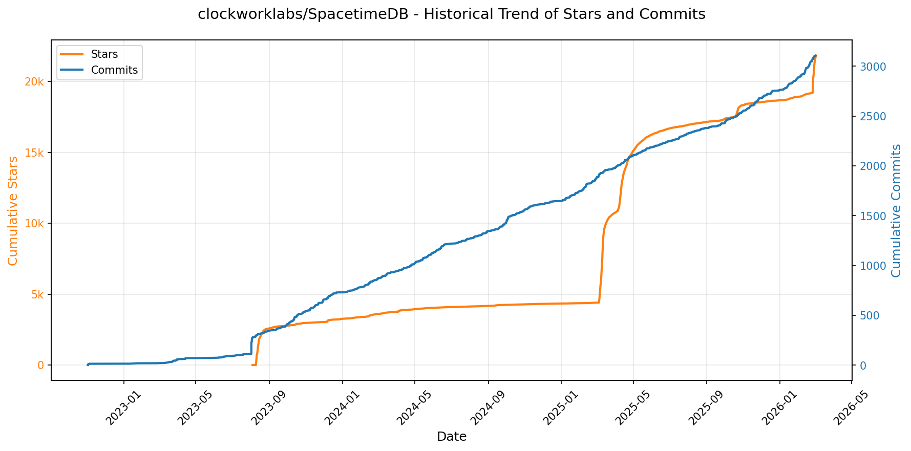

> *蓝色：累计 Stars｜橙色：累计 Commits（次 Y 轴）*

<b>📄 README 摘要</b>

1. **该项目的功能**  
SpacetimeDB 是一个将关系型数据库与应用服务器功能深度融合的实时数据平台。它允许开发者将业务逻辑（以“模块”形式）直接部署到数据库内部，客户端可绕过传统中间层服务，直连数据库并执行模块中的代码（如权限控制、状态更新、事件处理等）。其核心目标是消除微服务、容器、Kubernetes、VM 等基础设施复杂性，实现“单语言（Rust 为主）、单二进制、零运维”的极简后端架构。典型应用场景包括 MMORPG（如 BitCraft Online）、实时聊天、协同编辑等对低延迟和高并发有严苛要求的系统。

2. **关键特性**  
- **数据库即服务器（DB-as-Server）**：内置可执行模块（类似智能合约但非区块链），所有业务逻辑在数据库内存中运行，无外部服务依赖；  
- **极致实时性与低延迟**：全内存状态管理 + WAL（Write-Ahead Log）持久化，专为 OLTP 和实时交互场景优化，不适用于批处理或 OLAP；  
- **多语言模块支持**：服务端模块支持 Rust 和 C# 编写；客户端 SDK 支持 Rust、C# 和 TypeScript；  
- **一体化 CLI 工具链**：`spacetime` 命令行工具统一管理安装、版本切换、数据库启停、模块编译/部署/调试；  
- **跨平台开箱即用**：提供 macOS/Linux 一键脚本安装、Windows PowerShell 安装、Docker 镜像（`clockworklabs/spacetime`）及源码构建支持；  
- **生产就绪能力**：提供云服务高可用监控（UptimeRobot）、CI/CD 流水线（GitHub Actions）、多包管理分发（crates.io / NuGet）、社区支持（Discord、Stack Overflow 等）。

3. **技术栈**  
- **核心语言**：Rust（主引擎、CLI、运行时、WASM 模块沙箱均以 Rust 实现，强调内存安全与高性能）；  
- **执行环境**：基于 WebAssembly（WASM）的轻量级、沙箱化模块执行引擎（`wasm32-unknown-unknown` target）；  
- **存储引擎**：内存优先架构，状态全驻内存，通过 WAL 实现崩溃恢复与持久化；  
- **网络与协议**：自研高效二进制协议，支持客户端直连；提供标准化 SDK 封装通信细节；  
- **部署形态**：支持 standalone 二进制、Docker 容器、以及未来可能的云托管服务；  
- **构建与分发**：Rust Cargo 生态（crates.io）、.NET NuGet、Docker Hub、Shell/PowerShell 脚本化安装。

---

### 12. [badlogic/pi-mono](https://github.com/badlogic/pi-mono)
- 📅 **创建日期**：2025-08-09  
- 🔄 **最近更新**：2026-03-04  
- ⭐ **Stars**：19,509（日 +448｜周 +3598｜月 +14597）  
- 📝 **描述**：AI agent toolkit: coding agent CLI, unified LLM API, TUI & web UI libraries, Slack bot, vLLM pods  

<b>📈 Star 与 Commit 历史趋势</b>

> *蓝色：累计 Stars｜橙色：累计 Commits（次 Y 轴）*

<b>📄 README 摘要</b>

1. **项目功能**  
该项目是一个面向AI智能体（Agent）开发与大语言模型（LLM）部署管理的工具型单体仓库（monorepo），核心目标是提供一套模块化、可组合的基础设施，支持构建、运行和部署交互式AI编码代理及其他AI应用。其旗舰产品为 `pi-coding-agent`——一个命令行交互式编程助手，能理解自然语言指令、分析代码上下文、生成/修改代码并执行调试任务；同时支持通过Slack（via `pi-mom`）、终端（via `pi-tui`）和Web界面（via `pi-web-ui`）等多种入口接入AI能力。

2. **关键特性**  
- **多厂商LLM统一抽象层**：`pi-ai` 包提供标准化API，无缝对接OpenAI、Anthropic、Google Gemini等主流LLM服务，屏蔽底层差异；  
- **轻量级Agent运行时**：`pi-agent-core` 支持工具调用（Tool Calling）、状态持久化、会话生命周期管理及可扩展的插件机制；  
- **全链路开发体验**：覆盖CLI（`coding-agent`）、终端UI（`tui`，含差分渲染优化性能）、Web组件（`web-ui`，基于现代Web标准）、Slack集成（`mom`）及GPU集群部署（`pods`，专为vLLM优化）；  
- **生产就绪的部署工具**：`pi-pods` 提供命令行接口，用于在GPU服务器上一键启动、监控和扩缩vLLM推理服务；  
- **开发者友好工作流**：内置完整构建（`build`）、类型检查/格式化/静态分析（`check`）、本地端到端测试（`pi-test.sh`）及免密单元测试（自动跳过需API密钥的LLM测试）。

3. **技术栈**  
- **语言与运行时**：TypeScript（全栈强类型）、Node.js（后端/CLI/构建工具）；  
- **前端框架**：无重量级框架依赖，`pi-tui` 基于原生终端控制（如ANSI转义序列），`pi-web-ui` 使用原生Web Components（Custom Elements + Shadow DOM）；  
- **LLM集成**：适配OpenAI兼容API、Anthropic Claude、Google Vertex AI等，支持流式响应与结构化输出解析；  
- **部署与推理**：深度集成vLLM（高性能LLM推理引擎），通过`pi-pods`管理GPU资源；  
- **工程基础设施**：Monorepo架构（pnpm/npm workspaces风格）、TypeScript编译、ESLint+Prettier代码规范、Jest单元测试、GitHub Actions CI/CD。

---

### 13. [agentscope-ai/agentscope](https://github.com/agentscope-ai/agentscope)
- 📅 **创建日期**：2024-01-12  
- 🔄 **最近更新**：2026-03-04  
- ⭐ **Stars**：17,029（日 +260｜周 +591｜月 +1002）  
- 📝 **描述**：Build and run agents you can see, understand and trust.  

<b>📈 Star 与 Commit 历史趋势</b>

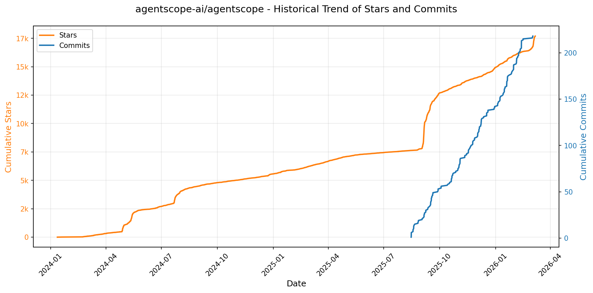

> *蓝色：累计 Stars｜橙色：累计 Commits（次 Y 轴）*

<b>📄 README 摘要</b>

1. **项目功能**  
AgentScope 是一个面向生产环境的、开箱即用的智能体（Agent）开发框架，专为构建基于大语言模型（LLM）的高自主性、可扩展、可部署的多智能体应用而设计。它不依赖硬编码的提示工程或强约束式编排，而是充分利用现代LLM日益增强的推理能力、工具调用能力与自主规划能力，提供从单智能体到复杂多智能体系统的全栈支持，覆盖开发、调试、评估、微调、部署与可观测性等完整生命周期。

2. **核心特性**  
- **开箱即用的智能体能力**：内置 ReAct 智能体、人类介入（Human-in-the-loop）实时中断与恢复、结构化输出、RAG、语音交互（TTS/STT）、实时语音智能体（Realtime Voice Agent）、多模态会话管理；  
- **灵活的多智能体编排**：通过 `MsgHub` 消息中枢实现动态参与者管理、广播/顺序/并发工作流，支持多智能体辩论、对话、游戏（如狼人杀）等复杂协作场景；  
- **标准化协议与生态集成**：原生支持 MCP（Model Context Protocol）和 A2A（Agent-to-Agent）协议，可无缝接入外部 MCP 服务（如高德地图），并提供本地可调用函数封装能力；  
- **增强型记忆系统**：支持短时内存（含压缩技术）、长时内存（集成 ReMe 等方案）、SQLite 会话持久化及数据库后端扩展；  
- **端到端训练与优化**：集成 Agentic RL 支持（通过 Trinity-RFT），提供数学求解、邮件搜索、狼人杀策略、数据增强等 RL 微调示例，支持 LLM-as-a-judge 自动反馈；  
- **生产就绪能力**：支持本地运行、Serverless 云部署及 Kubernetes 集群部署，内置 OpenTelemetry（OTel）可观测性、Docker/K8s 运行时（agentscope-runtime）、VNC 图形沙箱及代码优先部署模式；  
- **丰富样例与模块化设计**：涵盖功能性（MCP/TTS/Plan/RAG）、智能体类型（浏览器代理、深度研究代理、Meta Planner）、游戏、工作流、评测（ACEBench）、微调（Tuner）等数十类高质量示例。

3. **技术栈**  
- **编程语言**：Python 3.10+（核心实现）；  
- **核心依赖**：异步框架（`asyncio`）、HTTP 客户端（`httpx`）、标准库（`sqlite3`, `json`, `logging`）；  
- **模型对接**：支持主流厂商 API（如 DashScope/Qwen、Anthropic），兼容自定义模型适配器；  
- **协议与标准**：MCP（Streamable HTTP）、A2A 协议、OpenTelemetry（追踪/指标/日志）；  
- **部署与运维**：Docker、Kubernetes、Serverless 架构支持；GUI 沙箱基于 VNC；  
- **辅助工具链**：Data-Juicer（数据处理）、Trinity-RFT（Agentic RL 训练库）、agentscope-samples（独立样例仓库）；  
- **许可证**：Apache License 2.0。

---

### 14. [muratcankoylan/Agent-Skills-for-Context-Engineering](https://github.com/muratcankoylan/Agent-Skills-for-Context-Engineering)
- 📅 **创建日期**：2025-12-21  
- 🔄 **最近更新**：2026-03-04  
- ⭐ **Stars**：13,223（日 +131｜周 +3296｜月 +5238）  
- 📝 **描述**：A comprehensive collection of Agent Skills for context engineering, multi-agent architectures, and production agent systems. Use when building, optimizing, or debugging agent systems that require effective context management.  

<b>📈 Star 与 Commit 历史趋势</b>

> *蓝色：累计 Stars｜橙色：累计 Commits（次 Y 轴）*

<b>📄 README 摘要</b>

1. **该项目做什么？**  
该项目是一个面向生产级AI智能体（Agent）系统的、开源的“智能体技能”集合，核心聚焦于**上下文工程（Context Engineering）**这一关键范式。它不提供可直接运行的软件或框架，而是系统性地封装和传授如何科学地构建、管理、压缩、优化和评估输入大语言模型（LLM）的全部上下文信息——包括系统提示、工具定义、检索文档、对话历史、工具输出等——以在有限的注意力窗口内最大化模型性能与可靠性。其目标是帮助开发者跨越“提示工程”层面，深入掌握影响Agent实际效果的根本性瓶颈：**上下文质量与结构设计**，并支持在Claude Code、Cursor等主流Agent IDE及自定义平台中即插即用地实践这些原理。

2. **关键特性**  
- **分层技能体系**：涵盖五大维度——基础理论（如上下文退化模式识别）、架构设计（多智能体模式、内存系统、工具/文件系统集成、沙箱托管智能体）、运行优化（上下文压缩/掩码/缓存）、评估方法（含LLM-as-a-Judge全流程）、开发方法论（从立项到部署）及认知建模（BDI信念-愿望-意图形式化）。  
- **动态演进与平台无关性**：采用“渐进式披露”机制（仅按需加载技能全文），所有技能以概念+伪代码示例呈现，不绑定特定API或依赖，可跨Claude、Cursor、自研Agent框架复用。  
- **开箱即用的生产级示例**：提供多个完整可运行案例（如“数字大脑”个人操作系统、“X→书”多智能体生成系统、“LLM-as-Judge”评测工具链、“作者风格微调管道”），每个均附带PRD、技能映射表、实现指南及成本/效果实测数据（如$2训练成本、70%人类评分）。  
- **学术与工业双验证**：被北京大学通用人工智能国家重点实验室等机构引用为上下文工程领域奠基性工作，并融入真实产品场景（如Claude Code插件市场直连安装）。  
- **标准化技能格式**：严格遵循`SKILL.md + scripts/ + references/`的轻量规范，确保可发现、可组合、可维护。

3. **技术栈**  
- **核心范式**：上下文工程理论（注意力机制约束建模、U型注意力曲线、Lost-in-the-Middle诊断）、BDI认知架构、多智能体系统（MAS）设计模式、记忆系统（短/长时+图谱）、LLM-as-a-Judge评估范式。  
- **实现载体**：Python伪代码（跨环境兼容）、TypeScript（LLM评测工具示例）、JSONL（追加式内存存储）、RDF（认知状态建模）、LoRA微调（SFT管道示例）。  
- **集成平台**：原生支持Claude Code插件市场（通过`/plugin install`命令一键部署），兼容Cursor/Codex等IDE的`.rules`规则注入，亦可手动集成至任意Agent框架（如LangChain、LlamaIndex、自研调度器）。  
- **基础设施**：文件系统作为动态上下文载体（offloading、scratchpad）、沙箱虚拟机（Modal等）用于托管执行、JSON Schema驱动的数据解析，无强制后端服务或云依赖。

---

### 15. [tobi/qmd](https://github.com/tobi/qmd)
- 📅 **创建日期**：2025-12-08  
- 🔄 **最近更新**：2026-03-04  
- ⭐ **Stars**：12,182（日 +553｜周 +1767｜月 +6866）  
- 📝 **描述**：mini cli search engine for your docs, knowledge bases, meeting notes, whatever. Tracking current sota approaches while being all local  

<b>📈 Star 与 Commit 历史趋势</b>

> *蓝色：累计 Stars｜橙色：累计 Commits（次 Y 轴）*

<b>📄 README 摘要</b>

1. **项目功能**  
QMD 是一个**纯本地运行的设备端搜索引擎**，专为个人知识管理与 AI 代理（agentic）工作流设计。它能对用户本地的 Markdown 笔记、会议记录、技术文档和知识库进行统一索引与检索，支持三种搜索模式：基于关键词的快速全文搜索（BM25）、基于语义的向量搜索（vector search），以及融合查询扩展、多路召回与大语言模型重排序（LLM re-ranking）的高质量混合搜索（`query` 命令）。所有处理（包括嵌入生成、语义检索、查询改写和重排序）均在用户设备上离线完成，无需联网或依赖外部 API。

2. **核心特性**  
- ✅ **三合一混合检索架构**：并行执行 BM25（SQLite FTS5）、向量相似度搜索（sqlite-vec）与 LLM 驱动的查询扩展（fine-tuned GGUF 模型），再通过改进型**位置感知加权融合**（Reciprocal Rank Fusion + top-rank bonus + rank-aware blending）输出最终结果；  
- ✅ **上下文感知索引（Context-Aware Indexing）**：支持为集合（如 `qmd://notes`）或任意路径添加自然语言描述性上下文，该上下文随匹配结果返回，显著提升 LLM 在文档筛选与推理中的准确性；  
- ✅ **智能分块（Smart Chunking）**：非机械切分，而是基于 Markdown 结构（标题层级、代码块、列表、分隔符等）动态打分选择最优断点，确保语义完整性与代码块不被截断；  
- ✅ **原生 MCP（Model Context Protocol）服务器**：提供标准化工具接口（`qmd_search`, `qmd_deep_search`, `qmd_get` 等），可无缝集成至 Claude Desktop/Code 等支持 MCP 的 LLM 客户端，并支持 HTTP 长连接模式以复用 GPU 显存中的模型；  
- ✅ **面向代理的工作流友好输出**：支持 `--json`、`--files`、`--md` 等结构化输出格式，便于 LLM 直接消费；支持按 glob 模式批量获取文档（`qmd multi-get`）、按分数阈值过滤（`--min-score`）、完整内容提取（`--full`）及行号定位；  
- ✅ **轻量级本地存储**：全部索引数据（含 FTS5 全文索引、向量数据库、文档元数据、上下文、LLM 缓存）统一存于单个 SQLite 文件（`~/.cache/qmd/index.sqlite`），无外部依赖；  
- ✅ **自动模型管理**：首次运行时自动从 Hugging Face 下载并缓存三个专用 GGUF 模型（嵌入、重排序、查询扩展），支持自定义模型路径。

3. **技术栈**  
- **运行时**：Node.js ≥22 或 Bun ≥1.0.0（全命令行工具，无前端）；  
- **本地 LLM 推理引擎**：`node-llama-cpp`（基于 WebAssembly/C++ 的高性能 GGUF 运行时，支持 Apple Silicon GPU 加速）；  
- **全文检索**：SQLite FTS5（内置 BM25 算法，利用 `rank` 函数实现高效排序）；  
- **向量检索**：`sqlite-vec`（SQLite 扩展，原生支持向量相似度计算与索引）；  
- **索引存储**：单文件 SQLite 数据库（含 `collections`, `documents`, `documents_fts`, `content_vectors`, `vectors_vec`, `llm_cache`, `path_contexts` 等表）；  
- **模型格式**：GGUF（量化模型，支持 Q4_K_M、Q8_0 等精度，自动下载缓存）；  
- **协议集成**：MCP（Model Context Protocol）标准，支持 stdio 子进程与 HTTP（`POST /mcp`）两种传输方式；  
- **操作系统适配**：macOS（需 Homebrew 安装 SQLite 以启用 FTS5 扩展），Linux/Windows 支持正在演进中（README 中未明确列出，但 `node-llama-cpp` 原生支持跨平台）。

---

### 16. [K-Dense-AI/claude-scientific-skills](https://github.com/K-Dense-AI/claude-scientific-skills)
- 📅 **创建日期**：2025-10-19  
- 🔄 **最近更新**：2026-03-04  
- ⭐ **Stars**：11,923（日 +820｜周 +2705｜月 +4288）  
- 📝 **描述**：A set of ready to use Agent Skills for research, science, engineering, analysis, finance and writing.  

<b>📈 Star 与 Commit 历史趋势</b>

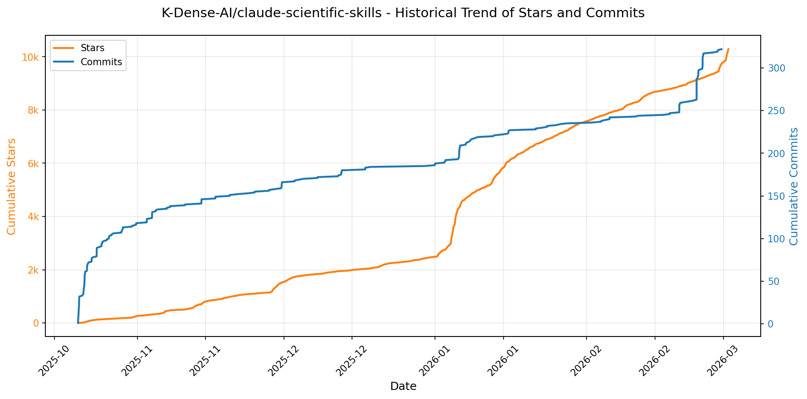

> *蓝色：累计 Stars｜橙色：累计 Commits（次 Y 轴）*

<b>📄 README 摘要</b>

1. **该项目做什么？**  
该项目是一个面向科研场景的开源技能库（Claude Scientific Skills），提供 **170+ 个开箱即用、领域专用的科学计算与研究技能**，专为支持 [Agent Skills](https://agentskills.io/) 开放标准的AI智能体（如 Cursor、Claude Code、Codex 等）设计。它不替代AI模型本身，而是通过结构化、文档完备、经验证的技能定义，使AI代理能**可靠调用专业科学工具链**，自动执行跨学科、多步骤的复杂科研工作流——例如从基因组数据解析、药物虚拟筛选、单细胞分析到临床变异解读、多组学整合建模等，最终将通用编程助手升级为具备领域深度的“AI科学家”。

2. **核心功能**  
- ✅ **覆盖广度空前**：涵盖16大科研领域（生物信息学、药物发现、临床医学、材料科学、天文学、工程仿真、医疗影像、AI/ML等），每类均含具体可执行能力（如“用scVelo做RNA velocity分析”“用DiffDock进行分子对接”）。  
- ✅ **数据库接入能力强大**：直接支持 **250+ 科学与金融数据库**（含PubMed、ChEMBL、UniProt、COSMIC、ClinicalTrials.gov、Alpha Vantage等），并集成BioServices（40+生物服务）、BioPython（38个NCBI子库）、gget（20+基因组数据库）等多源聚合接口。  
- ✅ **主流科学计算包深度优化**：为 **60+ Python科学库**（RDKit、Scanpy、PyTorch Lightning、scikit-learn、OpenMM、MDAnalysis、Qiskit、PennyLane、TimesFM等）提供定制化技能封装，含完整文档、典型示例、最佳实践和依赖管理指南，显著提升AI调用准确率与鲁棒性。  
- ✅ **真实科研场景闭环**：不仅支持分析，还覆盖**实验自动化（Benchling/LatchBio）、学术沟通（文献综述/幻灯片生成/图表绘制/Mermaid绘图）、科研方法论（假设生成/基金撰写/同行评议）及临床决策支持（治疗方案推荐/药理基因组分析）**，形成“问题→数据→分析→解释→呈现→决策”全链条支持。  
- ✅ **即插即用、跨平台兼容**：遵循开放Agent Skills标准，支持一键复制安装至Cursor/Claude Code/Codex等主流AI编码工具；自动技能发现，无需手动注册；全局或项目级灵活部署。

3. **技术栈**  
- **核心协议**：[Agent Skills](https://agentskills.io/) 开放技能标准（JSON/YAML描述 + Markdown文档 + Python代码示例）  
- **运行环境**：Python 3.9+（推荐3.12+），依赖管理采用现代超快包管理器 **uv**（替代pip/poetry）  
- **底层支撑库**：深度集成并封装以下生态：  
  - 生物/医学：BioPython、Scanpy、scVelo、pysam、Ensembl VEP、pyOpenMS、Cellxgene Census  
  - 化学/药物：RDKit、datamol、DeepChem、DiffDock、ZINC、PubChem、USPTO、AlphaFold DB  
  - AI/ML：PyTorch Lightning、scikit-learn、statsmodels、Torch Geometric、PyMC、TimesFM  
  - 物理/材料：PennyLane、Qiskit、OpenMM、MDAnalysis  
  - 数据库/API：BioServices、gget、NCBI Entrez、Reactome、KEGG、STRING、Open Targets、HMDB、Metabolomics Workbench  
- **部署平台**：本地运行（macOS/Linux/WSL2），无缝对接K-Dense Web云端平台（增强版，含GPU/HPC、200+技能、出版级输出）  
- **工程规范**：每个技能均含标准化 `SKILL.md` 文档、可运行代码示例、使用场景说明、集成指引与参考资源，确保可维护性与可扩展性。

---

### 17. [openai/skills](https://github.com/openai/skills)
- 📅 **创建日期**：2025-11-25  
- 🔄 **最近更新**：2026-03-04  
- ⭐ **Stars**：10,636（日 +132｜周 +955｜月 +8353）  
- 📝 **描述**：Skills Catalog for Codex  

<b>📈 Star 与 Commit 历史趋势</b>

> *蓝色：累计 Stars｜橙色：累计 Commits（次 Y 轴）*

<b>📄 README 摘要</b>

1. **项目功能**  
该项目定义并维护一套标准化的“Agent Skills”（智能体技能）集合，即以文件夹形式组织的、可被AI智能体自动发现与调用的任务执行单元，包含指令说明、脚本代码和相关资源。其核心目标是实现能力复用——“一次编写，处处使用”，使团队和个人能以模块化、可重复的方式封装和分发特定任务能力，并与Codex平台集成，供AI智能体在实际场景中按需调用。

2. **关键特性**  
- **标准化技能结构**：每个技能为独立文件夹，遵循统一目录规范（如含`LICENSE.txt`），支持元数据描述与版本管理；  
- **三级技能分类体系**：分为`.system`（系统内置，自动加载）、`.curated`（经审核的精选技能，支持按名称一键安装）和`.experimental`（实验性技能，需显式指定路径或GitHub URL安装）；  
- **便捷的安装机制**：通过Codex内置命令`$skill-installer`实现技能的快速拉取、本地部署与启用，支持GitHub仓库直链安装；  
- **开放标准支持**：遵循[Agent Skills开放标准](https://agentskills.io)，确保跨平台兼容性与生态互操作性；  
- **许可证透明化**：每个技能目录内嵌`LICENSE.txt`，明确其独立授权条款，便于合规使用与分发。

3. **技术栈**  
- **运行平台**：深度集成于OpenAI Codex环境，依赖其智能体运行时与技能加载机制；  
- **分发与协作**：基于GitHub进行版本控制、协作开发与公开分发；  
- **安装工具**：内置CLI命令`$skill-installer`（Codex专属），用于解析技能路径、克隆远程资源、校验依赖并触发重启生效；  
- **结构规范**：纯文件系统级约定（无强制框架或构建工具），采用扁平化目录结构（如`skills/.system/`、`skills/.curated/`），强调轻量性与可移植性。

---

### 18. [xpzouying/xiaohongshu-mcp](https://github.com/xpzouying/xiaohongshu-mcp)
- 📅 **创建日期**：2025-08-03  
- 🔄 **最近更新**：2026-03-04  
- ⭐ **Stars**：9,958（日 +171｜周 +849｜月 +1562）  
- 📝 **描述**：MCP for xiaohongshu.com  

<b>📈 Star 与 Commit 历史趋势</b>

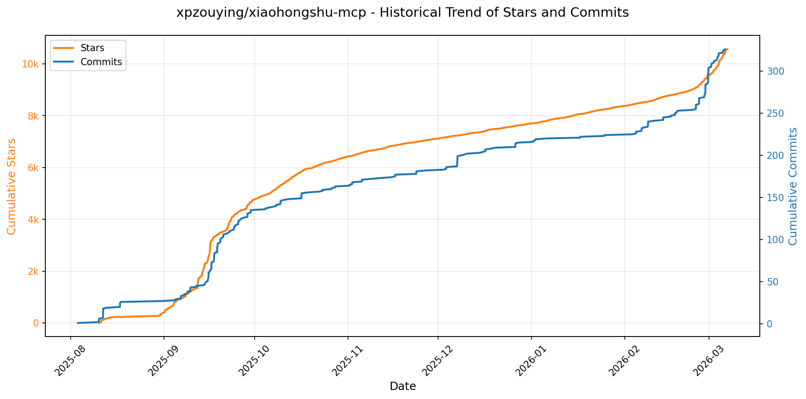

> *蓝色：累计 Stars｜橙色：累计 Commits（次 Y 轴）*

<b>📄 README 摘要</b>

1. **该项目做什么？**  
本项目是一个专为小红书（xiaohongshu.com）设计的 **Model Context Protocol（MCP）服务端实现**，旨在通过自动化方式与小红书网页端交互，实现账号运营类操作。它不依赖官方API，而是基于浏览器自动化（无头/有头Chrome），模拟真实用户行为，提供标准化MCP接口供各类AI客户端（如Claude Code、Cursor、Cline、OpenClaw等）调用，从而实现AI驱动的小红书内容发布与互动管理。

2. **关键功能特性**  
- ✅ **全链路账号管理**：支持扫码登录、登录状态检查、Cookies持久化存储与重置；  
- ✅ **多模态内容发布**：  
  - 图文发布（支持本地绝对路径/HTTP图片链接，含标题、正文、话题标签、定时发布、原创声明、可见范围配置）；  
  - 视频发布（仅支持本地MP4文件，自动处理格式转换与上传流程）；  
- ✅ **内容发现与获取**：支持关键词搜索（可按排序、类型、时间、地域等多维筛选）、首页推荐流获取、单篇笔记详情抓取（含点赞/收藏/评论数、完整评论树、子回复展开）；  
- ✅ **深度互动能力**：支持对笔记点赞/取消点赞、收藏/取消收藏、发表一级评论、精准回复指定用户或评论（需comment_id或user_id）；  
- ✅ **用户画像获取**：拉取指定用户主页信息（昵称、简介、头像、关注/粉丝/获赞/笔记数、全部公开笔记列表）；  
- ✅ **生产就绪设计**：  
  - 提供预编译二进制（跨平台macOS/Windows/Linux）、Docker镜像（含字体/Chrome/数据卷预配置）、源码编译三套部署方案；  
  - 内置智能状态检测（如自动识别是否已点赞/收藏，避免重复操作）；  
  - 支持代理（HTTP/HTTPS/SOCKS5）、定时发布（1小时–14天）、中文字体与国际化适配；  
- ✅ **生态兼容性强**：原生支持标准HTTP MCP协议，开箱即用接入Claude Code、Cursor、VSCode、Gemini CLI、Cline、OpenClaw（via MCPorter）等主流AI工具；  
- ✅ **合规与风控提示**：明确标注小红书平台限制（如标题≤20字、正文≤1000字、单日发帖上限约50篇、禁止多网页端登录）、违禁词风险、实名认证提醒，并强调非恶意用途。

3. **技术栈**  
- **核心语言**：Go（Golang）——用于构建高性能、跨平台的MCP服务端与登录工具；  
- **浏览器自动化**：Chrome + [chromedp](https://github.com/chromedp/chromedp)（Go语言驱动库）——实现无头/有头模式下的网页操作与DOM交互；  
- **协议标准**：Model Context Protocol（MCP）v0.1+ —— 提供符合规范的`/mcp` HTTP端点，支持JSON-RPC 2.0通信；  
- **部署与分发**：  
  - Docker（Alpine Linux基础镜像，预装Chrome、中文字体、配置数据卷`./data`和`./images`）；  
  - GitHub Actions自动化构建与Release发布（含多平台二进制）；  
- **前端调试支持**：MCP Inspector（Node.js）、CLI工具集成（如`claude mcp add`）；  
- **辅助生态**：配套技能包[xiaohongshu-mcp-skills](https://github.com/autoclaw-cc/xiaohongshu-mcp-skills)（OpenClaw兼容）、轻量替代方案[x-mcp](https://github.com/xpzouying/x-mcp)（浏览器插件驱动，免部署）。

---

### 19. [abhigyanpatwari/GitNexus](https://github.com/abhigyanpatwari/GitNexus)
- 📅 **创建日期**：2025-08-02  
- 🔄 **最近更新**：2026-03-04  
- ⭐ **Stars**：9,217（日 +856｜周 +6375｜月 +8805）  
- 📝 **描述**：GitNexus: The Zero-Server Code Intelligence Engine -       GitNexus is a client-side knowledge graph creator that runs entirely in your browser. Drop in a GitHub repo or ZIP file, and get an interactive knowledge graph wit a built in Graph RAG Agent. Perfect for code exploration  

<b>📈 Star 与 Commit 历史趋势</b>

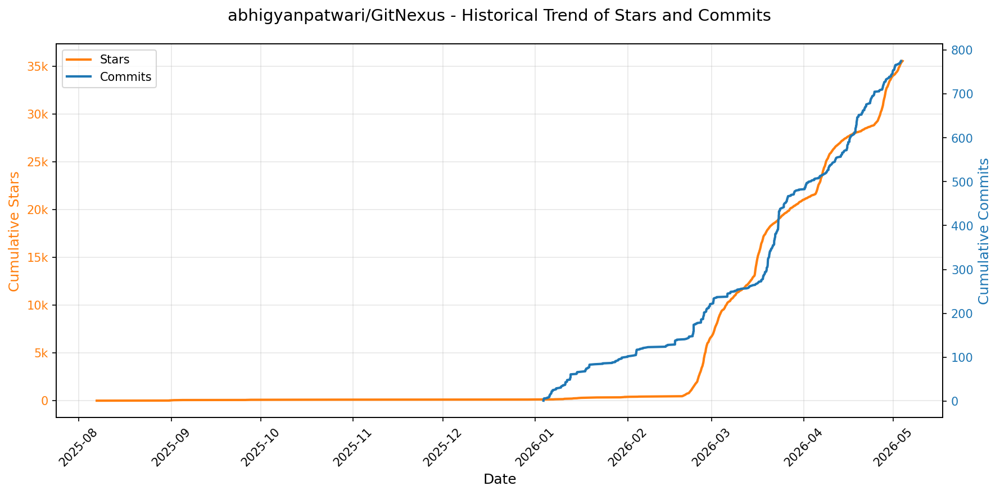

> *蓝色：累计 Stars｜橙色：累计 Commits（次 Y 轴）*

<b>📄 README 摘要</b>

1. **项目功能**  
GitNexus 是一个面向 AI 代理（AI Agents）的代码智能基础设施，旨在为大模型提供**深度、结构化、可推理的代码上下文能力**。它通过构建高保真度的**多语言知识图谱（Knowledge Graph）**，完整建模代码库中的依赖关系、调用链、功能聚类（Clusters）、执行流程（Processes）及语义关联，从而解决当前 AI 编程工具（如 Cursor、Claude Code、Windsurf 等）“不了解代码架构”的根本缺陷。其核心价值是：让 AI 代理在编辑、调试、重构或分析代码时，不再依赖模糊的文本检索或不完整的上下文切片，而是通过预计算的、带置信度的结构化工具直接获取准确、完整、可操作的代码认知。

2. **关键特性**  
- ✅ **双模态使用范式**：提供 CLI + MCP（Model Context Protocol）服务端（面向工程集成）与纯前端 Web UI（面向快速探索），支持桥接模式（`gitnexus serve`）实现本地索引复用；  
- ✅ **7 个开箱即用的 MCP 智能工具**：包括 `query`（混合搜索）、`context`（360°符号全景视图）、`impact`（带置信度与深度的变更影响分析）、`detect_changes`（Git Diff 影响映射）、`rename`（图谱驱动的跨文件安全重命名）、`cypher`（原生 Cypher 图查询）及 `list_repos`；  
- ✅ **4 类自动安装的 AI 代理技能（Skills）**：覆盖探索、调试、影响分析与重构四大高频场景，深度集成至 Claude Code 等编辑器；  
- ✅ **预计算的关系智能（Precomputed Relational Intelligence）**：在索引阶段即完成聚类、流程追踪、置信度评分等复杂分析，使工具响应具备**一次性、高可靠性、低 Token 开销**，显著降低对大模型能力的依赖；  
- ✅ **多仓库统一 MCP 架构**：全局注册中心 + 懒加载 KuzuDB 连接池，单次配置即可服务所有已索引仓库，无需 per-project 配置；  
- ✅ **全栈隐私保障**：CLI 完全离线运行，Web UI 100% 浏览器内执行（WASM），代码与索引永不离开用户设备；  
- ✅ **Wiki 自动生成**：基于知识图谱结构调用 LLM（支持自定义模型/API）生成模块化、带交叉引用的架构文档；  
- ✅ **11+ 主流语言原生支持**：TypeScript/JS、Python、Java、Kotlin、C/C++/C#、Go、Rust、PHP、Swift，均通过 Tree-sitter AST 解析保障精度。

3. **技术栈**  
- **运行时**：CLI 基于 Node.js（原生二进制性能），Web 基于浏览器 WASM（Tree-sitter WASM、KuzuDB WASM、transformers.js WebGPU/WASM）；  
- **图数据库**：底层统一采用 **KuzuDB** —— 轻量级嵌入式图数据库，原生支持向量索引与 Cypher 查询，CLI 使用原生版，Web 使用 WASM 版；  
- **解析引擎**：**Tree-sitter**（AST 驱动），CLI 调用原生绑定，Web 通过 WASM 加载；  
- **搜索与语义**：融合 BM25（关键词）、语义向量（HuggingFace transformers.js）与 RRF（重排序融合）的混合检索；  
- **图分析与可视化**：**Graphology**（社区检测、聚类算法）、**Sigma.js**（WebGL 加速图渲染）；  
- **前端框架**：React 18 + TypeScript + Vite + Tailwind CSS v4；  
- **AI 集成协议**：严格遵循 **MCP（Model Context Protocol）** 标准，兼容 Cursor、Claude Code、Windsurf、OpenCode 及 pi.dev 等生态；  
- **并发与性能**：CLI 层采用 Worker Threads + 异步 I/O，Web 层基于 Web Workers + Comlink 实现多线程隔离。

---

### 20. [huggingface/skills](https://github.com/huggingface/skills)
- 📅 **创建日期**：2025-11-24  
- 🔄 **最近更新**：2026-03-04  
- ⭐ **Stars**：7,797（日 +115｜周 +2424｜月 +6675）  
- 📝 **描述**：暂无描述  

<b>📈 Star 与 Commit 历史趋势</b>

> *蓝色：累计 Stars｜橙色：累计 Commits（次 Y 轴）*

<b>📄 README 摘要</b>

1. **该项目的作用**  
该项目提供一套标准化、可互操作的“AI/ML 技能（Skills）”定义集合，专用于在各类编码智能体（coding agents）中自动化执行 Hugging Face 生态内的核心任务。这些技能封装了特定 AI/ML 工作流的完整指令、脚本与资源（如数据集构建、模型训练与微调、模型评估、Gradio 应用开发、Hub CLI 操作、论文发布、实验追踪等），使大模型驱动的编程助手（如 Claude Code、OpenAI Codex、Gemini CLI、Cursor）能精准、可靠、一致地完成专业级 Hugging Face 开发任务，无需用户重复编写底层命令或逻辑。

2. **关键特性**  
- ✅ **跨平台兼容性**：原生支持四大主流编码智能体——Claude Code（插件市场 + `@huggingface/skills` 安装）、Codex（遵循 [Agent Skills](https://agentskills.io/specification) 标准，自动发现 `.agents/skills` 下的 `SKILL.md`）、Gemini CLI（通过 `gemini-extension.json` 作为扩展安装）、Cursor（含 `.cursor-plugin/plugin.json` 和 MCP 配置）。  
- ✅ **标准化技能格式**：每个技能为独立文件夹，含结构化 `SKILL.md`（YAML 前置元数据 + 自然语言指导 + 示例 + 安全护栏），确保语义清晰、机器可解析、人工可读。  
- ✅ **开箱即用的生产级技能库**：已内置 10 个高价值技能，覆盖全栈 Hugging Face 工作流（如 `hugging-face-model-trainer` 支持 SFT/DPO/GRPO 训练与 GGUF 转换；`hugging-face-dataset-viewer` 提供零 Python 依赖的 Dataset Viewer API 查询能力；`gradio` 技能专精 Web UI 构建等）。  
- ✅ **灵活降级与集成方案**：不支持技能的环境可直接使用统一聚合的 `agents/AGENTS.md`；所有技能均附带可执行脚本、CLI 工具链和 API 集成示例。  
- ✅ **开放贡献机制**：提供标准化开发流程（复制模板 → 修改 `SKILL.md` → 更新插件清单 → 运行 `./scripts/publish.sh` 自动生成并校验元数据），支持社区共建与定制化扩展。

3. **技术栈**  
- **核心规范**：基于开放标准 [Agent Skills Specification](https://agentskills.io/specification)（由 OpenAI Codex 推动），兼容 Anthropic 的 Skills 概念及 Google Gemini 的 Extensions 模型。  
- **配置与元数据**：YAML（`SKILL.md` 前置参数）、JSON（`gemini-extension.json`、`.claude-plugin/marketplace.json`、`.mcp.json`）。  
- **运行时依赖**：面向 Hugging Face 生态深度集成，重度依赖官方工具链，包括 `huggingface-hub`、`datasets`、`transformers`、`trl`、`vLLM`、`lighteval`、`trackio`、`gradio`、`hf-cli` 及 `npx`/`parquetlens` 等 CLI 工具。  
- **基础设施适配**：技能设计直连 Hugging Face Jobs 计算平台、Hugging Face Spaces、Dataset Viewer REST API、Model Hub API 及 Paper Publisher 服务。  
- **工程化支持**：Shell 脚本（`./scripts/publish.sh` 实现元数据生成与 CI 校验）、Git 工作流、自动化的技能表格生成（Python 脚本 `scripts/generate_agents.py`）。

---

### 21. [LMCache/LMCache](https://github.com/LMCache/LMCache)
- 📅 **创建日期**：2024-05-28  
- 🔄 **最近更新**：2026-03-04  
- ⭐ **Stars**：7,394（日 +145｜周 +474｜月 +586）  
- 📝 **描述**：Supercharge Your LLM with the Fastest KV Cache Layer  

<b>📈 Star 与 Commit 历史趋势</b>

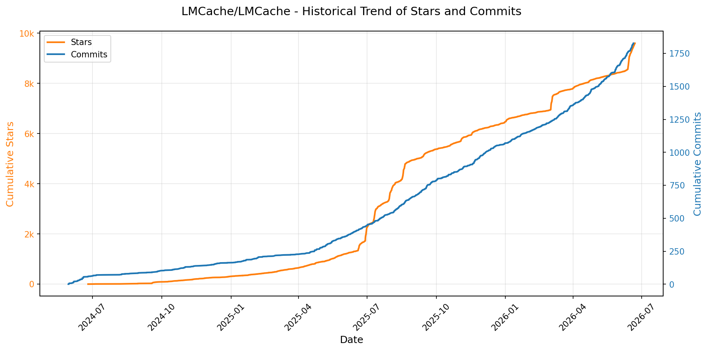

> *蓝色：累计 Stars｜橙色：累计 Commits（次 Y 轴）*

<b>📄 README 摘要</b>

1. **项目功能**  
LMCache 是一个面向大语言模型（LLM）推理服务的高性能 KV 缓存层，核心目标是**显著降低首词生成时间（TTFT）并提升吞吐量**，尤其在长上下文、多轮对话和 RAG 等重用文本频繁的场景中效果突出。它通过将可复用文本（不限于前缀，支持任意子序列）的 KV 缓存**跨实例、跨设备持久化存储**于异构存储层级（GPU 显存、CPU 内存、本地磁盘、远程对象存储如 S3），实现服务集群内任意 vLLM/SGLang 等推理引擎实例间的 KV 缓存共享与零拷贝复用，从而大幅节省 GPU 计算资源、减少重复计算开销与用户响应延迟。

2. **关键特性**  
- ✅ **多引擎深度集成**：原生支持 vLLM v1（含 CPU KV 缓存卸载、解耦式 Prefill、P2P 缓存共享）及 SGLang；  
- ✅ **分层异构存储后端**：支持 GPU、CPU、本地磁盘及 NIXL（NVIDIA Index-based eXtensible Layer）等加速存储；  
- ✅ **细粒度缓存复用**：支持任意文本片段（非仅 prefix）的 KV 缓存匹配与复用，突破传统 KV 缓存复用的前缀限制；  
- ✅ **生产级优化技术**：集成零 CPU 拷贝、GDS（GPU Direct Storage）、NIXL 索引加速等底层优化，保障高吞吐低延迟；  
- ✅ **开箱即用与生态兼容**：提供 pip 一键安装，已与 Redis、Weka、PliOps 等存储基础设施及 KServe、llm-d、NVIDIA Dynamo 等主流推理平台深度集成。

3. **技术栈**  
- **核心语言**：Python（主逻辑与接口）、CUDA/C++（底层高性能缓存操作、零拷贝传输、GDS/NIXL 集成）；  
- **依赖框架**：PyTorch（Tensor 操作与 GPU 支持）、vLLM / SGLang（作为插件式扩展运行）；  
- **存储与加速层**：NVIDIA GDS、NIXL（索引加速）、Redis、Weka、S3 兼容对象存储；  
- **部署与运维**：Linux + NVIDIA GPU 环境，支持 Kubernetes（已在 Google Cloud GKE 生产验证），CI/CD 基于 Buildkite 与 GitHub Actions；  
- **协议与标准**：Apache License 2.0 开源许可，遵循 OpenSSF 最佳实践与安全评分标准。

---

### 22. [moonshine-ai/moonshine](https://github.com/moonshine-ai/moonshine)
- 📅 **创建日期**：2024-10-04  
- 🔄 **最近更新**：2026-03-04  
- ⭐ **Stars**：6,873（日 +136｜周 +2447｜月 +3760）  
- 📝 **描述**：Fast and accurate automatic speech recognition (ASR) for edge devices  

<b>📈 Star 与 Commit 历史趋势</b>

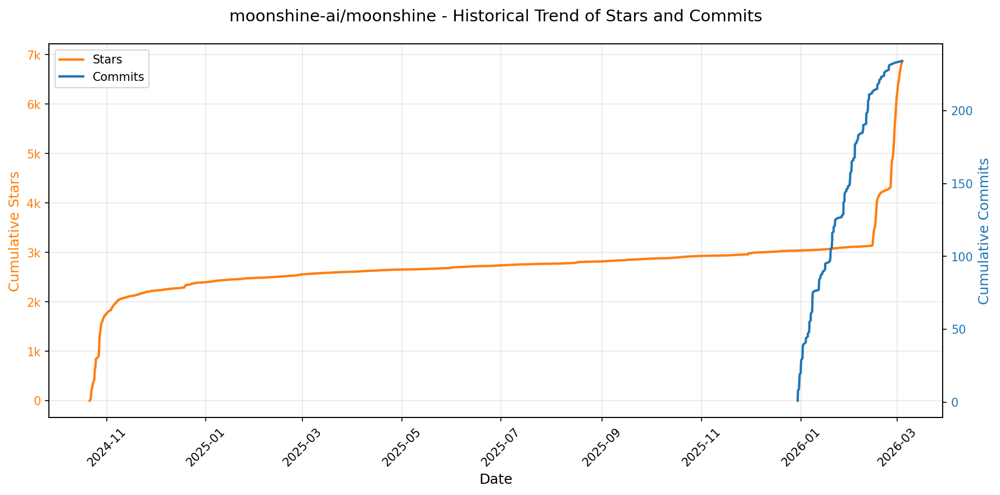

> *蓝色：累计 Stars｜橙色：累计 Commits（次 Y 轴）*

<b>📄 README 摘要</b>

1. **项目功能**  
Moonshine Voice 是一个面向实时语音交互场景的开源 AI 工具包，专为在**边缘设备上运行的低延迟、高隐私性语音应用**而设计。它不依赖云端服务或网络连接，所有语音处理（包括语音识别、说话人区分、语义指令识别）均在本地设备完成。核心目标是替代 Whisper 等通用 ASR 模型，解决其在**实时流式语音场景下的固有缺陷**——如固定 30 秒输入窗口、无缓存机制、多语言精度不均衡、跨平台部署碎片化等。项目提供开箱即用的端到端语音接口能力，使开发者无需语音领域专业知识即可快速构建麦克风直连、即时转录、自然语言指令触发（如“打开灯”）、多说话人区分等真实产品功能。

2. **关键特性**  
- **超低延迟流式处理**：支持任意长度音频输入（推荐 ≤30 秒），无零填充；通过**增量音频缓存**（编码器状态 + 部分解码器状态复用），显著减少重复计算，在 MacBook Pro 上最低延迟仅 34ms（Tiny 模型），树莓派 5 上仍可达 237ms。  
- **端到端隐私与离线运行**：全部模型与推理引擎在设备本地执行，无需账户、API 密钥、网络连接或云服务，保障用户语音数据不出设备。  
- **多尺寸、多语言专用模型**：提供 Tiny（34M 参数）、Small（123M）、Medium（245M）三档轻量模型，体积最小仅 26MB；针对英语、西班牙语、中文（普通话）、日语、韩语、越南语、乌克兰语、阿拉伯语等 8+ 语言分别训练**单语专用模型**，在同等参数量下显著超越 Whisper 多语模型精度（如 Medium Streaming 英语模型 WER 6.65%，优于 Whisper Large V3 的 7.44%）。  
- **全平台统一 API**：同一套高层接口（Transcriber / IntentRecognizer / EventListener）覆盖 Python、iOS（Swift）、Android（Java/Kotlin）、macOS、Windows、Linux、Raspberry Pi 及 IoT/可穿戴设备；底层基于可移植 C++ 核心 + ONNX Runtime，确保跨平台性能与一致性。  
- **一体化语音栈**：内置麦克风采集、语音活动检测（VAD）、流式语音识别（ASR）、说话人日志（Diarization）、语义意图识别（Intent Recognition）全流程，开发者只需关注事件（如 `lineStarted`、`lineCompleted`、`intentTriggered`）即可响应用户语音。  

3. **技术栈**  
- **核心推理引擎**：纯 C++ 编写，高度优化的流式 ASR 推理核心；采用 **ONNX Runtime** 作为跨平台推理后端，兼顾性能与硬件兼容性（支持 CPU/GPU/Apple Neural Engine 等）。  
- **模型架构**：自研流式语音识别模型（非 Whisper 衍生），基于原创研究（arXiv:2602.12241 等），支持动态输入窗口与状态缓存；模型格式为 ONNX，便于部署与量化。  
- **语言绑定与分发**：  
  - Python：`pip install moonshine-voice`，封装 sounddevice 等库实现跨平台音频采集；  
  - iOS/macOS：Swift Package Manager（SPM）集成，原生 Swift API；  
  - Android：Maven 仓库分发，Java/Kotlin 接口；  
  - Windows/Linux/RPi：提供预编译二进制或 CMake 构建支持（`cmake .. && cmake --build .`）；  
- **开发与构建工具**：CMake 构建系统、GitHub Actions CI/CD、Hugging Face Model Hub 模型托管、Discord 社区支持。

---

### 23. [aquasecurity/trivy](https://github.com/aquasecurity/trivy)
- 📅 **创建日期**：2019-04-11  
- 🔄 **最近更新**：2026-03-04  
- ⭐ **Stars**：5,925（日 +264｜周 +527｜月 +1449）  
- 📝 **描述**：Find vulnerabilities, misconfigurations, secrets, SBOM in containers, Kubernetes, code repositories, clouds and more  

<b>📈 Star 与 Commit 历史趋势</b>

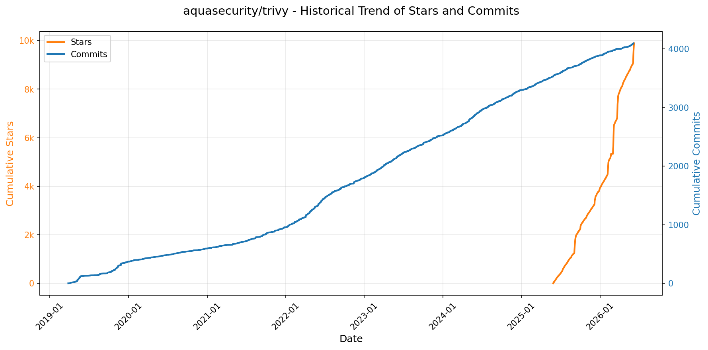

> *蓝色：累计 Stars｜橙色：累计 Commits（次 Y 轴）*

<b>📄 README 摘要</b>

1. **项目功能**  
Trivy 是一个全面、轻量且开箱即用的开源安全扫描器，专注于在软件开发生命周期（SDLC）各阶段主动识别安全风险。它可对多种目标（如容器镜像、本地文件系统、远程 Git 仓库、虚拟机镜像、Kubernetes 集群）执行统一的安全检测，覆盖从代码到运行时的全栈资产，无需复杂配置即可快速启动扫描。

2. **核心特性**  
- **多维度扫描能力**：支持五大类安全检测——  
  ✓ 软件物料清单（SBOM）生成（识别 OS 包与应用依赖）；  
  ✓ 已知漏洞扫描（CVE/NVD/CISA KEV 等权威数据库实时匹配）；  
  ✓ 基础设施即代码（IaC）安全与合规性检查（支持 Terraform、Kubernetes YAML、Dockerfile、CloudFormation 等，内置 OPA/Rego 策略引擎）；  
  ✓ 敏感信息与密钥泄露检测（硬编码密码、API Key、私钥等）；  
  ✓ 开源软件许可证合规分析（识别 GPL、AGPL 等高风险许可证）。  
- **广泛目标兼容性**：原生支持容器镜像（Docker/OCI）、宿主机文件系统、Git 远程仓库（含分支/Tag/Commit 指定）、qcow2/VMDK 等 VM 镜像、以及 Kubernetes 集群（通过 `trivy k8s` 直接扫描资源对象）。  
- **生产就绪集成生态**：提供官方 GitHub Actions、Kubernetes Operator、VS Code 插件、CI/CD 流水线工具链（如 Jenkins、GitLab CI），并支持 Docker、Binary、Homebrew 等多渠道一键部署；同时提供 Canary 预发布版本供尝鲜验证。

3. **技术栈**  
- **主语言**：Go（保障高性能、静态编译、跨平台二进制分发）；  
- **核心依赖与技术**：  
  ✓ CVE 数据库同步：基于 NVD、GitHub Security Advisories、OSV、Alpine 等多源实时更新；  
  ✓ IaC 扫描引擎：集成 Open Policy Agent（OPA）与 Rego 策略语言，支持自定义合规规则；  
  ✓ 密钥检测：基于正则与熵值分析的启发式算法；  
  ✓ SBOM 生成：遵循 SPDX 与 CycloneDX 标准；  
  ✓ 容器运行时支持：直接解析 OCI 镜像层（无需运行容器），兼容 Docker、Podman、containerd；  
- **部署形态**：CLI 工具（主要使用方式）、Docker 镜像、Kubernetes Operator、云原生插件；  
- **基础设施**：CI/CD 流水线由 GitHub Actions 驱动，文档托管于静态站点（trivy.dev），二进制发布于 GitHub Releases，Docker 镜像发布于 Docker Hub / ECR / GHCR。

---

### 24. [steipete/gogcli](https://github.com/steipete/gogcli)
- 📅 **创建日期**：2025-12-12  
- 🔄 **最近更新**：2026-03-04  
- ⭐ **Stars**：5,418（日 +84｜周 +517｜月 +4163）  
- 📝 **描述**：Google Suite CLI: Gmail, GCal, GDrive, GContacts.  

<b>📈 Star 与 Commit 历史趋势</b>

> *蓝色：累计 Stars｜橙色：累计 Commits（次 Y 轴）*

<b>📄 README 摘要</b>

1. **项目功能**  
`gogcli` 是一个面向终端的、高性能且可脚本化的 Google Workspace 命令行工具，旨在将 Gmail、Calendar、Chat、Classroom、Drive、Docs、Sheets、Slides、Forms、Apps Script、Contacts、Tasks、People、Groups、Keep 等 Google 服务统一集成到单个 CLI 中。它支持多账户管理（含别名）、跨服务操作（如通过 Drive API 导出 Docs/Sheets/Slides）、自动化工作流（JSON 输出、TSV 支持）、细粒度权限控制，并专为开发者、运维人员和自动化代理（如 CI/SSH 环境）设计，实现“Google in your terminal”。

2. **核心特性**  
- **全栈 Google 服务覆盖**：完整支持 Gmail（搜索/发送/标签/过滤器/推送监听）、Calendar（事件管理/冲突检测/重复/OOO/自由忙闲）、Classroom（课程/作业/提交/监护人）、Chat（空间/消息/DM）、Drive（文件/权限/共享云盘）、Sheets（读写/格式/注释）、Docs/Slides（PDF/DOCX/PPTX 导出 + `sedmat` Markdown 风格文档编辑）、Forms（创建/响应分析）、Apps Script（项目管理/函数执行）、Contacts/People/Tasks/Groups/Keep（后者限 Workspace 且需服务账号）等；  
- **安全与权限模型**：默认采用最小权限认证（`--readonly` / `--drive-scope` / `--gmail-scope`），支持 OAuth 2.0（含手动/远程/无浏览器授权流程）和 Google Workspace 服务账号（域级委派），自动刷新令牌，凭证加密存储于系统密钥环（macOS Keychain / Linux Secret Service / Windows Credential Manager）或可选加密磁盘密钥环；  
- **工程友好能力**：原生 JSON 输出（`--json`）、稳定 TSV 输出（`--plain`）、命令白名单（`--enable-commands` 或 `GOG_ENABLE_COMMANDS` 实现沙箱化运行）、多客户端隔离（按域名/账户映射 OAuth 客户端）、别名系统（`auth alias`）、环境变量驱动配置（`GOG_ACCOUNT`, `GOG_TIMEZONE` 等），以及针对脚本场景优化的本地/UTC 时间显示、解析友好的日历字段（如星期几）等。

3. **技术栈**  
- **开发语言**：Go（基于 `make` 构建，源码可编译为静态二进制）；  
- **认证与安全**：OAuth 2.0 协议（Desktop App 类型客户端）、Google Cloud Identity / Workspace 域级委派（Service Account + JSON 密钥）、OS 原生密钥环集成（Keychain / Secret Service / Windows Credential Manager），支持密码保护的加密文件密钥环后端；  
- **API 依赖**：深度集成 Google 官方 REST API，包括 Gmail API、Calendar API、Chat API、Classroom API、Drive API、People API、Tasks API、Sheets API、Forms API、Apps Script API、Cloud Identity API、Keep API 等，所有调用均遵循对应服务的 scope 权限模型；  
- **基础设施扩展**：内置 Email 打开追踪能力，依赖轻量级 Cloudflare Worker 后端（非必需，仅 `--track` 时启用）；  
- **平台支持**：原生兼容 macOS、Linux（含 Arch AUR 支持）、Windows；通过 Homebrew（macOS/Linux）、AUR（Arch）、源码构建（`make`）等多种方式安装。

---

### 25. [alibaba/OpenSandbox](https://github.com/alibaba/OpenSandbox)
- 📅 **创建日期**：2025-12-17  
- 🔄 **最近更新**：2026-03-04  
- ⭐ **Stars**：5,401（日 +1047｜周 +4270｜月 +4528）  
- 📝 **描述**：OpenSandbox is a general-purpose sandbox platform for AI applications, offering multi-language SDKs, unified sandbox APIs, and Docker/Kubernetes runtimes for scenarios like Coding Agents, GUI Agents, Agent Evaluation, AI Code Execution, and RL Training.  

<b>📈 Star 与 Commit 历史趋势</b>

> *蓝色：累计 Stars｜橙色：累计 Commits（次 Y 轴）*

<b>📄 README 摘要</b>

1. **项目功能**  
OpenSandbox 是一个面向 AI 应用的通用型沙箱平台，旨在为各类需要安全、隔离、可控执行环境的智能体（Agent）场景提供统一的底层运行时基础设施。其核心作用是：在严格隔离的环境中安全执行不受信任的代码、命令、脚本或交互式任务，同时支持灵活的资源管控、网络策略与生命周期管理。典型应用场景包括：编程智能体（Coding Agents）、GUI 自动化智能体（如浏览器/桌面操作）、AI 代码执行（Code Interpreter）、智能体能力评测（Agent Evaluation）以及强化学习（RL）训练环境等。

2. **关键特性**  
- **多语言 SDK 支持**：提供 Python、Java/Kotlin、JavaScript/TypeScript、C#/.NET 官方 SDK，Go SDK 已列入路线图；覆盖沙箱创建、命令执行、文件读写、代码解释器调用等全链路能力。  
- **标准化沙箱协议**：定义清晰的沙箱生命周期管理 API（如创建、启动、暂停、销毁）与执行 API（命令、文件、网络），支持用户扩展自定义运行时。  
- **双模沙箱运行时**：内置基于 Docker 的本地轻量级运行时，以及面向生产环境的高性能 Kubernetes 运行时（支持大规模分布式调度与弹性扩缩）。  
- **开箱即用的沙箱环境**：预置 Command（Shell 命令）、Filesystem（文件系统操作）、Code Interpreter（多语言代码执行）三大基础能力；并提供丰富示例环境，涵盖 Chrome/Playwright 浏览器自动化、VNC 桌面环境、VS Code Web（code-server）、Claude/Gemini/Kimi 等主流 AI 工具集成。  
- **精细化网络管控**：通过统一 Ingress Gateway 实现多策略流量接入（如按路径/标签路由），并通过细粒度 Egress 控制实现每个沙箱独立的出向网络策略（如禁止外网访问、白名单域名限制等）。

3. **技术栈**  
- **服务端**：Python + FastAPI（沙箱生命周期管理服务 `opensandbox-server`）  
- **核心组件**：  
  - `execd`：沙箱内命令执行与文件操作守护进程（likely Rust 或 Go 实现，兼顾性能与安全性）  
  - `ingress` / `egress`：基于代理（如 Envoy 或自研）构建的网络入口网关与出口策略控制组件  
- **运行时底座**：Docker（本地开发/测试）、Kubernetes（生产部署，含原生 CRD 与 Operator 支持）  
- **SDK 多语言生态**：各语言 SDK 均遵循统一 OpenAPI 规范（位于 `specs/` 目录），确保跨语言行为一致性  
- **基础设施与工具链**：使用 `uv` 作为 Python 包管理与运行时（替代 pip + venv），CI/CD 基于 GitHub Actions，文档站点基于静态生成（`open-sandbox.ai`），许可证为 Apache 2.0

---

### 26. [Jeffallan/claude-skills](https://github.com/Jeffallan/claude-skills)
- 📅 **创建日期**：2025-10-20  
- 🔄 **最近更新**：2026-03-04  
- ⭐ **Stars**：4,411（日 +174｜周 +690｜月 +4211）  
- 📝 **描述**：66 Specialized Skills for Full-Stack Developers. Transform Claude Code into your expert pair programmer.  

<b>📈 Star 与 Commit 历史趋势</b>

> *蓝色：累计 Stars｜橙色：累计 Commits（次 Y 轴）*

<b>📄 README 摘要</b>

1. **项目功能**  
该项目是一个专为 Anthropic Claude Code（Claude 编程插件）设计的开源技能增强套件，旨在将 Claude 转变为面向全栈开发者的智能工程协作者。它不提供独立运行环境，而是通过 Claude Code 插件机制扩展其能力：根据用户自然语言指令自动识别上下文、动态激活对应专业技能，并加载结构化知识（如框架最佳实践、安全规范、测试策略等），从而在真实开发场景中（如实现 JWT 认证、构建 React 服务端组件、排查 NestJS Bug）提供精准、可落地的技术建议与代码辅助。

2. **核心特性**  
- **66 项垂直领域技能**：覆盖 12 类技术范畴（含编程语言、前后端框架、云基础设施、API 设计、单元/集成测试、DevOps 流水线、应用安全、数据/ML 工程、平台专项如 AWS/Azure 等），每项技能附带深度参考文档（共 365 份）。  
- **上下文感知自动激活**：无需手动调用，系统基于用户请求语义（如“在 NestJS 中实现 JWT”）实时匹配并加载对应技能及其专属知识库（如 `references/authentication.md`）。  
- **9 大端到端工作流命令**：支持完整软件工程生命周期管理（需求发现→架构设计→开发→测试→部署→复盘），原生集成 Jira 和 Confluence，需配合 Atlassian MCP 服务器使用。  
- **多技能协同工作流**：复杂任务（如新功能交付、Bug 深度排查、安全加固）自动编排多个专家角色（如 Feature Forge + Architecture Designer + Test Master），形成链式协作。  
- **上下文工程支持**：提供 `/common-ground` 命令显式揭示并校准 Claude 对项目隐含假设（如技术栈版本、架构约束），提升响应准确性。

3. **技术栈**  
- **运行时依赖**：Anthropic Claude Code 插件平台（核心执行环境）；Atlassian MCP（Mattermost-Compatible Protocol）服务器（用于工作流与 Jira/Confluence 集成）。  
- **内容组织**：纯 Markdown 技能文档（`skills/*/SKILL.md`）、结构化参考文件（`skills/*/references/`）、YAML/JSON 配置（隐含于技能元数据与工作流定义中）。  
- **开发与分发**：GitHub 仓库托管；通过 Claude 插件市场命令（`/plugin marketplace add` / `/plugin install`）一键安装；CI 流水线（GitHub Actions）保障质量。  
- **许可与生态**：MIT 开源协议；被纳入 [Awesome Claude Code](https://github.com/hesreallyhim/awesome-claude-code) 官方推荐列表；兼容本地技能开发与社区贡献流程。

---

### 27. [superset-sh/superset](https://github.com/superset-sh/superset)
- 📅 **创建日期**：2025-10-21  
- 🔄 **最近更新**：2026-03-04  
- ⭐ **Stars**：4,192（日 +661｜周 +2261｜月 +3091）  
- 📝 **描述**：IDE for the AI Agents Era - Run an army of Claude Code, Codex, etc. on your machine  

<b>📈 Star 与 Commit 历史趋势</b>

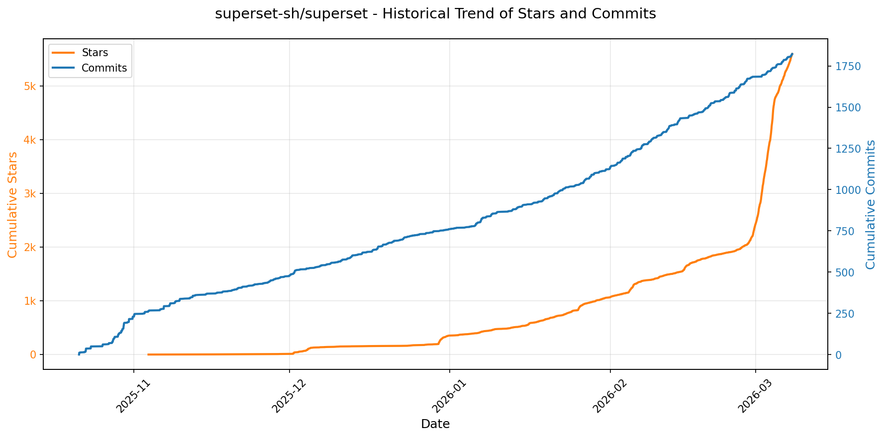

> *蓝色：累计 Stars｜橙色：累计 Commits（次 Y 轴）*

<b>📄 README 摘要</b>

1. **项目功能**  
Superset 是一款面向开发者的「编码代理（Coding Agents）终端」，专为高效协同运行多个 CLI 类 AI 编程代理而设计。它并非替代传统终端，而是作为智能工作流中枢：在本地 macOS 环境中统一调度、隔离执行、实时监控并可视化管理多个并发运行的 CLI 编程代理（如 Claude Code、Cursor Agent、GitHub Copilot CLI 等），显著降低上下文切换成本，加速从提示（prompt）到可审查代码变更（diff）的闭环流程。

2. **核心功能**  
- **并行执行**：支持同时运行 10+ 个 CLI 编程代理，各代理独立进程、资源可控；  
- **Git 工作树隔离**：为每个任务自动创建专属 git worktree（含独立分支与工作目录），彻底避免代理间文件/状态干扰；  
- **统一监控与通知**：集中查看所有代理运行状态（就绪/运行中/需人工介入），关键事件（如生成变更待审核）实时推送；  
- **内建差异审查**：集成可视化 diff 查看器与轻量编辑器，无需退出 Superset 即可审阅、暂存或手动修改代理输出；  
- **工作区预设（Workspace Presets）**：通过脚本自动化环境初始化（如复制 `.env`、`bun install`）、依赖安装及清理（teardown），实现一键复现开发环境；  
- **无缝 IDE 协同**：单击即可在 VS Code、Vim 等任意外部编辑器中打开当前工作区；  
- **全 CLI 兼容性**：不绑定特定模型或框架，任何可在终端中运行的标准 CLI 工具均可接入；  
- **快捷任务切换**：支持 `⌘1–9` 快速切换工作区、`⌘⌥↑/↓` 浏览历史任务，响应代理需求零延迟。

3. **技术栈**  
- **桌面框架**：Electron（构建跨平台桌面应用外壳）；  
- **前端**：React（核心 UI 框架） + Tailwind CSS（原子化样式系统） + Vite（极速开发服务器与构建工具）；  
- **后端/运行时**：Bun（高性能 JavaScript 运行时，用于依赖管理、脚本执行与 dev server）；  
- **工程化**：Turborepo（单体仓库（monorepo）下的高速增量构建与任务编排）；  
- **代码质量**：Biome（一体化代码格式化、linting 与检查工具）；  
- **数据层**：Drizzle ORM（TypeScript 优先的轻量级 SQL ORM） + Neon（无服务器 PostgreSQL，用于后台状态同步与持久化）；  
- **API 通信**：tRPC（端到端类型安全的 TypeScript RPC 框架，连接前端与本地服务）；  
- **基础设施**：Caddy（反向代理，用于本地开发环境下 Electric SQL 实时数据流的路由）。

---

### 28. [github/gh-aw](https://github.com/github/gh-aw)
- 📅 **创建日期**：2025-08-12  
- 🔄 **最近更新**：2026-03-04  
- ⭐ **Stars**：3,839（日 +25｜周 +170｜月 +3499）  
- 📝 **描述**：GitHub Agentic Workflows  

<b>📈 Star 与 Commit 历史趋势</b>

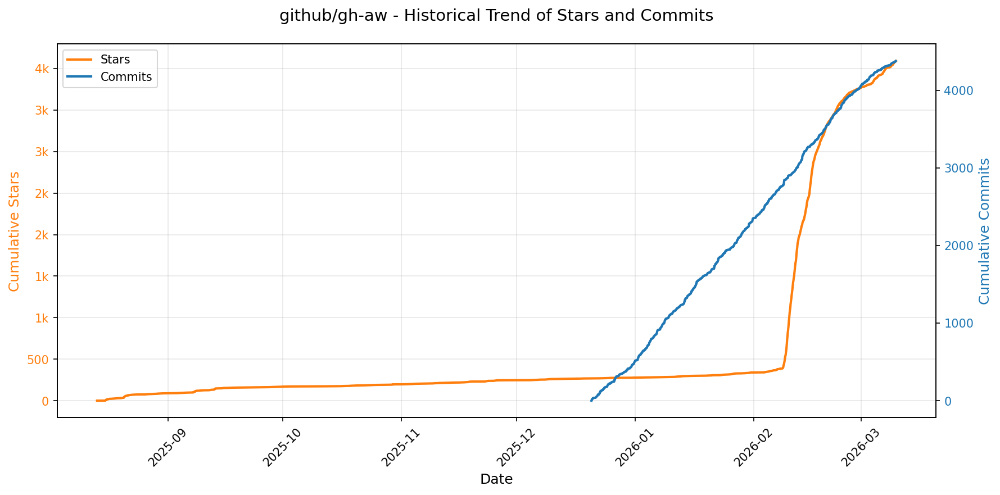

> *蓝色：累计 Stars｜橙色：累计 Commits（次 Y 轴）*

<b>📄 README 摘要</b>

1. **项目功能**  
该项目（GitHub Agentic Workflows，简称 GH-AW）允许用户使用自然语言编写的 Markdown 文件定义“智能体式工作流”（agentic workflows），并直接在 GitHub Actions 环境中安全执行。其核心目标是将 AI 智能体（agent）能力深度集成到 GitHub 原生自动化体系中，使开发者能以声明式、类人类指令的方式（如“审查 PR 中的代码变更并建议修复”）触发具备推理、规划与工具调用能力的自动化任务，而非仅依赖传统脚本化 YAML 流程。

2. **关键特性**  
- **自然语言驱动**：支持用 Markdown 编写工作流逻辑，降低 AI 工作流开发门槛；  
- **多层安全防护（Guardrails）**：默认只读权限；写操作必须经显式声明的 `safe-outputs` 机制，并通过输入清洗、沙箱执行、网络隔离、SHA 校验依赖、工具白名单、编译时静态验证等多重机制保障；  
- **人机协同控制**：支持基于团队成员身份的访问控制、关键操作的人工审批门控（human approval gates）；  
- **生态扩展支持**：与配套安全组件深度集成，包括 Agent Workflow Firewall（AWF，提供域名级网络出口管控与日志审计）和 MCP Gateway（统一代理 Model Context Protocol 调用，实现集中式访问治理）；  
- **生产就绪架构**：内置威胁建模、供应链安全实践及详细安全架构文档，强调“谨慎使用、责任自负”的工程原则。

3. **技术栈**  
- **运行平台**：原生构建于 GitHub Actions 基础设施之上，复用其 runner、权限模型与事件触发机制；  
- **智能体层**：基于大语言模型（LLM）驱动，通过标准化接口（如 MCP）与外部模型服务交互（文档中提及 `llms.txt` 配置文件）；  
- **安全中间件**：自研 Guardrails 框架（含沙箱、输出净化、策略引擎）；配套独立服务：AWF（Go/Python 实现的网络防火墙网关）、MCP Gateway（HTTP 反向代理网关）；  
- **交付格式**：工作流以 Markdown 文档（`.md`）形式声明，经内部编译/解析后转换为可执行的 Actions 兼容指令流；  
- **部署与分发**：通过 GitHub 扩展（Extension）机制安装，依赖 GitHub Pages 托管的文档站点（`github.github.com/gh-aw/`）提供动态参考与元数据。

---

### 29. [openclaw/clawhub](https://github.com/openclaw/clawhub)
- 📅 **创建日期**：2026-01-03  
- 🔄 **最近更新**：2026-03-04  
- ⭐ **Stars**：3,790（日 +195｜周 +1025｜月 +2839）  
- 📝 **描述**：Skill Directory for OpenClaw  

<b>📈 Star 与 Commit 历史趋势</b>

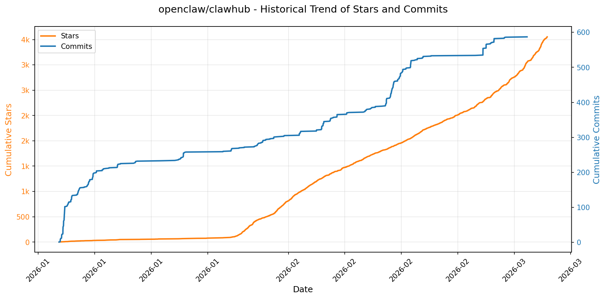

> *蓝色：累计 Stars｜橙色：累计 Commits（次 Y 轴）*

<b>📄 README 摘要</b>

1. **项目功能**  
ClawHub 是一个面向 Clawdbot 的**公开技能（Skill）注册中心**，核心作用是集中托管、版本化管理并提供搜索能力的文本型智能体技能（以 `SKILL.md` 为主文件，辅以元数据与支持文件）。同时，它与子站点 onlycrabs.ai 协同构成双注册体系：ClawHub 主管技能（skills），onlycrabs.ai 主管「灵魂」（souls），即系统级提示词与世界观设定（以 `SOUL.md` 为唯一格式）。项目支持技能/灵魂的发布、多版本管理（含 `latest` 标签与变更日志）、向量语义搜索、用户收藏/评论、以及基于权限的审核与软删除管理。

2. **关键特性**  
- ✅ **双注册范式**：独立支持 `SKILL.md`（带可选附件）与 `SOUL.md`（仅单文件）两类内容，分别部署于 `clawhub.ai` 和 `onlycrabs.ai`；  
- ✅ **向量驱动搜索**：基于 OpenAI `text-embedding-3-small` 生成嵌入，结合 Convex 原生向量索引实现语义级技能/灵魂发现，摆脱关键词匹配局限；  
- ✅ **完整 CLI 工作流**：提供 `clawhub` 命令行工具，覆盖身份认证（GitHub OAuth）、本地安装/卸载/更新、远程搜索/浏览/检查、技能发布与同步（含软删除/恢复）；  
- ✅ **Nix 插件原生集成**：支持在 `SKILL.md` 前置元数据中声明 Nix 包地址、目标架构、环境依赖、配置示例及 CLI 帮助文本，实现技能与 Nix 生态无缝对接；  
- ✅ **安全与治理机制**：技能元数据（如所需环境变量、二进制依赖）可被静态分析；支持所有者/管理员/版主三级权限模型，含软删除、审核准入、星标推荐等社区治理能力；  
- ✅ **轻量遥测与可配置性**：仅在登录状态下执行 `clawhub sync` 时采集匿名安装统计，可通过环境变量 `CLAWHUB_DISABLE_TELEMETRY=1` 全局禁用。

3. **技术栈**  
- **前端框架**：TanStack Start（基于 React + Vite/Nitro 构建的全栈框架）；  
- **后端与数据库**：Convex（统一处理实时数据库、文件存储、HTTP API 及服务端动作），配合 Convex Auth 实现 GitHub OAuth 登录与 JWT 认证；  
- **搜索引擎**：OpenAI 文本嵌入模型（`text-embedding-3-small`） + Convex 内置向量搜索能力；  
- **API 规范**：通过 `packages/schema`（`clawhub-schema`）包定义共享类型与路由，供前端与 CLI 共用；  
- **开发与构建**：Bun（作为包管理器与运行时，用于 `convex dev`、`bun run dev` 等命令）；  
- **部署与环境**：依赖 Convex 云托管（含 `CONVEX_URL`/`CONVEX_SITE_URL`）、OpenAI API 密钥、GitHub OAuth App 凭据及 JWT 密钥对；  
- **扩展生态**：深度集成 Nix 表达式，支持从 `SKILL.md` 元数据自动生成 Nix 配置片段。

---

### 30. [CodebuffAI/codebuff](https://github.com/CodebuffAI/codebuff)
- 📅 **创建日期**：2024-07-09  
- 🔄 **最近更新**：2026-03-04  
- ⭐ **Stars**：3,273（日 +213｜周 +380｜月 +552）  
- 📝 **描述**：Generate code from the terminal!  

<b>📈 Star 与 Commit 历史趋势</b>

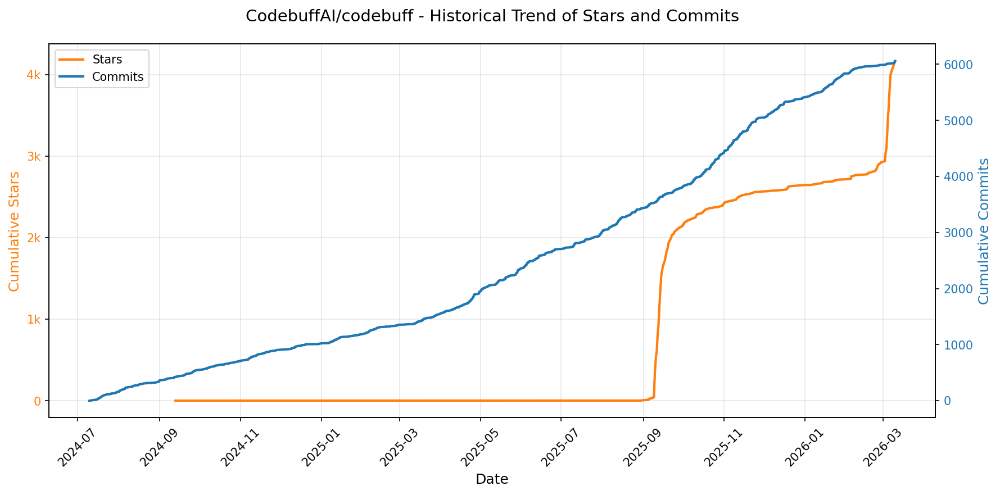

> *蓝色：累计 Stars｜橙色：累计 Commits（次 Y 轴）*

<b>📄 README 摘要</b>

1. **项目功能**  
Codebuff 是一个开源的 AI 编程助手，专注于**基于自然语言指令对本地代码库执行精准、端到端的自动化编辑**。它不依赖单一大型语言模型（LLM）完成所有任务，而是通过协调多个专业化智能体（Agent）协同工作——包括文件定位、任务规划、代码编辑和变更验证——从而理解项目上下文、识别相关文件、实施跨文件修改，并自动运行测试确保代码稳定性。其核心目标是替代传统单模型编程工具（如 Claude Code），在真实开源项目场景中实现更高准确率（评测达 61% vs 53%）的工程级代码变更。

2. **关键特性**  
- **多智能体协作架构**：内置 File Picker、Planner、Editor、Reviewer 四类专用 Agent，支持分阶段、可验证的代码修改流程；  
- **高度可定制的工作流**：用户可通过 `/init` 命令快速生成 TypeScript 代理定义框架（含类型定义、工具接口与工具调用逻辑），自由编写具备条件分支、子 Agent 动态调度、多步骤终端命令执行能力的自定义 Agent（如 `git-committer`）；  
- **开放模型生态**：原生集成 OpenRouter，支持任意可用模型（Claude、GPT、Qwen、DeepSeek 等），按任务需求灵活切换，无需平台锁定；  
- **生产就绪 SDK**：提供 `@codebuff/sdk` 包，支持在应用中嵌入 Agent 执行能力，兼容自定义 Agent 定义、工具扩展及事件流监听，适用于 CI/CD 集成、IDE 插件或内部开发平台；  
- **Agent 生态复用**：支持从 [Codebuff Agent Store](https://www.codebuff.com/store) 发现、复用已发布 Agent，加速构建领域专用工作流；  
- **全链路工程保障**：自动识别变更影响范围、执行测试验证、生成语义化 Git 提交信息，兼顾开发效率与代码质量。

3. **技术栈**  
- **前端/CLI 层**：TypeScript + Node.js（全局 CLI 工具，基于 npm/bun 分发）；  
- **Agent 运行时**：基于 TypeScript 的轻量级 Agent 框架，支持异步生成器（`async *handleSteps()`）定义多步工具调用流程；  
- **模型接入层**：统一适配 [OpenRouter API](https://openrouter.ai/)，支持多模型路由与动态配置（如 `openai/gpt-5-nano`）；  
- **工具系统**：内置 `read_files`、`run_terminal_command`、`end_turn` 等标准工具，支持扩展自定义工具（如 Git、Linter、Test Runner 集成）；  
- **SDK 与集成**：`@codebuff/sdk` npm 包，面向 TypeScript 生态设计，提供 `CodebuffClient` 类与结构化 `AgentDefinition` 类型；  
- **开发与测试**：使用 Bun 运行单元与端到端测试（E2E），依赖 tmux 实现交互式测试环境；  
- **基础设施**：GitHub 仓库托管、Discord 社区、Star History 图表监控活跃度。

---

### 31. [ruvnet/ruvector](https://github.com/ruvnet/ruvector)
- 📅 **创建日期**：2025-11-19  
- 🔄 **最近更新**：2026-03-04  
- ⭐ **Stars**：2,683（日 +154｜周 +1947｜月 +2403）  
- 📝 **描述**：RuVector is a High Performance, Real-Time, Self-Learning, Vector Graph Neural Network, and Database built in Rust.  

<b>📈 Star 与 Commit 历史趋势</b>

> *蓝色：累计 Stars｜橙色：累计 Commits（次 Y 轴）*

<b>📄 README 摘要</b>

1. **该项目的功能**  
RuVector 是一个**自学习、自优化的智能向量数据库操作系统**，超越传统向量数据库的静态检索能力，本质是一个**面向 AI 代理（Agentic AI）的全栈操作系统**。它不只存储和搜索向量，而是通过持续观测用户查询与反馈（<1ms 实时适应），自动提升搜索质量、动态调优系统参数（如索引结构、路由策略、压缩方式），并在本地硬件上原生运行 AI 模型（无需云 API）。它可无缝嵌入 PostgreSQL 作为增强型扩展，亦能以单文件（`.rvf`）形式部署于服务器、浏览器（WASM）、移动端、IoT 设备甚至裸机，实现“一次构建、全域运行”。其核心目标是为大规模、长期在线、低功耗的 AI 代理提供底层智能基础设施——即支撑 Cognitum Agentic Chip 的软件基座。

2. **关键特性**  
- **自学习与自优化**：基于图神经网络（GNN）的索引持续从每次查询中学习；SONA 引擎实现毫秒级 LoRA 微调 + EWC++ 遗忘抑制，支持实时模型进化；46 种注意力机制（含 mincut-gated 等）动态剪枝计算，降低 50% 开销。  
- **原生图智能**：内置完整 Cypher 查询引擎与超边（hyperedge）支持；8 类经验证的图变换器（physics/bio/temporal/economic 等），支持多维流形（Sⁿ×Hᵐ×Rᵏ）与形式化证明驱动的数据写入。  
- **全栈本地 AI 能力**：ruvllm 运行 GGUF 模型（Metal/CUDA/WebGPU/ANE），支持 MicroLoRA（<1ms）、稀疏推理与 WASM 浏览器端执行；集成子线性求解器（O(log n) PageRank）、量子纠错（ruQu）、基因组分析（rvDNA，12ms k-mer 搜索）等垂直领域加速。  
- **统一数据平台**：向量 + 图 + 键值 + 关系型（PostgreSQL 扩展，230+ SQL 函数）四合一；支持 Git 风格 COW 分支（百万向量仅增 2.5MB）、加密审计链（witness chain）、后量子签名（ML-DSA-65）、DNA 式血缘追踪。  
- **极致轻量与泛在部署**：单 `.rvf` 文件（含内核、模型、向量、eBPF 加速模块）启动仅 125ms；WASM 运行时仅 5.5KB；支持裸机、边缘（rvLite）、iOS App Clip（<15MB）、浏览器零后端部署。  
- **生产级分布式能力**：Raft 多主复制、CRDT 增量共识、自动分片、突发扩容（10–50×）、tamper-proof 审计与隐私优先设计（如浏览器内基因组分析）。

3. **技术栈**  
- **核心语言与运行时**：Rust（主导，90+ crates，保障内存安全与高性能）、TypeScript/JavaScript（npm 包、浏览器/WASM 支持）、C/C++（底层 SIMD/AVX-512/NEON 优化）。  
- **AI 与模型层**：GGUF 格式模型加载（ruvllm）、RuvLTRA 轻量路由模型、FastGRNN 神经路由、Spiking Neural Networks（BTSP 学习）、Sparse Inference（PowerInfer 风格）、Verified Training（形式化证明 + 统计检验）。  
- **数据库与图引擎**：自研 HNSW（含双曲空间变体）、Cypher 兼容图引擎、PGSQL 扩展（`ruvector-postgres`）、RVF 二进制容器格式（含 KERNEL/EBPF/WASM/CRYPTO 等 25 类段）。  
- **基础设施与协议**：eBPF/XDP 加速（内核态向量服务）、Raft（`ruvector-raft`）、CRDT（`ruvector-delta-consensus`）、MCP（Model Context Protocol）标准对接、Prometheus 指标导出。  
- **硬件协同**：深度适配 Apple Metal、NVIDIA CUDA、Android Neural Engine（ANE）、WebGPU、FPGA（`ruvector-fpga-transformer`）及定制 Cognitum 芯片（257 核，2W 功耗）。

---

### 32. [agentscope-ai/ReMe](https://github.com/agentscope-ai/ReMe)
- 📅 **创建日期**：2024-08-29  
- 🔄 **最近更新**：2026-03-04  
- ⭐ **Stars**：1,285（日 +174｜周 +293｜月 +362）  
- 📝 **描述**：ReMe: Memory Management Kit for Agents - Remember Me, Refine Me.  

<b>📈 Star 与 Commit 历史趋势</b>

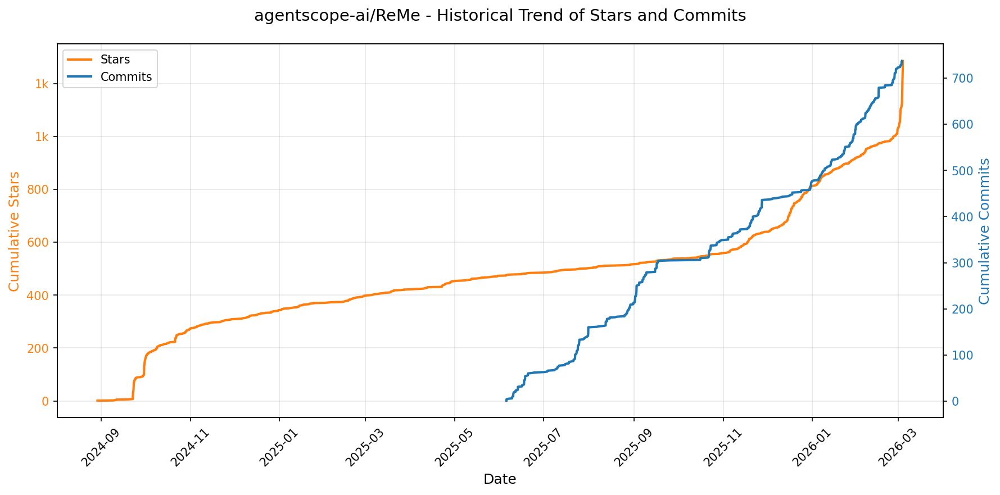

> *蓝色：累计 Stars｜橙色：累计 Commits（次 Y 轴）*

<b>📄 README 摘要</b>

1. **项目功能**  
ReMe（Remember Me, Refine Me）是一个专为AI智能体（AI Agents）设计的**内存管理框架**，旨在解决大模型应用中的两大核心痛点：  
- **上下文窗口限制**：长对话中早期关键信息因超出token限制而被截断或丢失；  
- **会话无状态性**：每次新对话均从零开始，无法继承历史经验与用户偏好。  
它通过提供**文件型（File-Based）** 和**向量型（Vector-Based）** 双模内存系统，赋予AI Agent真正意义上的“记忆能力”——自动压缩历史、持久化重要信息，并在后续交互中实现智能召回与复用。

2. **关键特性**  
- **双模内存架构**：  
  - *文件型内存*：以人类可读、可编辑的Markdown文件（如 `MEMORY.md` 和按日生成的 `memory/YYYY-MM-DD.md`）组织长期记忆，支持直接查看、手动修改与跨环境迁移；  
  - *向量型内存*：结构化管理三类语义记忆——**个人记忆**（用户偏好/习惯）、**任务记忆**（执行经验/成败模式）、**工具记忆**（API调用参数/优化配置），支持细粒度增删改查与条件检索。  
- **智能记忆生命周期管理**：  
  - 自动/手动触发**上下文压缩**（Compact），将冗长对话提炼为含目标、约束、进展、决策等要素的摘要；  
  - 基于ReAct范式驱动的**记忆写入**（Summary），AI通过`read`/`edit`/`write`等内置文件工具自主维护记忆文件；  
  - **混合检索**（Hybrid Search）：融合向量语义搜索（权重0.7）与BM25关键词匹配（权重0.3），兼顾自然语言查询与精确术语定位。  
- **开箱即用的终端助手 ReMeCli**：  
  - 提供 `/compact`、`/new`、`/clear` 等系统命令，直观控制记忆保存策略；  
  - 内置8类实用工具（`memory_search`、`bash`、`read`、`edit`、`write`、`execute_code`、`web_search`、`ls`），支持文件操作、代码执行与联网搜索；  
  - 支持环境变量配置多LLM/Embedding后端（如Qwen、DashScope、OpenAI兼容接口）及Tavily网络搜索。

3. **技术栈**  
- **编程语言**：Python ≥ 3.10（异步IO优先，全面使用 `asyncio`）；  
- **核心架构**：模块化分层设计，含 `core`（基础存储/嵌入/监听器）、`memory`（压缩/摘要/检索逻辑）、`tools`（文件操作/搜索工具）等子系统；  
- **存储后端**：  
  - 文件型：本地SQLite（默认）或 ChromaDB（支持全文检索FTS + 向量索引）；  
  - 向量型：支持 Local（轻量级）、Chroma、Qdrant、Elasticsearch 等多种向量数据库；  
- **嵌入模型**：兼容 OpenAI、DashScope 等文本嵌入API（如 `text-embedding-v4`），支持自定义维度；  
- **LLM集成**：通过统一配置适配 OpenAI 兼容接口（支持 Qwen、DeepSeek、GLM 等主流模型）；  
- **检索增强**：向量检索 + BM25 混合排序（`memory_search` 工具底层实现）；  
- **部署友好**：纯Python包（PyPI发布），零依赖前端，`.env` 环境变量驱动配置，支持快速集成至现有Agent框架。

---

