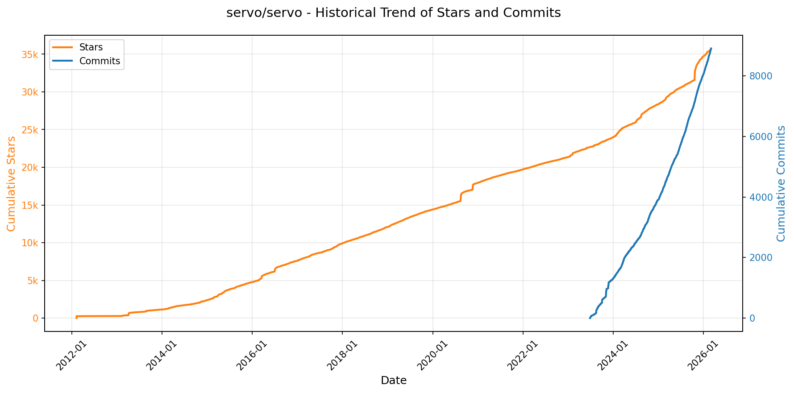

# 🌟 GitHub Trending 概览

> 数据更新于：2026-03-03

---

## 🔍 项目详情

### 1. [openclaw/openclaw](https://github.com/openclaw/openclaw)
- 📅 **创建日期**：2025-11-24  
- 🔄 **最近更新**：2026-03-03  
- ⭐ **Stars**：134,724（日 +4765｜周 +27334｜月 +118087）  
- 📝 **描述**：Your own personal AI assistant. Any OS. Any Platform. The lobster way. 🦞   

<b>📈 Star 与 Commit 历史趋势</b>

> *蓝色：累计 Stars｜橙色：累计 Commits（次 Y 轴）*

<b>📄 README 摘要</b>

1. **项目功能**  
OpenClaw 是一个完全本地化、用户自托管的个人 AI 助手系统，核心目标是让用户在**自有设备上运行专属、单用户、低延迟、始终在线的 AI 助理**。它不依赖中心化云服务，而是通过轻量级「网关（Gateway）」作为统一控制平面，将 AI 能力无缝接入用户日常使用的全部通信渠道（覆盖 WhatsApp、Telegram、Slack、Discord、Signal、iMessage/BlueBubbles、微信级替代品如 Feishu/LINE/Zalo、企业协作工具如 Microsoft Teams/Mattermost/Nextcloud Talk、去中心化协议如 Matrix/Nostr 以及 WebChat 等共 20+ 平台），并支持跨平台语音交互（macOS/iOS 唤醒词 + Android 持续语音）、实时可视化工作区（Live Canvas）及设备端原生操作（摄像头、屏幕录制、定位、通知、系统命令等）。

2. **关键特性**  
- **多通道统一收件箱**：原生集成 20+ 消息平台，支持群组路由、提及触发、消息分块与通道级隔离策略；  
- **本地优先网关架构**：基于 WebSocket 的单点控制平面，管理会话、通道、工具、定时任务（cron）、Webhook、远程调试与 Canvas 托管；  
- **多智能体路由与工作区隔离**：支持按频道/账号/联系人将请求分发至独立 Agent（Workspace），实现上下文与状态严格隔离；  
- **全栈语音能力**：macOS/iOS 支持本地唤醒词（Voice Wake），Android 支持连续语音输入（Talk Mode），集成 ElevenLabs 与系统 TTS 回退；  
- **Live Canvas 可视化工作区**：由 AI 驱动的动态 UI 画布（基于 A2UI 协议），支持推送/重置/执行/快照，跨 macOS/iOS/Android 同步；  
- **设备原生节点（Nodes）**：提供 `camera.*`、`screen.record`、`location.get`、`system.run`、`system.notify` 等安全沙箱化设备能力调用接口；  
- **零信任安全模型**：默认启用 DM 配对机制（Pairing Code），拒绝未授权私信；支持 OAuth/API Key 混合模型认证与自动故障转移（Model Failover）；  
- **向导驱动开箱体验**：`openclaw onboard` CLI 向导一键完成网关部署、通道配对、技能安装与安全策略配置；  
- **远程网关支持**：可通过 Tailscale Serve/Funnel 或 SSH 隧道将本地网关暴露至远程设备，实现“Linux 主机运行网关 + macOS/iOS/Android 作为边缘节点”的混合部署；  
- **技能生态（ClawHub）**：内置技能注册中心，支持自动发现、按需拉取与工作区级技能管理（bundled/managed/workspace 模式）。

3. **技术栈**  
- **运行时**：Node.js ≥22（主运行环境），支持 npm / pnpm / bun；前端 TypeScript 编译使用 `tsx`；  
- **核心协议**：WebSocket（网关控制面）、CDP（Chrome DevTools Protocol，用于浏览器自动化）、TCC（macOS 隐私权限框架）、Bonjour（iOS 设备发现）；  
- **基础设施**：Tailscale（安全远程访问）、Docker（容器化部署）、Nix（声明式配置管理）；  
- **AI 模型层**：抽象化模型适配器，原生支持 OpenAI（含 ChatGPT/Codex）、及其他兼容 OpenAI API 的 LLM 服务商；支持 OAuth 授权与 API Key 认证双模式、多模型 fallback 与动态轮换；  
- **客户端与平台**：  
  - macOS：菜单栏应用 + Voice Wake/Talk Mode/Canvas/WebChat/远程网关控制；  
  - iOS/Android：原生 App（含 Canvas、相机、录音、设备命令如 SMS/位置/日历/运动传感器）；  
  - Web：内嵌 Control UI 与 WebChat（由网关直接提供 HTTP 服务）；  
- **通道 SDK**：Baileys（WhatsApp）、grammY（Telegram）、discord.js（Discord）、@slack/bolt（Slack）、signal-cli（Signal）、matrix-js-sdk（Matrix）等主流官方/社区维护库；  
- **安全与运维**：基于 token/password 的网关认证、SSH 隧道、Tailscale Identity Headers、CLI `doctor` 健康检查与自动修复、结构化日志与用量追踪。

---

### 2. [anthropics/claude-code](https://github.com/anthropics/claude-code)
- 📅 **创建日期**：2025-02-22  
- 🔄 **最近更新**：2026-03-03  
- ⭐ **Stars**：128,120（日 +455｜周 +3533｜月 +10371）  
- 📝 **描述**：Claude Code is an agentic coding tool that lives in your terminal, understands your codebase, and helps you code faster by executing routine tasks, explaining complex code, and handling git workflows - all through natural language commands.  

<b>📈 Star 与 Commit 历史趋势</b>

> *蓝色：累计 Stars｜橙色：累计 Commits（次 Y 轴）*

<b>📄 README 摘要</b>

1. **该项目的功能**  
Claude Code 是一款终端原生的智能编程助手，能够深度理解用户当前代码库，通过自然语言指令自动执行常规开发任务（如代码生成、重构、调试）、解释复杂代码逻辑、自动化 Git 工作流（如提交、分支管理、冲突分析），并支持在终端、IDE 或 GitHub 中（通过 `@claude` 提及）调用，实现无缝集成的“代理式”编码体验。

2. **核心特性**  
- **上下文感知的代码理解**：基于项目目录结构和文件内容实时构建代码知识图谱，提供精准的语义级响应；  
- **自然语言驱动的开发操作**：支持纯中文/英文指令完成编码、注释、测试、文档生成等任务；  
- **Git 智能工作流支持**：自动解析 Git 状态、生成提交信息、建议分支策略、解释差异（diff）与冲突；  
- **插件扩展架构**：内置可插拔机制，允许通过官方插件（位于 `plugins/` 目录）添加自定义命令与专用智能体（agents）；  
- **多平台一键安装**：提供 macOS/Linux 的 Shell 脚本、Homebrew，Windows 的 PowerShell 脚本与 WinGet 等标准化安装方式；  
- **隐私优先设计**：默认不上传源码，仅收集匿名化使用反馈（如接受/拒绝代码建议）和会话元数据，并明确禁止将用户代码或对话用于模型训练。

3. **技术栈**  
- **运行时环境**：Node.js 18+（作为主进程基础）；  
- **客户端架构**：终端原生 CLI 工具（非 Web 应用），深度集成系统 shell 与 Git CLI；  
- **部署分发**：跨平台安装器（bash/shell、PowerShell、Homebrew、WinGet）；  
- **后端依赖**：依托 Anthropic 的 Claude 大模型 API（未开源，闭源服务）；  
- **扩展生态**：插件系统基于 JavaScript/TypeScript 编写，遵循约定式目录结构与配置协议。

---

### 3. [x1xhlol/system-prompts-and-models-of-ai-tools](https://github.com/x1xhlol/system-prompts-and-models-of-ai-tools)
- 📅 **创建日期**：2025-03-05  
- 🔄 **最近更新**：2026-03-03  
- ⭐ **Stars**：127,368（日 +399｜周 +6660｜月 +15412）  
- 📝 **描述**：FULL Augment Code, Claude Code, Cluely, CodeBuddy, Comet, Cursor, Devin AI, Junie, Kiro, Leap.new, Lovable, Manus, NotionAI, Orchids.app, Perplexity, Poke, Qoder, Replit, Same.dev, Trae, Traycer AI, VSCode Agent, Warp.dev, Windsurf, Xcode, Z.ai Code, Dia & v0. (And other Open Sourced) System Prompts, Internal Tools & AI Models  

<b>📈 Star 与 Commit 历史趋势</b>

> *蓝色：累计 Stars｜橙色：累计 Commits（次 Y 轴）*

<b>📄 README 摘要</b>

该内容并非一个典型软件项目的 README（缺少项目名称、功能描述、安装使用说明等核心信息），而是一个**AI 系统提示词（system prompts）与模型配置的开源收集库**的宣传性主页。基于所提供文本，按要求从以下三方面进行精准总结：

---

**1. 该项目做什么？**  
该项目是一个持续维护的、**面向 AI 开发者与安全研究者的公开知识库**，专注于收集、整理并公开分析主流 AI 工具（如大模型应用、Agent 框架、AI 编程助手等）的**真实系统提示词（system prompts）、模型调用配置及内部行为逻辑**。其核心产出是超过 **30,000+ 行结构化技术洞察**，揭示各类 AI 服务如何通过 prompt engineering 实现功能约束、角色设定、安全护栏及输出格式控制等关键机制，服务于 AI 可解释性研究、红队测试、提示工程优化与 AI 安全审计。

---

**2. 关键特性**  
- ✅ **超大规模实测数据集**：收录数千个经逆向分析或实证提取的生产环境 system prompts，覆盖多模态模型、代码生成工具、AI Agent 框架等；  
- ✅ **深度结构化解析**：不仅提供原始 prompt 文本，还标注其功能意图、适用模型、安全策略（如拒绝机制、内容过滤规则）、上下文约束等元信息；  
- ✅ **AI 安全警示与赋能**：内置安全指南，强调 prompt 泄露风险，并关联专业服务 ZeroLeaks.ai，支持 AI 创业公司检测和修复系统指令层漏洞；  
- ✅ **开发者友好生态整合**：提供 Discord 社区、Trendshift 数据看板、DeepWiki 知识图谱链接，支持协作贡献与实时更新追踪；  
- ✅ **去中心化支持通道**：集成 Solana 钱包地址（CA: `DEffWzJyaFRNyA4ogUox631hfHuv3KLeCcpBh2ipBAGS`）及多链加密货币捐赠，体现 Web3 原生协作模式。

---

**3. 技术栈**  
该项目本身为**静态文档型知识库（非可执行软件）**，无传统意义上的“运行时技术栈”，但其构建与分发依赖以下关键技术与平台：  
- **基础设施**：GitHub（版本托管、Issue 协作、Star History 数据可视化）；  
- **分析与验证工具链**：隐含使用 LLM 逆向工程方法、API 流量捕获、Prompt 注入测试、模型响应对比分析等黑/白盒分析技术；  
- **展示与交互层**：Markdown + GitHub Pages（基础呈现）、CloudBack.it（CI/CD 状态）、DeepWiki（语义化知识检索）、Trendshift（增长与热度分析）；  
- **安全与合规支撑**：ZeroLeaks.ai 提供的 AI 指令层漏洞扫描 SDK/服务（集成于安全通告模块）；  
- **赞助与激励层**：Solana 区块链（代币捐赠）、BTC/LTC/ETH 多链钱包、Patreon/Ko-fi 订阅平台。

---

### 4. [obra/superpowers](https://github.com/obra/superpowers)
- 📅 **创建日期**：2025-10-09  
- 🔄 **最近更新**：2026-03-03  
- ⭐ **Stars**：97,199（日 +1165｜周 +8924｜月 +27466）  
- 📝 **描述**：An agentic skills framework & software development methodology that works.  

<b>📈 Star 与 Commit 历史趋势</b>

> *蓝色：累计 Stars｜橙色：累计 Commits（次 Y 轴）*

<b>📄 README 摘要</b>

1. **项目功能**  
Superpowers 是一个面向编程智能体（coding agents）的完整软件开发工作流增强系统。它不直接替代或重写代码，而是通过一套可组合、自动触发的“能力（skills）”对现有编码智能体（如 Claude Code、Cursor、Codex、OpenCode 等）进行深度赋能，使其在真实工程场景中遵循严格、可验证、协作友好的开发范式。其核心作用是：在用户启动编码任务后，主动暂停“写代码”行为，转而引导用户完成需求澄清 → 分块设计确认 → 生成可执行、可审查的细粒度实施计划 → 驱动子智能体（subagents）按 TDD 和 YAGNI 原则自主执行任务，并全程嵌入自动化检查、代码评审、Git 工作树管理与分支收尾等工程实践——最终将松散的 AI 编程行为系统化为类专业团队的可靠开发流水线。

2. **关键特性**  
- **全自动技能触发机制**：无需手动调用，智能体在每项任务前自动识别并激活匹配的 skill（如设计阶段触发 `brainstorming`，编码前强制触发 `test-driven-development`），所有技能为强制性工作流，非可选建议。  
- **结构化端到端工作流**：覆盖从需求探索（Socratic 式提问+分块设计确认）、环境隔离（`using-git-worktrees`）、计划拆解（2–5 分钟/任务，含精确文件路径与验证步骤）、子智能体协同开发（`subagent-driven-development`，双阶段审查：规范符合性 + 代码质量）、红绿重构 TDD（禁止先写实现后补测试）、预提交代码评审（分级阻断）、到分支收尾（测试验证+合并决策）的全生命周期。  
- **强工程哲学约束**：内建并严格执行 TDD（RED-GREEN-REFACTOR）、YAGNI（避免过度设计）、DRY（消除重复）、Systematic Debugging（四阶段根因分析）、Evidence-over-Claims（所有“已修复”“已完成”均需可验证证据）等原则；提供反模式指南（如测试反模式、调试陷阱）和最佳实践模板（如 `writing-skills` 技能支持开发者贡献新能力）。  
- **跨平台插件化支持**：原生适配 Claude Code、Cursor 的插件市场，同时支持 Codex 与 OpenCode 的手动集成，安装即用，更新自动同步。

3. **技术栈**  
- **运行时环境**：依赖外部大模型智能体平台（Claude Code / Cursor / Codex / OpenCode），本身不包含模型或推理引擎，属于轻量级、声明式 workflow 编排层。  
- **核心架构**：基于“技能（Skills）”的模块化设计，每个 skill 为独立 Markdown 文档（如 `skills/test-driven-development/SKILL.md`），定义行为规范、触发条件、执行逻辑与验证标准；技能间可组合复用（如 `writing-plans` 产出供 `executing-plans` 或 `subagent-driven-development` 消费）。  
- **基础设施协议**：利用各平台原生插件机制（如 `/plugin install`）、远程指令加载（`Fetch and follow instructions from ...`）及 Git 工作树（`git worktree`）实现环境隔离与状态管理；所有技能文档、安装说明、贡献指南均以纯文本（Markdown）形式托管于 GitHub 仓库，无服务端依赖。  
- **协议与范式**：深度集成 Git CLI、TAP/Jest 等测试协议（隐式要求项目具备可运行测试套件）、标准代码审查流程；强调人类-AI 协同节奏控制（如人工签核设计、人工确认计划、人工介入关键评审点），属“人机共治”型工程框架。

---

### 5. [microsoft/markitdown](https://github.com/microsoft/markitdown)
- 📅 **创建日期**：2024-11-13  
- 🔄 **最近更新**：2026-03-03  
- ⭐ **Stars**：89,618（日 +617｜周 +2106｜月 +3726）  
- 📝 **描述**：Python tool for converting files and office documents to Markdown.  

<b>📈 Star 与 Commit 历史趋势</b>

> *蓝色：累计 Stars｜橙色：累计 Commits（次 Y 轴）*

<b>📄 README 摘要</b>

1. **项目功能**  
MarkItDown 是一个轻量级 Python 工具，专注于将多种格式的文件（如 PDF、Word、PowerPoint、Excel、图像、音频、HTML、CSV/JSON/XML、ZIP、YouTube 视频、EPUB 等）**高保真地转换为结构化 Markdown 文本**，专为大语言模型（LLM）和文本分析流水线设计。其核心目标不是生成面向人类阅读的精美排版文档，而是输出语义丰富、结构清晰（含标题、列表、表格、链接、元数据、OCR 文本、语音转录等）、**对 LLM 友好且 token 高效**的 Markdown 内容，便于后续被 LLM 直接理解、推理或作为上下文输入。

2. **关键特性**  
- ✅ **多格式统一转换**：原生支持超 12 类主流文件类型，涵盖办公文档、多媒体、归档包、网页及流媒体 URL；  
- ✅ **结构化 Markdown 输出**：精准保留原文档逻辑结构（如层级标题、嵌套列表、表格行列关系、超链接、图像 ALT 描述等），而非简单纯文本提取；  
- ✅ **模块化依赖管理**：通过可选功能组（如 `[pdf]`、`[docx]`、`[audio-transcription]`）按需安装依赖，避免冗余；  
- ✅ **高级扩展能力**：  
　• 支持第三方插件生态（通过 `--use-plugins` 启用，GitHub 可搜索 `#markitdown-plugin` 发现插件）；  
　• 集成 Azure Document Intelligence 实现高精度 PDF/扫描件解析；  
　• 可接入 OpenAI 等 LLM 为图片/PPT 中的图像生成智能描述（需传入 `llm_client` 和 `llm_model`）；  
　• 提供 MCP（Model Context Protocol）服务器（见 `markitdown-mcp` 子包），便于与 Claude Desktop 等 LLM 应用深度集成；  
- ✅ **灵活使用方式**：提供命令行工具（支持管道输入、重定向输出）、Python API（类实例化调用）、Docker 容器化部署三种使用途径；  
- ✅ **无临时文件设计**：内部 `DocumentConverter` 接口全面基于二进制流（`BytesIO` 或 `open(..., 'rb')`），彻底消除临时文件写入，提升安全性与性能。

3. **技术栈**  
- **语言与运行时**：Python ≥ 3.10（推荐 3.12），基于标准库与成熟第三方生态构建；  
- **核心依赖**：依格式动态选用（均通过可选依赖组管理）：  
　• PDF → `pypdf`, `pdfplumber`, `fitz`（PyMuPDF）或 Azure Document Intelligence；  
　• Office 文档 → `python-docx`（DOCX）、`python-pptx`（PPTX）、`openpyxl`/`xlrd`（XLSX/XLS）；  
　• 图像 OCR → `pytesseract` + `Pillow`；  
　• 音频转录 → `whisper` 或 `openai-whisper`；  
　• YouTube 解析 → `yt-dlp`；  
　• EPUB → `ebooklib`；  
　• ZIP/HTML/文本 → 原生 `zipfile`、`beautifulsoup4`、`csv`/`json`/`xml.etree` 等；  
- **扩展协议**：MCP（Model Context Protocol）服务（独立子包 `markitdown-mcp`）；  
- **开发与工程化**：采用 `hatch` 进行环境管理与测试，`pre-commit` 保障代码质量，支持 Devcontainer 开发环境，遵循 Microsoft 开源规范（CLA、Code of Conduct）。

---

### 6. [google/langextract](https://github.com/google/langextract)
- 📅 **创建日期**：2025-07-08  
- 🔄 **最近更新**：2026-03-03  
- ⭐ **Stars**：56,505（日 +104｜周 +650｜月 +10535）  
- 📝 **描述**：A Python library for extracting structured information from unstructured text using LLMs with precise source grounding and interactive visualization.  

<b>📈 Star 与 Commit 历史趋势</b>

> *蓝色：累计 Stars｜橙色：累计 Commits（次 Y 轴）*

<b>📄 README 摘要</b>

1. **项目功能**  
LangExtract 是一个基于大语言模型（LLM）的 Python 库，专注于从非结构化文本（如临床笔记、放射报告、文学作品等）中**高精度提取结构化信息**。它不依赖预训练或微调，而是通过用户定义的自然语言指令（prompt）和少量示例（few-shot examples），驱动 LLM 执行可复现、可验证的信息抽取任务，输出带精确原文定位（source grounding）的结构化结果（如实体、关系、属性），并支持端到端处理长文档（如整本《罗密欧与朱丽叶》）。

2. **核心特性**  
- **精准原文溯源（Source Grounding）**：每个提取结果均标注其在原始文本中的确切字符位置，支持可视化高亮与人工核查；  
- **强结构化输出保障**：通过受控生成（如 Gemini 的 schema 强约束）和示例引导，确保输出严格符合用户定义的类目（如 `character`/`emotion`/`relationship`）与字段格式；  
- **长文档优化处理**：采用多轮抽取（`extraction_passes`）、自适应分块（`max_char_buffer`）、并行处理（`max_workers`）策略，显著提升大文本（>10 万字符）的召回率与准确性；  
- **交互式可视化审查**：一键生成自包含 HTML 文件，支持动态浏览数千个抽取结果及其上下文，无需额外服务；  
- **多模态 LLM 接入能力**：原生支持 Google Gemini（云）、OpenAI（需额外安装）、本地 Ollama 模型（如 `gemma2:2b`），并提供插件化架构供扩展第三方模型；  
- **零微调领域适配**：仅需 1–3 个高质量示例即可快速适配任意领域（医疗、法律、文学等），无需修改模型或训练流程；  
- **生产就绪增强功能**：支持 Vertex AI 批处理降本、环境变量/API Key 安全管理、Docker 容器化部署及完整测试套件（含 Ollama 集成测试）。

3. **技术栈**  
- **编程语言**：Python 3.10+（核心实现）；  
- **核心依赖**：`google-generativeai`（Gemini）、`openai`（可选）、`ollama`（可选）、`pydantic`（数据建模）、`rich`（CLI 输出）、`pytest`/`tox`（测试）；  
- **构建与包管理**：`pyproject.toml`（PEP 621）、`setuptools`、`pip`、`venv`；  
- **开发工具链**：`pre-commit`（代码检查）、`isort` + `pyink`（自动格式化）、`pylint`（静态分析）、`Docker`（容器化）；  
- **部署与集成**：支持 Vertex AI 企业级服务账号认证、`.env` 环境隔离、CI/CD（GitHub Actions）、Hugging Face Spaces 演示（RadExtract）；  
- **许可证**：Apache 2.0 开源协议。

---

### 7. [servo/servo](https://github.com/servo/servo)
- 📅 **创建日期**：2012-02-08  
- 🔄 **最近更新**：2026-03-03  
- ⭐ **Stars**：35,751（日 +122｜周 +231｜月 +487）  
- 📝 **描述**：Servo aims to empower developers with a lightweight, high-performance alternative for embedding web technologies in applications.  

<b>📈 Star 与 Commit 历史趋势</b>

> *蓝色：累计 Stars｜橙色：累计 Commits（次 Y 轴）*

<b>📄 README 摘要</b>

1. **该项目做什么？**  
Servo 是一个用 Rust 编写的**并行化、实验性网页浏览器引擎原型**，目标是探索现代硬件（尤其是多核 CPU）下的高性能、高安全性与高并发 Web 渲染架构。它并非面向最终用户的完整浏览器，而是专注于底层引擎核心功能（如布局、样式计算、渲染、脚本执行等）的重新设计与实现，强调内存安全、线程安全和并行处理能力。

2. **关键特性**  
- **原生并行架构**：从底层设计即支持高度并行化，CSS 样式计算、布局、图层合成等关键阶段可跨多线程/多核并发执行；  
- **内存与线程安全**：依托 Rust 语言特性，杜绝空指针解引用、数据竞争、缓冲区溢出等 C/C++ 类引擎常见安全隐患；  
- **跨平台支持广泛**：官方支持 64 位 macOS、Linux、Windows、Android 及 OpenHarmony（含 HarmonyOS NEXT），体现对新兴操作系统的前瞻性适配；  
- **模块化与可实验性**：采用清晰分层架构，便于替换组件（如渲染后端、网络栈、JS 引擎绑定）以验证新技术；  
- **开源协作友好**：提供完善的文档（Servo Book）、活跃的 Zulip 社区、规范的 Issue 跟踪与视频会议机制，鼓励全球开发者参与。

3. **技术栈**  
- **主语言**：Rust（核心引擎全部使用 Rust 编写，依赖其所有权系统保障内存与并发安全）；  
- **构建与依赖管理**：`rustup`（Rust 工具链管理）、`uv`（超快 Python 兼容依赖解析器与虚拟环境工具，用于构建脚本依赖）、自研构建脚本 `mach`；  
- **平台适配层**：针对各操作系统集成对应 SDK/NDK（如 Android NDK r28、Windows SDK ≥10.0.19041、OpenHarmony Native SDK）；  
- **基础设施**：GitHub（代码托管与 Issue 协作）、Zulip（实时社区沟通）、CI/CD 集成（隐含于构建流程中）；  
- **扩展生态**：支持与不同 JavaScript 引擎（如 SpiderMonkey）及图形后端（如 OpenGL、Vulkan、Skia）集成（文档中虽未详述，但属 Servo 架构设计原则）。

---

### 8. [shareAI-lab/learn-claude-code](https://github.com/shareAI-lab/learn-claude-code)
- 📅 **创建日期**：2025-06-29  
- 🔄 **最近更新**：2026-03-03  
- ⭐ **Stars**：35,107（日 +517｜周 +2939｜月 +4538）  
- 📝 **描述**：Bash is all you need -  A nano Claude Code–like agent, built from 0 to 1  

<b>📈 Star 与 Commit 历史趋势</b>

> *蓝色：累计 Stars｜橙色：累计 Commits（次 Y 轴）*

<b>📄 README 摘要</b>

1. **项目功能**  
该项目是一个面向教学的轻量级AI编程智能体（nano Claude Code-like agent）构建实践库，旨在从零开始系统性地拆解并实现一个类Claude Code的自主编码智能体核心运行机制。它不追求生产级完备性，而是通过**12个渐进式会话（s01–s12）**，每个会话仅引入**一个关键机制**，完整复现智能体从基础循环到多智能体协同、隔离执行的演进路径。最终目标是让学习者深入理解AI Agent的内在工作原理——即“模型即智能体，我们只需提供工具并退居幕后”。

2. **核心特性**  
- **极简可验证的核心循环**：基于`stop_reason == "tool_use"`触发工具调用的闭环逻辑，构成所有Agent的基础骨架；  
- **模块化渐进设计**：12个会话严格遵循“一机制一 motto”原则（如s03强调规划先行、s06实现三层上下文压缩、s12实现基于ID的工作树目录隔离），每步增量清晰、可独立运行与验证；  
- **真实工程机制覆盖**：涵盖工具调度、分层规划（TodoWrite/子智能体）、按需知识注入（SKILL.md via `tool_result`）、无限会话上下文管理、文件化任务图谱（带依赖）、后台异步执行（daemon线程+通知队列）、持久化智能体团队（JSONL邮箱协议）、自主认领任务（idle cycle + auto-claim）、工作目录级隔离（worktree）等关键能力；  
- **教学优先架构**：配套三语文档（中/英/日）、交互式Web学习平台（Next.js）、ASCII流程图+最小代码示例，并明确标注生产级缺失项（如完整事件总线、权限治理、MCP运行时），避免概念混淆。

3. **技术栈**  
- **主语言与运行时**：Python（核心Agent逻辑，含Anthropic SDK调用）；  
- **前端与可视化**：Next.js（`web/`目录），提供交互式步骤演示、源码查看与文档浏览；  
- **AI模型接入**：Anthropic Claude系列（通过`ANTHROPIC_API_KEY`配置），设计上支持替换为GLM/MiniMax/DeepSeek等开源模型（见衍生项目Kode CLI）；  
- **任务与通信协议**：纯文本JSONL格式邮箱（teammate间异步消息）、文件系统驱动的任务持久化（`tasks/`目录）、基于ID的worktree目录隔离；  
- **开发与部署辅助**：Git工作流、GitHub Actions CI（类型检查+构建）、`.env`环境管理、跨平台CLI支持（Windows-ready）。

---

### 9. [thedotmack/claude-mem](https://github.com/thedotmack/claude-mem)
- 📅 **创建日期**：2025-08-31  
- 🔄 **最近更新**：2026-03-03  
- ⭐ **Stars**：32,754（日 +290｜周 +1972｜月 +16947）  
- 📝 **描述**：A Claude Code plugin that automatically captures everything Claude does during your coding sessions, compresses it with AI (using Claude's agent-sdk), and injects relevant context back into future sessions.  

<b>📈 Star 与 Commit 历史趋势</b>

> *蓝色：累计 Stars｜橙色：累计 Commits（次 Y 轴）*

<b>📄 README 摘要</b>

1. **项目功能**  
Claude-Mem 是一个专为 **Claude Code（Anthropic 推出的 AI 编程助手）设计的持久化记忆压缩系统**。它在用户每次会话中自动捕获工具调用、代码操作、错误修复等行为观测数据（observations），生成语义化摘要，并持久化存储于本地 SQLite 数据库中；当新会话启动时，自动检索并按需注入相关历史上下文，从而实现跨会话的知识连续性——使 Claude 能“记住”项目进展、技术决策、调试过程等关键信息，显著提升长周期开发任务中的上下文连贯性与推理质量。

2. **核心特性**  
- ✅ **持久化记忆（Persistent Memory）**：会话结束后仍保留结构化观测记录，支持长期项目上下文复用；  
- ✅ **渐进式披露（Progressive Disclosure）**：分三层检索（索引→时间线→详情），实时显示 token 消耗，优化上下文注入成本；  
- ✅ **技能化搜索（Skill-Based Search）**：内置 `mem-search` 技能及 4 个标准化 MCP（Model Context Protocol）工具（`search`/`timeline`/`get_observations`/未显式命名的第4个），支持自然语言+过滤条件（类型/日期/项目名）查询；  
- ✅ **实时 Web 查看器（Web Viewer UI）**：运行于 `http://localhost:37777`，提供内存流可视化、观测详情浏览、API 端点访问及 Beta 版本切换；  
- ✅ **Claude Desktop 集成**：可在桌面版对话中直接调用记忆搜索技能；  
- ✅ **隐私控制机制**：支持 `<private>` 标签语法，自动排除敏感内容入库；  
- ✅ **全自动运行**：无需手动触发保存或加载，完全通过生命周期钩子（6 个 Hook 脚本）静默执行；  
- ✅ **智能引用与溯源**：每条观测分配唯一 ID，支持 API 直查（`/api/observation/{id}`）及 Web 界面交叉引用；  
- ✅ **混合搜索架构**：融合 SQLite FTS5 全文检索 + Chroma 向量数据库，实现关键词与语义双重匹配；  
- ✅ **Beta 实验通道**：支持 Endless Mode（仿生式长记忆架构）等前沿功能灰度测试。

3. **技术栈**  
- **运行时**：Node.js ≥18.0.0（主逻辑）、Bun（Worker 服务托管与进程管理）、uv（Python 包管理器，用于 Chroma 向量库依赖）；  
- **数据库**：SQLite 3（嵌入式，含 FTS5 全文搜索扩展） + Chroma（向量数据库，支持语义检索）；  
- **前端**：静态 Web UI（基于 HTML/CSS/JS，含 GIF 动画预览与响应式布局）；  
- **协议与集成**：MCP（Model Context Protocol）标准工具接口、Claude Agent SDK、Claude Code 插件系统；  
- **构建与部署**：TypeScript（主要开发语言）、npm/Bun 包管理、AGPL-3.0 开源许可（主项目），Ragtime 子模块采用 PolyForm Noncommercial License；  
- **基础设施**：本地 HTTP Worker 服务（端口 37777）、自动依赖检测与安装（Smart Install）、多语言国际化（支持 30+ 语种文档）。

---

### 10. [anthropics/prompt-eng-interactive-tutorial](https://github.com/anthropics/prompt-eng-interactive-tutorial)
- 📅 **创建日期**：2024-04-02  
- 🔄 **最近更新**：2026-03-03  
- ⭐ **Stars**：30,801（日 +602｜周 +1224｜月 +2360）  
- 📝 **描述**：Anthropic's Interactive Prompt Engineering Tutorial  

<b>📈 Star 与 Commit 历史趋势</b>

> *蓝色：累计 Stars｜橙色：累计 Commits（次 Y 轴）*

<b>📄 README 摘要</b>

1. **该项目做什么？**  
该项目是 Anthropic 官方推出的、面向 Claude 大语言模型（特别是 Claude 3 Haiku）的交互式提示工程（Prompt Engineering）教学教程，旨在系统性地指导用户掌握高质量提示词的设计方法。它不是开发工具或软件库，而是一个结构化、实践导向的学习课程，通过 9 个渐进式章节和配套练习，帮助学习者从零构建、调试和优化提示词，以充分发挥 Claude 的能力，并规避常见错误（如幻觉、歧义、格式混乱等），最终能为聊天机器人、法律、金融、编程等真实行业场景定制复杂、鲁棒的提示方案。

2. **核心功能**  
- **分层渐进式教学体系**：按“入门→进阶→高级”三级划分（共 9 章），覆盖提示基础结构、指令清晰度、角色设定、指令与数据分离、输出格式控制、思维链（Precognition）、示例引导、抗幻觉策略及多行业复杂提示构建；  
- **强交互实践设计**：每章均配备“示例游乐场（Example Playground）”，支持用户即时修改提示并实时观察 Claude 响应变化，强化动手理解；  
- **配套资源完备**：提供官方答案密钥（Google Sheets 链接）、各章节练习题、行业专项实战练习（含金融、编程等），以及附录拓展内容（提示链、工具调用、检索增强等前沿技术）；  
- **模型适配明确**：全程基于 Claude 3 Haiku（轻量、快速、低成本）开展教学，同时说明 Sonnet/Opus 模型的定位差异，便于用户迁移应用。

3. **技术栈**  
- **核心模型**：Anthropic Claude 3 系列大语言模型（主用 Haiku，兼述 Sonnet/Opus）；  
- **交互载体**：以 GitHub README 形式组织课程结构与说明，实际交互环境依赖两个官方部署渠道：  
  - [Google Sheets + Claude for Sheets 插件](https://docs.google.com/spreadsheets/d/19jzLgRruG9kjUQNKtCg1ZjdD6l6weA6qRXG5zLIAhC8/edit?usp=sharing)（推荐，图形化、易操作）；  
  - 原生 Markdown 教程（GitHub 仓库），配合用户本地或在线 Claude 接口进行手动实验；  
- **辅助工具**：答案密钥使用 Google Sheets 管理；无自研后端、前端框架或数据库，属纯文档+外部 AI 服务集成型教学资源。

---

### 11. [gsd-build/get-shit-done](https://github.com/gsd-build/get-shit-done)
- 📅 **创建日期**：2025-12-14  
- 🔄 **最近更新**：2026-03-03  
- ⭐ **Stars**：23,521（日 +573｜周 +4918｜月 +13424）  
- 📝 **描述**：A light-weight and powerful meta-prompting, context engineering and spec-driven development system for Claude Code by TÂCHES.  

<b>📈 Star 与 Commit 历史趋势</b>

> *蓝色：累计 Stars｜橙色：累计 Commits（次 Y 轴）*

<b>📄 README 摘要</b>

1. **项目功能**  
该项目是一个轻量级但功能强大的元提示（meta-prompting）、上下文工程（context engineering）与规范驱动开发（spec-driven development）系统，专为 Claude Code、OpenCode、Gemini CLI 和 Codex 等 AI 编程助手设计。其核心目标是**解决“上下文腐化”（context rot）问题**——即当大模型（尤其是 Claude）的上下文窗口被逐步填满时，响应质量显著下降的现象。GSD 通过结构化工作流，在每次关键任务执行时启用独立、纯净的高容量（200k tokens）上下文环境，确保 AI 始终在高质量、无噪声的语境中生成和验证代码，从而实现可靠、可重复、端到端自动化的软件构建。

2. **关键特性**  
- **六阶段闭环工作流**：`new-project → discuss-phase → plan-phase → execute-phase → verify-work → complete-milestone`，每个阶段职责明确、状态可追溯；  
- **智能上下文工程**：自动生成并动态维护 `PROJECT.md`、`REQUIREMENTS.md`、`ROADMAP.md`、`STATE.md`、`CONTEXT.md` 等结构化文档，精准供给模型所需背景；  
- **XML 格式化原子任务计划**：所有执行计划均以带 `<verify>` 和 `<done>` 标签的 XML 结构编写，指令明确、可验证、防歧义；  
- **多智能体协同编排**：研究、规划、执行、验证各阶段均由轻量级协调器调度专用子代理（如并行研究员、校验器、执行器），主会话上下文始终保持轻量（30–40% 占用）；  
- **波次化并行执行（Wave Execution）**：自动识别任务依赖关系，将计划分组为并行“波次”，最大化并发效率，同时保障顺序正确性；  
- **原子化 Git 提交**：每个子任务生成独立、语义化、可追溯的提交（如 `feat(08-02): add email confirmation flow`），支持精准 bisect、回滚与历史理解；  
- **现成代码库适配（Brownfield Support）**：通过 `/gsd:map-codebase` 自动分析现有项目技术栈、架构与约定，使后续开发无缝继承上下文；  
- **快速模式（Quick Mode）**：支持无需完整规划的临时任务（如 Bug 修复、配置调整），仍保留原子提交与状态追踪；  
- **模块化与灵活演进**：支持动态增删阶段、插入紧急任务、跨里程碑迁移，全程无锁定、可中断恢复（`/gsd:pause-work` / `resume-work`）。

3. **技术栈**  
- **运行时支持**：Claude Code（主推）、OpenCode（开源免费模型）、Google Gemini CLI、GitHub Codex（技能优先模式）；  
- **部署形态**：基于 `npx` 的零依赖 CLI 工具，跨平台支持 macOS / Windows / Linux；  
- **核心机制**：纯 JavaScript（Node.js）实现安装器与命令调度，深度集成各 AI 工具的本地插件/技能/自定义提示系统（如 Codex 使用 `skills/` 目录下的 `.md` 技能文件）；  
- **上下文管理**：依赖严格文件约定（`.planning/` 目录体系）与本地持久化（`STATE.md`, `.planning/config.json`）实现状态记忆；  
- **权限与自动化**：推荐配合 `--dangerously-skip-permissions` 运行，或通过 `.claude/settings.json` 精确声明 Bash/Git 权限白名单，实现免交互自动化；  
- **扩展能力**：支持模型配置剖面（`quality`/`balanced`/`budget`）、自定义 Git 分支策略、多代理模型路由等高级配置，详见用户指南。

---

### 12. [bytedance/deer-flow](https://github.com/bytedance/deer-flow)
- 📅 **创建日期**：2025-05-07  
- 🔄 **最近更新**：2026-03-03  
- ⭐ **Stars**：23,495（日 +491｜周 +3433｜月 +4030）  
- 📝 **描述**：An open-source SuperAgent harness that researches, codes, and creates. With the help of sandboxes, memories, tools, skills and subagents, it handles different levels of tasks that could take minutes to hours.  

<b>📈 Star 与 Commit 历史趋势</b>

> *蓝色：累计 Stars｜橙色：累计 Commits（次 Y 轴）*

<b>📄 README 摘要</b>

1. **项目功能**  
DeerFlow 2.0 是一个开源的**超级智能体（Super Agent）运行时框架（harness）**，核心目标是为大语言模型驱动的智能体提供完整、可生产部署的执行基础设施。它不局限于“深度研究”场景，而是通过协同调度**子智能体（sub-agents）、长期记忆（long-term memory）、隔离沙箱（sandbox）与结构化技能（skills）**，使智能体能真正“动手做事”——例如自动完成多步骤复杂任务：并行调研、生成报告/幻灯片/网页、执行代码、处理文件、调用工具、理解图像/视频等，最终交付端到端成果。

2. **关键特性**  
- **模块化可扩展技能系统（Skills & Tools）**：内置研究、报告生成、PPT制作、网页开发、图像/视频生成等标准化技能（以 Markdown 定义），支持用户自定义技能与工具；技能按需加载，避免上下文膨胀；兼容 MCP（Model Context Protocol）服务器及 Python 函数工具。  
- **动态子智能体编排（Sub-Agents）**：主智能体可按需动态创建多个隔离子智能体，各自拥有独立上下文、工具集和终止条件，并行执行细分任务（如并发检索不同信息源），结果结构化回传后由主智能体整合输出。  
- **全功能隔离沙箱环境（Sandbox & File System）**：每个任务在独立 Docker 容器中运行，配备完整可读写文件系统（`/mnt/user-data/uploads/`、`/workspace/`、`/outputs/`），支持 Bash 执行、代码运行、文件操作与多模态内容处理，保障安全、可审计、无会话污染。  
- **精细化上下文工程（Context Engineering）**：采用子智能体上下文隔离机制 + 自动摘要/文件卸载/上下文压缩策略，在长周期、多步骤任务中持续优化 token 利用率，适配各类上下文敏感模型。  
- **跨会话长期记忆（Long-Term Memory）**：本地持久化存储用户画像、偏好设置、技术栈习惯与历史知识，随使用频率提升个性化能力，数据完全由用户自主控制。

3. **技术栈**  
- **核心框架**：基于 **LangChain**（LLM 集成、工具链、模型抽象）与 **LangGraph**（多智能体状态图编排、有向循环工作流）构建；  
- **运行时环境**：默认使用 **Docker** 提供沙箱隔离，支持 Kubernetes Provisioner 扩展；本地开发依赖 **Node.js 22+**、**pnpm**、**uv**（Python 包管理）；  
- **协议与标准**：原生支持 **MCP（Model Context Protocol）** 协议，兼容 HTTP/SSE 接口与 OAuth 认证流（`client_credentials`/`refresh_token`）；  
- **客户端支持**：提供嵌入式 **Python SDK（`DeerFlowClient`）**，接口与 HTTP 网关完全对齐（Pydantic Schema 验证），支持同步/流式调用、技能管理、文件上传等全功能；  
- **模型兼容性**：模型无关（model-agnostic），支持任意符合 OpenAI 兼容 API 的 LLM（如 GPT-4、Claude、Qwen 等），推荐具备长上下文（100k+ tokens）、强推理、多模态与可靠工具调用能力的模型。

---

### 13. [KeygraphHQ/shannon](https://github.com/KeygraphHQ/shannon)
- 📅 **创建日期**：2025-09-27  
- 🔄 **最近更新**：2026-03-03  
- ⭐ **Stars**：23,023（日 +224｜周 +1565｜月 +19272）  
- 📝 **描述**：Fully autonomous AI hacker to find actual exploits in your web apps. Shannon has achieved a 96.15% success rate on the hint-free, source-aware XBOW Benchmark.  

<b>📈 Star 与 Commit 历史趋势</b>

> *蓝色：累计 Stars｜橙色：累计 Commits（次 Y 轴）*

<b>📄 README 摘要</b>

1. **项目功能**  
Shannon 是一个面向源代码的全自动 AI 渗透测试框架，专为 Web 应用程序设计。其核心能力是**不依赖人工干预，直接执行真实攻击以验证漏洞可利用性**（而非仅生成告警或潜在风险提示）。它通过访问目标应用的源代码（白盒），结合动态浏览器交互与命令行级 exploit 执行（如 SQL 注入、XSS、SSRF、认证/授权绕过等），在运行环境中主动触发并证实漏洞存在，输出具备复现能力的 PoC（Proof-of-Concept）。目标是填补开发高频迭代（如借助 Claude Code/Cursor）与传统年度渗透测试之间的安全响应断层，实现“每次构建即安全验证”。

2. **关键特性**  
- **全自主渗透流程**：单命令启动，自动处理复杂登录（含 2FA/TOTP、Google 登录）、页面导航、漏洞探测与 exploit 执行，全程无需人工介入；  
- **可验证、低误报报告**：输出聚焦于**已成功利用的漏洞**，附带一键复制的 PoC 脚本与详细复现步骤，消除传统扫描器的高误报问题；  
- **覆盖关键 OWASP 风险**：当前深度支持 Injection、XSS、SSRF、Broken Authentication/Authorization 等高危漏洞的识别与实证；  
- **代码感知的动态测试**：融合静态源码分析（指导攻击路径）与动态运行时 exploitation（浏览器 + CLI），精准定位真实业务风险；  
- **集成专业安全工具链**：内置调用 Nmap、Subfinder、WhatWeb、Schemathesis 等工具增强侦察与接口测试深度；  
- **并行化加速引擎**：对不同漏洞类型的分析与利用阶段进行并发执行，显著缩短整体测试耗时；  
- **工作区（Workspace）与断点续跑**：自动保存各 Agent 进度（基于 Git 提交），支持失败后指定 Workspace 恢复，跳过已完成环节；  
- **白盒优先、源码驱动**：明确要求访问应用源码（支持单体/多仓库/单体库结构），确保测试策略高度上下文化。

3. **技术栈**  
- **核心架构**：基于多智能体（Multi-Agent）协同的自动化渗透框架，分 Recon → Vulnerability Analysis → Exploitation → Reporting 四阶段流水线；  
- **AI 引擎**：深度集成 Anthropic Agent SDK，主力适配 Claude 系列模型（推荐 Anthropic API）；实验性支持 OpenAI（GPT-5.2）、Google Gemini（通过 OpenRouter）；  
- **运行时环境**：全容器化部署，依赖 Docker 运行时；底层编排使用 Temporal（提供工作流状态管理、重试、监控及 Web UI）；  
- **安全工具集成**：Nmap（网络扫描）、Subfinder（子域名发现）、WhatWeb（指纹识别）、Schemathesis（API 合约模糊测试）；  
- **基础设施**：前端交互依托无头浏览器（Puppeteer 或类似方案），后端任务调度与日志管理由 Temporal Server 支撑；  
- **配置与扩展**：YAML 格式配置文件支持自定义登录流程、TOTP 密钥、路径过滤/聚焦规则；支持 CI/CD 集成（Pro 版专属）；  
- **许可证**：Shannon Lite 开源版采用 AGPL-3.0 许可证，强调源码可用性与衍生作品开源义务。

---

### 14. [ruvnet/wifi-densepose](https://github.com/ruvnet/wifi-densepose)
- 📅 **创建日期**：2025-06-07  
- 🔄 **最近更新**：2026-03-03  
- ⭐ **Stars**：22,147（日 +4403｜周 +14919｜月 +16669）  
- 📝 **描述**：WiFi DensePose turns commodity WiFi signals into real-time human pose estimation, vital sign monitoring, and presence detection — all without a single pixel of video.   

<b>📈 Star 与 Commit 历史趋势</b>

> *蓝色：累计 Stars｜橙色：累计 Commits（次 Y 轴）*

<b>📄 README 摘要</b>

1. **项目功能**  
本项目（π RuView: WiFi DensePose）利用商用WiFi信号实现**无摄像头、无穿戴设备的非接触式人体感知**，核心能力包括：  
- **实时人体姿态估计**（17个关键点骨架），通过分析WiFi信道状态信息（CSI）中由人体运动引起的子载波幅值与相位扰动，生成DensePose风格的UV映射；  
- **生命体征监测**：在无接触条件下精确提取呼吸率（6–30 BPM）和心率（40–120 BPM）；  
- **存在检测与多目标追踪**：支持单/多房间、单/多人同步感知，具备亚秒级低延迟（<1 ms）；  
- **穿墙感知能力**：基于菲涅尔区几何建模与多径传播物理模型，可穿透墙壁、家具、 rubble（碎石）、混凝土（最深达5米）等障碍物持续工作；  
- **灾难应急响应**：集成WiFi-Mat模块，支持废墟下幸存者探测、START伤情分级与三维定位。

2. **关键特性**  
- **隐私优先架构**：全程不采集、不处理、不存储任何图像或视频数据，仅依赖射频信号，天然规避GDPR/HIPAA等影像监管限制；  
- **多模态智能感知**：  
  - 支持**多人员独立追踪**（物理上限约3–5人/AP，可通过多AP/多节点网格线性扩展）；  
  - **多视角融合感知**（4–6节点ESP32 Mesh构建360°覆盖，抖动<30 mm，零ID交换）；  
  - **持久化场模型**（Persistent Field Model）：通过SVD提取房间本征结构，实现RF断层成像、环境漂移检测、意图预测与对抗攻击识别；  
- **自主学习能力**：  
  - **完全自监督训练**（ADR-024）：无需摄像头标注、无需人工标签，仅从原始CSI数据中学习人体活动表征；  
  - **跨环境泛化**（ADR-027）：采用对抗域泛化技术，模型“训练一次，部署任意房间/建筑/硬件”；  
  - **轻量化边缘AI**：全栈适配ESP32-S3（模型仅55 KB内存占用），支持MicroLoRA微调（每房间仅需1792参数）；  
- **高性能与易部署**：  
  - Rust实现超高速流水线（54,000帧/秒，单帧处理<100微秒）；  
  - Docker一键启动（132 MB镜像，30秒开箱即用）；  
  - 模型封装为单文件`.rvf`格式，支持边缘设备、云端及WebAssembly（浏览器）多端运行；  
- **安全通信架构**：基于QUIC协议的`midstreamer-quic`加密传输层，集成TLS 1.3 AEAD、SipHash帧完整性校验、防重放与连接迁移能力（ADR-032）；  
- **标准化信号处理流水线**：CRV六阶段协议（Gestalt→Sensory→Topology→Coherence→Search→Model），统一CSI传感至语义输出的全链路抽象。

3. **技术栈**  
- **核心语言与框架**：Rust（1.85+，主导高性能信号处理与系统服务）、Python（辅助数据验证、训练脚本与文档工具）；  
- **底层信号处理**：基于CSI子载波（56+ subcarriers）的物理层分析，融合Hampel滤波、SpotFi定位、菲涅尔区建模、BVP（Ballistocardiography）信号提取、短时傅里叶变换（STFT）等算法；  
- **AI模型架构**：  
  - 自研`RuVector`框架：融合注意力机制、图神经网络（GNN）、脉冲神经网络（SNN）时序编码与MinCut图分割；  
  - 对比学习嵌入模型（Contrastive CSI Embedding）；  
  - Poincaré球面嵌入空间 + CRV信号线协议；  
- **硬件支持**：  
  - 主力平台：ESP32-S3（低成本、低功耗、原生CSI流支持）；  
  - 研究级平台：Intel 5300 / Atheros AR9580无线网卡（支持3×3 MIMO全CSI）；  
  - 兼容层：通用WiFi设备（仅RSSI级粗粒度存在检测）；  
- **部署与基础设施**：Docker容器化、QUIC安全传输、WASM浏览器支持、`.rvf`便携模型格式；  
- **工程实践**：1100+单元/集成测试、33份架构决策记录（ADR）、领域驱动设计（DDD）建模、严格隐私与安全合规设计。

---

### 15. [clockworklabs/SpacetimeDB](https://github.com/clockworklabs/SpacetimeDB)
- 📅 **创建日期**：2023-06-17  
- 🔄 **最近更新**：2026-03-03  
- ⭐ **Stars**：22,002（日 +174｜周 +2819｜月 +3080）  
- 📝 **描述**：Development at the speed of light  

<b>📈 Star 与 Commit 历史趋势</b>

> *蓝色：累计 Stars｜橙色：累计 Commits（次 Y 轴）*

<b>📄 README 摘要</b>

1. **该项目做什么？**  
SpacetimeDB 是一个集数据库与应用服务器于一体的**内存优先、低延迟的实时关系型数据库系统**。它允许开发者将业务逻辑（以“模块”形式）直接部署到数据库内部执行，客户端可绕过传统中间层（如Web服务器、API网关），直连数据库并触发模块中的函数（类似智能合约，但不基于区块链）。所有数据存储、权限控制、状态同步和实时广播（如游戏内玩家位置、聊天消息）均由数据库原生完成，从而实现“单语言（Rust为主）、单二进制、零运维”的极简后端架构。典型应用场景包括MMORPG（如BitCraft Online）、实时协作工具和高并发聊天系统。

2. **核心功能**  
- ✅ **模块化计算层**：支持在数据库内嵌入业务逻辑（Rust/C#编写），统一处理CRUD、鉴权、事件响应；  
- ✅ **全内存运行 + WAL持久化**：热数据常驻内存保障微秒级延迟，通过写前日志（WAL）保证崩溃恢复与数据一致性；  
- ✅ **原生实时同步**：自动将状态变更广播至所有已连接客户端，无需手动实现WebSocket或消息队列；  
- ✅ **多语言SDK支持**：提供Rust/C#/TypeScript客户端库，无缝对接前端、游戏引擎（如Unity）及Web应用；  
- ✅ **一体化DevOps体验**：通过`spacetime` CLI统一管理安装、版本切换、模块部署与节点启停，支持Docker一键运行；  
- ✅ **生产就绪能力**：提供云服务高可用监控、CI/CD流水线、跨平台安装脚本（macOS/Linux/Windows）及详细文档体系。

3. **技术栈**  
- **核心语言**：Rust（服务端引擎、CLI工具链、WASM模块运行时）；  
- **运行时环境**：WebAssembly（WASI）沙箱执行用户模块，保障安全隔离；  
- **存储引擎**：自研内存数据库 + 基于WAL的日志结构化持久化；  
- **网络协议**：基于TCP的专有二进制协议（兼顾性能与跨语言兼容性）；  
- **部署形态**：支持独立二进制部署、Docker容器化、以及未来云托管服务；  
- **客户端生态**：Rust（`spacetimedb` crate）、C#（`SpacetimeDB.Runtime` NuGet包）、TypeScript SDK；  
- **基础设施**：GitHub Actions CI、Docker Hub镜像分发、UptimeRobot服务监控。

---

### 16. [moeru-ai/airi](https://github.com/moeru-ai/airi)
- 📅 **创建日期**：2024-12-01  
- 🔄 **最近更新**：2026-03-03  
- ⭐ **Stars**：21,420（日 +1124｜周 +3881｜月 +4278）  
- 📝 **描述**：💖🧸 Self hosted, you-owned Grok Companion, a container of souls of waifu, cyber livings to bring them into our worlds, wishing to achieve Neuro-sama's altitude. Capable of realtime voice chat, Minecraft, Factorio playing. Web / macOS / Windows supported.  

<b>📈 Star 与 Commit 历史趋势</b>

> *蓝色：累计 Stars｜橙色：累计 Commits（次 Y 轴）*

<b>📄 README 摘要</b>

1. **项目功能**  
AIRI 是一个开源的 AI 虚拟角色（AI Waifu / 数字生命体）运行时平台，旨在复刻并超越 Neuro-sama 的能力，让用户能**完全自主拥有、本地运行、跨平台部署**个性化的交互式虚拟存在。它不仅支持基础的多模态对话（语音输入/输出、文本交互），更突破性地实现了**实时游戏协同能力**（如原生接入 Minecraft 和 Factorio）、**跨平台多端运行**（浏览器 Web 版、桌面原生版 Tamagotchi、iOS 移动 PWA 版 Pocket），以及与 Discord、Telegram 等主流通信平台的深度集成，目标是构建一个可长期演进、用户可控的“数字灵魂容器”。

2. **核心特性**  
- ✅ **全栈多模态交互能力**：  
  - *听觉*：支持浏览器麦克风、Discord 音频流输入，内置客户端侧语音识别（STT）与说话检测（VAD）；  
  - *表达*：集成 ElevenLabs 等 TTS 服务实现自然语音合成；  
  - *视觉与行为*：完整支持 VRM 与 Live2D 模型，具备自动眨眼、视线追踪、Idle 微动作等拟人化动画系统；  
- ✅ **强交互式智能体（Agent）能力**：  
  - 可实时接入并操作 Minecraft（基于 Mineflayer）与 Factorio（基于 RCON + autorio 自动化库）；  
  - 支持 Discord 语音频道连接、Telegram 消息收发等真实世界服务集成；  
- ✅ **跨平台 & 高性能架构设计**：  
  - Web 端：基于 WebGPU/WebAudio/WebAssembly/Web Workers 构建，支持 PWA，可在现代浏览器及移动设备运行；  
  - 桌面端（Tamagotchi）：默认启用 NVIDIA CUDA（Windows/Linux）或 Apple Metal（macOS）加速推理，兼顾性能与易用性；  
- ✅ **模块化可扩展生态**：  
  - 内置轻量级嵌入式数据库（DuckDB WASM / pglite）支撑本地记忆；  
  - 提供统一 LLM 接入层（xsAI），已支持超 20 家主流 API 服务商（OpenAI、Claude、Gemini、Ollama、vLLM、Qwen、DeepSeek 等）；  
  - 围绕项目孵化出十余个子项目，覆盖 ASR/TTS 代理（unspeech）、VRM/Live2D 工具链、MCP 插件、模型分发（demodel）、记忆系统（Memory Alaya）、Prompt 工程框架（Velin）等；  
- ✅ **开放协作体系**：  
  - 多语言文档（含中文、日文、韩文、俄文、越南文、法文等）；  
  - Crowdin 社区翻译支持；  
  - 明确欢迎非前端开发者（3D 建模师、CV/RL 工程师、语音算法、硬件优化等）参与共建。

3. **技术栈**  
- **前端框架**：Vue 3（Composition API）、Vite（Rollup-based）、TypeScript；  
- **UI/UX 生态**：UnoCSS（原子化 CSS）、@proj-airi/ui 及 stage-ui 组件库、Font CJK/Xiaolai 中文字体方案；  
- **图形与渲染**：WebGPU（核心图形管线）、Three.js（3D 渲染辅助）、WebXR（扩展支持 VR/AR）；  
- **音频处理**：Web Audio API、Client-side VAD/STT（基于 WebAssembly 或 transformers.js）；  
- **后端与运行时**：  
  - 桌面端：Tauri（Rust + WebView2/WebKit）、tauri-plugin-mcp（MCP 协议插件）；  
  - 本地推理：Candle（Rust-based ML 推理框架，支持 CUDA/Metal）、transformers.js（Web 端轻量推理）；  
- **数据库与记忆**：DuckDB WASM（浏览器内 OLAP）、pglite（PostgreSQL 兼容 WASM）、Drizzle ORM（@proj-airi/drizzle-duckdb-wasm）、[WIP] Memory Alaya（自研记忆系统）；  
- **AI 基础设施**：xsAI（统一 LLM 抽象层）、unspeech（ASR/TTS 通用代理）、SillyTavern 兼容协议、MCP（Model Context Protocol）标准支持；  
- **工程与部署**：pnpm（包管理）、Nix（跨平台可复现构建）、Capacitor（iOS/Android 封装）、HuggingFace Spaces 集成工具（hfup）。

---

### 17. [badlogic/pi-mono](https://github.com/badlogic/pi-mono)
- 📅 **创建日期**：2025-08-09  
- 🔄 **最近更新**：2026-03-03  
- ⭐ **Stars**：19,052（日 +466｜周 +3813｜月 +14988）  
- 📝 **描述**：AI agent toolkit: coding agent CLI, unified LLM API, TUI & web UI libraries, Slack bot, vLLM pods  

<b>📈 Star 与 Commit 历史趋势</b>

> *蓝色：累计 Stars｜橙色：累计 Commits（次 Y 轴）*

<b>📄 README 摘要</b>

1. **项目功能**  
该项目是一个面向AI智能体（Agent）开发与大语言模型（LLM）部署管理的工具型单体仓库（monorepo），核心目标是提供一套模块化、可组合的基础设施，支持构建、运行和部署交互式AI编码代理及其他AI应用。其旗舰产品为 `pi-coding-agent`——一个命令行交互式编程助手，能理解自然语言指令、分析代码上下文、生成/修改代码并执行调试任务；同时支持通过Slack（via `pi-mom`）、终端（via `pi-tui`）和Web界面（via `pi-web-ui`）等多种入口接入AI能力。

2. **关键特性**  
- **多厂商LLM统一抽象层**：`pi-ai` 包提供标准化API，无缝对接OpenAI、Anthropic、Google Gemini等主流LLM服务商，屏蔽底层差异；  
- **轻量级智能体运行时**：`pi-agent-core` 实现工具调用（function calling）、状态持久化、会话管理与执行流控制，支持可扩展的插件式工具集成；  
- **全场景交互界面支持**：包含终端UI库（`pi-tui`，支持差分渲染提升响应性能）、Web组件库（`pi-web-ui`，基于现代Web标准构建可嵌入聊天界面）、以及Slack集成机器人（`pi-mom`）；  
- **vLLM私有部署工具链**：`pi-pods` 提供命令行工具，用于在GPU服务器上一键部署、扩缩容及监控基于vLLM的开源大模型服务；  
- **开箱即用的编码代理CLI**：`pi-coding-agent` 支持本地项目分析、文件操作、单元测试生成、错误诊断与修复，具备上下文感知与渐进式交互能力。

3. **技术栈**  
- **语言与运行时**：TypeScript（全栈主力语言），Node.js（服务端/CLI运行环境）；  
- **前端框架/库**：无重型框架依赖，`pi-tui` 基于ANSI控制序列与原生终端能力，`pi-web-ui` 使用原生Web Components（Custom Elements + Shadow DOM）；  
- **构建与工具链**：pnpm（实际使用npm脚本但monorepo结构适配pnpm风格）、Vite（部分包可能用于Web构建）、ESBuild（用于快速打包）、TypeScript Compiler（tsc）；  
- **LLM基础设施**：深度集成vLLM（作为开源模型推理后端），兼容OpenAI兼容API（如Ollama、Together AI等）；  
- **工程实践**：严格类型检查（TypeScript）、Prettier + ESLint代码规范、GitHub Actions CI流水线、Monorepo架构（Turbo-style脚本协调多包构建）。

---

### 18. [ruvnet/ruflo](https://github.com/ruvnet/ruflo)
- 📅 **创建日期**：2025-06-02  
- 🔄 **最近更新**：2026-03-03  
- ⭐ **Stars**：18,170（日 +752｜周 +3717｜月 +4749）  
- 📝 **描述**：🌊 The leading agent orchestration platform for Claude. Deploy intelligent multi-agent swarms, coordinate autonomous workflows, and build conversational AI systems. Features    enterprise-grade architecture, distributed swarm intelligence, RAG integration, and native Claude Code / Codex Integration  

<b>📈 Star 与 Commit 历史趋势</b>

> *蓝色：累计 Stars｜橙色：累计 Commits（次 Y 轴）*

<b>📄 README 摘要</b>

1. **该项目的功能**  
Ruflo v3 是一个面向企业的 AI 代理编排平台，专为增强 Claude Code 而设计，将其升级为具备生产级能力的多智能体（multi-agent）软件工程协作系统。它不替代 LLM，而是构建在 LLM 之上的智能调度与协同层：接收用户指令后，自动将复杂任务分解、路由至 60+ 个专业化 AI 代理组成的“蜂群”（swarm），协调其并行协作（如编码、测试、评审、安全审计、架构设计等），并通过自学习闭环持续优化决策路径与执行效果，最终交付高质量、可验证、符合企业安全规范的工程产出。

2. **核心功能**  
- ✅ **60+ 预置专业化代理**：覆盖全研发生命周期（coder/tester/reviewer/architect/security/optimizer/documenter 等），开箱即用；  
- ✅ **智能蜂群协同**：支持 mesh/hierarchical/ring/star 多种拓扑结构，内置 Raft/BFT/Gossip/CRDT 四类共识算法，实现容错决策与抗目标漂移（anti-drift）；  
- ✅ **自学习与自优化**：通过 SONA（毫秒级路由自适应）、EWC++（防灾难性遗忘）、ReasoningBank（模式蒸馏）、LearningBridge（洞察驱动学习）等组件，形成 RETRIEVE→JUDGE→DISTILL→CONSOLIDATE→ROUTE 的闭环学习；  
- ✅ **混合执行加速**：Agent Booster（Rust/WASM 内核）对简单代码转换（如 `var-to-const`、`add-types`、`async-await`）实现 <1ms 零 LLM 调用，速度提升 352×；  
- ✅ **成本与性能双优化**：Token Optimizer 综合向量检索、缓存、批处理与压缩，降低 API 调用 token 消耗 30–50%；支持多 LLM 提供商（Claude/GPT/Gemini/Ollama/Cohere）自动选型、降级与成本感知路由（最高节省 85% 成本）；  
- ✅ **企业级安全与可观测性**：内置 AIDefence 防御体系（防提示注入/路径遍历/命令注入）、凭证安全沙箱、GitHub PR/Issue 深度集成、会话持久化、全链路指标监控与基准测试；  
- ✅ **开放可扩展架构**：基于 MCP（Model Context Protocol）标准，提供插件 SDK，支持自定义 Worker/Hook/Provider/Security Module，并可通过 IPFS 去中心化市场分发；  
- ✅ **RuVector 智能底座**：集成 HNSW（亚毫秒向量检索）、Hyperbolic（Poincaré 嵌入建模代码层级关系）、LoRA/MicroLoRA（轻量微调）、Int8 量化、9 种 RL 算法等先进 AI 工程能力，全部封装为开箱即用的底层能力模块。

3. **技术栈**  
- **核心语言与运行时**：Rust（WASM 内核、策略引擎、嵌入式证明系统、Agent Booster）、TypeScript（主框架、CLI、MCP Server、插件生态）；  
- **AI 与向量基础设施**：ONNX Runtime（本地 MiniLM 嵌入）、HNSWlib（超高速向量索引）、PostgreSQL + RuVector 扩展（77+ 内置 SQL 函数，61µs 平均查询延迟，16,400 QPS）；  
- **LLM 接入层**：Anthropic（Claude）、OpenAI（GPT）、Google（Gemini）、Cohere、Ollama（本地模型），支持 MCP 协议直连与动态 Provider 切换；  
- **内存与状态管理**：AgentDB（专用代理数据库）、SQLite WAL 模式持久化、LRU 缓存、跨作用域内存（project/local/user 三级隔离与共享）；  
- **部署与工具链**：Node.js 20+（运行时依赖）、npm/pnpm/bun（包管理）、Shell/Bash（一键安装脚本）、Mermaid（架构可视化）、IPFS（插件分发）；  
- **安全与合规**：bcrypt 加密、输入白名单校验、路径规范化、沙箱化命令执行、CVE 定期扫描、MIT 开源许可证。

---

### 19. [muratcankoylan/Agent-Skills-for-Context-Engineering](https://github.com/muratcankoylan/Agent-Skills-for-Context-Engineering)
- 📅 **创建日期**：2025-12-21  
- 🔄 **最近更新**：2026-03-03  
- ⭐ **Stars**：13,090（日 +186｜周 +4140｜月 +5129）  
- 📝 **描述**：A comprehensive collection of Agent Skills for context engineering, multi-agent architectures, and production agent systems. Use when building, optimizing, or debugging agent systems that require effective context management.  

<b>📈 Star 与 Commit 历史趋势</b>

> *蓝色：累计 Stars｜橙色：累计 Commits（次 Y 轴）*

<b>📄 README 摘要</b>

1. **该项目做什么？**  
该项目是一个面向生产级AI智能体（Agent）系统的、开源的“智能体技能”集合，核心聚焦于**上下文工程（Context Engineering）**。它不提供可直接运行的软件或框架，而是提供一系列结构化、可复用、平台无关的“技能模块”，用于系统性地指导开发者如何科学地构建、优化和运维AI智能体——关键在于**高效管理大语言模型有限的上下文窗口**，通过精准筛选、压缩、组织和调度输入信息（如系统提示、工具定义、检索内容、对话历史、工具输出等），以对抗注意力衰减（如“中间丢失”现象）、提升推理稳定性与任务成功率。

2. **关键特性**  
- **分层技能体系**：涵盖五大维度——基础原理（如上下文退化模式识别）、架构设计（多智能体模式、内存系统、工具与文件系统集成、沙箱化托管智能体）、运行优化（上下文压缩/掩码/缓存）、评估方法（含LLM-as-a-Judge全流程）、开发方法论（项目全周期设计）及认知建模（BDI信念-愿望-意图形式化）；  
- **动态渐进式加载（Progressive Disclosure）**：技能默认仅加载名称与摘要，完整内容按需加载，显著降低初始上下文开销；  
- **平台无关性与即插即用**：原生适配Claude Code插件市场（支持自动发现与触发），同时兼容Cursor、VS Code等IDE（通过`.rules`或技能目录），亦可手动提取原则嵌入任意自研Agent框架；  
- **强实践导向**：每个技能均含可执行脚本（Python伪代码）、触发语义映射表、真实案例验证（如Digital Brain个人操作系统、X-to-Book多智能体系统、LLM-as-Judge TypeScript实现）；  
- **学术支撑与工业验证**：被北大通用人工智能国家重点实验室等机构引用为上下文工程领域奠基性工作，并融合前沿研究成果（如注意力U型曲线、RDF→BDI状态转换）；  
- **开放协作规范**：采用标准化技能结构（`SKILL.md` + `scripts/` + `references/`），明确贡献指南（如SKILL.md≤500行），支持社区共建。

3. **技术栈**  
- **核心范式**：上下文工程理论（非传统Prompt Engineering）、BDI认知架构、多智能体系统（MAS）设计模式、记忆系统（短/长/图谱型）、LLM评估方法论（直接打分、成对比较、量规生成、偏见缓解）；  
- **实现载体**：以纯文本文档（Markdown）为主，辅以跨平台Python伪代码示例（零依赖）、TypeScript（LLM-as-Judge实例）、JSONL（Append-Only内存格式）；  
- **集成环境**：原生支持Claude Code插件生态（基于其Marketplace机制），兼容Cursor/Codex等IDE的规则系统，亦可对接自定义Agent运行时（如LangChain、LlamaIndex、Ollama等）；  
- **基础设施关联**：涉及沙箱化执行（Modal等VM方案）、文件系统驱动的动态上下文发现、LoRA微调流水线（Tinker集成）、知识图谱构建等工程实践组件。

---

### 20. [tobi/qmd](https://github.com/tobi/qmd)
- 📅 **创建日期**：2025-12-08  
- 🔄 **最近更新**：2026-03-03  
- ⭐ **Stars**：11,632（日 +336｜周 +1408｜月 +6718）  
- 📝 **描述**：mini cli search engine for your docs, knowledge bases, meeting notes, whatever. Tracking current sota approaches while being all local  

<b>📈 Star 与 Commit 历史趋势</b>

> *蓝色：累计 Stars｜橙色：累计 Commits（次 Y 轴）*

<b>📄 README 摘要</b>

1. **项目功能**  
QMD 是一个**纯本地运行的设备端（on-device）多模态搜索引擎**，专为个人知识管理与 AI 代理（agentic）工作流设计。它可对用户本地的 Markdown 笔记、会议记录、技术文档、知识库等非结构化文本进行统一索引与检索。核心能力是支持三种互补的搜索模式：基于 SQLite FTS5 的 BM25 关键词全文搜索、基于 GGUF 向量模型的语义相似度搜索，以及融合查询扩展（LLM 生成变体）、多路并行检索、RRF 融合与 LLM 重排序（reranking）的高质量混合搜索（`qmd query`）。所有处理（包括嵌入生成、向量检索、查询扩展、重排序）均在用户设备上离线完成，不依赖云端 API 或外部服务。

2. **关键特性**  
- **三级混合搜索架构**：提供 `search`（BM25）、`vsearch`（向量）、`query`（全栈混合+重排序）三类命令，满足速度、语义与精度的不同需求；  
- **智能上下文感知（Context-Awareness）**：支持为集合（`qmd://notes`）或路径添加自然语言描述性上下文（如“会议记录”），该上下文随搜索结果返回，显著提升下游 LLM 的文档选择与推理质量；  
- **查询扩展与位置感知融合**：使用轻量级微调 GGUF 模型生成查询变体，结合 RRF（k=60）融合多路结果，并引入“首名加成”（Top-rank bonus）与分段权重策略（Top 1–3: 75% 检索分 + 25% 重排分；Top 4–10: 60/40；Top 11+: 40/60），兼顾精确匹配与语义泛化；  
- **面向 AI 代理的深度集成**：原生支持 MCP（Model Context Protocol）标准，提供 6 个标准化工具（`qmd_search`, `qmd_deep_search`, `qmd_get` 等），兼容 Claude Desktop / Claude Code；同时支持 HTTP 长连接服务器模式（避免重复加载大模型）、`--json`/`--files` 结构化输出，便于 LLM 直接消费；  
- **智能分块（Smart Chunking）**：非简单按 token 切割，而是基于 Markdown 语义结构（标题层级、代码块、分隔线、空行等）动态打分并选择最优断点，确保语义单元完整性，且自动规避代码块内部切割；  
- **全本地数据管理**：索引存储于 `~/.cache/qmd/index.sqlite`，含 FTS5 全文索引、sqlite-vec 向量索引、文档元数据、上下文关系及 LLM 缓存；支持多集合、路径掩码（glob）、Git 同步更新（`qmd update --pull`）与精细化清理（`qmd cleanup`）。

3. **技术栈**  
- **运行时**：Node.js ≥22 或 Bun ≥1.0.0（作为主运行环境与 CLI 框架）；  
- **本地大模型推理引擎**：`node-llama-cpp`（C++ 绑定），加载并执行 Hugging Face 托管的 GGUF 格式模型；  
- **核心模型（自动下载缓存）**：  
  - `embeddinggemma-300M-Q8_0`（约 300MB）：用于生成文档块向量嵌入；  
  - `qwen3-reranker-0.6b-q8_0`（约 640MB）：执行二分类重排序（Yes/No + logprobs）；  
  - `qmd-query-expansion-1.7B-q4_k_m`（约 1.1GB）：微调版查询扩展模型，生成语义相关变体；  
- **索引与存储**：SQLite（含 FTS5 全文搜索扩展、sqlite-vec 向量扩展）；  
- **协议与集成**：MCP（Model Context Protocol）标准客户端/服务端实现，支持 stdio 子进程与 HTTP（`/mcp`, `/health`）双传输模式；  
- **系统依赖**：macOS 需 Homebrew 安装 `sqlite`（启用 FTS5 扩展支持）。

---

### 21. [K-Dense-AI/claude-scientific-skills](https://github.com/K-Dense-AI/claude-scientific-skills)
- 📅 **创建日期**：2025-10-19  
- 🔄 **最近更新**：2026-03-03  
- ⭐ **Stars**：11,080（日 +771｜周 +1926｜月 +3503）  
- 📝 **描述**：A set of ready to use Agent Skills for research, science, engineering, analysis, finance and writing.  

<b>📈 Star 与 Commit 历史趋势</b>

> *蓝色：累计 Stars｜橙色：累计 Commits（次 Y 轴）*

<b>📄 README 摘要</b>

1. **项目功能**  
该项目提供一个开源、即用型的科学与研究技能集合（共148+项），专为支持[Agent Skills](https://agentskills.io/)开放标准的AI编码代理（如Cursor、Claude Code、Codex等）设计。其核心作用是将通用AI编程助手升级为具备专业科研能力的“AI科学家”，使其能直接调用预定义、经验证的技能，自动执行跨学科、多步骤的复杂科研工作流——涵盖生物信息学、药物发现、临床研究、多组学整合、材料科学、天文物理、工程仿真、医疗影像、AI/ML建模及科学写作等16大领域，无需用户手动查阅API文档或从零编写集成代码。

2. **关键特性**  
- ✅ **覆盖广度与深度**：整合250+科学与金融数据库（如PubMed、ChEMBL、UniProt、COSMIC、SEC EDGAR、Alpha Vantage、AlphaFold DB、ZINC、HMDB等），并支持BioServices（40+生物服务）、BioPython（38+ NCBI子库）、gget（20+基因组库）等多源聚合工具；  
- ✅ **55+优化Python包技能**：为RDKit、Scanpy、PyTorch Lightning、scikit-learn、BioPython、PennyLane、Qiskit、pyOpenMS等关键科研库提供专属技能封装，含完整文档、实战示例、最佳实践与集成指南；  
- ✅ **15+科研平台集成技能**：原生支持Benchling、DNAnexus、LatchBio、OMERO、Protocols.io等实验平台的自动化交互；  
- ✅ **30+分析与科研沟通工具**：覆盖文献综述、同行评审、学术写作、海报/幻灯片生成、图表绘制、引文管理等全流程科研输出；  
- ✅ **开箱即用 & 自动发现**：遵循Agent Skills标准，仅需将技能文件夹复制至对应工具（Cursor/Claude Code/Codex）的`skills/`目录，AI即可自动识别并调用；  
- ✅ **生产就绪**：所有技能均经过测试验证，附带可运行示例、典型用例、依赖说明（通过`uv`统一管理）及跨平台兼容性（macOS/Linux/WSL2）；  
- ✅ **社区驱动与持续演进**：由K-Dense团队维护，支持贡献，并明确列出所依赖的50+上游开源项目以鼓励反哺生态。

3. **技术栈**  
- **核心协议**：[Agent Skills](https://agentskills.io/) 开放技能标准（JSON/YAML描述 + Markdown文档 + Python代码示例）；  
- **语言与运行时**：Python 3.9+（推荐3.12+），依赖管理采用超快Python包管理器 [`uv`](https://docs.astral.sh/uv/)；  
- **底层依赖生态**：深度集成50+主流科研开源库，包括但不限于：  
  - 生物信息：BioPython、pysam、Scanpy、gget、Arboreto、PyDESeq2、pyOpenMS；  
  - 化学与药物：RDKit、datamol、DeepChem、DiffDock、MedChem、molfeat；  
  - AI/ML：PyTorch Lightning、scikit-learn、Torch Geometric、PyMC、Qiskit、PennyLane；  
  - 数据库/API：BioServices、NCBI Entrez、Ensembl REST API、ClinVar、COSMIC、STRING、Reactome、KEGG、Open Targets；  
  - 工程与可视化：statsmodels、matplotlib/seaborn（隐式）、DICOM工具链、Whole Slide Image分析库；  
- **部署环境**：本地运行（桌面级开发环境），支持全局或项目级技能安装；配套商业平台K-Dense Web则扩展至云GPU/HPC、200+技能及出版级输出能力。

---

### 22. [openai/skills](https://github.com/openai/skills)
- 📅 **创建日期**：2025-11-25  
- 🔄 **最近更新**：2026-03-03  
- ⭐ **Stars**：10,501（日 +147｜周 +999｜月 +8252）  
- 📝 **描述**：Skills Catalog for Codex  

<b>📈 Star 与 Commit 历史趋势</b>

> *蓝色：累计 Stars｜橙色：累计 Commits（次 Y 轴）*

<b>📄 README 摘要</b>

1. **该项目的作用**：  
该项目是一个面向 AI 代理（AI agents）的“技能”（Skills）标准化仓库，提供可复用、可发现、可分发的任务能力模块。每个“技能”是一组结构化的指令、脚本和资源文件（以文件夹形式组织），使 AI 代理能在不同场景中自主调用并执行特定任务（如代码审查、计划生成等）。其核心目标是实现“一次编写、处处使用”，支持团队与个人将专业能力封装为标准化技能包，并通过 Codex 平台进行集成与复用。

2. **关键特性**：  
- **标准化技能目录结构**：按用途划分为 `.system`（系统内置）、`.curated`（经审核的精选技能）和 `.experimental`（实验性技能）三类，便于分类管理与版本控制；  
- **自动化安装与动态加载**：`.system` 技能随 Codex 最新版自动集成；其他技能可通过内置命令 `$skill-installer` 按名称、本地路径或 GitHub URL 灵活安装；  
- **即装即用流程**：安装后仅需重启 Codex 即可生效，降低使用门槛；  
- **开放标准支持**：遵循 [Agent Skills 开放标准](https://agentskills.io)，确保跨平台兼容性与社区协作扩展性；  
- **细粒度许可管理**：每个技能独立携带 `LICENSE.txt` 文件，明确其知识产权归属与使用条款。

3. **技术栈**：  
- **核心平台依赖**：深度集成 OpenAI Codex 运行时环境（非独立运行系统，而是作为 Codex 的技能生态组件）；  
- **分发与协作基础设施**：基于 GitHub 仓库托管与版本管理，支持通过 GitHub 目录 URL 直接安装技能；  
- **命令行交互层**：内置 `$skill-installer` CLI 工具（由 Codex 提供），用于技能发现、下载、解析与注册；  
- **文件系统约定**：采用纯文本/脚本文件结构（无编译要求），依赖标准文件夹命名与元数据约定（如 `LICENSE.txt`），强调轻量性与可读性。

---

### 23. [abhigyanpatwari/GitNexus](https://github.com/abhigyanpatwari/GitNexus)
- 📅 **创建日期**：2025-08-02  
- 🔄 **最近更新**：2026-03-03  
- ⭐ **Stars**：8,331（日 +782｜周 +6397｜月 +7920）  
- 📝 **描述**：GitNexus: The Zero-Server Code Intelligence Engine -       GitNexus is a client-side knowledge graph creator that runs entirely in your browser. Drop in a GitHub repo or ZIP file, and get an interactive knowledge graph wit a built in Graph RAG Agent. Perfect for code exploration  

<b>📈 Star 与 Commit 历史趋势</b>

> *蓝色：累计 Stars｜橙色：累计 Commits（次 Y 轴）*

<b>📄 README 摘要</b>

1. **项目功能**  
GitNexus 是一个为 AI 代理（AI agents）构建代码库“神经系统”的开源工具。它将任意代码仓库深度索引为结构化知识图谱（Knowledge Graph），精准建模函数调用链、模块依赖关系、执行流程（Processes）、功能聚类（Clusters）、导入关系、继承/实现等语义连接，并通过智能工具链将这些预计算的结构化洞察实时暴露给 AI 编程助手（如 Claude Code、Cursor、Windsurf、OpenCode 等），使其在代码理解、影响分析、重构、调试等任务中具备**全栈架构级认知能力**，从根本上解决 AI 工具“只见局部、不见全局”导致的盲改、断链、破依赖等可靠性问题。

2. **核心特性**  
- **双模态使用体系**：提供高性能本地 CLI + MCP 服务（面向日常开发与 AI 代理深度集成）和零安装 Web UI（面向快速探索与演示），二者可通过 `gitnexus serve` 桥接共享索引。  
- **预计算关系智能（Precomputed Relational Intelligence）**：区别于传统 RAG 的临时图遍历，GitNexus 在索引阶段即完成聚类、流程追踪、置信度评分、影响域划分等重计算，使 AI 调用工具（如 `impact`, `query`, `context`）可单次返回完整、结构化、高置信度结果，大幅提升可靠性与 token 效率。  
- **7 大 MCP 标准工具 + 2 个工作流提示 + 4 个预装 Agent 技能**：覆盖代码发现（`list_repos`）、混合搜索（`query`）、360°符号上下文（`context`）、变更影响分析（`detect_changes`）、跨文件协同重命名（`rename`）、Cypher 图查询（`cypher`）等核心场景，并内置 `detect_impact`/`generate_map` 等引导式 Prompt 及 Exploring/Debugging/Impact Analysis/Refactoring 四大技能。  
- **多仓库统一 MCP 架构**：全局注册中心（`~/.gitnexus/registry.json`）管理所有本地索引仓库，MCP 服务按需懒加载 KuzuDB 连接，实现“一次配置、全域生效”。  
- **端到端隐私保障**：CLI 完全离线运行，Web UI 全客户端执行（WASM），代码、索引、API 密钥均不离开用户设备。  
- **开箱即用的编辑器集成**：一键 `gitnexus setup` 自动配置 Cursor/Claude Code/Windsurf/OpenCode 的 MCP 连接；Claude Code 支持最深集成（MCP 工具 + 技能 + PreToolUse 钩子自动增强 grep/glob/bash）。  
- **智能 Wiki 生成**：基于知识图谱结构，调用 LLM 自动生成带 Mermaid 图表、跨引用、模块化组织的架构文档（`gitnexus wiki`）。  

3. **技术栈**  
- **运行时**：CLI 基于 Node.js（原生）；Web UI 基于浏览器（WebAssembly）。  
- **解析引擎**：Tree-sitter — CLI 使用原生绑定，Web 使用 WASM 版本，支持 TypeScript/JS/Python/Java/Kotlin/C/C++/C#/Go/Rust/PHP/Swift 等 11 种语言。  
- **图数据库**：KuzuDB — CLI 使用原生嵌入式版本（高性能、持久化）；Web 使用 WASM 版本（内存中、会话级）。  
- **向量与搜索**：HuggingFace transformers.js（CLI 支持 GPU/CPU 加速；Web 支持 WebGPU/WASM）；搜索层融合 BM25、语义向量与 RRF（重排序融合）算法。  
- **AI 接口协议**：MCP（Model Context Protocol）标准 — CLI 提供 stdio 接口；Web UI 使用 LangChain ReAct agent 封装。  
- **可视化**：Sigma.js + Graphology（WebGL 加速图渲染）。  
- **前端框架**：React 18 + TypeScript + Vite + Tailwind CSS v4。  
- **图分析**：Graphology（用于社区检测与流程识别）。  
- **并发模型**：CLI 使用 Worker Threads + async；Web 使用 Web Workers + Comlink。

---

### 24. [huggingface/skills](https://github.com/huggingface/skills)
- 📅 **创建日期**：2025-11-24  
- 🔄 **最近更新**：2026-03-03  
- ⭐ **Stars**：7,676（日 +195｜周 +3732｜月 +6563）  
- 📝 **描述**：暂无描述  

<b>📈 Star 与 Commit 历史趋势</b>

> *蓝色：累计 Stars｜橙色：累计 Commits（次 Y 轴）*

<b>📄 README 摘要</b>

1. **项目功能**  
该项目提供一套标准化、可互操作的 AI/ML 任务“技能”（Skills）定义集合，专为编码智能体（coding agents）设计。每个技能封装了完成特定 Hugging Face 相关任务所需的完整指令、脚本、配置和资源（如 Gradio UI 构建、HF CLI 操作、数据集管理、模型训练、评估、论文发布、实验追踪等），使 AI 编程助手（如 Claude Code、OpenAI Codex、Gemini CLI、Cursor）能精准、可靠地执行专业级机器学习工作流，无需用户手动编写底层代码或查阅文档。

2. **核心特性**  
- ✅ **跨平台兼容性**：原生支持四大主流编码智能体工具链——Claude Code（通过插件市场）、Codex（遵循 [Agent Skills](https://agentskills.io/specification) 标准，支持 `.agents/skills` 自动发现及 `AGENTS.md` 回退）、Gemini CLI（内置 `gemini-extension.json`）、Cursor（含 `.cursor-plugin/plugin.json` 和 MCP 配置）；  
- ✅ **标准化技能格式**：所有技能均为自包含目录，强制包含 YAML 前置元数据的 `SKILL.md` 文件（定义名称、用途、触发场景、操作指南、示例与安全约束），符合开放规范；  
- ✅ **开箱即用的 HF 生态能力**：覆盖 Hugging Face 全栈工作流，包括模型/数据集/空间/论文/作业/评估/追踪等 10+ 高频技能，全部零依赖或最小依赖（如 `hugging-face-dataset-viewer` 完全无 Python 依赖）；  
- ✅ **灵活部署与回退机制**：支持命令行一键安装（如 `/plugin install`、`gemini extensions install`）、符号链接集成、本地文件直用，并提供统一 `agents/AGENTS.md` 作为不支持技能协议的代理工具兜底方案；  
- ✅ **可扩展开发体系**：提供标准化贡献流程（复制模板 → 修改元数据与内容 → 运行 `./scripts/publish.sh` 自动生成验证元数据），并维护人类可读的插件市场描述（`.claude-plugin/marketplace.json`）与 AI 可解析的技能语义描述分离机制。

3. **技术栈**  
- **核心规范**：[Agent Skills](https://agentskills.io/specification) 开放标准（目录结构 + `SKILL.md` YAML frontmatter）；  
- **配置与元数据**：YAML（技能元数据）、Markdown（技能文档与指令）、JSON（`gemini-extension.json`、`.cursor-plugin/plugin.json`、`.mcp.json`、`marketplace.json`）；  
- **运行时依赖**：各技能按需调用 Hugging Face 官方工具链，包括 `huggingface-hub`、`datasets`、`transformers`、`trl`、`vLLM`、`lighteval`、`gradio`、`trackio`、`parquetlens` 等；  
- **CLI 工具集成**：深度适配 `hf` CLI、`npx`（用于 Dataset Viewer）、`gemini` CLI、Cursor 插件系统；  
- **基础设施支持**：Hugging Face Jobs（分布式训练/推理作业）、HF Spaces（实时仪表盘）、HF Hub（模型/数据集/论文托管）、Trackio（实验追踪服务）；  
- **构建与维护**：Shell 脚本（`./scripts/publish.sh` 自动生成/校验元数据）、CI 自动化验证（确保技能路径、名称与 marketplace 描述一致性）。

---

### 25. [moonshine-ai/moonshine](https://github.com/moonshine-ai/moonshine)
- 📅 **创建日期**：2024-10-04  
- 🔄 **最近更新**：2026-03-03  
- ⭐ **Stars**：6,729（日 +230｜周 +2433｜月 +3617）  
- 📝 **描述**：Fast and accurate automatic speech recognition (ASR) for edge devices  

<b>📈 Star 与 Commit 历史趋势</b>

> *蓝色：累计 Stars｜橙色：累计 Commits（次 Y 轴）*

<b>📄 README 摘要</b>

1. **项目功能**  
Moonshine Voice 是一个面向实时语音应用的开源 AI 工具包，专为在**设备端（on-device）** 运行而设计。它支持低延迟、高隐私的语音交互，无需联网、账户、API 密钥或云端服务。核心能力包括：实时流式语音转文字（ASR）、说话人区分（声纹识别/二值化）、语义驱动的语音指令识别（intent recognition），且所有处理均在本地完成。适用于从桌面（Windows/macOS/Linux）到边缘设备（iOS/Android/Raspberry Pi/IoT/可穿戴设备）的全平台部署，目标是让开发者能快速构建响应迅速、跨平台一致、开箱即用的语音界面。

2. **关键特性**  
- ✅ **超低延迟流式处理**：摒弃 Whisper 固定 30 秒窗口限制，支持任意长度音频输入，无零填充冗余计算；通过**增量音频缓存**（encoder 缓存 + decoder 状态复用）实现边说边识别，端到端延迟最低仅 34ms（Tiny 模型，Raspberry Pi 5）。  
- ✅ **高精度多语言模型**：自研全栈模型（非 Whisper 微调），基于原创研究训练，英文 Medium Streaming 模型在 Hugging Face OpenASR 排行榜上 WER（6.65%）优于 Whisper Large V3（7.44%），参数量仅 2.45 亿（vs. 15 亿），更易部署于边缘。  
- ✅ **语言专项优化**：提供英语、西班牙语、中文（普通话）、日语、韩语、越南语、乌克兰语、阿拉伯语等**单语专用模型**，相较多语通用模型显著提升同尺寸下的准确率。  
- ✅ **全栈一体化架构**：内置麦克风采集、语音活动检测（VAD）、ASR、说话人区分、意图识别全流程，无需集成多个第三方库；统一事件驱动 API（如 `TranscriptEvent`、`IntentRecognizer`），屏蔽底层复杂性。  
- ✅ **真正跨平台一致性**：C++ 核心 + ONNX Runtime 引擎保障性能与可移植性，提供 Python / Swift / Java / C++ 原生绑定，一次学习、随处部署（含 Raspberry Pi、iOS、Android、Windows、macOS、Linux、IoT）。  
- ✅ **开箱即用体验**：提供高阶封装类（如 `MicTranscriber`、`IntentRecognizer`）、预编译二进制包、多平台示例工程（Xcode/Android Studio/VS 项目）、Colab 教程及视频指南，大幅降低入门门槛。

3. **技术栈**  
- **核心引擎**：纯 C++ 实现的轻量级推理框架，基于 **ONNX Runtime** 运行时，确保跨平台高性能与硬件兼容性（支持 CPU 及部分平台的加速器）。  
- **模型格式**：ONNX 格式模型，便于部署与优化。  
- **语言绑定层**：  
  - Python：`pip install moonshine-voice`（含 sounddevice 音频采集）；  
  - iOS/macOS：Swift Package Manager（SPM）集成；  
  - Android：Maven（AAR 包）；  
  - Windows：Visual Studio C++ 项目（VCXPROJ）；  
  - Linux/Raspberry Pi：CMake 构建系统（`cmake .. && cmake --build .`）。  
- **依赖与工具链**：CMake 构建系统、ONNX Runtime、各平台原生音频 SDK（如 Core Audio、AAudio、PulseAudio）、Python sounddevice（可选）。  
- **模型训练基础**：自建高质量语音数据集，基于原创论文（arXiv:2410.15608 / 2509.02523 / 2602.12241）的流式架构设计，非 Whisper 衍生。

---

### 26. [steipete/gogcli](https://github.com/steipete/gogcli)
- 📅 **创建日期**：2025-12-12  
- 🔄 **最近更新**：2026-03-03  
- ⭐ **Stars**：5,334（日 +80｜周 +535｜月 +4145）  
- 📝 **描述**：Google Suite CLI: Gmail, GCal, GDrive, GContacts.  

<b>📈 Star 与 Commit 历史趋势</b>

> *蓝色：累计 Stars｜橙色：累计 Commits（次 Y 轴）*

<b>📄 README 摘要</b>

1. **项目功能**  
`gogcli` 是一个面向终端的高性能、脚本友好的命令行工具，旨在将 Google Workspace 全套核心服务（Gmail、Calendar、Chat、Classroom、Drive、Docs、Sheets、Slides、Forms、Apps Script、Contacts、Tasks、People、Groups、Keep）无缝集成到 CLI 环境中。它支持多账户并行管理（含别名）、跨服务统一认证与权限控制，并专为自动化场景设计：所有命令默认支持结构化输出（JSON/TSV），可直接被 Shell 脚本、CI/CD 或 AI 代理调用；同时提供最小权限认证（`--readonly`、`--drive-scope`）、服务账号域级委派（Workspace 管理员授权）、安全凭据存储（OS Keyring 或加密磁盘密钥环）及自动刷新令牌机制，实现“一次认证、长期可用”。

2. **关键特性**  
- **全栈 Google Workspace 支持**：覆盖 16+ 服务，包括邮件收发与标签管理、日历事件冲突检测与 OOO/专注模式、Classroom 课程/作业/监护人管理、Chat 空间与消息操作、Drive 文件/权限/共享云盘、Sheets 单元格格式化与行插入、Docs/Slides 导出及 Markdown 风格文档编辑（`sedmat`）、Forms 响应分析、Apps Script 项目运行、Keep 笔记下载（仅 Workspace）、Groups 成员查询等；  
- **增强型自动化能力**：内置 JSON-first 输出（`--json`）、稳定 TSV 格式（`--plain`）、本地/UTC 时间快速显示、命令白名单（`GOG_ENABLE_COMMANDS`）用于沙箱/代理限制、多账户别名与客户端隔离（支持按域名自动匹配 OAuth 客户端）；  
- **安全与合规设计**：默认使用系统密钥环（macOS Keychain / Linux Secret Service / Windows Credential Manager）存储 OAuth 刷新令牌；支持加密文件密钥环（需密码）；支持最小权限范围请求（如仅 `drive.readonly`）、服务账号域级委派（替代用户 OAuth，适合企业集中管控）；提供邮件打开追踪（依赖 Cloudflare Worker 后端）；所有认证流程支持无浏览器环境（手动 URL 复制或分步远程授权）。

3. **技术栈**  
- **编程语言**：Go（原生编译，跨平台二进制分发，通过 `make` 构建）；  
- **认证与安全**：OAuth 2.0（Desktop App 流程）、Google Service Account + Domain-wide Delegation（Workspace）、`github.com/99designs/keyring` 实现多平台安全凭据存储；  
- **API 集成**：直接调用 Google 官方 REST API，涵盖 Gmail API、Calendar API、Chat API、Classroom API、Drive API、People API、Tasks API、Sheets API、Forms API、Apps Script API、Cloud Identity API、Keep API 等；  
- **基础设施依赖**：邮件追踪功能依赖轻量级 Cloudflare Worker 后端（可选）；  
- **构建与分发**：支持 Homebrew（macOS/Linux）、AUR（Arch Linux）、源码编译（`make`）；配置文件采用 JSON5 格式（支持注释与尾逗号），兼容 XDG Base Directory 规范（Linux/macOS/Windows）。

---

### 27. [alibaba/OpenSandbox](https://github.com/alibaba/OpenSandbox)
- 📅 **创建日期**：2025-12-17  
- 🔄 **最近更新**：2026-03-03  
- ⭐ **Stars**：4,318（日 +929｜周 +3194｜月 +3463）  
- 📝 **描述**：OpenSandbox is a general-purpose sandbox platform for AI applications, offering multi-language SDKs, unified sandbox APIs, and Docker/Kubernetes runtimes for scenarios like Coding Agents, GUI Agents, Agent Evaluation, AI Code Execution, and RL Training.  

<b>📈 Star 与 Commit 历史趋势</b>

> *蓝色：累计 Stars｜橙色：累计 Commits（次 Y 轴）*

<b>📄 README 摘要</b>

1. **项目功能**  
OpenSandbox 是一个面向 AI 应用的通用型沙箱平台，旨在为各类智能体（Agent）和 AI 工作负载提供安全、隔离、可控的执行环境。它支持在受控环境中运行代码、自动化操作（如浏览器/桌面交互）、评估 AI 行为、训练强化学习模型（RL）等关键场景，核心价值在于将 AI 的“能力调用”抽象为标准化的沙箱生命周期管理与执行接口，实现 AI 与底层运行时的解耦。

2. **关键特性**  
- **多语言 SDK 支持**：提供 Python、Java/Kotlin、JavaScript/TypeScript、C#/.NET 官方 SDK，Go SDK 处于路线图中；覆盖沙箱创建、命令执行、文件读写、代码解释器调用等全链路操作。  
- **标准化沙箱协议与可扩展架构**：定义统一的沙箱生命周期管理 API（启动/暂停/销毁）和执行 API（命令、文件、网络），支持用户开发自定义沙箱运行时。  
- **生产级沙箱运行时**：内置 Docker 本地运行支持，并提供高性能 Kubernetes 运行时（含分布式调度能力），兼顾开发调试与大规模集群部署。  
- **开箱即用的沙箱环境**：预置命令行、文件系统、代码解释器（Python/JS 等）基础能力；并提供 Chrome/Playwright 浏览器自动化、VNC 桌面环境、VS Code Web（code-server）、RL 训练等完整示例环境。  
- **精细化网络管控**：通过统一 Ingress 网关支持多种流量路由策略，并为每个沙箱提供独立的 Egress 出向网络策略（如限制外网访问、代理配置等），保障安全性与合规性。

3. **技术栈**  
- **服务端**：Python（FastAPI 框架）构建沙箱生命周期管理服务（`server/`）；Go 语言实现核心沙箱执行守护进程 `execd`（负责命令执行与文件操作）。  
- **基础设施层**：深度集成 Docker 作为默认本地运行时；Kubernetes 作为高可用、可伸缩的生产运行时（含专用部署方案与 Helm 路线图）。  
- **网络组件**：Ingress（流量入口网关）与 Egress（出向网络控制）均为独立可插拔组件，支持灵活策略配置。  
- **SDK 与协议**：基于 OpenAPI 规范定义标准 RESTful API；各语言 SDK 封装协议调用，屏蔽底层差异；沙箱镜像遵循容器化标准（如 `opensandbox/code-interpreter:v1.0.1`）。  
- **生态集成**：无缝对接主流 AI 工具链，包括 Claude Code、Gemini CLI、Codex CLI、Kimi CLI、LangGraph、Google ADK、Nullclaw/OpenClaw、Playwright、Chrome Headless、code-server 等。

---

### 28. [Jeffallan/claude-skills](https://github.com/Jeffallan/claude-skills)
- 📅 **创建日期**：2025-10-20  
- 🔄 **最近更新**：2026-03-03  
- ⭐ **Stars**：4,226（日 +148｜周 +549｜月 +4041）  
- 📝 **描述**：66 Specialized Skills for Full-Stack Developers. Transform Claude Code into your expert pair programmer.  

<b>📈 Star 与 Commit 历史趋势</b>

> *蓝色：累计 Stars｜橙色：累计 Commits（次 Y 轴）*

<b>📄 README 摘要</b>

1. **项目功能**  
该项目是一个专为 Anthropic Claude Code（AI 编程助手）设计的插件式技能增强套件，旨在将 Claude 转变为面向全栈开发者的专业级工程协作者。它通过预置的、上下文感知的“技能”（Skills）和结构化工作流（Workflows），自动识别用户开发任务的类型（如 JWT 认证、React 服务端组件开发、安全加固等），并动态加载对应技术领域的深度参考资料（如 `references/authentication.md`）、最佳实践、框架特性和验证逻辑，从而显著提升 AI 在真实工程场景中的准确性、可靠性和可落地性。

2. **核心特性**  
- **66 项专业化技能**：覆盖 12 大技术领域（含编程语言、前后端框架、基础设施、API 设计、测试、DevOps、安全、数据/ML、平台专项等），每项技能附带专属参考文档与决策树；  
- **9 个端到端项目工作流命令**：支持从需求发现、架构设计、功能开发、缺陷排查到安全审计、复盘回顾的完整研发生命周期，原生集成 Jira 和 Confluence（需 Atlassian MCP 服务器）；  
- **上下文感知自动激活**：无需手动调用技能，系统根据自然语言请求内容（如“Implement JWT in NestJS”）智能匹配并加载对应技能及参考材料；  
- **多技能协同工作流**：复杂任务（如功能交付、Bug 根因分析、安全加固）可串联多个技能形成自动化协作链（如 Feature Forge → Architecture Designer → Test Master）；  
- **上下文工程支持**：提供 `/common-ground` 命令显式揭示并校准 Claude 对项目隐含假设（如技术栈版本、部署环境、合规要求），提升对话可靠性；  
- **365+ 深度参考文件**：涵盖框架源码解析、配置模板、安全检查清单、测试策略、迁移指南等实战级资料，全部本地化托管于仓库中。

3. **技术栈**  
- **运行平台**：Claude Code（Anthropic 官方 IDE 插件环境）；  
- **集成依赖**：Atlassian MCP（Model Control Protocol）服务器（用于 Jira/Confluence 工作流集成）；  
- **构建与分发**：GitHub Actions CI/CD 流水线（`ci.yml`），语义化版本管理（v0.4.9），MIT 开源协议；  
- **文档体系**：基于 GitHub Pages 静态站点（`jeffallan.github.io/claude-skills`），采用 Markdown 结构化组织（含 QUICKSTART、SKILLS_GUIDE、WORKFLOW_COMMANDS 等模块化文档）；  
- **扩展机制**：插件市场安装（`/plugin marketplace add`）、技能包独立安装（`/plugin install fullstack-dev-skills@jeffallan`），支持本地技能开发与贡献（见 `docs/local_skill_development.md`）。

---

### 29. [superset-sh/superset](https://github.com/superset-sh/superset)
- 📅 **创建日期**：2025-10-21  
- 🔄 **最近更新**：2026-03-03  
- ⭐ **Stars**：3,532（日 +636｜周 +1625｜月 +2457）  
- 📝 **描述**：IDE for the AI Agents Era - Run an army of Claude Code, Codex, etc. on your machine  

<b>📈 Star 与 Commit 历史趋势</b>

> *蓝色：累计 Stars｜橙色：累计 Commits（次 Y 轴）*

<b>📄 README 摘要</b>

1. **项目功能**  
Superset 是一个专为编码智能体（CLI-based coding agents）设计的高性能终端增强工具，定位为“编码智能体的操作系统”或“编程智能体的终端”。它并非替代传统终端，而是作为统一调度与管理平台，使开发者能在本地 macOS 环境中并行、隔离、可控地运行多个 CLI 编程智能体（如 Claude Code、Cursor Agent、GitHub Copilot CLI 等），自动处理任务环境准备、代码变更监控、差异审查与快速上下文切换，从而显著提升 AI 辅助开发的工作流效率。

2. **核心功能**  
- **并行执行**：支持同时运行 10+ 个 CLI 编程智能体，互不阻塞；  
- **工作树隔离（Worktree Isolation）**：为每个任务自动创建独立 Git 分支与工作目录，彻底避免跨任务文件/状态干扰；  
- **智能监控与通知**：集中可视化各智能体运行状态（就绪/运行中/需人工介入），支持系统级通知提醒；  
- **内置差异查看器与编辑器**：无需退出应用即可浏览、对比、手动修改智能体生成的代码变更；  
- **工作区预设（Workspace Presets）**：通过可配置脚本（`.superset/config.json` + `setup.sh`/`teardown.sh`）自动化环境初始化（如依赖安装、`.env` 复制）、清理等流程；  
- **一键 IDE 集成**：单击打开任意工作区至本地首选编辑器（如 VS Code、Cursor）；  
- **全键盘快捷键控制**：支持高度自定义的快捷键体系，覆盖工作区切换、终端操作、布局控制等高频场景；  
- **通用 CLI 兼容性**：不绑定特定模型或框架，任何可在终端中运行的 CLI 智能体均可即插即用。

3. **技术栈**  
- **桌面端框架**：Electron（构建跨进程桌面应用）；  
- **前端框架与 UI**：React（核心 UI 逻辑）、Tailwind CSS（原子化样式系统）；  
- **构建与工具链**：Bun（作为运行时与包管理器）、Vite（前端开发服务器与构建工具）、Turborepo（单仓多包任务编排与缓存加速）、Biome（一体化代码格式化、Linter 与检查）；  
- **数据层与通信**：Drizzle ORM（TypeScript 优先的数据库抽象）、Neon（无服务 PostgreSQL 后端，用于状态同步）、tRPC（端到端类型安全的 API 通信）；  
- **基础设施依赖**：Caddy（本地反向代理，支持 Electric SQL 实时流）、Git（工作树隔离基础）、GitHub CLI（深度集成 GitHub 工作流）。

---

### 30. [mihail911/modern-software-dev-assignments](https://github.com/mihail911/modern-software-dev-assignments)
- 📅 **创建日期**：2025-08-07  
- 🔄 **最近更新**：2026-03-03  
- ⭐ **Stars**：2,800（日 +92｜周 +756｜月 +1254）  
- 📝 **描述**：Assignments for CS146S: The Modern Software Dev (Stanford University Fall 2025)  

<b>📈 Star 与 Commit 历史趋势</b>

> *蓝色：累计 Stars｜橙色：累计 Commits（次 Y 轴）*

<b>📄 README 摘要</b>

1. **项目功能**  
该项目是斯坦福大学2025年秋季学期课程《CS146S：现代软件开发者》（[themodernsoftware.dev](https://themodernsoftware.dev)）的官方作业代码仓库，主要用于支撑课程实践教学，提供可运行、可复现的编程作业环境与依赖配置。

2. **核心特性**  
- 基于 Python 3.12 的标准化开发环境配置；  
- 采用 Conda 管理基础 Python 运行时环境（隔离的 `cs146s` 虚拟环境）；  
- 使用 Poetry 进行 Python 依赖管理与包构建，支持确定性安装（`--no-interaction` 模式）；  
- 提供清晰、分步式的跨平台（macOS/Linux/Windows）本地环境搭建指南；  
- 专为教学场景优化，强调环境一致性、可重复性和新手友好性。

3. **技术栈**  
- **语言**: Python 3.12  
- **环境管理**: Anaconda / Conda  
- **依赖与包管理**: Poetry  
- **基础设施**: 命令行终端（Shell/Bash/Zsh）、Git（隐含，因属 GitHub 仓库）  
- **部署目标**: 本地开发/学习环境（非生产级服务或前端应用）

---

### 31. [ruvnet/ruvector](https://github.com/ruvnet/ruvector)
- 📅 **创建日期**：2025-11-19  
- 🔄 **最近更新**：2026-03-03  
- ⭐ **Stars**：2,525（日 +194｜周 +2041｜月 +2249）  
- 📝 **描述**：RuVector is a High Performance, Real-Time, Self-Learning, Vector Graph Neural Network, and Database built in Rust.  

<b>📈 Star 与 Commit 历史趋势</b>

> *蓝色：累计 Stars｜橙色：累计 Commits（次 Y 轴）*

<b>📄 README 摘要</b>

1. **该项目的功能**  
RuVector 是一个**自学习、自优化的智能向量数据库操作系统**，超越传统向量数据库的静态检索能力。它不仅能存储和检索高维向量，更通过持续观察用户查询行为与反馈信号（<1ms 响应），动态优化搜索质量、索引结构、路由策略与压缩算法；原生集成图计算（Cypher 查询、超边、8 类验证型图变换器）、本地 AI 推理（无需云 API）、PostgreSQL 扩展（230+ SQL 函数，可直接替代 pgvector）以及轻量级认知容器（`.rvf` 单文件格式）。其核心目标是作为**完整的“具身智能操作系统”**——从裸机硬件、内核、AI 运行时、数据层到应用层全部一体化交付，支撑大规模、低功耗、永远在线（always-on）的 AI 代理（Agentic AI）自主运行。

2. **关键特性**  
- **自学习与自优化**：基于图神经网络（GNN）的索引持续进化；SONA（Self-Optimizing Neural Architecture）引擎实现毫秒级 LoRA 微调 + EWC++ 遗忘抑制，自动适配工作负载。  
- **原生图智能**：内置完整 Cypher 引擎、超边（n 元关系）、8 类领域验证图变换器（物理/生物/经济/时空/流形等），支持形式化证明写入（proof-gated mutation）。  
- **全栈本地 AI**：ruvllm 支持 GGUF 模型在 CPU/GPU/WebGPU/Metal/ANE/FPGA 上运行；46 种注意力机制（含 mincut-gated、超双曲、线性等），稀疏推理提速 2–10×；Tiny Dancer 等轻量代理路由方案。  
- **极致部署灵活性**：单 `.rvf` 认知容器（58 KB WASM / 125 ms 启动）支持浏览器、手机、IoT、裸机、eBPF 加速；PostgreSQL 插件化集成；Raft 多主复制 + 自动分片 + CRDT 增量同步。  
- **可信与安全架构**：密码学见证链（tamper-proof audit）、Git 风格 COW 分支（100 次编辑仅增 ~2.5 MB）、后量子签名（ML-DSA-65 + Ed25519）、DNA 式血统追踪。  
- **垂直领域深度优化**：rvDNA 基因组分析（12 ms k-mer 搜索）、SciPix 科学文档 OCR、Neural Trader 量化交易、Vibecast 声学几何映射、Verified Applications（武器过滤/法律取证/医疗诊断等证明承载应用）。

3. **技术栈**  
- **核心语言与运行时**：Rust（主导，90+ crates，保障内存安全与性能）、TypeScript/JavaScript（npm 包、浏览器 WASM）、C/C++（底层 SIMD/AVX-512/NEON 优化）。  
- **AI 与模型**：GGUF 格式模型（兼容 llama.cpp 生态）、RuvLTRA 轻量预训练模型、MicroLoRA、FastGRNN、PowerInfer 风格稀疏推理、Spiking Neural Networks（BTSP 学习）、Sheaf Laplacian 数学框架。  
- **数据库与图**：自研 HNSW（含双曲空间变体）、Cypher 引擎、W3C SPARQL 1.1 支持、超边图存储、子线性图算法（O(log n) PageRank / O(n log n) 注意力）。  
- **基础设施**：eBPF（XDP/TC/socket filter 加速）、WASM（5.5 KB 运行时）、Linux 内核级 `.rvf` 容器、Raft 共识协议、CRDT、Delta Consensus、FPGA 变压器加速。  
- **加密与安全**：ML-DSA-65（NIST 后量子标准）、SLH-DSA-128s、Ed25519、哈希链见证、形式化验证（proof-carrying code）。  
- **生态集成**：PostgreSQL 扩展、MCP（Model Context Protocol）服务器（对接 Claude/GPT 等 LLM 助手）、Prometheus 指标、Google Cloud Run/K8s 一键部署、iOS App Clip。

---

